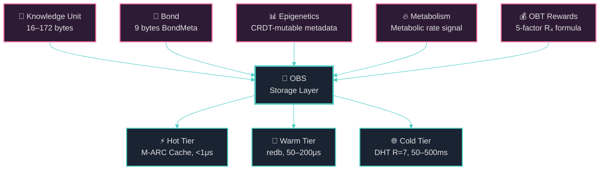
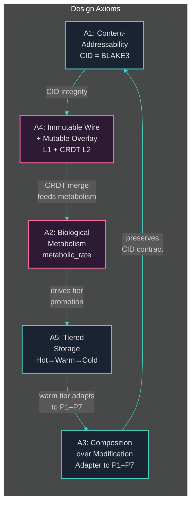
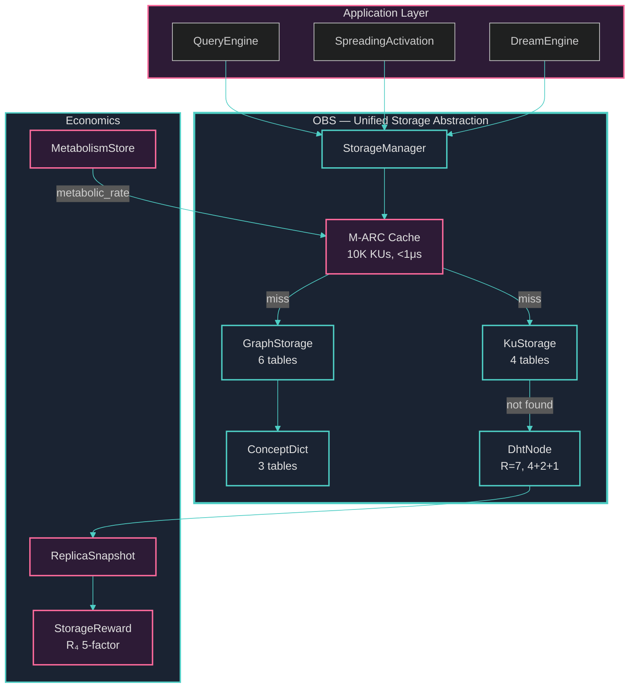

# Chapter 1: Introduction

> *"The art of progress is to preserve order amid change, and to preserve change amid order."*
> — Alfred North Whitehead

---

## §1.1 Motivation

Every knowledge graph system eventually confronts the same engineering challenge: **how do you persist the graph?** The question sounds trivial — databases have existed for half a century — until one examines the peculiar shape of knowledge graph data and realizes that no existing storage substrate was designed for it. This paper presents **OneBrain Storage (OBS)**, the persistence and distribution layer of the OneBrain decentralized knowledge network. OBS addresses a class of storage problems that arise specifically at the intersection of *ultra-small semantic objects*, *bio-inspired lifecycle management*, and *decentralized economic incentives* — a combination that, to our knowledge, no prior system has targeted.

The dominant paradigm in decentralized storage — exemplified by IPFS [1], Filecoin [2], Ethereum Swarm [3], and Arweave [4] — assumes large objects. IPFS organizes content into 256KB DAG blocks. Filecoin seals data into 32GiB sectors and requires Proof-of-Replication over those sectors. Swarm chunks content into 4KB pieces. Even Ceramic Network [5], which targets mutable data streams, operates on event logs whose individual entries far exceed the kilobyte range. These design decisions are rational for their target workloads — file storage, media hosting, archival — but they create a fundamental mismatch when applied to knowledge graph atoms.

In OneBrain, the atomic unit of knowledge is the **Knowledge Unit (KU)** — a binary-encoded node containing a concept identifier, trust score, epistemic status, domain tags, and an optional embedding vector. A KU's **Core DNA** wire format ranges from 16 to 172 bytes. The edges between KUs — **Bonds** — are stored as 9-byte `BondMeta` records containing weight, creator, state, decay constant, and timestamp. These are not files; they are *semantic atoms*, each carrying rich metadata about its own reliability, lifecycle stage, and biological activity level.

Five properties distinguish OBS's storage workload from generic peer-to-peer file storage:

1. **Ultra-small objects.** At 16–172 bytes per KU and 9 bytes per Bond, OBS objects are 1,500× to 190,000,000× smaller than IPFS blocks (256KB) and Filecoin sectors (32GiB). Techniques designed for large objects — erasure coding, sector sealing, content-defined chunking — impose metadata overhead that exceeds the data itself. Pure replication wins: 7 replicas of a 172-byte KU cost 1,204 bytes total, less than a single TCP packet.

2. **Semantic metadata per object.** Every KU carries trust scores (`u16`), an epistemic status drawn from an 11-level ladder (`Hypothesis` → `Axiomatic`), domain classification codes, and CRDT-mutable epigenetic metadata. Every Bond carries a typed relation (one of 34 `RelationType` variants), a decay constant $\lambda$, and a lifecycle state (`Active` → `Weakened` → `Deprecated`). No existing storage system couples content addressing with this density of semantic annotation.

3. **Epistemic lifecycle.** Knowledge in OneBrain is not static. A KU begins as a `Hypothesis`, accumulates corroborations from peers, and may ascend through `Inferred`, `Corroborated`, `PeerReviewed`, and ultimately `Consensus`. Bonds strengthen through STDP-driven co-activation and weaken through exponential decay $w(t) = w_0 \cdot e^{-\lambda \cdot (t - t_0)}$. The storage layer must support this lifecycle natively — not as an afterthought bolted onto a flat key-value store, but as a first-class indexing and query dimension.

4. **Economic incentives.** OneBrain nodes earn **OBT** (OneBrain Token) rewards for storing and serving KUs. The reward function $R_4$ is a 5-factor formula incorporating rarity ($w_{\text{rarity}}$), trust ($w_{\text{trust}}$), age ($w_{\text{age}}$), metabolic rate ($w_{\text{metabolism}}$), and challenge success rate ($w_{\text{challenge}}$). Nodes prove possession through **PoS-KU** challenges — random byte-range extractions and field Merkle proofs — that require the actual wire bytes to be available, not merely a hash. The storage layer is thus deeply intertwined with the economic protocol.

5. **Bio-inspired design philosophy.** OneBrain's architecture draws systematically from neuroscience and biological systems. The `MetabolismStore` tracks per-KU metabolic rates (a composite signal of access frequency and recency with exponential decay); the `PheromoneTable` implements stigmergy for decentralized coordination; the `DreamEngine` performs offline consolidation and pruning. The storage layer must serve these biological mechanisms — feeding metabolic signals to the cache, evaporating pheromone trails, surfacing candidates for dream-cycle pruning — without imposing the overhead of general-purpose database abstractions.

---

## §1.2 Problem Statement

We identify five specific deficiencies in existing storage systems that motivate the design of OBS. Each deficiency is grounded in a concrete architectural mismatch between the requirements of a knowledge graph substrate and the assumptions of prior art.

**D1 (Size Mismatch).** Existing peer-to-peer storage systems are designed for large objects. IPFS segments content into 256KB UnixFS blocks and constructs Merkle DAGs over them; Filecoin requires miners to seal data into 32GiB sectors and produce Proofs-of-Replication (PoRep) over the sealed sectors [2]; Swarm divides data into 4KB chunks and arranges them into a balanced hash tree [3]. These chunking, sealing, and tree-construction overheads are amortized over large payloads but become pathological for objects of 16–172 bytes. A PoRep proof for a single 172-byte KU would cost orders of magnitude more computation than the data is worth. Erasure coding — the standard technique for space-efficient redundancy — imposes per-fragment metadata (fragment index, parity checksums, codec identifier) that exceeds the KU payload itself. We require a storage abstraction optimized for objects where the metadata-to-data ratio is inverted: the semantic annotations *surrounding* a KU are more voluminous than the KU content itself.

**D2 (Semantic Blindness).** No existing content-addressed storage system couples the storage layer with semantic knowledge typing, trust metadata, or epistemic lifecycle management. IPFS provides raw content addressing via CIDv1 multihashes; Filecoin adds economic incentives; Swarm adds feed-based mutability. None of them can answer the query "retrieve all KUs with `epistemic_status ≥ Corroborated` and `trust_score > 800` whose bonds have `metabolic_rate > 0.3`" at the storage layer. In current practice, such queries require loading *all* objects into application memory and filtering — an approach that does not scale beyond a few thousand KUs. OBS must provide **composite-key indexes** that encode semantic dimensions (trust, concept, bond state, weight, timestamp) directly into the storage key space, enabling $O(1)$ prefix-scan access to any semantic slice of the graph.

**D3 (Static Caching).** Traditional caching algorithms — LRU, LFU, and their variants — operate on a narrow signal: recency (LRU) or frequency (LFU). These algorithms are vulnerable to **scan pollution**: a single full-graph traversal (such as DreamEngine's `run_dream_cycle()` or ConsolidationEngine's batch scoring) will flush the working set of a hot cache, evicting genuinely active KUs in favor of cold nodes that happened to be touched during the scan. OneBrain's `MetabolismStore` already computes a `metabolic_rate` per KU — a bio-inspired signal that combines access frequency, recency, and exponential decay into a single scalar — but no existing caching algorithm can consume this signal. We require a **metabolism-aware cache** that uses `metabolic_rate` as the eviction weight, providing natural scan resistance because batch-scanned KUs have low metabolic rates and will not displace genuinely hot entries.

**D4 (Rigid Schemas).** In a content-addressed system, the CID of an object is the BLAKE3 hash of its wire bytes: $\text{CID} = \text{BLAKE3}(\text{wire\_bytes})$. This means that any change to the wire format — adding a field, widening a type, reordering bytes — produces a *different CID*. Conventional schema migration (ALTER TABLE, lazy rewriting) is therefore **destructive to the reference graph**: every Bond pointing to the old CID becomes a dangling reference. This constraint is unique to content-addressed knowledge graphs and is not addressed by any existing migration framework. We require a migration strategy that respects the immutability of Layer 1 wire bytes while allowing Layer 2 metadata (Epigenetics, BondMeta) to evolve through explicit schema versioning and CRDT-compatible format extension.

**D5 (Uniform Replication).** Standard Kademlia DHT replication stores $K$ copies of every object on the $K$ closest nodes by XOR distance [6]. This approach ignores the heterogeneous infrastructure of a real-world peer-to-peer network: mobile devices (T0 Leaf) go offline unpredictably; home PCs (T1 Contributor) have variable uptime; servers (T2+ SuperPeers) offer stable, high-capacity storage. Uniform replication means that all 7 replicas of a KU may land on T0/T1 nodes that simultaneously go offline during a network disruption, while T2+ backbone nodes sit idle with spare capacity. We require a **tier-aware placement strategy** that distributes replicas across infrastructure tiers — guaranteeing at least one replica on a T2+ SuperPeer and at least one on a separate subnet — to survive correlated failures in any single tier.

### Table 1: Comparison of Decentralized Storage Systems Across 12 Dimensions

| Dimension | IPFS | Filecoin | Swarm | Ceramic | Arweave | Sia | **OBS** |
|:---|:---:|:---:|:---:|:---:|:---:|:---:|:---:|
| **Object size** | 256KB blocks | 32GiB sectors | 4KB chunks | Variable streams | Variable | 40MB sectors | **16–172 B** |
| **Content addressing** | ✓ (CIDv1) | ✓ (CIDv1) | ✓ (BMT hash) | ✓ (StreamID) | ✓ (SHA-256) | ✓ (Merkle) | **✓ (BLAKE3)** |
| **Semantic indexing** | ✗ | ✗ | ✗ | ✗ | ✗ | ✗ | **✓** |
| **Trust metadata** | ✗ | ✗ | ✗ | ✗ | ✗ | ✗ | **✓** |
| **Epistemic lifecycle** | ✗ | ✗ | ✗ | ✗ | ✗ | ✗ | **✓** |
| **Bio-inspired caching** | ✗ | ✗ | ✗ | ✗ | ✗ | ✗ | **✓** |
| **CRDT consistency** | ✗ | ✗ | ✗ | ⚠️ | ✗ | ✗ | **✓** |
| **Schema migration** | ✗ | ✗ | ✗ | ⚠️ | ✗ | ✗ | **✓** |
| **Tier-aware placement** | ✗ | ✗ | ⚠️ | ✗ | ✗ | ✗ | **✓** |
| **Stigmergy repair** | ✗ | ✗ | ✗ | ✗ | ✗ | ✗ | **✓** |
| **Storage rewards** | ✗ | ✓ (FIL) | ✓ (BZZ) | ✗ | ✓ (AR) | ✓ (SC) | **✓ (OBT)** |
| **Pure Rust** | ✗ (Go) | ✗ (Go/Rust) | ✗ (Go) | ✗ (JS/Rust) | ✗ (Erlang) | ✗ (Go) | **✓** |

*Legend: ✓ = full support; ⚠️ = partial/limited support; ✗ = not supported.*

> **Architectural Note.** We assign Ceramic ⚠️ for "CRDT consistency" because its event-log streams provide a form of eventual consistency, but without the full CRDT type suite (GCounter, PNCounter, LWWRegister, ORSet) that OBS deploys per epigenetic field. Swarm receives ⚠️ for "Tier-aware placement" because its neighborhood-based replication provides implicit locality awareness, but without the explicit 7-tier fitness model and 4+2+1 placement rule that OBS implements. Ceramic receives ⚠️ for "Schema migration" because its model-based streams support schema evolution, but without the content-addressed immutability constraint that makes OBS's approach novel.

**Observation 1: No existing system addresses semantic storage natively.** The five dimensions most central to our contribution — Semantic Indexing, Trust Metadata, Epistemic Lifecycle, Bio-Inspired Caching, and Stigmergy Repair — receive ✗ across all six comparison systems. This is not a minor feature gap; it represents an architectural blind spot. Existing decentralized storage systems treat stored objects as opaque byte sequences with no semantic structure. OBS treats every stored object as a *typed knowledge artifact* whose metadata participates in storage decisions — caching, placement, replication priority, garbage collection, and reward computation.

**Observation 2: Object size assumptions create fundamental design constraints.** The smallest native object in the comparison systems is Swarm's 4KB chunk — still 23× larger than a maximum-size KU. This size difference is not merely quantitative; it is *qualitative*. At 172 bytes, erasure coding adds more overhead than it saves. Proof-of-Replication (Filecoin) is computationally disproportionate. Content-defined chunking (Rabin fingerprinting) has no splits to find. The entire optimization landscape shifts when objects are smaller than a cache line.

---

## §1.3 Design Principles

We formalize five axioms that constrain OBS's design space and resolve engineering trade-offs. These axioms emerged from the deficiencies identified in §1.2 and from the bio-inspired philosophy of the broader OneBrain system.

> **Axiom A1 (Content-Addressability).** Every KU is identified by a 32-byte BLAKE3 hash of its Core DNA wire bytes: $\text{CID} = \text{BLAKE3}(\text{wire\_bytes})$. This CID is the *sole primary key* across all storage tiers — hot cache, warm disk, cold DHT. Content addressing provides automatic deduplication (two identical KUs produce the same CID), trivial integrity verification (recompute the hash and compare), and location-independent retrieval (any node holding the bytes can serve any CID). We adopt BLAKE3 over SHA-256 for its 3–4× throughput advantage on modern hardware [7] and its tree-hashing mode that enables incremental verification — though at 172-byte payloads, the absolute difference is negligible.

> **Axiom A2 (Biological Metabolism).** The `metabolic_rate` of a KU — a scalar $m \in [0.0, 1.0]$ computed by the `MetabolismStore` via exponential-decay-weighted access history — is the *primary signal* for storage lifecycle decisions. High-metabolism KUs are promoted to the hot cache (M-ARC, §5); low-metabolism KUs are candidates for garbage collection (`gc_dead()` removes entries with zero engagement after 1 year); storage rewards (R₄) incorporate `w_{\text{metabolism}}` to incentivize nodes that serve actively-accessed KUs. This axiom replaces the static recency/frequency signals of traditional caching with a biologically-grounded activity metric that naturally integrates decay, corroboration, and query patterns.

> **Axiom A3 (Composition over Modification).** OBS is designed as a **composition layer** that adapts to pillars P1 (KU Core), P2 (OBP Network), P3 (KQL Query), P4 (PoK Consensus), P5 (OBT Economics), P6 (OBKG Knowledge Graph), and P7 (Bio Mechanisms) — without modifying their codebases. This is not merely an architectural preference; it is a *survival constraint*. The foundation pillars are mature, well-tested, and depended upon by multiple subsystems. OBS exposes its own API surface — `KuStorage`, `GraphStorage`, `MetabolismArcCache` — that delegates to P1–P7 through well-defined adapter interfaces. The adapter pattern ensures that a change in Core DNA wire format (P1) is absorbed by the OBS serialization layer without cascading through the query engine (P3) or the economic protocol (P5).

> **Axiom A4 (Immutable Wire + Mutable Overlay).** OBS enforces a strict two-layer data model. **Layer 1 (Core DNA)** is immutable: once a KU's wire bytes are written and its CID computed, those bytes are never modified. Any "update" to a KU produces a new CID — a new identity. **Layer 2 (Epigenetics)** is mutable: trust scores, metabolic rates, bond lists, epistemic status, and domain codes evolve over time through CRDT merge operations. This separation resolves Deficiency D4 by confining all schema evolution to Layer 2 (where CID stability is not required) while guaranteeing that Layer 1 references remain valid indefinitely. The five CRDT types — GCounter (corroboration), PNCounter (trust), LWWRegister (epistemic status), ORSet (domains, bonds), and VectorClock (causal ordering) — provide **Strong Eventual Consistency (SEC)** for Layer 2 across all replicas.

> **Axiom A5 (Tiered Storage).** OBS organizes data into three tiers with latency targets spanning six orders of magnitude: **Hot** (M-ARC in-memory cache, ~10,000 KU capacity, <1μs access, ~7MB footprint), **Warm** (redb B+tree on local disk, ~1M KU capacity, 50–200μs access via memory-mapped I/O), and **Cold** (DHT network with R=7 replication, unbounded capacity, 50–500ms access via S/Kademlia routing). Promotion and demotion between tiers is driven by Axiom A2 — metabolic rate determines which KUs deserve the fastest access path. This tiered architecture addresses Deficiency D5 by placing replicas across infrastructure tiers (T0 Leaf through T6 Global Backbone) rather than uniformly across XOR-closest nodes.

These five axioms interact constructively. Axiom A1 (Content-Addressability) creates the immutability constraint that motivates Axiom A4 (Immutable Wire + Mutable Overlay) — because CID = hash(bytes), any byte change destroys reference integrity. Axiom A2 (Biological Metabolism) provides the decision signal that Axiom A5 (Tiered Storage) consumes — without a per-object activity metric, tiered placement degenerates to LRU. Axiom A3 (Composition over Modification) enables safe evolution of Layer 2 schemas without risking Layer 1 CID stability — the adapter boundary absorbs format changes. Together, the five axioms form a coherent design philosophy: *content-addressed immutable atoms, overlaid with CRDT-mutable semantics, cached by biological activity, distributed across heterogeneous tiers, composed without modifying the foundation pillars.*

---

## §1.4 Contributions

We summarize our seven principal contributions:

1. **M-ARC: Metabolism-Aware Adaptive Replacement Cache (§5).** We introduce M-ARC, a variant of Megiddo and Modha's ARC algorithm [8] that replaces the least-recently-used eviction policy within each ARC list with a *lowest-metabolic-rate* eviction policy. M-ARC consumes the `metabolic_rate` signal from OneBrain's `MetabolismStore` — a bio-inspired activity metric combining access frequency and exponential decay — to make eviction decisions that are naturally resistant to scan pollution. When DreamEngine or ConsolidationEngine performs a full-graph traversal, the scanned KUs have low metabolic rates (they were not "actively used," merely enumerated) and are therefore not promoted over genuinely hot entries. At a capacity of 10,000 KUs, M-ARC occupies approximately 7MB of memory and provides sub-microsecond access to the hottest fraction of the knowledge graph.

2. **Dual-Layer Consistency Model (§3, §6).** We formalize a two-layer consistency model that exploits the immutability of content-addressed data. Layer 1 (Core DNA wire bytes) requires *no consistency protocol* — any copy is authoritative because $\text{BLAKE3}(\text{bytes}) = \text{CID}$ is a self-certifying verification. Layer 2 (Epigenetics) achieves **Strong Eventual Consistency (SEC)** through five purpose-selected CRDT types: GCounter for corroboration counts, PNCounter for trust scores, LWWRegister for epistemic status, ORSet for domain codes and bond sets, and VectorClock for causal ordering. This combination eliminates the need for quorum reads or primary-copy protocols, reducing consistency overhead to delta-state gossip messages (existing message types 0x60–0x63) that converge within 2–3 gossip rounds (~30–60 seconds).

3. **Tier-Aware Replica Placement with 4+2+1 Rule (§6).** We propose a placement strategy for R=7 replication that distributes replicas across three categories: 4 primary replicas on the K-closest nodes by XOR distance (preserving Kademlia lookup invariants), 2 tier-anchored replicas on T2+ SuperPeer and T3+ infrastructure nodes (ensuring availability during leaf-tier churn), and 1 diversity replica on a randomly-selected node outside the /24 subnet of all other replicas (protecting against network partitions). Selection within each category prioritizes fitness score, uptime history, round-trip time, and available storage capacity. The total storage cost per KU across 7 replicas is 1,204 bytes — negligible bandwidth and storage overhead.

4. **Content-Addressed Schema Migration (§4).** We present a migration framework that respects the fundamental constraint of content-addressed storage: $\text{CID} = \text{BLAKE3}(\text{wire\_bytes})$ means that wire format changes are *identity-destroying*. Our approach never migrates Layer 1 wire bytes. Instead, the Core DNA decoder supports multi-version dispatch (current version: v1, encoded in 3 bits of the `VER_META` byte), reading any historical format and producing a canonical in-memory representation. Layer 2 schemas evolve through a `_schema_meta` table in each redb database file, with a sequential migration runner that applies transformations within a single write transaction. This approach preserves all existing CID references while enabling schema evolution for mutable metadata.

5. **6-Table Composite-Key Graph Index with O(1) Prefix-Scan (§4, §8).** We design a 6-table index layout in redb that encodes the five most common graph query dimensions — outgoing edges, incoming edges, relation type, bond state, weight, and timestamp — as big-endian composite keys. Each key is a byte-level concatenation (e.g., `edges_out` key = `src(32B) + rel(1B) + tgt(32B) = 65B`) that enables redb's B+tree to satisfy range queries as prefix scans without deserialization. The `index_state` table (key: `state(1B) + src(32B) + rel(1B) + tgt(32B) = 66B`) enables single-scan retrieval of all `Active`, `Weakened`, or `Deprecated` bonds — a query pattern that occurs on every spreading activation step. All 6 tables are updated atomically within a single redb write transaction, guaranteeing index consistency without application-level locking.

6. **Stigmergy-Driven Repair (§6).** We introduce a self-healing replication protocol that uses the existing `PheromoneTable` — originally designed for query routing — to detect and repair under-replicated KUs. Each epoch, the ReplicaTracker identifies CIDs with `actual_replicas < MIN_HEALTHY_REPLICAS (= 4)` and deposits a "repair pheromone" whose intensity is proportional to the deficit. Neighboring nodes sense the pheromone gradient and compete to store the under-replicated KU, reinforcing the pheromone trail upon success. High-metabolism CIDs generate stronger base pheromone, ensuring that actively-accessed knowledge is repaired faster than dormant data. This mechanism operates without centralized coordination — repair emerges from local interactions, mirroring the stigmergic communication of social insects.

7. **Unified Storage Abstraction (§4).** We consolidate all persistent state — 4 `KuStorage` tables, 6 `GraphStorage` tables, 3 `PersistentConceptDict` tables, plus 3 new tables for DHT entry persistence, replica metadata, and schema versioning — into a unified 16-table redb architecture with centralized version tracking. The abstraction provides a single `StorageManager` entry point that encapsulates all tier interactions (hot, warm, cold), exposes batch APIs for bulk ingestion, and enforces the Immutable Wire + Mutable Overlay axiom (A4) at the type-system level. The implementation is pure Rust — 9 modules, 6,021 lines of code, 125 tests — with zero C dependencies, enabling easy cross-compilation to all OneBrain target platforms.

### Table 2: OBS Module Architecture

| Module | LOC | Tests | Backend | Primary Responsibility |
|:---|:---:|:---:|:---|:---|
| `KuStorage` | 704 | 12 | redb (4 tables) | KU wire bytes + Epigenetics JSON |
| `GraphStorage` | 1,284 | 27 | redb (6 tables) | Bond edges + 4 secondary indexes |
| `PersistentConceptDict` | 422 | 7 | redb (3 tables) | Concept name↔ID bilingual mapping |
| `MetabolismStore` | 283 | 6 | In-memory (CRDT) | Per-KU metabolic rate tracking |
| `DhtNode` | 818 | 14 | In-memory → redb | DHT routing + key-value store |
| `QueryCache` | 351 | 10 | In-memory (LRU) | Query result caching |
| `StorageReward` | 676 | 14 | — | R₄ 5-factor reward computation |
| `ReplicaSnapshot` | 493 | 8 | — | DHT↔OBT bridge |
| `M-ARC Cache` | 990 | 27 | In-memory (ARC) | Metabolism-aware KU content cache |
| **Total** | **6,021** | **125** | **16 redb tables** | |

---

## §1.5 Paper Organization

The remainder of this paper is organized as follows:

- **§2 (Related Work)** surveys the landscape of decentralized storage systems (IPFS, Filecoin, Swarm, Arweave, Sia), embedded database engines (redb, RocksDB, LMDB, SQLite), bio-inspired caching algorithms, and content-addressed schema evolution, positioning OBS relative to prior art.

- **§3 (Two-Layer Data Model)** formalizes the Immutable Wire + Mutable Overlay architecture, detailing Core DNA v1 wire format encoding, the 5 CRDT types deployed for Layer 2 epigenetics, and the delta-state gossip protocol for cross-replica convergence.

- **§4 (Persistent Storage Architecture)** presents the 16-table redb layout — 4 `KuStorage` tables, 6 `GraphStorage` tables, 3 `PersistentConceptDict` tables, and 3 infrastructure tables — with composite-key design, atomic multi-table writes, and the `_schema_meta` migration framework.

- **§5 (Metabolism-Aware Caching)** describes M-ARC — the metabolism-aware ARC cache — including its dual-list structure, metabolic-rate eviction policy, 1-hop selective prefetch with bond-weight gating, and gossip-based invalidation protocol.

- **§6 (Distributed Replication and Repair)** details the R=7 dual-K architecture (routing K=20, storage R=7), the 4+2+1 tier-aware placement rule, CRDT-based eventual consistency for Layer 2, stigmergy-driven proactive repair, and the anti-hoarding/anti-freeloading mechanisms.

- **§7 (Storage Economics)** presents the R₄ 5-factor storage reward formula, PoS-KU challenge types (FullHash, ByteRange, FieldExtract), and the integration with the OBT token protocol.

- **§8 (Cross-Pillar Integration)** explains how OBS composes with the seven OneBrain pillars (P1–P7) through the adapter pattern, with concrete API mappings and dependency flow analysis.

- **§9 (Evaluation)** presents our experimental evaluation: redb throughput benchmarks (200K–500K reads/sec for 32–69B keys), M-ARC hit rates under mixed workloads, replication convergence times, stigmergy repair latency, and schema migration correctness verification across 125 unit tests.

- **§10 (Conclusion and Future Work)** summarizes our contributions and outlines future directions including async I/O wrappers, media/blob storage integration, IPFS CIDv1 interoperability, and multi-device synchronization.

---

## References

[1] J. Benet, "IPFS — Content addressed, versioned, P2P file system," *arXiv preprint arXiv:1407.3561*, 2014.

[2] Protocol Labs, "Filecoin: A decentralized storage network," *Filecoin Whitepaper*, 2017.

[3] V. Trón, *The Book of Swarm: Storage and Communication Infrastructure for Self-Sovereign Digital Society Back-End Stack for the Decentralised Web*. Ethereum Foundation, 2020.

[4] S. Williams, V. Diordiiev, L. Berman, and I. Raybould, "Arweave: A protocol for economically sustainable information permanence," *Arweave Yellow Paper*, 2019.

[5] Ceramic Network, "Ceramic protocol specification," *Ceramic Documentation*, 2023. [Online]. Available: https://ceramic.network

[6] P. Maymounkov and D. Mazières, "Kademlia: A peer-to-peer information system based on the XOR metric," in *Proceedings of the 1st International Workshop on Peer-to-Peer Systems (IPTPS)*, 2002, pp. 53–65.

[7] J. O'Connor, J.-P. Aumasson, S. Neves, and Z. Wilcox-O'Hearn, "BLAKE3: One function, fast everywhere," *BLAKE3 Specification*, 2020. [Online]. Available: https://github.com/BLAKE3-team/BLAKE3-specs

[8] N. Megiddo and D. S. Modha, "ARC: A self-tuning, low overhead replacement cache," in *Proceedings of the 2nd USENIX Conference on File and Storage Technologies (FAST)*, 2003, pp. 115–130.

[9] B. Baumgart and S. Mies, "S/Kademlia: A practicable approach towards secure key-based routing," in *Proceedings of the International Conference on Parallel and Distributed Systems*, 2007, pp. 1–8.

[10] M. Shapiro, N. Preguiça, C. Baquero, and M. Zawirski, "Conflict-free replicated data types," in *Proceedings of the 13th International Symposium on Stabilization, Safety, and Security of Distributed Systems (SSS)*, 2011, pp. 386–400.

[11] C. Grönlund, "redb: A simple, portable, high-performance, ACID, embedded key-value store," *GitHub Repository*, 2023. [Online]. Available: https://github.com/cberner/redb

[12] D. O. Hebb, *The Organization of Behavior: A Neuropsychological Theory*. New York: Wiley, 1949.

[13] P.-P. Grassé, "La reconstruction du nid et les coordinations interindividuelles chez *Bellicositermes natalensis* et *Cubitermes* sp. La théorie de la stigmergie," *Insectes Sociaux*, vol. 6, no. 1, pp. 41–80, 1959.
