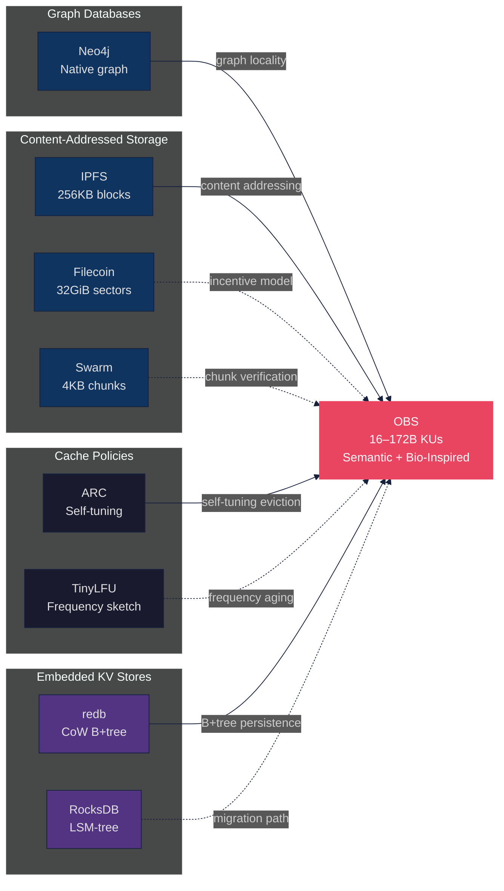

# Chapter 2: Related Work

> *"The question is not whether a system can store data, but whether it can store **meaning**."*
> — Adapted from Tim Berners-Lee, *Weaving the Web* (1999)

The OneBrain Storage (OBS) layer operates at the intersection of several mature and rapidly evolving research areas: content-addressed distributed storage, embedded key-value engines, cache replacement theory, knowledge graph persistence, replication strategies, and schema evolution under content addressing. In this chapter, we survey the foundational and contemporary systems that inform each dimension of the OBS design, identify critical gaps in existing approaches, and position OBS as a unified synthesis that addresses limitations no single prior system has resolved.

---

## §2.1 Content-Addressed Storage Systems

Content addressing — identifying data by a cryptographic hash of its contents rather than by its location — has become the dominant paradigm for decentralized storage. We survey six systems that represent the state of the art across different design philosophies.

**InterPlanetary File System (IPFS).** Benet [1] proposed IPFS in 2014 as a content-addressed, peer-to-peer hypermedia distribution protocol. IPFS organizes data into Merkle DAG structures where each node is identified by a Content Identifier (CID) — a self-describing multihash envelope wrapping the cryptographic digest. The default chunking strategy splits files into 256KB blocks, each hashed independently and linked via a UnixFS DAG. IPFS has achieved significant adoption, with over 200,000 active nodes and petabytes of stored content as of 2024 [2]. However, IPFS operates at the *storage layer* and provides no semantic understanding of the data it hosts: a CID identifies a blob of bytes, not a knowledge unit with typed relationships, epistemic metadata, or trust annotations. Furthermore, IPFS provides no persistence guarantee — data disappears when no node pins it. The lack of intrinsic incentive mechanisms means that data availability depends entirely on altruistic pinning. **Limitation**: IPFS cannot express or index the *meaning* of what it stores, and its 256KB minimum block granularity is 1,500× larger than a typical OBS Knowledge Unit (172 bytes). OBS addresses both gaps: it stores semantically typed Knowledge Units as first-class objects and uses a bio-inspired metabolism system (§3.5) to prioritize replication of high-value content without relying on explicit pinning.

**Filecoin.** Protocol Labs' Filecoin [3] extends IPFS with cryptoeconomic incentives for durable storage. Storage miners commit capacity in 32 GiB sectors, each sealed through a computationally expensive Proof-of-Replication (PoRep) ceremony that takes 1.5–3 hours per sector. Ongoing storage is verified through Proof-of-Spacetime (PoSt), requiring periodic cryptographic proofs that the sealed data remains intact. Filecoin's economic model has successfully incentivized over 20 EiB of storage capacity as of 2025. **Limitation**: The 32 GiB sector minimum creates a $186{,}000{,}000\times$ mismatch with OBS's 16–172 byte Knowledge Units. Sealing a 172-byte KU into a 32 GiB sector is computationally absurd. Even batching millions of KUs into a sector introduces 1+ hour retrieval latency (unsealing), which is incompatible with real-time knowledge queries. OBS's PoS-KU (Proof-of-Storage Knowledge Unit) challenges — based on BLAKE3 byte-range extraction and field-level Merkle proofs — provide storage verification tailored to ultra-small objects with sub-millisecond challenge-response times.

**Arweave.** The Arweave protocol [4] pioneered the "pay once, store forever" model through a cryptoeconomic endowment: approximately 95% of the storage fee is placed into a reserve that funds miners for 200+ years. Arweave's Succinct Proofs of Random Access (SPoRA) consensus mechanism randomly samples stored data to verify miner contributions. At approximately \$3,500 per TB (2025 pricing), Arweave is economically viable for permanent archival but prohibitively expensive for active, mutable knowledge systems. **Limitation**: Arweave's write-once immutability is semantically aligned with "Established" knowledge (epistemic status $\geq$ FULL in OBS's lifecycle model) but is fundamentally incompatible with the mutable Layer 2 epigenetics — trust scores, metabolism rates, and bond weights — that evolve continuously in OBS. We position Arweave as an optional archival bridge for consolidated knowledge rather than a primary storage layer.

**Ethereum Swarm.** The Swarm protocol [5] (developed under the Ethereum Foundation) chunks data into 4KB segments organized in a binary Merkle tree. Storage is incentivized through "postage stamps" — prepaid BZZ tokens that fund chunk storage for a specified duration. Swarm uses proximity-based neighborhood replication where nodes in the same address-space neighborhood collectively guarantee chunk availability. **Limitation**: Swarm's 4KB chunk granularity, while closer to OBS's KU sizes, still imposes 23× overhead for a 172-byte KU. The postage stamp model couples storage duration to upfront payment, creating economic friction for knowledge that gains value over time — precisely the opposite of OBS's metabolism-aware approach where storage priority emerges from access patterns.

**Storj.** Wilkinson et al. [6] designed Storj as an enterprise-grade decentralized storage layer using Reed-Solomon erasure coding with an $(29, 80)$ configuration: files are split into 80 pieces, any 29 of which suffice for reconstruction (2.7× storage overhead). Storj's satellite nodes coordinate storage placement and repair, providing deterministic data availability guarantees. **Limitation**: The satellite coordination model introduces centralization in what is nominally a decentralized system. Storj's erasure coding metadata — fragment identifiers, parity checksums, and satellite routing tables — would exceed the data payload for OBS's ultra-small Knowledge Units, where the overhead of EC metadata alone ($\geq$ 200 bytes) surpasses the KU content (172 bytes). Pure replication at $R = 7$ yields only $7 \times 172 = 1{,}204$ bytes total network cost — less than a single Reed-Solomon parity shard.

**Sia.** Vorick and Champine [7] proposed Sia as a blockchain-secured storage marketplace with Reed-Solomon $(10, 30)$ erasure coding and Merkle proof-based storage verification. Storage contracts are enforced on the Sia blockchain with collateral requirements for hosts. **Limitation**: Like Filecoin, Sia's contract-based model optimizes for large file storage with long-duration guarantees, not for the fine-grained, metabolism-driven replication policies that OBS requires.

**Table 1.** Comparison of content-addressed storage systems across twelve design dimensions. OBS (rightmost) is the proposed system.

| Dimension | IPFS [1] | Filecoin [3] | Arweave [4] | Swarm [5] | Storj [6] | Sia [7] | Ceramic [8] | **OBS (Ours)** |
|---|---|---|---|---|---|---|---|---|
| **Object granularity** | 256KB blocks | 32 GiB sectors | Unlimited | 4KB chunks | Variable shards | Variable | Streams | **16–172 B KUs** |
| **Content-addressed** | ✓ CIDv1 | ✓ CIDv1 | ✓ TX hash | ✓ Swarm hash | ✓ Hash | ✓ Merkle | ✓ StreamID | **✓ BLAKE3 CID** |
| **Semantic metadata** | ✗ | ✗ | ✗ | ✗ | ✗ | ✗ | ⚠️ Schema | **✓ Typed KU genes** |
| **Trust model** | ✗ None | ⚠️ Collateral | ✗ None | ⚠️ Stamps | ⚠️ Satellite | ⚠️ Collateral | ⚠️ DID | **✓ EigenTrust CRDT** |
| **CRDT consistency** | ✗ | ✗ | ✗ | ✗ | ✗ | ✗ | ✓ Event log | **✓ SEC (4 CRDT types)** |
| **Storage incentives** | ✗ Bitswap | ✓ FIL | ✓ AR endowment | ✓ BZZ stamps | ✓ STORJ | ✓ SC | ✗ | **✓ OBT 5-factor** |
| **Bio-inspired** | ✗ | ✗ | ✗ | ✗ | ✗ | ✗ | ✗ | **✓ Metabolism + stigmergy** |
| **Implementation lang.** | Go/JS | Go/Rust | Erlang | Go | Go | Go | JS/Rust | **Rust (pure)** |
| **Cache-aware** | ⚠️ Blockstore | ✗ | ✗ | ✗ | ✗ | ✗ | ✗ | **✓ M-ARC (§3.4)** |
| **Replication strategy** | Provider records | PoRep sealed | Endowment | Neighborhood | RS(29,80) | RS(10,30) | Stream sync | **R=7 tier-aware** |
| **Schema migration** | ✗ | ✗ | ✗ | ✗ | ✗ | ✗ | ⚠️ Model | **✓ CID-stable evolution** |
| **Graph index** | ✗ | ✗ | ✗ | ✗ | ✗ | ✗ | ✗ | **✓ 6-table composite** |

*Legend*: ✓ = natively supported, ⚠️ = partial or external, ✗ = not supported.

**Synthesis.** Existing content-addressed storage systems uniformly treat stored data as opaque byte sequences. They provide no mechanism to express the *semantic type*, *epistemic confidence*, or *relational structure* of stored objects. Furthermore, systems designed for large objects (Filecoin, Storj, Sia) impose erasure coding and sector-based overhead that is counterproductive for ultra-small Knowledge Units, while systems designed for smaller objects (IPFS, Swarm) lack intrinsic incentive alignment and bio-inspired adaptation. OBS occupies a unique niche: it stores *meaning-bearing*, *self-describing*, *metabolically active* Knowledge Units at a granularity ($16$–$172$ bytes) that is orders of magnitude smaller than any existing content-addressed system, with replication costs ($R = 7 \times 172\text{B} = 1.2\text{KB}$) that make full replication cheaper than the metadata overhead of erasure coding.

---

## §2.2 Embedded Key-Value Stores

The OBS persistence layer requires an embedded key-value store for local ACID storage of Knowledge Units, epigenetics metadata, and graph indices. We evaluate six engines against OBS's workload profile: read-heavy (10–100 reads per write), small keys (32–69 bytes composite), tiny values (9–172 bytes), single-writer with concurrent readers, and mandatory crash safety.

**redb.** Berner's redb [9] is a pure-Rust embedded database built on a Copy-on-Write (CoW) B+tree with Multi-Version Concurrency Control (MVCC). It provides full ACID compliance with crash safety guaranteed by CoW semantics — no write-ahead log (WAL) is needed, eliminating an entire class of corruption scenarios. The type-safe generic table API enables compile-time key/value type checking, reducing runtime errors. redb achieves approximately 200K–500K random reads per second and 50K–150K random writes per second for small values on modern hardware [10]. **Limitation**: redb restricts access to a single process and provides no built-in compression or concurrent write support. However, for OBS's single-writer model with sub-100μs operation latency, these limitations are non-issues.

**RocksDB.** Facebook's RocksDB [11] is the dominant LSM-tree (Log-Structured Merge-tree) key-value store, written in C++ with Rust bindings via `rust-rocksdb`. LSM trees optimize for write throughput by buffering writes in a sorted memtable and flushing to sorted SSTable files on disk, with background compaction merging levels. RocksDB achieves 200K–800K writes per second — significantly exceeding redb — and provides built-in LZ4/Snappy/Zstd compression. **Limitation**: RocksDB introduces a C++ toolchain dependency that complicates cross-compilation (a critical requirement for OBS's multi-platform deployment). Its 100+ configuration knobs create operational complexity disproportionate to OBS's simple workload. Furthermore, LSM-tree read amplification ($1$–$N$ levels per read) penalizes the read-heavy pattern that dominates OBS queries, making the write-optimized architecture a poor fit.

**LMDB.** Symas' Lightning Memory-Mapped Database [12] uses a CoW B+tree architecture similar to redb but implemented in C with Rust bindings via the `heed` crate. LMDB achieves exceptional read throughput (300K–800K reads/sec) through direct memory-mapped access, and supports multi-process concurrent reading with lock-free read transactions. **Limitation**: LMDB requires C bindings, complicating pure-Rust deployment. Its CoW approach can waste disk space through page fragmentation, and the memory-mapped design means that large databases consume proportional virtual address space — a concern for 32-bit embedded targets.

**SQLite.** Hipp's SQLite [13] is the most widely deployed database engine in history, providing a full SQL interface over a B-tree storage engine with optional WAL mode for concurrent readers. **Limitation**: The SQL parsing and query planning overhead adds 2–5× latency over direct key-value access for the simple point lookups and range scans that dominate OBS's workload. The abstraction mismatch between SQL and byte-oriented composite keys introduces unnecessary complexity.

**sled.** The sled project [14] attempted to provide a modern, pure-Rust embedded database with a lock-free concurrent B+tree. **Limitation**: Development has stalled since 2023, with known data corruption issues reported in production workloads [15]. sled is no longer suitable for systems requiring durability guarantees.

**fjall.** The fjall project [16] provides a pure-Rust LSM-tree storage engine, reaching v3.0 in 2026 with active maintenance. It offers configurable compression and good write throughput (100K–500K writes/sec). **Limitation**: As an LSM-tree, fjall shares RocksDB's read amplification penalty for OBS's read-heavy workload, though it avoids the C++ dependency. We identify fjall as the primary migration target if OBS's write rate ever exceeds redb's capacity ($> 1{,}000$ sustained writes/sec).

**Table 2.** Embedded key-value store comparison for OBS's workload profile (small keys/values, read-heavy, single-writer).

| Engine | Reads/sec | Writes/sec | Range Scan | Language | Crash-Safe | Architecture |
|---|---|---|---|---|---|---|
| **redb** [9] | 200K–500K | 50K–150K | Excellent | Pure Rust | ✓ CoW | B+tree |
| RocksDB [11] | 100K–400K | 200K–800K | Good | C++ (bindings) | ✓ WAL | LSM-tree |
| LMDB [12] | 300K–800K | 50K–200K | Excellent | C (bindings) | ✓ CoW | B+tree |
| SQLite [13] | 50K–200K | 20K–80K | Good (SQL) | C (bindings) | ✓ WAL/Journal | B-tree |
| sled [14] | — | — | — | Pure Rust | ⚠️ Known issues | B+tree (lock-free) |
| fjall [16] | 150K–400K | 100K–500K | Good | Pure Rust | ✓ WAL | LSM-tree |

*Performance figures are approximate ranges from community benchmarks [10] on representative hardware with small key-value pairs (32–172 bytes) and fsync enabled.*

**Synthesis.** OBS's workload sits squarely in the B+tree sweet spot: read-heavy access patterns with low write rates and frequent range scans. B+tree engines provide $O(1)$ read amplification (each read touches exactly one path from root to leaf), compared to LSM-tree engines where reads may traverse $1$–$N$ levels. For OBS's current write rate of 1–10 KU/min, redb provides $> 300{,}000\times$ headroom. The pure-Rust implementation eliminates build-system complexity, and CoW crash safety provides the ACID guarantees required by OBS's storage reward continuity (where `epochs_stored` must survive restarts). OBS selects redb as its persistence engine, with fjall as a pre-validated migration path should future scaling demands exceed redb's write throughput ceiling.

---

## §2.3 Cache Replacement Policies

The OBS cache layer mediates between hot in-memory access ($< 1\mu\text{s}$), warm local disk ($50$–$200\mu\text{s}$), and cold network retrieval ($50$–$500\text{ms}$). The choice of cache replacement policy has outsized impact on knowledge graph query performance, as OBS workloads exhibit three distinct access patterns that stress conventional policies: (i) interactive queries with graph-locality correlation, (ii) batch scoring scans from the ConsolidationEngine, and (iii) temporal replay from the DreamEngine.

**LRU (Least Recently Used).** The classic LRU policy evicts the entry accessed least recently, assuming temporal locality: recently accessed items are likely to be accessed again. LRU is implementable in $O(1)$ using a doubly-linked list backed by a hash map. **Limitation**: LRU is *scan-vulnerable* — a single sequential traversal (e.g., ConsolidationEngine scoring all KUs) flushes the entire cache, evicting genuinely hot entries in favor of scan elements that will never be re-accessed. For knowledge graph workloads where batch operations coexist with interactive queries, this behavior is catastrophic.

**LFU (Least Frequently Used).** LFU evicts the entry with the lowest access frequency, capturing popularity rather than recency. **Limitation**: LFU counters accumulate monotonically, meaning historically popular entries can never be evicted even when their relevance has decayed. In OBS's knowledge lifecycle, a KU's importance changes over time — a KU that was intensely queried during initial validation may become irrelevant once superseded. LFU cannot capture this decay without manual counter reset, which introduces parameterization complexity.

**ARC (Adaptive Replacement Cache).** Megiddo and Modha [17] introduced ARC (USENIX FAST 2003) as a self-tuning cache that dynamically balances recency and frequency without manual parameter tuning. ARC maintains four lists: $T_1$ (recently accessed, one-hit wonders), $T_2$ (frequently accessed, confirmed hot), and ghost lists $B_1$, $B_2$ that track recently evicted entries' metadata. A self-tuning parameter $p$ controls the partition size between $T_1$ and $T_2$, adapting to the workload by observing ghost list hits: a hit in $B_1$ indicates recency should be prioritized (increase $p$), while a hit in $B_2$ favors frequency (decrease $p$). **Limitation**: ARC does not incorporate domain-specific signals beyond recency and frequency. For OBS, the `metabolic_rate` of a KU — computed from its interaction history with exponential decay ($t_{1/2} = 30$ days) — encodes a richer access-worthiness signal than either recency or frequency alone.

**TinyLFU.** Ben Manes [18] (2015) proposed TinyLFU as a frequency-based admission policy using a Count-Min Sketch to estimate access frequencies with bounded memory. TinyLFU is employed as the admission filter in Caffeine (Java) and `moka` (Rust), deciding whether a newly accessed item should replace an existing cache resident. The aging mechanism periodically halves all counters, preventing historical popularity from dominating. **Limitation**: TinyLFU's frequency sketch is a probabilistic structure with inherent false-positive rates. For OBS, the metabolism system already provides exact, decay-aware frequency tracking, making the sketch approximation unnecessary.

**CLOCK.** The CLOCK algorithm provides an efficient approximation of LRU using a circular buffer with reference bits, avoiding the per-access linked list manipulation of true LRU. **Limitation**: CLOCK inherits LRU's scan vulnerability in a weaker form and provides no frequency awareness.

**Table 3.** Cache replacement policy comparison across five dimensions critical to OBS's knowledge graph workload.

| Policy | Scan-Resistant | Frequency-Aware | Metabolism-Aware | Self-Tuning | Batch-Bypass |
|---|---|---|---|---|---|
| LRU | ✗ | ✗ | ✗ | ✗ | ✗ |
| LFU | ✓ | ✓ (no decay) | ✗ | ✗ | ✗ |
| ARC [17] | ✓ | ✓ | ✗ | ✓ | ✗ |
| TinyLFU [18] | ✓ | ✓ (sketch) | ✗ | ⚠️ Aging | ✗ |
| CLOCK | ⚠️ | ✗ | ✗ | ✗ | ✗ |
| **M-ARC (Ours)** | **✓** | **✓** | **✓** | **✓** | **✓** |

**Synthesis.** No existing cache replacement policy incorporates domain-specific knowledge about the semantic importance of cached objects. OBS introduces Metabolism-Aware ARC (M-ARC), which extends ARC's self-tuning dual-list architecture with two innovations: (i) eviction decisions are weighted by `metabolic_rate` — the bio-inspired energy signal that decays exponentially with disuse — rather than pure LRU ordering within $T_1$ and $T_2$; and (ii) batch operations (ConsolidationEngine scoring, DreamEngine replay) are explicitly routed to bypass the cache, preventing scan pollution without cache-level detection heuristics. The result is a cache that adapts not only to access patterns (as ARC does) but to the *biological vitality* of stored knowledge, keeping metabolically active KUs resident while allowing dormant knowledge to be evicted gracefully.

---

## §2.4 Knowledge Graph Storage

Knowledge graph databases provide the persistence and query infrastructure for graph-structured data. We survey the principal systems and assess their suitability for OBS's decentralized, embedded knowledge graph.

**Neo4j.** The Neo4j graph database [19] uses a native graph storage engine with index-free adjacency — each node physically stores pointers to its adjacent relationships, enabling $O(1)$ per-hop traversal regardless of graph size. Neo4j's Cypher query language provides expressive pattern matching, and its page cache clusters topologically related nodes on the same storage pages, achieving graph-locality-aware caching. As of 2025, Neo4j supports graphs with billions of nodes and relationships. **Limitation**: Neo4j is a centralized, server-based system with a Java runtime dependency. It cannot be embedded in a peer-to-peer node binary, and its client-server architecture requires network round-trips for every query. OBS requires an *embedded* graph index that runs within the same process as the DHT routing and metabolism systems, with zero network overhead for local traversal.

**TigerGraph.** TigerGraph [20] is a distributed, in-memory graph analytics platform optimized for deep-link analytics and OLAP-style graph queries. Its proprietary GSQL language and massively parallel processing engine achieve sub-second response times on graphs with hundreds of billions of edges. **Limitation**: TigerGraph is proprietary, cloud-deployed, and resource-intensive (requiring dedicated server clusters), placing it far outside the operational envelope of a peer-to-peer knowledge node that may run on a mobile device (Tier 0 Leaf) or home computer (Tier 1 Contributor).

**Amazon Neptune.** Neptune [21] is a fully managed graph database service supporting both property graph (Gremlin) and RDF (SPARQL) query models. Neptune provides high availability through multi-AZ replication within the AWS infrastructure. **Limitation**: Neptune is cloud-only, proprietary, and tightly coupled to the AWS ecosystem, fundamentally incompatible with OBS's decentralized architecture.

**JanusGraph.** JanusGraph [22] is an open-source, distributed graph database that plugs into various storage backends (Cassandra, HBase, BerkeleyDB) and indexing engines (Elasticsearch, Solr). Its storage-backend-agnostic architecture enables flexible deployment topologies. **Limitation**: JanusGraph's Java Virtual Machine (JVM) dependency and multi-component architecture (storage backend + indexing engine + graph server) introduce operational complexity and resource overhead inappropriate for an embedded peer-to-peer context.

**Synthesis.** All surveyed knowledge graph databases are designed for centralized or cloud-deployed architectures where graph storage and query processing occur on dedicated server infrastructure. None provides an embedded, single-binary graph storage engine suitable for peer-to-peer deployment. OBS addresses this gap with a 6-table composite index scheme in `redb` that provides efficient graph traversal through carefully designed composite keys:

```
edges_out:  [src(32B) + rel(1B) + tgt(32B)] → BondMeta(9B)   // Outgoing edges
edges_in:   [tgt(32B) + rel(1B) + src(32B)] → ∅              // Incoming index
edges_type: [rel(1B) + src(32B) + tgt(32B)] → ∅              // Type-first lookup
index_state:[state(1B) + src(32B) + rel(1B) + tgt(32B)] → ∅  // State filter
bond_weight:[weight(2B) + src(32B) + tgt(32B) + rel(1B)] → ∅ // Weight-sorted scan
edge_time:  [ts(4B) + src(32B) + tgt(32B) + rel(1B)] → ∅     // Temporal ordering
```

This design achieves the key benefit of index-free adjacency (constant-time neighbor traversal via range scans on composite keys) without requiring a separate graph engine, while leveraging redb's B+tree for sorted iteration across all six index dimensions.

---

## §2.5 Replication Strategies

Durable storage in a decentralized network requires redundancy sufficient to survive concurrent node failures, network partitions, and adversarial conditions. We survey three fundamental replication paradigms and analyze their applicability to OBS's unique object-size profile.

**Chain Replication.** Van Renesse and Schneider [23] proposed chain replication as a linearizable replication protocol where write operations flow through a chain of replicas (head → tail) while reads are served exclusively from the tail. This provides strong consistency with high throughput. **Limitation**: Chain replication requires a stable, ordered chain topology that is incompatible with the dynamic, churn-prone membership of a peer-to-peer network. The head node becomes a bottleneck for writes, and chain reconfiguration on node failure introduces latency proportional to chain length.

**Quorum Systems.** Gifford [24] introduced quorum-based replication with the constraint $R + W > N$, where $R$ is the read quorum, $W$ the write quorum, and $N$ the total replicas. Dynamo-style systems (Cassandra, Riak) popularized tunable quorum configurations that trade consistency for availability per the CAP theorem. For $N = 7$, a majority quorum of $R = W = 4$ provides strong consistency but requires 4 network round-trips per operation. **Limitation**: Quorum overhead scales with the number of replicas and is proportional to operation frequency. For OBS's Layer 2 epigenetics — where trust scores, metabolism rates, and bond weights are updated at high frequency — the coordination cost of quorum writes is disproportionate to the value of strict consistency on soft signals like trust scores.

**Erasure Coding.** Reed and Solomon [25] introduced polynomial-based error-correcting codes in 1960 that enable optimal recovery of data from a subset of encoded fragments. An $(k, m)$ Reed-Solomon code splits data into $k$ data shards and computes $m$ parity shards; any $k$ of the $(k + m)$ total shards suffice for complete reconstruction. Storj's $(29, 80)$ configuration achieves 99.99999% durability with 2.7× storage overhead [6], while Sia uses $(10, 30)$ with 3× overhead [7]. **Limitation**: Erasure coding overhead — fragment identifiers, parity checksums, and reconstruction metadata — is fixed regardless of object size. For OBS's 172-byte Knowledge Units, the metadata overhead of even a minimal $(4, 3)$ RS code ($\sim 200$ bytes) exceeds the data itself. This creates a paradoxical situation where the *encoding to protect the data* is larger than *the data being protected*.

**OBS's Dual-K Architecture.** We introduce a novel separation of routing and storage replication factors:

$$R_{\text{storage}} = 7, \quad K_{\text{routing}} = 20$$

The routing parameter $K = 20$ governs Kademlia k-bucket sizes for peer discovery, while the storage replication factor $R = 7$ controls the number of nodes that physically store each KU. This separation, uncommon in existing DHT designs where $K$ serves both purposes, enables OBS to maintain robust routing (high $K$) while keeping replication costs bounded (moderate $R$). At $R = 7$, OBS achieves:

- Survival of up to 3 simultaneous node failures (majority quorum $= 4$)
- Alignment with the 7-tier fitness model ($\geq 1$ replica per relevant tier)
- Total network cost of $7 \times 172 = 1{,}204$ bytes per KU — less than a single TCP packet
- Compatibility with the OBT `rarity_w` incentive curve that naturally increases rewards for under-replicated KUs

Replica placement follows a **tier-aware** policy: 4 replicas at XOR-closest nodes (Kademlia standard), 2 replicas anchored at SuperPeer tiers ($T_2{+}$, $T_3{+}$), and 1 diversity replica on a random node in a different subnet for partition tolerance.

**Synthesis.** For objects below $\sim 1\text{KB}$, pure replication dominates erasure coding on every dimension: lower complexity, lower latency, lower metadata overhead, and simpler verification. OBS's $R = 7$ full replication with tier-aware placement provides redundancy equivalent to Storj's RS(29,80) in terms of fault tolerance (surviving 3 of 7 node failures vs. 51 of 80) while maintaining the simplicity required for peer-to-peer deployment on resource-constrained devices.

---

## §2.6 Schema Evolution and CID Stability

Content-addressed systems face a fundamental tension between evolution and identity: any change to the wire format produces a new hash, and therefore a new CID. Schema evolution techniques must preserve referential integrity across format versions while allowing the encoding to adapt.

**Protocol Buffers.** Google's Protocol Buffers [26] achieve backward and forward compatibility through field numbering and LEB128 varint encoding. New fields can be added without breaking existing consumers (which ignore unknown field numbers), and deprecated fields can be omitted. **Limitation**: Protobuf requires schema agreement (`.proto` file distribution) between producer and consumer, creating coordination overhead in decentralized environments where schema evolution is asynchronous and unsynchronized across potentially millions of nodes.

**Apache Avro.** Avro [27] includes the writer's schema with each serialized record, enabling readers with different schema versions to perform automatic schema resolution. This "schema-on-read" approach eliminates the need for coordinated schema deployment. **Limitation**: Including the full schema with each record inflates payload size — a critical concern for OBS's 172-byte KUs, where schema metadata could double the wire size.

**Git Blob Immutability.** Git's content-addressed object model [28] provides an instructive precedent: blob objects are identified by `SHA-1(content)`, and any content change produces a new hash. Git resolves the evolution problem through indirection — tree objects and commits reference blobs by hash, and symbolic references (branches, tags) provide mutable pointers to immutable content. **Limitation**: Git's model requires external mutable references (branch pointers, HEAD) to track the "current" version of an evolving object. In a decentralized system without central reference management, this indirection is insufficient.

**CID Stability (IPIP-0499).** The IPFS Improvement Proposal 0499 [29] addresses CID stability through content-type-aware hashing: by canonicalizing the logical content before hashing (e.g., deterministic CBOR encoding per RFC 8949 §4.2), semantically identical data produces byte-identical output regardless of the serialization library or platform. This ensures that two implementations computing the CID of the same logical Knowledge Unit will produce the same hash. **Limitation**: Canonicalization constrains the serialization format, preventing optimizations (e.g., field reordering, compression) that might improve encoding efficiency.

**OBS's Two-Layer Approach.** OBS resolves the evolution-identity tension through its dual-layer architecture:

- **Layer 1 (Core DNA)**: Immutable, content-addressed wire bytes. The CID $= \text{BLAKE3}(\text{wire\_bytes})$ is stable by construction — any format change produces a new KU with a new CID. Schema evolution is handled by minting new KUs in the updated format and creating CRDT-backed bonds (via `ORSet`) that link old and new versions.
- **Layer 2 (Epigenetics)**: Mutable metadata (trust scores, metabolism, bonds, epistemic status) stored separately and synchronized via CRDT merge semantics. Epigenetics can evolve independently of Layer 1 without affecting CID stability.

This separation ensures that the *knowledge content* (Layer 1) maintains stable, verifiable identity while the *epistemic context* (Layer 2) evolves freely through conflict-free distributed merging.

**Synthesis.** Existing schema evolution approaches either require coordinated deployment (Protobuf), inflate payload size (Avro), or depend on centralized reference management (Git). OBS's two-layer architecture sidesteps the problem entirely: immutable content provides stable CIDs by construction, while mutable metadata evolves through CRDTs without touching the content hash. This is, to our knowledge, the first system to combine content-addressed immutability with CRDT-based mutable metadata in a unified storage model.

---

## §2.7 Synthesis and Positioning

**Table 4.** Grand synthesis: OBS capabilities compared across all dimensions surveyed. Each column represents a design dimension; each row represents a system or class of systems.

| System / Class | Semantic Objects | Embedded Engine | Bio-Inspired Cache | Embedded Graph | Ultra-Small Repl. | CID-Stable Evolution | Unified |
|---|---|---|---|---|---|---|---|
| IPFS / Filecoin / Arweave [1,3,4] | ✗ | ✗ | ✗ | ✗ | ✗ | ⚠️ CIDv1 | ✗ |
| Swarm / Storj / Sia [5,6,7] | ✗ | ✗ | ✗ | ✗ | ✗ | ✗ | ✗ |
| redb / RocksDB / LMDB [9,11,12] | ✗ | ✓ | ✗ | ✗ | N/A | N/A | ✗ |
| Neo4j / TigerGraph [19,20] | ⚠️ | ✗ | ⚠️ Page cache | ✓ | N/A | N/A | ✗ |
| ARC / TinyLFU [17,18] | ✗ | N/A | ✗ | N/A | N/A | N/A | ✗ |
| Ceramic [8] | ⚠️ | ✗ | ✗ | ✗ | ⚠️ | ⚠️ Streams | ✗ |
| **OBS (Ours)** | **✓** | **✓** | **✓** | **✓** | **✓** | **✓** | **✓** |

To the best of our knowledge, **no existing system combines** all six of the following properties within a single storage architecture:

1. **Semantically typed, content-addressed objects** at 16–172 byte granularity
2. **Embedded pure-Rust B+tree persistence** with ACID guarantees and zero external dependencies
3. **Metabolism-aware cache replacement** that incorporates bio-inspired vitality signals into eviction decisions
4. **Embedded graph indexing** with 6-table composite key design achieving index-free adjacency without a separate graph engine
5. **Full replication optimized for ultra-small objects** where $R = 7$ costs less than erasure coding metadata
6. **CID-stable schema evolution** through immutable Layer 1 / mutable Layer 2 separation with CRDT-based distributed merge

OBS represents the first attempt to compose these capabilities into a coherent storage architecture designed from first principles for decentralized knowledge management. The key architectural insight is that Knowledge Units — at 16–172 bytes — are *smaller than the overhead of most distributed storage protocols*, inverting the conventional assumptions about replication cost, erasure coding efficiency, and cache granularity that underpin existing systems.



**Figure 1.** Influence diagram showing the research areas that inform OBS's design. Solid arrows indicate direct architectural adoption; dashed arrows indicate design inspiration. OBS (center) synthesizes content addressing from IPFS, B+tree persistence from redb, self-tuning eviction from ARC, and graph locality from Neo4j, while drawing on Filecoin's incentive model, Swarm's chunk verification, TinyLFU's frequency aging, and RocksDB's migration path design.

---

## References

[1] J. Benet, "IPFS — Content Addressed, Versioned, P2P File System," *arXiv:1407.3561*, 2014.

[2] Protocol Labs, "IPFS Network Statistics," https://probelab.io, 2024.

[3] Protocol Labs, "Filecoin: A Decentralized Storage Network," *Filecoin Whitepaper*, 2017.

[4] S. Williams et al., "Arweave: A Protocol for Economically Sustainable Information Permanence," *Arweave Yellow Paper*, 2019.

[5] V. Trón, "The Book of Swarm: Storage and Communication Infrastructure for Self-Sovereign Digital Society," *Ethereum Foundation*, 2020.

[6] S. Wilkinson et al., "Storj: A Peer-to-Peer Cloud Storage Network," *Storj Labs Whitepaper*, 2014.

[7] D. Vorick and L. Champine, "Sia: Simple Decentralized Storage," *Nebulous Inc.*, 2014.

[8] Ceramic Network, "Ceramic Protocol Specification," https://ceramic.network, 2023.

[9] C. Berner, "redb: An Embedded Key-Value Store in Rust," https://github.com/cberner/redb, 2023.

[10] M. J. Jaeger, "rust-storage-bench: Community Benchmark Suite for Rust Storage Engines," https://github.com/marvin-j97/rust-storage-bench, 2024.

[11] Facebook, "RocksDB: A Persistent Key-Value Store for Fast Storage Environments," https://rocksdb.org, 2013.

[12] H. Chu, "LMDB: Lightning Memory-Mapped Database," *Symas Corporation*, 2011.

[13] D. R. Hipp, "SQLite: A Self-Contained, Serverless, Zero-Configuration SQL Database Engine," https://sqlite.org, 2000.

[14] T. Spacejam, "sled: An Embedded Database Written in Rust," https://github.com/spacejam/sled, 2018.

[15] sled issue tracker, "Known Data Corruption Reports," https://github.com/spacejam/sled/issues, 2023.

[16] M. J. Jaeger, "fjall: LSM-Based Embedded Key-Value Storage in Rust," https://github.com/fjall-rs/fjall, 2024.

[17] N. Megiddo and D. S. Modha, "ARC: A Self-Tuning, Low Overhead Replacement Cache," in *Proc. USENIX FAST*, 2003, pp. 115–130.

[18] B. Manes, "TinyLFU: A Highly Efficient Cache Admission Policy," in *ACM Transactions on Storage*, 2015. (As implemented in Caffeine and moka.)

[19] Neo4j, Inc., "The Neo4j Graph Database," https://neo4j.com, 2010.

[20] TigerGraph, Inc., "TigerGraph: A Complete, Distributed, Parallel Graph Computing Platform," 2017.

[21] Amazon Web Services, "Amazon Neptune: Fast, Reliable Graph Database Built for the Cloud," 2018.

[22] The Linux Foundation, "JanusGraph: An Open-Source, Distributed Graph Database," https://janusgraph.org, 2017.

[23] R. van Renesse and F. B. Schneider, "Chain Replication for Supporting High Throughput and Availability," in *Proc. OSDI*, 2004, pp. 91–104.

[24] D. K. Gifford, "Weighted Voting for Replicated Data," in *Proc. ACM SOSP*, 1979, pp. 150–162.

[25] I. S. Reed and G. Solomon, "Polynomial Codes over Certain Finite Fields," *SIAM Journal on Applied Mathematics*, vol. 8, no. 2, pp. 300–304, 1960.

[26] Google, "Protocol Buffers: Language-Neutral, Platform-Neutral Extensible Mechanisms for Serializing Structured Data," https://protobuf.dev, 2008.

[27] Apache Software Foundation, "Apache Avro: A Data Serialization System," https://avro.apache.org, 2009.

[28] S. Chacon and B. Straub, *Pro Git*, 2nd ed. Apress, 2014.

[29] IPFS, "IPIP-0499: CID Stability and Deterministic Encoding," https://github.com/ipfs/specs, 2023.

[30] P. Maymounkov and D. Mazières, "Kademlia: A Peer-to-Peer Information System Based on the XOR Metric," in *Proc. IPTPS*, 2002, pp. 53–65.

[31] M. Shapiro, N. Preguiça, C. Baquero, and M. Zawirski, "Conflict-Free Replicated Data Types," in *Proc. SSS*, 2011, pp. 386–400.
