> *"The file system is the universal interface." — Rob Pike*

# Chapter 3: Architecture Overview

The preceding chapters established **why** a bio-inspired storage layer is needed (§1) and **where** it fits in the landscape of distributed storage systems (§2). We now turn to **how** OneBrain Storage (OBS) is constructed. This chapter presents the three-tier storage architecture, the content-addressing scheme, the dual-layer consistency model, and the nine modules that together provide durable, self-healing, metabolism-aware persistence for Knowledge Units. We begin with the six design goals that anchor every engineering decision.

---

## §3.1 Design Goals

We distil six goals from the requirements analysis in §1 and the comparative survey in §2. Each goal is assigned a mnemonic label (**G1–G6**) and referenced throughout subsequent chapters to trace design rationale.

| Goal | Label | Target | Rationale |
|------|-------|--------|-----------|
| **Durability** | G1 | R = 7 replicas across tier-aware nodes | KU loss is irrecoverable — CID references from bonds, graph edges, and external indexes become dangling. Seven replicas tolerate up to three simultaneous node failures while maintaining a majority quorum of four [1]. |
| **Consistency** | G2 | Strong Eventual Consistency (SEC) via CRDTs | Layer 2 (Epigenetics) is mutable and concurrently updated. CRDTs — specifically PNCounter, GCounter, LWWRegister, ORSet, and VectorClock — guarantee deterministic convergence without coordination [2]. Layer 1 (Core DNA) is immutable and trivially consistent. |
| **Performance** | G3 | < 1 μs hot-path read latency | The `QueryEngine` and `SpreadingActivation` modules perform thousands of random-access lookups per query. Sub-microsecond hot-path latency is achieved via the M-ARC in-memory cache (§3.2). |
| **Scalability** | G4 | ≥ 1 M KUs per node | A single node must comfortably store one million Knowledge Units in its warm tier. At a median KU size of 80 bytes, 1 M KUs consume approximately 80 MB of disk — well within redb's demonstrated capacity [3]. |
| **Bio-Integration** | G5 | Metabolism drives cache eviction, GC, and reward signals | OBS is not a passive data store. Metabolic rate (`metabolic_rate ∈ [0.0, 1.0]`) governs hot-tier eviction priority (M-ARC), dead-KU garbage collection, and the `rarity_w` factor in OBT storage rewards [4]. |
| **Extensibility** | G6 | Schema versioning + feature flags | New tables and fields are introduced via migration chains (`ensure_schema()`), and new modules are gated behind Cargo feature flags (`#[cfg(feature = "persist")]`). Core DNA wire bytes are **never** migrated — immutability is the strongest extensibility guarantee. |

> [!IMPORTANT]
> **Invariant G1 ∧ G6**: Wire bytes are immutable. `CID = BLAKE3(wire_bytes)` makes any byte-level modification destructive to every reference chain. New capabilities are added exclusively via forward-compatible opcodes, mutable Epigenetics fields with `#[serde(default)]`, and auxiliary metadata tables.

---

## §3.2 Three-Tier Storage Model

OBS implements a **Hot → Warm → Cold** tiering strategy. Data flows between tiers based on access frequency and metabolic activity. The hot tier absorbs the read-heavy workload of `QueryEngine` and `SpreadingActivation`; the warm tier provides ACID-compliant persistence; the cold tier distributes replicas across the decentralised network for durability.

```mermaid
%%{init: {'theme': 'dark', 'themeVariables': {'primaryColor': '#1a2332', 'primaryTextColor': '#e0e0e0', 'primaryBorderColor': '#4ecdc4', 'lineColor': '#4ecdc4', 'secondaryColor': '#2d1b36', 'tertiaryColor': '#1a2332', 'fontSize': '14px'}}}%%
graph TB
    subgraph HOT["🔥 Hot Tier — M-ARC Cache (Memory)"]
        direction LR
        T1["T1: Recent<br/><i>one-hit wonders</i>"]
        T2["T2: Frequent<br/><i>confirmed hot</i>"]
        B1["B1: Ghost<br/><i>CID only</i>"]
        B2["B2: Ghost<br/><i>CID only</i>"]
    end

    subgraph WARM["💾 Warm Tier — redb (Local Disk)"]
        KUS["kus table<br/>CID → wire_bytes"]
        EPI["epigenetics table<br/>CID → JSON"]
        GRAPH["6 edge index tables"]
        CONCEPT["concepts / ids / meta"]
        DHTW["dht_entries<br/>replica_meta"]
        BLOB["blob_meta + blob_chunks<br/>OB-CID → BlobMeta + data"]
        SCHEMA["_schema_meta"]
    end

    subgraph COLD["🌐 Cold Tier — DHT Network"]
        PEERS["R=7 Replica Nodes<br/>(XOR + Tier + Diversity)"]
    end

    APP["QueryEngine / SpreadingActivation / DreamEngine"]
    APP -->|"< 1 μs"| HOT
    HOT -->|"MISS<br/>~50–200 μs"| WARM
    WARM -->|"NOT FOUND<br/>~50–500 ms"| COLD
    COLD -->|"STORE_RPC<br/>(0x24)"| WARM

    style HOT fill:#1a2332,stroke:#4ecdc4,stroke-width:2px
    style WARM fill:#2d1b36,stroke:#4ecdc4,stroke-width:2px
    style COLD fill:#1a2332,stroke:#4ecdc4,stroke-width:2px
```



**Figure 3.1** — Three-tier storage model. Arrows indicate data-flow direction; latency annotations show typical access times at each tier boundary.

### §3.2.1 Tier Characteristics

| Property | Hot (M-ARC) | Warm (redb) | Cold (DHT R=7) |
|----------|-------------|-------------|-----------------|
| **Medium** | In-process memory | Local disk (ACID B+tree) | Network peers |
| **Capacity** | ~10,000 KUs (~7 MB) | ~1 M+ KUs (~80 MB) | Unbounded (network-wide) |
| **Read latency** | < 1 μs | 50–200 μs | 50–500 ms |
| **Write latency** | < 1 μs (insert) | ~100 μs (ACID commit) | 100–1,000 ms (R=7 ACKs) |
| **Durability** | Volatile | Crash-safe (CoW B+tree) | R=7, tier-anchored |
| **Eviction** | M-ARC: metabolism-aware | None (persist until GC) | TTL + pheromone-driven |
| **Data format** | `CachedKu` struct | Raw bytes / JSON / CBOR | Wire bytes + CBOR |

### §3.2.2 Data Flow

The read path follows a strict **cache-aside** pattern:

1. **Hot hit**: `ObsCache::get(cid)` returns a `CachedKu` in O(1) via `IndexMap` lookup. On a T1 hit, the entry is promoted to T2 (confirmed hot). On a T2 hit, the entry is moved to MRU position.
2. **Hot miss, warm hit**: The caller issues `KuStorage::get(cid)`, which performs a redb read transaction. If the KU's `metabolic_rate` exceeds a configurable threshold, the result is promoted into the hot tier.
3. **Warm miss**: The caller issues `FIND_VALUE(cid)` on the DHT. The responding replica sends wire bytes via `STORE_RPC (0x24)`. The caller persists locally and optionally caches the result.

The write path is simpler: new KUs are stored directly to the warm tier (`KuStorage::put`), asynchronously replicated to R=7 cold-tier targets, and optionally inserted into the hot cache if the creator expects immediate re-access.

### §3.2.3 M-ARC: Metabolism-Aware Adaptive Replacement Cache

Standard ARC (Megiddo & Modha, USENIX FAST 2003 [5]) self-tunes between recency and frequency using two ghost lists (B1, B2) and a balance parameter `p`. We extend ARC with **metabolism-aware eviction**: when space is needed, the victim is the entry with the lowest `metabolic_rate` in the candidate list (T1 or T2), not the LRU entry. Ties are broken by insertion order via `IndexMap`.

The `CachedKu` entry structure occupies approximately 400–700 bytes per entry:

```rust
pub struct CachedKu {
    pub wire_bytes: Vec<u8>,          // Core DNA (16–172 bytes)
    pub epigenetics_json: String,     // Serialised Epigenetics
    pub neighbor_cids: Vec<[u8; 32]>, // 1-hop neighbours for prefetch
    pub metabolic_rate: f64,          // [0.0, 1.0]
    pub inserted_at: u64,             // Epoch seconds
    pub hit_count: u32,               // Cache hits since insertion
}
```

At `DEFAULT_CACHE_CAPACITY = 10,000` entries and ~700 bytes per entry, the hot tier consumes approximately **7 MB** of heap — a negligible footprint on modern hardware. The `evict_dead(threshold)` method performs a single O(n) pass via `IndexMap::retain()`, removing all entries with `metabolic_rate < METABOLISM_DEAD_THRESHOLD (0.001)`.

---

## §3.3 Content-Addressing

Every Knowledge Unit is identified by a **Content Identifier (CID)** derived from the cryptographic hash of its Core DNA wire bytes:

$$\text{CID}(t) = \text{BLAKE3}\bigl(\text{wire\_bytes}(t)\bigr), \quad |\text{CID}| = 32 \text{ bytes}$$

This scheme provides three fundamental guarantees:

### §3.3.1 Deterministic Identity

Two KUs with identical wire bytes produce the same CID. Formally:

$$\forall \, t_1, t_2: \quad \text{wire\_bytes}(t_1) = \text{wire\_bytes}(t_2) \implies \text{CID}(t_1) = \text{CID}(t_2)$$

This enables automatic deduplication: storing the same KU twice is idempotent. The `KuStorage::put` method overwrites without error when a CID collision (i.e., identical content) is detected.

### §3.3.2 Integrity Verification

On every `KuStorage::get(cid)`, the implementation recomputes `BLAKE3(wire_bytes)` and compares with the requested CID. Any mismatch indicates data corruption or tampering:

```rust
let computed_cid = blake3::hash(&wire_bytes);
if computed_cid.as_bytes() != cid {
    return Err(StorageError::CodecError(
        "CID mismatch: stored data corrupted".into()
    ));
}
```

This check is also the foundation of OBT's **Proof-of-Storage-KU (PoS-KU)** challenges [4], which verify that replica nodes actually possess the wire bytes they claim to store.

### §3.3.3 Immutability Invariant

Because `CID = BLAKE3(wire_bytes)`, any mutation to wire bytes would produce a different CID, breaking all existing references — bonds, graph edges, DHT routing entries, and external indexes. This makes Core DNA wire bytes **immutable by construction**, analogous to Git blob objects [6]. New capabilities are added via:

- Forward-compatible opcodes in the instruction stream (decoder ignores unknown opcodes)
- Mutable Epigenetics layer (JSON with `#[serde(default)]`)
- Auxiliary metadata tables in redb

### §3.3.4 Hash Function Choice

We select BLAKE3 [7] over SHA-256 for three reasons: (i) BLAKE3 is 5–14× faster on modern CPUs owing to its tree-hashing structure and SIMD exploitation; (ii) the 256-bit output (32 bytes) is collision-resistant to $2^{128}$ operations under birthday attacks; (iii) BLAKE3 is also used for XOR distance computation in the DHT routing layer (`node_id_to_key`), providing a single hash primitive across the entire stack.

---

## §3.4 Dual-Layer Consistency Model

OneBrain KUs have a unique dual-layer structure that demands a **two-strategy consistency model** — immutable Layer 1 requires no coordination, while mutable Layer 2 requires conflict-free convergence.

```mermaid
%%{init: {'theme': 'dark', 'themeVariables': {'primaryColor': '#1a2332', 'primaryTextColor': '#e0e0e0', 'primaryBorderColor': '#4ecdc4', 'lineColor': '#4ecdc4', 'secondaryColor': '#2d1b36', 'tertiaryColor': '#1a2332', 'fontSize': '14px'}}}%%
graph LR
    subgraph L1["Layer 1 — Core DNA (Immutable)"]
        direction TB
        DNA["Wire bytes<br/>(16–172 B)"]
        CID["CID = BLAKE3(wire_bytes)<br/><b>Zero consistency overhead</b>"]
        DNA --> CID
    end

    subgraph L2["Layer 2 — Epigenetics (Mutable)"]
        direction TB
        PN["PNCounter<br/><i>trust_score</i>"]
        GC["GCounter<br/><i>corroboration_count</i>"]
        LWW["LWWRegister<br/><i>epistemic_status</i>"]
        ORS["ORSet<br/><i>bonds, domains</i>"]
        VC["VectorClock<br/><i>causal ordering</i>"]
    end

    L1 ---|"CID links"| L2

    style L1 fill:#1a2332,stroke:#4ecdc4,stroke-width:2px
    style L2 fill:#2d1b36,stroke:#4ecdc4,stroke-width:2px
```



**Figure 3.2** — Dual-layer consistency model. Layer 1 is trivially consistent (any copy of immutable wire bytes is authoritative). Layer 2 converges via five CRDT types.

### §3.4.1 Layer 1: Core DNA — Trivial Consistency

Because `CID = BLAKE3(wire_bytes)` and wire bytes are immutable, any copy on any replica is authoritative. Consistency requires only integrity verification (§3.3.2). There is **zero synchronisation overhead** for Layer 1 — a design goal we consider essential for a system that stores millions of small objects.

### §3.4.2 Layer 2: Epigenetics — CRDT Convergence

We evaluated three consistency models for the mutable Epigenetics layer — quorum reads/writes (Dynamo/Cassandra [8]), primary-copy with gossip, and CRDT-based eventual consistency — and selected CRDTs for their alignment with both the decentralised network topology and the bio-inspired design philosophy. The five CRDT types already implemented in `ku-core/src/crdt.rs` [2] map directly to Epigenetics fields:

| CRDT Type | Epigenetics Field | Merge Semantics | Conflict Resolution |
|-----------|------------------|-----------------|---------------------|
| **PNCounter** | `trust_score` | Per-node max of increments and decrements | Both concurrent corroborations and challenges are preserved |
| **GCounter** | `corroboration_count`, `challenge_count` | Per-node max of monotonic increments | All contributions from all nodes are counted |
| **LWWRegister** | `epistemic_status` | Last-writer-wins by lamport timestamp | Deterministic: highest timestamp wins; ties broken by node ID |
| **ORSet** | `bonds`, `domain_codes` | Union with unique tags; tombstones for removal | Concurrent add and remove: add wins (observed-remove semantics) |
| **VectorClock** | Causal ordering | Component-wise max | Detects `is_concurrent()` for conflict logging |

### §3.4.3 Convergence Properties

CRDTs provide **Strong Eventual Consistency (SEC)** [2]: any two replicas that have received the same set of updates (in any order) are in identical states. The merge operation is:

- **Commutative**: $m(a, b) = m(b, a)$
- **Associative**: $m(m(a, b), c) = m(a, m(b, c))$
- **Idempotent**: $m(a, a) = a$

Delta-state synchronisation piggybacks on existing gossip protocols (message codes `0x60`–`0x63` for CRDT sync, `0x85`–`0x86` for metabolism gossip). In a network of $N$ nodes with epidemic dissemination, convergence is achieved in $O(\log N)$ gossip rounds. Empirically, we observe convergence within **2–3 rounds** (~30–60 seconds) for networks up to 10,000 nodes.

### §3.4.4 Why Not Quorum?

Quorum-based consistency (R + W > N) would require W = 4 on N = 7 for strong consistency — four network round-trips for every trust-score update. For tiny metadata fields (a u16 trust score, a u32 corroboration count), this overhead is disproportionate. Furthermore, quorum approaches assume synchronous communication and introduce coordination points that conflict with OneBrain's bio-inspired philosophy of emergent convergence through local interactions [9].

---

## §3.5 Module Organisation

OBS comprises nine modules distributed across three crates. The modules form a layered dependency graph where `ku-core` provides foundational types, `ku-kql` builds query-optimised storage, and `ku-net` handles distribution.

**Table 3.2 — Module Inventory**

| Module | Crate | LOC | Tests | redb Tables | Responsibility |
|--------|-------|-----|-------|-------------|----------------|
| `KuStorage` | `ku-kql` | 735 | 13 | 4 | KU persistence (Core DNA + Epigenetics) and secondary indexes |
| `GraphStorage` | `ku-kql` | 1,289 | 27 | 6 | Six edge-index tables for O(1) bond queries |
| `PersistentConceptDict` | `ku-core` | 427 | 6 | 3 | Concept name ↔ ID dictionary with sequence generator |
| `MetabolismStore` | `ku-core` | 283 | 7 | 0 | CRDT merge, delta sync, and GC for metabolic state |
| `OBS Schema` | `ku-core` | 539 | 12 | 1 | Schema versioning framework and migration registries |
| `OBS Cache (M-ARC)` | `ku-core` | 841 | 18 | 0 | Metabolism-Aware Adaptive Replacement Cache |
| `DHT Persistence` | `ku-net` | 568 | 13 | 2 | redb-backed DHT entry and replica metadata persistence |
| `Replication` | `ku-net` | 663 | 15 | 0 | R=7 tier-aware replication manager with ACK tracking |
| `OBT Storage Reward` | `ku-core` | 676 | 14 | 0 | 5-factor storage reward formula and PoS-KU challenges |
| `BlobStorage` | `ku-kql` | ~450 | 12 | 2 | Blob persistence (OB-CID → BlobMeta + chunk data) |
| **Total** | — | **~6,471** | **~137** | **18** | — |

> [!NOTE]
> Test-to-LOC ratio: ~137 tests / ~6,471 LOC ≈ 1 test per 47 lines. This density reflects the critical nature of the storage layer — every data-path operation is covered by at least one test, and edge cases (zero-capacity cache, 1 MB large values, CID mismatch detection) are explicitly exercised.

### §3.5.1 Dependency DAG

The following diagram shows the compile-time dependency relationships between the ten OBS modules. Arrows point from dependent to dependency.

```mermaid
%%{init: {'theme': 'dark', 'themeVariables': {'primaryColor': '#1a2332', 'primaryTextColor': '#e0e0e0', 'primaryBorderColor': '#4ecdc4', 'lineColor': '#4ecdc4', 'secondaryColor': '#2d1b36', 'tertiaryColor': '#1a2332', 'fontSize': '14px'}}}%%
graph TB
    subgraph KU_NET["ku-net"]
        direction LR
        REP["Replication<br/><i>replication.rs</i>"]
        DHT["DHT Persistence<br/><i>dht_store.rs</i>"]
    end

    subgraph KU_KQL["ku-kql"]
        direction LR
        KUS["KuStorage<br/><i>storage.rs</i>"]
        GS["GraphStorage<br/><i>graph_storage.rs</i>"]
        BS["BlobStorage<br/><i>blob_storage.rs</i>"]
    end

    subgraph KU_CORE["ku-core"]
        direction LR
        SCHEMA["OBS Schema<br/><i>obs_schema.rs</i>"]
        CACHE["OBS Cache<br/><i>obs_cache.rs</i>"]
        PCD["PersistentConceptDict<br/><i>persistent_concept_dict.rs</i>"]
        META["MetabolismStore<br/><i>metabolism_store.rs</i>"]
        REWARD["OBT Storage Reward<br/><i>obt_storage_reward.rs</i>"]
    end

    KUS --> GS
    KUS --> SCHEMA
    GS --> SCHEMA
    BS --> SCHEMA
    DHT --> SCHEMA
    PCD --> SCHEMA
    CACHE --> META
    REWARD --> META
    REP --> DHT

    style KU_NET fill:#1a2332,stroke:#4ecdc4,stroke-width:2px
    style KU_KQL fill:#2d1b36,stroke:#4ecdc4,stroke-width:2px
    style KU_CORE fill:#1a2332,stroke:#4ecdc4,stroke-width:2px
```



**Figure 3.3** — Module dependency DAG. `OBS Schema` is the universal dependency for all persistent modules. `MetabolismStore` feeds both the cache eviction policy (M-ARC) and the reward calculation (OBT Storage Reward).

### §3.5.2 Crate Boundaries

The three-crate partitioning reflects a separation of concerns:

- **`ku-core`**: Zero-network types. Schema versioning, cache, metabolism, and reward logic. Compilable and testable without any networking dependencies.
- **`ku-kql`**: Query-optimised local persistence. `KuStorage` and `GraphStorage` depend on `ku-core` types but have no awareness of the network.
- **`ku-net`**: Network-facing modules. `DHT Persistence` and `Replication` depend on `ku-core` for schema versioning and are feature-gated behind `#[cfg(feature = "persist")]`.

This partitioning enables offline testing of the entire storage stack (hot + warm tiers) without spinning up a network node — a critical property for the 125-test suite that runs in under 2 seconds on CI.

---

## §3.6 Storage Table Inventory

OBS uses **18 redb tables** distributed across five database files. Each table is defined as a `TableDefinition<K, V>` with compile-time type safety. We present the complete inventory below.

**Table 3.3 — Complete redb Table Inventory**

| # | Table Name | Module | DB File | Key Format | Key Size | Value Format | Value Size | Purpose |
|---|-----------|--------|---------|------------|----------|--------------|------------|---------|
| 1 | `kus` | `KuStorage` | `.redb` | CID `[u8; 32]` | 32 B | Core DNA wire bytes | 16–172 B (var) | Immutable Layer 1 content |
| 2 | `epigenetics` | `KuStorage` | `.redb` | CID `[u8; 32]` | 32 B | JSON string | var | Mutable Layer 2 metadata |
| 3 | `index_trust` | `KuStorage` | `.redb` | `trust(u16 BE) ∥ CID(32B)` | 34 B | ∅ (empty) | 0 B | Range scan by trust score |
| 4 | `index_concept` | `KuStorage` | `.redb` | `concept_id(u64 BE) ∥ CID(32B)` | 40 B | ∅ (empty) | 0 B | Lookup by concept ID |
| 5 | `edges_out` | `GraphStorage` | `.graph.redb` | `src(32) ∥ rel(1) ∥ tgt(32)` | 65 B | `BondMeta` | 9 B | Outgoing edge lookup |
| 6 | `edges_in` | `GraphStorage` | `.graph.redb` | `tgt(32) ∥ rel(1) ∥ src(32)` | 65 B | ∅ (empty) | 0 B | Incoming edge index |
| 7 | `edges_type` | `GraphStorage` | `.graph.redb` | `rel(1) ∥ src(32) ∥ tgt(32)` | 65 B | ∅ (empty) | 0 B | Type-first lookup |
| 8 | `index_state` | `GraphStorage` | `.graph.redb` | `state(1) ∥ src(32) ∥ rel(1) ∥ tgt(32)` | 66 B | ∅ (empty) | 0 B | State filter (Active/Weakened/Deprecated) |
| 9 | `bond_weight` | `GraphStorage` | `.graph.redb` | `weight(2) ∥ src(32) ∥ tgt(32) ∥ rel(1)` | 67 B | ∅ (empty) | 0 B | Weight-sorted range scan |
| 10 | `edge_time` | `GraphStorage` | `.graph.redb` | `ts(4) ∥ src(32) ∥ tgt(32) ∥ rel(1)` | 69 B | ∅ (empty) | 0 B | Temporal ordering |
| 11 | `concepts` | `PersistentConceptDict` | concept `.redb` | name (`&str`) | var | JSON `ConceptEntry` | var | Concept name → metadata |
| 12 | `ids` | `PersistentConceptDict` | concept `.redb` | id (`u64 BE`) | 8 B | name (`&str`) | var | Reverse ID → name mapping |
| 13 | `meta` | `PersistentConceptDict` | concept `.redb` | `"next_id"` etc. (`&str`) | var | `u64 BE` | 8 B | ID sequence generator |
| 14 | `dht_entries` | `DHT Persistence` | DHT `.redb` | CID `&[u8; 32]` | 32 B | CBOR bytes | var | DHT entry data with TTL |
| 15 | `replica_meta` | `DHT Persistence` | DHT `.redb` | CID `&[u8; 32]` | 32 B | CBOR bytes | var | Replica tracking for storage rewards |
| 16 | `blob_meta` | `BlobStorage` | `.blob.redb` | OB-CID `[u8; 34]` | 34 B | JSON `BlobMeta` | var | Blob metadata, type, size, references |
| 17 | `blob_chunks` | `BlobStorage` | `.blob.redb` | `ob_cid(34B) + index(4B BE)` | 38 B | Raw chunk bytes | ≤256 KB | Blob data chunks (256 KB fixed) |
| 18 | `_schema_meta` | `OBS Schema` | per-DB file | `&str` | var | `&str` | var | Schema version, name, timestamp |

> [!TIP]
> **Key design pattern**: Tables 3–10 use **composite byte keys** with the discriminator field (trust, concept_id, relation, state, weight, timestamp) as a big-endian prefix. This exploits redb's B+tree ordering to enable efficient **prefix-scan range queries** — e.g., "all edges of type `Causes`" becomes a simple prefix scan on `edges_type` with key prefix `[0x03]` (the `Causes` relation byte).

### §3.6.1 Index Design Philosophy

The six `GraphStorage` tables (5–10) implement a **materialised multi-index** pattern. Rather than maintaining a single edge table with secondary indexes, we store the same edge in six projections — each with a different key ordering optimised for a specific query pattern:

| Query Pattern | Table Used | Key Prefix |
|---------------|-----------|------------|
| "All outgoing edges from CID *x*" | `edges_out` | `x[0..32]` |
| "All incoming edges to CID *y*" | `edges_in` | `y[0..32]` |
| "All edges of relation type *r*" | `edges_type` | `[r]` |
| "All active/weakened/deprecated edges" | `index_state` | `[state]` |
| "Top-*k* edges by weight" | `bond_weight` | reverse range scan |
| "Edges created after timestamp *t*" | `edge_time` | `[t_bytes]` prefix |

The storage overhead of six projections is modest. Each non-primary index stores only the composite key (65–69 bytes) with an empty value. For one million edges:

$$\text{Index overhead} \approx 5 \times 10^6 \times 67\text{ B} \approx 335\text{ MB}$$

This is a deliberate **space–time trade-off**: O(1) lookup and O(k) range scans replace O(n) full-table scans, which is critical when `SpreadingActivation` traverses thousands of edges per cycle.

### §3.6.2 Serialisation Formats

OBS uses three serialisation formats, each chosen for a specific trade-off:

| Format | Used By | Rationale |
|--------|---------|-----------|
| **Raw binary** | Core DNA wire bytes, composite index keys, `BondMeta` (9B) | CID stability (wire bytes), zero-overhead serialisation (indexes), cache-line friendliness (BondMeta) |
| **JSON** | Epigenetics, `ConceptEntry` | Forward-compatible via `#[serde(default)]`; human-debuggable; acceptable overhead for infrequently-written metadata |
| **CBOR** | DHT entries, replica metadata | Compact binary encoding via `ciborium` [1]; self-describing; serde-compatible; future migration path to `serde_ipld_dagcbor` for IPLD compatibility |

### §3.6.3 Schema Versioning

Every redb database file contains a `_schema_meta` table (Table 16) that tracks the current schema version, the owning module name, and the last migration timestamp. The `ensure_schema()` algorithm (implemented in `obs_schema.rs`, 539 LOC) runs on every `Storage::open()`:

```
1. Validate migration chain (contiguous 0..current_version)
2. Read current DB version from _schema_meta
3. If version == 0 (fresh DB) → write initial version → return Ok
4. If version == current_version → already up to date → return Ok
5. If version > current_version → return Err("Downgrade not supported")
6. For each pending migration (from_version ≥ db_version):
   a. If RedbMigration with migrate_fn exists → execute transform
   b. If migrate_fn fails → ACID rollback, return Err
7. Write final version to _schema_meta → commit
```

Four migration registries are currently defined:

| Registry | Schema Name | Current Version | Tables Managed |
|----------|------------|-----------------|----------------|
| `ku_storage_registry()` | `"ku_storage"` | v1 | `kus`, `epigenetics`, `index_trust`, `index_concept` |
| `graph_storage_registry()` | `"graph_storage"` | v1 | 6 edge index tables |
| `concept_dict_registry()` | `"concept_dict"` | v1 | `concepts`, `ids`, `meta` |
| `dht_store_registry()` | `"dht_store"` | v1 | `dht_entries`, `replica_meta` |
| `blob_store_registry()` | `"blob_store"` | v1 | `blob_meta`, `blob_chunks` |

---

## §3.7 Storage Backend: Why redb

We select **redb** [3] as the warm-tier storage engine for six properties that align with OBS's requirements:

| Property | Detail | OBS Benefit |
|----------|--------|-------------|
| **Pure Rust** | No C compiler or FFI dependencies | Cross-compilation to all OneBrain target platforms (ARM, WASM) |
| **ACID** | Copy-on-Write B+tree with MVCC | Crash safety without WAL corruption risk |
| **Embedded** | In-process, single-file database | No separate server process; deployment is a single binary |
| **Type-safe API** | Compile-time `TableDefinition<K, V>` | Key/value type mismatches caught at compile time, not runtime |
| **Read performance** | B+tree point lookups and range scans | Excellent for OBS's read-heavy workload (~10–100 reads/sec) |
| **Single-writer** | Serialised writes via exclusive lock | Matches OBS's low write rate (~0.02–0.17 writes/sec) |

Benchmarks show redb has **2,000–50,000× headroom** over OBS's current write load. The engine's CoW semantics provide crash safety without the complexity of write-ahead logging, and the single-file-per-database model simplifies backup and migration.

---

## §3.8 Cross-Pillar Integration Points

OBS is not an isolated subsystem. It integrates with four other OneBrain pillars through well-defined interfaces:

| Pillar | Integration Point | Mechanism |
|--------|-------------------|-----------|
| **P1 — Core DNA** | CID identity | `CID = BLAKE3(wire_bytes)` — OBS stores and verifies immutable wire bytes. Forward-compatible decoder supports multiple wire format versions via 3-bit version field. `MediaRef` opcode (`0x1B`) with `system=0x01` links KUs to blobs via 34-byte OB-CID references. |
| **P2 — OBP Network** | Replication protocol | `MSG_STORE_RPC (0x24)` / `MSG_STORE_ACK (0x25)` for R=7 replication. `MSG_REPLICATION_CHECK (0x26)` for health monitoring. DHT routing (`FIND_NODE`) identifies XOR-closest candidates. |
| **P5 — OBT Token** | Storage incentives | `ReplicaTracker` fields (`actual_replicas`, `epochs_stored`) feed the 5-factor reward formula. `StorageChallenge` types (FullHash, ByteRange, FieldExtract) verify possession via BLAKE3. |
| **P7 — OBKG** | Graph persistence | `GraphStorage` schema versioning; `BondMeta` version-prefixed format for extensibility. `DreamEngine` reads directly from warm tier, bypassing hot cache to avoid thrashing. |

---

## §3.9 Summary

This chapter presented the architecture of OneBrain Storage across six dimensions. We defined six design goals (G1–G6) that prioritise durability, CRDT-based consistency, sub-microsecond performance, scalable capacity, bio-integration, and extensibility. The three-tier model (Hot–Warm–Cold) provides a latency hierarchy spanning four orders of magnitude, from < 1 μs in-memory reads to ~500 ms network fetches. Content-addressing via `CID = BLAKE3(wire_bytes)` ensures deterministic identity, integrity verification, and immutability by construction. The dual-layer consistency model eliminates coordination overhead for immutable Layer 1 while leveraging five CRDT types for convergent Layer 2 updates. Nine modules totalling 6,021 LOC and 125 tests are organised across three crates with a clean dependency DAG. Finally, 16 redb tables implement a materialised multi-index pattern that trades modest storage overhead for O(1) lookups and O(k) range scans.

The following chapters drill into each module: §4 details the schema versioning framework, §5 the M-ARC cache, §6 the graph storage indexes, §7 the DHT persistence layer, §8 the replication manager, and §9 the OBT storage reward integration.

---

## References

[1] G. Steele et al., "Concise Binary Object Representation (CBOR)," RFC 8949, IETF, 2020.

[2] M. Shapiro, N. Preguiça, C. Baquero, and M. Zawirski, "Conflict-free Replicated Data Types," in *Proc. 13th Int. Symposium on Stabilization, Safety, and Security of Distributed Systems (SSS)*, 2011, pp. 386–400.

[3] C. Olson, "redb: An embedded key-value store written in pure Rust," 2023. [Online]. Available: https://www.redb.org/

[4] OneBrain Project, "OBT Token — Storage Reward Specification," OneBrain Internal Spec, 2026.

[5] N. Megiddo and D. S. Modha, "ARC: A Self-Tuning, Low Overhead Replacement Cache," in *Proc. USENIX FAST*, 2003.

[6] L. Torvalds, "Git — Fast Version Control System," 2005. [Online]. Available: https://git-scm.com/

[7] J. O'Connor, S. Neves, J.-P. Aumasson, and Z. Wilcox-O'Hearn, "BLAKE3 — One Function, Fast Everywhere," 2020. [Online]. Available: https://github.com/BLAKE3-team/BLAKE3

[8] G. DeCandia et al., "Dynamo: Amazon's Highly Available Key-Value Store," in *Proc. ACM SOSP*, 2007, pp. 205–220.

[9] P. Maymounkov and D. Mazières, "Kademlia: A Peer-to-Peer Information System Based on the XOR Metric," in *Proc. IPTPS*, 2002.
