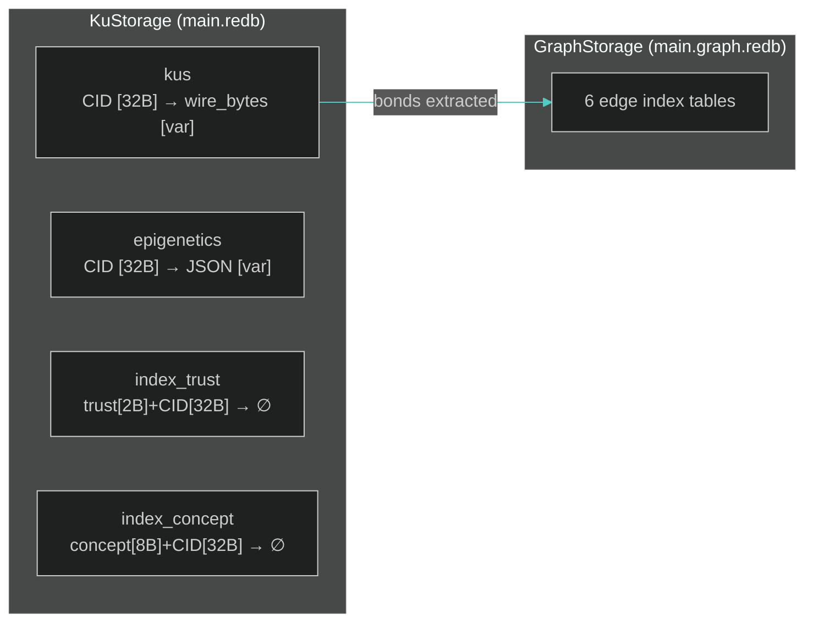
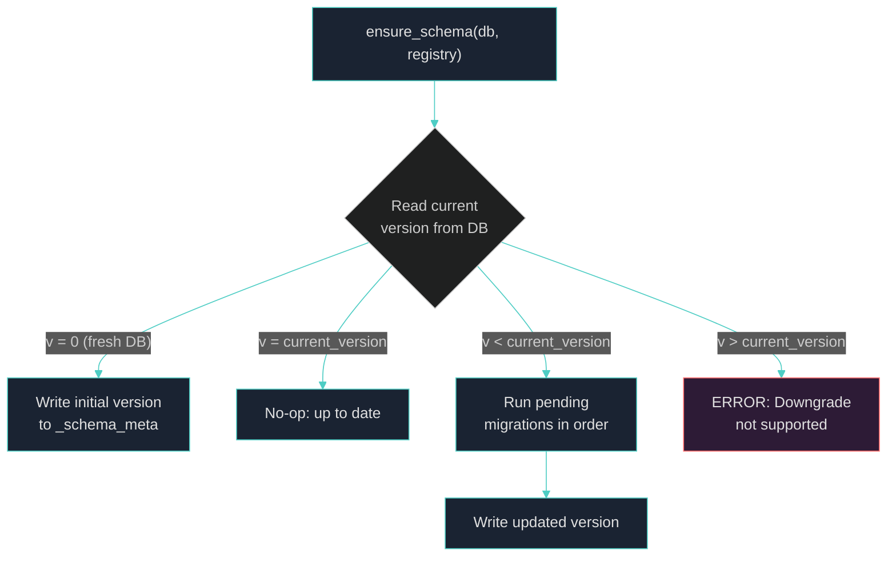

# Chapter 4: Local Storage and Schema Migration

> *"Data that is loved tends to survive."*
> — Kurt Bollacker, Freebase architect

---

We have established that Knowledge Units are content-addressed binaries whose CID is the BLAKE3 hash of their wire bytes. This chapter addresses the question every distributed system must eventually confront: *how do we persist these objects to disk, and how do we evolve the schema without breaking the cryptographic identity chain?* We present a storage architecture built on three independent modules — `KuStorage`, `GraphStorage`, and `PersistentConceptDict` — backed by **redb**, a pure-Rust embedded database with Copy-on-Write B+tree semantics. We then describe `obs_schema`, a versioning framework whose central invariant — **never migrate wire bytes** — mirrors the immutability guarantee of Git blob objects and IPFS content identifiers.

Across 13 tables in 2 redb files, the system delivers ACID-compliant persistence with orders-of-magnitude headroom above current workload demands, while maintaining a clean abstraction boundary that reduces future backend migration to a 2–3 day engineering effort.

---

## §4.1 Storage Backend Selection

Choosing an embedded storage engine for a decentralized knowledge system requires balancing several competing concerns: crash safety (KU storage rewards depend on `epochs_stored`), cross-compilation simplicity (no C/C++ toolchain), read-heavy workload optimization (10–100 reads per write), and range scan performance on composite byte keys. We evaluated six candidates against these criteria.

### The Case for redb

**redb** [1] is a pure-Rust embedded key-value store built on a Copy-on-Write B+tree with MVCC (Multi-Version Concurrency Control). Its architecture provides several properties that align precisely with OneBrain's requirements:

- **Pure Rust, zero C dependencies** — trivial cross-compilation to all targets, no `cc` toolchain required, full memory safety guarantees
- **ACID compliance** — Copy-on-Write semantics eliminate WAL corruption scenarios; every committed transaction is crash-safe via checksummed pages
- **MVCC readers** — multiple concurrent read transactions proceed without blocking each other or the single writer, matching OneBrain's read-heavy access pattern
- **Type-safe API** — compile-time key/value type checking via generic `TableDefinition<K, V>` reduces runtime errors
- **Stable file format** — version 2.x provides a mature, stable API with no migration risk

### Benchmark Performance

For workloads with small keys (32–69 bytes) and small values (9–172 bytes) — precisely OneBrain's operating range — redb delivers the following approximate throughput [5]:

| Metric | redb Capacity | Current OneBrain Load | Headroom Factor |
|--------|:------------:|:--------------------:|:--------------:|
| Random reads/sec | 200K–500K | ~10–100 (queries) | **2,000–50,000×** |
| Random writes/sec | 50K–150K | ~0.02–0.17 (1–10 KU/min) | **>300,000×** |
| Database size limit | Hundreds of GB | <10 MB (early stage) | **>10,000×** |

These figures demonstrate that redb provides *orders of magnitude more capacity* than OneBrain currently requires. The system operates deep within redb's comfort zone, with no foreseeable bottleneck at current or near-term scale.

### Alternatives Evaluated

| Feature | **redb** | RocksDB | LMDB | SQLite | sled | fjall |
|---------|:--------:|:-------:|:----:|:------:|:----:|:-----:|
| Architecture | CoW B+tree | LSM-tree | CoW B+tree | B-tree | Log-structured | LSM-tree |
| Language | Pure Rust | C++ (bindings) | C (bindings) | C (bindings) | Pure Rust | Pure Rust |
| Status (2026) | Stable 1.0+ | Very Mature | Very Mature | Very Mature | Abandoned | Active v3.0 |
| ACID | ✅ Full | ✅ Tunable | ✅ Full | ✅ Full | ⚠️ Partial | ✅ Full |
| Read throughput | Excellent | Good | Excellent | Good | Fair | Good |
| Write throughput | Good | Excellent | Moderate | Moderate | Poor/risky | Very Good |
| Range scans | Excellent | Good | Excellent | Excellent (SQL) | Fair | Good |
| Crash safety | Excellent | Configurable | Excellent | Excellent | ⚠️ Questionable | Good |
| Cross-compile | Easy | Hard | Moderate | Moderate | Easy | Easy |

**Rejected candidates and rationale:**

- **sled** — Development stalled/abandoned with known data corruption issues; unsuitable for any new production work
- **RocksDB** — Excellent write throughput via LSM-tree, but requires a C++ toolchain, offers 100+ configuration knobs, and optimizes for write-heavy workloads exceeding 1,000 writes/sec — unnecessary for OneBrain's 1–10 KU/min write rate
- **LMDB** — Strong read performance via memory-mapped I/O and architecturally similar CoW B+tree, but requires C bindings (via the `heed` crate) — introducing a native dependency chain
- **SQLite** — Battle-tested at massive scale, but the SQL interface adds abstraction mismatch overhead for raw byte-key operations

**Best alternative for future migration:** **fjall** [2] — a pure-Rust LSM-tree engine, actively maintained (v3.0 in 2026), with good write throughput. If OneBrain's write rate ever exceeds redb's comfort zone (>1,000 writes/sec sustained), fjall represents the most natural migration path.

### Migration Strategy: Three Abstractions, One Swap

All redb access is encapsulated behind exactly three well-defined structs:

| Abstraction | Module | Tables | LOC | Tests |
|-------------|--------|:------:|:---:|:-----:|
| `KuStorage` | `ku-kql/src/storage.rs` | 4 | 735 | 13 |
| `GraphStorage` | `ku-kql/src/graph_storage.rs` | 6 | 1,289 | 27 |
| `PersistentConceptDict` | `ku-core/src/persistent_concept_dict.rs` | 3 | 427 | 6 |

Swapping the backend requires changing only the *internal implementation* of these three structs. The composite key scheme is engine-agnostic — raw byte arrays with big-endian encoding for sort ordering. Estimated migration effort:

| Step | Effort |
|------|:------:|
| Replace `redb` imports with new engine | 0.5 day |
| Adapt table creation / transaction API | 1 day |
| Update error types and mappings | 0.5 day |
| Test suite adaptation | 0.5 day |
| Performance validation | 0.5 day |
| **Total** | **2–3 days** |

The existing feature-gate pattern (`persist`, `storage`) enables a **feature-flag approach** to backend selection:

```toml
[features]
storage-redb = ["dep:redb"]      # Current default
storage-fjall = ["dep:fjall"]     # Future alternative
```

This design ensures that the storage engine is a *replaceable component*, not an architectural commitment.

---

## §4.2 KuStorage: Primary Knowledge Unit Persistence

`KuStorage` — implemented in [storage.rs](file:///c:/Users/shpy2/Documents/OneBrain/src/ku-kql/src/storage.rs) (735 LOC, 13 tests) — is the primary persistence layer for Knowledge Units. Its design reflects the two-layer architecture of KU runtime representation: immutable Core DNA wire bytes (Layer 1) and mutable Epigenetics metadata (Layer 2).

### Four-Table Design



| Table | Key Format | Key Size | Value | Purpose |
|-------|-----------|:--------:|-------|---------|
| `kus` | CID (BLAKE3 hash) | 32 B | Core DNA wire bytes | Immutable Layer 1 content |
| `epigenetics` | CID | 32 B | JSON-serialized `Epigenetics` | Mutable Layer 2 metadata |
| `index_trust` | `trust_score` (u16 BE) + CID | 34 B | empty | Range queries by trust score |
| `index_concept` | `concept_id` (u64 BE) + CID | 40 B | empty | Lookups by concept identifier |

### Content-Addressed Storage: CID = BLAKE3(wire_bytes)

The content-addressing scheme provides $O(1)$ lookup by design. Every KU is stored under its own cryptographic hash:

$$\text{CID} = \text{BLAKE3}(\text{wire\_bytes})$$

This produces a 32-byte key that serves simultaneously as the storage address, the integrity checksum, and the network-wide unique identifier. The `put()` operation is naturally **idempotent** — storing the same KU twice produces the same CID and simply overwrites the existing entry with identical data.

### CID Integrity Verification

Every `get()` operation performs a **mandatory integrity check**: after reading the stored wire bytes, the system recomputes the BLAKE3 hash and verifies it matches the requested CID key. This detects silent data corruption at the storage layer:

```rust
let computed_cid = blake3::hash(&wire_bytes);
if computed_cid.as_bytes() != cid {
    return Err(StorageError::CodecError(
        "CID mismatch: stored data corrupted".into()
    ));
}
```

This verification adds negligible overhead — BLAKE3 processes small payloads in single-digit microseconds — but provides a critical safety net against bit-rot, disk errors, and adversarial tampering.

### Two-Layer Persistence Model

The separation of immutable and mutable data is enforced at the storage level:

- **Layer 1 (`kus` table):** Core DNA wire bytes are written once and never modified. The CID — computed from these bytes — serves as a permanent address, analogous to a Git blob hash.
- **Layer 2 (`epigenetics` table):** Epigenetics metadata (trust scores, bonds, epistemic status) can be updated via `update_epi()` without affecting the CID.

This design enables trust score evolution, bond graph modification, and epistemic status changes while preserving the cryptographic identity of the underlying knowledge unit.

### Automatic Graph Edge Indexing

On every `put()`, bonds declared in the KU's Epigenetics are automatically extracted and indexed in the companion `GraphStorage`:

```rust
for bond in &ku.epi.bonds {
    if bond.target_cid.len() == 32 {
        let target: [u8; 32] = bond.target_cid[..32].try_into().unwrap();
        let meta = BondMeta::from_bond(bond);
        let _ = self.graph.insert_bond(&cid, &target, bond.relation, &meta);
    }
}
```

Bond indexing is **best-effort** — graph insertion failures do not prevent KU storage from succeeding. Invalid bonds (e.g., those with CID length ≠ 32 bytes) are silently skipped, ensuring robustness against malformed input.

### Trust Index: Big-Endian Ordered Range Queries

The `index_trust` table uses a composite key of `trust_score` (u16, big-endian) concatenated with the CID. Big-endian encoding ensures that the byte-level sort order of the key matches the numeric sort order of the trust score. This enables efficient range scans — for example, retrieving all KUs with trust score above a threshold — using a simple prefix scan on the B+tree:

$$\text{key} = \text{trust\_score}.\text{to\_be\_bytes}() \| \text{CID}[0..32]$$

The trust score occupies 2 bytes (range 0–65,535), placing the most-significant byte first so that redb's lexicographic key ordering naturally produces numerically-ordered results.

### Public API

| Method | Signature | Description |
|--------|-----------|-------------|
| `open()` | `Path → Result<Self>` | Open or create database at path |
| `put()` | `&KuRuntime → Result<[u8; 32]>` | Store KU, return CID |
| `get()` | `&[u8; 32] → Result<KuRuntime>` | Retrieve KU by CID (with integrity check) |
| `has()` | `&[u8; 32] → Result<bool>` | Check existence |
| `delete()` | `&[u8; 32] → Result<bool>` | Remove KU and epigenetics |
| `count()` | `→ Result<usize>` | Total KU count |
| `get_all()` | `→ Result<Vec<KuRuntime>>` | Retrieve all KUs |
| `update_epi()` | `&[u8; 32], &Epigenetics → Result<()>` | Update Layer 2 only |
| `graph()` | `→ &GraphStorage` | Access graph edge index |

---

## §4.3 GraphStorage: Six-Table Composite Key Design

`GraphStorage` — implemented in [graph_storage.rs](file:///c:/Users/shpy2/Documents/OneBrain/src/ku-kql/src/graph_storage.rs) (1,289 LOC, 27 tests) — is the most complex storage module. It maintains six **materialized index tables** that enable $O(1)$ prefix-scan queries across every common graph access pattern: outgoing edges, incoming edges, type-filtered edges, state-filtered edges, weight-ordered edges, and temporal queries.

### Six Materialized Indices

The fundamental insight is that a single graph edge must be queryable from multiple perspectives — by source, by target, by relation type, by lifecycle state, by weight, and by time. Rather than computing these views at query time (requiring full table scans), we precompute and materialize six index projections of every edge:

| Table | Composite Key Layout | Key Size | Value | Query Pattern |
|-------|---------------------|:--------:|-------|---------------|
| `edges_out` | `src(32) + rel(1) + tgt(32)` | 65 B | `BondMeta` (9 B) | Outgoing edges from source |
| `edges_in` | `tgt(32) + rel(1) + src(32)` | 65 B | empty | Incoming edges to target |
| `edges_type` | `rel(1) + src(32) + tgt(32)` | 65 B | empty | All edges of a given type |
| `index_state` | `state(1) + src(32) + rel(1) + tgt(32)` | 66 B | empty | Edges filtered by lifecycle state |
| `bond_weight` | `weight(2 BE) + src(32) + tgt(32) + rel(1)` | 67 B | empty | Weight-ordered traversal |
| `edge_time` | `ts(4 BE) + src(32) + tgt(32) + rel(1)` | 69 B | empty | Temporal range queries |

Only `edges_out` stores the `BondMeta` value — all other tables are **pure index tables** with empty values, serving solely as ordered key sets for prefix-scan queries.

### BondMeta: 9-Byte Edge Metadata

Each edge carries a compact 9-byte metadata payload:

```
[weight:2][creator:1][state:1][decay:1][timestamp:4] = 9 bytes
```

| Field | Size | Encoding | Semantics |
|-------|:----:|----------|-----------|
| `weight` | 2 B | u16 | Bond strength (0–65,535) |
| `creator` | 1 B | enum | `Human`, `Ai`, `System` |
| `state` | 1 B | enum | `Active`, `Weakened`, `Deprecated` |
| `decay` | 1 B | enum | Decay rate (`None`, `Slow`, `Normal`, `Fast`) |
| `timestamp` | 4 B | u32 | Unix timestamp of creation |

### Seven Key-Builder Functions

Seven specialized functions construct composite keys with precise byte-level layout. Each function produces a fixed-size byte array with components placed at exact offsets:

```rust
fn make_out_key(src: &[u8; 32], rel: RelationType, tgt: &[u8; 32]) -> [u8; 65]
fn make_in_key(tgt: &[u8; 32], rel: RelationType, src: &[u8; 32]) -> [u8; 65]
fn make_type_key(rel: RelationType, src: &[u8; 32], tgt: &[u8; 32]) -> [u8; 65]
fn make_state_key(state: EdgeState, src: &[u8; 32], rel: RelationType, tgt: &[u8; 32]) -> [u8; 66]
fn make_weight_key(weight: u16, src: &[u8; 32], tgt: &[u8; 32], rel: RelationType) -> [u8; 67]
fn make_time_key(ts: u32, src: &[u8; 32], tgt: &[u8; 32], rel: RelationType) -> [u8; 69]
```

The ordering of components within each key is intentional — the *query dimension* always occupies the key prefix. For `edges_out`, `src` comes first because queries begin with "give me all outgoing edges from this source." For `edge_time`, the timestamp leads because temporal range queries scan by time first.

### Atomic Six-Table Insertion

Every `insert_bond()` call writes to all six tables within a **single write transaction**, ensuring atomicity. If the bond already exists (same `src + rel + tgt`), the old secondary indices — `bond_weight`, `edge_time`, `index_state` — are removed before new ones are inserted, preventing stale index entries:

```rust
let txn = self.db.begin_write()?;
{
    // Check for existing bond, remove old secondary indices
    if let Some(old_guard) = out_table.get(out_key.as_slice())? {
        // Remove old weight, time, state index entries...
    }
    // Insert into all 6 tables
    out_table.insert(out_key.as_slice(), meta_bytes.as_slice())?;
    txn.open_table(TABLE_EDGES_IN)?.insert(in_key.as_slice(), &[])?;
    txn.open_table(TABLE_EDGES_TYPE)?.insert(type_key.as_slice(), &[])?;
    txn.open_table(TABLE_INDEX_STATE)?.insert(state_key.as_slice(), &[])?;
    txn.open_table(TABLE_BOND_WEIGHT)?.insert(weight_key.as_slice(), &[])?;
    txn.open_table(TABLE_EDGE_TIME)?.insert(time_key.as_slice(), &[])?;
}
txn.commit()?;
```

### State Transition Tracking

The `update_bond_state()` method demonstrates atomic state transitions: the old `index_state` entry is removed and the new one inserted within the same write transaction, ensuring that state queries always reflect a consistent view:

```rust
let old_state_key = make_state_key(old_meta.state, src, rel, tgt);
let new_state_key = make_state_key(new_state, src, rel, tgt);
let mut t = txn.open_table(TABLE_INDEX_STATE)?;
t.remove(old_state_key.as_slice())?;    // Remove old
t.insert(new_state_key.as_slice(), &[])?;  // Insert new
```

### Index Overhead Analysis

Each edge incurs storage cost across all six index tables. We can compute the total per-edge overhead:

$$\text{Total per edge} = \underbrace{(65 + 9)}_{\text{edges\_out}} + \underbrace{65}_{\text{edges\_in}} + \underbrace{65}_{\text{edges\_type}} + \underbrace{66}_{\text{index\_state}} + \underbrace{67}_{\text{bond\_weight}} + \underbrace{69}_{\text{edge\_time}} = 406 \text{ bytes}$$

This is approximately 45× the raw `BondMeta` payload (9 bytes), but the trade-off is justified: every common query pattern — forward traversal, reverse traversal, type filtering, state filtering, weight ordering, and temporal range scanning — completes as a single B+tree prefix scan with no join operations.

For a graph with $N$ edges, total storage is approximately $406N$ bytes. At 100,000 edges, this amounts to roughly 40 MB — well within redb's demonstrated capacity of hundreds of gigabytes.

---

## §4.4 Schema Versioning Framework

The schema versioning framework — implemented in [obs_schema.rs](file:///c:/Users/shpy2/Documents/OneBrain/src/ku-core/src/obs_schema.rs) (539 LOC, 12 tests) — addresses a problem unique to content-addressed systems: **how do you evolve storage schemas when the primary key is a cryptographic hash of the stored data?**

### The Core Invariant: Never Migrate Wire Bytes

The central design constraint is expressed as a single inviolable rule:

> **NEVER migrate Core DNA wire bytes.** Because $\text{CID} = \text{BLAKE3}(\text{wire\_bytes})$, any modification to the wire format changes the CID, which breaks all KU-to-KU bond references, all graph edges (keyed by source/target CID pairs), all external references (peer caches, DHT entries), and the content verification guarantee.

This constraint is identical to the one faced by Git (changing a blob's content changes its SHA-1 hash, invalidating all tree and commit references) and IPFS (where CID stability requires standardized construction profiles, as formalized in IPIP-0499 [3]).

The implication is profound: **stored wire bytes are immutable forever**, like fossils in sedimentary rock. New features must be delivered through one of two channels:

1. **Epigenetics (mutable overlay)** — new metadata fields added with `#[serde(default)]` for forward compatibility
2. **New opcodes for new KUs** — existing KUs retain their v1 encoding; new KUs may use v2 encoding with new instruction opcodes

### Multi-Version Decoder

The version is encoded in 3 bits of the `VER_META` byte (bits 7–5), allowing up to 8 format versions:

```rust
let ver_meta = bytes[1];
let version = (ver_meta >> 5) & 0x07;  // 3-bit version field

match version {
    1 => decode_v1(bytes),    // Core DNA v6 format (current)
    2 => decode_v2(bytes),    // Future format
    _ => Err(UnsupportedVersion(version)),
}
```

The decoder supports all versions simultaneously — a design pattern borrowed from Protocol Buffers' backward compatibility rules. The golden rules map directly:

| Protocol Buffers Rule | OneBrain Equivalent |
|----------------------|---------------------|
| Never change field numbers | Never change opcode values |
| Never reuse field numbers | Never reuse opcode slots |
| Mark removed fields as `reserved` | Mark deprecated opcodes in spec |
| Unknown fields preserved on round-trip | Unknown opcodes skipped on decode |

### Framework Components

The framework consists of three core types and a `_schema_meta` table:

**`SchemaVersion(u32)`** — An ordered version number with comparison operators and display formatting:

```rust
#[derive(Debug, Clone, Copy, PartialEq, Eq, PartialOrd, Ord)]
pub struct SchemaVersion(pub u32);
```

**`Migration`** — A feature-agnostic migration step descriptor, carrying the source version and a human-readable description:

```rust
pub struct Migration {
    pub from_version: u32,        // Upgrades FROM this version
    pub description: &'static str, // Human-readable description
}
```

The target version is computed as `from_version + 1`, enforcing sequential single-step upgrades.

**`MigrationRegistry`** — A per-module ordered chain of migrations with validation:

```rust
pub struct MigrationRegistry {
    pub schema_name: &'static str,       // e.g., "ku_storage"
    pub current_version: SchemaVersion,  // Latest version
    pub migrations: Vec<Migration>,      // Ordered migration chain
}
```

**`_schema_meta` table** — A redb table present in every database file, storing three keys:

| Key | Value | Purpose |
|-----|-------|---------|
| `"version"` | `SchemaVersion` as string | Current schema version |
| `"schema_name"` | Module identifier | Ownership tracking |
| `"updated_at"` | Timestamp string | Last migration timestamp |

### The ensure_schema() Algorithm

The `ensure_schema()` function — the main entry point called from every `Storage::open()` — implements a three-way branch:



1. **Fresh database** (`version = 0`): Write the initial version and schema metadata
2. **Up to date** (`version = current_version`): Return immediately — no work needed
3. **Needs upgrade** (`version < current_version`): Execute pending migrations sequentially
4. **Downgrade attempted** (`version > current_version`): Reject with an error — downgrade is not supported

The chain validation function `validate()` ensures that migrations form a **contiguous sequence** from version 0 to `current_version`, with no gaps:

```rust
for (i, &v) in versions.iter().enumerate() {
    if v != i as u32 {
        return Err(format!(
            "Migration chain broken: expected from_version={}, found={}",
            i, v
        ));
    }
}
```

### Registered Schema Chains

Four storage modules register their migration chains:

| Schema Name | Current Version | Initial Migration Description |
|-------------|:--------------:|-------------------------------|
| `ku_storage` | v1 | Initial: `kus`, `epigenetics`, `index_trust`, `index_concept` tables |
| `graph_storage` | v1 | Initial: 6 edge index tables (out, in, type, state, weight, time) |
| `concept_dict` | v1 | Initial: `concepts`, `ids`, `meta` tables |
| `dht_store` | v1 | Initial: `dht_entries`, `replica_meta` tables (Phase 3) |
| `blob_store` | v1 | Initial: `blob_meta`, `blob_chunks` tables (Chapter 7) |

### Epigenetics Forward Compatibility

Since Epigenetics is serialized as JSON, forward compatibility is achieved through `#[serde(default)]` annotations on all fields. When a newer version writes a field that an older reader does not recognize, the older reader simply ignores the unknown JSON key. When an older version's JSON lacks a field added by a newer version, the `default` annotation supplies a zero-value:

```rust
#[serde(rename = "bn", skip_serializing_if = "Vec::is_empty", default)]
pub bonds: Vec<Bond>,

#[serde(rename = "ep", skip_serializing_if = "Option::is_none", default)]
pub epigenetic: Option<EpigeneticSection>,
```

This pattern — borrowed from Protocol Buffers' "all fields are optional" philosophy — makes JSON schemas *inherently forward-compatible* at zero cost.

### Rolling Upgrade: N-1 Compatibility

For the decentralized network scenario where nodes upgrade independently, we adopt an **N-1 compatibility policy**: every release must be compatible with the previous release. During the transition period:

```
Node A (v2) ←→ Node B (v1) ←→ Node C (v2)
```

Version negotiation occurs during the peer handshake, where each node advertises its supported version range. The agreed-upon version is the minimum common version, ensuring that all peers can decode all exchanged data.

### Biological Analogy

The two-layer persistence model mirrors a biological principle:

- **DNA (wire bytes)** — immutable genetic code, never modified after creation, identity defined by its hash
- **Epigenetic modifications (mutable overlay)** — environmental annotations that change over the organism's lifetime without altering the underlying DNA sequence

This analogy is not merely decorative — it captures a deep architectural truth: the identity of a knowledge unit is determined solely by its content (like genomic sequence), while its *context* (trust, relationships, epistemic status) evolves independently.

---

## §4.5 Concept Dictionary Persistence

`PersistentConceptDict` — implemented in [persistent_concept_dict.rs](file:///c:/Users/shpy2/Documents/OneBrain/src/ku-core/src/persistent_concept_dict.rs) (427 LOC, 6 tests) — provides ACID-compliant persistent storage for the concept vocabulary. Every concept in the OneBrain knowledge graph — from "water" to "photosynthesis" to "nước" (Vietnamese for water) — is assigned a unique numeric `ConceptId` that serves as the concept's compact binary representation in Core DNA wire bytes.

### Three-Table Design

| Table | Key | Key Type | Value | Purpose |
|-------|-----|----------|-------|---------|
| `concepts` | concept name (lowercase) | `&str` | JSON `ConceptEntry` | Forward lookup: name → concept |
| `ids` | concept ID | `u64` | concept name | Reverse lookup: ID → name |
| `meta` | `"next_id"` | `&str` | `u64` | Auto-increment counter |

### Case-Insensitive Resolution

All concept lookups normalize the input via `.to_lowercase()`, ensuring that "Water", "WATER", and "water" resolve to the same `ConceptEntry`:

```rust
pub fn try_resolve(&self, name: &str) -> Option<ConceptId> {
    let key = name.to_lowercase();
    // ... lookup in concepts table using normalized key
}
```

### Auto-Incrementing IDs with Reserved Range

Concept IDs start at **128**, reserving the range 0–127 for built-in concepts. This reservation serves a dual purpose:

1. **Varint efficiency** — IDs 0–127 encode as a single byte in the varint encoding used by Core DNA wire bytes (Tier 0), while IDs 128–16,383 require two bytes (Tier 1)
2. **Semantic stability** — built-in concepts (fundamental relations, core types) occupy the most compact encoding tier and never conflict with user-defined concepts

The varint tier system provides a natural compression gradient:

| Tier | ID Range | Varint Bytes | Typical Use |
|:----:|----------|:-----------:|-------------|
| T0 | 0–127 | 1 | Built-in concepts (reserved) |
| T1 | 128–16,383 | 2 | Common user concepts |
| T2 | 16,384–2,097,151 | 3 | Domain-specific concepts |
| T3 | 2,097,152–268,435,455 | 4 | Rare / specialized concepts |
| T4 | >268,435,455 | 5 | Theoretical overflow |

### Multilingual Concept Indexing

The `register_multilingual()` method indexes all name variants — canonical, Vietnamese (`name_vi`), and English (`name_en`) — to the same `ConceptEntry`:

```rust
// Index by all name variants
concepts.insert(name.to_lowercase().as_str(), json.as_str())?;
if let Some(vi) = name_vi {
    concepts.insert(vi.to_lowercase().as_str(), json.as_str())?;
}
if let Some(en) = name_en {
    concepts.insert(en.to_lowercase().as_str(), json.as_str())?;
}
```

This means that resolving "nước", "water", or the canonical name all return the same `ConceptId`. The `name_lang()` method provides language-specific display names with fallback to the canonical form.

### Idempotent Registration

The `register()` method is idempotent — calling it with an already-registered name returns the existing ID without creating a duplicate:

```rust
pub fn register(&self, name: &str) -> Result<ConceptId, KuError> {
    if let Some(id) = self.try_resolve(name) {
        return Ok(id);  // Already exists — return existing ID
    }
    // ... allocate new ID and insert
}
```

The convenience method `resolve_or_register()` combines lookup and registration into a single call, supporting the common pattern of "get the ID for this concept, creating it if necessary."

### Batch Operations with Max-ID Tracking

The `bulk_insert()` method inserts multiple `ConceptEntry` records in a single write transaction, tracking the maximum ID to correctly set the `next_id` counter:

```rust
let mut max_id = 127u64;
for entry in entries {
    // ... insert into concepts and ids tables
    if entry.id > max_id {
        max_id = entry.id;
    }
}
meta.insert("next_id", max_id + 1)?;
```

This is used for seed data loading — importing the initial concept vocabulary from curated datasets — where performance requires batching hundreds of inserts into a single ACID transaction.

### Persistence Across Reopens

The dictionary maintains state across process restarts. A concept registered in one session is immediately available after reopening the database:

```rust
// Session 1: register
let dict = PersistentConceptDict::open(&path)?;
dict.register("persistent_concept")?;
drop(dict);

// Session 2: resolve
let dict = PersistentConceptDict::open(&path)?;
assert!(dict.try_resolve("persistent_concept").is_some());
```

This is verified by the `test_persistence_across_reopen` test, ensuring that redb's ACID guarantees translate to durable concept storage.

---

## §4.6 Summary

The local storage layer of OneBrain is built on three design principles:

1. **Content-addressed immutability** — Core DNA wire bytes are never modified after storage; their BLAKE3 hash serves as both address and integrity proof
2. **Mutable overlay separation** — Epigenetics metadata evolves independently in a separate table, enabling trust score updates and bond modifications without CID invalidation
3. **Schema evolution without migration** — The `obs_schema` framework tracks versions and runs migrations for structural changes, but the core invariant ensures wire bytes are treated as permanent artifacts

The choice of redb provides ACID compliance, crash safety, and pure-Rust simplicity, with measured headroom of 2,000–50,000× for reads and >300,000× for writes above current workload. The three-abstraction encapsulation ensures that a future backend swap — should workload patterns shift toward write-heavy or multi-process access — remains a bounded 2–3 day engineering task.

---

## References

[1] C. Berner, "redb: An embedded key-value store written in pure Rust," GitHub, 2023–2026. Available: https://github.com/cberner/redb

[2] M. J. Gawron, "fjall: LSM-based embeddable key-value storage engine written in Rust," GitHub, 2024–2026. Available: https://github.com/fjall-rs/fjall

[3] IPFS Project, "IPIP-0499: Standardized Construction Profiles for Deterministic CIDs," InterPlanetary Improvement Proposal, 2024.

[4] Google, "Protocol Buffers Language Guide — Updating a Message Type," Google Developers, 2024. Available: https://protobuf.dev/programming-guides/proto3/#updating

[5] M. J. Gawron, "rust-storage-bench: Community benchmark suite for Rust storage engines," GitHub, 2025. Available: https://github.com/marvin-j97/rust-storage-bench

[6] D. R. Hipp, "SQLite PRAGMA user_version," SQLite Documentation. Available: https://www.sqlite.org/pragma.html#pragma_user_version

[7] Linus Torvalds, "Git — A content-addressable filesystem," 2005. The immutability of Git blob objects (SHA-1 hash = identity) is the direct precedent for OneBrain's CID stability constraint.
