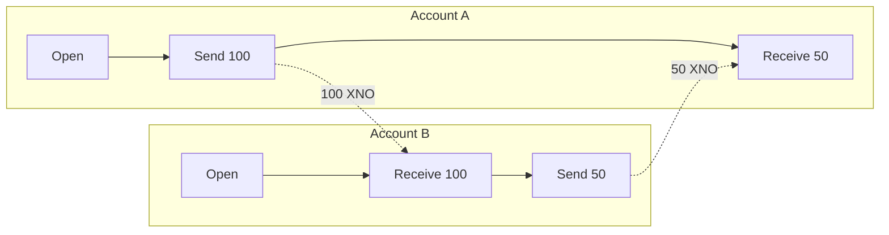

# 2. Related Work

This section surveys existing token systems, storage incentive mechanisms, DAG-based ledger architectures, and knowledge economy attempts. For each category, we analyze the design trade-offs and identify the specific gaps that motivate OBT's design.

## 2.1 Cryptocurrency Tokens

### 2.1.1 Bitcoin (BTC)

Bitcoin [Nakamoto, 2008] established the foundational model for decentralized digital currency: a proof-of-work consensus mechanism, a UTXO-based transaction model, and a fixed supply of 21 million tokens with periodic halving events.

While Bitcoin demonstrated that trustless digital scarcity is achievable, its design is fundamentally misaligned with knowledge incentives:

- **Supply scarcity** creates hoarding behavior. Bitcoin holders are incentivized to *hold* rather than *spend*, as the token appreciates due to supply constraints. Knowledge systems require tokens that *flow* — rewarding creation, verification, and storage in a continuous cycle.
- **Proof-of-Work** consumes energy proportional to security, not to productive output. The Bitcoin network currently consumes approximately 120 TWh/year — comparable to a small nation — while producing no knowledge artifacts.
- **Transaction fees** ($1–50 depending on congestion) make micro-transactions infeasible. Knowledge operations frequently involve sub-cent-equivalent value transfers (e.g., a single trust update or PoMV tick).

OBT adopts Bitcoin's insight that *cryptographic verification can replace institutional trust* but rejects its supply model, consensus mechanism, and fee structure entirely.

### 2.1.2 Ethereum (ETH)

Ethereum [Buterin, 2014] generalized Bitcoin's scripting capability into a Turing-complete smart contract platform. Its transition to Proof-of-Stake (The Merge, 2022) introduced validator staking and slashing — mechanisms more relevant to OBT's design.

**Relevant Ethereum innovations adopted by OBT:**

1. **Correlation penalty.** Ethereum 2.0's slashing penalty increases when multiple validators are penalized within the same epoch window, making coordinated attacks super-linearly expensive. OBT adapts this formula: $m = 1 + \log_2(n)$, where $n$ is the count of simultaneously penalized nodes (§8.4).

2. **Finality levels.** Ethereum distinguishes between tentative and finalized blocks. OBT generalizes this into four confirmation levels (L0–L3, §4.6) with progressively stronger guarantees.

**Ethereum limitations for knowledge systems:**

- **Gas fees** create a per-operation cost floor. Even with Layer 2 solutions, the gas model assumes that computation is the scarce resource. In knowledge systems, *attention and expertise* are the scarce resources.
- **Global state** requires all validators to process all transactions. Knowledge operations are inherently local — verifying a KU's encoding consensus involves only the participants, not the entire network.
- **Staking as identity** ties reputation to capital. OBT uses *demonstrated competence* (EigenTrust scores from actual knowledge work) rather than financial deposits.

## 2.2 Storage Incentive Tokens

### 2.2.1 Filecoin (FIL)

Filecoin [Protocol Labs, 2017] is the most sophisticated storage incentive protocol, combining Proof-of-Replication (PoRep) and Proof-of-Spacetime (PoSt) with a token-mediated deal market.

**Filecoin's architecture:**

```
Client → Deal Market → Storage Provider → PoRep (seal sector) → PoSt (WindowPoSt every 24h)
                                                                  ↓
                                                          FIL block reward
```

**Key Filecoin parameters:**

| Parameter | Value | OBT Equivalent |
|-----------|-------|----------------|
| Sector size | 32 GiB | N/A (per-KU) |
| Seal time | 1-3 hours (GPU) | N/A (no sealing) |
| PoSt window | 24 hours | 1 hour (epoch) |
| Hardware | GPU required | CPU sufficient |
| Proof system | zk-SNARKs | BLAKE3 hash + FieldExtract |
| Content awareness | None (opaque sectors) | Semantic (field-level proofs) |
| Penalty | Sector fault fee | 5-tier graduated trust reduction |

**Table 3.** Filecoin vs OBT storage parameter comparison.

**Why OBT does not use Filecoin's approach:**

1. **GPU requirement is exclusionary.** Filecoin's zk-SNARK proofs require GPU hardware costing $500–5,000, excluding casual participants. OBT's PoS-KU challenges require only CPU and standard storage.

2. **Opaque sectors prevent semantic verification.** Filecoin proves that *some data* exists but cannot verify *what* data exists or whether it is valuable. OBT's FieldExtract challenge type (§6.3) tests whether the storage provider can extract specific semantic fields from a stored Knowledge Unit, proving not just existence but *understanding*.

3. **Deal market adds unnecessary complexity.** Filecoin requires clients to negotiate deals with specific providers. In OBT, storage is a network-wide responsibility — any node can store any KU, and rewards are distributed based on the 5-factor formula.

### 2.2.2 Arweave (AR)

Arweave [Williams, 2019] takes a different approach: permanent storage funded by a one-time endowment. The Succinct Proof of Random Access (SPoRA) mechanism incentivizes miners to store the entire dataset (the "weave") by requiring random reads during mining.

**Arweave's innovations relevant to OBT:**

- **Random recall.** Arweave's requirement that miners access random historical data prevents storage providers from discarding old data. OBT adapts this concept in PoS-KU challenges, where the challenge seed is deterministic but unpredictable: `BLAKE3(epoch ∥ node_id)`.
- **Content-addressed storage.** Arweave uses content hashes for addressing. OBT similarly uses BLAKE3 content identifiers (CIDs) for Knowledge Units.

**Arweave's limitations:**

- **Permanence is wrong for knowledge.** Knowledge evolves — facts are updated, hypotheses are refuted, redundant entries are deprecated. OBT supports knowledge lifecycle management through PoMV's metabolic rate and deprecation mechanisms.
- **No semantic proofs.** Like Filecoin, Arweave treats stored data as opaque bytes. OBT's storage proofs can test semantic properties.

### 2.2.3 Sia (SC)

Sia [Vorick & Champine, 2014] pioneered Merkle proof-based storage verification with a simpler, more accessible design than Filecoin.

**Sia's contribution to OBT:**

OBT's PoS-KU FullHash and ByteRange challenge types are directly inspired by Sia's approach to storage proofs. The key insight borrowed from Sia is that *simple cryptographic challenges can provide sufficient assurance without zk-SNARKs*, dramatically reducing hardware requirements.

## 2.3 DAG-Based Ledger Architectures

### 2.3.1 Nano (XNO)

Nano [LeMahieu, 2018] introduced the block-lattice architecture — a directed acyclic graph (DAG) where each account maintains its own blockchain. This design achieves zero-fee, sub-second transactions.

**Nano's block-lattice:**



**OBT's Account-Chain vs Nano's block-lattice:**

| Dimension | Nano | OBT Account-Chain |
|-----------|------|-------------------|
| Block structure | `{previous, account, representative, balance, link, signature, work}` | `{previous, account, sequence, balance, operation, clock, timestamp, signature, block_hash}` |
| Consensus | Open Representative Voting (ORV) | Threshold K/N witnesses |
| Double-spend prevention | Vote-based | VectorClock + sequence monotonicity |
| Fork resolution | Vote weight | First-seen + BLAKE3 hash tiebreak |
| Anti-spam | Balance buckets + PoW | Trust-gated rate limits |
| Fees | Zero | Zero |
| Block types | State blocks | Typed TransferOp (Open/Mint/Send/Receive) |
| Causal ordering | Implicit (link field) | Explicit (VectorClock) |
| Finality levels | 1 (confirmed) | 4 (L0-L3) |
| Identity | Account keypair | EigenTrust reputation |
| Minting | Pre-distributed (genesis) | On-demand (output-based) |
| Content awareness | None | TransferOp preserves provenance |
| Fork punishment | None | ForkWarrant + trust slash |
| Storage proofs | N/A | PoS-KU |
| Supply | Fixed (133M, fully distributed) | Near-infinite, flow-controlled |
| Block size | ~216 bytes | ~240-320 bytes |
| Crypto | BLAKE2b | BLAKE3 + Ed25519 |

**Table 4.** Detailed comparison of Nano block-lattice and OBT Account-Chain across 17 dimensions.

**Key differences in design philosophy:**

1. **Minting.** Nano's entire supply was created at genesis and distributed through a faucet. OBT mints new tokens continuously as knowledge work is performed — a fundamentally different economic model.

2. **Causal ordering.** Nano uses the `link` field to connect send/receive pairs. OBT adds explicit VectorClocks, enabling formal causal ordering analysis and detection of concurrent operations that might indicate Byzantine behavior.

3. **Fork handling.** Nano resolves forks through representative voting (weight-based). OBT uses a deterministic tiebreak (lower BLAKE3 hash wins) combined with ForkWarrants that permanently record the evidence and trigger trust penalties. This creates a *deterrent* absent in Nano.

### 2.3.2 IOTA (MIOTA)

IOTA [Popov, 2018] uses a DAG structure (the Tangle) where each transaction validates two previous transactions. IOTA 2.0 introduced Mana — a reputation-based resource allocation mechanism.

**Relevant IOTA innovations:**

- **Mana as reputation.** IOTA 2.0's Mana serves a similar function to OBT's trust-as-resource-proxy: reputation earned through participation replaces fees as the access control mechanism. OBT's 7-tier NodeTier hierarchy can be seen as a discretized version of Mana's continuous reputation score.
- **Decayed Resource Regulation (DRR).** IOTA's DRR mechanism limits throughput based on decaying reputation. OBT applies a similar concept through `trust(t) = trust_0 \times e^{-0.01 \times t}` (§8.2).

### 2.3.3 Holochain (HOT)

Holochain [Harris-Braun et al., 2018] takes the most radical approach: each participant runs their own chain, and validation is performed by a random subset of peers within a DHT neighborhood.

**Holochain's influence on OBT:**

- **Source chains.** Holochain's per-agent source chains are conceptually similar to OBT's Account-Chain: each participant is the sole writer of their own chain.
- **DHT validation.** Holochain's DHT-based validation neighborhood maps to OBT's threshold witness model where $K = \min(\max(3, N_{active}/100), 7)$ witnesses from the DHT validate operations.
- **Agent-centric vs. data-centric.** Holochain is explicitly agent-centric. OBT is *knowledge-centric* — the KU is the primary entity, with agent reputation derived from knowledge contribution quality.

## 2.4 Infrastructure and IoT Tokens

### 2.4.1 Helium (HNT)

Helium [Haleem et al., 2018] incentivizes LoRaWAN wireless coverage through Proof-of-Coverage (PoC). Its relevance to OBT lies in two areas:

1. **Service-specific minting.** Helium mints tokens when hotspots provide verified coverage — analogous to OBT's output-based minting where tokens are created when verified knowledge work is performed.
2. **Denylist as penalty.** Helium maintains a community-governed denylist for fraudulent hotspots. OBT's Tombstone tier (§8.2) serves a similar function but with a formal 4-layer appeal process.

### 2.4.2 Cosmos (ATOM) and EigenLayer

Cosmos [Kwon & Buchman, 2016] introduced *tombstoning* — the permanent removal of validators caught double-signing. OBT adopts this concept for its Tier 5 penalty.

EigenLayer [Eigenlabs, 2023] introduced a veto committee mechanism for restaking slashing disputes. OBT's L3 and L4 appeal layers (§8.6) borrow this concept: a panel of $K$ randomly selected high-trust nodes evaluates contested penalties.

## 2.5 Knowledge Economy Attempts

### 2.5.1 Ocean Protocol (OCEAN)

Ocean Protocol [McConaghy et al., 2019] creates a marketplace for data and AI services, using OCEAN tokens for data access and curation. While sharing OBT's goal of knowledge monetization, Ocean differs fundamentally:

- **Data-as-commodity.** Ocean treats data as a product to be bought and sold. OBT treats knowledge as a *public good* to be freely accessed (Axiom A3), with tokens rewarding *creation* rather than *access*.
- **Marketplace model.** Ocean requires explicit pricing and purchase transactions. OBT distributes rewards algorithmically based on PoMV quality scores.

### 2.5.2 SingularityNET (AGIX)

SingularityNET [Goertzel et al., 2017] creates a marketplace for AI services. The AGIX token facilitates payment for AI inference. Unlike OBT, SingularityNET focuses on *AI service consumption* rather than *knowledge creation and preservation*.

### 2.5.3 The Attention Economy (BAT, Steemit)

Basic Attention Token (BAT) [Brave, 2017] and Steemit [Larimer et al., 2016] attempted to tokenize human attention and content creation, respectively. Both suffered from fundamental gaming problems:

- **Steemit's reward pool** was dominated by vote-buying cartels. Content quality was secondary to social capital accumulation.
- **BAT's attention measurement** relies on browser-level metrics that are easily spoofed.

OBT avoids these pitfalls through PoMV's multi-signal verification system (6 independent signals) and the 4-quality-gate pipeline that precedes any reward eligibility.

## 2.6 Gap Analysis: Why OBT Is Different

The following table summarizes the key gaps in existing systems that OBT addresses:

| Gap | Existing Systems | OBT Solution |
|-----|-----------------|--------------|
| No knowledge quality measurement | All storage tokens treat data as opaque bytes | PoMV 6-signal quality scoring integrated with reward calculation |
| Fee barrier to micro-operations | ETH gas, FIL gas, AR fees | Zero-fee transfers with trust-as-resource-proxy |
| Scarcity misaligned with knowledge | BTC hard cap, FIL cap, AR cap | Near-infinite supply, flow-controlled by $E = B \times A \times Q$ |
| No content-aware storage proofs | FIL WindowPoSt, AR SPoRA are opaque | PoS-KU FieldExtract tests semantic understanding |
| Reputation = capital | ETH staking, FIL collateral | Trust = demonstrated knowledge competence (EigenTrust) |
| No penalty graduation | ETH binary slash, ATOM tombstone | 5-tier graduated penalties with correlation amplification |
| No appeals process | ETH/ATOM penalties are immediate and final | 4-layer appeals (auto-protect → dispute → retrospective → final) |
| Token conflated with reputation | Most systems use same token for staking and spending | OBT/Trust separation: "salary vs medical license" |
| Minting = input to consensus | BTC PoW, ETH PoS | OBT minting is OUTPUT of knowledge consensus |
| Storage = opaque commitment | FIL sectors, AR chunks | OBT storage = semantic knowledge with lifecycle |

**Table 5.** Gap analysis: limitations of existing systems and OBT solutions.

The fundamental insight is that knowledge token design requires *different primitives* than financial token design. Knowledge is non-rivalrous, gains value through replication, requires semantic verification, and operates on micro-transaction scales incompatible with fee-based systems. OBT is, to our knowledge, the first token system designed from first principles for these requirements.
