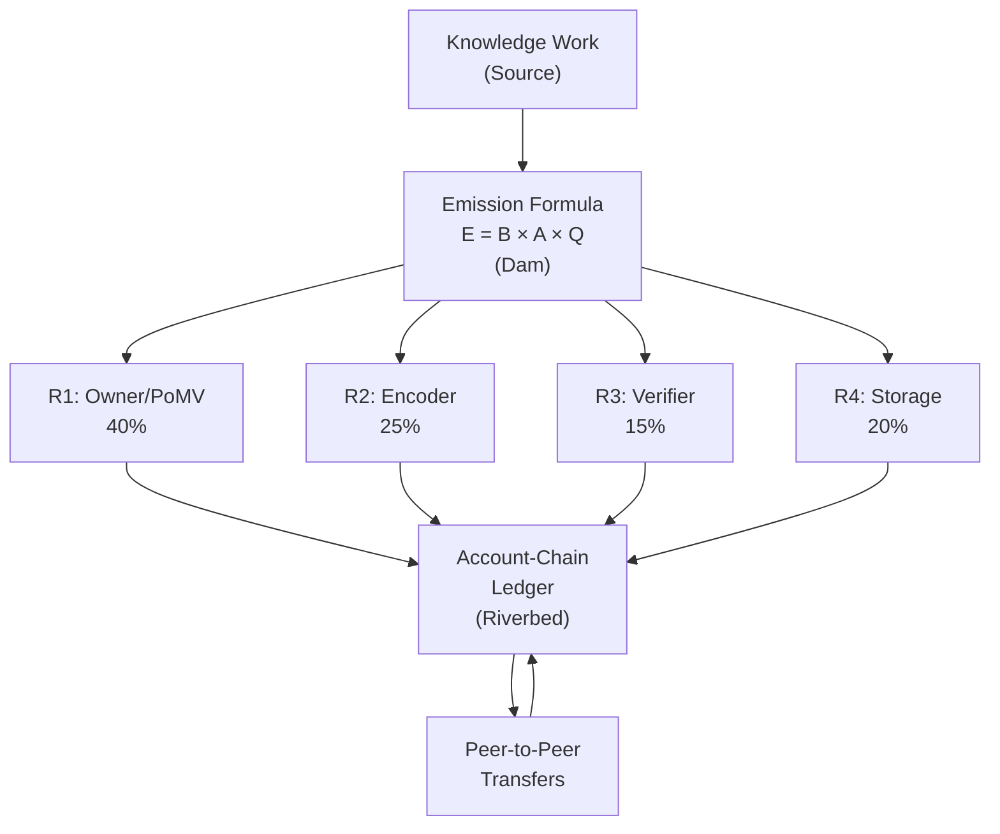
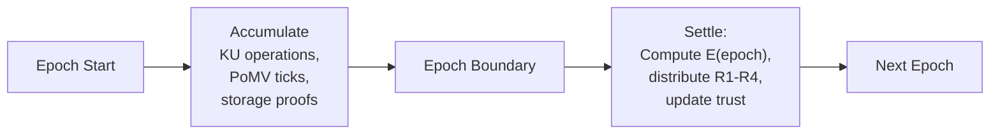

# 3. Token Design Philosophy

This section presents OBT's identity as a knowledge utility token, the supply model, the precision system, and the six critical design decisions that shaped the architecture.

## 3.1 Token Identity: Utility Token, Not Cryptocurrency

OBT occupies a unique position in the token design space. It is neither a cryptocurrency (designed for financial transactions and speculation) nor a simple in-app reward point (centrally issued, non-transferable). OBT is a *knowledge utility token* — a transferable unit of account that measures the economic value of verified knowledge work.

The distinction is best understood through analogy:

| Token Type | Value Source | Transfer Model | Supply Model | Example |
|------------|-------------|----------------|--------------|---------|
| Cryptocurrency | Scarcity + speculation | Open market | Fixed or deflationary | BTC, ETH |
| In-app points | Issuer's promise | Non-transferable | Arbitrary (centrally issued) | Airline miles |
| Staking token | Security deposit | Lock/unlock | Inflationary (rewards) | ETH (staked) |
| **Knowledge utility** | **Knowledge work performed** | **Peer-to-peer** | **Flow-controlled (near-infinite)** | **OBT** |

**Table 6.** Token type taxonomy and OBT's position.

The critical property is that OBT has no speculative mechanism. There is no staking yield, no liquidity pool, no DeFi composability. The token's value proposition is entirely functional: *OBT measures how much verified knowledge work has been performed*. If no knowledge is created, no OBT is minted.

## 3.2 The "kWh Analogy"

The most precise analogy for OBT is the kilowatt-hour (kWh):

| Property | kWh | OBT |
|----------|-----|-----|
| What it measures | Energy production/consumption | Knowledge work performed |
| Supply | Unlimited (generated on demand) | Near-infinite (minted on demand) |
| Value source | Utility (powers devices, heats homes) | Utility (verified, stored, accessed knowledge) |
| Scarcity | Not artificially scarce | Not artificially scarce |
| Hoarding incentive | Minimal (electricity is consumed) | Minimal (value is in knowledge, not token) |
| Flow control | Grid capacity, generation limits | Emission formula $E = B \times A \times Q$ |
| Speculation potential | Low (commodity, not asset) | Low by design (no DeFi composability) |

**Table 7.** The kWh–OBT analogy across seven dimensions.

Just as kWh are created when a generator produces electricity and consumed when a device uses it, OBT is created when a participant performs verified knowledge work and flows through the network as participants transfer, accumulate, and spend tokens.

## 3.3 Supply Model: "River, Not Lake"

### 3.3.1 The River Metaphor

Most token systems model supply as a *lake* — a fixed body of water that is distributed, circulated, and eventually depleted or saturated. Bitcoin's 21 million coins form a finite lake. Ethereum's EIP-1559 attempts to maintain a steady lake level by balancing issuance and burning.

OBT models supply as a *river*:

- **The source** is the emission formula, which creates new tokens when knowledge work occurs.
- **The dam** is $E(\text{epoch}) = B \times A(\text{epoch}) \times Q(\text{epoch})$, which controls flow rate based on network activity ($A$) and knowledge quality ($Q$).
- **The riverbed** is the Account-Chain ledger, where tokens flow between participants.
- **There is no total water limit**, but the flow rate is always controlled.

**Figure 1.** The "River" supply model — tokens flow from knowledge work through the emission formula into four reward streams, then circulate via peer-to-peer transfers.

### 3.3.2 Why No Hard Cap

Hard supply caps create three problems for knowledge systems:

1. **Deflationary pressure discourages spending.** If total supply is fixed and demand increases, each token appreciates. This incentivizes hoarding over knowledge investment — the opposite of the desired behavior.

2. **Early-mover advantage creates unfair distribution.** Bitcoin's early miners received disproportionate rewards. In a knowledge system, the *best* knowledge may be created decades into the system's operation; early creators should not receive outsized rewards simply for being early.

3. **Halving events create artificial scarcity shocks.** Bitcoin's quadrennial halvings create predictable supply shocks that are exploited by speculators. Knowledge production is continuous and should not be subject to arbitrary reward reductions.

OBT's near-infinite supply, governed by the emission formula, avoids all three problems. The per-epoch emission is bounded by $E = B \times A \times Q$, ensuring orderly growth without artificial constraints.

### 3.3.3 Supply Projection

Based on the emission formula with conservative growth assumptions:

| Year | Avg Active Nodes | Avg Q Factor | Avg Emission/Epoch | Annual New Supply | Cumulative Supply | YoY Inflation |
|------|-----------------|-------------|--------------------|--------------------|-------------------|---------------|
| 1 | 500 | 0.50 | 2,500 OBT | ~21.9M OBT | 21.9M | — |
| 2 | 2,000 | 0.55 | 11,000 OBT | ~96.4M OBT | 118.3M | 340% |
| 3 | 5,000 | 0.60 | 30,000 OBT | ~262.8M OBT | 381.1M | 222% |
| 5 | 10,000 | 0.65 | 65,000 OBT | ~569.4M OBT | 1.8B | 46% |
| 10 | 50,000+ | 0.70 | 70,000 OBT | ~613.2M OBT | 5.5B | 13.5% |

**Table 8.** 10-year supply projection. Activity factor $A$ is capped at 10.0, so emission plateaus when $N_{active} \geq 10{,}000$.

Key observations:

- **Inflation naturally declines** from extremely high (Year 1, small base) to moderate (~13.5% by Year 10) without any halving events.
- **Maximum annual emission** is approximately 876M OBT ($10{,}000 \times 10.0 \times 1.0 \times 8{,}760$ epochs/year), achievable only at maximum network size and perfect quality.
- **No pre-allocation.** Unlike most token projects, OBT has no team allocation, no investor allocation, no foundation reserve. All tokens are minted through verified knowledge work.

## 3.4 Precision Model: milliOBT

OBT uses integer arithmetic throughout the system to avoid floating-point precision issues. The precision multiplier is:

$$\text{OBT\_PRECISION\_MULTIPLIER} = 1{,}000$$

This means:
- 1 OBT = 1,000 milliOBT (internal representation)
- All balances, transfers, and rewards are tracked in milliOBT (u64)
- Maximum representable balance: $2^{64} - 1 \approx 1.8 \times 10^{16}$ milliOBT = $1.8 \times 10^{13}$ OBT

At maximum emission (~876M OBT/year), it would take approximately $2 \times 10^4$ years to reach the u64 limit. Overflow is not a practical concern.

The choice of 1,000× precision (vs. Ethereum's $10^{18}$ Wei/ETH) reflects OBT's simpler economic model: there is no gas pricing, no DeFi composability, and no need for extreme granularity. milliOBT provides sufficient precision for all reward calculations while maintaining readable values.

## 3.5 Epoch System

OBT operates on a fixed epoch cycle:

$$\text{OBT\_EPOCH\_DURATION\_S} = 3{,}600 \text{ seconds (1 hour)}$$

**Epoch boundaries** are computed from Unix epoch:
$$\text{epoch}(t) = \lfloor t / 3{,}600 \rfloor$$
$$\text{start}(\text{epoch}) = \text{epoch} \times 3{,}600$$
$$\text{end}(\text{epoch}) = (\text{epoch} + 1) \times 3{,}600 - 1$$

This produces:
- 24 epochs per day
- 168 epochs per week
- 8,760 epochs per year

**Epoch lifecycle:**

**Figure 2.** Epoch lifecycle — accumulation phase followed by boundary settlement.

**Why 1 hour?**

The epoch duration represents a trade-off:

| Duration | Pros | Cons |
|----------|------|------|
| 10 min | Faster rewards | Higher overhead, gossip may not converge |
| **1 hour** | **Gossip convergence, manageable settlement** | **Moderate latency for reward recognition** |
| 24 hours | Minimal overhead | Unacceptable reward latency |

One hour was chosen because:
1. It provides sufficient time for gossip propagation to converge across the network.
2. It aligns with PoMV tick intervals (60-300 seconds), allowing 12-60 ticks per epoch.
3. It produces a manageable settlement workload (~24 settlements/day).

## 3.6 Six Critical Design Decisions

The OBT architecture was shaped by six critical design decisions, each resolved through systematic analysis of alternatives:

### Q1: Should there be a global emission cap per epoch?

**Decision: YES.** Without a per-epoch cap, a compromised node with high trust could mint unbounded tokens. The emission formula $E = B \times A \times Q$ provides an absolute upper bound per epoch, and the per-node reward cap $E / N_{active} \times \text{TrustMultiplier}(\text{tier})$ limits individual nodes.

**Alternatives considered:**
- *No cap (unlimited minting):* Rejected — enables hyperinflation attacks.
- *Per-node cap only:* Rejected — doesn't prevent Sybil attacks where many fake nodes each mint small amounts.
- *Global + per-node cap:* **Accepted** — defense in depth.

### Q2: Should rewards be trust-gated?

**Decision: YES.** New nodes (Leaf tier) receive only 10% of the maximum reward rate, scaling to 200% for GlobalBackbone nodes. This creates a natural Sybil resistance: creating many fake Leaf-tier identities yields only 10% × $n$ rewards, while the cost of elevating trust is proportional to genuine knowledge contribution.

**Trust multipliers by tier:**

| Tier | Name | Multiplier | Promotion Threshold |
|------|------|:----------:|:-------------------:|
| 0 | Leaf | 0.10 | — |
| 1 | Contributor | 0.50 | 0.30 |
| 2 | Local SP | 1.00 | 0.60 |
| 3 | Regional SP | 1.25 | 0.75 |
| 4 | Country SP | 1.50 | 0.85 |
| 5 | Continental SP | 1.75 | 0.92 |
| 6 | Global Backbone | 2.00 | 0.97 |

**Table 9.** NodeTier hierarchy with trust multipliers and promotion thresholds.

### Q3: Should fraud be punished beyond natural trust decay?

**Decision: YES.** Natural trust decay ($e^{-0.01t}$) is insufficient to deter active fraud. The 5-tier penalty system (§8) provides graduated responses from warnings to permanent bans, with correlation amplification for coordinated attacks.

### Q4: What balance structure should be used?

**Decision: Account-Chain** (Nano-style per-account chains).

This was the most technically consequential decision. Three CRDT-based alternatives were evaluated and rejected:

1. **G-Counter:** Monotonically increasing — cannot represent spending.
2. **PN-Counter:** Allows concurrent decrements that can produce negative (overdraft) balances.
3. **Bounded Counter:** Requires synchronous coordination, defeating the purpose of CRDTs.

The Account-Chain provides single-writer semantics per account, eliminating the overdraft problem while maintaining gossip-compatible propagation. See §4.1 for the formal analysis.

### Q5: Should permanent bans (Tombstone) be possible?

**Decision: YES.** Analysis of Ethereum (slashing), Cosmos (tombstoning), and Helium (denylist) showed that all production-grade systems require a permanent exclusion mechanism for systematic attackers (ring leaders, identity forgery). OBT's Tombstone tier requires evidence of *organized, systematic fraud* and includes a stringent appeal process (>80% consensus of top-tier nodes + cryptographic evidence).

### Q6: What is the optimal epoch duration?

**Decision: 1 hour (3,600 seconds).** Analysis of five candidate durations:

| Duration | Activity Factor | Gossip Coverage | Settlement Load | Verdict |
|----------|:--------------:|:--------------:|:---------------:|---------|
| 1 min | Too granular | Poor | Very high | ❌ |
| 10 min | Acceptable | Partial | High | ❌ |
| **1 hour** | **Good** | **Full** | **Moderate** | **✅** |
| 6 hours | Coarse | Full | Low | ❌ |
| 24 hours | Very coarse | Full | Minimal | ❌ |

**Table 10.** Epoch duration analysis. 1 hour provides the optimal balance between gossip convergence, reward latency, and computational overhead.
