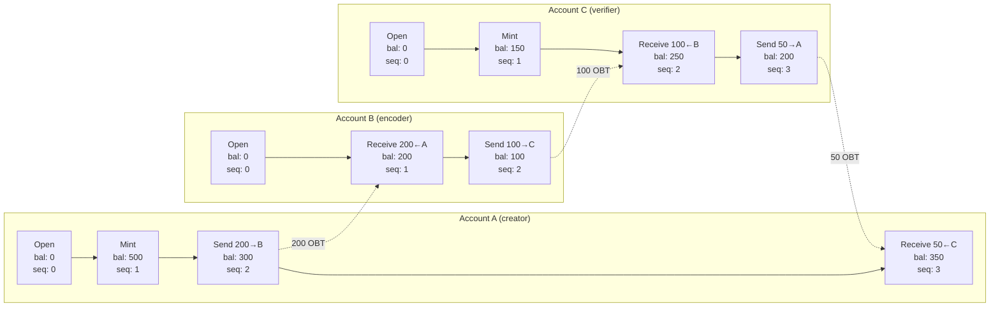
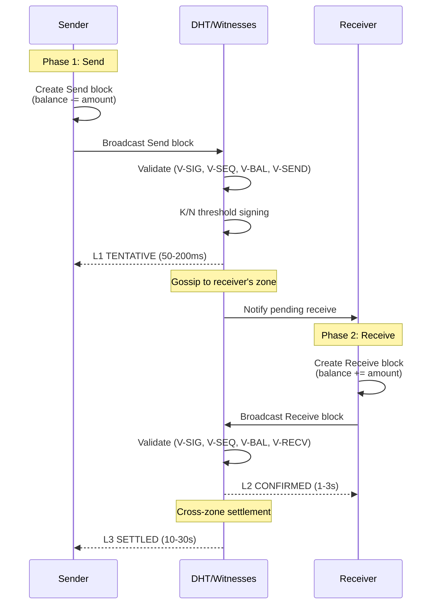
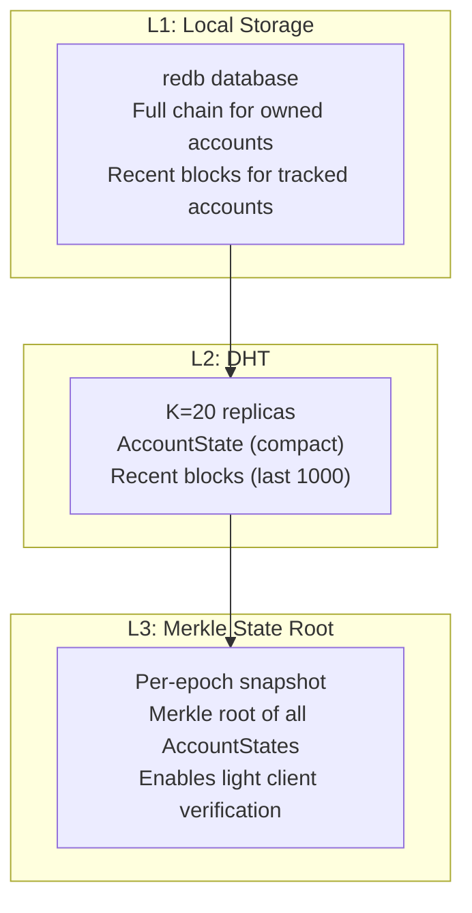

# 4. Account-Chain Ledger

This section presents the OBT ledger architecture: a Nano-inspired Account-Chain where each participant maintains an independent append-only chain of transfer blocks. We begin with a formal analysis of why CRDT-based balance tracking is unsuitable, then specify the Account-Chain design, block validation rules, fork detection, and storage layers.

## 4.1 Why Not CRDTs for Balance Tracking

The OneBrain Protocol (OBP) uses Conflict-free Replicated Data Types (CRDTs) extensively — G-Counters for monotonic accumulators, PN-Counters for mutable quantities, ORSets for collections, and LWW-Registers for metadata. A natural question is whether CRDTs can also track OBT balances.

We evaluate three CRDT candidates and demonstrate that none satisfies the requirements for a correct balance system.

### 4.1.1 G-Counter: Cannot Represent Spending

A G-Counter is a vector of non-negative integers, one per replica, that supports only increment operations. The global value is the sum of all replica values.

**Property:** $\forall t_1 < t_2: \text{value}(t_2) \geq \text{value}(t_1)$

G-Counters are ideal for tracking `total_earned` (Axiom A1: earned tokens are permanent) but cannot represent spending: there is no decrement operation.

**Verdict:** ❌ Unsuitable for balance tracking (no spending).

### 4.1.2 PN-Counter: Allows Overdraft

A PN-Counter combines two G-Counters — one for increments (P) and one for decrements (N). The value is $P - N$.

**The overdraft problem:** Consider Account A with balance 100, connected to two replicas $R_1$ and $R_2$:

1. $R_1$ processes a spend of 80: $N_{R_1} \leftarrow N_{R_1} + 80$. Local balance = 20. ✓
2. *Concurrently*, $R_2$ processes a spend of 60: $N_{R_2} \leftarrow N_{R_2} + 60$. Local balance = 40. ✓
3. After CRDT merge: $P = 100, N = 80 + 60 = 140$. **Global balance = -40.** ✗

Both spends appeared valid locally (each saw sufficient balance), but the concurrent decrements produce a negative balance. This is not a bug — it is an inherent property of PN-Counters operating under eventual consistency.

**Formal proof:** For any PN-Counter with value $v > 0$, there exist two concurrent decrement operations $d_1, d_2$ where $d_1 \leq v$ and $d_2 \leq v$ but $d_1 + d_2 > v$, resulting in a post-merge value of $v - d_1 - d_2 < 0$.

**Verdict:** ❌ Unsuitable (allows negative balances without external coordination).

### 4.1.3 Bounded Counter: Reintroduces Coordination

Bounded Counters [Baquero et al., 2017] extend PN-Counters with transfer of decrement rights between replicas. Before decrementing, a replica must hold sufficient "rights" — obtained through a coordination protocol.

While Bounded Counters prevent overdraft, they **reintroduce synchronous coordination** — defeating the primary advantage of CRDTs (eventual consistency without coordination). In a gossip-based network where nodes may be partitioned, requiring coordination for every transfer is unacceptable.

**Verdict:** ❌ Unsuitable (requires coordination, incompatible with gossip propagation).

### 4.1.4 The Account-Chain Solution

| Approach | Spend | Overdraft-free | Coordination-free | Gossip-compatible |
|----------|:-----:|:--------------:|:-----------------:|:-----------------:|
| G-Counter | ❌ | ✅ | ✅ | ✅ |
| PN-Counter | ✅ | ❌ | ✅ | ✅ |
| Bounded Counter | ✅ | ✅ | ❌ | ❌ |
| **Account-Chain** | **✅** | **✅** | **✅** | **✅** |

**Table 11.** CRDT vs Account-Chain trade-off matrix. Account-Chain is the only approach satisfying all four requirements.

The Account-Chain achieves this by assigning **single-writer semantics** per account: only the account holder can append blocks to their chain. This eliminates concurrent decrements by construction — there is exactly one writer, producing a totally ordered sequence of operations.

## 4.2 Account-Chain Architecture

### 4.2.1 Per-Account Chains

Each OBT participant maintains an independent append-only chain of blocks:



**Figure 3.** Account-Chain structure showing three accounts with independent chains linked by send/receive pairs.

Each account's chain satisfies the following properties:

- **Append-only:** Blocks are never modified or removed after creation.
- **Single-writer:** Only the account holder (possessing the Ed25519 private key) can create blocks.
- **Monotonic sequence:** Each block's sequence number is exactly one greater than its predecessor's.
- **Balance-carrying:** Each block stores the account balance *after* the operation, enabling immediate balance verification without replaying the entire chain.

### 4.2.2 TransferBlock Structure

Each block in the Account-Chain has the following structure:

```rust
pub struct TransferBlock {
    pub previous:   [u8; 32],      // BLAKE3 hash of previous block (zeroed for Open)
    pub account:    [u8; 32],      // Ed25519 public key of account owner
    pub sequence:   u64,           // Monotonically increasing (0, 1, 2, ...)
    pub balance:    u64,           // Balance AFTER this operation (milliOBT)
    pub operation:  TransferOp,    // Operation type and parameters
    pub clock:      VectorClock,   // Causal ordering
    pub timestamp:  u64,           // Advisory wall-clock time (Unix seconds)
    pub signature:  [u8; 64],      // Ed25519 signature over all preceding fields
    pub block_hash: [u8; 32],      // BLAKE3(previous ‖ account ‖ ... ‖ signature)
}
```

**Wire size:** 240–320 bytes depending on operation type and vector clock size.

**Cryptographic properties:**
- **Integrity:** `block_hash = BLAKE3(previous ‖ account ‖ sequence ‖ balance ‖ operation ‖ clock ‖ timestamp ‖ signature)` — any modification is detectable.
- **Authentication:** `signature = Ed25519.sign(private_key, previous ‖ account ‖ ... ‖ timestamp)` — only the key holder can create valid blocks.
- **Chain integrity:** `previous` links each block to its predecessor, forming a hash chain that is tamper-evident.

### 4.2.3 TransferOp Semantics

The `operation` field carries the operation type and parameters:

```rust
pub enum TransferOp {
    /// Create a new account (genesis block)
    Open,
    
    /// Mint new OBT from a verified knowledge activity
    Mint {
        source: MintSource,  // What activity generated this reward
        amount: u64,         // milliOBT minted
    },
    
    /// Send OBT to another account
    Send {
        receiver: [u8; 32],  // Recipient's Ed25519 public key
        amount: u64,         // milliOBT sent
    },
    
    /// Receive OBT from a Send block
    Receive {
        send_block_hash: [u8; 32],  // Hash of the corresponding Send block
        amount: u64,                 // milliOBT received (must match Send)
    },
}
```

**MintSource** preserves the provenance of minted tokens:

```rust
pub enum MintSource {
    /// R1: Owner reward (PoMV-based)
    PomvReward { ku_cid: [u8; 32], epoch: u64 },
    
    /// R2/R3: Encoding or verification reward
    EncodingReward { raw_hash: [u8; 32], role: EncodingRole },
    
    /// R4: Storage provider reward
    StorageReward { epoch: u64, challenge_hash: [u8; 32] },
}
```

This provenance tracking is unique to OBT — unlike Nano, where minting is a single genesis event, OBT continuously mints tokens and records *why* each token was created.

## 4.3 AccountState

Each account's current state is summarized in a compact structure cached on the DHT:

```rust
pub struct AccountState {
    pub pubkey:       [u8; 32],   // Account identity
    pub balance:      u64,        // Current balance (milliOBT)
    pub head:         [u8; 32],   // Hash of latest block
    pub sequence:     u64,        // Latest sequence number
    pub total_earned: u64,        // G-Counter: lifetime earnings (never decreases)
    pub total_spent:  u64,        // G-Counter: lifetime spending (never decreases)
}
```

**Wire size:** ~120–200 bytes.

### Five AccountState Invariants

| ID | Invariant | Purpose |
|----|-----------|---------|
| AS1 | `balance = total_earned - total_spent` | Balance derivable from counters |
| AS2 | `balance >= 0` (u64 enforces this) | No overdraft by construction |
| AS3 | `sequence` monotonically increases | Prevents replay attacks |
| AS4 | `head` matches the hash of the latest block | Chain integrity |
| AS5 | `total_earned >= total_spent` | Spending cannot exceed earnings |

**Table 12.** AccountState invariants.

Invariant AS2 is enforced by the type system itself: `balance` is `u64`, which cannot represent negative values. This is a deliberate design choice — the overdraft problem (§4.1.2) is eliminated at the type level.

## 4.4 Block Validation Rules

### 4.4.1 Seven Universal Rules

Every block, regardless of operation type, must satisfy:

| Rule | Check | Rejection Reason |
|------|-------|-----------------|
| V-SIG | `Ed25519.verify(account, signature, block_data)` | Invalid signature |
| V-SEQ | `block.sequence == previous_block.sequence + 1` | Gap or duplicate sequence |
| V-PREV | `block.previous == previous_block.block_hash` | Broken chain link |
| V-HASH | `block.block_hash == BLAKE3(block_fields)` | Corrupted block hash |
| V-BAL | `block.balance` is consistent with operation | Balance mismatch |
| V-TIME | `block.timestamp <= current_time + 60s` | Future timestamp (60s tolerance) |
| V-CLOCK | `block.clock > previous_block.clock` | Causal ordering violation |

**Table 13.** Universal block validation rules.

### 4.4.2 Operation-Specific Rules

| Rule | Operation | Check |
|------|-----------|-------|
| V-OPEN | Open | `sequence == 0`, `balance == 0`, `previous == [0; 32]` |
| V-MINT | Mint | `balance == prev_balance + amount`, valid MintProof exists |
| V-SEND | Send | `balance == prev_balance - amount`, `amount > 0`, `amount <= prev_balance` |
| V-RECV | Receive | `balance == prev_balance + amount`, matching Send block exists and is unreceived |

**Table 14.** Operation-specific validation rules.

The V-SEND rule `amount <= prev_balance` enforces overdraft prevention: a Send block cannot transfer more tokens than the account currently holds. Since the account is single-writer, there are no concurrent decrements — the check is always against the latest confirmed balance.

## 4.5 Transfer Flow

OBT transfers follow a 2-phase protocol inspired by Nano:



**Figure 4.** 2-phase transfer flow with four confirmation levels.

### 4.5.1 Four Confirmation Levels

| Level | Name | Latency | Guarantee | Spendable |
|-------|------|---------|-----------|:---------:|
| L0 | PENDING | 0 ms | Block created locally | ❌ |
| L1 | TENTATIVE | 50–200 ms | K/N witnesses validated Send | ❌ (visible) |
| L2 | CONFIRMED | 1–3 s | Receive block validated | ✅ |
| L3 | SETTLED | 10–30 s | Cross-zone gossip converged | ✅ (irreversible) |

**Table 15.** Confirmation levels with latency and guarantees.

This 4-level system provides a UX advantage over blockchain systems: the recipient can *see* the pending transfer within 200ms (L1) and *spend* the received tokens within 3 seconds (L2), even though full settlement takes up to 30 seconds.

### 4.5.2 Unreceived Sends

If the receiver does not create a Receive block within 7 days (168 epochs), the Send block expires and the sender can create a Refund block to reclaim the tokens. This prevents permanently locked tokens when receivers are offline or unresponsive.

## 4.6 Fork Detection and Resolution

A *fork* occurs when an account produces two blocks with the same sequence number but different content:

$$\text{Fork} \equiv \exists B_1, B_2: B_1.\text{account} = B_2.\text{account} \wedge B_1.\text{sequence} = B_2.\text{sequence} \wedge B_1.\text{block\_hash} \neq B_2.\text{block\_hash}$$

Forks represent malicious behavior — the single-writer property means that only the account holder can create two blocks with the same sequence, and doing so is a deliberate attempt at double-spending.

### 4.6.1 Resolution Algorithm

1. **First-seen wins.** The block observed first by a majority of witnesses is considered canonical.
2. **Deterministic tiebreak.** If arrival times are ambiguous, the block with the lexicographically lower `block_hash` (BLAKE3) wins.
3. **Fork Warrant.** A ForkWarrant is created recording the evidence:

```rust
pub struct ForkWarrant {
    pub offender:     [u8; 32],   // Account that forked
    pub block_a_hash: [u8; 32],   // First conflicting block
    pub block_b_hash: [u8; 32],   // Second conflicting block
    pub sequence:     u64,        // Shared sequence number
    pub detected_by:  [u8; 32],   // Node that detected the fork
    pub detected_at:  u64,        // Timestamp of detection
    pub warrant_hash: [u8; 32],   // BLAKE3(offender ‖ block_a ‖ block_b ‖ sequence)
}
```

ForkWarrants are broadcast to the entire network with HIGH priority and are retained for 180 days. They serve as permanent, cryptographic evidence of malicious behavior.

### 4.6.2 Consequences

Fork detection triggers the penalty pipeline (§8):

| Occurrence | Penalty Tier | Trust Impact | Duration |
|------------|:------------:|:------------:|----------|
| First fork | Tier 2 | trust × 0.7 | Permanent |
| Second fork | Tier 3 | trust × 0.2 | 7 days jail |
| Third fork | Tier 4 | trust = 0.001 | 180 days jail |
| Systematic | Tier 5 | trust = 0 | PERMANENT (Tombstone) |

**Table 16.** Fork penalty escalation.

**Critically, OBT earned before the fork is NOT confiscated** (Axiom A1). Only trust — and therefore future earning potential — is affected.

## 4.7 Three-Layer Storage

Account-Chain data is stored across three layers:



**Figure 5.** Three-layer storage architecture for Account-Chain data.

| Layer | Data | Retention | Purpose |
|-------|------|-----------|---------|
| L1 Local | Full chains (owned accounts) | Permanent | Authoritative source for account holder |
| L2 DHT | AccountState + recent blocks | Active + 1000 blocks | Network-wide availability |
| L3 Merkle | Epoch state roots | All epochs | Auditing and light client verification |

**Table 17.** Storage layer characteristics.

## 4.8 CRDTs Still Used

While the Account-Chain replaces CRDTs for *balance tracking*, CRDTs remain essential for other OBT data:

| CRDT Type | Usage in OBT | Purpose |
|-----------|-------------|---------|
| G-Counter | `total_earned`, `total_spent` | Lifetime monotonic counters (Axiom A1) |
| G-Counter | `global_supply` | Total OBT ever minted |
| ORSet | `pending_sends` | Set of unmatched Send blocks |
| VectorClock | `TransferBlock.clock` | Causal ordering between blocks |
| LWWRegister | Account metadata | Last-writer-wins for mutable fields |

**Table 18.** CRDTs used in the OBT system.

The key insight is that CRDTs and Account-Chain serve complementary roles:

- **Account-Chain** handles the *spending problem* — tracking mutable balances with single-writer semantics.
- **CRDTs** handle the *accumulation problem* — tracking monotonic totals, set membership, and causal ordering where conflict-free semantics are desirable.

This hybrid approach leverages the strengths of both paradigms while avoiding their respective weaknesses.
