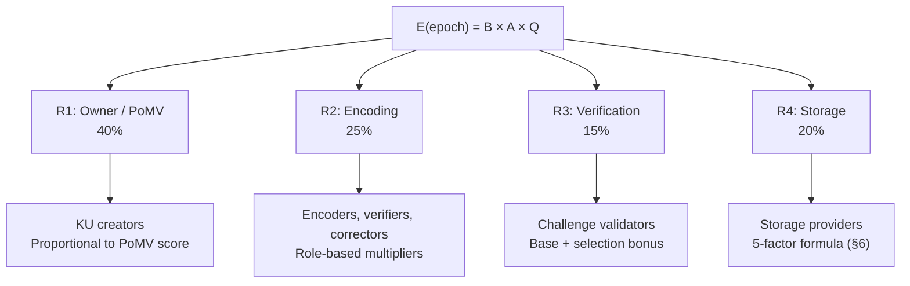
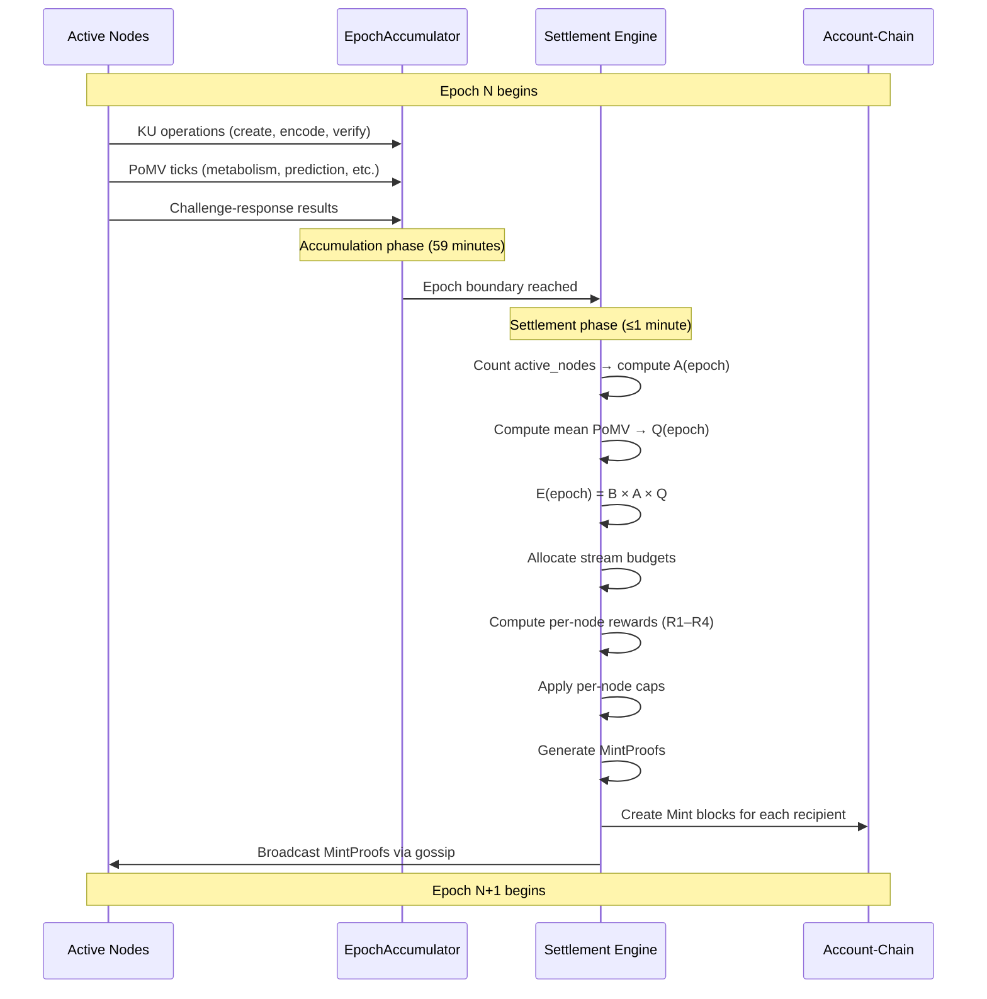

# 5. Output-Based Minting

This section specifies the OBT minting mechanism — the process by which new tokens enter circulation. Unlike Proof-of-Work systems where mining *creates* blocks, or Proof-of-Stake systems where staking *purchases* validation rights, OBT minting is the **output** of verified knowledge work. No knowledge, no tokens.

## 5.1 Fundamental Principle: Minting is OUTPUT of Consensus

The defining characteristic of OBT minting is its temporal relationship to knowledge work. In every existing token system, token creation is either a *precondition* for participation or a *side effect* of block production. OBT inverts this relationship entirely.

### 5.1.1 The Three Minting Paradigms

| Paradigm | Token Creation Trigger | Temporal Relationship | Value Backing |
|----------|----------------------|----------------------|---------------|
| Proof-of-Work | Hash puzzle solved | Mining *creates* empty blocks, transactions fill them later | Energy expenditure (sunk cost) |
| Proof-of-Stake | Validator selected by stake weight | Staking *purchases* the right to propose blocks | Capital lockup (opportunity cost) |
| **Output-Based (OBT)** | **Knowledge work verified** | **KU created → encoded → verified → scored → THEN minted** | **Verified knowledge (intrinsic utility)** |

**Table 19.** Comparison of minting paradigms. OBT is the only system where minting occurs strictly *after* value creation.

In Bitcoin, a miner expends energy to solve a hash puzzle and receives a block reward — regardless of whether the block contains valuable transactions or is entirely empty. The reward is for *securing* the network, not for *creating* value within it.

In Ethereum PoS, a validator stakes 32 ETH to gain the right to propose and attest to blocks. The reward is proportional to participation in consensus, not to the value of the state transitions processed.

In OBT, the causal chain is unambiguous:

$$\text{KU created} \xrightarrow{\text{encode}} \text{KU encoded} \xrightarrow{\text{verify}} \text{Encoding verified} \xrightarrow{\text{score}} \text{PoMV computed} \xrightarrow{\text{mint}} \text{OBT created}$$

Every OBT token in existence can be traced back to a specific piece of verified knowledge work. There are no "empty block" rewards, no staking yields, and no inflation without utility.

### 5.1.2 Why Output-Based Minting Matters

The output-based model produces three critical properties:

1. **Intrinsic value backing.** Each minted token corresponds to a Knowledge Unit that passed encoding verification, PoMV scoring, and quality gates. The token represents *measured* knowledge utility.

2. **Self-regulating supply.** If no knowledge is created, no tokens are minted. If knowledge quality drops (low PoMV scores), fewer tokens are minted. The supply automatically contracts during periods of low activity or low quality.

3. **No rent-seeking equilibrium.** In PoW, miners with cheaper electricity earn more. In PoS, validators with more capital earn more. In OBT, participants who contribute more verified knowledge earn more — there is no passive income mechanism.

## 5.2 Global Emission Formula

### 5.2.1 Formula Definition

The total OBT emitted per epoch is governed by a three-factor formula:

$$E(\text{epoch}) = B \times A(\text{epoch}) \times Q(\text{epoch})$$

Where:

- $B = \text{BASE\_EMISSION\_PER\_EPOCH} = 10{,}000$ OBT (governance-adjustable)
- $A(\text{epoch}) = \min\!\left(\frac{\text{active\_nodes}}{1{,}000},\; 10.0\right)$ — activity factor
- $Q(\text{epoch}) = \frac{\sum_{ku \in KU_{\text{set}}} \text{PoMV}(ku)}{|KU_{\text{set}}|} \in [0.0, 1.0]$ — quality factor

### 5.2.2 Base Emission ($B$)

The base emission $B$ represents the theoretical maximum reward for a unit of network participation at unit scale and unit quality. Setting $B = 10{,}000$ OBT provides sufficient granularity for fractional rewards (OBT uses milliOBT internally) while keeping the human-readable numbers manageable.

$B$ is governance-adjustable: a future governance mechanism (§11) can modify $B$ through a supermajority vote of high-trust nodes. This allows the network to adapt to changing economic conditions without protocol forks.

### 5.2.3 Activity Factor ($A$)

The activity factor scales emission proportionally to network participation:

$$A(\text{epoch}) = \min\!\left(\frac{\text{active\_nodes}}{1{,}000},\; 10.0\right)$$

**Design rationale:**

- **Linear scaling below 10,000 nodes.** A network with 100 nodes should not emit the same amount as a network with 10,000 nodes. Linear scaling ensures that early-stage networks produce proportionally fewer tokens, preventing hyperinflation when the token has few holders.

- **Cap at 10× for networks above 10,000 nodes.** Beyond 10,000 active nodes, further scaling is unnecessary — the per-node reward naturally dilutes as more participants compete for a bounded emission. The cap prevents unlimited emission growth.

- **1,000-node normalization.** The divisor of 1,000 means that $A = 1.0$ at 1,000 nodes — a reasonable "maturity" threshold for a knowledge network. Below this, emission is dampened; above, it accelerates until the cap.

### 5.2.4 Quality Factor ($Q$)

The quality factor measures the average PoMV score of all Knowledge Units created or active in the epoch:

$$Q(\text{epoch}) = \frac{\sum_{ku \in KU_{\text{set}}} \text{PoMV}(ku)}{|KU_{\text{set}}|} \in [0.0, 1.0]$$

**Design rationale:**

- **Mean PoMV, not sum.** Using the mean (rather than the sum) prevents gaming by flooding the network with many low-quality KUs. 1,000 KUs with PoMV 0.01 produce $Q = 0.01$, not $Q = 10.0$.

- **Bounded $[0.0, 1.0]$.** Since individual PoMV scores are normalized to $[0.0, 1.0]$, the mean is also bounded. This makes the quality factor a true multiplier — it can only reduce emission, never amplify beyond the base × activity product.

- **Incentive alignment.** $Q$ creates a collective incentive: every participant benefits when the network's average knowledge quality is high. Low-quality contributions harm everyone's rewards, creating social pressure for quality.

### 5.2.5 Worked Examples

| Scenario | Active Nodes | $A$ | $Q$ | $E$ (OBT/epoch) |
|----------|:----------:|:---:|:---:|:-------:|
| Early network, moderate quality | 100 | 0.1 | 0.50 | 500 |
| Growing network, high quality | 1,000 | 1.0 | 0.75 | 7,500 |
| Mature network, high quality | 5,000 | 5.0 | 0.80 | 40,000 |
| Large network, excellent quality | 10,000 | 10.0 | 0.90 | 90,000 |
| Maximum emission | ≥10,000 | 10.0 | 1.00 | 100,000 |
| Spam attack (quality collapses) | 10,000 | 10.0 | 0.02 | 2,000 |

**Table 20.** Emission formula worked examples across network conditions.

The spam attack scenario demonstrates the self-regulating property: even at maximum scale, if quality collapses to 2%, emission drops to 2% of maximum. The attacker's spam *reduces* the rewards available to everyone, including the attacker.

## 5.3 Four Reward Streams

The epoch emission $E(\text{epoch})$ is distributed across four reward streams, each compensating a different type of knowledge work:



**Figure 6.** Four reward stream allocation from epoch emission.

The stream budgets are computed as:

$$\text{stream\_budget}(s) = E(\text{epoch}) \times w_s$$

Where $w_s$ is the weight for stream $s$. Default weights: $w_{R1} = 0.40$, $w_{R2} = 0.25$, $w_{R3} = 0.15$, $w_{R4} = 0.20$. These weights are governance-adjustable.

### 5.3.1 R1: Owner / PoMV Reward (40%)

The owner reward compensates KU creators proportionally to their knowledge's measured utility. This is the primary incentive for high-quality knowledge contribution.

**Formula:**

$$R1(\text{node}) = \sum_{ku \in \text{owned}(node)} \text{PoMV}(ku) \times \text{max\_reward\_per\_epoch}$$

Where:

$$\text{max\_reward\_per\_epoch} = \frac{E(\text{epoch}) \times w_{R1}}{|KU_{\text{active}}|}$$

The PoMV score is a composite of six biological signals, each measuring a different dimension of knowledge utility:

| Signal | Weight | Measurement | Intuition |
|--------|:------:|-------------|-----------|
| Metabolism | 0.35 | Access frequency, query hit rate | "How often is this knowledge used?" |
| Prediction | 0.15 | Accuracy of KU in answering queries | "How useful is this knowledge for answering questions?" |
| Entropy | 0.10 | Information density, uniqueness | "How much unique information does this KU contain?" |
| Survival | 0.10 | Longevity, retention after pruning passes | "How long has this knowledge remained relevant?" |
| Synaptic | 0.15 | Inbound link count, citation by other KUs | "How connected is this knowledge to other knowledge?" |
| Niche | 0.15 | Rarity of topic coverage in the network | "Does this knowledge fill a gap that few others cover?" |

**Table 21.** PoMV signal weights and interpretations.

The composite PoMV score is:

$$\text{PoMV}(ku) = \sum_{i=1}^{6} w_i \times \text{signal}_i(ku) \in [0.0, 1.0]$$

### 5.3.2 R2: Encoding Reward (25%)

The encoding reward compensates participants who transform raw content into structured Knowledge Units. Different encoding roles receive different multipliers to reflect the varying difficulty and value of each role.

**Base reward per encoding operation:**

$$\text{base} = \text{BASE\_OBT\_PER\_KB} \times \text{size\_kb} = 1.0 \times \text{size\_kb}$$

| Role | Multiplier | Bonus | Total Reward | Rationale |
|------|:---------:|:-----:|:------------:|-----------|
| FirstEncoder | base × 2 | +5 OBT | base×2 + 5 | First encoding is hardest — no prior structure to reference |
| Verifier | base × 1 | — | base×1 | Verification requires less effort than encoding |
| Corrector | base × 3 | — | base×3 | Corrections require understanding both original and corrected versions |
| ProBono | base × 2 | +10 OBT | base×2 + 10 | Community-beneficial encoding (e.g., public domain content) deserves extra incentive |

**Table 22.** Encoding role multipliers and bonuses.

**Example:** A 4 KB Knowledge Unit encoded by a FirstEncoder earns: $1.0 \times 4 \times 2 + 5 = 13$ OBT. A Verifier for the same KU earns: $1.0 \times 4 \times 1 = 4$ OBT.

### 5.3.3 R3: Verification Reward (15%)

The verification reward compensates nodes that participate in challenge-response verification of stored knowledge. This stream funds the network's quality assurance infrastructure.

**Formula:**

$$R3(\text{node}) = \text{base} + (\text{selected} \;?\; \text{base} / 2 : 0)$$

Where `base` is derived from the stream budget divided by the number of active verifiers, and `selected` indicates whether the node was randomly chosen for a specific challenge round.

The random selection mechanism ensures fair distribution: in any given epoch, approximately $\frac{1}{\text{active\_verifiers}} \times \text{challenges\_per\_epoch}$ verifications are assigned to each node. Over time, selection converges to uniform distribution, preventing verification cartels.

### 5.3.4 R4: Storage Reward (20%)

The storage reward compensates nodes that store and serve Knowledge Units. Unlike streams R1–R3, the storage reward uses a 5-factor content-aware formula that considers not just *how much* a node stores, but *what quality* of content it stores and *how reliably* it serves that content.

The full specification of the storage reward formula is presented in §6.2. In summary:

$$R4(\text{node}, \text{epoch}) = \sum_{ku \in \text{stored}(\text{node})} \text{STORAGE\_BASE\_RATE} \times \text{size\_w} \times \text{rarity\_w} \times \text{demand\_w} \times \text{duration\_f} \times \text{trust\_f}$$

This cross-references the detailed storage reward mechanism described in Chapter 6.

## 5.4 Per-Node Reward Cap

### 5.4.1 Cap Formula

To prevent any single node from capturing a disproportionate share of epoch emission, a per-node reward cap is enforced:

$$\text{cap}(\text{node}) = \frac{E(\text{epoch})}{\text{active\_nodes}} \times \text{TrustMultiplier}(\text{tier}(\text{node}))$$

The trust multiplier scales the cap based on the node's trust tier — higher-trust nodes are allowed to earn more per epoch, reflecting their demonstrated reliability and contribution history.

### 5.4.2 Trust Tier Multipliers

| Tier | Name | Trust Range | Multiplier | Effective Cap (at $E=10{,}000$, 100 nodes) |
|:----:|------|:----------:|:----------:|:------------------------------------------:|
| 0 | Leaf | [0.00, 0.10) | 0.10 | 10 OBT |
| 1 | Seedling | [0.10, 0.30) | 0.50 | 50 OBT |
| 2 | Contributor | [0.30, 0.50) | 1.00 | 100 OBT |
| 3 | Established | [0.50, 0.70) | 1.25 | 125 OBT |
| 4 | LocalSP | [0.70, 0.85) | 1.50 | 150 OBT |
| 5 | ZoneSP | [0.85, 0.95) | 1.75 | 175 OBT |
| 6 | GlobalSP | [0.95, 1.00] | 2.00 | 200 OBT |

**Table 23.** Trust tier multipliers and effective reward caps.

### 5.4.3 Anti-Sybil Analysis

The Leaf tier multiplier of 0.10 is the primary anti-Sybil mechanism for minting. Consider an attacker who creates 100 Sybil nodes:

- **Without cap:** 100 Sybil nodes could collectively claim a significant share of $E(\text{epoch})$.
- **With cap:** Each Sybil node (Leaf tier) earns at most $\frac{E}{N} \times 0.10$. As the attacker adds more nodes, $N$ increases, reducing each node's cap further.

**Formal analysis:** Let $S$ be the number of Sybil nodes and $N$ the total network size before the attack. The attacker's total earnings are bounded by:

$$\text{Sybil\_total} \leq S \times \frac{E(\text{epoch})}{N + S} \times 0.10$$

As $S \to \infty$:

$$\lim_{S \to \infty} S \times \frac{E}{N + S} \times 0.10 = 0.10 \times E$$

The attacker can capture at most 10% of epoch emission, regardless of how many Sybil nodes are created. In practice, the attacker captures far less because:

1. Each Sybil node must also pass the quality gates (§7.3).
2. Sybil nodes have no PoMV history, so $R1$ rewards are near zero.
3. Anti-gaming detectors (§7.4) flag coordinated Sybil behavior.

## 5.5 MintProof Structure

Every minting event produces a cryptographically verifiable proof that binds the minted amount to the knowledge activity that justified it.

### 5.5.1 Data Structure

```rust
pub struct MintProof {
    /// The activity that generated this minting reward
    pub activity: MintActivity,
    /// CID of the Knowledge Unit associated with this mint
    pub ku_cid: [u8; 32],
    /// Amount minted in milliOBT
    pub obt_amount: u64,
    /// The inputs to the emission formula used to compute this reward
    pub formula_inputs: FormulaInputs,
    /// Epoch in which this minting occurred
    pub epoch: u64,
    /// Ed25519 public key of the reward recipient
    pub recipient: [u8; 32],
    /// Witness signatures attesting to the validity of this mint
    pub witnesses: Vec<WitnessSignature>,
    /// Vector clock for causal ordering
    pub clock: VectorClock,
    /// Advisory wall-clock timestamp (Unix seconds)
    pub timestamp: u64,
}

pub enum MintActivity {
    /// R1: PoMV-based owner reward
    PomvReward { pomv_score: f64, signal_breakdown: [f64; 6] },
    /// R2: Encoding reward
    EncodingReward { role: EncodingRole, size_kb: f64 },
    /// R3: Verification reward
    VerificationReward { challenge_hash: [u8; 32], selected: bool },
    /// R4: Storage reward
    StorageReward { stored_ku_count: u32, total_size_bytes: u64 },
}

pub struct FormulaInputs {
    pub base_emission: u64,
    pub active_nodes: u32,
    pub quality_factor: f64,
    pub computed_epoch_emission: u64,
    pub stream_weight: f64,
    pub node_trust_tier: u8,
    pub node_cap: u64,
}
```

**Wire size:** 320–512 bytes depending on witness count and activity type.

### 5.5.2 Five-Step Verification

Any node receiving a MintProof performs five verification steps before accepting the corresponding Mint block:

| Step | Verification | Check |
|:----:|-------------|-------|
| 1 | Epoch context | `proof.epoch == current_epoch` or `proof.epoch == current_epoch - 1` (grace window) |
| 2 | Formula inputs | `proof.formula_inputs.active_nodes` matches locally observed active count (±5% tolerance) |
| 3 | Amount recomputation | Recompute `obt_amount` from `formula_inputs` — must match `proof.obt_amount` exactly |
| 4 | Witness signatures | ≥3 valid witness signatures from distinct nodes with trust ≥ 0.30 |
| 5 | Node cap | `proof.obt_amount ≤ cap(recipient)` for the given epoch |

**Table 24.** MintProof verification steps.

Step 3 is the critical anti-inflation check: any node can independently recompute the minted amount from the formula inputs and verify that the claimed amount matches. If the formula produces 42.7 OBT but the proof claims 100 OBT, the discrepancy is immediately detectable.

## 5.6 Epoch Settlement Process

### 5.6.1 Settlement Flow

Each epoch (1 hour) follows a deterministic settlement cycle:



**Figure 7.** Epoch settlement sequence diagram.

### 5.6.2 EpochAccumulator

The accumulator collects all minting-relevant events during the epoch:

```rust
pub struct EpochAccumulator {
    /// Epoch number
    pub epoch: u64,
    /// PoMV scores for all active KUs, keyed by CID
    pub pomv_scores: HashMap<[u8; 32], f64>,
    /// Mint events generated during this epoch
    pub mint_events: Vec<MintEvent>,
    /// Number of nodes that performed at least one operation
    pub active_nodes_count: u32,
    /// Results of storage challenge-response rounds
    pub challenge_results: Vec<ChallengeResult>,
    /// Encoding operations performed (for R2 computation)
    pub encoding_ops: Vec<EncodingOp>,
    /// Verification operations performed (for R3 computation)
    pub verification_ops: Vec<VerificationOp>,
    /// Timestamp of epoch start (Unix seconds)
    pub epoch_start: u64,
    /// Whether settlement has been computed for this epoch
    pub settled: bool,
}
```

The accumulator is a local structure — each node maintains its own view of the epoch's activity. During settlement, nodes use gossip-converged data to compute emission independently. The deterministic formula ensures that honest nodes arrive at the same result (within the ±5% tolerance for active node count).

## 5.7 Inflation Analysis

### 5.7.1 Theoretical Supply Growth

Unlike Bitcoin's discrete halving events, OBT's supply growth follows a natural asymptotic curve driven by the diminishing ratio of new emission to existing supply.

Let $S(t)$ denote total supply at epoch $t$, and $E(t)$ denote emission at epoch $t$. The inflation rate is:

$$\pi(t) = \frac{E(t)}{S(t)} = \frac{E(t)}{\sum_{\tau=0}^{t-1} E(\tau)}$$

Even if $E(t)$ is constant, $\pi(t)$ decreases monotonically as $S(t)$ grows. If $E(t)$ also varies (due to $A$ and $Q$ fluctuations), the decline is more complex but still asymptotically decreasing.

### 5.7.2 Year-by-Year Projection

Assuming a steady-state network of 5,000 nodes with $Q = 0.80$ (realistic mature network conditions):

$$E_{\text{per\_epoch}} = 10{,}000 \times 5.0 \times 0.80 = 40{,}000 \text{ OBT}$$

$$E_{\text{annual}} = 40{,}000 \times 24 \times 365 = 350{,}400{,}000 \text{ OBT}$$

| Year | Cumulative Supply (M OBT) | Annual Emission (M OBT) | Inflation Rate |
|:----:|:------------------------:|:----------------------:|:--------------:|
| 1 | 350.4 | 350.4 | — (genesis) |
| 2 | 700.8 | 350.4 | 100.0% |
| 3 | 1,051.2 | 350.4 | 50.0% |
| 4 | 1,401.6 | 350.4 | 33.3% |
| 5 | 1,752.0 | 350.4 | 25.0% |
| 6 | 2,102.4 | 350.4 | 20.0% |
| 7 | 2,452.8 | 350.4 | 16.7% |
| 8 | 2,803.2 | 350.4 | 14.3% |
| 9 | 3,153.6 | 350.4 | 12.5% |
| 10 | 3,504.0 | 350.4 | 11.1% |

**Table 25.** Year-by-year inflation projection under steady-state conditions.

### 5.7.3 Comparison with Bitcoin Halving

Bitcoin achieves declining inflation through discrete halving events every 210,000 blocks (~4 years), creating a step function. OBT achieves the same directional effect through a smooth, continuous decline — $\pi(t) = \frac{1}{t}$ under constant emission.

| Property | Bitcoin | OBT |
|----------|---------|-----|
| Decline mechanism | Discrete halvings (50% reduction) | Continuous asymptotic decline |
| Supply cap | 21 million BTC | No cap (river model) |
| Year 1 inflation | ~100% (estimated) | ~100% (genesis year) |
| Year 5 inflation | ~33% (pre-first-halving) | ~25% (steady-state) |
| Year 10 inflation | ~12% (post-second-halving) | ~11.1% (steady-state) |
| Year 20 inflation | ~1.8% (post-third-halving) | ~5.3% (steady-state) |
| Long-term inflation | 0% (supply exhausted) | $\to 0\%$ (asymptotic, never zero) |

**Table 26.** Bitcoin vs OBT inflation schedule comparison.

The key difference emerges after year 20: Bitcoin's inflation drops to near-zero as block rewards become negligible, raising questions about long-term security funding (the "fee market" problem). OBT's inflation asymptotically approaches zero but never reaches it — there is always a non-zero emission, ensuring that knowledge work is always compensated. This eliminates the need for a separate fee market.

### 5.7.4 Real-World Inflation Dynamics

The steady-state projection in Table 25 assumes constant emission, which is unlikely in practice. Real-world dynamics include:

- **Network growth:** As more nodes join, $A$ increases, raising emission — but the denominator (number of nodes competing for rewards) also increases, diluting per-node rewards.

- **Quality fluctuations:** If knowledge quality declines, $Q$ drops, reducing emission. This creates a negative feedback loop: lower quality → fewer tokens → less incentive for spam → quality recovers.

- **Seasonal patterns:** Knowledge creation may exhibit weekly or seasonal cycles, causing $E$ to fluctuate. These fluctuations smooth out over annual timescales.

The net effect is that OBT's inflation is *adaptive* — it responds to real-time network conditions rather than following a predetermined schedule. This is a fundamental advantage over fixed-schedule systems: the monetary policy is **data-driven**, not ideological.
