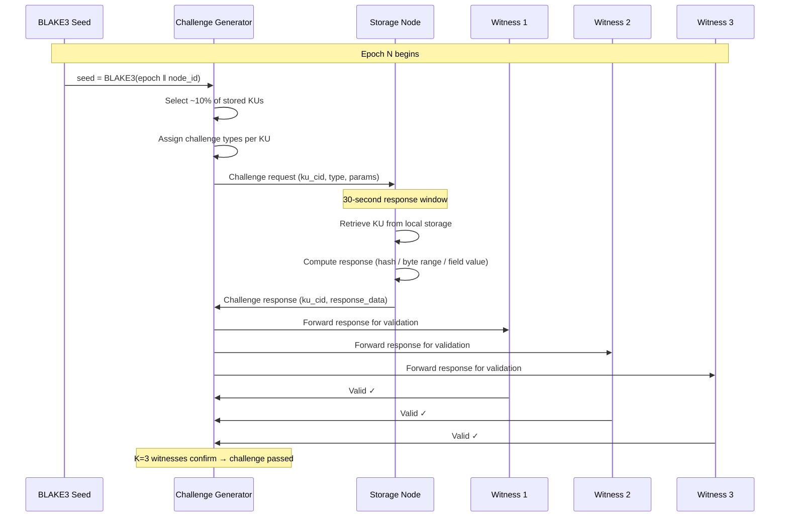

# 6. Content-Aware Storage Rewards

This section specifies the OBT storage reward mechanism — a content-aware incentive system that rewards storage providers not merely for *holding bytes*, but for storing *valuable, rare, and actively-used knowledge*. We present the 5-factor reward formula, the Proof-of-Storage challenge protocol, the strike system, and a detailed comparison with existing decentralized storage systems.

## 6.1 Why Content-Aware Storage Rewards

### 6.1.1 The Opaque Bytes Problem

Existing decentralized storage networks treat stored data as opaque byte sequences. A storage provider earns the same reward for storing 1 GB of random noise as for storing 1 GB of peer-reviewed research — the protocols have no mechanism to distinguish between them.

| System | Storage Unit | Content Awareness | Reward Basis |
|--------|-------------|:-----------------:|-------------|
| Filecoin | 32 GiB sectors | ❌ None | Sector sealed + spacetime proof |
| Arweave | Arbitrary data blocks | ❌ None | Endowment (one-time payment) |
| Sia | File contracts | ❌ None | Contract fulfillment |
| **OBT** | **Knowledge Units** | **✅ Full** | **5-factor formula (content, usage, rarity, trust, duration)** |

**Table 27.** Content awareness in decentralized storage systems.

This is not merely an aesthetic difference. Opaque-byte systems produce three economic inefficiencies:

1. **Misaligned incentives.** Storage providers are incentivized to store whatever maximizes reward-per-byte, not whatever is most valuable to the network. In Filecoin, this led to the "junk data" problem where miners sealed empty sectors to earn block rewards.

2. **No demand signal.** Without content awareness, the protocol cannot distinguish between a rarely-accessed file and a heavily-used dataset. Both receive the same reward, despite vastly different utility.

3. **No quality feedback.** If stored data becomes obsolete, corrupted, or superseded, the storage reward does not reflect this — the provider continues earning as if the data were still valuable.

### 6.1.2 OBT's Solution

OBT solves these problems by leveraging the semantic properties of Knowledge Units. Because KUs are structured (they have genes, bonds, metabolism scores, and trust lineage), the storage reward can incorporate *meaning-aware* factors:

- **Size** — larger KUs contain more information and deserve proportionally higher rewards.
- **Rarity** — KUs with fewer replicas are more valuable to store (supply-side scarcity).
- **Demand** — KUs that are frequently accessed are more valuable to the network (demand-side utility).
- **Duration** — nodes that store KUs reliably over long periods demonstrate commitment.
- **Trust** — nodes with higher EigenTrust scores are more reliable and deserve higher rewards.

## 6.2 The 5-Factor Formula

### 6.2.1 Full Mathematical Specification

The storage reward for a node in a given epoch is the sum of rewards across all KUs stored by that node:

$$R4(\text{node}, \text{epoch}) = \sum_{ku \in \text{stored}(\text{node})} \text{STORAGE\_BASE\_RATE} \times w_{\text{size}}(ku) \times w_{\text{rarity}}(ku) \times w_{\text{demand}}(ku) \times f_{\text{duration}}(\text{node}, ku) \times f_{\text{trust}}(\text{node})$$

Where:

- $\text{STORAGE\_BASE\_RATE} = 0.001$ OBT per KU per epoch

### 6.2.2 Factor 1: Size Weight ($w_{\text{size}}$)

$$w_{\text{size}}(ku) = \text{clamp}\!\left(\frac{\text{wire\_bytes}(ku)}{1024},\; 0.1,\; 10.0\right)$$

**Rationale:** Larger KUs require more disk space, bandwidth for serving, and I/O for challenge-response. The reward should reflect this cost. A 10 KB KU earns 10× the base reward of a 1 KB KU, but the clamp at 10.0 prevents pathological KUs from dominating rewards.

**Boundary analysis:**
- Minimum: A 102-byte KU (theoretical minimum after encoding) earns $\text{clamp}(0.1, 0.1, 10.0) = 0.1$ — one-tenth of base rate.
- Maximum: A 10 KB+ KU earns $\text{clamp}(10.0, 0.1, 10.0) = 10.0$ — ten times the base rate.
- Typical: A 2 KB KU earns $\text{clamp}(2.0, 0.1, 10.0) = 2.0$ — double the base rate.

### 6.2.3 Factor 2: Rarity Weight ($w_{\text{rarity}}$)

$$w_{\text{rarity}}(ku) = \text{clamp}\!\left(\frac{K_{\text{TARGET}}}{\text{actual\_replicas}(ku)},\; 0.5,\; 3.0\right)$$

Where $K_{\text{TARGET}} = 20$ is the target replication factor for the DHT.

**Rationale:** If a KU has exactly 20 replicas (the target), $w_{\text{rarity}} = 1.0$ — standard reward. If the KU is under-replicated (only 7 copies), $w_{\text{rarity}} = 20/7 \approx 2.86$ — nearly 3× the standard reward, incentivizing nodes to store rare content. If the KU is over-replicated (60 copies), $w_{\text{rarity}} = 20/60 \approx 0.33$, clamped to $0.5$ — reduced reward discourages further replication of already-abundant content.

**Equilibrium dynamics:** The rarity weight creates a natural equilibrium: under-replicated KUs offer higher rewards, attracting storage providers, which increases replicas, which reduces the rarity weight, stabilizing replication near $K_{\text{TARGET}}$.

### 6.2.4 Factor 3: Demand Weight ($w_{\text{demand}}$)

$$w_{\text{demand}}(ku) = \text{clamp}\!\left(\frac{\text{metabolism}(ku)}{\text{median\_metabolism}},\; 0.1,\; 5.0\right)$$

Where `metabolism(ku)` is the PoMV metabolism signal (access frequency, query hit rate) and `median_metabolism` is the median metabolism score across all active KUs in the epoch.

**Rationale:** KUs that are frequently accessed provide more utility to the network. A KU with 5× the median access rate earns 5× the demand reward — but the floor at 0.1 ensures that even rarely-accessed KUs receive some storage reward (they may become relevant in the future).

**Anti-gaming note:** Metabolism is measured across the network via gossip-aggregated counters, not self-reported by the storage node. A node cannot inflate its own KU's metabolism by repeatedly querying itself — queries from the same source are deduplicated in the metabolism computation (§3 of the OBP specification).

### 6.2.5 Factor 4: Duration Factor ($f_{\text{duration}}$)

$$f_{\text{duration}}(\text{node}, ku) = \min\!\left(\frac{\text{epochs\_stored}(\text{node}, ku)}{100},\; 2.0\right)$$

**Rationale:** Nodes that store a KU for a long time demonstrate commitment and reliability. The loyalty bonus ramps linearly from 0× at epoch 0 to 1× at epoch 100 (~4.17 days) and caps at 2× at epoch 200 (~8.33 days). This prevents "storage hopping" — cycling through KUs to maximize short-term rewards.

**Critical note:** `epochs_stored` is per-node-per-KU and tracks *continuous* storage. If a node drops a KU and re-acquires it, the counter resets to 0. This prevents gaming by briefly dropping and re-acquiring KUs to appear as "new" replicas.

### 6.2.6 Factor 5: Trust Factor ($f_{\text{trust}}$)

$$f_{\text{trust}}(\text{node}) = \text{EigenTrust}(\text{node}) \in [0.0, 1.0]$$

**Rationale:** Nodes with higher EigenTrust scores have demonstrated reliability through consistent, correct behavior over time. A node with trust 0.9 earns 90% of potential storage rewards; a node with trust 0.1 earns only 10%. This creates a strong incentive for honest behavior and a deterrent against trust-damaging actions.

### 6.2.7 Worked Examples

| KU Profile | size_w | rarity_w | demand_w | duration_f | trust_f | Reward per Epoch |
|-----------|:------:|:--------:|:--------:|:----------:|:-------:|:-------:|
| Small, common, low-use, new node, low trust | 0.5 | 0.5 | 0.1 | 0.10 | 0.30 | 0.000 OBT |
| Medium, target replicas, average use, 50 epochs, good trust | 2.0 | 1.0 | 1.0 | 0.50 | 0.70 | 0.001 OBT |
| Large, rare, high-demand, loyal node, high trust | 8.0 | 2.5 | 4.0 | 2.00 | 0.95 | 0.152 OBT |
| Max profile (all factors at ceiling) | 10.0 | 3.0 | 5.0 | 2.00 | 1.00 | 0.300 OBT |

**Table 28.** Storage reward calculation examples. Reward = $0.001 \times w_{\text{size}} \times w_{\text{rarity}} \times w_{\text{demand}} \times f_{\text{duration}} \times f_{\text{trust}}$.

The 1,000× range between the minimum and maximum per-KU reward reflects the protocol's design intent: storage of high-value, rare, in-demand knowledge by trusted, committed nodes is vastly more valuable to the network than storage of low-value, abundant, unused knowledge by untrusted newcomers.

## 6.3 PoS-KU Challenge Protocol

Storage rewards are only disbursed to nodes that can *prove* they actually store the claimed KUs. The Proof-of-Storage for Knowledge Units (PoS-KU) protocol uses a challenge-response mechanism with three challenge types.

### 6.3.1 Challenge Seed Generation

The challenge seed is deterministic, computed from the epoch number and node ID:

$$\text{seed} = \text{BLAKE3}(\text{epoch\_number} \;\|\; \text{node\_id})$$

This seed determines:
1. **Which KUs** are challenged (~10% of stored KUs per epoch).
2. **Which challenge type** is selected for each KU.
3. **Which byte range** (for ByteRange challenges) or **which field** (for FieldExtract challenges) is targeted.

The deterministic seed prevents nodes from predicting challenges before the epoch begins (the epoch number is unknown until the epoch starts) while ensuring that any observer can independently verify which challenges were issued.

### 6.3.2 Three Challenge Types

| Challenge Type | Frequency | Description | Proves |
|---------------|:---------:|-------------|--------|
| FullHash | 20% | Hash the entire KU and return BLAKE3 digest | Node stores the complete KU |
| ByteRange | 50% | Hash bytes in range $[\text{start}, \text{end})$ extracted from seed | Node stores the KU contiguously (not just header/metadata) |
| FieldExtract | 30% | Extract a specific gene or field from the KU and return its value | Node can parse and serve semantic content (not just raw bytes) |

**Table 29.** PoS-KU challenge types and distribution.

**FieldExtract** is unique to OBT and impossible in opaque-byte storage systems. Because KUs have structured content (genes, bonds, metadata), the challenge can request semantic content — e.g., "return the value of gene `author.name` from KU with CID `0xabc...`." This proves that the node stores a *parseable, semantically intact* Knowledge Unit, not just a byte blob.

### 6.3.3 Challenge-Response Flow



**Figure 8.** PoS-KU challenge-response sequence diagram.

### 6.3.4 Response Window

The 30-second response window is calibrated to allow honest nodes operating on consumer hardware (HDD storage, moderate CPU) to retrieve and process the challenge. The window is deliberately short enough to prevent "fetch-on-demand" attacks where a node does not actually store the KU but retrieves it from the network upon challenge.

**Timing analysis:** On a consumer HDD with 10ms seek time and 100 MB/s sequential read, a 10 KB KU can be read in ~10.1ms. BLAKE3 hashing of 10 KB takes ~1μs on modern hardware. Network round-trip adds 50–200ms. Total honest response time: < 1 second, well within the 30-second window.

## 6.4 Strike System and Eviction

### 6.4.1 Challenge Failure Consequences

When a node fails a storage challenge (no response within 30 seconds, or incorrect response), two penalties are applied:

1. **No reward.** The node receives zero storage reward for the challenged KU in that epoch.

2. **Trust decay.** The node's EigenTrust score is reduced by the quarantine penalty factor:

$$\text{trust}_{\text{new}} = \text{trust}_{\text{old}} \times (1 - \text{QUARANTINE\_PENALTY})$$

Where $\text{QUARANTINE\_PENALTY} = 0.5$, meaning a single challenge failure halves the node's trust score. This is deliberately severe — storage integrity is a critical network property.

### 6.4.2 Strike Counter

Repeated failures are tracked by a strike counter:

```rust
pub struct StrikeRecord {
    /// Node that failed the challenge
    pub node_id: [u8; 32],
    /// Number of strikes in the current window
    pub strike_count: u8,
    /// Epoch of the first strike in the current window
    pub window_start: u64,
    /// Details of each strike
    pub strikes: Vec<StrikeDetail>,
}

pub struct StrikeDetail {
    /// Epoch of the failed challenge
    pub epoch: u64,
    /// CID of the KU that was not properly stored
    pub ku_cid: [u8; 32],
    /// Challenge type that was failed
    pub challenge_type: ChallengeType,
    /// Whether the response was missing or incorrect
    pub failure_mode: FailureMode,
}

pub enum FailureMode {
    /// No response within 30-second window
    Timeout,
    /// Response did not match expected value
    IncorrectResponse,
    /// Response was malformed or unparseable
    MalformedResponse,
}
```

### 6.4.3 Three-Strike Eviction

| Strike | Epoch Window | Consequence |
|:------:|:----------:|-------------|
| 1st | Current window | No reward for challenged KU + trust × 0.5 |
| 2nd | Within 720 epochs (30 days) of 1st | No reward for ALL stored KUs for 24 epochs + trust × 0.5 |
| 3rd | Within 720 epochs of 1st | **Eviction**: all stored KUs reassigned to other nodes |

**Table 30.** Strike escalation and eviction policy.

**Eviction process:**

1. The evicted node is removed from the DHT routing table for stored KUs.
2. All KUs previously stored by the evicted node are flagged as under-replicated.
3. The DHT's replication protocol assigns these KUs to other nodes (preferring nodes with high trust and low current storage load).
4. The evicted node's strike counter is reset, but trust damage persists. The node may re-join as a storage provider after rebuilding trust through other activities (encoding, verification).

### 6.4.4 Automatic Recovery

If a node avoids any strikes for 720 epochs (30 days), its strike counter resets to zero. This allows nodes that experienced transient failures (hardware issues, network outages) to recover without permanent punishment.

## 6.5 Five Anti-Gaming Layers

The storage reward system is protected by five overlapping anti-gaming mechanisms:

### Layer 1: Challenge Diversity

The three challenge types (FullHash, ByteRange, FieldExtract) prevent specialization attacks. A node that stores only the first 100 bytes of each KU (to pass FullHash challenges quickly) will fail ByteRange challenges targeting bytes 500–600. A node that stores only raw bytes without parsing will fail FieldExtract challenges.

### Layer 2: Unpredictable Timing

The BLAKE3 seed is computed from $\text{epoch\_number} \;\|\; \text{node\_id}$. Since the epoch number is unknown until the epoch starts, nodes cannot predict which KUs will be challenged or which challenge types will be issued. This prevents selective pre-computation of challenge responses.

### Layer 3: EigenTrust Gate

The trust factor $f_{\text{trust}}$ ensures that even if a node passes all challenges, its reward is proportional to its accumulated trust. A new node with trust 0.1 earns 10× less than a proven node with trust 1.0. This makes Sybil-based storage farming unprofitable — each Sybil node starts with minimal trust and must spend significant effort building trust before earning meaningful storage rewards.

### Layer 4: Rarity Balancing

The rarity weight $w_{\text{rarity}}$ prevents a strategy of storing only popular KUs (which are already widely replicated). Popular KUs have low rarity weights, while rare KUs have high rarity weights. This drives storage providers toward under-replicated content, improving network resilience.

### Layer 5: Cross-Epoch Consistency

The duration factor $f_{\text{duration}}$ rewards long-term commitment. A node that stores a KU for 200 epochs earns 2× the reward of a node that just acquired the KU. This prevents "storage cycling" — rapidly switching between KUs to exploit short-term reward fluctuations.

## 6.6 Comparison with Filecoin, Arweave, and Sia

### 6.6.1 Detailed Feature Comparison

| Feature | Filecoin | Arweave | Sia | **OBT** |
|---------|----------|---------|-----|---------|
| **Proof type** | PoRep + PoSt (WindowPoSt) | SPoRA (Succinct Proofs of Random Access) | Merkle proofs | **PoS-KU (3 challenge types)** |
| **Hardware requirement** | High (GPU for sealing) | Moderate (fast disk) | Low | **Low (consumer HDD)** |
| **Minimum sector size** | 32 GiB | None (any size) | 4 MB contract | **None (per-KU, typically 1–10 KB)** |
| **Content awareness** | ❌ None | ❌ None | ❌ None | **✅ Full (5-factor formula)** |
| **Penalty for failure** | Slashing (FIL burned) | Reduced mining probability | Contract termination | **Trust decay + strike system** |
| **Challenge frequency** | Every 24h (WindowPoSt) | Every block (~2 min) | On contract renewal | **Every epoch (1h), ~10% of KUs** |
| **Data retrieval** | Paid (requires unsealing) | Free (permaweb) | Paid (contract) | **Free (DHT gossip)** |
| **Redundancy model** | Provider chooses | Network-managed (endowment) | Contract-specified | **DHT K=20 target** |
| **Incentive for rare data** | ❌ None | ✅ Partial (Wildfire) | ❌ None | **✅ Rarity weight** |
| **Incentive for popular data** | ❌ None | ✅ Implicit (tips) | ❌ None | **✅ Demand weight** |
| **Long-term storage incentive** | Sector duration (6–18 months) | Permanent (endowment) | Contract renewal | **Duration factor (up to 2×)** |
| **Trust integration** | Power table (weighted by sectors) | Mining difficulty | Reputation (off-chain) | **EigenTrust (on-protocol)** |

**Table 31.** Detailed comparison of decentralized storage reward systems.

### 6.6.2 Design Inspirations

OBT's storage reward system borrows specific techniques from each predecessor while adding content-aware innovations:

**From Sia: Merkle Proofs.** The FullHash and ByteRange challenge types are directly inspired by Sia's Merkle proof system, which requires storage providers to prove possession of specific byte ranges within a file. OBT extends this with FieldExtract, which leverages KU structure.

**From Arweave: Random Recall.** The BLAKE3-seeded challenge selection is inspired by Arweave's Succinct Proofs of Random Access (SPoRA), which uses block hashes to select random data chunks for proof. OBT adapts this by using epoch and node ID as seed inputs, producing per-node challenge schedules.

**From Filecoin: WindowPoSt Timing.** The epoch-based challenge schedule (every hour, ~10% of KUs) is inspired by Filecoin's WindowPoSt, which requires periodic proofs at fixed intervals. OBT's 1-hour epochs provide a good balance between verification frequency and computational overhead.

**OBT's novel contribution:** The 5-factor formula itself is novel — no existing system combines size, rarity, demand, duration, and trust into a unified content-aware reward function. This is possible because OBT stores *Knowledge Units* with known semantic structure, not opaque byte blobs.

### 6.6.3 Quantitative Performance Comparison

Beyond qualitative feature differences, the systems differ substantially in their economic efficiency — the ratio of storage reward to actual storage cost:

| Metric | Filecoin | Arweave | Sia | **OBT** |
|--------|:--------:|:-------:|:---:|:-------:|
| Min hardware cost to participate | ~$5,000 (GPU + NVMe) | ~$500 (fast SSD) | ~$200 (HDD) | **~$50 (any storage)** |
| Reward per GB per month (approx.) | $0.10–$0.50 | One-time ($5–$10) | $0.50–$2.00 | **Variable (5-factor)** |
| Penalty severity (% of stake/trust) | 5–100% (FIL slashing) | None (reduced mining chance) | Contract loss | **50% trust per strike** |
| Challenge overhead (bandwidth) | High (PoRep sealing) | Moderate (SPoRA) | Low (Merkle) | **Low (~1 KB per challenge)** |
| Time to first reward | ~24 hours (sealing) | ~2 minutes (first block) | Contract period | **~1 hour (first epoch)** |

**Table 32.** Quantitative performance comparison across decentralized storage systems.

## 6.7 Storage Reward Budget Allocation

### 6.7.1 Budget Computation

The total storage reward budget for an epoch is derived from the global emission formula (§5.2):

$$\text{storage\_budget}(\text{epoch}) = E(\text{epoch}) \times w_{R4} = B \times A(\text{epoch}) \times Q(\text{epoch}) \times 0.20$$

Under steady-state conditions (5,000 nodes, $Q = 0.80$):

$$\text{storage\_budget} = 10{,}000 \times 5.0 \times 0.80 \times 0.20 = 8{,}000 \text{ OBT/epoch}$$

### 6.7.2 Distribution Mechanism

The storage budget is distributed proportionally to each node's computed reward:

$$R4_{\text{actual}}(\text{node}) = \text{storage\_budget} \times \frac{R4_{\text{raw}}(\text{node})}{\sum_{n \in \text{storage\_nodes}} R4_{\text{raw}}(n)}$$

Where $R4_{\text{raw}}$ is the unnormalized reward from the 5-factor formula. This normalization ensures that the total storage rewards never exceed the budget, regardless of how many nodes participate or how many KUs are stored.

**Consequence:** If many high-trust nodes store many high-value KUs, individual rewards decrease (budget dilution). If few nodes store few KUs, individual rewards increase. This creates a natural market equilibrium for storage provision.

### 6.7.3 Minimum Reward Threshold

To avoid dust payments (extremely small rewards that cost more to process than they are worth), a minimum reward threshold is enforced:

$$R4_{\text{actual}}(\text{node}) < 0.001 \text{ OBT} \implies R4_{\text{actual}} = 0$$

Unrewarded amounts are rolled back into the next epoch's storage budget.

## 6.8 Edge Cases and Failure Modes

### 6.8.1 Network Partition During Challenge

If a network partition prevents a challenged node from receiving or responding to a challenge:

- The node does not receive a strike if it can prove (via gossip logs and vector clock evidence) that it was partitioned during the challenge window.
- Proof of partition requires showing that no gossip messages from any peer were received during the challenge window — not merely the absence of the challenge itself.
- If partition proof is accepted by ≥3 witnesses, the challenge is voided and rescheduled for the next epoch.

### 6.8.2 KU Mutation After Challenge Seed Generation

If a KU is modified (e.g., gene update via CRDT merge) after the challenge seed is generated but before the challenge is issued, the stored version may differ from the "expected" version:

- **Resolution:** Challenges always use the KU version as of the epoch boundary (the snapshot at which the challenge seed was computed). Nodes must retain the epoch-boundary version until the challenge window closes.
- **Implementation:** Nodes maintain a short-lived "challenge snapshot" buffer that preserves the state of challenged KUs at the epoch boundary. This buffer is released after all challenges for the epoch are resolved.

### 6.8.3 Under-Replicated KUs

If a KU has fewer than $K_{\text{MIN}} = 3$ replicas (critical under-replication):

- **Emergency replication:** The DHT coordinator broadcasts a high-priority replication request.
- **Elevated rarity reward:** $w_{\text{rarity}} = 3.0$ (maximum) for any node that acquires the KU within 24 epochs.
- **Duration exception:** The duration factor for emergency replications starts at $f_{\text{duration}} = 0.5$ (rather than 0.0) to provide immediate incentive.

### 6.8.4 Storage Node Graceful Exit

A node that wishes to stop storing KUs can initiate a graceful exit:

1. **Announcement:** The node broadcasts a `StorageExitIntent` message with a 48-epoch (2-day) countdown.
2. **Migration:** During the countdown, the DHT assigns the node's KUs to other storage providers.
3. **Final challenge:** The exiting node must pass one final challenge round to receive its last epoch's reward.
4. **Clean exit:** After migration completes and the final challenge passes, the node is removed from the storage provider set with no trust penalty.

This mechanism prevents abrupt departures from causing under-replication cascades and rewards responsible exit behavior.
