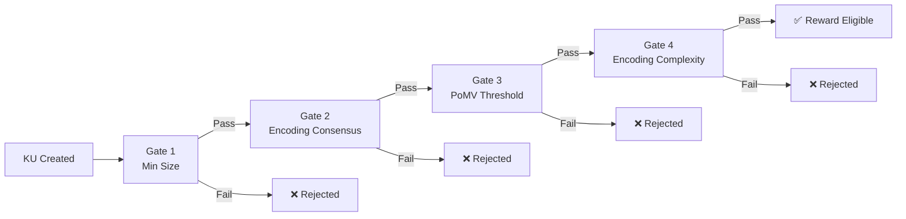

# 7. Anti-Gaming and Quality Assurance

This section specifies the mechanisms that protect the OBT network from gaming, spam, and abuse. Unlike blockchain systems that rely on transaction fees as the primary anti-spam mechanism, OBT uses **trust as a resource proxy** — a multi-layered system of rate limiting, quality gates, and pattern detectors that make gaming economically irrational. We present the complete anti-gaming architecture, from per-tier rate limits through four sequential quality gates to four specialized gaming pattern detectors, and conclude with a formal cost-benefit analysis demonstrating that honest participation always dominates gaming strategies.

## 7.1 Trust as Resource Proxy

### 7.1.1 The Transaction Fee Problem

Traditional blockchains use transaction fees as an anti-spam mechanism: each operation costs money, making mass-spam expensive. This is effective but creates two problems:

1. **Barrier to entry.** New users must acquire tokens before they can perform any operation, creating a cold-start problem.
2. **Fee market volatility.** During congestion, fees spike unpredictably, pricing out legitimate users. Ethereum gas fees during NFT mints regularly exceeded \$100 per transaction.

OBT replaces transaction fees with **EffectiveTrust** — a non-transferable, earned metric that gates access to protocol operations:

$$\text{EffectiveTrust}(\text{node}) = \text{EigenTrust}(\text{node}) \times \text{TierWeight}(\text{tier}(\text{node}))$$

### 7.1.2 Tier Weights

| Tier | Name | EigenTrust Range | TierWeight | EffectiveTrust (at max EigenTrust in range) |
|:----:|------|:---------------:|:----------:|:------------------------------------------:|
| 0 | Leaf | [0.00, 0.10) | 0.1 | 0.010 |
| 1 | Seedling | [0.10, 0.30) | 0.5 | 0.150 |
| 2 | Contributor | [0.30, 0.50) | 1.0 | 0.500 |
| 3 | Established | [0.50, 0.70) | 1.5 | 1.050 |
| 4 | LocalSP | [0.70, 0.85) | 2.0 | 1.700 |
| 5 | ZoneSP | [0.85, 0.95) | 3.0 | 2.850 |
| 6 | GlobalSP | [0.95, 1.00] | 5.0 | 5.000 |

**Table 33.** Trust tiers, weights, and maximum EffectiveTrust values.

### 7.1.3 Comparison with Alternative Anti-Spam Mechanisms

| System | Anti-Spam Mechanism | Transferable? | Cold-Start Cost | Volatility |
|--------|-------------------|:------------:|:--------------:|:----------:|
| Ethereum | Gas fees (ETH) | ✅ Yes | High (must buy ETH) | High (fee spikes) |
| Nano | Balance-based priority buckets | ✅ Yes | Low (faucet) | Low |
| IOTA | Mana (reputation-like) | ❌ No | Low | Low |
| Helium | Hardware cost (hotspot) | N/A | High (\$400+) | None |
| **OBT** | **EffectiveTrust** | **❌ No** | **Zero** | **None** |

**Table 34.** Anti-spam mechanism comparison across systems.

The non-transferability of EffectiveTrust is critical: an attacker cannot purchase trust on a secondary market. Trust must be *earned* through verified knowledge work — creating high-quality KUs, performing accurate encodings, passing storage challenges — over an extended period. This makes gaming proportionally expensive to the trust level required.

## 7.2 Rate Limiting by Tier

### 7.2.1 Rate Limit Parameters

Each trust tier has associated rate limits that govern the maximum frequency of protocol operations:

| Parameter | Leaf (T0) | Seedling (T1) | Contributor (T2) | Established (T3) | LocalSP (T4) | ZoneSP (T5) | GlobalSP (T6) |
|-----------|:---------:|:------------:|:----------------:|:----------------:|:------------:|:-----------:|:-------------:|
| MAX_KU_PER_HR | 1 | 3 | 5 | 8 | 10 | 15 | 20 |
| MAX_ENCODE_PER_HR | 2 | 3 | 5 | 8 | 10 | 15 | 20 |
| MAX_VERIFY_PER_HR | 5 | 10 | 15 | 20 | 30 | 40 | 50 |
| COOLDOWN_MINUTES | 60 | 20 | 12 | 8 | 6 | 4 | 3 |
| MAX_MINT_PER_EPOCH (OBT) | 10 | 30 | 50 | 75 | 100 | 150 | 200 |
| MAX_TRANSFER_PER_HR | 2 | 5 | 10 | 15 | 20 | 30 | 50 |

**Table 35.** Rate limit parameters by trust tier.

### 7.2.2 Sliding Window Algorithm

Rate limits are enforced using a sliding window algorithm that tracks operations within a rolling time horizon:

```rust
pub struct RateLimitTracker {
    /// Circular buffer of operation timestamps
    pub timestamps: VecDeque<u64>,
    /// Maximum operations allowed in the window
    pub max_operations: u32,
    /// Window duration in seconds
    pub window_seconds: u64,
    /// Operation type being tracked
    pub operation_type: OperationType,
    /// Current tier of the node
    pub tier: u8,
}

impl RateLimitTracker {
    /// Returns true if the operation is allowed, false if rate-limited
    pub fn check_and_record(&mut self, now: u64) -> bool {
        // Evict timestamps outside the window
        let window_start = now.saturating_sub(self.window_seconds);
        while let Some(&front) = self.timestamps.front() {
            if front < window_start {
                self.timestamps.pop_front();
            } else {
                break;
            }
        }
        
        // Check if under the limit
        if self.timestamps.len() as u32 >= self.max_operations {
            return false; // Rate limited
        }
        
        // Record the operation
        self.timestamps.push_back(now);
        true
    }
    
    /// Returns seconds until the next operation is allowed
    pub fn time_until_next(&self, now: u64) -> u64 {
        if self.timestamps.len() as u32 < self.max_operations {
            return 0; // Immediate
        }
        let oldest = self.timestamps.front().unwrap();
        let window_start = now.saturating_sub(self.window_seconds);
        if *oldest >= window_start {
            oldest + self.window_seconds - now
        } else {
            0
        }
    }
}

pub enum OperationType {
    CreateKU,
    Encode,
    Verify,
    Transfer,
    Mint,
}
```

The sliding window (as opposed to a fixed-window counter) prevents burst exploitation at window boundaries. In a fixed-window system, a node could perform $N$ operations at the end of one window and $N$ more at the start of the next, achieving $2N$ operations in a short period. The sliding window eliminates this edge case.

## 7.3 Four Quality Gates (Sequential Pipeline)

Every Knowledge Unit must pass through four sequential quality gates before it becomes eligible for minting rewards. Gates are evaluated in order — failure at any gate terminates the pipeline and the KU does not earn rewards.



**Figure 9.** Four sequential quality gates. Each KU must pass all four gates to become reward-eligible.

### 7.3.1 Gate 1: Minimum Size

| Parameter | Threshold | Purpose |
|-----------|:---------:|---------|
| `raw_size` | ≥ 256 bytes | Prevents trivially small KUs (e.g., single-word entries) |
| `gene_count` | ≥ 2 | Ensures minimum structural complexity (at least 2 genes) |

**Attack prevented:** An attacker creates millions of single-byte KUs to flood the network and claim R1 rewards. Gate 1 rejects all KUs smaller than 256 bytes with fewer than 2 genes.

**False positive analysis:** Legitimate very short KUs (e.g., a concise definition with only one gene) are rejected. This is acceptable — the network prioritizes quality over coverage, and extremely short KUs can be combined into a larger KU.

### 7.3.2 Gate 2: Encoding Consensus

| Parameter | Threshold | Purpose |
|-----------|:---------:|---------|
| `verifier_count` | ≥ 3 AI verifiers | Prevents self-verification |
| `encoding_status` | `FULL` | Ensures complete encoding (not partial or draft) |
| `cid_unique` | Unique in network | Prevents exact duplicates from earning double rewards |

**Attack prevented:** An attacker uses a local AI to generate and self-verify KUs without network consensus. Gate 2 requires at least 3 distinct AI verifiers to have confirmed the encoding, and the encoding must be marked as `FULL` (complete). The unique CID check prevents submitting the same content twice under different identities.

**Duplicate detection:** The CID (Content Identifier) is computed as BLAKE3 over the canonical encoding of the KU. Two KUs with identical content will have identical CIDs regardless of who created them, when, or where. The network maintains a CID set (via DHT) and rejects Mint blocks referencing duplicate CIDs.

### 7.3.3 Gate 3: PoMV Threshold (Tiered by Age)

This gate ensures that KUs demonstrate ongoing utility to earn long-term rewards. The threshold increases with the KU's age:

| KU Age (epochs) | KU Age (approx.) | PoMV Threshold | Rationale |
|:--------------:|:-----------------:|:--------------:|-----------|
| 0 – 168 | 0 – 7 days | 0.00 (grace) | New KUs need time to accumulate metabolism, citations |
| 168 – 720 | 7 – 30 days | ≥ 0.01 | Minimum viability — KU must show *some* usage |
| > 720 | > 30 days | ≥ 0.05 | Sustained value — KU must demonstrate ongoing utility |

**Table 36.** PoMV threshold tiers by KU age.

**Attack prevented:** An attacker creates KUs that pass Gates 1–2 but are never used by anyone. During the 7-day grace period, the KU earns minimal rewards. After 7 days, it must demonstrate a PoMV score ≥ 0.01 (very low bar — any genuine usage achieves this). After 30 days, the threshold rises to 0.05, filtering out KUs that received only artificial initial usage.

**Design rationale for grace period:** New KUs cannot have metabolism (no one has accessed them yet), synaptic connections (no one has cited them), or survival history (they just appeared). Requiring non-zero PoMV immediately would penalize all new content. The 7-day grace period allows genuine knowledge to accumulate organic signals.

### 7.3.4 Gate 4: Encoding Complexity

| Parameter | Threshold | Purpose |
|-----------|:---------:|---------|
| `encoding_time_ms` | ≥ 100 ms | Prevents trivially fast encodings (copy-paste without analysis) |
| `bond_count` | ≥ 1 | Ensures the KU is connected to at least one other KU |

**Attack prevented:** An attacker runs automated scripts that create syntactically valid but semantically empty KUs in milliseconds. Gate 4 requires that the encoding process took at least 100ms (indicating non-trivial AI processing) and produced at least one bond (indicating the content has semantic connections to existing knowledge).

**Summary of All Gate Parameters:**

| Gate | Parameter | Threshold | Attack Prevented |
|:----:|-----------|:---------:|-----------------|
| 1 | `raw_size` | ≥ 256 bytes | Trivially small KUs |
| 1 | `gene_count` | ≥ 2 | Structurally empty KUs |
| 2 | `verifier_count` | ≥ 3 | Self-verification |
| 2 | `encoding_status` | `FULL` | Partial/draft encodings |
| 2 | `cid_unique` | Unique | Exact duplicate submission |
| 3 | PoMV (0–7 days) | ≥ 0.00 | — (grace period) |
| 3 | PoMV (7–30 days) | ≥ 0.01 | Zero-utility KUs |
| 3 | PoMV (>30 days) | ≥ 0.05 | Low-value long-tail KUs |
| 4 | `encoding_time_ms` | ≥ 100 ms | Trivial encodings |
| 4 | `bond_count` | ≥ 1 | Isolated KUs |

**Table 37.** Complete quality gate parameter reference.

## 7.4 Four Gaming Pattern Detectors

Beyond the quality gates (which filter individual KUs), OBT deploys four specialized pattern detectors that analyze *behavioral patterns* across multiple KUs, nodes, and time periods. Each detector computes a gaming score from weighted signals and recommends a penalty tier.

### 7.4.1 Isolation Attack

**Description:** A group of colluding nodes temporarily disconnects from the main network, generates KUs within their isolated subnetwork, and reconnects to claim rewards for knowledge that was never validated by the broader network.

**Detection signals:**

| Signal | Weight | Measurement |
|--------|:------:|-------------|
| `simultaneous_offline` | 0.40 | Multiple nodes go offline simultaneously (within 5 minutes) |
| `gossip_gap` | 0.30 | Large gap in gossip messages from the group during the offline period |
| `internal_witnesses` | 0.20 | All witness signatures on generated KUs come from within the group |
| `burst_mints` | 0.10 | Spike in mint events immediately after reconnection |

**Detection formula:**

$$\text{isolation\_score} = \sum_{i=1}^{4} w_i \times \text{signal}_i$$

**Algorithm:**

1. Monitor node connectivity patterns via gossip heartbeats.
2. Flag groups of ≥3 nodes that go offline within 5 minutes of each other.
3. When the group reconnects, examine KUs created during the offline window.
4. Check if witness signatures on those KUs are exclusively from the offline group.
5. Compute `isolation_score` and apply penalty if threshold exceeded.

**Penalty recommendation:**
- $\text{score} < 0.3$: No action (may be coincidental network outage).
- $0.3 \leq \text{score} < 0.5$: Elevated scrutiny — increased challenge frequency for 48 epochs.
- $0.5 \leq \text{score} < 0.7$: Trust reduction — EigenTrust × 0.5 for all group members.
- $\text{score} \geq 0.7$: Jail — all group members quarantined for 168 epochs (7 days).

### 7.4.2 Burst Spam

**Description:** A node rapidly creates many low-quality KUs in a short period, attempting to pass quality gates with minimal content that barely meets the thresholds.

**Detection signals:**

| Signal | Weight | Measurement |
|--------|:------:|-------------|
| `rate_exceeds` | 0.35 | KU creation rate in top 1% of network distribution |
| `near_min_sizes` | 0.25 | >50% of KUs are within 10% of the 256-byte minimum |
| `content_similarity` | 0.25 | Average pairwise BLAKE3 similarity (Jaccard on 4-gram shingles) > 0.7 |
| `low_bond_diversity` | 0.15 | >80% of KUs bond to the same target KU |

**Detection formula:**

$$\text{burst\_score} = \sum_{i=1}^{4} w_i \times \text{signal}_i$$

**Algorithm:**

1. Track KU creation timestamps per node using the sliding window (§7.2.2).
2. Flag nodes whose creation rate exceeds the 99th percentile of network distribution.
3. For flagged nodes, analyze the distribution of KU sizes, content similarity, and bond targets.
4. Compute `burst_score` and apply penalty if threshold exceeded.

**Key insight:** Content similarity detection uses 4-gram BLAKE3 shingles rather than exact matching. This catches attackers who make trivial modifications (changing a single word, reordering sentences) to produce KUs with different CIDs but nearly identical content.

### 7.4.3 Circular Transfer (Wash Trading)

**Description:** A set of colluding accounts create a cycle of OBT transfers: A→B→C→A, creating the appearance of economic activity (which could be used to inflate metabolism scores or satisfy activity requirements) without any genuine value exchange.

**Detection algorithm:** Depth-First Search (DFS) cycle detection in the transfer graph.

```
function detect_wash_trading(transfer_graph, window_epochs=168):
    cycles = []
    for each node in transfer_graph:
        visited = {}
        stack = [(node, [node])]
        while stack is not empty:
            current, path = stack.pop()
            for neighbor in transfer_graph.outgoing(current, window_epochs):
                if neighbor == node and len(path) >= 2:
                    cycles.append(path + [neighbor])
                elif neighbor not in visited:
                    visited[neighbor] = true
                    stack.push((neighbor, path + [neighbor]))
    return unique(cycles)
```

**Detection signals (per detected cycle):**

| Signal | Weight | Measurement |
|--------|:------:|-------------|
| `has_cycle` | 0.40 | Cycle detected with length ≤ 10 nodes |
| `same_subnet` | 0.20 | >50% of cycle participants share the same IP subnet (/24) |
| `return_ratio` | 0.25 | Ratio of returned OBT to sent OBT > 80% |
| `timing_regularity` | 0.15 | Coefficient of variation of inter-transfer times < 0.2 (highly regular) |

**Detection formula:**

$$\text{wash\_score} = \sum_{i=1}^{4} w_i \times \text{signal}_i$$

**Penalty:** Applied to all accounts in the detected cycle. The most severe penalty is applied to the account with the highest total transfer volume in the cycle (presumed organizer).

### 7.4.4 Trust Farming (Long Con)

**Description:** A sophisticated attacker builds trust gradually through genuine (or genuine-appearing) contributions over weeks or months, then exploits the accumulated high trust to execute a large-scale gaming strategy (e.g., massive burst spam at high tier, or becoming a witness to sign fraudulent MintProofs).

**Detection signals:**

| Signal | Weight | Measurement |
|--------|:------:|-------------|
| `trust_quality_gap` | 0.35 | Trust tier ≥ 4 but average PoMV of recent KUs < 0.10 (high trust, low-quality output) |
| `activity_spike` | 0.25 | Activity in current epoch > 3× the node's 30-day moving average |
| `witness_concentration` | 0.25 | >60% of the node's witnessed KUs come from the same 5 accounts |
| `centrality_drop` | 0.15 | Node's graph centrality dropped >50% in the last 168 epochs (losing connections) |

**Detection formula:**

$$\text{farming\_score} = \sum_{i=1}^{4} w_i \times \text{signal}_i$$

**Key insight:** The `trust_quality_gap` signal is the most informative. A legitimate high-trust node produces consistently high-quality KUs (that is *how* they achieved high trust). A trust farmer, by contrast, produces just enough quality to maintain trust tier promotions, then pivots to low-quality high-volume output to maximize minting. The gap between trust level and recent output quality is a strong indicator of trust farming.

## 7.5 Security Analysis: Cost vs Benefit

### 7.5.1 Penalty Recommendation Thresholds

All four gaming pattern detectors share a common penalty framework:

| Score Range | Recommendation | Action |
|:----------:|---------------|--------|
| < 0.3 | None | No action taken — behavior within normal bounds |
| 0.3 – 0.5 | Elevated Scrutiny | Increased monitoring, higher challenge frequency, warning flag |
| 0.5 – 0.7 | Trust Reduction | EigenTrust × 0.5, temporary rate limit reduction |
| > 0.7 | Jail | Node quarantined for 168–720 epochs, all rewards suspended |

**Table 38.** Universal penalty recommendation thresholds.

### 7.5.2 Cost-Benefit Analysis

For each attack pattern, we analyze the expected benefit (OBT gained) versus the expected cost (trust lost, rate limits, detection risk, and recovery time):

| Attack Pattern | Expected Benefit | Cost: Trust Loss | Cost: Rate Limits | Cost: Detection Risk | Net Expected Value |
|---------------|:----------------:|:----------------:|:------------------:|:--------------------:|:------------------:|
| **Isolation Attack** | ~50 OBT (burst mint during isolation) | EigenTrust × 0.5 (detection) or × 0.2 (jail) | Normal rate limits still apply in isolation | High (gossip gap is detectable within 1 epoch) | **Strongly negative** |
| **Burst Spam** | ~20 OBT (many low-PoMV KUs × minimal reward) | EigenTrust × 0.5 per detection | Leaf/Seedling: 1-3 KU/hr limits cap output | Moderate (content similarity detection has 2-epoch lag) | **Negative** |
| **Circular Transfer** | ~0 OBT (transfers don't generate new OBT) | EigenTrust × 0.5 for all cycle members | Transfer rate limits cap volume | High (DFS cycle detection runs every 168 epochs) | **Strongly negative** |
| **Trust Farming** | ~200 OBT (high-trust burst before detection) | EigenTrust → 0.001 (Tombstone if confirmed) | Tier demotion eliminates high-tier rate advantages | Moderate (30-day lag for trust-quality gap) | **Negative (long-term)** |

**Table 39.** Cost-benefit analysis for each gaming pattern.

### 7.5.3 Detailed Attack Economics

**Isolation Attack — Cost Dominates:**

An attacker with 5 colluding nodes at Contributor tier (T2) attempts an isolation attack:

- *Best case benefit:* 5 nodes × 50 OBT/epoch cap × 1 epoch = 250 OBT.
- *Detection cost:* `simultaneous_offline` signal fires immediately upon reconnection. With 5 nodes going offline together, $\text{signal} \approx 0.9$. Combined with `internal_witnesses` ($\approx 1.0$) and `burst_mints` ($\approx 0.8$), the isolation score exceeds 0.7 → Jail.
- *Jail cost:* 168 epochs × 50 OBT/epoch potential earnings = 8,400 OBT lost opportunity.
- *Trust cost:* EigenTrust × 0.2 → demotion to Seedling (T1) or Leaf (T0), requiring weeks of honest work to recover.
- *Net:* +250 − 8,400 − future earnings loss = **deeply negative**.

**Burst Spam — Rate Limits Dominate:**

A Leaf node (T0) attempts burst spam:

- *Rate-limited output:* 1 KU/hr, 60-minute cooldown = maximum 24 KUs/day.
- *Gate 1 filter:* Each KU must be ≥ 256 bytes with ≥ 2 genes — cannot be trivially generated.
- *Gate 3 filter:* After 7 days, KUs must achieve PoMV ≥ 0.01. Spam KUs with no genuine utility will fail.
- *Mint cap:* 10 OBT/epoch maximum for Leaf nodes.
- *Best case benefit:* 10 OBT/epoch × 168 epochs (before Gate 3 kicks in) = 1,680 OBT over 7 days.
- *Detection cost:* `content_similarity` signal detects near-identical KUs within 2 epochs. Burst score > 0.5 → trust reduction.
- *Trust cost:* EigenTrust × 0.5 → stays at Leaf forever, 10 OBT/epoch cap persists.
- *Net:* Marginal short-term gain, but permanent relegation to lowest tier. **Honest participation at Contributor tier earns 50 OBT/epoch — 5× more**.

**Circular Transfer — Zero Direct Benefit:**

Wash trading produces no new OBT. Transfers are not minting events — they move existing tokens between accounts. The only potential benefit is inflating metabolism scores (if transfers count as "activity" for PoMV). But:

- Metabolism tracks *knowledge access* (queries, retrievals), not token transfers.
- Even if metabolism were inflatable, the DFS cycle detector flags cycles within 168 epochs.
- All cycle members receive trust reduction.
- *Net:* Zero benefit, significant trust cost. **Strictly dominated by inaction**.

**Trust Farming — Long-Term Loss:**

The trust farmer invests 60+ days building trust to Established tier (T3):

- *Investment:* 60 days × genuine knowledge work = opportunity cost of honest participation that could have earned ~60 × 24 × 75 = 108,000 OBT.
- *Exploitation window:* Once detected (trust-quality gap emerges within 7–14 days of pivot), farming score exceeds 0.7 → Jail + potential Tombstone.
- *Best case benefit:* 14 days × 24 epochs × 150 OBT (T5 cap if farmer reached ZoneSP) = 50,400 OBT.
- *Cost:* 60 days of investment + Tombstone (permanent exclusion) + loss of all future earnings.
- *Net:* The 60-day investment is wasted if the farmer is Tombstoned. Even without Tombstone, trust demotion to Leaf makes the total 60+ day campaign unprofitable compared to 60 days of honest participation at the same tier.

### 7.5.4 Security Invariant

The anti-gaming system is designed to maintain the following security invariant:

> **For all known attack patterns, the expected cost of gaming exceeds the expected benefit, assuming the attacker's discount rate is positive and time horizon is finite.**

This invariant holds because:

1. **Rate limits** cap the instantaneous benefit of any attack.
2. **Quality gates** filter out low-quality outputs regardless of volume.
3. **Pattern detectors** identify coordinated behavior and apply trust penalties.
4. **Trust penalties** compound: each detection reduces future earning capacity, making subsequent attacks less profitable.
5. **Trust is non-transferable**: the attacker cannot "cash out" accumulated trust before it is destroyed.

The combination of these five mechanisms creates a **defense-in-depth** architecture where no single mechanism is sufficient, but the ensemble makes gaming irrational for any rational economic actor.
