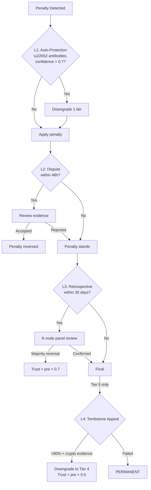

# 8. Graduated Penalty System

This section presents OBT's penalty system — a 5-tier graduated framework for addressing fraud and malicious behavior. We begin with the philosophical foundation (OBT/Trust separation), detail each penalty tier with trust formulas, specify the correlation amplification mechanism, enumerate the recognized fraud types, and describe the four-layer appeal process.

## 8.1 Design Philosophy: "Salary vs Medical License"

The OBT penalty system is built on a philosophical distinction that differentiates it from all existing token systems:

> **Principle:** Earned tokens (OBT) and trust reputation occupy separate domains. Penalties affect trust — and therefore *future earning potential* — but never retroactively confiscate earned tokens.

This is analogous to professional licensing:
- A doctor who commits malpractice may lose their medical license (trust = 0), preventing future practice.
- Their past salary is not retroactively reclaimed — they were compensated for work actually performed.
- The severity of license consequences scales with the severity of the offense.

| Aspect | Traditional Token Systems | OBT |
|--------|--------------------------|-----|
| Penalty target | Staked tokens (financial) | Trust reputation (non-financial) |
| Past earnings | Clawed back (Ethereum slashing) | Permanent (Axiom A1, G-Counter) |
| Future earnings | Reduced proportionally | Gated by trust tier |
| Recovery | Re-stake capital | Rebuild reputation through work |
| Maximum penalty | Full stake loss | Tombstone (permanent exclusion) |

**Table 27.** Penalty philosophy comparison: traditional staking systems vs OBT.

This separation creates a *specific deterrent profile*:

1. **For honest nodes with occasional errors:** Natural trust decay is sufficient. No punitive action is taken for normal behavior fluctuations.
2. **For gaming attempts:** Quality gates catch the behavior before rewards are issued. Trust reduction limits future attempts.
3. **For systematic fraud:** Escalating penalties rapidly reduce earning potential to near-zero, with permanent exclusion for the worst offenders.
4. **For all nodes:** Past earnings remain intact, preserving the system's credibility as a fair compensator of genuine work.

## 8.2 Five Penalty Tiers

### 8.2.1 Tier 0: Natural Decay

Natural trust decay is not a penalty — it is a baseline property of the trust system. Trust decays exponentially during periods of inactivity:

$$\text{trust}(t) = \text{trust}_0 \times e^{-\lambda t}$$

where $\lambda = 0.01$ per hour and $t$ is measured in hours of inactivity.

**Key properties:**

| Metric | Value |
|--------|-------|
| Decay constant ($\lambda$) | 0.01 per hour |
| Half-life | $\ln(2) / 0.01 \approx 69.3$ hours ≈ 2.9 days |
| Grace period | < 1 hour offline: no decay |
| Recovery rate | $\min(\text{interaction\_rate} \times 0.01, 0.05/\text{hour})$ |

**Table 28.** Natural trust decay parameters.

The asymmetry between decay (fast) and recovery (slow, capped at 0.05/hour) is deliberate: it should be easy to *lose* trust through neglect but require sustained *genuine participation* to rebuild it.

### 8.2.2 Tier 1: Warning

**Trigger:** First-time minor infractions (e.g., failed PoS-KU challenge, rate limit violation).

**Effect:** No immediate trust reduction. A warning is recorded on the node's profile with a 90-day retention period. Warnings serve as:
1. Signal to the pattern detection system (elevated scrutiny).
2. Evidence for escalation if behavior recurs.
3. Deterrent through visibility (other nodes can see warnings).

### 8.2.3 Tier 2: Trust Reduction

**Trigger:** Repeated minor infractions, first-time fork detection, or confirmed quality gate manipulation.

**Formula:**

$$\text{trust}_{\text{new}} = \text{trust}_{\text{current}} \times (1 - \text{severity} \times 0.3)$$

where $\text{severity} \in [0.0, 1.0]$ is determined by the fraud type (§8.5).

**Properties:**
- Permanent reduction (trust never automatically recovers to pre-penalty level).
- Proportional to current trust: high-trust nodes lose more absolute trust.
- The $0.3$ factor limits maximum single-event reduction to 30%.

**Example:** A node with trust 0.85 committing a severity-0.5 offense:
$$\text{trust}_{\text{new}} = 0.85 \times (1 - 0.5 \times 0.3) = 0.85 \times 0.85 = 0.7225$$

### 8.2.4 Tier 3: Jail

**Trigger:** Second fork detection, confirmed gaming pattern with score > 0.5, or multiple Tier 2 offenses.

**Formula:**

$$\text{trust}_{\text{new}} = \text{trust}_{\text{current}} \times 0.2$$

**Duration:** 7–30 days (depending on severity).

**Restrictions during jail:**
- Cannot create new KUs.
- Cannot participate in encoding verification.
- Cannot earn OBT rewards.
- Cannot transfer OBT (transfers blocked until jail expires).
- *Can* still receive OBT transfers.

### 8.2.5 Tier 4: Trust Zero

**Trigger:** Third fork detection, confirmed systematic fraud, or Tier 3 escalation.

**Formula:**

$$\text{trust}_{\text{new}} = 0.001$$

**Duration:** 180 days. After expiry, trust begins recovery from 0.001 at the standard recovery rate.

The non-zero minimum (0.001 instead of 0.0) allows the node to participate at minimal capacity during the penalty period, enabling the system to observe whether behavior improves.

### 8.2.6 Tier 5: Tombstone

**Trigger:** Organized, systematic fraud with evidence of ring leadership, identity forgery, or coordinated attacks.

**Formula:**

$$\text{trust}_{\text{new}} = 0$$

**Duration:** PERMANENT. The account is permanently excluded from all network participation.

**Requirements for Tombstone:**
- Requires evidence of *organized, systematic* fraud — not just repeated individual offenses.
- Must demonstrate intent (pattern analysis, coordination evidence).
- Subject to the most stringent appeal process (L4, §8.6).

### Summary Table

| Tier | Name | Trust Formula | Duration | Earning | Transfers |
|------|------|:-------------|----------|:-------:|:---------:|
| 0 | Natural Decay | $e^{-0.01t}$ | Continuous | ✅ | ✅ |
| 1 | Warning | No change | 90 days | ✅ | ✅ |
| 2 | Trust Reduction | $\text{trust} \times (1 - s \times 0.3)$ | Permanent | ✅ (reduced) | ✅ |
| 3 | Jail | $\text{trust} \times 0.2$ | 7–30 days | ❌ | ❌ |
| 4 | Trust Zero | 0.001 | 180 days | ❌ | ❌ |
| 5 | Tombstone | 0 | PERMANENT | ❌ | ❌ |

**Table 29.** Complete penalty tier specification.

## 8.3 Correlation Penalty

Inspired by Ethereum 2.0's correlation penalty for validator slashing, OBT amplifies penalties when multiple nodes are penalized simultaneously. The intuition is that simultaneous offenses are more likely to represent *coordinated* attacks rather than independent failures.

### 8.3.1 Formula

$$\text{correlation\_multiplier} = 1 + \log_2(n)$$

where $n$ is the number of nodes penalized within the same detection window.

| Simultaneous Nodes ($n$) | Multiplier | Interpretation |
|:------------------------:|:----------:|----------------|
| 1 | 1.00 | Individual offense — base penalty |
| 2 | 2.00 | Possible coordination — doubled |
| 4 | 3.00 | Likely coordination — tripled |
| 8 | 4.00 | Strong coordination evidence |
| 16 | 5.00 | Organized attack |
| 32 | 6.00 | Large-scale coordinated attack |

**Table 30.** Correlation multiplier values.

### 8.3.2 Application

The correlation multiplier amplifies the severity parameter in the trust reduction formula:

$$\text{effective\_severity} = \min(\text{base\_severity} \times \text{correlation\_multiplier}, 1.0)$$

This means that a base severity of 0.3 (moderate) becomes 0.9 (severe) when 8 nodes are penalized simultaneously, potentially escalating from Tier 2 to Tier 3.

### 8.3.3 Comparison with Ethereum 2.0

| Aspect | Ethereum 2.0 | OBT |
|--------|-------------|-----|
| Penalty target | Staked ETH | Trust score |
| Formula | $\text{penalty} \propto (\sum \text{slashed\_balance})^2 / \text{total\_stake}$ | $m = 1 + \log_2(n)$ |
| Maximum penalty | Full stake (33%+ participation) | Tombstone (permanent exclusion) |
| Window | 36 days (8,192 epochs) | Per detection window |
| Recovery | Re-stake after withdrawal | Rebuild trust through work |

**Table 31.** Correlation penalty comparison: Ethereum 2.0 vs OBT.

OBT's logarithmic formula is less aggressive than Ethereum's quadratic formula but more broadly applicable — it applies to all penalty tiers, not just slashing events.

## 8.4 Trust Decay Formula

The natural trust decay function deserves detailed analysis as it underlies all penalty interactions:

$$\text{trust}(t) = \text{trust}_0 \times e^{-\lambda t}, \quad \lambda = 0.01$$

### 8.4.1 Properties

**Half-life:**
$$t_{1/2} = \frac{\ln 2}{\lambda} = \frac{0.693}{0.01} \approx 69.3 \text{ hours} \approx 2.9 \text{ days}$$

**Decay schedule:**

| Time Offline | Trust Remaining | Interpretation |
|:------------:|:--------------:|----------------|
| 1 hour | 99.0% | Normal fluctuation |
| 12 hours | 88.7% | Brief outage |
| 1 day | 78.7% | Day offline |
| 3 days | 48.7% | Extended absence |
| 7 days | 18.7% | Week absence — significant loss |
| 14 days | 3.5% | Two weeks — near-total loss |
| 30 days | 0.05% | Month — effectively zero |

**Table 32.** Trust decay schedule for various offline durations.

### 8.4.2 Recovery Asymmetry

Trust recovery is deliberately slower than decay:

$$\text{recovery\_rate} = \min(\text{interaction\_rate} \times 0.01, 0.05 / \text{hour})$$

At maximum recovery rate (0.05/hour), recovering from 0% to 50% takes:
$$t = \frac{0.50}{0.05} = 10 \text{ hours}$$

But recovering from 50% to 90% takes:
$$t = \frac{0.40}{0.05} = 8 \text{ hours}$$

Total recovery to 90%: ~18 hours — approximately 6× faster to lose (3 days to drop from 100% to 50%) than to rebuild (only through active, verified participation).

## 8.5 Eight Fraud Types

OBT recognizes eight distinct fraud types, each with a base severity, default penalty tier, and correlation applicability:

| Fraud Type | Base Severity | Default Tier | Correlation | Description |
|------------|:------------:|:------------:|:-----------:|-------------|
| **Fork (double-spend)** | 0.8 | Tier 2 (first) | ✅ | Two blocks at same sequence |
| **Balance forgery** | 1.0 | Tier 4 | ✅ | Fabricated balance without valid chain |
| **Witness collusion** | 0.7 | Tier 3 | ✅ | Coordinated false witness signatures |
| **Gaming pattern** | 0.5 | Tier 2 | ✅ | Detected by pattern detectors (§7.4) |
| **Storage fraud** | 0.4 | Tier 2 | ❌ | Failed PoS-KU challenges (non-storage) |
| **Identity forgery** | 1.0 | Tier 5 | ✅ | Fabricated or stolen Ed25519 keys |
| **Rate limit abuse** | 0.2 | Tier 1 | ❌ | Circumventing tier-based rate limits |
| **Ring leadership** | 1.0 | Tier 5 | ✅ | Orchestrating coordinated attacks |

**Table 33.** Eight recognized fraud types with severity and penalty mapping.

The correlation column indicates whether the correlation multiplier (§8.3) is applied. Individual-level fraud (storage failure, rate abuse) does not trigger correlation amplification.

## 8.6 Four-Layer Appeal Process

OBT's appeal process ensures that penalties are fair and that false positives can be corrected. The process is inspired by Cosmos's tombstoning, EigenLayer's veto committee, and Ethereum's withdrawal queue.

### 8.6.1 Layer 1: Auto-Protection

**Trigger:** Automated — occurs before any penalty is applied.

**Mechanism:** If the node's ImmuneEngine (part of the PoMV system) has generated ≥2 antibodies with confidence > 0.7 that explain the flagged behavior, the penalty is automatically downgraded by one tier.

**Example:** A node goes offline for 3 hours due to a verified network outage. The ImmuneEngine recognizes this as a NetworkOutage pattern and generates an antibody. The flagged behavior is automatically cleared.

### 8.6.2 Layer 2: Dispute Window

**Duration:** 48 hours before penalty execution.

**Mechanism:** After a penalty is determined, the node has 48 hours to submit counter-evidence before the penalty is applied. Counter-evidence may include:
- Network logs showing connectivity during alleged offline periods.
- Transaction receipts from other systems corroborating legitimate behavior.
- Witness statements from trusted nodes.

### 8.6.3 Layer 3: Retrospective Review

**Duration:** 30 days after penalty application.

**Mechanism:** $K$ randomly selected high-trust nodes (EigenTrust score > 0.80) evaluate the penalty and evidence. If a majority determines the penalty was unjustified, it is reversed.

$$K = \min(\max(5, N_{\text{active}} / 200), 11)$$

This creates a panel of 5–11 evaluators, proportional to network size.

**Restored trust:**
$$\text{trust}_{\text{restored}} = \text{trust}_{\text{pre-penalty}} \times 0.7$$

Note the 30% permanent scar — even after a successful appeal, trust is not fully restored. This compensates for the disruption caused by the dispute process and reflects the principle that *some doubt persists*.

### 8.6.4 Layer 4: Tombstone Appeal

**Applicability:** Only for Tier 5 (Tombstone) penalties.

**Requirements (ALL must be met):**
1. \> 80% consensus among top-tier nodes (Continental SP or higher).
2. Cryptographic evidence proving the Tombstone was based on fabricated or misinterpreted data.
3. No prior successful appeal for the same account.

**If successful:** Account is downgraded to Tier 4 (180-day jail) instead of permanent exclusion. Restored trust = pre-penalty × 0.5 (50% permanent scar for Tombstone appeals).

**Figure 11.** Four-layer appeal process flow.

### 8.6.5 Comparison with Other Systems

| Feature | Ethereum 2.0 | Cosmos | EigenLayer | OBT |
|---------|-------------|--------|------------|-----|
| Pre-penalty protection | None | None | Veto committee | Auto-protection (ImmuneEngine) |
| Dispute window | None (immediate) | None | 7 days | 48 hours |
| Post-penalty review | None | None | Operator appeal | 30-day K-node panel |
| Permanent ban appeal | N/A | None (tombstone final) | None | L4 with >80% consensus |
| Trust restoration | Re-stake | N/A | Re-register | trust × 0.7 (30% scar) |
| Appeal cost | Re-stake capital | N/A | Reputation risk | None (system-funded) |

**Table 34.** Appeal process comparison across penalty systems.

OBT provides the most comprehensive appeal process among compared systems. This reflects the higher stakes of knowledge reputation — unlike financial staking where capital can be redeployed, knowledge reputation represents years of accumulated contribution that should not be destroyed by a single false positive.

## 8.7 Honest Assessment

No penalty system is perfect. OBT's system has known limitations:

1. **51% collusion.** If > 50% of high-trust nodes collude, they can suppress legitimate penalties against their members. This is mitigated by EigenTrust's Sybil resistance and the continuous trust decay that degrades inactive colluders.

2. **Appeal gaming.** Nodes might deliberately trigger penalties to test the appeal system and identify exploitable weaknesses. The 30% permanent scar on successful appeals creates a cost even for legitimate appeals.

3. **Delayed detection.** Trust farming (Long Con) attacks may not be detected until significant trust has been accumulated. The pattern detection system (§7.4.4) is designed to identify these patterns, but sophisticated adversaries may evade detection for extended periods.

4. **Identity replacement.** A Tombstoned node can create a new identity. This is partially addressed by requiring new nodes to start at Leaf tier (0.10 multiplier) — the cost of rebuilding reputation is substantial.

The fundamental security claim is not that fraud is *impossible*, but that in all analyzed scenarios, the **cost of fraud exceeds the benefit of fraud**. Combined with the correlation multiplier, coordinated attacks face super-linear cost escalation.
