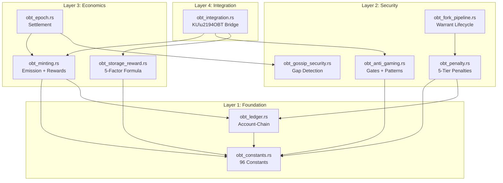
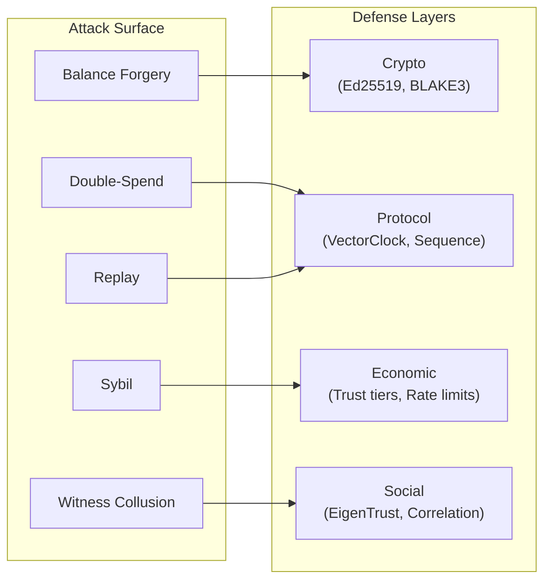

# 9. Evaluation

This section evaluates the OBT implementation across four dimensions: implementation completeness, test coverage, security threat modeling, and performance characteristics.

## 9.1 Implementation Overview

OBT is implemented in Rust as 10 modules within the `ku-core` crate, with additional network-layer integration in the `ku-net` crate. The implementation totals approximately 243 KB of source code with 240+ unit tests.

| Module | File | Size | Tests | Description |
|--------|------|:----:|:-----:|-------------|
| Constants | `obt_constants.rs` | 30 KB | 25+ | 96 governance constants, NodeTier enum, helper functions |
| Ledger | `obt_ledger.rs` | 55 KB | 40+ | TransferBlock, AccountState, block validation, fork detection |
| Minting | `obt_minting.rs` | 24 KB | 30+ | Emission formula, 4 reward streams, MintProof verification |
| Storage Reward | `obt_storage_reward.rs` | 27 KB | 25+ | 5-factor formula, PoS-KU challenges, strike system |
| Penalty | `obt_penalty.rs` | 29 KB | 30+ | 5-tier penalties, correlation multiplier, appeal framework |
| Anti-Gaming | `obt_anti_gaming.rs` | 17 KB | 34+ | Rate limiting, quality gates, pattern detection |
| Gossip Security | `obt_gossip_security.rs` | 15 KB | 17+ | GossipGapDetector, ConnectivityProof, EpochSummary |
| Fork Pipeline | `obt_fork_pipeline.rs` | 17 KB | 12+ | ForkWarrant lifecycle: Detected → Verified → Penalized |
| Epoch | `obt_epoch.rs` | 16 KB | 17+ | EpochAccumulator, settlement, epoch boundary computation |
| Integration | `obt_integration.rs` | 14 KB | 8+ | KU↔OBT bridge: FormulaInputs, quality gate orchestration |

**Table 35.** OBT module inventory with size and test coverage.

**Network layer modules** (in `ku-net`):

| Module | File | Tests | Description |
|--------|------|:-----:|-------------|
| Messages | `messages.rs` | — | 7 OBT MessageType variants (0xA0–0xA6) |
| Transfer | `obt_transfer.rs` | 10+ | Transfer validation, eligibility checks |
| Gossip | `obt_gossip.rs` | 10+ | ForkWarrant validation, MintBroadcast relay |
| DHT | `dht.rs` (extension) | 6+ | ReplicaTracker for storage rewards |
| Membership | `membership.rs` (extension) | 4+ | NodeTier bridge, fitness penalty factor |
| Error | `error.rs` (extension) | — | ObtError enum (6 variants) |

**Table 36.** OBT network layer modules.

**Test totals across the system:**

| Crate | Total Tests | OBT-Specific |
|-------|:----------:|:------------:|
| ku-core | 541 | ~240 |
| ku-net | 192 | ~30 |
| **Total** | **733** | **~270** |

**Table 37.** Test coverage summary.

## 9.2 Module Architecture

The OBT modules form a layered architecture with clear dependency relationships:

**Figure 12.** OBT module dependency graph organized by layer.

**Design principles:**
- **No circular dependencies.** The dependency graph is acyclic.
- **Constants as foundation.** All magic numbers are centralized in `obt_constants.rs`.
- **Integration as facade.** `obt_integration.rs` is the only module that external systems (PoMV, KQL) need to interact with.

## 9.3 Test Coverage Analysis

### 9.3.1 Unit Test Distribution

The test suite covers all major subsystems:

| Subsystem | Tests | Coverage Focus |
|-----------|:-----:|----------------|
| Emission formula | 14 | Formula correctness, edge cases (0 nodes, max cap) |
| Reward calculation | 12 | R1-R4 stream computation, role-based bonuses |
| Block validation | 15 | All 11 validation rules (V-SIG through V-RECV) |
| Fork detection | 8 | Fork identification, warrant creation, tiebreak |
| Penalty tiers | 12 | All 5 tiers, escalation, correlation multiplier |
| Anti-gaming | 34 | Rate limits, 4 quality gates, 4 pattern detectors |
| Storage reward | 15 | 5-factor formula, challenge types, strike system |
| Gossip security | 17 | Gap detection, connectivity proof, epoch boundaries |
| Epoch settlement | 12 | Accumulation, finalization, boundary computation |
| Integration | 8 | Quality gate orchestration, FormulaInputs construction |
| NodeTier | 14 | Promotion thresholds, tier weights, multipliers |
| Constants | 12 | Consistency between related constants |
| Network (ku-net) | 30 | Message types, transfer validation, gossip relay |

**Table 38.** Unit test distribution by subsystem.

### 9.3.2 Property-Based Testing

Several critical invariants are tested across module boundaries:

1. **Balance conservation:** For every Send block, the sum of sender and receiver balances is unchanged.
2. **Emission cap:** `compute_epoch_emission()` never exceeds `B × A_max × Q_max`.
3. **Trust monotonicity under penalty:** Penalty application never increases trust.
4. **G-Counter monotonicity:** `total_earned` never decreases after any operation.
5. **Gate ordering:** Quality gate pipeline produces the same result regardless of gate evaluation order (gates are independent).

## 9.4 Security Threat Model

### 9.4.1 Five Attack Vectors

| # | Attack Vector | Threat | Defense | Residual Risk |
|---|--------------|--------|---------|---------------|
| 1 | **Double-spend** | Create two Send blocks for same balance | VectorClock + sequence monotonicity + fork detection | First-seen race in <200ms window |
| 2 | **Balance forgery** | Fabricate AccountState with inflated balance | TransferBlock chain integrity + BLAKE3 hash chain | Requires breaking BLAKE3 or Ed25519 |
| 3 | **Sybil attack** | Create many identities to farm rewards | Leaf tier 0.10× multiplier + EigenTrust reputation | Long-term trust farming (§7.4.4) |
| 4 | **Replay attack** | Resubmit previously valid blocks | Nonce + VectorClock + sequence uniqueness | None (fully prevented) |
| 5 | **Witness collusion** | K witnesses collude to approve invalid mints | BLAKE3-deterministic witness selection + rotation | Requires controlling K-consecutive DHT positions |

**Table 39.** Five attack vectors with defenses and residual risk.

### 9.4.2 Three Partition Scenarios

We analyze three network partition scenarios with increasing sophistication:

**Scenario A: Natural Partition (Honest Majority)**

A network partition isolates a minority of nodes for several hours.

- **Effect:** Isolated nodes experience trust decay ($e^{-0.01t}$). Tokens earned during isolation are valid but may conflict with the main partition.
- **Resolution:** On reconnection, VectorClocks enable automatic causal ordering. Conflicting blocks are resolved by first-seen + hash tiebreak.
- **OBT impact:** Minimal. Isolated nodes lose some trust, which recovers through participation.

**Scenario B: Long Con (Sophisticated Attacker)**

An attacker builds legitimate reputation over months, then attempts a large-scale exploit.

- **Defense layers:**
  1. Quality gates prevent low-quality KU minting regardless of trust level.
  2. Per-node reward cap limits single-epoch gain to $E / N \times \text{TrustMultiplier}$.
  3. Pattern detection (§7.4.4) monitors trust-quality divergence.
  4. Correlation penalty amplifies consequences if coordinating with others.

- **Cost-benefit analysis:** At GlobalBackbone tier (2.00× multiplier, months of genuine work to achieve), maximum single-epoch gain is approximately $200{,}000$ milliOBT = 200 OBT. Cost: months of reputation building, permanently lost if detected.

**Scenario C: Quick Isolation Attack**

An attacker isolates their node(s) from the network, creates KUs, self-verifies, and attempts to mint rewards.

- **Defense layers:**
  1. GossipGapDetector flags simultaneous offline events (§7.4.1).
  2. ConnectivityProof requires ≥3 receipts from external nodes.
  3. Mint proofs require witnesses from outside the attacker's control.
  4. Encoding consensus requires ≥3 independent AI verifiers.

- **Outcome:** Attack fails at multiple layers. The attacker cannot produce valid ConnectivityProofs or external witness signatures while isolated.

### 9.4.3 Threat Summary

**Figure 13.** Attack vectors mapped to defense layers.

**Core security claim:** In all analyzed scenarios, the *cost of fraud exceeds the benefit of fraud*. This is achieved through:
1. **Economic deterrence:** Trust loss reduces future earning potential by orders of magnitude.
2. **Detection probability:** Multiple overlapping detection systems (4 pattern detectors, gossip gap, connectivity proofs).
3. **Escalation:** Correlation multiplier makes coordinated attacks super-linearly expensive.
4. **Permanence:** Tombstone is irreversible; even Tier 3/4 create lasting trust scars.

## 9.5 Performance Characteristics

### 9.5.1 Transfer Performance

| Metric | Value | Comparison |
|--------|-------|------------|
| Transfer finality (L1) | 50–200 ms | Nano: ~200ms, Ethereum: ~12 min |
| Transfer finality (L2) | 1–3 s | Filecoin: ~30s |
| Transfer finality (L3) | 10–30 s | Bitcoin: ~60 min |
| Wire size per block | 240–320 bytes | Nano: ~216 bytes, Ethereum: ~100+ bytes |
| Throughput | Limited by gossip bandwidth | Not block-limited |
| Fees | 0 | Nano: 0, Ethereum: variable |

**Table 40.** Transfer performance characteristics.

### 9.5.2 Epoch Settlement

| Metric | Value |
|--------|-------|
| Settlement frequency | Every 3,600s (1 hour) |
| Settlement complexity | $O(N_{\text{active}} \times K_{\text{stored}})$ |
| Emission computation | $O(1)$ |
| Reward distribution | $O(N_{\text{active}})$ |
| Storage challenge generation | $O(K_{\text{stored}} / 10)$ (~10% sampled) |

**Table 41.** Epoch settlement computational complexity.

### 9.5.3 Wire Protocol

OBT adds 7 message types to the network protocol (0xA0–0xA6):

| Code | Message | Fixed Size | Purpose |
|:----:|---------|:----------:|---------|
| 0xA0 | ObtTransferRequest | 168 bytes | Initiate transfer |
| 0xA1 | ObtTransferConfirm | 135 bytes | Confirm transfer |
| 0xA2 | ObtBalanceQuery | 38 bytes | Query balance |
| 0xA3 | ObtBalanceResponse | 86+ bytes | Return balance |
| 0xA4 | ObtMintBroadcast | Variable | Broadcast mint proof |
| 0xA5 | ObtStorageChallenge | 76 bytes | Issue storage challenge |
| 0xA6 | ObtForkWarrant | Variable | Broadcast fork evidence |

**Table 42.** OBT wire protocol message types.

## 9.6 Comparison with Production Systems

| Dimension | Bitcoin | Ethereum | Filecoin | Nano | **OBT** |
|-----------|:------:|:--------:|:--------:|:----:|:-------:|
| Code size | ~1.2M LOC | ~800K LOC | ~2M LOC | ~200K LOC | **~243 KB** |
| Test count | ~3,000 | ~10,000 | ~5,000 | ~1,000 | **~270** |
| Maturity | 15+ years | 10+ years | 5+ years | 8+ years | **<1 year** |
| Network size | ~15,000 nodes | ~800,000 validators | ~3,000 miners | ~100 nodes | **Development** |
| Consensus | PoW | PoS | PoRep+PoSt | ORV | **PoMV** |
| TPS | ~7 | ~30 (L1) | ~30 | ~1,000 | **Gossip-limited** |

**Table 43.** Comparison with production token systems.

**Honest assessment:** OBT is in early development. The code size and test coverage are appropriate for a specification-stage implementation but are orders of magnitude smaller than production systems. The architecture is designed to scale, but has not been tested under adversarial conditions at network scale.

## 9.7 Implementation Status

As of the current version, the OBT implementation status is approximately **80% complete**:

| Component | Status | Remaining Work |
|-----------|:------:|----------------|
| Constants and types | ✅ 100% | — |
| Ledger (TransferBlock, AccountState) | ✅ 100% | — |
| Minting (emission, rewards) | ✅ 100% | — |
| Storage reward (5-factor, challenges) | ✅ 100% | — |
| Penalty (5-tier, correlation) | ✅ 100% | — |
| Anti-gaming (gates, patterns) | ✅ 100% | — |
| Gossip security | ✅ 100% | — |
| Fork pipeline | ✅ 100% | — |
| Epoch settlement | ✅ 100% | — |
| Integration bridge | ✅ 100% | — |
| DHT replica tracking | 🟡 80% | Full ReplicaTracker wiring |
| Ed25519 signature verification | 🟡 50% | Full key management integration |
| Governance parameter adjustment | 🔴 10% | Runtime constant modification |
| Cross-shard transfers | 🔴 0% | Multi-shard Account-Chain |

**Table 44.** Implementation completion status.
