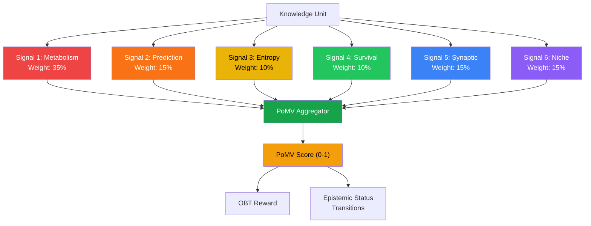
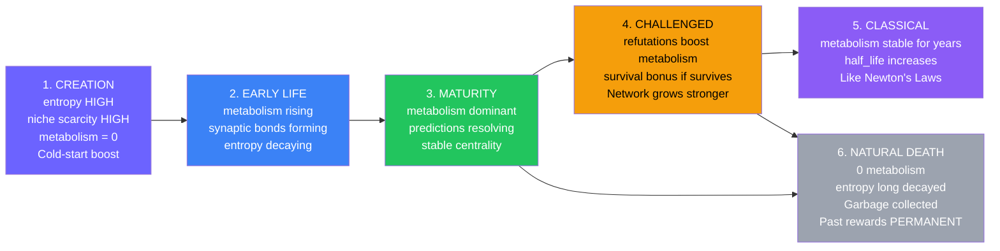

# 3. The Six-Signal PoMV Architecture

This section presents the core PoMV design: six observable signals that collectively determine knowledge value without any voting or human judgment.

## 3.1 Design Principles

PoMV follows six design principles derived from the philosophical foundations (§1.3) and the 10 anti-patterns identified through systems analysis:

| # | Principle | Rationale | Anti-Pattern Avoided |
|---|-----------|-----------|---------------------|
| 1 | **No voting** | All signals from G-Counters (usage) | Plutocracy (MakerDAO), populism (Reddit) |
| 2 | **No clawback** | G-Counters only increment | Contentious token revocation |
| 3 | **No censorship** | Immune system analyzes PATTERNS, not CONTENT | Centralized moderation bias |
| 4 | **Fully decentralized** | Each node evaluates independently, CRDT merge | Single point of failure/control |
| 5 | **Experience respected** | `NoResolution` mode for Experience/Narrative KUs | Forcing correctness on subjective knowledge |
| 6 | **Antifragile** | Surviving attack → trust bonus | Systems that only degrade under attack |

*Table 5: PoMV design principles.*

## 3.2 Architecture Overview

*Figure 1: PoMV architecture. Six observable signals are weighted and aggregated into a single score that drives both OBT rewards and epistemic status transitions.*

The aggregation formula:

$$\text{PoMV}(ku, t) = w_1 \cdot M(ku, t) + w_2 \cdot P(ku, t) + w_3 \cdot E(ku, t) + w_4 \cdot S(ku, t) + w_5 \cdot Syn(ku, t) + w_6 \cdot N(ku, t)$$

where default weights are:

| Signal | Symbol | Weight | Justification |
|--------|:------:|:------:|--------------|
| Metabolism | $w_1$ | 0.35 | Primary value indicator — real usage |
| Prediction | $w_2$ | 0.15 | Empirical validation of claims |
| Entropy | $w_3$ | 0.10 | Cold-start incentive, decays in 7 days |
| Survival | $w_4$ | 0.10 | Antifragility bonus |
| Synaptic | $w_5$ | 0.15 | Network position value |
| Niche | $w_6$ | 0.15 | Ecological scarcity value |
| **Total** | | **1.00** | |

*Table 6: Default PoMV signal weights with justifications.*

## 3.3 Signal 1: Metabolism — Knowledge Has a Heartbeat (35%)

### 3.3.1 Biological Analogy

Every living cell has a metabolic rate — the rate at which it consumes energy and performs function. Cells with high metabolic rates are essential to the organism; cells with zero metabolic rates undergo apoptosis (programmed cell death). PoMV applies this precisely: every KU has a "heartbeat" measured by real usage signals.

### 3.3.2 Usage Counters (G-Counters)

Each KU tracks 8 usage signals via G-Counter CRDTs:

| Counter | What It Measures | CRDT Type | Why It Matters |
|---------|-----------------|:---------:|---------------|
| `query_hits` | Times appearing in search results | G-Counter | Discoverability |
| `retrieval_count` | Times fully read/downloaded | G-Counter | Active interest |
| `dwell_time_ms` | Total reading time (milliseconds) | G-Counter | Engagement depth |
| `citation_count` | Inbound citations from other KUs | G-Counter | Academic-style influence |
| `derivative_count` | KUs inspired by this one | G-Counter | Generative value |
| `refutation_count` | KUs that refute/challenge this | G-Counter | **Importance** (not "wrongness") |
| `corroboration_count` | Explicit corroborations | G-Counter | Community validation |
| `downstream_usage` | Usage of KUs that cite this | G-Counter | Transitive value |

> **Critical design choice: Refutation counts as POSITIVE metabolism.** A KU that is refuted is a KU important enough to debate. A KU that everyone ignores is truly "dead." This prevents the perverse incentive of avoiding controversial topics.

### 3.3.3 Metabolic Rate Formula

The metabolic rate combines all counters with temporal decay:

$$\text{metabolic\_rate}(ku, t) = \text{raw}(ku) \times e^{-\frac{\ln 2 \times \text{age}(ku)}{\text{half\_life}}}$$

where the raw rate is:

$$\text{raw}(ku) = \alpha_1 \frac{\text{query\_hits}}{\sqrt{\text{diversity}}} + \alpha_2 \cdot \text{retrievals} \times \overline{\text{dwell}} + \alpha_3 \cdot \text{citations} + \alpha_4 \cdot \text{derivatives} + \alpha_5 \cdot \text{downstream}$$

| Parameter | Value | Purpose |
|-----------|:-----:|---------|
| $\alpha_1$ | 0.25 | Query velocity (normalized by node diversity) |
| $\alpha_2$ | 0.20 | Retrieval depth (weighted by average dwell time) |
| $\alpha_3$ | 0.25 | Citation freshness |
| $\alpha_4$ | 0.15 | Derivative novelty |
| $\alpha_5$ | 0.15 | Downstream cascade |
| half_life | 30 days | Default temporal decay |
| alive threshold | 0.001 | Below this → considered "dead" |

**Division by $\sqrt{\text{diversity}}$** on query_hits prevents a single node from inflating query counts — the signal must come from diverse sources.

### 3.3.4 Normalization

The raw metabolic rate (unbounded) is normalized to [0, 10000] via sigmoid:

$$\text{rate\_u16}(ku) = \left\lfloor 10000 \times (1 - e^{-\text{rate}/10}) \right\rfloor$$

This produces:
- rate = 0 → 0
- rate = 1 → 952
- rate = 10 → 6321
- rate = 50 → 9933

### 3.3.5 Decentralization

Each node counts its own usage independently via G-Counters. CRDT merge is `max` per node, `sum` across nodes:

$$\text{global\_count} = \sum_{i \in \text{nodes}} \text{max}(\text{local\_count}_i, \text{remote\_count}_i)$$

This is idempotent, commutative, and monotonically increasing — guaranteeing eventual convergence without coordination.

## 3.4 Signal 2: Prediction — Knowledge Predicts the Future (15%)

### 3.4.1 Concept

Every knowledge claim implicitly predicts something about the future:

| Gene Type | Implicit Prediction | Resolution Method |
|-----------|-------------------|-------------------|
| **Fact** | "This will remain true tomorrow" | `TemporalConsistency` — consistency over time |
| **Procedure** | "Following these steps succeeds" | `UsageOutcome` — users report success/failure |
| **Hypothesis** | "This mechanism exists" | `CrossReference` — confirmed by new KUs |
| **Experience** | "Others will share this feeling" | `NoResolution` — subjective, no objective test |

### 3.4.2 Resolution Methods

**TemporalConsistency:** A Fact's prediction score increases with each time period it remains unchallenged. After 1 year without refutation, confidence is high.

**UsageOutcome:** Users who follow a Procedure KU report whether it worked. Multiple confirming reports increase the prediction score.

**CrossReference:** A Hypothesis gains prediction credit when new KUs cite it as confirmed. It loses credit when new KUs cite it as refuted.

**NoResolution:** Experience and Narrative KUs have NO objective prediction to resolve. Their value comes purely from Metabolism (how many people find them interesting). This respects the philosophical principle that subjective experience cannot be "right" or "wrong."

### 3.4.3 Prediction Score

$$\text{prediction\_score} = \frac{\sum_{r \in \text{resolutions}} \text{outcome}(r) \times \sqrt{|\text{resolvers}(r)|}}{\sum_{r \in \text{resolutions}} \sqrt{|\text{resolvers}(r)|}}$$

where $\text{outcome}(r)$ = 1.0 (Confirmed), 0.0 (Refuted), $c/10000$ (Partial with confidence $c$). Inconclusive resolutions are excluded.

The $\sqrt{\text{resolvers}}$ weight ensures that well-corroborated resolutions (many independent resolvers) carry more weight than single-resolver resolutions, without allowing a single massive resolver pool to dominate.

**No resolvable predictions → neutral score (0.5)**. Experience KUs using `NoResolution` default to 0.5, neither penalized nor rewarded for prediction accuracy.

## 3.5 Signal 3: Entropy — Novelty Is Valuable (10%)

### 3.5.1 Concept

In information theory, entropy measures surprise [1]. PoMV applies this: the first KU about a new topic is maximally surprising (high entropy = high reward). The 1,001st KU repeating known information is unsurprising (low entropy = low reward).

### 3.5.2 Measurement

Entropy is computed at KU creation time using:

1. **Novelty** (60% weight): Average cosine distance between the new KU's int8 embedding and its K nearest neighbors' embeddings:

$$\text{novelty} = \frac{1}{K} \sum_{i=1}^{K} \text{cosine\_distance}(\vec{e}_{\text{new}}, \vec{e}_i)$$

where cosine distance on int8 embeddings:

$$\text{cosine\_distance}(\vec{a}, \vec{b}) = \frac{1 - \cos(\vec{a}, \vec{b})}{2} \in [0, 1]$$

2. **Bridge** (40% weight): Inverse frequency of the KU's LSH (Locality-Sensitive Hashing) bucket:

$$\text{bridge} = \frac{1}{1 + \text{bucket\_count}}$$

A KU in an LSH bucket shared by many others is unsurprising; a KU in a rare or new bucket is novel.

3. **Near-duplicate detection** via SimHash: If Hamming distance between two 128-bit SimHash fingerprints is < 10 bits (~92% similarity), the new KU is flagged as near-duplicate and receives zero entropy bonus.

### 3.5.3 Temporal Decay

Entropy is a **cold-start boost** that decays exponentially over 7 days:

$$\text{entropy}(ku, t) = (0.6 \times \text{novelty} + 0.4 \times \text{bridge}) \times e^{-\frac{\ln 2 \times \text{age}(ku)}{604800}}$$

After 7 days, the entropy contribution is halved. After 21 days, it is <12.5% of the original value. This ensures that novelty alone cannot sustain a KU — **real metabolism must take over within the first week**.

This addresses the entropy gaming concern: submitting bizarre, unrelated content gives a high initial entropy boost, but if no one uses it within 7 days, the entropy decays to near-zero and the KU's PoMV score collapses.

## 3.6 Signal 4: Survival — What Doesn't Kill It Makes It Stronger (10%)

### 3.6.1 Antifragility Principle

Nassim Taleb [2] defines antifragility as "things that gain from disorder." PoMV implements this directly: knowledge that survives adversarial attacks receives a **survival bonus**.

### 3.6.2 Measurement

$$\text{survival\_score}(ku) = \min\left(\text{attacks\_survived}(ku) \times 0.1,\ 1.0\right)$$

- A KU with 0 attacks survived → 0 bonus (neutral, not penalized)
- A KU with 5 attacks survived → 0.5 bonus
- A KU with 10+ attacks survived → 1.0 (maximum bonus)
- A KU that is "dead" (zero metabolism) gets 0 regardless of survival count

This creates a **virtuous cycle**: attacking legitimate knowledge actually *increases* its value, disincentivizing attacks.

### 3.6.3 Attack Detection

The Immune Engine (§5) detects attacks through content-agnostic pattern analysis. When an attack is detected and the target KU survives (maintains positive metabolism), the survival counter increments.

## 3.7 Signal 5: Synaptic — Knowledge That Connects (15%)

### 3.7.1 Hebb's Rule for Knowledge

Donald Hebb's neurological principle [3]: *"Neurons that fire together, wire together."* PoMV applies this to knowledge:

- User reads KU_A then reads KU_B → the A→B bond strengthens (co-retrieval)
- KU_C cites both KU_A and KU_B → the A↔B bond strengthens (co-citation)
- Bonds that no one traverses → weaken and eventually vanish (synaptic pruning)

### 3.7.2 Bond Mechanics

| Parameter | Value | Purpose |
|-----------|:-----:|---------|
| Initial co-retrieval strength | 0.10 | Weak starting bond |
| Initial co-citation strength | 0.15 | Slightly stronger (intentional reference) |
| Explicit relation strength | 0.50 | Author-declared relationships |
| Reinforcement increment | 0.05 | Per co-retrieval/co-citation event |
| Maximum bond strength | 1.00 | Hard cap |
| Minimum bond strength | 0.001 | Below this → bond removed |
| Evaporation rate | 0.95/day | Daily decay |
| Max bonds per KU | 100 | Memory limit |

### 3.7.3 Centrality Scoring (PageRank)

The synaptic signal uses a PageRank-inspired power iteration to compute knowledge centrality:

$$\text{score}(ku)^{(k+1)} = \frac{1-d}{N} + d \sum_{j \rightarrow ku} \frac{\text{score}(j)^{(k)} \times \text{bond\_strength}(j, ku)}{\text{total\_strength}(j)}$$

where $d = 0.85$ (damping factor) and $N$ = total KU count. After 10 iterations, scores are normalized to [0, 1].

**Emergent learning paths:** Without explicit design, co-retrieval patterns create "knowledge highways" — sequences of KUs that users naturally follow. These emergent paths are more valuable than any human-curated curriculum because they reflect actual learning behavior.

## 3.8 Signal 6: Niche — Ecological Fitness (15%)

### 3.8.1 Ecological Analogy

In ecology, each species occupies a **niche** — a functional role in the ecosystem [4]. A niche can only support a limited population (carrying capacity). PoMV applies this to knowledge:

| Ecological Concept | PoMV Mapping |
|-------------------|-------------|
| Carrying capacity | Maximum KUs about a specific topic before value saturates |
| Population density | Number of existing KUs in the niche |
| Invasive species | Spam/duplicate content flooding a niche |
| Predator-prey balance | Refutations as "predators" that maintain ecosystem health |
| Symbiosis | KUs with mutual co-retrieval benefit |

### 3.8.2 Niche Fitness Formula

$$\text{niche\_fitness}(ku) = 0.25 \cdot \text{density} + 0.30 \cdot \text{uniqueness} + 0.20 \cdot \text{bridge} + 0.25 \cdot \text{metabolic\_share}$$

where:

$$\text{density\_score} = \frac{1}{1 + \overline{\text{population}}/10}$$

$$\text{bridge\_score} = \frac{\ln(\text{total\_niches})}{\ln(10)}$$

$$\text{metabolic\_share} = \min\left(\frac{\text{own\_rate}}{\overline{\text{niche\_rate}}},\ 1.0\right)$$

- **Density** rewards KUs in sparse niches (first KU about a novel topic = high score) and penalizes crowded niches.
- **Uniqueness** is the KU's novelty within its niche (from the entropy calculation).
- **Bridge** rewards KUs spanning multiple niches (cross-domain connections).
- **Metabolic share** rewards KUs that are metabolically dominant in their niche.

## 3.9 The KU Lifecycle in PoMV

*Figure 2: Knowledge lifecycle in PoMV. Each phase has a dominant signal.*

| Phase | Duration | Dominant Signals | Example |
|-------|----------|-----------------|---------|
| Creation | Day 0 | Entropy (HIGH), Niche (HIGH), Metabolism (0) | "First KU about quantum computing error correction" |
| Early Life | Days 1–30 | Entropy (decaying), Metabolism (rising) | Users discover and read the KU |
| Maturity | Months 1–12 | Metabolism (dominant), Prediction (resolving) | Widely cited, predictions verified |
| Challenged | Variable | Survival (increasing), Metabolism (boosted by debate) | Competing KU refutes a claim |
| Classical | Years | Metabolism (stable), Synaptic (high centrality) | Newton's Laws — always cited |
| Natural Death | — | All signals ≈ 0 | Outdated tech docs no one reads |

*Table 7: KU lifecycle phases with dominant signals and examples.*

---

## References

[1] C. E. Shannon, "A Mathematical Theory of Communication," *Bell System Technical Journal*, vol. 27, pp. 379–423, 1948.

[2] N. N. Taleb, *Antifragile: Things That Gain from Disorder*. Random House, 2012.

[3] D. O. Hebb, *The Organization of Behavior: A Neuropsychological Theory*. Wiley, 1949.

[4] G. E. Hutchinson, "Concluding Remarks," *Cold Spring Harbor Symposia on Quantitative Biology*, vol. 22, pp. 415–427, 1957.
