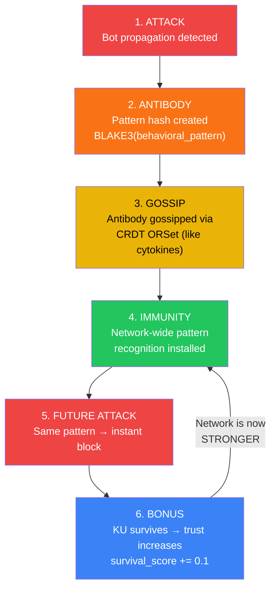
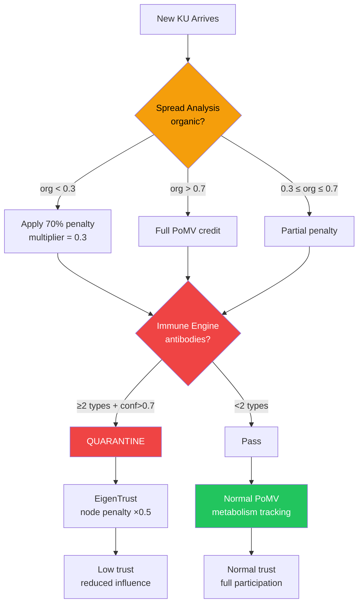

# 5. Adversarial Defense: Content-Agnostic Security

This section presents PoMV's layered defense system — four content-agnostic antibody types, organic spread analysis, EigenTrust node reputation, and antifragile immune memory — all designed to defend against manipulation **without judging content**.

## 5.1 Threat Model

### 5.1.1 Adversary Capabilities

| Capability | Description | Cost |
|-----------|-------------|------|
| **Sybil nodes** | Create multiple identities | Moderate (S/Kademlia puzzle) |
| **Automated queries** | Inflate `query_hits` counter | Low (API calls) |
| **Bot retrievals** | Inflate `retrieval_count` | Low (automated downloads) |
| **Cross-citation rings** | KUs cite each other artificially | Medium (requires content creation) |
| **Flash attacks** | Massive burst of activity in short period | Low-medium |
| **Targeted deprecation** | Organized attack on specific KU | Medium-high |

### 5.1.2 What PoMV Does NOT Defend Against

PoMV explicitly does not attempt to determine whether knowledge content is "true" or "false." This is by design — content judgment is a philosophical impossibility (who decides truth?) and a centralization vector. Instead, PoMV defends against **behavioral manipulation** — attempts to artificially inflate usage signals.

## 5.2 Layer 1: Immune Engine — Content-Agnostic Antibodies

The Immune Engine ([immune.rs](file:///c:/Users/shpy2/Documents/OneBrain/src/ku-core/src/immune.rs), 440 LOC, 11 tests) detects manipulation through 4 antibody types that analyze **behavior patterns**, never **content**.

### 5.2.1 Antibody Type 1: Temporal Burst

**Detection:** Replication rate exceeds 50/hour.

$$\text{fires if: } \text{replications\_last\_hour} > 50$$

$$\text{confidence} = 1 - \frac{1}{\text{replications\_last\_hour} / 50}$$

**Rationale:** Organic knowledge spread follows a diffusion curve — gradual increase, peak, gradual decline. A spike of 50+ replications in a single hour is statistically anomalous. Legitimate viral content does spike, but rarely exceeds this rate without bot amplification.

### 5.2.2 Antibody Type 2: Source Concentration

**Detection:** More than 80% of replications originate from a single source.

$$\text{fires if: } \text{total\_replications} > 5 \text{ AND } \frac{\text{max\_source\_replications}}{\text{total\_replications}} > 0.80$$

$$\text{confidence} = \frac{\text{excess\_fraction}}{1 - 0.80}$$

**Rationale:** Legitimate knowledge spread comes from diverse sources. When a single node accounts for 80%+ of all replications, it suggests automated propagation from a single actor.

### 5.2.3 Antibody Type 3: Low Engagement

**Detection:** High replication count but near-zero actual usage.

$$\text{fires if: } \text{total\_replications} \geq 10 \text{ AND } \frac{\text{total\_usage\_events}}{\text{total\_replications}} < 0.05$$

$$\text{confidence} = 1 - \frac{\text{usage\_ratio}}{0.05}$$

**Rationale:** Knowledge that is replicated but never actually used (queried, retrieved, cited) exhibits a signature pattern of bot propagation. Legitimate knowledge that spreads is also consumed.

### 5.2.4 Antibody Type 4: Diversity Deficit

**Detection:** Many replications from very few unique sources.

$$\text{fires if: } \text{total\_replications} \geq 5 \text{ AND } \frac{\text{unique\_sources}}{\text{total\_replications}} < 0.10$$

$$\text{confidence} = 1 - \frac{\text{diversity\_ratio}}{0.10}$$

**Rationale:** Even if no single source dominates (avoiding Antibody 2), a very low diversity ratio (e.g., 3 sources generating 100 replications) indicates a coordinated small group.

### 5.2.5 Antibody Data Structure

Each antibody stores:
- `pattern_hash: [u8; 32]` — BLAKE3 hash of the behavioral PATTERN (not content)
- `antibody_type: AntibodyType` — which of the 4 types
- `confidence: f32` — detection confidence [0, 1]
- `detected_at: u64` — timestamp
- `confirmation_count: u32` — how many nodes independently detected this

> **Privacy:** Antibodies contain ONLY pattern hashes — never NodeIDs, content, or personally identifiable information. Knowing a pattern hash does NOT reveal who attacked or what content was involved.

### 5.2.6 Quarantine Decision

Quarantine requires **convergent evidence** — a single antibody type is insufficient:

$$\text{quarantine}(ku) = \begin{cases} \text{true} & \text{if } |\{\text{distinct antibody types}\}| \geq 2 \text{ AND } \overline{\text{confidence}} > 0.7 \\ \text{false} & \text{otherwise} \end{cases}$$

This reduces false positives: legitimate viral content may trigger Temporal Burst alone, but it won't also trigger Low Engagement (because viral content is actually consumed).

## 5.3 Layer 2: Organic Spread Analysis

The Spread Analyzer ([spread_analysis.rs](file:///c:/Users/shpy2/Documents/OneBrain/src/ku-core/src/spread_analysis.rs), 354 LOC, 11 tests) computes an **organicity score** — how "natural" the spread pattern of a KU looks.

### 5.3.1 Four Analysis Dimensions

$$\text{organicity} = 0.30 \times \text{temporal} + 0.30 \times \text{diversity} + 0.20 \times \text{geographic} + 0.20 \times \text{engagement}$$

**Dimension 1: Temporal Pattern (30%)**

Uses the Coefficient of Variation (CV) of inter-event intervals:

$$CV = \frac{\sigma_{\text{intervals}}}{\mu_{\text{intervals}}}$$

| CV Range | Interpretation | Score |
|:--------:|---------------|:-----:|
| < 0.3 | **Bot-like**: Regular intervals (e.g., exactly every 60s) | Low (0.0–0.5) |
| 0.3–1.5 | **Organic**: Human-like irregular timing | High (0.5–1.0) |
| > 1.5 | **Erratic**: Possibly burst-then-silence pattern | Medium (0.3–0.7) |

*Table 9: Temporal pattern interpretation. Bots produce suspiciously regular inter-event intervals.*

**Dimension 2: Source Diversity (30%)**

$$\text{diversity\_score} = \begin{cases} \text{penalty} & \text{if ratio} < 0.1 \\ \text{linear}(0.1, 0.7) & \text{if } 0.1 \leq \text{ratio} \leq 0.7 \\ 1.0 & \text{if ratio} > 0.7 \end{cases}$$

where $\text{ratio} = \text{unique\_sources} / \text{total\_replications}$.

**Dimension 3: Geographic Distribution (20%)**

$$\text{geographic} = 0.6 \times \frac{\text{communities\_reached}}{\text{total\_replications}} + 0.4 \times \min\left(\frac{\overline{\text{hop\_distance}}}{5},\ 1.0\right)$$

Organic content reaches many communities through multi-hop propagation. Bot content tends to originate from a single community (or cluster of Sybil nodes).

**Dimension 4: Engagement Authenticity (20%)**

$$\text{engagement} = 0.6 \times \text{dwell\_score} + 0.4 \times \text{action\_score}$$

| Avg Dwell Time | Score | Interpretation |
|:--------------:|:-----:|----------------|
| < 1 second | 0.0 | Bot (no reading) |
| 1–5 seconds | Linear | Quick scan |
| 5–60 seconds | Linear | Real reading |
| > 60 seconds | 1.0 | Deep engagement |

### 5.3.2 Organicity Multiplier

The organicity score modulates the KU's PoMV contributions:

$$\text{multiplier}(\text{org}) = 0.3 + 0.7 \times \text{org}^2$$

This creates a smooth degradation:
- organicity = 1.0 (fully organic) → multiplier = 1.0 (no penalty)
- organicity = 0.5 (mixed) → multiplier = 0.475 (53% penalty)
- organicity = 0.0 (pure bot) → multiplier = 0.3 (70% penalty)

The minimum multiplier is 0.3 (not 0.0) to avoid completely zeroing out KUs that may have been innocently shared through unusual channels.

## 5.4 Layer 3: Antifragile Immune Memory

### 5.4.1 Immune Memory Cycle

The immune system implements an antifragile feedback loop inspired by biological adaptive immunity:

*Figure 4: Antifragile immune memory cycle. Each attack creates an antibody that makes the network stronger against future similar attacks.*

### 5.4.2 Biological Mapping

| Biological Component | PoMV Component | Implementation |
|---------------------|---------------|----------------|
| White blood cells | Network nodes | Each node runs Immune Engine |
| Cytokines (alarm signals) | CRDT gossip | ORSet antibody propagation |
| Antibodies | Attack pattern hashes | BLAKE3 hash of behavioral pattern |
| Immune memory (B cells) | VacuumFilter storage | Persistent antibody storage |
| Confirmation threshold | 3 independent detections | Multi-node convergence |

### 5.4.3 Why Content-Agnostic?

**PoMV never examines what knowledge says — only how it spreads.** This is essential because:

1. **Freedom of expression:** Content moderation inevitably reflects moderators' biases. PoMV cannot censor because it literally cannot read content.

2. **Scalability:** Content analysis requires natural language understanding — expensive and error-prone. Behavioral analysis uses simple numerical patterns.

3. **Resistance to framing:** An attacker who frames legitimate content as "misinformation" cannot trigger PoMV's defenses because the defenses don't examine content.

4. **Cultural neutrality:** What is "misinformation" in one culture may be accepted knowledge in another. Behavioral patterns (bot spread, source concentration) are universal.

## 5.5 Layer 4: EigenTrust Node Reputation

The EigenTrust module ([eigentrust.rs](file:///c:/Users/shpy2/Documents/OneBrain/src/ku-core/src/eigentrust.rs), 320 LOC, 8 tests) computes **node-level reputation** using the EigenTrust algorithm [1] with three extensions.

### 5.5.1 Local Trust Computation

Each node's local trust is computed from its PoMV performance:

$$\text{local\_trust}(i) = \text{avg\_pomv}(i) \times (1 - \text{quarantine\_ratio}(i) \times 0.5) + \frac{\sqrt{\text{niche\_diversity}(i)}}{10}$$

| Component | Effect | Purpose |
|-----------|--------|---------|
| `avg_pomv` | Base trust from KU quality | Reward good contributors |
| Quarantine penalty | $\times(1 - q \times 0.5)$ | Penalize nodes with quarantined KUs |
| Diversity bonus | $+\sqrt{d}/10$ | Reward broad, not narrow, contributions |
| New node default | 0.01 (PRE_TRUST) | Cold-start with low but non-zero trust |
| Floor | MIN_TRUST = 0.001 | Never zero (eventual recovery possible) |

### 5.5.2 Global Trust (Power Iteration)

Global trust is computed through iterative matrix multiplication:

$$t_i^{(k+1)} = 0.85 \sum_j c_{ij} \cdot t_j^{(k)} + 0.15 \cdot p_i$$

where:
- $c_{ij}$ = normalized local trust from $j$ as observed by $i$
- $d = 0.85$ = damping factor
- $p_i$ = pre-trust vector (uniform)
- Iterations: 10 (empirically sufficient for convergence)

After iteration, scores are normalized to sum to 1.0.

### 5.5.3 Extensions to Standard EigenTrust

**Extension 1: Per-domain trust.** Standard EigenTrust computes a single global trust score. PoMV extends this with niche-specific trust — a node trusted in physics is not automatically trusted in cooking.

**Extension 2: Quarantine penalty.** Nodes with a high fraction of quarantined KUs receive a multiplicative trust penalty, limiting the damage of compromised nodes.

**Extension 3: Diversity bonus.** Nodes contributing to many niches receive a trust bonus via $\sqrt{\text{niche\_diversity}}/10$. This rewards breadth and penalizes nodes that hyper-specialize in a single niche (which could indicate topic manipulation).

## 5.6 Defense Integration: How the Layers Combine

*Figure 5: Defense layer integration. Knowledge flows through spread analysis, immune detection, and node reputation in sequence.*

### 5.6.1 Defense Cost Analysis

| Attack Type | Required Effort | Defense Layer | Attacker Cost |
|------------|----------------|---------------|:-------------:|
| Single bot inflating queries | 1 bot | Source concentration (Antibody 2) | Low |
| Bot army inflating queries | 50+ bots with diverse IDs | Temporal burst + Engagement auth | High (S/Kademlia puzzle ×50) |
| Cross-citation ring (3 nodes) | 3 colluding nodes, real content | Diversity deficit + EigenTrust | Medium |
| Flash campaign (100 nodes, 1h) | 100 coordinated nodes | Temporal burst + Source diversity | Very high |
| Long-term organic-looking manipulation | Sustained, diverse, engaged usage over months | **Succeeds** — but is it manipulation? | Extremely high |

The last row is intentional: if an attacker sustains diverse, engaged, genuine-looking usage for months, PoMV considers this **actual value delivery** rather than manipulation. The cost of faking organic usage at scale exceeds the reward.

## 5.7 Addressing the Disinformation Concern

> "Won't PoMV let disinformation spread unchecked?"

PoMV addresses disinformation through 4 layers — none requiring content judgment:

### Layer 1: Content-Agnostic Spread Analysis
Disinformation spreads differently from truth [2]:
- Faster and farther (temporal burst detection)
- Through structurally similar nodes (diversity deficit)
- With less genuine engagement (low engagement antibody)

### Layer 2: Bridging-Based Diversity
Knowledge cited by diverse sources (the Synaptic signal) scores higher. Disinformation tends to cluster in echo chambers — high internal citation but low external recognition. Community Notes' bridging algorithm achieves 97% accuracy [3] on this principle.

### Layer 3: Prediction Resolution
Disinformation makes false predictions. Over time, the Prediction signal degrades as predictions are refuted. This provides a long-term self-correcting mechanism.

### Layer 4: Natural Selection
Better knowledge about the same topic naturally attracts metabolism. The carrying capacity (Niche signal) limits how many KUs about the same topic survive. In the long run, useful knowledge outcompetes misinformation because *people prefer accurate information when available*.

---

## References

[1] S. D. Kamvar, M. T. Schlosser, and H. Garcia-Molina, "The EigenTrust Algorithm for Reputation Management in P2P Networks," in *Proc. WWW '03*, pp. 640–651, 2003.

[2] S. Vosoughi, D. Roy, and S. Aral, "The Spread of True and False News Online," *Science*, vol. 359, no. 6380, pp. 1146–1151, 2018.

[3] Twitter/X Community Notes Team, "Community Notes: Bridging-Based Ranking," 2023.
