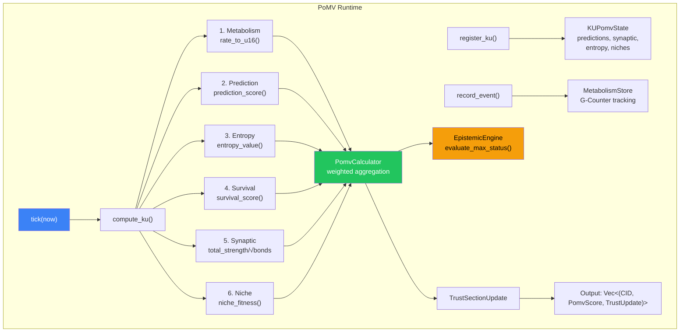
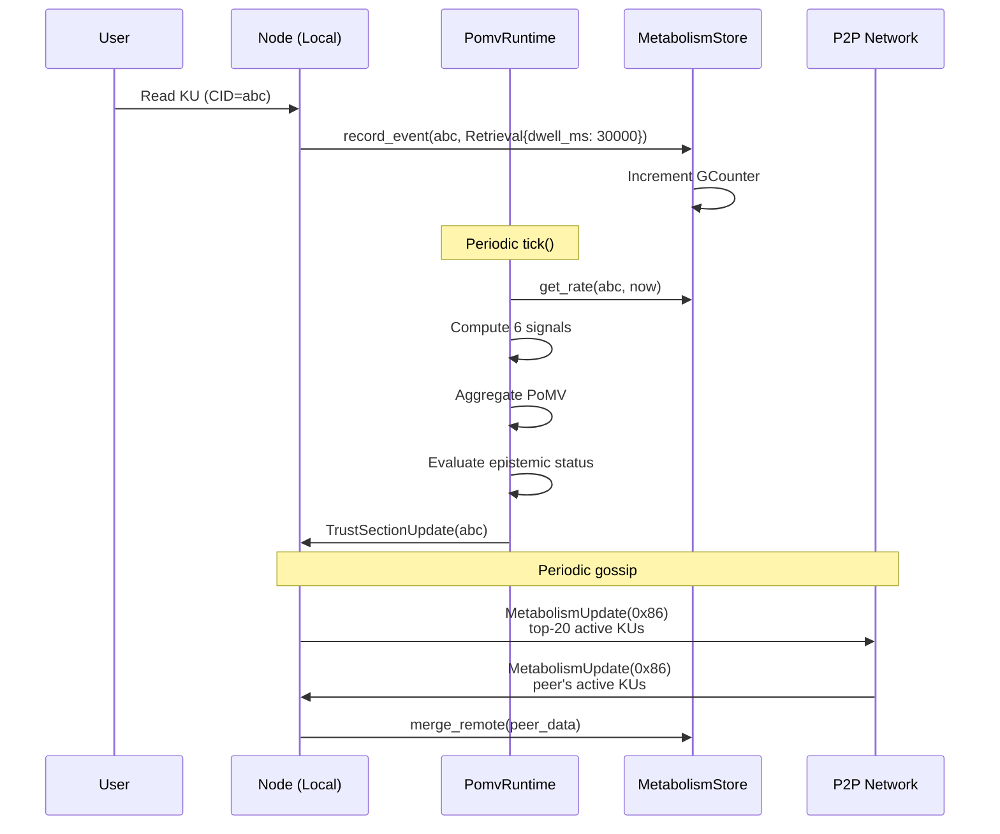

# 6. PoMV Aggregator, Reward Model, and Runtime

This section specifies the PoMV aggregator that combines all 6 signals into a single score, the OBT reward model, and the runtime orchestrator.

## 6.1 PoMV Aggregator

The PoMV Aggregator ([pomv.rs](file:///c:/Users/shpy2/Documents/OneBrain/src/ku-core/src/pomv.rs), 290 LOC, 9 tests) computes the final PoMV score from the 6 signal values.

### 6.1.1 Aggregation Formula

$$\text{PoMV}(ku, t) = \text{clamp}\left(\sum_{i=1}^{6} w_i \cdot s_i(ku, t),\ 0,\ 1\right)$$

where $s_i \in [0, 1]$ are the normalized signal values and $w_i$ are configurable weights with $\sum w_i = 1$.

### 6.1.2 Signal Normalization

Each signal is normalized to [0, 1] before aggregation:

| Signal | Raw Type | Normalization | u16 Mapping |
|--------|----------|--------------|-------------|
| Metabolism | f64 (unbounded) | Sigmoid: $1 - e^{-r/10}$ | `rate_to_u16()` / 10000 |
| Prediction | f64 [0, 1] | Direct | `score_to_u16()` / 10000 |
| Entropy | f32 [0, 1] | `entropy_value()` with decay | `entropy_to_u16()` / 10000 |
| Survival | f32 [0, 1] | `min(attacks × 0.1, 1.0)` | `survival_to_u16()` / 10000 |
| Synaptic | f32 (unbounded) | $\frac{\text{total\_strength}}{\sqrt{\text{bond\_count} + 1}}$, clamped | `centrality_to_u16()` / 10000 |
| Niche | f32 [0, 1] | Weighted sum of 4 sub-scores | `fitness_to_u16()` / 10000 |

*Table 10: Signal normalization pipeline.*

### 6.1.3 Weight Validation

The weights struct includes runtime validation:

```rust
pub fn is_valid(&self) -> bool {
    let sum = self.metabolism + self.prediction + self.entropy 
            + self.survival + self.synaptic + self.niche_fitness;
    (sum - 1.0).abs() < 0.01  // Must sum to ~1.0
}
```

This prevents misconfiguration — if weights don't sum to 1.0, the aggregator rejects the configuration.

### 6.1.4 Contribution Breakdown

The aggregator returns not just the total score but individual contributions:

```rust
pub struct PomvScore {
    pub total: f32,                     // Overall PoMV score [0, 1]
    pub contributions: PomvContributions,  // Per-signal weighted values
    pub weights: PomvWeights,             // Weights used
}

pub struct PomvContributions {
    pub metabolism: f32,    // w₁ × s₁
    pub prediction: f32,    // w₂ × s₂
    pub entropy: f32,       // w₃ × s₃
    pub survival: f32,      // w₄ × s₄
    pub synaptic: f32,      // w₅ × s₅
    pub niche_fitness: f32, // w₆ × s₆
}
```

This transparency allows inspection of *why* a KU received its score — essential for debugging, auditing, and building user trust in the mechanism.

## 6.2 OBT Reward Model

### 6.2.1 Reward Formula

$$\text{OBT\_reward}(ku, \text{period}) = \text{base\_emission}(\text{period}) \times \frac{\text{PoMV}(ku, \text{period})}{\sum_{ku' \in \text{all\_KUs}} \text{PoMV}(ku', \text{period})}$$

In words: the reward for a KU is proportional to its share of total PoMV in the network.

### 6.2.2 Linear Reward Mapping

$$\text{reward}(ku) = \text{pomv\_score}(ku) \times \text{max\_reward\_per\_epoch}$$

This is deliberately simple — complexity in reward formulas creates gaming opportunities. The mapping is linear, transparent, and predictable.

### 6.2.3 Non-Punitive Guarantees

**No clawback:** G-Counters only increment. Once a KU has earned OBT rewards, those rewards are permanent — even if the KU is later deprecated or abandoned.

**Why no clawback?**
1. **Fairness:** A KU that was useful for 6 months deserves its 6 months of rewards, even if superseded.
2. **Incentive alignment:** Clawback discourages contribution — contributors fear losing rewards for reasons outside their control.
3. **Technical simplicity:** G-Counter increment-only semantics eliminate the need for complex rollback logic.
4. **Philosophical consistency:** If knowledge was *used*, it *delivered value*. Past value delivery is factual.

### 6.2.4 Comparison with Other Reward Models

| Model | Reward Basis | Punishment | Clawback? | Fair to Subjective Knowledge? |
|-------|-------------|-----------|:---------:|:-----------------------------:|
| Academic (journals) | Publication count, citations | Retraction (career damage) | Implicit | No |
| Stack Overflow | Upvotes | Downvotes (rep loss) | Yes | No |
| Prediction Markets | Correct predictions | Incorrect predictions (loss) | Yes | No |
| Filecoin | Storage provided | Slashing (collateral loss) | Yes | N/A |
| **PoMV** | **Usage (metabolism)** | **Natural decay (no punishment)** | **No** | **Yes** |

*Table 11: Reward model comparison across knowledge and crypto systems.*

## 6.3 PoMV Runtime Orchestrator

The PoMV Runtime ([pomv_runtime.rs](file:///c:/Users/shpy2/Documents/OneBrain/src/ku-core/src/pomv_runtime.rs), 550 LOC, 8 tests) is the central orchestrator that ties all components together.

### 6.3.1 Architecture



*Figure 6: PoMV Runtime data flow. The `tick()` function computes all 6 signals for every registered KU, aggregates them, evaluates epistemic transitions, and produces trust updates.*

### 6.3.2 Per-KU State

Each registered KU maintains:

```rust
pub struct KUPomvState {
    pub predictions: PredictionRegistry,  // Prediction registry
    pub synaptic: SynapticMap,            // Hebbian bond map
    pub entropy_at_creation: f32,         // Novelty score at birth
    pub bridge_at_creation: f32,          // Bridge score at birth
    pub created_at: u64,                  // Creation timestamp
    pub attacks_survived: u32,            // Survival counter
    pub niches: Vec<NicheId>,             // Ecological niches
    pub cross_niche_count: usize,         // Cross-niche connections
    pub epistemic_status: EpistemicStatus, // Current status
}
```

### 6.3.3 The `tick()` Function

The `tick()` function is the heartbeat of the PoMV system — called periodically (typically every epoch):

```
Algorithm 1: PoMV Tick
INPUT: now (current timestamp), niche_stats
OUTPUT: sorted list of (CID, PomvScore, TrustSectionUpdate)

1. FOR EACH (cid, ku_state) IN ku_states:
2.   metabolism ← metabolism_store.get(cid)
3.   IF metabolism IS NONE: CONTINUE  // No metabolism data
4.   
5.   // Compute 6 signals
6.   s₁ ← metabolism.rate_to_u16(now, half_life) / 10000
7.   s₂ ← ku_state.predictions.prediction_score()
8.   s₃ ← entropy_value(ku_state.entropy, ku_state.bridge, age)
9.   s₄ ← survival_score(ku_state.attacks_survived, metabolism.is_alive())
10.  s₅ ← ku_state.synaptic.total_strength() / √(bond_count + 1)
11.  s₆ ← niche_fitness(ku_state.niches, niche_stats)
12.  
13.  // Aggregate
14.  pomv ← PomvCalculator::compute(signals, weights)
15.  
16.  // Evaluate epistemic status
17.  new_status ← evaluate_max_status(ku_state.status, metabolism, now)
18.  ku_state.epistemic_status ← new_status
19.  
20.  // Create trust update
21.  update ← TrustSectionUpdate { all 6 scores + pomv_total + status }
22.  
23.  results.push((cid, pomv, update))
24.
25. SORT results BY pomv.total DESCENDING
26. RETURN results
```

### 6.3.4 TrustSectionUpdate

The output of `tick()` includes a `TrustSectionUpdate` that can be applied to the KU's TrustSection:

```rust
pub struct TrustSectionUpdate {
    pub epistemic_status: EpistemicStatus,
    pub metabolic_rate: u16,          // 0-10000
    pub prediction_score: u16,        // 0-10000
    pub entropy_at_creation: u16,     // 0-10000
    pub survival_score: u16,          // 0-10000
    pub synaptic_centrality: u16,     // 0-10000
    pub niche_fitness: u16,           // 0-10000
    pub pomv_total: f32,              // 0.0-1.0
}
```

The `apply_to(trust: &mut TrustSection)` method writes these values to the KU's trust metadata, which is then propagated through CRDT sync.

### 6.3.5 Garbage Collection

The runtime's `gc(now)` function removes dead KU state:

$$\text{remove if: } \text{metabolic\_rate} < 0.0001 \text{ AND } \text{age} > 365 \text{ days} \text{ AND } \text{engagement} = 0$$

This is deliberately conservative:
- Very low threshold (0.0001) — only truly abandoned KUs
- One-year minimum age — never GC young KUs
- Zero engagement required — even a single interaction prevents GC

## 6.4 Metabolism Gossip Protocol

The Metabolism Gossip module ([metabolism_gossip.rs](file:///c:/Users/shpy2/Documents/OneBrain/src/ku-net/src/metabolism_gossip.rs), 325 LOC, 6 tests) propagates metabolism data across the P2P network.

### 6.4.1 Wire Protocol

| Message | Code | Direction | Content |
|---------|:----:|-----------|---------|
| `MetabolismUpdate` | 0x86 | Push | sender, Vec<(CID, KUMetabolism)>, timestamp |
| `MetabolismQuery` | 0x87 | Pull | requester, Vec<CID>, request_id |
| `MetabolismResponse` | 0x89 | Reply | responder, Vec<(CID, KUMetabolism)>, request_id |

### 6.4.2 Gossip Strategy

**Push (periodic):** Each node periodically selects random peers and sends its top-N most active KU metabolisms (max 20 per message). The receiver merges using G-Counter merge — idempotent, commutative, monotonic.

**Pull (on-demand):** When a node encounters a CID it doesn't have metabolism data for, it sends a `MetabolismQuery` to peers. Responses are merged into the local store.

### 6.4.3 CRDT Safety

All merges use G-Counter semantics:

$$\text{merged}[i] = \max(\text{local}[i], \text{remote}[i])$$

This guarantees:
- **Idempotent:** Merging the same data twice has no effect
- **Commutative:** Order of merges doesn't matter
- **Monotonic:** Values only increase
- **Convergent:** All nodes eventually agree

## 6.5 Full System Integration



*Figure 7: End-to-end data flow from user action to PoMV scoring to network gossip.*

---
