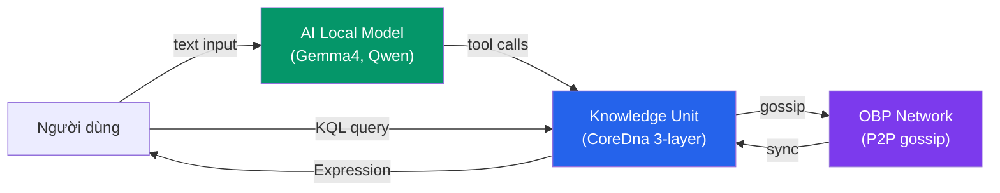

# Knowledge Unit vs AI Model — So sánh triết học

> **Tại sao tri thức cần một đơn vị riêng, thay vì chỉ dùng AI model?**  
> Tài liệu này so sánh hai cách tiếp cận lưu trữ và quản lý tri thức: Knowledge Unit (KU) của OneBrain và AI Language Model.

---

## 1. Tổng quan hai mô hình

### Knowledge Unit (KU)
Đơn vị tri thức nhỏ nhất trong OneBrain — một **chuỗi instruction nhị phân** (CoreDna) mã hóa kiến thức dưới dạng có cấu trúc, không phụ thuộc ngôn ngữ tự nhiên.

```rust
// Ví dụ: "Nước sôi ở 100°C" encoded thành CoreDna
CoreDna {
    header: CoreDnaHeader {
        version: 1,
        gene_type: 0,         // Fact
        has_qualifiers: false,
    },
    instructions: vec![
        Instruction::Triple { s: 301, p: 1, o: 302 },
        //                    "nước" IS_A "chất lỏng"
        Instruction::Quantity {
            s: 301,
            value: NumericValue::F32(100.0),
            unit: 10,  // UNIT_DEGREE
        },
        Instruction::Certainty { level: 9500 },
    ],
}
// Wire size: ~18 bytes. CID: BLAKE3 hash (32 bytes).
```

### AI Language Model
Mạng neural network lớn (billions of parameters) được train trên corpus văn bản khổng lồ. Tri thức "nấu chảy" vào weights — không thể trích xuất, kiểm chứng, hay truy vấn trực tiếp.

---

## 2. So sánh chi tiết

### 2.1 Đơn vị tri thức (Granularity)

| Khía cạnh | Knowledge Unit | AI Model |
|-----------|---------------|----------|
| **Đơn vị nhỏ nhất** | 1 KU = 1 fact/procedure/experience | Không có đơn vị — mọi thứ nằm trong weights |
| **Addressable** | ✅ CID (BLAKE3 hash, 32 bytes) | ❌ Không thể chỉ vào "1 fact" |
| **Kích thước** | 16–172 bytes per KU | 1–400 GB per model |
| **Truy vấn** | KQL: `FIND (k:KU) WHERE k.concept_ids CONTAINS 301` | Prompt engineering, may hallucinate |

**Ý nghĩa:** Bạn có thể *chỉ vào* một KU cụ thể, kiểm tra nó, phản bác nó, trích dẫn nó. Với AI model, tri thức là một "hộp đen" — bạn không biết nó lấy thông tin từ đâu.

### 2.2 Ngôn ngữ (Language Independence)

| Khía cạnh | Knowledge Unit | AI Model |
|-----------|---------------|----------|
| **Lưu trữ** | ConceptID (varint, ngôn ngữ-agnostic) | Text tokens (ngôn ngữ-dependent) |
| **Đa ngôn ngữ** | Cùng CoreDna → Expression "vi", "en", "ja" | Cần retrain hoặc fine-tune |
| **Ví dụ** | `Instruction::Triple { s: 301, p: 1, o: 302 }` | "Water is a liquid" (English only) |

**Ví dụ CoreDna đa ngôn ngữ:**

```rust
// Cùng 1 CoreDna, render ra 2 ngôn ngữ:
let dna = CoreDna {
    header: CoreDnaHeader { version: 1, gene_type: 0, has_qualifiers: false },
    instructions: vec![
        Instruction::Triple { s: 301, p: 1, o: 302 },
    ],
};

// ConceptDict:
// 301 → {name_vi: "nước", name_en: "water"}
// 1   → {name_vi: "là",   name_en: "is_a"}
// 302 → {name_vi: "chất lỏng", name_en: "liquid"}

// Expression (vi): "Nước là chất lỏng"
// Expression (en): "Water is a liquid"
// CoreDna: giống nhau 100%.
```

### 2.3 Kiểm chứng (Verifiability)

| Khía cạnh | Knowledge Unit | AI Model |
|-----------|---------------|----------|
| **Xuất xứ** | CID + bonds (33 relation types) | Không rõ nguồn |
| **Epistemic status** | 11 bậc (Rumor → Axiomatic) với threshold rõ ràng | "Confident" nhưng có thể hallucinate |
| **Phản bác** | Trực tiếp: `Bond { relation: Refutes, target_cid: ... }` | Prompt: "Actually, this is wrong" (dễ bỏ qua) |
| **Bằng chứng** | 9 evidence types (GRADE-aligned) | Không phân loại |
| **Tin cậy** | PoMV score (6 observable signals) | Không có metric khách quan |

**Ví dụ Epistemic Ladder:**

```text
"Trái đất phẳng" → Rumor (0x00)
   Lý do: metabolic_rate < 0.001, unique_nodes < 3
   Không ai query, không ai cite → remains Rumor

"Nước sôi ở 100°C" → Consensus (0x08)
   Lý do: citation_count > 5, age > 6 months, metabolic_rate > 1.0
   Được query liên tục, cite bởi hàng trăm KU khác
```

### 2.4 Tiến hóa (Evolution)

| Khía cạnh | Knowledge Unit | AI Model |
|-----------|---------------|----------|
| **Cập nhật** | Tạo KU mới + bond `Supersedes` | Retrain toàn bộ model |
| **Chi phí** | ~20 bytes + 1 bond | $1M–$100M per retrain |
| **Rollback** | CID immutable → quay lại version cũ | Không thể rollback 1 fact |
| **Versioning** | `EpigeneticSection.prev_cid` | Checkpoint toàn model |

**Ví dụ:**
```
-- Tri thức cũ: "Pluto là hành tinh" (CID: abc...)
-- Tri thức mới: "Pluto là hành tinh lùn"

CREATE (k:KU) FACT certainty=9500 {
    TRIPLE("pluto", "is_a", "dwarf_planet")
}
SIGNED BY "iau_2006"

-- Bond: new_ku --[Supersedes]--> old_ku (CID: abc...)
-- old_ku tự động chuyển sang EdgeState::Deprecated
```

### 2.5 Giá trị (Value Assessment)

| Khía cạnh | Knowledge Unit | AI Model |
|-----------|---------------|----------|
| **Đo lường** | PoMV = 6 observable signals | Benchmark scores (MMLU, etc.) |
| **Granularity** | Per-KU score | Per-model score |
| **Triết lý** | "Tri thức có giá trị = tri thức được SỬ DỤNG" | "Model tốt = score cao" |
| **Anti-spam** | Immune system phát hiện pattern | Không tự bảo vệ |

**PoMV 6 tín hiệu cho từng KU:**

```rust
// pomv.rs
PomvWeights {
    metabolism: 0.35,     // Có ai dùng không? (query, cite, derive)
    prediction: 0.15,     // Dự đoán có đúng không?
    entropy: 0.10,        // Có mới lạ không? (cold-start boost)
    survival: 0.10,       // Có sống sót qua tấn công không? (anti-fragile)
    synaptic: 0.15,       // Nằm ở vị trí quan trọng trong mạng?
    niche_fitness: 0.15,  // Đóng góp giá trị cho domain?
}
```

### 2.6 Quyền sở hữu & Phân cấp

| Khía cạnh | Knowledge Unit | AI Model |
|-----------|---------------|----------|
| **Ownership** | Phi tập trung — mỗi node giữ copy | Centralized — thuộc về công ty |
| **Censorship** | Không ai có thể xóa KU khỏi mạng | Công ty quyết định nội dung |
| **Access** | Mỗi node đánh giá local | API gated, có thể bị revoke |
| **Privacy** | Immune system chỉ gossip pattern_hash | Training data leakage |

---

## 3. Khi nào dùng cái nào?

### KU phù hợp cho:
- **Tri thức cấu trúc**: facts, procedures, formal proofs
- **Tri thức cần truy vấn chính xác**: "Nhiệt độ sôi của nước?"
- **Tri thức cần kiểm chứng**: scientific claims, medical data
- **Tri thức cần phiên bản**: evolving knowledge, supersedes chain
- **Tri thức phi tập trung**: no single point of failure

### AI Model phù hợp cho:
- **Sinh text tự nhiên**: viết email, tóm tắt
- **Suy luận mềm**: analogy, creative writing
- **Xử lý text phi cấu trúc**: đọc hiểu, tóm tắt document
- **Tier 2 input**: phân tách text → CoreDna instructions

### OneBrain kết hợp cả hai:



---

## 4. Ví dụ đầy đủ: "Nước sôi ở 100°C"

### Trong AI Model:
```text
Input:  "Nước sôi ở bao nhiêu độ?"
Output: "Nước sôi ở 100 độ C ở áp suất tiêu chuẩn."

→ Bạn KHÔNG biết:
  - Nguồn gốc thông tin
  - Mức độ tin cậy
  - Ai đã kiểm chứng
  - Có bao nhiêu người đã query điều này
```

### Trong OneBrain KU:

**Step 1: Tạo CoreDna**
```rust
let dna = CoreDna {
    header: CoreDnaHeader {
        version: 1,
        gene_type: 0,  // Fact
        has_qualifiers: false,
    },
    instructions: vec![
        Instruction::Triple { s: 301, p: 1, o: 302 },
        //                    "nước" IS_A "chất lỏng"
        Instruction::Quantity {
            s: 301,           // "nước"
            value: NumericValue::F32(100.0),
            unit: 10,          // UNIT_DEGREE
        },
        Instruction::Certainty { level: 9500 },
        // Thêm điều kiện: ở áp suất tiêu chuẩn
        Instruction::Condition {
            cond: 320,   // "áp_suất_tiêu_chuẩn"
            result: 301, // "nước"
        },
    ],
};
```

**Step 2: KuRuntime (3 lớp)**
```rust
let runtime = KuRuntime::from_dna(dna)?;
// runtime.cid = [BLAKE3 hash, 32 bytes] ← globally unique
// runtime.dna = CoreDna (Layer 1)
// runtime.epi = Epigenetics::default() (Layer 2)
// runtime.expr = None (Layer 3, chưa render)
```

**Step 3: Truy vấn bằng KQL**
```
FIND (k:KU)
WHERE k.concept_ids CONTAINS 301
  AND k.dna.header.gene_type = 0
  AND k.epi.trust.trust_score > 5000
SCOPE LOCAL
RETURN k
```

**Step 4: PoMV scoring sau 6 tháng sử dụng**
```rust
// Metabolism: query_hits = 500, citations = 30
// → metabolic_rate: 0.72

// Prediction: confirmed 48 times, refuted 2
// → prediction_score: 0.96

// Entropy: common knowledge, not novel
// → entropy (after decay): 0.0

// Survival: survived 2 spam attacks
// → survival: 0.2

// Synaptic: cited by 30 KUs, co-retrieved frequently
// → synaptic: 0.65

// Niche: dominant in "chemistry" niche
// → niche_fitness: 0.45

// PoMV = 0.35×0.72 + 0.15×0.96 + 0.10×0.0 +
//        0.10×0.2 + 0.15×0.65 + 0.15×0.45
// PoMV = 0.252 + 0.144 + 0.0 + 0.02 + 0.0975 + 0.0675
// PoMV = 0.581

// Epistemic: Corroborated (0x06)
//   age > 6 months, citations > 5, engagement > 50
//   → Ready for PeerReviewed transition
```

---

## 5. Bảng so sánh tổng hợp

| Tiêu chí | KU (OneBrain) | AI Model |
|----------|---------------|----------|
| Đơn vị | 1 KU = 1 fact (16-172 bytes) | 1 model = tất cả (1-400 GB) |
| Định danh | CID (BLAKE3, immutable) | Model name/version |
| Ngôn ngữ | Agnostic (ConceptIDs) | Dependent (tokens) |
| Truy vấn | KQL (structured query) | Prompt (unstructured) |
| Kiểm chứng | 11-level Epistemic Ladder | Không rõ |
| Giá trị | PoMV (6 signals, per-KU) | Benchmark (per-model) |
| Cập nhật | Bond Supersedes (20 bytes) | Retrain ($M) |
| Ownership | Decentralized (P2P) | Centralized (company) |
| Anti-spam | Immune system (pattern-based) | Không |
| Privacy | Local-first, pattern_hash only | Training data leakage |
| Offline | ✅ 100% local | ❌ API-dependent (mostly) |

---

## 6. Kết luận

> **KU không thay thế AI model. AI model không thay thế KU.**

- **AI model**: tốt cho *suy luận mềm*, *sinh text*, *xử lý phi cấu trúc*.
- **KU**: tốt cho *lưu trữ*, *kiểm chứng*, *truy vấn*, *tiến hóa* tri thức.

OneBrain dùng AI model như **công cụ nhập liệu** (Tier 2) để chuyển text → CoreDna, nhưng tri thức cuối cùng được lưu dưới dạng KU — addressable, verifiable, evolvable, decentralized.

Tri thức thuộc về nhân loại, không thuộc về bất kỳ công ty nào.
