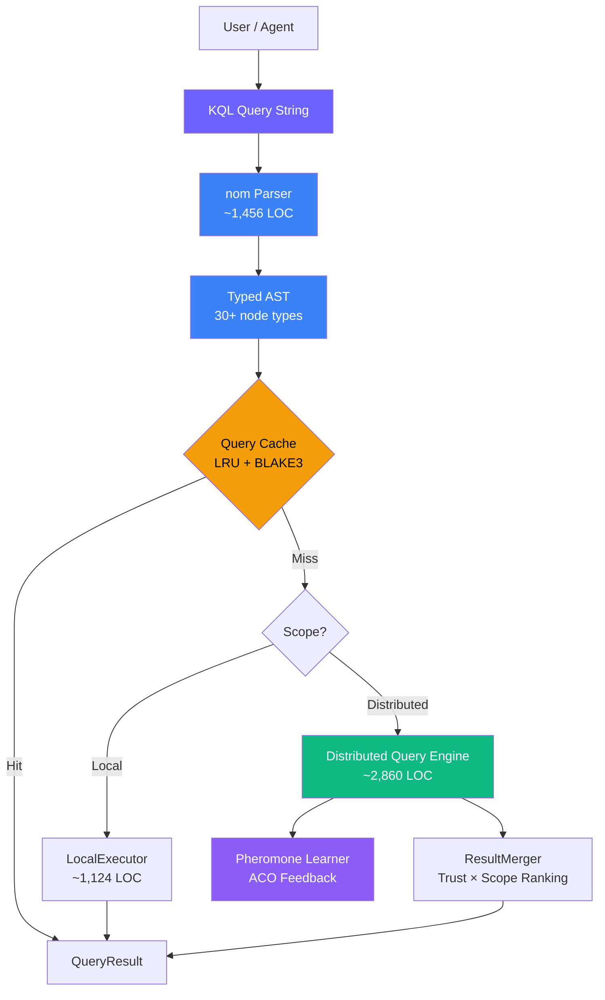

# 1. Introduction

## 1.1 Phát biểu Bài toán

Sự ra đời của các mạng lưới tri thức phi tập trung (decentralized knowledge networks) — các hệ thống peer-to-peer được thiết kế để lưu trữ, chia sẻ và khám phá tri thức có cấu trúc của con người — tạo ra một thách thức thiết kế ngôn ngữ truy vấn cơ bản. Khác với các cơ sở dữ liệu truyền thống, nơi một công cụ truy vấn (query engine) có khả năng hiển thị toàn diện trên toàn bộ tập dữ liệu, một mạng lưới tri thức phi tập trung phân phối dữ liệu trên hàng ngàn hoặc hàng triệu nút tự trị (autonomous nodes). Không có nút đơn lẻ nào nắm giữ đồ thị tri thức hoàn chỉnh.

Các ngôn ngữ truy vấn hiện tại không giải quyết được môi trường này:

**SQL** [1] giả định một kho lưu trữ quan hệ tập trung với khả năng hiển thị lược đồ (schema) hoàn chỉnh, các giao dịch ACID trên toàn bộ tập dữ liệu và lập kế hoạch truy vấn tất định (deterministic query planning). Trong một mạng lưới phi tập trung, "cơ sở dữ liệu" trải rộng trên hàng ngàn nút, lược đồ được ngầm định trong cấu trúc Knowledge Unit, và các giao dịch được thay thế bằng tính nhất quán cuối cùng (eventual consistency) thông qua CRDTs.

**SPARQL** [2] cung cấp khả năng khớp mẫu đồ thị (graph pattern matching) phong phú trên các bộ ba RDF (RDF triples) nhưng giả định một mô hình truy vấn điểm cuối đơn lẻ (single-endpoint query model). Federated SPARQL (từ khóa SERVICE) yêu cầu liệt kê điểm cuối rõ ràng — điều này không thực tế khi các điểm cuối là các nút P2P ẩn danh tham gia và rời khỏi mạng lưới một cách động.

**Cypher** [3] (Neo4j) cung cấp một cú pháp truy vấn đồ thị trực quan nhưng được thiết kế cho cơ sở dữ liệu đồ thị thuộc tính đơn máy chủ (single-server property graph database). Nó không có khái niệm về phân phạm vi truy vấn (query scoping), định tuyến phân tán (distributed routing), hoặc xếp hạng kết quả nhận biết tin cậy (trust-aware result ranking).

**GraphQL** [4] cung cấp một ngôn ngữ truy vấn API linh hoạt nhưng tập trung vào các mô hình tương tác client-server, chứ không phải khám phá tri thức peer-to-peer. Nó thiếu các tính năng gom tụ (aggregation), truy vấn liên tục (standing queries), và quản lý vòng đời tri thức (knowledge lifecycle management).

**XQuery** [5] và **Datalog** [6] giải quyết các yêu cầu mô hình dữ liệu cụ thể (lần lượt là cây XML và các chương trình logic đệ quy) nhưng không ngôn ngữ nào xử lý được các thách thức đặc thù của các đơn vị tri thức được gán nhãn tin cậy (trust-annotated), đồng bộ hóa bằng CRDT, và lấy cảm hứng từ sinh học (bio-inspired).

Không có ngôn ngữ nào trong số này cung cấp:
- **Scoped distributed execution** (thực thi phân tán có phạm vi): "Tìm kiếm kho lưu trữ cục bộ của tôi, sau đó là các nút lân cận, sau đó là DHT, và cuối cùng là toàn cầu"
- **Trust-aware ranking** (xếp hạng nhận biết tin cậy): "Xếp hạng kết quả theo trust_score × proximity"
- **Standing reactive queries** (các truy vấn phản ứng liên tục): "Thông báo cho tôi bất cứ khi nào tri thức mới khớp với các tiêu chí này xuất hiện"
- **Knowledge lifecycle management** (quản lý vòng đời tri thức): "Hủy bỏ (Deprecate) tri thức này với lý do và chữ ký"
- **Query plan introspection** (nội soi kế hoạch truy vấn): "Hiển thị cho tôi cách truy vấn này sẽ được thực thi trên mạng lưới"
- **Bio-inspired knowledge types** (các loại tri thức lấy cảm hứng sinh học): "Lọc theo loại gen (Fact, Hypothesis, Procedure) và trạng thái nhận thức (epistemic status)"

## 1.2 Động lực: Tại sao cần một Ngôn ngữ Truy vấn Mới?

Mạng lưới tri thức OneBrain lưu trữ dữ liệu dưới dạng các **Knowledge Units (KUs)** [7] — các cấu trúc dữ liệu lấy cảm hứng sinh học với 11 loại gen (gene types), 33 loại liên kết (bond types), theo dõi trạng thái nhận thức (epistemic status), điểm tin cậy dựa trên CRDT (CRDT-based trust scores), và siêu dữ liệu đa chiều (multi-dimensional metadata). Truy vấn dữ liệu này đòi hỏi một ngôn ngữ hiểu được:

1. **Knowledge-specific types** (các loại đặc thù của tri thức): Loại gen (Fact, Hypothesis, Procedure, Analogy, Narrative, v.v.), trạng thái nhận thức (Rumor → Observation → Evidence → Theorem → Law), và các loại bằng chứng (Anecdotal, Statistical, Experimental, v.v.)
2. **Trust and verification** (Độ tin cậy và xác thực): Điểm tin cậy (trust scores), khoảng tin cậy (confidence intervals), số lượng chứng thực (corroboration counts), lịch sử thách thức (challenge histories), và các cấp độ xác thực (verification levels) — tất cả đều được hỗ trợ bởi CRDT và liên tục phát triển.
3. **Distributed execution topology** (Cấu trúc liên kết thực thi phân tán): Truy vấn phải quyết định nơi thực thi — tại địa phương (locally) để đạt tốc độ, trên các nút lân cận (neighbors) để mở rộng phạm vi, trên DHT để tiếp cận toàn cầu, hoặc thông qua các dấu vết stigmergy (stigmergy trails) để định tuyến chuyên môn ngữ nghĩa.
4. **Reactive knowledge monitoring** (Giám sát tri thức phản ứng): Trong một mạng lưới tri thức động, người dùng cần được thông báo liên tục khi tri thức khớp với sở thích của họ xuất hiện — không chỉ là các truy vấn tại một thời điểm (point-in-time queries).
5. **Knowledge deprecation with provenance** (Hủy bỏ tri thức với nguồn gốc rõ ràng): Tri thức có thể trở nên lỗi thời, bị thay thế hoặc bị bác bỏ. Ngôn ngữ truy vấn phải hỗ trợ việc hủy bỏ (deprecation) như một thành phần chính yếu (first-class) với việc theo dõi lý do và quyền tác giả.

KQL được thiết kế như là giao diện truy vấn bản địa (native query interface) cho môi trường này — "SQL cho các đồ thị tri thức phi tập trung."

## 1.3 Các Nguyên tắc Thiết kế

KQL tuân theo sáu nguyên tắc thiết kế:

1. **Declarative, not imperative** (Khai báo, không mệnh lệnh): Người dùng bày tỏ *những gì* họ muốn, chứ không phải *cách thức* lấy nó. Công cụ truy vấn (query engine) sẽ xử lý việc định tuyến, lưu bộ nhớ đệm và tối ưu hóa.

2. **SQL-familiar syntax** (Cú pháp quen thuộc với SQL): Những hiểu biết trực quan của nhà phát triển từ SQL sẽ được chuyển giao trực tiếp. `FIND ... WHERE ... ORDER BY ... LIMIT` mô phỏng `SELECT ... WHERE ... ORDER BY ... LIMIT`.

3. **Graph-native patterns** (Các mẫu bản địa đồ thị): Các mẫu nút và cạnh sử dụng cú pháp lấy cảm hứng từ Cypher: `(k:KU)` cho nút, `-[r:BondType]->` cho cạnh.

4. **Scope-first distribution** (Phân phối ưu tiên phạm vi): Mỗi truy vấn đều có một phạm vi — rõ ràng hoặc ngầm định — để kiểm soát độ rộng của việc phân phối. Mệnh đề `SCOPE` là một cấu trúc ngôn ngữ hạng nhất (first-class language construct), không phải là một tùy chọn cấu hình.

5. **Trust is a first-class citizen** (Độ tin cậy là đối tượng hạng nhất): Điểm tin cậy, trạng thái nhận thức và các loại bằng chứng là các trường có thể truy vấn được, không phải là các chú thích bên ngoài. Các hàm gom tụ (`AVG(k.trust_score)`) hoạt động một cách tự nhiên trên siêu dữ liệu độ tin cậy.

6. **Lifecycle completeness** (Tính toàn vẹn của vòng đời): KQL bao quát toàn bộ vòng đời tri thức: tạo mới (`CREATE`), đọc (`FIND`), cập nhật (`UPDATE`), giám sát (`WATCH`), nội soi (`EXPLAIN`), và thu hồi (`DEPRECATE`). Không cần các công cụ bên ngoài.

*Hình 1: Đường ống xử lý truy vấn KQL. Các truy vấn được phân tích cú pháp thành một typed AST, được kiểm tra đối chiếu với một LRU cache, sau đó được thực thi cục bộ hoặc phân tán trên mạng lưới P2P.*

## 1.4 Các Đóng góp

Bài báo này thực hiện các đóng góp sau:

1. **Một ngôn ngữ truy vấn khai báo cho các đồ thị tri thức phi tập trung** (§3) với 6 loại truy vấn, khớp mẫu đồ thị, lọc nhận biết tin cậy và tích hợp kiểu đặc thù của tri thức.

2. **Mệnh đề SCOPE để kiểm soát thực thi phân tán rõ ràng** (§3.2, §4.2) cung cấp 6 cấp độ leo thang từ thực thi cục bộ đến tràn ngập toàn cầu (global flooding), cho phép người dùng đánh đổi độ trễ lấy tính toàn vẹn.

3. **Các truy vấn phản ứng liên tục (WATCH)** (§3.5) với thông báo hướng sự kiện, lan truyền bộ lọc, và quản lý vòng đời dựa trên TTL — điều còn thiếu trong tất cả các ngôn ngữ truy vấn đồ thị hiện có.

4. **Một nom-based recursive descent parser** (§4.1) tạo ra một typed AST phong phú với hơn 30 loại nút, hỗ trợ các từ khóa không phân biệt chữ hoa chữ thường, các điều kiện boolean lồng nhau, các hàm gom tụ và các mẫu cạnh đồ thị.

5. **Ba công cụ khám phá tri thức mới** (§5) được tích hợp vào đường ống truy vấn: một Knowledge Gap Detector (phát hiện tri thức còn thiếu), một Swanson ABC Bridge Finder (tìm kiếm tri thức công cộng chưa được phát hiện xuyên lĩnh vực), và một Serendipity Engine (khơi gợi các ẩn số chưa biết - unknown unknowns).

6. **Tăng cường định tuyến truy vấn dựa trên pheromone** (§5.4) giúp đóng vòng lặp phản hồi giữa kết quả truy vấn và định tuyến mạng, cho phép tự tối ưu hóa việc thực thi truy vấn phân tán.

## 1.5 Bố cục Bài báo

Phần còn lại của bài báo này được sắp xếp như sau. Mục 2 khảo sát các công trình liên quan về ngôn ngữ truy vấn cho các hệ thống phân tán và hệ thống đồ thị. Mục 3 giới thiệu đặc tả ngôn ngữ KQL với ngữ pháp và ngữ nghĩa hình thức. Mục 4 mô tả phần hiện thực parser và executor. Mục 5 trình bày về distributed query engine, các công cụ khám phá (discovery engines), và học máy pheromone (pheromone learning). Mục 6 đánh giá phần hiện thực thông qua độ bao phủ kiểm thử, phân tích hiệu năng và so sánh đối chiếu. Mục 7 thảo luận về các phát hiện, hạn chế và hướng nghiên cứu tương lai.

---

## References

[1] ISO/IEC 9075:2023, "Information technology — Database languages — SQL," International Organization for Standardization, 2023.

[2] W3C, "SPARQL 1.1 Query Language," W3C Recommendation, Mar. 2013.

[3] N. Francis *et al.*, "Cypher: An Evolving Query Language for Property Graphs," in *Proc. ACM SIGMOD '18*, pp. 1433–1445, 2018.

[4] Facebook, "GraphQL: A Query Language for APIs," 2015. [Online]. Available: https://graphql.org/

[5] W3C, "XQuery 3.1: An XML Query Language," W3C Recommendation, Mar. 2017.

[6] S. Ceri, G. Gottlob, and L. Tanca, "What You Always Wanted to Know About Datalog (And Never Dared to Ask)," *IEEE TKDE*, vol. 1, no. 1, pp. 146–166, 1989.

[7] OneBrain Project, "Knowledge Unit: A Bio-Inspired Knowledge Representation for Decentralized Knowledge Networks," 2026 (companion paper).
