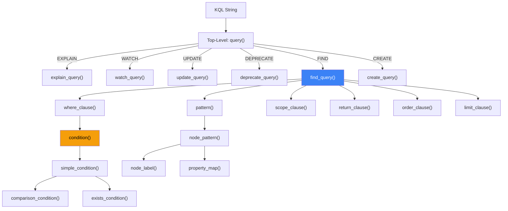

# 4. Parser and Local Executor Implementation

Mục này mô tả phần hiện thực bộ phân tích cú pháp (parser) của KQL (nom-based recursive descent) và bộ thực thi cục bộ (local executor), bao gồm thiết kế AST, chiến lược phân tích cú pháp, mô hình thực thi và kho lưu trữ bền vững.

## 4.1 Abstract Syntax Tree (AST)

KQL AST ([ast.rs](file:///c:/Users/shpy2/Documents/OneBrain/src/ku-kql/src/ast.rs), 361 dòng code) định nghĩa một biểu diễn có kiểu của các truy vấn đã phân tích cú pháp. Enum `Query` cấp cao nhất phân nhánh thành sáu biến thể:

```rust
pub enum Query {
    Find(FindQuery),
    Create(CreateQuery),
    Update(UpdateQuery),
    Deprecate(DeprecateQuery),
    Watch(WatchQuery),
    Explain(Box<Query>),
}
```

### 4.1.1 Các Loại Nút AST (30+)

| Phân loại (Category) | Các kiểu (Types) | Mục đích (Purpose) |
|----------|-------|---------|
| **Queries** | `FindQuery`, `CreateQuery`, `UpdateQuery`, `DeprecateQuery`, `WatchQuery` | 5 bộ chứa loại truy vấn |
| **Patterns** | `Pattern`, `NodePattern`, `EdgePattern`, `NodeLabel`, `EdgeDirection` | Biểu diễn mẫu đồ thị |
| **Conditions** | `Condition` (6 biến thể: `Comparison`, `And`, `Or`, `Not`, `Exists`, `Contains`) | Cây biểu thức boolean |
| **Values** | `Value` (8 biến thể: `Integer`, `Float`, `Text`, `Bool`, `ConceptId`, `EpistemicStatus`, `EvidenceType`, `Role`) | Biểu diễn hằng an toàn kiểu (type-safe literal) |
| **Expressions** | `ReturnExpr`, `AggFunc` (5), `OrderExpr`, `FieldPath`, `Assignment`, `Property` | Trả về, gom tụ, sắp xếp, gán |
| **Scope** | `Scope` (6 biến thể) | Kiểm soát phân phối |
| **Watch** | `WatchEvent` (4 biến thể) | Kiểu bộ lọc sự kiện |
| **Comparison** | `CompOp` (6 biến thể: `Eq`, `NotEq`, `Gt`, `GtEq`, `Lt`, `LtEq`) | Các toán tử so sánh |

**Lựa chọn thiết kế: typed Values.** Enum `Value` bao gồm các kiểu dữ liệu đặc thù của tri thức (`EpistemicStatus`, `EvidenceType`, `Role`) bên cạnh các kiểu chuẩn (`Integer`, `Float`, `Text`, `Bool`). Điều này cho phép đánh giá điều kiện an toàn kiểu đối với siêu dữ liệu KU — `k.epistemic_status = Evidence` là một phép so sánh có kiểu, chứ không phải là khớp chuỗi thông thường.

### 4.1.2 Cấu trúc FindQuery

Struct `FindQuery` thể hiện tính toàn vẹn của AST:

```rust
pub struct FindQuery {
    pub pattern: Pattern,                    // (k:KU) or (c:Concept)
    pub where_clause: Option<Condition>,     // WHERE k.trust > 8000
    pub scope: Scope,                        // SCOPE LOCAL | ... | AUTO
    pub return_clause: Option<Vec<ReturnExpr>>,  // RETURN COUNT(k)
    pub limit: Option<u32>,                  // LIMIT 10
    pub order_by: Option<Vec<OrderExpr>>,    // ORDER BY k.trust DESC
}
```

Mỗi loại truy vấn chứa chính xác các trường cần thiết cho việc thực thi của nó — không thừa, không thiếu. `WatchQuery` bao bọc một `FindQuery` kèm theo siêu dữ liệu sự kiện và thông báo. Biến thể `Explain` bao bọc bất kỳ truy vấn nào khác trong một `Box<Query>`.

## 4.2 Kiến trúc Parser

Bộ phân tích cú pháp ([parser.rs](file:///c:/Users/shpy2/Documents/OneBrain/src/ku-kql/src/parser.rs), 1.310 dòng code) sử dụng thư viện parser combinator **nom** [1] để chuyển đổi các chuỗi KQL thành các nút AST.

### 4.2.1 Thiết kế Parser

Parser tuân theo chiến lược **top-down recursive descent** (phân tích cú pháp đệ quy đi xuống từ trên xuống) với các nom combinator:



*Hình 3: Thứ tự gọi hàm của parser. Mỗi hàm trả về một `IResult<&str, T>` — hoặc là phần đầu vào còn lại kèm giá trị được phân tích cú pháp, hoặc là một lỗi.*

### 4.2.2 Các nom Combinator Chính được Sử dụng

| Combinator | Mục đích (Purpose) | Cách dùng (Usage) |
|-----------|---------|-------|
| `alt()` | Thử các phương án thay thế | `alt((find_query, create_query, ...))` |
| `tag_no_case()` | Từ khóa không phân biệt chữ hoa chữ thường | `tag_no_case("FIND")` |
| `opt()` | Mệnh đề tùy chọn | `opt(where_clause)` |
| `separated_list1()` | Danh sách phân tách bằng dấu phẩy | `separated_list1(char(','), property)` |
| `delimited()` | Nội dung trong ngoặc | `delimited(char('('), ..., char(')'))` |
| `preceded()` | Bỏ qua tiền tố | `preceded(tag("BY"), field_path)` |
| `map()` | Biến đổi kết quả | `map(find_query, Query::Find)` |
| `map_res()` | Biến đổi kèm theo lỗi | `map_res(digit1, str::parse::<u32>)` |
| `value()` | Giá trị kết quả hằng số | `value(Scope::Local, tag_no_case("LOCAL"))` |
| `tuple()` | Chuỗi tuần tự | `tuple((multispace1, tag("BY"), multispace1))` |

### 4.2.3 Xử lý Lỗi

Parser bao bọc các lỗi nom trong một struct `ParseError` với các thông báo thân thiện với con người và thông tin vị trí lỗi:

```rust
pub struct ParseError {
    pub message: String,   // "Parse error: ..."
    pub position: usize,   // Character offset of error
}
```

Sau khi phân tích cú pháp, bộ phân tích cú pháp xác minh rằng **không còn đầu vào thừa** — ngăn chặn việc phân tích cú pháp một phần thành công trong âm thầm.

### 4.2.4 Phân tích Cú pháp Điều kiện Boolean

Bộ phân tích điều kiện xử lý độ ưu tiên của toán tử thông qua cấu trúc đệ quy:

```
condition → simple_condition [("AND" | "OR") condition]
simple_condition → exists_condition | comparison_condition
```

Ngữ pháp đệ quy phải này tạo ra các cây AND/OR kết hợp bên phải (right-associative). Ví dụ:

```
k.a > 1 AND k.b < 2 AND k.c = 3
```

Được phân tích thành: `And(a>1, And(b<2, c=3))`.

## 4.3 Bộ thực thi Cục bộ (Local Executor)

Bộ thực thi cục bộ ([executor.rs](file:///c:/Users/shpy2/Documents/OneBrain/src/ku-kql/src/executor.rs), 1.124 dòng code) đánh giá các truy vấn KQL đối với một tập hợp KU trong bộ nhớ (in-memory).

### 4.3.1 Kiến trúc Executor

```rust
pub struct LocalExecutor {
    kus: Vec<KnowledgeUnit>,                 // In-memory KU store
    watches: Vec<(WatchId, WatchQuery)>,      // Standing query registrations
    next_watch_id: WatchId,                   // Auto-incrementing watch ID
}
```

**Luồng thực thi cho các truy vấn FIND:**

```
Thuật toán 1: Thực thi FIND
ĐẦU VÀO (INPUT): FindQuery { pattern, where, scope, return, order, limit }
ĐẦU RA (OUTPUT): QueryResult { rows, total_count, aggregates }

1. candidates ← filter(kus, where_clause)    // Áp dụng điều kiện WHERE
2. NẾU order_by ≠ ∅:
       sort(candidates, order_exprs)          // Sắp xếp ổn định đa khóa (multi-key stable sort)
3. total ← |candidates|
4. aggregates ← compute_aggregates(candidates, return_clause)
5. NẾU limit ≠ ∅:
       truncate(candidates, limit)
6. TRẢ VỀ QueryResult {
       rows: candidates,
       total_count: total,
       aggregates: aggregates,
       scope_used: scope
   }
```

### 4.3.2 Đánh giá Điều kiện

Hàm `evaluate_condition(ku, condition)` đánh giá đệ quy cây biểu thức boolean:

```rust
fn evaluate_condition(ku: &KnowledgeUnit, cond: &Condition) -> bool {
    match cond {
        Condition::Comparison { field, op, value } => {
            let extracted = extract_field_value(ku, field);
            compare_values(&extracted, op, value)
        },
        Condition::And(left, right) =>
            evaluate_condition(ku, left) && evaluate_condition(ku, right),
        Condition::Or(left, right) =>
            evaluate_condition(ku, left) || evaluate_condition(ku, right),
        Condition::Not(inner) =>
            !evaluate_condition(ku, inner),
        Condition::Exists(field) =>
            extract_field_value(ku, field) != ExtractedValue::None,
        Condition::Contains { field, value } =>
            field_contains(ku, field, value),
    }
}
```

**Trích xuất trường (Field extraction)** ánh xạ các đường dẫn dấu chấm tới các trường struct của KU (tổng cộng 28 trường):

*Các Trường DNA Cốt lõi (Core DNA Fields):*

| Đường dẫn Trường (Field Path) | Trích xuất từ (Extracted From) | Ép kiểu (Type Coercion) |
|-----------|---------------|----------------|
| `gene_type` | `ku.gene_type()` → name string | u8 → Text |
| `primary_concept` | `ku.primary_concept()` | u64 → i64 |
| `certainty` | `ku.certainty()` | u16 → i64 |
| `difficulty` | `ku.difficulty()` | u16 → i64 |
| `instruction_count` | `ku.instruction_count()` | usize → i64 |
| `has_triple` | `ku.has_triple()` | bool |
| `has_step` | `ku.has_step()` | bool |
| `wire_size` | `ku.wire_size()` | usize → i64 |

*Các Trường Epigenetics (Epigenetics Fields):*

| Đường dẫn Trường (Field Path) | Trích xuất từ (Extracted From) | Ép kiểu (Type Coercion) |
|-----------|---------------|----------------|
| `trust_score` | `ku.epi.trust.trust_score` | u16 → i64 |
| `confidence` | `ku.epi.trust.confidence` | u16 → i64 |
| `verification_level` | `ku.epi.trust.verification_level` | u8 → i64 |
| `corroboration_count` | `ku.epi.trust.corroboration_count` | u16 → i64 |
| `challenge_count` | `ku.epi.trust.challenge_count` | u16 → i64 |
| `error_susceptibility` | `ku.epi.trust.error_susceptibility` | u16 → i64 |
| `bond_count` | `ku.bond_count()` | usize → i64 |
| `epistemic_status` | `ku.epi.epistemic_status` | u8 → Text (11 values) |
| `evidence_type` | `ku.epi.evidence_type` | u8 → i64 |

*Các Trường Tín hiệu PoMV (PoMV Signal Fields):*

| Đường dẫn Trường (Field Path) | Trích xuất từ (Extracted From) | Ép kiểu (Type Coercion) |
|-----------|---------------|----------------|
| `metabolic_rate` | `ku.epi.trust.metabolic_rate` | u16 → i64 |
| `prediction_score` | `ku.epi.trust.prediction_score` | u16 → i64 |
| `entropy_at_creation` | `ku.epi.trust.entropy_at_creation` | u16 → i64 |
| `survival_score` | `ku.epi.trust.survival_score` | u16 → i64 |
| `synaptic_centrality` | `ku.epi.trust.synaptic_centrality` | u16 → i64 |
| `niche_fitness` | `ku.epi.trust.niche_fitness` | u16 → i64 |

*Các Trường Biểu đạt (Expression Fields):*

| Đường dẫn Trường (Field Path) | Trích xuất từ (Extracted From) | Ép kiểu (Type Coercion) |
|-----------|---------------|----------------|
| `text` | `ku.expr?.text` | Option → Text |

*Các Trường Hệ thống (System Fields):*

| Đường dẫn Trường (Field Path) | Trích xuất từ (Extracted From) | Ép kiểu (Type Coercion) |
|-----------|---------------|----------------|
| `epi` | luôn luôn `true` (v6) | bool |
| `expression` | `ku.expr.is_some()` | bool |
| `encoding_status` | `ku.encoding_status` | EncodingStatus → Text |
| `cid` | `ku.cid` | [u8; 32] → hex Text |

### 4.3.3 Công cụ Gom tụ (Aggregation Engine)

Công cụ gom tụ xử lý các biểu thức `ReturnExpr::Aggregate` trên tập kết quả đã được lọc:

$$\text{COUNT}(f) = |\{ku : f(ku) \neq \text{None}\}|$$

$$\text{SUM}(f) = \sum_{ku \in S} f(ku), \quad \text{AVG}(f) = \frac{\text{SUM}(f)}{\text{COUNT}(f)}$$

$$\text{MIN}(f) = \min_{ku \in S} f(ku), \quad \text{MAX}(f) = \max_{ku \in S} f(ku)$$

Kết quả được trả về dưới dạng `AggregateResult { name, value: AggValue }`, với `AggValue` là `Integer(i64)` hoặc `Float(f64)`.

### 4.3.4 Công cụ Watch (Watch Engine)

Bộ thực thi cục bộ duy trì một vector chứa các đăng ký `(WatchId, WatchQuery)`. Trên mỗi thao tác `insert()` hoặc đột biến (mutation), `check_watches(&self, ku)` đánh giá tất cả các watch đã đăng ký đối với KU bị ảnh hưởng:

```rust
pub fn check_watches(&self, ku: &KnowledgeUnit) -> Vec<WatchId> {
    self.watches.iter()
        .filter(|(_, watch)| {
            if let Some(ref cond) = watch.find.where_clause {
                evaluate_condition(ku, cond)
            } else {
                true  // No condition = match all
            }
        })
        .map(|(id, _)| *id)
        .collect()
}
```

Hàm `unwatch(watch_id)` loại bỏ một đăng ký, trả về `true` nếu tìm thấy.

## 4.4 Kho lưu trữ Bền vững (Persistent Storage)

Mô-đun lưu trữ ([storage.rs](file:///c:/Users/shpy2/Documents/OneBrain/src/ku-kql/src/storage.rs), 447 dòng code) cung cấp **kho lưu trữ KU bền vững tuân thủ ACID** sử dụng cơ sở dữ liệu nhúng `redb` [2].

### 4.4.1 Sơ đồ Bảng (Table Schema)

| Bảng (Table) | Khóa (Key) | Giá trị (Value) | Mục đích (Purpose) |
|-------|-----|-------|---------|
| `kus` | CID (BLAKE3 hash, 32 bytes) | Encoded KU bytes (CBOR wire format) | Kho lưu trữ chính |
| `index_trust` | trust_score (u16 BE) + CID (32B) | Empty | Truy vấn phạm vi điểm tin cậy |
| `index_concept` | concept_id (u64 BE) + CID (32B) | Empty | Tra cứu Concept ID |

**Định địa chỉ theo nội dung (Content addressing):** CID (Content IDentifier) được tính bằng `BLAKE3(encode_knowledge_unit(ku))` — băm BLAKE3 của mã hóa định dạng dây (wire format encoding) của KU. Điều này đảm bảo:
- **Tất định (Deterministic)**: Cùng nội dung KU → cùng CID (được xác thực bởi bài kiểm thử `test_deterministic_cid`)
- **Khử trùng lặp (Deduplication)**: Việc chèn cùng một KU hai lần sẽ ghi đè lên nhau (idempotent)
- **Tính toàn vẹn (Integrity)**: Bất kỳ sửa đổi nào cũng làm thay đổi CID

### 4.4.2 Các Thao tác (Operations)

| Thao tác (Operation) | Độ phức tạp (Complexity) | Mô tả (Description) |
|-----------|:----------:|-------------|
| `put(ku)` | O(1) amortized | Chèn KU, cập nhật chỉ mục, trả về CID |
| `get(cid)` | O(1) | Truy xuất KU theo CID |
| `has(cid)` | O(1) | Kiểm tra sự tồn tại |
| `delete(cid)` | O(1) | Xóa KU và trả về cờ tồn tại |
| `count()` | O(1) | Tổng số lượng KU |
| `get_all()` | O(N) | Lặp qua tất cả KU (để kiểm thử/xuất dữ liệu) |

### 4.4.3 Các Đảm bảo Giao dịch

`redb` cung cấp các giao dịch ACID thông qua kho lưu trữ B-tree sao chép khi ghi (copy-on-write):

- **Tính nguyên tử (Atomicity)**: `put()` ghi bảng chính + các chỉ mục trong một giao dịch duy nhất
- **Tính nhất quán (Consistency)**: Sơ đồ được thực thi bởi các định nghĩa bảng
- **Tính cô lập (Isolation)**: Các giao dịch đọc nhìn thấy một ảnh chụp nhanh (snapshot) nhất quán
- **Tính bền vững (Durability)**: `commit()` ghi dữ liệu xuống đĩa trước khi trả về

**Tại sao lại chọn redb thay vì SQLite/RocksDB?** redb là mã nguồn thuần Rust (pure Rust) không có phụ thuộc C (zero C dependencies) — một điều quan trọng để biên dịch chéo (cross-compilation) sang các mục tiêu di động và WebAssembly. Nó cung cấp các đảm bảo ACID mà không có sự phức tạp của một công cụ SQL đầy đủ.

## 4.5 Cấu trúc QueryResult

Tất cả các truy vấn đều trả về một `QueryResult` thống nhất:

```rust
pub struct QueryResult {
    pub rows: Vec<KnowledgeUnit>,           // Matched KUs (FIND)
    pub total_count: usize,                  // Total matches before LIMIT
    pub scope_used: Scope,                   // Execution scope
    pub aggregates: Vec<AggregateResult>,    // Aggregation results
    pub watch_id: Option<WatchId>,           // WATCH registration ID
    pub plan: Option<QueryPlan>,             // EXPLAIN output
    pub affected_count: usize,               // UPDATE/DEPRECATE count
}
```

Cấu trúc thống nhất này đơn giản hóa API máy khách (client API) — tất cả các loại truy vấn đều trả về cùng một kiểu dữ liệu với các trường liên quan được điền giá trị tương ứng.

---

## References

[1] G. Couprie, "nom: A Byte-Oriented, Streaming, Zero-Copy Parser Combinators Library in Rust," 2015.

[2] C. Olson, "redb: An embedded key-value store written in pure Rust," 2023. [Online]. Available: https://github.com/cberner/redb
