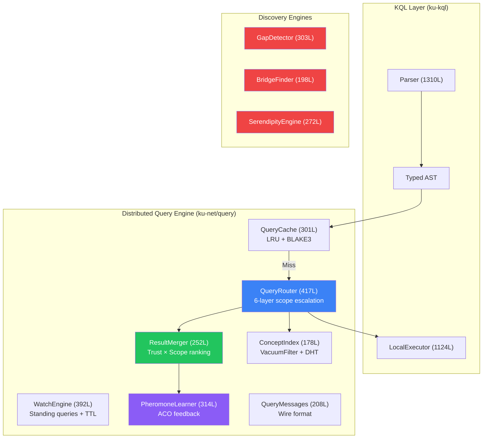
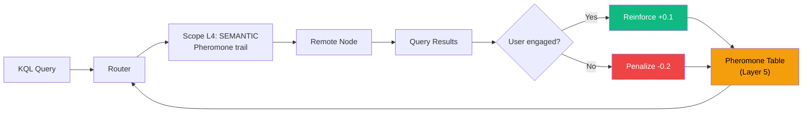

# 5. Công cụ Truy vấn Phân tán (Distributed Query Engine)

Trong khi bộ thực thi cục bộ (local executor) xử lý các truy vấn đối với kho lưu trữ KU của một nút đơn lẻ, công cụ truy vấn phân tán (distributed query engine) mở rộng việc thực thi KQL trên mạng lưới P2P. Mục này mô tả bộ định tuyến truy vấn 6 lớp (6-layer query router), bộ hợp nhất kết quả (result merger), công cụ watch phân tán (distributed watch engine), ba công cụ khám phá mới, học truy vấn dựa trên pheromone (pheromone-based query learning) và lưu bộ nhớ đệm truy vấn (query caching).

## 5.1 Tổng quan Kiến trúc

Công cụ truy vấn phân tán ([ku-net/src/query/](file:///c:/Users/shpy2/Documents/OneBrain/src/ku-net/src/query), khoảng 2.860 dòng code trên 12 mô-đun) làm cầu nối giữa KQL parser/executor với chồng giao thức (protocol stack) OneBrain:



*Hình 4: Kiến trúc công cụ truy vấn phân tán hiển thị kích thước mô-đun và luồng dữ liệu.*

## 5.2 Bộ định tuyến Truy vấn: Leo thang Phạm vi 6 Lớp

QueryRouter ([router.rs](file:///c:/Users/shpy2/Documents/OneBrain/src/ku-net/src/query/router.rs), 417 dòng code) hiện thực hóa việc leo thang phạm vi tăng dần — chiến lược thực thi phân tán cốt lõi.

### 5.2.1 Mô hình Thực thi Phạm vi

| Lớp (Layer) | Phạm vi (Scope) | TTL | Fanout | Chiến lược (Strategy) | Thông điệp mạng (Wire Message) |
|:-----:|-------|:---:|:------:|----------|:------------:|
| L0 | LOCAL | 0 | 1 | Thực thi đối với kho lưu trữ cục bộ | — |
| L1 | NEIGHBORS | 1 | 5 | Chuyển tiếp đến các nút peer SWIM 1-hop | QueryForward (0x50) |
| L2 | CLUSTER | 3 | — | Định tuyến qua siêu nút cục bộ | QueryForward (0x50) |
| L3 | DHT | 8 | α=3 | Tra cứu khóa concept Kademlia | FindValueReq (0x22) |
| L4 | SEMANTIC | 5 | — | Đi theo dấu vết pheromone stigmergy | QueryForward (0x50) |
| L5 | GLOBAL | 12 | — | Đi bộ ngẫu nhiên + lan truyền TTL | QueryForward (0x50) |

*Bảng 4: Mô hình thực thi phạm vi kèm ánh xạ TTL, fanout và thông điệp mạng.*

### 5.2.2 Thuật toán Phạm vi AUTO

When scope is `AUTO` (default), the router executes progressive escalation:

```
Thuật toán 2: Leo thang Phạm vi AUTO
ĐẦU VÀO (INPUT): query, max_results
ĐẦU RA (OUTPUT): kết quả hợp nhất (merged results)

results ← ∅
FOR scope IN [LOCAL, NEIGHBORS, CLUSTER, DHT, SEMANTIC, GLOBAL]:
    scope_results ← execute_scope(query, scope)
    results ← merge(results, scope_results)
    IF |results| ≥ max_results:
        BREAK
    IF scope = SEMANTIC AND scope_results ≠ ∅:
        reinforce_pheromone(query.topic, successful_path)

RETURN rank_results(results)
```

**Bất biến (Invariant):** Mỗi cấp độ leo thang chỉ thực thi nếu cấp độ trước đó trả về không đủ kết quả. Điều này giảm thiểu lưu lượng mạng đối với các truy vấn có thể được trả lời cục bộ.

### 5.2.3 Định dạng Dây (Wire Format)

Ba thông điệp mạng (wire messages) hỗ trợ các truy vấn phân tán:

| Thông điệp (Message) | Mã (Code) | Hướng (Direction) | Nội dung (Content) |
|---------|:----:|-----------|---------|
| `QueryForward` | 0x50 | Yêu cầu (Request) | query_id, kql_string, scope, ttl, sender_id |
| `QueryResponse` | 0x51 | Phản hồi (Response) | query_id, results: Vec\<KU\>, source_trust |
| `QueryCancel` | 0x52 | Hủy bỏ (Cancel) | query_id, reason |

**QueryForward** bao gồm một trường TTL giảm dần tại mỗi hop, ngăn chặn việc chuyển tiếp vô hạn. Một `seen_set` (Bloom filter) được sử dụng để ngăn chặn các vòng lặp truy vấn.

### 5.2.4 Tích hợp ConceptIndex

ConceptIndex ([index.rs](file:///c:/Users/shpy2/Documents/OneBrain/src/ku-net/src/query/index.rs), 178 dòng code) làm cầu nối giữa các truy vấn KQL với các lớp giao thức P2P:

- **Concept-to-CID mapping** (Ánh xạ Concept sang CID): Ánh xạ các concept ID sang các CID của KU để tra cứu cục bộ.
- **VacuumFilter integration** (Tích hợp VacuumFilter): Công bổ khả năng chứa nội dung cục bộ tới mạng lưới thông qua bộ lọc Bloom (L6).
- **DHT publishing** (Xuất bản lên DHT): Đăng ký các khóa concept trong S/Kademlia DHT (L4) để có thể khám phá trên toàn cầu.

```rust
pub struct ConceptIndex {
    concept_to_cids: HashMap<u64, Vec<[u8; 32]>>,  // concept_id → CIDs
    vacuum_filter: VacuumFilter,                     // Content capability filter
}
```

## 5.3 Bộ hợp nhất Kết quả (Result Merger)

ResultMerger ([merger.rs](file:///c:/Users/shpy2/Documents/OneBrain/src/ku-net/src/query/merger.rs), 252 dòng code) kết hợp các kết quả từ nhiều phạm vi và nguồn khác nhau:

### 5.3.1 Khử trùng lặp (Deduplication)

Các kết quả được khử trùng lặp theo CID (băm nội dung BLAKE3). Khi phát hiện trùng lặp, phiên bản có điểm tin cậy nguồn (source trust score) cao nhất sẽ được giữ lại.

### 5.3.2 Xếp hạng Trust × Scope

Mỗi kết quả được tính điểm bằng:

$$\text{score}(r) = w_t \cdot \text{trust\_score}(r) + w_s \cdot \text{scope\_proximity}(r)$$

**Scope proximity** (độ gần của phạm vi) ưu tiên các kết quả gần hơn:

| Phạm vi (Scope) | Điểm độ gần (Proximity Score) |
|-------|:--------------:|
| LOCAL | 1.00 |
| NEIGHBORS | 0.85 |
| CLUSTER | 0.70 |
| DHT | 0.55 |
| SEMANTIC | 0.65 |
| GLOBAL | 0.30 |

SEMANTIC nhận được điểm độ gần cao hơn so với DHT vì stigmergy định tuyến đến *chuyên môn đã biết (known expertise)* — nguồn đó đã chứng minh việc trả lời thành công các truy vấn tương tự trước đây.

### 5.3.3 Gom tụ đa nguồn (Multi-Source Aggregation)

Khi các hàm gom tụ được yêu cầu (COUNT, AVG, v.v.), bộ hợp nhất thực hiện gom tụ trên tất cả các nguồn:

- **COUNT**: Tổng của tất cả các lượt đếm của nguồn (sau khi khử trùng lặp)
- **AVG**: Trung bình có trọng số theo số lượng kết quả của nguồn
- **MIN/MAX**: Giá trị nhỏ nhất/lớn nhất toàn cục trên tất cả các nguồn
- **SUM**: Tổng của tất cả các tổng của nguồn (sau khi khử trùng lặp)

## 5.4 Công cụ Watch Phân tán (Distributed Watch Engine)

WatchEngine phân tán ([watch.rs](file:///c:/Users/shpy2/Documents/OneBrain/src/ku-net/src/query/watch.rs), 392 dòng code) mở rộng ngữ nghĩa WATCH trên toàn bộ mạng lưới P2P.

### 5.4.1 Lan truyền Watch (Watch Propagation)

Khi một WATCH được đăng ký cục bộ, công cụ:

1. Đăng ký bộ lọc cục bộ (được đánh giá trên mỗi thao tác `insert()`)
2. Chuyển tiếp WATCH tới siêu nút (super-peer) của nút đó (cấp độ tier ≥ 2)
3. Siêu nút tổng hợp các bộ lọc WATCH từ nhiều máy khách
4. Các KU gửi đến được đánh giá dựa trên các bộ lọc tổng hợp này
5. Các kết quả khớp sẽ kích hoạt thông điệp `WatchNotify(0x40)` gửi trả lại cho người đăng ký

### 5.4.2 Lọc Sự kiện (Event Filtering)

Bộ lọc sự kiện xác định các sự kiện vòng đời KU nào sẽ kích hoạt thông báo:

```rust
pub enum WatchEventType {
    Create,       // New KU matches filter
    Update,       // Modified KU now matches filter
    Deprecate,    // Matching KU was deprecated
    Any,          // All of the above
}
```

### 5.4.3 Vòng đời dựa trên TTL

Các watch phân tán có một TTL (Time-To-Live) để ngăn chặn việc cạn kiệt tài nguyên:
- TTL mặc định: 3.600 giây (1 giờ)
- TTL tối đa: 86.400 giây (24 giờ)
- Gia hạn: Máy khách gửi `WatchRegister(0x41)` để gia hạn
- Hết hạn: Siêu nút dọn rác (garbage collects) các watch đã hết hạn

Thông điệp mạng:
- `WatchNotify(0x40)`: Đẩy thông báo với CID của KU khớp + siêu dữ liệu
- `WatchRegister(0x41)`: Đăng ký/gia hạn truy vấn liên tục
- `WatchUnregister(0x42)`: Hủy bỏ truy vấn liên tục

## 5.5 Các Công cụ Khám phá (Discovery Engines)

Ba công cụ khám phá mới mở rộng KQL vượt ra ngoài tìm kiếm truyền thống để tiến vào khám phá tri thức chủ động:

### 5.5.1 Knowledge Gap Detector

GapDetector ([gaps.rs](file:///c:/Users/shpy2/Documents/OneBrain/src/ku-net/src/query/discovery/gaps.rs), 303 dòng code) xác định **tri thức còn thiếu** bằng cách phân tích cấu trúc đồ thị tri thức:

**Các loại khoảng trống tri thức được phát hiện:**

| Loại khoảng trống (Gap Type) | Phương pháp phát hiện (Detection Method) | Điểm ưu tiên (Priority Score) |
|----------|-----------------|:--------------:|
| **Concept mồ côi** | Các concept không có KU kết nối | query_demand × age |
| **Độ tin cậy thấp** | Các KU có confidence < threshold | 1/confidence × citations |
| **Thiếu bằng chứng** | Các KU có epistemic_status ≤ Observation | importance × domain_coverage |
| **Giả thuyết chưa được kiểm chứng** | Gene::Hypothesis không có corroborations | age × domain_centrality |

**Đầu ra (Output)**: Danh sách được xếp hạng của `GapSuggestion { concept_id, gap_type, priority, suggested_query: String }` — bao gồm các truy vấn KQL được tạo tự động để lấp đầy khoảng trống.

### 5.5.2 Swanson ABC Bridge Finder

BridgeFinder ([bridges.rs](file:///c:/Users/shpy2/Documents/OneBrain/src/ku-net/src/query/discovery/bridges.rs), 198 dòng code) hiện thực hóa mô hình Tri thức Công cộng Chưa được Khám phá (Undiscovered Public Knowledge) của Swanson [1]:

**Nguyên lý:** Nếu KU₁ trong Miền A thiết lập "X → Y" và KU₂ trong Miền B thiết lập "Y → Z", thì cầu nối tiềm năng "X → Z" có thể đại diện cho tri thức chưa được khám phá mà các nhà nghiên cứu ở từng miền riêng lẻ không nhìn thấy được.

**Thuật toán:**

```
Thuật toán 3: Phát hiện Cầu nối Swanson ABC
ĐẦU VÀO (INPUT): knowledge_graph, min_trust, max_bridges
ĐẦU RA (OUTPUT): danh sách BridgeSuggestion được xếp hạng

bridges ← ∅
FOR EACH pair (ku_a, ku_b) IN knowledge_graph:
    IF domain(ku_a) ≠ domain(ku_b):
        shared_concepts ← concepts(ku_a) ∩ concepts(ku_b)
        IF shared_concepts ≠ ∅:
            FOR EACH concept_x IN unique_to(ku_a),
                     concept_z IN unique_to(ku_b):
                score ← trust(ku_a) × trust(ku_b) 
                       × domain_distance(A, B)
                       × novelty(x, z)
                bridges.add(BridgeSuggestion {
                    from: concept_x, via: shared_concepts,
                    to: concept_z, score, domains: (A, B)
                })

RETURN top_k(bridges, max_bridges)
```

**Xác thực lịch sử:** Swanson [1] đã sử dụng kỹ thuật này để khám phá ra mối liên hệ giữa dầu cá (Miền: Dinh dưỡng) và hội chứng Raynaud (Miền: Y học tim mạch) thông qua khái niệm trung gian là độ nhớt của máu — một phát hiện sau đó đã được xác nhận bởi các thử nghiệm lâm sàng. BridgeFinder tự động hóa quy trình này.

### 5.5.3 Serendipity Engine

SerendipityEngine ([serendipity.rs](file:///c:/Users/shpy2/Documents/OneBrain/src/ku-net/src/query/discovery/serendipity.rs), 272 dòng code) gợi mở các **ẩn số chưa biết (unknown unknowns)** — tri thức mà người dùng không biết rằng họ cần.

**Công thức tính điểm:**

$$\text{serendipity}(ku, user) = \text{relevance}(ku, user) \times \text{novelty}(ku, user) \times \text{metabolic\_rate}(ku)$$

trong đó:
- **Relevance** (Độ liên quan) = độ tương đồng cosine (cosine similarity) giữa vectơ miền của KU và vectơ sở thích 128-bit của người dùng (L7 PubSub).
- **Novelty** (Tính mới lạ) = nghịch đảo trải nghiệm trước đó của người dùng đối với miền của KU (1 / encounter_count).
- **Metabolic rate** (Tốc độ chuyển hóa) = tần suất sử dụng của KU từ hệ thống PoMV (sử dụng nhiều = giá trị được cộng đồng xác thực).

**Sweet spot** (Điểm tối ưu): Điểm serendipity đạt đỉnh khi tri thức có mức độ liên quan vừa phải (người dùng có thể hiểu được) và độ mới lạ cao (người dùng chưa từng gặp qua). Mối quan hệ đường cong hình chuông với khoảng cách concept đảm bảo các khuyến nghị không quá hiển nhiên cũng không quá mơ hồ.

## 5.6 Học Truy vấn Dựa trên Pheromone

PheromoneLearner ([learning.rs](file:///c:/Users/shpy2/Documents/OneBrain/src/ku-net/src/query/learning.rs), 314 dòng code) khép kín vòng lặp phản hồi giữa kết quả truy vấn và định tuyến mạng:

### 5.6.1 Học Pheromone



*Hình 5: Vòng lặp phản hồi học truy vấn dựa trên pheromone. Các truy vấn thành công sẽ củng cố các đường định tuyến; các truy vấn thất bại sẽ phạt chúng.*

### 5.6.2 Tín hiệu Tương tác (Engagement Signals)

Bộ học đánh giá sự thành công của truy vấn thông qua nhiều tín hiệu:

| Tín hiệu (Signal) | Ngưỡng (Threshold) | Trọng số (Weight) | Ý nghĩa (Interpretation) |
|--------|:---------:|:------:|----------------|
| Result count | > 0 | 0.3 | Truy vấn tìm thấy kết quả khớp |
| Dwell time | > 5s | 0.3 | Người dùng xem xét kết quả |
| Trust score | > 5000 | 0.2 | Kết quả đáng tin cậy |
| Scope proximity | L0-L2 | 0.2 | Kết quả nằm ở gần |

### 5.6.3 Học Ưu tiên Phạm vi

Ngoài pheromone cấp độ chủ đề, bộ học cũng theo dõi hiệu quả phạm vi đối với từng chủ đề:

$$P(\text{scope} | \text{topic}) = \frac{\text{success\_count}(\text{scope}, \text{topic})}{\text{total\_queries}(\text{topic})}$$

Theo thời gian, bộ định tuyến học được phạm vi nào hiệu quả nhất cho từng chủ đề — các truy vấn khoa học có thể định tuyến chủ yếu qua DHT (L3), trong khi các truy vấn văn hóa có thể dựa vào dấu vết pheromone SEMANTIC (L4).

## 5.7 Bộ nhớ đệm Truy vấn (Query Cache)

QueryCache ([cache.rs](file:///c:/Users/shpy2/Documents/OneBrain/src/ku-net/src/query/cache.rs), 301 dòng code) giảm thiểu các truy vấn mạng dư thừa:

### 5.7.1 Thiết kế Bộ nhớ đệm

| Thuộc tính (Property) | Giá trị (Value) |
|----------|-------|
| **Key** | BLAKE3(normalize(kql_string)) |
| **Value** | QueryResult được lưu cache + mốc thời gian |
| **Eviction** | LRU (Least Recently Used) |
| **Capacity** | Có thể cấu hình (mặc định: 1.000 bản ghi) |
| **TTL** | Có thể cấu hình (mặc định: 300 giây) |
| **Invalidation** | Thông điệp mạng CacheInvalidate(0x68) |

### 5.7.2 Chuẩn hóa Truy vấn

Trước khi băm, các chuỗi KQL được chuẩn hóa:
1. Chuyển các từ khóa thành chữ hoa
2. Thu gọn khoảng trắng thành các dấu cách đơn
3. Loại bỏ các dấu chấm phẩy ở cuối

Điều này đảm bảo `FIND (k:KU)` và `find  (k:KU)` sẽ truy cập cùng một bản ghi trong bộ nhớ đệm.

### 5.7.3 Thống kê Tỷ lệ Đánh trúng bộ nhớ đệm (Hit Rate)

Bộ nhớ đệm theo dõi các thống kê trúng/trượt (hit/miss) để phục vụ giám sát:

```rust
pub struct CacheStats {
    pub hits: u64,
    pub misses: u64,
    pub evictions: u64,
    pub entries: usize,
    pub hit_rate: f64,  // hits / (hits + misses)
}
```

Tỷ lệ đánh trúng bộ nhớ đệm kỳ vọng tuân theo phân phối Zipf: các truy vấn phổ biến (top 10%) chiếm khoảng 80% tổng lưu lượng truy vấn, giúp cho việc lưu bộ nhớ đệm đạt hiệu quả rất cao.

---

## References

[1] D. R. Swanson, "Fish Oil, Raynaud's Syndrome, and Undiscovered Public Knowledge," *Perspectives in Biology and Medicine*, vol. 30, no. 1, pp. 7–18, 1986.
