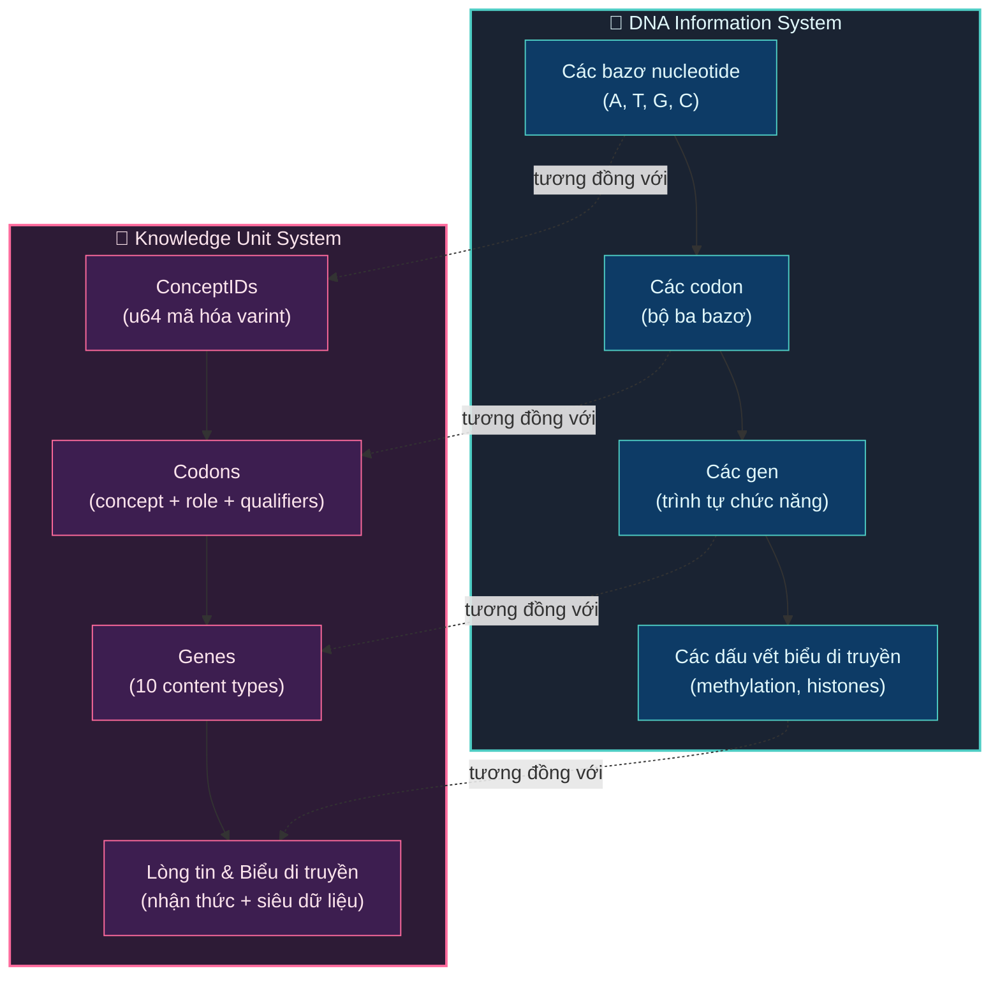

# 1. Giới thiệu

Việc mã hóa, chia sẻ và tích lũy tri thức một cách có hệ thống là động lực đơn lẻ có ảnh hưởng lớn nhất đối với nền văn minh nhân loại [1]. Từ việc phát minh ra chữ viết ở Lưỡng Hà vào khoảng năm 3400 TCN, qua kỹ thuật in chữ rời của Gutenberg năm 1440, cho đến World Wide Web năm 1989, mỗi bước đột phá trong biểu diễn và phổ biến tri thức đều đã xúc tác cho những thay đổi mang tính biến đổi xã hội [2]. Tuy nhiên, bất chấp những tiến bộ này, tri thức của nhân loại trong thế kỷ 21 vẫn bị phân mảnh sâu sắc — bị mắc kẹt bên trong bộ não của các cá nhân, bị khóa sau các rào cản ngôn ngữ, bị hạn chế bởi sự gần gũi về địa lý và chịu tổn thất thời gian không thể đảo ngược. Một bác sĩ ở Nairobi phát triển một kỹ thuật chăm sóc vết thương mới có thể mất nhiều năm trước khi tri thức đó đến tay một đồng nghiệp ở São Paulo; một kỹ sư giải quyết một vấn đề vật liệu phức tạp không có cơ chế hiệu quả nào để giúp giải pháp đó được khám phá bởi hàng ngàn đồng nghiệp đang đồng thời vật lộn với thách thức giống hệt.

Bài báo này trình bày về **Knowledge Unit (KU)**, một biểu diễn tri thức lấy cảm hứng từ sinh học được thiết kế để đóng vai trò là đơn vị tri thức nguyên tử, tự mô tả, có thể định địa chỉ bằng mật mã (cryptographically addressable) bên trong một mạng lưới chia sẻ tri thức phi tập trung hoàn toàn. KU rút ra những tương đồng cấu trúc sâu sắc từ cơ chế mã hóa DNA của sinh học phân tử và tích hợp các kiểu dữ liệu sao chép không xung đột (Conflict-Free Replicated Data Types - CRDTs) [3] để cho phép đạt được tính nhất quán cuối cùng không cần điều phối trên một tập hợp không giới hạn các nút tham gia.

## 1.1 Phát biểu vấn đề

Tri thức nhân loại phải gánh chịu cái mà chúng tôi gọi là **Knowledge Fragmentation Problem (KFP)** (Vấn đề phân mảnh tri thức): sự bất khả thi mang tính hệ thống trong việc truyền tải tri thức được tạo ra bởi một người đến tất cả những người khác có thể hưởng lợi từ nó một cách kịp thời, có cấu trúc và đáng tin cậy. KFP biểu hiện qua năm khía cạnh trực giao:

**Phân mảnh ngôn ngữ (Linguistic fragmentation).** Có khoảng 7,000 ngôn ngữ đang tồn tại [4], và chưa đến 5% tri thức thế giới có sẵn trong bất kỳ một ngôn ngữ đơn lẻ nào. Việc dịch thuật rất tốn kém, dễ mất mát thông tin và luôn không hoàn chỉnh. Một hiểu biết quan trọng được công bố bằng tiếng Quan Thoại có thể không bao giờ tiếp cận được một nhà nghiên cứu nói tiếng Anh.

**Phân mảnh địa lý (Geographic fragmentation).** Việc tạo ra tri thức không được phân bổ đồng đều. Sự tập trung của các tổ chức nghiên cứu ở Bắc Mỹ, Châu Âu và Đông Á tạo ra những điểm mù cấu trúc đối với tri thức được tạo ra ở Global South (các nước Nam bán cầu), các cộng đồng bản địa và dân cư nông thôn.

**Phân mảnh thời gian (Temporal fragmentation).** Tri thức nhân loại không trường tồn. Sự ra đi của một chuyên gia, sự thất truyền của một truyền thống truyền miệng, hoặc sự xuống cấp của một kho lưu trữ vật lý sẽ hủy hoại tri thức vĩnh viễn. Sự hủy diệt của Thư viện Alexandria — dù do hỏa hoạn, sự bỏ bê hay do xâm lược — chỉ là trường hợp nổi tiếng nhất của một hiện tượng xảy ra liên tục ở mọi quy mô.

**Phân mảnh cấu trúc (Structural fragmentation).** Các hệ thống tri thức hiện tại biểu diễn thông tin dưới các định dạng không tương thích. Một hộp thông tin (infobox) của Wikipedia, một bộ ba (triple) của Wikidata, một tóm tắt của PubMed và một câu trả lời của Stack Overflow đều sử dụng các schema khác biệt căn bản, khiến việc tích hợp tri thức chéo hệ thống trở thành một vấn đề kỹ thuật chưa bao giờ được giải quyết triệt để.

**Phân mảnh nhận thức (Epistemic fragmentation).** Có lẽ quan trọng nhất, các hệ thống hiện tại không cung cấp cơ chế hệ thống nào để biểu diễn mức độ xác thực của một phần tri thức (*how well-established* a piece of knowledge is). Một nghiên cứu phân tích gộp (meta-analysis) được bình duyệt nghiêm ngặt và một giai thoại chưa được kiểm chứng trên mạng xã hội chiếm cùng một tầng biểu diễn trong hầu hết các hệ thống. Việc thiếu siêu dữ liệu nhận thức (epistemic metadata) có thể xử lý bằng máy khiến các hệ thống tự động không thể suy luận về độ tin cậy của tri thức ở quy mô lớn.

Các nền tảng hiện tại giải quyết các phần nhỏ của những khía cạnh này nhưng không có nền tảng nào giải quyết đồng thời cả năm khía cạnh:

| Hệ thống (System) | Phi tập trung (Decentralized) | Độc lập ngôn ngữ (Language-Agnostic) | Siêu dữ liệu nhận thức (Epistemic Metadata) | Lớp khuyến khích (Incentive Layer) | Có thể xử lý bằng máy (Machine-Processable) |
|--------|:---:|:---:|:---:|:---:|:---:|
| Wikipedia [5] | ✗ | Một phần (Partial) | ✗ | ✗ | Một phần (Partial) |
| Wikidata [6] | ✗ | ✓ | ✗ | ✗ | ✓ |
| Google Knowledge Graph [7] | ✗ | Một phần (Partial) | ✗ | ✗ | ✗ (độc quyền/proprietary) |
| Stack Overflow | ✗ | ✗ | Một phần (Partial - lượt bình chọn) | Một phần (Partial - danh tiếng) | ✗ |
| Semantic Web / RDF [8] | ✓ (liên hợp/federated) | ✓ | ✗ | ✗ | ✓ |
| IPFS [9] | ✓ | ✗ | ✗ | ✗ | ✗ |

Knowledge Unit được thiết kế để đáp ứng đồng thời năm yêu cầu mà nếu gộp lại thì chưa có hệ thống hiện tại nào đáp ứng được:

1. **Sự nhỏ gọn (Compactness).** Định dạng wire format phải đủ hiệu quả để triển khai trên di động và IoT — lý tưởng nhất là **nhỏ hơn văn bản ngôn ngữ tự nhiên ban đầu**. Định dạng Core DNA của chúng tôi đạt mức ≤100 bytes đối với các KU thông thường (thấp tới mức ~16 bytes đối với các sự thật tối thiểu), cho phép hàng tỷ KU được lưu trữ và truyền tải trên các thiết bị bị giới hạn tài nguyên.

2. **Khả năng biểu đạt (Expressiveness).** Biểu diễn phải chứa được ít nhất 10 phương thức tri thức (knowledge modalities) khác nhau — từ các bộ ba dữ kiện có cấu trúc (factual triples) đến các tự sự trải nghiệm phi cấu trúc, chứng minh toán học hình thức, hướng dẫn quy trình, quan sát cảm quan và lời chứng thực văn hóa.

3. **Cấu trúc (Structure).** Biểu diễn phải hoàn toàn xử lý được bằng máy mà không cần hiểu ngôn ngữ tự nhiên, cho phép xây dựng đồ thị tri thức (knowledge graph), suy luận tự động và tìm kiếm ngữ nghĩa thông qua các định danh khái niệm dạng số thay vì các chuỗi văn bản.

4. **Độ tin cậy (Trustworthiness).** Mỗi KU phải mang siêu dữ liệu nhận thức có thể đọc được bằng máy nhằm chỉ ra cấp độ trưởng thành, loại bằng chứng, trạng thái xác minh và các nhạy cảm lỗi đã biết của nó, cho phép các hệ thống hạ nguồn lọc, xếp hạng và suy luận về độ tin cậy của tri thức.

5. **Tính phi tập trung (Decentralization).** Biểu diễn phải hỗ trợ sao chép không xung đột trên một số lượng nút không giới hạn mà không cần bộ điều phối trung tâm, không cần giao thức đồng thuận, và đảm bảo tính nhất quán cuối cùng.

## 1.2 Động lực & Tầm nhìn

OneBrain là một mạng lưới chia sẻ tri thức phi tập trung lấy cảm hứng từ kiến trúc ngang hàng (peer-to-peer) của blockchain nhưng khác biệt căn bản về mục đích và cơ chế [10]. Trong khi blockchain ghi lại các giao dịch tài chính và sử dụng các cơ chế đồng thuận tiêu tốn năng lượng (Proof-of-Work, Proof-of-Stake), OneBrain ghi lại *các đóng góp tri thức* và sử dụng một nghị thức **Proof-of-Knowledge (PoK)** mới dựa trên việc chấm điểm giá trị trao đổi chất (metabolic value scoring) — một phương pháp mà ở đó tri thức "tự trang trải chi phí" (earns its keep) thông qua tính hữu dụng thực tế đã được chứng minh hơn là thông qua tiêu hao tính toán.

Trong kiến trúc này, Knowledge Unit đóng vai trò là đơn vị nguyên tử cơ bản — tương tự như một *giao dịch* trong blockchain hay một *bộ ba* (triple) trong RDF, nhưng phong phú hơn đáng kể về cả cấu trúc và siêu dữ liệu. Mọi phần tri thức được đóng góp vào mạng lưới OneBrain — cho dù đó là phát hiện của một thợ sửa xe đạp về kỹ thuật tháo lốp nhanh hơn, một định lý chưa hoàn chỉnh của một nhà vật lý đang chờ hoàn thiện, một công thức nấu ăn của người bà truyền qua nhiều thế hệ, hay lời kể trải nghiệm của một người đi bộ đường dài về cảnh hoàng hôn trên dãy Himalaya — đều được mã hóa thành một KU.

Tầm nhìn này vượt ra ngoài các mô hình tương tác người-máy hiện tại. Khi công nghệ Giao diện não-máy (Brain-Computer Interface - BCI) trưởng thành [11], định dạng KU được thiết kế để cuối cùng có thể mã hóa tri thức được thu nhận trực tiếp từ các tín hiệu thần kinh — các trải nghiệm, trực giác và dữ liệu nhận cảm vốn hiện không thể biểu đạt được trong bất kỳ biểu diễn tri thức hiện có nào. Kiến trúc 3 lớp, với các loại gen `Sensory` và `Experience` và các opcode Affect/Witness của nó, cung cấp giàn khung biểu diễn (representational scaffolding) cho phương thức tương lai này.

Quan trọng là, OneBrain coi mọi tri thức đều có giá trị, kể cả tri thức chưa hoàn chỉnh. Một giả thuyết một phần, một chứng minh chưa hoàn thành, một trực giác chưa được hình thức hóa — tất cả đều được biểu diễn như những thực thể hạng nhất (first-class citizens) thông qua loại gen `Hypothesis` với các cấp độ trưởng thành rõ ràng (từ `INTUITION` đến `REPLICATED`) và hệ thống phân cấp trạng thái nhận thức 11 cấp độ. Thiết kế này phản ánh quan sát thực nghiệm rằng các phát hiện mang tính đột phá thường xuất hiện từ sự *kết nối* của các đóng góp chưa hoàn chỉnh riêng lẻ giữa các ngành học, khu vực địa lý và khung thời gian khác nhau — cái mà chúng tôi gọi là **hoàn thiện tri thức cộng tác (collaborative knowledge completion)**.

## 1.3 Phép ẩn dụ Sinh học

Kiến trúc của KU rút ra một phép tương đồng có chủ ý và sâu sắc về cấu trúc từ hệ thống mã hóa thông tin DNA của sinh học phân tử. Phép tương đồng này không mang tính trang trí; nó mang lại những tác động cấu trúc chính xác định hướng cho mọi quyết định thiết kế.

**Hình 1.** Sự tương ứng cấu trúc giữa mã hóa thông tin của DNA và kiến trúc 3 lớp của Knowledge Unit.

Trong sinh học phân tử, DNA mã hóa các chỉ dẫn cho sự sống thông qua một hệ thống phân cấp: bốn bazơ nucleotide (adenine, thymine, guanine, cytosine) kết hợp thành các codon gồm 3 bazơ, mỗi codon mã hóa một axit amin cụ thể; codon cấu thành các gen mã hóa các protein chức năng; các cơ chế biểu di truyền (epigenetic) (DNA methylation, sửa đổi histone) điều hòa sự biểu hiện gen mà không làm thay đổi trình tự cơ bản; và kiểu hình (phenotype) là biểu hiện có thể quan sát được của bộ gen [12].

KU ánh xạ hệ thống phân cấp này với độ trung thực cấu trúc trên kiến trúc 3 lớp của nó:

| Lớp DNA (DNA Layer) | Lớp KU (KU Layer) | Sự tương ứng cấu trúc (Structural Correspondence) |
|-----------|----------|--------------------------|
| Các bazơ nucleotide (A, T, G, C) | **32 Opcodes** | Bảng chữ cái lệnh nguyên tử. Trong DNA có 4 bazơ; trong KU có 32 opcodes (TRIPLE, PARTOF, QUALITY, QUANTITY, STEP, CAUSAL, v.v.) tạo nên từ vựng câu lệnh. Cả hai đều độc lập với ngôn ngữ — DNA không "nói" tiếng Anh hay tiếng Quan Thoại; các opcode là dạng số và trung lập về mặt văn hóa. |
| Các codon (bộ ba bazơ) | **Các câu lệnh (Instructions)** (`opcode` + toán hạng varint) | Đơn vị có ý nghĩa nhỏ nhất. Một codon DNA ánh xạ tới một axit amin; một câu lệnh KU ánh xạ một opcode tới các toán hạng ConceptID (ví dụ: `PartOf(601, 600)` = "thân là một phần của tên lửa"). |
| Các gen (trình tự chức năng) | **Các gen (Genes)** (11 kiểu nội dung) | Đơn vị chức năng. Một gen sinh học mã hóa một protein; một gen KU mã hóa một phần tri thức hoàn chỉnh — được mã hóa dưới dạng một luồng lệnh bên trong một tệp nhị phân CoreDna (Fact, Procedure, Experience, Hypothesis, Formal, Testimony, v.v.). |
| Các dấu vết biểu di truyền | **Lớp Epigenetics** (chỉ runtime) | Siêu dữ liệu điều hòa. Các dấu vết biểu di truyền kiểm soát *khi nào, ở đâu và mức độ* biểu hiện của một gen; lớp Epigenetics kiểm soát *bằng cách nào, khi nào và với độ tin cậy nào* một KU được diễn giải — thông qua trạng thái nhận thức (11 cấp độ), loại bằng chứng (9 danh mục), 33 loại liên kết, hiệu lực thời gian, chu kỳ bán rã suy giảm tri thức và tính điểm trao đổi chất. Lớp này KHÔNG được lưu trữ trong Core DNA — nó tự xuất hiện từ tương tác mạng. |
| Kiểu hình (Phenotype) | **Lớp Expression** (được tạo ra) | Biểu hiện có thể quan sát được. Một kiểu hình là đặc điểm quan sát được của sinh vật được tạo ra bởi sự biểu hiện gen; lớp Expression là kết xuất ngôn ngữ tự nhiên mà con người có thể đọc được, được tạo ra theo yêu cầu từ Core DNA + ConceptDict. |

Phép tương đồng này mang lại bốn đặc tính thiết kế quan trọng mà khó có thể đạt được thông qua các phương pháp biểu diễn tri thức truyền thống:

**1. Độc lập ngôn ngữ (Language agnosticism).** Giống như mã bốn bazơ của DNA là phổ quát trên mọi sinh vật trên Trái Đất — cùng một codon (AUG) mã hóa methionine trong vi khuẩn *E. coli*, trong cây sồi và trong con người — các ConceptID của KU là các định danh dạng số vượt lên trên ngôn ngữ tự nhiên. Khái niệm "nước" không được biểu diễn dưới dạng chuỗi tiếng Anh `"water"`, tiếng Quan Thoại `"水"`, hay tiếng Ả Rập `"ماء"`, mà là một ConceptID dạng số duy nhất (ví dụ: `301`) giống nhau trên tất cả các nút trong mạng lưới. Điều này làm cho KU có khả năng đa ngôn ngữ một cách tự nhiên mà không cần dịch thuật.

**2. Định địa chỉ theo nội dung (Content addressability).** Các trình tự sinh học được nhận diện bằng chính nội dung của chúng (bản thân trình tự bazơ là định danh); tương tự, mỗi KU được xác định bằng một định danh nội dung bằng mật mã (CID) được lấy từ biểu diễn tuần tự hóa của nó bằng cách sử dụng băm BLAKE3 [13]. Thiết kế định địa chỉ theo nội dung này cho phép chống trùng lặp, xác minh tính toàn vẹn và truy xuất độc lập vị trí — các thuộc tính được chia sẻ với các hệ thống định địa chỉ theo nội dung như IPFS [9] và Git [14].

**3. Khả năng phân tích tăng dần (Incremental parseability).** Cơ chế khung đọc (reading frame) của DNA cho phép các ribosome bắt đầu dịch mã tại bất kỳ codon khởi đầu nào (AUG) mà không cần phân tích toàn bộ nhiễm sắc thể. Tương tự, luồng câu lệnh dựa trên opcode của định dạng Core DNA hỗ trợ phân tích tăng dần — một bộ giải mã có thể quét các câu lệnh một cách tuần tự, trích xuất thông tin ngữ nghĩa từ luồng byte mà không cần đệm toàn bộ thông điệp. Điểm đánh dấu END (0xF0) phân định rõ ràng ranh giới câu lệnh, một đặc tính quan trọng cho môi trường truyền phát (streaming) và bị giới hạn tài nguyên.

**4. Khả năng mở rộng tiến hóa (Evolutionary extensibility).** Tiến hóa sinh học đưa vào các gen mới thông qua các cơ chế như nhân bản gen và đột biến mà không phá vỡ các trình tự chức năng hiện có. KU mô phỏng điều này thông qua hai cơ chế: (a) trường kiểu gen 4-bit trong byte VER_META mã hóa trực tiếp 11 kiểu gen (0–10), với các mã từ 11–15 được dành riêng cho các phương thức trong tương lai; và (b) tập lệnh 32-opcode dành riêng các opcode từ 0x55–0xEF for future instructions. Hơn nữa, byte opcode (`u8`) hỗ trợ tối đa 256 loại câu lệnh khác nhau, với chỉ 32 loại hiện được định nghĩa, mang lại không gian rộng rãi cho các mở rộng ngữ nghĩa trong tương lai mà không làm hỏng các triển khai hiện có.

## 1.4 Đóng góp

Bài báo này thực hiện các đóng góp cụ thể sau:

1. **Một biểu diễn tri thức 3 lớp lấy cảm hứng từ sinh học (§2, §3).** Chúng tôi trình bày kiến trúc Knowledge Unit bao gồm Core DNA (Lớp 1 — nhị phân được lưu trữ với 32 opcodes), Epigenetics (Lớp 2 — lòng tin, liên kết, sự chuyển hóa runtime), và Expression (Lớp 3 — ngôn ngữ tự nhiên được tạo ra). Chúng tôi chứng minh rằng phép ẩn dụ sinh học không chỉ mang tính sư phạm mà còn mang lại các thuộc tính thiết kế cụ thể — độc lập ngôn ngữ, định địa chỉ theo nội dung, khả năng phân tích tăng dần và khả năng mở rộng tiến hóa — vốn là những yêu cầu bắt buộc về mặt cấu trúc từ phép tương đồng đó.

2. **Một tập lệnh nhị phân tùy chỉnh với 32 opcodes (§3, §4).** Chúng tôi thiết kế và triển khai một định dạng wire format dựa trên opcode nhỏ gọn, mã hóa tri thức thành các câu lệnh có kiểu (Triple, PartOf, Quality, Quantity, Step, Causal, v.v.), đạt được kích thước wire format luôn **nhỏ hơn văn bản ngôn ngữ tự nhiên ban đầu**.

3. **Một mã hóa số nguyên có độ dài biến đổi 5 tầng phân tầng theo ngữ nghĩa (§4.5).** Chúng tôi giới thiệu một cơ chế varint trong đó độ dài mã hóa tương quan với tần suất ngữ nghĩa: 128 phần tử nguyên thủy phổ quát chiếm 1 byte, ~16K khái niệm phổ biến chiếm 2 bytes, ~2M khái niệm tiêu chuẩn chiếm 3 bytes, và các khái niệm mở rộng/cộng đồng chiếm 4–5 bytes. Chúng tôi chứng minh rằng cơ chế này đạt được độ nén gần như tối ưu cho phân phối tần suất khái niệm Zipfian điển hình của tri thức ngôn ngữ tự nhiên [16].

4. **Tích hợp 5 loại CRDT cho tính nhất quán phi tập trung (§5).** Chúng tôi chỉ ra cách các CRDT G-Counter, PN-Counter, LWW-Register, OR-Set, và Vector Clock [3] có thể được kết hợp để cung cấp tính nhất quán cuối cùng ở cấp độ trường dữ liệu cho siêu dữ liệu tri thức — cho phép cập nhật đồng thời điểm lòng tin, số lượng xác thực và trạng thái nhận thức trên các mạng lưới bị phân vùng tùy ý mà không cần các giao thức điều phối hoặc giải quyết xung đột.

5. **Một khung nhận thức độc lập với nội dung (§5).** Chúng tôi định nghĩa một hệ phân cấp trạng thái nhận thức 11 cấp độ (từ `Rumor` đến `Axiomatic`) kết hợp với 9 loại bằng chứng được liên kết với kim tự tháp bằng chứng Cochrane/GRADE [17], 16 cờ nhạy cảm lỗi phản ánh các thiên kiến nhận thức và phương pháp luận đã biết, và một điểm lòng tin được tính toán — cung cấp siêu dữ liệu về độ tin cậy có thể xử lý bằng máy độc lập với nội dung và lĩnh vực tri thức.

6. **Một quy trình mã hóa 3 tầng (§4.9).** Chúng tôi trình bày một quy trình mã hóa lũy tiến: Tier 1 áp dụng so khớp mẫu dựa trên quy tắc (offline, độ chính xác ~60–70%); Tier 2 sử dụng các mô hình AI cục bộ thông qua 15 công cụ gọi hàm (runtime có thể cắm nóng); Tier 3 xác minh độ trung thực của mã hóa thông qua một Nghị thức Đồng thuận Mã hóa phân tán với vòng đời 4 trạng thái (RAW → SELF → PART → FULL), xác minh 2 pha (đồng thuận phân rã AI + vòng phản hồi công cụ), và chấm điểm đồng thuận có trọng số — cho phép mã hóa đáng tin cậy mà không cần thẩm quyền trung tâm.

7. **Một triển khai mã nguồn mở toàn diện (§6).** Chúng tôi cung cấp một triển khai tham chiếu bằng Rust bao gồm khoảng **10,000+ dòng mã** trên 27 mô-đun với **267 kiểm thử đơn vị và tích hợp** bao phủ toàn bộ các chu trình mã hóa/giải mã Core DNA, các mẫu phân tích văn bản, luồng công việc thực thi công cụ AI, tính đúng đắn của việc hợp nhất CRDT, các điều kiện biên varint, và các tính toán của công cụ nhận thức. Triển khai này được phát hành theo Giấy phép MIT.

## 1.5 Bố cục Bài báo

Phần còn lại của bài báo này được tổ chức như sau:

- **§2 Related Work** khảo sát các hình thức biểu diễn tri thức hiện có (RDF/OWL, Wikidata, đồ thị tri thức), các cấu trúc dữ liệu phi tập trung (CRDTs, Merkle-DAGs, blockchain), và các phương pháp tiếp cận tính toán lấy cảm hứng từ sinh học, định vị KU trong bối cảnh các nghiên cứu trước đây.

- **§3 Knowledge Unit Architecture** trình bày kiến trúc 3 lớp (Core DNA / Epigenetics / Expression), bao gồm các nguyên tắc thiết kế (§3.1), tổng quan kiến trúc (§3.2), tập lệnh và các phần tử ngữ nghĩa nguyên thủy (§3.3), các loại liên kết (§3.4), các loại gen (§3.5), và khung lòng tin (§3.6).

- **§4 Wire Format & Encoding** quy định chi tiết định dạng wire format nhị phân Core DNA (§4.2), tập lệnh 32-opcode (§4.3), tính toàn vẹn CRC-16 (§4.4), mã hóa varint (§4.5), định địa chỉ theo nội dung (§4.6), phân tích kích thước (§4.7), khả năng tương thích ngược (§4.8), và quy trình mã hóa 3 tầng (§4.9).

- **§5 Decentralized Consistency** mô tả chiến lược tích hợp CRDT, chứng minh các thuộc tính hội tụ cho mỗi CRDT cấp độ trường và trình bày ngữ nghĩa hợp nhất cho các cập nhật KU đồng thời.

- **§6 Implementation** thảo luận về triển khai tham chiếu Rust, bao gồm các quyết định kiến trúc, đặc tính hiệu năng, độ bao phủ kiểm thử, và các kết quả benchmark.

- **§7 Conclusion & Future Work** tóm tắt các đóng góp của chúng tôi, thảo luận về các hạn chế, và vạch ra các hướng nghiên cứu trong tương lai bao gồm tích hợp BCI, học liên hợp (federated learning) trên các mạng lưới KU, và xác minh hình thức (formal verification) các thuộc tính hội tụ của CRDT.

- **§8 Knowledge DNA vs AI Models** phân tích những khác biệt cơ bản giữa biểu diễn tri thức tường minh (KU) và tri thức ẩn (implicit knowledge) trong các tham số mạng thần kinh.

---

## Tài liệu tham khảo

[1] P. Burke, *A Social History of Knowledge: From Gutenberg to Diderot*. Cambridge, UK: Polity Press, 2000.

[2] J. Gleick, *The Information: A History, a Theory, a Flood*. New York, NY: Pantheon Books, 2011.

[3] M. Shapiro, N. Preguiça, C. Baquero, and M. Zawirski, "Conflict-free replicated data types," in *Proc. 13th Int. Conf. Stabilization, Safety, and Security of Distributed Systems (SSS)*, Grenoble, France, 2011, pp. 386–400.

[4] M. P. Lewis, G. F. Simons, and C. D. Fennig, Eds., *Ethnologue: Languages of the World*, 25th ed. Dallas, TX: SIL International, 2022.

[5] "Wikipedia," Wikimedia Foundation. [Online]. Available: https://www.wikipedia.org

[6] D. Vrandečić and M. Krötzsch, "Wikidata: A free collaborative knowledgebase," *Commun. ACM*, vol. 57, no. 10, pp. 78–85, Oct. 2014.

[7] A. Singhal, "Introducing the Knowledge Graph: Things, not strings," Google Official Blog, May 16, 2012.

[8] T. Berners-Lee, J. Hendler, and O. Lassila, "The Semantic Web," *Scientific American*, vol. 284, no. 5, pp. 34–43, May 2001.

[9] J. Benet, "IPFS — Content Addressed, Versioned, P2P File System," arXiv preprint arXiv:1407.3561, 2014.

[10] S. Nakamoto, "Bitcoin: A Peer-to-Peer Electronic Cash System," 2008. [Online]. Available: https://bitcoin.org/bitcoin.pdf

[11] B. J. Shih, D. J. Krusienski, and J. R. Wolpaw, "Brain-computer interfaces in medicine," *Mayo Clinic Proceedings*, vol. 87, no. 3, pp. 268–279, Mar. 2012.

[12] B. Alberts, A. Johnson, J. Lewis, M. Raff, K. Roberts, and P. Walter, *Molecular Biology of the Cell*, 6th ed. New York, NY: Garland Science, 2014.

[13] J. O'Connor, J.-P. Aumasson, S. Neves, and Z. Wilcox-O'Hearn, "BLAKE3: One function, fast everywhere," 2020. [Online]. Available: https://github.com/BLAKE3-team/BLAKE3-specs

[14] S. Chacon and B. Straub, *Pro Git*, 2nd ed. New York, NY: Apress, 2014.

[15] C. Bormann and P. Hoffman, "Concise Binary Object Representation (CBOR)," IETF RFC 8949, Dec. 2020.

[16] G. K. Zipf, *Human Behavior and the Principle of Least Effort*. Cambridge, MA: Addison-Wesley, 1949.

[17] G. Guyatt et al., "GRADE: An emerging consensus on rating quality of evidence and strength of recommendations," *BMJ*, vol. 336, no. 7650, pp. 924–926, Apr. 2008.
