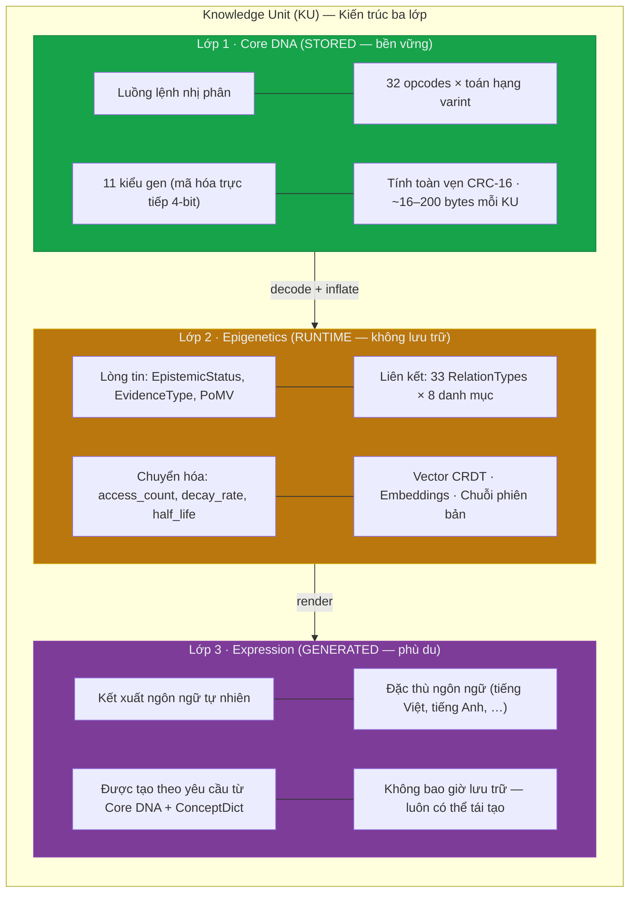
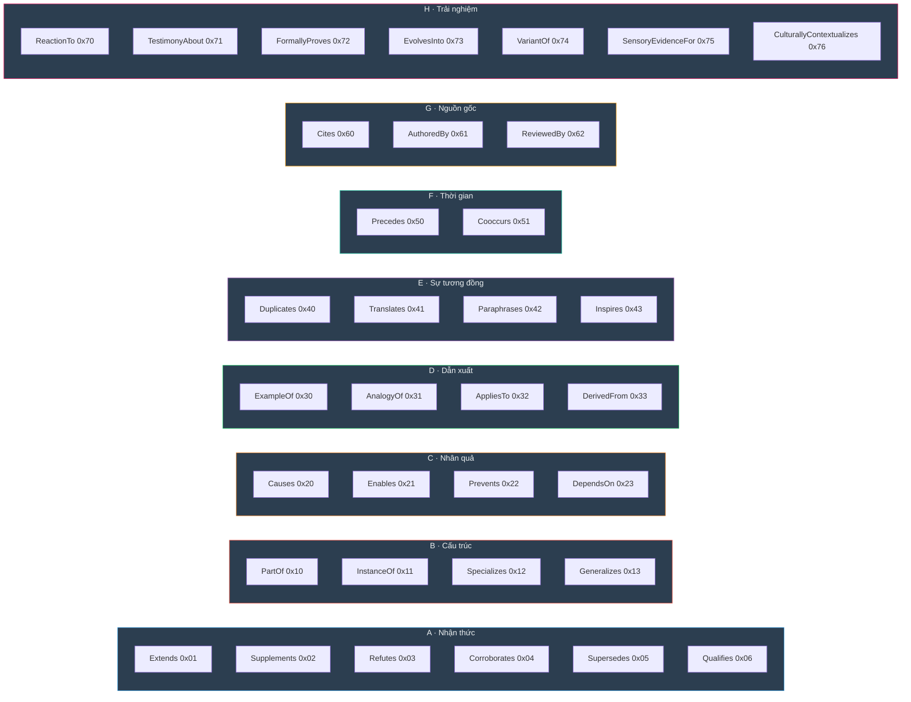
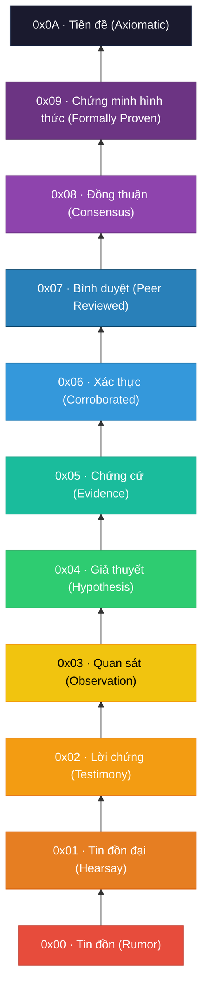
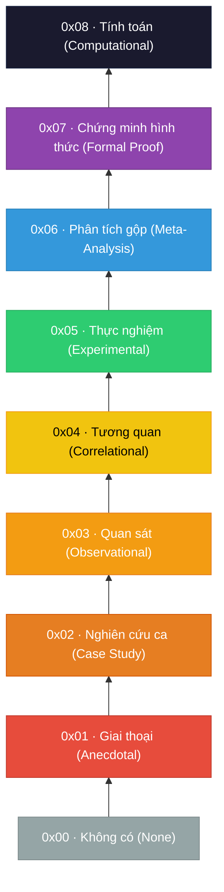
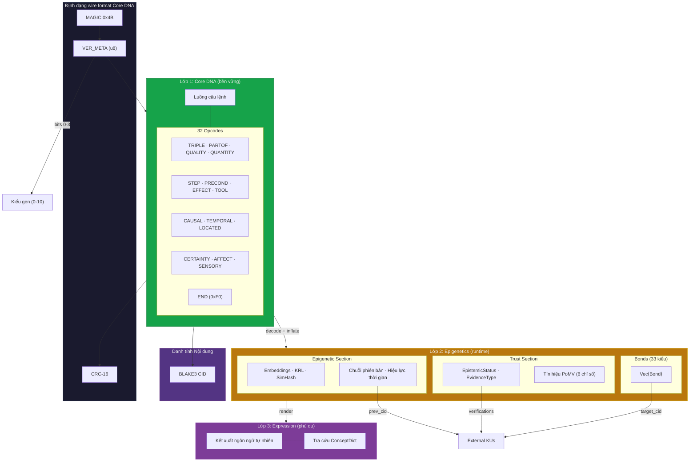

# §3. Kiến trúc Knowledge Unit Ba Lớp

> *"Câu hỏi không phải là lưu trữ tri thức như thế nào, mà là làm thế nào để mã hóa ý nghĩa để nó có thể được cấu thành, xác minh, tiến hóa và lãng quên — tất cả đều không cần đến ngôn từ."*

Knowledge Unit (KU) là cấu trúc dữ liệu nguyên tử đóng vai trò trung tâm của hệ thống biểu diễn tri thức OneBrain. Dựa trên phép ẩn dụ sinh học xuyên suốt — nơi tri thức được coi như một sinh vật sống chịu sự chi phối của chọn lọc, đột biến và suy giảm — kiến trúc KU tổ chức mọi khẳng định có thể biểu diễn thành ba lớp trực giao: **Core DNA** (mã hóa nhị phân bền vững), **Epigenetics** (siêu dữ liệu runtime cho lòng tin, các liên kết và sự chuyển hóa), và **Expression** (kết xuất ngôn ngữ tự nhiên phù du). Phần này cung cấp một đặc tả hình thức đầy đủ cho từng lớp, từ tập lệnh dựa trên opcode nhỏ gọn xác định Core DNA cho đến siêu dữ liệu biểu di truyền điều phối vòng đời của một đơn vị bên trong hệ sinh thái tri thức rộng lớn hơn.

## 3.1 Các nguyên tắc thiết kế

Bảy nguyên tắc nền tảng chi phối mọi quyết định thiết kế trong kiến trúc KU. Những nguyên tắc này không mang tính định hướng; mỗi nguyên tắc đều được thực thi trực tiếp bởi hệ thống kiểu và wire format.

### Nguyên tắc 1: Độc lập ngôn ngữ (Language Agnosticism)

Các khái niệm được biểu diễn duy nhất dưới dạng các định danh dạng số (`ConceptId: u64`), không bao giờ dưới dạng các chuỗi ngôn ngữ tự nhiên. Một khái niệm cho trước — ví dụ: *nước* — nhận cùng một định danh bất kể tri thức gốc được diễn đạt bằng tiếng Anh, tiếng Việt, tiếng Quan Thoại hay ký hiệu toán học. Từ điển khái niệm (concept dictionary) ánh xạ các định danh tới các nhãn mà con người có thể đọc được được duy trì ở bên ngoài; bản thân KU hoàn toàn không có ngôn ngữ. Thiết kế này loại bỏ các vấn đề đồng nghĩa và đa nghĩa vốn gây khó khăn cho các cơ sở tri thức sử dụng khóa dạng chuỗi, và giúp việc kết hợp tri thức đa ngôn ngữ trở thành một tác vụ không tốn chi phí (zero-cost) ở cấp độ cấu trúc.

### Nguyên tắc 2: Định địa chỉ nội dung (Content Addressing)

Mỗi KU tuần tự hóa được xác định bằng định danh nội dung (CID) BLAKE3 của nó. CID được tính toán một cách xác định trên các byte wire format của Core DNA chuẩn tắc thuộc payload của đơn vị. Hai KU có nội dung giống hệt nhau sẽ luôn tạo ra cùng một CID; một đột biến đơn bit sẽ tạo ra một định danh hoàn toàn khác biệt. Định địa chỉ theo nội dung cung cấp đồng thời ba đảm bảo: (a) chống trùng lặp có thể dễ dàng phát hiện thông qua so sánh CID, (b) xác minh tính toàn vẹn chỉ yêu cầu tính toán lại mã băm, và (c) tính bất biến được thực thi mà không cần một cơ quan trung tâm nào — một khi KU được xuất bản, CID chính là cái tên vĩnh viễn, chống giả mạo của nó.

### Nguyên tắc 3: Khả năng phân tích tăng dần (Incremental Parseability)

Định dạng wire format của Core DNA được thiết kế như một luồng lệnh tuần tự được kết thúc bằng một điểm đánh dấu `END` rõ ràng (`0xF0`). Mỗi câu lệnh đều tự phân định: byte opcode xác định số lượng và các kiểu toán hạng, vì vậy bộ giải mã có thể bỏ qua các câu lệnh không xác định mà không bị mất đồng bộ. Một công cụ truy vấn chỉ cần các câu lệnh `TRIPLE` có thể bỏ qua `STEP`, `AFFECT`, và các opcode khác. Khả năng phân tích tăng dần là thiết yếu cho các môi trường bị giới hạn (thiết bị nhúng, nút biên) và cho các nghị thức mạng nơi việc trao đổi một phần KU giúp giảm thiểu băng thông.

### Nguyên tắc 4: Khả năng mở rộng tiến hóa (Evolutionary Extensibility)

Định dạng Core DNA sử dụng một trường kiểu gen 4-bit trong byte `VER_META` (bits 0–3), mã hóa trực tiếp toàn bộ 11 kiểu gen (0–10) mà không cần cơ chế mở rộng. 4 bits còn lại (4–7) mã hóa phiên bản định dạng. Bởi vì tập lệnh sử dụng một byte opcode đầy đủ (`u8`), có tới 256 loại câu lệnh khác nhau; hiện tại 32 loại đã được định nghĩa, để lại không gian rộng rãi cho các mở rộng ngữ nghĩa trong tương lai. Các opcode không xác định có thể được bỏ qua một cách an toàn bằng cách tham chiếu bảng chiều rộng, bảo tồn tính tương thích ngược. Thiết kế này mô phỏng khái niệm sinh học về nhân bản gen sau đó là neofunctionalisation (chuyên biệt hóa chức năng mới) — năng lực ngữ nghĩa mới xuất hiện mà không phá vỡ các cấu trúc hiện có.

### Nguyên tắc 5: Tích hợp tự nhiên CRDT (CRDT Nativity)

Mỗi trường có thể thay đổi (mutable field) trong kiến trúc KU đều sử dụng một Kiểu dữ liệu sao chép không xung đột (CRDT) phù hợp. Trọng số liên kết sử dụng các thanh ghi người ghi cuối thắng (LWW-Register) với nhãn thời gian Lamport. Các bộ codon sử dụng các tập hợp chỉ-thêm (G-Set). Trường `reinforce_count` trên các liên kết là một bộ đếm chỉ tăng (GCounter). Điều này đảm bảo rằng các sửa đổi đồng thời từ nhiều nút sẽ hội tụ về một trạng thái nhất quán mà không cần điều phối, giúp KU phù hợp một cách tự nhiên cho các mạng tri thức ngang hàng phân tán.

### Nguyên tắc 6: Hiệu quả Wire Format (Wire Efficiency)

Một KU kiểu Fact tối thiểu — một bộ ba, không có liên kết, không có siêu dữ liệu lòng tin — tuần tự hóa thành khoảng **16 bytes** trong định dạng wire format của Core DNA. Con số này bao gồm 1-byte magic (`0x4B`), 1-byte `VER_META`, luồng lệnh, điểm đánh dấu `END` (`0xF0`), và checksum CRC-16 ở cuối. Một KU phong phú hơn với nhiều bộ ba, các bước quy trình và các câu lệnh siêu dữ liệu thường chiếm **16–88 bytes** — luôn *nhỏ hơn văn bản ngôn ngữ tự nhiên tương đương* bằng UTF-8. Bằng cách sử dụng mã hóa varint cho các ConceptID (1–4 bytes tùy thuộc vào tầng), các giá trị số có kiểu (enum `NumericValue` chọn chiều rộng dây tối thiểu) và các opcode có cấu trúc thay thế toàn bộ các mẫu ngữ pháp bằng các byte đơn lẻ, định dạng Core DNA đạt được mật độ thông tin vượt trội so với các nghị thức nhị phân được tinh chỉnh thủ công.

### Nguyên tắc 7: Cảm hứng sinh học xuyên suốt (Bio-Inspired Throughout)

Phép ẩn dụ sinh học không mang tính trang trí; nó được đưa vào tận cấp độ triển khai. Các Knowledge Unit là các *sinh vật (organisms)*. Payloads nội dung của chúng là các *gen (genes)*. Các kết nối giữa chúng là các *liên kết (bonds)* (tương tự như liên kết phân tử hoặc kết nối synap). Siêu dữ liệu độ tin cậy của chúng là một *phần lòng tin (trust section)* (tương tự như hệ miễn dịch). Siêu dữ liệu vòng đời của chúng là *biểu di truyền (epigenetic)* — nó sửa đổi sự biểu hiện mà không làm thay đổi gen cơ bản. Toàn bộ hệ thống tiến hóa thông qua *áp lực chọn lọc* (Proof-of-Metabolic-Value), *đột biến* (chuỗi phiên bản qua `prev_cid`), và *sự diệt vong* (các hàm suy giảm và trạng thái phản đối). Phép ẩn dụ nhất quán này không chỉ cung cấp các quy ước đặt tên mà còn là hướng dẫn kiến trúc thực sự: khi một câu hỏi thiết kế nảy sinh, việc hỏi "sinh học giải quyết vấn đề này như thế nào?" luôn tạo ra câu trả lời chính xác.

---

## 3.2 Tổng quan về kiến trúc ba lớp

Kiến trúc KU chia một Knowledge Unit thành ba lớp trực giao, mỗi lớp được tối ưu hóa cho một mối quan tâm riêng biệt: lưu trữ lâu dài, quản lý runtime và tiêu dùng của con người. Các lớp được thiết kế để bất kỳ lớp nào cũng có thể được bỏ qua, mở rộng hoặc thay thế mà không ảnh hưởng đến các lớp khác.



### 3.2.1 Cơ sở thiết kế

Sự phân tách ba lớp được thúc đẩy bởi một nhận thức quan trọng: bằng cách tách biệt mã hóa bền vững (Core DNA) khỏi siêu dữ liệu runtime (Epigenetics) và kết xuất phù du (Expression), kiến trúc đạt được kích thước wire format luôn **nhỏ hơn văn bản ngôn ngữ tự nhiên** trong khi vẫn bảo tồn toàn bộ khả năng biểu đạt ngữ nghĩa. Chỉ có lớp Core DNA là được lưu trữ trên đĩa hoặc truyền qua mạng; lớp Epigenetics được quản lý bởi các phân hệ cục bộ (Epistemic Engine, Metabolism Store), và lớp Expression được tái tạo theo yêu cầu.

### 3.2.3 Tương đồng sinh học

**Bảng 3.1.** Ánh xạ tương đồng Sinh học-to-KU (được cập nhật cho kiến trúc ba lớp).

| Thực thể sinh học | Tương đồng KU | Lớp | Chức năng |
|---|---|---|---|
| Trình tự DNA | Luồng lệnh Core DNA | Core DNA | Bản thiết kế hoàn chỉnh của đơn vị tri thức |
| Bazơ nucleotide | `ConceptId` (u64) | Core DNA | Biểu tượng ngữ nghĩa nhỏ nhất không thể phân chia |
| Codon (bộ ba bazơ) | Câu lệnh Opcode (ví dụ: `TRIPLE s p o`) | Core DNA | Đơn vị mang ý nghĩa tối thiểu |
| Gen | Kiểu gen (11 biến thể, mã hóa 4-bit) | Core DNA | Phân loại kiểu payload của tri thức |
| Dấu vết biểu di truyền | Lòng tin, Liên kết, Embeddings, Chuyển hóa | Epigenetics | Sửa đổi sự biểu hiện mà không làm thay đổi DNA |
| Liên kết hóa học | `Bond` (cạnh có hướng, 33 kiểu) | Epigenetics | Kết nối các sinh vật để tạo thành mạng lưới |
| Hệ miễn dịch | `TrustSection` + `EpistemicStatus` | Epigenetics | Đánh giá và phòng thủ chống lại thông tin sai lệch |
| Tốc độ chuyển hóa | `metabolic_rate` (PoMV) | Epigenetics | Đo lường mức độ sử dụng và sức sống liên tục |
| Sức mạnh synap | `weight` (u16) trên liên kết | Epigenetics | Sức mạnh kết nối, chịu sự tăng cường và suy giảm |
| Kiểu hình (Phenotype) | Expression (ngôn ngữ tự nhiên) | Expression | Các đặc điểm quan sát được tạo ra từ kiểu gen |
| Sự chết tế bào (Apoptosis) | `EdgeState::Deprecated` | Epigenetics | Sự chết tri thức được lập trình |
| Đột biến | Chuỗi phiên bản (`prev_cid`) | Epigenetics | Tri thức tiến hóa qua các sửa đổi liên tiếp |
| Chọn lọc tự nhiên | Proof-of-Metabolic-Value | Epigenetics | Tri thức giá trị cao tồn tại; giá trị thấp suy giảm |

---

## 3.3 Core DNA: Tập lệnh và mã hóa khái niệm

Lớp Core DNA là mã hóa nhị phân bền vững của một Knowledge Unit. Nó được cấu trúc như một luồng lệnh tuần tự: 1-byte magic marker (`0x4B`), một byte `VER_META` mã hóa phiên bản định dạng và kiểu gen, một chuỗi câu lệnh opcode có độ dài biến đổi, một điểm đánh dấu `END` (`0xF0`), và một checksum CRC-16. Tập lệnh xác định 32 opcodes được tổ chức thành sáu danh mục (Relationship, Procedural, Causal/Spatial, Meta/Experiential, Structural, và Control), mỗi lệnh nhận các toán hạng `ConceptId` được mã hóa varint. Các tiểu mục sau đây mô tả sơ đồ mã hóa khái niệm và tập lệnh hoàn chỉnh.

### 3.3.1 Định dạng câu lệnh

Mỗi câu lệnh Core DNA bao gồm một byte opcode theo sau bởi không hoặc nhiều toán hạng được mã hóa varint. Opcode xác định số lượng và các kiểu toán hạng, giúp luồng tự phân định:

$$\text{Instruction} = \langle \text{opcode}, \text{operand}_1, \text{operand}_2, \ldots, \text{operand}_k \rangle$$

trong đó $k$ được xác định bởi opcode. Ví dụ: `TRIPLE` ($k=3$) nhận ba toán hạng `ConceptId` (subject, predicate, object), while `CERTAINTY` ($k=1$) nhận một mức `u16` duy nhất.

**Bảng 3.1a.** Tập lệnh Core DNA hoàn chỉnh (32 opcodes).

| Danh mục (Category) | Opcode | Tên (Name) | Toán hạng (Operands) | Ngữ nghĩa (Semantics) |
|---|---|---|---|---|
| **Relationship** | `0x01` | `TRIPLE` | s, p, o | Khẳng định Chủ ngữ-Vị ngữ-Tân ngữ |
| | `0x02` | `PARTOF` | part, whole | Quan hệ phần-toàn thể |
| | `0x03` | `QUALITY` | s, q | Chủ ngữ có đặc tính |
| | `0x04` | `QUANTITY` | s, numtype+value, unit | Đo lường định lượng |
| | `0x05` | `TOLERANCE` | s, numtype+value, numtype+δ | Giá trị với dung sai (±δ) |
| | `0x06` | `RANGE` | s, numtype+lo, numtype+hi | Khoảng giá trị |
| | `0x07` | `ENUM_VAL` | s, count, [values…] | Tập hợp giá trị liệt kê |
| | `0x08` | `FORMULA` | s, op, a, b | Công thức số học (s = a op b) |
| **Procedural** | `0x10` | `STEP` | ord, action, target | Bước quy trình |
| | `0x11` | `PRECOND` | concept | Điều kiện tiên quyết |
| | `0x12` | `EFFECT` | concept | Kết quả/tác động |
| | `0x13` | `TOOL` | action, instrument | Yêu cầu công cụ |
| | `0x14` | `DURATION` | numtype+value, unit | Thời lượng thời gian |
| **Causal/Spatial** | `0x20` | `CAUSAL` | cause, effect | Quan hệ nhân quả |
| | `0x21` | `TEMPORAL` | before, after | Thứ tự thời gian |
| | `0x22` | `LOCATED` | s, location | Vị trí không gian |
| | `0x23` | `SPATIAL_REL` | s, relation, target | Quan hệ không gian (trên/dưới/trong…) |
| **Meta/Experiential** | `0x30` | `CERTAINTY` | u16 level | Độ tự tin (0–10000) |
| | `0x31` | `DIFFICULTY` | u8 level | Độ phức tạp (0–5) |
| | `0x32` | `IMPORTANCE` | u16 level | Tầm quan trọng (0–10000) |
| | `0x33` | `CONTEXT` | concept | Nhãn đánh dấu lĩnh vực/ngữ cảnh |
| | `0x34` | `SOURCE` | concept | Tham chiếu nguồn gốc/nguồn |
| | `0x35` | `TIMESTAMP` | u32 value | Dấu thời gian Unix |
| | `0x40` | `AFFECT` | s, emotion, u8 intensity | Trạng thái cảm xúc |
| | `0x41` | `SENSORY` | modality, s, q | Nhận cảm cảm giác |
| | `0x42` | `WITNESS` | observer, event | Lời chứng thực của nhân chứng |
| **Structural** | `0x50` | `ANALOGY` | s_src, s_tgt, p | Ánh xạ tương tự |
| | `0x51` | `CONTRAST` | a, b, dimension | So sánh tương phản |
| | `0x52` | `EXAMPLE` | general, specific | Quan hệ ví-dụ-của |
| | `0x53` | `COMPOSITE` | comp_type, count, [members…] | Tập hợp đa KU |
| | `0x54` | `CONSTRAINT` | s, op, value | Ràng buộc |
| **Control** | `0xF0` | `END` | (none) | Kết thúc luồng lệnh |
| | `0xF1` | `NOP` | (none) | Không hoạt động (đệm) |

Tập lệnh được thiết kế để bất kỳ *kiểu* tri thức nào — sự thật, quy trình, trải nghiệm, giả thuyết — đều có thể được diễn đạt dưới dạng sự kết hợp của các câu lệnh nguyên thủy này. Kiểu gen (được mã hóa trong `VER_META`) xác định các mẫu câu lệnh *được mong đợi*, nhưng bộ giải mã không bắt buộc một schema cố định cho mỗi kiểu gen.

### 3.3.2 Các Codon đóng vai trò các câu lệnh

Trong kiến trúc Core DNA, **codon** là đơn vị ngữ nghĩa nhỏ nhất, được định nghĩa dưới dạng một bộ ba $\langle c, r, Q \rangle$. Mỗi codon ánh xạ trực tiếp tới một hoặc nhiều câu lệnh opcode. Định nghĩa hình thức là:

$$\text{Codon} = \langle c, r, Q \rangle$$

trong đó:

- $c \in \mathbb{Z}_{2^{64}}$ là **concept identifier (định danh khái niệm)**, một tham chiếu dạng số độc lập với ngôn ngữ đến một khái niệm trong từ điển khái niệm toàn cầu.
- $r \in R$ là **semantic role (vai trò ngữ nghĩa)**, được rút ra từ một danh mục cố định $R$ gồm 14 vai trò chỉ rõ chức năng của codon bên trong KU.
- $Q = \{(k_i, v_i)\}_{i=1}^{n}$ là **qualifier set (tập hợp qualifier)**, một tập hợp có thể trống gồm các cặp khóa-giá trị tinh chỉnh ý nghĩa của codon.

Triển khai Rust mã hóa cấu trúc này như sau:

```rust
pub struct Codon {
    pub concept_id: ConceptId,   // u64, varint on wire (1–5 bytes)
    pub role: RoleId,            // u8, 14 variants
    pub qualifiers: Vec<Qualifier>,
}
```

### 3.3.3 Concept Identifier và phân giải phân tầng

Các định danh khái niệm được mã hóa trên đường truyền dưới dạng số nguyên có độ dài biến đổi bằng cách sử dụng cơ chế bốn tầng tối ưu hóa cho tần suất sử dụng:

| Tầng (Tier) | Wire Bytes | Khoảng ID (ID Range) | Dung lượng (Capacity) | Công dụng dự kiến |
|------|-----------|----------|----------|-------------|
| 0 | 1 | 0–127 | 128 | Các phần tử nguyên thủy phổ quát (nước, thời gian, nguyên nhân, …) |
| 1 | 2 | 128–16,511 | ~16K | Các khái niệm phổ biến hàng ngày |
| 2 | 3 | 16,512–2,113,663 | ~2M | Các khái niệm lĩnh vực tiêu chuẩn |
| 3 | 4–5 | 2,113,664+ | ~4 tỷ | Các khái niệm mở rộng/cộng đồng |

Mã hóa này đảm bảo rằng các khái niệm được tham chiếu thường xuyên nhất tiêu tốn ít byte nhất — một thuộc tính tương đồng trực tiếp với mã hóa Huffman và với quan sát rằng ngôn ngữ tự nhiên gán các từ ngắn hơn cho các khái niệm xuất hiện nhiều hơn (luật Zipf).

### 3.3.4 Các vai trò ngữ nghĩa (Semantic Roles)

Danh mục `RoleId` định nghĩa 14 vai trò ngữ nghĩa, mỗi vai trò được gán một giá trị byte cố định. Các vai trò này được khơi nguồn cảm hứng từ ngữ pháp ca (case grammar) (Fillmore, 1968) và lý thuyết vai trò chuyên đề (thematic role theory) (Dowty, 1991), được mở rộng với hai vai trò khái niệm hợp chất để cấu thành khái niệm phức tạp.

**Bảng 3.2.** Danh mục RoleId hoàn chỉnh.

| Byte | Tên (Name) | Tương đồng ngôn ngữ | Mô tả (Description) |
|------|------|-------------------|-------------|
| `0x01` | `Agent` | Agent / Actor | Thực thể thực hiện hành động |
| `0x02` | `Object` | Patient / Theme | Thực thể chịu tác động hoặc được mô tả |
| `0x03` | `Tool` | Instrument | Nhạc cụ hoặc phương tiện được sử dụng |
| `0x04` | `Location` | Locative | Ngữ cảnh hoặc thiết lập không gian |
| `0x05` | `Time` | Temporal | Ngữ cảnh thời gian hoặc dấu thời gian |
| `0x06` | `Cause` | Cause / Source | Yếu tố nhân quả hoặc nguồn gốc |
| `0x07` | `Result` | Result / Goal | Kết quả hoặc hệ quả |
| `0x08` | `Manner` | Manner | Cách thức thực hiện hành động |
| `0x09` | `Condition` | Conditional | Điều kiện tiên quyết hoặc ràng buộc |
| `0x0A` | `Quantity` | Measure | Lượng số hoặc độ lớn |
| `0x0B` | `Quality` | Attribute | Thuộc tính định tính hoặc đặc tính |
| `0x0C` | `Purpose` | Benefactive / Purpose | Mục tiêu hoặc lợi ích mong muốn |
| `0x0D` | `CompoundHead` | Head (X-bar) | Thành phần chính của một khái niệm hợp chất |
| `0x0E` | `CompoundMod` | Modifier / Adjunct | Thành phần bổ nghĩa của một khái niệm hợp chất |

Các vai trò `CompoundHead` và `CompoundMod` cho phép biểu diễn các khái niệm phức tạp dưới dạng các cấu trúc cấu thành. Ví dụ, khái niệm *"áp suất khí quyển mực nước biển"* có thể được phân rã thành một khái niệm chính (*áp suất khí quyển*) được bổ nghĩa bởi một khái niệm vị trí (*mực nước biển*), mà không yêu cầu một ConceptID riêng cho mọi hợp chất có thể có.

### 3.3.5 Các Qualifier

Các Qualifier cung cấp siêu dữ liệu khóa-giá trị có kiểu trên các codon riêng lẻ. Enum `QualifierValue` hỗ trợ ba loại payload:

```rust
pub enum QualifierValue {
    Concept(ConceptId),   // Reference to another concept
    Integer(i64),         // Numeric literal
    Text(String),         // Free-text (escape hatch, discouraged)
}
```

Biến thể `Text` tồn tại như một lối thoát có kiểm soát cho các trường hợp chưa được gán ConceptID (ví dụ: danh từ riêng trong giai đoạn tiếp nhận ban đầu). Các hệ thống sản xuất được kỳ vọng sẽ giải quyết các text qualifier thành các tham chiếu khái niệm thông qua các lượt chuẩn hóa tiếp theo.

### 3.3.6 Ví dụ mã hóa: "Nước sôi ở 100°C tại mực nước biển"

Để minh họa mã hóa Core DNA một cách cụ thể, hãy xem xét sự thật khoa học *"Nước sôi ở 100°C tại mực nước biển"*. Giả sử các gán ConceptID sau từ từ điển toàn cầu:

| Khái niệm (Concept) | ConceptId |
|---------|-----------|
| Water | `42` (Tier 0) |
| Boiling | `187` (Tier 1) |
| Temperature | `91` (Tier 0) |
| Celsius | `203` (Tier 1) |
| Sea level | `1044` (Tier 1) |
| Standard pressure | `1045` (Tier 1) |

**Luồng câu lệnh Core DNA:**

```
0x4B                         — Magic byte
VER_META (gene_type=0 Fact)  — Phiên bản + kiểu gen
0x01 [42] [187] [91]         — TRIPLE(Water, Boiling, Temperature)
0x04 [91] [0x01 0x64] [203]  — QUANTITY(Temperature, u8:100, Celsius)
0x33 [1044]                  — CONTEXT(Sea level)
0x33 [1045]                  — CONTEXT(Standard pressure)
0x30 [0x27 0x0F]             — CERTAINTY(9999)
0xF0                         — END
[CRC-16]                     — Checksum kiểm tra tính toàn vẹn
```

Luồng câu lệnh này tuần tự hóa thành khoảng **18–22 bytes**, tùy thuộc vào độ dài varint của các ConceptID. Nội dung ngữ nghĩa được bảo tồn hoàn toàn, hoàn toàn độc lập với ngôn ngữ và có thể truy vấn trực tiếp.

---

## 3.4 Lớp Epigenetics: Các liên kết quan hệ (Relation Bonds)

> **Lưu ý kiến trúc.** Các liên kết (Bonds) thuộc về **lớp Epigenetics** — chúng là siêu dữ liệu runtime được quản lý bởi Epistemic Engine và Metabolism Store, không được lưu trữ trong định dạng wire format của Core DNA.

### 3.4.1 Tổng quan

Một **liên kết (bond)** là một cạnh có hướng, có trọng số, có kiểu nối từ KU hiện tại đến một KU khác được định danh bằng địa chỉ nội dung (CID) của nó. Các liên kết tạo thành mô liên kết của đồ thị tri thức, cho phép suy luận, duyệt đồ thị và khám phá trong toàn mạng lưới các đơn vị tri thức.

### 3.4.2 Cấu trúc liên kết

Cấu trúc `Bond` hoàn chỉnh chứa 13 trường bao gồm nhận dạng, kiểu, động lực học trọng số, quản lý vòng đời và ngữ cảnh:

```rust
pub struct Bond {
    pub target_cid: Vec<u8>,          // Target KU CID (36 bytes)
    pub relation: RelationType,       // One of 33 relation types
    pub weight: u16,                  // [0, 10000] → [0.0, 1.0]
    pub creator: Creator,             // Human(0) | Ai(1) | System(2) | Hybrid(3)
    pub created_at: u32,              // Unix seconds
    pub evidence: Vec<Vec<u8>>,       // Supporting evidence CIDs
    pub state: EdgeState,             // Active(0) | Weakened(1) | Deprecated(2)
    pub initial_weight: Option<u16>,  // w₀ for decay computation
    pub decay: Option<DecayRate>,     // None | Slow | Med | Fast
    pub last_reinforced: Option<u32>, // Last reinforcement timestamp
    pub reinforce_count: Option<u8>,  // Number of reinforcements
    pub bidirectional: Option<bool>,  // Symmetric edge flag
    pub context: Vec<ConceptId>,      // Contextual concept IDs
}
```

Các giá trị trọng số sử dụng một biểu diễn dấu phẩy tĩnh `u16` trong đó khoảng số nguyên [0, 10000] ánh xạ tuyến tính tới khoảng thực [0.0, 1.0]. Biểu diễn này cung cấp độ chính xác bốn chữ số thập phân (độ phân giải 0.0001) với một nửa chi phí đường truyền của IEEE 754 `f32`, và nó loại bỏ các bẫy so sánh dấu phẩy động trong các tác vụ hợp nhất CRDT.

### 3.4.3 Hệ thống phân loại mối quan hệ

33 biến thể `RelationType` được tổ chức thành tám danh mục ngữ nghĩa, mỗi danh mục chiếm một phạm vi riêng biệt của không gian mã `u8`. Khoảng cách thập lục phân (các danh mục cách nhau khoảng `0x10`) dành riêng chỗ cho các bổ sung trong danh mục tương lai mà không cần đánh số lại.



**Bảng 3.3.** Danh mục RelationType hoàn chỉnh theo nhóm.

| Danh mục | Mã | Tên (Name) | Ngữ nghĩa (Semantics) |
|------|------|------|-----------|
| **A** | `0x01` | `Extends` | KU đích mở rộng nội dung của KU này |
| | `0x02` | `Supplements` | KU đích bổ sung thông tin bổ trợ |
| | `0x03` | `Refutes` | KU đích mâu thuẫn với các tuyên bố của KU này |
| | `0x04` | `Corroborates` | KU đích xác nhận độc lập KU này |
| | `0x05` | `Supersedes` | KU đích thay thế KU này (phiên bản mới hơn) |
| | `0x06` | `Qualifies` | KU đích thêm các điều kiện hoặc cảnh báo |
| **B** | `0x10` | `PartOf` | KU này là một thành phần của KU đích |
| | `0x11` | `InstanceOf` | KU này là một thể hiện của lớp đích |
| | `0x12` | `Specializes` | KU này là một dạng cụ thể hơn của KU đích |
| | `0x13` | `Generalizes` | KU này là một dạng tổng quát hơn của KU đích |
| **C** | `0x20` | `Causes` | Nội dung của KU này tạo ra nội dung của KU đích một cách nhân quả |
| | `0x21` | `Enables` | Nội dung của KU này là điều kiện tiên quyết cần thiết |
| | `0x22` | `Prevents` | Nội dung của KU này ức chế nội dung của KU đích |
| | `0x23` | `DependsOn` | KU này phụ thuộc logic vào KU đích |
| **D** | `0x30` | `ExampleOf` | KU này là một ví dụ cụ thể của KU đích |
| | `0x31` | `AnalogyOf` | KU này tương đồng cấu trúc với KU đích |
| | `0x32` | `AppliesTo` | KU này áp dụng nguyên lý của KU đích vào một ngữ cảnh |
| | `0x33` | `DerivedFrom` | KU này được rút ra từ KU đích thông qua suy luận |
| **E** | `0x40` | `Duplicates` | KU này là một bản sao ngữ nghĩa của KU đích |
| | `0x41` | `Translates` | KU này là một tương đương đa ngôn ngữ của KU đích |
| | `0x42` | `Paraphrases` | KU này diễn đạt lại KU đích bằng các thuật ngữ khác |
| | `0x43` | `Inspires` | KU này được khơi nguồn cảm hứng sáng tạo bởi KU đích |
| **F** | `0x50` | `Precedes` | Nội dung của KU này đi trước nội dung của KU đích về mặt thời gian |
| | `0x51` | `Cooccurs` | Nội dung của KU này diễn ra đồng thời với nội dung của KU đích |
| **G** | `0x60` | `Cites` | KU này trích dẫn KU đích làm nguồn |
| | `0x61` | `AuthoredBy` | KU đích định danh tác giả |
| | `0x62` | `ReviewedBy` | KU đích định danh người bình duyệt |
| **H** | `0x70` | `ReactionTo` | KU này là một phản ứng cảm xúc/phê bình đối với KU đích |
| | `0x71` | `TestimonyAbout` | KU này là lời chứng thực về chủ đề của KU đích |
| | `0x72` | `FormallyProves` | KU này chứng minh hình thức tuyên bố của KU đích |
| | `0x73` | `EvolvesInto` | KU này đã tiến hóa thành KU đích (dòng dõi tri thức) |
| | `0x74` | `VariantOf` | KU này là một biến thể hoặc sự thay thế của KU đích |
| | `0x75` | `SensoryEvidenceFor` | KU này cung cấp dữ liệu cảm giác hỗ trợ KU đích |
| | `0x76` | `CulturallyContextualizes` | KU này cung cấp khung văn hóa cho KU đích |

Danh mục H (Experiential) hỗ trợ tri thức góc nhìn thứ nhất, bằng chứng cảm giác và bối cảnh hóa văn hóa — các khả năng vốn thiếu vắng trong hầu hết các hệ thống biểu diễn tri thức hiện có.

### 3.4.4 Mô hình suy giảm trọng số cạnh

Trọng số liên kết không tĩnh. Chúng suy giảm theo thời gian theo một mô hình suy giảm mũ được điều biến bởi sự tăng cường, tương đồng trực tiếp với tính mềm dẻo của khớp thần kinh (synaptic plasticity) trong khoa học thần kinh (học Hebbian và long-term potentiation):

$$w_{\text{effective}} = w_0 \times e^{-\lambda \cdot (t_{\text{now}} - t_{\text{last\_reinforced}})} \times (1 + 0.1 \times n_{\text{reinforce}})$$

trong đó:

- $w_0$ là trọng số ban đầu (`initial_weight`, u16)
- $\lambda$ là hằng số suy giảm, được xác định bởi `DecayRate`:
  - `None`: $\lambda = 0$ (vĩnh viễn)
  - `Slow`: $\lambda = \ln(2) / (365.25 \times 86400)$ (chu kỳ bán rã = 1 năm)
  - `Med`: $\lambda = \ln(2) / (91.3 \times 86400)$ (chu kỳ bán rã = 3 tháng)
  - `Fast`: $\lambda = \ln(2) / (7 \times 86400)$ (chu kỳ bán rã = 1 tuần)
- $t_{\text{now}} - t_{\text{last\_reinforced}}$ là thời gian trôi qua tính bằng giây kể từ sự kiện tăng cường cuối cùng
- $n_{\text{reinforce}}$ là số lượng tăng cường tích lũy (`reinforce_count`, u8, tối đa 255)

Khoản thưởng tăng cường $(1 + 0.1 \times n_{\text{reinforce}})$ đảm bảo rằng các kết nối được truy cập thường xuyên sẽ mạnh lên theo thời gian — một quy tắc Hebbian tính toán. Mỗi lần truy cập kích hoạt sự tăng cường sẽ tăng bộ đếm và đặt lại `last_reinforced`, kéo dài hiệu quả tuổi thọ khả dụng của liên kết. Vòng đời của `EdgeState` cung cấp một cơ chế ghi đè thô: các liên kết chuyển đổi từ `Active` → `Weakened` → `Deprecated` dựa trên các ngưỡng suy giảm hoặc các sự kiện phản đối rõ ràng, tương tự như quá trình chết tế bào được lập trình (apoptosis).

---

## 3.5 Core DNA: Các kiểu gen tri thức (Knowledge Gene Types)

### 3.5.1 Hệ thống kiểu gen

Kiểu gen phân loại loại tri thức mà một KU mã hóa — nội dung cụ thể của content payload. Kiến trúc KU định nghĩa 11 kiểu gen, phản ánh quan sát rằng tri thức nhân loại không nguyên khối mà được chia thành các danh mục khác biệt về chất, đòi hỏi các biểu diễn cấu trúc khác nhau.

Các kiểu gen được mã hóa bằng cách sử dụng **sơ đồ trực tiếp 4-bit** trong byte `VER_META` (các bit 0–3), hỗ trợ tất cả 11 kiểu mà không cần cơ chế mở rộng. 4 bit còn lại (các bit 4–7) mã hóa phiên bản định dạng.

```rust
#[repr(u8)]
pub enum GeneType {
    Fact            = 0,   // VER_META[0:3] = 0
    Procedure       = 1,   // VER_META[0:3] = 1
    Experience      = 2,   // VER_META[0:3] = 2
    Creative        = 3,   // VER_META[0:3] = 3
    MediaExperience = 4,   // VER_META[0:3] = 4
    Testimony       = 5,   // VER_META[0:3] = 5
    Formal          = 6,   // VER_META[0:3] = 6
    Hypothesis      = 7,   // VER_META[0:3] = 7
    Narrative       = 8,   // VER_META[0:3] = 8
    Sensory         = 9,   // VER_META[0:3] = 9
    Composite       = 10,  // VER_META[0:3] = 10
}
```

> **Lưu ý về ánh xạ Core DNA.** Kiểu gen xác định các mẫu câu lệnh *được mong đợi* trong luồng Core DNA, nhưng bản thân nội dung được thể hiện thông qua tập lệnh 32-opcode (§3.3.1). Ví dụ, một gen Fact thường chứa các câu lệnh `TRIPLE`, `QUALITY`, `QUANTITY` và `CERTAINTY`; một gen Procedure chứa các câu lệnh `STEP`, `PRECOND`, `EFFECT` và `TOOL`.

### 3.5.2 Kiểu 0: Fact Gene

Gen Fact mã hóa tri thức mang tính khẳng định, đã được thiết lập dưới dạng một tập hợp các bộ ba Chủ ngữ-Vị ngữ-Tân ngữ (Subject-Predicate-Object - SPO) được tăng cường siêu dữ liệu độ tin cậy và bằng chứng.

```rust
Gene::Fact {
    triples: Vec<Triple>,        // SPO assertions
    certainty: u16,              // [0, 10000] → [0.0, 1.0]
    evidence: Vec<Vec<u8>>,      // CIDs of supporting evidence KUs
}

pub struct Triple {
    pub subject: ConceptId,      // S
    pub predicate: ConceptId,    // P
    pub object: ConceptId,       // O
}
```

**Ví dụ.** Sự thật *"Trái Đất quay quanh Mặt Trời với chu kỳ quỹ đạo khoảng 365.25 ngày"* mã hóa thành:

```
Gene::Fact {
    triples: [
        Triple { subject: EARTH, predicate: ORBITS, object: SUN },
        Triple { subject: EARTH, predicate: HAS_ORBITAL_PERIOD, object: YEAR_365D },
    ],
    certainty: 9999,   // 0.9999 — well-established scientific fact
    evidence: [cid_of_kepler_laws_ku, cid_of_astronomical_observations_ku],
}
```

### 3.5.3 Kiểu 1: Procedure Gene

Gen Procedure mã hóa tri thức quy trình từng bước một với các điều kiện tiên quyết, tác động, yêu cầu công cụ và cảnh báo rõ ràng ở mỗi bước.

```rust
Gene::Procedure {
    steps: Vec<ProcedureStep>,
    total_time: Option<u32>,     // Estimated time in seconds
    difficulty: u8,              // 0 = beginner → 4 = expert
    tools_req: Vec<ConceptId>,   // Required tools
}

pub struct ProcedureStep {
    pub ord: u16,                // Step ordering
    pub act: ConceptId,          // Action concept
    pub pre: Vec<Codon>,         // Preconditions
    pub tgt: ConceptId,          // Target of the action
    pub tools: Vec<ConceptId>,   // Tools for this step
    pub eff: Vec<Codon>,         // Effects/outcomes
    pub warn: Vec<Codon>,        // Warnings/cautions
}
```

### 3.5.4 Kiểu 2: Experience Gene

Gen Experience ghi lại tri thức trải nghiệm chủ quan ở ngôi thứ nhất bằng cách sử dụng mô hình cảm xúc Valence-Arousal-Dominance (VAD) (Russell & Mehrabian, 1977). Đây là một điểm khác biệt quan trọng so với các cơ sở tri thức thông thường, vốn thường loại bỏ trải nghiệm chủ quan coi như là nhiễu.

```rust
Gene::Experience {
    scene: Vec<Codon>,                    // Scene description as codons
    affect: Affect,                       // VAD emotional state
    canonical: Option<CanonicalText>,     // Original text (compressed)
    perspective: Option<Perspective>,     // Expertise + objectivity
}

pub struct Affect {
    pub v: i16,   // Valence:   [-10000, +10000] → [-1.0, +1.0]
    pub a: i16,   // Arousal:   [0, 10000]       → [0.0, 1.0]
    pub d: i16,   // Dominance: [0, 10000]       → [0.0, 1.0]
}

pub struct Perspective {
    pub expertise: u8,          // 0=novice, 1=beginner, 2=intermediate, 3=advanced, 4=expert
    pub perspective_type: u8,   // 0=OBJECTIVE, 1=SUBJECTIVE, 2=INTERSUBJECTIVE, 3=CONTESTED
}
```

**Ví dụ.** Ghi chú nếm thử của một chuyên gia nếm rượu: *"Chai Barolo 2015 này có hương thơm nồng nàn của anh đào khô với hương nhựa đường tinh tế. Tannin mạnh mẽ nhưng thanh tao."* Được mã hóa:

```
Gene::Experience {
    scene: [
        ⟨BAROLO_2015, Object, ∅⟩,
        ⟨DRIED_CHERRY, Quality, {("intensity", Integer(8500))}⟩,
        ⟨TAR, Quality, {("intensity", Integer(3000))}⟩,
        ⟨TANNIN, Quality, {("power", Integer(8000)), ("elegance", Integer(7500))}⟩,
    ],
    affect: Affect { v: 7500, a: 4000, d: 6000 },   // Positive, moderate arousal, in control
    canonical: Some(CanonicalText { lang: EN, text: zstd("This 2015 Barolo...") }),
    perspective: Some(Perspective { expertise: 4, perspective_type: 1 }),  // Expert, subjective
}
```

### 3.5.5 Kiểu 3: Creative Gene

Gen Creative mở rộng gen Procedure với bối cảnh văn hóa và nguồn gốc, được thiết kế cho các công thức nấu ăn, sáng tác, kỹ thuật thủ công và các tri thức quy trình sáng tạo khác.

```rust
Gene::Creative {
    steps: Vec<ProcedureStep>,           // Same step structure as Procedure
    cultural_context: Vec<ConceptId>,    // Cultural/geographic origin concepts
    origin_story: Option<CanonicalText>, // Provenance narrative
}
```

### 3.5.6 Kiểu 4: MediaExperience Gene

Gen MediaExperience mã hóa các phản ứng đối với các tác phẩm truyền thông (phim, sách, âm nhạc, trò chơi) với quản lý cảm xúc và tiết lộ nội dung (spoiler) có cấu trúc.

```rust
Gene::MediaExperience {
    id_sys: u8,              // 0=WIKIDATA, 1=IMDB, 2=MUSICBRAINZ, ...
    ext_id: Vec<u8>,         // External identifier
    media_type: u8,          // 0=FILM, 1=SERIES, 2=BOOK, 3=MUSIC, 4=GAME, ...
    rating: u8,              // 0–100 scale
    affect: Affect,          // VAD emotional response
    spoiler_level: u8,       // 0=NONE, 1=MILD, 2=MAJOR, 3=FULL_PLOT
}
```

### 3.5.7 Kiểu 5: Testimony Gene

Gen Testimony đại diện cho các tài khoản nhân chứng và báo cáo của người chứng kiến, ghi lại các đặc điểm tuyên bố, siêu dữ liệu độ tin cậy của nhân chứng và trạng thái xác minh.

```rust
Gene::Testimony {
    triples: Vec<Triple>,        // Claimed facts (SPO)
    claim_type: u8,              // 0=SIGHTING, 1=EVENT, 2=PHENOMENON, ...
    extraordinary: u8,           // 0=MUNDANE, 1=UNUSUAL, 2=EXTRAORDINARY, 3=UNPRECEDENTED
    witness_count: u16,          // Number of independent witnesses
    proximity: u8,               // 0=FIRSTHAND, 1=SECONDHAND, 2=THIRDHAND, 3=HEARSAY
    verification_status: u8,     // 0=UNVERIFIED, 1=PARTIAL, 2=VERIFIED, 3=DEBUNKED, 4=INCONCLUSIVE
}
```

### 3.5.8 Kiểu 6: Formal Gene

Gen Formal nắm bắt các hình thức toán học, logic và khoa học bằng ký hiệu gốc của chúng.

```rust
Gene::Formal {
    domain: u8,              // 0=MATH, 1=PHYSICS, 2=CHEMISTRY, 3=LOGIC, ...
    notation_format: u8,     // 0=LATEX, 1=MATHML, 2=ASCIIMATH, ...
    notation_source: Vec<u8>,// Raw notation (compressed)
    statement_type: u8,      // 0=DEFINITION, 1=AXIOM, 2=THEOREM, 3=LEMMA, 4=CONJECTURE, ...
    verification_status: u8, // 0=UNVERIFIED, 1=HAND_CHECKED, 2=PEER_REVIEWED, 3=FORMALLY_PROVED
}
```

### 3.5.9 Kiểu 7: Hypothesis Gene

Gen Hypothesis biểu diễn tri thức ở dạng phác thảo hoặc suy đoán, với việc theo dõi sự trưởng thành rõ ràng cho phép một KU tốt nghiệp từ trực giác thành sự thật đã được thiết lập.

```rust
Gene::Hypothesis {
    base_type: u8,               // Target gene type when mature (0=Fact, 1=Procedure, ...)
    body_codons: Vec<Codon>,     // The hypothesised content
    maturity_level: u8,          // 0=INTUITION, 1=SPECULATION, 2=CONJECTURE, 3=HYPOTHESIS,
                                 // 4=TESTED, 5=SUPPORTED, 6=CORROBORATED, 7=REPLICATED
    confidence: u16,             // [0, 10000] → [0.0, 1.0]
    completeness: u16,           // [0, 10000] → [0.0, 1.0]
    falsifiable: bool,           // Is this hypothesis falsifiable?
}
```

Trường `maturity_level` cung cấp thang đo Likert 8 điểm theo dõi giả thuyết thông qua phương pháp khoa học. Một giả thuyết ở cấp độ 7 (`REPLICATED`) với độ tự tin cao là ứng cử viên để được nâng cấp lên gen Fact thông qua kiểu liên kết `EvolvesInto` — một tương đương tính toán của quy trình bình duyệt.

### 3.5.10 Kiểu 8: Narrative Gene

Gen Narrative đại diện cho các câu chuyện thần thoại, truyện dân gian, truyền thuyết, dụ ngôn và các hình thức câu chuyện truyền tải tri thức khác.

```rust
Gene::Narrative {
    narrative_type: u8,           // 0=FOLKTALE, 1=MYTH, 2=LEGEND, 3=PARABLE, 4=FABLE, ...
    origin_culture: Vec<ConceptId>,// Cultural origin concept IDs
    era: u8,                      // 0=PREHISTORIC, 1=ANCIENT, ..., 5=MODERN, 6=TIMELESS
    function: u8,                 // 0=ENTERTAINMENT, 1=MORAL_TEACHING, 2=ORIGIN_STORY, ...
    sacred: bool,                 // Religious/sacred status
    moral: Vec<Codon>,            // Encoded moral/lesson
    canonical: Option<CanonicalText>, // Original narrative text
}
```

### 3.5.11 Kiểu 9: Sensory Gene

Gen Sensory nắm bắt các quan sát cảm quan thô hoặc đã xử lý với các siêu dữ liệu về phương thức, đặc tính cảm biến và chất lượng rõ ràng.

```rust
Gene::Sensory {
    modality: u8,             // 0=VISUAL, 1=AUDITORY, 2=OLFACTORY, 3=GUSTATORY,
                              // 4=TACTILE, 5=PROPRIOCEPTIVE, 6=VESTIBULAR, ...
    property: ConceptId,      // Property being observed
    feature: ConceptId,       // Feature of interest
    result_codons: Vec<Codon>,// Observation data as codons
    sensor_type: u8,          // 0=HUMAN_EYE, 1=HUMAN_EAR, 2=CAMERA, 3=MICROPHONE, ...
    quality: u8,              // 0=RAW, 1=PROCESSED, 2=VERIFIED, 3=CALIBRATED
}
```

---

## 3.6 Lớp Epigenetics: Phần lòng tin (Trust Section)

> **Lưu ý kiến trúc.** Trust Section thuộc về **lớp Epigenetics** — nó được tính toán và duy trì ở runtime bởi Epistemic Engine, không được lưu trữ trong định dạng wire format của Core DNA. Câu lệnh `CERTAINTY` trong Core DNA chụp lại một ảnh chụp nhanh của điểm lòng tin tại thời điểm mã hóa; toàn bộ Trust Section được quản lý riêng biệt.

### 3.6.1 Cơ sở lý luận

Trust Section thay thế trường `certainty: float16` đơn lẻ của các phiên bản KU trước đây bằng một khung nhận thức toàn diện. Thiết kế này được thúc đẩy bởi hai quan sát: (1) một đại lượng vô hướng đơn lẻ không thể nắm bắt được bản chất đa chiều của độ tin cậy tri thức — một thử nghiệm lâm sàng được bình duyệt và một bài thuốc dân gian của người bà đều có thể có độ tự tin cao nhưng khác nhau cơ bản về tính chất nhận thức; và (2) các hệ thống tự động xử lý tri thức cần các chỉ số thiên kiến có thể đọc được bằng máy, chứ không chỉ là các điểm số tổng hợp.

### 3.6.2 Cấu trúc

```rust
pub struct TrustSection {
    pub epistemic_status: EpistemicStatus,     // 11 levels
    pub evidence_type: EvidenceType,           // 9 types
    pub verification_level: u8,                // 0–4
    pub corroboration_count: u16,              // Independent confirmations
    pub challenge_count: u16,                  // Challenges received
    pub error_susceptibility: u16,             // 16-bit bitfield
    pub trust_score: u16,                      // [0, 10000]
    pub confidence: u16,                       // [0, 10000]
    pub domain_codes: Vec<u64>,                // Relevant domain ConceptIDs
    pub verifications: Vec<Vec<u8>>,           // Verification KU CIDs
    pub challenges: Vec<Vec<u8>>,              // Challenge KU CIDs
    // Proof-of-Metabolic-Value (PoMV) signals
    pub metabolic_rate: u16,                   // [0, 10000]
    pub prediction_score: u16,                 // [0, 10000]
    pub entropy_at_creation: u16,              // [0, 10000]
    pub survival_score: u16,                   // [0, 10000]
    pub synaptic_centrality: u16,              // [0, 10000]
    pub niche_fitness: u16,                    // [0, 10000]
}
```

### 3.6.3 Thang Trạng thái Nhận thức (Epistemic Status Ladder)

Danh mục `EpistemicStatus` định nghĩa một thang đo thứ tự 11 cấp độ phân loại vị thế nhận thức của một khẳng định tri thức. Thang đo được thiết kế để tăng đơn điệu về sức mạnh chứng cứ, trải dài toàn bộ phạm vi từ tin đồn chưa kiểm chứng đến sự thật tiên đề.



**Bảng 3.4.** Các cấp độ Epistemic Status với định nghĩa hoạt động.

| Mã (Code) | Cấp độ (Level) | Định nghĩa (Definition) | Ví dụ (Example) |
|------|-------|-----------|---------|
| `0x00` | Rumor | Khẳng định không rõ nguồn gốc từ nguồn không xác định | "Tôi nghe nói rằng…" |
| `0x01` | Hearsay | Báo cáo gián tiếp có chỉ rõ nguồn nhưng chưa được kiểm chứng | "Đồng nghiệp của tôi nói…" |
| `0x02` | Testimony | Tài khoản ngôi thứ nhất từ nhân chứng được xác định | Báo cáo của nhân chứng |
| `0x03` | Observation | Quan sát trực tiếp, có thể bằng các thiết bị đo | Đo lường trong phòng thí nghiệm |
| `0x04` | Hypothesis | Giải thích được đề xuất, chưa được thử nghiệm | Phỏng đoán khoa học |
| `0x05` | Evidence | Được hỗ trợ bởi việc thu thập bằng chứng có hệ thống | Kết quả thực nghiệm |
| `0x06` | Corroborated | Được xác nhận độc lập bởi nhiều nguồn | Nghiên cứu được lặp lại |
| `0x07` | Peer Reviewed | Được đưa qua đánh giá chuyên gia hình thức | Bài báo tạp chí được xuất bản |
| `0x08` | Consensus | Được chấp nhận bởi cộng đồng chuyên gia liên quan | Đánh giá của IPCC |
| `0x09` | Formally Proven | Được chứng minh thông qua chứng minh diễn dịch hình thức | Định lý toán học |
| `0x0A` | Axiomatic | Giả định nền tảng, không phụ thuộc vào chứng minh | Quy luật logic |

### 3.6.4 Kim tự tháp loại bằng chứng

Danh mục `EvidenceType` phân loại cơ sở phương pháp luận của một khẳng định tri thức, liên kết với Cochrane Collaboration và hệ phân cấp bằng chứng GRADE (Grading of Recommendations Assessment, Development and Evaluation) được sử dụng trong y học dựa trên thực chứng.



**Bảng 3.5.** Các cấp độ Evidence Type với sự liên kết GRADE.

| Mã (Code) | Loại (Type) | Cấp độ GRADE | Mô tả (Description) |
|------|------|-------------|-------------|
| `0x00` | None | — | Không cung cấp bằng chứng |
| `0x01` | Anecdotal | Rất thấp | Các câu chuyện cá nhân, báo cáo phi cấu trúc |
| `0x02` | Case Study | Thấp | Tài liệu hệ thống về các ca riêng lẻ |
| `0x03` | Observational | Thấp–Trung bình | Nghiên cứu thuần tập hoặc cắt ngang |
| `0x04` | Correlational | Trung bình | Liên kết thống kê không có khẳng định nhân quả |
| `0x05` | Experimental | Cao | Các thí nghiệm có đối chứng (RCTs) |
| `0x06` | Meta-Analysis | Rất cao | Đánh giá hệ thống của nhiều thí nghiệm |
| `0x07` | Formal Proof | Cuối cùng | Chứng minh diễn dịch từ các tiên đề |
| `0x08` | Computational | Biến đổi | Bằng chứng do máy tạo ra (mô phỏng, ML) |

### 3.6.5 Bitfield nhạy cảm lỗi (Error Susceptibility Bitfield)

Trường `error_susceptibility` là một bitfield 16-bit, trong đó mỗi bit gắn cờ cho một thiên kiến nhận thức, phương pháp luận hoặc ngữ cảnh cụ thể có thể ảnh hưởng đến độ tin cậy của khẳng định tri thức. Nhiều bit có thể được thiết lập đồng thời, cho phép lập hồ sơ thiên kiến phức hợp.

**Bảng 3.6.** Các cờ nhạy cảm lỗi.

| Bit | Cờ (Flag) | Mô tả (Description) |
|-----|------|-------------|
| 0 | `EYEWITNESS_MEMORY` | Chịu sự không đáng tin cậy của trí nhớ nhân chứng |
| 1 | `SINGLE_SOURCE` | Dựa trên một nguồn duy nhất không có xác thực độc lập |
| 2 | `NO_INSTRUMENT` | Quan sát được thực hiện mà không có thiết bị đo lường |
| 3 | `EMOTIONAL_STATE` | Người báo cáo ở trong trạng thái cảm xúc kích động |
| 4 | `SELF_REPORTED` | Dữ liệu là tự báo cáo (chịu thiên kiến mong muốn xã hội) |
| 5 | `SELECTION_BIAS` | Việc lựa chọn mẫu hoặc nguồn có thể bị thiên vị |
| 6 | `CONFIRMATION_BIAS` | Quan sát có thể phản ánh niềm tin có sẵn từ trước |
| 7 | `TEMPORAL_DISTANCE` | Thời gian trôi qua đáng kể giữa sự kiện và việc ghi chép |
| 8 | `CULTURAL_SPECIFIC` | Khẳng định có thể phụ thuộc vào văn hóa |
| 9 | `TRANSLATION_LOSS` | Thông tin đã được dịch thuật, có thể bị mất độ trung thực |
| 10 | `CORRELATION_NOT_CAUSE` | Khẳng định nhân quả dựa trên dữ liệu tương quan |
| 11 | `SMALL_SAMPLE` | Dựa trên một mẫu nhỏ hoặc không mang tính đại diện |
| 12 | `UNFALSIFIABLE` | Khẳng định không thể bị bác bỏ (unfalsifiable) về nguyên tắc |
| 13 | `CONFLICT_OF_INTEREST` | Nguồn có xung đột lợi ích tiềm ẩn |
| 14 | `AI_GENERATED` | Nội dung được tạo ra bởi một hệ thống AI |
| 15 | `SUPERSEDED_METHOD` | Dựa trên một phương pháp luận hiện được coi là lỗi thời |

Ví dụ, một tóm tắt do AI tạo ra từ một bài viết trên blog đơn lẻ sẽ mang các cờ `0b0100_0000_0000_0110` (các bit 1, 2, 14 = `SINGLE_SOURCE | NO_INSTRUMENT | AI_GENERATED`), cung cấp cho người tiêu dùng hạ nguồn một cơ sở có thể đọc bằng máy để hiệu chuẩn lòng tin.

### 3.6.6 Các tín hiệu Proof-of-Metabolic-Value (PoMV)

Phân hệ PoMV cung cấp sáu chỉ số lấy cảm hứng từ sinh học cùng nhau đánh giá giá trị liên tục của một KU trong hệ sinh thái tri thức. Các tín hiệu này thúc đẩy cơ chế chọn lọc tiến hóa: các KU có giá trị chuyển hóa cao sẽ được ưu tiên lưu trữ đệm, sao chép và hiển thị; các KU có giá trị chuyển hóa thấp là các ứng cử viên cho việc lưu trữ hoặc hết hạn.

| Trường (Field) | Mô tả (Description) | Tương đồng sinh học |
|-------|-------------|-------------------|
| `metabolic_rate` | Tần suất truy cập và trích dẫn | Tốc độ chuyển hóa tế bào |
| `prediction_score` | Độ chính xác của các dự đoán rút ra từ KU này | Độ thích nghi (thành công sinh sản) |
| `entropy_at_creation` | Tính mới/nội dung thông tin khi được tạo ra | Đa dạng di truyền khi sinh |
| `survival_score` | Thời gian tồn tại mà không bị phản đối | Tuổi thọ sinh vật |
| `synaptic_centrality` | Số lượng và trọng số của các liên kết đi vào/đi ra | Tính trung tâm của trung tâm thần kinh |
| `niche_fitness` | Mức độ phù hợp trong các lĩnh vực tri thức hiện tại của người dùng | Độ thích nghi ổ sinh thái |

---

## 3.7 Lớp Epigenetics: Phần biểu di truyền (Epigenetic Section)

> **Lưu ý kiến trúc.** Epigenetic Section, giống như Trust Section (§3.6), thuộc về **lớp Epigenetics**. Nó được duy trì ở runtime và không được lưu trữ trong định dạng wire format của Core DNA.

### 3.7.1 Cơ sở lý luận

Trong sinh học phân tử, các sửa đổi biểu di truyền (epigenetic) (methylation, acetylation, tái cấu trúc chất nhiễm sắc) làm thay đổi sự biểu hiện gen mà không làm thay đổi trình tự DNA cơ bản. Phần KU Epigenetic Section thực hiện một chức năng tương tự: nó sửa đổi cách một KU được phát hiện, kết xuất và quản lý mà không làm thay đổi nội dung Core DNA hoặc đánh giá lòng tin của nó.

### 3.7.2 Cấu trúc

```rust
pub struct EpigeneticSection {
    // === Semantic Embeddings ===
    pub embedding: Vec<u8>,           // int8[512] — 512 bytes
    pub embedding_binary: Vec<u8>,    // binary[1024] = 128 bytes
    pub embed_version: Option<u16>,   // Embedding model version

    // === Temporal Validity ===
    pub valid_from: Option<u64>,      // Epoch seconds
    pub valid_until: Option<u64>,     // Epoch seconds
    pub recorded_at: Option<u64>,     // Bitemporal: when recorded
    pub temporal_precision: Option<u8>,// 0=EXACT → 10=MILLENNIUM
    pub temporal_uncertainty: Option<u32>,// ± seconds
    pub half_life: Option<u32>,       // Knowledge decay in seconds

    // === Knowledge Maturity ===
    pub krl: Option<u8>,              // Knowledge Readiness Level 0–9

    // === Presentation ===
    pub language: Option<u8>,         // ISO 639-1 numeric code
    pub template: Option<u8>,         // Rendering template
    pub difficulty: Option<u8>,       // 0=BEGINNER → 4=EXPERT

    // === Discovery ===
    pub categories: Vec<ConceptId>,   // Category ConceptIDs
    pub tags: Vec<ConceptId>,         // Tag ConceptIDs
    pub simhash: Vec<u8>,            // 128-bit SimHash (16 bytes)
    pub lsh_buckets: Vec<u8>,        // LSH bucket IDs (16 bytes)

    // === Versioning ===
    pub schema_ver: Option<u16>,      // Schema version
    pub version: Option<u32>,         // Content version
    pub prev_cid: Option<Vec<u8>>,    // Previous version CID
    pub superseded_by: Option<Vec<u8>>,// Replacement CID
}
```

### 3.7.3 Các Semantic Embedding

Mỗi KU mang hai biểu diễn embedding bổ trợ cho nhau:

1. **Dense embedding (Embedding dày)** (`embedding`, int8[512], 512 bytes): Một vector 512 chiều được lượng hóa được tạo ra bởi mô hình embedding được cấu hình. Lượng hóa Int8 (từ float32) giảm dung lượng lưu trữ xuống 4 lần với tổn thất chất lượng truy xuất tối thiểu (thường <2% suy giảm recall ở top-100). Embedding này hỗ trợ tìm kiếm cosine-similarity (độ tương đồng cosine) để truy xuất ngữ nghĩa.

2. **Binary embedding (Embedding nhị phân)** (`embedding_binary`, binary[1024] = 128 bytes): Một vector nhị phân 1024-bit trong đó mỗi bit đại diện cho dấu của một phép chiếu lên một siêu phẳng ngẫu nhiên. Các binary embedding cho phép tìm kiếm láng giềng gần nhất xấp xỉ cực nhanh bằng cách sử dụng khoảng cách Hamming (XOR + popcount), phù hợp cho việc lọc ứng viên ở lượt đầu tiên trước khi so sánh dày đầy đủ.

Trường `embed_version` theo dõi phiên bản mô hình embedding nào đã tạo ra các vector, cho phép di chuyển mượt mà khi các mô hình được cập nhật.

### 3.7.4 Mức độ sẵn sàng tri thức (KRL)

Lấy cảm hứng từ thang đo Cấp độ sẵn sàng công nghệ (TRL) của NASA, Cấp độ sẵn sàng tri thức (KRL) phân loại mức độ trưởng thành của một KU trên thang điểm 10:

**Bảng 3.7.** Thang đo Cấp độ sẵn sàng tri thức (KRL).

| Cấp độ (Level) | Tên (Name) | Mô tả (Description) |
|-------|------|-------------|
| 0 | Raw | Đầu vào chưa được xử lý, no semantic encoding |
| 1 | Parsed | Đã phân tích cú pháp thành công thành cấu trúc KU |
| 2 | Validated | Đã vượt qua xác thực schema |
| 3 | Enriched | Các ConceptID đã được phân giải, các embedding đã được tạo |
| 4 | Cross-referenced | Các liên kết đến các KU hiện có đã được thiết lập |
| 5 | Verified | Phần Trust Section đã được làm phong phú, các bằng chứng đã được liên kết |
| 6 | Peer-checked | Được đánh giá bởi ít nhất một tác nhân độc lập |
| 7 | Integrated | Được tích hợp hoàn toàn vào đồ thị tri thức |
| 8 | Battle-tested | Đã vượt qua nhiều chu kỳ truy vấn/truy xuất |
| 9 | Canonical | Tham chiếu có thẩm quyền, không có khả năng thay đổi |

KRL cung cấp một đánh giá sơ bộ về mức độ xử lý mà một KU đã trải qua, cho phép các công cụ truy vấn ưu tiên tri thức trưởng thành hơn là các đơn vị mới tiếp nhận, chưa được kiểm chứng.

### 3.7.5 SimHash và LSH để phát hiện trùng lặp gần đúng

Trường `simhash` lưu trữ một SimHash 128-bit (Charikar, 2002) được tính toán trên bộ codon của KU. SimHash có thuộc tính là các KU tương tự về mặt ngữ nghĩa sẽ tạo ra các mã băm có khoảng cách Hamming nhỏ, cho phép phát hiện trùng lặp xấp xỉ trong thời gian $O(1)$ cho mỗi lần so sánh. Hai KU có khoảng cách Hamming SimHash ≤ 3 (trên 128 bit) được coi là trùng lặp gần đúng và được gắn cờ để xem xét thủ công hoặc tự động loại bỏ trùng lặp.

Trường `lsh_buckets` lưu trữ 16 bytes định danh xô Locality-Sensitive Hashing (LSH). LSH phân chia không gian embedding thành các xô sao cho các mục tương tự có nhiều khả năng rơi vào cùng một xô. Bằng cách chỉ kiểm tra các cặp bên trong xô, hệ thống giảm không gian tìm kiếm phát hiện trùng lặp từ $O(n^2)$ xuống $O(n \cdot b)$ trong đó $b$ là kích thước xô trung bình — thường nhỏ hơn $n$ nhiều bậc quy mô.

### 3.7.6 Mô hình thời gian

Phần epigenetic hỗ trợ một mô hình bitemporal (hai chiều thời gian) đầy đủ với ba dấu thời gian:

- **`valid_from` / `valid_until`**: *Thời gian hiệu lực (valid time)* — khoảng thời gian trong thế giới thực mà khẳng định tri thức được xác nhận là đúng. Ví dụ, một KU về con số GDP của một quốc gia có thể có hiệu lực từ ngày 1 tháng 1 đến ngày 31 tháng 12 của một năm cụ thể.
- **`recorded_at`**: *Thời gian giao dịch (transaction time)* — thời điểm KU được đưa vào hệ thống. Điều này cho phép trả lời các câu hỏi như "hệ thống đã biết những gì tính đến ngày X?"

Trường `temporal_precision` (0–10) biểu thị độ hạt của khẳng định thời gian, từ `EXACT` (độ chính xác nano giây) đến `MILLENNIUM` (thiên niên kỷ). Trường `temporal_uncertainty` cung cấp một giới hạn không chắc chắn đối xứng tính bằng giây. Trường `half_life` chỉ định thời gian suy giảm tri thức dự kiến tính bằng giây — sau khoảng thời gian này, mức độ liên quan của KU giảm đi một nửa, kích hoạt việc đánh giá lại hoặc lưu trữ.

---

## 3.8 Tích hợp: Một KnowledgeUnit hoàn chỉnh

### 3.8.1 Cấu trúc runtime ba lớp

Cấu trúc `KnowledgeUnit` tích hợp cả ba lớp thành một biểu diễn runtime duy nhất. Lớp Core DNA là mã hóa nhị phân bền vững; các trường của lớp Epigenetics được làm phong phú tại runtime từ Epistemic Engine, Metabolism Store và quy trình embedding:

```rust
pub struct KnowledgeUnit {
    // === Core DNA (Layer 1 — persisted) ===
    pub codons: Vec<Codon>,          // Decoded from Core DNA instructions
    pub gene: Gene,                   // Content payload (11 gene types)
    pub flags: HeaderFlags,           // Header flags

    // === Epigenetics (Layer 2 — runtime) ===
    pub bonds: Vec<Bond>,             // Relation bonds (33 types)
    pub epistemic_status: Option<EpistemicStatus>,  // Trust shorthand
    pub evidence_type: Option<EvidenceType>,        // Evidence shorthand
    pub trust: Option<TrustSection>,                // Full trust metadata
    pub epigenetic: Option<EpigeneticSection>,       // Lifecycle metadata
    pub encoding_status: EncodingStatus,            // Encoding consensus (RAW/SELF/PART/FULL)
}
```

> **Lưu ý.** Các trường `codons` và `gene` được giải mã từ luồng lệnh Core DNA. Các trường `bonds`, `trust` và `epigenetic` được điền từ các kho lưu trữ lớp Epigenetics. Trường `encoding_status` theo dõi vòng đời xác minh mã hóa phân tán (RAW → SELF → PART → FULL) — xem §4.9.4. Vòng đời này diễn ra **song song nhưng độc lập** với vòng đời nhận thức PoMV. Lớp Expression (Lớp 3) không được đại diện trong cấu trúc — nó được kết xuất theo yêu cầu bởi trình render Expression.

### 3.8.2 Header và Byte `VER_META`

Trong định dạng Core DNA, cấu trúc `HeaderFlags` được thay thế bằng byte `VER_META`, đóng gói phiên bản định dạng và kiểu gen vào một byte duy nhất:

```
VER_META byte layout:
Bit:  7  6  5  4  3  2  1  0
      ├────────┤  ├────────┤
       version     gene_type (kiểu gen)
      (4 bits)    (4 bits, 0–10)
```

Cấu trúc `HeaderFlags` đóng gói các cờ boolean và kiểu gen vào các bit 0–7.

### 3.8.3 Wire Format

Định dạng wire format của Core DNA là:

```
┌──────────┬──────────┬──────────────────────────────┬───────┬───────┐
│ MAGIC    │ VER_META │ INSTRUCTION STREAM            │ END   │ CRC16 │
│ 0x4B     │ u8       │ [opcode + operands]...        │ 0xF0  │ u16   │
│ 1 byte   │ 1 byte   │ variable                      │ 1 byte│ 2 bytes│
└──────────┴──────────┴──────────────────────────────┴───────┴───────┘
```

Byte magic `0x4B` mã hóa chữ "K" (Knowledge - Tri thức). Byte `VER_META` đóng gói phiên bản định dạng (các bit 4–7) và kiểu gen (các bit 0–3). Luồng lệnh chứa một số lượng biến đổi các câu lệnh opcode được kết thúc bởi điểm đánh dấu `END` (`0xF0`). CRC-16/CCITT ở cuối cung cấp xác minh tính toàn vẹn cho việc vận chuyển.

### 3.8.4 Sơ đồ tích hợp



### 3.8.5 Phân tích kích thước

**Bảng 3.8.** Kích thước wire format xấp xỉ cho các cấu hình KU đại diện.

| Cấu hình (Configuration) | Core DNA | Epigenetics (runtime) | Tỷ lệ so với Văn bản |
|---|---|---|---|
| Sự thật tối thiểu (1 triple) | **~16 B** | — | nhỏ hơn 1.3× |
| Sự thật điển hình (2 triples + certainty) | **~28 B** | Trust cơ bản | nhỏ hơn 3.7× |
| Trải nghiệm phong phú (VAD + cảm quan) | **~52 B** | Trust đầy đủ + embeddings | nhỏ hơn 4.2× |
| Quy trình đầy đủ (10 bước) | **~88 B** | Trust đầy đủ + chuyển hóa | nhỏ hơn 6.3× |
| Hợp phần (tích hợp đa KU) | **~172 B** | Đầy đủ + PoMV + embeddings | nhỏ hơn 6.3× |

Kích thước wire format của Core DNA luôn **nhỏ hơn văn bản ngôn ngữ tự nhiên tương đương** trong UTF-8. Siêu dữ liệu Epigenetics được lưu trữ riêng biệt tại runtime và không đóng góp vào kích thước wire format cho việc lưu trữ lâu dài hoặc truyền tải qua mạng.

### 3.8.6 Tính tùy chọn và suy giảm êm dịu (Graceful Degradation)

Kiến trúc ba lớp cho phép suy giảm êm dịu (graceful degradation) theo thiết kế. Một KU tối thiểu chỉ cần chứa một luồng lệnh Core DNA (chỉ khoảng 16 bytes). Các trường của lớp Epigenetics (liên kết, lòng tin, sự chuyển hóa, các embedding) được làm phong phú dần dần khi KU trưởng thành qua quy trình KRL. Lớp Expression được tạo theo yêu cầu và chỉ yêu cầu Core DNA và một ConceptDict. Thiết kế này hỗ trợ một luồng công việc "làm phong phú lũy tiến" nơi các KU được tạo ra với chi phí thấp trong giai đoạn tiếp nhận và được làm phong phú bất đồng bộ bởi các tiến trình nền — tương tự như việc một gen mới được phiên mã tích lũy các dấu vết biểu di truyền theo thời gian trong một tế bào sống.

---

## 3.9 Tóm tắt

Kiến trúc KU ba lớp đạt được sự kết hợp hiếm có của các đặc tính: độc lập ngôn ngữ, định địa chỉ theo nội dung, an toàn kiểu, sự chặt chẽ về nhận thức, hiệu quả truyền tải và tính nhất quán sinh học. **Core DNA** (Lớp 1) cung cấp mã hóa nhị phân bền vững — 32 opcodes nắm bắt các mối quan hệ ngữ nghĩa, các bước quy trình, chuỗi nhân quả, trạng thái cảm xúc trải nghiệm và các mẫu cấu trúc trong một định dạng wire format luôn nhỏ hơn văn bản ngôn ngữ tự nhiên. **Epigenetics** (Lớp 2) cung cấp lớp siêu dữ liệu runtime — các liên kết, lòng tin, chuyển hóa, các embedding và chuỗi phiên bản điều phối cách tri thức được kết nối, đánh giá, phát hiện và tiến hóa mà không làm thay đổi DNA cơ bản. **Expression** (Lớp 3) cung cấp lớp kết xuất phù du — văn bản ngôn ngữ tự nhiên được tạo ra theo yêu cầu từ Core DNA và ConceptDict, cho phép đầu ra đa ngôn ngữ mà không cần lưu trữ bất kỳ dữ liệu đặc thù ngôn ngữ nào.

Sự phân tách ba lớp được thúc đẩy bởi nhận thức rằng việc tách biệt mã hóa bền vững khỏi siêu dữ liệu runtime mang lại kích thước wire format nhỏ gọn trong khi vẫn bảo tồn toàn bộ khả năng biểu đạt ngữ nghĩa. Cùng với nhau, các lớp này định nghĩa một cấu trúc dữ liệu đối xử với tri thức không phải như văn bản tĩnh để lưu trữ, mà như một thực thể sống — được sinh ra, kết nối, đánh giá, phát hiện và cuối cùng bị phản đối — bên trong một hệ sinh thái tự tổ chức được điều hành bởi áp lực chọn lọc sự chuyển hóa.
