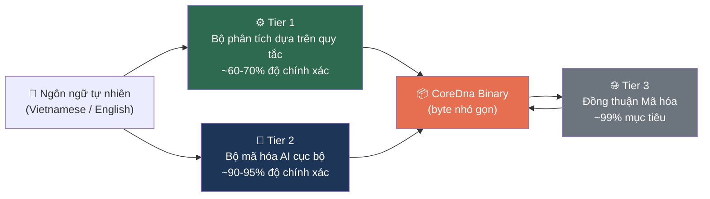

# §4. Wire Format & Mã hóa

Định dạng wire format của Knowledge Unit cấu thành biểu diễn vật lý qua đó tri thức ngữ nghĩa truyền qua các ranh giới mạng, lưu trữ lâu dài trên các phương tiện lưu trữ, và đạt được danh tính định địa chỉ theo nội dung (content-addressable identity). Phần này trình bày đặc tả mã hóa nhị phân Core DNA — một định dạng luồng lệnh tùy chỉnh đạt được mục tiêu tạo ra các biểu diễn nhị phân *nhỏ hơn* văn bản ngôn ngữ tự nhiên. Chúng tôi trình bày chi tiết về bố cục wire format hoàn chỉnh, tập lệnh 30-instruction opcode, một cơ chế mã hóa số nguyên độ dài biến đổi 5 tầng mới lạ liên kết với các lớp tần suất Zipfian, và một quy trình mã hóa ba tầng chuyển đổi lũy tiến ngôn ngữ tự nhiên thành nhị phân độc lập với ngôn ngữ.

## 4.1 Các nguyên tắc thiết kế

Thiết kế định dạng wire format được chi phối bởi sáu mục tiêu trực giao, mỗi mục tiêu được thúc đẩy bởi các ràng buộc triển khai cụ thể bên trong mạng lưới phi tập trung OneBrain.

**Sự nhỏ gọn — nhỏ hơn văn bản (Compactness — smaller than text).** Core DNA đạt kích thước wire format luôn *nhỏ hơn* ngôn ngữ tự nhiên mà nó đại diện. Ví dụ, văn bản tiếng Việt "bơi ếch" (kỹ thuật bơi ếch, 323 bytes UTF-8) mã hóa thành 88 bytes — nén gấp 3.7 lần *dưới* văn bản nguồn. Sự biến đổi này khả thi vì Core DNA mã hóa *cấu trúc ngữ nghĩa* (định danh khái niệm, câu lệnh có kiểu, các hằng số số học) thay vì *dạng bề mặt ngôn ngữ* (các chuỗi ngôn ngữ tự nhiên với sự dư thừa vốn có của chúng). Mỗi byte thừa thãi đều áp đặt chi phí có thể đo lường được về độ trễ, tiêu thụ năng lượng và chi phí tiền tệ trên các liên kết bị giới hạn băng thông — bao gồm các kết nối di động, rơ-le lưới Bluetooth Low Energy và các liên kết vệ tinh kết nối không liên tục.

**Biểu diễn độc lập ngôn ngữ (Language-agnostic representation).** Lớp nhị phân cốt lõi chỉ chứa các ConceptId số nguyên không dấu, các hằng số số học có kiểu và các opcode cấu trúc. Không có chuỗi ngôn ngữ tự nhiên nào xuất hiện trong luồng lệnh Core DNA. Một Knowledge Unit về "breaststroke swimming" và một cái về "bơi ếch" tạo ra các mã hóa nhị phân *giống hệt nhau* khi chúng tham chiếu cùng các ConceptId, cho phép hội tụ qua các ranh giới ngôn ngữ mà không cần dịch thuật.

**Cấu trúc có thể truy vấn bằng máy (Machine-queryable structure).** Không giống như các khối byte mờ đục hay các kho lưu trữ khóa-giá trị tuần tự hóa, Core DNA là một luồng lệnh có kiểu nơi mỗi câu lệnh mang ý định ngữ nghĩa rõ ràng (Triple, Quantity, Constraint, Step, v.v.). Bộ giải mã có thể trích xuất tất cả các đo lường số lượng, liệt kê các bước quy trình hoặc lọc các vi phạm ràng buộc mà không cần giải tuần tự hóa toàn bộ cấu trúc — cho phép lập chỉ mục và xử lý truy vấn hiệu quả ở cấp độ wire format.

**Độ chính xác số học (Numeric precision).** Các đại lượng, dung sai và phạm vi yêu cầu biểu diễn số học trung thực. Core DNA cung cấp sáu kiểu số inline (§4.3.3) bao gồm số nguyên có dấu và không dấu (8-, 16- và 32-bit) cũng như số thực dấu phẩy động độ chính xác đơn IEEE 754, đủ cho các đo lường kỹ thuật ($\pm 3.4 \times 10^{38}$), các mức độ tự tin được chia tỷ lệ (0–10,000 → 0.0000–1.0000) và các mô hình cảm xúc.

**Tính toàn vẹn được bảo vệ bằng CRC (CRC-protected integrity).** Trong một mạng lưới phi tập trung thiếu vắng các trọng tài trung tâm, sự hư hỏng bit trong quá trình truyền tải hoặc lưu trữ phải được phát hiện với xác xuất cao trước khi một KU đi vào cơ sở tri thức của bất kỳ nút nào. Một checksum CRC-16/CCITT (§4.4), được tính toán trên phần header và luồng lệnh, cung cấp khả năng phát hiện lỗi nhẹ với đa thức $x^{16} + x^{12} + x^5 + 1$. Checksum này hoạt động độc lập với tính năng phát hiện lỗi của lớp vận chuyển, cung cấp khả năng phòng thủ chuyên sâu chống lại sự hư hỏng âm thầm trong các kịch bản lưu-và-chuyển-tiếp (store-and-forward relay). Việc chọn CRC-16 thay vì CRC-32 giúp tiết kiệm 2 bytes cho mỗi KU — rất đáng kể khi tổng kích thước wire format có thể chỉ nhỏ khoảng 9 bytes.

**Khả năng mở rộng (Extensibility).** Trường opcode 5-bit hỗ trợ tối đa 32 opcodes, với 30 cái hiện được định nghĩa và 2 cái dành riêng cho mở rộng trong tương lai. Opcode `EXTENDED` (`0x1F`) cung cấp cơ chế thoát cho việc mở rộng tập lệnh trong tương lai vượt quá 32 opcodes.

## 4.2 Cấu trúc Wire Format

Định dạng wire format của Core DNA tuân theo một kiến trúc nhỏ gọn chỉ với 5 bytes overhead cố định:

```
┌────────┬──────────┬──────────────────────────────┬──────────┬──────────┐
│ MAGIC  │ VER_META │      INSTRUCTION STREAM      │   END    │  CRC-16  │
│  (1B)  │  (1B)    │      (variable length)       │  (1B)    │  (2B)    │
├────────┼──────────┼──────────────────────────────┼──────────┼──────────┤
│  0x4B  │ see §4.2.2│ op(1B) + operands...  × N   │  0xF0    │ BE u16   │
└────────┴──────────┴──────────────────────────────┴──────────┴──────────┘
 ◄──────────────────── CRC covers this range ───────────────────►
```

> **Định nghĩa 4.1 (Kích thước wire format tối thiểu).** Một Core DNA rỗng không có câu lệnh dữ liệu nào sẽ mã hóa thành đúng 5 bytes: MAGIC(1) + VER\_META(1) + END(1) + CRC-16(2). Điều này đại diện cho overhead cố định không thể giảm bớt của định dạng.

### 4.2.1 Byte Magic

Byte magic là byte đơn `0x4B` (ASCII `'K'`), nằm ở vị trí offset 0. Thiết kế byte đơn phục vụ hai mục đích: từ chối nhanh các luồng byte không phải KU trong quá trình phân tích cú pháp, và định danh thân thiện với con người trong các bản kết xuất hex khi gỡ lỗi.

### 4.2.2 Byte VER_META

Byte thứ hai đóng gói ba trường vào một byte duy nhất bằng cách ghép nối ở cấp độ bit:

```
Offset: 1
Layout:
  ┌───────────┬────────────────┬──────────────────┐
  │ Bits 7-5  │   Bits 4-1     │     Bit 0        │
  │ version   │   gene_type    │ has_qualifiers   │
  │ (3 bits)  │   (4 bits)     │   (1 bit)        │
  └───────────┴────────────────┴──────────────────┘
```

Công thức mã hóa và giải mã là:

$$\text{VER\_META} = (\text{version} \wedge \texttt{0x07}) \ll 5 \;\big|\; (\text{gene\_type} \wedge \texttt{0x0F}) \ll 1 \;\big|\; \text{has\_qualifiers}$$

$$\text{version} = (\text{VER\_META} \gg 5) \wedge \texttt{0x07}, \quad \text{gene\_type} = (\text{VER\_META} \gg 1) \wedge \texttt{0x0F}$$

| Trường | Các Bit | Khoảng giá trị | Mô tả |
|-------|------|-------|-------------|
| `version` | 7–5 | 0–7 | Phiên bản định dạng; hiện tại = **1** (nhị phân `001`) |
| `gene_type` | 4–1 | 0–15 | Chỉ số kiểu gen (xem Bảng 4.1) |
| `has_qualifiers` | 0 | 0–1 | `1` nếu có bất kỳ câu lệnh nào mang siêu dữ liệu qualifier |

**Bảng 4.1: Các giá trị kiểu Gen (4-bit)**

| Giá trị | GeneType | Mô tả |
|-------|----------|-------------|
| 0 | Fact | Tri thức sự thật với các bộ ba chủ ngữ-vị ngữ-tân ngữ |
| 1 | Procedure | Quy trình từng bước với các điều kiện tiên quyết và tác động |
| 2 | Experience | Tri thức trải nghiệm với cảm xúc VAD (Valence-Arousal-Dominance) |
| 3 | Creative | Nội dung sáng tạo với quy trình và bối cảnh văn hóa |
| 4 | MediaExperience | Trải nghiệm nhận cảm dựa trên truyền thông |
| 5 | Testimony | Lời chứng thực của nhân chứng với độ gần gũi và số lượng |
| 6 | Formal | Ký hiệu toán học/logic (LaTeX, MathML) |
| 7 | Hypothesis | Giả thuyết với mức độ tự tin và cấp độ trưởng thành |
| 8 | Narrative | Cấu trúc câu chuyện với văn bản chuẩn tắc |
| 9 | Sensory | Nhận cảm cảm giác với các mô tả phương thức |
| 10 | Composite | KU hỗn hợp tích hợp các KU thành viên bằng tham chiếu CID |
| 11–15 | *Reserved* | Các kiểu gen tương lai |

> Core DNA lưu trữ tất cả 11 kiểu gen trực tiếp trong 4 bits (giá trị 0–10), với các giá trị 11–15 được dành riêng cho các kiểu gen tương lai.

**Ví dụ thực tế.** Một gen Fact (kiểu 0), phiên bản 1, không có qualifier:
$$\text{VER\_META} = (1 \ll 5) \mid (0 \ll 1) \mid 0 = \texttt{0x20}$$
Header đầy đủ: `0x4B 0x20` (2 bytes).

### 4.2.3 Luồng câu lệnh (Instruction Stream)

Luồng câu lệnh là một chuỗi các câu lệnh có độ dài biến đổi. Mỗi câu lệnh bao gồm một byte opcode theo sau bởi không hoặc nhiều toán hạng:

```
┌──────────────────┬────────────────────────────┐
│   OPCODE BYTE    │        OPERANDS            │
│     (1 byte)     │   (variable, 0–N bytes)    │
├──────────────────┼────────────────────────────┤
│  [op:5][mod:3]   │  varint / numeric / raw    │
└──────────────────┴────────────────────────────┘
```

Byte opcode mã hóa hai trường trong 8 bits:

$$\text{opcode\_byte} = (\text{op} \ll 3) \mid (\text{modifier} \wedge \texttt{0x07})$$

trong đó **op** (các bit 7–3) is the 5-bit opcode value (`0x00`–`0x1F`, tạo ra 32 opcodes khả thi) và **modifier** (các bit 2–0) là trường 3-bit dành riêng cho sử dụng trong tương lai (hiện tại luôn bằng 0 ở phiên bản 1).

### 4.2.4 Điểm đánh dấu END và CRC-16

Điểm đánh dấu END là byte opcode cho `Op::End` (opcode `0x1E`), mã hóa thành byte đường truyền `0x1E \ll 3 = \texttt{0xF0}`. Nó kết thúc luồng lệnh một cách rõ ràng.

CRC-16 chiếm 2 bytes cuối cùng của wire format, được lưu trữ dưới dạng số nguyên 16-bit không dấu big-endian. Checksum được tính toán trên toàn bộ các byte đi trước (MAGIC + VER\_META + INSTRUCTION\_STREAM + END). Xem §4.4 để biết đặc tả thuật toán đầy đủ.

### 4.2.5 Ngân sách overhead

| Thành phần | Kích thước | Ghi chú |
|-----------|------|-------|
| MAGIC | 1 byte | Cố định: `0x4B` |
| VER\_META | 1 byte | Phiên bản + kiểu gen + cờ qualifier |
| END marker | 1 byte | Cố định: `0xF0` |
| CRC-16 | 2 bytes | Phần đuôi cố định |
| **Tổng overhead** | **5 bytes** | Không đổi bất kể số lượng câu lệnh |

Đối với một KU kiểu Fact điển hình có kích thước 88 bytes (ví dụ "bơi ếch"), overhead 5-byte chiếm 5.7% tổng kích thước. Đối với một KU tối thiểu 9-byte mã hóa một bộ ba đơn lẻ, overhead là 55.6%, phản ánh hiệu năng của định dạng ngay cả ở quy mô nhỏ nhất.

### 4.2.6 Ví dụ thực tế — Sơ đồ Hex hoàn chỉnh

Mã hóa `Triple(s=1, p=2, o=3)` dưới dạng gen Fact:

```
Offset  Hex    Description
 00     4B     Byte MAGIC ('K')
 01     20     VER_META: version=1, gene_type=0(Fact), qualifiers=false
                 (0b001_0000_0 = 0x20)
 02     00     OPCODE: Triple (op=0x00, mod=0) → byte = 0x00
 03     01     Varint: s=1 (Tier 0, 1 byte)
 04     02     Varint: p=2 (Tier 0, 1 byte)
 05     03     Varint: o=3 (Tier 0, 1 byte)
 06     F0     Điểm đánh dấu END (Op::End = 0x1E, byte = 0x1E≪3 = 0xF0)
 07-08  XX XX  CRC-16/CCITT trên các byte [00..06]
```

Tổng cộng: **9 bytes** cho một Knowledge Unit hoàn chỉnh, được bảo vệ bằng CRC.

## 4.3 Tập lệnh

Tập lệnh Core DNA bao gồm 30 câu lệnh dữ liệu (opcodes `0x00`–`0x1D`), cộng thêm kết thúc `END` (`0x1E`) và một opcode `EXTENDED` (`0x1F`) dành riêng cho các mở rộng tương lai. Mỗi câu lệnh ánh xạ 1:1 với một giá trị opcode và mang một bố cục toán hạng cố định được xác định hoàn toàn bởi opcode đó.

### 4.3.1 Op Enum — Toàn bộ 32 Opcodes

Mỗi opcode là một giá trị 5-bit. Byte đường truyền được tính bằng $\text{op} \ll 3$ (với modifier 0 ở phiên bản 1):

| Op | Byte đường truyền | Tên (Name) | Bố cục toán hạng |
|----|-----------|------|----------------|
| `0x00` | `0x00` | `TRIPLE` | varint(S), varint(P), varint(O) |
| `0x01` | `0x08` | `QUALITY` | varint(S), varint(Q) |
| `0x02` | `0x10` | `QUANTITY` | varint(S), numeric(value), varint(unit) |
| `0x03` | `0x18` | `SEQUENCE` | u8(N), varint(item₁), …, varint(itemₙ) |
| `0x04` | `0x20` | `PART_OF` | varint(part), varint(whole) |
| `0x05` | `0x28` | `LOCATED` | varint(S), varint(location) |
| `0x06` | `0x30` | `TEMPORAL` | varint(S), varint(time) |
| `0x07` | `0x38` | `CAUSAL` | varint(cause), varint(effect) |
| `0x08` | `0x40` | `SIMULATES` | varint(S), varint(model) |
| `0x09` | `0x48` | `CONDITION` | varint(if), varint(then) |
| `0x0A` | `0x50` | `AGENT` | varint(actor), varint(action) |
| `0x0B` | `0x58` | `TOOL` | varint(action), varint(instrument) |
| `0x0C` | `0x60` | `RANGE` | varint(S), numeric(min), numeric(max) |
| `0x0D` | `0x68` | `TOLERANCE` | varint(S), numeric(value), numeric(±δ) |
| `0x0E` | `0x70` | `CONSTRAINT` | varint(source), u8(op\_code), varint(target) |
| `0x0F` | `0x78` | `ENUM_VAL` | varint(S), u8(N), varint(val₁), …, varint(valₙ) |
| `0x10` | `0x80` | `CERTAINTY` | u16\_be(level) |
| `0x11` | `0x88` | `DIFFICULTY` | u8(level) |
| `0x12` | `0x90` | `CID_REF` | raw(32 bytes BLAKE3 hash) |
| `0x13` | `0x98` | `STEP` | u8(ord), varint(action), varint(target) |
| `0x14` | `0xA0` | `PRECOND` | varint(concept) |
| `0x15` | `0xA8` | `EFFECT` | varint(concept) |
| `0x16` | `0xB0` | `AFFECT` | i16\_be(V), i16\_be(A), i16\_be(D) |
| `0x17` | `0xB8` | `LABEL` | varint(key), varint(value) |
| `0x18` | `0xC0` | `TEXT_REF` | u8(lang), u16\_be(len), raw(bytes) |
| `0x19` | `0xC8` | `FORMULA` | u8(format), u16\_be(len), raw(bytes) |
| `0x1A` | `0xD0` | `WITNESS` | u16\_be(count), u8(proximity) |
| `0x1B` | `0xD8` | `MEDIA_REF` | u8(system), u8(len), raw(id\_bytes) |
| `0x1C` | `0xE0` | `COMPOSITE_HDR` | u8(type), u8(completeness), u32\_be(version) |
| `0x1D` | `0xE8` | `MEMBER` | u16\_be(order), u8(role), u8(required), varint(label), raw(32B cid) |
| `0x1E` | `0xF0` | `END` | *(none — terminates stream)* |
| `0x1F` | `0xF8` | `EXTENDED` | u8(ext\_byte), … *(future extension)* |

### 4.3.2 Các danh mục câu lệnh

30 câu lệnh dữ liệu được tổ chức thành năm danh mục chức năng:

**Các câu lệnh quan hệ (Relational instructions)** (opcodes `0x00`–`0x0B`) mã hóa các mối quan hệ ngữ nghĩa giữa các khái niệm. Câu lệnh `TRIPLE` nền tảng đại diện cho các sự thật chủ ngữ-vị ngữ-tân ngữ; `QUALITY`, `PART_OF`, `LOCATED`, `TEMPORAL`, `CAUSAL`, `SIMULATES`, `CONDITION`, `AGENT`, và `TOOL` cung cấp các loại quan hệ chuyên biệt mà nếu không có chúng sẽ yêu cầu các chuỗi bộ ba dài dòng. `SEQUENCE` mã hóa các danh sách có thứ tự chứa tối đa 255 khái niệm.

**Các câu lệnh định lượng (Quantitative instructions)** (opcodes `0x0C`–`0x0F`, `0x02`) mã hóa các phép đo lường số học và các ràng buộc. `QUANTITY` gắn một giá trị số có kiểu và đơn vị vào một khái niệm; `RANGE` và `TOLERANCE` thể hiện các giới hạn đo lường và biên độ chính xác; `CONSTRAINT` áp dụng các toán tử quan hệ ($=$, $\neq$, $<$, $\leq$, $>$, $\geq$); `ENUM_VAL` liệt kê các tập giá trị hợp lệ.

**Các câu lệnh siêu dữ liệu (Metadata instructions)** (opcodes `0x10`–`0x12`, `0x17`) mã hóa siêu dữ liệu ở cấp độ KU. `CERTAINTY` thể hiện độ tự tin dưới dạng số nguyên có tỷ lệ 0–10,000 (đại diện cho xác suất từ 0.0000–1.0000); `DIFFICULTY` đánh giá độ phức tạp trên thang đo thứ tự 5 cấp độ; `CID_REF` nhúng một tham chiếu băm BLAKE3 32-byte đến một KU khác; `LABEL` cung cấp cơ chế khóa-giá trị chung cho các vai trò ngữ nghĩa chưa được bao phủ bởi các opcode chuyên dụng.

**Các câu lệnh quy trình (Procedural instructions)** (opcodes `0x13`–`0x15`) mã hóa các quy trình từng bước. `STEP` mang một số thứ tự, khái niệm hành động và khái niệm mục tiêu; `PRECOND` và `EFFECT` đính kèm các khái niệm điều kiện tiên quyết và kết quả vào bước ngay trước đó, tạo thành một đồ thị luồng công việc có hướng không chu trình.

**Các câu lệnh đặc thù cho gen (Gene-specific instructions)** (opcodes `0x16`–`0x1D`) mã hóa các cấu trúc dữ liệu duy nhất cho các kiểu gen cụ thể. `AFFECT` lưu trữ các chiều cảm xúc VAD dưới dạng các số nguyên 16-bit có dấu; `TEXT_REF` và `FORMULA` nhúng các khối văn bản nén với thẻ ngôn ngữ hoặc định dạng; `WITNESS` mang siêu dữ liệu lời chứng thực; `MEDIA_REF` tham chiếu đến các hệ thống truyền thông bên ngoài; `COMPOSITE_HDR` và `MEMBER` định nghĩa các cấu trúc KU hỗn hợp với tư cách thành viên có kiểu.

### 4.3.3 Mã hóa Inline NumericValue

Các giá trị số bên trong các câu lệnh `QUANTITY`, `RANGE` và `TOLERANCE` được mã hóa inline bằng cách sử dụng một byte tiền tố kiểu theo sau bởi giá trị theo thứ tự byte big-endian. Các byte tiền tố (`0xFA`–`0xFF`) được chọn nằm *ngoài* phạm vi varint (các varint sử dụng `0x00`–`0xF7` làm byte đầu tiên), cho phép khử nhập nhằng rõ ràng:

| Tiền tố | Kiểu | Payload | Tổng số Bytes | Khoảng giá trị |
|--------|------|---------|-------------|-------------|
| `0xFA` | U8 | 1 byte không dấu | 2 | 0 – 255 |
| `0xFB` | U16 | 2 bytes BE | 3 | 0 – 65,535 |
| `0xFC` | I16 | 2 bytes BE có dấu | 3 | −32,768 – 32,767 |
| `0xFD` | U32 | 4 bytes BE | 5 | 0 – 4,294,967,295 |
| `0xFE` | I32 | 4 bytes BE có dấu | 5 | −2,147,483,648 – 2,147,483,647 |
| `0xFF` | F32 | 4 bytes BE IEEE 754 | 5 | $\pm 3.4 \times 10^{38}$ |

> **Định nghĩa 4.2 (Khử nhập nhằng số/varint).** Cho một byte $b$ tại vị trí mà cả NumericValue hoặc varint ConceptId đều có thể xuất hiện:
> - Nếu $b \geq \texttt{0xFA}$: giải mã dưới dạng NumericValue (tiền tố + payload).
> - Nếu $b \leq \texttt{0xF7}$: giải mã dưới dạng varint ConceptId.
> - Các byte `0xF8`–`0xF9` được dành riêng cho mở rộng trong tương lai.

**Các ví dụ mã hóa:**

```
NumericValue::U8(42)       → [0xFA, 0x2A]                   (2 bytes)
NumericValue::F32(35.2)    → [0xFF, 0x42, 0x0C, 0xCC, 0xCD] (5 bytes)
NumericValue::I16(-500)    → [0xFC, 0xFE, 0x0C]             (3 bytes)
```

### 4.3.4 Các toán tử ràng buộc

Trường `op_code` toán hạng của câu lệnh `CONSTRAINT` là một byte không dấu đơn lẻ mã hóa sáu toán tử quan hệ:

| Giá trị | Toán tử | Ký hiệu |
|-------|----------|--------|
| 0 | Bằng (Equal) | $=$ |
| 1 | Khác (Not Equal) | $\neq$ |
| 2 | Nhỏ hơn (Less Than) | $<$ |
| 3 | Nhỏ hơn hoặc bằng (Less or Equal) | $\leq$ |
| 4 | Lớn hơn (Greater Than) | $>$ |
| 5 | Lớn hơn hoặc bằng (Greater or Equal) | $\geq$ |

## 4.4 Tính toàn vẹn CRC-16/CCITT

### 4.4.1 Đặc tả thuật toán

Core DNA sử dụng CRC-16/CCITT (biến thể XMODEM), cung cấp khả năng phát hiện lỗi hiệu quả cho các kích thước dây điển hình của định dạng trong khi giảm thiểu overhead ở mức 2 bytes.

| Tham số | Giá trị |
|-----------|-------|
| Thuật toán | CRC-16/CCITT (XMODEM) |
| Đa thức | `0x1021` ($x^{16} + x^{12} + x^5 + 1$) |
| Giá trị khởi tạo | `0xFFFF` |
| Phản chiếu đầu vào | Không (No) |
| Phản chiếu đầu ra | Không (No) |
| XOR cuối cùng | `0x0000` |
| Giá trị kiểm tra | `0x29B1` (cho chuỗi ASCII `"123456789"`) |
| Mã hóa đường truyền | Big-endian u16 |

### 4.4.2 Tính toán

CRC được tính toán trên tất cả các byte *đi trước* chính nó (MAGIC + VER\_META + INSTRUCTION\_STREAM + END), sau đó được nối thêm dưới dạng 2 bytes theo thứ tự big-endian:

```
function crc16_ccitt(data: byte[]) → u16:
    crc ← 0xFFFF
    for byte in data:
        crc ← crc ⊕ (byte ≪ 8)
        repeat 8 times:
            if (crc ∧ 0x8000) ≠ 0:
                crc ← (crc ≪ 1) ⊕ 0x1021
            else:
                crc ← crc ≪ 1
        crc ← crc ∧ 0xFFFF
    return crc
```

### 4.4.3 Thuộc tính phát hiện lỗi

CRC-16/CCITT với đa thức `0x1021` cung cấp các đảm bảo sau:

- **Lỗi đơn bit (Single-bit errors):** 100% phát hiện đối với bất kỳ thay đổi đơn bit nào.
- **Lỗi bùng phát (Burst errors):** 100% phát hiện đối với lỗi bùng phát có độ dài lên tới 16 bits.
- **Các mẫu lỗi ngẫu nhiên (Random error patterns):** Xác suất lỗi không được phát hiện xấp xỉ $2^{-16} \approx 1.5 \times 10^{-5}$ đối với các mẫu lỗi ngẫu nhiên nhiều bit.

Checksum CRC-16 rõ ràng *không* phải là một cơ chế toàn vẹn mật mã. Việc phát hiện giả mạo được cung cấp riêng biệt bởi BLAKE3 Content Identifier (§4.6), đóng vai trò là một cam kết mật mã đối với các byte trên đường truyền.

> **Định lý 4.1 (Giới hạn overhead cố định).** Overhead cố định của định dạng wire format Core DNA chính xác là 5 bytes: MAGIC(1) + VER\_META(1) + END(1) + CRC-16(2). Đối với một KU tối thiểu, điều này tạo ra tỷ lệ overhead-to-payload là $\frac{5}{5 + |P|}$.

### 4.4.4 Xác minh

Các triển khai BẮT BUỘC phải vượt qua bài kiểm tra giá trị kiểm tra tiêu chuẩn:

```
Input:  b"123456789"  (9 bytes: 0x31..0x39)
Output: 0x29B1
```

## 4.5 Mã hóa số nguyên có độ dài biến đổi 5 tầng

### 4.5.1 Động lực

Tập lệnh của Knowledge Unit mã hóa các khái niệm ngữ nghĩa dưới dạng các định danh số nguyên không dấu (ConceptIds). Phân phối tần suất khái niệm trong tri thức tự nhiên tuân theo mẫu Zipfian: một nhân nhỏ của các phần tử nguyên thủy phổ quát (hành động, đối tượng, quan hệ không gian, đặc tính cơ bản) xuất hiện với tần suất cao, trong khi đại đa số các khái niệm đặc thù cho lĩnh vực và văn hóa thì rất hiếm. Một mã hóa tối ưu nên gán các biểu diễn byte ngắn hơn cho các khái niệm xuất hiện thường xuyên, tuân theo nguyên lý nền tảng của định lý mã hóa nguồn của Shannon.

Các mã hóa số nguyên có độ dài biến đổi hiện có — đáng chú ý là LEB128 (được sử dụng trong DWARF, WebAssembly, và Protocol Buffers) và varint của SQLite — xử lý tất cả các giá trị trong một phạm vi nhất định một cách đồng đều và xác định độ dài mã hóa thông qua việc quét tuần tự các byte. Chúng tôi đề xuất một **mã hóa số nguyên độ dài biến đổi 5 tầng (5-tier variable-length integer encoding)** phân chia không gian tên khái niệm thành các lớp tần suất liên kết về mặt ngữ nghĩa, cho phép xác định độ dài $O(1)$ từ mẫu tiền tố của byte đầu tiên và hỗ trợ giải mã branchless (không phân nhánh) trên các bộ xử lý hiện đại.

### 4.5.2 Cấu trúc mã hóa

Mã hóa sử dụng mã không tiền tố lấy cảm hứng từ cấu trúc byte dẫn đầu của UTF-8. Các bit cao của byte đầu tiên xác định tầng (và do đó xác định tổng số byte), trong khi các bit còn lại đóng góp vào giá trị dữ liệu:

| Tầng (Tier) | Bytes | Tiền tố byte đầu tiên | Các bit dữ liệu | Khoảng được mã hóa | Dung lượng (Capacity) |
|------|-------|--------------------|-----------|---------------|----------|
| 0 | 1 | `0xxxxxxx` | 7 | 0 – 127 | 128 |
| 1 | 2 | `10xxxxxx xxxxxxxx` | 14 | 128 – 16,511 | 16,384 |
| 2 | 3 | `110xxxxx xxxxxxxx xxxxxxxx` | 21 | 16,512 – 2,113,663 | 2,097,152 |
| 3 | 4 | `1110xxxx` + 3 bytes | 28 | 2,113,664 – 270,549,119 | 268,435,456 |
| 3+ | 5 | `11110xxx` + 4 bytes | 35 | 270,549,120 – ~34.6 tỷ | ~34.4 tỷ |

Các ranh giới tầng được định nghĩa bằng các hằng số offset tích lũy:

```
TIER0_MAX    = 127
TIER1_OFFSET = 128          TIER1_MAX = 16,511
TIER2_OFFSET = 16,512       TIER2_MAX = 2,113,663
TIER3_OFFSET = 2,113,664    TIER3_MAX = 270,549,119
TIER3P_OFFSET = 270,549,120
```

Phạm vi của mỗi tầng là liên tục và không chồng chéo. Offset cho tầng $k$ bằng tổng dung lượng của tất cả các tầng thấp hơn:

$$\text{OFFSET}_k = \sum_{i=0}^{k-1} 2^{7 + 7(i-1) \cdot \mathbb{1}[i>0]}$$

### 4.5.3 Sự liên kết ngữ nghĩa với phân phối Zipfian

Cấu trúc tầng không đơn thuần là tối ưu hóa nén — nó cấu thành một sự liên kết kiến trúc có chủ ý giữa độ rộng byte và lớp tần suất khái niệm. Sự liên kết này được lấy cảm hứng từ định luật Zipf, quan sát thấy rằng tần suất của mục phổ biến thứ $n$ trong một ngữ liệu tự nhiên tỷ lệ thuận với $1/n^\alpha$ với $\alpha \approx 1$. Chúng tôi ánh xạ mỗi tầng tới một tầng ngữ nghĩa của không gian tên khái niệm:

**Tầng 0 (1 byte, 128 slots): Các phần tử nguyên thủy phổ quát (Universal Primitives).** Tầng này mã hóa các khái niệm nền tảng nhất xuất hiện trên hầu hết tất cả các lĩnh vực tri thức và nền văn hóa: các hành động cốt lõi (di chuyển, tạo ra, thay đổi, quan sát), các đối tượng cơ bản (người, địa điểm, sự vật, thời gian), các quan hệ không gian (trên, trong, gần), và các đặc tính sơ đẳng (lớn, nhanh, đúng). Các khái niệm này tương ứng với các mục có tần suất cao nhất trong các ma trận đồng xuất hiện khái niệm được rút ra từ các ngữ liệu đa ngôn ngữ. Việc mã hóa chúng trong một byte đơn lẻ đảm bảo rằng các toán hạng câu lệnh phổ biến nhất gây ra overhead đường truyền tối thiểu.

**Tầng 1 (2 bytes, ~16K slots): Các khái niệm phổ biến (Common Concepts).** Tầng này chứa các khái niệm được sử dụng rộng rãi nhưng không phổ quát: các cảm xúc phổ biến (vui, sợ, ngạc nhiên), các vật dụng hàng ngày (ghế, cửa sổ, con đường), các hoạt động tiêu chuẩn (nấu ăn, đọc sách, du lịch), và các thuật ngữ khoa học cơ bản (năng lượng, tế bào, lực). Dung lượng 16,384 slot phù hợp với ước lượng kích thước từ vựng hoạt động của một người trưởng thành có học thức trong bất kỳ một ngôn ngữ đơn lẻ nào.

**Tầng 2 (3 bytes, ~2M slots): Các khái niệm lĩnh vực tiêu chuẩn (Standard Domain Concepts).** Tầng này bao gồm các thuật ngữ đặc thù cho lĩnh vực gặp phải trong bối cảnh chuyên môn và học thuật: chẩn đoán y tế, khái niệm pháp lý, thuật ngữ kỹ thuật và các tham chiếu văn hóa. Dung lượng khoảng 2 triệu slot chứa được vốn từ vựng chuyên ngành kết hợp của khoảng 50 lĩnh vực chuyên môn.

**Tầng 3 (4 bytes, ~268M slots): Các khái niệm mở rộng (Extended Concepts).** Tầng này mã hóa các khái niệm có tính đặc thù cao: các hợp chất hóa học riêng lẻ, các biến thể gen cụ thể, các thực hành văn hóa ngách và các đặc điểm địa lý cụ thể. Dung lượng khoảng 268 triệu slot là đủ cho các bản thể luận lĩnh vực toàn diện trên tất cả các lĩnh vực tri thức của nhân loại.

**Tầng 3+ (5 bytes, ~34.6 tỷ slots): Các khái niệm cộng đồng và hiếm gặp (Community and Rare Concepts).** Tầng này phục vụ như là cái đuôi dài (long tail): các từ mới do cộng đồng đặt ra, các meme văn hóa phù du, các khái niệm trải nghiệm đặc thù của cá nhân và các định danh kỹ thuật siêu chuyên sâu. Dung lượng khoảng 34.6 tỷ slot cung cấp một không gian tên thực tế không thể cạn kiệt cho sự tăng trưởng khái niệm hữu cơ bên trong mạng lưới phi tập trung.

### 4.5.4 Thuật toán mã hóa

```
function encode(value: u64) → bytes:
    if value ≤ TIER0_MAX:
        return [value as u8]                           // 0xxxxxxx

    elif value ≤ TIER1_MAX:
        v = value - TIER1_OFFSET                       // Normalize to tier-local index
        return [0x80 | (v >> 8) as u8,                 // 10xxxxxx
                (v & 0xFF) as u8]                      // xxxxxxxx

    elif value ≤ TIER2_MAX:
        v = value - TIER2_OFFSET
        return [0xC0 | (v >> 16) as u8,                // 110xxxxx
                ((v >> 8) & 0xFF) as u8,               // xxxxxxxx
                (v & 0xFF) as u8]                      // xxxxxxxx

    elif value ≤ TIER3_MAX:
        v = value - TIER3_OFFSET
        return [0xE0 | (v >> 24) as u8,                // 1110xxxx
                ((v >> 16) & 0xFF) as u8,              // xxxxxxxx
                ((v >> 8) & 0xFF) as u8,               // xxxxxxxx
                (v & 0xFF) as u8]                      // xxxxxxxx

    else:
        v = value - TIER3P_OFFSET
        return [0xF0 | (v >> 32) as u8,                // 11110xxx
                ((v >> 24) & 0xFF) as u8,              // xxxxxxxx
                ((v >> 16) & 0xFF) as u8,              // xxxxxxxx
                ((v >> 8) & 0xFF) as u8,               // xxxxxxxx
                (v & 0xFF) as u8]                      // xxxxxxxx
```

### 4.5.5 Thuật toán giải mã

```
function decode(buf: &[u8]) → (value: u64, bytes_consumed: usize):
    let first = buf[0]

    if first & 0x80 == 0:                              // Tier 0: 0xxxxxxx
        return (first as u64, 1)

    elif first & 0xC0 == 0x80:                         // Tier 1: 10xxxxxx
        v = ((first & 0x3F) as u64) << 8
            | buf[1] as u64
        return (v + TIER1_OFFSET, 2)

    elif first & 0xE0 == 0xC0:                         // Tier 2: 110xxxxx
        v = ((first & 0x1F) as u64) << 16
            | (buf[1] as u64) << 8
            | buf[2] as u64
        return (v + TIER2_OFFSET, 3)

    elif first & 0xF0 == 0xE0:                         // Tier 3: 1110xxxx
        v = ((first & 0x0F) as u64) << 24
            | (buf[1] as u64) << 16
            | (buf[2] as u64) << 8
            | buf[3] as u64
        return (v + TIER3_OFFSET, 4)

    elif first & 0xF8 == 0xF0:                         // Tier 3+: 11110xxx
        v = ((first & 0x07) as u64) << 32
            | (buf[1] as u64) << 24
            | (buf[2] as u64) << 16
            | (buf[3] as u64) << 8
            | buf[4] as u64
        return (v + TIER3P_OFFSET, 5)

    else:
        error("Invalid varint prefix")
```

### 4.5.6 So sánh với LEB128

Bảng so sánh sau đây làm nổi bật các lợi thế cấu trúc của varint 5 tầng OneBrain so với mã hóa LEB128 được sử dụng rộng rãi (được dùng trong Protocol Buffers, WebAssembly, và DWARF):

| Thuộc tính (Property) | LEB128 / Protocol Buffers | OneBrain 5-Tier Varint |
|----------|---------------------------|------------------------|
| Xác định độ dài | Quét tuần tự $O(n)$ tìm các bit tiếp tục | $O(1)$ từ mẫu tiền tố của byte đầu tiên |
| Tự đồng bộ hóa | Không (No); việc nhảy vào giữa luồng yêu cầu quét đến ranh giới tiếp theo | Có (Yes); tiền tố kiểu UTF-8 xác định ranh giới một cách rõ ràng |
| Sự liên kết ngữ nghĩa | Không có (None); mã hóa độc lập với giá trị | Tầng = lớp tần suất trong không gian tên khái niệm |
| Khoảng tối đa 1-byte | 0 – 127 | 0 – 127 |
| Khoảng tối đa 2-byte | 0 – 16,383 | 128 – 16,511 |
| Khoảng tối đa 5-byte | 0 – 4,294,967,295 | 270,549,120 – ~34.6 tỷ |
| Giải mã branchless | Không khả thi (do chuỗi bit tiếp tục) | Khả thi thông qua bảng tra cứu mẫu tiền tố |
| Tính độc bản của mã hóa | Không chuẩn tắc (cho phép số 0 ở đầu) | Chuẩn tắc (mã hóa duy nhất cho mỗi giá trị) |

Thuộc tính xác định độ dài $O(1)$ đặc biệt quan trọng đối với việc xử lý hàng loạt các luồng câu lệnh chứa nhiều toán hạng varint. Một bộ giải mã có thể xác định toàn bộ byte span của một câu lệnh bằng cách chỉ kiểm tra byte đầu tiên của mỗi varint, cho phép quét bỏ qua hiệu quả và giải mã song song các câu lệnh không liền kề.

Dòng dõi trí tuệ của thiết kế này bắt nguồn từ mã hóa Huffman: cho một bảng chữ cái nguồn với phân phối tần suất đã biết (Zipfian, trong trường hợp của chúng tôi), mã không tiền tố tối ưu gán các từ mã ngắn hơn cho các ký tự có xác suất cao hơn. Mã hóa 5 tầng của chúng tôi áp dụng nguyên lý này không phải cho các bit riêng lẻ mà cho các tầng có độ rộng byte, tạo ra một mã kiểu Huffman căn chỉnh byte thực tế cho các định danh khái niệm.

## 4.6 Content Addressing: BLAKE3 CID

### 4.6.1 Xây dựng CID

Định danh nội dung (Content Identifier - CID) của một Knowledge Unit được định nghĩa là 256 bits đầu tiên của mã băm BLAKE3 trên toàn bộ chuỗi byte wire-format:

$$\text{CID}(ku) = \text{BLAKE3}(\text{wire\_bytes}(ku))[0..32]$$

Dấu vân tay 32-byte này đóng vai trò là địa chỉ duy nhất toàn cầu, bắt nguồn từ nội dung của KU bên trong mạng lưới OneBrain. Hai thuộc tính là thiết yếu:

**Tính xác định (Determinism).** Quy trình mã hóa tạo ra đầu ra byte giống hệt nhau cho các KU giống nhau về mặt ngữ nghĩa. Kết hợp với hàm băm xác định của BLAKE3, điều này đảm bảo các bản sao được mã hóa độc lập của cùng một tri thức sẽ tạo ra cùng một CID, cho phép chống trùng lặp và hội tụ trong toàn mạng lưới phi tập trung mà không cần điều phối.

**Khả năng phát hiện giả mạo (Tamper evidence).** Bất kỳ sửa đổi nào đối với nội dung của KU — cho dù là một toán hạng câu lệnh bị thay đổi, một kiểu gen bị biến đổi hay một bit qualifier bị lật — đều tạo ra một CID hoàn toàn khác với xác suất áp đảo ($1 - 2^{-256}$). Thuộc tính này làm cơ sở cho tính toàn vẹn của đồ thị tri thức: một CID được tham chiếu trong trường mục tiêu của liên kết hoặc một câu lệnh `CID_REF` cấu thành một cam kết mật mã đối với nội dung chính xác của KU được tham chiếu.

### 4.6.2 Lý do lựa chọn BLAKE3

BLAKE3 được lựa chọn thay vì các hàm băm thay thế (SHA-256, SHA-3, BLAKE2b) dựa trên ba tiêu chí:

**Tốc độ (Speed).** BLAKE3 đạt tốc độ xấp xỉ 3.5 GB/s trên một nhân của phần cứng x86_64 hiện đại, và mở rộng tuyến tính với các nhân bổ sung thông qua tính song song vốn có của nó (cấu trúc bên trong dạng cây Merkle). Tốc độ này nhanh hơn khoảng 5 lần so với SHA-256 và 8 lần so với SHA-3-256, làm cho việc tính toán CID trở nên không đáng kể so với I/O mạng đối với tất cả các kích thước KU thực tế.

**Bảo mật (Security).** BLAKE3 cung cấp khả năng kháng tiền ảnh (preimage resistance) 256-bit và kháng va chạm (collision resistance) 128-bit, khớp với cấp độ bảo mật của SHA-256 trong khi cung cấp hiệu năng vượt trội. Thiết kế của hàm băm bắt nguồn từ các cấu trúc BLAKE2 và ChaCha đã được phân tích kỹ lưỡng, với các chứng minh bảo mật hình thức trong mô hình mã hóa lý tưởng (ideal cipher model).

**Tính song song (Parallelism).** Cấu trúc cây Merkle bên trong của BLAKE3 cho phép băm song song các đầu vào lớn trên nhiều nhân và làn SIMD. Mặc dù các KU riêng lẻ có kích thước nhỏ (thường < 200 bytes), cấu trúc song song có lợi cho việc tính toán CID hàng loạt khi một nút tiếp nhận một tập hợp lớn các KU đồng thời.

### 4.6.3 Các thuộc tính CID

CID cung cấp một hệ thống nhận dạng phi tập trung, không cần điều phối:

- **Không có cơ quan trung tâm:** Các CID được tính toán cục bộ từ nội dung; không yêu cầu đăng ký hoặc dịch vụ phân bổ.
- **Kháng va chạm:** Xác suất hai KU khác nhau chia sẻ cùng một CID là xấp xỉ $2^{-128}$, không đáng kể đối với bất kỳ quy mô cơ sở tri thức thực tế nào.
- **Liên kết tính bất biến:** Bởi vì CID của KU bắt nguồn từ các byte đường truyền của nó, bất kỳ sửa đổi nào đối với KU đều tạo ra một CID mới. CID ban đầu trở thành một tham chiếu vĩnh viễn, bất biến đối với nội dung ban đầu — một thuộc tính được hệ thống liên kết khai thác cho các tham chiếu chéo ổn định.

## 4.7 Phân tích kích thước

### 4.7.1 Kích thước mã hóa đo được

Các phép đo sau đây được lấy từ triển khai tham chiếu Rust mã hóa nội dung tri thức thực tế thành Core DNA.

**Trường hợp kiểm thử 1: "Bơi ếch".** Văn bản tiếng Việt mô tả kỹ thuật bơi ếch (323 bytes UTF-8), được phân rã thành 3 Knowledge Units:

| Mã hóa | Kích thước | Tỷ lệ so với Văn bản |
|----------|------|----------------|
| Văn bản tiếng Việt gốc (UTF-8) | 323 bytes | 1.0× (mốc cơ sở) |
| Core DNA KU #1 (Fact: Định nghĩa) — 4 instructions | ~20 bytes | — |
| Core DNA KU #2 (Procedure: Chu kỳ bơi) — 9 instructions | ~38 bytes | — |
| Core DNA KU #3 (Fact: Thuộc tính) — 3 instructions | ~14 bytes | — |
| **Tổng Core DNA (3 KUs)** | **88 bytes** | **nhỏ hơn 3.7×** |

**Trường hợp kiểm thử 2: Hệ thống Tên lửa ("Tên lửa").** Văn bản tiếng Việt 1,078-byte về hệ thống tên lửa, được phân rã thành 5 Knowledge Units:

| Mã hóa | Kích thước | Tỷ lệ so với Văn bản |
|----------|------|----------------|
| Văn bản tiếng Việt gốc (UTF-8) | 1,078 bytes | 1.0× (mốc cơ sở) |
| Core DNA KU #1 (Thân & Vỏ) — 8 instructions | ~40 bytes | — |
| Core DNA KU #2 (Động cơ nhiên liệu lỏng) — 8 instructions | ~38 bytes | — |
| Core DNA KU #3 (Nhiên liệu rắn) — 4 instructions | ~20 bytes | — |
| Core DNA KU #4 (Dẫn đường & Điều khiển) — 6 instructions | ~30 bytes | — |
| Core DNA KU #5 (Khoang hàng) — 4 instructions | ~20 bytes | — |
| **Tổng Core DNA (5 KUs)** | **~172 bytes** | **nhỏ hơn ~6.3×** |

**Trường hợp kiểm thử 3: Thiết kế Cánh Máy bay.** Văn bản tiếng Anh 131-byte mô tả các tham số cánh với 10 phép đo số và 1 ràng buộc:

| Mã hóa | Kích thước | Tỷ lệ so với Văn bản |
|----------|------|----------------|
| Văn bản tiếng Anh (UTF-8) | 131 bytes | 1.0× (mốc cơ sở) |
| **Core DNA (1 KU)** — 12 instructions | **~118 bytes** | **nhỏ hơn 1.1×** |

> Trường hợp cánh máy bay đại diện cho giới hạn dưới của lợi thế nén. Các mô tả ngắn, nhiều số với nhiều giá trị dấu phẩy động tiếp cận kích thước văn bản vì mỗi F32 yêu cầu 5 bytes (tiền tố + 4 bytes IEEE 754). Lợi thế vẫn tích cực, và Core DNA bảo tồn cấu trúc có thể truy vấn bằng máy mà văn bản còn thiếu.

### 4.7.2 Mã hóa tối thiểu

KU có ý nghĩa nhỏ nhất — một bộ ba đơn lẻ `Triple(s, p, o)` với cả ba ConceptId ở Tầng 0 — mã hóa thành khoảng 9 bytes:

$$|\text{wire}|_{\min} = \underbrace{1}_{\text{MAGIC}} + \underbrace{1}_{\text{VER\_META}} + \underbrace{1}_{\text{opcode}} + \underbrace{3}_{\text{3 × varint(Tier 0)}} + \underbrace{1}_{\text{END}} + \underbrace{2}_{\text{CRC-16}} = 9 \text{ bytes}$$

Một sự thật tối thiểu với mức độ tự tin thêm vào chỉ 3 bytes (1 opcode + 2 u16\_be), tạo ra ~12 bytes.

### 4.7.3 Tác động băng thông

Với kích thước KU điển hình từ 20–172 bytes (trung vị ~60 bytes), kết nối di động 2G (50 Kbps) có thể truyền xấp xỉ 104 KUs mỗi giây, trong khi kết nối 4G (10 Mbps) đạt xấp xỉ 20,800 KUs mỗi giây. Các số liệu thông lượng này xác nhận định dạng wire format Core DNA khả thi cho việc đồng bộ hóa tri thức theo thời gian thực trên các thiết bị di động bị giới hạn băng thông.

## 4.8 Quy trình mã hóa ba tầng

### 4.9.1 Tổng quan

Việc chuyển đổi văn bản ngôn ngữ tự nhiên thành nhị phân Core DNA được thực hiện bởi quy trình mã hóa ba tầng. Mỗi tầng hoạt động với độ chính xác tăng dần, và cả ba đều tạo ra cùng một định dạng nhị phân `CoreDna`:



| Tầng (Tier) | Tên (Name) | Độ chính xác | Yêu cầu AI | Trạng thái |
|------|------|----------|-------------|--------|
| T1 | Bộ phân tích dựa trên quy tắc | ~60–70% | Không | Đã triển khai |
| T2 | Bộ mã hóa AI cục bộ | ~90–95% | LLM cục bộ | Đã triển khai |
| T3 | Đồng thuận mã hóa phân tán | ~99% | Mạng P2P | Đang thiết kế |

### 4.9.2 Tier 1: Rule-Based Parser

Tier 1 chuyển đổi văn bản thành các câu lệnh CoreDna bằng cách sử dụng so khớp mẫu thuần túy — không yêu cầu mô hình AI. Bộ phân tích (`text_parser.rs`, ~1,100 dòng mã Rust) hoạt động hoàn toàn ngoại tuyến, xử lý văn bản đầu vào theo từng dòng thông qua một loạt các bộ so khớp mẫu được xếp theo thứ tự ưu tiên:

1. **Phát hiện kiểu gen.** Văn bản đầu vào được phân loại thành một kiểu gen (Fact, Procedure, v.v.) dựa trên các dấu hiệu cấu trúc (ví dụ: sự hiện diện của các mẫu `"Bước N:"` / `"Step N:"` biểu thị một Procedure).

2. **So khớp mẫu từng dòng.** Mỗi dòng được kiểm tra đối chiếu với các bộ phân tích cú pháp theo thứ tự ưu tiên:
   - `try_parse_step()` — các bước quy trình (`"Bước 1:"`, `"Step 1:"`)
   - `try_parse_consists_of()` — quan hệ phần-toàn thể (`"X gồm A, B"`, `"X consists of A, B"`)
   - `try_parse_is_a()` — bộ ba định nghĩa (`"X là Y"`, `"X is Y"`)
   - `parse_inline_numerics()` — trích xuất định lượng (`"= 35.2°"`, `"± 0.1"`, số đơn lẻ)
   - `try_parse_fallback()` — trích xuất các token đã biết làm câu lệnh Quality

3. **Phân giải khái niệm.** Một `ConceptDict` ánh xạ gốc từ viết thường sang các ConceptId dạng số. Khoảng 130 mục được ánh xạ sẵn bao phủ các vị ngữ cấu trúc, ánh xạ đơn vị (độ, mét, giây, kg, v.v.) và từ vựng chuyên ngành (song ngữ tiếng Việt/tiếng Anh). Các từ không xác định sẽ được ánh xạ tới `UNKNOWN_CONCEPT` (ID 127) hoặc tự động gán các ID mới bắt đầu từ 1,000.

Độ chính xác ~60–70% của Tier 1 là đủ cho việc lập chỉ mục ngoại tuyến và tìm kiếm xấp xỉ, đồng thời nó cung cấp một mã hóa cơ sở có thể được tinh chỉnh bởi các tầng cao hơn.

### 4.9.3 Tier 2: AI Local Encoder

Tier 2 sử dụng một mô hình ngôn ngữ lớn (LLM) cục bộ với khả năng gọi hàm (function-calling) để thực hiện mã hóa chính xác về mặt ngữ nghĩa. Bộ mã hóa AI được cung cấp 15 công cụ có cấu trúc ánh xạ trực tiếp đến các loại câu lệnh Core DNA (ví dụ: `add_triple()`, `add_quantity()`, `add_step()`, `set_certainty()`). Mô hình đọc văn bản đầu vào, suy luận về cấu trúc ngữ nghĩa của nó và gọi các công cụ thích hợp để xây dựng chuỗi câu lệnh CoreDna.

Các thuộc tính chính của Tier 2:

- **Hoạt động ngoại tuyến (Offline operation).** LLM chạy cục bộ; không yêu cầu API đám mây.
- **Runtime có thể cắm nóng (Pluggable runtime).** Bất kỳ mô hình nào hỗ trợ gọi hàm (sử dụng công cụ) đều có thể đóng vai trò là công cụ mã hóa, cho phép nâng cấp khi khả năng của mô hình cải thiện.
- **Độ chính xác cao hơn (Higher accuracy).** Khả năng hiểu ngôn ngữ của mô hình nắm bắt được các sắc thái ngữ nghĩa mà các mẫu dựa trên quy tắc bỏ sót — khử nhập nhằng từ đa nghĩa, các quan hệ nhân quả ngầm định và trích xuất định lượng đặc thù cho lĩnh vực.

### 4.9.4 Tier 3: Đồng thuận mã hóa phân tán (Distributed Encoding Consensus)

Tier 3 thực hiện xác minh và tinh chỉnh phân tán các mã hóa KU thông qua **Nghị thức Đồng thuận Mã hóa (Encoding Consensus Protocol)** — một cơ chế ngang hàng đảm bảo độ trung thực của mã hóa mà không cần điều phối tập trung. Khác với các tầng trước đó vốn tạo ra các mã hóa cục bộ, Tier 3 hoạt động trên các tệp nhị phân Core DNA hiện có và hội tụ về phía đồng thuận được xác thực bởi mạng lưới.

#### 4.9.4.1 Vòng đời trạng thái mã hóa (Encoding Status Lifecycle)

Mỗi KU mang một trường `encoding_status` theo dõi tiến trình xác minh của nó qua bốn trạng thái:

```
RAW → SELF → PART → FULL
```

| Trạng thái (Status) | Ý nghĩa | Kích hoạt chuyển đổi |
|------|-------|-------------------|
| `RAW` | Chưa xử lý hoặc nhận qua đồng bộ mạng | Trạng thái ban đầu cho các KU được nhập vào |
| `SELF` | Được mã hóa cục bộ bởi AI của nút khởi nguồn | Quá trình mã hóa Tier 1 hoặc Tier 2 hoàn thành |
| `PART` | Được xác minh một phần — có ít nhất một peer đã xác nhận | Người xác minh đầu tiên gửi sự đồng thuận |
| `FULL` | Được xác minh đầy đủ — đạt ngưỡng đồng thuận | Điểm số có trọng số ≥ 0.70 trên ít nhất 2 người xác minh |

Khi một KU đạt đến trạng thái `FULL`, Core DNA của nó là **bất biến (immutable)**. Nếu có nội dung thô mới, nó phải được mã hóa thành một KU mới với một CID mới. Đảm bảo bất biến này bảo tồn danh tính định địa chỉ theo nội dung: bất kỳ sửa đổi nào cũng sẽ làm mất hiệu lực băm BLAKE3.

#### 4.9.4.2 Xác minh hai pha (Two-Phase Verification)

Mỗi người xác minh thực hiện độc lập một kiểm tra hai pha:

**Pha A — Đồng thuận phân rã AI (AI Decomposition Agreement).** AI của người xác minh tự phân rã văn bản nguồn thành các thành phần ngữ nghĩa (kiểu gen, tập lệnh, gán khái niệm) và so sánh sự phân rã của nó với mã hóa ban đầu. Sự đồng thuận được đo lường bằng ba chỉ số tương đồng Jaccard: khớp kiểu gen (boolean), độ tương đồng chuỗi opcode và mức độ chồng chéo của các ConceptID. Pha A xác thực rằng *diễn giải ngữ nghĩa* của AI đối với tài liệu nguồn là nhất quán với diễn giải của người mã hóa ban đầu.

**Pha B — Vòng phản hồi công cụ mã hóa (Tool Encoding Round-Trip).** Người xác minh mã hóa lại văn bản nguồn thông qua Tier 2 (các công cụ gọi hàm AI) và so sánh tệp nhị phân Core DNA kết quả với tệp nhị phân gốc. Sự tương đương nhị phân xác nhận rằng các công cụ mã hóa tạo ra đầu ra xác định, có thể tái tạo. Pha B xác thực *tính đúng đắn về mặt cơ học* của quy trình mã hóa.

Một xác minh được coi là thành công khi cả hai pha đều tạo ra điểm số đồng thuận trên các ngưỡng có thể cấu hình.

#### 4.9.4.3 Chấm điểm đồng thuận (Consensus Scoring)

Khi nhiều người xác minh gửi kết quả, hệ thống tính toán một điểm số đồng thuận có trọng số:

$$S_{\text{consensus}} = 0.50 \cdot S_{\text{agreement}} + 0.30 \cdot S_{\text{detail}} + 0.20 \cdot S_{\text{reputation}}$$

trong đó $S_{\text{agreement}}$ đo lường sự đồng thuận cấu trúc giữa các người xác minh, $S_{\text{detail}}$ đo lường độ mịn của xác minh (số lượng câu lệnh được kiểm tra), và $S_{\text{reputation}}$ phản ánh độ chính xác lịch sử của người xác minh. Khi $S_{\text{consensus}} \geq 0.70$ với ít nhất 2 người xác minh, KU chuyển đổi sang trạng thái `FULL`.

Số lượng người xác minh được **giới hạn tối đa là 3** cho mỗi công việc mã hóa. Giới hạn này được hợp lý hóa bởi quan sát rằng sự đồng thuận mã hóa xác thực *độ trung thực cấu trúc* (tệp nhị phân có đại diện chính xác cho văn bản nguồn hay không), chứ không phải *tính chính xác của tri thức* (tri thức được khẳng định có đúng hay không). Kẻ tấn công tạo ra một mã hóa cố tình biến dạng không đạt được lợi thế nào — vòng đời nhận thức PoMV sẽ độc lập đánh giá chất lượng tri thức thông qua các tín hiệu chuyển hóa.

#### 4.9.4.4 Phát hiện mạng (Network Discovery)

Các công việc mã hóa được phát hiện thông qua một cơ chế **kết hợp DHT + PubSub**:

- **Lưu trữ lâu dài DHT.** Khi một KU chuyển đổi từ RAW sang SELF, nút khởi nguồn sẽ xuất bản một mục `EncodingJob` lên bảng băm phân tán (DHT). Các công việc được lưu trữ dưới dạng các bản ghi `DhtEntry` với thời gian tồn tại (TTL) 7 ngày, tự động hết hạn bởi bộ thu gom rác `expire_stale()`. Lưu trữ DHT đảm bảo rằng các nút mới tham gia hoặc khởi động lại có thể phát hiện các công việc xác minh đang chờ xử lý.

- **Đẩy thời gian thực PubSub.** Đồng thời, một thông điệp `EncodingJobAnnounce` (opcode `0x90`) được phát sóng trên chủ đề PubSub dành riêng `ENCODING_JOBS_TOPIC (0xFFFF)`. Các nút xác minh đang hoạt động đăng ký chủ đề này sẽ nhận được các thông báo công việc theo thời gian thực, cho phép độ trễ yêu cầu (claim) dưới một giây.

- **Chống giẫm đạp (Anti-stampede).** Cơ chế `ClaimToken` đảm bảo rằng có tối đa 3 người xác minh đồng thời làm việc trên một công việc cho trước. Các yêu cầu claim bao gồm thời gian chờ 60 giây (`ENCODING_CLAIM_COOLDOWN_S`) để ngăn chặn việc re-claim nhanh chóng sau khi bị từ chối.

#### 4.9.4.5 Phần thưởng Token OBT (OBT Token Rewards)

Việc tham gia mã hóa được đền bù thông qua phần thưởng token OBT, tỷ lệ thuận với độ phức tạp của văn bản thô (được đo bằng kilobytes):

| Vai trò (Role) | Hệ số nhân | Mô tả (Description) |
|------|-----------|-------------|
| Contributor | 0× | Được thưởng qua vòng đời PoMV, không phải qua mã hóa |
| First Encoder | 2× + bonus | AI đầu tiên tạo ra mã hóa SELF |
| Verifier | 1× | Xác nhận mã hóa hiện có |
| Corrector | 3× | Tìm thấy và sửa các lỗi mã hóa |
| Pro-Bono | 2× + bonus | Mã hóa cho một nút không có khả năng AI |

Phần thưởng OBT là các **token tiện ích (utility tokens)** khuyến khích đóng góp tri thức, mã hóa, xác minh và lưu trữ. Giá trị bắt nguồn từ tính hữu dụng của tri thức, không phải từ đầu cơ — xem đặc tả OBT (docs/specs/obt/) để biết thiết kế kinh tế học token (tokenomics) hoàn chỉnh. Mô hình phần thưởng khuyến khích việc tham gia xác minh trong khi hệ số nhân cho người sửa đổi (corrector multiplier) tạo ra một phần thưởng phát hiện lỗi tự nhiên.

#### 4.9.4.6 Mối quan hệ với PoMV

Vòng đời đồng thuận mã hóa (RAW → SELF → PART → FULL) và vòng đời nhận thức PoMV (Rumor → … → Axiomatic) là các quy trình **song song nhưng độc lập**. Đồng thuận mã hóa đánh giá *độ trung thực cấu trúc* — tệp nhị phân Core DNA có đại diện chính xác cho văn bản nguồn hay không. PoMV đánh giá *chất lượng tri thức* — tri thức được khẳng định có giá trị chuyển hóa trong mạng lưới hay không. Hai vòng đời chạy đồng thời trên mỗi KU và không làm nghẽn nhau: một KU có thể đạt đến trạng thái nhận thức `Corroborated` trong khi vẫn ở trạng thái mã hóa `SELF`, hoặc ngược lại.
