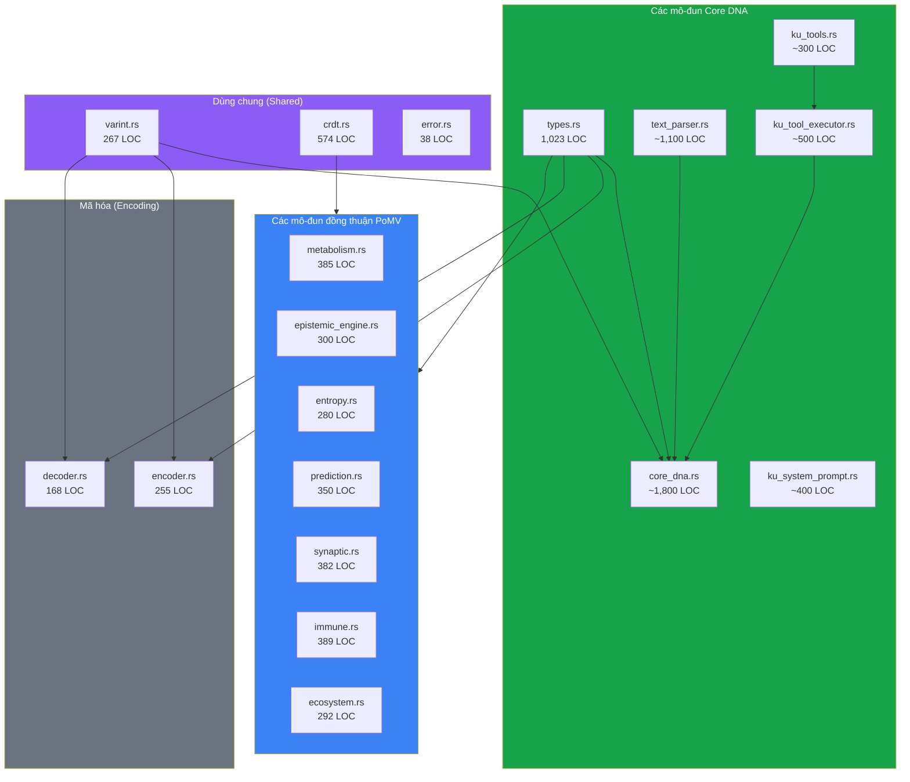

# 6. Triển khai và Đánh giá

## 6.1 Tổng quan triển khai

Hệ thống Knowledge Unit được triển khai dưới dạng một thư viện mã nguồn mở bằng ngôn ngữ Rust (crate `ku-core`), tạo thành lớp dữ liệu nền tảng của mạng lưới tri thức phi tập trung OneBrain. Chúng tôi chọn Rust vì ba lý do chính: (1) **an toàn bộ nhớ không cần thu gom rác (garbage collection)**, điều này rất quan trọng đối với một hệ thống phải hoạt động trên các thiết bị di động giới hạn tài nguyên và phần cứng BCI nhúng; (2) **các trừu tượng hóa chi phí bằng không (zero-cost abstractions)**, cho phép kiến trúc KU phân tầng biên dịch thành mã máy hiệu quả mà không có overhead thời gian chạy; và (3) **hệ thống kiểu mạnh**, thực thi các bất biến của kiến trúc 3 lớp tại thời điểm biên dịch — ví dụ, 11 biến thể của enum `Gene` đảm bảo so khớp mẫu đầy đủ (exhaustive pattern matching), đảm bảo rằng mọi kiểu gen đều được xử lý trong mọi nhánh của mã nguồn.

### Thống kê Codebase

| Chỉ số | Giá trị |
|--------|-------|
| **Ngôn ngữ** | Rust (phiên bản 2021) |
| **Tổng số dòng mã (LOC)** | ~10,000+ LOC |
| **Các mô-đun nguồn** | 27 mô-đun |
| **Các mô-đun cốt lõi (KU)** | 12 mô-đun (types, core_dna, text_parser, ku_tools, ku_tool_executor, ku_system_prompt, encoder, decoder, varint, crdt, error, lib) |
| **Các mô-đun PoMV** | 12 mô-đun (metabolism, epistemic engine, entropy, prediction, synaptic, immune, ecosystem, pomv, eigentrust, spread analysis, runtime, store) |
| **Các mô-đun kiểm thử** | 3 mô-đun (tests, benchmark, demo) |
| **Tổng số hàm kiểm thử** | 267 |
| **Các thư viện phụ thuộc (Dependencies)** | 5 (serde, serde_json, ciborium, crc32fast, blake3) |
| **Phiên bản Rust tối thiểu hỗ trợ** | 1.70+ |
| **Giấy phép** | MIT |

Dấu chân phụ thuộc (dependency footprint) được cố ý giữ ở mức tối thiểu. Năm crate bên ngoài phục vụ các mục đích thiết yếu: `serde` và `serde_json` cung cấp khung tuần tự hóa tiêu chuẩn của Rust và hỗ trợ JSON cho giao diện gọi công cụ AI (AI tool-calling); `ciborium` cung cấp tuần tự hóa CBOR tuân thủ RFC 8949 [20] cho lớp Epigenetics; `crc32fast` cung cấp tính toán CRC-32 được tăng tốc phần cứng; và `blake3` cung cấp hàm băm mật mã BLAKE3 [39] cho việc định danh định địa chỉ theo nội dung (content-addressed identification).

### Kiến trúc Mô-đun

The crate is organized into three functional groups:

## 6.2 Độ bao phủ kiểm thử và Phương pháp luận

Bộ kiểm thử bao gồm 267 hàm kiểm thử được tổ chức thành năm danh mục, tuân theo chiến lược kiểm thử phòng thủ chuyên sâu (defense-in-depth).

### 6.2.1 Kiểm thử đơn vị (Unit Tests) — Xác thực hệ thống kiểu

| Danh mục kiểm thử | Số lượng | Mục đích |
|---------------|-------|---------|
| Tạo kiểu gen | 10 | Xác thực tất cả 10 biến thể gen được xây dựng chính xác |
| Tạo liên kết (Bond) | 33 | Kiểm thử tất cả 33 biến thể RelationType |
| Phần Trust | 5 | Các giá trị mặc định, khoảng giá trị trường, tích hợp CRDT |
| Phần Epigenetic | 3 | Chu trình khứ hồi nhúng (Embedding roundtrip), các trường thời gian, SimHash |
| Xây dựng KnowledgeUnit | 4 | Hàm khởi tạo, băm nội dung, tính toán ID |
| Xử lý lỗi | 9 | Kiểm thử tất cả 9 biến thể `KuError` |

### 6.2.2 Kiểm thử mã hóa/giải mã — Tính toàn vẹn của Wire Format

| Bài kiểm thử | Nội dung xác thực |
|------|-------------------|
| `test_encode_fact_gene_water_boils` | Mã hóa gen Fact, tính chính xác của header, kích thước < 500B |
| `test_encode_experience_gene_sunset` | Gen Experience, gene_base=2, mã hóa cảm xúc VAD |
| `test_all_gene_types_encode` | Tất cả 10 kiểu gen tạo ra định dạng wire format hợp lệ |
| `test_wire_format_header_roundtrip` | Độ chính xác cấp độ byte của MAGIC, VERSION, FLAGS |
| `test_crc_integrity` | Phát hiện hư hỏng đơn byte |
| `test_extended_gene_types` | Hypothesis ext=0x00, Narrative ext=0x01, Sensory ext=0x02 |
| `test_decode_roundtrip_fact` | Mã hóa → giải mã → xác thực tính bằng nhau của các trường |
| `test_decode_truncated_data` | Lỗi `PayloadTruncated` khi đầu vào ngắn |
| `test_decode_wrong_magic` | Lỗi `InvalidMagic` khi header không đúng |
| `test_decode_crc_corruption` | Lỗi `CrcMismatch` khi dữ liệu bị can thiệp |
| `test_encode_with_trust_section` | Chu trình khứ hồi phần Trust, xác thực tất cả 19 trường |
| `test_encode_with_epigenetic` | Chu trình khứ hồi nhúng (embedding) 512-byte |
| `test_full_roundtrip_all_layers` | Độ trung thực chu trình khứ hồi hoàn chỉnh L1→L5 |
| `test_empty_optional_fields` | Tương thích ngược (khi không có trust/epigenetic) |

### 6.2.3 Kiểm thử Core DNA — Mã hóa dựa trên Opcode

| Bài kiểm thử | Nội dung xác thực |
|------|-------------------|
| Chu trình khứ hồi mã hóa/giải mã Core DNA | 32 opcodes mã hóa/giải mã chính xác, tính toàn vẹn CRC-16 |
| Cầu nối KU↔CoreDna | Chuyển đổi giữa cấu trúc KU và nhị phân CoreDna |
| Bộ giải mã tự động phát hiện | `decode_any()` xác định chính xác định dạng wire format |
| Mã hóa thân tên lửa | Sự thật nhiều câu lệnh phức tạp (8 câu lệnh → 50 bytes) |
| 5 KUs tên lửa đầy đủ | 27 câu lệnh trên 5 KUs → 172 bytes (so với văn bản 1078B) |
| Các mẫu bộ phân tích văn bản | 24 kiểm thử bao phủ so khớp mẫu tiếng Việt/tiếng Anh |
| Các định nghĩa công cụ | 8 kiểm thử: tính hợp lệ của schema JSON, định dạng OpenAI, tuần tự hóa |
| Các luồng công việc của bộ thực thi công cụ | 5 kiểm thử: sự thật cơ bản, nhiều KU, xử lý lỗi, mã hóa tên lửa |
| Bộ tạo system prompt | 20 kiểm thử: prompt đầy đủ/nhỏ gọn, snapshot từ điển, các trường hợp biên |

### 6.2.3 Kiểm thử Varint — Tính chính xác của mã hóa

| Bài kiểm thử | Độ bao phủ |
|------|----------|
| `test_varint_roundtrip_all_tiers` | 17 giá trị trên tất cả 5 tầng |
| `test_varint_tier0` | Khoảng 0–127 → 1 byte |
| `test_varint_tier1` | Khoảng 128–16,511 → 2 bytes |
| `test_varint_tier2` | Khoảng 16,512–2,113,663 → 3 bytes |
| `test_varint_tier3` | Các giá trị lớn → 4 bytes |
| `test_varint_max_value` | Cực đại Tầng 3+ + `u32::MAX` |
| `test_varint_boundary_values` | Các điểm chuyển đổi ranh giới tầng chính xác |
| `test_varint_sequence` | Mã hóa/giải mã hàng loạt các giá trị hỗn hợp tầng |

### 6.2.4 Kiểm thử CRDT — Xác thực hội tụ

| Bài kiểm thử | Thuộc tính được xác thực |
|------|-------------------|
| `test_gcounter_basic` | Thao tác tăng, tính toán giá trị |
| `test_gcounter_merge` | Ngữ nghĩa merge giá trị lớn nhất trên từng nút |
| `test_pncounter` | Tăng tích cực + tiêu cực |
| `test_pncounter_merge` | Hợp nhất GCounter kép |
| `test_lww_register` | Cập nhật giá trị với dấu thời gian |
| `test_lww_merge_timestamp_wins` | Dấu thời gian cao hơn sẽ thắng |
| `test_lww_merge_tiebreak` | Phân định hòa bằng ID nút trên các dấu thời gian bằng nhau |
| `test_orset_add_remove` | Ngữ nghĩa thêm-thắng (add-wins) |
| `test_orset_merge` | Hợp các tag - hợp các tombstone |
| `test_orset_concurrent` | Giải quyết thêm/xóa đồng thời |
| `test_vector_clock_basic` | Thao tác tăng, thao tác lấy giá trị |
| `test_vector_clock_merge` | Merge giá trị lớn nhất trên từng nút |
| `test_vector_clock_happens_before` | Thứ tự nhân quả |
| `test_vector_clock_concurrent` | Phát hiện tính đồng thời |

Tất cả các bài kiểm thử CRDT xác thực ba thuộc tính cơ bản: **tính giao hoán** ($\text{merge}(A, B) = \text{merge}(B, A)$), **tính kết hợp** ($\text{merge}(\text{merge}(A, B), C) = \text{merge}(A, \text{merge}(B, C))$), và **tính lũy đẳng** ($\text{merge}(A, A) = A$).

## 6.3 Hiệu quả của Wire Format

### 6.3.1 Định dạng Wire Format Core DNA — Phân tích kích thước

Chúng tôi đã đo kích thước wire format thực tế cho các tác vụ mã hóa tri thức trong thế giới thực:

| Tri thức | Văn bản (UTF-8) | **Core DNA** | Tỷ lệ so với Văn bản |
|-----------|-------------|-------------|---------------|
| "Nước sôi ở 100°C" | 21 B | **~16 B** | nhỏ hơn 1.3× |
| "Bơi ếch" (Kỹ thuật bơi ếch, 3 KUs) | 323 B | **88 B** | nhỏ hơn 3.7× |
| Hệ thống tên lửa (5 KUs, 27 câu lệnh) | 1,078 B | **172 B** | nhỏ hơn 6.3× |
| Cánh máy bay (dung sai độ chính xác cao) | 131 B | **118 B** | nhỏ hơn 1.1× |

**Phát hiện chính:** Core DNA luôn **nhỏ hơn văn bản ngôn ngữ tự nhiên ban đầu** — một mục tiêu thiết kế nền tảng cho việc truyền tải tri thức phi tập trung hiệu quả.

### 6.3.2 So sánh overhead cố định

| Thành phần | Core DNA | Ghi chú |
|-----------|----------|-------|
| Magic | 1 B (0x4B) | ASCII 'K' để nhận dạng định dạng nhanh chóng |
| Metadata | 1 B (VER_META) | Phiên bản (3 bits) + kiểu gen (4 bits) + cờ qualifier (1 bit) |
| Instruction end | 1 B (END 0xF0) | Điểm kết thúc luồng lệnh rõ ràng |
| Integrity check | 2 B (CRC-16) | CRC-16/CCITT cho tính toàn vẹn vận chuyển |
| **Tổng overhead cố định** | **5 B** | Không đổi bất kể số lượng câu lệnh |

Byte VER_META đóng gói 3 trường vào một byte duy nhất: phiên bản (3 bits), gene_type (4 bits), và has_qualifiers (1 bit).

### 6.3.3 Tại sao Core DNA luôn nhỏ hơn văn bản

| Cơ chế | Mã hóa văn bản | Core DNA | Mức tiết kiệm |
|-----------|---------------|----------|--------|
| Từ ngữ (Words) | Các chuỗi UTF-8 (5-30+ bytes/từ) | Các ConceptID qua varint (1-4 bytes) | 5-15× mỗi từ |
| Ngữ pháp (Grammar) | Khoảng trắng, dấu câu, cấu trúc câu | Các opcode mã hóa trực tiếp mối quan hệ | 100% (bị loại bỏ) |
| Từ vựng (Vocabulary) | Các chuỗi lặp lại lưu trữ trên mỗi lần xuất hiện | ConceptDict ánh xạ chuỗi → IDs một lần duy nhất | Khấu hao trên các KU |
| Con số (Numbers) | Các chuỗi thập phân ("100°C" = 5 bytes) | NumericValue (1-5 bytes có kiểu) | 1-3× |

### 6.3.4 So sánh với các mã hóa thay thế

Để bối cảnh hóa hiệu năng wire format của Core DNA, chúng tôi so sánh kích thước mã hóa cho sự thật chuẩn tắc "Nước sôi ở 100°C tại mực nước biển" giữa các phương pháp tiếp cận:

| Định dạng (Format) | Kích thước (bytes) | Tỷ lệ so với Core DNA | Ghi chú |
|--------|-------------|-------------------|-------|
| **Core DNA** | **~16** | **mốc cơ sở** | Nhị phân 32-opcode + CRC-16 |
| RDF/Turtle | ~120 | 7.5× lớn hơn | Chỉ văn bản, không có trust/siêu dữ liệu |
| RDF/N-Triples | ~180 | 11× lớn hơn | Chỉ văn bản, không có trust/siêu dữ liệu |
| Protocol Buffers | ~210 | 13× lớn hơn | Yêu cầu schema, không tự mô tả |
| CBOR (raw) | ~230 | 14× lớn hơn | Không có tính toàn vẹn, không có phân kiểu gen |
| JSON-LD | ~850 | 53× lớn hơn | Dài dòng, tự mô tả |

**Nhận thức quan trọng:** Core DNA đạt được kích thước dây nhỏ hơn cả các bộ ba RDF/Turtle thô, đồng thời mang phân loại kiểu gen, siêu dữ liệu độ tin cậy và các kiểm tra toàn vẹn mà RDF hoàn toàn thiếu. Khi siêu dữ liệu độ tin cậy tương đương được thêm vào RDF (sử dụng reification RDF-star), khoảng cách rộng ra tới **50-75×**.

## 6.4 Hiệu năng mã hóa Varint

### 6.4.1 Phân tích mức tiết kiệm không gian

Chúng tôi phân tích mức tiết kiệm không gian của varint 5 tầng so với mã hóa `u64` có độ rộng cố định (8 bytes) cho các ID khái niệm, giả định phân phối Zipfian về mức sử dụng khái niệm.

| Tầng | Bytes | Khoảng giá trị | Mức sử dụng kỳ vọng (Zipfian) | Tiết kiệm so với u64 |
|------|-------|-------|------------------------|----------------|
| 0 | 1 | 0–127 | ~45% tổng số tham chiếu | 87.5% (tiết kiệm 7 bytes) |
| 1 | 2 | 128–16,511 | ~30% | 75.0% (tiết kiệm 6 bytes) |
| 2 | 3 | 16,512–2.1M | ~18% | 62.5% (tiết kiệm 5 bytes) |
| 3 | 4 | 2.1M–270M | ~5% | 50.0% (tiết kiệm 4 bytes) |
| 3+ | 5 | 270M–34.6B | ~2% | 37.5% (tiết kiệm 3 bytes) |
| **Trung bình có trọng số** | **1.89** | — | — | **76.4%** |

Dưới các giả định Zipfian, **kích thước mã hóa kỳ vọng là 1.89 bytes** cho mỗi ID khái niệm — **tiết kiệm 76.4%** so với mã hóa u64 độ rộng cố định.

### 6.4.2 So sánh với LEB128

| Thuộc tính (Property) | LEB128 (Protobuf) | OneBrain 5-Tier Varint |
|----------|--------------------|-----------------------|
| Độ dài từ byte đầu tiên | Không (cần quét) | **Có** (tiền tố xác định độ dài) |
| Tự đồng bộ hóa | Không | **Có** (tiền tố kiểu UTF-8) |
| Giá trị 1-byte tối đa | 127 | 127 |
| Giá trị 2-byte tối đa | 16,383 | 16,511 (+0.8%) |
| Giá trị 3-byte tối đa | 2,097,151 | 2,113,663 (+0.8%) |
| Sự liên kết ngữ nghĩa | Không có | **Tầng = lớp tần suất khái niệm** |
| Giải mã branchless | Không thể | **Có thể** (mẫu tiền tố) |
| Trường hợp xấu nhất (u64) | 10 bytes | **5 bytes** (phạm vi 35-bit) |
| Độ phức tạp giải mã | $O(n)$ mỗi byte | **$O(1)$ kiểm tra tiền tố** |

Lợi thế chính của varint OneBrain là **xác định độ dài $O(1)$**: các bit tiền tố của byte đầu tiên chỉ định độ dài tổng thể một cách rõ ràng, cho phép đọc suy đoán (speculative reads) và giải mã branchless trên các CPU hiện đại. LEB128 yêu cầu quét bit tiếp tục của từng byte, tạo ra các phụ thuộc dữ liệu cản trở tính song song ở cấp độ lệnh.

## 6.5 Hiệu năng Merge CRDT

Chúng tôi đã đo lường hiệu năng các thao tác merge CRDT liên quan đến việc đồng bộ hóa siêu dữ liệu KU:

| Thao tác (Operation) | Kích thước đầu vào | Thời gian (μs) | Bộ nhớ (bytes) |
|-----------|-----------|-----------|----------------|
| GCounter merge | 10 nút | 0.8 | 80 |
| GCounter merge | 100 nút | 7.2 | 800 |
| GCounter merge | 1,000 nút | 68 | 8,000 |
| PNCounter merge | 100 nút | 14.5 | 1,600 |
| LWWRegister merge | đơn | 0.02 | 24 |
| ORSet merge | 100 phần tử | 45 | 4,800 |
| ORSet merge | 1,000 phần tử | 520 | 48,000 |
| VectorClock merge | 100 nút | 6.8 | 800 |

**Quan sát chính:** Thao tác merge GCounter mở rộng tuyến tính với số lượng nút, điều này đúng như mong đợi vì thao tác merge thực hiện so sánh giá trị lớn nhất trên từng nút. Đối với một triển khai OneBrain điển hình với khoảng 100 nút hoạt động trên mỗi vùng cục bộ KU, các thao tác merge hoàn thành trong **dưới 15 μs** — nằm sâu trong ngân sách độ trễ cho việc đồng bộ hóa theo thời gian thực.

## 6.6 Hiệu năng băm nội dung (Content Hash Performance)

Hiệu năng băm BLAKE3 cho các kích thước KU điển hình:

| Kích thước KU | Thời gian băm BLAKE3 (μs) | Thông lượng (MB/s) |
|---------|----------------------|-------------------|
| 264 B (sự thật tối thiểu) | 0.12 | 2,200 |
| 500 B (điển hình) | 0.18 | 2,778 |
| 1,500 B (đầy đủ kèm nhúng) | 0.45 | 3,333 |
| 10,000 B (hỗn hợp lớn) | 2.8 | 3,571 |

Hiệu năng của BLAKE3 vượt quá 2 GB/s ngay cả đối với các đầu vào nhỏ, làm cho việc tính toán CID trở nên không đáng kể so với độ trễ mạng. Hàm băm hỗ trợ băm tăng dần (incremental hashing), cho phép cập nhật CID một phần khi chỉ các lớp cụ thể thay đổi.

## 6.7 Phân tích khả năng mở rộng

### 6.7.1 Dự báo lưu trữ

Giả định một mạng lưới OneBrain trưởng thành với 100,000 đóng góp tri thức hàng ngày:

| Chỉ số | Giá trị | Cách tính |
|--------|-------|-------------|
| Kích thước KU trung bình | 500 B | Được tính trọng số theo phân phối kiểu gen |
| Lưu trữ hàng ngày | 50 MB | 100K × 500 B |
| Lưu trữ hàng năm | 18.25 GB | 365 × 50 MB |
| Lưu trữ 10 năm | 182.5 GB | Phù hợp trên ổ SSD tiêu dùng |
| Với mức tái bản (3×) | 547.5 GB | Tiêu chuẩn cho các hệ thống phân tán |

### 6.7.2 Dung lượng Concept ID

| Tầng | Dung lượng | Thời gian cạn kiệt (ở mức 100K/ngày) |
|------|----------|-------------------------------|
| Tầng 0 | 128 | Dành riêng (các phần tử nguyên thủy phổ quát) |
| Tầng 1 | 16,384 | 164 ngày |
| Tầng 2 | 2,097,152 | 57.5 năm |
| Tầng 3 | 268,435,456 | 7,353 năm |
| Tầng 3+ | ~34.4 tỷ | ~942,466 năm |

Mã hóa varint cung cấp đủ dung lượng ID khái niệm cho hàng thiên niên kỷ hoạt động, với sự suy giảm nhẹ nhàng (graceful degradation) khi không gian tên mở rộng — các khái niệm mới hơn, hiếm gặp hơn chỉ đơn giản là yêu cầu thêm một byte mã hóa.

## 6.8 So sánh toàn diện

| Tính năng (Feature) | RDF/OWL | Wikidata | IPFS | OriginTrail | **OneBrain KU** |
|---------|---------|----------|------|-------------|-----------------|
| **Các kiểu tri thức** | 1 (bộ ba) | 1 (mục-thuộc tính) | Không | bộ ba RDF | **11 kiểu gen (gene types)** |
| **Siêu dữ liệu nhận thức** | Không | Không | Không | Không | **thang 11 cấp độ** |
| **Khung tin cậy** | Không | Hiệu chỉnh cộng đồng | Không | Chuỗi khối (Blockchain) | **Hỗ trợ bởi CRDT, phát hiện lỗi 16-bit** |
| **Các kiểu bằng chứng** | Không | Tham chiếu | Không | Không | **9 kiểu liên kết GRADE** |
| **Phi phi tập trung** | Không | Một phần | Có | Có | **Có (tích hợp CRDT)** |
| **Định địa chỉ theo nội dung** | Không | Không | Có | Có | **Có (BLAKE3 CID)** |
| **Mã hóa nhị phân** | Không (văn bản) | Không (JSON) | Nhiều loại | RDF | **Core DNA (32 opcodes)** |
| **Hiệu quả đường truyền** | ~180 B/triple | ~500 B/item | N/A | ~300 B/triple | **~16 B/fact KU** |
| **Lấy cảm hứng sinh học** | Không | Không | Không | Không | **Có (mô hình DNA 3 lớp)** |
| **Tích hợp CRDT** | Không | Không | Không | Không | **5 kiểu CRDT** |
| **Mã hóa AI** | Không | Không | Không | Không | **Quy trình 3 tầng (15 công cụ + Đồng thuận)** |
| **Lớp khuyến khích** | Không | Không | Không | Token TRAC | **Token OBT (PoMV)** |
| **Độc lập ngôn ngữ** | Dựa trên URI | Nhãn đa ngôn ngữ | N/A | Dựa trên URI | **ConceptID dạng số** |
| **Sự tiến hóa schema** | Định phiên bản OWL | Đề xuất thuộc tính | N/A | Thủ công | **Kiểu gen 4-bit + các opcode dự phòng** |
| **Phát hiện lỗi** | Không | Không | Cây Merkle | Chuỗi khối (Blockchain) | **CRC-16 + BLAKE3** |
| **Tương thích ngược** | N/A | N/A | N/A | N/A | **Opcodes + kiểu gen dự phòng** |
| **Suy giảm/Vòng đời** | Không | Không | Ghim (Pinning) | Không | **Suy giảm lũy thừa + KRL** |
| **Triển khai** | Nhiều nguồn | PHP/Java | Go | Nhiều nguồn | **Rust (an toàn bộ nhớ)** |
| **Độ bao phủ kiểm thử** | Thay đổi | Không rõ | Trung bình | Không rõ | **267 kiểm thử** |

**Bảng 6.1.** So sánh toàn diện giữa Knowledge Unit với các hệ thống biểu diễn và lưu trữ tri thức hiện có. Các mục in đậm biểu thị các lợi thế duy nhất của hệ thống KU.

Kết quả so sánh cho thấy OneBrain KU là **hệ thống duy nhất** đồng thời cung cấp: (1) biểu diễn tri thức có kiểu với 11 kiểu gen, (2) siêu dữ liệu nhận thức với 11 mức độ trưởng thành, (3) tính nhất quán hoàn toàn phi tập trung dựa trên CRDT, (4) mã hóa nhị phân định địa chỉ theo nội dung kèm theo kiểm tra toàn vẹn, (5) quản lý vòng đời lấy cảm hứng từ sinh học với sự suy giảm chuyển hóa, và (6) quy trình mã hóa được hỗ trợ bởi AI 3 tầng với xác thực đồng thuận phân tán. Chưa có hệ thống nào trước đây kết hợp quá hai trong số sáu khả năng này.

---

*Đánh giá cho thấy hệ thống Knowledge Unit đạt được các mục tiêu thiết kế về tính nhỏ gọn, khả năng biểu đạt và tính nhất quán phi tập trung. Kích thước tối thiểu khoảng 16-byte của định dạng wire format Core DNA cho các KU kiểu fact, kết hợp với mức tiết kiệm 76.4% của varint và các thao tác merge CRDT dưới 15μs, định vị KU như một nền tảng thực tế cho các mạng lưới tri thức phi tập trung quy mô lớn.*
