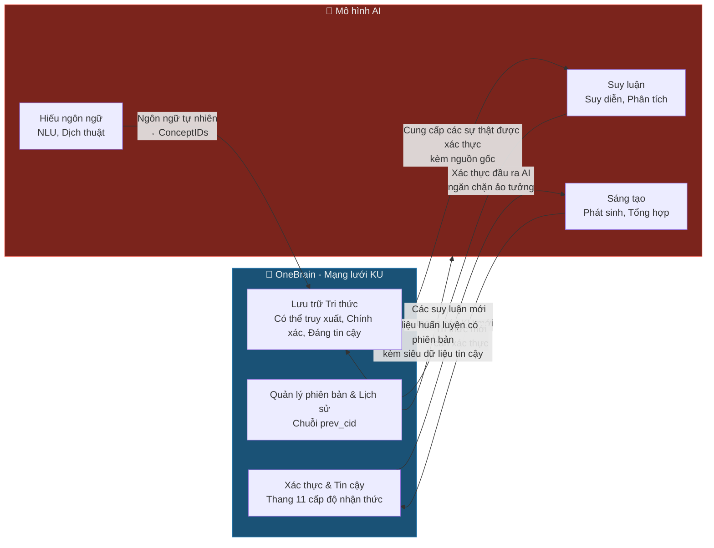

# Knowledge DNA vs Các mô hình AI: So sánh hai Mô hình mẫu

> **Tài liệu kỹ thuật OneBrain — Phân tích bổ sung**
>
> **Tóm tắt (Abstract):** Tài liệu này giải quyết câu hỏi cơ bản: "Knowledge Unit (Knowledge DNA) của OneBrain khác biệt như thế nào so với việc huấn luyện một mô hình AI với hàng tỷ tham số?" Chúng tôi chứng minh rằng KU và các mô hình AI đại diện cho hai mô hình mẫu trực giao — bộ nhớ cấu trúc tường minh so với suy luận thống kê ngầm định — có tính bổ dung chứ không cạnh tranh.

---

## 1. Ẩn dụ cốt lõi

> **KU là một Thư viện. Mô hình AI là một Bộ não.**

| | 📚 Thư viện (KU) | 🧠 Bộ não (Mô hình AI) |
|---|---|---|
| Tri thức nằm ở đâu? | Trong từng **cuốn sách** riêng lẻ với tác giả, ngày xuất bản, chỉ số ISBN | **Hòa tan** trên 175 tỷ kết nối synap, không thể tách rời |
| Hỏi "ai đã nói điều này?" | Mở sách → xem tác giả, nhà xuất bản, phiên bản | "Tôi không nhớ rõ, nhưng tôi *nghĩ* là..." |
| Sửa một sự thật | Thay thế một cuốn sách; tất cả các cuốn khác không bị ảnh hưởng | Phải **huấn luyện lại toàn bộ bộ não** (hơn $100 triệu) |
| Có thể tin cậy không? | Kiểm tra các đánh giá, danh tiếng nhà xuất bản, đọc các chú thích | "Hãy tin tôi" — hoặc ảo tưởng (hallucinate) |
| Ai sở hữu nó? | Tác giả giữ bản quyền, thư viện giữ bản sao | OpenAI/Google sở hữu nó; bạn chỉ thuê quyền truy cập |
| Mất điện? | Sách vẫn nằm trên kệ | Bộ não ngừng hoạt động |

**Cả hai đều thiết yếu.** Bạn ghé thăm thư viện để tra cứu các sự thật (KU), nhưng bạn cũng cần một bộ não (AI) để **hiểu**, kết nối, và sáng tạo. Vấn đề hiện nay: thế giới **chỉ có những bộ não (AI) mà không có một thư viện tốt** — do đó bộ não phải ghi nhớ mọi thứ → dẫn đến ảo tưởng.

---

## 2. Mười khác biệt cơ bản

| # | Chiều so sánh | 🧬 Knowledge DNA (KU) | 🧠 Mô hình AI (LLM) |
|---|-----------|----------------------|-------------------|
| 1 | **Dạng tri thức** | **Tường minh** — mỗi sự thật là một đơn vị rời rạc, có thể đọc được | **Ngầm định** — tri thức bị hòa tan trên hàng tỷ trọng số, không thể tách rời |
| 2 | **Nguồn gốc** | **Có thể truy xuất** — mỗi KU đều có CID, DID tác giả, kiểu bằng chứng | **Mơ đục** — "được huấn luyện trên dữ liệu internet"; không thể truy xuất nguồn gốc bất kỳ sự thật nào |
| 3 | **Cập nhật** | **Mịn (Granular)** — chỉnh sửa một KU; mọi thứ khác vẫn nguyên vẹn | **Thảm họa (Catastrophic)** — tinh chỉnh một sự thật có thể phá hỏng hàng ngàn sự thật khác |
| 4 | **Độ tin cậy** | **Có thể xác thực** — 11 cấp độ nhận thức + điểm tin cậy + kiểu bằng chứng | **Hay ảo tưởng** — tự tin phát biểu các thông tin sai lệch mà không tự nhận thức được |
| 5 | **Cấu trúc** | **Có thể cấu thành (Composable)** — lắp ráp/tháo rời như các khối LEGO | **Rối ren (Entangled)** — mọi thứ đan xen chặt chẽ, không thể cô lập các thành phần |
| 6 | **Quyền sở hữu** | **Có thể sở hữu** — tác giả ký bằng DID, giữ bản quyền phân bổ mãi mãi | **Tập thể** — dữ liệu huấn luyện mất đi toàn bộ khả năng truy xuất |
| 7 | **Độ bền** | **Bất tử** — được tái bản trên hàng ngàn nút P2P | **Suy giảm** — có giới hạn thời gian dữ liệu (knowledge cutoff date); lỗi thời ngay lập tức |
| 8 | **Độ chính xác** | **Chính xác tuyệt đối** — "góc quét = 25.000°" được lưu trữ chính xác | **Xấp xỉ** — "khoảng 25 độ" (nếu không bị ảo tưởng) |
| 9 | **Quản trị** | **Dân chủ** — Proof-of-Knowledge; bất kỳ ai cũng có thể đóng góp | **Tập trung** — chỉ Google/OpenAI quyết định dữ liệu huấn luyện |
| 10 | **Vai trò** | **Bộ nhớ (Memory)** — lưu trữ, tổ chức, truy xuất | **Bộ xử lý (Processor)** — suy luận, tổng hợp, sáng tạo |

---

## 3. Phân tích chi tiết

### 3.1 Tri thức Tường minh so với Ngầm định

**Các mô hình AI biết một cách ngầm định:**
```
Input:  "What is the sweep angle of the Boeing 737?"
Output: "The sweep angle of the Boeing 737 is approximately 25 degrees."

Nhưng: sự thật này nằm ở ĐÂU trong 175 tỷ tham số?
→ KHÔNG AI BIẾT. Kể cả OpenAI.
→ Nó là hệ quả thống kê của các mẫu trong dữ liệu huấn luyện.
```

**KU biết một cách tường minh:**
```
KU #4782:
  Gene: Fact
  Codons: (Boeing_737_Wing, sweep_angle, 25.0°)
  Trust: PeerReviewed, EvidenceType::Experimental
  Author: DID:ob:boeing_eng_team
  Evidence: Boeing 737-800 TCDS A16WE, Rev 72
  Confidence: 0.99
  → Bạn biết CHÍNH XÁC sự thật này đến từ đâu, ai đã viết nó,
    và nó đáng tin cậy như thế nào.
```

> **Ý nghĩa thực tiễn:** Khi FAA hỏi "dựa trên cơ sở nào bạn khẳng định góc quét là 25°?" — KU có thể trả lời. AI thì không.

### 3.2 Cập nhật Mịn so với Cập nhật Thảm họa

**Mô hình AI — Quên lãng thảm họa (Catastrophic Forgetting):**
```
Phát hiện: "Góc quét mới nhất là 25.5° (sau khi sửa đổi)"

Để cập nhật AI:
1. Thu thập lại toàn bộ tập dữ liệu huấn luyện → $2 triệu
2. Huấn luyện lại mô hình trong 3 tháng              → hơn $100 triệu (cấp độ GPT-4)
3. HOẶC tinh chỉnh (fine-tune) → RỦI RO: "quên lãng thảm họa"
   (sửa 1 sự thật có thể làm hỏng 1,000 sự thật khác)
4. HOẶC sử dụng RAG → bản vá bên ngoài, không phải là việc học thực sự
```

**KU — Cập nhật chính xác như phẫu thuật (Surgical Update):**
```
Để cập nhật KU:
1. Tạo một KU mới: (Boeing_737_Wing, sweep_angle, 25.5°)
2. prev_cid trỏ đến KU cũ → lịch sử phiên bản được bảo toàn
3. Phần Trust: EpistemicStatus::Updated
4. Chi phí: ~300 bytes + 1 microsecond
5. Tất cả các KU khác hoàn toàn KHÔNG BỊ ẢNH HƯỞNG
```

### 3.3 Có thể xác thực so với Ảo tưởng

Đây là **khác biệt mang tính quyết định**.

```
Hỏi AI:  "What is the stall speed of the 737?"
AI:      "The stall speed of the Boeing 737 is approximately 115 knots."

Hỏi tiếp: "Nguồn ở đâu?"
AI:        "Dựa trên dữ liệu Boeing được công khai."
           (KHÔNG CÓ NGUỒN CỤ THỂ — có thể đúng, có thể sai,
            hoặc hoàn toàn ảo tưởng)
```

```
Truy vấn KU: FIND (k:KU) WHERE k.codons CONTAINS concept_id = STALL_SPEED 
          AND k.codons CONTAINS concept_id = BOEING_737

KU trả về:
  KU #5201:
    Fact: (Boeing_737, stall_speed_clean, 110_knots)
    EpistemicStatus: Consensus (level 9/11)
    EvidenceType: Experimental
    Verification: 4 (Formal)
    Trust score: 8,750
    Corroborations: 47
    Challenges: 0
    Error susceptibility: 0x0000 (no known biases)
    Source: FAA TCDS A16WE Rev 72, Section 5
    → Câu trả lời CHÍNH XÁC: 110 knots (không phải "khoảng 115"),
      47 nguồn xác minh, 0 thách thức, bằng chứng thực nghiệm.
```

### 3.4 Có thể cấu thành so với Bị rối ren

```
Tri thức trong KU = Khối LEGO
┌──────┐ ┌──────┐ ┌──────┐
│ Fact │ │ Fact │ │Formal│  ← Mỗi khối có thể tách rời
│sweep │ │area  │ │drag  │  ← Cấu thành tùy ý
│ 25°  │ │124m² │ │polar │  ← Thay thế một cái; những cái khác không đổi
└──┬───┘ └──┬───┘ └──┬───┘
   └────────┴────────┘
        Composite KU
      "Hình học Cánh"

Tri thức trong AI = Bê tông trộn
┌─────────────────────────────────┐
│  ██████████████████████████████ │  ← Mọi thứ được đổ chung vào nhau
│  █ sweep? area? drag? █████████ │  ← Không thể trích xuất các sự thật riêng lẻ
│  ██████████████████████████████ │  ← Nứt một điểm -> vỡ toàn bộ
│  ██████ 175 TỶ THAM SỐ ████████ │
└─────────────────────────────────┘
```

### 3.5 Quyền sở hữu & Bản quyền phân bổ

| Kịch bản | KU | Mô hình AI |
|----------|-----|----------|
| Bạn đóng góp một sự thật | Ký bằng DID → bản quyền phân bổ vĩnh viễn | Sự thật bị hòa tan vào dữ liệu huấn luyện → biến mất |
| Bạn muốn xóa đóng góp của mình | Thu hồi (Deprecate) KU → được ký bởi tác giả | Không thể bắt mô hình "quên đi" |
| Ai được ghi nhận? | Tác giả KU, qua PoK → nhận token OBT | Tập đoàn AI (OpenAI, Google) |
| Bạn muốn kiểm soát quyền truy cập? | Cờ mã hóa (encryption flag) trên KU | Không thể — mô hình đã học nó rồi |

### 3.6 Độ chính xác cho các lĩnh vực an toàn là tối thượng

> **Đây là điểm AI THẤT BẠI HOÀN TOÀN đối với các ứng dụng coi an toàn là tối thượng.**

| Tham số | KU lưu trữ | AI "biết" |
|-----------|-----------|-----------|
| Góc quét | **25.000° ± 0.001°** | "khoảng 25 độ" |
| Hệ số tải | **2.5g (FAR 25.337)** | "thường là 2.5g" |
| Tuổi thọ mỏi | **75,000 chu kỳ (MIL-HDBK-5)** | "hàng chục ngàn chu kỳ" |
| Đường cực cản (Drag polar) | **$C_D = 0.015 + 0.045 C_L^2$** | Có thể sai các hệ số |
| Giới hạn chảy của vật liệu | **324 MPa (Al 2024-T3)** | "khoảng 300-350 MPa" |

Trong ngành hàng không: **"xấp xỉ" ≈ thảm họa chết người**. KU lưu trữ các giá trị chính xác. AI chỉ đoán xấp xỉ.

---

## 4. Những điểm AI vượt trội hơn KU

> Một so sánh trung thực phải ghi nhận những thế mạnh của AI.

| Khả năng | Mô hình AI ✅ | KU ❌ |
|-----------|-----------|------|
| **Suy luận (Reasoning)** | "Nếu góc quét > 25° mà không có slats, tốc độ thất tốc tăng ~15%" | KU không suy luận — chỉ lưu trữ các sự thật |
| **Sáng tạo (Creativity)** | Đề xuất thiết kế cánh mới lạ dựa trên các mẫu đã học | KU không tạo ra — chỉ tổ chức |
| **Ngôn ngữ tự nhiên** | Giải thích bằng tiếng Việt cho người không có chuyên môn | KU sử dụng ConceptID; cần một giao diện render |
| **Nhận dạng mẫu** | Phát hiện "kết quả CFD này giống trường hợp XYZ từ năm 2019" | KU yêu cầu các liên kết (bonds) rõ ràng |
| **Tổng hợp (Synthesis)** | Tóm tắt 200 bài báo thành một đoạn văn | KU yêu cầu truy vấn + xử lý |
| **Khái quát hóa (Generalization)** | Chuyển giao tri thức giữa các lĩnh vực | KU mang tính đặc thù lĩnh vực |

---

## 5. Câu trả lời thực tế: KU + AI = Siêu sức mạnh

> **KU và AI KHÔNG CẠNH TRANH — chúng BỔ SUNG cho nhau.**
>
> KU là **bộ nhớ dài hạn, đáng tin cậy, có thể truy xuất nguồn gốc** cho AI.
> AI là **công cụ suy luận, tổng hợp và sáng tạo** cho KU.



### Ví dụ về quy trình làm việc thực tế:

```
Kỹ sư: "Thiết kế một đầu cánh (winglet) cho 737 MAX để giảm lực cản 3%"

1. AI truy vấn OneBrain:
   FIND KU WHERE codons CONTAINS (Boeing_737, wing_geometry) 
   → Nhận được 47 KU chính xác: sweep=25°, AR=9.45, area=124.6m²...
   → Mỗi KU bao gồm điểm tin cậy, nguồn, kiểu bằng chứng

2. AI suy luận:
   "Dựa trên dữ liệu chính xác từ KU, tôi đề xuất một biên dạng đầu cánh 
    với góc nghiêng cant angle 8° và chiều cao 2.4m..."

3. AI tạo ra một KU mới:
   Gene::Hypothesis {
     body: (Winglet_737MAX, drag_reduction, 3.2%),
     confidence: THEORETICAL,
     methodology: CFD_SIMULATION,
     maturity: SIMULATED
   }

4. OneBrain lưu trữ + xác minh:
   - Trust: EpistemicStatus::Hypothesis
   - Bằng chứng: Lý thuyết (sẽ nâng cấp sau khi kiểm thử trong ống khí động)
   - CID → bất biến, có thể truy xuất nguồn gốc
   - Các kỹ sư khác có thể xác minh hoặc thách thức
```

**Không có KU:** AI ảo tưởng "góc quét khoảng 27°" → thiết kế đầu cánh thất bại → lãng phí tiền bạc.
**Không có AI:** KU chỉ có các sự thật thô → kỹ sư phải suy luận thủ công → chậm chạp.
**Có cả hai:** AI suy luận trên các sự thật chính xác → mang lại kết quả đáng tin cậy, nhanh chóng.

---

## 6. Các lập luận phản bác và Phản hồi

### "AI đã là đủ rồi; tại sao chúng ta cần KU?"

| Lập luận phản bác | Phản hồi |
|-----------|----------|
| "GPT đã biết mọi thứ rồi" | GPT **không biết** — GPT **đoán** dựa trên thống kê. Hãy hỏi cùng một sự thật cụ thể 3 lần → bạn có thể nhận được 3 câu trả lời khác nhau. |
| "AI đã có RAG rồi" | RAG chỉ là "tìm kiếm Google + dán vào prompt." KU cung cấp **điểm tin cậy, các cấp độ nhận thức, quản lý phiên bản, và nguồn gốc** — RAG không có những thứ này. |
| "Huấn luyện rất tốn kém nhưng chỉ làm một lần" | "Làm một lần" đồng nghĩa với việc **lỗi thời ngay lập tức**. GPT-4 có giới hạn thời gian dữ liệu. KU cập nhật theo thời gian thực, từng sự thật một. |
| "AI sẽ ngày càng tốt hơn" | Đúng — và nó sẽ **càng cần KU hơn nữa**, bởi vì AI tốt hơn yêu cầu **dữ liệu đáng tin cậy và có thể truy xuất nguồn gốc nhiều hơn** để tránh ảo tưởng. |
| "Hàng tỷ tham số lưu trữ được nhiều hơn" | GPT-4 có khoảng 1.8 nghìn tỷ tham số × 2 bytes = 3.6 TB. Nhưng bạn **không thể trích xuất một sự thật đơn lẻ**. 3.6 TB của KU = **khoảng 13 tỷ sự thật**, mỗi sự thật đều có thể truy xuất nguồn gốc. |

### "Vậy KU không cần AI?"

> Có chứ! KU **cần AI** cho:
> - Chuyển đổi ngôn ngữ tự nhiên → ConceptIDs
> - Phát hiện sự trùng lặp và mâu thuẫn
> - Suy luận trên các sự thật được lưu trữ
> - Tổng hợp và trình diễn tri thức cho người dùng

---

## 7. Tóm tắt

### Elevator Pitch (Giới thiệu nhanh trong 30 giây)

> "Các mô hình AI giống như bộ não — tuyệt vời trong suy luận nhưng có trí nhớ mơ hồ, không có bản quyền phân bổ nguồn, và dễ bị ảo tưởng. Knowledge DNA giống như bộ nhớ có cấu trúc — lưu trữ từng sự thật một cách chính xác, biết ai đã nói ra, đáng tin cậy ở mức nào, và cập nhật từng sự thật riêng lẻ mà không làm hỏng bất kỳ thứ gì khác. Bạn không chọn lựa giữa bộ não hay bộ nhớ — bạn cần CẢ HAI. OneBrain là bộ nhớ đáng tin cậy mà mọi AI đều cần."

### Trong một câu

> **KU lưu trữ tri thức để AI SỬ DỤNG — cũng giống như sách lưu trữ tri thức để bộ não SỬ DỤNG. Không ai hỏi "tại sao chúng ta cần sách khi đã có sẵn bộ não?"**
