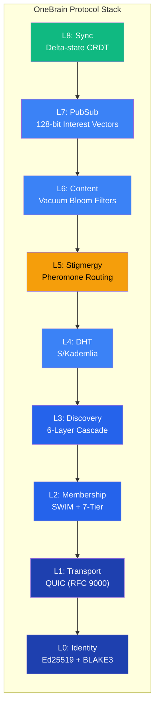

# 1. Introduction

## 1.1 Problem Statement

Kiến trúc của các mạng peer-to-peer (P2P) đương đại phản ánh nguồn gốc của chúng từ các ứng dụng chia sẻ file. BitTorrent [1] tối ưu hóa cho việc phân phối các file tĩnh, dung lượng lớn thông qua swarming dựa trên mảnh (piece-based swarming). IPFS [2] tổng quát hóa việc lưu trữ content-addressed thành cấu trúc Merkle DAG, xử lý tất cả dữ liệu dưới dạng các opaque blocks có thể định địa chỉ bằng cryptographic hash. devp2p [3] của Ethereum cung cấp một gossip substrate tối giản cho việc lan truyền transactions và blocks. Trong mỗi trường hợp, mô hình dữ liệu cơ bản là một **content-addressed blob** — một chuỗi byte phi cấu trúc được định danh bằng hash của nó.

Tuy nhiên, tri thức nhân loại về mặt căn bản khác biệt so với các file. Tri thức có các đặc điểm:

- **Structured**: Một sự thật bao gồm các subjects, predicates, objects, qualifiers, và epistemic context — chứ không chỉ là các byte.
- **Queryable by meaning**: Người dùng tìm kiếm tri thức bằng semantic content ("What causes malaria?"), chứ không phải bằng content hash.
- **Trust-annotated**: Cùng một khẳng định sẽ có trọng số khác nhau tùy thuộc vào nguồn, evidence type, và lịch sử xác minh (verification history) của nó.
- **Evolving**: Các knowledge metadata (usage counts, citations, trust scores) thay đổi liên tục, đòi hỏi cơ chế đồng bộ hóa (synchronization) hiệu quả mà không cần thay thế toàn bộ đối tượng.
- **Heterogeneous in node capability**: Một chiếc smartphone và một máy chủ trung tâm dữ liệu (datacenter server) không nên đóng vai trò giống hệt nhau trong một mạng lưới tri thức.

Không có giao thức P2P hiện tại nào giải quyết các yêu cầu này một cách native. IPFS/libp2p không cung cấp semantic routing, không có hệ thống reputation tích hợp sẵn, và không có các kiểu dữ liệu chuyên biệt cho tri thức (knowledge-specific data types) [4]. BitTorrent thiếu bất kỳ cơ chế truy vấn nào ngoài việc tra cứu chính xác theo hash (exact hash lookups) [1]. P2P layer của Ethereum được tối ưu hóa cho block propagation, chứ không phải cho việc khám phá tri thức (knowledge discovery) [3].

Thách thức về khả năng mở rộng (scale challenge) càng làm phức tạp thêm vấn đề. Các triển khai P2P hiện tại hoạt động ở quy mô hàng triệu nodes (IPFS: ~100K active [4], Bitcoin: ~15K full nodes, Ethereum: ~8K). OneBrain hướng tới mục tiêu **100 tỷ nodes** — mỗi con người với một chiếc smartphone, mỗi thiết bị IoT, mỗi AI agent. Ở quy mô này, flat Kademlia routing yêu cầu ~37 hops (~1.85 giây) cho mỗi lần lookup — mức không thể chấp nhận được đối với các truy vấn tri thức tương tác (interactive knowledge queries).

Cuối cùng, thiết kế mobile-first là vô cùng thiết yếu. Hơn 5 tỷ người truy cập internet chủ yếu thông qua điện thoại thông minh [5]. Một giao thức chia sẻ tri thức làm cạn kiệt pin hoặc yêu cầu kết nối liên tục sẽ thất bại trong việc đạt được mức độ chấp nhận toàn cầu. Mục tiêu hướng tới là mức tiêu hao pin **<0.5% mỗi ngày** — hầu như không thể nhận thấy đối với người dùng.

## 1.2 Motivation: Knowledge Networks vs. File Networks

Sự khác biệt giữa mạng file và mạng tri thức mang tính kiến trúc, chứ không chỉ là bề nổi:

| Aspect               | File Network                      | Knowledge Network                              |
| -------------------- | --------------------------------- | ---------------------------------------------- |
| **Data unit**  | Opaque blob (bytes)               | Structured Knowledge Unit (typed, annotated)   |
| **Addressing** | Content hash (exact match)        | Semantic query (meaning-based)                 |
| **Routing**    | Hash-based DHT lookup             | Semantic routing (which nodes have expertise?) |
| **Node roles** | Homogeneous (all peers equal)     | Heterogeneous (phones ≠ servers)              |
| **Metadata**   | Static (immutable after creation) | Evolving (trust, usage, citations change)      |
| **Sync**       | Full object transfer              | Delta-state (only metadata changes)            |
| **Offline**    | Requires bootstrap servers        | Operates without internet                      |

*Table 1: Architectural differences between file networks and knowledge networks.*

Trong một file network, một node yêu cầu nội dung bằng exact hash của nó và nhận về các byte. Trong một knowledge network, một node thực hiện truy vấn theo ý nghĩa — "How do I repair a bicycle tire?" — và mạng lưới phải route truy vấn này đến các nodes sở hữu tri thức liên quan, xếp hạng kết quả theo trust và relevance, và trả về các structured Knowledge Units [6] bao gồm không chỉ câu trả lời mà còn cả evidence type, epistemic status, và provenance của nó.

Điều này đòi hỏi **semantic routing**: khả năng định hướng các truy vấn tới các nodes đã chứng minh được chuyên môn (expertise) trong domain liên quan. Chúng tôi lấy cảm hứng từ **ant colony foraging** (sự tìm kiếm thức ăn của đàn kiến) [7]: kiến để lại các pheromone trails để dẫn đường cho những con khác đến nguồn thức ăn. Theo thời gian, các vết mạnh nhất sẽ hội tụ tại các nguồn thức ăn tốt nhất. Tương tự, các nodes OneBrain để lại các digital pheromone trails để dẫn đường cho các truy vấn đến các nguồn tri thức. Các đường truy vấn thành công sẽ được củng cố (reinforced); các đường không thành công sẽ bay hơi (evaporate). Mạng lưới tự tổ chức cấu trúc routing topology của mình để phù hợp với các mô hình nhu cầu tri thức — mà không cần bất kỳ sự điều phối trung tâm nào.

## 1.3 Design Principles

OneBrain Protocol (OBP) được điều hành bởi sáu nguyên tắc thiết kế:

1. **No central servers.** Mạng lưới tự duy trì thông qua sự điều phối peer-to-peer. Không có bootstrap server, no coordinator, no single point of failure. Đây không phải là một nguyện vọng — mà là một ràng buộc kiến trúc cứng nhắc.
2. **Internet is optimization, not requirement.** Giao thức hoạt động qua mạng không dây cục bộ (BLE, WiFi Direct) mà không cần kết nối internet. Truy cập internet cải thiện hiệu suất nhưng không bắt buộc đối với việc chia sẻ tri thức cơ bản. Cascade bootstrap 6 lớp (§3.5) bắt đầu bằng các phương thức có khả năng ngoại tuyến (QR code, NFC, mDNS) trước khi thử nghiệm các phương thức phụ thuộc vào internet.
3. **Scale target: 100 billion+ nodes.** Mỗi chiếc smartphone, thiết bị IoT, và AI agent đều phải là một người tham gia mạng lưới tiềm năng. Node hierarchy 7 tầng (§3.4) và hierarchical DHT routing giảm độ trễ lookup từ O(log₂ N) × RTT xuống còn xấp xỉ 7 hops cho 100 tỷ nodes.
4. **Mobile-first: <0.5% battery per day.** Tất cả các quyết định của giao thức đều ưu tiên hiệu suất năng lượng: cơ chế 0-RTT resumption của QUIC (§3.3), piggybacked gossip của SWIM (§3.4), delta-state CRDT sync (§3.10), và Bloom filter content summaries (§3.8) đều giúp giảm số lượng tin nhắn và số byte được truyền tải.
5. **Bio-inspired throughout.** Stigmergy routing (§3.7), fitness-based node hierarchy (§3.4), sự củng cố/bay hơi pheromone (§3.7), và các khái niệm về ổ sinh thái (ecological niche) định hướng cho các quyết định kiến trúc ở mọi lớp.
6. **Content-agnostic trust.** Node reputation được dựa trên các mô hình hành vi (uptime, đóng góp băng thông, tỷ lệ thành công của truy vấn), chứ không phải kiểm duyệt nội dung. Giao thức không kiểm tra hay đánh giá nội dung tri thức mà nó truyền tải.

*Figure 1: The 9-layer OneBrain Protocol stack. Layer 5 (Stigmergy) is highlighted as the primary novel contribution — bio-inspired pheromone routing for semantic knowledge queries.*

## 1.4 Contributions

Bài báo này thực hiện các đóng góp sau:

1. **Một P2P protocol stack tích hợp 9 lớp được xây dựng chuyên biệt cho việc chia sẻ tri thức** (§3), kết hợp identity, transport, membership, discovery, DHT, stigmergy routing, content filtering, publish/subscribe, và CRDT synchronization thành một kiến trúc gắn kết.
2. **Bio-inspired stigmergy routing cho tối ưu hóa truy vấn ngữ nghĩa (semantic query)** (§3.7), áp dụng cơ chế củng cố và bay hơi pheromone của đàn kiến vào knowledge query routing — ứng dụng đầu tiên của stigmergy cho việc truy xuất nội dung ngữ nghĩa (semantic content retrieval) thay vì định tuyến gói tin (packet routing) hoặc viễn thông.
3. **Một fitness-based node hierarchy 7 tầng với cơ chế promotion/demotion tự động** (§3.4), mở rộng giao thức SWIM membership [8] với một hierarchy nhận biết năng lực (capability-aware) trải dài từ các Leaf nodes (smartphones) đến các GlobalBackbone nodes (datacenters), với điểm fitness được tính toán trên 7 chiều có trọng số.
4. **Một cascade bootstrap offline-first 6 lớp** (§3.5), cho phép thiết lập mạng lưới mà không cần truy cập internet thông qua trao đổi xã hội (social exchange) (QR/NFC/BLE) và phát hiện cục bộ (local discovery) (mDNS) trước khi nâng cấp lên các phương thức phụ thuộc vào internet.
5. **Delta-state CRDT synchronization cho metadata tri thức phân tán** (§3.10), áp dụng delta-state CRDT framework của Almeida và các cộng sự [9] vào các trust scores và các usage counters của tri thức, đạt được mức giảm băng thông 10–100× so với full-state replication.
6. **Một wire format toàn diện hỗ trợ 74 loại message** (§3.11) với universal header 6-byte nhỏ gọn, cho phép giao tiếp tiết kiệm năng lượng hướng tới mức tiêu hao pin <0.5% mỗi ngày trên các thiết bị di động.

## 1.5 Paper Organization

Phần còn lại của tài liệu này được tổ chức như sau. Phần 2 khảo sát các nghiên cứu liên quan về distributed hash tables, membership protocols, bio-inspired routing, transport protocols, và CRDT synchronization. Phần 3 trình bày chi tiết kỹ thuật đầy đủ về kiến trúc 9 lớp cốt lõi. Phần 4 mô tả distributed query engine được xây dựng trên chồng giao thức. Phần 5 đánh giá hiệu quả triển khai, trình bày phân tích quy mô và năng lượng, đồng thời so sánh với IPFS/libp2p. Phần 6 thảo luận về các phát hiện, hạn chế và nghiên cứu trong tương lai.

---

## References

[1] B. Cohen, "Incentives Build Robustness in BitTorrent," in *Proc. Workshop on Economics of Peer-to-Peer Systems*, 2003.

[2] J. Benet, "IPFS — Content Addressed, Versioned, P2P File System," *arXiv preprint arXiv:1407.3561*, 2014.

[3] Ethereum Foundation, "devp2p: Ethereum Peer-to-Peer Networking Specifications," 2024. [Online]. Available: https://github.com/ethereum/devp2p

[4] D. J. Trautwein *et al.*, "Design and Evaluation of IPFS: A Storage Layer for the Decentralized Web," in *Proc. ACM SIGCOMM '22*, 2022.

[5] GSMA, "The Mobile Economy 2024," 2024.

[6] OneBrain Project, "Knowledge Unit: A Bio-Inspired Knowledge Representation for Decentralized Knowledge Networks," 2026 (companion paper).

[7] M. Dorigo and T. Stützle, *Ant Colony Optimization*. MIT Press, 2004.

[8] A. Das, I. Gupta, and A. Motivala, "SWIM: Scalable Weakly-consistent Infection-style Process Group Membership Protocol," in *Proc. IEEE/IFIP DSN '02*, 2002.

[9] P. S. Almeida, A. Shoker, and C. Baquero, "Delta State Replicated Data Types," *Journal of Parallel and Distributed Computing*, vol. 111, pp. 162–173, 2018.
