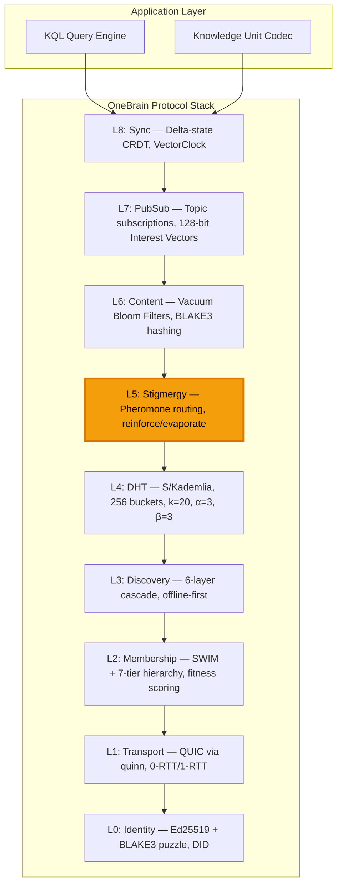
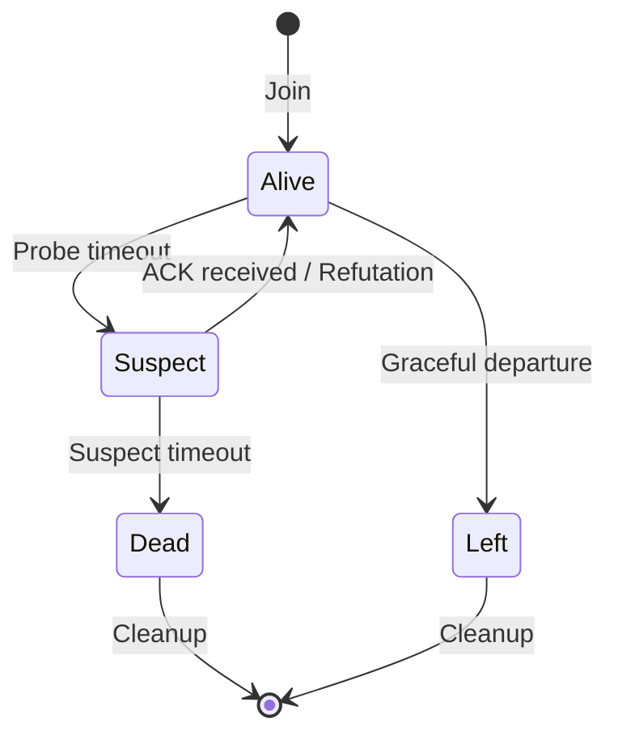
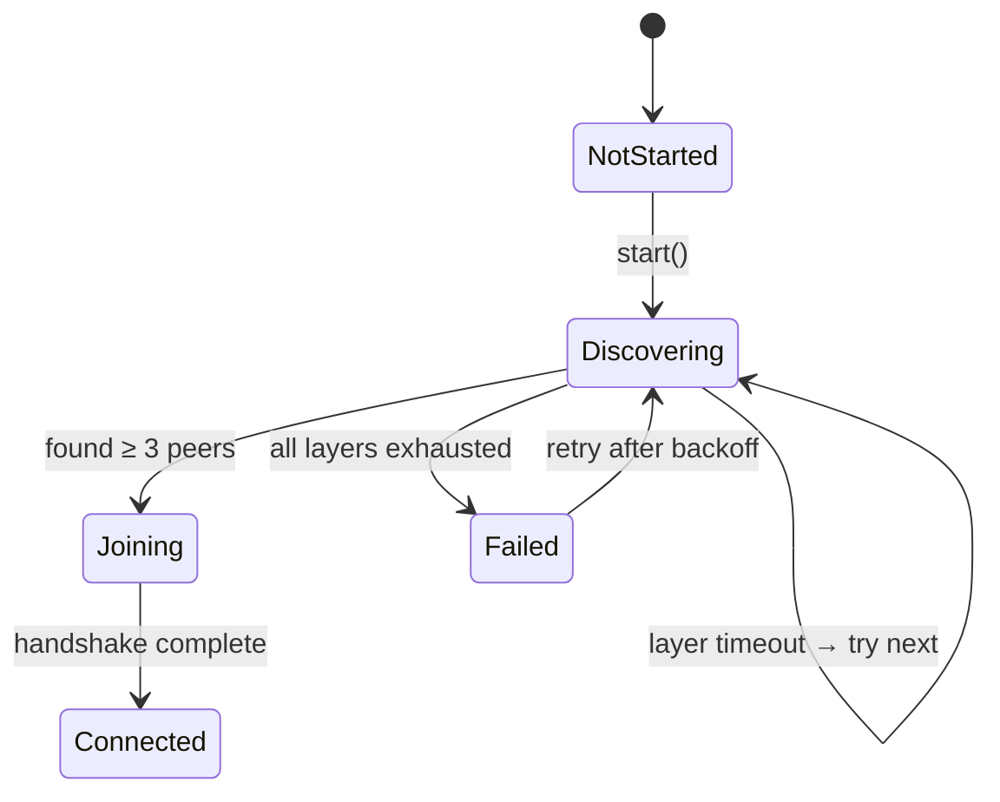
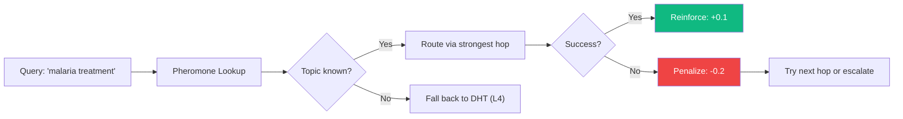

# 3. Protocol Architecture

Phần này trình bày kiến trúc kỹ thuật hoàn chỉnh của OneBrain Protocol (OBP) — một 9-layer integrated P2P stack được xây dựng chuyên biệt cho chia sẻ tri thức phi tập trung.

## 3.1 System Overview

OneBrain Protocol bao gồm chín lớp, mỗi lớp giải quyết một mối quan tâm cụ thể trong knowledge-sharing stack. Khác với cách tiếp cận dạng mô-đun (modular approach) của libp2p — nơi các giao thức được cấu thành một cách độc lập — các lớp của OBP được thiết kế dưới dạng một hệ thống tích hợp với các tối ưu hóa chéo lớp (cross-layer optimizations): các bản cập nhật SWIM membership được piggyback trên các transport messages (L2→L1), sự củng cố pheromone (pheromone reinforcement) được kích hoạt bởi các kết quả truy vấn (L5←L4), và trao đổi Bloom filter diễn ra trong các vòng giao thức membership (L6→L2).



*Figure 2: Complete OBP architecture. Layer 5 (Stigmergy) is highlighted as the primary novel contribution.*

**Các ràng buộc thiết kế** (Design constraints) điều phối tất cả các quyết định kiến trúc:

| Ràng buộc (Constraint) | Mục tiêu (Target) | Cơ sở lý luận (Rationale) |
| ------------------- | ----------------- | ------------------------------------ |
| No central servers  | Zero              | Mạng lưới tự duy trì (Self-sustaining network) |
| Internet dependency | Optional          | Offline-first cho các vùng đang phát triển (developing regions) |
| Scale               | 100B+ nodes       | Mỗi smartphone, IoT, AI agent      |
| Energy              | <0.5% pin/ngày    | Sự chấp nhận mobile-first            |
| Latency             | <500ms truy vấn   | Truy cập tri thức tương tác (Interactive knowledge access) |
| Byzantine tolerance | 20% malicious     | Mạng lưới mở, không cần cấp quyền (Open, permissionless network) |

## 3.2 Layer 0: Identity

Layer 0 thiết lập danh tính mã hóa (cryptographic identity) cho mọi đối tượng tham gia mạng lưới thông qua ba thành phần: keypairs, puzzle-derived NodeIds, và decentralized identifiers.

### 3.2.1 Tạo Keypair

Mỗi node tạo một **Ed25519** keypair [1] sử dụng crate `ed25519-dalek`. Ed25519 cung cấp bảo mật 128-bit với chữ ký 64-byte và khóa công khai 32-byte — đủ nhỏ gọn cho các thiết bị di động.

```rust
pub struct KeyPair {
    signing_key: SigningKey,  // Ed25519 private key
}
```

`KeyPair` hỗ trợ: `generate()` (ngẫu nhiên), `sign(&[u8]) → Signature`, `verify(&[u8], &Signature) → bool`, và `pubkey_bytes() → [u8; 32]`.

### 3.2.2 Cryptographic Puzzle cho NodeId

Để ngăn chặn các cuộc tấn công Sybil (nơi kẻ tấn công tạo ra nhiều danh tính với chi phí rẻ), các NodeIds được suy ra thông qua một computational puzzle lấy cảm hứng từ S/Kademlia [2]:

$$
\text{NodeId} = \text{BLAKE3}(\text{pubkey} \| \text{nonce})[0..32]
$$

subject to the constraint:

$$
\text{leading\_zeros}(\text{NodeId}) \geq \text{difficulty}
$$

Node lặp qua các nonces cho đến khi tìm thấy nonce thỏa mãn yêu cầu difficulty. Số lần lặp dự kiến (expected iterations): $2^{\text{difficulty}}$.

**Khả năng mở rộng difficulty thích ứng (Adaptive difficulty scaling):**

| Hằng số (Constant) | Giá trị (Value) | Quy mô Mạng (Network Size) | Số lần lặp dự kiến (Expected Iterations) | Thời gian (Phone) |
| ------------------- | ----- | ------------ | ------------------: | -----------: |
| `PUZZLE_C_SMALL`  | 16    | <1M nodes    |             ~65,536 |        ~50ms |
| `PUZZLE_C_MEDIUM` | 20    | 1M–1B nodes |          ~1,048,576 |       ~800ms |
| `PUZZLE_C_LARGE`  | 24    | >1B nodes    |         ~16,777,216 |         ~13s |

*Table 3: Puzzle difficulty scaling. BLAKE3's throughput (~1 GB/s on modern CPUs) enables rapid puzzle solving even on constrained devices.*

Puzzle cung cấp hai đảm bảo: (1) **identity cost** — việc tạo một danh tính mới đòi hỏi tính toán không hề nhỏ; (2) **NodeId uniformity** — các giải pháp puzzle được phân phối đồng đều (uniformly distributed) trong không gian 256-bit, ngăn chặn kẻ tấn công chọn các NodeIds cụ thể để nhắm mục tiêu vào các phạm vi khóa DHT.

```
Algorithm 1: NodeId Generation
INPUT: pubkey (32 bytes), difficulty (u8)
OUTPUT: NodeIdProof { node_id, nonce, difficulty }

nonce ← 0
LOOP:
    candidate ← BLAKE3(pubkey ‖ nonce)[0..32]
    IF leading_zeros(candidate) ≥ difficulty:
        RETURN NodeIdProof { node_id: candidate, nonce, difficulty }
    nonce ← nonce + 1
```

### 3.2.3 Danh tính Thiết bị và DID

Mỗi thiết bị vật lý có một **DeviceId** được suy ra từ device-specific keypair của nó: `DeviceId = BLAKE3(device_pubkey)[0..32]`. Tối đa `DEVICE_GROUP_MAX = 16` thiết bị có thể chia sẻ cùng một danh tính DID.

Định dạng DID tuân theo các quy ước của W3C [3]: `did:key:z6Mk<hex(pubkey)>`.

**Các mã định danh giao thức (Protocol identifiers):**

- `OBP_ALPN = b"obp/1"` — QUIC Application-Layer Protocol Negotiation
- `OBP_PORT = 4242` — Cổng lắng nghe mặc định

## 3.3 Layer 1: Transport (QUIC)

Layer 1 cung cấp transport được mã hóa, dồn kênh (multiplexed) sử dụng **QUIC** (RFC 9000) [4] thông qua crate Rust `quinn`.

### 3.3.1 Thiết lập Kết nối

```rust
pub struct TransportConfig {
    pub bind_addr: SocketAddr,        // Default: 0.0.0.0:4242
    pub alpn: Vec<u8>,                // "obp/1"
    pub idle_timeout: Duration,       // 30 seconds
    pub keep_alive: Duration,         // 15 seconds
    pub max_bi_streams: u32,          // 100
    pub max_uni_streams: u32,         // 100
}
```

OBP sử dụng **self-signed certificates** được tạo bởi `rcgen` — danh tính được thiết lập thông qua cryptographic puzzle (L0), chứ không phải qua một PKI certificate authority. Trình xác minh TLS custom `SkipServerVerification` chấp nhận bất kỳ chứng chỉ của peer nào, dựa vào việc xác minh NodeId cho mục đích xác thực.

### 3.3.2 Các Mô hình Giao tiếp (Communication Patterns)

`OBPConnection` cung cấp bốn mô hình giao tiếp:

| Phương thức (Method) | Hướng (Direction) | Độ tin cậy (Reliability) | Trường hợp sử dụng (Use Case) | 0-RTT Safe? |
| ----------------------------------------- | ------------- | ----------------- | ----------------- | :---------: |
| `send_uni(&[u8])`                       | Một chiều       | Fire-and-forget   | KU_PUSH, GOSSIP   |   Varies   |
| `request(&[u8]) → Vec<u8>`             | Hai chiều | Request/Response  | FIND_NODE, QUERY  |   Varies   |
| `recv_uni() → Vec<u8>`                 | Đến (Incoming)      | Chấp nhận uni-stream | Nhận pushes  |     —     |
| `accept_bi() → (Vec<u8>, BiResponder)` | Đến (Incoming)      | Chấp nhận bi-stream  | Xử lý requests |     —     |

**Phân loại 0-RTT so với 1-RTT:**

- **0-RTT safe** (idempotent): `SwimPing`, `SwimAck`, `FindNodeReq`, `FindNodeResp`, `BloomFilter`, `PeerExchange`
- **1-RTT required** (non-idempotent): `KuPush`, `QueryForward`, `StoreReq`, `CrdtSyncDelta`

0-RTT loại bỏ một round-trip cho các kết nối lặp lại, có ý nghĩa quan trọng đối với hiệu quả năng lượng trên các thiết bị di động.

## 3.4 Layer 2: Membership (SWIM + 7-Tier Hierarchy)

Layer 2 kết hợp giao thức SWIM [5] để phát hiện lỗi với một 7-tier node hierarchy mới lạ cho capability-aware routing.

### 3.4.1 Các Tham số Giao thức SWIM

| Tham số (Parameter) | Giá trị (Value) | Mô tả (Description) |
| --------------------- | -----: | ------------------------------------- |
| `T_PERIOD_MS`       |  1,000 | Chu kỳ giao thức (khoảng thời gian probe) |
| `T_DIRECT_MS`       |    200 | Timeout của probe trực tiếp |
| `T_INDIRECT_MS`     |    500 | Timeout của probe gián tiếp |
| `K_INDIRECT`        |      3 | Số probe gián tiếp trên mỗi suspicion |
| `T_SUSPECT_BASE_MS` |  5,000 | Timeout suspect cơ sở |
| `MAX_PIGGYBACK`     |      6 | Số lượng cập nhật piggyback tối đa trên mỗi message |
| `MAX_MEMBERS`       | 10,000 | Kích thước tối đa của danh sách membership |
| `LHA_MAX`           |      8 | Hệ số nhân Local Health Awareness tối đa |

*Table 4: SWIM protocol constants.*

**Máy trạng thái trạng thái thành viên (Member status state machine):**



**Suspect timeout** thích ứng với quy mô mạng lưới:

$$
T_{\text{suspect}} = T_{\text{base}} \times \ln(N) \times (1 + \text{LHA})
$$

trong đó $N$ là kích thước membership và LHA là hệ số nhân Local Health Awareness (tăng lên khi một node tự phát hiện tình trạng suy giảm sức khỏe của chính mình).

**Piggyback priority** đảm bảo các cập nhật quan trọng được lan truyền trước: Dead > Suspect > Left > Alive.

### 3.4.2 Seven-Tier Node Hierarchy

Hierarchy 7 tầng (7-tier hierarchy) là đóng góp chính yếu của OBP đối với thiết kế giao thức membership. Mỗi tầng tương ứng với năng lực và phạm vi địa lý của một node:

| Tầng (Tier) | Tên (Name) | Promotion | Demotion | Vai trò (Role) | Thiết bị điển hình (Typical Device) |
| :--: | -------------- | :-------: | :------: | --------------------- | -------------- |
|  0  | Leaf           |    —    |    —    | Người tiêu thụ thụ động (Passive consumer) | IoT sensor     |
|  1  | Contributor    |   0.30   |   0.20   | Người tham gia tích cực (Active participant) | Smartphone     |
|  2  | LocalSP        |   0.60   |   0.50   | Local super-peer      | Laptop         |
|  3  | RegionalSP     |   0.75   |   0.65   | Regional coordinator  | Desktop        |
|  4  | CountrySP      |   0.85   |   0.78   | Country-level hub     | Máy chủ nhỏ   |
|  5  | ContinentalSP  |   0.92   |   0.87   | Continental backbone  | Máy chủ         |
|  6  | GlobalBackbone |   0.97   |   0.93   | Cơ sở hạ tầng toàn cầu (Global infrastructure) | Datacenter     |

*Table 5: 7-tier node hierarchy. Ngưỡng promotion và demotion bao gồm cả độ trễ trễ hysteresis (gap = 0.10) để ngăn ngừa dao động.*

### 3.4.3 Tính điểm Fitness

Điểm fitness của mỗi node được tính toán dưới dạng tổ hợp tuyến tính có trọng số của 7 chiều:

$$
f = w_u \cdot u + w_b \cdot b + w_w \cdot w + w_s \cdot s + w_c \cdot c + w_n \cdot n + w_r \cdot r
$$

| Trọng số (Weight) | Chiều (Dimension) | Mô tả (Description) | Phạm vi (Range) |
| :----: | ------------------ | ---------------------------------- | :----: |
|  0.20  | $u$ (uptime)     | Tỷ lệ thời gian online            | [0, 1] |
|  0.15  | $b$ (battery)    | Mức pin hoặc 1.0 nếu đang cắm sạc | [0, 1] |
|  0.20  | $w$ (bandwidth)  | Băng thông khả dụng được chuẩn hóa | [0, 1] |
|  0.15  | $s$ (storage)    | Dung lượng lưu trữ khả dụng được chuẩn hóa | [0, 1] |
|  0.10  | $c$ (CPU)        | Năng lực xử lý                    | [0, 1] |
|  0.10  | $n$ (network)    | Chất lượng mạng                    | [0, 1] |
|  0.10  | $r$ (reputation) | Điểm uy tín EigenTrust reputation | [0, 1] |

*Table 6: Fitness scoring weights. Chất lượng mạng: WiFi=1.0, 5G=0.8, 4G=0.5, 3G=0.2.*

Điểm fitness $f \in [0, 1]$ xác định điều kiện tầng. **Hysteresis** (khoảng cách 0.05–0.10 giữa các ngưỡng promotion và demotion) ngăn ngừa dao động khi điểm fitness biến động gần các ranh giới tầng.

Các trường của `MemberEntry`: `node_id: NodeId`, `address: NetworkAddress`, `incarnation: u32`, `status: MemberStatus`, `tier: NodeTier`, `last_seen: Instant`, `fitness_score: f32`, `topic_vector: [u8; 16]`.

## 3.5 Layer 3: Discovery (6-Layer Bootstrap Cascade)

Layer 3 triển khai một cascade bootstrap offline-first. Cascade thử nghiệm từng lớp theo thứ tự ưu tiên; lớp đầu tiên phát hiện được ≥3 peers sẽ thành công.

| Ưu tiên (Priority) | Lớp (Layer) | Phương thức (Method) | Internet? | Timeout |
| :------: | --------- | ----------------------------- | :-------: | :-----: |
|    0    | Xã hội (Social)    | QR code / NFC / BLE           |    Không    |   —   |
|    1    | Cục bộ (Local)     | mDNS `_obp._udp.local`       |    Không    |   10s   |
|    2    | HTTP      | GET `/.well-known/obp-peers` |    Có    |   10s   |
|    3    | DHT       | Kết nối tới các bootstrap nodes    |    Có    |   10s   |
|    4    | DNS       | TXT records                   |    Có    |   10s   |
|    5    | Hardcoded | Địa chỉ peer được compile-in (Compiled-in peer addresses)    |    Có    |   10s   |

*Table 7: 6-layer bootstrap cascade. Hai lớp đầu tiên hoạt động không cần truy cập internet.*

**Máy trạng thái bootstrap (Bootstrap state machine):**



**Peer Exchange (PEX):** Sau khi bootstrap, các nodes liên tục phát hiện các peers mới thông qua các PEX messages được piggyback trên các vòng giao thức SWIM. `PexEntry` bao gồm: `node_id`, `address`, `tier: u8`, `fitness: u16` (0–10,000 fixed-point). Lượng trao đổi tối đa: 10 peers mỗi vòng, được lựa chọn theo fitness.

**Các hằng số:** `MIN_BOOTSTRAP_PEERS = 3`, `BOOTSTRAP_LAYER_TIMEOUT_S = 10`, `MAX_SEEDS_PER_SOURCE = 20`, `PEX_MAX_PEERS = 32`.

## 3.6 Layer 4: DHT (S/Kademlia)

Layer 4 triển khai một S/Kademlia [2] routing table dành cho distributed key-value storage và node lookup.

### 3.6.1 Các Tham số

| Tham số (Parameter) | Giá trị (Value) | Mô tả (Description) |
| ----------------- | ----: | -------------------------------------------- |
| `K_BUCKET_SIZE` |    20 | Số lượng entry tối đa trên mỗi k-bucket                     |
| `ALPHA`         |     3 | Các lookup RPCs đồng thời                       |
| `BETA`          |     3 | Các đường lookup rời rạc (disjoint lookup paths)                        |
| `NUM_BUCKETS`   |   256 | Số lượng k-buckets (= bit length của NodeId) |

### 3.6.2 XOR Distance Metric

Khoảng cách giữa hai NodeIds là phép toán bitwise XOR:

$$
d(a, b) = a \oplus b
$$

XOR metric thỏa mãn: (1) $d(a,a) = 0$; (2) $d(a,b) > 0$ với $a \neq b$; (3) $d(a,b) = d(b,a)$ (symmetry); (4) $d(a,c) \leq d(a,b) + d(b,c)$ (triangle inequality - bất đẳng thức tam giác). Tính đối xứng (symmetry) đảm bảo rằng mỗi lần lookup cũng đồng thời cập nhật routing table của node được liên hệ — một thuộc tính tự tổ chức then chốt (key self-organization property).

### 3.6.3 Cấu trúc Routing Table

Routing table chứa 256 k-buckets, được lập chỉ mục theo vị trí của bit khác biệt đầu tiên giữa NodeId cục bộ và mục tiêu:

$$
\text{bucket\_index}(a, b) = \text{first\_differing\_bit}(a \oplus b)
$$

Mỗi `KBucket` duy trì:

- `entries: Vec<KBucketEntry>` — lên tới K=20 entries, được sắp xếp theo thứ tự LRU (most-recently-seen ở đuôi)
- `replacement_cache: Vec<KBucketEntry>` — các entry dự phòng được promote khi các entry hoạt động bị thu hồi (evicted)
- Loại bỏ không hoạt động (stale eviction): các entry có `stale_count ≥ 3` sẽ bị thay thế

### 3.6.4 Iterative Lookup

```
Algorithm 2: Kademlia Iterative Lookup
INPUT: target_key (32 bytes)
OUTPUT: K closest nodes to target_key

candidates ← find_closest(target_key, α) from local routing table
queried ← ∅

while candidates has unqueried entries:
    batch ← take α closest unqueried from candidates
    for each node in batch (PARALLEL):
        response ← RPC FindNode(target_key) to node
        candidates ← candidates ∪ response.nodes
        queried ← queried ∪ {node}
    if no new closer nodes found:
        break

return K closest nodes from candidates
```

**Mở rộng S/Kademlia:** Quá trình lookup được thực hiện đồng thời dọc theo β=3 disjoint paths. Mỗi con đường duy trì các candidate sets độc lập, và các kết quả được gộp lại ở giai đoạn cuối. Cơ chế này ngăn chặn một node độc hại đơn lẻ làm nhiễm độc toàn bộ quá trình lookup. Với 20% các nodes thù địch, β=3 đạt tỷ lệ lookup thành công 92% [2].

### 3.6.5 Lưu trữ Cục bộ (Local Storage)

`DhtNode` duy trì một local key-value store (`HashMap<[u8; 32], Vec<u8>>`) với giới hạn dung lượng 10,000 items. `find_value(key)` trả về giá trị được lưu trữ hoặc K nodes gần nhất được biết — cho phép tinh chỉnh dần (progressive refinement) trong quá trình lookups.

## 3.7 Layer 5: Stigmergy (Bio-Inspired Pheromone Routing)

Layer 5 là **đóng góp mới chính yếu** của giao thức: một hệ thống routing lấy cảm hứng sinh học (bio-inspired routing system) tự học các đường truy vấn tối ưu thông qua củng cố (reinforcement) và bay hơi (evaporation), lấy cảm hứng từ tối ưu hóa đàn kiến (ant colony optimization) [6].

### 3.7.1 Pheromone Data Model

```rust
pub struct PheromoneTable {
    entries: HashMap<TopicId, PheromoneEntry>,  // Max 10,000 entries
    // ...
}

pub struct PheromoneEntry {
    topic_id: TopicId,                          // BLAKE3(topic_label), 32 bytes
    next_hops: Vec<PheromoneHop>,               // Max 10 hops, sorted by strength
    last_reinforced: Instant,
}

pub struct PheromoneHop {
    node_id: NodeId,
    strength: f32,          // [0.0, 1.0]
    success_count: u32,
    failure_count: u32,
}
```

### 3.7.2 Reinforcement và Evaporation

**Reinforcement** (Sự củng cố) xảy ra khi một truy vấn được route qua một hop cụ thể trả về kết quả thành công:

$$
s_{\text{new}} = \min(s_{\text{old}} + \delta_+, s_{\max}) \quad \text{where } \delta_+ = 0.1, \; s_{\max} = 1.0
$$

**Penalty** (Phạt/Giảm phạt) xảy ra khi một truy vấn được route qua một hop bị thất bại:

$$
s_{\text{new}} = \max(s_{\text{old}} - \delta_-, s_{\min}) \quad \text{where } \delta_- = 0.2, \; s_{\min} = 0.0
$$

Hình phạt bất đối xứng (asymmetric penalty) ($\delta_- = 2 \times \delta_+$) đảm bảo rằng các đường dẫn thất bại bị lãng quên nhanh hơn so với tốc độ các đường dẫn thành công được củng cố — một cách tiếp cận thận trọng giúp ngăn mạng lưới route các truy vấn qua các con đường không đáng tin cậy.

**Khởi tạo hop mới (New hop initialization):** Khi một node chưa từng biết trước đó trả lời thành công một truy vấn, một hop mới được tạo ra với strength ban đầu là 0.3 (độ tin cậy vừa phải). Tối đa 10 hops trên mỗi topic, được sắp xếp theo strength giảm dần.

**Evaporation** (Sự bay hơi) diễn ra hàng giờ, làm suy giảm tất cả các pheromone strengths theo số mũ:

$$
s_{\text{new}} = s_{\text{old}} \times \gamma^{\Delta t / T}
$$

trong đó $\gamma = 0.95$ (tốc độ suy giảm/decay rate), $\Delta t$ là thời gian đã trôi qua, và $T = 1$ giờ. Các hops có strength dưới 0.01 sẽ bị loại bỏ. Các entries trống sẽ được thu gom rác (garbage collected).

### 3.7.3 Định tuyến Truy vấn (Query Routing)

Hai hàm định tuyến (routing functions):

1. **`best_next_hop(topic)`** → Trả về hop có pheromone strength cao nhất cho một topic cụ thể. Được sử dụng cho định tuyến đường đơn lẻ xác định (deterministic single-path routing).
2. **`route_query(topic, exclude)`** → Trả về tất cả các hops có strength ≥ 0.05, ngoại trừ các nodes đã thử trước đó. Được sử dụng cho việc khám phá đa đường (multi-path exploration) khi hop tốt nhất thất bại.



*Figure 3: Stigmergy routing flow with reinforcement/penalty feedback loop.*

### 3.7.4 So sánh với AntNet

| Khía cạnh (Aspect) | AntNet [7]             | OneBrain Stigmergy                 |
| --------------------------- | ---------------------- | ---------------------------------- |
| **Domain**            | Packet routing viễn thông | Knowledge query routing            |
| **Destination**       | Địa chỉ đã biết (Known address) | Năng lực chưa biết (Unknown capability) |
| **Ants**              | Forward + backward     | Query = forward, result = backward |
| **Pheromone meaning** | "Con đường dẫn tới Node X" | "Con đường trả lời cho Topic Y" |
| **Evaporation**       | Suy giảm định kỳ (Periodic decay) | Hàng giờ, γ=0.95                    |
| **Reinforcement**     | Tỷ lệ thuận với độ trễ (Delay-proportional) | Nhị phân thành công/thất bại (Binary success/failure) |
| **Novel aspect**      | —                     | Định tuyến tới năng lực, không phải địa chỉ (Routing to capability, not address) |

*Table 8: Comparison of AntNet and OneBrain stigmergy routing.*

## 3.8 Layer 6: Content Routing (Vacuum Filters)

Layer 6 sử dụng các cấu trúc dữ liệu xác suất (probabilistic data structures) — cụ thể là các Bloom filters dựa trên BLAKE3 — để cho phép đánh giá năng lực nội dung hiệu quả mà không cần trao đổi toàn bộ chỉ mục (full index exchange).

### 3.8.1 Thiết kế Vacuum Filter

```rust
pub struct VacuumFilter {
    bits: Vec<u64>,           // Bit array
    num_bits: u32,            // Total bits
    hash_count: u8,           // Number of hash functions
    num_items: u16,           // Items inserted
    bits_per_item: u8,        // Bits allocated per item
}
```

**Cách thiết lập tham số tối ưu (Optimal parameterization):**

$$
\text{bits\_per\_item} = \lceil -\log_2(\text{fpr}) \times 1.44 \rceil \quad \text{clamped } [4, 20]
$$

$$
\text{hash\_count} = \lceil \text{bits\_per\_item} \times 0.693 \rceil \quad \text{clamped } [1, 16]
$$

Mặc định: `VACUUM_BITS_PER_ITEM = 10`, `VACUUM_TARGET_FPR = 0.001` (0.1%).

**Tỷ lệ dương tính giả (False positive rate):**

$$
\text{FPR} = \left(1 - e^{-kn/m}\right)^k
$$

trong đó $k$ = các hàm băm (hash functions), $n$ = các item đã chèn, $m$ = tổng số bit.

### 3.8.2 Định dạng Wire (Wire Format)

```
Offset  Size    Field
0       4B      num_bits (u32 BE)
4       1B      hash_count
5       1B      bits_per_item
6       2B      num_items (u16 BE)
8       var     bit_array (⌈num_bits/8⌉ bytes)
```

**Các phép toán:** `insert(item)` — băm BLAKE3 → đặt `hash_count` vị trí bit; `contains(item)` — kiểm tra tất cả các vị trí (không có âm tính giả/no false negatives); `merge(other)` — thực hiện phép toán bitwise OR của các filters tương thích.

## 3.9 Layer 7: PubSub

Layer 7 cho phép topic-based publish/subscribe để phổ biến tri thức trong thời gian thực.

`InterestVector`: Một Bloom filter 128-bit nhỏ gọn mã hóa các domain codes được đăng ký (`DomainCode = u16`). Ba hàm băm trên mỗi domain:

$$
h_1 = \text{topic} \bmod 128, \quad h_2 = (\text{topic} \times 7 + 13) \bmod 128, \quad h_3 = (\text{topic} \times 11 + 37) \bmod 128
$$

**Phát hiện trùng lặp sở thích (Interest overlap detection):** `interests_overlap(a, b)` thực hiện phép toán bitwise AND trên 16 bytes — nếu có bất kỳ bit nào được đặt ở cả hai vectors, các nodes đó có chung sở thích. Điều này cho phép lựa chọn peer dựa trên topic hiệu quả trong các vòng gossip.

**Ràng buộc:** `max_subs_per_topic = 100` subscribers trên mỗi topic cho mỗi node.

## 3.10 Layer 8: Delta-State CRDT Synchronization

Layer 8 cung cấp đồng bộ hóa metadata tri thức nhất quán cuối cùng (eventually consistent) sử dụng delta-state CRDTs [8].

### 3.10.1 Giao thức Đồng bộ (Sync Protocol)

Giao thức đồng bộ hóa sử dụng 4 loại message:

| Bước (Step) | Tin nhắn (Message) | Nội dung (Content) |
| :--: | ---------------- | ------------------------------------------ |
|  1  | `SyncRequest`  | sender, clock: VectorClock, requested_cids |
|  2  | `SyncResponse` | sender, clock, deltas: Vec\<SyncDelta\>    |
|  3  | `SyncAck`      | sender, clock, received_cids               |

Mỗi `SyncDelta` chứa: `cid: [u8; 32]`, `data: Vec<u8>`, `version: VectorClock`.

### 3.10.2 Tối ưu hóa Delta-State

Thay vì trao đổi toàn bộ trạng thái CRDT trong mỗi lần sync, giao thức chỉ gửi đi các **deltas** — các thay đổi trạng thái kể từ VectorClock được biết gần nhất của requester:

1. Node A gửi `SyncRequest` với VectorClock hiện tại của nó
2. Node B xác định các KUs nơi clock của A không vượt trội hơn (dominate) phiên bản của B
3. Node B chỉ gửi các deltas đó trong `SyncResponse`
4. Node A gộp các deltas nhận được và phản hồi xác nhận (acknowledges)

Cơ chế này đạt được **mức giảm băng thông từ 10–100×** so với full-state replication, điều thiết yếu cho các mobile nodes trên mạng di động (cellular networks).

**Các chế độ chống entropy (Anti-entropy modes):**

- **Periodic (Định kỳ):** Mỗi 10 giây, thực hiện sync với một peer được chọn ngẫu nhiên
- **Triggered (Được kích hoạt):** Khi có sự thay đổi cục bộ, lập tức push delta đến K neighbors gần nhất

**CRDT overhead:** ~530 bytes trên mỗi KU cho metadata (GCounters + LWWRegister + ORSet + VectorClock).

## 3.11 Hệ thống Tin nhắn (Message System)

### 3.11.1 Universal Header

Mỗi OBP message bắt đầu bằng một header 6-byte:

```
Offset  Size  Field
0       1B    msg_type     (MessageType discriminant, u8)
1       1B    flags        (MessageFlags bitfield)
2       4B    payload_len  (u32 big-endian, max ~16 MB practical)
```

**Bố cục các bit của MessageFlags (u8):**

| Bits | Trường (Field) | Giá trị (Values) |
| :--: | ----------- | ------------------------------------------- |
| 0–1 | Compression | 0=None, 1=PackedCbor, 2=PackedZstd, 3=Delta |
|  2  | dict_id     | Có sự hiện diện của Dictionary identifier |
|  3  | fragmented  | Multi-frame message                         |
|  4  | 0-RTT safe  | Idempotent, an toàn cho 0-RTT                  |
| 5–7 | reserved    | Sử dụng trong tương lai (Future use)                                  |

### 3.11.2 Đăng ký Loại Tin nhắn Toàn diện (Complete Message Type Registry)

OBP định nghĩa **81 loại message** trên 9 phạm vi chức năng:

| Phạm vi (Range) | Lớp (Layer) | Số lượng (Count) | Các loại Message (Message Types) |
| ---------- | ------------------ | :---: | ---------------------------------------------------------------------------------------------------------------------------------------------------------------------------------------------------------------- |
| 0x01–0x0F | Core Transport     |  14  | KuPush(01), KuPull(02), Gossip(03), TrustUpdate(04), DhtRequest(05), Ping(06), Pong(07), Bundle(08), BloomFilter(09), PeerExchange(0A), RelayRequest(0B), RelayData(0C), RelayClose(0D), Capability(0F)          |
| 0x10–0x1C | Membership         |  13  | SwimPing(10), SwimAck(11), SwimPingReq(12), SwimNack(13), SpFitness(14), SpHandoff(15), SpRedirect(16), SpRegister(17), SpOverloaded(18), Goodbye(19), HealthReport(1A), DepartingSoon(1B), ClusterAggregate(1C) |
| 0x20–0x26 | DHT                |   7   | FindNodeReq(20), FindNodeResp(21), FindValueReq(22), FindValueResp(23), StoreReq(24), StoreAck(25), HierLookup(26)                                                                                               |
| 0x30–0x38 | Content            |   9   | VacuumFilter(30), VacuumExchange(31), PheromoneUpdate(32), TopicSubscribe(33), TopicUnsubscribe(34), TopicPublish(35), TopicDeliver(36), NdnInterest(37), NdnData(38)                                            |
| 0x40–0x52 | Query/Watch        |   9   | WatchNotify(40), WatchRegister(41), WatchUnregister(42), TrustGossip(48), TrustVaccine(49), KuPropagation(4A), QueryForward(50), QueryResponse(51), QueryCancel(52)                                              |
| 0x60–0x68 | Sync               |   6   | CrdtSyncInit(60), CrdtSyncDelta(61), CrdtSyncAck(62), CrdtSyncComplete(63), MeshDelta(64), CacheInvalidate(68)                                                                                                   |
| 0x80–0x89 | Security           |  10  | PowChallenge(80), PowResponse(81), Backpressure(82), ProofOfStorage(83), ProofOfBandwidth(84), SpDemotion(85), MetabolismUpdate(86), MetabolismQuery(87), BlacklistUpdate(88), MetabolismResponse(89)            |
| 0x90–0x95 | Encoding Consensus |   6   | EncodingJobAnnounce(90), EncodingClaimReq(91), EncodingClaimResp(92), EncodingSubmission(93), EncodingConsensusResult(94), EncodingJobUpdate(95)                                                                 |
| 0xA0–0xA6 | OBT Token Protocol |   7   | ObtTransferRequest(A0), ObtTransferConfirm(A1), ObtBalanceQuery(A2), ObtBalanceResponse(A3), ObtMintBroadcast(A4), ObtStorageChallenge(A5), ObtForkWarrant(A6)                                                   |

*Table 9: Complete OBP message type registry (81 types across 9 ranges). Hex codes are the wire `msg_type` byte values.*

### 3.11.3 Mã hóa Địa chỉ Mạng (Network Address Encoding)

Mã hóa địa chỉ IPv4/IPv6 dual-stack:

```
addr_type (1B): 0x04 = IPv4, 0x06 = IPv6
address   (4B or 16B): Raw IP bytes
port      (2B BE): Port number
```

Tổng kích thước trên wire: IPv4 = 7 bytes, IPv6 = 19 bytes.

## 3.12 Wire Format Integration

Các OBP frames bao bọc định dạng wire của KU (được định nghĩa trong tài liệu đi kèm [9]):

```
┌──────────────────────────────────────────────────┐
│  OBP Message Frame                                │
│  ┌──────────────────────────────────────────────┐ │
│  │  6-byte OBP Header                          │ │
│  │  [msg_type] [flags] [length — 4 bytes BE]   │ │
│  ├──────────────────────────────────────────────┤ │
│  │  Payload (0 – ~16 MB bytes)                 │ │
│  │  ┌────────────────────────────────────────┐  │ │
│  │  │  KU Wire Format (Core DNA v6)          │  │ │
│  │  │  [MAGIC=0x4B] [VER_META]               │  │ │
│  │  │  [INSTRUCTION STREAM...]               │  │ │
│  │  │  [END=0xF0] [CRC-16 — 2 bytes]        │  │ │
│  │  └────────────────────────────────────────┘  │ │
│  └──────────────────────────────────────────────┘ │
│  [Ed25519 Signature — 64 bytes] (optional)        │
└──────────────────────────────────────────────────┘
```

*Figure 4: OBP frame encapsulating a KU wire format payload. The 6-byte OBP header provides message typing and framing; the KU Core DNA v6 wire format provides knowledge-specific encoding; the optional Ed25519 signature provides authenticity.*

Kích thước wire điển hình: Minimal Fact KU = 22 bytes (6-byte header + 16-byte CoreDna), multi-instruction KU điển hình = ~94 bytes (6-byte header + 88-byte CoreDna). Tổng OBP overhead: 6 bytes (header) + 64 bytes (optional signature) = 6–70 bytes cho mỗi message.

---

## References

[1] D. J. Bernstein *et al.*, "High-speed high-security signatures," *Journal of Cryptographic Engineering*, vol. 2, no. 2, pp. 77–89, 2012.

[2] I. Baumgart and S. Mies, "S/Kademlia: A Practicable Approach Towards Secure Key-Based Routing," in *Proc. IEEE ICPADS '07*, 2007.

[3] M. Sporny, D. Reed *et al.*, "Decentralized Identifiers (DIDs) v1.0," W3C Recommendation, Jul. 2022.

[4] J. Iyengar and M. Thomson, "QUIC: A UDP-Based Multiplexed and Secure Transport," *IETF RFC 9000*, May 2021.

[5] A. Das, I. Gupta, and A. Motivala, "SWIM: Scalable Weakly-consistent Infection-style Process Group Membership Protocol," in *Proc. IEEE/IFIP DSN '02*, 2002.

[6] M. Dorigo and T. Stützle, *Ant Colony Optimization*. MIT Press, 2004.

[7] G. Di Caro and M. Dorigo, "AntNet: Distributed Stigmergetic Control for Communications Networks," *JAIR*, vol. 9, pp. 317–365, 1998.

[8] P. S. Almeida, A. Shoker, and C. Baquero, "Delta State Replicated Data Types," *Journal of Parallel and Distributed Computing*, vol. 111, pp. 162–173, 2018.

[9] OneBrain Project, "Knowledge Unit: A Bio-Inspired Knowledge Representation for Decentralized Knowledge Networks," 2026 (companion paper).
