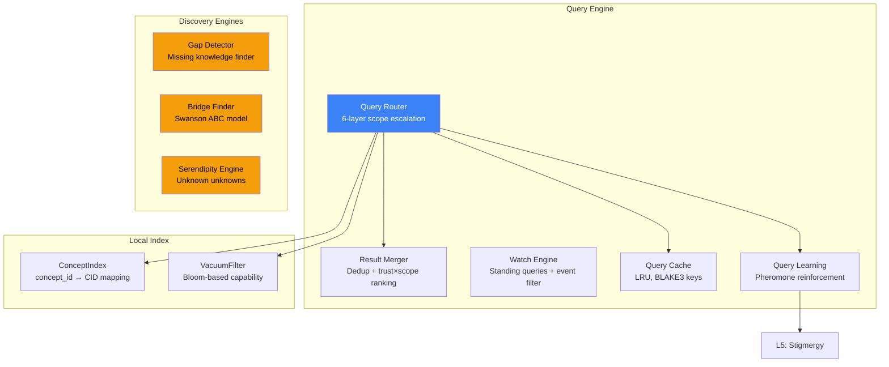

# 4. Distributed Query Engine

Được xây dựng trên chồng giao thức 9 lớp (9-layer protocol stack), OneBrain Distributed Query Engine chuyển đổi các truy vấn tri thức ngữ nghĩa (semantic knowledge queries) thành các hoạt động mạng có cấu trúc. Phần này mô tả query router, result merger, standing queries, ba discovery engines mới lạ, và vòng lặp phản hồi học tập dựa trên pheromone (pheromone-based learning feedback loop).

## 4.1 Architecture Overview

Query engine bao gồm 9 modules (~2,500 LOC) được phân lớp phía trên giao thức cốt lõi (core protocol):



*Figure 5: Distributed Query Engine architecture. Discovery Engines (highlighted) are novel contributions.*

## 4.2 Query Router: 6-Layer Scope Escalation (Thang leo Phạm vi 6 Lớp)

Query router triển khai cơ chế **progressive scope escalation** (thang leo phạm vi tăng dần) — bắt đầu bằng giải pháp cục bộ, rẻ nhất và chỉ mở rộng ra bên ngoài khi cần thiết:

| Phạm vi (Scope) | Lớp (Layer) | Phương thức (Method) | Chi phí (Cost) | Độ trễ (Latency) |
|:-----:|-------|--------|:----:|:-------:|
| 1 | Local | ConceptIndex lookup | O(1) | <1ms |
| 2 | DHT | S/Kademlia find_value | O(log N) | ~200ms |
| 3 | Stigmergy | Đi theo pheromone trails (L5) | O(hops) | ~150ms |
| 4 | PubSub | Broadcast tới các interest-matched peers (L7) | O(subs) | ~100ms |
| 5 | Mesh | Flood tới K neighbors gần nhất | O(K) | ~300ms |
| 6 | External | Cross-network bridges | O(1) | ~500ms+ |

*Table 10: Query scope escalation. Mỗi lớp được thử nghiệm tuần tự; kết quả thành công đầu tiên sẽ chấm dứt thang leo.*

**Các tin nhắn wire (Wire messages):**
- `QueryForward(0x50)`: Forward query to next hop with TTL and scope metadata
- `QueryResponse(0x51)`: Return matching KUs with trust scores
- `QueryCancel(0x52)`: Cancel an in-flight query (e.g., after timeout or sufficient results)

**Thuật toán scope escalation:**

```
Algorithm 3: Query Scope Escalation
INPUT: query (semantic query), max_results, timeout
OUTPUT: ranked list of KUs

results ← ∅
FOR scope IN [Local, DHT, Stigmergy, PubSub, Mesh, External]:
    new_results ← execute_scope(query, scope)
    results ← results ∪ new_results
    IF |results| ≥ max_results OR timeout expired:
        BREAK
    IF scope = Stigmergy AND new_results ≠ ∅:
        reinforce_pheromone(query.topic, successful_hop)

RETURN merge_and_rank(results)
```

**Các ràng buộc truy vấn (Query constraints):** `MAX_QUERY_DEPTH = 10` (số hops forwarding tối đa), `QUERY_TIMEOUT_S = 30`, `MAX_CONCURRENT_QUERIES = 50`.

## 4.3 Result Merger

Result Merger thực hiện loại bỏ trùng lặp (deduplication) và xếp hạng theo trọng số tin cậy (trust-weighted ranking):

1. **Deduplication**: Các kết quả có CIDs giống hệt nhau sẽ được thu gọn lại, chỉ giữ lại biến thể có độ tin cậy cao nhất (highest-trust)
2. **Ranking**: Mỗi kết quả được chấm điểm theo công thức:

$$\text{score}(r) = \text{trust\_score}(r) \times \text{scope\_proximity}(r)$$

trong đó `trust_score` is the source node's EigenTrust reputation and `scope_proximity` rewards local results (scope 1 = 1.0, scope 6 = 0.3, linearly interpolated).

3. **Sorting**: Các kết quả được trả về theo thứ tự điểm số giảm dần

Điều này đảm bảo các kết quả cục bộ khả dụng, có độ tin cậy cao luôn xếp trên các phương án thay thế ở xa hơn, ít tin cậy hơn — giúp giảm độ trễ và củng cố bộ nhớ đệm tri thức cục bộ (local knowledge caching).

## 4.4 Standing Queries (Watch Engine)

Watch Engine cho phép thực hiện **persistent, event-driven queries** (các truy vấn hướng sự kiện bền bỉ) — các clients đăng ký sở thích đối với các topics và nhận push notifications khi các Knowledge Units phù hợp xuất hiện:

- `WatchRegister(0x41)`: Đăng ký một standing query với topic filter, gene type filter, domain filter, và author filter tùy chọn
- `WatchNotify(0x40)`: Gửi push notification chứa KU CID phù hợp và metadata
- `WatchUnregister(0x42)`: Hủy bỏ một standing query

**Bộ lọc sự kiện (Event filters)** hỗ trợ khớp dữ liệu dựa trên:
- Loại gene (ví dụ: chỉ Fact hoặc Hypothesis)
- Các domain codes (ví dụ: chỉ y học hoặc vật lý)
- Author NodeId (ví dụ: theo dõi một contributor cụ thể)
- Ngưỡng trạng thái nhận thức epistemic status threshold (ví dụ: chỉ Evidence trở lên)
- Phạm vi thời gian (ví dụ: chỉ các KUs được tạo trong 7 ngày qua)

Các standing queries được lan truyền đến super-peer gần nhất của subscriber (L2 tier ≥ 2), node này sẽ tổng hợp các bộ lọc từ nhiều clients và đánh giá hiệu quả các KUs đi vào dựa trên tất cả các watches đã đăng ký.

## 4.5 Discovery Engines

Ba discovery engines mới lạ mở rộng vượt ra ngoài tìm kiếm truyền thống để chủ động đưa ra các kết nối tri thức có giá trị:

### 4.5.1 Knowledge Gap Detector (Trình phát hiện Khoảng trống Tri thức)

Gap Detector xác định **tri thức bị thiếu** trong local graph bằng cách phân tích kết nối khái niệm (concept connectivity):

1. Đối với mỗi concept có lượng truy vấn cao nhưng tỷ lệ truy xuất thành công thấp, đánh dấu là một **demand gap** (khoảng trống nhu cầu)
2. Đối với mỗi cặp concept có liên quan (được kết nối bằng Bond type PartOf, Causes, hoặc Enables) mà các concepts trung gian bị thiếu, đánh dấu là một **structural gap** (khoảng trống cấu trúc)
3. Ưu tiên các khoảng trống theo: query demand × concept importance × domain coverage

Các khoảng trống được hiển thị dưới dạng gợi ý cho việc tạo lập tri thức — khuyến khích các contributors lấp đầy các khoảng trống tri thức có giá trị cao.

### 4.5.2 Swanson ABC Cross-Domain Bridge Finder (Trình tìm cầu nối liên miền Swanson ABC)

Lấy cảm hứng từ khám phá của Swanson về tri thức công cộng chưa được phát hiện (undiscovered public knowledge) [1], Bridge Finder xác định các kết nối liên miền (cross-domain connections) tiềm năng:

**Nguyên lý:** Nếu Domain A thiết lập "X liên quan tới Y" và Domain B thiết lập "Y liên quan tới Z," thì kết nối tiềm năng "X liên quan tới Z" có thể đại diện cho tri thức chưa được phát hiện — vốn vô hình đối với các nhà nghiên cứu chỉ ở riêng một trong hai domains.

**Thuật toán:**
1. Lập chỉ mục tất cả các mối quan hệ Bond theo concept IDs
2. Đối với mỗi cặp KUs từ các domains khác nhau chia sẻ chung một concept, tính toán khả năng làm cầu nối (bridge potential):

$$\text{bridge\_score} = \text{trust}(KU_A) \times \text{trust}(KU_B) \times \text{domain\_distance}(A, B) \times \text{novelty}(X \to Z)$$

3. Xếp hạng các cầu nối theo điểm số và hiển thị các ứng cử viên hàng đầu

Swanson nổi tiếng với việc sử dụng kỹ thuật này để phát hiện mối liên hệ giữa dầu cá và hội chứng Raynaud [1] — một phát hiện sau đó đã được xác nhận lâm sàng. Bridge Finder tự động hóa quy trình này trên toàn bộ OneBrain knowledge graph.

### 4.5.3 Serendipity Engine (Unknown Unknowns) (Trình khám phá may mắn ngẫu nhiên)

Serendipity Engine hiển thị tri thức mà người dùng **không biết là họ đang cần** — khai thác sự phong phú của 33 bond types (§3 của tài liệu đi kèm) để tìm ra các kết nối bất ngờ:

1. Bắt đầu từ interest vector của người dùng (L7 PubSub, 128-bit Bloom filter)
2. Duyệt qua các bonds thuộc type `AnalogyOf`, `Inspires`, `CulturallyContextualizes`, và `EvolvesInto` — các loại kết nối các concepts xa nhau về mặt ngữ nghĩa (semantically distant concepts)
3. Chấm điểm các ứng cử viên theo công thức:

$$\text{serendipity} = \text{concept\_distance} \times \text{relevance\_to\_interests} \times \text{metabolic\_rate}$$

Serendipity cao = khoảng cách khái niệm xa (conceptually distant) nhưng vẫn liên quan và được sử dụng tích cực. Điều này cân bằng giữa sự ngạc nhiên (novelty) và tính hữu ích (demonstrated value qua metabolism).

## 4.6 Query Learning (Pheromone Reinforcement) (Học tập Truy vấn)

Query engine đóng vòng lặp phản hồi với Layer 5 (Stigmergy):

1. Khi một truy vấn qua scope 3 (Stigmergy) trả về kết quả mà người dùng tương tác (dwell time > threshold):
   - **Reinforce** (Củng cố) pheromone trail: $s \leftarrow \min(s + 0.1, 1.0)$
   
2. Khi một truy vấn không trả về kết quả hoặc người dùng ngay lập tức bỏ qua chúng:
   - **Penalize** (Phạt) pheromone trail: $s \leftarrow \max(s - 0.2, 0.0)$

3. Khi một truy vấn thành công qua scope 2 (DHT) đối với một topic chưa có pheromone từ trước:
   - **Create** (Tạo) một pheromone entry mới với strength ban đầu là 0.3

Cơ chế này tạo ra một **self-optimizing routing topology**: theo thời gian, mạng lưới tự học biết node nào là nguồn tốt nhất cho mỗi miền tri thức, mà không cần bất kỳ sự điều phối trung tâm hay khai báo danh tiếng rõ ràng nào.

## 4.7 LRU Query Cache

Query cache giảm thiểu các truy vấn mạng dư thừa:

- **Key**: BLAKE3 hash của truy vấn đã được chuẩn hóa (canonicalized query)
- **Value**: Kết quả đã lưu đệm (cached result set) kèm theo nhãn thời gian
- **Eviction**: LRU (Least Recently Used) với dung lượng có thể cấu hình
- **Invalidation**: Message `CacheInvalidate(0x68)` được lan truyền khi một KU được cập nhật

Tỷ lệ cache hit dự kiến sẽ tuân theo phân phối Zipfian — một số lượng nhỏ các truy vấn phổ biến chiếm phần lớn tổng số truy vấn — giúp cho việc ghi nhớ đệm (caching) đạt hiệu quả cao.

---

## References

[1] D. R. Swanson, "Fish Oil, Raynaud's Syndrome, and Undiscovered Public Knowledge," *Perspectives in Biology and Medicine*, vol. 30, no. 1, pp. 7–18, 1986.
