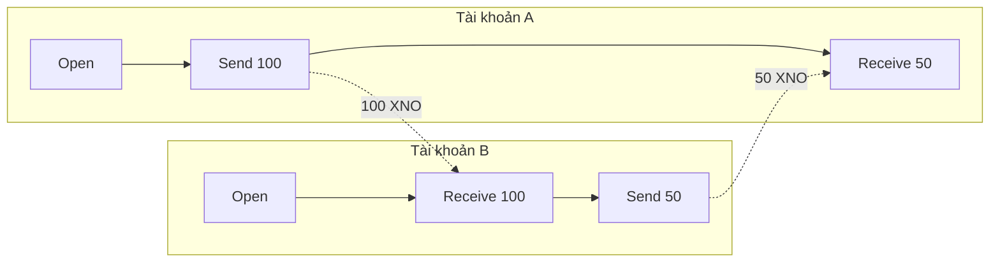

# 2. Related Work (Nghiên cứu liên quan)

Phần này khảo sát các hệ thống token hiện tại, các cơ chế khuyến khích lưu trữ (storage incentive mechanisms), các sổ cái dựa trên DAG (DAG-based ledgers), và các nỗ lực xây dựng nền kinh tế tri thức. Đối với mỗi danh mục, chúng tôi phân tích các đánh đổi trong thiết kế và xác định các khoảng trống cụ thể thúc đẩy thiết kế của OBT.

## 2.1 Cryptocurrency Tokens (Các Cryptocurrency Token)

### 2.1.1 Bitcoin (BTC)

Bitcoin [Nakamoto, 2008] đã thiết lập mô hình nền tảng cho tiền kỹ thuật số phi tập trung: cơ chế đồng thuận proof-of-work, mô hình giao dịch dựa trên UTXO (UTXO-based transaction model), và nguồn cung cố định 21 triệu token với các sự kiện chia đôi (halving) định kỳ.

Mặc dù Bitcoin đã chứng minh rằng sự khan hiếm kỹ thuật số phi tín nhiệm (trustless digital scarcity) có thể đạt được, thiết kế của nó về cơ bản không phù hợp với các khuyến khích tri thức:

- **Sự khan hiếm nguồn cung (Supply scarcity)** tạo ra hành vi tích trữ. Những người nắm giữ Bitcoin được khuyến khích *nắm giữ* (hold) thay vì *chi tiêu* (spend), vì token tăng giá do các hạn chế về nguồn cung. Các hệ thống tri thức yêu cầu các token phải *luân chuyển* (flow) — thưởng cho việc tạo lập, xác thực (verification) và lưu trữ (storage) trong một chu trình liên tục.
- **Proof-of-Work** tiêu thụ năng lượng tỷ lệ thuận với mức độ bảo mật, chứ không phải sản lượng hiệu quả. Mạng lưới Bitcoin hiện tiêu thụ khoảng 120 TWh/năm — tương đương với một quốc gia nhỏ — trong khi không tạo ra bất kỳ tạo tác tri thức (knowledge artifacts) nào.
- **Phí giao dịch (Transaction fees)** ($1–50 tùy thuộc vào tình trạng nghẽn mạng) khiến các giao dịch siêu nhỏ (micro-transactions) không khả thi. Các hoạt động tri thức thường liên quan đến các chuyển giao giá trị tương đương dưới một xu (ví dụ: một bản cập nhật trust đơn lẻ hoặc một PoMV tick).

OBT kế thừa nhận thức của Bitcoin rằng *xác thực mật mã có thể thay thế niềm tin thể chế* nhưng từ chối hoàn toàn mô hình nguồn cung, cơ chế đồng thuận và cấu trúc phí của nó.

### 2.1.2 Ethereum (ETH)

Ethereum [Buterin, 2014] đã tổng quát hóa khả năng viết kịch bản của Bitcoin thành một nền tảng hợp đồng thông minh Turing-complete. Quá trình chuyển đổi sang Proof-of-Stake (The Merge, 2022) đã giới thiệu cơ chế validator staking và slashing — các cơ chế liên quan nhiều hơn đến thiết kế của OBT.

**Các cải tiến liên quan của Ethereum được OBT kế thừa:**

1. **Correlation penalty.** Hình phạt slashing của Ethereum 2.0 tăng lên khi nhiều validator bị phạt trong cùng một cửa sổ epoch, làm cho các cuộc tấn công phối hợp trở nên tốn kém hơn theo cấp số siêu tuyến tính. OBT thích ứng công thức này: $m = 1 + \log_2(n)$, trong đó $n$ là số lượng các nút bị phạt đồng thời (§8.4).
2. **Cấp độ hoàn thành (Finality levels).** Ethereum phân biệt giữa các khối tạm thời và các khối đã hoàn thành (finalized). OBT tổng quát hóa điều này thành bốn cấp độ xác nhận (L0–L3, §4.6) với các đảm bảo mạnh dần.

**Các hạn chế của Ethereum đối với hệ thống tri thức:**

- **Phí gas (Gas fees)** tạo ra một mức sàn chi phí cho mỗi hoạt động. Ngay cả với các giải pháp Layer 2, mô hình gas vẫn giả định rằng tính toán là tài nguyên khan hiếm. Trong các hệ thống tri thức, *sự chú ý và chuyên môn* mới là những tài nguyên khan hiếm.
- **Trạng thái toàn cầu (Global state)** yêu cầu tất cả các validator phải xử lý tất cả các giao dịch. Các hoạt động tri thức về bản chất mang tính cục bộ — việc xác thực sự đồng thuận encoding của một KU chỉ liên quan đến những người tham gia, chứ không phải toàn bộ mạng lưới.
- **Staking dưới dạng định danh (Staking as identity)** liên kết danh tiếng với vốn. OBT sử dụng *năng lực đã được chứng minh* (điểm số EigenTrust từ công việc tri thức thực tế) thay vì các khoản tiền gửi tài chính.

## 2.2 Storage Incentive Tokens (Các Storage Incentive Token)

### 2.2.1 Filecoin (FIL)

Filecoin [Protocol Labs, 2017] là giao thức khuyến khích lưu trữ phức tạp nhất, kết hợp Proof-of-Replication (PoRep) và Proof-of-Spacetime (PoSt) với một thị trường giao dịch trung gian bằng token.

**Kiến trúc của Filecoin:**

```
Client → Deal Market → Storage Provider → PoRep (seal sector) → PoSt (WindowPoSt every 24h)
                                                                  ↓
                                                          FIL block reward
```

**Các tham số chính của Filecoin:**

| Tham số (Parameter) | Giá trị (Value) | Phiên bản tương đương ở OBT (OBT Equivalent) |
|-----------|-------|----------------|
| Sector size | 32 GiB | N/A (per-KU) |
| Seal time | 1-3 giờ (GPU) | N/A (no sealing) |
| Cửa sổ PoSt (PoSt window) | 24 giờ | 1 giờ (epoch) |
| Phần cứng (Hardware) | Yêu cầu GPU | Chỉ cần CPU |
| Hệ thống chứng minh (Proof system) | zk-SNARKs | Hàm băm BLAKE3 + FieldExtract |
| Nhận biết nội dung (Content awareness) | Không (các sector mờ đục) | Semantic (field-level proofs) |
| Hình phạt (Penalty) | Phí lỗi phân khu (Sector fault fee) | Giảm trừ trust lũy tiến 5 cấp độ |

**Bảng 3.** So sánh các tham số lưu trữ giữa Filecoin và OBT.

**Tại sao OBT không sử dụng cách tiếp cận của Filecoin:**

1. **Yêu cầu GPU loại trừ nhiều đối tượng.** Các bằng chứng zk-SNARK của Filecoin yêu cầu phần cứng GPU trị giá $500–5,000, loại bỏ những người tham gia thông thường. Các thử thách PoS-KU của OBT chỉ yêu cầu CPU và dung lượng lưu trữ tiêu chuẩn.
2. **Các sector mờ đục ngăn cản việc xác thực ngữ nghĩa.** Filecoin chứng minh rằng *một số dữ liệu* tồn tại nhưng không thể xác minh dữ liệu *nào* tồn tại hoặc liệu nó có giá trị hay không. Loại thử thách FieldExtract của OBT (§6.3) kiểm tra xem nhà cung cấp lưu trữ có thể trích xuất các trường ngữ nghĩa cụ thể từ một Knowledge Unit được lưu trữ hay không, chứng minh không chỉ sự tồn tại mà cả sự *hiểu biết*.
3. **Thị trường giao dịch (Deal market) làm tăng độ phức tạp không cần thiết.** Filecoin yêu cầu khách hàng thương lượng các giao dịch với các nhà cung cấp cụ thể. Trong OBT, storage là trách nhiệm của toàn bộ mạng lưới — bất kỳ nút nào cũng có thể lưu trữ bất kỳ KU nào, và phần thưởng được phân phối dựa trên công thức 5 yếu tố.

### 2.2.2 Arweave (AR)

Arweave [Williams, 2019] thực hiện một cách tiếp cận khác: lưu trữ vĩnh viễn được tài trợ bởi một khoản quỹ một lần. Cơ chế Succinct Proof of Random Access (SPoRA) khuyến khích các thợ đào lưu trữ toàn bộ tập dữ liệu (gọi là "weave") bằng cách yêu cầu các lần đọc ngẫu nhiên trong quá trình đào.

**Các cải tiến của Arweave liên quan đến OBT:**

- **Thu hồi ngẫu nhiên (Random recall).** Yêu cầu của Arweave là thợ đào truy cập ngẫu nhiên dữ liệu lịch sử giúp ngăn các nhà cung cấp lưu trữ loại bỏ dữ liệu cũ. OBT điều chỉnh khái niệm này trong các thử thách PoS-KU, nơi seed thử thách mang tính xác định nhưng không thể dự đoán trước: `BLAKE3(epoch ∥ node_id)`.
- **Content-addressed storage.** Arweave sử dụng các mã băm nội dung (content hashes) để định địa chỉ. Tương tự, OBT sử dụng các định danh nội dung BLAKE3 (CIDs) cho các Knowledge Units.

**Các hạn chế của Arweave:**

- **Tính vĩnh viễn (Permanence) không phù hợp đối với tri thức.** Tri thức liên tục phát triển — các sự thật được cập nhật, các giả thuyết bị bác bỏ, các mục dư thừa bị loại bỏ. OBT hỗ trợ quản lý vòng đời tri thức thông qua tốc độ chuyển hóa (metabolic rate) của PoMV và các cơ chế loại bỏ.
- **Không có bằng chứng ngữ nghĩa (No semantic proofs).** Giống như Filecoin, Arweave coi dữ liệu được lưu trữ là các byte mờ đục. Các bằng chứng lưu trữ của OBT có thể kiểm tra các thuộc tính ngữ nghĩa.

### 2.2.3 Sia (SC)

Sia [Vorick & Champine, 2014] đã tiên phong trong việc xác thực lưu trữ dựa trên bằng chứng Merkle (Merkle proof-based storage verification) với thiết kế đơn giản và dễ tiếp cận hơn Filecoin.

**Đóng góp của Sia cho OBT:**

Các loại thử thách PoS-KU FullHash và ByteRange của OBT được lấy cảm hứng trực tiếp từ cách tiếp cận bằng chứng lưu trữ của Sia. Nhận thức chính được mượn từ Sia là *các thử thách mật mã đơn giản có thể cung cấp đủ sự đảm bảo mà không cần zk-SNARKs*, giúp giảm đáng kể yêu cầu phần cứng.

## 2.3 DAG-Based Ledger Architectures (Các Kiến trúc DAG-Based Ledger)

### 2.3.1 Nano (XNO)

Nano [LeMahieu, 2018] đã giới thiệu kiến trúc block-lattice — một directed acyclic graph (DAG) trong đó mỗi tài khoản duy trì chuỗi blockchain của riêng mình. Thiết kế này đạt được các giao dịch miễn phí và hoàn thành dưới một giây.

**Mô hình block-lattice của Nano:**



**So sánh OBT's Account-Chain vs Nano's block-lattice:**

| Khía cạnh (Dimension) | Nano | OBT Account-Chain |
|-----------|------|-------------------|
| Block structure | `{previous, account, representative, balance, link, signature, work}` | `{previous, account, sequence, balance, operation, clock, timestamp, signature, block_hash}` |
| Consensus | Open Representative Voting (ORV) | Threshold K/N witnesses |
| Ngăn ngừa Double-spend | Dựa trên bỏ phiếu (Vote-based) | VectorClock + sequence monotonicity |
| Giải quyết rẽ nhánh (Fork resolution) | Trọng số bỏ phiếu (Vote weight) | First-seen + phân định bằng mã băm BLAKE3 |
| Chống spam (Anti-spam) | Khay số dư + PoW | Giới hạn tỷ lệ kiểm soát bởi trust (Trust-gated rate limits) |
| Phí (Fees) | Không (Zero) | Không (Zero) |
| Các loại khối (Block types) | State blocks | Typed TransferOp (Open/Mint/Send/Receive) |
| Sắp xếp nhân quả (Causal ordering) | Ngầm định (trường link) | Tường minh (VectorClock) |
| Cấp độ hoàn thành (Finality levels) | 1 (đã xác nhận) | 4 (L0-L3) |
| Định danh (Identity) | Cặp khóa tài khoản | Uy tín EigenTrust (EigenTrust reputation) |
| Minting | Phân phối trước (genesis) | Theo yêu cầu (output-based) |
| Nhận biết nội dung | Không | TransferOp preserves provenance |
| Hình phạt rẽ nhánh (Fork punishment) | Không | ForkWarrant + trust slash |
| Bằng chứng lưu trữ (Storage proofs) | N/A | PoS-KU |
| Nguồn cung (Supply) | Cố định (133M, phân phối đầy đủ) | Gần như vô hạn, kiểm soát lưu lượng |
| Kích thước khối (Block size) | ~216 bytes | ~240-320 bytes |
| Mã hóa (Crypto) | BLAKE2b | BLAKE3 + Ed25519 |

**Bảng 4.** So sánh chi tiết giữa Nano block-lattice và OBT Account-Chain qua 17 khía cạnh.

**Các khác biệt chính trong triết lý thiết kế:**

1. **Minting.** Toàn bộ nguồn cung của Nano được tạo ra tại genesis và được phân phối thông qua vòi (faucet). OBT đúc (mints) các token mới liên tục khi công việc tri thức được thực hiện — đây là một mô hình kinh tế khác biệt căn bản.
2. **Sắp xếp nhân quả (Causal ordering).** Nano sử dụng trường `link` để kết nối các cặp gửi/nhận. OBT bổ sung các VectorClocks rõ ràng, cho phép phân tích sắp xếp thứ tự nhân quả chính thức và phát hiện các hoạt động đồng thời có thể chỉ ra hành vi Byzantine.
3. **Xử lý rẽ nhánh (Fork handling).** Nano giải quyết rẽ nhánh thông qua bỏ phiếu đại diện (dựa trên trọng số). OBT sử dụng phân định xác định (mã băm BLAKE3 thấp hơn sẽ thắng) kết hợp với ForkWarrants ghi lại vĩnh viễn bằng chứng và kích hoạt các hình phạt trust. Điều này tạo ra một cơ chế răn đe (*deterrent*) vốn không có ở Nano.

### 2.3.2 IOTA (MIOTA)

IOTA [Popov, 2018] sử dụng cấu trúc DAG (Tangle), trong đó mỗi giao dịch xác thực hai giao dịch trước đó. IOTA 2.0 đã giới thiệu Mana — một cơ chế phân bổ tài nguyên dựa trên danh tiếng.

**Các cải tiến liên quan của IOTA:**

- **Mana dưới dạng danh tiếng (Mana as reputation).** Mana của IOTA 2.0 đóng vai trò tương tự như cơ chế trust-as-resource-proxy của OBT: danh tiếng kiếm được thông qua việc tham gia sẽ thay thế phí giao dịch làm cơ chế kiểm soát quyền truy cập. Hệ thống phân cấp NodeTier 7 tầng của OBT có thể được coi là một phiên bản rời rạc của điểm danh tiếng liên tục ở Mana.
- **Decayed Resource Regulation (DRR).** Cơ chế DRR của IOTA giới hạn thông lượng dựa trên danh tiếng suy giảm. OBT áp dụng một khái niệm tương tự thông qua công thức `trust(t) = trust_0 \times e^{-0.01 \times t}` (§8.2).

### 2.3.3 Holochain (HOT)

Holochain [Harris-Braun et al., 2018] thực hiện cách tiếp cận cấp tiến nhất: mỗi người tham gia tự chạy chuỗi của riêng mình, và việc xác thực được thực hiện bởi một nhóm nhỏ ngẫu nhiên các peer trong một vùng lân cận DHT.

**Ảnh hưởng của Holochain đối với OBT:**

- **Chuỗi nguồn (Source chains).** Các chuỗi nguồn trên mỗi agent của Holochain có khái niệm tương tự như Account-Chain của OBT: mỗi người tham gia là người viết duy nhất chuỗi của riêng họ.
- **Xác thực DHT (DHT validation).** Vùng lân cận xác thực dựa trên DHT của Holochain tương ứng với mô hình threshold witness của OBT, nơi $K = \min(\max(3, N_{active}/100), 7)$ nhân chứng từ DHT xác thực các hoạt động.
- **Định hướng tác nhân so với định hướng dữ liệu (Agent-centric vs. data-centric).** Holochain rõ ràng định hướng theo tác nhân (agent-centric). OBT định hướng theo tri thức (*knowledge-centric*) — KU là thực thể chính, với danh tiếng của agent được rút ra từ chất lượng đóng góp tri thức.

## 2.4 Infrastructure and IoT Tokens (Các Token Hạ tầng và IoT)

### 2.4.1 Helium (HNT)

Helium [Haleem et al., 2018] khuyến khích vùng phủ sóng không dây LoRaWAN thông qua Proof-of-Coverage (PoC). Sự liên quan của nó với OBT nằm ở hai khía cạnh:

1. **Minting đặc thù cho dịch vụ (Service-specific minting).** Helium đúc token khi các điểm phát sóng (hotspots) cung cấp vùng phủ sóng đã xác thực — tương tự như cơ chế output-based minting của OBT, nơi các token được tạo ra khi công việc tri thức đã được xác thực được thực hiện.
2. **Danh sách từ chối (Denylist) làm hình phạt.** Helium duy trì một denylist do cộng đồng quản trị cho các điểm phát sóng gian lận. Cấp độ Tombstone của OBT (§8.2) thực hiện chức năng tương tự nhưng có quy trình kháng nghị 4 lớp chính thức.

### 2.4.2 Cosmos (ATOM) và EigenLayer

Cosmos [Kwon & Buchman, 2016] đã giới thiệu *tombstoning* — việc loại bỏ vĩnh viễn các validator bị phát hiện ký hai lần (double-signing). OBT áp dụng khái niệm này cho hình phạt Tier 5 của mình.

EigenLayer [Eigenlabs, 2023] đã giới thiệu cơ chế ủy ban phủ quyết (veto committee) cho các tranh chấp slashing khi restaking. Các lớp kháng nghị L3 và L4 của OBT (§8.6) mượn khái niệm này: một ban gồm $K$ nút có độ tin cậy cao được lựa chọn ngẫu nhiên sẽ đánh giá các hình phạt bị tranh chấp.

## 2.5 Knowledge Economy Attempts (Các nỗ lực xây dựng Nền kinh tế Tri thức)

### 2.5.1 Ocean Protocol (OCEAN)

Ocean Protocol [McConaghy et al., 2019] tạo ra một thị trường cho dữ liệu và các dịch vụ AI, sử dụng token OCEAN để truy cập và quản lý dữ liệu. Mặc dù chia sẻ mục tiêu thương mại hóa tri thức với OBT, Ocean khác biệt về căn bản:

- **Dữ liệu dưới dạng hàng hóa (Data-as-commodity).** Ocean coi dữ liệu như một sản phẩm để mua bán. OBT coi tri thức là một *hàng hóa công cộng* được truy cập tự do (Tiên đề A3), với các token thưởng cho việc *tạo lập* chứ không phải việc *truy cập*.
- **Mô hình thị trường (Marketplace model).** Ocean yêu cầu định giá rõ ràng và các giao dịch mua hàng. OBT phân phối phần thưởng theo thuật toán dựa trên điểm số chất lượng PoMV.

### 2.5.2 SingularityNET (AGIX)

SingularityNET [Goertzel et al., 2017] tạo ra một thị trường cho các dịch vụ AI. Token AGIX tạo điều kiện thanh toán cho suy luận AI (AI inference). Khác với OBT, SingularityNET tập trung vào việc *tiêu thụ dịch vụ AI* chứ không phải *tạo lập và bảo tồn tri thức*.

## 2.5.3 The Attention Economy (BAT, Steemit) (Nền kinh tế Chú ý)

Basic Attention Token (BAT) [Brave, 2017] và Steemit [Larimer et al., 2016] đã cố gắng mã hóa sự chú ý của con người và việc sáng tạo nội dung. Cả hai đều gặp phải các vấn đề trục lợi (gaming) cơ bản:

- **Bể phần thưởng (Reward pool) của Steemit** bị chi phối bởi các nhóm mua bán phiếu bầu (vote-buying cartels). Chất lượng nội dung trở thành thứ yếu so với sự tích lũy vốn xã hội.
- **Phép đo sự chú ý của BAT** dựa trên các chỉ số cấp trình duyệt vốn dễ dàng bị giả mạo.

OBT tránh được những cạm bẫy này nhờ hệ thống xác thực đa tín hiệu của PoMV (6 tín hiệu độc lập) và quy trình 4 cổng chất lượng đi trước bất kỳ điều kiện nhận thưởng nào.

## 2.6 Gap Analysis: Why OBT Is Different (Phân tích Khoảng trống: Tại sao OBT lại Khác biệt)

Bảng sau đây tóm tắt các khoảng trống chính trong các hệ thống hiện tại mà OBT giải quyết:

| Khoảng trống (Gap) | Các Hệ thống Hiện tại (Existing Systems) | Giải pháp từ OBT (OBT Solution) |
|-----|-----------------|--------------|
| Không đo lường chất lượng tri thức | Tất cả các storage token coi dữ liệu là các byte mờ đục | Tính điểm chất lượng 6 tín hiệu PoMV được tích hợp với việc tính toán phần thưởng |
| Rào cản phí đối với các hoạt động siêu nhỏ | Gas ở ETH, gas ở FIL, phí ở AR | Giao dịch miễn phí với trust-as-resource-proxy |
| Sự khan hiếm không phù hợp với tri thức | Hard cap ở BTC, cap ở FIL, cap ở AR | Nguồn cung gần như vô hạn, kiểm soát lưu lượng bởi $E = B \times A \times Q$ |
| Không có bằng chứng lưu trữ nhận biết nội dung | WindowPoSt ở FIL, SPoRA ở AR là mờ đục | PoS-KU FieldExtract kiểm tra hiểu biết ngữ nghĩa |
| Danh tiếng = vốn | Staking ở ETH, tài sản thế chấp ở FIL | Trust = năng lực tri thức đã được chứng minh (EigenTrust) |
| Không có phân cấp hình phạt | Ethereum binary slash, Cosmos tombstone | Hình phạt lũy tiến 5 cấp độ với khuếch đại tương quan |
| Không có quy trình kháng nghị | Các hình phạt ở ETH/ATOM được thực hiện ngay lập tức và là quyết định cuối cùng | Kháng nghị 4 lớp (tự động bảo vệ → tranh chấp → hồi tố → cuối cùng) |
| Nhầm lẫn giữa Token và Danh tiếng | Hầu hết các hệ thống sử dụng cùng một token cho staking và chi tiêu | Phân tách OBT/Trust: "tiền lương so với giấy phép hành nghề y" |
| Minting = đầu vào của đồng thuận | BTC PoW, ETH PoS | Việc minting ở OBT là OUTPUT của đồng thuận tri thức |
| Lưu trữ = cam kết mờ đục | Các sector ở FIL, các chunk ở AR | Lưu trữ ở OBT = tri thức ngữ nghĩa với vòng đời cụ thể |

**Bảng 5.** Phân tích khoảng trống: các hạn chế của hệ thống hiện tại và giải pháp từ OBT.

Nhận thức cơ bản là thiết kế token tri thức yêu cầu các *nguyên bản (primitives) khác biệt* so với thiết kế token tài chính. Tri thức không có tính cạnh tranh tiêu dùng, gia tăng giá trị thông qua việc sao chép, yêu cầu xác thực ngữ nghĩa, và hoạt động trên quy mô giao dịch siêu nhỏ vốn không tương thích với các hệ thống dựa trên phí. OBT, theo hiểu biết của chúng tôi, là hệ thống token đầu tiên được thiết kế từ các nguyên tắc cơ bản (first principles) cho những yêu cầu này.
