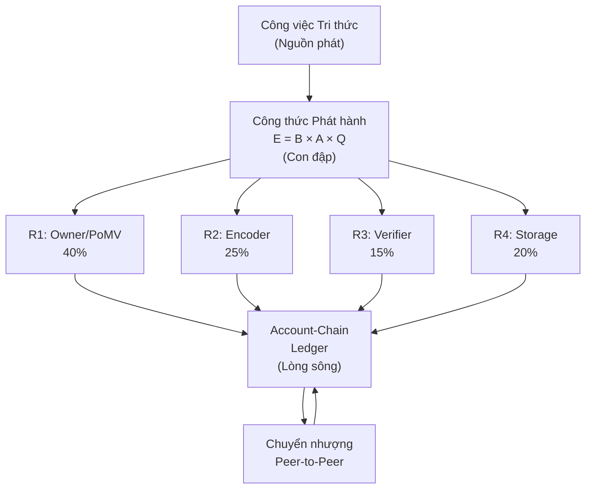
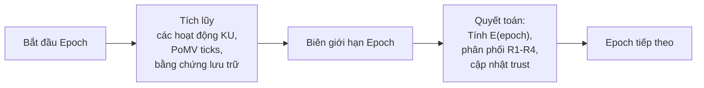

# 3. Token Design Philosophy (Triết lý Thiết kế Token)

Phần này trình bày bản sắc của OBT như một knowledge utility token, mô hình nguồn cung, hệ thống độ chính xác, và sáu quyết định thiết kế quan trọng đã định hình nên kiến trúc này.

## 3.1 Token Identity: Utility Token, Not Cryptocurrency (Bản sắc Token: Utility Token, không phải Cryptocurrency)

OBT chiếm một vị thế độc đáo trong không gian thiết kế token. Nó không phải là một cryptocurrency (được thiết kế cho các giao dịch tài chính và đầu cơ) hay một điểm thưởng trong ứng dụng đơn giản (được phát hành tập trung, không thể chuyển nhượng). OBT là một *knowledge utility token* — một đơn vị tính toán có thể chuyển nhượng dùng để đo lường giá trị kinh tế của công việc tri thức đã được xác thực.

Sự khác biệt này được hiểu rõ nhất thông qua phép so sánh:

| Loại Token (Token Type) | Nguồn Giá trị (Value Source) | Mô hình Chuyển nhượng (Transfer Model) | Mô hình Nguồn cung (Supply Model) | Ví dụ (Example) |
|------------|-------------|----------------|--------------|---------|
| Cryptocurrency | Sự khan hiếm + đầu cơ | Thị trường mở | Cố định hoặc giảm phát | BTC, ETH |
| Điểm thưởng trong ứng dụng | Cam kết của nhà phát hành | Không thể chuyển nhượng | Tùy ý (phát hành tập trung) | Dặm bay tích lũy |
| Staking token | Tiền ký quỹ bảo mật | Khóa/Mở khóa | Lạm phát (phần thưởng) | ETH (staked) |
| **Knowledge utility** | **Công việc tri thức đã thực hiện** | **Peer-to-peer** | **Kiểm soát lưu lượng (gần như vô hạn)** | **OBT** |

**Bảng 6.** Phân loại các loại token và vị thế của OBT.

Thuộc tính quan trọng là OBT không có cơ chế đầu cơ. Không có lợi suất staking, không có bể thanh khoản (liquidity pool), không có tính kết hợp DeFi. Tuyên bố giá trị (value proposition) của token hoàn toàn mang tính chức năng: *OBT đo lường khối lượng công việc tri thức đã được xác thực đã thực hiện*. Nếu không có tri thức nào được tạo ra, không có OBT nào được đúc (minted).

## 3.2 The "kWh Analogy" (Phép So sánh với kWh)

Phép so sánh chính xác nhất cho OBT là kilowatt-giờ (kWh):

| Thuộc tính (Property) | kWh | OBT |
|----------|-----|-----|
| Đối tượng đo lường | Sản lượng/tiêu thụ năng lượng | Công việc tri thức đã thực hiện |
| Nguồn cung | Vô hạn (tạo ra theo nhu cầu) | Gần như vô hạn (được đúc theo nhu cầu) |
| Nguồn giá trị | Tiện ích (chạy thiết bị, sưởi ấm) | Tiện ích (tri thức đã xác thực, lưu trữ, truy cập) |
| Sự khan hiếm | Không khan hiếm nhân tạo | Không khan hiếm nhân tạo |
| Động cơ tích trữ | Tối thiểu (điện năng bị tiêu thụ) | Tối thiểu (giá trị nằm ở tri thức, không phải token) |
| Kiểm soát lưu lượng | Công suất lưới điện, giới hạn phát điện | Công thức phát hành $E = B \times A \times Q$ |
| Tiềm năng đầu cơ | Thấp (hàng hóa, không phải tài sản) | Thấp theo thiết kế (không có tính kết hợp DeFi) |

**Bảng 7.** Phép so sánh kWh–OBT qua bảy khía cạnh.

Giống như kWh được tạo ra khi máy phát điện sản xuất điện năng và bị tiêu thụ khi thiết bị sử dụng điện, OBT được tạo ra khi người tham gia thực hiện công việc tri thức đã được xác thực, và luân chuyển qua mạng lưới khi những người tham gia chuyển nhượng, tích lũy và chi tiêu token.

## 3.3 Supply Model: "River, Not Lake" (Mô hình Nguồn cung: "Dòng sông, không phải Hồ nước")

### 3.3.1 The River Metaphor (Hình ảnh ẩn dụ về Dòng sông)

Hầu hết các hệ thống token mô hình hóa nguồn cung như một *hồ nước* — một lượng nước cố định được phân phối, lưu thông và cuối cùng bị cạn kiệt hoặc bão hòa. 21 triệu coin của Bitcoin tạo thành một hồ nước hữu hạn. EIP-1559 của Ethereum cố gắng duy trì mực nước hồ ổn định bằng cách cân bằng giữa việc phát hành và đốt (burn) token.

OBT mô hình hóa nguồn cung như một *dòng sông*:

- **Nguồn phát (The source)** là công thức phát hành (emission formula), tạo ra các token mới khi công việc tri thức diễn ra.
- **Con đập (The dam)** là $E(\text{epoch}) = B \times A(\text{epoch}) \times Q(\text{epoch})$, kiểm soát tốc độ dòng chảy dựa trên hoạt động mạng lưới ($A$) và chất lượng tri thức ($Q$).
- **Lòng sông (The riverbed)** là Account-Chain ledger, nơi các token luân chuyển giữa các thành viên tham gia.
- **Không có giới hạn tổng lượng nước**, nhưng tốc độ dòng chảy luôn được kiểm soát.

**Hình 1.** Mô hình nguồn cung "Dòng sông" — token luân chuyển từ công việc tri thức qua công thức phát hành vào bốn dòng phần thưởng, sau đó lưu thông qua các giao dịch peer-to-peer.

### 3.3.2 Why No Hard Cap (Tại sao không có Giới hạn Nguồn cung Cứng)

Các giới hạn nguồn cung cứng tạo ra ba vấn đề cho các hệ thống tri thức:

1. **Áp lực giảm phát cản trước chi tiêu.** Nếu tổng nguồn cung là cố định và nhu cầu tăng lên, mỗi token sẽ tăng giá. Điều này khuyến khích hành vi tích trữ thay vì đầu tư vào tri thức — trái ngược với hành vi mong muốn.
2. **Lợi thế của người đi đầu tạo ra sự phân phối không công bằng.** Những thợ đào ban đầu của Bitcoin đã nhận được những phần thưởng không tương xứng. Trong một hệ thống tri thức, những tri thức *tốt nhất* có thể được tạo ra sau hàng thập kỷ hệ thống hoạt động; những người sáng tạo ban đầu không nên nhận được phần thưởng quá lớn chỉ vì họ đến sớm.
3. **Các sự kiện chia đôi (halving) tạo ra các cú sốc khan hiếm nhân tạo.** Các sự kiện halving bốn năm một lần của Bitcoin tạo ra các cú sốc nguồn cung có thể dự đoán được và bị các nhà đầu cơ khai thác. Việc sản xuất tri thức là liên tục và không nên phải chịu những đợt giảm phần thưởng tùy tiện.

Nguồn cung gần như vô hạn của OBT, được điều hành bởi công thức phát hành, sẽ tránh được cả ba vấn đề trên. Lượng phát hành mỗi epoch được giới hạn bởi $E = B \times A \times Q$, đảm bảo sự tăng trưởng có trật tự mà không cần các ràng buộc nhân tạo.

### 3.3.3 Supply Projection (Dự báo Nguồn cung)

Dựa trên công thức phát hành với các giả định tăng trưởng thận trọng:

| Năm (Year) | Số nút hoạt động TB (Avg Active Nodes) | Hệ số Q TB (Avg Q Factor) | Lượng phát hành TB/Epoch (Avg Emission/Epoch) | Nguồn cung mới hàng năm (Annual New Supply) | Nguồn cung lũy kế (Cumulative Supply) | Lạm phát so với năm trước (YoY Inflation) |
|------|-----------------|-------------|--------------------|--------------------|-------------------|---------------|
| 1 | 500 | 0.50 | 2,500 OBT | ~21,9 triệu OBT | 21,9 triệu | — |
| 2 | 2,000 | 0.55 | 11,000 OBT | ~96,4 triệu OBT | 118,3 triệu | 340% |
| 3 | 5,000 | 0.60 | 30,000 OBT | ~262,8 triệu OBT | 381,1 triệu | 222% |
| 5 | 10,000 | 0.65 | 65,000 OBT | ~569,4 triệu OBT | 1,8 tỷ | 46% |
| 10 | 50,000+ | 0.70 | 70,000 OBT | ~613,2 triệu OBT | 5,5 tỷ | 13.5% |

**Bảng 8.** Dự báo nguồn cung trong 10 năm. Hệ số hoạt động $A$ được giới hạn ở mức 10.0, do đó lượng phát hành sẽ đi ngang khi $N_{active} \geq 10{,}000$.

Các nhận xét chính:

- **Lạm phát tự động suy giảm** từ mức cực cao (Năm 1, do cơ sở ban đầu nhỏ) xuống mức vừa phải (~13.5% vào Năm 10) mà không cần bất kỳ sự kiện halving nào.
- **Lượng phát hành tối đa hàng năm** là khoảng 876 triệu OBT ($10{,}000 \times 10.0 \times 1.0 \times 8{,}760$ epoch/năm), chỉ đạt được khi quy mô mạng lưới ở mức tối đa và chất lượng hoàn hảo.
- **Không có sự phân bổ trước (No pre-allocation).** Không giống như hầu hết các dự án token, OBT không có lượng phân bổ cho đội ngũ phát triển, không có phân bổ cho nhà đầu tư, không có quỹ dự trữ của tổ chức. Tất cả các token được đúc thông qua công việc tri thức đã được xác thực.

## 3.4 Precision Model: milliOBT (Mô hình Độ chính xác: milliOBT)

OBT sử dụng số học nguyên (integer arithmetic) trong toàn bộ hệ thống để tránh các vấn đề về độ chính xác của dấu phẩy động. Hệ số nhân độ chính xác là:

$$\text{OBT\_PRECISION\_MULTIPLIER} = 1{,}000$$

Điều này có nghĩa là:
- 1 OBT = 1,000 milliOBT (biểu diễn nội bộ)
- Tất cả số dư, giao dịch chuyển nhượng, và phần thưởng đều được theo dõi bằng milliOBT (u64)
- Số dư tối đa có thể biểu diễn: $2^{64} - 1 \approx 1.8 \times 10^{16}$ milliOBT = $1.8 \times 10^{13}$ OBT

Với lượng phát hành tối đa (~876 triệu OBT/năm), sẽ mất khoảng $2 \times 10^4$ năm để đạt đến giới hạn u64. Tràn số (overflow) không phải là một mối bận tâm thực tế.

Việc lựa chọn độ chính xác 1,000× (so với mức $10^{18}$ Wei/ETH của Ethereum) phản ánh mô hình kinh tế đơn giản hơn của OBT: không có định giá gas, không có tính kết hợp DeFi, và không cần độ chi tiết quá mức. milliOBT cung cấp độ chính xác vừa đủ cho tất cả các tính toán phần thưởng trong khi vẫn duy trì các giá trị dễ đọc.

## 3.5 Epoch System (Hệ thống Epoch)

OBT hoạt động trên một chu kỳ epoch cố định:

$$\text{OBT\_EPOCH\_DURATION\_S} = 3{,}600 \text{ giây (1 giờ)}$$

**Biên giới hạn epoch (Epoch boundaries)** được tính toán từ Unix epoch:
$$\text{epoch}(t) = \lfloor t / 3{,}600 \rfloor$$
$$\text{start}(\text{epoch}) = \text{epoch} \times 3{,}600$$
$$\text{end}(\text{epoch}) = (\text{epoch} + 1) \times 3{,}600 - 1$$

Điều này tạo ra:
- 24 epoch mỗi ngày
- 168 epoch mỗi tuần
- 8,760 epoch mỗi năm

**Vòng đời của Epoch (Epoch lifecycle):**

**Hình 2.** Vòng đời epoch — giai đoạn tích lũy tiếp theo là quyết toán tại biên giới hạn.

**Tại sao lại là 1 giờ?**

Thời lượng epoch đại diện cho một sự đánh đổi:

| Thời lượng (Duration) | Ưu điểm (Pros) | Nhược điểm (Cons) |
|----------|------|------|
| 10 phút | Nhận phần thưởng nhanh hơn | Chi phí vận hành cao hơn, gossip có thể không hội tụ |
| **1 giờ** | **Hội tụ gossip, khối lượng quyết toán trong tầm kiểm soát** | **Độ trễ trung bình cho việc ghi nhận phần thưởng** |
| 24 giờ | Chi phí vận hành tối thiểu | Độ trễ nhận phần thưởng không thể chấp nhận được |

Một giờ được chọn bởi vì:
1. Nó cung cấp đủ thời gian cho việc lan truyền gossip hội tụ trên toàn mạng lưới.
2. Nó phù hợp với các khoảng thời gian PoMV tick (60-300 giây), cho phép có 12-60 tick mỗi epoch.
3. Nó tạo ra khối lượng công việc quyết toán có thể quản lý được (~24 quyết toán/ngày).

## 3.6 Six Critical Design Decisions (Sáu Quyết định Thiết kế Quan trọng)

Kiến trúc của OBT được định hình bởi sáu quyết định thiết kế quan trọng, mỗi quyết định đều được giải quyết thông qua phân tích hệ thống các phương án thay thế:

### Q1: Có nên có một mức trần phát hành toàn cầu cho mỗi epoch?

**Decision: CÓ.** Nếu không có mức trần cho mỗi epoch, một nút bị xâm nhập có trust cao có thể đúc token không giới hạn. Công thức phát hành $E = B \times A \times Q$ cung cấp một giới hạn trên tuyệt đối cho mỗi epoch, và mức trần phần thưởng cho từng nút $E / N_{active} \times \text{TrustMultiplier}(\text{tier})$ giới hạn các nút riêng lẻ.

**Các phương án thay thế được xem xét:**
- *Không có mức trần (đúc vô hạn):* Bị loại — tạo điều kiện cho các cuộc tấn công siêu lạm phát.
- *Chỉ giới hạn cho từng nút:* Bị loại — không ngăn chặn được các cuộc tấn công Sybil, nơi nhiều nút giả mạo có thể đúc từng lượng nhỏ token.
- *Giới hạn toàn cầu + giới hạn từng nút:* **Được chấp nhận** — phòng thủ chuyên sâu.

### Q2: Phần thưởng có nên được kiểm soát bởi trust?

**Decision: CÓ.** Các nút mới (cấp Leaf) chỉ nhận được 10% tốc độ nhận thưởng tối đa, tăng dần lên 200% đối với các nút GlobalBackbone. Điều này tạo ra khả năng kháng Sybil tự nhiên: việc tạo ra nhiều danh tính cấp Leaf giả mạo chỉ mang lại 10% × $n$ phần thưởng, trong khi chi phí để nâng cao trust lại tỷ lệ thuận với đóng góp tri thức thực sự.

**Hệ số nhân trust theo từng cấp:**

| Cấp độ (Tier) | Tên gọi (Name) | Hệ số nhân (Multiplier) | Ngưỡng thăng cấp (Promotion Threshold) |
|------|------|:----------:|:-------------------:|
| 0 | Leaf | 0.10 | — |
| 1 | Contributor | 0.50 | 0.30 |
| 2 | Local SP | 1.00 | 0.60 |
| 3 | Regional SP | 1.25 | 0.75 |
| 4 | Country SP | 1.50 | 0.85 |
| 5 | Continental SP | 1.75 | 0.92 |
| 6 | Global Backbone | 2.00 | 0.97 |

**Bảng 9.** Hệ thống phân cấp NodeTier với các hệ số nhân trust và ngưỡng thăng cấp.

### Q3: Gian lận có nên bị trừng phạt vượt ra ngoài sự suy giảm trust tự nhiên?

**Decision: CÓ.** Sự suy giảm trust tự nhiên ($e^{-0.01t}$) là không đủ để ngăn chặn gian lận tích cực. Hệ thống hình phạt 5 cấp độ (§8) cung cấp các phản hồi lũy tiến từ cảnh báo đến cấm vĩnh viễn, với cơ chế khuếch đại tương quan cho các cuộc tấn công phối hợp.

### Q4: Cấu trúc số dư nào nên được sử dụng?

**Decision: Account-Chain** (các chuỗi trên mỗi tài khoản theo phong cách Nano).

Đây là quyết định có ảnh hưởng kỹ thuật lớn nhất. Ba phương án thay thế dựa trên CRDT đã được đánh giá và loại bỏ:

1. **G-Counter:** Tăng đơn điệu — không thể biểu diễn việc chi tiêu.
2. **PN-Counter:** Cho phép giảm đồng thời, có thể tạo ra số dư âm (overdraft).
3. **Bounded Counter:** Yêu cầu điều phối đồng bộ, làm mất đi mục đích của các CRDT.

Account-Chain cung cấp ngữ nghĩa người ghi duy nhất (single-writer semantics) cho mỗi tài khoản, loại bỏ vấn đề overdraft trong khi vẫn duy trì sự lan truyền tương thích với gossip. Xem §4.1 để biết phân tích chính thức.

### Q5: Có nên cho phép cấm vĩnh viễn (Tombstone) không?

**Decision: CÓ.** Phân tích về Ethereum (slashing), Cosmos (tombstoning), và Helium (denylist) chỉ ra rằng tất cả các hệ thống ở cấp độ sản xuất (production-grade) đều yêu cầu một cơ chế loại trừ vĩnh viễn đối với các tác nhân tấn công có hệ thống (kẻ cầm đầu, giả mạo danh tính). Cấp độ Tombstone của OBT yêu cầu bằng chứng về *gian lận có tổ chức và có hệ thống*, đồng thời bao gồm một quy trình kháng nghị nghiêm ngặt (sự đồng thuận >80% của các nút cấp cao nhất + bằng chứng mật mã).

### Q6: Thời lượng epoch tối ưu là bao nhiêu?

**Decision: 1 giờ (3,600 giây).** Phân tích năm thời lượng ứng viên:

| Thời lượng (Duration) | Hệ số Hoạt động (Activity Factor) | Độ phủ sóng Gossip (Gossip Coverage) | Khối lượng Quyết toán (Settlement Load) | Phán quyết (Verdict) |
|----------|:--------------:|:--------------:|:---------------:|---------|
| 1 phút | Quá chi tiết | Kém | Rất cao | ❌ |
| 10 phút | Chấp nhận được | Một phần | Cao | ❌ |
| **1 giờ** | **Tốt** | **Đầy đủ** | **Trung bình** | **✅** |
| 6 giờ | Thô | Đầy đủ | Thấp | ❌ |
| 24 giờ | Rất thô | Đầy đủ | Tối thiểu | ❌ |

**Bảng 10.** Phân tích thời lượng epoch. 1 giờ cung cấp sự cân bằng tối ưu giữa sự hội tụ gossip, độ trễ phần thưởng và chi phí tính toán.
