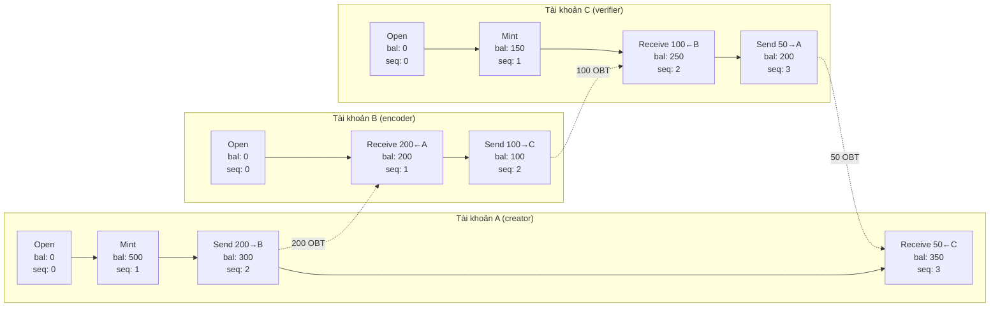
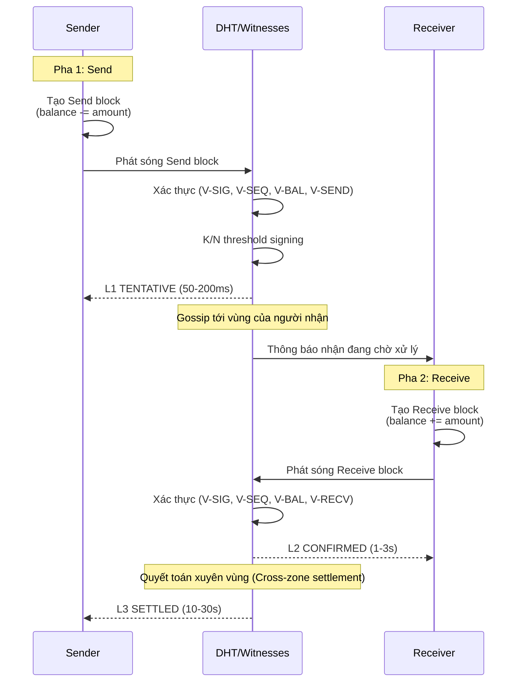
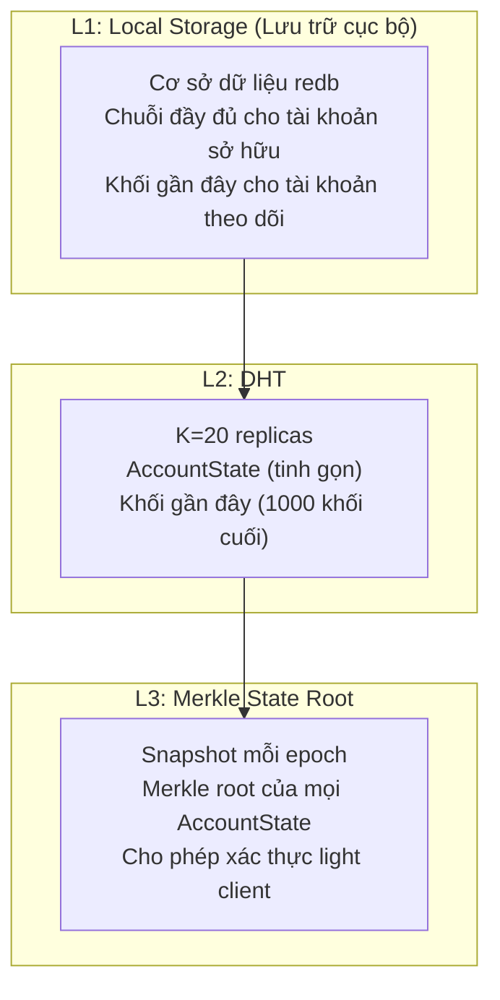

# 4. Account-Chain Ledger

Phần này trình bày kiến trúc OBT ledger: một Account-Chain lấy cảm hứng từ Nano, trong đó mỗi thành viên tham gia duy trì một chuỗi append-only độc lập gồm các khối giao dịch (transfer blocks). Chúng tôi bắt đầu bằng một phân tích chính thức về lý do tại sao việc theo dõi số dư dựa trên CRDT không phù hợp, sau đó đặc tả thiết kế Account-Chain, các quy tắc xác thực khối (block validation rules), phát hiện rẽ nhánh (fork detection), và các lớp lưu trữ.

## 4.1 Why Not CRDTs for Balance Tracking (Tại sao không sử dụng CRDT để theo dõi Số dư)

OneBrain Protocol (OBP) sử dụng rộng rãi các Conflict-free Replicated Data Types (CRDTs) — G-Counters cho các bộ tích lũy đơn điệu (monotonic accumulators), PN-Counters cho các đại lượng khả biến, ORSets cho các tập hợp, và LWW-Registers cho siêu dữ liệu. Một câu hỏi tự nhiên là liệu CRDT cũng có thể theo dõi số dư OBT hay không.

Chúng tôi đánh giá ba ứng viên CRDT và chứng minh rằng không có ứng viên nào đáp ứng các yêu cầu cho một hệ thống số dư chính xác.

### 4.1.1 G-Counter: Cannot Represent Spending (G-Counter: Không thể biểu diễn việc Chi tiêu)

G-Counter là một vector gồm các số nguyên không âm, mỗi bản sao (replica) có một số nguyên, chỉ hỗ trợ hoạt động tăng (increment). Giá trị toàn cầu là tổng giá trị của tất cả các bản sao.

**Property:** $\forall t_1 < t_2: \text{value}(t_2) \geq \text{value}(t_1)$

G-Counters là lý tưởng để theo dõi `total_earned` (Tiên đề A1: token kiếm được là vĩnh viễn) nhưng không thể biểu diễn việc chi tiêu: không có hoạt động giảm (decrement).

**Phán quyết:** ❌ Không phù hợp để theo dõi số dư (không thể chi tiêu).

### 4.1.2 PN-Counter: Allows Overdraft (PN-Counter: Cho phép xảy ra Overdraft)

PN-Counter kết hợp hai G-Counters — một cho hoạt động tăng (P) và một cho hoạt động giảm (N). Giá trị là $P - N$.

**Vấn đề overdraft (Overdraft problem):** Xét Tài khoản A với số dư 100, kết nối với hai bản sao $R_1$ and $R_2$:

1. $R_1$ xử lý giao dịch chi tiêu 80: $N_{R_1} \leftarrow N_{R_1} + 80$. Số dư cục bộ = 20. ✓
2. *Đồng thời (Concurrently)*, $R_2$ xử lý giao dịch chi tiêu 60: $N_{R_2} \leftarrow N_{R_2} + 60$. Số dư cục bộ = 40. ✓
3. Sau khi trộn CRDT (CRDT merge): $P = 100, N = 80 + 60 = 140$. **Số dư toàn cầu = -40.** ✗

Cả hai giao dịch chi tiêu đều có vẻ hợp lệ ở cục bộ (mỗi bên đều nhìn thấy đủ số dư), nhưng các hoạt động giảm đồng thời lại tạo ra số dư âm. Đây không phải là một lỗi — đó là một thuộc tính cố hữu của các PN-Counters hoạt động dưới tính nhất quán cuối cùng (eventual consistency).

**Chứng minh chính thức:** Đối với bất kỳ PN-Counter nào có giá trị $v > 0$, tồn tại hai hoạt động giảm đồng thời $d_1, d_2$ sao cho $d_1 \leq v$ và $d_2 \leq v$ nhưng $d_1 + d_2 > v$, dẫn đến giá trị sau khi trộn là $v - d_1 - d_2 < 0$.

**Phán quyết:** ❌ Không phù hợp (cho phép số dư âm mà không cần sự điều phối bên ngoài).

### 4.1.3 Bounded Counter: Reintroduces Coordination (Bounded Counter: Đưa sự Điều phối trở lại)

Bounded Counters [Baquero et al., 2017] mở rộng PN-Counters bằng cách chuyển giao các quyền giảm (decrement rights) giữa các bản sao. Trước khi giảm, một bản sao phải giữ đủ "quyền" — thu được thông qua một giao thức điều phối.

Mặc dù Bounded Counters ngăn chặn overdraft, chúng lại **đưa sự điều phối đồng bộ trở lại (reintroduce synchronous coordination)** — làm mất đi ưu điểm chính của CRDT (tính nhất quán cuối cùng không cần điều phối). Trong một mạng lưới dựa trên gossip nơi các nút có thể bị phân tách (partitioned), việc yêu cầu điều phối cho mỗi giao dịch chuyển nhượng là không thể chấp nhận được.

**Phán quyết:** ❌ Không phù hợp (yêu cầu điều phối, không tương thích với sự lan truyền gossip).

### 4.1.4 The Account-Chain Solution (Giải pháp Account-Chain)

| Cách tiếp cận (Approach) | Có thể chi tiêu (Spend) | Không xảy ra overdraft | Không cần điều phối | Tương thích gossip |
|----------|:-----:|:--------------:|:-----------------:|:-----------------:|
| G-Counter | ❌ | ✅ | ✅ | ✅ |
| PN-Counter | ✅ | ❌ | ✅ | ✅ |
| Bounded Counter | ✅ | ✅ | ❌ | ❌ |
| **Account-Chain** | **✅** | **✅** | **✅** | **✅** |

**Bảng 11.** Ma trận đánh đổi giữa CRDT và Account-Chain. Account-Chain là cách tiếp cận duy nhất đáp ứng cả bốn yêu cầu.

Account-Chain đạt được điều này bằng cách gán **ngữ nghĩa người ghi duy nhất (single-writer semantics)** cho mỗi tài khoản: chỉ chủ sở hữu tài khoản mới có thể nối thêm các khối vào chuỗi của họ. Điều này loại bỏ các hoạt động giảm đồng thời theo thiết kế — có đúng một người ghi, tạo ra một chuỗi hoạt động được sắp xếp thứ tự hoàn toàn (totally ordered sequence).

## 4.2 Account-Chain Architecture (Kiến trúc Account-Chain)

### 4.2.1 Per-Account Chains (Các Chuỗi trên mỗi Tài khoản)

Mỗi thành viên tham gia OBT duy trì một chuỗi độc lập append-only gồm các khối:



**Hình 3.** Cấu trúc Account-Chain hiển thị ba tài khoản với các chuỗi độc lập được liên kết bởi các cặp send/receive.

Chuỗi của mỗi tài khoản đáp ứng các thuộc tính sau:

- **Append-only:** Các khối không bao giờ bị sửa đổi hoặc loại bỏ sau khi tạo lập.
- **Single-writer:** Chỉ chủ sở hữu tài khoản (sở hữu khóa riêng Ed25519) mới có thể tạo khối.
- **Monotonic sequence:** Số thứ tự (sequence number) của mỗi khối lớn hơn chính xác một đơn vị so với số thứ tự của khối liền trước nó.
- **Balance-carrying:** Mỗi khối lưu trữ số dư tài khoản *sau* hoạt động đó, cho phép xác thực số dư ngay lập tức mà không cần phát lại (replaying) toàn bộ chuỗi.

### 4.2.2 TransferBlock Structure (Cấu trúc TransferBlock)

Mỗi khối trong Account-Chain có cấu trúc như sau:

```rust
pub struct TransferBlock {
    pub previous:   [u8; 32],      // BLAKE3 hash of previous block (zeroed for Open)
    pub account:    [u8; 32],      // Ed25519 public key of account owner
    pub sequence:   u64,           // Monotonically increasing (0, 1, 2, ...)
    pub balance:    u64,           // Balance AFTER this operation (milliOBT)
    pub operation:  TransferOp,    // Operation type and parameters
    pub clock:      VectorClock,   // Causal ordering
    pub timestamp:  u64,           // Advisory wall-clock time (Unix seconds)
    pub signature:  [u8; 64],      // Ed25519 signature over all preceding fields
    pub block_hash: [u8; 32],      // BLAKE3(previous ‖ account ‖ ... ‖ signature)
}
```

**Kích thước truyền tải (Wire size):** 240–320 bytes tùy thuộc vào loại hoạt động và kích thước vector clock.

**Các thuộc tính mật mã:**
- **Integrity:** `block_hash = BLAKE3(previous ‖ account ‖ sequence ‖ balance ‖ operation ‖ clock ‖ timestamp ‖ signature)` — mọi sửa đổi đều có thể phát hiện được.
- **Authentication:** `signature = Ed25519.sign(private_key, previous ‖ account ‖ ... ‖ timestamp)` — chỉ chủ sở hữu khóa mới có thể tạo các khối hợp lệ.
- **Chain integrity:** `previous` liên kết mỗi khối với khối liền trước của nó, tạo thành một chuỗi băm (hash chain) có khả năng chống giả mạo (tamper-evident).

### 4.2.3 TransferOp Semantics (Ngữ nghĩa của TransferOp)

Trường `operation` mang loại hoạt động và các tham số:

```rust
pub enum TransferOp {
    /// Create a new account (genesis block)
    Open,
    
    /// Mint new OBT from a verified knowledge activity
    Mint {
        source: MintSource,  // What activity generated this reward
        amount: u64,         // milliOBT minted
    },
    
    /// Send OBT to another account
    Send {
        receiver: [u8; 32],  // Recipient's Ed25519 public key
        amount: u64,         // milliOBT sent
    },
    
    /// Receive OBT from a Send block
    Receive {
        send_block_hash: [u8; 32],  // Hash of the corresponding Send block
        amount: u64,                 // milliOBT received (must match Send)
    },
}
```

**MintSource** bảo toàn nguồn gốc của các token được đúc:

```rust
pub enum MintSource {
    /// R1: Owner reward (PoMV-based)
    PomvReward { ku_cid: [u8; 32], epoch: u64 },
    
    /// R2/R3: Encoding or verification reward
    EncodingReward { raw_hash: [u8; 32], role: EncodingRole },
    
    /// R4: Storage provider reward
    StorageReward { epoch: u64, challenge_hash: [u8; 32] },
}
```

Việc theo dõi nguồn gốc (provenance tracking) này là điểm độc đáo của OBT — không giống như Nano, nơi việc minting là một sự kiện genesis đơn lẻ, OBT liên tục đúc token và ghi lại lý do (*why*) mỗi token được tạo ra.

## 4.3 AccountState

Mỗi trạng thái hiện tại của tài khoản được tóm tắt trong một cấu trúc tinh gọn được lưu giữ trên DHT:

```rust
pub struct AccountState {
    pub pubkey:       [u8; 32],   // Account identity
    pub balance:      u64,        // Current balance (milliOBT)
    pub head:         [u8; 32],   // Hash of latest block
    pub sequence:     u64,        // Latest sequence number
    pub total_earned: u64,        // G-Counter: lifetime earnings (never decreases)
    pub total_spent:  u64,        // G-Counter: lifetime spending (never decreases)
}
```

**Kích thước truyền tải (Wire size):** ~120–200 bytes.

### Năm Bất biến của AccountState (Five AccountState Invariants)

| ID | Bất biến (Invariant) | Mục đích (Purpose) |
|----|-----------|---------|
| AS1 | `balance = total_earned - total_spent` | Số dư có thể suy ra từ các bộ đếm |
| AS2 | `balance >= 0` (được đảm bảo bằng kiểu dữ liệu u64) | Không xảy ra overdraft theo thiết kế |
| AS3 | `sequence` tăng đơn điệu | Ngăn chặn các cuộc tấn công phát lại (replay attacks) |
| AS4 | `head` khớp với mã băm của khối mới nhất | Đảm bảo tính toàn vẹn của chuỗi (Chain integrity) |
| AS5 | `total_earned >= total_spent` | Việc chi tiêu không thể vượt quá thu nhập |

**Bảng 12.** Các bất biến của AccountState.

Bất biến AS2 được thực thi bởi chính hệ thống kiểu dữ liệu (type system): `balance` là kiểu `u64`, vốn không thể biểu diễn các giá trị âm. Đây là một lựa chọn thiết kế có chủ ý — vấn đề overdraft (§4.1.2) được loại bỏ ngay ở cấp độ kiểu dữ liệu.

## 4.4 Block Validation Rules (Các Quy tắc Xác thực Khối)

### 4.4.1 Seven Universal Rules (Bảy Quy tắc Chung)

Mỗi khối, bất kể loại hoạt động nào, đều phải đáp ứng:

| Quy tắc (Rule) | Kiểm tra (Check) | Lý do Từ chối (Rejection Reason) |
|------|-------|-----------------|
| V-SIG | `Ed25519.verify(account, signature, block_data)` | Chữ ký không hợp lệ |
| V-SEQ | `block.sequence == previous_block.sequence + 1` | Trùng lặp hoặc gián đoạn sequence |
| V-PREV | `block.previous == previous_block.block_hash` | Liên kết chuỗi bị hỏng |
| V-HASH | `block.block_hash == BLAKE3(block_fields)` | Mã băm khối bị lỗi |
| V-BAL | `block.balance` nhất quán với hoạt động | Số dư không khớp |
| V-TIME | `block.timestamp <= current_time + 60s` | Dấu thời gian trong tương lai (dung sai 60 giây) |
| V-CLOCK | `block.clock > previous_block.clock` | Vi phạm trật tự nhân quả (causal ordering) |

**Bảng 13.** Các quy tắc xác thực khối chung.

### 4.4.2 Operation-Specific Rules (Các Quy tắc Đặc thù cho từng Hoạt động)

| Quy tắc (Rule) | Hoạt động (Operation) | Kiểm tra (Check) |
|------|-----------|-------|
| V-OPEN | Open | `sequence == 0`, `balance == 0`, `previous == [0; 32]` |
| V-MINT | Mint | `balance == prev_balance + amount`, tồn tại MintProof hợp lệ |
| V-SEND | Send | `balance == prev_balance - amount`, `amount > 0`, `amount <= prev_balance` |
| V-RECV | Receive | `balance == prev_balance + amount`, tồn tại Send block tương ứng và chưa được nhận |

**Bảng 14.** Các quy tắc xác thực đặc thù cho từng hoạt động.

Quy tắc V-SEND `amount <= prev_balance` thực thi việc ngăn ngừa overdraft: một Send block không thể chuyển nhượng nhiều token hơn số lượng tài khoản hiện có. Do tài khoản thuộc loại single-writer, không có hoạt động giảm đồng thời nào xảy ra — việc kiểm tra luôn được thực hiện dựa trên số dư được xác nhận mới nhất.

## 4.5 Transfer Flow (Quy trình Chuyển nhượng)

Giao dịch chuyển nhượng OBT tuân theo một giao thức 2 pha (2-phase protocol) lấy cảm hứng từ Nano:



**Hình 4.** Quy trình chuyển nhượng 2 pha với bốn cấp độ xác nhận.

### 4.5.1 Four Confirmation Levels (Bốn Cấp độ Xác nhận)

| Cấp độ (Level) | Tên gọi (Name) | Độ trễ (Latency) | Đảm bảo (Guarantee) | Có thể chi tiêu (Spendable) |
|-------|------|---------|-----------|:---------:|
| L0 | PENDING | 0 ms | Khối được tạo ở cục bộ | ❌ |
| L1 | TENTATIVE | 50–200 ms | Các nhân chứng K/N đã xác thực Send | ❌ (hiện thị) |
| L2 | CONFIRMED | 1–3 s | Receive block đã được xác thực | ✅ |
| L3 | SETTLED | 10–30 s | Gossip xuyên vùng đã hội tụ | ✅ (không thể đảo ngược) |

**Bảng 15.** Các cấp độ xác nhận với độ trễ và các đảm bảo.

Hệ thống 4 cấp độ này mang lại ưu thế về mặt trải nghiệm người dùng (UX) so với các hệ thống blockchain: người nhận có thể *nhìn thấy* giao dịch chuyển nhượng đang chờ xử lý trong vòng 200ms (L1) và *chi tiêu* các token nhận được trong vòng 3 giây (L2), ngay cả khi quá trình quyết toán đầy đủ mất tới 30 giây.

### 4.5.2 Unreceived Sends (Các giao dịch Send chưa nhận)

Nếu người nhận không tạo Receive block trong vòng 7 ngày (168 epoch), Send block sẽ hết hạn và người gửi có thể tạo một Refund block để thu hồi lại số token đó. Điều này ngăn chặn việc token bị khóa vĩnh viễn khi người nhận ngoại tuyến hoặc không phản hồi.

## 4.6 Fork Detection and Resolution (Phát hiện và Giải quyết Rẽ nhánh)

Một sự rẽ nhánh (*fork*) xảy ra khi một tài khoản tạo ra hai khối có cùng số thứ tự (sequence number) nhưng nội dung khác nhau:

$$\text{Fork} \equiv \exists B_1, B_2: B_1.\text{account} = B_2.\text{account} \wedge B_1.\text{sequence} = B_2.\text{sequence} \wedge B_1.\text{block\_hash} \neq B_2.\text{block\_hash}$$

Sự rẽ nhánh đại diện cho hành vi ác ý — thuộc tính single-writer đồng nghĩa với việc chỉ có chủ sở hữu tài khoản mới có thể tạo ra hai khối có cùng sequence, và việc làm này là một nỗ lực cố ý nhằm thực hiện double-spending.

### 4.6.1 Resolution Algorithm (Thuật toán Giải quyết)

1. **First-seen wins (Ghi nhận trước sẽ thắng).** Khối được quan sát thấy trước bởi đa số nhân chứng được coi là hợp lệ (canonical).
2. **Deterministic tiebreak (Phân định xác định).** Nếu thời gian đến là mơ hồ, khối có `block_hash` (BLAKE3) thấp hơn theo thứ tự từ điển sẽ thắng.
3. **Lệnh truy quét rẽ nhánh (Fork Warrant).** Một ForkWarrant được tạo ra để ghi lại bằng chứng:

```rust
pub struct ForkWarrant {
    pub offender:     [u8; 32],   // Account that forked
    pub block_a_hash: [u8; 32],   // First conflicting block
    pub block_b_hash: [u8; 32],   // Second conflicting block
    pub sequence:     u64,        // Shared sequence number
    pub detected_by:  [u8; 32],   // Node that detected the fork
    pub detected_at:  u64,        // Timestamp of detection
    pub warrant_hash: [u8; 32],   // BLAKE3(offender ‖ block_a ‖ block_b ‖ sequence)
}
```

Các ForkWarrant được phát sóng tới toàn bộ mạng lưới với độ ưu tiên CAO và được lưu giữ trong 180 ngày. Chúng đóng vai trò là bằng chứng mật mã vĩnh viễn về hành vi ác ý.

### 4.6.2 Consequences (Hệ quả)

Việc phát hiện rẽ nhánh sẽ kích hoạt quy trình hình phạt (§8):

| Lần vi phạm (Occurrence) | Cấp độ Hình phạt (Penalty Tier) | Ảnh hưởng đến Trust (Trust Impact) | Thời hạn (Duration) |
|------------|:------------:|:------------:|----------|
| Rẽ nhánh lần đầu | Tier 2 | trust × 0.7 | Vĩnh viễn |
| Rẽ nhánh lần hai | Tier 3 | trust × 0.2 | Tạm giam 7 ngày (7 days jail) |
| Rẽ nhánh lần ba | Tier 4 | trust = 0.001 | Tạm giam 180 ngày (180 days jail) |
| Hệ thống (Systematic) | Tier 5 | trust = 0 | VĨNH VIỄN (Tombstone) |

**Bảng 16.** Sự leo thang của hình phạt rẽ nhánh.

**Quan trọng là, OBT đã kiếm được trước khi rẽ nhánh KHÔNG bị tịch thu** (Tiên đề A1). Chỉ có trust — và do đó là tiềm năng kiếm tiền trong tương lai — bị ảnh hưởng.

## 4.7 Three-Layer Storage (Lưu trữ Ba lớp)

Dữ liệu Account-Chain được lưu trữ trên ba lớp:



**Hình 5.** Kiến trúc lưu trữ ba lớp cho dữ liệu Account-Chain.

| Lớp (Layer) | Dữ liệu (Data) | Thời gian lưu trữ (Retention) | Mục đích (Purpose) |
|-------|------|-----------|---------|
| L1 Local | Chuỗi đầy đủ (tài khoản sở hữu) | Vĩnh viễn | Nguồn đáng tin cậy cho chủ sở hữu tài khoản |
| L2 DHT | AccountState + các khối gần đây | Hoạt động + 1000 khối | Tính sẵn có trên toàn mạng lưới |
| L3 Merkle | Các state root của epoch | Tất cả các epoch | Kiểm toán và xác thực light client |

**Bảng 17.** Các đặc tính của lớp lưu trữ.

## 4.8 CRDTs Still Used (Các CRDT vẫn đang được sử dụng)

Mặc dù Account-Chain thay thế các CRDT cho việc *theo dõi số dư*, các CRDT vẫn đóng vai trò thiết yếu cho các dữ liệu khác của OBT:

| Loại CRDT (CRDT Type) | Sử dụng trong OBT (Usage in OBT) | Mục đích (Purpose) |
|-----------|-------------|---------|
| G-Counter | `total_earned`, `total_spent` | Các bộ đếm đơn điệu suốt đời (Tiên đề A1) |
| G-Counter | `global_supply` | Tổng số OBT từng được đúc |
| ORSet | `pending_sends` | Tập hợp các Send block chưa được so khớp |
| VectorClock | `TransferBlock.clock` | Trật tự nhân quả giữa các khối |
| LWWRegister | Siêu dữ liệu tài khoản (Account metadata) | Last-writer-wins đối với các trường khả biến |

**Bảng 18.** Các CRDT được sử dụng trong hệ thống OBT.

Nhận thức chính là CRDT và Account-Chain phục vụ các vai trò bổ trợ cho nhau:

- **Account-Chain** xử lý *vấn đề chi tiêu (spending problem)* — theo dõi các số dư khả biến với ngữ nghĩa single-writer.
- **CRDTs** xử lý *vấn đề tích lũy (accumulation problem)* — theo dõi tổng số đơn điệu, tư cách thành viên tập hợp, và trật tự nhân quả nơi ngữ nghĩa conflict-free là mong muốn.

Cách tiếp cận kết hợp (hybrid approach) này tận dụng thế mạnh của cả hai mô hình trong khi tránh các điểm yếu tương ứng của chúng.
