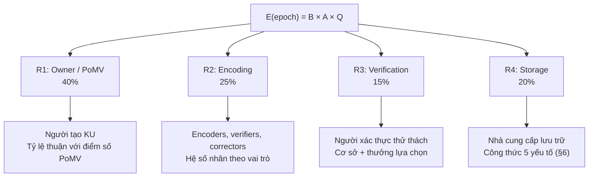
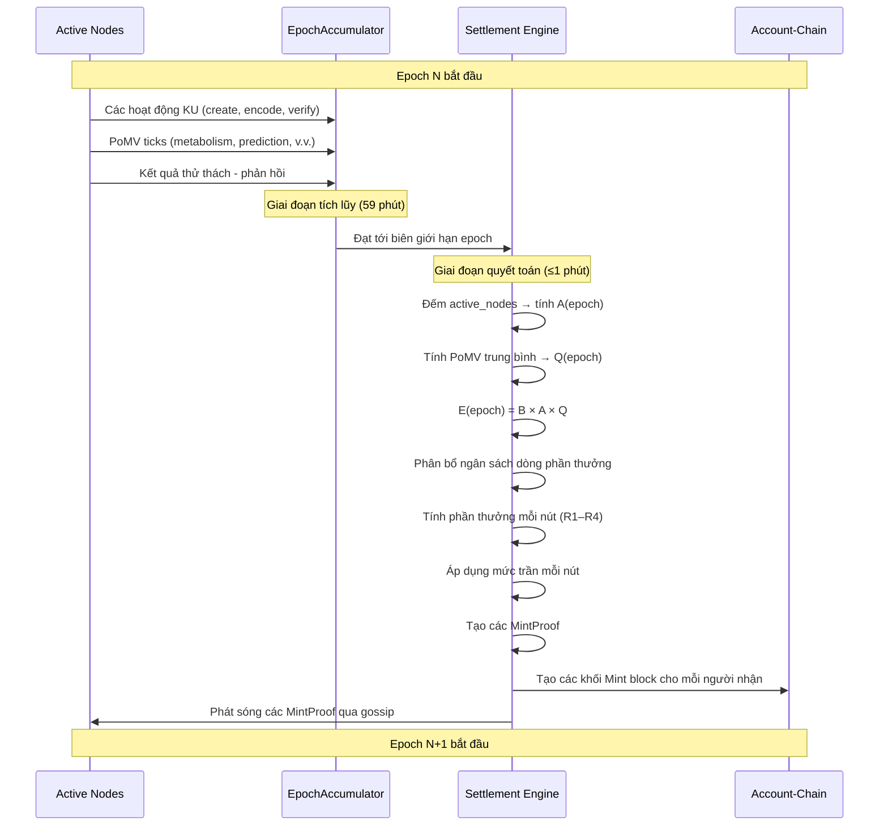

# 5. Output-Based Minting

Phần này đặc tả cơ chế OBT minting — quy trình qua đó các token mới tham gia vào lưu thông. Khác với các hệ thống Proof-of-Work nơi việc đào (mining) *tạo ra* các khối, hay các hệ thống Proof-of-Stake nơi việc staking *mua* các quyền xác thực (validation rights), việc đúc (minting) OBT là **đầu ra (output)** của công việc tri thức đã được xác thực. Không có tri thức, không có token.

## 5.1 Fundamental Principle: Minting is OUTPUT of Consensus (Nguyên lý Cơ bản: Minting là OUTPUT của Đồng thuận)

Đặc trưng định hình của OBT minting là mối quan hệ thời gian của nó đối với công việc tri thức. Trong mọi hệ thống token hiện có, việc tạo token hoặc là *điều kiện tiên quyết (precondition)* để tham gia hoặc là *tác dụng phụ (side effect)* của việc sản xuất khối. OBT đảo ngược hoàn toàn mối quan hệ này.

### 5.1.1 The Three Minting Paradigms (Ba Mô hình Minting)

| Mô hình (Paradigm) | Kích hoạt Tạo Token (Token Creation Trigger) | Mối quan hệ Thời gian (Temporal Relationship) | Bảo chứng Giá trị (Value Backing) |
|----------|----------------------|----------------------|---------------|
| Proof-of-Work | Giải xong câu đố băm | Việc đào *tạo ra* các khối rỗng, các giao dịch lấp đầy chúng sau | Chi phí năng lượng (sunk cost) |
| Proof-of-Stake | Validator được chọn theo trọng số stake | Staking *mua* quyền đề xuất khối | Khóa vốn (opportunity cost) |
| **Output-Based (OBT)** | **Công việc tri thức được xác thực** | **KU được tạo → encoded → verified → scored → SAU ĐÓ minted** | **Tri thức đã được xác thực (intrinsic utility)** |

**Bảng 19.** So sánh các mô hình minting. OBT là hệ thống duy nhất nơi việc minting diễn ra nghiêm ngặt *sau* khi giá trị được tạo ra.

Ở Bitcoin, thợ đào tiêu tốn năng lượng để giải câu đố băm và nhận phần thưởng khối — bất kể khối đó có chứa các giao dịch giá trị hay hoàn toàn trống rỗng. Phần thưởng dành cho việc *bảo mật* mạng lưới, chứ không phải cho việc *tạo ra* giá trị bên trong nó.

Ở Ethereum PoS, validator stake 32 ETH để giành quyền đề xuất và chứng thực khối. Phần thưởng tỷ lệ thuận với việc tham gia vào đồng thuận, chứ không phải giá trị của các chuyển dịch trạng thái (state transitions) được xử lý.

Ở OBT, chuỗi nhân quả là rõ ràng:

$$\text{KU created} \xrightarrow{\text{encode}} \text{KU encoded} \xrightarrow{\text{verify}} \text{Encoding verified} \xrightarrow{\text{score}} \text{PoMV computed} \xrightarrow{\text{mint}} \text{OBT created}$$

Mỗi token OBT tồn tại đều có thể được truy nguyên về một công việc tri thức cụ thể đã được xác thực. Không có phần thưởng cho "khối rỗng", không có lợi suất staking, và không có lạm phát mà không đi kèm tính hữu dụng (utility).

### 5.1.2 Why Output-Based Minting Matters (Tại sao Output-Based Minting lại quan trọng)

Mô hình dựa trên đầu ra tạo ra ba thuộc tính quan trọng:

1. **Bảo chứng giá trị nội tại (Intrinsic value backing).** Mỗi token được đúc tương ứng với một Knowledge Unit đã vượt qua xác thực encoding, tính điểm PoMV và các cổng chất lượng (quality gates). Token đại diện cho tiện ích tri thức (*measured* knowledge utility) đã được đo lường.

2. **Tự điều tiết nguồn cung (Self-regulating supply).** Nếu không có tri thức nào được tạo ra, không có token nào được đúc. Nếu chất lượng tri thức giảm (điểm PoMV thấp), ít token hơn được đúc. Nguồn cung tự động thu hẹp trong thời kỳ hoạt động kém hoặc chất lượng thấp.

3. **Không có trạng thái cân bằng trục lợi (No rent-seeking equilibrium).** Ở PoW, thợ đào có giá điện rẻ hơn sẽ kiếm được nhiều hơn. Ở PoS, các validator có nhiều vốn hơn kiếm được nhiều hơn. Ở OBT, những thành viên đóng góp nhiều tri thức đã xác thực hơn sẽ kiếm được nhiều hơn — không có cơ chế thu nhập thụ động nào.

## 5.2 Global Emission Formula (Công thức Phát hành Toàn cầu)

### 5.2.1 Formula Definition

Tổng số OBT được phát hành mỗi epoch được điều hành bởi công thức ba yếu tố:

$$E(\text{epoch}) = B \times A(\text{epoch}) \times Q(\text{epoch})$$

Trong đó:

- $B = \text{BASE\_EMISSION\_PER\_EPOCH} = 10{,}000$ OBT (có thể điều chỉnh bằng quản trị - governance-adjustable)
- $A(\text{epoch}) = \min\!\left(\frac{\text{active\_nodes}}{1{,}000},\; 10.0\right)$ — hệ số hoạt động (activity factor)
- $Q(\text{epoch}) = \frac{\sum_{ku \in KU_{\text{set}}} \text{PoMV}(ku)}{|KU_{\text{set}}|} \in [0.0, 1.0]$ — hệ số chất lượng (quality factor)

### 5.2.2 Base Emission ($B$) (Lượng Phát hành Cơ sở)

Lượng phát hành cơ sở $B$ đại diện cho phần thưởng tối đa theo lý thuyết cho một đơn vị tham gia mạng lưới ở quy mô đơn vị và chất lượng đơn vị. Việc đặt $B = 10{,}000$ OBT cung cấp độ chi tiết vừa đủ cho các phần thưởng phân số (OBT sử dụng milliOBT trong nội bộ) trong khi vẫn giữ các con số hiển thị cho con người trong tầm kiểm soát.

$B$ có thể được điều chỉnh qua quản trị (governance-adjustable): một cơ chế quản trị trong tương lai (§11) can modify $B$ thông qua một cuộc bỏ phiếu đa số tuyệt đối (supermajority vote) của các nút có độ tin cậy cao. Điều này cho phép mạng lưới thích ứng với các điều kiện kinh tế thay đổi mà không cần thực hiện phân tách giao thức (protocol forks).

### 5.2.3 Activity Factor ($A$) (Hệ số Hoạt động)

Hệ số hoạt động tỷ lệ thuận lượng phát hành theo mức độ tham gia của mạng lưới:

$$A(\text{epoch}) = \min\!\left(\frac{\text{active\_nodes}}{1{,}000},\; 10.0\right)$$

**Cơ sở thiết kế (Design rationale):**

- **Tỷ lệ tuyến tính dưới 10,000 nút.** Một mạng lưới có 100 nút không nên phát hành lượng token tương tự như một mạng lưới có 10,000 nút. Tỷ lệ tuyến tính đảm bảo rằng các mạng lưới giai đoạn đầu tạo ra lượng token ít hơn tương ứng, ngăn chặn siêu lạm phát khi token có ít người nắm giữ.
- **Mức trần ở mức 10× đối với các mạng lưới trên 10,000 nút.** Vượt quá 10,000 nút hoạt động, việc mở rộng thêm là không cần thiết — phần thưởng trên mỗi nút sẽ tự động loãng đi khi nhiều thành viên tham gia cạnh tranh cho một lượng phát hành bị giới hạn. Mức trần ngăn cản sự tăng trưởng phát hành không giới hạn.
- **Chuẩn hóa 1,000 nút.** Số chia 1,000 có nghĩa là $A = 1.0$ tại 1,000 nút — một ngưỡng "trưởng thành" hợp lý cho một mạng lưới tri thức. Dưới mức này, lượng phát hành bị kìm hãm; trên mức này, nó tăng tốc cho đến khi đạt mức trần.

### 5.2.4 Quality Factor ($Q$) (Hệ số Chất lượng)

Hệ số chất lượng đo lường điểm số PoMV trung bình của tất cả các Knowledge Units được tạo lập hoặc hoạt động trong epoch:

$$Q(\text{epoch}) = \frac{\sum_{ku \in KU_{\text{set}}} \text{PoMV}(ku)}{|KU_{\text{set}}|} \in [0.0, 1.0]$$

**Cơ sở thiết kế (Design rationale):**

- **Điểm PoMV trung bình, không phải tổng.** Sử dụng giá trị trung bình (thay vì tổng) giúp ngăn chặn việc trục lợi (gaming) bằng cách tràn ngập mạng lưới với nhiều KU chất lượng thấp. 1,000 KU có PoMV 0.01 tạo ra $Q = 0.01$, chứ không phải $Q = 10.0$.
- **Bị giới hạn trong khoảng $[0.0, 1.0]$.** Vì các điểm số PoMV riêng lẻ được chuẩn hóa về $[0.0, 1.0]$, giá trị trung bình cũng bị giới hạn. Điều này làm cho hệ số chất lượng trở thành một hệ số nhân thực sự — nó chỉ có thể làm giảm lượng phát hành, chứ không bao giờ khuếch đại vượt quá tích của base × activity.
- **Đồng bộ khuyến khích (Incentive alignment).** $Q$ tạo ra một sự khuyến khích tập thể: mọi người tham gia đều được hưởng lợi khi chất lượng tri thức trung bình của mạng lưới cao. Các đóng góp chất lượng thấp gây hại đến phần thưởng của tất cả mọi người, tạo ra áp lực xã hội hướng tới chất lượng.

### 5.2.5 Worked Examples (Các Ví dụ thực tế)

| Kịch bản (Scenario) | Nút Hoạt động (Active Nodes) | $A$ | $Q$ | $E$ (OBT/epoch) |
|----------|:----------:|:---:|:---:|:-------:|
| Mạng lưới ban đầu, chất lượng trung bình | 100 | 0.1 | 0.50 | 500 |
| Mạng lưới đang phát triển, chất lượng cao | 1,000 | 1.0 | 0.75 | 7,500 |
| Mạng lưới trưởng thành, chất lượng cao | 5,000 | 5.0 | 0.80 | 40,000 |
| Mạng lưới quy mô lớn, chất lượng xuất sắc | 10,000 | 10.0 | 0.90 | 90,000 |
| Lượng phát hành tối đa | ≥10,000 | 10.0 | 1.00 | 100,000 |
| Tấn công spam (chất lượng sụp đổ) | 10,000 | 10.0 | 0.02 | 2,000 |

**Bảng 20.** Các ví dụ tính toán công thức phát hành trong các điều kiện mạng lưới khác nhau.

Kịch bản tấn công spam chứng minh thuộc tính tự điều tiết: ngay cả ở quy mô tối đa, nếu chất lượng sụp đổ xuống còn 2%, lượng phát hành sẽ giảm xuống còn 2% của mức tối đa. Hành vi spam của kẻ tấn công làm *giảm* phần thưởng dành cho tất cả mọi người, bao gồm cả chính kẻ tấn công.

## 5.3 Four Reward Streams (Bốn Dòng Phần thưởng)

Tổng lượng phát hành epoch $E(\text{epoch})$ được phân phối qua bốn dòng phần thưởng, mỗi dòng đền bù cho một loại công việc tri thức khác nhau:



**Hình 6.** Phân bổ bốn dòng phần thưởng từ lượng phát hành epoch.

Ngân sách dòng phần thưởng được tính toán như sau:

$$\text{stream\_budget}(s) = E(\text{epoch}) \times w_s$$

Trong đó $w_s$ là trọng số của dòng $s$. Các trọng số mặc định: $w_{R1} = 0.40$, $w_{R2} = 0.25$, $w_{R3} = 0.15$, $w_{R4} = 0.20$. Các trọng số này có thể điều chỉnh qua quản trị (governance-adjustable).

### 5.3.1 R1: Owner / PoMV Reward (40%) (Phần thưởng Owner / PoMV)

Phần thưởng owner reward đền bù cho những người tạo KU tỷ lệ thuận với tiện ích đo lường được của tri thức đó. Đây là động lực chính cho việc đóng góp tri thức chất lượng cao.

**Công thức:**

$$R1(\text{node}) = \sum_{ku \in \text{owned}(node)} \text{PoMV}(ku) \times \text{max\_reward\_per\_epoch}$$

Trong đó:

$$\text{max\_reward\_per\_epoch} = \frac{E(\text{epoch}) \times w_{R1}}{|KU_{\text{active}}|}$$

Điểm số PoMV là một sự tổng hợp từ sáu tín hiệu sinh học, mỗi tín hiệu đo lường một khía cạnh khác nhau của tiện ích tri thức:

| Tín hiệu (Signal) | Trọng số (Weight) | Cách đo lường (Measurement) | Ý nghĩa (Intuition) |
|--------|:------:|-------------|-----------|
| Metabolism | 0.35 | Tần suất truy cập, tỷ lệ khớp truy vấn | "Tri thức này được sử dụng thường xuyên như thế nào?" |
| Prediction | 0.15 | Độ chính xác của KU trong việc trả lời truy vấn | "Tri thức này hữu ích như thế nào để trả lời các câu hỏi?" |
| Entropy | 0.10 | Mật độ thông tin, tính độc nhất | "KU này chứa bao nhiêu thông tin độc nhất?" |
| Survival | 0.10 | Tuổi thọ, giữ lại sau các đợt cắt tỉa | "Tri thức này duy trì sự liên quan trong bao lâu?" |
| Synaptic | 0.15 | Số lượng liên kết đến, lượt trích dẫn bởi các KU khác | "Tri thức này kết nối như thế nào với các tri thức khác?" |
| Niche | 0.15 | Độ hiếm của chủ đề được bao phủ trong mạng lưới | "Tri thức này có lấp đầy một khoảng trống mà ít bên khác bao phủ không?" |

**Bảng 21.** Trọng số và diễn giải của các tín hiệu PoMV.

Điểm số PoMV tổng hợp là:

$$\text{PoMV}(ku) = \sum_{i=1}^{6} w_i \times \text{signal}_i(ku) \in [0.0, 1.0]$$

### 5.3.2 R2: Encoding Reward (25%) (Phần thưởng Encoding)

Phần thưởng encoding reward đền bù cho những thành viên tham gia chuyển đổi nội dung thô thành các Knowledge Units có cấu trúc. Các vai trò encoding khác nhau nhận được các hệ số nhân khác nhau nhằm phản ánh độ khó và giá trị khác biệt của từng vai trò.

**Phần thưởng cơ sở cho mỗi hoạt động encoding:**

$$\text{base} = \text{BASE\_OBT\_PER\_KB} \times \text{size\_kb} = 1.0 \times \text{size\_kb}$$

| Vai trò (Role) | Hệ số nhân (Multiplier) | Thưởng thêm (Bonus) | Tổng Phần thưởng (Total Reward) | Giải thích lý do (Rationale) |
|------|:---------:|:-----:|:------------:|-----------|
| FirstEncoder | base × 2 | +5 OBT | base×2 + 5 | Lần encoding đầu tiên là khó nhất — không có cấu trúc trước đó để tham chiếu |
| Verifier | base × 1 | — | base×1 | Việc xác thực (verification) yêu cầu ít công sức hơn encoding |
| Corrector | base × 3 | — | base×3 | Việc sửa lỗi (corrections) yêu cầu hiểu biết cả phiên bản gốc và phiên bản sửa đổi |
| ProBono | base × 2 | +10 OBT | base×2 + 10 | Hoạt động encoding có lợi cho cộng đồng (ví dụ: nội dung thuộc phạm vi công cộng) xứng đáng nhận thêm khuyến khích |

**Bảng 22.** Các hệ số nhân và phần thưởng thêm cho từng vai trò encoding.

**Ví dụ:** Một Knowledge Unit kích thước 4 KB được encode bởi một FirstEncoder sẽ kiếm được: $1.0 \times 4 \times 2 + 5 = 13$ OBT. Một Verifier cho cùng KU đó sẽ kiếm được: $1.0 \times 4 \times 1 = 4$ OBT.

### 5.3.3 R3: Verification Reward (15%) (Phần thưởng Xác thực)

Phần thưởng verification reward đền bù cho các nút tham gia vào các vòng xác thực thử thách - phản hồi (challenge-response verification) đối với tri thức được lưu trữ. Dòng phần thưởng này tài trợ cho hạ tầng đảm bảo chất lượng của mạng lưới.

**Công thức:**

$$R3(\text{node}) = \text{base} + (\text{selected} \;?\; \text{base} / 2 : 0)$$

Trong đó `base` được tính từ ngân sách dòng phần thưởng chia cho số lượng verifiers đang hoạt động, và `selected` cho biết liệu nút đó có được chọn ngẫu nhiên cho một vòng thử thách cụ thể hay không.

Cơ chế chọn ngẫu nhiên đảm bảo sự phân phối công bằng: trong bất kỳ epoch nào, khoảng $\frac{1}{\text{active\_verifiers}} \times \text{challenges\_per\_epoch}$ lượt xác thực sẽ được giao cho mỗi nút. Theo thời gian, việc lựa chọn sẽ hội tụ về phân phối đồng đều, ngăn chặn các tập đoàn xác thực (verification cartels).

### 5.3.4 R4: Storage Reward (20%) (Phần thưởng Lưu trữ)

Phần thưởng storage reward đền bù cho các nút thực hiện lưu trữ và phục vụ các Knowledge Units. Khác với các dòng R1–R3, phần thưởng lưu trữ sử dụng công thức 5 yếu tố nhận biết nội dung (5-factor content-aware formula), xem xét không chỉ *dung lượng* một nút lưu trữ, mà cả *chất lượng* của nội dung lưu trữ và *độ tin cậy* khi phục vụ nội dung đó.

Đặc tả đầy đủ của công thức phần thưởng lưu trữ được trình bày trong §6.2. Tóm lại:

$$R4(\text{node}, \text{epoch}) = \sum_{ku \in \text{stored}(\text{node})} \text{STORAGE\_BASE\_RATE} \times \text{size\_w} \times \text{rarity\_w} \times \text{demand\_w} \times \text{duration\_f} \times \text{trust\_f}$$

Điều này liên kết chéo tới cơ chế phần thưởng lưu trữ chi tiết được mô tả trong Chương 6.

## 5.4 Per-Node Reward Cap (Mức trần Phần thưởng cho mỗi Nút)

### 5.4.1 Cap Formula (Công thức tính Mức trần)

Để ngăn chặn bất kỳ nút đơn lẻ nào chiếm giữ tỷ lệ không cân xứng từ lượng phát hành epoch, một mức trần phần thưởng trên mỗi nút được thực thi:

$$\text{cap}(\text{node}) = \frac{E(\text{epoch})}{\text{active\_nodes}} \times \text{TrustMultiplier}(\text{tier}(\text{node}))$$

Hệ số nhân trust tỷ lệ thuận mức trần dựa trên cấp độ trust (trust tier) của nút — các nút có trust cao hơn được phép kiếm nhiều hơn mỗi epoch, phản ánh độ tin cậy và lịch sử đóng góp đã được chứng minh của chúng.

### 5.4.2 Trust Tier Multipliers (Hệ số nhân Cấp độ Trust)

| Cấp độ (Tier) | Tên gọi (Name) | Phạm vi Trust (Trust Range) | Hệ số nhân (Multiplier) | Mức trần hiệu dụng (Effective Cap) (tại $E=10{,}000$, 100 nút) |
|:----:|------|:----------:|:----------:|:------------------------------------------:|
| 0 | Leaf | [0.00, 0.10) | 0.10 | 10 OBT |
| 1 | Seedling | [0.10, 0.30) | 0.50 | 50 OBT |
| 2 | Contributor | [0.30, 0.50) | 1.00 | 100 OBT |
| 3 | Established | [0.50, 0.70) | 1.25 | 125 OBT |
| 4 | LocalSP | [0.70, 0.85) | 1.50 | 150 OBT |
| 5 | ZoneSP | [0.85, 0.95) | 1.75 | 175 OBT |
| 6 | GlobalSP | [0.95, 1.00] | 2.00 | 200 OBT |

**Bảng 23.** Các hệ số nhân cấp độ trust và mức trần phần thưởng hiệu dụng.

### 5.4.3 Anti-Sybil Analysis (Phân tích Chống tấn công Sybil)

Hệ số nhân 0.10 của cấp Leaf là cơ chế chống Sybil chính cho hoạt động minting. Xét một kẻ tấn công tạo ra 100 nút Sybil:

- **Nếu không có mức trần:** 100 nút Sybil có thể cùng nhau đòi hỏi một phần đáng kể của $E(\text{epoch})$.
- **Khi có mức trần:** Mỗi nút Sybil (cấp Leaf) kiếm được tối đa $\frac{E}{N} \times 0.10$. Khi kẻ tấn công thêm nhiều nút hơn, $N$ tăng lên, làm giảm mức trần của từng nút hơn nữa.

**Phân tích chính thức:** Gọi $S$ là số lượng nút Sybil và $N$ là tổng quy mô mạng lưới trước khi bị tấn công. Tổng thu nhập của kẻ tấn công bị giới hạn bởi:

$$\text{Sybil\_total} \leq S \times \frac{E(\text{epoch})}{N + S} \times 0.10$$

Khi $S \to \infty$:

$$\lim_{S \to \infty} S \times \frac{E}{N + S} \times 0.10 = 0.10 \times E$$

Kẻ tấn công có thể chiếm đoạt tối đa 10% lượng phát hành epoch, bất kể có bao nhiêu nút Sybil được tạo ra. Trong thực tế, kẻ tấn công sẽ thu được ít hơn nhiều vì:

1. Mỗi nút Sybil cũng phải vượt qua các cổng chất lượng (§7.3).
2. Các nút Sybil không có lịch sử PoMV, do đó phần thưởng $R1$ gần như bằng không.
3. Các bộ phát hiện chống trục lợi (anti-gaming detectors) (§7.4) sẽ gắn cờ hành vi Sybil phối hợp.

## 5.5 MintProof Structure (Cấu trúc MintProof)

Mỗi sự kiện minting tạo ra một bằng chứng có thể xác thực bằng mật mã (cryptographically verifiable proof) liên kết lượng đúc được với hoạt động tri thức làm cơ sở cho nó.

### 5.5.1 Data Structure (Cấu trúc Dữ liệu)

```rust
pub struct MintProof {
    /// The activity that generated this minting reward
    pub activity: MintActivity,
    /// CID of the Knowledge Unit associated with this mint
    pub ku_cid: [u8; 32],
    /// Amount minted in milliOBT
    pub obt_amount: u64,
    /// The inputs to the emission formula used to compute this reward
    pub formula_inputs: FormulaInputs,
    /// Epoch in which this minting occurred
    pub epoch: u64,
    /// Ed25519 public key of the reward recipient
    pub recipient: [u8; 32],
    /// Witness signatures attesting to the validity of this mint
    pub witnesses: Vec<WitnessSignature>,
    /// Vector clock for causal ordering
    pub clock: VectorClock,
    /// Advisory wall-clock timestamp (Unix seconds)
    pub timestamp: u64,
}

pub enum MintActivity {
    /// R1: PoMV-based owner reward
    PomvReward { pomv_score: f64, signal_breakdown: [f64; 6] },
    /// R2: Encoding reward
    EncodingReward { role: EncodingRole, size_kb: f64 },
    /// R3: Verification reward
    VerificationReward { challenge_hash: [u8; 32], selected: bool },
    /// R4: Storage reward
    StorageReward { stored_ku_count: u32, total_size_bytes: u64 },
}

pub struct FormulaInputs {
    pub base_emission: u64,
    pub active_nodes: u32,
    pub quality_factor: f64,
    pub computed_epoch_emission: u64,
    pub stream_weight: f64,
    pub node_trust_tier: u8,
    pub node_cap: u64,
}
```

**Kích thước truyền tải (Wire size):** 320–512 bytes tùy thuộc vào số lượng nhân chứng và loại hoạt động.

### 5.5.2 Five-Step Verification (Xác thực Năm bước)

Bất kỳ nút nào nhận được một MintProof đều thực hiện năm bước xác thực trước khi chấp nhận khối Mint block tương ứng:

| Bước (Step) | Xác thực (Verification) | Kiểm tra (Check) |
|:----:|-------------|-------|
| 1 | Ngữ cảnh Epoch | `proof.epoch == current_epoch` hoặc `proof.epoch == current_epoch - 1` (cửa sổ ân hạn) |
| 2 | Đầu vào công thức | `proof.formula_inputs.active_nodes` khớp với số lượng nút hoạt động quan sát thấy tại cục bộ (dung sai ±5%) |
| 3 | Tính toán lại số lượng | Tính toán lại `obt_amount` từ `formula_inputs` — phải khớp chính xác với `proof.obt_amount` |
| 4 | Chữ ký nhân chứng | Có ≥3 chữ ký nhân chứng hợp lệ từ các nút khác nhau với trust ≥ 0.30 |
| 5 | Mức trần của nút | `proof.obt_amount ≤ cap(recipient)` cho epoch nhất định |

**Bảng 24.** Các bước xác thực MintProof.

Bước 3 là bước kiểm tra chống lạm phát quan trọng: bất kỳ nút nào cũng có thể tự tính toán lại lượng đúc từ các đầu vào của công thức và xác minh xem lượng tuyên bố có khớp hay không. Nếu công thức tạo ra 42.7 OBT nhưng bằng chứng lại tuyên bố 100 OBT, sự sai lệch sẽ ngay lập tức được phát hiện.

## 5.6 Epoch Settlement Process (Quy trình Quyết toán Epoch)

### 5.6.1 Settlement Flow (Quy trình Quyết toán)

Mỗi epoch (1 giờ) tuân theo một chu kỳ quyết toán xác định (deterministic settlement cycle):



**Hình 7.** Sơ đồ tuần tự quyết toán epoch.

### 5.6.2 EpochAccumulator

Bộ tích lũy accumulator thu thập tất cả các sự kiện liên quan đến minting trong suốt epoch:

```rust
pub struct EpochAccumulator {
    /// Epoch number
    pub epoch: u64,
    /// PoMV scores for all active KUs, keyed by CID
    pub pomv_scores: HashMap<[u8; 32], f64>,
    /// Mint events generated during this epoch
    pub mint_events: Vec<MintEvent>,
    /// Number of nodes that performed at least one operation
    pub active_nodes_count: u32,
    /// Results of storage challenge-response rounds
    pub challenge_results: Vec<ChallengeResult>,
    /// Encoding operations performed (for R2 computation)
    pub encoding_ops: Vec<EncodingOp>,
    /// Verification operations performed (for R3 computation)
    pub verification_ops: Vec<VerificationOp>,
    /// Timestamp of epoch start (Unix seconds)
    pub epoch_start: u64,
    /// Whether settlement has been computed for this epoch
    pub settled: bool,
}
```

Bộ tích lũy accumulator là một cấu trúc cục bộ — mỗi nút duy trì góc nhìn riêng về hoạt động của epoch. Trong quá trình quyết toán, các nút sử dụng dữ liệu hội tụ qua gossip (gossip-converged data) để tính toán lượng phát hành một cách độc lập. Công thức xác định đảm bảo rằng các nút trung thực đi đến cùng một kết quả (trong khoảng dung sai ±5% đối với số lượng nút hoạt động).

## 5.7 Inflation Analysis (Phân tích Lạm phát)

### 5.7.1 Theoretical Supply Growth (Tăng trưởng Nguồn cung theo Lý thuyết)

Khác với các sự kiện halving rời rạc của Bitcoin, sự tăng trưởng nguồn cung của OBT tuân theo một đường cong tiệm cận tự nhiên được thúc đẩy bởi tỷ lệ giảm dần của lượng phát hành mới so với nguồn cung hiện tại.

Gọi $S(t)$ là tổng nguồn cung tại epoch $t$, và $E(t)$ là lượng phát hành tại epoch $t$. Tỷ lệ lạm phát là:

$$\pi(t) = \frac{E(t)}{S(t)} = \frac{E(t)}{\sum_{\tau=0}^{t-1} E(\tau)}$$

Ngay cả khi $E(t)$ là hằng số, $\pi(t)$ giảm đơn điệu khi $S(t)$ tăng trưởng. Nếu $E(t)$ cũng thay đổi (do biến động của $A$ và $Q$), sự suy giảm sẽ phức tạp hơn nhưng vẫn giảm dần theo tiệm cận.

### 5.7.2 Year-by-Year Projection (Dự báo theo từng năm)

Giả định một mạng lưới ở trạng thái ổn định (steady-state) gồm 5,000 nút với $Q = 0.80$ (các điều kiện mạng lưới trưởng thành thực tế):

$$E_{\text{per\_epoch}} = 10{,}000 \times 5.0 \times 0.80 = 40{,}000 \text{ OBT}$$

$$E_{\text{annual}} = 40{,}000 \times 24 \times 365 = 350{,}400{,}000 \text{ OBT}$$

| Năm (Year) | Nguồn cung lũy kế (Cumulative Supply) (triệu OBT) | Lượng phát hành hàng năm (Annual Emission) (triệu OBT) | Tỷ lệ Lạm phát (Inflation Rate) |
|:----:|:------------------------:|:----------------------:|:--------------:|
| 1 | 350.4 | 350.4 | — (genesis) |
| 2 | 700.8 | 350.4 | 100.0% |
| 3 | 1,051.2 | 350.4 | 50.0% |
| 4 | 1,401.6 | 350.4 | 33.3% |
| 5 | 1,752.0 | 350.4 | 25.0% |
| 6 | 2,102.4 | 350.4 | 20.0% |
| 7 | 2,452.8 | 350.4 | 16.7% |
| 8 | 2,803.2 | 350.4 | 14.3% |
| 9 | 3,153.6 | 350.4 | 12.5% |
| 10 | 3,504.0 | 350.4 | 11.1% |

**Bảng 25.** Dự báo lạm phát qua từng năm trong các điều kiện trạng thái ổn định.

### 5.7.3 Comparison with Bitcoin Halving (So sánh với sự kiện Bitcoin Halving)

Bitcoin đạt được lạm phát giảm dần thông qua các sự kiện halving rời rạc sau mỗi 210,000 khối (~4 năm), tạo ra một hàm bậc thang. OBT đạt được hiệu ứng định hướng tương tự thông qua sự suy giảm trơn tru, liên tục — $\pi(t) = \frac{1}{t}$ dưới mức phát hành không đổi.

| Thuộc tính (Property) | Bitcoin | OBT |
|----------|---------|-----|
| Cơ chế suy giảm | Các đợt halving rời rạc (giảm 50%) | Suy giảm tiệm cận liên tục |
| Giới hạn nguồn cung | 21 triệu BTC | Không giới hạn (river model) |
| Lạm phát Năm 1 | ~100% (ước tính) | ~100% (năm genesis) |
| Lạm phát Năm 5 | ~33% (trước đợt halving thứ nhất) | ~25% (trạng thái ổn định) |
| Lạm phát Năm 10 | ~12% (sau đợt halving thứ hai) | ~11.1% (trạng thái ổn định) |
| Lạm phát Năm 20 | ~1.8% (sau đợt halving thứ ba) | ~5.3% (trạng thái ổn định) |
| Lạm phát dài hạn | 0% (nguồn cung cạn kiệt) | $\to 0\%$ (tiệm cận, không bao giờ bằng không) |

**Bảng 26.** So sánh lịch trình lạm phát giữa Bitcoin và OBT.

Khác biệt chính xuất hiện sau năm 20: lạm phát của Bitcoin giảm xuống gần bằng không khi phần thưởng khối trở nên không đáng kể, đặt ra câu hỏi về việc tài trợ an ninh dài hạn (vấn đề "thị trường phí"). Lạm phát của OBT tiếp cận tiệm cận đến không nhưng không bao giờ đạt tới nó — luôn có một lượng phát hành khác không, đảm bảo rằng công việc tri thức luôn được đền bù. Điều này loại bỏ sự cần thiết của một thị trường phí riêng biệt.

### 5.7.4 Real-World Inflation Dynamics (Động lực Lạm phát trong Thực tế)

Dự báo trạng thái ổn định ở Bảng 25 giả định lượng phát hành không đổi, điều này khó xảy ra trong thực tế. Động lực thực tế bao gồm:

- **Sự tăng trưởng mạng lưới:** Khi có nhiều nút tham gia hơn, $A$ tăng, làm tăng lượng phát hành — nhưng mẫu số (số lượng nút cạnh tranh phần thưởng) cũng tăng, làm loãng phần thưởng trên mỗi nút.
- **Biến động chất lượng:** Nếu chất lượng tri thức suy giảm, $Q$ giảm, làm giảm lượng phát hành. Điều này tạo ra một vòng phản hồi tiêu cực: chất lượng thấp hơn → ít token hơn → giảm động lực spam → chất lượng phục hồi.
- **Mô hình theo mùa:** Việc tạo lập tri thức có thể thể hiện các chu kỳ hàng tuần hoặc theo mùa, khiến $E$ biến động. Những biến động này được làm mịn trên quy mô thời gian hàng năm.

Hiệu ứng ròng là lạm phát của OBT có tính *thích ứng (adaptive)* — nó phản ứng với các điều kiện mạng lưới theo thời gian thực thay vì tuân theo một lịch trình định sẵn. Đây là một lợi thế cơ bản so với các hệ thống có lịch trình cố định: chính sách tiền tệ mang tính **dẫn dắt bởi dữ liệu (data-driven)**, chứ không phải mang tính ý thức hệ.
