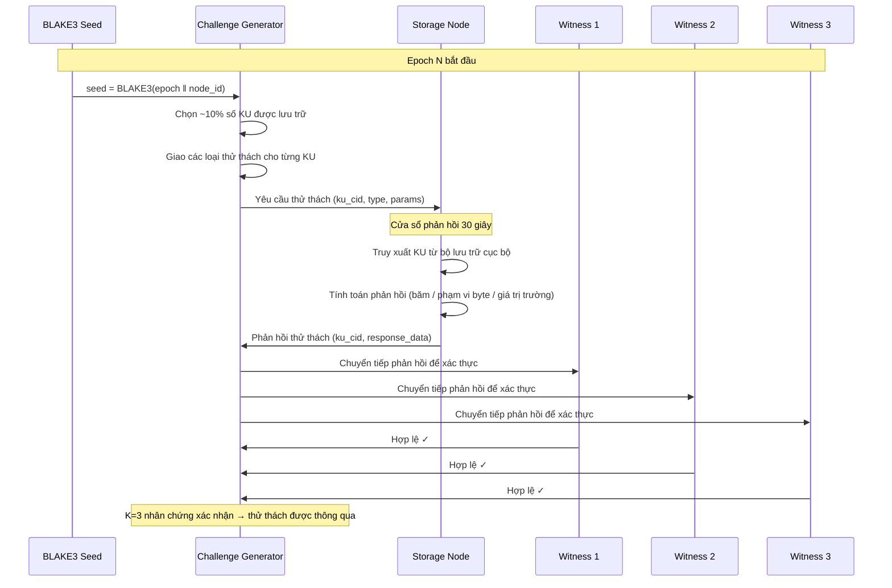

# 6. Content-Aware Storage Rewards

Phần này đặc tả cơ chế OBT storage reward — một hệ thống khuyến khích nhận biết nội dung (content-aware incentive system) nhằm thưởng cho các nhà cung cấp lưu trữ không chỉ đơn thuần vì việc *lưu trữ byte*, mà vì việc lưu trữ *tri thức giá trị, quý hiếm và đang hoạt động tích cực*. Chúng tôi trình bày công thức phần thưởng 5 yếu tố, giao thức thử thách Proof-of-Storage, hệ thống cảnh cáo (strike system), và so sánh chi tiết với các hệ thống lưu trữ phi tập trung hiện có.

## 6.1 Why Content-Aware Storage Rewards (Tại sao lại cần Phần thưởng Lưu trữ Nhận biết Nội dung)

### 6.1.1 The Opaque Bytes Problem (Vấn đề các Byte Mờ đục)

Các mạng lưới lưu trữ phi tập trung hiện tại coi dữ liệu được lưu trữ như các chuỗi byte mờ đục (opaque byte sequences). Một nhà cung cấp lưu trữ kiếm được phần thưởng tương tự khi lưu trữ 1 GB dữ liệu nhiễu ngẫu nhiên như khi lưu trữ 1 GB nghiên cứu đã được bình duyệt — các giao thức này không có cơ chế để phân biệt giữa chúng.

| Hệ thống (System) | Đơn vị Lưu trữ (Storage Unit) | Nhận biết Nội dung (Content Awareness) | Cơ sở Phần thưởng (Reward Basis) |
|--------|-------------|:-----------------:|-------------|
| Filecoin | 32 GiB sectors | ❌ Không (None) | Phân khu được niêm phong + bằng chứng spacetime |
| Arweave | Khối dữ liệu tùy ý | ❌ Không (None) | Quỹ tài trợ (thanh toán một lần) |
| Sia | Hợp đồng file | ❌ Không (None) | Hoàn thành hợp đồng |
| **OBT** | **Knowledge Units** | **✅ Đầy đủ (Full)** | **Công thức 5 yếu tố (nội dung, sử dụng, độ hiếm, trust, thời lượng)** |

**Bảng 27.** Sự nhận biết nội dung trong các hệ thống lưu trữ phi tập trung.

Đây không đơn thuần là sự khác biệt về mặt thẩm mỹ. Các hệ thống byte mờ đục tạo ra ba điểm kém hiệu quả về mặt kinh tế:

1. **Sai lệch động lực (Misaligned incentives).** Các nhà cung cấp lưu trữ được khuyến khích lưu trữ bất kỳ thứ gì tối đa hóa phần thưởng trên mỗi byte, chứ không phải những gì có giá trị nhất đối với mạng lưới. Trong Filecoin, điều này dẫn đến vấn đề "dữ liệu rác" (junk data) nơi các thợ đào niêm phong các phân khu rỗng để kiếm phần thưởng khối.
2. **Không có tín hiệu nhu cầu (No demand signal).** Nếu không có sự nhận biết nội dung, giao thức không thể phân biệt giữa một file hiếm khi được truy cập và một tập dữ liệu được sử dụng thường xuyên. Cả hai đều nhận được cùng một phần thưởng, bất kể tính hữu dụng khác biệt rõ rệt.
3. **Không có phản hồi chất lượng (No quality feedback).** Nếu dữ liệu được lưu trữ trở nên lỗi thời, bị hỏng hoặc bị thay thế, phần thưởng lưu trữ sẽ không phản ánh điều này — nhà cung cấp vẫn tiếp tục kiếm tiền như thể dữ liệu đó vẫn còn giá trị.

### 6.1.2 OBT's Solution (Giải pháp của OBT)

OBT giải quyết những vấn đề này bằng cách tận dụng các thuộc tính ngữ nghĩa của các Knowledge Units. Bởi vì các KU có cấu trúc (chúng có các gen, liên kết, điểm số metabolism, và dòng dõi trust), phần thưởng lưu trữ có thể kết hợp các yếu tố nhận biết ý nghĩa (*meaning-aware*):

- **Dung lượng (Size)** — các KU lớn hơn chứa nhiều thông tin hơn và xứng đáng nhận được phần thưởng cao hơn tương ứng.
- **Độ hiếm (Rarity)** — các KU có ít nhân bản (replicas) hơn thì có giá trị lưu trữ cao hơn (sự khan hiếm về mặt cung).
- **Nhu cầu (Demand)** — các KU được truy cập thường xuyên sẽ có giá trị lớn hơn đối với mạng lưới (tiện ích về mặt cầu).
- **Thời lượng (Duration)** — các nút lưu trữ KU một cách đáng tin cậy trong thời gian dài thể hiện sự cam kết.
- **Trust** — các nút có điểm số EigenTrust cao hơn sẽ đáng tin cậy hơn và xứng đáng nhận được phần thưởng cao hơn.

## 6.2 The 5-Factor Formula (Công thức 5 Yếu tố)

### 6.2.1 Full Mathematical Specification

Phần thưởng lưu trữ cho một nút trong một epoch nhất định là tổng phần thưởng trên tất cả các KU được lưu trữ bởi nút đó:

$$R4(\text{node}, \text{epoch}) = \sum_{ku \in \text{stored}(\text{node})} \text{STORAGE\_BASE\_RATE} \times w_{\text{size}}(ku) \times w_{\text{rarity}}(ku) \times w_{\text{demand}}(ku) \times f_{\text{duration}}(\text{node}, ku) \times f_{\text{trust}}(\text{node})$$

Trong đó:

- $\text{STORAGE\_BASE\_RATE} = 0.001$ OBT mỗi KU trên mỗi epoch

### 6.2.2 Factor 1: Size Weight ($w_{\text{size}}$) (Yếu tố 1: Trọng số Dung lượng)

$$w_{\text{size}}(ku) = \text{clamp}\!\left(\frac{\text{wire\_bytes}(ku)}{1024},\; 0.1,\; 10.0\right)$$

**Giải thích lý do (Rationale):** Các KU lớn hơn yêu cầu nhiều không gian đĩa hơn, băng thông để phục vụ, và I/O cho cơ chế thử thách - phản hồi. Phần thưởng nên phản ánh chi phí này. Một KU 10 KB kiếm được gấp 10 lần phần thưởng cơ sở của một KU 1 KB, nhưng việc giới hạn (clamp) ở mức 10.0 ngăn cản các KU bất thường (pathological KUs) chi phối các phần thưởng.

**Phân tích ranh giới (Boundary analysis):**
- Tối thiểu: Một KU 102-byte (tối thiểu lý thuyết sau khi encoding) kiếm được $\text{clamp}(0.1, 0.1, 10.0) = 0.1$ — bằng một phần mười tỷ lệ cơ sở.
- Tối đa: Một KU 10 KB+ kiếm được $\text{clamp}(10.0, 0.1, 10.0) = 10.0$ — gấp mười lần tỷ lệ cơ sở.
- Điển hình: Một KU 2 KB kiếm được $\text{clamp}(2.0, 0.1, 10.0) = 2.0$ — gấp đôi tỷ lệ cơ sở.

### 6.2.3 Factor 2: Rarity Weight ($w_{\text{rarity}}$) (Yếu tố 2: Trọng số Độ hiếm)

$$w_{\text{rarity}}(ku) = \text{clamp}\!\left(\frac{K_{\text{TARGET}}}{\text{actual\_replicas}(ku)},\; 0.5,\; 3.0\right)$$

Trong đó $K_{\text{TARGET}} = 20$ là hệ số nhân bản mục tiêu (target replication factor) cho DHT.

**Giải thích lý do (Rationale):** Nếu một KU có chính xác 20 bản sao (mục tiêu), $w_{\text{rarity}} = 1.0$ — phần thưởng tiêu chuẩn. Nếu KU thiếu bản sao (chỉ có 7 bản sao), $w_{\text{rarity}} = 20/7 \approx 2.86$ — gần gấp 3 lần phần thưởng tiêu chuẩn, khuyến khích các nút lưu trữ nội dung hiếm. Nếu KU thừa bản sao (60 bản sao), $w_{\text{rarity}} = 20/60 \approx 0.33$, được giới hạn ở $0.5$ — phần thưởng giảm để hạn chế việc nhân bản thêm nội dung đã dư thừa.

**Động lực cân bằng (Equilibrium dynamics):** Trọng số độ hiếm tạo ra một điểm cân bằng tự nhiên: các KU thiếu bản sao mang lại phần thưởng cao hơn, thu hút các nhà cung cấp lưu trữ, từ đó làm tăng số lượng bản sao, kéo trọng số độ hiếm giảm xuống, giúp ổn định tỷ lệ nhân bản gần mức $K_{\text{TARGET}}$.

### 6.2.4 Factor 3: Demand Weight ($w_{\text{demand}}$) (Yếu tố 3: Trọng số Nhu cầu)

$$w_{\text{demand}}(ku) = \text{clamp}\!\left(\frac{\text{metabolism}(ku)}{\text{median\_metabolism}},\; 0.1,\; 5.0\right)$$

Trong đó `metabolism(ku)` là tín hiệu PoMV metabolism (tần suất truy cập, tỷ lệ khớp truy vấn) và `median_metabolism` is điểm số metabolism trung vị (median) của tất cả các KU đang hoạt động trong epoch.

**Giải thích lý do (Rationale):** Các KU được truy cập thường xuyên mang lại nhiều tiện ích hơn cho mạng lưới. Một KU có tỷ lệ truy cập gấp 5 lần mức trung vị kiếm được gấp 5 lần phần thưởng nhu cầu — nhưng mức sàn ở 0.1 đảm bảo rằng ngay cả các KU hiếm khi được truy cập cũng nhận được một phần thưởng lưu trữ (chúng có thể trở nên liên quan trong tương lai).

**Lưu ý chống trục lợi (Anti-gaming note):** Metabolism được đo lường trên toàn mạng lưới thông qua các bộ đếm tổng hợp qua gossip, chứ không phải do nút lưu trữ tự báo cáo. Một nút không thể tự thổi phồng chỉ số metabolism của KU do chính mình lưu trữ bằng cách liên tục tự truy vấn — các truy vấn từ cùng một nguồn sẽ được loại bỏ trùng lặp trong tính toán metabolism (§3 của đặc tả OBP).

### 6.2.5 Factor 4: Duration Factor ($f_{\text{duration}}$) (Yếu tố 4: Hệ số Thời lượng)

$$f_{\text{duration}}(\text{node}, ku) = \min\!\left(\frac{\text{epochs\_stored}(\text{node}, ku)}{100},\; 2.0\right)$$

**Giải thích lý do (Rationale):** Các nút lưu trữ một KU trong thời gian dài thể hiện sự cam kết và độ tin cậy. Phần thưởng trung thành (loyalty bonus) tăng tuyến tính từ 0× tại epoch 0 đến 1× tại epoch 100 (~4.17 ngày) và đạt mức trần 2× tại epoch 200 (~8.33 ngày). Điều này ngăn chặn hiện tượng "nhảy vùng lưu trữ" (storage hopping) — việc xoay vòng lưu trữ qua các KU để tối đa hóa phần thưởng ngắn hạn.

**Lưu ý quan trọng (Critical note):** `epochs_stored` được tính trên từng nút đối với từng KU và theo dõi việc lưu trữ *liên tục*. Nếu một nút từ bỏ một KU rồi thu nhận lại, bộ đếm sẽ đặt lại về 0. Điều này ngăn chặn hành vi trục lợi bằng cách bỏ và nhận lại các KU trong thời gian ngắn để giả vờ làm bản sao "mới".

### 6.2.6 Factor 5: Trust Factor ($f_{\text{trust}}$) (Yếu tố 5: Hệ số Trust)

$$f_{\text{trust}}(\text{node}) = \text{EigenTrust}(\text{node}) \in [0.0, 1.0]$$

**Giải thích lý do (Rationale):** Các nút có điểm số EigenTrust cao hơn đã chứng minh được độ tin cậy thông qua hành vi nhất quán và chính xác theo thời gian. Một nút có trust 0.9 kiếm được 90% phần thưởng lưu trữ tiềm năng; một nút có trust 0.1 chỉ kiếm được 10%. Điều này tạo ra động lực mạnh mẽ cho hành vi trung thực và răn đe chống lại các hành động gây tổn hại đến trust.

### 6.2.7 Worked Examples (Các Ví dụ thực tế)

| Đặc trưng KU (KU Profile) | size_w | rarity_w | demand_w | duration_f | trust_f | Phần thưởng mỗi Epoch (Reward per Epoch) |
|-----------|:------:|:--------:|:--------:|:----------:|:-------:|:-------:|
| Nhỏ, phổ biến, sử dụng ít, nút mới, trust thấp | 0.5 | 0.5 | 0.1 | 0.10 | 0.30 | 0.000 OBT |
| Trung bình, bản sao đạt mục tiêu, sử dụng TB, 50 epoch, trust tốt | 2.0 | 1.0 | 1.0 | 0.50 | 0.70 | 0.001 OBT |
| Lớn, hiếm, nhu cầu cao, nút trung thành, trust cao | 8.0 | 2.5 | 4.0 | 2.00 | 0.95 | 0.152 OBT |
| Đặc trưng tối đa (tất cả các yếu tố chạm trần) | 10.0 | 3.0 | 5.0 | 2.00 | 1.00 | 0.300 OBT |

**Bảng 28.** Các ví dụ tính toán phần thưởng lưu trữ. Phần thưởng = $0.001 \times w_{\text{size}} \times w_{\text{rarity}} \times w_{\text{demand}} \times f_{\text{duration}} \times f_{\text{trust}}$.

Phạm vi khác biệt gấp 1,000 lần giữa phần thưởng tối thiểu và tối đa trên mỗi KU phản ánh ý đồ thiết kế của giao thức: việc lưu trữ tri thức giá trị cao, hiếm, có nhu cầu lớn bởi các nút đáng tin cậy và có tính cam kết sẽ có giá trị lớn hơn nhiều đối với mạng lưới so với việc lưu trữ tri thức giá trị thấp, dư thừa, không sử dụng bởi các nút mới tham gia chưa đáng tin cậy.

## 6.3 PoS-KU Challenge Protocol (Giao thức Thử thách PoS-KU)

Phần thưởng lưu trữ chỉ được giải ngân cho các nút có thể *chứng minh* rằng chúng thực sự lưu trữ các KU được tuyên bố. Giao thức Proof-of-Storage cho Knowledge Units (PoS-KU) sử dụng cơ chế thử thách - phản hồi với ba loại thử thách.

### 6.3.1 Challenge Seed Generation (Tạo Seed Thử thách)

Seed thử thách mang tính xác định, được tính toán từ số epoch và ID của nút:

$$\text{seed} = \text{BLAKE3}(\text{epoch\_number} \;\|\; \text{node\_id})$$

Seed này quyết định:
1. **Những KU nào** bị thử thách (~10% các KU được lưu trữ trong mỗi epoch).
2. **Loại thử thách nào** được chọn cho mỗi KU.
3. **Phạm vi byte nào** (cho thử thách ByteRange) hoặc **trường nào** (cho thử thách FieldExtract) là mục tiêu.

Seed mang tính xác định giúp ngăn các nút dự đoán các thử thách trước khi epoch bắt đầu (số epoch không được biết cho đến khi epoch bắt đầu), đồng thời đảm bảo rằng bất kỳ người quan sát nào cũng có thể độc lập xác minh các thử thách nào đã được đưa ra.

### 6.3.2 Three Challenge Types (Ba Loại Thử thách)

| Loại Thử thách (Challenge Type) | Tần suất (Frequency) | Mô tả (Description) | Chứng minh điều gì (Proves) |
|---------------|:---------:|-------------|--------|
| FullHash | 20% | Băm toàn bộ KU và trả về mã băm BLAKE3 | Nút lưu trữ đầy đủ KU |
| ByteRange | 50% | Băm các byte trong phạm vi $[\text{start}, \text{end})$ được rút ra từ seed | Nút lưu trữ KU một cách liền mạch (không chỉ lưu header/metadata) |
| FieldExtract | 30% | Trích xuất một gen hoặc trường cụ thể từ KU và trả về giá trị của nó | Nút có thể parse và phục vụ nội dung ngữ nghĩa (không chỉ lưu byte thô) |

**Bảng 29.** Phân bổ và các loại thử thách PoS-KU.

**FieldExtract** là duy nhất đối với OBT và là bất khả thi trong các hệ thống lưu trữ byte mờ đục. Vì các KU có nội dung cấu trúc (các gen, liên kết, siêu dữ liệu), thử thách có thể yêu cầu nội dung ngữ nghĩa — ví dụ: "trả về giá trị của gen `author.name` từ KU có CID `0xabc...`". Điều này chứng minh rằng nút đó lưu trữ một Knowledge Unit *có thể phân tách (parseable) và toàn vẹn về mặt ngữ nghĩa*, chứ không chỉ là một khối byte thô.

### 6.3.3 Challenge-Response Flow (Quy trình Thử thách - Phản hồi)



**Hình 8.** Sơ đồ tuần tự thử thách - phản hồi PoS-KU.

### 6.3.4 Response Window (Cửa sổ Phản hồi)

Cửa sổ phản hồi 30 giây được hiệu chỉnh nhằm cho phép các nút trung thực hoạt động trên phần cứng phổ thông (ổ đĩa HDD, CPU vừa phải) có thể truy xuất và xử lý thử thách. Cửa sổ này cố ý được thiết kế đủ ngắn để ngăn chặn các cuộc tấn công "truy xuất khi có yêu cầu" (fetch-on-demand) — nơi một nút không thực sự lưu trữ KU nhưng lại lấy nó từ mạng lưới khi có thử thách.

**Phân tích thời gian (Timing analysis):** Trên ổ cứng HDD phổ thông với thời gian tìm kiếm (seek time) 10ms và tốc độ đọc tuần tự 100 MB/s, một KU 10 KB có thể được đọc trong ~10.1ms. Việc băm BLAKE3 đối với 10 KB mất ~1μs trên phần cứng hiện đại. Thời gian truyền tải mạng khứ hồi thêm 50–200ms. Tổng thời gian phản hồi trung thực: < 1 giây, nằm hoàn toàn trong cửa sổ 30 giây.

## 6.4 Strike System and Eviction (Hệ thống Cảnh cáo và Trục xuất)

### 6.4.1 Challenge Failure Consequences (Hệ quả khi Thử thách Thất bại)

Khi một nút thất bại trong một thử thách lưu trữ (không phản hồi trong vòng 30 giây, hoặc phản hồi sai), hai hình phạt sẽ được áp dụng:

1. **Không có phần thưởng.** Nút không nhận được phần thưởng lưu trữ cho KU bị thử thách trong epoch đó.
2. **Suy giảm trust.** Điểm số EigenTrust của nút bị giảm đi bởi hệ số hình phạt cách ly (quarantine penalty factor):

$$\text{trust}_{\text{new}} = \text{trust}_{\text{old}} \times (1 - \text{QUARANTINE\_PENALTY})$$

Trong đó $\text{QUARANTINE\_PENALTY} = 0.5$, nghĩa là một lần thất bại thử thách duy nhất sẽ làm giảm một nửa điểm trust của nút đó. Điều này cố ý được thiết kế nghiêm khắc — tính toàn vẹn của lưu trữ là một thuộc tính mạng lưới cực kỳ quan trọng.

### 6.4.2 Strike Counter (Bộ đếm Cảnh cáo)

Các thất bại lặp lại được theo dõi bởi bộ đếm cảnh cáo:

```rust
pub struct StrikeRecord {
    /// Node that failed the challenge
    pub node_id: [u8; 32],
    /// Number of strikes in the current window
    pub strike_count: u8,
    /// Epoch of the first strike in the current window
    pub window_start: u64,
    /// Details of each strike
    pub strikes: Vec<StrikeDetail>,
}

pub struct StrikeDetail {
    /// Epoch of the failed challenge
    pub epoch: u64,
    /// CID of the KU that was not properly stored
    pub ku_cid: [u8; 32],
    /// Challenge type that was failed
    pub challenge_type: ChallengeType,
    /// Whether the response was missing or incorrect
    pub failure_mode: FailureMode,
}

pub enum FailureMode {
    /// No response within 30-second window
    Timeout,
    /// Response did not match expected value
    IncorrectResponse,
    /// Response was malformed or unparseable
    MalformedResponse,
}
```

### 6.4.3 Three-Strike Eviction (Trục xuất sau Ba lần Cảnh cáo)

| Số lần Cảnh cáo (Strike) | Cửa sổ Epoch (Epoch Window) | Hệ quả (Consequence) |
|:------:|:----------:|-------------|
| Lần 1 | Cửa sổ hiện tại | Không có phần thưởng cho KU bị thử thách + trust × 0.5 |
| Lần 2 | Trong vòng 720 epoch (30 ngày) kể từ lần 1 | Không có phần thưởng cho TẤT CẢ các KU được lưu trữ trong 24 epoch + trust × 0.5 |
| Lần 3 | Trong vòng 720 epoch kể từ lần 1 | **Trục xuất (Eviction)**: tất cả các KU được lưu trữ được giao lại cho các nút khác |

**Bảng 30.** Sự leo thang cảnh cáo và chính sách trục xuất.

**Quy trình trục xuất (Eviction process):**

1. Nút bị trục xuất sẽ bị xóa khỏi bảng định tuyến DHT đối với các KU được lưu trữ.
2. Tất cả các KU được lưu trữ trước đó bởi nút bị trục xuất sẽ được gắn cờ là thiếu bản sao (under-replicated).
3. Giao thức nhân bản của DHT sẽ giao các KU này cho các nút khác (ưu tiên các nút có trust cao và tải lượng lưu trữ hiện tại thấp).
4. Bộ đếm cảnh cáo của nút bị trục xuất được đặt lại, nhưng thiệt hại về trust vẫn tồn tại. Nút đó có thể tham gia lại dưới dạng một nhà cung cấp lưu trữ sau khi xây dựng lại trust thông qua các hoạt động khác (encoding, verification).

### 6.4.4 Automatic Recovery (Tự động Phục hồi)

Nếu một nút không gặp bất kỳ cảnh cáo nào trong 720 epoch (30 ngày), bộ đếm cảnh cáo của nó sẽ thiết lập lại về không. Điều này cho phép các nút gặp sự cố tạm thời (lỗi phần cứng, mất mạng) có thể phục hồi mà không phải chịu hình phạt vĩnh viễn.

## 6.5 Five Anti-Gaming Layers (Năm Lớp Chống Trục lợi)

Hệ thống phần thưởng lưu trữ được bảo vệ bởi năm cơ chế chống trục lợi chồng chéo:

### Lớp 1: Tính Đa dạng Thử thách (Challenge Diversity)

Ba loại thử thách (FullHash, ByteRange, FieldExtract) ngăn chặn các cuộc tấn công chuyên biệt hóa. Một nút chỉ lưu trữ 100 byte đầu tiên của mỗi KU (để vượt qua các thử thách FullHash một cách nhanh chóng) sẽ thất bại trước các thử thách ByteRange nhắm vào các byte từ 500–600. Một nút chỉ lưu trữ các byte thô mà không thực hiện phân tách (parsing) sẽ thất bại trước các thử thách FieldExtract.

### Lớp 2: Thời điểm Không thể dự đoán (Unpredictable Timing)

Seed BLAKE3 được tính toán từ $\text{epoch\_number} \;\|\; \text{node\_id}$. Do số epoch không được biết cho đến khi epoch bắt đầu, các nút không thể dự đoán KU nào sẽ bị thử thách hoặc loại thử thách nào sẽ được đưa ra. Điều này ngăn chặn việc tính toán trước một cách chọn lọc các phản hồi thử thách.

### Lớp 3: Cổng EigenTrust (EigenTrust Gate)

Hệ số trust $f_{\text{trust}}$ đảm bảo rằng ngay cả khi một nút vượt qua tất cả các thử thách, phần thưởng của nó vẫn tỷ lệ thuận với số trust tích lũy của nó. Một nút mới có trust 0.1 kiếm được ít hơn 10 lần so với một nút đã được kiểm chứng có trust 1.0. Điều này làm cho việc khai thác lưu trữ dựa trên Sybil (Sybil-based storage farming) không có lãi — mỗi nút Sybil bắt đầu với trust tối thiểu và phải bỏ ra nỗ lực đáng kể để xây dựng trust trước khi kiếm được phần thưởng lưu trữ có ý nghĩa.

### Lớp 4: Cân bằng Độ hiếm (Rarity Balancing)

Trọng số độ hiếm $w_{\text{rarity}}$ ngăn chặn chiến lược chỉ lưu trữ các KU phổ biến (vốn đã được nhân bản rộng rãi). Các KU phổ biến có trọng số độ hiếm thấp, trong khi các KU hiếm có trọng số độ hiếm cao. Điều này thúc đẩy các nhà cung cấp lưu trữ hướng tới nội dung thiếu bản sao, giúp cải thiện khả năng chống chịu của mạng lưới.

### Lớp 5: Tính Nhất quán xuyên Epoch (Cross-Epoch Consistency)

Hệ số thời lượng $f_{\text{duration}}$ thưởng cho sự cam kết lâu dài. Một nút lưu trữ một KU trong 200 epoch kiếm được gấp đôi phần thưởng so với một nút vừa mới thu nhận KU đó. Điều này ngăn chặn việc "xoay vòng lưu trữ" (storage cycling) — thay đổi nhanh chóng giữa các KU để khai thác sự biến động phần thưởng ngắn hạn.

## 6.6 Comparison with Filecoin, Arweave, and Sia (So sánh với Filecoin, Arweave, và Sia)

### 6.6.1 Detailed Feature Comparison (So sánh Tính năng Chi tiết)

| Tính năng (Feature) | Filecoin | Arweave | Sia | **OBT** |
|---------|----------|---------|-----|---------|
| **Loại bằng chứng (Proof type)** | PoRep + PoSt (WindowPoSt) | SPoRA (Succinct Proofs of Random Access) | Bằng chứng Merkle | **PoS-KU (3 loại thử thách)** |
| **Yêu cầu phần cứng** | Cao (GPU cho sealing) | Vừa phải (ổ đĩa nhanh) | Thấp | **Thấp (ổ cứng HDD phổ thông)** |
| **Kích thước phân khu tối thiểu** | 32 GiB sectors | Không (bất kỳ kích thước nào) | 4 MB hợp đồng | **Không (theo từng KU, thường là 1–10 KB)** |
| **Nhận biết nội dung** | ❌ Không (None) | ❌ Không (None) | ❌ Không (None) | **✅ Đầy đủ (công thức 5 yếu tố)** |
| **Hình phạt thất bại** | Slashing (FIL bị đốt) | Giảm cơ hội khai thác | Chấm dứt hợp đồng | **Suy giảm trust + hệ thống cảnh cáo** |
| **Tần suất thử thách** | Mỗi 24h (WindowPoSt) | Mỗi khối (~2 phút) | Khi gia hạn hợp đồng | **Mỗi epoch (1h), ~10% số KU** |
| **Truy xuất dữ liệu** | Có tính phí (yêu cầu gỡ niêm phong) | Miễn phí (permaweb) | Có tính phí (hợp đồng) | **Miễn phí (DHT gossip)** |
| **Mô hình dự phòng** | Nhà cung cấp chọn | Mạng lưới quản lý (quỹ tài trợ) | Xác định theo hợp đồng | **DHT mục tiêu K=20** |
| **Khuyến khích dữ liệu hiếm** | ❌ Không (None) | ✅ Một phần (Wildfire) | ❌ Không (None) | **✅ Trọng số độ hiếm** |
| **Khuyến khích dữ liệu phổ biến** | ❌ Không (None) | ✅ Ngầm định (tips) | ❌ Không (None) | **✅ Trọng số nhu cầu** |
| **Khuyến khích lưu trữ lâu dài** | Thời lượng phân khu (6–18 tháng) | Vĩnh viễn (quỹ tài trợ) | Gia hạn hợp đồng | **Hệ số thời lượng (lên đến 2×)** |
| **Tích hợp Trust** | Bảng năng lực (tính theo số phân khu) | Độ khó khai thác | Danh tiếng (ngoài chuỗi) | **EigenTrust (trong giao thức)** |

**Bảng 31.** So sánh chi tiết các hệ thống phần thưởng lưu trữ phi tập trung.

### 6.6.2 Design Inspirations (Cảm hứng Thiết kế)

Hệ thống phần thưởng lưu trữ của OBT mượn các kỹ thuật cụ thể từ từng hệ thống tiền nhiệm trong khi bổ sung các cải tiến nhận biết nội dung:

**Từ Sia: Bằng chứng Merkle.** Các loại thử thách FullHash và ByteRange được lấy cảm hứng trực tiếp từ hệ thống bằng chứng Merkle của Sia, yêu cầu các nhà cung cấp lưu trữ chứng minh quyền sở hữu các phạm vi byte cụ thể bên trong một file. OBT mở rộng điều này với FieldExtract, tận dụng cấu trúc của KU.

**Từ Arweave: Thu hồi Ngẫu nhiên.** Việc lựa chọn thử thách dựa trên seed băm BLAKE3 được lấy cảm hứng từ cơ chế SPoRA của Arweave, vốn sử dụng mã băm khối để chọn ngẫu nhiên các phân đoạn dữ liệu nhằm chứng minh. OBT thích ứng điều này bằng cách sử dụng epoch và ID của nút làm các đầu vào seed, tạo ra lịch trình thử thách cho từng nút.

**Từ Filecoin: Định thời WindowPoSt.** Lịch trình thử thách dựa trên epoch (mỗi giờ, ~10% các KU) được lấy cảm hứng từ WindowPoSt của Filecoin, vốn yêu cầu các bằng chứng định kỳ tại các khoảng thời gian cố định. Các epoch 1 giờ của OBT cung cấp sự cân bằng tốt giữa tần suất xác thực và chi phí tính toán.

**Đóng góp mới của OBT:** Bản thân công thức 5 yếu tố là một sự mới mẻ — không có hệ thống hiện tại nào kết hợp dung lượng, độ hiếm, nhu cầu, thời lượng, và trust thành một hàm phần thưởng nhận biết nội dung thống nhất. Điều này khả thi vì OBT lưu trữ các *Knowledge Units* với cấu trúc ngữ nghĩa đã biết, chứ không phải các khối byte mờ đục.

### 6.6.3 Quantitative Performance Comparison (So sánh Định lượng về Hiệu năng)

Beyond qualitative feature differences, the systems differ substantially in their economic efficiency — the ratio of storage reward to actual storage cost:

| Chỉ số (Metric) | Filecoin | Arweave | Sia | **OBT** |
|--------|:--------:|:-------:|:---:|:-------:|
| Chi phí phần cứng tối thiểu để tham gia | ~$5,000 (GPU + NVMe) | ~$500 (ổ SSD nhanh) | ~$200 (HDD) | **~$50 (mọi loại lưu trữ)** |
| Phần thưởng/GB/tháng (ước tính) | $0.10–$0.50 | Một lần ($5–$10) | $0.50–$2.00 | **Khả biến (5 yếu tố)** |
| Mức độ hình phạt (% stake/trust) | 5–100% (slashing FIL) | Không (giảm cơ hội đào) | Mất hợp đồng | **50% trust mỗi cảnh cáo** |
| Chi phí thử thách (băng thông) | Cao (PoRep sealing) | Vừa phải (SPoRA) | Thấp (Merkle) | **Thấp (~1 KB mỗi thử thách)** |
| Thời gian nhận phần thưởng đầu tiên | ~24 giờ (sealing) | ~2 phút (khối đầu tiên) | Thời hạn hợp đồng | **~1 giờ (epoch đầu tiên)** |

**Bảng 32.** So sánh hiệu năng định lượng giữa các hệ thống lưu trữ phi tập trung.

## 6.7 Storage Reward Budget Allocation (Phân bổ Ngân sách Phần thưởng Lưu trữ)

### 6.7.1 Budget Computation (Tính toán Ngân sách)

Tổng ngân sách phần thưởng lưu trữ cho một epoch được rút ra từ công thức phát hành toàn cầu (§5.2):

$$\text{storage\_budget}(\text{epoch}) = E(\text{epoch}) \times w_{R4} = B \times A(\text{epoch}) \times Q(\text{epoch}) \times 0.20$$

Trong các điều kiện trạng thái ổn định (5,000 nút, $Q = 0.80$):

$$\text{storage\_budget} = 10{,}000 \times 5.0 \times 0.80 \times 0.20 = 8{,}000 \text{ OBT/epoch}$$

### 6.7.2 Distribution Mechanism (Cơ chế Phân phối)

Ngân sách lưu trữ được phân phối tỷ lệ thuận với phần thưởng tính toán của mỗi nút:

$$R4_{\text{actual}}(\text{node}) = \text{storage\_budget} \times \frac{R4_{\text{raw}}(\text{node})}{\sum_{n \in \text{storage\_nodes}} R4_{\text{raw}}(n)}$$

Trong đó $R4_{\text{raw}}$ là phần thưởng chưa chuẩn hóa từ công thức 5 yếu tố. Việc chuẩn hóa này đảm bảo rằng tổng phần thưởng lưu trữ không bao giờ vượt quá ngân sách, bất kể có bao nhiêu nút tham gia hoặc có bao nhiêu KU được lưu trữ.

**Hệ quả (Consequence):** Nếu có nhiều nút có trust cao lưu trữ nhiều KU có giá trị cao, phần thưởng riêng lẻ sẽ giảm (loãng ngân sách). Nếu có ít nút lưu trữ ít KU, phần thưởng riêng lẻ sẽ tăng. Điều này tạo ra một sự cân bằng thị trường tự nhiên cho việc cung cấp không gian lưu trữ.

### 6.7.3 Minimum Reward Threshold (Ngưỡng Phần thưởng Tối thiểu)

Để tránh các khoản thanh toán siêu nhỏ (dust payments - phần thưởng cực nhỏ có chi phí xử lý lớn hơn giá trị thực tế), một ngưỡng phần thưởng tối thiểu được thực thi:

$$R4_{\text{actual}}(\text{node}) < 0.001 \text{ OBT} \implies R4_{\text{actual}} = 0$$

Các khoản tiền không được thưởng sẽ được chuyển gộp vào ngân sách lưu trữ của epoch tiếp theo.

## 6.8 Edge Cases and Failure Modes (Các Trường hợp Đặc biệt và Chế độ Thất bại)

### 6.8.1 Network Partition During Challenge (Phân tách Mạng trong quá trình Thử thách)

Nếu một sự phân tách mạng (network partition) ngăn nút bị thử thách nhận hoặc phản hồi thử thách:

- Nút đó không phải nhận cảnh cáo nếu nó có thể chứng minh (thông qua nhật ký gossip và bằng chứng vector clock) rằng nó đã bị phân tách trong cửa sổ thử thách.
- Bằng chứng phân tách yêu cầu chỉ ra rằng không có thông điệp gossip nào từ bất kỳ peer nào được nhận trong suốt cửa sổ thử thách — chứ không chỉ đơn thuần là sự vắng mặt của bản thân thử thách.
- Nếu bằng chứng phân tách được chấp nhận bởi ≥3 nhân chứng, thử thách sẽ bị hủy bỏ và được lên lịch lại cho epoch tiếp theo.

### 6.8.2 KU Mutation After Challenge Seed Generation (Biến động KU sau khi tạo Seed Thử thách)

Nếu một KU bị sửa đổi (ví dụ: cập nhật gen qua việc trộn CRDT) sau khi seed thử thách được tạo ra nhưng trước khi thử thách được đưa ra, phiên bản được lưu trữ có thể khác với phiên bản "mong đợi":

- **Giải quyết:** Các thử thách luôn sử dụng phiên bản KU tại thời điểm biên giới hạn epoch (epoch boundary - thời điểm snapshot mà seed thử thách được tính toán). Các nút phải giữ lại phiên bản tại biên giới hạn epoch cho đến khi cửa sổ thử thách đóng lại.
- **Triển khai:** Các nút duy trì một bộ đệm "challenge snapshot" ngắn hạn giúp bảo toàn trạng thái của các KU bị thử thách tại biên giới hạn epoch. Bộ đệm này sẽ được giải phóng sau khi tất cả các thử thách của epoch đó được giải quyết.

### 6.8.3 Under-Replicated KUs (Các KU thiếu Bản sao)

Nếu một KU có ít hơn $K_{\text{MIN}} = 3$ bản sao (thiếu bản sao nghiêm trọng):

- **Nhân bản khẩn cấp (Emergency replication):** Bộ điều phối DHT phát sóng một yêu cầu nhân bản có độ ưu tiên cao.
- **Tăng phần thưởng độ hiếm:** $w_{\text{rarity}} = 3.0$ (tối đa) cho bất kỳ nút nào thu nhận KU đó trong vòng 24 epoch.
- **Ngoại lệ thời lượng:** Hệ số thời lượng cho các lượt nhân bản khẩn cấp bắt đầu ở mức $f_{\text{duration}} = 0.5$ (thay vì 0.0) để cung cấp động lực tức thời.

### 6.8.4 Storage Node Graceful Exit (Rút lui Trong trật tự của Nút Lưu trữ)

Một nút muốn dừng việc lưu trữ các KU có thể bắt đầu quá trình rút lui trong trật tự (graceful exit):

1. **Thông báo:** Nút phát sóng một thông điệp `StorageExitIntent` với đồng hồ đếm ngược 48 epoch (2 ngày).
2. **Di trú (Migration):** Trong thời gian đếm ngược, DHT sẽ giao các KU của nút này cho các nhà cung cấp lưu trữ khác.
3. **Thử thách cuối cùng:** Nút đang rút lui phải vượt qua một vòng thử thách cuối cùng để nhận phần thưởng của epoch cuối cùng.
4. **Rút lui sạch sẽ:** Sau khi hoàn thành di trú và thử thách cuối cùng được thông qua, nút đó sẽ bị xóa khỏi danh sách các nhà cung cấp lưu trữ mà không phải chịu bất kỳ hình phạt trust nào.

Cơ chế này ngăn chặn việc rút lui đột ngột gây ra các đợt sụt giảm bản sao liên hoàn, đồng thời thưởng cho hành vi rút lui có trách nhiệm.
