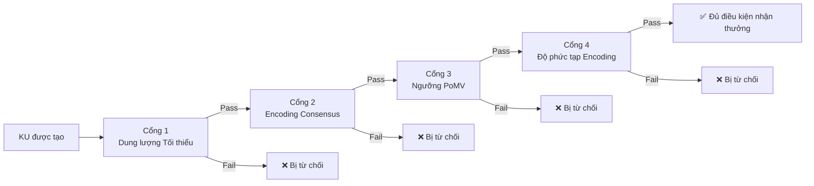

# 7. Anti-Gaming and Quality Assurance (Chống gian lận và Đảm bảo chất lượng)

Phần này đặc tả các cơ chế bảo vệ mạng lưới OBT khỏi các hành vi trục lợi (gaming), spam và lạm dụng. Không giống như các hệ thống blockchain dựa vào phí giao dịch làm cơ chế chống spam chính, OBT sử dụng **trust dưới dạng đại diện tài nguyên (trust as a resource proxy)** — một hệ thống nhiều lớp gồm các giới hạn tỷ lệ (rate limiting), các cổng chất lượng (quality gates), và các bộ phát hiện mô hình (pattern detectors) giúp cho hành vi trục lợi trở nên phi lý về mặt kinh tế. Chúng tôi trình bày kiến trúc chống gian lận hoàn chỉnh, từ các giới hạn tỷ lệ theo từng cấp đến bốn cổng chất lượng tuần tự và bốn bộ phát hiện mô hình trục lợi chuyên biệt, cuối cùng là một phân tích chi phí - lợi ích chính thức chứng minh rằng việc tham gia trung thực luôn ưu việt hơn các chiến lược trục lợi.

## 7.1 Trust as Resource Proxy (Trust làm Đại diện Tài nguyên)

### 7.1.1 The Transaction Fee Problem (Vấn đề Phí giao dịch)

Các blockchain truyền thống sử dụng phí giao dịch làm cơ chế chống spam: mỗi hoạt động đều tốn tiền, khiến cho việc spam hàng loạt trở nên đắt đỏ. Điều này có hiệu quả nhưng tạo ra hai vấn đề:

1. **Rào cản gia nhập.** Người dùng mới phải có token trước khi có thể thực hiện bất kỳ hoạt động nào, tạo ra vấn đề khởi động lạnh (cold-start problem).
2. **Biến động thị trường phí.** Trong thời gian tắc nghẽn, phí tăng đột biến một cách không thể dự đoán trước, loại bỏ những người dùng hợp pháp. Phí gas của Ethereum trong các đợt đúc NFT thường xuyên vượt quá \$100 mỗi giao dịch.

OBT thay thế phí giao dịch bằng **EffectiveTrust** — một chỉ số kiếm được, không thể chuyển nhượng dùng để kiểm soát quyền truy cập vào các hoạt động giao thức:

$$\text{EffectiveTrust}(\text{node}) = \text{EigenTrust}(\text{node}) \times \text{TierWeight}(\text{tier}(\text{node}))$$

### 7.1.2 Tier Weights (Trọng số Cấp độ)

| Cấp độ (Tier) | Tên gọi (Name) | Phạm vi EigenTrust (EigenTrust Range) | Trọng số cấp độ (TierWeight) | EffectiveTrust (tại EigenTrust tối đa trong phạm vi) |
|:----:|------|:---------------:|:----------:|:------------------------------------------:|
| 0 | Leaf | [0.00, 0.10) | 0.1 | 0.010 |
| 1 | Seedling | [0.10, 0.30) | 0.5 | 0.150 |
| 2 | Contributor | [0.30, 0.50) | 1.0 | 0.500 |
| 3 | Established | [0.50, 0.70) | 1.5 | 1.050 |
| 4 | LocalSP | [0.70, 0.85) | 2.0 | 1.700 |
| 5 | ZoneSP | [0.85, 0.95) | 3.0 | 2.850 |
| 6 | GlobalSP | [0.95, 1.00] | 5.0 | 5.000 |

**Bảng 33.** Các cấp độ trust, trọng số, và giá trị EffectiveTrust tối đa.

### 7.1.3 Comparison with Alternative Anti-Spam Mechanisms (So sánh với các Cơ chế Chống Spam thay thế)

| Hệ thống (System) | Cơ chế Chống Spam (Anti-Spam Mechanism) | Có thể Chuyển nhượng? (Transferable?) | Chi phí Khởi động Lạnh (Cold-Start Cost) | Sự Biến động (Volatility) |
|--------|-------------------|:------------:|:--------------:|:----------:|
| Ethereum | Phí gas (ETH) | ✅ Có | Cao (phải mua ETH) | Cao (phí tăng đột biến) |
| Nano | Khay ưu tiên dựa trên số dư | ✅ Có | Thấp (vòi - faucet) | Thấp |
| IOTA | Mana (tương tự danh tiếng) | ❌ Không | Thấp | Thấp |
| Helium | Chi phí phần cứng (hotspot) | N/A | Cao (\$400+) | Không |
| **OBT** | **EffectiveTrust** | **❌ Không** | **Không (Zero)** | **Không (None)** |

**Bảng 34.** So sánh cơ chế chống spam giữa các hệ thống.

Tính chất không thể chuyển nhượng của EffectiveTrust là tối quan trọng: kẻ tấn công không thể mua trust trên thị trường thứ cấp. Trust phải được *kiếm được* thông qua công việc tri thức đã xác thực — tạo lập các KU chất lượng cao, thực hiện chính xác các hoạt động encoding, vượt qua các thử thách lưu trữ — trong một khoảng thời gian dài. Điều này khiến cho hành vi trục lợi trở nên đắt đỏ tương ứng với cấp độ trust yêu cầu.

## 7.2 Rate Limiting by Tier (Giới hạn Tỷ lệ theo Từng Cấp)

### 7.2.1 Rate Limit Parameters (Các Tham số Giới hạn Tỷ lệ)

| Tham số (Parameter) | Leaf (T0) | Seedling (T1) | Contributor (T2) | Established (T3) | LocalSP (T4) | ZoneSP (T5) | GlobalSP (T6) |
|-----------|:---------:|:------------:|:----------------:|:----------------:|:------------:|:-----------:|:-------------:|
| MAX_KU_PER_HR | 1 | 3 | 5 | 8 | 10 | 15 | 20 |
| MAX_ENCODE_PER_HR | 2 | 3 | 5 | 8 | 10 | 15 | 20 |
| MAX_VERIFY_PER_HR | 5 | 10 | 15 | 20 | 30 | 40 | 50 |
| COOLDOWN_MINUTES | 60 | 20 | 12 | 8 | 6 | 4 | 3 |
| MAX_MINT_PER_EPOCH (OBT) | 10 | 30 | 50 | 75 | 100 | 150 | 200 |
| MAX_TRANSFER_PER_HR | 2 | 5 | 10 | 15 | 20 | 30 | 50 |

**Bảng 35.** Các tham số giới hạn tỷ lệ theo từng cấp độ trust.

### 7.2.2 Sliding Window Algorithm (Thuật toán Sliding Window)

Giới hạn tỷ lệ được thực thi bằng thuật toán sliding window theo dõi các hoạt động trong một khoảng thời gian trượt:

```rust
pub struct RateLimitTracker {
    /// Circular buffer of operation timestamps
    pub timestamps: VecDeque<u64>,
    /// Maximum operations allowed in the window
    pub max_operations: u32,
    /// Window duration in seconds
    pub window_seconds: u64,
    /// Operation type being tracked
    pub operation_type: OperationType,
    /// Current tier of the node
    pub tier: u8,
}

impl RateLimitTracker {
    /// Returns true if the operation is allowed, false if rate-limited
    pub fn check_and_record(&mut self, now: u64) -> bool {
        // Evict timestamps outside the window
        let window_start = now.saturating_sub(self.window_seconds);
        while let Some(&front) = self.timestamps.front() {
            if front < window_start {
                self.timestamps.pop_front();
            } else {
                break;
            }
        }
        
        // Check if under the limit
        if self.timestamps.len() as u32 >= self.max_operations {
            return false; // Rate limited
        }
        
        // Record the operation
        self.timestamps.push_back(now);
        true
    }
    
    /// Returns seconds until the next operation is allowed
    pub fn time_until_next(&self, now: u64) -> u64 {
        if self.timestamps.len() as u32 < self.max_operations {
            return 0; // Immediate
        }
        let oldest = self.timestamps.front().unwrap();
        let window_start = now.saturating_sub(self.window_seconds);
        if *oldest >= window_start {
            oldest + self.window_seconds - now
        } else {
            0
        }
    }
}

pub enum OperationType {
    CreateKU,
    Encode,
    Verify,
    Transfer,
    Mint,
}
```

Cơ chế sliding window (ngược lại với bộ đếm fixed-window) giúp ngăn chặn việc khai thác bùng nổ (burst exploitation) tại ranh giới của các cửa sổ thời gian. Trong một hệ thống fixed-window, một nút có thể thực hiện $N$ hoạt động ở cuối cửa sổ này và thêm $N$ hoạt động nữa ở đầu cửa sổ tiếp theo, đạt được $2N$ hoạt động trong một khoảng thời gian ngắn. Cơ chế sliding window loại bỏ trường hợp đặc biệt này.

## 7.3 Four Quality Gates (Sequential Pipeline) (Bốn Cổng Chất lượng - Quy trình tuần tự)

Mỗi Knowledge Unit phải vượt qua bốn cổng chất lượng tuần tự trước khi đủ điều kiện nhận phần thưởng minting. Các cổng được đánh giá theo thứ tự — thất bại tại bất kỳ cổng nào sẽ chấm dứt quy trình và KU đó không được nhận phần thưởng.



**Hình 9.** Bốn cổng chất lượng tuần tự. Mỗi KU phải vượt qua cả bốn cổng để đủ điều kiện nhận phần thưởng.

### 7.3.1 Gate 1: Minimum Size (Cổng 1: Dung lượng Tối thiểu)

| Tham số (Parameter) | Ngưỡng (Threshold) | Mục đích (Purpose) |
|-----------|:---------:|---------|
| `raw_size` | ≥ 256 bytes | Ngăn chặn các KU nhỏ một cách tầm thường (ví dụ: các mục chỉ gồm một từ) |
| `gene_count` | ≥ 2 | Đảm bảo độ phức tạp cấu trúc tối thiểu (ít nhất 2 gen) |

**Cuộc tấn công bị ngăn chặn:** Kẻ tấn công tạo ra hàng triệu KU chỉ có dung lượng một byte để làm tràn ngập mạng lưới và yêu cầu phần thưởng R1. Cổng 1 từ chối tất cả các KU nhỏ hơn 256 byte và có ít hơn 2 gen.

**Phân tích dương tính giả (False positive analysis):** Các KU cực ngắn nhưng hợp pháp (ví dụ: một định nghĩa ngắn gọn chỉ có một gen) sẽ bị từ chối. Điều này là chấp nhận được — mạng lưới ưu tiên chất lượng hơn mức độ bao phủ, và các KU cực ngắn có thể được kết hợp thành một KU lớn hơn.

### 7.3.2 Gate 2: Encoding Consensus (Cổng 2: Encoding Consensus)

| Tham số (Parameter) | Ngưỡng (Threshold) | Mục đích (Purpose) |
|-----------|:---------:|---------|
| `verifier_count` | ≥ 3 AI verifiers | Ngăn chặn hành vi tự xác thực (self-verification) |
| `encoding_status` | `FULL` | Đảm bảo việc encoding hoàn chỉnh (không phải một phần hay bản nháp) |
| `cid_unique` | Độc nhất trong mạng lưới | Ngăn các bản sao giống hệt nhau nhận được phần thưởng kép |

**Cuộc tấn công bị ngăn chặn:** Kẻ tấn công sử dụng một AI cục bộ để tạo lập và tự xác thực các KU mà không có sự đồng thuận của mạng lưới. Cổng 2 yêu cầu ít nhất 3 AI verifiers khác nhau xác nhận hoạt động encoding, và hoạt động encoding phải được đánh dấu là `FULL` (hoàn chỉnh). Việc kiểm tra CID độc nhất ngăn chặn việc gửi cùng một nội dung hai lần dưới các danh tính khác nhau.

**Phát hiện trùng lặp:** CID (Content Identifier) được tính toán bằng hàm băm BLAKE3 trên bản encoding chuẩn (canonical encoding) của KU. Hai KU có nội dung giống hệt nhau sẽ có CID giống hệt nhau, bất kể ai tạo ra chúng, vào lúc nào hay ở đâu. Mạng lưới duy trì một tập hợp CID (qua DHT) và từ chối các khối Mint block tham chiếu đến các CID trùng lặp.

### 7.3.3 Gate 3: PoMV Threshold (Tiered by Age) (Cổng 3: Ngưỡng PoMV phân cấp theo Tuổi)

Cổng này đảm bảo rằng các KU thể hiện được tiện ích liên tục để kiếm phần thưởng dài hạn. Ngưỡng này tăng lên theo tuổi thọ của KU:

| Tuổi thọ KU (epoch) | Tuổi thọ KU (ước tính) | Ngưỡng PoMV (PoMV Threshold) | Giải thích lý do (Rationale) |
|:--------------:|:-----------------:|:--------------:|-----------|
| 0 – 168 | 0 – 7 ngày | 0.00 (ân hạn) | Các KU mới cần thời gian để tích lũy metabolism, các trích dẫn |
| 168 – 720 | 7 – 30 ngày | ≥ 0.01 | Khả năng sống sót tối thiểu — KU phải thể hiện *một số* lượt sử dụng |
| > 720 | > 30 ngày | ≥ 0.05 | Giá trị bền vững — KU phải chứng minh được tiện ích liên tục |

**Bảng 36.** Các cấp độ ngưỡng PoMV theo tuổi thọ của KU.

**Cuộc tấn công bị ngăn chặn:** Kẻ tấn công tạo ra các KU vượt qua Cổng 1–2 nhưng không bao giờ được ai sử dụng. Trong thời gian ân hạn 7 ngày, KU kiếm được phần thưởng tối thiểu. Sau 7 ngày, nó phải chứng minh điểm số PoMV ≥ 0.01 (mức rất thấp — bất kỳ lượt sử dụng thực sự nào cũng đạt được điều này). Sau 30 ngày, ngưỡng tăng lên 0.05, lọc bỏ các KU chỉ nhận được lượt sử dụng nhân tạo ban đầu.

**Cơ sở thiết kế cho thời gian ân hạn:** Các KU mới không thể có metabolism (chưa có ai truy cập chúng), các kết nối synaptic (chưa có ai trích dẫn chúng), hoặc lịch sử survival (chúng vừa mới xuất hiện). Việc yêu cầu PoMV khác không ngay lập tức sẽ trừng phạt tất cả nội dung mới. Thời gian ân hạn 7 ngày cho phép tri thức thực sự tích lũy các tín hiệu tự nhiên (organic signals).

### 7.3.4 Gate 4: Encoding Complexity (Cổng 4: Độ phức tạp Encoding)

| Tham số (Parameter) | Ngưỡng (Threshold) | Mục đích (Purpose) |
|-----------|:---------:|---------|
| `encoding_time_ms` | ≥ 100 ms | Ngăn chặn các hoạt động encoding nhanh một cách tầm thường (sao chép - dán không qua phân tích) |
| `bond_count` | ≥ 1 | Đảm bảo KU được liên kết với ít nhất một KU khác |

**Cuộc tấn công bị ngăn chặn:** Kẻ tấn công chạy các đoạn mã tự động tạo ra các KU hợp lệ về cú pháp nhưng rỗng tuếch về mặt ngữ nghĩa chỉ trong vài mili giây. Cổng 4 yêu cầu quy trình encoding phải mất ít nhất 100ms (chỉ ra quá trình xử lý AI không tầm thường) và tạo ra ít nhất một liên kết bond (chỉ ra rằng nội dung có các kết nối ngữ nghĩa với tri thức hiện có).

**Tham chiếu đầy đủ các thông số của cổng:**

| Cổng (Gate) | Tham số (Parameter) | Ngõ (Threshold) | Cuộc tấn công bị ngăn chặn (Attack Prevented) |
|:----:|-----------|:---------:|-----------------|
| 1 | `raw_size` | ≥ 256 bytes | Các KU nhỏ một cách tầm thường |
| 1 | `gene_count` | ≥ 2 | Các KU rỗng về mặt cấu trúc |
| 2 | `verifier_count` | ≥ 3 | Tự xác thực |
| 2 | `encoding_status` | `FULL` | Encoding một phần/bản nháp |
| 2 | `cid_unique` | Độc nhất | Gửi các bản sao giống hệt nhau |
| 3 | PoMV (0–7 ngày) | ≥ 0.00 | — (thời gian ân hạn) |
| 3 | PoMV (7–30 ngày) | ≥ 0.01 | Các KU không có tiện ích |
| 3 | PoMV (>30 ngày) | ≥ 0.05 | Các KU đuôi dài giá trị thấp |
| 4 | `encoding_time_ms` | ≥ 100 ms | Encoding tầm thường |
| 4 | `bond_count` | ≥ 1 | Các KU bị cô lập |

**Bảng 37.** Tham chiếu đầy đủ tham số cổng chất lượng.

## 7.4 Four Gaming Pattern Detectors (Bốn Bộ phát hiện Mô hình Trục lợi)

Bên cạnh các cổng chất lượng (lọc các KU riêng lẻ), OBT triển khai bốn bộ phát hiện mô hình chuyên biệt nhằm phân tích *các mô hình hành vi (behavioral patterns)* trên nhiều KU, các nút và các khoảng thời gian khác nhau. Mỗi bộ phát hiện tính toán một điểm số trục lợi (gaming score) từ các tín hiệu có trọng số và đề xuất một cấp độ hình phạt.

### 7.4.1 Isolation Attack (Tấn công Cô lập)

**Mô tả:** Một nhóm các nút thông đồng tạm thời ngắt kết nối khỏi mạng lưới chính, tạo ra các KU bên trong mạng lưới phân nhánh bị cô lập của chúng, và kết nối lại để yêu cầu phần thưởng cho tri thức chưa bao giờ được xác thực bởi mạng lưới rộng lớn hơn.

**Các tín hiệu phát hiện:**

| Tín hiệu (Signal) | Trọng số (Weight) | Cách đo lường (Measurement) |
|--------|:------:|-------------|
| `simultaneous_offline` | 0.40 | Nhiều nút ngoại tuyến đồng thời (trong vòng 5 phút) |
| `gossip_gap` | 0.30 | Khoảng trống lớn trong các thông điệp gossip từ nhóm trong khoảng thời gian ngoại tuyến |
| `internal_witnesses` | 0.20 | Tất cả chữ ký nhân chứng trên các KU được tạo ra đều đến từ bên trong nhóm |
| `burst_mints` | 0.10 | Sự gia tăng đột biến trong các sự kiện mint ngay sau khi kết nối lại |

**Công thức tính điểm:**

$$\text{isolation\_score} = \sum_{i=1}^{4} w_i \times \text{signal}_i$$

**Thuật toán:**

1. Giám sát các mô hình kết nối của nút thông qua các nhịp tim (heartbeats) gossip.
2. Gắn cờ các nhóm có ≥3 nút ngoại tuyến trong vòng 5 phút kể từ khi nút đầu tiên ngoại tuyến.
3. Khi nhóm kết nối lại, kiểm tra các KU được tạo ra trong cửa sổ ngoại tuyến.
4. Kiểm tra xem các chữ ký nhân chứng trên các KU đó có đến từ nhóm ngoại tuyến một cách độc quyền hay không.
5. Tính toán `isolation_score` và áp dụng hình phạt nếu vượt quá ngưỡng.

**Hình phạt đề xuất:**
- $\text{score} < 0.3$: Không xử lý (có thể do mất mạng trùng hợp).
- $0.3 \leq \text{score} < 0.5$: Tăng cường giám sát — tăng tần suất thử thách trong 48 epoch.
- $0.5 \leq \text{score} < 0.7$: Giảm trừ trust — EigenTrust × 0.5 cho tất cả các thành viên trong nhóm.
- $\text{score} \geq 0.7$: Tạm giam (Jail) — tất cả các thành viên trong nhóm bị cách ly trong 168 epoch (7 ngày).

### 7.4.2 Burst Spam (Spam hàng loạt)

**Mô tả:** Một nút nhanh chóng tạo ra nhiều KU chất lượng thấp trong một khoảng thời gian ngắn, cố gắng vượt qua các cổng chất lượng với nội dung tối thiểu chỉ vừa đủ đáp ứng các ngưỡng.

**Các tín hiệu phát hiện:**

| Tín hiệu (Signal) | Trọng số (Weight) | Cách đo lường (Measurement) |
|--------|:------:|-------------|
| `rate_exceeds` | 0.35 | Tỷ lệ tạo KU nằm trong nhóm 1% cao nhất của phân phối mạng lưới |
| `near_min_sizes` | 0.25 | >50% số KU nằm trong khoảng 10% của mức tối thiểu 256 byte |
| `content_similarity` | 0.25 | Độ tương đồng BLAKE3 trung bình từng cặp (chỉ số Jaccard trên các shingle 4-gram) > 0.7 |
| `low_bond_diversity` | 0.15 | >80% số KU liên kết bond với cùng một KU đích |

**Công thức tính điểm:**

$$\text{burst\_score} = \sum_{i=1}^{4} w_i \times \text{signal}_i$$

**Thuật toán:**

1. Theo dõi các dấu thời gian tạo KU trên mỗi nút bằng cách sử dụng sliding window (§7.2.2).
2. Gắn cờ các nút có tỷ lệ tạo lập vượt quá phân vị thứ 99 (99th percentile) của phân phối mạng lưới.
3. Đối với các nút bị gắn cờ, phân tích phân phối của dung lượng KU, độ tương đồng nội dung, và các đích liên kết bond.
4. Tính toán `burst_score` và áp dụng hình phạt nếu vượt quá ngưỡng.

**Nhận thức chính:** Việc phát hiện độ tương đồng nội dung sử dụng các shingle BLAKE3 4-gram thay vì khớp chính xác. Điều này giúp bắt được những kẻ tấn công thực hiện các sửa đổi tầm thường (thay đổi một từ duy nhất, sắp xếp lại thứ tự câu) để tạo ra các KU có CID khác nhau nhưng nội dung gần như giống hệt nhau.

### 7.4.3 Circular Transfer (Wash Trading) (Giao dịch Chuyển nhượng Vòng tròn)

**Mô tả:** Một nhóm các tài khoản thông đồng tạo ra một chu trình chuyển nhượng OBT: A→B→C→A, tạo ra vẻ ngoài của hoạt động kinh tế (có thể được sử dụng để thổi phồng điểm số metabolism hoặc đáp ứng các yêu cầu hoạt động) mà không có bất kỳ sự trao đổi giá trị thực sự nào.

**Thuật toán phát hiện:** Phát hiện chu trình bằng thuật toán Tìm kiếm theo Chiều sâu (Depth-First Search - DFS) trên đồ thị chuyển nhượng.

```
function detect_wash_trading(transfer_graph, window_epochs=168):
    cycles = []
    for each node in transfer_graph:
        visited = {}
        stack = [(node, [node])]
        while stack is not empty:
            current, path = stack.pop()
            for neighbor in transfer_graph.outgoing(current, window_epochs):
                if neighbor == node and len(path) >= 2:
                    cycles.append(path + [neighbor])
                elif neighbor not in visited:
                    visited[neighbor] = true
                    stack.push((neighbor, path + [neighbor]))
    return unique(cycles)
```

**Các tín hiệu phát hiện (trên mỗi chu trình được phát hiện):**

| Tín hiệu (Signal) | Trọng số (Weight) | Cách đo lường (Measurement) |
|--------|:------:|-------------|
| `has_cycle` | 0.40 | Phát hiện chu trình có độ dài ≤ 10 nút |
| `same_subnet` | 0.20 | >50% số thành viên tham gia chu trình chia sẻ cùng một subnet IP (/24) |
| `return_ratio` | 0.25 | Tỷ lệ OBT quay vòng so với OBT đã gửi > 80% |
| `timing_regularity` | 0.15 | Hệ số biến động của thời gian giữa các giao dịch < 0.2 (rất đều đặn) |

**Công thức tính điểm:**

$$\text{wash\_score} = \sum_{i=1}^{4} w_i \times \text{signal}_i$$

**Hình phạt:** Áp dụng cho tất cả các tài khoản trong chu trình được phát hiện. Hình phạt nghiêm khắc nhất được áp dụng cho tài khoản có tổng khối lượng giao dịch cao nhất trong chu trình (được cho là kẻ tổ chức).

### 7.4.4 Trust Farming (Long Con) (Nuôi Trust)

**Mô tả:** Một kẻ tấn công tinh vi xây dựng trust dần dần thông qua các đóng góp thực sự (hoặc có vẻ thực sự) qua nhiều tuần hoặc nhiều tháng, sau đó khai thác mức trust cao đã tích lũy để thực hiện chiến lược trục lợi quy mô lớn (ví dụ: spam hàng loạt ở cấp cao, hoặc trở thành nhân chứng để ký các MintProof gian lận).

**Các tín hiệu phát hiện:**

| Tín hiệu (Signal) | Trọng số (Weight) | Cách đo lường (Measurement) |
|--------|:------:|-------------|
| `trust_quality_gap` | 0.35 | Cấp độ trust ≥ 4 nhưng PoMV trung bình của các KU gần đây < 0.10 (trust cao, đầu ra chất lượng thấp) |
| `activity_spike` | 0.25 | Hoạt động trong epoch hiện tại > 3× đường trung bình động 30 ngày của nút |
| `witness_concentration` | 0.25 | >60% số KU được nút này chứng thực đến từ cùng 5 tài khoản |
| `centrality_drop` | 0.15 | Độ trung tâm đồ thị (graph centrality) của nút giảm >50% trong 168 epoch gần nhất (mất kết nối) |

**Công thức tính điểm:**

$$\text{farming\_score} = \sum_{i=1}^{4} w_i \times \text{signal}_i$$

**Nhận thức chính:** Tín hiệu `trust_quality_gap` mang lại nhiều thông tin nhất. Một nút có trust cao và hợp pháp sẽ tạo ra các KU có chất lượng cao một cách nhất quán (đó chính là *cách* họ đạt được mức trust cao). Ngược lại, một kẻ nuôi trust (trust farmer) chỉ tạo ra chất lượng vừa đủ để duy trì việc thăng cấp trust tier, sau đó chuyển hướng sang đầu ra chất lượng thấp với khối lượng cao để tối đa hóa việc đúc token. Khoảng cách giữa cấp độ trust và chất lượng đầu ra gần đây là một chỉ số mạnh mẽ cảnh báo hành vi nuôi trust.

## 7.5 Security Analysis: Cost vs Benefit (Phân tích Bảo mật: Chi phí so với Lợi ích)

### 7.5.1 Penalty Recommendation Thresholds (Các Ngưỡng đề xuất Hình phạt)

Tất cả bốn bộ phát hiện mô hình trục lợi chia sẻ chung một khung hình phạt:

| Phạm vi Điểm số (Score Range) | Đề xuất (Recommendation) | Hành động (Action) |
|:----------:|---------------|--------|
| < 0.3 | Không | Không thực hiện hành động — hành vi trong giới hạn bình thường |
| 0.3 – 0.5 | Tăng cường Giám sát | Tăng cường theo dõi, tần suất thử thách cao hơn, gắn cờ cảnh báo |
| 0.5 – 0.7 | Giảm trừ Trust | EigenTrust × 0.5, tạm thời giảm giới hạn tỷ lệ |
| > 0.7 | Tạm giam | Nút bị cách ly trong 168–720 epoch, đình chỉ tất cả phần thưởng |

**Bảng 38.** Các ngưỡng đề xuất hình phạt chung.

### 7.5.2 Cost-Benefit Analysis (Phân tích Chi phí - Lợi ích)

Đối với mỗi mô hình tấn công, chúng tôi phân tích lợi ích kỳ vọng (lượng OBT thu được) so với chi phí kỳ vọng (tổn thất trust, giới hạn tỷ lệ, rủi ro phát hiện, và thời gian phục hồi):

| Mô hình Tấn công (Attack Pattern) | Lợi ích Mong đợi (Expected Benefit) | Chi phí: Mất Trust (Cost: Trust Loss) | Chi phí: Giới hạn Tỷ lệ (Cost: Rate Limits) | Chi phí: Rủi ro Phát hiện (Cost: Detection Risk) | Giá trị Kỳ vọng Ròng (Net Expected Value) |
|---------------|:----------------:|:----------------:|:------------------:|:--------------------:|:------------------:|
| **Tấn công Cô lập** | ~50 OBT (burst mint trong khi cô lập) | EigenTrust × 0.5 (phát hiện) hoặc × 0.2 (tạm giam) | Các giới hạn tỷ lệ bình thường vẫn áp dụng trong cô lập | Cao (khoảng trống gossip có thể phát hiện trong vòng 1 epoch) | **Cực kỳ tiêu cực** |
| **Spam Hàng loạt** | ~20 OBT (nhiều KU PoMV thấp × phần thưởng tối thiểu) | EigenTrust × 0.5 cho mỗi lần phát hiện | Leaf/Seedling: Giới hạn 1-3 KU/giờ kìm hãm đầu ra | Vừa phải (phát hiện độ tương đồng nội dung có độ trễ 2 epoch) | **Tiêu cực** |
| **Chuyển nhượng Vòng tròn** | ~0 OBT (giao dịch chuyển nhượng không tạo ra OBT mới) | EigenTrust × 0.5 cho tất cả các thành viên trong chu trình | Giới hạn tỷ lệ chuyển nhượng kìm hãm khối lượng | Cao (phát hiện chu trình DFS chạy sau mỗi 168 epoch) | **Cực kỳ tiêu cực** |
| **Nuôi Trust** | ~200 OBT (burst ở mức trust cao trước khi bị phát hiện) | EigenTrust → 0.001 (Tombstone nếu được xác nhận) | Hạ cấp bậc (Tier demotion) loại bỏ lợi thế tỷ lệ của cấp cao | Vừa phải (độ trễ 30 ngày cho khoảng cách trust-chất lượng) | **Tiêu cực (dài hạn)** |

**Bảng 39.** Phân tích chi phí - lợi ích cho từng mô hình trục lợi.

### 7.5.3 Detailed Attack Economics (Kinh tế học Chi tiết của cuộc Tấn công)

**Tấn công Cô lập — Chi phí Áp đảo:**

Một kẻ tấn công với 5 nút thông đồng tại cấp Contributor (T2) cố gắng thực hiện một cuộc tấn công cô lập:
- *Lợi ích trong trường hợp tốt nhất:* 5 nút × trần 50 OBT/epoch × 1 epoch = 250 OBT.
- *Chi phí phát hiện:* Tín hiệu `simultaneous_offline` được kích hoạt ngay lập tức khi kết nối lại. Với 5 nút ngoại tuyến cùng nhau, $\text{signal} \approx 0.9$. Kết hợp với `internal_witnesses` ($\approx 1.0$) và `burst_mints` ($\approx 0.8$), điểm số cô lập vượt quá 0.7 → Tạm giam.
- *Chi phí tạm giam:* 168 epoch × cơ hội thu nhập tiềm năng 50 OBT/epoch = 8,400 OBT mất cơ hội.
- *Chi phí trust:* EigenTrust × 0.2 → bị hạ cấp xuống Seedling (T1) hoặc Leaf (T0), đòi hỏi nhiều tuần làm việc trung thực để phục hồi.
- *Ròng (Net):* +250 − 8,400 − tổn thất thu nhập tương lai = **cực kỳ tiêu cực**.

**Spam Hàng loạt — Giới hạn Tỷ lệ Áp đảo:**

Một nút cấp Leaf (T0) cố gắng thực hiện spam hàng loạt:
- *Đầu ra bị giới hạn tỷ lệ:* 1 KU/giờ, thời gian cooldown 60 phút = tối đa 24 KU/ngày.
- *Lọc Cổng 1:* Mỗi KU phải ≥ 256 byte với ≥ 2 gen — không thể được tạo ra một cách tầm thường.
- *Lọc Cổng 3:* Sau 7 ngày, các KU phải đạt điểm số PoMV ≥ 0.01. Các KU spam không có tiện ích thực tế sẽ thất bại.
- *Trần đúc:* Tối đa 10 OBT/epoch cho các nút cấp Leaf.
- *Lợi ích trong trường hợp tốt nhất:* 10 OBT/epoch × 168 epoch (trước khi Cổng 3 có hiệu lực) = 1,680 OBT trong 7 ngày.
- *Chi phí phát hiện:* Tín hiệu `content_similarity` phát hiện các KU gần như giống hệt nhau trong vòng 2 epoch. Điểm số burst > 0.5 → giảm trừ trust.
- *Chi phí trust:* EigenTrust × 0.5 → duy trì ở cấp Leaf vĩnh viễn, trần 10 OBT/epoch vẫn giữ nguyên.
- *Ròng (Net):* Thu lợi ngắn hạn không đáng kể, nhưng bị đày xuống cấp thấp nhất vĩnh viễn. **Việc tham gia trung thực ở cấp Contributor kiếm được 50 OBT/epoch — nhiều hơn gấp 5 lần**.

**Chuyển nhượng Vòng tròn — Không có Lợi ích Trực tiếp:**

Hoạt động wash trading không tạo ra OBT mới. Giao dịch chuyển nhượng không phải là sự kiện minting — chúng di chuyển các token hiện có giữa các tài khoản. Lợi ích tiềm năng duy nhất là thổi phồng điểm số metabolism (nếu các giao dịch chuyển nhượng được tính là "hoạt động" cho PoMV). Nhưng:
- Metabolism theo dõi *việc truy cập tri thức (knowledge access)* (truy vấn, truy xuất), chứ không phải các giao dịch chuyển nhượng token.
- Ngay cả khi metabolism có thể thổi phồng được, bộ phát hiện chu trình DFS sẽ gắn cờ các chu trình trong vòng 168 epoch.
- Tất cả các thành viên trong chu trình đều bị giảm trừ trust.
- *Ròng (Net):* Lợi ích bằng không, chi phí trust đáng kể. **Hoàn toàn kém thế so với việc không hành động**.

**Nuôi Trust — Tổn thất Dài hạn:**

Kẻ nuôi trust đầu tư hơn 60 ngày để xây dựng trust lên cấp Established (T3):
- *Khoản đầu tư:* 60 ngày × công việc tri thức thực tế = chi phí cơ hội của việc tham gia trung thực đáng lẽ có thể kiếm được ~60 × 24 × 75 = 108,000 OBT.
- *Cửa sổ khai thác:* Một khi bị phát hiện (khoảng cách trust-chất lượng xuất hiện trong vòng 7–14 ngày kể từ khi chuyển hướng), điểm số farming vượt quá 0.7 → Tạm giam + nguy cơ bị Tombstone.
- *Lợi ích trong trường hợp tốt nhất:* 14 ngày × 24 epoch × 150 OBT (mức trần T5 nếu kẻ nuôi trust đạt cấp ZoneSP) = 50,400 OBT.
- *Chi phí:* 60 ngày đầu tư + Tombstone (loại trừ vĩnh viễn) + tổn thất toàn bộ thu nhập trong tương lai.
- *Ròng (Net):* Khoản đầu tư 60 ngày bị lãng phí hoàn toàn nếu kẻ nuôi trust bị Tombstone. Ngay cả khi không bị Tombstone, việc hạ cấp trust xuống Leaf khiến toàn bộ chiến dịch hơn 60 ngày không có lãi so với 60 ngày tham gia trung thực ở cùng cấp độ.

### 7.5.4 Invariant Bảo mật (Security Invariant)

Hệ thống chống trục lợi được thiết kế để duy trì invariant bảo mật sau:

> **Đối với tất cả các mô hình tấn công đã biết, chi phí kỳ vọng của việc trục lợi luôn vượt quá lợi ích kỳ vọng, giả định rằng tỷ lệ chiết khấu của kẻ tấn công là số dương và chân trời thời gian là hữu hạn.**

Bất biến này giữ vững bởi vì:

1. **Các giới hạn tỷ lệ (Rate limits)** kìm hãm lợi ích tức thời của bất kỳ cuộc tấn công nào.
2. **Các cổng chất lượng (Quality gates)** lọc bỏ các đầu ra chất lượng thấp bất kể khối lượng lớn thế nào.
3. **Các bộ phát hiện mô hình (Pattern detectors)** nhận diện hành vi phối hợp và áp dụng các hình phạt trust.
4. **Các hình phạt trust** có tính chất cộng dồn: mỗi lần bị phát hiện sẽ làm giảm khả năng kiếm tiền trong tương lai, khiến các cuộc tấn công tiếp theo trở nên ít lợi nhuận hơn.
5. **Trust là không thể chuyển nhượng**: kẻ tấn công không thể "rút tiền mặt" từ lượng trust đã tích lũy trước khi nó bị hủy hoại.

Sự kết hợp của năm cơ chế này tạo ra một kiến trúc **phòng thủ chuyên sâu (defense-in-depth)**, trong đó không một cơ chế đơn lẻ nào là đủ, nhưng toàn bộ sự kết hợp này làm cho hành vi trục lợi trở nên phi lý đối với bất kỳ tác nhân kinh tế hợp lý nào.
