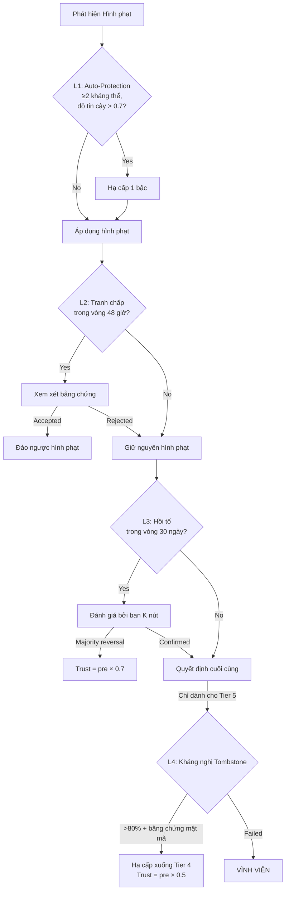

# 8. Graduated Penalty System

Phần này trình bày hệ thống hình phạt của OBT — một khung lũy tiến 5 cấp độ để xử lý gian lận và hành vi ác ý. Chúng tôi bắt đầu với nền tảng triết học (phân tách OBT/Trust), chi tiết hóa từng cấp độ hình phạt với các công thức trust, đặc tả cơ chế khuếch đại tương quan (correlation amplification), liệt kê các loại hình gian lận được ghi nhận, và mô tả quy trình kháng nghị bốn lớp.

## 8.1 Design Philosophy: "Salary vs Medical License" (Triết lý Thiết kế: "Tiền lương so với Giấy phép Hành nghề Y")

Hệ thống hình phạt của OBT được xây dựng trên một sự phân biệt mang tính triết học giúp phân biệt nó với tất cả các hệ thống token hiện có:

> **Nguyên lý:** Token kiếm được (OBT) và uy tín trust reputation thuộc về các miền tách biệt. Hình phạt sẽ ảnh hưởng đến trust — và do đó là *tiềm năng kiếm tiền trong tương lai* — chứ không bao giờ tịch thu hồi tố các token đã kiếm được.

Điều này tương tự như việc cấp giấy phép hành nghề chuyên môn:
- Một bác sĩ phạm sai sót chuyên môn nghiêm trọng có thể bị tước giấy phép hành nghề y (trust = 0), ngăn chặn việc hành nghề trong tương lai.
- Tiền lương quá khứ của họ không bị thu hồi hồi tố — họ đã được đền bù cho công việc thực sự được thực hiện.
- Mức độ nghiêm trọng của hậu quả đối với giấy phép sẽ tỷ lệ thuận với mức độ nghiêm trọng của hành vi vi phạm.

| Khía cạnh (Aspect) | Các Hệ thống Token Truyền thống (Traditional Token Systems) | OBT |
|--------|--------------------------|-----|
| Đối tượng hình phạt | Token đã stake (tài chính) | Uy tín trust reputation (phi tài chính) |
| Thu nhập quá khứ | Bị thu hồi (Ethereum slashing) | Vĩnh viễn (Tiên đề A1, G-Counter) |
| Thu nhập tương lai | Giảm tương ứng | Bị kiểm soát bởi cấp độ trust |
| Phục hồi | Stake lại vốn | Xây dựng lại danh tiếng qua công việc |
| Hình phạt tối đa | Mất toàn bộ vốn stake | Tombstone (loại trừ vĩnh viễn) |

**Bảng 27.** So sánh triết lý hình phạt: các hệ thống staking truyền thống so với OBT.

Sự phân tách này tạo ra một *hồ sơ răn đe cụ thể (specific deterrent profile)*:

1. **Đối với các nút trung thực thỉnh thoảng mắc lỗi:** Sự suy giảm trust tự nhiên là đủ. Không có hành động trừng phạt nào được thực hiện đối với các biến động hành vi bình thường.
2. **Đối với các nỗ lực trục lợi (gaming):** Các cổng chất lượng (quality gates) sẽ chặn hành vi trước khi phần thưởng được phát hành. Việc giảm trừ trust sẽ hạn chế các nỗ lực trong tương lai.
3. **Đối với gian lận có hệ thống:** Các hình phạt leo thang sẽ nhanh chóng làm giảm tiềm năng kiếm tiền xuống gần bằng không, với sự loại trừ vĩnh viễn dành cho những kẻ vi phạm tồi tệ nhất.
4. **Đối với tất cả các nút:** Thu nhập trong quá khứ vẫn còn nguyên vẹn, bảo toàn uy tín của hệ thống như một bên đền bù công bằng cho công việc thực sự.

## 8.2 Five Penalty Tiers (Năm Cấp độ Hình phạt)

### 8.2.1 Tier 0: Natural Decay (Cấp 0: Suy giảm Tự nhiên)

Sự suy giảm trust tự nhiên không phải là một hình phạt — đó là một thuộc tính cơ sở của hệ thống trust. Trust suy giảm theo hàm mũ trong các khoảng thời gian không hoạt động:

$$\text{trust}(t) = \text{trust}_0 \times e^{-\lambda t}$$

trong đó $\lambda = 0.01$ mỗi giờ và $t$ được đo bằng giờ không hoạt động.

| Chỉ số (Metric) | Giá trị (Value) |
|--------|-------|
| Hằng số suy giảm ($\lambda$) | 0.01 mỗi giờ |
| Chu kỳ bán rã (Half-life) | $\ln(2) / 0.01 \approx 69.3$ giờ ≈ 2.9 ngày |
| Thời gian ân hạn (Grace period) | < 1 giờ ngoại tuyến: không suy giảm |
| Tỷ lệ phục hồi (Recovery rate) | $\min(\text{interaction\_rate} \times 0.01, 0.05/\text{giờ})$ |

**Bảng 28.** Các tham số suy giảm trust tự nhiên.

Tính bất đối xứng giữa suy giảm (nhanh) and phục hồi (chậm, giới hạn ở mức 0.05/giờ) là có chủ ý: việc *mất* trust do thờ ơ sẽ dễ dàng, nhưng việc xây dựng lại nó đòi hỏi sự *tham gia thực sự và bền bỉ*.

### 8.2.2 Tier 1: Warning (Cấp 1: Cảnh cáo)

**Kích hoạt:** Vi phạm nhỏ lần đầu (ví dụ: thất bại thử thách PoS-KU, vi phạm giới hạn tỷ lệ).

**Hiệu lực:** Không giảm trust ngay lập tức. Một cảnh cáo sẽ được ghi lại trên hồ sơ của nút với thời gian lưu giữ là 90 ngày. Cảnh cáo đóng vai trò làm:
1. Tín hiệu cho hệ thống phát hiện mô hình (giám sát tăng cường).
2. Bằng chứng để leo thang hình phạt nếu hành vi tái diễn.
3. Biện pháp răn đe thông qua tính hiển thị (các nút khác có thể nhìn thấy cảnh cáo).

### 8.2.3 Tier 2: Trust Reduction (Cấp 2: Giảm trừ Trust)

**Kích hoạt:** Tái diễn vi phạm nhỏ, phát hiện rẽ nhánh lần đầu, hoặc xác nhận thao túng cổng chất lượng (quality gate manipulation).

**Công thức:**

$$\text{trust}_{\text{new}} = \text{trust}_{\text{current}} \times (1 - \text{severity} \times 0.3)$$

trong đó $\text{severity} \in [0.0, 1.0]$ được xác định bởi loại hình gian lận (§8.5).

**Thuộc tính:**
- Giảm vĩnh viễn (trust không bao giờ tự động phục hồi về mức trước hình phạt).
- Tỷ lệ thuận với trust hiện tại: các nút có trust cao sẽ mất nhiều trust tuyệt đối hơn.
- Hệ số $0.3$ giới hạn mức giảm tối đa cho một sự kiện đơn lẻ là 30%.

**Ví dụ:** Một nút có trust 0.85 thực hiện hành vi vi phạm có mức độ nghiêm trọng 0.5:
$$\text{trust}_{\text{new}} = 0.85 \times (1 - 0.5 \times 0.3) = 0.85 \times 0.85 = 0.7225$$

### 8.2.4 Tier 3: Jail (Cấp 3: Tạm giam)

**Kích hoạt:** Phát hiện rẽ nhánh lần hai, xác nhận mô hình trục lợi với điểm số > 0.5, hoặc nhiều lần vi phạm Tier 2.

**Công thức:**

$$\text{trust}_{\text{new}} = \text{trust}_{\text{current}} \times 0.2$$

**Thời hạn:** 7–30 ngày (tùy thuộc vào mức độ nghiêm trọng).

**Các hạn chế trong thời gian tạm giam:**
- Không thể tạo các KU mới.
- Không thể tham gia xác thực encoding.
- Không thể kiếm phần thưởng OBT.
- Không thể chuyển nhượng OBT (giao dịch chuyển nhượng bị chặn cho đến khi hết thời hạn tạm giam).
- *Có thể* vẫn nhận các giao dịch chuyển nhượng OBT.

### 8.2.5 Tier 4: Trust Zero (Cấp 4: Đưa Trust về Cận Không)

**Kích hoạt:** Phát hiện rẽ nhánh lần ba, xác nhận gian lận có hệ thống, hoặc leo thang từ Tier 3.

**Công thức:**

$$\text{trust}_{\text{new}} = 0.001$$

**Thời hạn:** 180 ngày. Sau khi hết hạn, trust bắt đầu phục hồi từ mức 0.001 với tỷ lệ phục hồi tiêu chuẩn.

Mức tối thiểu khác không (0.001 thay vì 0.0) cho phép nút tham gia ở công suất tối thiểu trong thời gian chịu phạt, cho phép hệ thống quan sát xem hành vi có được cải thiện hay không.

### 8.2.6 Tier 5: Tombstone (Cấp 5: Tombstone)

**Kích hoạt:** Gian lận có tổ chức, có hệ thống với bằng chứng về kẻ cầm đầu, giả mạo danh tính, hoặc các cuộc tấn công phối hợp.

**Công thức:**

$$\text{trust}_{\text{new}} = 0$$

**Thời hạn:** VĨNH VIỄN. Tài khoản bị loại trừ vĩnh viễn khỏi mọi hoạt động tham gia mạng lưới.

**Yêu cầu đối với Tombstone:**
- Đòi hỏi bằng chứng về gian lận *có tổ chức và có hệ thống* — không chỉ là các vi phạm riêng lẻ lặp đi lặp lại.
- Phải chứng minh được chủ ý (phân tích mô hình, bằng chứng phối hợp).
- Phải chịu quy trình kháng nghị nghiêm ngặt nhất (L4, §8.6).

### Bảng Tóm tắt các Cấp độ

| Cấp độ (Tier) | Tên gọi (Name) | Công thức Trust (Trust Formula) | Thời hạn (Duration) | Kiếm thưởng (Earning) | Chuyển nhượng (Transfers) |
|------|------|:-------------|----------|:-------:|:---------:|
| 0 | Natural Decay | $e^{-0.01t}$ | Liên tục | ✅ | ✅ |
| 1 | Warning | Không thay đổi | 90 ngày | ✅ | ✅ |
| 2 | Trust Reduction | $\text{trust} \times (1 - s \times 0.3)$ | Vĩnh viễn | ✅ (giảm) | ✅ |
| 3 | Jail | $\text{trust} \times 0.2$ | 7–30 ngày | ❌ | ❌ |
| 4 | Trust Zero | 0.001 | 180 ngày | ❌ | ❌ |
| 5 | Tombstone | 0 | VĨNH VIỄN | ❌ | ❌ |

**Bảng 29.** Đặc tả đầy đủ các cấp độ hình phạt.

## 8.3 Correlation Penalty (Hình phạt Tương quan)

Lấy cảm hứng từ hình phạt tương quan (correlation penalty) cho validator slashing của Ethereum 2.0, OBT khuếch đại các hình phạt khi nhiều nút bị phạt đồng thời. Ý nghĩa là các vi phạm đồng thời có nhiều khả năng đại diện cho các cuộc tấn công *phối hợp* hơn là các thất bại độc lập.

### 8.3.1 Công thức

$$\text{correlation\_multiplier} = 1 + \log_2(n)$$

trong đó $n$ là số lượng nút bị phạt trong cùng một cửa sổ phát hiện.

| Số nút vi phạm đồng thời ($n$) (Simultaneous Nodes) | Hệ số nhân (Multiplier) | Diễn giải (Interpretation) |
|:------------------------:|:----------:|----------------|
| 1 | 1.00 | Vi phạm riêng lẻ — hình phạt cơ sở |
| 2 | 2.00 | Có khả năng phối hợp — nhân đôi |
| 4 | 3.00 | Rất có thể phối hợp — nhân ba |
| 8 | 4.00 | Bằng chứng phối hợp mạnh mẽ |
| 16 | 5.00 | Cuộc tấn công có tổ chức |
| 32 | 6.00 | Cuộc tấn công phối hợp quy mô lớn |

**Bảng 30.** Các giá trị hệ số nhân tương quan.

### 8.3.2 Application (Áp dụng)

Hệ số nhân tương quan khuếch đại tham số mức độ nghiêm trọng (severity) trong công thức giảm trừ trust:

$$\text{effective\_severity} = \min(\text{base\_severity} \times \text{correlation\_multiplier}, 1.0)$$

Điều này có nghĩa là mức độ nghiêm trọng cơ sở 0.3 (vừa phải) sẽ trở thành 0.9 (nghiêm trọng) khi có 8 nút bị phạt đồng thời, có khả năng leo thang từ Tier 2 lên Tier 3.

### 8.3.3 Comparison with Ethereum 2.0 (So sánh với Ethereum 2.0)

| Khía cạnh (Aspect) | Ethereum 2.0 | OBT |
|--------|-------------|-----|
| Đối tượng hình phạt | ETH đã stake | Điểm số trust |
| Công thức | $\text{penalty} \propto (\sum \text{slashed\_balance})^2 / \text{total\_stake}$ | $m = 1 + \log_2(n)$ |
| Hình phạt tối đa | Toàn bộ stake (tham gia trên 33%) | Tombstone (loại trừ vĩnh viễn) |
| Cửa sổ thời gian | 36 ngày (8,192 epoch) | Theo từng cửa sổ phát hiện |
| Phục hồi | Stake lại sau khi rút tiền | Xây dựng lại trust qua công việc |

**Bảng 31.** So sánh hình phạt tương quan: Ethereum 2.0 so với OBT.

Công thức logarit của OBT ít hung hãn hơn so với công thức bậc hai của Ethereum nhưng có khả năng áp dụng rộng rãi hơn — nó áp dụng cho tất cả các cấp độ hình phạt, chứ không chỉ các sự kiện slashing.

## 8.4 Trust Decay Formula (Công thức Suy giảm Trust)

Hàm suy giảm trust tự nhiên xứng đáng được phân tích chi tiết vì nó làm nền tảng cho tất cả các tương tác hình phạt:

$$\text{trust}(t) = \text{trust}_0 \times e^{-\lambda t}, \quad \lambda = 0.01$$

### 8.4.1 Các thuộc tính

**Chu kỳ bán rã (Half-life):**
$$t_{1/2} = \frac{\ln 2}{\lambda} = \frac{0.693}{0.01} \approx 69.3 \text{ giờ} \approx 2.9 \text{ ngày}$$

**Lịch trình suy giảm (Decay schedule):**

| Thời gian Ngoại tuyến (Time Offline) | Trust còn lại (Trust Remaining) | Diễn giải (Interpretation) |
|:------------:|:--------------:|----------------|
| 1 giờ | 99.0% | Biến động bình thường |
| 12 giờ | 88.7% | Sự cố mất điện ngắn |
| 1 ngày | 78.7% | Một ngày ngoại tuyến |
| 3 ngày | 48.7% | Vắng mặt kéo dài |
| 7 ngày | 18.7% | Vắng mặt một tuần — tổn thất đáng kể |
| 14 ngày | 3.5% | Hai tuần — gần như mất hoàn toàn |
| 30 ngày | 0.05% | Một tháng — coi như bằng không |

**Bảng 32.** Lịch trình suy giảm trust đối với các khoảng thời gian ngoại tuyến khác nhau.

### 8.4.2 Recovery Asymmetry (Tính Bất đối xứng trong Phục hồi)

Việc phục hồi trust cố ý được thiết kế chậm hơn so với suy giảm:

$$\text{recovery\_rate} = \min(\text{interaction\_rate} \times 0.01, 0.05 / \text{giờ})$$

Tại tốc độ phục hồi tối đa (0.05/giờ), việc phục hồi từ 0% lên 50% mất:
$$t = \frac{0.50}{0.05} = 10 \text{ giờ}$$

Nhưng phục hồi từ 50% lên 90% mất:
$$t = \frac{0.40}{0.05} = 8 \text{ giờ}$$

Tổng thời gian phục hồi lên 90%: ~18 giờ — nhanh hơn khoảng 6 lần khi mất (3 ngày để giảm từ 100% xuống 50%) so với khi xây dựng lại (chỉ thông qua việc tham gia tích cực và đã được xác thực).

## 8.5 Eight Fraud Types (Tám Loại hình Gian lận)

OBT ghi nhận tám loại hình gian lận khác nhau, mỗi loại đều có mức độ nghiêm trọng cơ sở, cấp độ hình phạt mặc định và tính tương quan:

| Loại hình Gian lận (Fraud Type) | Mức độ Nghiêm trọng Cơ sở (Base Severity) | Cấp độ Mặc định (Default Tier) | Tính Tương quan? (Correlation) | Mô tả (Description) |
|------------|:------------:|:------------:|:-----------:|-------------|
| **Fork (double-spend)** | 0.8 | Tier 2 (lần đầu) | ✅ | Hai khối tại cùng một số thứ tự |
| **Giả mạo số dư (Balance forgery)** | 1.0 | Tier 4 | ✅ | Tạo số dư giả mạo mà không có chuỗi hợp lệ |
| **Thông đồng nhân chứng (Witness collusion)** | 0.7 | Tier 3 | ✅ | Phối hợp giả mạo chữ ký nhân chứng |
| **Mô hình trục lợi (Gaming pattern)** | 0.5 | Tier 2 | ✅ | Được phát hiện bởi các bộ phát hiện mô hình (§7.4) |
| **Gian lận lưu trữ (Storage fraud)** | 0.4 | Tier 2 | ❌ | Thất bại trong các thử thách PoS-KU (không lưu trữ) |
| **Giả mạo danh tính (Identity forgery)** | 1.0 | Tier 5 | ✅ | Giả mạo hoặc đánh cắp các khóa Ed25519 |
| **Lạm dụng giới hạn tỷ lệ** | 0.2 | Tier 1 | ❌ | Vượt qua các giới hạn tỷ lệ theo cấp |
| **Kẻ cầm đầu (Ring leadership)** | 1.0 | Tier 5 | ✅ | Tổ chức các cuộc tấn công phối hợp |

**Bảng 33.** Tám loại hình gian lận được ghi nhận cùng mức độ nghiêm trọng và phân cấp hình phạt tương ứng.

Cột tính tương quan (correlation) cho biết liệu hệ số nhân tương quan (§8.3) có được áp dụng hay không. Gian lận ở cấp độ cá nhân (lỗi lưu trữ, lạm dụng tỷ lệ) không kích hoạt sự khuếch đại tương quan.

## 8.6 Four-Layer Appeal Process (Quy trình Kháng nghị Bốn Lớp)

Quy trình kháng nghị của OBT đảm bảo rằng các hình phạt là công bằng và các trường hợp dương tính giả (false positives) có thể được sửa chữa. Quy trình này lấy cảm hứng từ cơ chế tombstoning của Cosmos, ủy ban phủ quyết của EigenLayer, và hàng đợi rút tiền của Ethereum.

### 8.6.1 Layer 1: Auto-Protection (Lớp 1: Tự động Bảo vệ)

**Kích hoạt:** Tự động — xảy ra trước khi bất kỳ hình phạt nào được áp dụng.

**Cơ chế:** Nếu công cụ ImmuneEngine của nút (một phần của hệ thống PoMV) đã tạo ra ≥2 kháng thể (antibodies) với độ tin cậy > 0.7 để giải thích cho hành vi bị gắn cờ, hình phạt sẽ được tự động hạ xuống một cấp.

**Ví dụ:** Một nút ngoại tuyến trong 3 giờ do sự cố mất mạng đã được xác thực. ImmuneEngine nhận diện đây là mô hình NetworkOutage và tạo ra một kháng thể. Hành vi bị gắn cờ sẽ được tự động xóa bỏ.

### 8.6.2 Layer 2: Dispute Window (Lớp 2: Cửa sổ Tranh chấp)

**Thời hạn:** 48 giờ trước khi thực thi hình phạt.

**Cơ chế:** Sau khi hình phạt được xác định, nút có 48 giờ để gửi bằng chứng phản bác trước khi hình phạt được áp dụng. Bằng chứng phản bác có thể bao gồm:
- Nhật ký mạng cho thấy kết nối trong các khoảng thời gian bị cáo buộc ngoại tuyến.
- Biên lai giao dịch từ các hệ thống khác chứng minh hành vi hợp pháp.
- Tuyên bố của nhân chứng từ các nút đáng tin cậy.

### 8.6.3 Layer 3: Retrospective Review (Lớp 3: Đánh giá Hồi tố)

**Thời hạn:** 30 ngày sau khi áp dụng hình phạt.

**Cơ chế:** $K$ nút có độ tin cậy cao được lựa chọn ngẫu nhiên (điểm EigenTrust > 0.80) sẽ đánh giá hình phạt và bằng chứng. Nếu đa số xác định hình phạt là không chính đáng, nó sẽ bị đảo ngược.

$$K = \min(\max(5, N_{\text{active}} / 200), 11)$$

Điều này tạo ra một ban gồm 5–11 người đánh giá, tỷ lệ thuận với quy mô mạng lưới.

**Khôi phục trust:**
$$\text{trust}_{\text{restored}} = \text{trust}_{\text{pre-penalty}} \times 0.7$$

Lưu ý về vết sẹo vĩnh viễn 30% (30% permanent scar) — ngay cả sau một cuộc kháng nghị thành công, trust vẫn không được khôi phục hoàn toàn. Điều này bù đắp cho sự gián đoạn gây ra bởi quá trình tranh chấp và phản ánh nguyên lý rằng *một số nghi ngờ vẫn còn tồn tại*.

### 8.6.4 Layer 4: Tombstone Appeal (Lớp 4: Kháng nghị Tombstone)

**Khả năng áp dụng:** Chỉ áp dụng cho các hình phạt Tier 5 (Tombstone).

**Yêu cầu (TẤT CẢ phải được đáp ứng):**
1. Sự đồng thuận > 80% giữa các nút cấp cao nhất (Continental SP trở lên).
2. Bằng chứng mật mã chứng minh rằng quyết định Tombstone dựa trên dữ liệu giả mạo hoặc bị diễn giải sai.
3. Chưa từng có cuộc kháng nghị thành công nào trước đó cho cùng một tài khoản.

**Nếu thành công:** Tài khoản được hạ cấp xuống Tier 4 (tạm giam 180 ngày) thay vì bị loại trừ vĩnh viễn. Trust được khôi phục = mức trước hình phạt × 0.5 (vết sẹo vĩnh viễn 50% cho các cuộc kháng nghị Tombstone).

**Hình 11.** Sơ đồ quy trình kháng nghị bốn lớp.

### 8.6.5 Comparison with Other Systems (So sánh với các Hệ thống khác)

| Tính năng (Feature) | Ethereum 2.0 | Cosmos | EigenLayer | **OBT** |
|---------|-------------|--------|------------|-----|
| Bảo vệ trước hình phạt | Không | Không | Ủy ban phủ quyết | Auto-protection (ImmuneEngine) |
| Cửa sổ tranh chấp | Không (lập tức) | Không | 7 ngày | 48 giờ |
| Đánh giá sau hình phạt | Không | Không | Kháng nghị của toán tử | Đánh giá ban K nút 30 ngày |
| Kháng nghị cấm vĩnh viễn | N/A | Không (tombstone là cuối cùng) | Không | L4 với sự đồng thuận >80% |
| Khôi phục trust | Stake lại | N/A | Đăng ký lại | trust × 0.7 (vết sẹo 30%) |
| Chi phí kháng nghị | Stake lại vốn | N/A | Rủi ro danh tiếng | Không (hệ thống tài trợ) |

**Bảng 34.** So sánh quy trình kháng nghị giữa các hệ thống hình phạt.

OBT cung cấp quy trình kháng nghị toàn diện nhất trong số các hệ thống được so sánh. Điều này phản ánh mức độ quan trọng cao hơn của danh tiếng tri thức (knowledge reputation) — không giống như staking tài chính nơi vốn có thể được tái triển khai, danh tiếng tri thức đại diện cho nhiều năm tích lũy đóng góp vốn không nên bị hủy hoại bởi một trường hợp dương tính giả duy nhất.

## 8.7 Honest Assessment (Đánh giá Khách quan)

Không có hệ thống hình phạt nào là hoàn hảo. Hệ thống của OBT có những hạn chế đã được biết đến:

1. **Thông đồng 51% (51% collusion).** Nếu có > 50% các nút có trust cao thông đồng, họ có thể ngăn chặn các hình phạt chính đáng đối với các thành viên của họ. Điều này được giảm thiểu nhờ khả năng kháng Sybil của EigenTrust và sự suy giảm trust liên tục khiến các nút thông đồng không hoạt động bị hạ cấp.

2. **Trục lợi kháng nghị (Appeal gaming).** Các nút có thể cố ý kích hoạt hình phạt để kiểm tra hệ thống kháng nghị và xác định các điểm yếu có thể khai thác. Vết sẹo vĩnh viễn 30% đối với các cuộc kháng nghị thành công tạo ra một chi phí ngay cả đối với các cuộc kháng nghị chính đáng.

3. **Trì hoãn phát hiện.** Các cuộc tấn công nuôi trust (Long Con) có thể không bị phát hiện cho đến khi tích lũy được lượng trust đáng kể. Hệ thống phát hiện mô hình (§7.4.4) được thiết kế để nhận diện các mô hình này, nhưng các đối thủ tinh vi vẫn có thể lẩn tránh sự phát hiện trong thời gian dài.

4. **Thay thế danh tính.** Một nút bị Tombstone có thể tạo ra một danh tính mới. Điều này được giải quyết một phần bằng cách yêu cầu các nút mới phải bắt đầu ở cấp Leaf (hệ số nhân 0.10) — chi phí để xây dựng lại danh tiếng là rất lớn.

Tuyên bố bảo mật cơ bản không phải là việc ngăn chặn gian lận trở nên *bất khả thi*, mà là trong mọi kịch bản được phân tích, **chi phí gian lận vượt quá lợi ích của gian lận**. Kết hợp với hệ số nhân tương quan, các cuộc tấn công phối hợp phải đối mặt với sự leo thang chi phí theo cấp số siêu tuyến tính.
