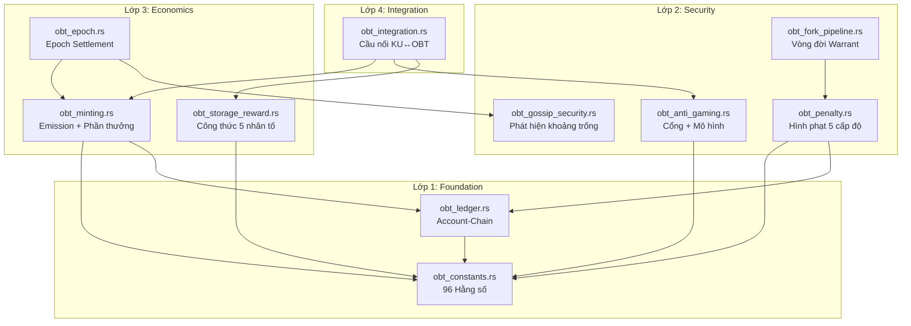
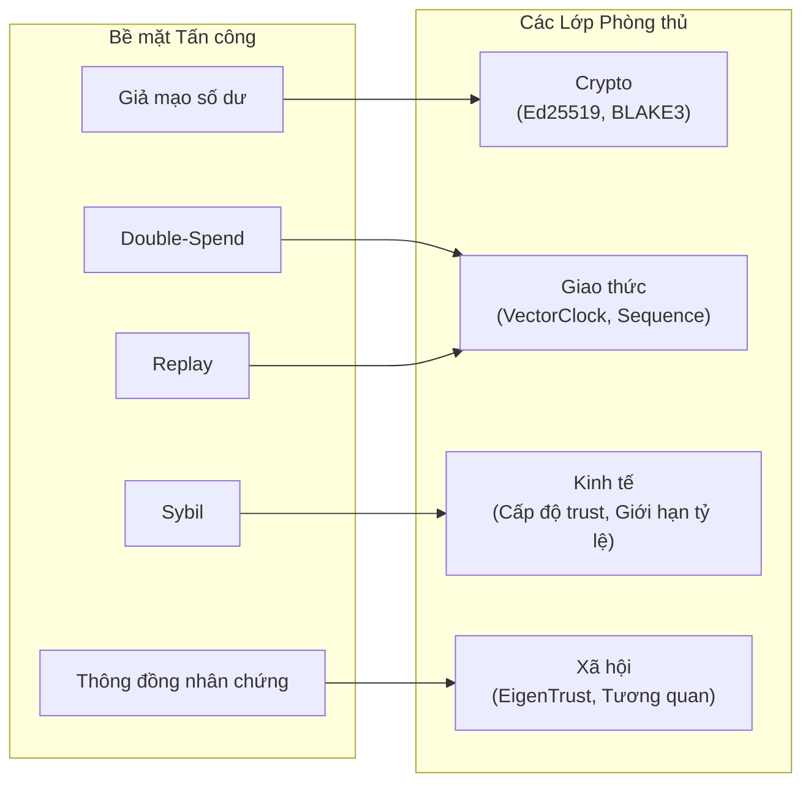

# 9. Evaluation

Phần này đánh giá việc triển khai OBT trên bốn khía cạnh: tính hoàn thiện của triển khai, mức độ bao phủ kiểm thử (test coverage), mô hình hóa mối đe dọa bảo mật, và các đặc tính hiệu năng.

## 9.1 Implementation Overview (Tổng quan về Triển khai)

OBT được triển khai bằng Rust dưới dạng 10 mô-đun trong crate `ku-core`, với sự tích hợp bổ sung ở lớp mạng trong crate `ku-net`. Tổng dung lượng mã nguồn của bản triển khai này đạt khoảng 243 KB với hơn 240 unit tests.

| Mô-đun (Module) | Tệp (File) | Dung lượng (Size) | Số kiểm thử (Tests) | Mô tả (Description) |
|--------|------|:----:|:-----:|-------------|
| Constants | `obt_constants.rs` | 30 KB | 25+ | 96 hằng số quản trị, NodeTier enum, các hàm bổ trợ |
| Ledger | `obt_ledger.rs` | 55 KB | 40+ | TransferBlock, AccountState, xác thực khối (block validation), phát hiện rẽ nhánh (fork detection) |
| Minting | `obt_minting.rs` | 24 KB | 30+ | Công thức emission, 4 luồng phần thưởng, xác thực MintProof |
| Storage Reward | `obt_storage_reward.rs` | 27 KB | 25+ | Công thức 5 nhân tố, các thử thách PoS-KU, hệ thống strike |
| Penalty | `obt_penalty.rs` | 29 KB | 30+ | Hình phạt 5 cấp độ, hệ số nhân tương quan (correlation multiplier), khung kháng nghị |
| Anti-Gaming | `obt_anti_gaming.rs` | 17 KB | 34+ | Giới hạn tỷ lệ (rate limiting), các cổng chất lượng (quality gates), phát hiện mô hình |
| Gossip Security | `obt_gossip_security.rs` | 15 KB | 17+ | GossipGapDetector, ConnectivityProof, EpochSummary |
| Fork Pipeline | `obt_fork_pipeline.rs` | 17 KB | 12+ | Vòng đời ForkWarrant: Detected → Verified → Penalized |
| Epoch | `obt_epoch.rs` | 16 KB | 17+ | EpochAccumulator, thanh toán (settlement), tính toán ranh giới epoch |
| Integration | `obt_integration.rs` | 14 KB | 8+ | Cầu nối KU↔OBT: FormulaInputs, điều phối cổng chất lượng |

**Bảng 35.** Danh mục mô-đun OBT cùng dung lượng và mức độ bao phủ kiểm thử.

**Các mô-đun lớp mạng** (trong `ku-net`):

| Mô-đun (Module) | Tệp (File) | Số kiểm thử (Tests) | Mô tả (Description) |
|--------|------|:-----:|-------------|
| Messages | `messages.rs` | — | 7 biến thể MessageType của OBT (0xA0–0xA6) |
| Transfer | `obt_transfer.rs` | 10+ | Xác thực giao dịch chuyển nhượng, kiểm tra điều kiện |
| Gossip | `obt_gossip.rs` | 10+ | Xác thực ForkWarrant, chuyển tiếp MintBroadcast |
| DHT | `dht.rs` (phần mở rộng) | 6+ | ReplicaTracker cho phần thưởng lưu trữ |
| Membership | `membership.rs` (phần mở rộng) | 4+ | Cầu nối NodeTier, hệ số phạt độ phù hợp (fitness penalty factor) |
| Error | `error.rs` (phần mở rộng) | — | ObtError enum (6 biến thể) |

**Bảng 36.** Các mô-đun lớp mạng của OBT.

**Tổng số lượng kiểm thử trên toàn hệ thống:**

| Crate | Tổng số kiểm thử (Total Tests) | Kiểm thử riêng cho OBT (OBT-Specific) |
|-------|:----------:|:------------:|
| ku-core | 541 | ~240 |
| ku-net | 192 | ~30 |
| **Total** | **733** | **~270** |

**Bảng 37.** Tóm tắt mức độ bao phủ kiểm thử.

## 9.2 Module Architecture (Kiến trúc Mô-đun)

Các mô-đun OBT tạo thành một kiến trúc phân lớp với các quan hệ phụ thuộc rõ ràng:

**Hình 12.** Đồ thị phụ thuộc của các mô-đun OBT được tổ chức theo lớp.

**Các nguyên tắc thiết kế:**
- **Không có phụ thuộc vòng tròn.** Đồ thị phụ thuộc là đồ thị có hướng không chu trình (acyclic).
- **Hằng số làm nền tảng.** Tất cả các con số ma thuật (magic numbers) đều được tập trung trong `obt_constants.rs`.
- **Tích hợp làm mặt tiền (facade).** `obt_integration.rs` là mô-đun duy nhất mà các hệ thống bên ngoài (PoMV, KQL) cần tương tác.

## 9.3 Test Coverage Analysis (Phân tích mức độ Bao phủ Kiểm thử)

### 9.3.1 Unit Test Distribution (Phân bổ Unit Test)

Bộ kiểm thử bao phủ tất cả các phân hệ lớn:

| Phân hệ (Subsystem) | Số kiểm thử (Tests) | Trọng tâm Bao phủ (Coverage Focus) |
|-----------|:-----:|----------------|
| Công thức emission | 14 | Tính chính xác của công thức, các trường hợp biên (0 nút, trần tối đa) |
| Tính toán phần thưởng | 12 | Tính toán luồng phần thưởng R1-R4, các khoản thưởng theo vai trò |
| Xác thực khối | 15 | Tất cả 11 quy tắc xác thực (từ V-SIG đến V-RECV) |
| Phát hiện rẽ nhánh | 8 | Nhận diện rẽ nhánh, tạo lập warrant, giải quyết xung đột (tiebreak) |
| Các cấp độ hình phạt | 12 | Cả 5 cấp độ, leo thang hình phạt, hệ số nhân tương quan |
| Chống trục lợi (Anti-gaming) | 34 | Các giới hạn tỷ lệ, 4 cổng chất lượng, 4 bộ phát hiện mô hình |
| Phần thưởng lưu trữ | 15 | Công thức 5 nhân tố, các loại thử thách, hệ thống strike |
| Bảo mật gossip | 17 | Phát hiện khoảng trống, connectivity proof, các ranh giới epoch |
| Epoch settlement | 12 | Tích lũy, hoàn tất, tính toán ranh giới |
| Tích hợp (Integration) | 8 | Điều phối cổng chất lượng, xây dựng FormulaInputs |
| NodeTier | 14 | Ngưỡng thăng cấp, trọng số cấp độ, các hệ số nhân |
| Constants | 12 | Tính nhất quán giữa các hằng số liên quan |
| Network (ku-net) | 30 | Các loại thông điệp, xác thực giao dịch chuyển nhượng, chuyển tiếp gossip |

**Bảng 38.** Phân bổ unit test theo phân hệ.

### 9.3.2 Property-Based Testing (Kiểm thử Dựa trên Thuộc tính)

Một số invariant (bất biến) quan trọng được kiểm thử qua ranh giới giữa các mô-đun:

1. **Bảo toàn số dư:** Đối với mỗi khối Send block, tổng số dư của người gửi và người nhận không thay đổi.
2. **Trần emission:** Hàm `compute_epoch_emission()` không bao giờ vượt quá $B \times A_{\text{max}} \times Q_{\text{max}}$.
3. **Tính đơn điệu của trust dưới hình phạt:** Việc áp dụng hình phạt không bao giờ làm tăng trust.
4. **Tính đơn điệu của G-Counter:** Giá trị `total_earned` không bao giờ giảm sau bất kỳ hoạt động nào.
5. **Thứ tự cổng:** Quy trình cổng chất lượng tạo ra cùng một kết quả bất kể thứ tự đánh giá các cổng (các cổng hoạt động độc lập).

## 9.4 Security Threat Model (Mô hình Mối đe dọa Bảo mật)

### 9.4.1 Five Attack Vectors (Năm Vector Tấn công)

| # | Vector Tấn công (Attack Vector) | Mối đe dọa (Threat) | Biện pháp Phòng thủ (Defense) | Rủi ro Còn lại (Residual Risk) |
|---|--------------|--------|---------|---------------|
| 1 | **Double-spend** | Tạo hai khối Send block cho cùng một số dư | VectorClock + tính đơn điệu của sequence + phát hiện rẽ nhánh | Tranh chấp first-seen trong cửa sổ <200ms |
| 2 | **Giả mạo số dư (Balance forgery)** | Tạo AccountState giả mạo với số dư được thổi phồng | Tính toàn vẹn của chuỗi TransferBlock + chuỗi băm BLAKE3 | Đòi hỏi phải phá vỡ thuật toán BLAKE3 hoặc Ed25519 |
| 3 | **Tấn công Sybil (Sybil attack)** | Tạo nhiều danh tính để nuôi phần thưởng | Hệ số nhân 0.10× của cấp Leaf + uy tín EigenTrust | Hành vi nuôi trust dài hạn (§7.4.4) |
| 4 | **Tấn công lặp lại (Replay attack)** | Gửi lại các khối đã hợp lệ trước đó | Nonce + VectorClock + tính độc nhất của sequence | Không có (được ngăn chặn hoàn toàn) |
| 5 | **Thông đồng nhân chứng (Witness collusion)** | $K$ nhân chứng thông đồng để phê duyệt các lượt mint không hợp lệ | Lựa chọn nhân chứng xác định bằng BLAKE3 + cơ chế luân chuyển | Đòi hỏi kiểm soát các vị trí DHT liên tiếp $K$ lần |

**Bảng 39.** Năm vector tấn công cùng các biện pháp phòng thủ và rủi ro còn lại.

### 9.4.2 Three Partition Scenarios (Ba Kịch bản Phân tách)

Chúng tôi phân tích ba kịch bản phân tách mạng với mức độ tinh vi tăng dần:

**Kịch bản A: Phân tách Tự nhiên (Đa số Trung thực)**

Một sự phân tách mạng cô lập một nhóm thiểu số các nút trong vài giờ.

- **Tác động:** Các nút bị cô lập chịu sự suy giảm trust ($e^{-0.01t}$). Các token kiếm được trong quá trình cô lập vẫn hợp lệ nhưng có thể xung đột với phân nhánh chính.
- **Giải quyết:** Khi kết nối lại, các VectorClock cho phép tự động sắp xếp thứ tự nhân quả. Các khối xung đột được giải quyết bằng nguyên tắc first-seen + giải quyết xung đột bằng hash.
- **Ảnh hưởng đến OBT:** Tối thiểu. Các nút bị cô lập mất một phần trust, phần trust này sẽ phục hồi thông qua việc tham gia.

**Kịch bản B: Long Con (Kẻ Tấn công Tinh vi)**

Kẻ tấn công xây dựng danh tiếng hợp pháp trong nhiều tháng, sau đó cố gắng thực hiện một khai thác quy mô lớn.

- **Các lớp phòng thủ:**
  1. Các cổng chất lượng (quality gates) ngăn chặn việc mint các KU chất lượng thấp bất kể cấp độ trust là bao nhiêu.
  2. Giới hạn phần thưởng trên mỗi nút kìm hãm lượng thu được trong một epoch ở mức $E / N \times \text{TrustMultiplier}$.
  3. Cơ chế phát hiện mô hình (§7.4.4) giám sát sự phân kỳ giữa trust và chất lượng.
  4. Hình phạt tương quan (correlation penalty) khuếch đại hậu quả nếu phối hợp với những kẻ khác.

- **Phân tích chi phí - lợi ích:** Tại cấp GlobalBackbone (hệ số nhân 2.00×, cần nhiều tháng làm việc thực sự để đạt được), mức lợi ích tối đa trong một epoch đơn lẻ là khoảng $200,000$ milliOBT = 200 OBT. Chi pháp: nhiều tháng xây dựng danh tiếng, mất đi vĩnh viễn nếu bị phát hiện.

**Kịch bản C: Tấn công Cô lập Nhanh**

Kẻ tấn công cô lập nút của mình khỏi mạng lưới, tạo lập các KU, tự xác thực và cố gắng mint phần thưởng.

- **Các lớp phòng thủ:**
  1. GossipGapDetector gắn cờ các sự kiện ngoại tuyến đồng thời (§7.4.1).
  2. ConnectivityProof yêu cầu ít nhất 3 biên lai nhận được từ các nút bên ngoài.
  3. Các bằng chứng mint proof yêu cầu các nhân chứng nằm ngoài tầm kiểm soát của kẻ tấn công.
  4. Sự đồng thuận encoding yêu cầu ≥3 AI verifiers độc lập.

- **Kết quả:** Cuộc tấn công thất bại ở nhiều lớp. Kẻ tấn công không thể tạo ra các ConnectivityProof hợp lệ hoặc chữ ký nhân chứng bên ngoài trong khi bị cô lập.

### 9.4.3 Threat Summary (Tóm tắt Mối đe dọa)

**Hình 13.** Các vector tấn công được bản đồ hóa vào các lớp phòng thủ.

**Tuyên bố bảo mật cốt lõi:** Trong mọi kịch bản được phân tích, *chi phí gian lận luôn vượt quá lợi ích của gian lận*. Điều này đạt được thông qua:
1. **Răn đe kinh tế:** Việc mất trust làm giảm tiềm năng kiếm tiền trong tương lai theo nhiều bậc độ lớn.
2. **Khả năng phát hiện:** Nhiều hệ thống phát hiện chồng chéo (4 bộ phát hiện mô hình, khoảng trống gossip, connectivity proofs).
3. **Leo thang hình phạt:** Hệ số nhân tương quan khiến cho các cuộc tấn công phối hợp trở nên đắt đỏ theo mức siêu tuyến tính.
4. **Tính lâu dài:** Quyết định Tombstone là không thể đảo ngược; ngay cả Tier 3/4 cũng tạo ra những vết sẹo trust lâu dài.

## 9.5 Performance Characteristics (Đặc tính Hiệu năng)

### 9.5.1 Transfer Performance (Hiệu năng Giao dịch Chuyển nhượng)

| Chỉ số (Metric) | Giá trị (Value) | So sánh (Comparison) |
|--------|-------|------------|
| Tính hoàn tất giao dịch (L1) | 50–200 ms | Nano: ~200ms, Ethereum: ~12 phút |
| Tính hoàn tất giao dịch (L2) | 1–3 giây | Filecoin: ~30 giây |
| Tính hoàn tất giao dịch (L3) | 10–30 giây | Bitcoin: ~60 phút |
| Dung lượng truyền tải mỗi khối | 240–320 bytes | Nano: ~216 bytes, Ethereum: ~100+ bytes |
| Thông lượng (Throughput) | Giới hạn bởi băng thông gossip | Không bị giới hạn bởi khối |
| Phí giao dịch | 0 | Nano: 0, Ethereum: thay đổi |

**Bảng 40.** Các đặc tính hiệu năng giao dịch chuyển nhượng.

### 9.5.2 Epoch Settlement (Epoch Settlement)

| Chỉ số (Metric) | Giá trị (Value) |
|--------|-------|
| Tần suất thanh toán | Mỗi 3,600 giây (1 giờ) |
| Độ phức tạp thanh toán | $O(N_{\text{active}} \times K_{\text{stored}})$ |
| Tính toán emission | $O(1)$ |
| Phân phối phần thưởng | $O(N_{\text{active}})$ |
| Tạo thử thách lưu trữ | $O(K_{\text{stored}} / 10)$ (lấy mẫu ~10%) |

**Bảng 41.** Độ phức tạp tính toán của epoch settlement.

### 9.5.3 Wire Protocol (Giao thức Truyền tải)

OBT thêm 7 loại thông điệp vào giao thức mạng (0xA0–0xA6):

| Mã (Code) | Thông điệp (Message) | Kích thước Cố định (Fixed Size) | Mục đích (Purpose) |
|:----:|---------|:----------:|---------|
| 0xA0 | ObtTransferRequest | 168 bytes | Bắt đầu giao dịch chuyển nhượng |
| 0xA1 | ObtTransferConfirm | 135 bytes | Xác nhận giao dịch chuyển nhượng |
| 0xA2 | ObtBalanceQuery | 38 bytes | Truy vấn số dư |
| 0xA3 | ObtBalanceResponse | 86+ bytes | Trả về số dư |
| 0xA4 | ObtMintBroadcast | Biến đổi | Phát sóng mint proof |
| 0xA5 | ObtStorageChallenge | 76 bytes | Phát hành thử thách lưu trữ |
| 0xA6 | ObtForkWarrant | Biến đổi | Phát sóng bằng chứng rẽ nhánh |

**Bảng 42.** Các loại thông điệp giao thức truyền tải OBT.

## 9.6 Comparison with Production Systems (So sánh với các Hệ thống trong Thực tế)

| Khía cạnh (Dimension) | Bitcoin | Ethereum | Filecoin | Nano | **OBT** |
|-----------|:------:|:--------:|:--------:|:----:|:-------:|
| Dung lượng mã nguồn | ~1.2M LOC | ~800K LOC | ~2M LOC | ~200K LOC | **~243 KB** |
| Số lượng kiểm thử | ~3,000 | ~10,000 | ~5,000 | ~1,000 | **~270** |
| Độ chín muồi | 15+ năm | 10+ năm | 5+ năm | 8+ năm | **<1 năm** |
| Quy mục mạng lưới | ~15,000 nút | ~800,000 validators | ~3,000 miners | ~100 nút | **Đang phát triển** |
| Đồng thuận (Consensus) | PoW | PoS | PoRep+PoSt | ORV | **PoMV** |
| TPS | ~7 | ~30 (L1) | ~30 | ~1,000 | **Gia hạn bởi gossip** |

**Bảng 43.** So sánh với các hệ thống token trong thực tế.

**Đánh giá khách quan:** OBT đang ở giai đoạn phát triển ban đầu. Dung lượng mã nguồn và mức độ bao phủ kiểm thử phù hợp cho việc triển khai ở giai đoạn đặc tả nhưng nhỏ hơn nhiều bậc độ lớn so với các hệ thống trong thực tế. Kiến trúc được thiết kế để mở rộng, nhưng chưa được thử nghiệm dưới các điều kiện đối địch ở quy mô mạng lưới.

## 9.7 Implementation Status (Trạng thái Triển khai)

Tính đến phiên bản hiện tại, trạng thái triển khai OBT hoàn thành khoảng **80%**:

| Thành phần (Component) | Trạng thái (Status) | Công việc còn lại (Remaining Work) |
|-----------|:------:|----------------|
| Các hằng số và kiểu dữ liệu | ✅ 100% | — |
| Ledger (TransferBlock, AccountState) | ✅ 100% | — |
| Minting (emission, phần thưởng) | ✅ 100% | — |
| Phần thưởng lưu trữ (5 nhân tố, các thử thách) | ✅ 100% | — |
| Hình phạt (5 cấp độ, tương quan) | ✅ 100% | — |
| Chống trục lợi (cổng chất lượng, mô hình) | ✅ 100% | — |
| Bảo mật gossip | ✅ 100% | — |
| Quy trình rẽ nhánh (fork pipeline) | ✅ 100% | — |
| Epoch settlement | ✅ 100% | — |
| Cầu nối tích hợp (integration bridge) | ✅ 100% | — |
| Theo dõi replica DHT | 🟡 80% | Đấu nối hoàn chỉnh ReplicaTracker wiring |
| Xác thực chữ ký Ed25519 | 🟡 50% | Tích hợp hoàn chỉnh quản lý khóa |
| Điều chỉnh tham số quản trị | 🔴 10% | Sửa đổi hằng số trong thời gian chạy (runtime) |
| Giao dịch chuyển nhượng chéo shard | 🔴 0% | Account-Chain đa phân mảnh (multi-shard) |

**Bảng 44.** Trạng thái hoàn thành triển khai.
