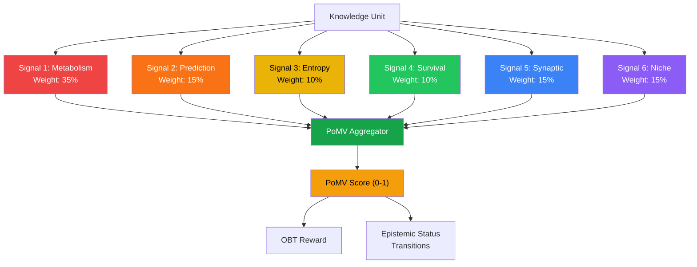
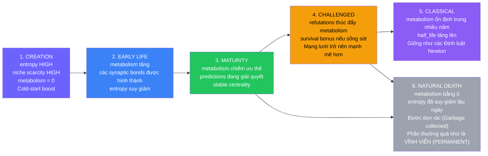

# 3. The Six-Signal PoMV Architecture

Phần này trình bày thiết kế cốt lõi của PoMV: sáu tín hiệu có thể quan sát được (observable signals) cùng nhau xác định giá trị tri thức mà không cần bất kỳ sự bỏ phiếu hay đánh giá của con người (human judgment) nào.

## 3.1 Design Principles

PoMV tuân thủ sáu nguyên lý thiết kế (design principles) bắt nguồn từ các nền tảng triết học (§1.3) và 10 anti-patterns được xác định qua phân tích hệ thống (systems analysis):

| # | Principle | Rationale | Anti-Pattern Avoided |
|---|-----------|-----------|---------------------|
| 1 | **No voting** | Tất cả các tín hiệu từ G-Counters (usage) | Plutocracy (MakerDAO), populism (Reddit) |
| 2 | **No clawback** | G-Counters chỉ tăng dần | Thu hồi token gây tranh cãi (Contentious token revocation) |
| 3 | **No censorship** | Hệ thống miễn dịch phân tích PATTERNS (mô hình), không phân tích CONTENT (nội dung) | Sự thiên lệch của kiểm duyệt tập trung (Centralized moderation bias) |
| 4 | **Fully decentralized** | Mỗi node tự đánh giá độc lập, CRDT merge | Điểm lỗi/kiểm soát duy nhất (Single point of failure/control) |
| 5 | **Experience respected** | Chế độ `NoResolution` cho các Experience/Narrative KUs | Áp đặt tính đúng đắn lên tri thức mang tính chủ quan |
| 6 | **Antifragile** | Sống sót sau tấn công → trust bonus | Các hệ thống chỉ suy thoái khi bị tấn công |

*Table 5: Các nguyên lý thiết kế (design principles) của PoMV.*

## 3.2 Architecture Overview

*Figure 1: Sơ đồ kiến trúc PoMV. Sáu tín hiệu có thể quan sát được tính trọng số và tổng hợp thành một điểm số duy nhất để thúc đẩy cả phần thưởng OBT và các quá trình chuyển trạng thái epistemic status.*

Công thức tổng hợp (aggregation formula):

$$\text{PoMV}(ku, t) = w_1 \cdot M(ku, t) + w_2 \cdot P(ku, t) + w_3 \cdot E(ku, t) + w_4 \cdot S(ku, t) + w_5 \cdot Syn(ku, t) + w_6 \cdot N(ku, t)$$

trong đó các trọng số mặc định là:

| Signal | Symbol | Weight | Justification |
|--------|:------:|:------:|--------------|
| Metabolism | $w_1$ | 0.35 | Chỉ số giá trị chính — việc sử dụng thực tế (real usage) |
| Prediction | $w_2$ | 0.15 | Xác thực thực nghiệm các tuyên bố (Empirical validation of claims) |
| Entropy | $w_3$ | 0.10 | Khuyến khích khởi động nguội (Cold-start incentive), suy giảm trong 7 ngày |
| Survival | $w_4$ | 0.10 | Điểm thưởng tính phản dễ vỡ (Antifragility bonus) |
| Synaptic | $w_5$ | 0.15 | Giá trị vị trí mạng lưới (Network position value) |
| Niche | $w_6$ | 0.15 | Giá trị khan hiếm sinh thái (Ecological scarcity value) |
| **Tổng** | | **1.00** | |

*Table 6: Trọng số tín hiệu mặc định của PoMV cùng với lý do biện giải.*

## 3.3 Signal 1: Metabolism — Knowledge Has a Heartbeat (35%)

### 3.3.1 Biological Analogy

Mỗi tế bào sống đều có một metabolic rate — tốc độ tiêu thụ năng lượng và thực hiện chức năng của nó. Các tế bào có metabolic rates cao là thiết yếu đối với sinh vật; các tế bào có metabolic rates bằng 0 sẽ trải qua apoptosis (chết tế bào theo lập trình). PoMV áp dụng điều này một cách chính xác: mỗi KU có một "nhịp tim" (heartbeat) được đo lường bằng các tín hiệu sử dụng thực tế (real usage signals).

### 3.3.2 Usage Counters (G-Counters)

Mỗi KU theo dõi 8 tín hiệu sử dụng thông qua G-Counter CRDTs:

| Counter | What It Measures | CRDT Type | Why It Matters |
|---------|-----------------|:---------:|---------------|
| `query_hits` | Số lần xuất hiện trong kết quả tìm kiếm | G-Counter | Khả năng khám phá (Discoverability) |
| `retrieval_count` | Số lần được đọc/tải xuống đầy đủ | G-Counter | Mức độ quan tâm tích cực (Active interest) |
| `dwell_time_ms` | Tổng thời gian đọc (tính bằng mili giây) | G-Counter | Chiều sâu tương tác (Engagement depth) |
| `citation_count` | Trích dẫn đi vào (inbound citations) từ các KUs khác | G-Counter | Ảnh hưởng theo kiểu học thuật |
| `derivative_count` | Các KUs được truyền cảm hứng từ KU này | G-Counter | Giá trị tạo mới (Generative value) |
| `refutation_count` | Các KUs bác bỏ/thách thức KU này | G-Counter | **Tầm quan trọng** (không phải là "sự sai trái") |
| `corroboration_count` | Các xác nhận rõ ràng | G-Counter | Sự xác thực của cộng đồng (Community validation) |
| `downstream_usage` | Việc sử dụng các KUs trích dẫn KU này | G-Counter | Giá trị bắc cầu (Transitive value) |

> **Lựa chọn thiết kế quan trọng: Refutation được tính là metabolism TÍCH CỰC (POSITIVE).** Một KU bị bác bỏ (refuted) là một KU đủ quan trọng để tranh luận. Một KU bị mọi người ngó lơ mới thực sự "chết". Điều này ngăn chặn xu hướng tiêu cực tránh các chủ đề gây tranh cãi.

### 3.3.3 Metabolic Rate Formula

Tỷ lệ chuyển hóa (metabolic rate) kết hợp tất cả các counters với temporal decay (suy giảm theo thời gian):

$$\text{metabolic\_rate}(ku, t) = \text{raw}(ku) \times e^{-\frac{\ln 2 \times \text{age}(ku)}{\text{half\_life}}}$$

trong đó tỷ lệ thô (raw rate) là:

$$\text{raw}(ku) = \alpha_1 \frac{\text{query\_hits}}{\sqrt{\text{diversity}}} + \alpha_2 \cdot \text{retrievals} \times \overline{\text{dwell}} + \alpha_3 \cdot \text{citations} + \alpha_4 \cdot \text{derivatives} + \alpha_5 \cdot \text{downstream}$$

| Parameter | Value | Purpose |
|-----------|:-----:|---------|
| $\alpha_1$ | 0.25 | Tốc độ truy vấn (được chuẩn hóa bởi sự đa dạng của node) |
| $\alpha_2$ | 0.20 | Độ sâu truy xuất (được tính trọng số theo average dwell time) |
| $\alpha_3$ | 0.25 | Độ tươi mới của trích dẫn (Citation freshness) |
| $\alpha_4$ | 0.15 | Tính mới của phái sinh (Derivative novelty) |
| $\alpha_5$ | 0.15 | Dòng thác hạ nguồn (Downstream cascade) |
| half_life | 30 ngày | Suy giảm theo thời gian mặc định (Default temporal decay) |
| alive threshold | 0.001 | Dưới ngưỡng này → được coi là "chết" |

**Việc chia cho $\sqrt{\text{diversity}}$** đối với query_hits ngăn chặn việc một node đơn lẻ thổi phồng số lượng truy vấn — tín hiệu phải đến từ các nguồn đa dạng.

### 3.3.4 Normalization

Tỷ lệ chuyển hóa thô (không giới hạn) được chuẩn hóa về khoảng [0, 10000] thông qua sigmoid:

$$\text{rate\_u16}(ku) = \left\lfloor 10000 \times (1 - e^{-\text{rate}/10}) \right\rfloor$$

Công thức này tạo ra:
- rate = 0 → 0
- rate = 1 → 952
- rate = 10 → 6321
- rate = 50 → 9933

### 3.3.5 Decentralization

Mỗi node tự đếm việc sử dụng của mình một cách độc lập thông qua G-Counters. Việc CRDT merge là chọn giá trị `max` cho mỗi node, và `sum` giữa các node:

$$\text{global\_count} = \sum_{i \in \text{nodes}} \text{max}(\text{local\_count}_i, \text{remote\_count}_i)$$

Phép toán này có tính lũy đẳng (idempotent), giao hoán (commutative), và tăng đơn điệu (monotonically increasing) — đảm bảo tính hội tụ cuối cùng mà không cần điều phối.

## 3.4 Signal 2: Prediction — Knowledge Predicts the Future (15%)

### 3.4.1 Concept

Mỗi tuyên bố tri thức đều ngầm dự đoán điều gì đó về tương lai:

| KU Type | Implicit Prediction | Resolution Method |
|-----------|-------------------|-------------------|
| **Fact** | "Điều này sẽ vẫn đúng vào ngày mai" | `TemporalConsistency` — tính nhất quán theo thời gian |
| **Procedure** | "Làm theo các bước này sẽ thành công" | `UsageOutcome` — người dùng báo cáo thành công/thất bại |
| **Hypothesis** | "Cơ chế này tồn tại" | `CrossReference` — được xác nhận bởi các KUs mới |
| **Experience** | "Những người khác sẽ chia sẻ cảm xúc này" | `NoResolution` — mang tính chủ quan, không có kiểm thử khách quan |

### 3.4.2 Resolution Methods

**TemporalConsistency:** Điểm prediction của một Fact tăng lên sau mỗi khoảng thời gian nó không bị thách thức. Sau 1 năm không bị refutation, mức độ tin cậy đạt mức cao.

**UsageOutcome:** Người dùng làm theo một Procedure KU sẽ báo cáo xem nó có hoạt động hiệu quả không. Nhiều báo cáo xác nhận sẽ làm tăng điểm prediction.

**CrossReference:** Một Hypothesis nhận được điểm prediction khi các KUs mới trích dẫn nó dưới dạng đã xác nhận. Nó mất điểm khi các KUs mới trích dẫn nó dưới dạng bị bác bỏ.

**NoResolution:** Các Experience và Narrative KUs KHÔNG có dự đoán khách quan nào để giải quyết. Giá trị của chúng đến thuần túy từ Metabolism (có bao nhiêu người thấy chúng thú vị). Điều này tôn trọng nguyên lý triết học rằng trải nghiệm chủ quan không thể là "đúng" hay "sai".

### 3.4.3 Prediction Score

$$\text{prediction\_score} = \frac{\sum_{r \in \text{resolutions}} \text{outcome}(r) \times \sqrt{|\text{resolvers}(r)|}}{\sum_{r \in \text{resolutions}} \sqrt{|\text{resolvers}(r)|}}$$

trong đó $\text{outcome}(r)$ = 1.0 (Confirmed), 0.0 (Refuted), $c/10000$ (Partial với độ tin cậy $c$). Các resolutions không có kết quả rõ ràng (inconclusive) sẽ bị loại trừ.

Trọng số $\sqrt{\text{resolvers}}$ đảm bảo rằng các resolutions được chứng thực tốt (nhiều resolvers độc lập) sẽ mang lại nhiều trọng số hơn so với các resolutions từ một resolver duy nhất, mà không để cho một nhóm resolver khổng lồ duy nhất chiếm lĩnh.

**Không có dự đoán khả giải (No resolvable predictions) → điểm trung tính (0.5)**. Các Experience KUs sử dụng `NoResolution` mặc định nhận giá trị 0.5, không bị phạt cũng như không được thưởng về độ chính xác dự đoán.

## 3.5 Signal 3: Entropy — Novelty Is Valuable (10%)

### 3.5.1 Concept

Trong lý thuyết thông tin (information theory), entropy đo lường mức độ bất ngờ [1]. PoMV áp dụng điều này: KU đầu tiên về một chủ đề mới là bất ngờ nhất (entropy cao = phần thưởng cao). KU thứ 1.001 lặp lại thông tin đã biết là không bất ngờ (entropy thấp = phần thưởng thấp).

### 3.5.2 Measurement

Entropy được tính toán tại thời điểm tạo lập KU bằng cách sử dụng:

1. **Novelty** (trọng số 60%): Khoảng cách cosin trung bình (average cosine distance) giữa int8 embedding của KU mới và các embeddings của K lân cận gần nhất (K nearest neighbors' embeddings) của nó:

$$\text{novelty} = \frac{1}{K} \sum_{i=1}^{K} \text{cosine\_distance}(\vec{e}_{\text{new}}, \vec{e}_i)$$

trong đó cosine distance trên int8 embeddings là:

$$\text{cosine\_distance}(\vec{a}, \vec{b}) = \frac{1 - \cos(\vec{a}, \vec{b})}{2} \in [0, 1]$$

2. **Bridge** (trọng số 40%): Tần suất nghịch đảo của bucket LSH (Locality-Sensitive Hashing) của KU:

$$\text{bridge} = \frac{1}{1 + \text{bucket\_count}}$$

Một KU nằm trong một bucket LSH được chia sẻ bởi nhiều KU khác là điều không bất ngờ; một KU nằm trong một bucket hiếm hoặc mới là mới lạ (novel).

3. **Phát hiện trùng lặp gần đúng (Near-duplicate detection)** qua SimHash: Nếu Hamming distance giữa hai fingerprint SimHash 128-bit nhỏ hơn 10 bits (~92% tương đồng), KU mới sẽ bị gắn cờ là trùng lặp gần đúng và nhận điểm thưởng entropy bằng 0.

### 3.5.3 Temporal Decay

Entropy là một công cụ **hỗ trợ khởi động nguội (cold-start boost)** suy giảm lũy thừa theo thời gian trong vòng 7 ngày:

$$\text{entropy}(ku, t) = (0.6 \times \text{novelty} + 0.4 \times \text{bridge}) \times e^{-\frac{\ln 2 \times \text{age}(ku)}{604800}}$$

Sau 7 ngày, đóng góp của entropy giảm đi một nửa. Sau 21 ngày, giá trị này nhỏ hơn 12.5% giá trị ban đầu. Điều này đảm bảo rằng chỉ riêng tính mới lạ (novelty) không thể duy trì một KU — **hoạt động metabolism thực tế phải tiếp quản trong tuần đầu tiên**.

Điều này giải quyết mối lo ngại về việc gian lận entropy (entropy gaming): việc gửi nội dung kỳ dị, không liên quan mang lại sự gia tăng entropy ban đầu cao, nhưng nếu không ai sử dụng nó trong vòng 7 ngày, entropy sẽ giảm dần về gần 0 và điểm PoMV của KU đó sẽ sụp đổ.

## 3.6 Signal 4: Survival — What Doesn't Kill It Makes It Stronger (10%)

### 3.6.1 Antifragility Principle

Nassim Taleb [2] định nghĩa tính phản dễ vỡ (antifragility) là "những thứ hưởng lợi từ sự hỗn loạn." PoMV triển khai trực tiếp điều này: tri thức sống sót sau các adversarial attacks sẽ nhận được điểm thưởng **survival bonus**.

### 3.6.2 Measurement

$$\text{survival\_score}(ku) = \min\left(\text{attacks\_survived}(ku) \times 0.1,\ 1.0\right)$$

- Một KU với 0 lần sống sót sau tấn công → điểm thưởng bằng 0 (trung tính, không bị phạt).
- Một KU với 5 lần sống sót sau tấn công → điểm thưởng bằng 0.5.
- Một KU với hơn 10 lần sống sót sau tấn công → điểm thưởng bằng 1.0 (thưởng tối đa).
- Một KU đã "chết" (zero metabolism) nhận giá trị bằng 0 bất kể số lần sống sót sau tấn công.

Điều này tạo ra một **vòng tuần hoàn tích cực (virtuous cycle)**: tấn công tri thức hợp pháp thực chất lại làm *tăng* giá trị của nó, làm nản lòng những hành vi tấn công.

### 3.6.3 Attack Detection

Immune Engine (§5) phát hiện các cuộc tấn công thông qua phân tích mô hình content-agnostic. Khi một cuộc tấn công được phát hiện và KU mục tiêu sống sót (duy trì metabolism tích cực), bộ đếm survival sẽ tăng lên.

## 3.7 Signal 5: Synaptic — Knowledge That Connects (15%)

### 3.7.1 Hebb's Rule for Knowledge

Nguyên lý thần kinh của Donald Hebb [3]: *"Các neuron cùng kích hoạt sẽ kết nối với nhau."* PoMV áp dụng nguyên lý này cho tri thức:

- Người dùng đọc KU_A rồi đọc KU_B → liên kết A→B được củng cố (co-retrieval).
- KU_C trích dẫn cả KU_A và KU_B → liên kết A↔B được củng cố (co-citation).
- Các liên kết không ai đi qua → yếu đi và cuối cùng biến mất (cắt tỉa khớp thần kinh - synaptic pruning).

### 3.7.2 Bond Mechanics

| Parameter | Value | Purpose |
|-----------|:-----:|---------|
| Cường độ co-retrieval ban đầu | 0.10 | Liên kết khởi đầu yếu |
| Cường độ co-citation ban đầu | 0.15 | Mạnh hơn một chút (tham chiếu có chủ đích) |
| Cường độ mối quan hệ rõ ràng | 0.50 | Các mối quan hệ do tác giả khai báo |
| Mức tăng củng cố | 0.05 | Cho mỗi sự kiện co-retrieval/co-citation |
| Cường độ liên kết tối đa | 1.00 | Giới hạn cứng |
| Cường độ liên kết tối thiểu | 0.001 | Dưới mức này → liên kết bị xóa bỏ |
| Tỷ lệ bay hơi (Evaporation rate) | 0.95/ngày | Suy giảm hàng ngày |
| Số liên kết tối đa trên mỗi KU | 100 | Giới hạn bộ nhớ |

### 3.7.3 Centrality Scoring (PageRank)

Tín hiệu synaptic sử dụng một power iteration lấy cảm hứng từ PageRank để tính toán độ trung tâm tri thức (knowledge centrality):

$$\text{score}(ku)^{(k+1)} = \frac{1-d}{N} + d \sum_{j \rightarrow ku} \frac{\text{score}(j)^{(k)} \times \text{bond\_strength}(j, ku)}{\text{total\_strength}(j)}$$

trong đó $d = 0.85$ (damping factor) và $N$ = tổng số lượng KU. Sau 10 vòng lặp, điểm số được chuẩn hóa về khoảng [0, 1].

**Các lộ trình học tập tự xuất hiện (Emergent learning paths):** Không cần thiết kế rõ ràng, các mô hình co-retrieval tạo ra các "xa lộ tri thức" (knowledge highways) — chuỗi các KUs mà người dùng tự động theo dõi. Các lộ trình tự xuất hiện này có giá trị hơn bất kỳ chương trình giảng dạy nào do con người biên soạn vì chúng phản ánh hành vi học tập thực tế.

## 3.8 Signal 6: Niche — Ecological Fitness (15%)

### 3.8.1 Ecological Analogy

Trong sinh thái học, mỗi loài chiếm một **niche** — một vai trò chức năng trong hệ sinh thái [4]. Một niche chỉ có thể hỗ trợ một lượng quần thể giới hạn (carrying capacity). PoMV áp dụng điều này cho tri thức:

| Sinh thái học | Ánh xạ PoMV |
|-------------------|-------------|
| Carrying capacity | Số lượng KU tối đa về một chủ đề cụ thể trước khi giá trị đạt bão hòa |
| Population density | Số lượng KUs hiện có trong niche |
| Loài xâm lấn (Invasive species) | Nội dung spam/trùng lặp tràn ngập một niche |
| Cân bằng săn mồi - con mồi | Các refutations hoạt động như "vật săn mồi" để duy trì sức khỏe hệ sinh thái |
| Cộng sinh (Symbiosis) | Các KUs có lợi ích co-retrieval lẫn nhau |

### 3.8.2 Niche Fitness Formula

$$\text{niche\_fitness}(ku) = 0.25 \cdot \text{density} + 0.30 \cdot \text{uniqueness} + 0.20 \cdot \text{bridge} + 0.25 \cdot \text{metabolic\_share}$$

trong đó:

$$\text{density\_score} = \frac{1}{1 + \overline{\text{population}}/10}$$

$$\text{bridge\_score} = \frac{\ln(\text{total\_niches})}{\ln(10)}$$

$$\text{metabolic\_share} = \min\left(\frac{\text{own\_rate}}{\overline{\text{niche\_rate}}},\ 1.0\right)$$

- **Density** trao thưởng cho các KUs trong các niches thưa thớt (KU đầu tiên về một chủ đề mới = điểm cao) và phạt các niches đông đúc.
- **Uniqueness** là tính mới của KU trong niche của nó (từ tính toán entropy).
- **Bridge** trao thưởng cho các KUs bắc cầu qua nhiều niches (các kết nối đa lĩnh vực - cross-domain connections).
- **Metabolic share** trao thưởng cho các KUs chiếm ưu thế về mặt chuyển hóa (metabolically dominant) trong niche của chúng.

## 3.9 The KU Lifecycle in PoMV

*Figure 2: Vòng đời tri thức trong PoMV. Mỗi giai đoạn có một tín hiệu chiếm ưu thế.*

| Giai đoạn | Thời gian | Tín hiệu chiếm ưu thế | Ví dụ |
|-------|----------|-----------------|---------|
| Creation | Ngày 0 | Entropy (HIGH), Niche (HIGH), Metabolism (0) | "KU đầu tiên về sửa lỗi máy tính lượng tử" |
| Early Life | Ngày 1–30 | Entropy (suy giảm), Metabolism (tăng) | Người dùng khám phá và đọc KU |
| Maturity | Tháng 1–12 | Metabolism (chiếm ưu thế), Prediction (đang giải quyết) | Được trích dẫn rộng rãi, các dự đoán được xác thực |
| Challenged | Thay đổi | Survival (tăng), Metabolism (được thúc đẩy bởi tranh luận) | KU đối thủ bác bỏ một tuyên bố |
| Classical | Nhiều năm | Metabolism (ổn định), Synaptic (độ trung tâm cao) | Các định luật Newton — luôn luôn được trích dẫn |
| Natural Death | — | Tất cả tín hiệu ≈ 0 | Tài liệu công nghệ lỗi thời không ai đọc |

*Table 7: Các giai đoạn vòng đời KU với tín hiệu chiếm ưu thế và ví dụ.*

---

## References

[1] C. E. Shannon, "A Mathematical Theory of Communication," *Bell System Technical Journal*, vol. 27, pp. 379–423, 1948.

[2] N. N. Taleb, *Antifragile: Things That Gain from Disorder*. Random House, 2012.

[3] D. O. Hebb, *The Organization of Behavior: A Neuropsychological Theory*. Wiley, 1949.

[4] G. E. Hutchinson, "Concluding Remarks," *Cold Spring Harbor Symposia on Quantitative Biology*, vol. 22, pp. 415–427, 1957.
