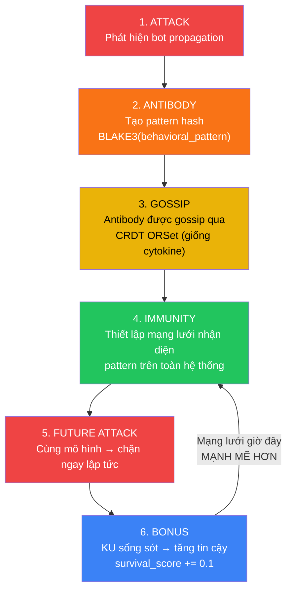
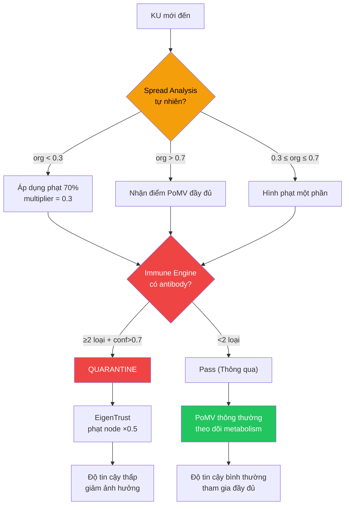

# 5. Adversarial Defense: Content-Agnostic Security

Phần này trình bày hệ thống phòng thủ phân lớp của PoMV — bốn loại content-agnostic antibodies, phân tích lan truyền tự nhiên (organic spread analysis), EigenTrust node reputation, và bộ nhớ miễn dịch phản dễ vỡ (antifragile immune memory) — tất cả được thiết kế để chống lại sự thao túng **mà không cần đánh giá nội dung**.

## 5.1 Threat Model

### 5.1.1 Adversary Capabilities

| Capability | Description | Cost |
|-----------|-------------|------|
| **Sybil nodes** | Tạo nhiều danh tính giả | Trung bình (S/Kademlia puzzle) |
| **Automated queries** | Thổi phồng bộ đếm `query_hits` | Thấp (API calls) |
| **Bot retrievals** | Thổi phồng `retrieval_count` | Thấp (tải xuống tự động) |
| **Cross-citation rings** | Các KUs trích dẫn chéo lẫn nhau một cách nhân tạo | Trung bình (yêu cầu tạo nội dung) |
| **Flash attacks** | Sự bùng nổ hoạt động lớn trong thời gian ngắn | Thấp-trung bình |
| **Targeted deprecation** | Tấn công có tổ chức vào một KU cụ thể | Trung bình-cao |

### 5.1.2 What PoMV Does NOT Defend Against

PoMV tuyên bố rõ ràng không cố gắng xác định xem nội dung tri thức là "đúng" hay "sai". Đây là một thiết kế có chủ đích — đánh giá nội dung là một điều không khả thi về mặt triết học (ai là người quyết định sự thật?) và là một véc-tơ dẫn tới sự tập trung hóa. Thay vào đó, PoMV phòng thủ chống lại **thao túng hành vi (behavioral manipulation)** — các nỗ lực thổi phồng các tín hiệu sử dụng một cách nhân tạo.

## 5.2 Layer 1: Immune Engine — Content-Agnostic Antibodies

Immune Engine ([immune.rs](file:///c:/Users/shpy2/Documents/OneBrain/src/ku-core/src/immune.rs), 440 LOC, 11 tests) phát hiện thao túng thông qua 4 loại antibodies phân tích **các mô hình hành vi (behavior patterns)**, chứ không bao giờ phân tích **nội dung (content)**.

### 5.2.1 Antibody Type 1: Temporal Burst

**Phát hiện:** Tỷ lệ sao chép (replication rate) vượt quá 50/giờ.

$$\text{fires if: } \text{replications\_last\_hour} > 50$$

$$\text{confidence} = 1 - \frac{1}{\text{replications\_last\_hour} / 50}$$

**Lý do biện giải:** Sự lan truyền tri thức tự nhiên (organic knowledge spread) tuân theo một đường cong khuếch tán — tăng dần, đạt đỉnh, giảm dần. Sự bùng nổ của 50+ lượt sao chép trong một giờ duy nhất là bất thường về mặt thống kê. Nội dung lan truyền nhanh (viral) hợp pháp cũng có thể bùng nổ, nhưng hiếm khi vượt quá tốc độ này nếu không có bot khuếch đại.

### 5.2.2 Antibody Type 2: Source Concentration

**Phát hiện:** Hơn 80% lượt sao chép bắt nguồn từ một nguồn duy nhất.

$$\text{fires if: } \text{total\_replications} > 5 \text{ AND } \frac{\text{max\_source\_replications}}{\text{total\_replications}} > 0.80$$

$$\text{confidence} = \frac{\text{excess\_fraction}}{1 - 0.80}$$

**Lý do biện giải:** Sự lan truyền tri thức hợp pháp đến từ các nguồn đa dạng. Khi một node duy nhất chiếm hơn 80% tổng số lượt sao chép, điều đó gợi ý sự lan truyền tự động từ một tác nhân duy nhất.

### 5.2.3 Antibody Type 3: Low Engagement

**Phát hiện:** Số lượng sao chép cao nhưng thực tế gần như bằng không có sử dụng thực.

$$\text{fires if: } \text{total\_replications} \geq 10 \text{ AND } \frac{\text{total\_usage\_events}}{\text{total\_replications}} < 0.05$$

$$\text{confidence} = 1 - \frac{\text{usage\_ratio}}{0.05}$$

**Lý do biện giải:** Tri thức được sao chép nhưng không bao giờ thực sự được sử dụng (truy vấn, truy xuất, trích dẫn) cho thấy mô hình đặc trưng của sự lan truyền bằng bot. Tri thức tự nhiên khi lan truyền thì cũng đồng thời được tiêu thụ.

### 5.2.4 Antibody Type 4: Diversity Deficit

**Phát hiện:** Nhiều lượt sao chép từ rất ít nguồn duy nhất.

$$\text{fires if: } \text{total\_replications} \geq 5 \text{ AND } \frac{\text{unique\_sources}}{\text{total\_replications}} < 0.10$$

$$\text{confidence} = 1 - \frac{\text{diversity\_ratio}}{0.10}$$

**Lý do biện giải:** Ngay cả khi không có nguồn đơn lẻ nào chiếm ưu thế (tránh được Antibody 2), một tỷ lệ đa dạng rất thấp (ví dụ: 3 nguồn tạo ra 100 lượt sao chép) cho thấy một nhóm phối hợp nhỏ.

### 5.2.5 Antibody Data Structure

Mỗi antibody lưu trữ:
- `pattern_hash: [u8; 32]` — Mã hash BLAKE3 của mô hình hành vi (behavioral PATTERN) (không phải nội dung).
- `antibody_type: AntibodyType` — Một trong 4 loại.
- `confidence: f32` — Độ tin cậy phát hiện [0, 1].
- `detected_at: u64` — Nhãn thời gian.
- `confirmation_count: u32` — Số lượng node độc lập cùng phát hiện điều này.

> **Quyền riêng tư (Privacy):** Các antibodies CHỈ chứa các pattern hashes — không bao giờ chứa NodeIDs, nội dung, hoặc thông tin nhận dạng cá nhân. Việc biết một pattern hash KHÔNG làm lộ ai là người đã tấn công hoặc nội dung nào có liên quan.

### 5.2.6 Quarantine Decision

Quarantine yêu cầu **bằng chứng hội tụ (convergent evidence)** — một loại antibody đơn lẻ là không đủ:

$$\text{quarantine}(ku) = \begin{cases} \text{true} & \text{if } |\{\text{distinct antibody types}\}| \geq 2 \text{ AND } \overline{\text{confidence}} > 0.7 \\ \text{false} & \text{otherwise} \end{cases}$$

Điều này làm giảm các kết quả dương tính giả (false positives): nội dung viral hợp pháp có thể tự kích hoạt Temporal Burst, nhưng nó sẽ không kích hoạt thêm Low Engagement (vì nội dung viral thực chất có người tiêu thụ).

## 5.3 Layer 2: Organic Spread Analysis

Spread Analyzer ([spread_analysis.rs](file:///c:/Users/shpy2/Documents/OneBrain/src/ku-core/src/spread_analysis.rs), 354 LOC, 11 tests) tính toán một **organicity score** — mức độ "tự nhiên" trong mô hình lan truyền của một KU.

### 5.3.1 Four Analysis Dimensions

$$\text{organicity} = 0.30 \times \text{temporal} + 0.30 \times \text{diversity} + 0.20 \times \text{geographic} + 0.20 \times \text{engagement}$$

**Chiều 1: Temporal Pattern (30%)**

Sử dụng Hệ số Biến thiên (Coefficient of Variation - CV) của các inter-event intervals:

$$CV = \frac{\sigma_{\text{intervals}}}{\mu_{\text{intervals}}}$$

| CV Range | Interpretation | Score |
|:--------:|---------------|:-----:|
| < 0.3 | **Bot-like**: Khoảng thời gian đều đặn (ví dụ: chính xác mỗi 60 giây) | Thấp (0.0–0.5) |
| 0.3–1.5 | **Organic**: Khoảng thời gian không đều đặn giống con người | Cao (0.5–1.0) |
| > 1.5 | **Erratic**: Có thể là mô hình bùng nổ rồi im lặng | Trung bình (0.3–0.7) |

*Table 9: Diễn giải temporal pattern. Bots tạo ra các khoảng thời gian inter-event intervals đều đặn một cách đáng ngờ.*

**Chiều 2: Source Diversity (30%)**

$$\text{diversity\_score} = \begin{cases} \text{penalty} & \text{if ratio} < 0.1 \\ \text{linear}(0.1, 0.7) & \text{if } 0.1 \leq \text{ratio} \leq 0.7 \\ 1.0 & \text{if ratio} > 0.7 \end{cases}$$

trong đó $\text{ratio} = \text{unique\_sources} / \text{total\_replications}$.

**Chiều 3: Geographic Distribution (20%)**

$$\text{geographic} = 0.6 \times \frac{\text{communities\_reached}}{\text{total\_replications}} + 0.4 \times \min\left(\frac{\overline{\text{hop\_distance}}}{5},\ 1.0\right)$$

Nội dung tự nhiên (organic content) tiếp cận nhiều cộng đồng thông qua lan truyền multi-hop. Nội dung bot có xu hướng bắt nguồn từ một cộng đồng duy nhất (hoặc một cụm các Sybil nodes).

**Chiều 4: Engagement Authenticity (20%)**

$$\text{engagement} = 0.6 \times \text{dwell\_score} + 0.4 \times \text{action\_score}$$

| Avg Dwell Time | Score | Interpretation |
|:--------------:|:-----:|----------------|
| < 1 giây | 0.0 | Bot (không đọc) |
| 1–5 giây | Tuyến tính | Quét nhanh |
| 5–60 giây | Tuyến tính | Đọc thực sự |
| > 60 giây | 1.0 | Tương tác sâu |

### 5.3.2 Organicity Multiplier

Điểm organicity score điều phối các đóng góp PoMV của KU:

$$\text{multiplier}(\text{org}) = 0.3 + 0.7 \times \text{org}^2$$

Điều này tạo ra một sự suy giảm mượt mà:
- organicity = 1.0 (hoàn toàn tự nhiên) → multiplier = 1.0 (không bị phạt).
- organicity = 0.5 (hỗn hợp) → multiplier = 0.475 (phạt 53%).
- organicity = 0.0 (bot thuần túy) → multiplier = 0.3 (phạt 70%).

Hệ số nhân tối thiểu là 0.3 (không phải 0.0) để tránh việc triệt tiêu hoàn toàn các KUs có thể đã được chia sẻ một cách vô ý qua các kênh bất thường.

## 5.4 Layer 3: Antifragile Immune Memory

### 5.4.1 Immune Memory Cycle

Hệ thống miễn dịch triển khai một phản hồi phản dễ vỡ (antifragile feedback loop) lấy cảm hứng từ miễn dịch thích ứng sinh học (biological adaptive immunity):

*Figure 4: Vòng tuần hoàn bộ nhớ miễn dịch phản dễ vỡ (antifragile immune memory cycle). Mỗi cuộc tấn công tạo ra một antibody giúp mạng lưới mạnh mẽ hơn trước các cuộc tấn công tương tự trong tương lai.*

### 5.4.2 Biological Mapping

| Sinh học | Thành phần PoMV | Bản triển khai |
|---------------------|---------------|----------------|
| Tế bào bạch cầu | Các node mạng | Mỗi node chạy Immune Engine |
| Cytokines (tín hiệu báo động) | CRDT gossip | ORSet lan truyền antibody |
| Kháng thể (Antibodies) | Mã hash của mô hình tấn công | Mã hash BLAKE3 của mô hình hành vi |
| Bộ nhớ miễn dịch (tế bào B) | Lưu trữ trong VacuumFilter | Lưu trữ antibody bền vững |
| Ngưỡng xác nhận | 3 phát hiện độc lập | Sự hội tụ của nhiều nodes |

### 5.4.3 Why Content-Agnostic?

**PoMV không bao giờ kiểm tra những gì tri thức nói — mà chỉ kiểm tra cách nó lan truyền.** Điều này là thiết yếu vì:

1. **Tự do biểu đạt (Freedom of expression):** Kiểm duyệt nội dung chắc chắn phản ánh sự thiên lệch của người kiểm duyệt. PoMV không thể kiểm duyệt vì nó hoàn toàn không đọc nội dung.

2. **Scalability:** Phân tích nội dung đòi hỏi sự hiểu biết về ngôn ngữ tự nhiên — đắt đỏ và dễ mắc lỗi. Phân tích hành vi sử dụng các mô hình số đơn giản.

3. **Chống lại việc gắn nhãn oan (Resistance to framing):** Kẻ tấn công cố tình gắn nhãn nội dung hợp pháp là "misinformation" không thể kích hoạt hệ thống phòng thủ của PoMV vì hệ thống này không kiểm tra nội dung.

4. **Trung lập về văn hóa (Cultural neutrality):** Những gì là "misinformation" trong nền văn hóa này có thể là tri thức được chấp nhận ở nền văn hóa khác. Các mô hình hành vi (lan truyền bằng bot, tập trung nguồn) là phổ quát.

## 5.5 Layer 4: EigenTrust Node Reputation

Module EigenTrust ([eigentrust.rs](file:///c:/Users/shpy2/Documents/OneBrain/src/ku-core/src/eigentrust.rs), 320 LOC, 8 tests) tính toán **danh tiếng cấp độ node (node-level reputation)** bằng thuật toán EigenTrust [1] với ba phần mở rộng.

### 5.5.1 Local Trust Computation

Độ tin cậy cục bộ (local trust) của mỗi node được tính toán từ hiệu suất PoMV của nó:

$$\text{local\_trust}(i) = \text{avg\_pomv}(i) \times (1 - \text{quarantine\_ratio}(i) \times 0.5) + \frac{\sqrt{\text{niche\_diversity}(i)}}{10}$$

| Thành phần | Tác động | Mục đích |
|-----------|--------|---------|
| `avg_pomv` | Base trust từ KU quality | Trao thưởng cho những người đóng góp tốt |
| Quarantine penalty | $\times(1 - q \times 0.5)$ | Phạt các node có KUs bị đưa vào khu vực cách ly (quarantined) |
| Diversity bonus | $+\sqrt{d}/10$ | Trao thưởng cho các đóng góp rộng rãi, thay vì hẹp |
| Node mới mặc định | 0.01 (PRE_TRUST) | Khởi động nguội với độ tin cậy thấp nhưng khác 0 |
| Giới hạn dưới (Floor) | MIN_TRUST = 0.001 | Không bao giờ bằng 0 (cho phép phục hồi sau này) |

### 5.5.2 Global Trust (Power Iteration)

Độ tin cậy toàn cục (global trust) được tính toán thông qua nhân ma trận lặp (iterative matrix multiplication):

$$t_i^{(k+1)} = 0.85 \sum_j c_{ij} \cdot t_j^{(k)} + 0.15 \cdot p_i$$

trong đó:
- $c_{ij}$ = local trust đã được chuẩn hóa từ $j$ được quan sát bởi $i$.
- $d = 0.85$ = hệ số giảm chấn (damping factor).
- $p_i$ = pre-trust vector (đồng đều).
- Số vòng lặp (Iterations): 10 (đủ để hội tụ theo thực nghiệm).

Sau khi lặp, các điểm số được chuẩn hóa sao cho tổng bằng 1.0.

### 5.5.3 Extensions to Standard EigenTrust

**Mở rộng 1: Per-domain trust.** EigenTrust tiêu chuẩn tính toán một điểm số tin cậy toàn cục duy nhất. PoMV mở rộng điều này với độ tin cậy theo từng niche cụ thể — một node được tin cậy trong lĩnh vực vật lý không tự động được tin cậy trong lĩnh vực nấu ăn.

**Mở rộng 2: Quarantine penalty.** Các node có tỷ lệ KUs bị quarantine cao sẽ nhận một hình phạt độ tin cậy theo cấp số nhân (multiplicative trust penalty), giới hạn thiệt hại từ các node bị xâm nhập.

**Mở rộng 3: Diversity bonus.** Các node đóng góp cho nhiều niches nhận được điểm thưởng niềm tin qua $\sqrt{\text{niche\_diversity}}/10$. Điều này thưởng cho độ rộng và phạt các node siêu chuyên môn hóa (hyper-specialize) vào một niche duy nhất (điều này có thể cho thấy sự thao túng chủ đề).

## 5.6 Defense Integration: How the Layers Combine

*Figure 5: Tích hợp các lớp phòng thủ. Tri thức lần lượt đi qua phân tích lan truyền, phát hiện miễn dịch và danh tiếng của node.*

### 5.6.1 Defense Cost Analysis

| Loại tấn công | Nỗ lực yêu cầu | Lớp phòng thủ | Chi phí kẻ tấn công |
|------------|----------------|---------------|:-------------:|
| Bot đơn lẻ thổi phồng truy vấn | 1 bot | Source concentration (Antibody 2) | Thấp |
| Đội quân bot thổi phồng truy vấn | 50+ bots với các danh tính đa dạng | Temporal burst + Engagement auth | Cao (S/Kademlia puzzle ×50) |
| Vòng trích dẫn chéo (3 nodes) | 3 nodes thông đồng, nội dung thực | Diversity deficit + EigenTrust | Trung bình |
| Chiến dịch bùng nổ (100 nodes, 1 giờ) | 100 nodes phối hợp | Temporal burst + Source diversity | Rất cao |
| Thao túng dài hạn trông có vẻ tự nhiên | Sử dụng bền vững, đa dạng, tương tác sâu trong nhiều tháng | **Thành công** — nhưng đó có phải là thao túng? | Cực kỳ cao |

Dòng cuối cùng là có chủ ý: nếu kẻ tấn công duy trì việc sử dụng đa dạng, có tương tác, trông giống như tự nhiên trong nhiều tháng, PoMV coi đây là **sự truyền tải giá trị thực tế (actual value delivery)** chứ không phải là thao túng. Chi phí để làm giả việc sử dụng tự nhiên trên quy mô lớn vượt quá phần thưởng nhận được.

## 5.7 Addressing the Disinformation Concern

> "Liệu PoMV có để disinformation lan truyền không kiểm soát?"

PoMV giải quyết disinformation thông qua 4 lớp — không có lớp nào yêu cầu phán xét nội dung:

### Lớp 1: Content-Agnostic Spread Analysis

Disinformation lan truyền khác với sự thật [2]:
- Nhanh hơn và xa hơn (Temporal burst detection)
- Thông qua các node có cấu trúc tương tự nhau (diversity deficit)
- Với ít tương tác thực chất hơn (low engagement antibody)

### Lớp 2: Bridging-Based Diversity

Tri thức được trích dẫn bởi các nguồn đa dạng (Synaptic signal) ghi điểm cao hơn. Disinformation có xu hướng tụ tập trong các "buồng vang" (echo chambers) — trích dẫn nội bộ cao nhưng sự công nhận bên ngoài thấp. Thuật toán bắc cầu (bridging algorithm) của Community Notes đạt độ chính xác 97% [3] dựa trên nguyên lý này.

### Lớp 3: Prediction Resolution

Disinformation đưa ra các dự đoán sai. Theo thời gian, Prediction signal suy giảm khi các dự đoán bị bác bỏ. Điều này cung cấp một cơ chế tự sửa lỗi dài hạn.

### Lớp 4: Chọn lọc tự nhiên (Natural Selection)

Tri thức tốt hơn về cùng một chủ đề sẽ tự động thu hút metabolism. Sức chứa (Niche signal) giới hạn số lượng KUs về cùng một chủ đề có thể sống sót. Về lâu dài, kiến thức hữu ích sẽ đánh bại thông tin sai lệ vì *mọi người thích thông tin chính xác hơn khi nó có sẵn*.

---

## References

[1] S. D. Kamvar, M. T. Schlosser, and H. Garcia-Molina, "The EigenTrust Algorithm for Reputation Management in P2P Networks," in *Proc. WWW '03*, pp. 640–651, 2003.

[2] S. Vosoughi, D. Roy, and S. Aral, "The Spread of True and False News Online," *Science*, vol. 359, no. 6380, pp. 1146–1151, 2018.

[3] Twitter/X Community Notes Team, "Community Notes: Bridging-Based Ranking," 2023.
