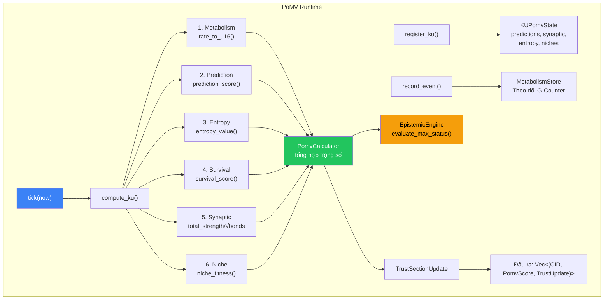
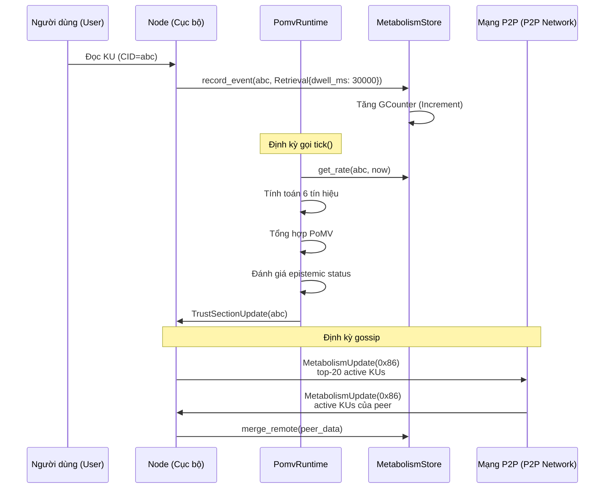

# 6. PoMV Aggregator, Reward Model, and Runtime

Phần này đặc tả PoMV aggregator kết hợp tất cả 6 tín hiệu thành một điểm số duy nhất, OBT reward model, và runtime orchestrator.

## 6.1 PoMV Aggregator

PoMV Aggregator ([pomv.rs](file:///c:/Users/shpy2/Documents/OneBrain/src/ku-core/src/pomv.rs), 290 LOC, 9 tests) tính toán điểm số PoMV cuối cùng từ 6 giá trị tín hiệu.

### 6.1.1 Aggregation Formula

$$\text{PoMV}(ku, t) = \text{clamp}\left(\sum_{i=1}^{6} w_i \cdot s_i(ku, t),\ 0,\ 1\right)$$

trong đó $s_i \in [0, 1]$ là các giá trị tín hiệu đã được chuẩn hóa và $w_i$ là các trọng số có thể cấu hình với $\sum w_i = 1$.

### 6.1.2 Signal Normalization

Each signal is normalized to [0, 1] before aggregation:

| Tín hiệu | Kiểu thô (Raw Type) | Chuẩn hóa (Normalization) | Ánh xạ u16 |
|--------|----------|--------------|-------------|
| Metabolism | f64 (không giới hạn) | Sigmoid: $1 - e^{-r/10}$ | `rate_to_u16()` / 10000 |
| Prediction | f64 [0, 1] | Trực tiếp | `score_to_u16()` / 10000 |
| Entropy | f32 [0, 1] | `entropy_value()` với độ suy giảm (decay) | `entropy_to_u16()` / 10000 |
| Survival | f32 [0, 1] | `min(attacks × 0.1, 1.0)` | `survival_to_u16()` / 10000 |
| Synaptic | f32 (không giới hạn) | $\frac{\text{total\_strength}}{\sqrt{\text{bond\_count} + 1}}$, giới hạn (clamped) | `centrality_to_u16()` / 10000 |
| Niche | f32 [0, 1] | Tổng trọng số của 4 điểm số phụ | `fitness_to_u16()` / 10000 |

*Table 10: Quy trình chuẩn hóa tín hiệu.*

### 6.1.3 Weight Validation

Cấu trúc (struct) trọng số bao gồm việc xác thực khi chạy (runtime validation):

```rust
pub fn is_valid(&self) -> bool {
    let sum = self.metabolism + self.prediction + self.entropy 
            + self.survival + self.synaptic + self.niche_fitness;
    (sum - 1.0).abs() < 0.01  // Must sum to ~1.0
}
```

Điều này ngăn ngừa sai sót cấu hình — nếu các trọng số không có tổng bằng 1.0, aggregator sẽ từ chối cấu hình đó.

### 6.1.4 Contribution Breakdown

Aggregator không chỉ trả về điểm số tổng mà còn cả các đóng góp riêng lẻ của từng tín hiệu:

```rust
pub struct PomvScore {
    pub total: f32,                     // Overall PoMV score [0, 1]
    pub contributions: PomvContributions,  // Per-signal weighted values
    pub weights: PomvWeights,             // Weights used
}

pub struct PomvContributions {
    pub metabolism: f32,    // w₁ × s₁
    pub prediction: f32,    // w₂ × s₂
    pub entropy: f32,       // w₃ × s₃
    pub survival: f32,      // w₄ × s₄
    pub synaptic: f32,      // w₅ × s₅
    pub niche_fitness: f32, // w₆ × s₆
}
```

Sự minh bạch này cho phép kiểm tra *lý do tại sao* một KU nhận được điểm số của nó — điều thiết yếu cho việc gỡ lỗi, kiểm toán (auditing) và xây dựng niềm tin của người dùng vào cơ chế.

## 6.2 OBT Reward Model

### 6.2.1 Reward Formula

$$\text{OBT\_reward}(ku, \text{period}) = \text{base\_emission}(\text{period}) \times \frac{\text{PoMV}(ku, \text{period})}{\sum_{ku' \in \text{all\_KUs}} \text{PoMV}(ku', \text{period})}$$

Diễn giải bằng lời: phần thưởng cho một KU tỷ lệ thuận với tỷ lệ đóng góp PoMV của nó trên tổng số PoMV trong mạng lưới.

### 6.2.2 Linear Reward Mapping

$$\text{reward}(ku) = \text{pomv\_score}(ku) \times \text{max\_reward\_per\_epoch}$$

Công thức này được thiết kế đơn giản có chủ ý — sự phức tạp trong các công thức tính thưởng tạo ra cơ hội gian lận. Ánh xạ này là tuyến tính, minh bạch và có thể dự đoán được.

### 6.2.3 Non-Punitive Guarantees

**No clawback:** G-Counters chỉ tăng dần. Một khi một KU đã kiếm được phần thưởng OBT, các phần thưởng đó là vĩnh viễn — ngay cả khi KU đó sau này bị phản đối (deprecated) hoặc bỏ rơi.

**Tại sao không có clawback?**
1. **Sự công bằng (Fairness):** Một KU đã hữu ích trong 6 tháng xứng đáng nhận được 6 tháng phần thưởng, ngay cả khi nó bị thay thế.
2. **Cân chỉnh động lực (Incentive alignment):** Việc thu hồi phần thưởng (clawback) làm nản lòng người đóng góp — họ lo sợ mất phần thưởng vì những lý do nằm ngoài tầm kiểm soát của họ.
3. **Sự đơn giản về kỹ thuật (Technical simplicity):** Ngữ nghĩa chỉ tăng dần của G-Counter loại bỏ nhu cầu về logic hoàn tác (rollback) phức tạp.
4. **Tính nhất quán về mặt triết học:** Nếu tri thức đã được *sử dụng*, nó đã *mang lại giá trị*. Việc mang lại giá trị trong quá khứ là một sự thật thực tế.

### 6.2.4 Comparison with Other Reward Models

| Mô hình | Cơ sở phần thưởng (Reward Basis) | Hình phạt (Punishment) | Clawback? | Fair to Subjective Knowledge? |
|-------|-------------|-----------|:---------:|:-----------------------------:|
| Academic (journals) | Số lượng xuất bản, trích dẫn | Thu hồi bài viết (tổn hại sự nghiệp) | Ngầm định | Không |
| Stack Overflow | Bình chọn ủng hộ (Upvotes) | Bình chọn phản đối (rep loss) | Có | Không |
| Prediction Markets | Dự đoán đúng | Dự đoán sai (mất mát) | Có | Không |
| Filecoin | Dung lượng lưu trữ cung cấp | Slashing (mất tài sản thế chấp) | Có | N/A |
| **PoMV** | **Sử dụng (metabolism)** | **Suy giảm tự nhiên (không phạt)** | **Không** | **Có** |

*Table 11: So sánh mô hình phần thưởng giữa các hệ thống tri thức và hệ thống crypto.*

## 6.3 PoMV Runtime Orchestrator

PoMV Runtime ([pomv_runtime.rs](file:///c:/Users/shpy2/Documents/OneBrain/src/ku-core/src/pomv_runtime.rs), 550 LOC, 8 tests) là runtime orchestrator trung tâm liên kết tất cả các thành phần lại với nhau.

### 6.3.1 Architecture



*Figure 6: Luồng dữ liệu của PoMV Runtime. Hàm `tick()` tính toán cả 6 tín hiệu cho mọi KU đã đăng ký, tổng hợp chúng, đánh giá các quá trình epistemic transitions, và tạo ra các trust updates.*

### 6.3.2 Per-KU State

Mỗi KU đã đăng ký sẽ duy trì:

```rust
pub struct KUPomvState {
    pub predictions: PredictionRegistry,  // Prediction registry
    pub synaptic: SynapticMap,            // Hebbian bond map
    pub entropy_at_creation: f32,         // Novelty score at birth
    pub bridge_at_creation: f32,          // Bridge score at birth
    pub created_at: u64,                  // Creation timestamp
    pub attacks_survived: u32,            // Survival counter
    pub niches: Vec<NicheId>,             // Ecological niches
    pub cross_niche_count: usize,         // Cross-niche connections
    pub epistemic_status: EpistemicStatus, // Current status
}
```

### 6.3.3 The `tick()` Function

Hàm `tick()` là nhịp tim của hệ thống PoMV — được gọi định kỳ (thường là mỗi epoch):

```
Algorithm 1: PoMV Tick
INPUT: now (nhãn thời gian hiện tại), niche_stats
OUTPUT: danh sách đã sắp xếp của (CID, PomvScore, TrustSectionUpdate)

1. FOR EACH (cid, ku_state) IN ku_states:
2.   metabolism ← metabolism_store.get(cid)
3.   IF metabolism IS NONE: CONTINUE  // Không có dữ liệu metabolism
4.   
5.   // Tính toán 6 tín hiệu
6.   s₁ ← metabolism.rate_to_u16(now, half_life) / 10000
7.   s₂ ← ku_state.predictions.prediction_score()
8.   s₃ ← entropy_value(ku_state.entropy, ku_state.bridge, age)
9.   s₄ ← survival_score(ku_state.attacks_survived, metabolism.is_alive())
10.  s₅ ← ku_state.synaptic.total_strength() / √(bond_count + 1)
11.  s₆ ← niche_fitness(ku_state.niches, niche_stats)
12.  
13.  // Tổng hợp
14.  pomv ← PomvCalculator::compute(signals, weights)
15.  
16.  // Đánh giá epistemic status
17.  new_status ← evaluate_max_status(ku_state.status, metabolism, now)
18.  ku_state.epistemic_status ← new_status
19.  
20.  // Tạo trust update
21.  update ← TrustSectionUpdate { cả 6 điểm số + pomv_total + status }
22.  
23.  results.push((cid, pomv, update))
24.
25. SẮP XẾP results THEO pomv.total GIẢM DẦN
26. TRẢ VỀ results
```

### 6.3.4 TrustSectionUpdate

Đầu ra của `tick()` bao gồm một `TrustSectionUpdate` có thể áp dụng cho TrustSection của KU:

```rust
pub struct TrustSectionUpdate {
    pub epistemic_status: EpistemicStatus,
    pub metabolic_rate: u16,          // 0-10000
    pub prediction_score: u16,        // 0-10000
    pub entropy_at_creation: u16,     // 0-10000
    pub survival_score: u16,          // 0-10000
    pub synaptic_centrality: u16,     // 0-10000
    pub niche_fitness: u16,           // 0-10000
    pub pomv_total: f32,              // 0.0-1.0
}
```

Phương thức `apply_to(trust: &mut TrustSection)` method viết các giá trị này vào metadata tin cậy của KU, sau đó được lan truyền thông qua đồng bộ hóa CRDT.

### 6.3.5 Garbage Collection

Hàm `gc(now)` của runtime loại bỏ các trạng thái KU đã chết:

$$\text{remove if: } \text{metabolic\_rate} < 0.0001 \text{ AND } \text{age} > 365 \text{ ngày} \text{ AND } \text{engagement} = 0$$

Quy trình này mang tính bảo thủ cao có chủ ý:
- Ngưỡng rất thấp (0.0001) — chỉ dành cho các KUs thực sự bị bỏ rơi.
- Tuổi tối thiểu một năm — không bao giờ GC các KUs còn trẻ.
- Đòi hỏi tương tác bằng 0 — ngay cả một lượt tương tác duy nhất cũng giúp tránh GC.

## 6.4 Metabolism Gossip Protocol

Module Metabolism Gossip ([metabolism_gossip.rs](file:///c:/Users/shpy2/Documents/OneBrain/src/ku-net/src/metabolism_gossip.rs), 325 LOC, 6 tests) lan truyền dữ liệu metabolism trên mạng P2P.

### 6.4.1 Wire Protocol

| Message | Code | Direction | Content |
|---------|:----:|-----------|---------|
| `MetabolismUpdate` | 0x86 | Push (Đẩy) | sender, Vec<(CID, KUMetabolism)>, timestamp |
| `MetabolismQuery` | 0x87 | Pull (Kéo) | requester, Vec<CID>, request_id |
| `MetabolismResponse` | 0x89 | Reply (Phản hồi) | responder, Vec<(CID, KUMetabolism)>, request_id |

### 6.4.2 Gossip Strategy

**Push (định kỳ):** Mỗi node chọn ngẫu nhiên các peers theo chu kỳ và gửi top-N KUs metabolism hoạt động tích cực nhất của nó (tối đa 20 trên mỗi thông điệp). Phía nhận thực hiện merge bằng G-Counter merge — idempotent, commutative, monotonic.

**Pull (khi có nhu cầu):** Khi một node bắt gặp một CID mà nó chưa có dữ liệu metabolism, nó sẽ gửi một `MetabolismQuery` đến các peers. Các phản hồi sẽ được gộp vào local store.

### 6.4.3 CRDT Safety

Tất cả các phép gộp (merges) đều sử dụng ngữ nghĩa G-Counter:

$$\text{merged}[i] = \max(\text{local}[i], \text{remote}[i])$$

Điều này đảm bảo:
- **Tính lũy đẳng (Idempotent):** Gộp cùng một dữ liệu hai lần không có tác dụng phụ.
- **Tính giao hoán (Commutative):** Thứ tự của các phép gộp không ảnh hưởng đến kết quả.
- **Tính đơn điệu (Monotonic):** Các giá trị chỉ tăng lên.
- **Tính hội tụ (Convergent):** Tất cả các node cuối cùng đều đồng thuận.

## 6.5 Full System Integration



*Figure 7: Luồng dữ liệu đầu-cuối (end-to-end) từ hành động của người dùng đến tính điểm PoMV và lan truyền qua gossip mạng.*

---
