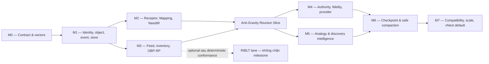

# OneBrain Foundation Implementation Plan — KU v7.1

> **Phiên bản kế hoạch:** 1.0  
> **Ngày chốt:** 2026-07-20  
> **Trạng thái:** Executable planning baseline  
> **Nguồn quyết định:** [OneBrain Research Baseline — KU v7.1](ONEBRAIN_RESEARCH_BASELINE_V7_1.md), đặc biệt §46.3 và §56.1  
> **Phạm vi:** KU, Receptor/Mapping, KQL, OBKG, PoMV evidence path, OBP-RP, OBS, identity/feed, encoding fidelity và AI local layer  
> **Ngoài critical path:** OBT, BCI, remote actuator và mọi tuyên bố scale 30 tỷ node chưa có bằng chứng

---

## 1. Mục tiêu của kế hoạch

Tài liệu này chuyển các ADR đã chốt thành chương trình triển khai có thể giao việc trực tiếp. Kết quả cần đạt không phải là “xây xong OneBrain” trong một lần, mà là tạo một nền móng nhỏ, đúng bất biến và có thể mở rộng dần mà không khóa sai kiến trúc.

Luận điểm phải được kiểm chứng sớm nhất là:

> Hai người hoặc hai component có thể tiếp tục tạo, tìm, sử dụng và phát triển KU khi bị cô lập; khi tái kết nối, hệ thống có thể đưa một mảnh tri thức ở nơi này tới đúng Receptor ở nơi khác, tạo Mapping có giải thích và không cần server trung tâm, global truth hay global quorum.

### 1.1 Kết quả bắt buộc

1. Một nguồn dữ liệu canonical cho identity, object, event, feed và wire contract vNext.
2. KU/Receptor/Mapping là object bất biến; thay đổi trạng thái được biểu diễn bằng event và reducer có version.
3. KQL trả kết quả cùng `CoverageStatement`, frontier, limitation và continuation; không dùng từ `GLOBAL` để hứa điều không chứng minh được.
4. OBP-RP đồng bộ object/event theo selector qua partition–reunion, có deterministic fallback và không cần seed sau bootstrap.
5. Verify encoding chỉ đánh giá độ trung thực của phép encode; không bỏ KU chỉ vì nội dung trái số đông hoặc chưa được dùng.
6. AI local có thể đề xuất, encode, match và thực thi capability nhưng không tự tạo side effect authoritative khi chưa có event/permit phù hợp.
7. Mọi optimization xác suất đều không được trở thành correctness oracle.

### 1.2 Bất biến kiến trúc

- Không có “KU sai” ở tầng tồn tại/phân phối. Có artifact không hợp lệ về bytes/signature/schema; có encoding lệch nguồn; có claim bị phản bác; có KU chưa được dùng hoặc không phù hợp tác vụ hiện tại.
- CID xác định bytes canonical, không xác định chân lý.
- Ranking, popularity, trust, fidelity và PoMV là view/evidence có scope; không phải quyền xóa một nhánh tri thức.
- Partition là trạng thái bình thường. Mỗi component vẫn phải tạo, query, use và derive local.
- Tái kết nối hợp nhất tập object/event hợp lệ; không chọn “island thắng”.
- Seed, bridge, relay, DHT provider và storage custodian không có knowledge authority.
- Proposal không phải fact; ranking không tự materialize Mapping; materialize không tự adopt vào Assembly.
- Query không thấy kết quả chỉ có nghĩa tương đối với boundary, frontier, budget và operator đã khảo sát.
- OBT chỉ có thể đọc Benefit/Use evidence về sau; hỏng hoặc tắt OBT không được chặn KU/KQL/OBP.
- Không thêm GeneType/opcode Core DNA trong MVP chỉ để chứa object operational mới.

---

## 2. Ranh giới module vNext

Không tạo thêm một “trụ cột” hay crate mới trong MVP. Các type thuần, không phụ thuộc transport/storage, được gom dưới namespace mới trong `ku-core`; đây là **library boundary**, không phải thay thế Core DNA.

| Trách nhiệm | Nơi sở hữu đề xuất | Quy tắc |
|---|---|---|
| Full-width ID, canonical codec, domain-separated CID | `ku-core::foundation` | Không phụ thuộc network/database; có golden vectors. |
| KU Object Family, Receptor, Mapping, Capability, event/feed schema | `ku-core::foundation` và module semantic tương ứng | Object bất biến; mutable state chỉ là derived view. |
| OBP message DTO, version/profile negotiation, legacy adapter | `onebrain-protocol` | Không chứa TCP server logic trong canonical schema. |
| Session, carrier, reconciliation, routing, provider discovery | `ku-net` | Selector là opaque contract; không suy semantic authority. |
| Object/event/vault/quarantine/index persistence | `ku-kql` và OBS modules hiện hữu | Validate-before-persist; transaction/journal rõ. |
| NeedIR, complement planner, analogy, exploration, StandingNeed | `ku-kql` | Candidate generator không ghi canonical state trực tiếp. |
| Encoding, model manifest, cognitive executor | `ku-encoder`, `ku-ai`, `ku-mediator` | Kết quả remote/AI vào proposal hoặc quarantine trước. |
| Orchestration, API, CLI/UI và local policy | `onebrain-node`, `onebrain-api`, CLI/Web | Không suy “global complete” từ network status. |
| OBKG | Derived projection/index | Có thể xóa và rebuild từ object/event; không là source-of-record. |

Các file tích hợp dễ xung đột (`lib.rs`, `messages.rs`, `node.rs`, Cargo manifests) phải có một integration owner; lane khác tạo module riêng rồi gửi thay đổi export nhỏ cho owner.

---

## 3. Khoảng cách giữa code hiện tại và contract mới

| Vị trí hiện tại | Anti-invariant | Hướng chuyển đổi |
|---|---|---|
| `ku-net/src/sync.rs` | Aggregate `VectorClock`, rút NodeID còn `u64`, response không thực sự theo CID được yêu cầu, có nguy cơ overwrite bytes cùng CID. | Full-width feed/event identity; immutable validated store; selector inventory và OBP-RP. |
| `ku-core/src/crdt.rs` | Clock/tag `u64`; OR-Set tombstone GC không an toàn trong open network có partition vô hạn. | Feed-scoped dots, explicit retirement floor/checkpoint; không invent identity khi migrate. |
| `ku-net/src/dht.rs` | Một `DhtEntry` cho một key, arrival-order overwrite. | `ProviderLeaseMap` multi-provider, max generation + retirement floor; DHT chỉ là sampled view. |
| `ku-net/src/query/messages.rs` | Raw KQL, local concept `u64`, stable origin/visited path, `GLOBAL`, thiếu coverage/continuation. | Typed `KnowledgeNeedIR`, scoped `QueryRun`, result batches/receipts và privacy-preserving disclosure. |
| `ku-net/src/query/merger.rs` | Route/trust/source-count ảnh hưởng chất lượng; late result/finalize dễ mất long-tail. | Evidence identity, revisioned result set, vector score, exploration floor và exposure telemetry. |
| `ku-core/src/encoding_consensus.rs` | Winner/`FULL`, owner-centric finalization và cleanup xóa alternate/raw. | Immutable encoding attempts + fidelity attestations + scoped assessment; giữ alternatives. |
| `ku-core/src/graph_types.rs` | Snapshot materialized thiếu feed frontier/root/reducer version. | OBKG view có source frontier, reducer/index/model version và rebuild test. |
| `onebrain-protocol/src/lib.rs` | JSON/TCP demo và semantic message trộn chung, thiếu canonical vNext/versioning. | Tách `types`, `codec`, `legacy`; TCP chỉ là adapter/carrier test. |
| `onebrain-node` integration tests | Ít coverage end-to-end so với core/network. | Reunion vertical slice, restart, multi-bridge, migration và kill-switch tests. |
| Repository CI | Chưa có workflow CI chuẩn; chưa có property/fuzz/model-check gate. | Tạo test-vector runner, property suite, fuzz target và independent verification lane. |

Không sửa trực tiếp semantics cũ theo kiểu big-bang. vNext chạy side-by-side, dual-read khi cần, new write chỉ phát canonical vNext và giữ raw legacy bytes để audit.

---

## 4. Dependency graph và đường găng



Đường găng semantic:

```text
Canonical substrate
→ Receptor → Mapping → Resolution
→ deterministic reconciliation
→ reunion-triggered complement discovery
```

Đường găng authority:

```text
Signed feed
→ key/delegation state
→ revocation/provider/fidelity
→ secure distributed capability
```

RIBLT, destructive GC, remote cognition, OBT và BCI không nằm trên đường găng của MVP.

M4a và M5 có thể chồng lấp sau M3; các cross-dependency nhỏ như `CAP-001 → AI-002` được quyết định bởi bảng Task ID, không biến toàn bộ milestone thành tuần tự. M4b remote cognition và RIBLT là lane optional.

---

## 5. Quy ước quản lý task

### 5.1 Trạng thái

- `[ ]` chưa bắt đầu.
- `[~]` đang làm.
- `[x]` đã qua acceptance gate và evidence đã được link.
- `[!]` bị chặn; phải ghi blocker và owner của quyết định.

Trong cột **Phụ thuộc**, dấu phẩy luôn có nghĩa **AND**. Chỉ dùng Task ID/Gate ID đầy đủ; không dùng slash, range hoặc prose. Task optional được đánh dấu trong Deliverable, không được biến thành prerequisite ngầm.

### 5.2 Độ lớn

- `S`: thay đổi hẹp, một module/PR nhỏ.
- `M`: một work package rõ, thường một vài module.
- `L`: nhiều module hoặc cần migration/integration đáng kể.
- `XL`: chương trình phải tách thành nhiều PR, còn research/benchmark risk.

Độ lớn dùng để chia việc, không phải cam kết ngày lịch. Mọi task `L/XL` phải được tách thành PR nhỏ trước khi bắt đầu code.

### 5.3 Definition of Done chung

Một task chỉ được đánh dấu `[x]` khi:

1. contract/schema và negative behavior đã được test;
2. code path mới có resource limits, error semantics và telemetry không lộ private data;
3. test deterministic qua restart khi task có persistence;
4. backward/rollback behavior được ghi rõ nếu chạm dữ liệu hoặc wire;
5. không tạo dependency từ knowledge plane sang OBT;
6. tài liệu và golden vector được cập nhật nếu đổi public contract.

---

## 6. Milestone M0 — Contract hardening và verification harness

**Mục tiêu:** biến ADR thành contract máy có thể kiểm tra trước khi xây runtime. Runtime behavior cũ chưa bị thay đổi.

| Trạng thái / ID | Lane | Deliverable và target chính | Phụ thuộc | Acceptance bắt buộc | Size |
|---|---|---|---|---|---:|
| [x] `FND-001` | A | [Field Ownership Matrix v1](../specs/vnext/FIELD_OWNERSHIP_MATRIX_V1.md) cho KU, Receptor, Mapping, Query, Capability, Fidelity, Feed, Checkpoint, ProviderLease, PoMV, OBS và OBKG. | — | Không field nào vừa là semantic identity, availability và authority; không vòng CID. | M |
| [x] `FND-002` | A/F | [Normative Vocabulary v1](../specs/vnext/NORMATIVE_VOCABULARY_V1.md) + [37 negative assertions](../specs/vnext/negative_assertions.yaml). | FND-001 | Mỗi từ có scope/policy/frontier; legacy alias không xuất hiện trong canonical enum. | S |
| [x] `FND-003` | A | [Canonical Codec and Domain Profile v1](../specs/vnext/CANONICAL_PROFILE_V1.md): deterministic CBOR, BLAKE3 domains, schema/version rules và resource limits; frozen 2026-07-20. | FND-001 | Quy tắc codec/domain/resource đã freeze và có reference implementation side-by-side, không đổi Core DNA/CCID cũ. | M |
| [x] `FND-004` | F | [Foundation vector set v1](../../src/test-vectors/vnext/foundation/canonical-v1.json) + [`ku-core::foundation`](../../src/ku-core/src/foundation): golden valid/invalid CBOR, typed/domain CID, envelope, NFC và signature. | FND-003 | Runner kiểm bytes/CID/signature, duplicate/order/critical field, malformed input, set, property smoke và exact resource boundaries; 16 foundation tests pass. | L |
| [x] `FND-005` | F | Cross-crate conformance runner dùng cùng frozen vector file từ `ku-core`, `onebrain-protocol`, `ku-net`; schema mới sẽ đăng ký vector set theo schema/version. | FND-004 | Encode–decode–encode giữ nguyên bytes; cả ba runner pass và foundation schema/codec chỉ do `ku-core` sở hữu. | M |
| [x] `FND-006` | B/E | [`VNextFeatureConfig`](../../src/onebrain-node/src/vnext_config.rs): object/event v1, OBP-RP, inventory shadow, provider lease, fidelity, checkpoint GC, RIBLT, legacy adapter và kill switches độc lập. | FND-002 | Mặc định tắt; dependency mâu thuẫn fail ở đầu `OneBrainNode::new` trước side effect; 4 config tests pass. | M |
| [x] `FND-007` | F | [vNext foundation CI](../../.github/workflows/vnext-foundation.yml) + [dependency-free contract validator](../../scripts/ci/validate_vnext_contracts.py): strict format trên file vNext-owned, check/lint bốn foundation crates, vectors/property smoke và docs links. | FND-005 | Canonical/vector/task/traceability drift làm gate fail; legacy workspace lint debt vẫn được báo nhưng không được phép làm yếu gate contract vNext. | M |
| [x] `FND-008` | D/F | [Foundation Threat Model v1](../specs/vnext/THREAT_MODEL_V1.md) cho identity, NeedIR, selector, transcript, permit, remote task, Vault/Quarantine, provider và GC. | FND-001 | Có attacker capabilities, assets, trust boundaries, abuse budgets và kill conditions. | M |
| [x] `FND-009` | C/F | [Anti-Gravity Reunion Corpus v1](../specs/vnext/corpus/README.md): vocabulary swap, partial/assembly, unit/direction/negation, unknown, opposition, distractor và privacy. | FND-002 | Có expected discovery/correspondence/constraint outcome; không phụ thuộc embedding. | M |
| [x] `FND-010` | A–F | [ADR Traceability Matrix v1](../specs/vnext/TRACEABILITY_MATRIX_V1.md): `ADR → task → DRI → type/event → reducer/view → verification gate`; CI validator kiểm graph/link/orphan tự động. | FND-001, FND-002 | 18/18 ADR đã map, 99 Task ID duy nhất, không dependency cycle/orphan và local links được enforce trong CI. | M |

**Exit gate M0:** canonical codec/envelope primitive vectors và vector format đã freeze; mọi ADR có DRI/type/reducer/negative assertion trong traceability matrix; mỗi schema sau M0 phải thêm vector set trước merge; threat model được review; không còn private deterministic commitment hoặc từ ngữ hứa global/independence mơ hồ.

---

## 7. Milestone M1 — Trustworthy substrate

**Mục tiêu:** xây identity, canonical object/event, immutable storage, feed và carrier test đủ tin cậy cho các lane phía trên.

| Trạng thái / ID | Lane | Deliverable và target chính | Phụ thuộc | Acceptance bắt buộc | Size |
|---|---|---|---|---|---:|
| [x] `IDN-001` | A | [Identity and Knowledge Object Profile v1](../specs/vnext/IDENTITY_OBJECT_PROFILE_V1.md) + [`foundation::identity`](../../src/ku-core/src/foundation/identity.rs): full-width `NodeID`, `DeviceID`, `ActorID`, `FeedID`, typed `EventCID`, CRDT dot/clock; không có semantic conversion sang `u64`. | FND-003, FND-004 | Collision fixture cùng 64-bit prefix không alias qua canonical serialize, ACK, watch, bounded sync clock hoặc index; cross-crate vectors pass. | L |
| [x] `IDN-002` | A/D | [Feed/authority profile](../specs/vnext/FEED_EVENT_PROFILE_V1.md) + [`foundation::{feed, authority}`](../../src/ku-core/src/foundation): randomized namespace `FeedInception`, pre-rotation commitment và frontier-relative delegation/revocation outcome; `FeedID = H(domain, feed_public_key, namespace_commitment, generation)`. | IDN-001 | Hai device/key không collision; namespace không tự link; accepted grant/revocation proof cho outcome relative; thiếu proof là `STALE_OR_UNRESOLVED`, không globally invalid. | XL |
| [x] `OBJ-001` | A | [`ku-core::foundation::{canonical, content_id}`](../../src/ku-core/src/foundation) với restricted canonical bytes, typed domain-separated CID và original-byte document. | FND-003, FND-004 | Byte flip đổi CID; map order không đổi CID; exact bytes được signature cover; 21 domain golden vectors pass. | L |
| [x] `OBJ-002` | A | [Generic immutable Knowledge Object envelope](../specs/vnext/IDENTITY_OBJECT_PROFILE_V1.md): kind/version/disclosure/refs/limits, append-only schema registry và opaque disposition theo quota. | OBJ-001 | Unknown non-critical kind/extension round-trip nguyên bytes; unknown critical semantic bị reject khỏi projection/execution; reference/limit vectors pass ba crate. | L |
| [x] `EVT-001` | A | [Signed KnowledgeEventEnvelope](../specs/vnext/FEED_EVENT_PROFILE_V1.md) + [`foundation::event`](../../src/ku-core/src/foundation/event.rs): payload refs, causal parents, author/feed, authorization ref, disclosure và idempotency key. | IDN-002, OBJ-001 | Tamper, duplicate, reorder, missing parent, exact replay, unknown event type và unsupported schema major có outcome xác định; shared vectors pass ba crate. | XL |
| [x] `OBS-001` | B | [Validated Storage Profile v1](../specs/vnext/VALIDATED_STORAGE_PROFILE_V1.md) + [`foundation::storage`](../../src/ku-core/src/foundation/storage.rs): `put_verified` object/event, exact accepted bytes, non-executable Quarantine và atomic memory/redb backend. | OBJ-002, EVT-001 | Same claimed CID/different bytes không thay accepted value; canonical/CID/signature failure chỉ vào Quarantine; dropped redb transaction không để partial commit sau reopen. | L |
| [x] `OBS-002` | B/D | [Validated Storage Profile v1](../specs/vnext/VALIDATED_STORAGE_PROFILE_V1.md) + [`foundation::vault`](../../src/ku-core/src/foundation/vault.rs): Public storage-class firewall, XChaCha20-Poly1305 Private Vault và encrypted private Quarantine dùng chung atomic backend abstraction. | OBS-001, FND-008 | Private accepted/quarantine plaintext không tới raw backend/public accepted store; wrong key/tamper bị reject; Quarantine luôn non-executable và không có projection API. | XL |
| [x] `FEED-001` | A/B | [Feed State Profile v1](../specs/vnext/FEED_STATE_PROFILE_V1.md) + [`foundation::feed_store`](../../src/ku-core/src/foundation/feed_store.rs): validated single-writer feed projection, contiguous branches, compact gaps, successor/equivocation proof. | EVT-001, OBS-001 | Same position/different EventCID giữ cả hai + proof; exact replay/order hội tụ; thiếu consistency là unresolved; sparse `u64::MAX` không expand. | L |
| [x] `FEED-002` | A/D | [Frontier-scoped key-state reducer](../specs/vnext/FEED_STATE_PROFILE_V1.md) + [`foundation::key_state`](../../src/ku-core/src/foundation/key_state.rs): root/child delegation, attenuation, pending reconciliation và ancestor revocation cascade. | FEED-001, IDN-002 | Child không vượt generation/namespace parent; committed rotation hợp lệ vẫn authorized; missing parent/revocation proof giữ `STALE_OR_UNRESOLVED`, không thành fresh. | L |
| [x] `PROTO-001` | A/B | [Protocol Codec and Legacy Isolation Profile v1](../specs/vnext/PROTOCOL_CODEC_ISOLATION_PROFILE_V1.md) + `onebrain-protocol::{types, codec, legacy}`: một owner cho canonical schema/wire IDs; TCP/JSON cũ bị cô lập và parse giữ original bytes. | FND-003, FND-005, OBJ-002, EVT-001 | Deterministic canonical round-trip; payload bind domain CID; unknown wire/cap reject; legacy parser reject vNext CBOR và vNext type không Serde-serialize vào JSON demo. | L |
| [x] `NET-001` | B | [Authenticated Session Profile v1](../specs/vnext/AUTHENTICATED_SESSION_PROFILE_V1.md) + `onebrain-protocol::session_codec` + [`ku-net::vnext_session`](../../src/ku-net/src/vnext_session.rs): canonical signed Hello/Welcome/Finish bind carrier, full NodeID/key, transcript, strongest profile và exact capability intersection. | IDN-001, FND-003, PROTO-001 | MITM/key/tamper/nonce reuse/replay reject; signed downgrade/cap stripping reject; default zero feed link, selective proof scope theo negotiated capability và không cấp authority; vNext chỉ có in-memory harness, TCP/JSON nằm legacy. | XL |
| [x] `INV-001` | A/B/C | [Inventory Scope Profile v1](../specs/vnext/INVENTORY_SCOPE_PROFILE_V1.md) + [`foundation::inventory`](../../src/ku-core/src/foundation/inventory.rs): shared Selector/Offer/Coverage/Budget/Carrier contracts và frozen `PublicKnowledgeExchangeFixture/1`. | OBJ-001, FND-001 | Set order cho same SelectorCID; private Vault classes reject; probabilistic/limited coverage không claim completion; zero result không global-complete. | L |
| [x] `CAR-001` | B/F | [Deterministic Carrier Profile v1](../specs/vnext/DETERMINISTIC_CARRIER_PROFILE_V1.md) + `ku-net::vnext_carrier`: canonical CarrierRecord qua in-memory và reopenable file bundle, non-destructive store-carry-forward và exact injection plan. | NET-001, OBS-001 | Cùng record digest qua hai carrier; close/reopen giữ bundle; controlled drop/duplicate/reverse deterministic; malformed bundle trả zero partial delivery; carrier không cấp authority. | M |
| [x] `MIG-001` | B/F | [Additive Migration Storage Profile v1](../specs/vnext/ADDITIVE_MIGRATION_STORAGE_PROFILE_V1.md) + [`foundation::migration`](../../src/ku-core/src/foundation/migration.rs): bảng raw/vNext/quarantine song song, atomic row+batch journal, copy-on-read và dual-read rollback-safe trên memory/redb. | OBS-001, FND-006 | Kill/restart từng batch idempotent; reopen vẫn đọc exact raw legacy; corrupt row non-executable; `LegacyIdentityPrefix` không thể invent full ID từ `u64`. | XL |

**Exit gate M1:** không còn identity truncation trên vNext; canonical vectors pass; same-CID corruption không vào store; event/feed replay idempotent; private/quarantine boundary được test; in-memory/file carrier cho cùng semantic result.

---

## 8. Milestone M2 — Local KU/Receptor/Mapping/KQL slice

**Mục tiêu:** chứng minh vòng nhận thức local trước khi phụ thuộc distributed discovery.

| Trạng thái / ID | Lane | Deliverable và target chính | Phụ thuộc | Acceptance bắt buộc | Size |
|---|---|---|---|---|---:|
| [x] `KU-001` | A/C | [Semantic Primitives Profile v1](../specs/vnext/SEMANTIC_PRIMITIVES_V1.md) + [`foundation::semantic`](../../src/ku-core/src/foundation/semantic.rs): CCID-only `TermRef`, alpha-normalized `StatementFrame`, qualifier, typed three-state constraint và exact unit/dimension algebra. | OBJ-002 | Alpha-renaming cho bytes giống nhau; concept/predicate/unit là CCID bytes, API không nhận local ConceptId; affine unit và dimension mismatch tests pass. | L |
| [x] `KU-002` | A | [Receptor Profile v1](../specs/vnext/RECEPTOR_PROFILE_V1.md) + [`foundation::receptor`](../../src/ku-core/src/foundation/receptor.rs): immutable Definition với declared/derived/emergent origin, acceptance-policy ref và Vault-only ClaimEnvelope. | KU-001, OBJ-002 | Definition không có runtime budget/rank; private claim round-trip Vault; ordinary encode không commitment; policy-explicit commitment dùng random opening và khác opening không link. | M |
| [x] `KU-008` | A/C | [Knowledge Affordance Profile v1](../specs/vnext/KNOWLEDGE_AFFORDANCE_PROFILE_V1.md) + [`foundation::affordance`](../../src/ku-core/src/foundation/affordance.rs): source/role/input sets, full semantic sections, abstraction patterns và explicit/derived trace. | KU-001, OBJ-002 | Set order ổn định; derived engine/rule/input nằm trong identity; source KU không đổi; exact `supports_role` không suy capability từ embedding. | L |
| [x] `KU-003` | A | [Frontier Assembly Manifest Profile v1](../specs/vnext/ASSEMBLY_MANIFEST_PROFILE_V1.md) + [`foundation::assembly`](../../src/ku-core/src/foundation/assembly.rs): lineage/revision/predecessor, sources, stable full-width PlacementId, cardinality/context và policy ref. | KU-002 | Cùng Definition ở hai PlacementId có identity riêng; order ổn định; duplicate placement và revision-chain shape sai bị reject. | L |
| [x] `KU-004` | A/B | [Receptor Resolution Profile v1](../specs/vnext/RECEPTOR_RESOLUTION_PROFILE_V1.md) + [`foundation::resolution`](../../src/ku-core/src/foundation/resolution.rs): signed action-object binding, exact target, five actions and causal multi-branch `ResolutionView`. | KU-003, EVT-001, FEED-002 | Unauthorized/unresolved event không đổi authoritative state; acceptance là frontier-relative; concurrent adopt/reopen giữ cả hai branch, không timestamp/LWW. | L |
| [x] `KU-005` | A/C | [Mapping Profile v1](../specs/vnext/MAPPING_PROFILE_V1.md) + [`foundation::mapping`](../../src/ku-core/src/foundation/mapping.rs): semantic correspondences, exact transforms, assumptions và unknown/violated/unmapped regions; provenance envelope tách riêng. | KU-001, OBJ-002 | Set order cho same MappingKernelID; generator/evidence đổi envelope CID không đổi kernel; unknown/violated/unmapped và affine transform identity-bearing. | M |
| [x] `KU-006` | B/C | [Mapping Materialization Profile v1](../specs/vnext/MAPPING_MATERIALIZATION_PROFILE_V1.md) + [`foundation::materialization`](../../src/ku-core/src/foundation/materialization.rs): explicit command, disclosure firewall and atomic/idempotent Kernel+Envelope backend. | KU-005, OBS-002, EVT-001 | Không ranking API; retry idempotent; collision/idempotency conflict ghi zero partial pair; public unknown/private refs reject; Resolution không đổi. | L |
| [x] `KU-007` | A/B | `ADOPT_BINDING` action target `(assembly_lineage, assembly_revision_cid, placement)` và MappingKernelCID; adoption prerequisite gate + causal projection trong [Receptor Resolution Profile v1](../specs/vnext/RECEPTOR_RESOLUTION_PROFILE_V1.md). | KU-004, KU-006 | Materialize không tự adopt; authorized adoption cần durable Mapping; replay idempotent; partial không thành SATISFIED_RELATIVE. | M |
| [x] `KQL-001` | C | [KQL Query Boundary Profile v1](../specs/vnext/KQL_QUERY_BOUNDARY_PROFILE_V1.md) + [`ku-kql::vnext_query`](../../src/ku-kql/src/vnext_query.rs): private Need/Definition, scoped Run/Work/Batch/Receipt/Coverage và opaque RouteNeedSketch compiler. | KU-001, KU-002, INV-001 | Public/full Need reject; work chỉ narrow budget; response bind boundary/frontier/limitation; zero không global-complete; compiler giới hạn route sketch ≤3/run và support ≥64. | L |
| [x] `KQL-002` | C/B | [KQL Semantic Index Profile v1](../specs/vnext/KQL_SEMANTIC_INDEX_PROFILE_V1.md) + [`ku-kql::vnext_semantic_index`](../../src/ku-kql/src/vnext_semantic_index.rs): rebuildable role/CCID/predicate/operator/unit/dimension/relation postings. | KQL-001, KU-008, OBS-001 | Source/projection root độc lập insertion order; restart rebuild same roots; clear index không mutate nguồn và rebuild phục hồi. | L |
| [x] `KQL-013` | A/C | [KQL Proposal Profile v1](../specs/vnext/KQL_PROPOSAL_PROFILE_V1.md) + [`ku-kql::vnext_proposal`](../../src/ku-kql/src/vnext_proposal.rs): proposed MappingKernel/Envelope, candidates, artifact commitments, exact score vector, three-state constraints, expiry/frontier và private ProposalQuarantine. | KU-005, OBS-002, FND-001 | Store non-executable; hard violation chỉ block/preserve; expiry chỉ xóa proposal; public/mismatched kernel reject; không API materialize/adopt/graph. | M |
| [x] `KQL-003` | C | [KQL Complement Planner Profile v1](../specs/vnext/KQL_COMPLEMENT_PLANNER_PROFILE_V1.md) + [`ku-kql::vnext_planner`](../../src/ku-kql/src/vnext_planner.rs): independent channels, bounded generators/validator, cancel/continuation và vector proposal portfolio. | KQL-001, KQL-002, KQL-013 | Zero channel không dừng channel sau; budget/cancel trả partial giữ candidate/token; generator không vượt budget; không scalar winner. | L |
| [x] `KQL-004` | C | [KQL Exact Typed Matcher Profile v1](../specs/vnext/KQL_EXACT_TYPED_MATCHER_PROFILE_V1.md) + [`ku-kql::vnext_matcher`](../../src/ku-kql/src/vnext_matcher.rs): role/structure/direction/negation/modality/time/unit/applicability và typed constraints. | KQL-003, KQL-013, KU-005, KU-008 | Known hard mismatch sinh zero proposal; unknown giữ unknown; exact affine unit transform; output duy nhất là validated BindingProposal + local checks. | L |
| [x] `KQL-005` | C/B | [Standing Need and Minimal View Profile v1](../specs/vnext/STANDING_NEED_MINIMAL_VIEW_PROFILE_V1.md) + [`ku-kql::vnext_standing_need`](../../src/ku-kql/src/vnext_standing_need.rs): canonical local generations, memory/redb store và rebuildable Receptor/Mapping views. | KQL-001, KU-004, KU-007 | Standalone không Assembly; stale/conflict không overwrite; redb restart giữ need; legacy import local-only; view root stable và reuse Resolution reducer version. | L |
| [x] `AI-001` | D | [Local Receptor Encoder Profile v1](../specs/vnext/LOCAL_RECEPTOR_ENCODER_PROFILE_V1.md) + [`ku-encoder::vnext_receptor_encoder`](../../src/ku-encoder/src/vnext_receptor_encoder.rs): source span, declared/derived/emergent và typed limitation không bịa CCID. | KU-002, KU-003 | Frozen round-trip corpus; omission/adversarial tests; missing role/span không sinh object; derived/emergent luôn mặc định private. | L |
| [x] `AI-005` | D/C | [Local Affordance Extractor Profile v1](../specs/vnext/LOCAL_AFFORDANCE_EXTRACTOR_PROFILE_V1.md) + [`ku-encoder::vnext_affordance_extractor`](../../src/ku-encoder/src/vnext_affordance_extractor.rs): explicit author projection hoặc exact derived projection từ KU/Assembly/Capability evidence. | KU-008, AI-001 | Rule-based MVP không remote/embedding; derived API không có đường thêm claim ngoài evidence; engine/rule/version provenance và deterministic rebuild tests pass. | L |
| [x] `RUN-001` | E | [Local Vertical Slice Profile v1](../specs/vnext/LOCAL_VERTICAL_SLICE_PROFILE_V1.md) + [`onebrain-node::vnext_local_runtime`](../../src/onebrain-node/src/vnext_local_runtime.rs): Assembly → NeedIR → exact candidate → private BindingProposal → explicit materialize → signed adopt → ResolutionView. | KU-007, KQL-004, KQL-005, KQL-013, AI-001, AI-005 | Redb StandingNeed reopen giữa flow; offline/in-memory carrier; materialize không auto-adopt; unauthorized event giữ `OPEN`, policy-authorized event mới `SATISFIED_RELATIVE`; minimal views rebuild. | XL |
| [x] `RUN-002` | E | [Additive KU Workflow Surface v1](../specs/vnext/ADDITIVE_KU_WORKFLOW_SURFACE_V1.md) + shared Rust contract, REST `/api/vnext/workflow[/{stage}]` và CLI `workflow [stage]` cho assembly, receptor, discover, proposal, mapping, resolution. | RUN-001 | Hiển thị exact scope, assumptions, violated/unknown, next explicit action và `Satisfied relative to…`; read-only surface không materialize/adopt/grant authority hay global closure. | L |

**Exit gate M2:** local vertical slice chạy end-to-end; Affordance có provenance và BindingProposal ở Quarantine; proposal/materialize/adopt là ba ranh giới khác nhau; Receptor có thể publish/watch standalone; hai assembly dùng cùng receptor vẫn có resolution riêng; KQL trả coverage/continuation; restart rebuild cùng view.

---

## 9. Milestone M3 — Partition/Reunion MVP

**Mục tiêu:** chứng minh deterministic reconciliation và reunion-triggered complement discovery. Chưa bật RIBLT, provider DHT, public NeedSketch, remote AI hoặc payload GC.

| Trạng thái / ID | Lane | Deliverable và target chính | Phụ thuộc | Acceptance bắt buộc | Size |
|---|---|---|---|---|---:|
| [x] `OBP-001` | B/E | [Reachability View Profile v1](../specs/vnext/REACHABILITY_VIEW_PROFILE_V1.md) + [`ku-net::vnext_reachability`](../../src/ku-net/src/vnext_reachability.rs): full peer/session digest, selector frontier, per-peer budgets, carrier paths, interval và limitations; modes chỉ derived. | NET-001, FND-006, INV-001 | Không IslandID/epoch/leader/global component; Standalone/LAN/one-way tests vẫn cho local encode-query-use; order-stable digest; seed hint/outage không đổi peer state hay authority. | L |
| [x] `OBP-002` | A/B | [Hybrid Inventory Forest Profile v1](../specs/vnext/HYBRID_INVENTORY_FOREST_PROFILE_V1.md) + [`ku-net::vnext_inventory_forest`](../../src/ku-net/src/vnext_inventory_forest.rs): sparse 256-bit lanes theo SelectorCID/range, branch-preserving feed-prefix và checkpoint refs từ v1. | INV-001, FEED-001, OBS-001 | Root ổn định qua order/canonical restart; exact divergent child prefix; collision không overwrite; semantic shard không đổi root; unknown checkpoint chặn selector-completion và không bao giờ global-complete. | XL |
| [x] `OBP-003` | B | [OBP Reconciliation Protocol Profile v1](../specs/vnext/OBP_RECONCILIATION_PROTOCOL_PROFILE_V1.md) + canonical `onebrain-protocol::reconciliation_codec`: capability `obp/reconcile/1`, Hello/Offer/Summary/Diff/Manifest/Receipt/Progress/Abort/Resume và bound continuation token. | OBP-001, OBP-002, NET-001, PROTO-001 | Auth transcript bind selector, namespace/disclosure class, radix summary method, budgets và resume mode/token; `PeerBoundTokenV2` chỉ cho phép transcript đổi ở phiên mới; context/binding/token tamper reject; frozen Hello vector, canonical ordering và per-message resource caps. | L |
| [x] `OBP-004` | B | [Deterministic Reconciliation State Machine v1](../specs/vnext/DETERMINISTIC_RECONCILIATION_STATE_MACHINE_V1.md) + `ku-net::vnext_reconciliation`: radix summary/diff/manifest planner và receiver manifest-before-payload, validate-then-accept. | OBP-003, OBS-001 | Drop/reorder/duplicate hội tụ dưới fair eventual redelivery; CID/context checks chạy trước sink; corrupt branch không chặn nhánh hợp lệ; unexplained hybrid/feed-prefix root không bị gọi nhầm là complete. | XL |
| [x] `OBP-005` | B | [Persisted Reconciliation Journal v1](../specs/vnext/PERSISTED_RECONCILIATION_JOURNAL_V1.md) + `ku-net::vnext_reconciliation_journal`: canonical memory/Redb journal, peer/scope/checkpoint/MAC-bound token, single-use CAS, bounded retry và inflight backpressure. | OBP-004 | Crash injection ở từng journal transition rồi redelivery/reopen không mất accepted object hoặc duplicate sink insertion; durable stale reservation được clear không suy acceptance; Redb reopen giữ manifest/accepted identity; QUIC phiên mới resume sau receiver restart mà không gửi lại manifest; wrong peer/key/scope và replay bị reject. | L |
| [x] `OBP-006` | B/F | [Multi-Bridge Merge Profile v1](../specs/vnext/MULTI_BRIDGE_MERGE_PROFILE_V1.md) + `ku-net::vnext_bridge_merge`: canonical message/payload-variant dedup, separate path telemetry và deterministic manifest-first delivery vào journaled receiver. | OBP-004, OBP-005 | 1/2/5 bridge cho same semantic digest/accepted set; replay 1.000 lần chỉ một sink insertion; conflicting variants giữ cả hai và opposite arrival order không chọn winner; bridge không cấp authority. | L |
| [x] `OBP-007` | B/F | [Cross-Carrier Reconciliation Profile v1](../specs/vnext/CROSS_CARRIER_RECONCILIATION_PROFILE_V1.md) + `ku-net::vnext_carrier_adapter`: same CarrierRecord → multi-bridge inbox → journaled receiver qua memory, file, delayed và bounded QUIC stream frame. | CAR-001, OBP-005, OBP-006 | Same sorted accepted CID set/state qua bốn adapter; delayed trước release là explicit partial/unknown; QUIC exact-length/cap tests; carrier/path không đi vào reducer hoặc authority. | L |
| [x] `KQL-006` | C | [Reunion Delta Join Profile v1](../specs/vnext/REUNION_DELTA_JOIN_PROFILE_V1.md) + `ku-kql::vnext_reunion`: frontier-delta joins over bounded indexed local candidates; exact validated-public admission and private proposal-only output. | KQL-003, KQL-004, KQL-005, KQL-013, KU-008, OBP-004 | KU mới nhận trigger đúng active StandingNeed một lần; private need state không vào outbound inventory; pair/proposal pressure hoãn nguyên object mà không consume frontier. | L |
| [x] `POMV-001` | A/B | [Use and Derivation Evidence Profile v1](../specs/vnext/USE_DERIVATION_EVIDENCE_PROFILE_V1.md) + [`foundation::use_evidence`](../../src/ku-core/src/foundation/use_evidence.rs): signed typed Use/Derivation payload, causal role, policy assessment và EventCID record path tách ranking/reward. | EVT-001, KU-007 | Replay dedup theo full EventCID; signature tách authority; QueryHit/retrieval/exposure không là UseMode; event API luôn không establish truth/benefit/reward. | M |
| [x] `QA-001` | F | [Anti-Gravity Reunion Canary v1](../specs/vnext/ANTI_GRAVITY_REUNION_CANARY_V1.md) + `onebrain-node::vnext_reunion_canary` + cross-pillar integration suite: deterministic trace, partition/restart, multi-bridge/file carrier, private delta match, proposal→materialize→adopt and Use evidence boundaries. | OBP-006, OBP-007, KQL-006, POMV-001, RUN-001 | Cả 14 exit criteria tại §15.4 có machine-check; 1/2/5 bridge same semantic/trace digest; replay 1.000 lần idempotent; private identifiers absent outbound; OBT disabled. | XL |

**Exit gate M3:** Anti-Gravity Reunion Slice pass; không cần seed/global quorum; private NeedIR không rời node A; replay không tạo duplicate; cả hai component vẫn hữu dụng trước và sau reunion.

---

## 10. Milestone M4 — Authority, fidelity, privacy và operational records

**Mục tiêu:** M4a hoàn thiện authority/disclosure/fidelity/provider/PoMV contracts bắt buộc; M4b là remote cognition optional và không chặn vNext default.

| Trạng thái / ID | Lane | Deliverable và target chính | Phụ thuộc | Acceptance bắt buộc | Size |
|---|---|---|---|---|---:|
| [x] `CAP-001` | A/D | [Capability Layer and Field Ownership Profile v1](../specs/vnext/CAPABILITY_LAYER_PROFILE_V1.md) + `foundation::capability`: canonical Definition/Manifest/Offer/Permit/Execution bodies; typed Actor/Feed provider, coarse resource buckets và distinct semantic/availability/authority/provenance identities. | OBJ-002, EVT-001, FND-001 | Definition type không có endpoint/load/exact runtime; manifest mutation không đổi DefinitionCID; Offer/conformance/correlation hint không cấp authority/fidelity; unvalidated PermitCID không cấp quyền; ExecutionRecord không correctness/auto-materialize. | L |
| [x] `CAP-002` | D | [Local Manifest Builder and Conformance Profile v1](../specs/vnext/LOCAL_MANIFEST_CONFORMANCE_PROFILE_V1.md) + `ku-ai::vnext_manifest`: typed domain-separated model/tool/runtime/build/ABI commitments, canonical local manifest root, coarse public sketch và bounded vector runner. | CAP-001 | Descriptor permutation cho same manifest CID/root; public sketch bytes không có exact model/device; vector permutation cho same report; resource excess explicit; conformance không correctness/authority. | M |
| [x] `CAP-003` | B/D | [Signed Capability Offer Profile v1](../specs/vnext/SIGNED_CAPABILITY_OFFER_PROFILE_V1.md) + `foundation::capability_offer`: canonical signed Feed Offer, exact signer/provider binding, bounded local-tick lease và generation high-water reducer. | CAP-001, CAP-002, FEED-002 | Signature/LeaseCID bind full body; replay generation cũ không hồi sinh sau khi generation mới hết hạn; same-generation conflict giữ toàn bộ không chọn theo arrival; correlation hint không authority/fidelity group. | L |
| [x] `CAP-004` | A/D | [Delegation Permit Validation Profile v1](../specs/vnext/DELEGATION_PERMIT_VALIDATION_PROFILE_V1.md) + `foundation::capability_permit`: signed Feed/Actor authority tại accepted key-state frontier, root/parent admission, nonce replay guard và fail-closed attenuation. | CAP-001, FEED-002 | Test `authority(child) ⊆ authority(parent)` trên capability/input/effect/purpose/budget/retention/lifetime/onward; exact replay idempotent; missing parent/authority unresolved; Offer/trust không phải input của validator. | L |
| [x] `CAP-005` | D | [Typed Cognitive Executor Profile v1](../specs/vnext/TYPED_COGNITIVE_EXECUTOR_PROFILE_V1.md) + `ku-ai::vnext_executor`: Permit-scoped typed task/step API, cooperative cancellation, exclusive logical deadline, resource ceilings, partial output commitment và canonical ExecutionRecord. | CAP-002, CAP-004 | Pre/mid-step-boundary cancel deterministic; late fragment bị loại; partial output commit ổn định; scope expansion chặn trước backend; result có provenance/limitations nhưng không correctness/publish/materialize. | L |
| [x] `SEC-001` | C/D | [Disclosure Policy and Sanitizer v1](../specs/vnext/DISCLOSURE_POLICY_SANITIZER_V1.md) + `ku-kql::vnext_disclosure`: private-default bốn mode, scoped consent, local taint audit, typed Route-Minimal và immutable sanitized public problem kind `18`. | FND-008, KQL-001, KU-002 | 4 test: stable Receptor/Assembly/Need/User/Node ID, raw text/private ref/exact literal không lọt network bytes; rare token/Concept được generalize về support `≥64` hoặc suppress; public object không trỏ private source. | L |
| [x] `SEC-002` | B/C | [RouteNeedSketch Packet v1](../specs/vnext/ROUTE_NEED_SKETCH_PACKET_V1.md) + `ku-kql::{vnext_query,vnext_route_packet}`: tối đa 3 packet/run, đúng 1 coarse token, distinct entropy/reply capability, exact padding 512/1024/2048 và receiver-relative replay tombstone/expiry. | SEC-001, NET-001 | 5 test dictionary/linkability/replay/padding: support `<64` reject; stable/private bytes vắng mặt; entropy reuse/packet thứ tư/non-zero padding reject; replay không renew TTL. | L |
| [x] `SEC-003` | B/C/D | [Progressive Disclosure Capsule v1](../specs/vnext/PROGRESSIVE_DISCLOSURE_CAPSULE_V1.md) + `ku-kql::vnext_disclosure_capsule`: CAP-004-bound XChaCha20-Poly1305, keyed recipient/purpose binding, Affordance-first bilateral approval và fixed encrypted stage padding. | SEC-002, CAP-004 | 5 test: wrong recipient/key, expiry/replay, purpose/input/TTL expansion, stage/approval order, ceiling và sender/recipient cancellation đều bị chặn; private payload/ActorID không ở wire. | XL |
| [x] `FID-001` | A/D | [Encoding Fidelity Evidence Profile v1](../specs/vnext/ENCODING_FIDELITY_EVIDENCE_PROFILE_V1.md) + `foundation::fidelity`: immutable Attempt/Policy/Attestation objects, signed attestation event, categorical per-dimension CorrelationEvidence và policy-derived grouping key. | CAP-001, EVT-001 | Không boolean/scalar independence; 100 device/feed IDs cùng principal+pipeline = 1 group; self-claim = no group; default contract publisher + ≥2 external blind attempts/≥2 evidenced-distinct groups; hard mismatch không truth/“KU sai”/block preserve-query-use. | L |
| [x] `FID-002` | D | [Blind Encoding Fidelity Workflow v1](../specs/vnext/BLIND_ENCODING_FIDELITY_WORKFLOW_V1.md) + `ku-ai::vnext_fidelity`: monotonic commit→reveal→check session, CAP-005 result binding, exact source-span/gene/concept checker, two-group portfolio và immutable alternate archive. | FID-001, CAP-005 | Target type không tồn tại trước commit; external Attempt không candidate; ≥2 attestations cần ≥2 evidenced principal+pipeline groups; blind session không cognitive independence; hard mismatch không xóa alternate/truth vote. | XL |
| [x] `FID-003` | A/B | [Fidelity Assessment Reducer v1](../specs/vnext/FIDELITY_ASSESSMENT_REDUCER_V1.md) + `foundation::fidelity_assessment`: target-scoped BTree reducer, canonical attestation-set root/group/coverage/frontier và normalized LegacyEncodingClaim-only input. | FID-001, FID-002, FEED-001 | Rebuild independent arrival; 100 same-pipeline attestations = 1 group/PARTIAL; mismatch vẫn rooted, không cleanup/block KU; legacy không đổi vNext root/nâng status; không canonical `FULL`. | L |
| [x] `POMV-002` | A/B | [Metabolic Evidence View v1](../specs/vnext/METABOLIC_EVIDENCE_VIEW_V1.md) + `foundation::metabolic_view`: cumulative authorized EventCID root không decay, recent activity theo same-Feed event distance, ExposureTelemetry local-private riêng và policy/frontier/limitation-bound revision chain. | POMV-001, FEED-001, KQL-001 | 6 test: QueryHit/retrieval/exposure không tính Use; cùng EventCID qua N bridge chỉ một; late/reunion tạo linked revision; recent fade nhưng cumulative root không đổi; geography/node tier/arrival order không đổi root; opposing KU vẫn nhận Use evidence. | L |
| [x] `POMV-004` | A/B | [Outcome Observation and Benefit Evidence Profile v1](../specs/vnext/OUTCOME_BENEFIT_EVIDENCE_PROFILE_V1.md) + `foundation::outcome_evidence`: signed kind/event `19/5` OutcomeObservation và `20/6` BenefitEvidence, exact task/affected/outcome/use/causal/counterfactual/policy/frontier binding, multi-branch reducer. | POMV-001, EVT-001, KU-007 | 6 test: UseEvent một mình bị reject; refutation use vẫn hợp lệ; beneficial/harmful conflict giữ cả hai EventCID independent arrival; thiếu attribution là UNKNOWN; missing counterfactual phải explicit; không truth/reward. | L |
| [x] `POMV-003` | A/E | [Knowledge-Plane / Reward Firewall v1](../specs/vnext/KNOWLEDGE_REWARD_FIREWALL_V1.md) + `onebrain-node::vnext_reward_firewall`: bounded post-commit EventCID/ObjectCID notice queue, isolated retry/quarantine consumer và default-off `reward_evidence_export` kill switch. | POMV-002, POMV-004, FND-006 | 6 firewall + 4 config test: disabled/unavailable/backpressure/corrupt consumer không chặn publish/query/sync/adopt/replay; replay queued idempotent; notice/canonical KU-event không có mint/token/reward authority. | M |
| [x] `REV-001` | A/D | [Revocation Freshness Policy v1](../specs/vnext/REVOCATION_FRESHNESS_POLICY_V1.md) + `foundation::revocation`: action floor R0–R4, exact Feed/Permit scopes, `TerrestrialInteractive/1` 3600/300/60 local seconds và CAP-004-bound `TaskSpecificDtn/1`. | FEED-002, CAP-004 | 5 test: R0/R1 local không gate; R2/R3/R4 exact scope/window; risk downgrade reject; revoked/unknown relative; cùng stale evidence chỉ usable trong đúng DTN task/action/TTL, không Earth/global “live”. | L |
| [x] `DHT-001` | A/B | [Provider Lease and Retirement Profile v1](../specs/vnext/PROVIDER_LEASE_RETIRE_PROFILE_V1.md) + `foundation::provider`: canonical signed ProviderTuple lease/retire, full Feed/Actor authority-frontier binding, immutable max-generation/floor reducer và local-only first-seen age. | FEED-001, FEED-002, REV-001 | 5 test: multi-provider no overwrite; same-generation/floor conflict giữ mọi CID; replay không renew; retire-before-lease no resurrection; revoked/wrong-frontier signer reject. | L |
| [x] `DHT-002` | B | [Bounded Provider Discovery View v1](../specs/vnext/BOUNDED_PROVIDER_DISCOVERY_VIEW_V1.md) + `ku-net::vnext_provider_view`: derived sampled view, deterministic Direct/PEX/Cache merge, local-TTL liveness, real LeaseCID continuation và per-principal diversity cap. | DHT-001, OBP-001 | 5 test: hai provider không overwrite; source merge không renew lease; fresh unreachable hết hạn về UNKNOWN; continuation không duplicate; observation/scan/page/hot-key luôn bounded và coverage sampled, không global-complete. | L |
| [ ] `RUN-003` | D/E | **M4b optional:** remote cognition flow: negotiate → permit → encrypted task → sandbox → signed result → quarantine → local evaluate → optional durable-boundary materialization → separate adopt/use/publish action. | CAP-003, CAP-004, CAP-005, SEC-003, REV-001, OBS-002 | Không chặn M4a/M7; feature off mặc định; verification pass không tự materialize hoặc sửa OBKG/profile/tool state; bridge không tăng authority; duplicate/late task không tạo side effect. | XL |

**Exit gate M4a:** private NeedIR vẫn local theo mặc định; encoding fidelity không là truth vote; PoMV là evidence view có scope và OBT bị tách khỏi knowledge-plane; provider/revocation replay không tạo authority mới. `RUN-003` không nằm trong gate; nếu bật M4b thì remote task phải qua scoped permit và result vào quarantine.

---

## 11. Milestone M5 — Discovery intelligence và OBKG derived views

**Mục tiêu:** tăng khả năng tìm “mảnh ghép xa về từ vựng nhưng gần về cấu trúc” mà không hy sinh explainability, long-tail hoặc quyền riêng tư.

| Trạng thái / ID | Lane | Deliverable và target chính | Phụ thuộc | Acceptance bắt buộc | Size |
|---|---|---|---|---|---:|
| [x] `KQL-007` | C | [KQL Structural Signature Profile v1](../specs/vnext/KQL_STRUCTURAL_SIGNATURE_PROFILE_V1.md) + `ku-kql::vnext_structural_signature`: exact CCID-role và vocabulary-neutral FBS/operator-AST/graph-shingle/dimension/unit-semantic descriptors, typed postings và rebuild roots. | KQL-002, KQL-004 | 5 test: source-order/restart deterministic; đổi toàn bộ vocabulary/CCID vẫn giữ core structural signatures; đảo argument đổi graph shingle; dimension giữ nguyên; clear/rebuild không sửa source và signature không action authority. | L |
| [x] `KQL-008` | C | [KQL Typed Relational Alignment Profile v1](../specs/vnext/KQL_RELATIONAL_ALIGNMENT_PROFILE_V1.md) + `ku-kql::vnext_relational_alignment`: bounded SME-style statement/argument graph mapping, systematicity evidence vector, direction/type/dimension/negation checks, partial/many-to-many caps, real continuation và candidate MappingKernel. | KQL-007, KU-005 | 5 test: `AG-STRUCT-002` vocabulary swap align khi embedding/keyword absent còn `AG-DISTRACTOR-001` structural-empty không align; reverse direction explicit/non-actionable; 1:N giữ; budget trả unmapped+cursor; affine unit transform exact. | XL |
| [x] `KQL-009` | C | [KQL Assembly Search Profile v1](../specs/vnext/KQL_ASSEMBLY_SEARCH_PROFILE_V1.md) + `ku-kql::vnext_assembly_search`: beam-scheduled weighted three-state CSP cho tổ hợp 2–4, vector Pareto merge và context-bound exact continuation. | KQL-008, KQL-003, KQL-004 | 6 test: required hard violation không vào portfolio; trade-off nhỏ/systematic cùng được giữ; cursor tiếp đúng tổ hợp; page merge Pareto; thiếu compatibility là UNKNOWN; order-independent và không claim global completeness. | L |
| [x] `KQL-010` | C | [KQL Exploration Policy v1](../specs/vnext/KQL_EXPLORATION_POLICY_V1.md) + `ku-kql::vnext_exploration`: object kind `21`; frozen 10/20/30/40 profile, persistent debt/streak/cohort cursor, seeded unbiased draw, exact rational propensity và transactional private-local audit snapshot. | KQL-003, KQL-009 | 7 test: bounded starvation; debt sống qua canonical restart/revision/partition; exact/admin không dùng RNG/debt; ba cohort được xoay; seeded replay/audit round-trip; failure không mutate state. | M |
| [x] `KQL-011` | B/C | [KQL Revisioned QueryView and Exposure Learning Profile v1](../specs/vnext/KQL_QUERY_VIEW_LEARNING_PROFILE_V1.md) + `ku-kql::vnext_query_view`: typed canonical-CID dedup, late-result child revision, source-count-neutral occurrence root, private exact inverse-propensity learner và validated UseEvent lane riêng. | KQL-010, POMV-001, POMV-002 | 7 test: Done-before-batch vẫn nhận late result; 100 source/replay cùng CID không boost; metadata conflict atomic; QueryHit/Retrieval không thành negative/Use; propensity exact/replay-safe; invalid propensity atomic; signed Use EventCID dedup. | L |
| [x] `KQL-012` | B/C | [KQL Private Multipath Query Profile v1](../specs/vnext/KQL_PRIVATE_MULTIPATH_PROFILE_V1.md) + `ku-kql::vnext_multipath`: tối đa ba RouteNeedSketch một-coarse-token với entropy/reply-cap riêng; reply bắt buộc qua SEC-003 opened-capsule receipt; canonical typed-CID local union và encrypted LOCAL_ONLY StandingNeed mailbox. | SEC-002, SEC-003, KQL-005, KQL-011 | 6 test: ba packet không mang stable private/correlation ID; reorder cùng union; drop/eclipse vẫn partial và dùng local result; replay/cross-path CID không boost; encrypted restart/wrong-key/exactly-once; child revision cùng match không notify lại. | XL |
| [x] `OBKG-001` | B/C | [OBKG Derived Projection Profile v1](../specs/vnext/OBKG_DERIVED_PROJECTION_PROFILE_V1.md) + `ku-kql::vnext_obkg_projection`: disposable Receptor/Affordance/Mapping/Use views gắn selector/source frontier, reducer/index/model version; gọi KQL-005 minimal projection và chỉ đọc canonical `ResolutionView`, không tạo reducer/source-of-record thứ hai. | KU-007, KU-008, KQL-005, KQL-011, POMV-001, POMV-002 | 5 test: delete/reverse/rebuild same roots; proposal/materialized mapping chưa active trước adopt; adoption thiếu materialization fail-closed; chỉ signed validated Use/Derivation vào exercise view, exposure không có input; foreign resolution reducer bị từ chối. | L |
| [x] `AI-002` | D/C | [AI Model Recall Firewall Profile v1](../specs/vnext/AI_MODEL_RECALL_FIREWALL_V1.md) + `ku-ai::vnext_model_recall`: optional CAP-001-bound KGE/embedding/LLM adapter chỉ trả candidate/score/provenance; symbolic validator nhận candidate+context nhưng không nhận model score và tự suy ra eligible/deferred/rejected. | KQL-008, CAP-001 | 5 test: model-on đổi recall/rank nhưng common Mapping assessment giống model-off; điểm cực đại không override hard violation; required UNKNOWN được defer; offline không gọi adapter; sai query binding fail trước symbolic output. | L |
| [x] `AI-003` | D/E | [AI Local Observation Intake Profile v1](../specs/vnext/AI_LOCAL_OBSERVATION_INTAKE_V1.md) + `ku-core::foundation::observation` + `ku-encoder::vnext_observation_intake`: append-only kind `22/23`, event `7`; consent/revocation-gated text/file/sensor → encrypted LOCAL_ONLY SourceArtifact → signed private ObservationEvent → non-executable AI-001 Receptor proposal giữ exact span. | OBS-002, AI-001, FID-001 | 4 test: raw/payload/event ở Vault và encoded trace giữ exact span/local disclosure; denied/revoked/unresolved dừng trước adapter; out-of-range span fail; cả ba adapter class offline/non-publish. | XL |
| [x] `AI-004` | C/D/E | [AI Local Knowledge Companion Profile v1](../specs/vnext/AI_LOCAL_KNOWLEDGE_COMPANION_V1.md) + `onebrain-node::vnext_companion`: context + AI-003 provenance → private NeedIR/QueryDefinition/StandingNeeds → bounded local fetch/share/materialize recommendations; KQL-012 chỉ là optional local plan compiler sau SEC-001 gate. | KQL-005, AI-003, SEC-001 | 6 test: full offline plan không side effect; exact route consent chỉ compile không send; thiếu consent không gọi adapter; raw observation không share; share consent exact subject scope; deterministic recommendation cap. | XL |
| [x] `QA-002` | F | [M5 Multi-Objective Benchmark Profile v1](../specs/vnext/M5_MULTI_OBJECTIVE_BENCHMARK_V1.md) + `onebrain-node::vnext_m5_benchmark`: exact GapFillRecall/UsefulAssemblyPrecision/long-tail fractions và hard-violation/privacy/consent/common-Mapping-validity failure sets, mỗi report/ablation có deterministic root; không weighted scalar. | KQL-009, KQL-010, KQL-011, KQL-012, OBKG-001, AI-002, AI-003, AI-004 | 5 test: clean vector; model-off recall đổi nhưng common validity giữ; hard/privacy/consent fail độc lập; precision không che starvation; reorder corpus same root. | L |

**Exit gate M5:** tìm được structural match sau vocabulary swap; mọi Mapping có explanation/constraint status; exploration không bỏ đói long-tail; semantic index/model có thể tắt/rebuild mà không làm mất canonical knowledge; AI local biến quan sát/context thành proposal và khuyến nghị mà không tự publish hoặc tạo authority.

---

## 12. Milestone M6 — Checkpoint, safe local GC và reconciliation optimization

**Mục tiêu:** giới hạn local storage mà không giả định global causal stability. Thứ tự triển khai là ràng buộc an toàn.

| Trạng thái / ID | Lane | Deliverable và target chính | Phụ thuộc | Acceptance bắt buộc | Size |
|---|---|---|---|---|---:|
| [x] `CHK-001` | A/B | [Feed Checkpoint and Proof Profile v1](../specs/vnext/FEED_CHECKPOINT_PROOF_PROFILE_V1.md) + `ku-core::foundation::checkpoint`: schema `4`, signed per-feed covered root/state/reducer/last-event/previous/key-state/retirement/archive commitments và branch-preserving register. | FEED-001, FEED-002, OBP-002 | 5 combined CHK-001/002 test: signature không tự suppress/delete; exact feed/key-state proof mới authorize-relative; cùng position khác root tạo conflict proof; không arrival-order winner. | L |
| [x] `CHK-002` | A/B | Bounded deterministic Merkle leaf/inclusion proof, prior-prefix consistency, state transition chain và pluggable exact reducer-effect verifier; missing history/key/effect giữ typed unresolved. | CHK-001 | Inclusion tamper fail; previous CID/root/last-event/state exact; unseen fork CID không có proof nên không bị checkpoint cũ che. | XL |
| [x] `CHK-003` | A/B | [Checkpoint Compaction and Local GC Profile v1](../specs/vnext/CHECKPOINT_COMPACTION_AND_LOCAL_GC_PROFILE_V1.md) + `ExactHighWaterAnchors`: max-plus-union lanes riêng cho lease/retire/permit/key/checkpoint, giữ mọi CID conflict tại high-water. | CHK-002, DHT-001, REV-001 | Old arrival trả below-high-water inactive; merge commutative; exact floor root gắn checkpoint; không probabilistic GC/reducer thứ hai. | L |
| [x] `CHK-004` | B/F | `ShadowCompactionPlanner`: chỉ lập exact proofed candidate, archive/audit manifest khi suppression+anchor+live/rebuild parity+kill-switch pass; `deletion_performed=false`. | CHK-002, CHK-003, QA-003 | Missing proof/protected anchor/parity mismatch fail toàn plan; dry-run không có delete API/side effect. | L |
| [x] `CHK-005` | B/F | Signed frontier-authorized custody receipt và `RestoreDrill` kiểm exact archive entries, anchor root, receipt binding và restored view root. | CHK-004 | Thiếu/đổi archive, custody, anchor hoặc rebuild root đều typed failure và `must_retain_payloads=true`. | L |
| [x] `CHK-006` | B/E | Classed `LocalRetentionPolicy` + operator/soak/restore/recovery/private-consent gate; `execute_local_eviction` ghi durable audit trước từng local backend delete. | CHK-005 | Default giữ canonical/private/authority/checkpoint/quarantine; chỉ exact approved IDs được xóa local; không global-delete operation. | XL |
| [ ] `RIB-001` | B/F | **Optional:** benchmark RIBLT-1 parameters và adversarial decode limits; luôn giữ Merkle fallback. | OBP-004, OBP-006, QA-001 | Không false-completion được chấp nhận trong stated model; failure luôn fallback. | XL |
| [ ] `RIB-002` | B | **Optional:** negotiated RIBLT fast path + root verification. | RIB-001, FND-006 | Tắt/không build RIBLT không đổi final validated set; malformed symbols bounded. | L |
| [x] `QA-003` | F | [M6 Bounded Formal Model Profile v1](../specs/vnext/M6_BOUNDED_FORMAL_MODEL_PROFILE_V1.md) + năm [TLA+ model/config](../../formal/tla/README.md) + `onebrain-node::vnext_m6_model` deterministic CI explorer. | CHK-003, KU-007, OBP-005, REV-001, DHT-001 | 3 test: năm reachable state-set không counterexample; forbidden states bị invariant oracle bắt; repeated exploration cùng roots. Explorer đã tìm và sửa checkpoint regression + historical-revocation modeling. | XL |

**Thứ tự checkpoint bắt buộc:** deterministic Merkle production-ready → model/property tests → shadow checkpoint → restore drill → local GC. Lane RIBLT độc lập chỉ được bắt đầu sau deterministic conformance; nó không phụ thuộc GC, không chặn M6/M7 và chỉ được bật nếu benchmark chứng minh lợi ích mà không đổi outcome.

**Exit gate M6:** unseen fork không bị suppress; restore drill pass; retirement không resurrection; destructive GC vẫn là local policy, không là global delete. `RIB-001/002` là optional và có thể chưa triển khai khi M6/M7 hoàn tất.

**Quyết định implementation 2026-07-22:** M6 bắt buộc đã đạt gate bằng deterministic Merkle checkpoint/chunk-extension và exact high-water anchors. `RIB-001/002` tiếp tục để optional, default-off và chưa triển khai vì hiện chưa có benchmark chứng minh lợi ích so với radix/Merkle fallback; không đưa speculative decoder vào trusted completion path.

---

## 13. Milestone M7 — Compatibility, scale và vNext default

**Mục tiêu:** chuyển dần từ semantics cũ, kiểm mixed network và chứng minh giới hạn state theo local scope thay vì dựa vào mô phỏng “30 tỷ node”.

| Trạng thái / ID | Lane | Deliverable và target chính | Phụ thuộc | Acceptance bắt buộc | Size |
|---|---|---|---|---|---:|
| [x] `LEG-001` | A/B | [Negotiated Legacy Adapter Profile v1](../specs/vnext/NEGOTIATED_LEGACY_ADAPTER_PROFILE_V1.md) + `onebrain-protocol::legacy_adapter`: transcript-negotiated isolated adapter; exact raw wire vào LOCAL_ONLY kind-1 evidence ObjectCID; GLOBAL→sampled partial coverage, FULL/PART→normalized `LegacyEncodingClaim`. | FND-002, MIG-001, FEED-001, KQL-001, OBP-003, FID-003 | 5 test: disabled/unsafe negotiation fail; raw/ref/frontier giữ exact; GLOBAL không completion; FULL không corroborate/delete alternate; outbound chỉ REACHABLE_PARTIAL, không GLOBAL/FULL và status ≤ PART=2. | L |
| [x] `LEG-002` | B/F | [Legacy Data Backfill Profile v1](../specs/vnext/LEGACY_DATA_BACKFILL_PROFILE_V1.md) + [`onebrain-node::vnext_legacy_migration`](../../src/onebrain-node/src/vnext_legacy_migration.rs): backfill đủ 10 rule §17 cho clock/OR-set/encoding/KQL/DHT/watch/graph/PoMV/checkpoint. | MIG-001, LEG-001, FEED-001, KQL-005, DHT-001, POMV-002, OBKG-001, CHK-001 | Batch 10 class idempotent; exact raw + LOCAL_ONLY provenance; corrupt row quarantine; rollback reads v1; migration không cấp authority/finality/fidelity. | XL |
| [x] `RUN-004` | E | [Scoped Runtime Status Profile v1](../specs/vnext/SCOPED_RUNTIME_STATUS_PROFILE_V1.md) + `onebrain-node::vnext_status`, REST `/api/status`, CLI `status` và Web `NetworkPage`: tách local usability, reachability, coverage/frontier, fidelity, legacy warning và consent. | LEG-001, OBP-001, KQL-001, FID-003, POMV-002, OBKG-001, REV-001, DHT-002 | Standalone hiển thị `USABLE_OFFLINE` + `LOCAL_ONLY`; peer scope vẫn `PARTIAL`; consent không infer; serializer không emit FULL/GLOBAL/CLOSED. | L |
| [x] `QA-004` | F | [Mixed-Version and Cross-Carrier Conformance v1](../specs/vnext/MIXED_VERSION_CROSS_CARRIER_CONFORMANCE_V1.md) + `onebrain-node::vnext_mixed_conformance`: ma trận vNext memory/file/QUIC/delayed và legacy→vNext qua cùng validate-then-accept outcome. | LEG-001, LEG-002, OBP-007, RUN-004 | 4 native carrier cho same accepted-CID digest; seed outage vẫn usable local; relay delay giữ unknown pending; old peer không tạo fidelity/completion/authority; unsafe downgrade reject. | L |
| [x] `QA-005` | F | [vNext Security Suite v1](../specs/vnext/VNEXT_SECURITY_SUITE_V1.md) + `onebrain-node::vnext_security_suite`, `ku-net::vnext_resource_gate` và cognitive task replay guard: transcript/replay, malicious Merkle/RIBLT-off, parser/expansion bomb, permit/task replay, Sybil correlation và private-Need taint. | NET-001, OBP-004, SEC-002, SEC-003, CAP-004, FID-003, REV-001, DHT-002, CHK-006 | 6 probe pass; không accepted authority amplification; input/output/ratio caps chặn allocation/decompression bomb; exact/same-ID task replay không gọi backend; private Need không consent bị reject và rare token bị suppress. | XL |
| [x] `QA-006` | F | [Algebraic and Trace Property Suite v1](../specs/vnext/ALGEBRAIC_AND_TRACE_PROPERTY_SUITE_V1.md): 7 executable property tests cho exact merge, Resolution reducer, authority filter, Mapping materialization/adoption split, provider retirement và scoped reconciliation completion. | KU-007, FEED-002, OBP-006, FID-003, POMV-002, REV-001, DHT-001, CHK-003 | Commutative/associative/idempotent đúng nơi contract yêu cầu; 6/6 trace permutations cho cùng view; replay ổn định; không authority/completion/adoption amplification. | L |
| [x] `QA-007` | F | [Logical-Node Scale and Analytical Bound Profile v1](../specs/vnext/LOGICAL_NODE_SCALE_AND_ANALYTICAL_BOUND_PROFILE_V1.md) + streaming simulator/regenerator: split A/B1/B2, local operation, 1/2/5/10-bridge reunion với loss/delay/duplicate/malicious variant; analytical local state/bandwidth và explicit non-simulated 30B extrapolation. | QA-004, QA-005, QA-006 | 10k + 100k pass; không giữ global topology/actor vector; state theo local selectors/records/feeds/providers/sessions; 30B `simulated=false`, assumption root và zero global-N coefficient. | XL |
| [x] `QA-008` | F | [Performance Regression Budget Profile v1](../specs/vnext/PERFORMANCE_REGRESSION_BUDGET_PROFILE_V1.md) + executable regenerator: bytes/object, 4,096-leaf inventory update/diff, 10k duplicate bridge delivery, 100k hot-provider hints và 4,096-leaf restore; optimized exact divergence comparison. | QA-007 | Versioned profile root + finite thresholds; every timing coupled to CID/diff/snapshot/dedup/bound/authority oracle; 5 inventory correctness tests và 2 QA-008 tests pass. | L |
| [x] `DOC-001` | A–F | [Normative Freeze and Evidence Index v1](../specs/vnext/VNEXT_NORMATIVE_FREEZE_AND_EVIDENCE_INDEX_V1.md), [Interoperability Profile v1](../specs/vnext/VNEXT_INTEROPERABILITY_PROFILE_V1.md), [Operator Runbook v1](../specs/vnext/VNEXT_OPERATOR_RUNBOOK_V1.md) và [Migration/Rollback Guide v1](../specs/vnext/VNEXT_MIGRATION_AND_ROLLBACK_GUIDE_V1.md). | LEG-002, RUN-004, QA-007, QA-008 | 111 requirement lines có executable evidence/rationale trong manifest; link tới vectors, models, QA-004–008, benchmark, migration và status; optional RUN-003/RIBLT được ghi rõ default-off. | L |

**Exit gate M7:** OBP-RP vNext có thể là default local policy; legacy chỉ là gateway tùy chọn; mixed network không mở rộng disclosure/authority; evidence scale nói rõ assumption và giới hạn; không có correctness dependency vào seed, OBT hoặc RIBLT.

---

## 14. Các lane triển khai song song

| Lane | Repo/module chính | Trách nhiệm | Ranh giới bắt buộc |
|---|---|---|---|
| A — Schema & Identity | `ku-core`, `onebrain-protocol` | Canonical types, IDs, codec, events, reducers. | Không transport/database logic; không private runtime state trong object semantic. |
| B — Storage & Convergence | `ku-kql` storage, `ku-net` | Store, feed, inventory, OBP-RP, checkpoint, provider view. | Xem selector như opaque; validate trước persist; không suy truth/authority. |
| C — KQL & OBKG | `ku-kql`, `ku-net/query`, graph modules | NeedIR, matcher, analogy, exploration, derived projections. | Chỉ emit proposal/event; không ghi side effect canonical trực tiếp. |
| D — AI, Fidelity & Security | `ku-ai`, `ku-encoder`, `ku-mediator` | Encoding attempts, correlation evidence, permits, cognition. | Không tự materialize graph/profile/tool effect; remote output vào quarantine. |
| E — Runtime & UX | `onebrain-node`, API/CLI/Web | Orchestration, local policy, status, consent. | Không suy global completion; feature/kill switch rõ. |
| F — Independent Verification | vectors, integration, simulator, formal, fuzz | Oracle độc lập, adversarial tests, release evidence. | Không dùng implementation under test làm expected oracle. |

### 14.1 Điểm đồng bộ giữa lane

- A freeze schema/vector trước khi B/D phát wire hoặc persist canonical data.
- B cung cấp opaque selector/inventory API để C không cần biết transport.
- C cung cấp proposal/event contracts để E orchestration không gọi thẳng index internals.
- D cung cấp typed executor/result commitments để E không parse raw model text thành authority.
- F có quyền chặn gate nếu contract không thể kiểm chứng hoặc claim vượt evidence.
- Integration owner duy nhất quản các edit vào `ku-core/src/lib.rs`, `ku-kql/src/lib.rs`, `ku-net/src/messages.rs`, `onebrain-node/src/node.rs` và workspace manifests.

---

## 15. MVP vertical slice — Anti-Gravity Reunion Slice

### 15.1 Scenario

```text
Component A
  Scientist local AI
  FrontierAssembly + private Receptor cần material/property

Component B
  Mechanic/material observer
  public KU + explicit public KnowledgeAffordance object
  fixture P phù hợp một phần; fixture S thỏa acceptance profile

A và B bị partition
  cả hai vẫn create/query/use/derive local

Reconnect qua file bundle hoặc in-memory bridge
  hai node negotiate PublicKnowledgeExchangeFixture/1
  selector này chọn public KU/Affordance object + feed namespace hữu hạn,
  có byte/object budget và không được compile từ private Receptor
  OBP-RP/1 deterministic Merkle reconciliation
  KU của B tới A
  ΔAffordance_remote ⋈ Receptor_local
  → BindingProposal
  → user/policy materializes Mapping
  → ReceptorResolutionEvent(ADOPT_BINDING) cho đúng placement
  → PARTIALLY_SATISFIED với fixture P
  → SATISFIED_RELATIVE chỉ với fixture S theo policy/evidence/frontier
```

`PublicKnowledgeExchangeFixture/1` là selector test public, bounded và được cấu hình độc lập với private goal trước khi reconnect. A/B bind SelectorCID, namespace, budget và inventory summary vào authenticated transcript. Lát cắt này chứng minh **bounded public reconciliation + local private matching**, chưa tuyên bố đã giải quyết production private discovery; RouteNeedSketch/progressive disclosure được mở sau M4a.

### 15.2 MVP bao gồm

- Canonical ObjectCID/EventCID, immutable store, Quarantine và signed feed.
- Receptor Definition/Claim/Placement, Mapping Kernel/Envelope và Resolution event.
- Typed NeedIR, exact/constraint matcher, portfolio/coverage/continuation tối thiểu.
- Deterministic Merkle inventory/reconciliation qua named bounded public selector không được suy từ private Receptor.
- In-memory và file-bundle carriers; crash/resume, duplicate/reorder và multi-bridge.
- Local private StandingNeed; NeedIR và raw private goal không rời A.
- Một signed `UseEvent` hoặc `DerivationEvent` exercise/record evidence path; nó chưa tự chứng minh benefit hay value.

### 15.3 MVP không bao gồm

- Production embedding/KGE/LLM analogy.
- Public `RouteNeedSketch`, DHT provider discovery hoặc remote cognition.
- RIBLT, checkpoint payload deletion hoặc global GC.
- OBT, BCI, actuator, token reward và tuyên bố “đã scale 30 tỷ node”.

### 15.4 Exit criteria máy có thể kiểm tra

1. Không seed, không central coordinator, không global quorum.
2. A và B vẫn tạo/query/use KU trong lúc partition.
3. Reconnect qua một, hai và năm bridge cho cùng validated object/event set.
4. Same CID/different bytes bị reject và không overwrite local store.
5. Transcript field-allowlist test không có private NeedIR, Receptor/Assembly/Need/User ID, goal CID/commitment/opening/nonce; inventory selector loại Private Vault theo storage class.
6. Delta join tìm được KU của B và tạo `BindingProposal` có correspondence/constraint status.
7. Proposal không tự materialize; materialize không tự adopt.
8. Reducer áp cùng authorized `ADOPT_BINDING` idempotently: fixture P chỉ `PARTIALLY_SATISFIED`, fixture S mới `SATISFIED_RELATIVE` theo acceptance policy/evidence/frontier.
9. Replay cùng bundle 1.000 lần không duplicate event, Mapping hoặc side effect.
10. Concurrent `REOPEN` không bị xóa; view biểu diễn concurrency theo policy.
11. Query result ghi frontier, partial scope, limitation và continuation.
12. Tắt network sau reunion vẫn dùng được KU/Mapping đã nhận.
13. Tắt toàn bộ OBT vẫn pass mọi test phía trên.
14. SelectorCID/budget/namespace được transcript-bind; sửa selector hoặc thay nó bằng selector suy từ private Receptor làm test fail.

---

## 16. Verification program

### 16.1 Gate V0 — Canonical/wire

- Golden bytes/CID/signature cho mọi object/event/message.
- Encode–decode–encode giữ nguyên canonical bytes.
- Reject duplicate field, unknown critical field, non-canonical integer, wrong domain separator và oversize/deep input.
- Full-width collision regression trên mọi ID path.
- Parser fuzz không panic, unbounded allocation hoặc unbounded recursion.

### 16.2 Gate V1 — Algebraic/property

```text
merge(a,b) == merge(b,a)
merge(merge(a,b),c) == merge(a,merge(b,c))
merge(a,a) == a

reduce(valid_set, reducer_version, policy) is deterministic
apply(the same authorized MaterializeMappingCommand through N paths) stores locally once
authority(forward(x)) ⊆ authority(x)
new_valid_input never deletes an unrelated concurrent branch
probabilistic_summary never produces completion
route distance never changes semantic validity
```

### 16.3 Gate V2 — Partition/reunion

Ma trận tối thiểu:

- single node; A/B partition; recursive A→A1/A2;
- reconnect qua 1/2/5 bridge;
- duplicate, reorder, drop, delay và partial one-way delivery;
- store-carry-forward file bundle;
- bridge crash/resume và seed outage;
- old event/checkpoint/retirement/provider record đến trước và sau nhau.

Liveness chỉ được tuyên bố khi nêu điều kiện fair eventual delivery, đủ resource và compatible selector/profile.

### 16.4 Gate V3 — Formal models

Model tối thiểu:

1. `FeedCheckpoint`: prefix, fork, checkpoint, old-event arrival.
2. `ReceptorResolution`: adopt/reopen/waive concurrency.
3. `ProviderLease`: generation, retire, expiry, replay cùng CID.
4. `PermitRevocationTask`: stale key frontier, one-shot permit, replay.
5. `ReconciliationSession`: resume, duplicate bridge, partial completion.

Safety properties:

- `NoAuthorityAmplification`.
- `NoAcceptedSameCIDDifferentBytes`.
- `NoObservedRetirementResurrection`.
- `NoGlobalCompletionClaim`.
- `PreserveConcurrentBranch`.
- `ExactlyOnceLocalMaterialization`.
- `CheckpointSuppressesOnlyProvenCoveredEvents`.

### 16.5 Gate V4 — Security/privacy

- Handshake transcript binding, downgrade và cross-profile replay.
- Signature substitution, missing-parent bomb, parser/decompression bomb.
- Malicious Merkle proof/RIBLT symbol, session amplification và resource exhaustion.
- Task/permit replay, stale key frontier, onward authority expansion.
- Sybil correlation inflation và self-claimed fidelity metadata.
- Private Need/selector dictionary, stable-identifier, traffic-correlation và taint tests.
- Quarantine escape: unverified payload không được tạo graph/profile/tool side effect.

### 16.6 Gate V5 — Compatibility/scale/performance

- Legacy bytes giữ nguyên; `GLOBAL/FULL` không xuất hiện trong canonical output.
- Old peer không thể mở rộng disclosure/lifetime/authority hoặc tạo finality.
- Per-node state bounded theo local object/selector/feed; không vector theo 30 tỷ actor.
- 10k–100k logical-node simulation kèm analytical extrapolation và assumption.
- Hot provider key, Merkle update/diff, bytes/new object, duplicate bridge overhead, restore time.
- RIBLT chỉ ship nếu thắng deterministic fallback trong intended range; nếu không, loại khỏi release.

---

## 17. Migration và rollback

### 17.1 Quy tắc dữ liệu

| Legacy data | Cách xử lý bắt buộc |
|---|---|
| Node/verifier/counter `u64` | Lưu `LegacyIdentityPrefix`/aggregate evidence; không pad/hash rồi tuyên bố là original full identity. |
| Aggregate vector clock | Không migrate thành source-of-truth; rebuild selector inventories từ validated local objects/events. |
| OR-Set `u64` tags/tombstones | Freeze thành local legacy snapshot; new operation vào feed namespace vNext. |
| `EncodingStatus::Full` | Tạo `LegacyEncodingClaim`; không tạo `FIDELITY_CORROBORATED`; giữ raw/alternate. |
| KQL `GLOBAL`/saved search | Giữ raw query audit; normalized IR dùng reachable best effort + limitation. |
| DHT one-value provider | Import thành short-lived `LegacyProviderHint generation=0`, bắt buộc probe. |
| In-memory/JSON watch | Import thành local `StandingNeed`; không dùng `u64` làm wire identity. |
| Unsigned graph event | Import vào local migration feed với `legacy_origin`; không giả original authorship/time. |
| PoMV/GCounter snapshot | Lưu `LegacyAggregateEvidence`; independent use count chỉ từ signed UseEvent vNext. |
| `BondSnapshot` | Derived cache; không làm checkpoint source trước khi có frontier/root/reducer version. |

Database migration dùng bảng vNext song song, journal/idempotency key theo row/batch, new-write-only-vNext, dual-read ưu tiên verified vNext và giữ v1 read-only qua ít nhất hai major release. Xóa bảng cũ cần backup, root/count reconciliation và operator action riêng.

### 17.2 Rollback-safe design

| Thành phần | Rollback |
|---|---|
| Object/event schema | Domain/version side-by-side; không rewrite original bytes. |
| Reducer/view/index | Có thể xóa và rebuild; output ghi reducer/index/model version. |
| OBP-RP | Negotiated profile + kill switch; canonical data đã nhận vẫn giữ. |
| RIBLT | Tắt tức thời và quay về deterministic Merkle. |
| Public NeedSketch | Default off; kill switch độc lập; local NeedIR không bị ảnh hưởng. |
| Remote cognition | Default off/quarantine; disable advertisement/task handler riêng. |
| Provider lease | Derived view từ signed records; có thể tắt routing advertisement. |
| Checkpoint | Shadow trước; không payload deletion tới khi restore gate pass. |
| Legacy adapter | Cô lập; tắt adapter không làm vNext local operation hỏng. |

Không có network-wide activation epoch hay server điều phối rollout. Canary và rollback là local policy của node/component.

---

## 18. Rollout gates

| Gate | Packages tối thiểu | Enablement | Exit evidence | Rollback |
|---|---|---|---|---|
| `G0 Contract` | M0 | Không đổi runtime. | Vectors freeze, CI pass, field ownership rõ. | Revert code/docs, chưa có data. |
| `G1 Identity & Integrity` | M1 identity/object/event/store | New envelope/store validation; v1 traffic chỉ qua parse-only `onebrain-protocol::legacy` và chỉ xử lý v1 data. | Không truncation trên vNext; same-CID corruption reject; handshake tests pass. | Tắt new outbound, giữ validated vNext store và isolated v1 adapter. |
| `G2 Shadow Inventory` | FEED/INV/OBP-002 | Build root nền; chưa sync/GC. | Set↔root parity qua restart, resource trong budget. | Xóa/rebuild derived inventory. |
| `G3 Deterministic Reunion Canary` | M2 + M3 | OBP-RP trên test fleet/LAN; RIBLT/GC off. | Anti-Gravity slice pass; zero accepted false completion/duplicate. | Tắt outbound OBP-RP; giữ validated vNext store, dùng exact-CID/file carrier hoặc cô lập node. Không đưa vNext object/event qua legacy sync. |
| `G4 Authority & Provider Opt-in` | M4a | NeedSketch/provider bật riêng; M4b remote cognition có gate/kill switch độc lập và không bắt buộc. | Security/fidelity/revocation/provider suites pass; remote suite chỉ bắt buộc khi enable M4b. | Tắt từng feature, dùng exact CID/Merkle/local AI. |
| `G5 Discovery Intelligence` | M5 | New planner/index shadow rồi canary. | Corpus/ablation/long-tail/privacy gates pass. | Quay exact/constraint planner; rebuild index. |
| `G6 Checkpoint Shadow` | CHK-001–005 | Dry run; chỉ xóa derived cache. | Model/property/restore pass qua soak. | Tắt checkpoint reducer/GC, rebuild cache. |
| `G7 Safe Local GC` | CHK-006 | Local eviction theo policy. | Không resurrection; custody/proof/audit đầy đủ. | Dừng delete; restore/fetch archive. |
| `G8 vNext Default` | M7 | OBP-RP default; legacy gateway optional. | Mixed network, scale, carrier, migration evidence pass. | Bật gateway/fallback carrier, không downgrade stored vNext state. |

---

## 19. Thứ tự work-package/PR series đầu tiên

Danh sách dưới đây là topological delivery queue, **không** có nghĩa một dòng bằng một PR. Mọi task `L/XL` phải tách thành các PR nhỏ theo thứ tự `contract/vector → pure core → persistence/adapter → integration → migration`, và PR sau chỉ mở khi acceptance của PR trước đã pass.

1. **WP-001 — Ownership:** `FND-001` → `FND-002`; đồng thời mở threat model `FND-008` và corpus `FND-009` sau vocabulary contract.
2. **WP-002 — Canonical profile:** `FND-003`; reserve domain separators, schema/version IDs và resource limits.
3. **WP-003 — Verification substrate:** `FND-004` → `FND-005` → `FND-007`; thêm `FND-006` feature flags và `FND-010` traceability matrix.
4. **WP-004 — Foundation types song song:** `IDN-001` và `OBJ-001`; chưa migrate runtime, không chạm CID Core DNA hiện hữu.
5. **WP-005 — Principal/object envelopes:** `IDN-002` và `OBJ-002` sau WP-004.
6. **WP-006 — Signed event:** `EVT-001` chỉ bắt đầu khi cả `IDN-002` và `OBJ-001` pass vectors.
7. **WP-007 — Validated persistence:** `OBS-001`; same-CID corruption, crash journal và Quarantine minimum.
8. **WP-008 — Storage classes/migration skeleton:** `OBS-002` và `MIG-001` sau `OBS-001`; chưa backfill destructive.
9. **WP-009 — Feed:** `FEED-001` → `FEED-002`; gap, equivocation, key-state frontier và delegation attenuation.
10. **WP-010 — Protocol/session:** `PROTO-001` → `NET-001`; legacy chỉ parse-isolated, handshake không link feed namespaces.
11. **WP-011 — Shared scope/carrier:** `INV-001`; sau `NET-001` mở `CAR-001` cho in-memory/file harness.
12. **WP-012 — Semantic primitives:** `KU-001` → song song `KU-002` và `KU-008`.
13. **WP-013 — Assembly/mapping schemas:** `KU-003` và `KU-005`; mỗi schema thêm vector set riêng.
14. **WP-014 — Encoder/proposal contracts:** `AI-001` → `AI-005`; song song định nghĩa `KQL-013` sau `KU-005/OBS-002`.
15. **WP-015 — Resolution/materialization:** song song `KU-004` và `KU-006`, sau đó `KU-007`.
16. **WP-016 — Query contracts/index:** `KQL-001` và `KQL-013` đã pass → `KQL-002`.
17. **WP-017 — Planner/validator:** `KQL-003` → `KQL-004`; song song `KQL-005` sau `KU-007`.
18. **WP-018 — Local vertical slice:** `RUN-001` → `RUN-002`; bắt buộc restart và Receptor standalone watch test.
19. **WP-019 — Reachability/inventory shadow:** song song `OBP-001` và `OBP-002`; chưa truyền payload hoặc GC.
20. **WP-020 — OBP-RP contract:** `OBP-003` với transcript/golden vectors.
21. **WP-021 — Deterministic reconciliation:** `OBP-004` trên in-memory carrier.
22. **WP-022 — Persistence/resume:** `OBP-005`; crash injection tại từng state transition.
23. **WP-023 — Multi-carrier:** `OBP-006` → `OBP-007`; file/delayed/QUIC cùng conformance oracle.
24. **WP-024 — Reunion semantics:** `KQL-006` và `POMV-001`; bounded public selector + local private matching.
25. **WP-025 — MVP gate:** `QA-001`; chỉ sau khi pass mới mở default canary G3.

Sau WP-009, lane semantic, protocol/inventory và fidelity contract có thể chạy song song theo dependency ID. Remote cognition M4b, provider DHT, RIBLT optional và checkpoint deletion vẫn bị khóa bởi gate riêng.

---

## 20. Risk register

| Risk | Mức | Detection/mitigation | Kill condition |
|---|---:|---|---|
| Canonical codec lệch giữa crates | Critical | Cross-crate golden vectors. | Mismatch chặn merge/gate. |
| Checkpoint che unseen fork | Critical | Inclusion/consistency/effect proof + model check. | Không bật suppression/GC. |
| Lease replay reset expiry | Critical | `first_seen_monotonic(record_cid)` + generation-only renewal. | Tắt provider advertisement/view. |
| Legacy semantics lọt canonical core | Critical | Adapter boundary + canonical enum negative test. | Chặn vNext default. |
| Remote task tạo side effect trước authority | Critical | Permit/taint/quarantine/sandbox. | Feature giữ off. |
| Private Need/goal bị fingerprint | High | Hiding commitment, Route-Minimal sanitizer, traffic tests. | Public sketch giữ off. |
| Correlation metadata bị coi là independence | High | Per-dimension strength; policy-derived groups. | Không phát corroborated status. |
| RIBLT false completion hoặc DoS | High | Root verify, caps, deterministic fallback. | Loại RIBLT khỏi release. |
| Semantic index làm mất long-tail | High | Canonical exact path, exploration floor, ablation. | Quay exact/constraint planner. |
| Provider hot-key vượt bound | High | Diversity-aware sample + partial coverage. | Tắt DHT provider lookup. |
| Exploration trace lộ nhu cầu | High | Private-local state/telemetry mặc định. | Tắt cross-node learning. |
| Fixed freshness phá DTN/Mars | High | Named profile + task-specific signed local bounds. | Không cho profile Earth áp tự động. |
| GC bật trước bằng chứng | High | Shadow/restore/model gates. | Không destructive delete. |
| Scope tràn sang OBT/BCI | Medium | Ngoài critical path và separate ADR. | Từ chối dependency mới vào knowledge plane. |
| Simulator bị quảng cáo là bằng chứng 30B | Medium | Analytical bound + assumption registry. | Không công bố scale claim. |

---

## 21. Các việc không được làm sai thứ tự

- Không triển khai/bật RIBLT trước deterministic Merkle fallback.
- Không destructive GC trước shadow checkpoint, formal/property gate và restore drill.
- Không xóa parser `GLOBAL/FULL` trước LegacyAdapter và migration; không phát hai alias trong vNext.
- Không pad/hash `u64` rồi gọi đó là original full identity.
- Không để seed, bridge, relay, provider lease hoặc DHT quorum thành knowledge authority.
- Không đưa OBT vào dependency path của publish, KQL, reconciliation, fidelity hoặc adoption.
- Không cho proposal/ranking/AI output ghi trực tiếp graph/profile/tool side effect.
- Không cho materialize Mapping thay event `ADOPT_BINDING` của assembly placement.
- Không public raw/private NeedIR hoặc deterministic hash của private goal.
- Không thêm GeneType/opcode Core DNA cho Receptor/Mapping/Capability trong MVP.
- Không freeze cú pháp KQL discovery mới trước khi typed IR và corpus chứng minh ổn định.
- Không sửa label UI thành “partial” trong khi reducer/backend vẫn giữ false-finality semantics cũ.

---

## 22. Cơ chế theo dõi thực thi

Mỗi PR phải link:

- Task ID trong tài liệu này.
- ADR/source contract liên quan.
- Test vector/property/model/benchmark evidence.
- Migration và rollback note nếu chạm wire/data.
- Feature flag và kill switch nếu thay runtime behavior.

Dashboard milestone tối thiểu nên theo dõi:

| Metric | Ý nghĩa |
|---|---|
| Contract coverage | Tỷ lệ type/message/event có golden valid + invalid vectors. |
| Integrity rejects | Same-CID corruption, invalid signature/schema/resource violation theo local node. |
| Reunion convergence | Validated delta, bytes/new object, duplicate path overhead, unresolved sessions. |
| Query epistemics | Coverage/partial reasons/continuation, không phải “global hit rate”. |
| Discovery quality | GapFillRecall, UsefulAssemblyPrecision, hard violations, long-tail exposure. |
| Privacy/security | Taint violations, replay/downgrade rejects, disclosure budget. |
| Restore safety | Checkpoint parity, restore duration, unresolved fork count. |

Telemetry mặc định là local/opt-in, không chứa raw private selector, NeedIR, receptor text, exact device/model hoặc stable cross-context identity.

---

## 23. Điểm bắt đầu được khuyến nghị

Bắt đầu bằng `FND-001` đến `FND-005`, sau đó xây `IDN-001`, `OBJ-001`, `OBJ-002`, `EVT-001` và `OBS-001`. Đây là đoạn “móng chịu lực”: nếu canonical identity/object/event/store chưa đúng thì mọi Receptor, KQL, OBP-RP và fidelity phía trên sẽ phải migrate lại.

Ngay khi signed feed/store tối thiểu ổn định, chạy hai lane song song:

1. **Lane semantic:** Receptor → Mapping → Resolution → NeedIR → local vertical slice.
2. **Lane convergence:** selector → inventory shadow → deterministic OBP-RP → file bundle/resume.

Hai lane gặp nhau tại `QA-001 — Anti-Gravity Reunion Slice`. Chỉ sau khi lát cắt này pass mới mở authority/provider/fidelity/distributed privacy, rồi mới tăng intelligence và cuối cùng mới nghiên cứu compaction/optimization.
