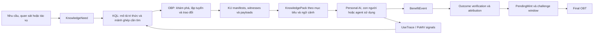
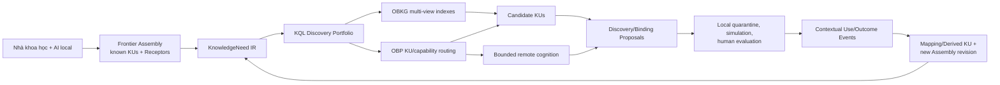
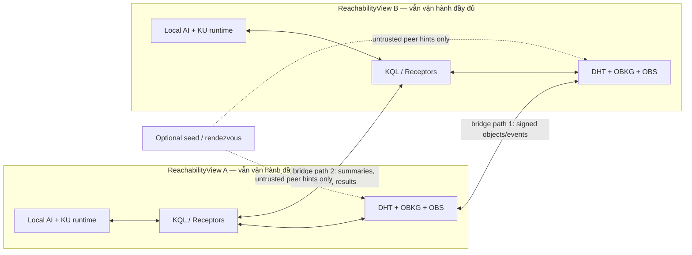

# OneBrain Research Baseline — KU v7.1

> **Loại tài liệu**: Living research baseline / context handoff
> **Phiên bản baseline**: 1.5
> **Ngày tạo**: 2026-07-19
> **Cập nhật gần nhất**: 2026-07-20
> **Phạm vi**: KU, KQL, OBP, PoMV/PoK, OBKG, OBS, AI local; OBT và BCI được giữ ngoài critical path hiện tại
> **Mục đích**: Giữ lại ngữ cảnh nghiên cứu cốt lõi để các vòng phân tích sau không diễn giải sai ý tưởng khi cửa sổ context bị rút gọn.

---

## 0. Cách sử dụng tài liệu này

Tài liệu này **không thay thế toàn bộ specification**. Nó ghi lại:

1. Những định nghĩa đã được Founder trực tiếp hiệu chỉnh.
2. Những phát hiện khi đối chiếu ý tưởng với spec và code KU v7.1.
3. Những đề xuất nghiên cứu chưa phải quyết định kiến trúc cuối cùng.
4. Các câu hỏi mở và thứ tự nghiên cứu tiếp theo.

Mọi agent hoặc contributor tiếp tục nghiên cứu OneBrain nên đọc tài liệu này trước khi đề xuất thay đổi xuyên pillar.

Kế hoạch chuyển các quyết định đã chốt thành work package, acceptance gate, migration và rollout nằm tại [OneBrain Foundation Implementation Plan — KU v7.1](ONEBRAIN_FOUNDATION_IMPLEMENTATION_PLAN_V7_1.md).

### 0.1 Nhãn mức độ thẩm quyền

| Nhãn | Ý nghĩa |
|---|---|
| **`[FOUNDER-DIRECTIVE]`** | Ý nghĩa hoặc nguyên tắc đã được Founder trực tiếp xác nhận. Không được tự ý diễn giải ngược lại. |
| **`[ARCHITECTURE-DECISION]`** | Quyết định thiết kế đã được chốt theo yêu cầu của Founder. Có tính chuẩn trong baseline hiện hành cho tới khi được thay bằng một decision record mới có migration rõ ràng. |
| **`[OBSERVED]`** | Phát hiện có thể kiểm tra trong code hoặc tài liệu hiện tại. |
| **`[PROPOSAL]`** | Phương án nghiên cứu/thiết kế được đề xuất; chưa mặc nhiên là quyết định cuối cùng. |
| **`[OPEN]`** | Câu hỏi chưa có đủ bằng chứng hoặc cần Founder quyết định. |
| **`[EXTERNAL]`** | Bài học kế thừa từ tiêu chuẩn, hệ thống production hoặc nghiên cứu bên ngoài. |

### 0.2 Quy tắc chống mất ngữ cảnh

- Không đồng nhất **KU** với kho dữ liệu để tải toàn bộ tri thức nhân loại về một AI local.
- Không đồng nhất **PoMV/usage** với lợi ích đã xảy ra.
- Không đồng nhất **OBT** với giá trị nội tại hoặc độ đúng của KU.
- Không thu nhỏ **KQL** thành một ngôn ngữ query local kiểu SQL.
- Không dùng phép ẩn dụ sinh học như bằng chứng khoa học; phải chuyển nó thành cơ chế và giả thuyết kiểm chứng được.
- Không coi unit test pass là bằng chứng cho khả năng vận hành mạng phân tán, novelty khoa học hoặc khả năng chống thao túng.
- Không coi seed server, super-peer, geographic tier hoặc một `GlobalBackbone` là authority, root hay điều kiện sống còn của mạng.
- Không coi việc một node hoặc một nhóm node bị cô lập là dấu hiệu tri thức không hợp lệ, gian lận hoặc mất quyền tham gia.
- Không diễn giải `GLOBAL`, `FULL`, `CONSENSUS`, `NOT_FOUND` hoặc “đã đồng bộ” như một phát biểu tuyệt đối nếu không kèm reachability, policy và coverage boundary.

---

## 1. Tầm nhìn và định nghĩa chuẩn

### 1.1 OneBrain

**`[FOUNDER-DIRECTIVE]`** OneBrain hướng tới một **bộ não chung phân tán của nhân loại**. Mỗi người không cần biết trước hoặc lưu toàn bộ mọi tri thức. Personal AI sẽ nhận ra nhu cầu, tìm đúng các Knowledge Unit cần thiết, ghép chúng theo ngữ cảnh và đưa tri thức/trải nghiệm đến đúng thời điểm.

OneBrain không chỉ là:

- một cơ sở dữ liệu tri thức;
- một blockchain;
- một torrent chứa tài liệu;
- một hệ RAG lớn;
- một nền kinh tế token hiện tại.

Những công nghệ trên có thể là nguồn học tập hoặc thành phần, nhưng không phải định nghĩa của OneBrain.

### 1.2 Knowledge Unit — KU

**`[FOUNDER-DIRECTIVE]`** KU là đơn vị tri thức, trải nghiệm hoặc cấu trúc nhận thức có thể lưu trữ, liên kết, chia sẻ, biến đổi và tái sử dụng trong mạng OneBrain.

Các nguyên tắc:

- **Không có KU sai.** KU không mang phán quyết đúng/sai; các KU có thể mô tả những góc nhìn, trải nghiệm, giả thuyết, mô hình hoặc quan hệ đối lập nhau.
- Một encoding attempt có thể không trung thực với tri thức nguồn; đó là lỗi mã hóa representation, không phải “KU sai”.
- Một KU có giá trị khi nó được sử dụng.
- “Được sử dụng” bao gồm sử dụng cho tác vụ, phát triển KU mới, hỗ trợ một KU khác, tạo phản chứng, chứng minh một hướng đối lập hoặc phát hiện mảnh ghép còn thiếu.
- Một người hoặc AI không cần sở hữu toàn bộ KU; KU có thể được tìm và nạp just-in-time.
- Core DNA là cảm hứng kiến trúc từ sinh học, nhưng KU phải được đánh giá bằng fidelity, interoperability, information loss, utility và chi phí thực tế.

### 1.3 Knowledge Query Language — KQL

**`[FOUNDER-DIRECTIVE]`** KQL là cơ chế tìm các KU cần thiết, các KU tương ứng và những mảnh ghép còn thiếu trong mạng OBP.

KQL không chỉ là cú pháp truy vấn kho local. Vai trò đầy đủ của KQL là:

> **Ngôn ngữ biểu đạt và điều phối nhu cầu tri thức của bộ não phân tán.**

KQL phải giúp Personal AI trả lời các câu hỏi như:

- Tôi đang thiếu điều gì để hoàn thành tác vụ?
- KU nào là prerequisite, supporting, opposing hoặc alternative?
- Các mảnh hiện có ghép được thành KnowledgePack nào?
- Phần nào vẫn chưa đủ, chưa tìm thấy hoặc chỉ mới được khảo sát trong phạm vi hạn chế?
- Khi tri thức mới xuất hiện, nhu cầu đang tồn tại nào cần được kích hoạt lại?

### 1.4 OneBrain Protocol — OBP

**`[FOUNDER-DIRECTIVE]`** OBP là giao thức vận hành mạng OneBrain và truyền tải KU/KQL. OBP không bị ràng buộc vào Internet, TCP hoặc một transport duy nhất.

OBP cần hoạt động qua nhiều môi trường:

- LAN/Internet hiện tại;
- QUIC hoặc transport tương đương;
- Bluetooth, Wi-Fi Direct, mesh;
- mạng gián đoạn và store-carry-forward;
- vệ tinh hoặc liên lạc có độ trễ lớn;
- các transport tương lai chưa tồn tại.

### 1.5 OneBrain Token — OBT

**`[FOUNDER-DIRECTIVE]`** OBT không phải giá trị của KU theo địa lý hoặc theo từng người dùng. OBT là **kết quả phần thưởng** phát sinh vì một KU đã góp phần mang lại lợi ích cho một hoặc nhiều người.

Phân biệt bắt buộc:

- **KU** mang tri thức và provenance.
- **BenefitEvent** mang ngữ cảnh của lợi ích đã xảy ra.
- **AttributionProof** mang quan hệ đóng góp giữa các KU/actor và lợi ích.
- **OBT** là kết quả phần thưởng sau khi claim được xác minh và hoàn tất.

Sau khi mint, đơn vị OBT không mang hệ số địa lý hay danh tính người hưởng lợi. Nếu OBT được phép chuyển nhượng, biến động thị trường là một bài toán khác và không được chảy ngược vào logic mint dựa trên lợi ích.

### 1.6 Personal AI và BCI

**`[FOUNDER-DIRECTIVE]`** Personal AI local là bộ não thứ hai của mỗi người: quan sát với sự cho phép, phát hiện nhu cầu, khuyến nghị chia sẻ tri thức và chủ động tìm KnowledgePack phù hợp.

Kiến trúc phải sẵn sàng cho BCI nhưng không được phụ thuộc vào giả định rằng semantic knowledge upload sẽ khả dụng trong vài năm. BCI nên được coi là một adapter I/O và consent boundary; KU/KQL/OBP phải hữu ích ngay cả khi BCI không xuất hiện.

### 1.7 Partition autonomy — mạng phân mảnh vẫn là OneBrain

**`[FOUNDER-DIRECTIVE]`** OneBrain là mạng tri thức phân tán **không có server trung tâm**. Một số seed server kiểu BitTorrent có thể tồn tại để giúp node mới tìm peer hoặc làm rendezvous/relay, nhưng seed không được là root, registry chuẩn, coordinator, nguồn finality, nơi cấp danh tính hoặc điều kiện để KU/KQL/OBP hoạt động.

Mạng có thể tạm thời bị chia thành nhiều connected component. Ví dụ, một mạng đang có hàng chục tỷ node có thể để lại một đảo chỉ còn một triệu node tiếp cận được với nhau. Đảo đó vẫn phải:

- encode và lưu tri thức mới;
- publish, khám phá, query, truyền tải và sử dụng KU trong phạm vi đang kết nối;
- kiểm tra encoding fidelity bằng những attester khả dụng mà không chờ quorum toàn mạng;
- vận hành OBKG, OBS, PoMV và năng lực AI local;
- tạo assembly, mapping, use event và phát kiến mới;
- tiếp tục hữu ích ngay cả khi chỉ còn một node.

Khi các đảo tái kết nối qua một hoặc nhiều node cầu nối, không đảo nào là “bản chính” và không có fork winner. Các object/event hợp lệ được trao đổi theo cơ chế hội tụ, idempotent và có provenance; các nhánh đồng thời được giữ lại thay vì ép thành một lịch sử tuyến tính. Nhiều bridge node chỉ mở thêm đường truyền, băng thông và khả năng chống kiểm duyệt; chúng không nhận thêm thẩm quyền tri thức.

---

## 2. Vòng chuyển hóa tri thức thống nhất



### 2.1 Ý nghĩa

- KU là vật liệu nhận thức.
- KQL mô tả nhu cầu và điều phối việc tìm/lắp vật liệu.
- OBP thực thi discovery và transport.
- KnowledgePack là assembly theo tác vụ, không phải bản sao toàn bộ tri thức về local.
- PoMV quan sát sự chuyển hóa và giúp discovery/routing.
- OBT chỉ xuất hiện sau BenefitEvent và attribution hợp lệ.

---

## 3. OBT — mô hình đã hiệu chỉnh

### 3.1 Định nghĩa nghiên cứu

**`[PROPOSAL]`** Định nghĩa kỹ thuật phù hợp nhất với Founder directive:

> OBT là đơn vị phần thưởng có thể chuyển nhượng, được giao thức phát hành sau khi một lợi ích đã xảy ra nhờ việc sử dụng một hay nhiều KU, RewardClaim tương ứng đã được xác minh, công trạng đã được phân bổ và thời gian khiếu nại đã hoàn tất.

OBT:

- không đo tính đúng/sai của KU;
- không đo “giá trị nội tại” của KU;
- không được mint chỉ vì KU đã được encode, verify, store, query hoặc đọc;
- có thể được mint nhiều lần từ các BenefitEvent độc lập do cùng KU tạo ra theo thời gian;
- phải chống replay một outcome thành nhiều claim giả.

### 3.2 Các loại lợi ích

BenefitEvent có thể thuộc nhiều lớp:

| Loại | Ví dụ |
|---|---|
| Applied outcome | Sửa được thiết bị; test phần mềm pass; hoàn thành một quy trình. |
| Learning outcome | Hiểu được khái niệm hoặc cải thiện kết quả đánh giá sau học. |
| Generative outcome | Tạo KU mới, giải pháp mới hoặc phát minh mới từ KU hiện có. |
| Evidentiary outcome | Hỗ trợ, refute, qualify hoặc chứng minh giới hạn của KU khác. |
| Assembly outcome | Hoàn thành một KnowledgePack hoặc prerequisite còn thiếu. |
| Discovery outcome | Phát hiện gap, bridge, contradiction hoặc dead end có ích. |
| Experiential outcome | Truyền tải trải nghiệm tạo ra tác động được người nhận xác nhận. |

Không loại nào tự động trở thành chân lý. Evidence tier và confidence xác định mức có thể thưởng, không xác định một phát biểu đúng vĩnh viễn.

### 3.3 Pipeline bằng chứng

```text
UseTrace
  ↓
BenefitEvent
  ↓
RewardClaim
  ↓
ProofOfOutcome
  ↓
Causal / Contribution Evaluation
  ↓
KU Attribution + Actor Attribution
  ↓
PendingMint
  ↓ challenge / audit / finality
Final MintProof → OBT
```

Cần tách bốn tầng:

1. **ProofOfUse** — KU thực sự được đưa vào tác vụ.
2. **ProofOfOutcome** — kết quả hoặc thay đổi thực tế đã xảy ra.
3. **CausalEvaluation** — ước lượng KU hoặc tập KU đã đóng góp thế nào so với baseline/counterfactual.
4. **RewardAuthorization** — áp dụng policy, attribution, anti-replay và finality để mint.

Chữ ký hoặc witness chỉ xác nhận nguồn và integrity của claim; chúng không tự biến claim thành sự thật.

### 3.4 Công thức khái niệm

**`[PROPOSAL]`**

```text
BenefitBudget =
    Base(task_class, reward_policy_version)
  × NormalizedOutcomeGain
  × EvidenceConfidence
  × CausalConfidence
  × IndependenceFactor
  × ExternalityFactor

OBT_i = BenefitBudget × AttributionShare_i
Σ AttributionShare_i ≤ 1
```

Không sử dụng lương địa phương, fiat, sức mua hoặc vị trí địa lý làm biến số. Cùng task class, outcome, evidence và policy phải tạo cùng reward dù sự kiện xảy ra ở đâu.

**`[PROPOSAL]`** `1 OBT` nên được mô tả là một `reward quantum` theo `RewardPolicyVersion`, không phải “một đơn vị tri thức” tương đương đơn vị vật lý như kWh.

### 3.5 R1–R4 cần đổi vai trò

**`[OBSERVED]`** Đặc tả hiện tại coi R1 owner, R2 encoder, R3 verifier và R4 storage là bốn nguồn reward độc lập. R2/R3/R4 có thể mint trước khi có BenefitEvent:

- [OBT overview](../specs/obt/01_OVERVIEW.md)
- [OBT minting](../specs/obt/03_MINTING.md)
- [Current OBT state](../specs/OBT_CURRENT_STATE.md)

**`[PROPOSAL]`** Chuyển R1–R4 thành các vai trò nhận phân bổ từ cùng một BenefitBudget:

- KU creator và lineage contributors;
- encoder;
- verifier/corrector;
- storage/delivery node thực sự phục vụ lần sử dụng;
- assembler/query contribution nếu chứng minh được đóng góp;
- evaluator/auditor nếu cơ chế cần.

Encode, verify và store trước khi có lợi ích chỉ sinh `ContributionReceipt`. Receipt chỉ vest thành OBT khi BenefitEvent được final.

### 3.6 Vai trò mới của PoMV

**`[OBSERVED]`** PoMV hiện tổng hợp metabolism, prediction, entropy, survival, synaptic và niche fitness rồi chuyển trực tiếp thành reward. Usage, query hit, citation và derivative là dấu hiệu hoạt động, chưa phải bằng chứng lợi ích.

**`[PROPOSAL]`** PoMV nên phục vụ:

- discovery và ranking;
- routing/replication heuristics;
- phát hiện long-tail, novelty và bridge;
- tạo UseTrace;
- cung cấp một tín hiệu đầu vào cho RewardClaim.

PoMV không nên là mint authority độc lập.

### 3.7 BenefitEvent tối thiểu

**`[PROPOSAL]`**

```text
event_id / scoped_nullifier
beneficiary_set_commitment
task_class
reward_policy_version + policy_hash
pre_state_commitment
post_state_commitment
normalized_outcome_delta
KU execution_trace_root
KU dependency_DAG_root
evidence_root
externality / safety flags
event_window
privacy_profile
attestations
```

Raw evidence nên mặc định ở local hoặc encrypted storage. Mạng công khai chỉ nhận commitment và disclosure tối thiểu cần thiết.

### 3.8 Các invariant OBT

1. Không có BenefitEvent được chấp nhận thì không mint.
2. Usage hoặc tương quan không đủ để kết luận đóng góp.
3. Tổng attribution không vượt BenefitBudget.
4. Không owner hoặc beneficiary đơn lẻ nào được tự chứng nhận reward.
5. Một outcome không được replay, chia nhỏ hoặc claim lặp.
6. Context-before-mint, fungibility-after-mint.
7. Bằng chứng yếu vẫn có thể được ghi nhận nhưng có reward cap thấp.
8. Privacy by default.
9. Mọi reward phải tái tính được theo policy hash/version.
10. Chỉ OBT đã final mới có tính bất khả thu hồi.

### 3.9 Các mâu thuẫn cần nghiên cứu lại trong OBT spec hiện tại

**`[OBSERVED]`**

- Spec mô tả OBT như “measure of knowledge work/value” và so sánh với kWh; điều này không còn phù hợp với Founder directive.
- Global emission hiện dựa trên active node count và average PoMV, tức đo hoạt động mạng nhiều hơn lợi ích đã xảy ra.
- `MintProof` hiện chứng minh epoch, CID, reward calculation và witness signatures; chưa chứa ProofOfOutcome hoặc causal attribution.
- “No retroactive minting” xung đột với lợi ích xuất hiện muộn.
- R2/R3/R4 mint khi công việc kỹ thuật hoàn thành, chưa đợi outcome.
- OBT đã earn không clawback; vì vậy phải có PendingMint và challenge window trước finality.
- Witness selection từ hash có thể bị grinding nếu attacker thử nhiều CID.
- Fixed quorum K=3–7 không đủ cơ sở cho claim có giá trị khác nhau hoặc attacker có nhiều Sybil.
- Account-chain là cấu trúc ledger; tự nó không giải quyết consensus/finality khi partition hoặc double-spend.

### 3.10 Mô phỏng tối thiểu trước OBT có giá trị trao đổi

- Một triệu query/citation nhưng không có outcome: mint phải bằng 0.
- Một KU hiếm giải quyết tác vụ so với một KU phổ biến nhưng không hữu ích.
- DAG có ground-truth contribution: so sánh equal split, last-touch, ablation và approximate Shapley.
- Sybil beneficiary, collusion ring và related-party graph.
- Witness grinding và commit-then-random-beacon.
- Claim splitting/replay qua network partition.
- Benefit xuất hiện muộn.
- Fraud phát hiện trong challenge window và sau finality.
- Cùng BenefitEvent ở hai khu vực tạo cùng OBT.
- Đo privacy leakage so với khả năng verification/dedup.

---

## 4. KQL — từ local query đến cognitive coordination

### 4.1 Trạng thái hiện tại

**`[OBSERVED]`** KQL v4.1 / KU v7.1 đã có:

- parser và typed AST;
- `FIND`, `CREATE`, `UPDATE`, `DEPRECATE`, `WATCH`, `EXPLAIN`;
- local executor;
- persistent storage;
- graph structures và edge patterns;
- scope vocabulary;
- các primitive distributed query trong `ku-net`: router, merger, cache, learning, watch và discovery engines.

Nguồn:

- [KQL specification](../specs/KQL_SPEC.md)
- [Distributed query paper](../paper/kql/05_distributed_query.md)
- [`ku-net/query`](../../src/ku-net/src/query)

### 4.2 Khoảng cách implementation

**`[OBSERVED]`**

- `OneBrainNode::execute_kql()` vẫn tải KU local rồi chạy `LocalExecutor`.
- `QueryRouter` trả quyết định route nhưng chưa điều phối remote send/execute/partial-result/timeout/replan end-to-end.
- Distributed components hiện chủ yếu được dùng trong unit/integration tests, chưa nối hoàn chỉnh vào runtime/transport.
- Edge patterns được parse nhưng executor chưa có graph pattern/path semantics đầy đủ.
- WATCH chưa có push lifecycle hoàn chỉnh.
- `GLOBAL` đang được mô tả như flood; cách này không thể mở rộng đến mạng toàn cầu.

Vì vậy, cách mô tả chính xác là:

> **Distributed-query primitives đã tồn tại và được test; distributed KQL end-to-end chưa hoàn thành.**

### 4.3 Các lỗi/gap kỹ thuật quan trọng

**`[OBSERVED]`**

1. Query wire/index đang dùng `u64 ConceptId`, nhưng ConceptId là local. OBP phải dùng CCID/CID toàn cục.
2. `QueryForward` gửi raw KQL, concept hints và visited list; thiếu canonical AST/version, nonce, signature, deadline, byte/work budget, capability, continuation và coverage.
3. Result merger deduplicate bằng concept IDs + gene type thay vì `ku.cid`; hai KU khác nhau có thể bị nhập nhầm.
4. Replica/replay có thể làm tăng `source_count` nếu không định danh responder độc lập.
5. `has_enough()` dừng theo count, không chứng minh distributed top-k đã hoàn tất.
6. Personal AI/GraphAgent sinh query chưa được schema-grounded đầy đủ; cần compiler + validation + repair.
7. Trong open network, “không tìm thấy”, COUNT hoặc NOT EXISTS không có ý nghĩa tuyệt đối nếu thiếu completeness boundary.

Code cần đối chiếu:

- [`OneBrainNode::execute_kql`](../../src/onebrain-node/src/node.rs)
- [`QueryRouter`](../../src/ku-net/src/query/router.rs)
- [`QueryForwardMsg`](../../src/ku-net/src/query/messages.rs)
- [`ResultMerger`](../../src/ku-net/src/query/merger.rs)
- [`GraphAgent`](../../src/ku-mediator/src/graph_agent.rs)

### 4.4 Kiến trúc KQL vNext đề xuất

**`[PROPOSAL]`** Tách năm tầng:

1. **Need Compiler** — Personal AI chuyển mục tiêu và ngữ cảnh thành `KnowledgeNeed` có kiểu.
2. **Semantic KQL AST** — mô tả tri thức cần gì, độc lập topology và transport.
3. **Planner IR** — phân rã pattern/join/path, chọn nguồn, chi phí và ngân sách.
4. **OBP Query Protocol** — Interest/Subquery/Partial/Progress/Done/Cancel.
5. **Verifier & Assembler** — kiểm CID/witness, lắp KnowledgePack, phát hiện slot thiếu và truy vấn tiếp.

### 4.5 Query families cần trở thành first-class

| Family | Vai trò |
|---|---|
| Exact lookup | Tìm đúng CID/CCID hoặc artifact cụ thể. |
| Dependency closure | Tìm prerequisite và toàn bộ tập phụ thuộc cần thiết. |
| Perspective search | Supporting, opposing, alternative, analogy, qualification. |
| Gap discovery | Missing member, unknown link, weak evidence, chưa đủ prerequisite. |
| Graph/path | Multi-hop path và path witness. |
| Semantic/ANN | Approximate search có model/version/error metadata. |
| Hybrid | Kết hợp graph constraints và semantic similarity. |
| KnowledgePack assembly | Lắp tập KU tối thiểu đủ dùng cho goal. |
| Standing need | WATCH bằng lease, renewal và privacy policy. |

### 4.6 Cú pháp nghiên cứu minh họa

**`[PROPOSAL]`** Cú pháp dưới đây chỉ là sketch để thảo luận semantics:

```kql
FIND PACK p FOR GOAL $goal
  ANCHOR CCID("...")
  INCLUDE DEPENDENCIES DEPTH 4
  INCLUDE PERSPECTIVES SUPPORTING, OPPOSING, ALTERNATIVE
  COMPLETE REQUIRED MEMBERS
  SCOPE AUTO
  BUDGET LATENCY 2s, BYTES 2MiB, HOPS 8, WORK 50000
  UNTIL SATISFACTION >= 0.90
  STREAM PARTIAL EVERY 200ms
  RETURN p, WITNESS, PROVENANCE, COVERAGE, GAPS
```

### 4.7 Wire objects tối thiểu

**`[PROPOSAL]`**

- `QueryInterest`: random query ID, canonical AST digest, nonce, expiry, CID/CCID anchors, budget, privacy/access capability.
- `SourceOffer`: partitions/relations được hỗ trợ, summary epoch, cardinality/error bounds và load.
- `SubqueryRequest`: plan fragment, bindings, work slice và continuation.
- `PartialResult`: CID manifest, bindings/path witness, source signature, score vector và unseen upper bound.
- `QueryProgress`: phần đã khảo sát, budget còn lại và warning.
- `QueryDone`: `SATISFIED`, `EXHAUSTED_RELATIVE`, `BUDGET`, `DEADLINE`, `CANCELLED`, `ERROR` cùng coverage statement.

KQL query plane nên trả manifest/CID. Fetch KU bytes và media payload thực hiện riêng bằng OBP/OBS content transfer plane.

### 4.8 Routing semantics

**`[PROPOSAL]`** Không dùng escalation cố định như một truth semantics:

```text
LOCAL → NEIGHBORS → CLUSTER → DHT → SEMANTIC → GLOBAL
```

Planner nên:

- resolve local IDs thành CCID;
- phân loại exact/approximate và monotone/non-monotone;
- chia query thành atom/subplan;
- chọn nguồn bằng CID providers, CCID/relation summaries và statistics;
- stream partial results;
- adaptive replan khi peer chậm, mất hoặc partition;
- dùng continuation/time slice;
- chỉ kết luận exact top-k khi có threshold proof;
- nếu approximate phải báo epsilon/confidence;
- lắp pack rồi tạo query tiếp cho các slot còn thiếu.

### 4.9 KQL invariants

1. Mọi KU nhận được phải hash đúng CID.
2. OBP chỉ dùng CID/CCID toàn cục trên wire.
3. Exact binding/path phải có witness để kiểm tra local.
4. Nhiều replica của cùng CID không làm tăng corroboration.
5. Query luôn có deadline, hop/depth, byte và work budget.
6. Forwarding không được tăng quyền hoặc ngân sách.
7. Không kết luận “không tồn tại” nếu thiếu completeness boundary.
8. Network proximity là cost signal, không phải epistemic authority.
9. Remote KQL mặc định read-only; mutation phải đi qua giao thức ký riêng.
10. Retrieval không trực tiếp sinh OBT.
11. Query intent là dữ liệu nhạy cảm; phải có privacy profile và intent minimization.

### 4.10 KQL — phần kế thừa và phần có thể phát minh

**`[EXTERNAL]`** Kế thừa:

- federation/failure semantics từ SPARQL;
- property graph và path semantics từ GQL;
- logical/physical plan separation từ distributed databases;
- partial/anytime results và online query processing;
- Interest/Data, content naming và caching từ NDN;
- store-carry-forward từ DTN/Bundle Protocol;
- provenance từ PROV-O;
- threshold algorithms cho top-k;
- completeness statements cho open-world querying.

**`[PROPOSAL]`** Phần OneBrain có thể là phát minh thật:

> Semantic Interest cho một khoảng trống nhận thức chưa biết CID, được tìm trên mạng mở rồi tự lắp thành KnowledgePack có provenance, perspective, coverage và gaps.

---

## 5. Các hiệu chỉnh xuyên pillar KU v7.1

### 5.1 Tách các miền identity

**`[PROPOSAL]`**

| Identity | Định danh cái gì? |
|---|---|
| `ArtifactCID` | Đúng chuỗi CoreDna/wire bytes. |
| `ClaimID` | Một claim, trải nghiệm hoặc mệnh đề có ngữ cảnh. |
| `CCID` | Khái niệm. |
| `LineageID` | Phiên bản, diễn giải, dịch, dẫn xuất hoặc ancestry. |

CID giống nhau chứng minh cùng artifact; nó không chứng minh hai artifact khác nhau có cùng nghĩa. CCID cũng không nên ép mọi cộng đồng phải dùng một identity nếu chỉ có `closeMatch` hoặc `broaderMatch`.

### 5.2 Encoding consensus không phải truth consensus

**`[OBSERVED]`** Similarity giữa concept/opcode và số verifier chủ yếu đo agreement/fidelity của encoding. Nhiều verifier dùng cùng model, prompt hoặc registry không độc lập.

**`[PROPOSAL]`** `FULL` nên mang nghĩa:

> Encoding đã được đủ tác nhân đánh giá về fidelity theo policy hiện tại.

Nó không nên mang nghĩa canonical, duy nhất hoặc đúng. Nên giữ các encoding variant hợp lệ và liên kết equivalence/derivation. Raw source/provenance không nên bị xóa chỉ vì encoding đạt FULL, đặc biệt trong Personal AI chứa dữ liệu nhạy cảm.

Nguồn nội bộ: [Encoding consensus spec](../specs/ENCODING_CONSENSUS_SPEC.md).

### 5.3 Không trộn value với các metadata khác

**`[FOUNDER-DIRECTIVE]`** Giá trị của KU chỉ được hiện thực hóa khi KU được sử dụng. Evidence, popularity, credibility, novelty hoặc encoding fidelity không tự tạo thành giá trị của KU.

**`[PROPOSAL]`** Tách `RealizedValue` khỏi metadata dùng để tìm và diễn giải KU:

```text
RealizedValue(KU | context, task, time, observer) = aggregate {
  applied_use,
  derivation_use,
  composition_use,
  teaching_or_transfer_use,
  comparison_use,
  refutation_or_opposition_use,
  discovery_use
}

SelectionMetadata = {
  encoding_fidelity,
  provenance,
  context_match,
  relation_paths,
  novelty_or_exploration_priority,
  action_risk
}
```

Refutation là một mode sử dụng nên có thể tạo realized value. Popularity chỉ là distribution của usage, không phải truth hay fidelity. KU chưa có UseEvent chưa tạo realized value quan sát được, nhưng vẫn phải được bảo tồn và có cơ hội discovery.

### 5.4 Goodhart feedback loop

**`[OBSERVED]`** Vòng phản hồi nguy hiểm:

```text
KU được dùng nhiều
→ được route/replicate nhiều
→ càng dễ được dùng
→ PoMV cao
→ reward cao
→ động lực tạo usage giả hoặc giữ độc quyền attention
```

**`[PROPOSAL]`** Cần:

- exploration quota cho long-tail;
- holdout signals;
- causal credit thay vì usage count;
- delayed settlement;
- diversity/correlation adjustment;
- ablation không có OBT;
- Sybil/collusion simulator;
- giới hạn ảnh hưởng của popularity lên epistemic ranking.

### 5.5 Quality gate xung đột với atomic KU

**`[OBSERVED]`** KU được mô tả là atomic và compact, nhưng một số OBT quality gate yêu cầu raw size tối thiểu, nhiều genes, encoding time tối thiểu hoặc bond sẵn có. Điều này có thể phạt insight ngắn, KU mới và tri thức hiếm.

Quality gate phải dựa trên integrity, outcome và anti-spam evidence, không thưởng độ dài hoặc độ chậm của computation.

### 5.6 Maturity reporting

**`[PROPOSAL]`** Không dùng một phần trăm chung như “82% implemented” để suy ra dự án gần hoàn thành. Dùng ladder theo từng claim:

```text
VISION
→ PRIOR-ART-MAPPED
→ SPECIFIED
→ IMPLEMENTED
→ WIRED-LOCAL
→ SIMULATED-DISTRIBUTED
→ LIVE-MULTI-NODE
→ BENCHMARKED
→ ADVERSARIAL
→ EXTERNALLY-REPLICATED
```

---

## 6. OBP và lớp mạng

### 6.1 Nguyên tắc

**`[FOUNDER-DIRECTIVE]`** OBP không được thiết kế như một ứng dụng phụ thuộc TCP/IP. Logical protocol objects phải độc lập transport.

### 6.2 Tách query plane và content plane

**`[PROPOSAL]`**

- **Query plane**: KnowledgeNeed, offers, manifests, paths, provenance, progress và coverage.
- **Content plane**: KU bytes, media chunks, erasure-coded fragments, retry và cache.

Query response không nên luôn mang toàn bộ KU payload. Nó chọn CIDs/manifests trước, sau đó content plane tải đúng dữ liệu cần thiết.

### 6.3 Các primitive nên học trước

- Content addressing và Merkle manifests.
- Kademlia/DHT cho exact provider lookup.
- NDN/CCN cho receiver-driven content interests.
- BPv7/DTN cho store-carry-forward và mạng gián đoạn.
- QUIC cho transport Internet hiện tại.
- CRDT cho dữ liệu hội tụ được mà không phá invariant.
- Explicit coordination/escrow/consensus cho invariant không I-confluent như balance và double-spend.
- Gossip/SWIM cho membership và propagation, không dùng như bằng chứng chân lý.

---

## 7. Personal AI, quyền riêng tư và BCI

### 7.1 Personal AI là mediator

Personal AI nên:

- quan sát theo consent policy;
- giữ raw context local khi có thể;
- chuyển intent thành typed KnowledgeNeed;
- chỉ tiết lộ query hints tối thiểu ra mạng;
- xác minh KU/provenance trước khi dùng;
- ghi UseTrace có kiểm soát;
- phát hiện khi nào nên đề nghị người dùng chia sẻ KU;
- không tự upload trải nghiệm nhạy cảm nếu chưa có consent rõ ràng.

### 7.2 Query privacy

Query intent có thể tiết lộ bệnh lý, nghề nghiệp, vị trí, kế hoạch hoặc trạng thái nhận thức. KQL/OBP cần:

- privacy profile;
- local query decomposition;
- selective disclosure;
- scoped identifiers/nullifiers;
- encrypted/private scopes;
- unlinkability nơi phù hợp;
- retention và deletion policy cho raw evidence.

### 7.3 BCI readiness

**`[OBSERVED]`** Nghiên cứu BCI hiện đại đã có tiến bộ mạnh về speech decoding, motor control, sensory feedback và task-specific memory facilitation. Chưa có bằng chứng cho việc nạp tùy ý một semantic KnowledgePack vào não như ghi file.

**`[PROPOSAL]`** Thiết kế BCI adapter theo các giai đoạn:

1. Intent input và communication restoration.
2. Sensory feedback có codec chuyên biệt.
3. Personalized neural representations.
4. Chỉ mở rộng sang semantic-assimilation khi có bằng chứng thực nghiệm và safety model.

BCI không được bỏ qua consent, cognitive liberty, authentication, integrity hoặc khả năng thu hồi quyền truy cập.

---

## 8. Quy trình “Learn First → Adapt → Invent → Validate”

### 8.1 Bốn trạng thái bắt buộc

| Trạng thái | Điều kiện |
|---|---|
| `ADOPT` | Tiêu chuẩn/thuật toán hiện có giải quyết đủ tốt và assumptions phù hợp. |
| `ADAPT` | Cần điều chỉnh hoặc kết hợp cho OneBrain nhưng core mechanism đã tồn tại. |
| `INVENT-HYPOTHESIS` | Prior art không giải quyết gap; có giả thuyết mới, baseline và tiêu chí bác bỏ. |
| `UNKNOWN` | Chưa đủ nghiên cứu hoặc bằng chứng để quyết định. |

### 8.2 Quy trình cho mỗi cơ chế

1. **Research Question Card** — claim, use case, beneficiary, invariants, threat model và falsification condition.
2. **Prior-art matrix** — tiêu chuẩn → production systems → primary papers → negative results.
3. **State decision** — ADOPT, ADAPT, INVENT-HYPOTHESIS hoặc UNKNOWN.
4. **Hypothesis specification** — interface, semantics, privacy, abuse cases, failure modes, cost và compatibility.
5. **Baseline-first prototype** — chạy baseline chuẩn trước khi kết luận cơ chế OneBrain tốt hơn.
6. **Preregister evaluation** — dataset, metrics, hardware, seeds, attacker budget và pass/fail threshold.
7. **Vertical slice** — thử xuyên KU → KQL → OBP → UseTrace → BenefitEvent → shadow OBT.
8. **Adversarial test** — partition, Sybil, collusion, correlated AI, replay và privacy leakage.
9. **Evidence gate** — chỉ nâng maturity khi có artifact chứng minh.

### 8.3 Phân loại hiện tại

| Nhóm | Ví dụ |
|---|---|
| `ADOPT` | Content addressing, deterministic encoding, CBOR, CRDT primitives, SPARQL/GQL semantics, Kademlia, QUIC, BPv7, PROV. |
| `ADAPT` | Core–Epigenetics–Expression, KQL profile cho KU, OBP semantic routing, PoMV signals, account-chain integration. |
| `INVENT-HYPOTHESIS` | Micro-KU truyền tri thức liên model/ngôn ngữ; cognitive addressing; KnowledgePack assembly; benefit-derived OBT; utility-aware routing. |
| `UNKNOWN` | Trọng số PoMV, verifier threshold, registry coverage, encoding fidelity, OBT stability/finality và hiệu năng mạng cực lớn. |

---

## 9. Research roadmap ưu tiên

### P0 — Khóa semantics và invariants

1. Chuẩn hóa glossary KU/KQL/OBP/PoMV/BenefitEvent/OBT.
2. Tách ArtifactCID, ClaimID, CCID và LineageID.
3. Định nghĩa open-world, perspective và completeness semantics.
4. Xác định OBT benefit-contingent issuance và RewardPolicyVersion.

### P1 — KQL vNext foundation

1. `KnowledgeNeed` typed schema.
2. Canonical KQL AST và protocol versioning.
3. CID/CCID-only network identifiers.
4. Sửa result merger dùng CID và responder identity.
5. Partial result, continuation, progress và coverage contracts.
6. KnowledgePack assembler và gap-driven iterative query.
7. Nối coordinator end-to-end với OBP transport.

### P2 — Benefit-to-Reward shadow protocol

1. `UseTrace`.
2. `BenefitEvent`.
3. `ContributionReceipt`.
4. `RewardClaim` và evidence tiers.
5. Attribution DAG và approximate contribution allocation.
6. PendingMint, random audit, challenge và finality.
7. Shadow ledger không có giá trị trao đổi.

### P3 — Vertical slice

Chọn một domain có outcome máy kiểm chứng được:

- sửa test phần mềm;
- sửa thiết bị và sensor trở về trạng thái mong muốn;
- hoàn thành bài học có pre/post assessment.

Luồng thử nghiệm:

```text
Tác vụ thật
→ Personal AI tạo KnowledgeNeed
→ KQL tìm và lắp KU qua nhiều node
→ KnowledgePack được sử dụng
→ Outcome được đo
→ Attribution được tính
→ Shadow OBT được ghi
```

### P4 — Benchmark và simulator

1. Encoding benchmark 10.000 mẫu, nhiều domain/ngôn ngữ/model.
2. So KU với nanopublication/RDF canonicalization/deterministic CBOR.
3. Simulator 1.000–10.000 node với churn, partition và Sybil.
4. Đo useful-answer recall, long-tail survival, reward concentration, manipulation ROI và privacy leakage.
5. Ablation từng PoMV signal và toàn bộ OBT.

---

## 10. Câu hỏi mở cần giữ lại

### OBT

- Một reward quantum được chuẩn hóa giữa các task class như thế nào mà không quay lại giá fiat/labor?
- Chủ thể nào xác minh BenefitEvent trong domain chủ quan?
- Có reward cho preservation trước khi có người dùng không, hay chỉ tạo ContributionReceipt?
- Account-chain finality hoạt động thế nào khi partition?
- OBT có utility/sink nào nếu knowledge vẫn miễn phí?
- Khi nào một final mint có thể bị vô hiệu vì fraud proof?

### KQL

- KnowledgeNeed schema biểu đạt goal, recipient capability và missing slots như thế nào?
- `SATISFACTION` là một scalar hay vector theo goal?
- Completeness statement được tạo từ source summaries ra sao?
- Query privacy được bảo vệ thế nào khi semantic hints cần cho routing?
- Standing query được phân phối và thu hồi thế nào trong mạng gián đoạn?
- Discovery output là KU hypothesis, suggestion object hay query artifact?

### KU/Encoding

- Semantic equivalence giữa các CoreDna được đo và giải thích thế nào?
- Raw source được giữ, mã hóa hoặc garbage-collect theo policy nào?
- Correlated encoders/verifiers được phát hiện thế nào?
- Definition KU và CCID registry giải quyết ambiguity/cultural perspectives ra sao?

### OBP

- Content/relation summaries nào đủ hữu ích nhưng không lộ knowledge inventory?
- Query plan có thể chạy qua store-carry-forward và delay-tolerant links như thế nào?
- Global discovery dừng theo budget, probability hay coverage proof?

### BCI

- Neural codec nào chỉ là sensory/motor và codec nào thực sự liên quan semantic memory?
- Làm sao chứng minh consent, integrity và reversibility của neural writes?

---

## 11. Nguồn nội bộ quan trọng

### KU v7.1

- [KU Architecture](../specs/KU_ARCHITECTURE.md)
- [KU Core DNA Specification](../specs/KU_CORE_DNA_SPEC.md)
- [KU Encoding Pipeline](../specs/KU_ENCODING_PIPELINE.md)
- [Encoding Consensus](../specs/ENCODING_CONSENSUS_SPEC.md)
- [PoK/PoMV v2 Specification](../specs/POK_V2_SPECIFICATION.md)

### KQL/OBP

- [KQL Specification](../specs/KQL_SPEC.md)
- [KQL Distributed Query](../paper/kql/05_distributed_query.md)
- [KQL Discussion and Limitations](../paper/kql/07_conclusion.md)
- [OBP Specification](../specs/OBP_SPEC.md)

### OBT

- [OBT Overview](../specs/obt/01_OVERVIEW.md)
- [OBT Minting](../specs/obt/03_MINTING.md)
- [OBT Trust and Security](../specs/obt/07_TRUST_SECURITY.md)
- [OBT Penalty](../specs/obt/08_PENALTY.md)
- [OBT Current State](../specs/OBT_CURRENT_STATE.md)
- [OBT Research Synthesis](obt/obt_research_synthesis.md)

### Cross-pillar

- [OneBrain Documentation Index](../README.md)
- [AI Layer Synthesis](ai_layer/06_ku_ai_architecture_synthesis.md)
- [Personal AI Mediator Design](ai_layer/05_personal_ai_mediator_design.md)
- [Knowledge Graph Cross-pillar Integration](knowledge_graph/09_obkg_cross_pillar_integration.md)

---

## 12. Nguồn bên ngoài cần đưa vào prior-art matrix

### Knowledge/provenance/identity

- [W3C PROV-O](https://www.w3.org/TR/prov-o/)
- [RDF Dataset Canonicalization 1.0](https://www.w3.org/TR/rdf-canon/)
- [SKOS Reference](https://www.w3.org/TR/skos-reference/)
- [Nanopublications](https://nanopub.net/)
- [RFC 8949 — CBOR](https://www.rfc-editor.org/info/rfc8949/)
- [RFC 6920 — Named Information Hashes](https://datatracker.ietf.org/doc/rfc6920/)

### Query/distributed systems

- [SPARQL Federated Query](https://www.w3.org/TR/sparql12-federated-query/)
- [ISO/IEC 39075:2024 — GQL](https://www.iso.org/standard/76120.html)
- [Triple Pattern Fragments](https://linkeddatafragments.org/publications/jws2016.pdf)
- [CALM theorem](https://arxiv.org/abs/1901.01930)
- [FedQPL](https://arxiv.org/abs/2010.01190)
- [SaGe](https://arxiv.org/abs/1902.04790)
- [Completeness Statements](https://arxiv.org/abs/1408.6395)
- [Partial Results for Online Query Processing](https://research.ibm.com/publications/partial-results-for-online-query-processing)

### Networking

- [Named Data Networking architecture paper](https://named-data.net/wp-content/uploads/2014/10/named_data_networking_ccr.pdf)
- [RFC 8569 — Bundle Protocol terminology](https://www.rfc-editor.org/rfc/rfc8569.html)
- [RFC 9171 — Bundle Protocol v7](https://www.rfc-editor.org/info/rfc9171/)
- [CRDT foundations](https://people.eecs.berkeley.edu/~kubitron/courses/cs262a-F19/handouts/papers/Shapiro-CRDT.pdf)
- [Invariant Confluence](https://arxiv.org/abs/1402.2237)

### Benefit, attribution và anti-gaming

- [Data Shapley](https://proceedings.mlr.press/v97/ghorbani19c.html)
- [Hypercerts whitepaper](https://www.hypercerts.org/assets/files/hypercerts_whitepaper_v0-3e54f05fe1358373c4f32610dd4fb391.pdf)
- [Bayesian Truth Serum](https://pubmed.ncbi.nlm.nih.gov/15486294/)
- [Peer Prediction](https://pubsonline.informs.org/doi/pdf/10.1287/mnsc.1050.0379)
- [The Sybil Attack](https://www.microsoft.com/en-us/research/publication/the-sybil-attack/)
- [EigenTrust](https://nlp.stanford.edu/pubs/eigentrust.pdf)
- [W3C Verifiable Credentials 2.0](https://www.w3.org/TR/vc-data-model/)
- [IETF RATS Architecture — RFC 9334](https://www.rfc-editor.org/rfc/rfc9334.html)

### BCI reality check

- [An instantaneous voice-synthesis neuroprosthesis — Nature 2025](https://www.nature.com/articles/s41586-025-09127-3)
- [A streaming brain-to-voice neuroprosthesis — Nature Neuroscience 2025](https://www.nature.com/articles/s41593-025-01905-6)
- [Developing a hippocampal neural prosthetic](https://pubmed.ncbi.nlm.nih.gov/29589592/)

---

## 13. Checklist phục hồi context cho agent tương lai

Trước khi tiếp tục nghiên cứu, agent phải có thể trả lời đúng các câu sau:

1. OneBrain có nhằm tải toàn bộ tri thức về mỗi local AI không? **Không.**
2. KQL có chỉ là local SQL-like query language không? **Không.**
3. “Không tìm thấy” trên mạng mở có phải là “không tồn tại” không? **Không, trừ khi có completeness boundary.**
4. Một KU bị refute có thể tạo giá trị không? **Có.**
5. Usage/PoMV có tự chứng minh BenefitEvent không? **Không.**
6. Encode, verify hoặc storage có tự động tạo OBT không? **Không theo Founder directive đã hiệu chỉnh.**
7. Context của lợi ích nằm trong OBT token không? **Không; nằm trong BenefitEvent/AttributionProof.**
8. CID có phải semantic identity không? **Không; CID định danh artifact bytes.**
9. Encoding consensus có phải truth consensus không? **Không.**
10. BCI semantic upload có phải assumption nền tảng hiện tại không? **Không.**
11. Các đề xuất trong tài liệu này đã là spec cuối cùng chưa? **Chưa; Founder directives và Architecture Decisions mới là baseline có thẩm quyền. Các mục `[PROPOSAL]` vẫn phải qua decision/migration riêng.**
12. Có “KU sai” không? **Không; chỉ có encoding attempt không trung thực với tri thức nguồn hoặc KU chưa được sử dụng trong một context.**
13. Encoding verification có được đánh giá nội dung theo đồng thuận hiện tại, popularity hoặc PoMV không? **Không; chỉ kiểm fidelity của phép mã hóa.**
14. KU chưa được sử dụng có bị loại hoặc xem là kém không? **Không; nó chưa tạo realized value quan sát được và vẫn phải có cơ hội discovery trong tương lai.**
15. “Tri thức dở dang” có nghĩa KU được phép encode dở dang hoặc mất cấu trúc không? **Không; KU phải encode đầy đủ phần tri thức thực có. Sự dở dang nằm ở assembly có các vị trí còn mở.**
16. Một knowledge gap có phải sự thiếu hụt tuyệt đối của toàn bộ nhân loại không? **Không; nó là một role/constraint chưa được bind trong một goal/assembly/version cụ thể.**
17. Một cross-domain mapping do AI phát hiện có chứng minh các KU nguồn đúng không? **Không; mapping là một candidate KU có correspondence, giả định và phạm vi sử dụng riêng.**
18. Chia sẻ năng lực AI local có đồng nghĩa chia sẻ model weights hoặc private context không? **Không; mặc định là quảng bá capability có giới hạn và thực thi task typed trong policy/sandbox.**
19. OneBrain có cần seed server, super-peer cấp cao hoặc `GlobalBackbone` để tiếp tục hoạt động không? **Không; chúng chỉ có thể là peer hint, carrier hoặc capability tối ưu hóa tùy chọn.**
20. Một connected component bị cô lập có phải là mạng lỗi hoặc tri thức của nó tạm thời không hợp lệ không? **Không; nó là một OneBrain tự trị trong ReachabilityView hiện tại.**
21. Node đơn lẻ có được encode, query, derive, use và xuất bundle mới không? **Có; thiếu peer chỉ làm thiếu attestation bên ngoài và giảm durability quan sát được, không làm mất chức năng tri thức.**
22. Khi hai đảo tái kết nối, có chọn một lịch sử thắng không? **Không; hợp nhất object/event hợp lệ theo phép hội tụ, giữ các nhánh đồng thời và provenance.**
23. Nhiều bridge có tạo thêm authority hoặc nhiều phiếu verification độc lập không? **Không; chúng chỉ là nhiều đường vận chuyển trừ khi chính các actor độc lập tạo attestation riêng.**
24. KQL `GLOBAL` có chứng minh đã hỏi toàn mạng không? **Không; tối đa chỉ là reachable/best-effort dưới budget và frontier được ghi lại.**
25. SWIM `Dead`, mất heartbeat hoặc offline lâu có làm identity/KU mất trust không? **Không; đó chỉ là quan sát reachability cục bộ và không được biến thành phán quyết epistemic.**
26. “Đã sync xong” có phải trạng thái toàn mạng không? **Không; chỉ có thể hoàn tất một sync session với selector, peer set, root/frontier và budget hữu hạn.**
27. Knowledge Receptor là object hay chỉ là field nằm trong assembly? **Là Inquiry object bất biến/content-addressed; assembly dùng ReceptorPlacement để tham chiếu nó.**
28. BindingProposal do model sinh có tự trở thành Mapping KU không? **Không; phải qua validation, disclosure authorization và `MaterializeMappingCommand` tại durable boundary.**
29. KGE/embedding có được tự quyết một structural analogy hợp lệ không? **Không; chúng chỉ tạo candidate. Mapping phải giữ correspondence giải thích được và qua constraint validation.**
30. Receptor có trạng thái “đóng vĩnh viễn” không? **Không; chỉ có satisfaction tương đối theo assembly revision, policy và frontier, và có thể được mở lại.**
31. Knowledge Island có phải global identity, chain hoặc authority không? **Không; nó chỉ là connected component tạm thời trong một ReachabilityView.**
32. Reconciliation có dùng một Merkle root toàn mạng không? **Không; dùng feed heads và inventory roots theo namespace/selector hữu hạn.**
33. IBLT/Bloom/XOR có được chứng minh sync completeness không? **Không; IBLT chỉ là fast path có xác minh, Bloom/XOR chỉ là hint; luôn có exact Merkle fallback.**
34. Event bị compact hoặc provider lease bị withdraw có thể sống lại khi một island cũ reconnect không? **Không; checkpoint/suppression và generation high-watermark chính xác phải chặn resurrection.**
35. Encoding attester “độc lập” có thể suy ra chỉ từ NodeID khác nhau không? **Không; phải có evidence đa chiều về principal, pipeline lineage, source acquisition và challenge execution.**
36. Legacy `GLOBAL`/`FULL` có được giữ nguyên semantics cũ không? **Không; chỉ dual-read qua adapter hạ cấp rõ ràng, không được thỏa coverage/corroboration contract mới.**

---

## 14. Changelog

### Baseline 1.0 — 2026-07-19

- Ghi nhận hiệu chỉnh của Founder về KU, OBT và KQL.
- Tách PoMV/ProofOfUse khỏi ProofOfBenefit.
- Đề xuất BenefitEvent → Attribution → PendingMint → OBT.
- Nâng vai trò KQL thành cognitive coordination và KnowledgePack assembly.
- Ghi nhận trạng thái distributed KQL primitives so với end-to-end runtime.
- Đề xuất learn-first/adapt/invent/validate workflow.
- Ghi lại các gap xuyên pillar và roadmap nghiên cứu tiếp theo.

### Baseline 1.1 — 2026-07-19

- Xác nhận KU là trọng tâm nghiên cứu; OBP, KQL, PoMV, OBKG, OBS và AI local là các trụ cột phối hợp quanh vòng đời KU.
- Đưa OBT ra khỏi critical path kiến trúc hiện tại; OBT chỉ tiêu thụ kết quả attribution ở một giai đoạn sau.
- Bổ sung audit sâu code/spec xuyên pillar, không chỉ đánh giá ở mức ý tưởng.
- Đề xuất **KU Object Family**: tách kernel, context/provenance, assembly, event, metabolic view và expression.
- Đề xuất hệ định danh nhiều tầng thay cho việc bắt một CID phục vụ mọi vai trò.
- Đề xuất **Knowledge Need IR** làm hợp đồng chung giữa AI local, KQL và OBP.
- Đề xuất PoMV dạng vector có ngữ cảnh và outcome-bearing event, không phải một điểm phổ quát.
- Đặt ra invariant xuyên pillar, các thí nghiệm bác bỏ được và lộ trình migration không phá KU v7.1.

### Baseline 1.2 — 2026-07-19

- Ghi nhận hiệu chỉnh Founder: không có KU sai; chỉ encoding attempt có thể không faithful với nguồn.
- Định nghĩa Galileo invariant: verify không phụ thuộc majority agreement, popularity, usage hoặc PoMV.
- Hiệu chỉnh PoMV thành evidence về realized value dẫn xuất từ UseEvents, không phải quality/truth score.

### Baseline 1.3 — 2026-07-19

- Khôi phục tầm nhìn gốc từ ví dụ tri thức dở dang/động cơ phản trọng lực trong README.
- Xác định mục tiêu vận hành: tìm **cognitive complement** cho bước suy nghĩ tiếp theo, không chỉ tìm nội dung tương tự.
- Đề xuất **Knowledge Receptor** làm open interface có role, constraints và acceptance tests trong một Inquiry/Frontier Assembly.
- Đề xuất Knowledge Affordance, Binding/Mapping KU và CapabilityOffer để nối memory với năng lực suy nghĩ phân tán.
- Audit GapDetector, BridgeFinder, SerendipityEngine, Composite Gene, encoder và metabolism so với yêu cầu cross-domain completion.
- Đề xuất chương trình thí nghiệm anti-gravity puzzle trước khi đóng băng Gene/opcode/wire format mới.

### Baseline 1.4 — 2026-07-19

- Ghi nhận Founder directive: OneBrain không có server trung tâm; seed chỉ là bootstrap/rendezvous/relay tùy chọn.
- Nâng partition tolerance thành **Partition Autonomy Invariant**: mọi connected component tiếp tục vận hành trọn vòng đời KU và AI local.
- Định nghĩa reconnect là anti-entropy/hợp nhất hội tụ qua một hoặc nhiều bridge ngang quyền, không có canonical island, global quorum hoặc fork winner.
- Đề xuất immutable object + signed causal event/Merkle-DAG làm nguồn chuẩn; OBKG, PoMV, index và encoding status là materialized view có phạm vi.
- Hiệu chỉnh KQL `GLOBAL`, `NOT_FOUND`, query completion và coverage thành phát biểu relative-to-frontier/budget.
- Audit các anti-invariant trong bootstrap, seed, tier hierarchy, sync, replication, encoding consensus, watch, graph gossip và OBT isolation rules.
- Bổ sung giao thức reconciliation theo selector, set-difference, resumable transfer, multi-bridge dedup và chương trình test split/merge đệ quy.

### Baseline 1.5 — 2026-07-20

- Chốt toàn bộ tám quyết định của §46.3: Knowledge Receptor, materialization của Mapping KU, ranh giới CapabilityDefinition, hybrid structural analogy, exploration floor, disclosure sketch và lifecycle satisfaction/reopen.
- Chốt toàn bộ mười quyết định của §56.1: thuật ngữ Knowledge Island, OBP-RP, Merkle hybrid, IBLT guardrail, feed identity, compaction chống resurrection, attester independence, revocation freshness, provider lease set và migration `GLOBAL`/`FULL`.
- Chuyển các con số phụ thuộc hiệu năng thành negotiated profile có version và benchmark gate; giữ invariant an toàn/hội tụ là phần chuẩn không được tự nới.
- Bổ sung acceptance tests và migration rules để các quyết định có thể triển khai, bác bỏ hoặc thay thế có kiểm soát thay vì chỉ “chốt tên”.

---

## 15. Research Round 2 — KU-centric cross-pillar architecture

### 15.1 Hiệu chỉnh ưu tiên nghiên cứu

**`[FOUNDER-DIRECTIVE]`** Trọng tâm hiện tại là:

1. **KU** — core của toàn hệ thống.
2. **OBP, KQL, PoMV, OBKG, OBS và AI local** — các trụ cột phải liên kết và phối hợp để KU có thể được sinh ra, tìm thấy, truyền tải, lắp ghép, sử dụng và tiếp tục tiến hóa.
3. **OBT** — chỉ là phần thưởng. OBT có thể nghiên cứu sau vì không phải hợp đồng phối hợp cốt lõi giữa các trụ cột trên.

Hệ quả kiến trúc:

- Không để minting, reward formula hoặc token economics định hình schema KU.
- Không để PoMV bị thu nhỏ thành đầu vào trực tiếp của OBT.
- Mọi thiết kế hiện tại phải chứng minh được vòng đời KU hoạt động end-to-end ngay cả khi OBT hoàn toàn chưa tồn tại.

### 15.2 Kết luận lớn nhất của vòng nghiên cứu

**`[PROPOSAL]`** Vấn đề cốt lõi của KU v7.1 không chỉ nằm ở opcode hoặc wire format. Một object hiện đang bị yêu cầu gánh đồng thời nhiều vai trò khác nhau:

1. nội dung tri thức bất biến;
2. phát biểu của một nguồn trong một ngữ cảnh;
3. bằng chứng và provenance;
4. cấu trúc lắp ghép nhiều mảnh;
5. trạng thái sử dụng, trust và metabolism;
6. biểu hiện ngôn ngữ cho người hoặc model cụ thể.

Các vai trò này có quy luật identity, replication, merge, privacy và lifecycle khác nhau. Cố ép tất cả vào một blob làm phát sinh ba dạng lỗi:

- đổi ngữ cảnh nhưng vô tình đổi identity của nội dung;
- cập nhật trạng thái mutable nhưng làm hỏng tính bất biến/content addressing;
- gộp usage, credibility và truth thành một scalar không còn giải thích được.

Do đó, phát minh cần thiết không phải là một wire format lớn hơn, mà là một **mô hình KU logic gồm một họ object liên kết bằng content address**. Core DNA vẫn là phần quan trọng nhất, nhưng là genotype/kernel chứ không phải toàn bộ đời sống của KU.

---

## 16. Audit sâu hiện trạng xuyên pillar

Các phát hiện trong mục này là đánh giá của implementation hiện tại, không phải phủ định giá trị nghiên cứu đã có.

### 16.1 KU Core DNA và runtime

**`[OBSERVED]`** Core DNA hiện là một artifact nhị phân rất gọn:

- header `MAGIC | VER_META`, instruction stream, `END`, CRC-16;
- 32 opcode 5-bit, modifier 3-bit;
- CID là BLAKE3 của toàn bộ wire bytes;
- Concept Table ánh xạ local `u64` sang CCID 128-bit.

Code tham chiếu: `src/ku-core/src/core_dna.rs`, `src/ku-core/src/ku_runtime.rs`.

Các gap quan trọng:

| Gap | Hệ quả |
|---|---|
| `Extended` được khai báo nhưng chưa có semantic contract tương ứng trong instruction model | Không có đường extension được kiểm chứng end-to-end. |
| Decoder chủ yếu kiểm CRC và cú pháp | Artifact có thể hợp lệ ở wire level nhưng vô nghĩa ở semantic level. |
| Modifier bits chưa trở thành một phần của semantics | Hai encoder có thể hiểu khác nhau dù đọc cùng opcode. |
| `KuRuntime::from_wire()` mặc định gắn `EncodingStatus::Self_` | KU nhận từ mạng bị nhận nhầm là KU do node tự encode. |
| `dna` có thể bị mutate và `recompute()` bỏ qua lỗi encode | Bất biến của artifact và tính nhất quán CID chưa được enforce bằng type system. |
| Runtime graph projection suy diễn relation từ opcode theo ánh xạ lossy | Edge suy ra có thể bị lưu như edge đã được phát biểu. |
| Expression layer vẫn dựa vào dictionary cũ và bỏ sót một số instruction mới | Decode được Core DNA chưa đồng nghĩa biểu hiện đúng tri thức. |
| Legacy v5 `KnowledgeUnit/Gene/Codon` cùng tồn tại với v7 | Có nguy cơ hai ontology cùng là “nguồn sự thật”. |

**`[PROPOSAL]`** Cần ba validator độc lập:

1. `WireValidator`: độ dài, CRC, opcode, canonical encoding.
2. `SemanticShapeValidator`: arity, role, type, scope, reference và rule theo gene type.
3. `RoundTripValidator`: source → KU → expression có giữ đúng nội dung quan trọng cho tác vụ hay không.

SHACL là prior art tốt cho lớp “shape/constraint + validation report”, nhưng OneBrain nên học mô hình chứ không nhất thiết dùng RDF làm wire format.

### 16.2 Encoder và Concept Resolution

**`[OBSERVED]`** Encoder v2 hiện chủ yếu biến một extracted triple thành một KU. Đây là nền tảng tốt cho atomic artifact, nhưng chưa đủ cho paragraph, procedure, experience hoặc knowledge có điều kiện.

Các mất mát hiện tại:

- source span và cấu trúc liên câu;
- negation, modality, perspective và điều kiện áp dụng;
- temporal/spatial scope;
- thứ tự và dependency của procedure;
- trace giải thích model đã chọn concept nào và vì sao;
- phân biệt confidence của encoder với certainty của nguồn phát biểu.

Concept resolution còn có các rủi ro:

- normalization được mô tả mạnh hơn implementation thực tế;
- kết quả ambiguous/fuzzy có thể chọn phần tử đầu tiên;
- fallback name-hash không cùng identity rule với definition-based CCID;
- English-first có thể làm mất các sense hoặc ontology đặc thù văn hóa;
- local ConceptId và global CCID chưa có ranh giới rõ ở mọi API.

**Invariant bắt buộc**: bất kỳ identifier nào đi qua node boundary phải là CCID hoặc global content address; local `u64` chỉ được dùng bên trong một process/store đã chỉ rõ namespace.

### 16.3 KQL và distributed query

**`[OBSERVED]`** Query layer đã có scope, TTL, forwarding, cancellation và result aggregation. Tuy nhiên hợp đồng phân tán hiện chưa khớp KU v7:

- `QueryForwardMsg.concept_hints` vẫn là `Vec<u64>` local;
- raw KQL string được forward, làm lộ nhu cầu của người dùng;
- `visited: Vec<NodeId>` vừa tăng theo hop vừa lộ đường đi;
- query ID có thể collision khi cùng origin lặp lại cùng query;
- `results_payload` chỉ mang raw Core DNA, không có context, provenance, per-result score/proof hoặc continuation;
- `Cluster` hiện gần với neighbors hơn là semantic cluster;
- fallback DHT có thể dùng concept local không liên quan đến query;
- `dedup_by` được gọi khi chưa bảo đảm sort;
- merger dedup bằng gene type + concept IDs thay vì artifact identity hoặc proposition identity;
- số node trả kết quả có thể bị diễn giải nhầm thành số nguồn độc lập;
- proximity bị dùng như proxy của authority;
- GraphAgent tạo query trên các field `title` và `created_at` không tồn tại trong executor field model hiện tại.

Đây là bằng chứng KQL không thể chỉ là parser + executor. KQL cần một intermediate representation làm hợp đồng với AI local, planner và OBP.

### 16.4 PoMV và metabolism

**`[OBSERVED]`** PoMV hiện gom sáu signal vào một weighted scalar; metabolism dùng các GCounter cho query hit, retrieval, citation, derivative, downstream use, corroboration và refutation.

Điểm đúng với tầm nhìn Founder: **refutation vẫn là engagement có giá trị**.

Điểm chưa đủ:

- event tự ghi nhận, chưa có receipt hoặc attestation;
- không lưu task, causal role, outcome, quality, actor class hoặc privacy mode;
- “unique nodes” không chứng minh người dùng hoặc nguồn bằng chứng độc lập;
- merge counter toàn cục xóa mất niche/context;
- popularity có thể chảy sang epistemic status;
- một lần tương tác có thể làm KU không bao giờ được GC theo logic hiện tại;
- GC local đang có nguy cơ bị hiểu thành xóa tri thức khỏi hệ thống;
- PoMV scalar hiện còn bridge thẳng tới reward dù OBT không thuộc critical path.

**Kết luận**: PoMV phải đo **dấu vết tạo giá trị trong ngữ cảnh**, không đo chân lý và không mặc định là reward score.

### 16.5 OBKG

**`[OBSERVED]`** OBKG hiện có nhiều thành phần giàu ý tưởng: relation table, qualifiers, event log, decay, STDP, dream/consolidation và FedR. Nhưng chúng chưa chia sẻ một semantic contract thống nhất.

Các lỗi/gap chính:

- `Bond.target_cid` là `Vec<u8>` với comment cũ 36 bytes trong khi CID thực tế là BLAKE3 32 bytes;
- bridge có thể zero-pad/truncate target thay vì reject link sai;
- bond context vẫn dùng local `ConceptId`;
- `BondMeta` 9-byte bỏ evidence, context, qualifiers và provenance;
- `QualifiedBond` tồn tại tách biệt, chưa tích hợp vào storage/orchestrator;
- event log in-memory chưa có event ID, signer, causal clock, merge/idempotency rule;
- replay dùng append order chứ không phải causal order;
- compact xóa event cũ nhưng không tạo snapshot có thể replay;
- orchestrator mutate snapshot riêng, không đồng bộ chắc chắn về Epigenetics hoặc GraphStorage;
- một số dữ liệu access/co-access được suy ra từ bond weight/time, tạo vòng lặp bằng chứng tổng hợp;
- graph gossip type chưa đồng nhất với central OBP message registry.

**`[PROPOSAL]`** OBKG không nên là một “truth graph” mutable duy nhất. Nó nên là tập materialized views có nguồn gốc từ immutable statements và append-only events.

Năm loại relation không được trộn vào một `RelationType + weight`:

1. `SemanticRelation`: quan hệ được nội dung KU phát biểu.
2. `EpistemicRelation`: supports, challenges, corroborates, contradicts.
3. `ProvenanceRelation`: derived-from, observed-by, encoded-by, transformed-by.
4. `BehavioralRelation`: co-access, co-use, navigation, activation.
5. `OperationalRelation`: replica, route, shard, cache, transport dependency.

Mỗi view có policy decay, visibility, merge và query riêng.

### 16.6 OBS

**`[OBSERVED]`** OBS đã có redb storage, blob chunking, graph indexes và cache. Các vấn đề hiện tại chủ yếu là atomicity và object taxonomy:

- Epigenetics được mô tả CRDT-first nhưng hiện lưu và overwrite như một JSON blob;
- `update_epi()` không cập nhật các index liên quan;
- update/put có thể để lại trust index cũ;
- delete KU không xóa đầy đủ concept/CCID/graph index;
- `put()` chưa xác minh public `cid` khớp `wire_bytes` trước khi commit;
- Tier 0/1 concept không có Concept Table có thể bị bỏ khỏi CCID index;
- inferred graph edges có thể được index như asserted relation;
- blob directory dùng prefix 8 hex ký tự, tạo collision domain chỉ 32-bit;
- filesystem chunks và metadata redb không có một atomic commit chung;
- references/pinning mutable không có merge protocol;
- hot/warm/cold chưa phải retention contract chính thức.

**`[PROPOSAL]`** OBS cần phân biệt bốn lớp dữ liệu:

| Lớp | Tính chất | Có thể rebuild? | GC nghĩa là gì? |
|---|---|---:|---|
| Immutable blocks | Core DNA, envelope, manifest, source chunk | Không | Chỉ evict local replica theo policy. |
| Append-only events | provenance, challenge, use/outcome receipt | Không hoàn toàn | Compact chỉ sau snapshot/checkpoint có proof. |
| Derived views/indexes | OBKG views, search index, score cache | Có | Có thể drop và rebuild. |
| Private local state | profile, consent, history, local utility | Theo user policy | Xóa thật theo quyền của người dùng. |

“Không còn hữu ích với node này” không đồng nghĩa “không còn là tri thức của mạng”. Preservation là bài toán replication, pinning và archival; không phải một quyết định của PoMV scalar.

### 16.7 OBP

**`[OBSERVED]`** OBP hiện có message registry, QUIC transport, routing, DHT, gossip, membership và query transport. Tuy nhiên:

- universal header 6 bytes chưa có protocol version, message ID, sender, deadline, codec/schema hoặc signature binding;
- registry/range và module-specific message types chưa hoàn toàn đồng nhất;
- QUIC client bỏ certificate/signature verification; NodeId PoW chưa được chứng minh là bind vào connection handshake;
- application messages không phải tất cả đều được ký;
- usage GCounter state có thể làm lộ hành vi node;
- concrete transport hiện gắn với QUIC, chưa có carrier adapter contract;
- KU sync chỉ truyền raw Core DNA, không truyền context, assembly hoặc event theo một manifest.

OBP không cần tự phát minh lại transport cho mọi môi trường. OBP cần một **knowledge object exchange layer** có thể chạy trên nhiều convergence layer:

- QUIC/IP khi mạng tốt;
- BLE/Wi-Fi Direct/mesh khi ở gần;
- Delay/Disruption-Tolerant Networking khi kết nối gián đoạn;
- file, removable media hoặc optical/QR cho air-gap;
- các carrier tương lai nếu giữ cùng object/security contract.

### 16.8 AI local layer

**`[OBSERVED]`** `ku-ai` hiện chủ yếu chọn model backend/device; mediator, retriever và encoder tồn tại nhưng chưa tạo một cognitive loop thống nhất.

Các gap end-to-end:

- mediator gọi encoding path cũ và không persist KU kết quả vào OBS;
- dedup/history dùng placeholder `"encoded"` thay vì CID thật;
- retrieval dùng keyword index riêng, tách khỏi OBS/KQL/OBKG;
- graph query mới sinh KQL chứ chưa execute;
- memory tiers chưa thực thi token budget và archival/retrieval hoàn chỉnh;
- proactive detector dựa vào keyword, chưa có consent/context policy;
- profile/retriever lưu plain JSON, nên “local” chưa tự động đồng nghĩa privacy-preserving;
- chưa có outcome capture sau khi AI dùng KU để giúp người dùng.

AI local phải là vòng lặp:

```text
Observe/Need
  → interpret intent + user policy
  → compile Knowledge Need
  → KQL plan
  → OBP discover/fetch
  → OBS verify/store
  → OBKG assemble/explain
  → AI express/act
  → user/environment outcome
  → private evidence event
  → PoMV local view
  → improve future retrieval/encoding
```

---

## 17. Phát minh đề xuất: KU Object Family

### 17.1 Định nghĩa làm việc

**`[PROPOSAL]`** Một KU logic không nhất thiết tương ứng với đúng một blob vật lý. Nó là một **họ object nhỏ, content-addressed và liên kết**, trong đó mỗi object có một trách nhiệm rõ ràng.

| Object | Vai trò | Mutable? | Identity chính |
|---|---|---:|---|
| `KnowledgeKernel` | Nội dung semantic tối thiểu; Core DNA là encoding chính | Không | `ArtifactCID`, tùy chọn `KernelID` |
| `ClaimEnvelope` | Ai/nơi nào phát biểu, nguồn, scope, modality, source span, encoder trace, signature | Không | `EnvelopeCID` |
| `AssemblyManifest` | Thứ tự, dependency, alternatives, conditions và completeness của nhiều mảnh | Không | `AssemblyCID` |
| `KnowledgeEvent` | verify, challenge, derive, use, outcome, withdraw, supersede | Append-only | `EventCID` |
| `MetabolicView` | Projection từ events theo observer/task/policy/horizon | Có thể tái tính | `ViewKey` + policy version |
| `Expression` | Văn bản/hình/âm thanh/hành động sinh ra cho một người và thời điểm | Ephemeral/cache | Không phải semantic identity |

Từ sinh học được giữ ở mức có ích:

- `KnowledgeKernel/CoreDna` ≈ genotype;
- `ClaimEnvelope` ≈ provenance + điều kiện biểu hiện;
- `AssemblyManifest` ≈ cấu trúc lắp ghép cấp cao hơn;
- `Expression` ≈ phenotype cho một environment;
- `MetabolicView` ≈ trạng thái sử dụng của organism/node.

Ẩn dụ này không được dùng để suy ra correctness. Mỗi ánh xạ phải có invariant và test.

### 17.2 Vì sao không gộp envelope vào Core DNA

Cùng một nội dung có thể:

- được nhiều người hoặc sensor độc lập quan sát;
- đúng trong các time/location/situation khác nhau;
- được một agent encode lại bằng phiên bản codec mới;
- bị một người thách thức nhưng được người khác dùng hữu ích;
- được biểu hiện bằng nhiều ngôn ngữ.

Nếu provenance/context nằm trong Core DNA, mỗi observation tạo một artifact semantic hoàn toàn mới. Nếu provenance/context nằm trong một mutable Epigenetics blob, lịch sử bị overwrite và không hội tụ tốt. Envelope bất biến giải quyết cả hai phía: chia sẻ kernel nhưng vẫn giữ từng phát biểu/nguồn độc lập.

### 17.3 Hệ định danh nhiều tầng

**`[PROPOSAL]`** Không có một ID duy nhất giải quyết đồng thời byte identity, semantic normalization, provenance, revision và lineage.

| ID | Hash cái gì? | Dùng cho |
|---|---|---|
| `CCID` | Concept definition theo contract CCID | Concept routing và interoperability. |
| `ArtifactCID` | Exact canonical wire bytes + codec/hash metadata | Verify, fetch, dedup exact artifact. |
| `KernelID` | Canonical semantic AST trong một normalizer version | Gom các encoding tương đương trong phạm vi rule đã công bố. |
| `EnvelopeCID` | Kernel reference + provenance/context + signer | Phân biệt các claim/observation độc lập. |
| `AssemblyCID` | Canonical manifest graph | Fetch/replay một knowledge assembly. |
| `EventCID` | Canonical event body + causal refs + signer | Idempotency, audit và CRDT/event merge. |
| `LineageID` | Root hoặc explicit lineage declaration | Theo dõi revision/fork/supersession. |

**Cảnh báo**: `KernelID` không được tuyên bố là “hash của ý nghĩa tuyệt đối”. Semantic equivalence tổng quát không thể giải bằng một canonicalizer đơn giản. Nó chỉ chứng minh equivalence theo một normalizer version và tập rule hữu hạn có test vector.

### 17.4 Epigenetics vNext

Epigenetics hiện tại nên được tách thành:

1. **Immutable attestations/events** có thể chia sẻ: source, challenge, derivation, use/outcome receipt.
2. **Local private overlay**: preference, accessibility, personal relevance, memory strength.
3. **Shared derived view**: chỉ là projection có policy/version, có thể rebuild.

Không còn một `TrustSection` duy nhất chứa credibility, utility, novelty, usage và epistemic status như thể chúng cùng một đại lượng.

---

## 18. Hợp đồng phối hợp giữa các trụ cột

### 18.1 Một vòng đời KU hoàn chỉnh

```text
AI local ──compiles──> Knowledge Need IR
    │                       │
    │                       v
    │                  KQL planner
    │                       │ routes plan/fragments
    │                       v
    │                     OBP
    │              discover / fetch objects
    │                       │
    v                       v
Encode candidate ────────> OBS <──── immutable blocks + events
    │                       │
    │                       v
    └──── provenance ─────> OBKG materialized views
                            │
                            v
                      assemble/explain
                            │
                            v
                       AI uses KU
                            │
                            v
                    outcome/evidence event
                            │
                            v
                    PoMV contextual view
```

### 18.2 Contract matrix

| Trụ cột | Nhận | Trả | Không được tự quyết |
|---|---|---|---|
| KU | concepts, source structure, semantic intent | kernel/envelope/manifest schemas | trust, global value, reward |
| OBS | immutable objects, events, retention policy | verified blocks, indexes, availability | truth hoặc network-wide deletion |
| OBKG | kernels/envelopes/events | typed views, paths, explanation/provenance | biến inferred relation thành asserted fact |
| KQL | Knowledge Need IR, local capabilities | plan, partial results, completeness/provenance report | coi “không thấy” là “không tồn tại” |
| OBP | typed request/response objects, policy budget | authenticated delivery over available carrier | ranking truth/value |
| AI local | observation, intent, consent, retrieved assemblies | expression/action, candidate KU, local outcome event | upload private context mặc định |
| PoMV | scoped events/views | contextual value vector/ranking feature | truth, universal trust hoặc OBT minting |

### 18.3 Cross-pillar invariants

1. **No local ID on wire**: `ConceptId u64` không đi qua node boundary.
2. **Content verifies before storage**: OBS phải recompute CID và validate object trước commit.
3. **Artifact immutability**: mutation tạo object/CID mới, không sửa object dưới CID cũ.
4. **Context is first-class**: một claim không được mất nguồn, scope hoặc modality chỉ vì đi qua OBP/KQL.
5. **Inference is labeled**: asserted, inferred, observed và behavioral edges không dùng chung provenance class.
6. **Usage is not truth**: PoMV không tự nâng một proposition thành verified/proven.
7. **Expression is not identity**: output của model không được thay thế kernel hoặc provenance.
8. **Derived state is rebuildable**: index, rank và OBKG projection phải chỉ rõ inputs + policy version.
9. **Local deletion is local**: GC/eviction của node không phát lệnh xóa tri thức khỏi mạng.
10. **Privacy precedes gossip**: raw user query/use event không được phát tán mặc định.
11. **Partial result is explicit**: KQL trả coverage, budget, timeout và source boundary.
12. **OBT independence**: toàn bộ vòng đời trên phải chạy khi reward layer bị tắt.

---

## 19. Knowledge Need IR — hợp đồng AI local ↔ KQL ↔ OBP

### 19.1 Khoảng trống

Raw KQL string vừa khó route semantically, vừa lộ ý định, vừa không chứa đủ budget và evidence requirements. Prompt tự do từ AI lại không deterministic và khó audit.

### 19.2 Đề xuất

**`[PROPOSAL]`** KQL compiler sinh ra một `KnowledgeNeed` typed IR:

```text
KnowledgeNeed {
  query_hash, nonce, deadline,
  concepts: [CCID + role + match_mode],
  task_context: private_ref | disclosed_constraints,
  desired_objects: kernel | envelope | assembly | event | view,
  relation_patterns,
  required_evidence,
  uncertainty_policy,
  completeness_target,
  allowed_inference_depth,
  freshness_window,
  latency_budget,
  bandwidth_budget,
  energy_budget,
  privacy_budget,
  result_limit,
  continuation,
  explain_level
}
```

IR này có ba representation:

1. **Full local plan**: giữ intent/context chi tiết ở thiết bị người dùng.
2. **Routable sketch**: chỉ lộ CCID/routing features tối thiểu cần thiết.
3. **Peer subquery**: fragment có capability, TTL, budget, deadline và return contract cụ thể.

Kết quả phải là stream các `ResultItem`:

```text
ResultItem {
  object_refs,
  match_explanation,
  evidence_refs,
  provenance_summary,
  score_vector,
  score_policy,
  source_independence_hint,
  coverage,
  partial_reason,
  continuation
}
```

Scalar rank có thể được tính theo nhu cầu hiện tại, nhưng vector và policy phải đi kèm để tránh biến ranking thành chân lý toàn cục.

### 19.3 KQL semantics cần bổ sung

- Open-world semantics: absent ≠ false.
- Explicit completeness boundary: local store, named peers, snapshot, time/budget.
- Object/view selector: query kernel, claim envelope, assembly, event hoặc derived view.
- Conflict-preserving results: trả cả support/challenge thay vì collapse.
- Provenance-aware algebra: phép join/filter/infer phải giữ “vì sao có kết quả này”.
- Capability negotiation: node có thể từ chối operator không hỗ trợ và trả partial plan.
- Query privacy: tách full intent khỏi routable sketch.
- Deterministic explain: plan, sources, inference rules và missing pieces.

Provenance semirings là prior art hữu ích cho “why/how provenance” của query result; OneBrain cần mở rộng cho graph paths, partial distributed execution và knowledge assembly.

---

## 20. PoMV vNext — realized-use evidence, không phải universal score

### 20.1 Định nghĩa

**`[FOUNDER-DIRECTIVE]`** KU chỉ mang lại giá trị khi được sử dụng. Vì vậy PoMV phải được dẫn xuất từ các UseEvents hợp lệ, không từ popularity prior, encoder reputation hoặc phán quyết nội dung.

**`[PROPOSAL]`** Giá trị đã được hiện thực hóa là một hàm có điều kiện:

```text
V_realized(KU | task, context, horizon, observer, policy)
  = aggregate(valid UseEvents)
```

Nếu chưa có UseEvent thì chưa có realized value quan sát được trong view đó. Điều này không mang nghĩa KU sai, bị bác bỏ hoặc không thể tạo giá trị trong tương lai. Không tồn tại một scalar duy nhất đại diện đầy đủ cho mọi mode sử dụng, mọi task và mọi thời điểm.

### 20.2 Use-derived value view

Một projection PoMV tối thiểu nên tách mode sử dụng khỏi thuộc tính của bằng chứng:

| Thành phần | Đo gì | Vai trò |
|---|---|---|
| `Exposure` | result hit, preview, retrieve | Telemetry; chưa chắc đã là use. |
| `ApplicationUse` | KU được dùng trong action/decision | Một mode tạo realized value. |
| `TransformationUse` | derivation, composition, fork, translation | Một mode tạo realized value. |
| `EpistemicUse` | dùng để corroborate, challenge, refute, test hoặc so sánh | Một mode tạo realized value, không phải truth vote. |
| `TransferUse` | dạy, giải thích hoặc truyền trải nghiệm cho người/AI khác | Một mode tạo realized value. |
| `DiscoveryUse` | KU giúp phát hiện câu hỏi, gap hoặc KU mới | Một mode tạo realized value. |
| `OutcomeTrace` | điều gì xảy ra sau use | Context của use, không phải universal verdict. |
| `Diversity/Persistence` | actor/context diversity và tái sử dụng theo thời gian | Chất lượng bằng chứng về usage, không phải value tự thân. |

### 20.3 Use/Outcome receipt

Một event có thể chia sẻ phải chứa tối thiểu:

```text
KnowledgeEvent {
  event_id,
  event_type,
  subject_refs,
  actor_class,
  task_context_commitment,
  causal_role,
  outcome_direction,
  outcome_measure_ref,
  timestamp_or_interval,
  parent_events,
  independence_claim,
  privacy_mode,
  signer,
  signature
}
```

Các privacy mode:

1. `private-local`: event không rời thiết bị.
2. `selective-receipt`: chỉ chia sẻ field cần thiết hoặc presentation có chọn lọc.
3. `aggregate`: chia sẻ sketch/aggregate có ngưỡng, không gossip per-user log.
4. `public-attestation`: chỉ khi người dùng/nguồn chủ động công khai.

Digital signature chỉ chứng minh ai ký và dữ liệu không bị sửa; nó không đưa ra phán quyết về nội dung KU. W3C Verifiable Credentials nêu distinction tương tự giữa verifiability và việc một verifier quyết định sử dụng claim.

### 20.4 Refutation và contradiction

Refutation có thể tạo giá trị theo ít nhất ba cách:

- giúp nhận ra một KU đã được áp dụng ngoài context;
- làm rõ boundary conditions;
- tạo mảnh ghép cho một mô hình đối lập.

Vì vậy refutation là một UseEvent có thể tạo realized value. Không collapse mọi use mode vào một scalar: OBKG giữ các quan hệ, KQL tìm các perspective/mảnh ghép liên quan, còn AI local chọn expression theo task và context.

---

## 21. OBKG vNext — materialized multi-view knowledge graph

### 21.1 Nguyên tắc

OBKG là **hệ graph projection**, không phải nơi sở hữu bản thể cuối cùng của KU.

Nguồn thật có thể replay:

- immutable kernels;
- claim envelopes;
- assembly manifests;
- append-only knowledge events.

Từ đó tạo các view:

```text
SemanticView     = project(kernels)
ClaimView        = project(kernels + envelopes)
EvidenceView     = project(envelopes + validation/challenge events)
LineageView      = project(manifests + derivation/supersede events)
BehaviorView     = local/private project(use events)
RoutingView      = project(availability + query telemetry)
```

### 21.2 Contradiction-preserving model

Một proposition và phản đề của nó có thể cùng tồn tại dưới các envelope khác nhau. OBKG không collapse chúng thành một bit đúng/sai. Nó giữ:

- ai phát biểu;
- trong context nào;
- evidence nào hỗ trợ/thách thức;
- inference rule nào nối chúng;
- view/policy nào đang được dùng để xếp hạng.

RDF 1.2 là prior art đáng chú ý vì tách proposition/triple term khỏi hành vi assert và cho phép nhiều reifier cho cùng proposition. KU Object Family có thể học distinction này nhưng giữ Core DNA làm encoding tối ưu riêng.

### 21.3 Causal event log

Event log phải có:

- content-addressed event ID;
- signer/origin;
- causal parents hoặc hybrid logical clock;
- idempotent merge;
- checkpoint/snapshot trước compaction;
- deterministic replay rule;
- schema/rule version.

Merkle-CRDT là prior art phù hợp cho event/state hội tụ trên mạng yếu: Merkle-DAG có thể vừa là persistence/transport layer vừa cung cấp logical clock và dedup bằng content addressing.

---

## 22. OBP vNext — Knowledge Object Exchange Protocol

### 22.1 Hai tầng cần tách

1. **OBP Object Layer**: identity, request, manifest, capability, security, privacy, retry, partial delivery.
2. **Convergence/Carrier Layer**: QUIC, BLE, LoRa, DTN, file, optical hoặc carrier tương lai.

### 22.2 Common envelope

Mỗi OBP message/object exchange cần một common envelope tối thiểu:

```text
ObpEnvelope {
  protocol_version,
  message_type,
  message_id,
  correlation_id,
  sender_id,
  recipient_or_topic,
  created_at,
  deadline,
  hop_policy,
  codec,
  schema_id,
  compression,
  payload_hash,
  payload_length,
  privacy_class,
  signature
}
```

Fragment/chunk không chỉ có offset; nó phải bind vào object/manifest hash để verify độc lập.

### 22.3 Capability negotiation

Peer cần công bố tối thiểu:

- protocol/schema/codec versions;
- object types;
- KQL operators và inference regimes hỗ trợ;
- maximum object/chunk/query budgets;
- carrier và delay characteristics;
- privacy/security modes;
- willingness/retention policy.

### 22.4 Học từ prior art

- NDN: receiver-driven Interest/Data, content name, in-network caching.
- BPv7/DTN: store-carry-forward, bundle lifetime, extension blocks và convergence layers cho mạng gián đoạn.
- IPLD: content-addressed links, codec-agnostic data model, path/traversal và schema.
- Merkle-CRDT: hội tụ qua weak messaging guarantees.

OneBrain cần phát minh ở semantic need routing, knowledge assembly và privacy-preserving outcome flow; không cần phát minh lại packet delivery căn bản.

---

## 23. OBS vNext — storage semantics theo object class

### 23.1 Atomic write path

Mỗi object write cần pipeline:

```text
receive bytes
  → parse object envelope
  → verify length/hash/signature policy
  → wire validation
  → semantic shape validation
  → stage chunks
  → atomic metadata commit
  → publish availability
  → async build derived indexes
```

Index failure không làm object mất; nó tạo repair job. Object failure không được để index dangling.

### 23.2 Address và directory layout

- Không dùng prefix 32-bit làm thư mục duy nhất cho blob.
- Dùng full CID hoặc fanout `aa/bb/<full-cid>`.
- Mỗi chunk có hash hoặc Merkle proof.
- Manifest commit cuối cùng đánh dấu object complete.
- Orphan chunks được quét theo staging transaction ID, không theo PoMV.

### 23.3 Retention và replication

Retention là policy vector:

```text
retention = {
  local_importance,
  reconstructability,
  replica_estimate,
  rarity,
  user_pin,
  legal/privacy_constraints,
  storage_cost,
  expected_need
}
```

PoMV có thể là một feature, không phải quyết định duy nhất. Một KU ít được dùng nhưng hiếm, có giá trị lịch sử hoặc là phản chứng quan trọng vẫn có thể cần preservation.

---

## 24. AI local vNext — cognitive runtime của người dùng

### 24.1 Vai trò đúng

AI local không chỉ là LLM backend. Nó là chủ thể giữ:

- user policy và consent;
- private context và personal memory;
- perception/need detection;
- Knowledge Need compilation;
- result verification/assembly;
- expression theo ngôn ngữ, khả năng và tình huống;
- outcome observation;
- quyết định cái gì được chia sẻ.

### 24.2 Safety boundary

Personal AI phải phân biệt:

| Dữ liệu | Default |
|---|---|
| Raw observation/audio/video/location | private-local |
| User intent/full query | private-local |
| Routable semantic sketch | disclose tối thiểu |
| Candidate KU | local draft cho tới khi user/policy cho phép publish |
| Use/outcome event | private-local hoặc aggregate |
| Public claim/attestation | explicit consent/signature |

### 24.3 Fidelity contract cho encoder

Một candidate KU chỉ qua draft khi:

1. mọi semantic element quan trọng map được về source span;
2. negation/modality/scope không bị mất;
3. unresolved concept được giữ explicit, không chọn mơ hồ âm thầm;
4. biểu hiện ngược lại đủ gần với source cho mục tiêu sử dụng;
5. encoder/model/version/prompt trace nằm trong envelope;
6. procedure/experience dùng assembly thay vì ép từng triple rời rạc;
7. người dùng có thể inspect và sửa trước publish nếu policy yêu cầu.

---

## 25. Prior-art matrix của vòng 2

| Nguồn | Nên học | Không nên sao chép nguyên xi |
|---|---|---|
| Nanopublications | Tách assertion, assertion provenance và publication info; immutable/citable small claims | RDF graphs làm wire format duy nhất của KU |
| W3C PROV-O | Entity–Activity–Agent và derivation/attribution vocabulary | Toàn bộ ontology cho runtime nhỏ gọn |
| RDF 1.2 | Tách proposition khỏi assertion/reifier; named graphs; giữ contradiction | Triple là đơn vị duy nhất cho mọi procedure/experience |
| SHACL | Shape, constraint và machine-readable validation report | Gắn KU validity vào một RDF engine bắt buộc |
| IPLD | Typed content links, codec independence, path/traversal/schema | Đồng nhất KU với generic DAG block |
| Merkle-CRDT | Content-addressed event DAG, convergence và dedup trên weak networks | Giả định mọi state đều có merge CRDT đơn giản |
| SPARQL Federation | Algebra/failure/privacy considerations của federated query | Explicit endpoint enumeration cho P2P động |
| NDN | Interest/Data và receiver-driven content retrieval | Human-readable hierarchical names làm semantic identity duy nhất |
| BPv7 | Store-carry-forward và convergence-layer abstraction | Bundle format làm toàn bộ OBP semantic layer |
| Verifiable Credentials | Issuer/holder/verifier, selective disclosure và distinction authenticity ≠ truth | Credential hóa mọi usage event |
| Provenance semirings | Why/how provenance xuyên query algebra | Giới hạn ở positive relational algebra |

Nguồn chính:

- [Nanopublication Guidelines](https://nanopub.net/guidelines/working_draft/)
- [W3C PROV-O](https://www.w3.org/TR/prov-o/)
- [RDF 1.2 Concepts](https://www.w3.org/TR/rdf12-concepts/)
- [SHACL 1.2 Core](https://www.w3.org/TR/shacl12-core/)
- [IPLD Data Model](https://ipld.io/docs/data-model/)
- [Merkle-CRDTs](https://arxiv.org/abs/2004.00107)
- [SPARQL 1.2 Federated Query](https://www.w3.org/TR/sparql12-federated-query/)
- [Named Data Networking Architecture Overview](https://named-data.net/project/archoverview/)
- [RFC 9171 — Bundle Protocol Version 7](https://www.rfc-editor.org/rfc/rfc9171.html)
- [W3C Verifiable Credentials Data Model 2.0](https://www.w3.org/TR/vc-data-model/)
- [Provenance Semirings](https://www.cs.ucdavis.edu/~green/papers/pods07.pdf)

---

## 26. Các giả thuyết có thể bị bác bỏ

Không gọi thiết kế là tiến bộ nếu không định nghĩa cách nó có thể thất bại.

| ID | Giả thuyết | Thí nghiệm bác bỏ |
|---|---|---|
| H1 | Tách kernel/envelope giảm duplication mà không mất provenance | Encode cùng proposition từ ≥100 nguồn/context; đo bytes, query fidelity và independent-source count. |
| H2 | Assembly tốt hơn one-triple-one-KU cho procedure/experience | Bộ dữ liệu có order, branches và preconditions; so sánh task completion và round-trip loss. |
| H3 | CCID routing cải thiện recall xuyên node | Nhiều node có local ID khác nhau cho cùng concept; đo recall/false route trước và sau migration. |
| H4 | Knowledge Need IR giảm leakage mà giữ utility | So full-query forwarding với routable sketch; đo inference attack và result recall/latency. |
| H5 | Multi-view OBKG giữ contradiction tốt hơn weighted truth graph | Dataset có support/refute/context conflict; đo explanation correctness và accidental collapse. |
| H6 | PoMV vector dự đoán task value tốt hơn scalar toàn cục | Nhiều task/niche đối lập; cross-validate rank quality và gaming resistance. |
| H7 | Merkle event log hội tụ trên mạng gián đoạn | Partition/reorder/duplicate/drop messages; mọi replica phải cùng materialized view sau sync. |
| H8 | OBP carrier abstraction hoạt động ngoài IP | Cùng object exchange test vector chạy qua QUIC và một delayed/file carrier simulator. |
| H9 | AI local loop tạo value evidence không xâm phạm privacy | User study/simulation với privacy budget; đo task success, disclosure và consent violations. |

---

## 27. Lộ trình thực nghiệm đề xuất

### Phase 0 — Contract RFC, chưa phá code

1. Viết ADR/RFC cho KU Object Family và identity layers.
2. Định nghĩa canonical test vectors cho `ArtifactCID`, `KernelID`, envelope, manifest và event.
3. Đóng băng quy tắc: local ConceptId không lên wire.
4. Lập threat model chung cho KU/KQL/OBP/PoMV/OBS/AI local.
5. Tách glossary: content, proposition, claim, evidence, use, outcome, value, trust, truth.

### Phase 1 — Wrapper tương thích KU v7.1

1. Giữ Core DNA v7.1 làm `KnowledgeKernel`.
2. Thêm envelope/manifest/event bằng canonical CBOR hoặc format deterministic riêng.
3. OBS dual-read: raw Core DNA cũ được bọc bằng synthetic legacy envelope có nhãn rõ.
4. Không đổi opcode cho tới khi round-trip corpus chỉ ra thật sự cần.

### Phase 2 — Distributed semantic path

1. Đổi KQL/OBP concept hints từ `u64` sang CCID.
2. Thêm Knowledge Need IR + result envelope + continuation.
3. Thêm object manifest/chunk verification.
4. Thêm authenticated OBP envelope và bind NodeId vào session.
5. Chạy partition/duplicate/reorder/fuzz tests.

### Phase 3 — OBKG/PoMV event path

1. Định nghĩa typed relation views.
2. Thêm content-addressed causal events và deterministic replay.
3. Tạo PoMV vector từ events; bỏ ảnh hưởng trực tiếp của usage lên epistemic truth.
4. Thiết kế privacy modes và aggregate/sketch trước khi gossip usage.

### Phase 4 — AI local end-to-end

1. Mediator encode → validate → OBS put → OBKG index.
2. Need → KQL compile → OBP fetch → assembly → expression.
3. Outcome capture private-local.
4. Selective publish/presentation theo consent.
5. Đánh giá với task corpus thay vì chỉ unit tests.

### Phase 5 — OBT, chỉ sau khi attribution ổn định

OBT chỉ được nối vào các attribution/benefit artifacts đã được định nghĩa và thử nghiệm. Không cho reward logic quay ngược lại định hình KU identity, KQL semantics hoặc PoMV truth/value model.

---

## 28. Quyết định mở cần Founder xác nhận sau nghiên cứu thực nghiệm

1. Tên chính thức của logical KU và các physical object: có dùng `Kernel/Envelope/Assembly/Event/View` hay hệ thuật ngữ khác?
2. Một KU logic có bắt buộc có envelope hay Core DNA đứng độc lập vẫn là KU hoàn chỉnh?
3. Kernel tối thiểu có cho phép nhiều instruction liên kết hay phải atomic theo một proposition?
4. `KernelID` normalization được phép mạnh đến đâu trước khi làm mất sắc thái/ngữ cảnh?
5. Context nào bắt buộc nằm trong envelope và context nào chỉ được giữ private-local?
6. KnowledgeEvent công khai mặc định ở mức receipt, aggregate hay không công khai?
7. OBKG view nào được chia sẻ, view nào chỉ là cognitive state của từng AI local?
8. “Experience KU” cần schema riêng hay là một Assembly gồm observation, action, condition và outcome kernels?

Các câu này không nên quyết định chỉ bằng trực giác. Phase 0–2 phải tạo artifact/test corpus đủ để Founder lựa chọn dựa trên evidence.

---

## 29. Làm rõ: Concept, Codon/Instruction, Gene và KU Object Family

### 29.1 KU Object Family không thay thế Core DNA

**`[FOUNDER-DIRECTIVE]`** KU vẫn lấy Concept và Gene làm nền tảng. **`[PROPOSAL]`** `KnowledgeKernel` chỉ là tên vai trò kiến trúc của Core DNA hiện tại khi đặt nó vào hệ thống object lớn hơn.

```text
CCID / Concept
    ↓ được dùng làm toán hạng
Instruction (vai trò Codon trong v7)
    ↓ tạo thành semantic program
Gene / gene_type + instruction stream
    ↓ được encode
Core DNA bytes = KnowledgeKernel artifact
    ↓ được đặt trong ngữ cảnh
ClaimEnvelope
    ↓ có thể được lắp ghép
AssemblyManifest / Composite Gene
    ↓ được dùng và quan sát
KnowledgeEvents → MetabolicView → Expression
```

### 29.2 Ánh xạ cấu trúc hiện tại sang kiến trúc đề xuất

| Thành phần hiện tại | Vai trò đúng | Trạng thái đề xuất |
|---|---|---|
| `CCID` | Identity toàn mạng của Concept | Giữ nguyên và củng cố. |
| local `ConceptId u64` | Mã nén cục bộ trong một Core DNA/store | Giữ, nhưng cấm đi qua node boundary nếu không kèm Concept Table/namespace. |
| `ConceptTable` | local ID → CCID, giúp Core DNA self-contained | Giữ; bổ sung validation đầy đủ cho mọi concept được tham chiếu. |
| legacy `Codon` | Concept + semantic role của v4/v5 | Không duy trì như ontology song song. |
| v7 `Instruction` | Đơn vị semantic operation sử dụng một hoặc nhiều Concept | Trở thành representation authoritative; có thể gọi là “codon” ở mức ẩn dụ. |
| `gene_type` | Discriminator hướng dẫn cách hiểu/validate instruction stream | Giữ wire value v7.1; làm rõ semantics theo nhiều trục. |
| `CoreDna` | Gene được encode thành artifact bất biến | Chính là `KnowledgeKernel`. |
| `COMPOSITE_HDR` + `MEMBER` | Gene cấu trúc tham chiếu các KU khác | Có thể là encoding tương thích của `AssemblyManifest`. |
| `CID_REF` | Content-addressed link | Giữ; bổ sung type của object đích và failure semantics. |
| `Bond` | Quan hệ ngoài kernel | Tách thành semantic/provenance/evidence/behavioral/operational relation. |
| `Epigenetics` | Runtime metadata | Tách thành immutable events + local private overlay + derived views. |
| `Expression` | Biểu hiện cho người/model/ngữ cảnh | Giữ là projection, không dùng làm identity. |
| `KuRuntime` | Facade mà application thao tác | Tiến hóa thành resolved view của kernel + envelopes + assembly + local state. |

### 29.3 Concept vẫn là “nguyên tử semantic”

Concept không phải một từ. Một Concept là một identity semantic language-agnostic được tham chiếu bằng CCID. Tên tiếng Việt, tiếng Anh, hình ảnh hoặc embedding chỉ là expression/lookup aids.

Trong một Core DNA:

```text
global CCID ──ConceptTable──> local ConceptId ──Instruction operand──> semantic relation
```

Do đó:

- CCID dùng để đồng nhất và route giữa các node;
- local ConceptId dùng để nén;
- Instruction quy định vai trò/quan hệ;
- Gene quy định dạng cấu trúc semantic mà toàn instruction stream phải thỏa mãn.

### 29.4 Codon và Instruction phải có một nguồn sự thật

Legacy model định nghĩa `Codon { concept_id, role, qualifiers }`. Core DNA v7 dùng typed `Instruction` như `TRIPLE`, `QUANTITY`, `STEP`, `CONDITION` và `MEMBER`.

Hai mô hình không nên cùng là authoritative. Đề xuất:

- giữ “codon” như thuật ngữ sinh học/khái niệm;
- dùng `Instruction` làm representation code/wire duy nhất của v7+;
- nếu cần API Codon cho encoder, nó phải là compiler IR và compile deterministic xuống Instruction, không phải một KU format thứ hai.

### 29.5 Gene Type hiện đang trộn ba trục

13 Gene Types hiện tại chứa ít nhất ba loại phân loại:

1. **Semantic form**: Fact, Procedure, Formal, Narrative, Normative, Definition, Creative.
2. **Epistemic/source stance**: Hypothesis, Opinion, Testimony, Experience, Sensory.
3. **Structural role**: Composite.

Điều này tạo ambiguity. Ví dụ một công thức có thể đồng thời là `Formal`, `Hypothesis` và được một nhân chứng `Testimony`; nhưng header chỉ cho chọn một `gene_type`.

**`[PROPOSAL]`** Mô hình logic vNext nên tách:

```text
KernelForm:
  Declarative | Procedural | Formal | Narrative |
  Normative | Definition | Creative | SensoryModel

ClaimMode (nằm trong Envelope):
  Asserted | Hypothesized | Opined | Testified |
  Observed | Simulated | Inferred

StructuralRole:
  AtomicKernel | AssemblyManifest
```

Migration không phá v7.1:

- tiếp tục decode 13 wire values hiện tại;
- định nghĩa mapping v7 `gene_type → KernelForm + default ClaimMode/StructuralRole`;
- envelope có thể override/chi tiết hóa claim mode;
- validator cảnh báo ambiguity;
- chỉ thay wire encoding trong một version mới sau khi có corpus/test vector.

### 29.6 `Fact` không nên đồng nghĩa “đã đúng”

Tên `Fact` và mô tả “verified factual statement” xung đột với nguyên tắc KU không mang phán quyết đúng/sai tuyệt đối. Trong semantics nên hiểu gene type 0 là:

> **Declarative proposition** — một nội dung có dạng phát biểu, chưa bao hàm phán quyết của OneBrain rằng nó đúng.

Nguồn nào assert nó, evidence nào hỗ trợ/thách thức và policy nào chấp nhận nó nằm ở Envelope/Event/OBKG view. Có thể giữ wire value `0` và tên legacy `Fact` để tương thích, nhưng API/documentation vNext nên dùng `Declarative` hoặc `Statement`.

### 29.7 Composite Gene vẫn còn vai trò quan trọng

`Composite Gene` không bị loại bỏ. Nó là ứng viên tự nhiên để encode `AssemblyManifest`, nhưng cần mở rộng contract:

- member phải chỉ rõ đang tham chiếu kernel, envelope hay assembly;
- dependency không chỉ có order/required mà còn có alternative, condition và role;
- completeness phải gắn với schema/template cụ thể;
- recursive composite phải có cycle/depth policy;
- thay member tạo AssemblyCID mới nhưng không đổi CID của member;
- assembly relation không được trộn với evidence hoặc co-access bond.

### 29.8 Quy tắc quyết định dữ liệu nằm ở đâu

| Câu hỏi | Nếu “có” thì đặt ở |
|---|---|
| Bỏ dữ liệu này có làm thay đổi nội dung hoặc điều kiện áp dụng của proposition/procedure không? | Core DNA / Kernel |
| Dữ liệu này mô tả ai, khi nào, từ đâu hoặc bằng phương pháp nào đã phát biểu/quan sát/encode? | ClaimEnvelope |
| Dữ liệu này mô tả thứ tự, dependency, alternative hoặc completeness giữa nhiều KU? | AssemblyManifest / Composite Gene |
| Dữ liệu này ghi một hành động đã xảy ra như use, test, challenge, outcome hoặc derivation? | KnowledgeEvent |
| Dữ liệu này chỉ là relevance, memory strength, rank hoặc utility theo một node/user/policy? | MetabolicView / local overlay |
| Dữ liệu này là cách diễn đạt cho ngôn ngữ/model/user hiện tại? | Expression |

Ví dụ: “Nước sôi ở 100°C tại áp suất 1 atm”. Điều kiện `1 atm` làm thay đổi điều kiện áp dụng nên phải nằm trong Kernel. Việc phát biểu được lấy từ sách nào, ai encode và lúc nào nằm trong Envelope. Một lần người dùng áp dụng nó thành công nằm trong KnowledgeEvent/PoMV, không sửa Core DNA.

---

## 30. Distributed Encoding Corroboration — phân tích cơ chế encode/publish/verify

### 30.1 Ý định kiến trúc

**`[FOUNDER-DIRECTIVE]`** Một AI local của node encode tri thức thành KU và publish. Các AI ở node khác độc lập encode/verify để kiểm tra **phép mã hóa có biểu diễn đúng tri thức nguồn hay không**: đúng Gene, đúng Concepts/CCIDs, đúng roles, instructions, values, conditions và cấu trúc.

**`[FOUNDER-DIRECTIVE]`** **Không có KU sai.** Có thể có một **encoding attempt không trung thực với tri thức nguồn** do chọn nhầm Gene/Concept, đảo quan hệ, làm mất điều kiện hoặc thêm nội dung không có trong nguồn. Đây là lỗi representation cần được verifier phát hiện; nó không phải phán quyết đúng/sai đối với tri thức.

**`[FOUNDER-DIRECTIVE]`** KU chỉ tạo ra **giá trị đã được hiện thực hóa** khi nó được sử dụng. Không được sử dụng không có nghĩa KU sai, vô nghĩa hoặc cần bị loại bỏ; nó có thể chưa gặp đúng người, đúng task hoặc đúng thời điểm. Trường hợp Galileo minh họa vì sao mức độ đồng thuận, phổ biến hoặc sử dụng tại một thời điểm không được dùng để xác nhận hay phủ định nội dung KU.

Đây là cơ chế đúng với tinh thần OneBrain:

- không cần cơ quan trung tâm cho phép tri thức được tồn tại;
- nhiều AI độc lập kiểm tra fidelity của representation;
- mạng tiếp tục học từ mọi cách KU được sử dụng: áp dụng trực tiếp, phát triển KU khác, đối chiếu, phản bác hoặc chứng minh một hướng đối lập;
- KU chưa được sử dụng vẫn được bảo tồn/discover theo policy để giá trị có thể xuất hiện trong tương lai.

### 30.2 Ba câu hỏi không được nhập làm một

| Câu hỏi | Cơ chế trả lời | Không được diễn giải thành |
|---|---|---|
| Encoding có giữ đúng tri thức nguồn không? | Distributed Encoding Corroboration | Vote nội dung đúng/sai. |
| KU liên quan, hỗ trợ, đối lập hoặc áp dụng trong context nào? | ClaimEnvelope + OBKG + KQL | Một truth ranking toàn cục. |
| KU đã được sử dụng theo những cách nào? | KnowledgeEvents + PoMV contextual view | Phán quyết nội dung của KU. |

Một tri thức có thể trái với quan điểm đang chiếm đa số nhưng vẫn được encode hoàn toàn trung thực. Ngược lại, một encoder có thể làm sai lệch ngay cả nội dung rất quen thuộc bằng cách chọn nhầm Concept, đảo relation hoặc bỏ mất scope. Do đó:

```text
Encoding fidelity ≠ Social agreement ≠ Realized value through use
```

Implementation hiện tại đã có một distinction đúng: `EncodingStatus` được mô tả là khác `EpistemicStatus`. Tuy nhiên cả `EpistemicStatus`, trust và graph relations cũng không được biến thành truth verdict; chúng chỉ mô tả trạng thái review/evidence/relationship theo một context và policy.

### 30.3 Điểm mạnh của thiết kế hiện tại

1. Lifecycle `RAW → SELF → PART → FULL` phân biệt candidate với bản đã được nhiều encoder corroborate.
2. Verifier tự encode lại từ raw source thay vì chỉ vote yes/no.
3. Hai phase phân biệt semantic decomposition với binary round-trip.
4. DHT Encoding Job Board cho phép discover công việc mà không có coordinator trung tâm toàn mạng.
5. Claim slot giảm duplicate computation.
6. Artifact FULL bất biến giúp CID ổn định.
7. Disagreement giữa các encoder có thể phát hiện ambiguity, lỗi model hoặc thiếu expressiveness của Core DNA.

### 30.4 Những gap nguy hiểm trong implementation hiện tại

| Gap | Vì sao chưa đủ |
|---|---|
| Verifier nhận cả raw và SELF encoding trước khi tự encode | Tạo anchoring/copy bias; các bản encode không còn độc lập thật sự. |
| Similarity = Gene Type + Jaccard opcode set + Jaccard ConceptId set | Bỏ qua role, direction, order, numeric value, unit, negation, modality, scope và dependency. |
| So local `ConceptId u64` | Cùng CCID có thể có local ID khác giữa hai node; khác CCID có thể vô tình trùng local ID. |
| “Nhiều bytes/instructions hơn” được thưởng detail score | Hallucination hoặc chi tiết không có trong source có thể thắng bản ngắn nhưng chính xác. |
| `raw_text_hash` được mô tả là “chứng minh encoder đã đọc raw” | Hash chỉ bind submission vào source bytes; không chứng minh model đã đọc hoặc hiểu chúng. |
| `EncodingVerifier` production chủ yếu kiểm decode, instruction count và Concept Table | Structural validity không phải semantic fidelity. |
| `FULL` xóa raw và alternate encodings | Mất khả năng audit, tái kiểm tra bằng encoder tốt hơn hoặc giải thích disagreement. |
| FULL được xem như kết thúc, không re-encode | Artifact nên bất biến, nhưng lỗi representation có thể được phát hiện sau; correction phải tạo revision/event mới. |
| Threshold capped ở ba node | Node diversity không đảm bảo model/prompt/training diversity; ba node có thể tạo cùng lỗi tương quan. |
| Core consensus đếm `submissions.len()` | Chưa tự enforce unique identity, signature, Sybil resistance hoặc một submission mỗi verifier. |
| Claim token là hash của dữ liệu công khai | Không phải capability được ký/MAC; có thể forge nếu không có session/auth binding khác. |
| Owner giữ và chọn submissions | Owner có thể drop kết quả bất lợi hoặc công bố một tập submission thiên lệch. |
| Spec giả định owner tự nguyện nên không cần lo privacy | Contributor có thể không sở hữu quyền phát tán dữ liệu về người khác; raw observations có thể chứa bystander/private data. |

Hai ví dụ failure của similarity hiện tại:

```text
KU-A: CAUSAL(A, B)
KU-B: CAUSAL(B, A)
```

Hai KU có cùng gene type, opcode set và concept set nhưng nghĩa đảo ngược.

```text
KU-A: QUANTITY(dose, 5, mg)
KU-B: QUANTITY(dose, 50, mg)
```

Numeric operand không nằm trong concept-set similarity nên lỗi nguy hiểm có thể vẫn đạt agreement cao.

### 30.5 Đổi “consensus nguyên blob” thành “corroboration cấp claim”

**`[PROPOSAL]`** Không bắt nhiều encoder phải tạo byte-identical Core DNA. Các decomposition hợp lệ có thể khác granularity hoặc instruction order. Protocol nên align các semantic claims rồi phân loại:

```text
CommonCore       = claims được nhiều encoder độc lập capture tương đương
SupportedExtra   = claim chỉ một số encoder có, nhưng có source span rõ
Omission         = claim từ source bị một encoding bỏ mất
UnsupportedExtra = claim không có support trong source
Conflict         = role/value/direction/modality/scope không tương thích
Unresolved       = Core DNA hiện chưa biểu đạt được hoặc source mơ hồ
```

Kết quả có thể là:

- chọn một kernel có fidelity cao nhất với source;
- lắp CommonCore + SupportedExtra thành kernel/assembly mới;
- giữ nhiều encoding alternatives;
- đánh dấu source ambiguous;
- tạo `EncodingGap` để phát triển instruction/schema mới.

Disagreement không mặc định là verifier xấu. Nó có thể là một phát hiện tri thức về ambiguity hoặc giới hạn representation.

### 30.6 Semantic alignment bắt buộc

Mỗi instruction/claim phải được so trên các chiều:

1. CCID của các concept sau khi bỏ local ID.
2. Semantic role của từng operand.
3. Direction và order.
4. Numeric value, unit, tolerance và range.
5. Negation, modality và certainty attribution.
6. Temporal, spatial và situational scope.
7. Preconditions, effects và causal dependency.
8. Source span/evidence support.
9. Unsupported additions.
10. Round-trip expression so với source hoặc expected meaning.

Không dùng “nhiều chi tiết hơn” làm proxy trực tiếp. Dùng hai đại lượng:

```text
coverage  = nội dung nguồn quan trọng đã được capture / toàn bộ nội dung cần capture
precision = claims có support trong nguồn / toàn bộ claims được encode
```

Một encoding dài nhưng thêm hallucination sẽ mất precision.

### 30.7 Protocol đề xuất

#### Phase 0 — Source capture

- Tạo `SourceObject` hoặc source commitment bất biến.
- ClaimEnvelope trỏ tới source/source span, encoder/model/pipeline/registry version.
- Chọn privacy mode trước khi announce job.
- Raw source không được gửi công khai mặc định.

#### Phase 1 — Publish candidate

- Local AI encode và local validators kiểm wire/shape/round-trip.
- Publish `KnowledgeKernel` với trạng thái logic `SELF/Candidate`.
- Candidate có thể được lưu và discover, nhưng KQL/risk policy biết nó chưa được corroborate.

#### Phase 2 — Blind independent encoding

- Verifier nhận source hoặc selective source view, **không nhận SELF encoding trước**.
- Verifier encode độc lập.
- Gửi commit `H(job_id || encoding_cid || nonce || verifier)` trước khi xem các submission khác.

#### Phase 3 — Reveal và semantic alignment

- Sau commit deadline/đủ slots, verifier reveal encoding + signed attestation.
- Normalize local ConceptId về CCID.
- Chạy claim-level semantic diff.
- Kiểm source support, coverage, precision và conflict.

#### Phase 4 — Deterministic corroboration

- Mỗi verifier ký `EncodingAttestation` hoặc `EncodingFidelityChallenge`.
- Verdict được derive từ public/authorized attestation set bằng policy version cụ thể.
- Owner không thể âm thầm loại submission bất lợi; verifier giữ receipt có thể công bố challenge.

#### Phase 5 — Publish artifacts

- Kernel thắng hoặc assembly kết quả có CID mới.
- Envelopes và attestations được giữ riêng.
- Alternate encodings, conflict và omission không bị xóa nếu cần audit.
- Source có thể encrypted/private nhưng source commitment và retention rule phải còn.

#### Phase 6 — Usage lifecycle

- KQL dùng encoding fidelity như một chiều ranking/filter.
- PoMV ghi application/outcome/refutation theo context.
- Phát hiện lỗi encoding không mutate Core DNA; tạo fidelity event hoặc kernel mới có `corrects_encoding/supersedes_encoding` link.

### 30.8 Trạng thái nên là derived view

Có thể giữ wire/API compatibility với trạng thái cũ:

| Legacy | Nghĩa vNext |
|---|---|
| `RAW` | Có source, chưa có kernel candidate. |
| `SELF` | Candidate do local encoder tạo. |
| `PART` | Có một số attestations nhưng chưa đủ policy hoặc đang divergent. |
| `FULL` | `EncodingCorroborated` theo một policy/version cụ thể. |

Bổ sung dưới dạng events/views, không nhất thiết thêm byte vào Core DNA:

- `Divergent`: các encoder không đồng thuận semantic.
- `EncodingChallenged`: có bằng chứng encoding omission/distortion; không phải challenge chân lý nội dung.
- `Superseded`: có kernel mới sửa encoding.
- `SourceUnavailable`: không còn đủ source để audit.

`FULL` không nên được đọc là “mạng đồng ý với nội dung” hay “không bao giờ xét lại fidelity”. Nó chỉ là:

> Nhiều encoding độc lập đã corroborate rằng kernel này biểu diễn đủ trung thực source snapshot theo verifier policy đã công bố.

### 30.9 Model diversity thay cho chỉ node count

Verifier independence phải được đánh giá theo correlation class:

- model family/version;
- extraction prompt/pipeline version;
- Concept Registry snapshot;
- rule-based vs model-based encoder;
- operator/organization nếu được disclose;
- lịch sử lỗi tương quan.

Không nhất thiết công khai model identity đầy đủ. Có thể dùng signed capability/lineage claims hoặc privacy-preserving buckets. Policy chỉ tính tối đa một weight đầy đủ cho nhiều node thuộc cùng correlation cluster.

### 30.10 Nguyên tắc Galileo: không sử dụng không đồng nghĩa sai

Usage là bằng chứng rằng KU đã tạo giá trị trong một context. Nhưng raw popularity không được trở thành cổng tồn tại hoặc phép xác nhận nội dung:

- KU mới chưa có usage history nên chưa có realized-value evidence;
- một KU có thể đi trước khả năng hiểu hoặc nhu cầu của cộng đồng hiện tại;
- quan điểm phổ biến có thể được dùng nhiều chỉ vì đang phổ biến;
- discoverability, ngôn ngữ, network locality và quyền tiếp cận ảnh hưởng usage;
- một KU được dùng để phản bác hoặc chứng minh hướng đối lập vẫn đã tạo giá trị;
- KU ít dùng trong task A có thể cực kỳ quan trọng trong task B hoặc một thời điểm tương lai.

Từ đó có **Galileo invariant**:

```text
Encoding verification MUST be invariant to:
  - agreement with existing KUs,
  - current scientific/social consensus,
  - author popularity,
  - raw usage count,
  - PoMV score.
```

Verifier chỉ được hỏi “encoding có giữ đúng nội dung nguồn không?”. KQL/AI local mới quyết định KU nào phù hợp với nhu cầu hiện tại, đồng thời phải duy trì cơ chế exploration để KU mới, hiếm hoặc đối lập vẫn có cơ hội được tìm thấy và sử dụng.

Policy sử dụng theo rủi ro chỉ kiểm soát hành động của AI local, không phán quyết KU:

| Risk của action | Encoding chưa corroborate | Encoding đã corroborate |
|---|---|---|
| Thấp, exploratory | Có thể trả với provenance/fidelity status rõ | Có thể dùng và tiếp tục ghi nhận cách sử dụng |
| Trung bình | Yêu cầu user/policy chấp nhận representation chưa corroborate | Trả các KU liên quan/đối lập, không collapse thành một kết luận |
| Cao: y tế, an toàn, tài chính, điều khiển máy | Chưa tự động thực thi action | Cần context, procedure và human/domain policy phù hợp trước action |

Một encoding attempt không trung thực với source không nên được chứng nhận là bản biểu diễn của source đó. Artifact của attempt vẫn có thể được giữ làm test case cho encoder, nhưng không được nhầm với KU đã pass fidelity verification. KU chưa được sử dụng không bị hạ thành “sai”; nó chỉ chưa tạo realized value và phải còn đường được khám phá về sau.

### 30.11 Score vector cho retrieval

Không gom tất cả thành một trust score. Result nên mang tối thiểu:

```text
encoding_fidelity
source_binding_integrity
context_match
relation_paths
usage_modes
realized_value_by_context
novelty_or_exploration_priority
action_risk
freshness
```

KQL/AI local chiếu vector này thành ranking theo task policy hiện tại. PoMV ghi nhận `usage_modes/realized_value_by_context`; encoding corroboration chỉ đóng góp `encoding_fidelity`. Không chiều nào là truth score.

### 30.12 Test corpus bắt buộc

Protocol chưa được coi là hoàn thành nếu chưa bắt được các cặp adversarial sau:

1. đảo subject/object;
2. đảo cause/effect;
3. mất negation;
4. thay 5 thành 50;
5. đổi mg thành g;
6. bỏ điều kiện “chỉ khi”;
7. đổi “có thể” thành “chắc chắn”;
8. đổi thời gian hoặc địa điểm;
9. thêm một claim hợp lý nhưng không có trong source;
10. cùng nghĩa nhưng khác decomposition/granularity;
11. cùng local ConceptId nhưng khác CCID;
12. khác local ConceptId nhưng cùng CCID.

Mục tiêu không phải làm các encoder ra cùng bytes. Mục tiêu là phát hiện được semantic preservation, omission, unsupported addition và genuine ambiguity.

---

## 31. Research Round 3 — từ kho tri thức đến shared cognitive fabric

### 31.1 Khôi phục điểm xuất phát của OneBrain

**`[FOUNDER-DIRECTIVE]`** Trí não mỗi người có giới hạn, nhưng con người vẫn có năng lực suy nghĩ rất cao khi nhận được **đúng thông tin cần thiết vào đúng thời điểm**. Trong khi AI và robot có thể trao đổi tri thức, kinh nghiệm và năng lực xử lý gần như tức thì trên mạng của chúng, tri thức của con người vẫn bị chia cắt giữa các bộ não, ngôn ngữ, ngành nghề, địa lý và thời gian.

Mục tiêu của OneBrain không phải làm mỗi người biết trước mọi thứ. Mục tiêu là giúp mỗi người có thể tiếp cận:

- đúng KU;
- đúng mảnh ghép còn thiếu;
- đúng trải nghiệm của người khác;
- đúng năng lực suy luận hoặc tính toán của AI local khác;
- tại đúng bước của tiến trình nhận thức hoặc hành động hiện tại.

**`[PROPOSAL]`** Vì vậy objective đúng không phải là tối đa hóa số KU được tải về một node, cũng không phải tối đa hóa similarity hoặc popularity. Objective làm việc nên là:

> **Tối thiểu hóa khoảng cách từ trạng thái nhận thức hiện tại của một người đến mảnh tri thức hoặc năng lực cần cho bước suy nghĩ hữu ích tiếp theo.**

Một biểu diễn khái niệm:

```text
EffectiveCognition(node, task, t)
  = LocalHumanCapability
  + LocalAICapability
  + RelevantKnowledgePack
  + AuthorizedRemoteCapabilities
  + ExplanatoryMappings
```

Và bài toán chọn mảnh ghép:

```text
B* = arg max_B  E[Progress(goal, state ⊕ B)]

subject to:
  privacy, consent, risk, latency, bandwidth, energy, compute
```

`Progress` chỉ là dự đoán phục vụ planning. Giá trị chỉ được hiện thực hóa sau một UseEvent; biểu thức trên không phải truth score hoặc OBT formula.

### 31.2 OneBrain chia sẻ bốn dạng năng lực nhận thức

| Lớp | Thứ được chia sẻ/phối hợp | Trụ cột chính |
|---|---|---|
| Externalized memory | KU về phát biểu, trải nghiệm, quan sát, quy trình, công thức, giả thuyết | KU + OBS |
| Transactive addressing | “Mảnh nào/nút nào có thể giúp bước hiện tại?” | KQL + OBKG + OBP |
| Cognitive composition | Lắp ghép, suy luận tương tự, mô phỏng, giải bài toán, tạo mapping | AI local + capability federation |
| Situated human cognition | Mục tiêu, trực giác, trải nghiệm hiện thân, phán đoán, hành động và consent | Con người + AI local |

OneBrain chỉ trở thành “bộ não chung phân tán” khi cả bốn lớp phối hợp. Chỉ lưu KU tạo một thư viện phân tán; chỉ gọi các AI từ xa tạo một mạng agent; chỉ có graph tạo một bản đồ. Điểm riêng cần chứng minh của OneBrain là vòng khép kín giữa **mảnh tri thức — khoảng trống — năng lực — phép lắp ghép — sử dụng — tri thức mới**.

### 31.3 Ba distinction bắt buộc

1. **Tri thức từng phần không phải encoding từng phần.** Một KU phải encode đầy đủ và trung thực phần người đóng góp thực sự biết. Cái “dở dang” nằm ở assembly/problem frame còn vị trí mở, không nằm ở fidelity của KU.
2. **Nhu cầu tri thức không phải bản thân tri thức trả lời.** Nhu cầu có thể được mô tả/publish như một Inquiry KU hoặc thành phần của assembly, nhưng KQL request đang chạy vẫn là object tạm thời có budget/privacy/deadline riêng.
3. **Phép nối không phải chân lý.** Một cross-domain mapping do AI tạo là một candidate knowledge object có correspondence, giả định, phần chưa map và provenance; nó có thể hữu ích dù sau đó bị loại khỏi hướng nghiên cứu hiện tại.

---

## 32. Ví dụ phản trọng lực là acceptance test kiến trúc

### 32.1 Ví dụ gốc

**`[OBSERVED]`** README hiện tại đã chứa đúng tầm nhìn này tại [README.vi.md](../../README.vi.md):59 và [README.md](../../README.md):59. Một nhà vật lý chia sẻ lý thuyết, phương trình và trực giác chưa hoàn tất; mạng nối chúng với:

- dữ liệu vật liệu của một kỹ sư ở Đức;
- nghiệm phương trình vi phân từ một nhà toán học ở Nhật trong ngữ cảnh khác;
- quan sát từ trường khi bánh xe quay của một thợ sửa xe ở Cần Thơ.

Tài liệu lịch sử còn mô tả mục tiêu bằng “deep semantic analysis, concept extraction, abstract pattern matching” tại `docs/_archived_v5_DO_NOT_USE/FEATURE_DETAILS.md`.

### 32.2 Yêu cầu ẩn trong ba mảnh ghép

| Mảnh ghép | Vì sao keyword/topic search không đủ | Cơ chế matching cần có |
|---|---|---|
| Hợp kim/vật liệu | KU không cần chứa từ “phản trọng lực” | Property/constraint subsumption: đặc tính, giới hạn, nhiệt độ, độ bền, khả năng chế tạo, vai trò chức năng |
| Nghiệm phương trình | Tên biến và lĩnh vực có thể hoàn toàn khác | Formula/operator graph, alpha-equivalence, boundary conditions, dimensional/type constraints |
| Quan sát bánh xe | Người thợ chỉ encode hiện tượng trong context của mình | Event/observation frame + causal/temporal motif + structure mapping có giải thích |

Do đó hệ thống phải tìm **complement**, không chỉ tìm “related content”. Một KU có cosine similarity rất cao với từ “anti-gravity” nhưng không lấp được role nào phải đứng sau một KU vật liệu không chung từ vựng nhưng thỏa các ràng buộc cần thiết.

### 32.3 Cách encode đúng phần tri thức của nhà khoa học

Nhà khoa học không publish một blob có nhãn `40% complete`. Ông có thể publish các KU được encode trung thực:

- giả thuyết/cơ chế hiện có;
- các phương trình và điều kiện biên hiện có;
- các quan sát, trực giác và assumption;
- các thử nghiệm đã làm và failure trace;
- điều chưa biết;
- blocker cụ thể;
- thuộc tính/role của mảnh ghép đang cần;
- acceptance test để biết một candidate có giúp được task hay không.

Distributed Encoding Corroboration chỉ hỏi các phần trên có được encode đúng với nguồn/intention hay không. Nó không hỏi lý thuyết phản trọng lực có đúng theo đồng thuận hiện tại hay không.

### 32.4 Quan sát của người thợ không được tự động biến thành causal claim

KU của người thợ nên giữ:

- vật thể, chuyển động và trình tự quan sát;
- điều kiện môi trường và thiết bị;
- đại lượng/đơn vị/tolerance;
- tín hiệu cảm nhận hoặc đo được;
- perspective và source media nếu có;
- điều gì được quan sát trực tiếp, điều gì chỉ là diễn giải.

AI có thể tạo mapping từ observation này tới hypothesis của nhà vật lý. Mapping đó phải ghi rõ correspondence và assumptions. Không được sửa KU nguồn thành “bánh xe chứng minh phản trọng lực”.

---

## 33. Nền tảng nghiên cứu nên học trước khi phát minh

### 33.1 Nền tảng nhận thức

**`[EXTERNAL]`** Các công trình sau không chứng minh OneBrain sẽ hoạt động, nhưng chúng củng cố cách đặt bài toán:

- Nghiên cứu về working memory cho thấy năng lực giữ đồng thời các đơn vị thông tin có giới hạn; xem [Cowan — The magical number 4 in short-term memory](https://pubmed.ncbi.nlm.nih.gov/11515286/).
- Distributed cognition xem hoạt động nhận thức có thể trải trên con người, công cụ và cấu trúc xã hội; xem [Hutchins — Cognition in the Wild](https://pages.ucsd.edu/~ehutchins/citw.html).
- Extended mind phân tích trường hợp công cụ ngoài não tham gia chức năng nhận thức; xem [Clark & Chalmers — The Extended Mind](https://doi.org/10.1093/analys/58.1.7).
- Transactive memory nghiên cứu cách một nhóm không cần mỗi thành viên biết mọi thứ nếu nhóm biết “ai biết gì”; xem [Wegner — Transactive Memory](https://doi.org/10.1007/978-1-4612-4634-3_9).

OneBrain mở rộng hướng này bằng semantic object, AI local và mạng phân tán: không chỉ “ai biết gì”, mà còn “KU/năng lực nào có thể lấp role nào trong cấu trúc nhận thức hiện tại, dưới policy nào”.

### 33.2 Khám phá mối nối ẩn

- Swanson cho thấy hai vùng tài liệu tách biệt có thể chứa “undiscovered public knowledge”; xem [Fish oil, Raynaud's syndrome, and undiscovered public knowledge](https://pubmed.ncbi.nlm.nih.gov/3797213/). OneBrain nên học mô hình cầu nối nhưng mở rộng khỏi literature và khỏi shared keyword đơn giản.
- Structure-Mapping Engine mô hình hóa analogy qua correspondence giữa cấu trúc quan hệ; xem [Falkenhainer, Forbus & Gentner — The structure-mapping engine](https://doi.org/10.1016/0004-3702(89)90077-5). Đây là nền tốt cho relation mapping, nhưng OneBrain cần thêm provenance, constraints, partial distributed search và use lifecycle.
- Function–Behavior–Structure cho một abstraction xuyên domain thiết kế; xem [Qian & Gero — Function–behavior–structure paths](https://doi.org/10.1017/S0890060400001633). Function/expected behavior/structure giúp vật liệu hoặc cơ cấu được tìm theo vai trò thay vì tên ngành.

### 33.3 Semantic capability matching

- [W3C OWL-S](https://www.w3.org/submissions/OWL-S/) tách service profile, process model và grounding; mô tả input, output, precondition và effect để discovery/composition tự động.
- [A2A Protocol specification](https://a2a-protocol.org/dev/specification/) dùng Agent Card để mô tả identity, skills, capabilities, endpoint và authentication của agent.
- [W3C Web of Things Thing Description](https://www.w3.org/TR/wot-thing-description11/) mô tả interaction affordances, data schema và security metadata cho properties/actions/events.

OneBrain không nên sao chép transport hoặc JSON format của các hệ này. Bài học chính là tách:

```text
what it can do  | how to use it | how to reach it | under which policy
```

### 33.4 Phần OneBrain vẫn phải tự chứng minh

**`[PROPOSAL]`** Candidate invention của OneBrain là tổ hợp:

1. KU content-addressed cho cả tri thức hàn lâm, dở dang, trải nghiệm và đời thường;
2. open slot có cấu trúc để biểu diễn mảnh ghép đang thiếu;
3. matching theo role/constraint/structure/analogy qua mạng phân tán;
4. binding/mapping trở thành tri thức mới có provenance;
5. local AI capability có thể tham gia mà không phải chuyển toàn bộ model/private state;
6. giá trị chỉ được quan sát qua use theo context, không qua truth consensus hoặc popularity.

Không nên tuyên bố novelty khoa học/pháp lý tuyệt đối trước một systematic literature/patent review. Trong giai đoạn này, đây là giả thuyết kiến trúc cần corpus và benchmark bác bỏ được.

---

## 34. Audit hiện trạng so với acceptance test

### 34.1 Core DNA và Composite Gene chưa biểu diễn được “vị trí trống”

**`[OBSERVED]`** KU v7.1 đã có nhiều nguyên liệu tốt:

- `GOAL`, `PURPOSE`, `RESULT`, `CONDITION`, `REQUIRES` trong Tier-0 concepts;
- `CONSTRAINT`, `PRECOND`, `EFFECT`, `FORMULA`, `COMPOSITE_HDR`, `MEMBER` trong instruction set;
- `Hypothesis`, `Formal`, `Experience`, `Sensory`, `Composite` trong Gene types;
- `DependsOn`, `AnalogyOf`, `AppliesTo`, `Inspires` trong relation types.

Nhưng chúng chưa tạo thành problem graph có open slot:

| Gap hiện tại | Hệ quả |
|---|---|
| `UNKNOWN_VAL`/`UNKNOWN_CONCEPT` chỉ là sentinel | Unknown không có identity, type, scope, constraints hoặc liên kết tới blocker. |
| `Member` bắt buộc có CID cụ thể | Không thể biểu diễn member còn trống đang chờ một KU tương lai. |
| `StructuralRole` chỉ có Chapter/Section/Subsection/Detail/... | Composite thiên về tài liệu, không có Goal/Known/Assumption/Attempt/Failure/Receptor/Test. |
| `CompositeType` thiên về Document/Collection/Dataset/Specification/Protocol | Không có Inquiry/Problem/Experiment/Design/Decision. |
| `Completeness` là Draft/Partial/Complete/Verified/Certified | Một scalar không nói thiếu gì; `Verified/Certified` còn trộn structural state với attestation. |
| `CompositeConstraint` chỉ nối source CID và target CID | Không biểu diễn constraint lên variable/open slot. |
| Bridge `Gene::Composite → CoreDna` dùng `constraints: _` | Toàn bộ cross-member constraints bị bỏ khi chuyển sang Core DNA. |
| `Condition { cond: ConceptId, result: ConceptId }` | Không attach condition vào một proposition phức hợp có local identity. |
| `FORMULA` giữ notation bytes | Khó match theo operator graph, variable type, dimension và boundary condition. |
| `EXTENDED` được khai báo nhưng decoder trả `not yet supported` | Chưa có đường tiến hóa forward-compatible cho semantic primitive mới. |

### 34.2 Encoder hiện làm mất chính tín hiệu cần cho tri thức dở dang

**`[OBSERVED]`** Pipeline hiện tại:

- map role không biết về `Triple` generic;
- certainty không nhận diện được bị mặc định thành `9000`;
- gene detection chỉ nhận Fact, Procedure hoặc Experience;
- mỗi extracted triple tạo đúng một KU;
- formula chủ yếu được giữ dưới dạng raw notation bytes.

Câu “Tôi chưa biết vật liệu M; M phải thỏa P tại T và đang chặn bước B” có thể bị tách thành nhiều KU không còn chung variable `M`, mất blocker scope và mất quan hệ giữa các constraints. Đây là fidelity failure của encoder, không phải tri thức nguồn “sai”.

### 34.3 GapDetector hiện đo sparsity/trust, không đo cognitive gap

`GapDetector` chỉ có:

- `OrphanConcept`;
- `LowConfidenceRegion`;
- `MissingEvidence`;
- `UntestedHypothesis`.

Nó không thấy role nào đang chặn goal hoặc constraint nào chưa được bind. Ngoài ra, code kiểm `gene_type() == 1` với comment Hypothesis, trong khi KU v7.1 dùng type `7` cho Hypothesis và type `1` cho Procedure.

**`[PROPOSAL]`** Định nghĩa đúng hơn:

> Knowledge gap là một role/constraint cần thiết trong một goal/assembly/version cụ thể mà hiện chưa có binding thỏa policy của task đó.

Đây không phải tuyên bố “toàn nhân loại không có tri thức này”. KQL có thể chưa tìm thấy vì budget, partition, privacy hoặc indexing; absent vẫn không đồng nghĩa false/nonexistent.

### 34.4 BridgeFinder và SerendipityEngine mới là related-topic discovery

**`[OBSERVED]`**:

- BridgeFinder gọi primary concept của KU là “domain” và tìm concept xuất hiện chung; không có function/constraint/relation mapping.
- Serendipity profile dùng local `u64` concept frequency; relevance chủ yếu là concept overlap cộng trust.
- Candidate quá xa bị giảm novelty score; KU hiếm/khác biệt có thể bị suppress.
- Generated query dùng cú pháp `k.codons CONTAINS concept_id` và trust field không khớp query path v7 hiện tại.
- Các discovery engine hoạt động trên local collection và local ConceptId, chưa thực hiện cross-node CCID path.
- Tài liệu mô tả serendipity có metabolic factor, nhưng implementation hiện chỉ nhân relevance với novelty.

Kết luận: cơ chế hiện tại có thể gợi ý nội dung lân cận, nhưng không thể tìm hợp kim, nghiệm toán và observation bánh xe trong trường hợp chúng không chung ConceptId.

KQL AST hiện mới biểu diễn node/edge pattern và field conditions; chưa có open slot, typed variable, unit constraint, analogy, multi-KU assembly, assumption hoặc partial binding. Trong graph executor, chỉ node đầu được đưa qua `match_node_pattern`; target node patterns sau traversal chưa được validate, và chính helper này hiện bỏ qua `_node` properties/label ngoài WHERE. Vì vậy discovery semantics phải được chứng minh end-to-end trong executor, không chỉ thêm grammar hoặc auto-generate chuỗi KQL.

### 34.5 Result merger có first-arrival/popularity/trust bias

**`[OBSERVED]`** `ResultMerger` hiện:

- tự tính “content hash” từ concept IDs + gene type thay vì dùng CID chuẩn;
- bỏ role khỏi hash, nên hai cấu trúc đảo relation có thể bị dedup sai;
- dùng trust + scope proximity làm relevance;
- boost score khi cùng result đến từ nhiều source;
- coi scope gần hơn là authoritative hơn;
- `has_enough()` có thể dừng khi đủ count trước khi các kết quả xa/hiếm đến.

Các đặc tính này không được dùng cho complement search theo Galileo invariant. Source count, scope và encoding fidelity có thể nằm trong score vector/provenance, nhưng không được collapse thành phán quyết hoặc làm mất exploration cohort.

### 34.6 Metabolism hiện làm nghiên cứu cũ khó hồi sinh

**`[OBSERVED]`** `KUMetabolism::metabolic_rate()` decay toàn bộ raw signal theo `now - created_at`, dù struct đã có `last_activity`. Vì vậy một KU rất cũ vừa được tìm lại vẫn bị nhân với decay gần 0. Đồng thời:

- `QueryHit` — chỉ xuất hiện trong kết quả — tăng metabolic rate;
- corroboration/refutation được đếm trong engagement nhưng không đi vào công thức rate;
- `top_active()` và downstream score có thể tiếp tục ưu tiên KU trẻ/phổ biến.

Điều này xung đột trực tiếp với ví dụ “một nghiên cứu lẻ loi từ xưa”. Exposure phải tách khỏi UseEvent; freshness của activity không được đồng nhất với tuổi artifact; preservation/discovery không được lệ thuộc metabolism.

---

## 35. Phát minh đề xuất — Knowledge Receptor

> **Baseline 1.5:** §46.3 đã chốt tên và object boundary. Các mô tả trong §35 giữ vai trò hình thành concept; nơi có khác biệt, schema chuẩn là `ReceptorDefinition → ReceptorClaimEnvelope → ReceptorPlacement` và resolution events tại §46.3.

### 35.1 Định nghĩa

**`[PROPOSAL]`** Một **Knowledge Receptor** là open semantic interface mô tả mảnh ghép đang cần trong một goal/assembly cụ thể.

Tên “receptor” học từ sinh học nhưng không phải bằng chứng khoa học. Cơ chế kỹ thuật của nó là typed open slot có constraints và acceptance tests:

```text
KnowledgeReceptor {
  receptor_id,
  goal_ref,
  expected_role,
  expected_term_shape,
  required_affordances,
  required_inputs,
  desired_outputs,
  desired_effects,
  hard_constraints,
  soft_preferences,
  invariants,
  operating_context,
  acceptance_tests,
  blocker_reason,
  disclosure_policy
}
```

Receptor không assert rằng lời giải tồn tại. Nó encode trung thực:

> “Để tiến tới goal G, cấu trúc này cần một mảnh giữ role R và thỏa các điều kiện C trong context X.”

### 35.2 Ba nguồn receptor

| Loại | Nguồn | Quy tắc publish |
|---|---|---|
| Declared receptor | Người/nhóm biết rõ mình đang thiếu gì | Encode và publish theo consent. |
| Derived receptor | AI local suy ra blocker/unknown từ frame, failed attempt hoặc dependency | Giữ local trước; người dùng/policy xác nhận trước publish. |
| Emergent receptor | Một candidate/analogy làm lộ câu hỏi mới mà trước đó chưa được nhận ra | Tạo derivation trace; không âm thầm sửa assembly cũ. |

### 35.3 Receptor thuộc đâu trong KU Object Family

```text
Private Cognitive State
  └─(consent + encoding)─> Frontier/Inquiry Assembly
                              ├─ known KU refs
                              ├─ assumption KU refs
                              ├─ attempt/failure KU refs
                              ├─ goal/test KU refs
                              └─ ReceptorPlacements
                                     └─ ReceptorClaimEnvelope
                                            └─ ReceptorDefinition
                                                  └─(compile)─> KnowledgeNeed / NeedSketch
```

- Full cognitive state và raw intent mặc định ở AI local.
- Shareable `FrontierAssembly` là AssemblyManifest/Composite schema có version, không phải upload toàn bộ tâm trí.
- ReceptorDefinition/Claim là semantic objects có thể content-address và WATCH lâu dài; assembly chỉ giữ Placement ref.
- `KnowledgeNeed` là request IR tạm thời được compile từ một hoặc nhiều receptor cùng budget/privacy/deadline.
- Trạng thái open/partially-bound/adopted/reopened nằm trong events/derived view, không mutate receptor dưới cùng CID.

### 35.4 Knowledge Affordance — phía mảnh ghép cung cấp

Đối ứng với receptor là affordance của KU hoặc assembly:

```text
KnowledgeAffordance {
  source_refs,
  offered_roles,
  accepted_inputs,
  preconditions,
  produced_outputs,
  effects,
  properties,
  invariants,
  operating_conditions,
  limits,
  abstraction_patterns,
  derivation_trace
}
```

Affordance có thể đã nằm explicit trong KU, hoặc là derived OBKG view có provenance. Nó không thay đổi identity của KU nguồn. Một material KU chỉ cần mô tả properties/conditions chính xác; nó không cần biết mình sẽ được dùng cho động cơ nào.

### 35.5 Binding/Mapping KU — tri thức mới do kết nối tạo ra

```text
BindingProposal {
  receptor_ref,
  candidate_refs,
  term_mappings,
  role_mappings,
  relation_mappings,
  unit_transformations,
  satisfied_constraints,
  unsatisfied_constraints,
  assumptions,
  unmapped_regions,
  derived_questions,
  explanation_trace,
  generator_and_version
}
```

Các invariant:

1. Binding được phép partial và many-to-many.
2. Một receptor có nhiều binding cạnh tranh cùng tồn tại.
3. Hard-constraint violation loại candidate khỏi action policy hiện tại, không biến KU nguồn thành sai.
4. Binding bị bác bỏ vẫn có thể tạo realized value nếu giúp tìm boundary, loại hướng hoặc tạo câu hỏi mới.
5. Mapping nhiều correspondence là một reified object/KU, không nén thành một cạnh `AnalogyOf` không giải thích được.

### 35.6 “Incomplete” là trạng thái quan hệ, không phải nhãn chất lượng

Một assembly được gọi là incomplete khi một hoặc nhiều receptor cần thiết chưa có binding được **adopt theo policy của assembly đó**. Điều này không hạ giá trị hoặc chất lượng của các member KU. `Complete` cũng chỉ có nghĩa structural completion theo một template/version; không mang nghĩa “đúng”, “đã được nhân loại xác nhận” hoặc “không thể mở lại”.

---

## 36. KU vNext — semantic substrate cho inquiry và mapping

### 36.1 Không đóng băng wire format từ trực giác

**`[PROPOSAL]`** Thứ tự an toàn:

1. định nghĩa IR và corpus ngoài wire;
2. thử encode/decode bằng nhiều local AI;
3. đo loss, ambiguity và matching utility;
4. mới quyết định primitive nào phải vào Core DNA.

Trong MVP, `KnowledgeNeedIR`, `DiscoveryProposal` và index signatures có thể là runtime/OBS objects chưa phải Core DNA. Một proposal chỉ được materialize thành Mapping KU bất biến khi người dùng/policy quyết định publish, sử dụng, dẫn xuất hoặc giữ nó như tri thức mới. Cách này ngăn mọi latent association tự động trở thành “fact” trong OBKG.

### 36.2 Typed terms và local statement identity

Operand chỉ là ConceptId không đủ để giữ variable, open slot và qualifier của proposition. IR thử nghiệm nên có:

```text
TermRef =
    Concept(local_concept_id)
  | Variable(local_var_id, optional_type)
  | Literal(value, unit)
  | Statement(local_statement_id)
  | KnowledgeObject(object_ref)
  | Receptor(local_slot_id)
```

Và:

```text
StatementFrame {
  statement_id,
  operator_or_predicate,
  arguments: [TermRef],
  qualifiers: {
    negation, modality, condition, time, location,
    perspective, tolerance, source_span
  }
}
```

Lợi ích:

- cùng variable `M` có thể xuất hiện trong nhiều constraint;
- condition attach vào cả statement thay vì một ConceptId đơn;
- source-span fidelity được kiểm tới từng statement;
- mapping có thể tham chiếu relation/statement cụ thể;
- alpha-renaming variable không làm thay đổi semantic equivalence.

### 36.3 Event frame cho observation/experience

Quan sát đời thường là nền tảng của OneBrain nhưng không nên bị xé thành one-triple-one-KU. Một event frame tối thiểu cần:

```text
ObservationFrame {
  observer_or_sensor,
  observed_entities,
  event_sequence,
  conditions,
  quantities_with_units,
  time_and_location,
  perspective,
  raw_evidence_refs,
  direct_observation_statements,
  interpretations
}
```

`direct_observation_statements` và `interpretations` phải tách để encoder không vô tình nâng một cảm nhận thành causal claim. Frame có thể được biểu diễn bằng nhiều kernel + assembly; không bắt buộc là một blob lớn.

### 36.4 Ba Gene form thử nghiệm, chưa phải quyết định wire

Ba semantic form còn thiếu rõ nhất là:

| Form thử nghiệm | Nội dung |
|---|---|
| `Inquiry` | goal, question, variable, receptor, blocker, acceptance test |
| `Capability` | input, precondition, output, effect, limits, operating context |
| `Mapping` | term/role/relation correspondence, unit transform, assumption, unmapped region |

Header v7.1 còn ba value 13–15, nhưng **không được gán wire number ngay** vì code/spec hiện có bất nhất giữa CoreDna `gene_type` 4-bit và legacy extended Gene encoding. Ngoài ra Round 2 đã chỉ ra Gene Type đang trộn semantic form, claim mode và structural role. Corpus phải trả lời Inquiry/Capability/Mapping là Gene form, Assembly schema hay extension frame trước khi freeze.

### 36.5 EXTENDED phải là envelope có length

Nếu dùng opcode `0x1F`, thiết kế tối thiểu phải là self-delimiting:

```text
EXTENDED {
  namespace,
  extension_version,
  extension_opcode,
  payload_length,
  canonical_payload
}
```

Yêu cầu:

- node không hiểu extension vẫn skip được một cách xác định;
- bytes chưa hiểu vẫn được preserve khi relay/store;
- canonicalization và CID không phụ thuộc decoder vendor;
- size/depth limits ngăn parser bomb;
- namespace/version ngăn xung đột opcode;
- extension không được âm thầm hạ xuống generic Triple.

Các candidate extension đầu tiên có thể là `VAR_DECL`, `STATEMENT_FRAME`, `OPEN_SLOT`, `ROLE_MAP`, `RELATION_MAP`, `ACCEPTANCE_TEST`. Chỉ những primitive chứng minh được qua corpus mới vào spec.

### 36.6 Canonicalization cho matching xuyên node

- Concepts route bằng CCID; local ConceptId chỉ dùng trong artifact.
- Variable được alpha-normalize theo first semantic occurrence.
- Unit chuyển về physical dimension/canonical unit cho matching nhưng giữ source unit trong envelope/expression.
- Formula có operator AST/signature; notation gốc vẫn được bảo tồn.
- Statement order chỉ canonicalize khi semantics không phụ thuộc order.
- Constraint giữ `satisfied`, `violated`, `unknown`; thiếu dữ liệu không biến thành false.
- Mapping ghi rõ rule/model/version đã tạo signature hoặc correspondence.

---

## 37. KQL vNext — Complement Planner và Discovery Portfolio

### 37.1 KnowledgeNeedIR mở rộng bằng receptors

Round 2 đã đề xuất `KnowledgeNeed`. Với receptor, IR cần thêm:

```text
KnowledgeNeedIR {
  need_id,
  source_frame_ref,
  objective_pattern,
  receptors: [{
    slot_id,
    role_ccid,
    expected_types,
    term_and_relation_patterns,
    hard_constraints,
    soft_preferences,
    unit_dimensions,
    cardinality,
    required
  }],
  known_bindings,
  allowed_discovery_modes,
  execution_budgets,
  privacy_budget,
  exploration_policy,
  result_policy
}
```

Full IR ở local node. OBP chỉ nhận routable sketch hoặc peer subplan tối thiểu.

### 37.2 Không sửa một công thức serendipity; dùng portfolio nhiều kênh

| Kênh | Tìm gì | Cơ chế chính |
|---|---|---|
| Exact semantic | identity, alias, type, known relation | CCID/ontology/provenance index |
| Constraint/IO | KU thỏa role, property, input/output, precondition/effect | unification + CSP/SMT + unit algebra |
| Typed bridge | đường A–B–C có relation/direction/context hợp lệ | typed path search, không chỉ co-occurrence |
| Structural analogy | cùng relational/functional motif dù đổi vocabulary | structure mapping + graph signatures |
| Opposition/boundary | refute, prevent, qualify, failed attempt, inverse condition | conflict-preserving graph query |
| Latent complement | association chưa explicit để tăng recall | relation-aware embeddings/link prediction, proposal-only |
| Long-tail exploration | KU cũ, hiếm, shard xa, lineage/ngôn ngữ khác | stratified reservoir + minimum quota |

Mỗi kênh có budget và quota riêng. Một kênh trả zero không được nhân làm tất cả candidate thành zero.

### 37.3 Typed bridge thay cho shared-concept bridge

Các pattern ví dụ:

```text
Need --requires_property--> ?P <--has_property-- Candidate
Need --requires_effect--> ?E <--produces_effect-- Candidate
Need --has_equation_shape--> ?S <--solves_shape-- FormalKU
A --causes--> B --prevented_by--> C
```

Bridge validator phải giữ:

- relation type và direction;
- condition/modality/negation;
- unit/dimension/range;
- temporal/causal order;
- provenance của mỗi hop;
- phần infer và phần explicit.

Swanson ABC là một discovery channel, không phải toàn bộ bridge engine.

### 37.4 Multi-KU assembly search

Một receptor có thể cần tập KU chứ không phải một KU. Planner phải hỗ trợ candidate assembly size nhỏ trước, ví dụ 2–4 objects:

```text
Find set C that maximizes receptor coverage
while minimizing:
  hard violations,
  unsupported assumptions,
  redundancy,
  privacy/cost/risk
```

MVP có thể dùng beam search hoặc weighted CSP. Chưa cần solver toàn cục trên toàn mạng; OBP sinh candidate locally, local AI lắp và đánh giá.

### 37.5 Kết quả là portfolio, không phải flat top-k

```text
DiscoveryPortfolio {
  direct_matches,
  partial_complements,
  cross_domain_bridges,
  opposition_and_boundaries,
  capability_offers,
  long_tail_exploration,
  coverage_report,
  continuation
}
```

Mỗi `DiscoveryProposal` chứa bindings, satisfied/violated/unknown constraints, graph paths, structural mapping, assumptions, provenance và model/index versions.

Score vector tối thiểu:

```text
hard_constraint_state
slot_coverage
constraint_fit
role_and_structural_alignment
causal_temporal_fit
context_fit
unit_transform_cost
assumption_cost
encoding_fidelity
realized_use_in_comparable_contexts
novelty_and_exposure_uncertainty
privacy_latency_energy_risk
```

Task policy có thể project vector thành order, nhưng vector và policy phải đi cùng result. Chọn Pareto frontier trước; sau đó diversify theo domain, lineage, language, provider và exposure bucket.

### 37.6 Galileo/long-tail guarantee

**`[PROPOSAL]`**:

> Mọi KU qua structural decode và có candidate compatibility khác zero phải có xác suất exposure khác zero, bất kể tuổi, popularity, trust, PoMV hoặc quan điểm đa số.

Thực thi bằng:

- minimum exploration quota;
- cold-start bucket;
- old-KU revival bucket;
- opposition bucket;
- per-domain/provider/lineage cap;
- không dùng trust threshold làm eligibility;
- không stop chỉ vì first-arriving results đã đủ count.

Trong action rủi ro cao, policy có thể yêu cầu thêm evidence/test trước khi dùng. Policy này không được xóa candidate khỏi khả năng discovery hoặc gán nó sai.

### 37.7 Exposure-aware learning

Phải tách:

```text
Exposure(candidate, rank, channel, propensity, time)
≠ Retrieval
≠ Evaluation
≠ Use
≠ Outcome
```

Không thể học rằng một KU “không hữu ích” nếu nó chưa từng được expose. Pheromone/ranker chỉ được học từ event có cơ hội quan sát rõ và phải chống feedback loop. Prior art về position/exposure bias có thể tham khảo [Joachims et al. — Unbiased Learning-to-Rank](https://www.cs.cornell.edu/people/tj/publications/joachims_etal_17a.pdf).

### 37.8 Surface syntax chỉ là minh họa

```sql
DISCOVER FOR ASSEMBLY <assembly_cid>
  RECEPTOR <receptor_cid>
  USING CONSTRAINT, BRIDGE, ANALOGY, OPPOSITION, LATENT
  ASSEMBLE MAX 4
  ALLOW PARTIAL, UNKNOWN
  EXPLORE 0.25
  DIVERSIFY BY domain, lineage, language, exposure_bucket
  RETURN PROPOSALS WITH EXPLANATION
```

```sql
WATCH DISCOVER FOR RECEPTOR <receptor_cid>
```

Syntax chưa phải quyết định. Hợp đồng IR/result/explanation phải ổn định trước parser grammar.

### 37.9 Prior art cho từng channel

- Shape/constraint validation: [W3C SHACL](https://www.w3.org/TR/shacl12-core/); học cách tách validation report khỏi data, không buộc OneBrain dùng RDF runtime.
- Constraint solving: [SMT-LIB](https://smt-lib.org/) và [Z3](https://www.microsoft.com/en-us/research/project/z3-3/); solver trả sat/unsat/unknown theo model hiện có, không phán KU đúng/sai.
- Analogical mapping: Structure-Mapping Engine và constraint-based analogy đã nêu ở §33; cần giữ relation correspondence và goal constraints.
- Relation-aware latent recall: [RotatE](https://openreview.net/forum?id=HkgEQnRqYQ) biểu diễn symmetry, antisymmetry, inversion và composition; chỉ dùng để sinh proposal sau held-out calibration.
- Diversity selection: [Maximal Marginal Relevance](https://doi.org/10.1145/290941.291025) là điểm khởi đầu cho relevance–redundancy trade-off.
- Exploration: UCB/bandit là prior art cho exploration–exploitation, nhưng OneBrain còn cần privacy, delayed feedback, non-stationary tasks và Galileo floor; không copy một công thức scalar.

---

## 38. OBKG vNext — graph của goal, affordance và candidate mapping

### 38.1 Các materialized view cần thêm

```text
GoalView
ReceptorView
AffordanceView
ConstraintAndUnitView
FunctionBehaviorStructureView
FormulaOperatorView
CausalTemporalView
CandidateMappingView
CapabilityDirectoryView
UseAndDerivationView
```

Các view này được dựng từ kernel, envelope, assembly, event và capability objects. Chúng không thay Core DNA làm source of record.

### 38.2 Mapping là hyperedge/reified object

Các relation mới ở mức view có thể gồm:

```text
HAS_RECEPTOR
REQUIRES_ROLE
OFFERS_AFFORDANCE
SATISFIES
PARTIALLY_SATISFIES
VIOLATES_CONSTRAINT_IN_CONTEXT
MAPS_BY_ANALOGY
NEEDS_CAPABILITY
TESTED_IN
ADOPTED_FOR
REOPENED_BY
```

Một binding có nhiều role mappings, unit transforms và assumptions; nó phải là object có identity/provenance, không phải bond scalar. Cùng candidate có thể satisfy receptor A nhưng violate receptor B mà không mâu thuẫn.

### 38.3 Latent edge không được tự thành Active knowledge edge

**`[OBSERVED]`** OBKG hiện có graph-dream/link mechanisms có thể tạo association, trong khi initial embedding có chỗ khởi tạo từ KU CID và learning path thiên về positive triples. CID bytes không mang semantic similarity; positive-only training khó calibrate non-links và inverse relations.

**`[PROPOSAL]`**:

```text
latent model output
  → DiscoveryProposal(expiry, model_version, score_vector)
  → local evaluation/simulation/human use
  → optional Mapping KU / signed relation event
  → materialized OBKG view
```

Không được ghi thẳng latent association thành `Active` bond. Relation-aware model cần negative sampling, held-out evaluation, per-relation calibration và provenance.

### 38.4 Embedding chỉ tăng recall

Binding explanation phải quay về symbolic evidence:

- KU refs;
- statement/role correspondence;
- relation paths;
- constraints và unit transforms;
- assumptions và unmapped regions.

Embedding distance không phải explanation và không chứng minh applicability.

---

## 39. OBP vNext — shared cognition mà không tạo “siêu AI” tập trung

### 39.1 Collective Cognition Plane là hợp đồng xuyên trụ cột

**`[PROPOSAL]`** OneBrain nên chia sẻ **các hàm nhận thức hữu hạn** giữa những AI local có chủ quyền; không chia sẻ mặc định toàn bộ model, profile, memory hoặc internal chain of thought.

```text
Shared Memory       = KU + OBS + OBKG
Shared Attention    = Receptor + KnowledgeNeed/KQL + OBP
Shared Cognition    = bounded typed tasks giữa local AIs
Local Sovereignty   = con người + AI local giữ policy và quyết định cuối
```

Đây không cần là trụ cột thứ tám. Nó là plane phối hợp qua KU, KQL, OBP, OBS, OBKG, PoMV và AI local.

### 39.2 Tách definition, availability và authority

```text
CapabilityDefinition  = hàm nhận thức này là gì
ImplementationManifest = implementation/model/tool/runtime cụ thể nào thực hiện
CapabilityOffer       = node này hiện đang có thể cung cấp nó
DelegationPermit      = requester cho phép executor làm gì với input nào
CognitiveTask         = một execution instance cụ thể
ExecutionRecord       = kết quả được tạo như thế nào
```

Advertisement không phải authorization. Availability không phải tri thức bất biến. Execution provenance không phải semantic correctness.

### 39.3 CapabilityDefinition

Object ổn định/content-addressed:

```text
CapabilityDefinition {
  capability_def_cid,
  schema_version,
  semantic_function,
  input_schema_refs,
  output_schema_refs,
  preconditions,
  postconditions_and_effect_classes,
  accepted_ku_forms_and_roles,
  modalities,
  deterministic_or_stochastic,
  allowed_behavior_class,
  side_effect_class_ceiling,
  failure_taxonomy,
  verification_profile_refs,
  composition_contract,
  conformance_vectors_ref
}
```

Ví dụ:

- `KU.Encode`;
- `KU.EncodingFidelityCompare`;
- `KQL.BridgeSearch`;
- `Physics.DimensionalAnalysis`;
- `Constraint.ProveOrFindModel`;
- `Simulation.Run`;
- `Assembly.FillReceptor`.

Phần semantic có thể được diễn đạt bằng Definition/Procedure/Capability KU. Runtime manifest không thuộc semantic KU.

#### 39.3.1 CapabilityImplementationManifest

Object vận hành bất biến/content-addressed nhưng không phải semantic capability:

```text
CapabilityImplementationManifest {
  capability_def_cid,
  implementation_model_tool_runtime_commitments,
  abi_codec_and_protocol_support,
  static_resource_requirements,
  determinism_and_limit_declarations,
  sandbox_profile,
  supply_chain_provenance_refs,
  conformance_evidence_refs
}
```

Definition có thể tồn tại khi không có provider. Manifest đổi byte phải đổi CID. Ranh giới đầy đủ và migration rule được chốt tại §46.3.4.

### 39.4 CapabilityOffer

Advertisement ephemeral, có chữ ký và expiry:

```text
CapabilityOffer {
  offer_id,
  scoped_provider_principal_or_feed,
  capability_def_cid,
  implementation_commitment_or_coarse_class,
  coarse_domain_or_ccid_classes,
  supported_privacy_modes,
  input_output_size_buckets,
  availability_and_latency_bucket,
  self_claimed_correlation_hint,
  carrier_interfaces,
  generation,
  not_before,
  expiry,
  signature
}
```

Không public exact GPU/RAM/model fingerprint nếu không cần. Public `CapabilitySketch` phải thô, privacy-minimized và TTL ngắn; extended manifest chỉ trao đổi sau authenticated negotiation.

### 39.5 DelegationPermit

```text
DelegationPermit {
  principal,
  executor_or_executor_class,
  operation,
  input_commitments,
  allowed_transforms_and_tools,
  output_destination,
  purpose,
  retention_and_no_training_rule,
  onward_delegation,
  deadline,
  nonce,
  signature
}
```

Authority chỉ được thu hẹp khi forward; onward delegation mặc định tắt. Có thể học attenuated authorization/caveat từ [Macaroons](https://research.google/pubs/macaroons-cookies-with-contextual-caveats-for-decentralized-authorization-in-the-cloud/), nhưng token format phải phù hợp OBP và offline operation.

### 39.6 CognitiveTask và ExecutionRecord

```text
CognitiveTask {
  task_id,
  nonce,
  parent_need_commitment,
  capability_def_cid,
  public_ku_refs_or_encrypted_inputs,
  delegation_permit,
  expected_output_schema,
  resource_and_deadline_budget,
  verification_policy,
  return_route
}
```

```text
ExecutionRecord {
  task_id,
  offer_id,
  input_commitments,
  capability_model_tool_runtime_commitments,
  schema_prompt_and_parameter_commitments,
  output_refs_or_commitments,
  partial_completed_or_error_state,
  start_finish_times,
  log_digest,
  optional_attestation,
  executor_signature,
  retention_or_deletion_claim
}
```

Ưu tiên **đưa operator đến dữ liệu**: gửi typed operator và public KU CIDs; executor tự fetch public objects. Không gửi profile/history/full prompt nếu không cần.

### 39.7 Secure execution flow

```text
KnowledgeNeedIR
  → local-first planning
  → discover CapabilitySketch
  → authenticated negotiation
  → user policy/consent + DelegationPermit
  → encrypted CognitiveTask
  → remote sandbox execution
  → signed ResultArtifact + ExecutionRecord
  → local Quarantine
  → verify/compare/simulate/human review
  → optional Mapping/Derived KU
  → UseEvent only if actually used
```

Remote result mặc định không được:

- tự trở thành KU;
- tự ghi OBKG edge;
- sửa profile/memory;
- gọi tool hoặc actuator;
- publish dưới danh nghĩa user.

### 39.8 Security blocker quan sát được

**`[OBSERVED]`** Common OBP header hiện thiếu schema/protocol version, message/task correlation, sender/session binding, expiry, payload commitment và signature. QUIC path hiện có custom verifier chấp nhận self-signed certificate mà không bind chắc vào NodeId; demo node còn dùng TCP/JSON hello chưa authenticated. Đây là P0 blocker trước remote cognition.

`Capability` và `Bundle` message codes đã tồn tại nhưng chưa phải schema hoàn chỉnh. Không overload chúng trước khi có versioned contract và replay tests.

### 39.9 Carrier independence

Cùng một signed task/permit phải giữ semantics và authority qua QUIC, BLE, local mesh, file exchange hoặc store-carry-forward. Carrier không được mở rộng quyền. Task events phải append-only, idempotent, chịu duplicate/out-of-order/late result và obey expiry.

Có thể học DTN từ [Bundle Protocol v7 — RFC 9171](https://www.rfc-editor.org/rfc/rfc9171.html), integrity/confidentiality blocks từ [BPSec — RFC 9172](https://www.rfc-editor.org/rfc/rfc9172.html), nhưng OBP vẫn phải định nghĩa semantic task/object layer riêng.

### 39.10 Security prior art và giới hạn

- [HPKE — RFC 9180](https://www.rfc-editor.org/rfc/rfc9180.html) là nền cho end-to-end encryption tới executor.
- [Oblivious HTTP — RFC 9458](https://www.rfc-editor.org/rfc/rfc9458.html) gợi ý tách requester identity khỏi gateway/target trong một số topology; nó không giấu plaintext khỏi executor cuối.
- [WASI capability model](https://github.com/WebAssembly/WASI/blob/main/docs/Capabilities.md) gợi ý sandbox bằng explicit capability handles thay vì ambient authority.
- [RATS Architecture — RFC 9334](https://www.rfc-editor.org/rfc/rfc9334.html) tách Attester, Evidence, Verifier và Relying Party. Attestation có thể chứng minh môi trường/measurement theo policy, không chứng minh output đúng.
- [SLSA Provenance](https://slsa.dev/spec/v1.2/provenance) hữu ích cho supply-chain trace; model/artifact hash chỉ chứng minh byte identity, không chứng minh model không backdoor.

Transport encryption không bảo vệ input khỏi chính executor được ủy quyền. Điều này phải hiện rõ trong privacy mode và consent UI.

---

## 40. OBS vNext — lưu shared memory, private cognition và untrusted results khác nhau

### 40.1 Storage classes

| Class | Nội dung | Default |
|---|---|---|
| Public Object Store | kernels, public envelopes/assemblies, published mappings/artifacts | content-addressed, replicable |
| Private Vault | profile, cognitive state, raw observation, policies, consent, full NeedIR | encrypted local-only |
| Task Workspace | encrypted task chunks, intermediate state | TTL + task scoped |
| Quarantine Store | untrusted remote proposals/results | non-executable, no graph/profile mutation |
| Operational Index | CapabilityOffers, routing sketches, caches | rebuildable + expiry |
| Audit/Event Log | permits, task events, local use/outcome; selective receipts | append-only, privacy policy |

“Local” không tự động nghĩa “đã bảo vệ”. Private Vault cần encryption-at-rest, key separation, retention và inspect/delete UX.

### 40.2 Object/index support cho receptor discovery

OBS/OBKG index nên hỗ trợ:

- CCID + semantic role;
- function/input/output/precondition/effect signatures;
- physical dimension, canonical unit, interval/range/tolerance;
- formula/operator signatures;
- relation-role graph shingles/subgraph signatures;
- open receptors và assembly version;
- lineage/language/domain/exposure bucket;
- public vs private/disclosure class.

Index là derived/rebuildable; không đưa ANN vector hoặc mutable score vào ArtifactCID.

### 40.3 Preservation khác popularity

Retention vector cần tách:

```text
preservation_need = rarity + reconstructability + explicit_pin
                  + historical_or_counterexample_role
                  + replica_estimate + legal_privacy_policy

cache_priority = recent_activity + expected_local_need
               + cost + latency
```

KU cũ/hiếm/chưa dùng có thể cache lạnh nhưng vẫn phải được preserve/discover theo policy. Metabolic inactivity không là lệnh xóa tri thức.

### 40.4 Deletion claim

Một remote node ký “đã xóa” chỉ tạo claim về hành động; nó không chứng minh plaintext chưa từng được copy hoặc training. Consent UI phải nói rõ giới hạn này. Revocation chặn truy cập tương lai nhưng không thu hồi được dữ liệu đã lộ.

---

## 41. PoMV vNext — cumulative impact, recent activity và exposure

### 41.1 Tách ba ledger/view

```text
ExposureTelemetry    = KU/proposal đã có cơ hội được nhìn thấy như thế nào
CumulativeUseImpact  = các UseEvents đã thực sự xảy ra; không decay
RecentActivity       = activity theo thời gian cho cache/routing; có thể decay
```

`QueryHit` chỉ thuộc ExposureTelemetry. Retrieval/dwell có thể vẫn chỉ là attention, chưa chắc là use. Use cần causal role trong task hoặc transformation/decision/evaluation rõ.

### 41.2 Use modes cho receptor và mapping

| Event | Ý nghĩa |
|---|---|
| `ReceptorDiscovered` | KU giúp nhận ra mảnh đang thiếu |
| `CandidateEvaluated` | KU được dùng trong test/simulation/comparison |
| `ConstraintClarified` | KU làm rõ hoặc thêm boundary condition |
| `GapPartiallyFilled` | KU/assembly thỏa một phần receptor |
| `AssemblyUsed` | tập KU được dùng cho task |
| `AnalogicalTransfer` | mapping xuyên domain được dùng |
| `ComparedOrOpposed` | KU đối lập được dùng để kiểm tra/loại hướng |
| `DerivedKnowledgeCreated` | KU mới được tạo với attribution tới inputs |
| `CapabilityResultUsed` | output của remote cognitive task thực sự được dùng |

Một failed candidate có thể sinh `ConstraintClarified` hoặc `ComparedOrOpposed`. Nó không cần `GapFilled` để tạo value.

### 41.3 Sửa temporal model

- Cumulative realized impact không decay theo tuổi KU.
- Recent activity decay theo event timestamps/last activity, không theo `created_at` của artifact.
- Old KU có UseEvent mới phải revival recent activity.
- Exposure không được cộng vào realized impact.
- Corroboration/refutation chỉ tạo realized use nếu thực sự được dùng trong activity, không phải raw counter tự động.

### 41.4 Capability performance là operational view riêng

Latency, completion, schema compliance, verification pass, failure/correlation class giúp chọn executor. Chúng không phải KU truth, PoMV của knowledge hay network tier. Hoàn tất remote task cũng chưa đủ tạo value; output phải được dùng.

---

## 42. AI local vNext — cognitive runtime và root of authority

### 42.1 Vai trò mở rộng

AI local trở thành:

- perception/intent guardian;
- private cognitive-state holder;
- FrontierAssembly/Receptor encoder;
- KnowledgeNeed compiler;
- complement/discovery planner;
- capability selector;
- consent and delegation controller;
- remote result quarantine/verifier;
- assembly/simulation engine;
- human explanation layer;
- UseEvent/outcome recorder.

Không nên nhồi các semantics này vào `chat()` API. Cần abstraction kiểu `CognitiveExecutor`/typed operator graph bên cạnh `ModelBackend`.

### 42.2 Local sovereignty, remote by explicit delegation

Thay giả định tuyệt đối “Cloud-Never” bằng:

> Local là mặc định, là nơi giữ private context và gốc quyền lực; remote peer execution chỉ xảy ra qua delegation hữu hạn, purpose-bound và inspectable.

Remote peer có thể là laptop của một nhà nghiên cứu, node cộng đồng hoặc thiết bị offline; không mặc định là cloud provider.

### 42.3 Vòng lặp nhận thức

```text
Observe with consent
  → detect goal/stuck state/failure
  → preserve explicit unknowns
  → construct/update local cognitive frame
  → optionally publish sanitized FrontierAssembly/Receptors
  → compile KnowledgeNeed
  → local retrieval and reasoning
  → distributed KU/capability discovery if authorized
  → evaluate portfolio in quarantine/sandbox
  → explain mappings, assumptions and missing constraints
  → human/policy chooses use/action/publish
  → record contextual Use/Outcome events
  → derive new KU/receptor/assembly revision
```

### 42.4 Safety invariants

1. Không tự điền một explicit unknown để làm assembly trông complete.
2. Không publish raw cognitive state/observation/full intent mặc định.
3. Không để remote result tự mutate graph/profile/tool state.
4. Không biến model agreement thành truth consensus.
5. Không cho high-risk action chỉ dựa trên analogy/latent match.
6. Mọi mapping phải hiển thị assumptions, violated/unknown constraints và provenance ở mức phù hợp với người dùng.
7. User có thể giữ nghiên cứu private nhưng vẫn query bằng NeedSketch tối thiểu; cũng có thể chủ động publish open problem để cộng đồng theo dõi lâu dài.

### 42.5 Khoảng cách implementation hiện tại

**`[OBSERVED]`** `ModelBackend` hiện chủ yếu có chat, structured output, tool calling, health và model metadata. Chưa có typed cognitive task, deadline/cancellation/partial result, delegation, remote provenance hoặc privacy class. Model registry mô tả model/device nhiều hơn semantic capability; publicizing exact hardware còn tạo fingerprint risk.

Mediator hiện vẫn là loop cục bộ: retrieval keyword, graph agent sinh KQL nhưng chưa chạy full distributed plan, encoding/persistence/publish chưa tạo vertical slice hoàn chỉnh. Profile/history là local JSON; cần đưa vào Private Vault thay vì coi “local file” là đủ bảo vệ.

---

## 43. Luồng end-to-end cho ví dụ động cơ phản trọng lực



### 43.1 Publish phần đã biết và phần còn mở

```text
FrontierAssembly: AntiGravityResearch-v1
├─ Hypothesis KU: cơ chế đề xuất
├─ Formal KU: hệ phương trình + boundary conditions
├─ Observation/Experience KUs: trực giác, thí nghiệm, failures
├─ Receptor-Material
│  ├─ role: active_medium
│  ├─ property/range/unit constraints
│  ├─ operating conditions
│  └─ acceptance tests
├─ Receptor-EquationMethod
└─ Receptor-ExperimentalSignal
```

Mỗi child KU được encoding-corroborate theo source fidelity. Receptor cũng được verify xem goal, role, constraints và “chưa biết” có đúng với ý định người publish không.

### 43.2 Compile và route nhu cầu

AI local giữ full frame private, rồi compile ba receptor thành KnowledgeNeed. NeedSketch có thể chỉ lộ:

- role/function signature;
- physical dimensions và coarse ranges;
- formula/operator signature;
- graph motif;
- privacy/budget/capability hints.

Toàn bộ unpublished theory không cần phát tán cho mọi peer. Nếu người nghiên cứu chủ động open-source problem frame, policy có thể cho phép disclosure rộng hơn.

### 43.3 Sinh candidate theo nhiều cơ chế

1. **Material channel** tìm KU hợp kim bằng property/constraint subsumption.
2. **Formal channel** alpha-normalize phương trình và tìm method/solution có operator/boundary shape phù hợp.
3. **Analogy channel** tìm observation frame có motif rotation–field–moment dưới conditions tương ứng.
4. **Opposition channel** lấy failure/counterexample có thể phơi bày assumption.
5. **Capability channel** tìm AI local có thể chạy dimensional analysis, constrained bridge search hoặc simulation.
6. **Long-tail channel** buộc tìm KU cũ, hiếm, shard xa và chưa có PoMV.

### 43.4 Tạo binding có giải thích

Ví dụ candidate mapping từ KU người thợ:

```text
wheel rotation               ↔ rotating subsystem
angular velocity measurement ↔ variable ω
magnetic anomaly             ↔ field-effect observation slot
observed conditions          ↔ candidate experiment parameter region
```

Proposal phải đồng thời ghi:

- chưa map được `anti-gravity effect`;
- không có causal proof;
- unit transform nào đã dùng;
- những conditions nào mới chỉ tương tự;
- cần experiment nào để kiểm tra;
- model/rule/KUs nào tạo correspondence.

### 43.5 Local use tạo vòng tiến hóa tiếp theo

Nếu mapping được dùng để thiết kế thí nghiệm, KU observation và Mapping KU có thể nhận `AnalogicalTransfer`/`DerivedKnowledgeCreated`. Nếu thí nghiệm loại hướng nghiên cứu, vẫn có `ComparedOrOpposed` hoặc `ConstraintClarified`. Assembly-v2 có thể:

- bind một receptor;
- chỉ bind một phần;
- thêm receptor mới;
- reopen receptor cũ;
- giữ nhiều nhánh alternative.

Không bước nào yêu cầu OneBrain tuyên bố động cơ phản trọng lực, hợp kim hoặc observation là đúng/sai toàn cục.

---

## 44. Chương trình thí nghiệm có thể bác bỏ thiết kế

### 44.1 Anti-gravity puzzle corpus

Tạo corpus synthetic nhưng semantic-rich:

- 1 FrontierAssembly với 3–5 receptors;
- 20–50 KU có liên quan ở nhiều mức;
- ít nhất 3 mảnh ghép target: material, formal method, observation;
- 1–3 counterexample/failure KUs;
- 10.000 KU distractors, gồm nhiều KU chung keyword nhưng không thỏa role;
- nhiều ngôn ngữ, node, local ConceptId và creation time khác nhau;
- một phiên bản đổi toàn bộ surface labels giữa các domain nhưng giữ structure.

Metrics:

```text
GapFillRecall@K
UsefulAssemblyPrecision
TimeToFirstUsefulAssembly
ReceptorCoverageGain
HardConstraintViolationRate
AssumptionCountAndCost
ExplanationFidelity
LongTailExposureRate
DomainLineageLanguageDiversity
BandwidthHopLatencyEnergy
PrivacyLeakage
HumanOrSimulationProgressAfterUse
```

### 44.2 Tests bắt buộc

| Test | Điều kiện đạt tối thiểu |
|---|---|
| Explicit unknown preservation | Encoder giữ variable/receptor/blocker; không hallucinate lời giải. |
| No-shared-vocabulary material | Material target được tìm dù không có từ anti-gravity. |
| Analogy rename ablation | Đổi tên concept không làm mất target nếu relation structure giữ nguyên. |
| Relation inversion | Đảo cause/effect hoặc subject/object phải làm giảm/loại mapping tương ứng. |
| Unit/quantity safety | Phân biệt 5/50, mg/g, Celsius/Kelvin, range boundary và tolerance. |
| Galileo | KU thiểu số/PoMV thấp nhưng constraint-compatible vẫn được expose trước popular hard-mismatch. |
| Old-KU revival | KU rất cũ vẫn được tìm; use mới tăng cumulative impact và recent activity. |
| Opposition usefulness | Counterexample hữu ích được trả như một cohort và có positive use mode khi dùng. |
| Multi-piece | Planner tìm được assembly khi không candidate đơn nào lấp đủ receptor. |
| Distributed rare shard | Mảnh duy nhất ở node xa, không pheromone, vẫn có recall khác zero theo exploration budget. |
| Open-world coverage | Timeout/partition trả partial/coverage, không báo “không tồn tại”. |
| Privacy–utility | NeedSketch giảm leakage có đo lường mà vẫn giữ recall trong ngưỡng chấp nhận. |
| Quarantine | Remote result không thể sửa graph/profile hoặc gọi tool trước local authorization. |
| DTN | Duplicate/reorder/late/expired task/result vẫn idempotent và không mở rộng permit. |

### 44.3 Popularity feedback-loop simulation

Tạo phân phối Zipf, so sánh:

1. trust/similarity flat ranking hiện tại;
2. multi-channel portfolio;
3. portfolio + long-tail quota;
4. portfolio + exposure-aware learning.

Đo Gini exposure, target recall, useful discovery yield và diversity. Thiết kế thất bại nếu exploration chỉ tăng noise nhưng không cải thiện cross-domain target recall đủ bù chi phí.

### 44.4 Historical counterfactual

Time-slice một knowledge graph tại thời điểm trước một kết nối khoa học đã biết; ẩn publication/link tương lai và kiểm tra hệ thống có tái phát hiện candidate path không. Đây là benchmark gần nhất với Swanson và tinh thần “nghiên cứu cũ gặp đúng vấn đề mới”.

### 44.5 Capability/security experiments

- capability routing precision/recall;
- full prompt vs redacted need vs public-CID-only;
- operator-to-data vs data-to-operator;
- malicious executor: wrong result, replay, task substitution, prompt injection, collusion;
- model correlation: nhiều node nhưng cùng model/prompt;
- consent comprehension/fatigue;
- provenance replay cho deterministic task và comparability cho stochastic task;
- supply-chain tamper, signer mismatch và unsafe artifact.

Volunteer computing như [BOINC](https://boinc.berkeley.edu/boinc_a_platform_for_volunteer_computing.pdf) là prior art cho deadline, replication và validation trên host không đồng nhất, nhưng output AI stochastic không thể chỉ so byte-identical.

---

## 45. Lộ trình nghiên cứu–triển khai đề xuất

### P0 — Sửa semantic/security anti-invariants, chưa đổi wire

1. Sửa Hypothesis gene check `1 → 7` trong GapDetector.
2. Đổi discovery/routing concept hints qua node boundary từ local `u64` sang CCID.
3. Dedup distributed result bằng CID chuẩn; semantic equivalence là grouping riêng.
4. Bỏ trust/popularity khỏi eligibility của serendipity/exploration.
5. Tách `QueryHit` khỏi realized use; tách cumulative impact khỏi recent activity.
6. Không cho latent dream/proposal tự thành Active OBKG edge.
7. Bind node identity vào authenticated session; version/sign/replay-protect OBP envelope.
8. Tạo Private Vault và Quarantine boundary.

### P1 — Receptor IR và offline benchmark

1. Đặc tả `TermRef`, `StatementFrame`, `KnowledgeReceptor`, `KnowledgeAffordance`, `DiscoveryProposal`.
2. Xây anti-gravity corpus và adversarial fixtures.
3. Implement offline constraint/unit channel trước.
4. Thêm typed bridge, structural analogy và opposition channel.
5. Multi-KU assembly search size 2–4.
6. Chưa sửa Core DNA; đo những primitive thực sự cần wire support.

### P2 — KQL/OBKG/OBS local vertical slice

```text
FrontierAssembly
  → KnowledgeNeedIR
  → local DiscoveryPortfolio
  → explainable BindingProposal
  → local evaluation
  → UseEvent / Mapping KU
```

Thêm WATCH receptor, index signatures, event-driven receptor state và exposure telemetry.

### P3 — Distributed public-KU slice

Chỉ dùng public KU CIDs và một capability `KQL.BridgeSearch` qua ba node:

```text
NeedSketch → CapabilityOffer → DelegationPermit
→ encrypted typed task → signed result
→ Quarantine → local verification
```

Không truyền private profile. Chạy cùng test vector qua QUIC và delayed/file carrier simulator.

### P4 — Distributed encoding và capability diversity

Biến encoding fidelity compare thành typed capability; blind independent encoding, source-span alignment, model/prompt diversity và signed ExecutionRecord. Scheduler xét capability fit, privacy, data locality, deadline, energy và correlated-error risk.

### P5 — Chỉ sau corpus mới chọn KU wire vNext

Quyết định:

- Inquiry/Capability/Mapping là Gene form hay Assembly schema;
- TermRef/StatementId primitive nào vào Core DNA;
- EXTENDED TLV canonical format;
- migration/dual-read rules;
- conformance vectors cho old/new nodes.

Không dùng ba Gene slots còn lại chỉ vì chúng đang trống.

---

## 46. Threat model và quyết định mở của Round 3

### 46.1 Threat model ưu tiên

- query/need fingerprint làm lộ nghiên cứu chưa công bố;
- capability spoofing, stale offer và benchmark giả;
- Sybil/collusion hoặc nhiều node dùng cùng model/prompt;
- prompt injection qua KU, mapping hoặc tool description;
- malicious executor bỏ sót, hallucinate, replay hoặc result laundering;
- remote result kích hoạt tool/profile/graph mutation;
- model/artifact poisoning và parser bomb qua extension;
- routing eclipse/censorship làm mất minority branch;
- exposure feedback loop khiến KU chưa được show không bao giờ được show;
- job spam, battery drain, bandwidth/storage exhaustion;
- onward delegation/training/retention trái permit;
- consent fatigue hoặc dark pattern;
- false closure: một partial binding bị trình bày như đã hoàn tất problem.

### 46.2 Invariants bổ sung

1. **Cognitive complement over similarity**: discovery tối ưu khả năng lấp role/constraint, không chỉ semantic closeness.
2. **No shared vocabulary required**: structure/role/constraint match có thể tồn tại khi concept overlap bằng zero.
3. **Speculation isolation**: latent/analogy output là proposal cho tới khi được materialize qua explicit action.
4. **Multi-piece completion**: result contract hỗ trợ tập KU/capability.
5. **Local sovereignty**: full cognitive state, authority và final action ở local boundary.
6. **Advertisement ≠ authorization**.
7. **Execution provenance ≠ truth**.
8. **Carrier ≠ authority**.
9. **Old-KU revival**: tuổi artifact không chặn discovery hoặc xóa cumulative use.
10. **Exposure-aware learning**: non-use không thể suy ra từ non-exposure.
11. **Partial binding explicit**: satisfied/violated/unknown/unmapped luôn được giữ.
12. **OBT independence**: toàn bộ flow chạy khi reward layer tắt.

### 46.3 Quyết định đã chốt — Receptor, Mapping và Complement Discovery

**`[ARCHITECTURE-DECISION]`** Tám semantic boundary dưới đây được đóng ở Baseline 1.5. Benchmark tiếp tục chọn model, index và hiệu chỉnh tham số của policy có version; benchmark không được âm thầm đảo các invariant về identity, authority, privacy hoặc materialization.

| ID | Câu hỏi | Quyết định |
|---|---|---|
| `ADR-KU-046-01` | Tên chính thức | Dùng **Knowledge Receptor**; nghĩa kỹ thuật là typed open knowledge interface, không phải bằng chứng sinh học. |
| `ADR-KU-046-02` | Atomic object hay assembly member | Receptor là object hạng nhất bất biến/content-addressed; assembly chỉ chứa placement/slot tham chiếu receptor. |
| `ADR-KU-046-03` | Khi nào proposal thành Mapping KU | Chỉ tại durable-reference boundary, qua validation + authorization + `MaterializeMappingCommand`; retrieval/ranking không đủ, và materialization không đồng nghĩa adoption. |
| `ADR-KU-046-04` | Ranh giới capability | Semantic contract là KU; implementation manifest, offer lease và delegation authority là ba lớp khác. |
| `ADR-KU-046-05` | Structural analogy | Pipeline hybrid; embedding/KGE/AI tạo candidate, typed symbolic structure mapping tạo correspondence, constraint engine kiểm tra. |
| `ADR-KU-046-06` | Exploration quota | Policy v1 có floor 10%, default 20%, adaptive ceiling 40% và starvation debt qua các revision. |
| `ADR-KU-046-07` | Public receptor sketch | Full NeedIR private mặc định; bốn disclosure mode, route-minimal chỉ lộ token thô/ngắn hạn và giảm linkability, không hứa anonymity. |
| `ADR-KU-046-08` | Ai “đóng” receptor | Không có global/terminal `closed`; chỉ có resolution tương đối theo assembly revision, policy, authority và frontier. |

#### 46.3.1 Knowledge Receptor là thuật ngữ chuẩn, nhưng schema không mang ẩn dụ

Tên hiển thị và thuật ngữ kiến trúc là **Knowledge Receptor**. Định nghĩa bắt buộc ở lần xuất hiện đầu:

> Knowledge Receptor là một typed open knowledge interface mô tả role, relation shape, constraint và acceptance profile của mảnh tri thức đang cần.

Ranh giới:

- **Receptor** mô tả mảnh còn cần;
- **Affordance** mô tả KU/assembly/capability có thể cung cấp gì;
- **Binding** mô tả correspondence ứng viên giữa hai phía;
- **KnowledgeNeed** là request runtime được compile từ một hoặc nhiều receptor cùng budget/privacy/frontier.

Receptor không phải giá trị `null`, query text, ranking score, quality label hoặc lời khẳng định rằng lời giải tồn tại. Tên machine của lớp semantic tái sử dụng là `ReceptorDefinition`.

#### 46.3.2 Identity split: Definition, Claim và Placement

Không inline receptor như một field vô danh trong `FrontierAssembly`, và cũng chưa chiếm GeneType còn trống. MVP dùng KU Object Family/Inquiry manifest có canonical encoding:

```text
ReceptorDefinition {
  schema_id,
  schema_version,
  expected_role,
  expected_term_and_relation_shape,
  required_affordances,
  required_inputs,
  desired_outputs,
  desired_effects,
  hard_constraints,
  soft_preferences,
  invariants,
  operating_context_class,
  acceptance_profile_ref,
  normalizer_version
}

ReceptorClaimEnvelope {
  receptor_definition_cid,
  public_goal_ref_or_binding_hiding_commitment,
  blocker_reason,
  origin_kind,                 // declared | derived | emergent
  source_intent_or_span_refs,
  derivation_refs,
  disclosure_policy_ref,
  signer,
  signature
}

ReceptorPlacement {
  placement_id,                // ổn định trong assembly lineage
  receptor_claim_cid,
  required,
  cardinality,
  assembly_specific_constraints,
  resolution_policy_cid
}
```

Ba identity có ý nghĩa khác nhau:

| Identity | Trả lời câu hỏi |
|---|---|
| `ReceptorDefinitionCID` | Interface semantic nào đang được yêu cầu và có thể tái sử dụng? |
| `ReceptorClaimEnvelopeCID` | Vì sao goal cụ thể này cần interface đó, theo nguồn/intent nào? |
| `(AssemblyLineageID, placement_id)` | Vị trí nào trong assembly/version đang chờ resolution? |

Không đưa `AssemblyCID` ngược vào Definition; như vậy không tạo vòng CID. Hai assembly có thể tham chiếu cùng Definition nhưng giữ claim, privacy và resolution khác nhau. Với goal riêng tư, commitment phải randomized, binding và hiding; raw hash của goal low-entropy không được coi là che giấu. Opening/nonce giữ trong Private Vault. Đổi constraint semantic tạo DefinitionCID mới; đổi trạng thái không đổi bất kỳ CID nền nào.

Legacy Composite không được tự suy receptor từ member thiếu hoặc `UNKNOWN_*`. Migration chỉ xảy ra khi encoder có source intent/provenance đủ để tạo ClaimEnvelope trung thực.

#### 46.3.3 Durable-reference boundary của Mapping KU

`BindingProposal` do model/index sinh nằm trong ephemeral workspace hoặc Quarantine. Nó chỉ thành Mapping KU khi một hành động bền vững cần tham chiếu mapping:

1. user/policy pin hoặc archive;
2. publish có consent;
3. một assembly adopt binding;
4. một Use/Outcome event bền vững dùng mapping, kể cả `AnalogicalTransfer`, `ConstraintClarified` hoặc `ComparedOrOpposed`;
5. một Derived KU/Assembly/Event trích dẫn mapping.

Trước khi materialize, proposal phải:

- canonical-validate schema và mọi object reference;
- giữ correspondence, unit transformation, assumption, violated/unknown constraint và unmapped region;
- giữ generator/index/model/rule commitments cùng explanation/provenance;
- qua disclosure authorization cho storage class đích;
- được principal hoặc delegated local policy yêu cầu bằng `MaterializeMappingCommand` tại durable boundary.

```text
MappingKernel {
  receptor_definition_cid,
  candidate_refs[],
  term_role_relation_correspondences[],
  unit_transformations[],
  applicability_context,
  constraint_states[],          // satisfied | violated | unknown
  assumptions[],
  unmapped_regions[],
  derived_questions[],
  mapping_schema_version
}

MappingEnvelope {
  mapping_kernel_cid,
  source_proposal_ref_or_commitment,
  generator_rule_model_index_commitments,
  explanation_and_evidence_refs[],
  signer,
  signature
}

MaterializeMappingCommand {
  mapping_envelope_cid,
  intent,                       // PIN_PRIVATE | ARCHIVE | PUBLISH |
                                // DURABLE_USE | DERIVE
  authority_or_permit_ref,
  destination_disclosure_class,
  idempotency_key,
  requester,
  requester_signature
}
```

Retrieval, exposure, delivery, rank hoặc model score đơn thuần không materialize. `MaterializeMappingCommand` là runtime command, không phải adoption event: nó atomic-store MappingKernel + MappingEnvelope; local pin/archive có thể chỉ tạo metadata private, còn publish/use/derive tạo audit/event riêng theo disclosure policy. Transaction tạo durable Use/Derived event phải materialize Mapping trước để không để dangling reference. Actual adoption bắt buộc là `ReceptorResolutionEvent(ADOPT_BINDING)` tham chiếu MappingCID và target chính xác `(assembly_lineage_id, assembly_revision_cid, placement_id)`. `PUBLISH` và adoption là hai quyền riêng: bất kỳ principal nào có thể publish mapping speculative dưới namespace của mình, nhưng chỉ authority của assembly mới adopt nó. Mapping tồn tại không mang phán quyết truth.

Hai generator có thể hội tụ về cùng `MappingKernelCID` nhưng giữ hai Envelope/provenance. Legacy edge `AnalogyOf` thiếu correspondence chỉ được nhập thành `UnexpandedRelationClaim`, không được bịa MappingKernel.

#### 46.3.4 Capability có bốn lớp identity

```text
CapabilityDefinition {             // stable semantic KU
  schema_id,
  schema_version,
  semantic_function,
  input_schema_refs[],
  output_schema_refs[],
  preconditions[],
  postconditions_and_effect_classes[],
  accepted_ku_forms_roles_modalities[],
  allowed_behavior_class,
  side_effect_class_ceiling,
  failure_taxonomy,
  verification_profile_refs[],
  composition_contract,
  conformance_vectors_ref
}

CapabilityImplementationManifest { // immutable OBS artifact, không phải semantic KU
  capability_def_cid,
  implementation_model_tool_runtime_commitments,
  abi_codec_and_protocol_support,
  static_resource_requirements,
  determinism_and_limit_declarations,
  sandbox_profile,
  supply_chain_provenance_refs[],
  conformance_evidence_refs[]
}

CapabilityOffer {                  // signed ephemeral provider lease
  offer_id,
  scoped_provider_principal_or_feed,
  capability_def_cid,
  implementation_commitment_or_coarse_class,
  privacy_and_data_locality_modes[],
  capacity_latency_size_buckets,
  self_claimed_correlation_hint,
  route_or_carrier_handles[],
  not_before,
  expiry,
  generation,
  signature
}
```

- Chỉ `CapabilityDefinition` là tri thức semantic ổn định thuộc KU Object Family.
- `runtime_dependencies`, model/tool/build/ABI và exact resource requirements chuyển khỏi Definition vào ImplementationManifest.
- `protocol_version` tách thành schema version của Definition và danh sách protocol support của implementation.
- Definition chỉ khai báo ceiling của behavior/side effect; `DelegationPermit` cấp một tập con cho task cụ thể.
- Availability, endpoint, latency và current capacity chỉ nằm trong Offer có lease. `self_claimed_correlation_hint` chỉ phục vụ routing/portfolio; nó không phải `CorrelationEvidence` và không được tăng independence group.
- Advertisement và conformance không cấp authority; authority chỉ đến từ permit của principal.

Một Definition phải có thể được hiểu và lắp ghép khi không có provider online; một Definition có thể có nhiều implementation và mỗi implementation có nhiều offer. Cách tách abstract process khỏi grounding cụ thể có prior art ở [OWL-S](https://www.w3.org/submissions/OWL-S/); OneBrain bổ sung content addressing, privacy, lease và partition-aware delegation. Authorization chuyển tiếp phải chỉ thu hẹp theo caveat, kế thừa bài học từ [Macaroons](https://research.google/pubs/macaroons-cookies-with-contextual-caveats-for-decentralized-authorization-in-the-cloud/).

#### 46.3.5 Hybrid analogy pipeline, symbolic correspondence là decision boundary

```text
Canonical semantic normalization
  → candidate union
      [typed graph/FBS/operator signatures]
      [relation-aware embedding/KGE]
      [optional local-AI abstraction proposal]
  → typed relational structure mapping + bounded partial graph matching
  → CSP/SMT/unit/direction/negation/temporal validation
  → BindingProposal(satisfied | violated | unknown | unmapped)
```

[Structure-Mapping Engine](https://doi.org/10.1016/0004-3702(89)90077-5) cho thấy analogy có thể dựa trên hệ quan hệ và role tương ứng dù object bề mặt không giống nhau. OneBrain áp dụng nguyên tắc đó nhưng mở rộng cho typed hypergraph, partial/many-to-many mapping và hard constraints.

Phân vai là bắt buộc:

- embedding, KGE và LLM chỉ tăng recall/candidate generation;
- symbolic matcher phải xuất correspondence và candidate inference giải thích được;
- constraint validator giữ unit, relation direction, negation, modality, condition, time và applicability;
- hard mismatch loại mapping khỏi action policy hiện tại, không phán KU nguồn sai;
- hết budget phải trả partial proposal + continuation, không giả vờ no-match.

Ablation vẫn chọn signature/model/beam budget. Tuy nhiên tắt KGE chỉ được làm recall thay đổi; nó không được làm symbolic validity của cùng một mapping thay đổi.

#### 46.3.6 Exploration Policy v1

Policy áp dụng cho complement discovery, receptor fill và open-world research; không áp dụng exact CID fetch hoặc administrative lookup:

```text
ExplorationPolicyV1 {
  floor_fraction:       0.10,
  default_fraction:     0.20,
  ceiling_fraction:     0.40,
  starvation_window:   10 completed selection opportunities,
  max_exploit_streak:   9
}
```

| Profile | Exploration budget |
|---|---:|
| Urgent/latency-bound discovery | 10% |
| Ordinary complement search | 20% |
| Open scientific/high-uncertainty search | 30% |
| Stalled search sau hai revision không giảm hard unmapped constraints | tăng thích nghi, tối đa 40% |

Debt scheduler bảo đảm tối thiểu một exploration selection trong mọi mười cơ hội đã hoàn tất; debt sống qua revision, restart và partition. Nếu portfolio có ít slot, quota được giữ trên rolling window thay vì làm tròn về zero. Khi có ít nhất ba exploration slots, phải có tối thiểu một candidate từ mỗi cohort:

1. cross-domain/structural;
2. opposition/alternative;
3. old/cold/low-exposure/long-tail.

Eligibility không được có cutoff theo popularity, PoMV, tuổi artifact hoặc “trust” tổng hợp; candidate vẫn phải decode được và có tối thiểu một compatibility path. Mỗi selection ghi policy CID, frontier và selection propensity. Exploration debt, propensity và standing-interest trace mặc định là private-local; chỉ disclose aggregate/commitment theo consent, vì chính lịch sử exploration có thể lộ hướng nghiên cứu. Nghiên cứu learning-to-rank chỉ ra implicit feedback bị position/exposure bias, nên non-use không được học từ item chưa được show; xem [Unbiased Learning-to-Rank with Biased Feedback](https://arxiv.org/abs/1608.04468).

Exploration chỉ đưa result vào portfolio/quarantine. Risk tier kiểm soát validation/action, không được xóa discovery opportunity trong **eligible universe** còn lại sau privacy, consent, schema và resource filters. `LOCAL_ONLY` có thể làm remote eligible set bằng zero mà không vi phạm floor; floor áp dụng cho candidate thật sự được phép xét trong frontier. Trần 40% chỉ giới hạn automatic adaptive policy v1; user có thể chọn explicit `PURE_EXPLORE` 100% như một policy khác. Galileo support ở đây chỉ có nghĩa các đường propagation × eligible sampling × exposure đều khác zero trong frontier liên quan; nó không hứa mọi KU trong 30 tỷ node sẽ được thấy trong một QueryRun. Các tỷ lệ 10/20/40 là default có version; floor khác zero và exposure logging là invariant cho complement-discovery policy đang hoạt động.

#### 46.3.7 Disclosure mode của Receptor

Không có “full public receptor sketch” mặc định. Default là `LOCAL_ONLY`; Full NeedIR, exact goal, acceptance tests và private context ở local boundary. Ba mode rộng hơn cần explicit hoặc standing consent. Bốn mode:

```text
LOCAL_ONLY
ROUTE_MINIMAL
NEGOTIATED_ENCRYPTED
PUBLIC_PROBLEM
```

`ROUTE_MINIMAL` là routing artifact ephemeral, không phải replicated KU:

```text
RouteNeedSketchV1 {
  schema_version,
  random_rotating_sketch_id,
  one_time_reply_capability,
  one_coarse_route_token,
  generic_object_or_capability_class,
  response_budget_bucket,
  expiry_and_hop_budget,
  padding_class,
  replay_nonce,
  salted_disclosure_commitment
}
```

Contract v1:

- mỗi packet chỉ có một token từ allowlist: coarse role, dimension class, operator family, I/O/effect class hoặc ontology ancestor;
- tối đa ba packet độc lập cho một QueryRun; mỗi packet dùng sketch ID và reply capability khác nhau;
- token hiếm phải generalize hoặc suppress; ngưỡng mặc định là estimated support `>= 64` trong routing view hiện tại, nhưng đây chỉ là heuristic Sybilable để giảm fingerprint, không phải tuyên bố k-anonymity;
- không chứa stable Receptor/Assembly/Need/User/Node CID, raw text, exact số/range, rare CCID, source ref, graph conjunction, location/time, hypothesis hoặc acceptance test;
- packet dùng size bucket/padding và nhiều path khi có thể; exact candidate matching chạy local;
- sau authenticated candidate selection, `NEGOTIATED_ENCRYPTED` chỉ tiết lộ constraint tối thiểu theo permit;
- `PUBLIC_PROBLEM` cần consent rõ và publish một sanitized derived ReceptorClaim; không lộ private source CID.

Trong component nhỏ, privacy policy có thể chọn `LOCAL_ONLY`, authorized-peer encrypted query hoặc explicit `PUBLIC_PROBLEM`; không được giả rằng anonymity tồn tại. Stable transport identity, peer collusion và timing/size correlation vẫn có thể nối các packet dù reply key là one-time. Salted commitment chỉ bind disclosure sau này, không dùng deterministic hash của low-entropy need để routing. Route provider trả AffordanceSketch/candidate refs, không được đòi full intent.

#### 46.3.8 Resolution thay cho global closure

Deprecate trạng thái wire/API `closed`. State nằm trên placement của assembly, không nằm trên ReceptorDefinition:

```text
ReceptorResolutionEvent {
  event_kind,                   // ADOPT_BINDING | REVOKE_ADOPTION |
                                // WAIVE | REOPEN | DEFER
  assembly_lineage_id,
  assembly_revision_cid,
  placement_id,
  receptor_claim_cid,
  binding_refs[],
  acceptance_evidence_refs[],
  resolution_policy_cid,
  observed_frontier_digest,
  authority_or_permit_ref,
  causal_parents[],
  signer,
  signature
}

ResolutionView =
  OPEN | PARTIALLY_SATISFIED | SATISFIED_RELATIVE |
  WAIVED | DEFERRED | CONCURRENT
```

`ResolutionPolicy` của assembly quyết định authority:

- personal assembly: người dùng/local principal;
- collaborative assembly: governance/threshold policy đã khai báo;
- autonomous workflow: AI/agent chỉ khi có permit hữu hạn và acceptance test được pre-authorize;
- AI không có permit chỉ tạo `ResolutionProposal`;
- node bên ngoài có thể publish Mapping/challenge/reopen proposal, không thể sửa placement của assembly khác.

UI phải diễn đạt đầy đủ: “Satisfied cho assembly X, revision Y, theo policy P, authority A, tại frontier F.” `WAIVED` chỉ bỏ requirement khỏi workflow, không được tính là đã tìm thấy tri thức. Concurrent adopt/reopen qua partition phải giữ multi-value causal branches; không dùng timestamp/LWW xóa một nhánh. Revision sau hoặc frontier mới có thể reopen mà không làm báo cáo lịch sử trước đó trở thành sai.

ResolutionPolicy chỉ kiểm soát lineage/placement đó. Nó không được ngăn node khác tạo successor/fork assembly với policy mới và provenance trỏ về lineage cũ; vì vậy collaborative quorum không trở thành authority toàn mạng.

#### 46.3.9 Acceptance gate chung

Các quyết định trên chưa được coi là implemented cho tới khi có conformance tests chứng minh:

- receptor standalone publish/watch được; hai assembly dùng chung DefinitionCID nhưng có state khác;
- rank-only tạo zero Mapping object; pin private không tự publish; retry materialization idempotent;
- Definition dùng offline; offer expiry không resurrection; permit luôn là tập con của semantic ceiling;
- vocabulary bị thay toàn bộ nhưng relational structure giữ nguyên vẫn có candidate; reverse direction/unit mismatch bị báo;
- không có chuỗi mười exploitation opportunities; propensity/debt tồn tại qua restart;
- route-minimal schema reject stable identity/private field và full NeedIR không rời local boundary;
- unauthorized resolution không đổi authoritative view; concurrent adopt/reopen không bị LWW erase.

---

## 47. Research Round 4 — Partition Autonomy

### 47.1 Hiệu chỉnh từ Founder

**`[FOUNDER-DIRECTIVE]`** OneBrain không phải một dịch vụ cloud bị giảm chức năng khi mất kết nối. Nó là một mạng tri thức phân tán có thể bị tách, nhập, lại tách thành những component có quy mô rất khác nhau. Mỗi component tiếp tục là OneBrain trong phạm vi tri thức và năng lực hiện có của nó.

Do đó, cụm từ “offline mode” trong tài liệu cũ là chưa đủ. Cần phân biệt:

| Khái niệm | Nghĩa đúng |
|---|---|
| Device offline | Một node chưa tiếp cận peer nào; local runtime vẫn tạo/query/use/derive được. |
| Network partition | Một số nhóm node vẫn liên lạc nội bộ nhưng chưa liên lạc được với nhóm khác. |
| Weak/intermittent link | Kết nối xuất hiện ngắn, chậm, một chiều hoặc không đồng thời; cần store-carry-forward. |
| Bootstrap failure | Không tìm được peer mới qua các phương án vừa thử; không phải OneBrain runtime thất bại. |
| Reconnection | Xuất hiện thêm reachability path; kích hoạt reconciliation và discovery mới, không phải khôi phục một server chuẩn. |

### 47.2 Partition Autonomy Invariant

**`[PROPOSAL]`** Định nghĩa bắt buộc cho knowledge plane:

> Với mọi thời điểm và mọi connected component đang quan sát được, các node trong component có thể hoàn tất mọi thao tác tri thức chỉ dựa trên state, policy và capability hiện diện trong component đó. Không thao tác nào phải chờ một node, quorum, clock, epoch, registry, seed hoặc authority nằm ngoài component.

Invariant này bao gồm:

1. **Component availability** — tạo, encode, publish, query, derive, assemble và use KU không chờ mạng lớn.
2. **Seed independence** — seed outage chỉ làm mất một bootstrap/rendezvous path.
3. **Immutable integrity** — cùng CID chỉ tương ứng một canonical byte sequence; khác bytes phải reject/quarantine, không LWW overwrite.
4. **History preservation** — retract, deprecate, supersede, challenge và verify là event bổ sung; không xóa lịch sử khi merge.
5. **Convergent merge** — ingest cùng tập object/event theo thứ tự hoặc bridge khác nhau phải cho cùng canonical set.
6. **Island discoveries survive** — KU, mapping và phát kiến sinh trong mạng cô lập không bị mất khi reconnect.
7. **No false absence** — không thấy trong reachability/budget hiện tại không suy ra không tồn tại.
8. **No global membership/time/quorum** — correctness không dùng tổng node toàn mạng, global vector clock, global epoch hoặc wall-clock winner.
9. **Local failure suspicion** — “dead/offline” chỉ là quan sát reachability từ một view, không làm identity hay knowledge mất hiệu lực.
10. **Carrier-neutral authority** — bridge, seed, super-peer, QUIC, BLE, USB hoặc vệ tinh không tự tạo quyền tri thức.
11. **Opaque forward compatibility** — node chưa hiểu schema mới vẫn có thể hash-check, lưu và forward object nếu policy cho phép.
12. **Conditional eventual liveness** — nếu hai replica có policy tương thích và một đường trung thực tồn tại đủ lâu, anti-entropy phải có khả năng truyền object còn thiếu.

Nếu ký hiệu canonical object/event set của hai view là `A` và `B`, reconciliation knowledge plane phải tiến gần tới:

```text
merge(A, B) = ValidatedUnion(A, B)

merge(A, B) = merge(B, A)                  // commutative
merge(merge(A, B), C) = merge(A, merge(B,C)) // associative
merge(A, A) = A                            // idempotent
```

`ValidatedUnion` không có nghĩa mọi event được phép gây mọi side effect. Nó có nghĩa object/event hợp lệ về hash, signature, schema và authorization được lưu trong canonical set; reducer/policy cục bộ quyết định view và action nào được materialize.

### 47.3 AP cho knowledge plane, không áp bừa cho mọi subsystem

KU và lịch sử tri thức ưu tiên availability + partition tolerance. Những trạng thái có invariant không hội tụ bằng union — ví dụ double-spend nếu OBT có chuyển khoản — phải được tách khỏi knowledge plane và có thể phải trì hoãn, escrow hoặc reconcile bằng quy tắc riêng. Không được bắt encode/query/use KU chờ finality của OBT.

Điều này phù hợp với ranh giới của [Invariant Confluence](https://www.vldb.org/pvldb/vol8/p185-bailis.pdf): thao tác hội tụ và giữ invariant có thể chạy không coordination; thao tác không I-confluent cần coordination đúng phạm vi. OBT vẫn nằm ngoài critical path của vòng nghiên cứu này.

### 47.4 Không cần phát hiện “đảo” để đúng

Một **Knowledge Island** là thuật ngữ giải thích cho connected component tạm thời, không phải object có global ID hoặc một chain riêng. Node không thể biết chắc:

- component hiện có một triệu hay nhiều hơn;
- nó đang bị partition hay phần còn lại đã biến mất;
- đã gặp mọi bridge hay chưa;
- lúc nào “toàn mạng” sync xong.

Runtime chỉ cần duy trì `ReachabilityView`: tập peer/path/frontier nó đã quan sát trong một khoảng và budget cụ thể. Mọi phát biểu về liveness, replication, coverage và corroboration đều phải gắn với view này.

---

## 48. Học từ prior art và khoảng trống OneBrain phải giải

### 48.1 Những cơ chế nên kế thừa có chọn lọc

| Nguồn | Học gì | Không mang nguyên xi |
|---|---|---|
| [RFC 9171 — Bundle Protocol v7](https://www.rfc-editor.org/info/rfc9171/) | Store-carry-forward, opportunistic/scheduled links, late binding và convergence-layer adapters. | Bundle routing không tự giải semantic discovery, reconciliation hoặc authority. |
| [RFC 9172 — BPSec](https://www.rfc-editor.org/info/rfc9172/) | Integrity/confidentiality có thể bảo vệ object cả lúc lưu chờ lẫn khi truyền. | Không coi hop/bridge là nguồn authority nội dung. |
| [BitTorrent BEP 5](https://www.bittorrent.org/beps/bep_0005.html) và Kademlia | Routing table nhỏ, lookup bất đồng bộ song song, bootstrap contact chỉ để vào DHT. | Seed/tracker không được là registry chuẩn; XOR proximity không phải semantic relevance. |
| [Amazon Dynamo](https://www.amazon.science/publications/dynamo-amazons-highly-available-key-value-store) | Object versioning, anti-entropy, Merkle comparison, sloppy placement/repair khi failure. | Không dùng winner resolution cho tri thức; không nhập quorum của datacenter thành global knowledge quorum. |
| [CRDT foundations](https://people.eecs.berkeley.edu/~kubitron/courses/cs262a-F19/handouts/papers/Shapiro-CRDT.pdf) | Merge phải có tính kết hợp, giao hoán, lũy đẳng hoặc operations phải commute. | Không gắn nhãn CRDT cho state mà merge thực tế làm mất nhánh hoặc phá invariant. |
| [Merkle-CRDTs](https://research.protocol.ai/publications/merkle-crdts-merkle-dags-meet-crdts/) | Merkle-DAG làm persistence, causal/logical frontier, dedup và sync trên messaging yếu. | Không giả định mọi derived view là một CRDT đơn giản. |
| [Byzantine Eventual Consistency](https://arxiv.org/abs/2012.00472) | Signed hash-linked causal messages, fetch missing predecessors, dedup và union khi reconcile. | Chữ ký chỉ chứng minh actor/message; không chứng minh nội dung tri thức đúng hoặc actor là người duy nhất. |
| [IBLT](https://arxiv.org/abs/1101.2245) | Set reconciliation hiệu quả khi symmetric difference nhỏ. | IBLT có ngưỡng decode; phải fallback sang Merkle range/page hoặc explicit CID list. |
| [Epidemic anti-entropy](https://doi.org/10.1145/41840.41841) | Pairwise/background reconciliation và rumor propagation. | Rumor-only có thể bỏ sót long-tail; phải có anti-entropy bền vững. |
| [CALM](https://arxiv.org/abs/1901.01930) | Positive discovery có thể stream monotonic; absence/exact count/final top-k cần boundary hoặc coordination. | Không thu KQL thành relational query engine. |

### 48.2 Khoảng trống cần phát minh/thích nghi

Những công nghệ trên chưa tự tạo ra OneBrain. Khoảng trống đặc thù là liên kết đồng thời:

1. KU bất biến và encoding fidelity không phải truth consensus;
2. Knowledge Receptor biểu đạt mảnh nhận thức còn thiếu;
3. KQL tìm cognitive complement trên một mạng không có completeness toàn cục;
4. OBKG giữ các nhánh tri thức/mapping song song;
5. AI local tiếp tục suy nghĩ trong đảo và chia sẻ capability có giới hạn;
6. reconnect không chỉ đồng bộ object mà còn kích hoạt **cross-island discovery mới**.

**`[PROPOSAL]`** Cơ chế mới đáng thử nghiệm là **reconciliation-triggered complement discovery**:

```text
ΔAffordance từ island B ⋈ Receptor đang mở tại island A
Receptor mới từ island B    ⋈ Affordance đã có tại island A
```

Sau khi anti-entropy đưa summary/object mới vào view, planner chạy delta join theo role, constraint, formal structure, analogy và opposition. Vì vậy reconnect không chỉ làm hai kho “giống nhau hơn”; nó có thể tạo BindingProposal hoặc phát kiến mà trước đó không đảo nào tự tạo được.

Đây là proposal có thể bác bỏ: nếu delta-join không tăng GapFillRecall/UsefulAssemblyPrecision so với chỉ index lại toàn bộ hoặc semantic similarity, cơ chế không chứng minh được giá trị.

---

## 49. Topology không root và hợp đồng của seed/bridge

### 49.1 Mô hình logic



Mạng không có canonical head, canonical island hoặc root tier. Một node có thể đồng thời là bridge giữa nhiều view; đó là vai trò topology tạm thời, không phải cấp bậc quyền lực.

### 49.2 Seed contract

Seed **có thể**:

- trả peer address hints;
- hỗ trợ NAT rendezvous/hole punching;
- relay bytes khi direct path chưa có;
- công bố protocol/software hints có chữ ký như một nguồn tham khảo;
- bị thay bằng QR, NFC, BLE, mDNS, file bundle, static peer hoặc DHT contact.

Seed **không được**:

- cấp hoặc thu hồi NodeId;
- quyết định membership hợp lệ;
- bless KU/encoding/attestation;
- giữ index bắt buộc hoặc bản sao duy nhất;
- tuyên bố global count, global time, canonical head hoặc sync completion;
- là đường relay duy nhất sau bootstrap;
- biến mất khiến node ngừng encode/query/use.

Peer hints từ seed là dữ liệu không tin cậy, phải được session authentication và routing policy kiểm tra như hints từ bất kỳ peer nào.

### 49.3 Super-peer/tier chỉ là capability, không là hierarchy

Tên `RegionalSP`, `CountrySP`, `ContinentalSP`, `GlobalBackbone` hiện gợi ý coordinator và planetary root. Nếu giữ cơ chế node mạnh, nó phải được đổi nghĩa thành offer có lease ngắn như:

```text
RelayCapacityOffer
ArchiveCapacityOffer
QueryExecutorOffer
BridgeCapacityOffer
```

Offer được đánh giá cục bộ theo bandwidth, storage, power, reachability và history; không tạo quyền quyết định tri thức. Mất mọi node “tier cao” không được ảnh hưởng correctness. Geographic/political label cũng không phù hợp khi mạng có thể ở tàu biển, thiên tai, Mặt Trăng hoặc Sao Hỏa.

### 49.4 Membership chỉ là reachability observation

SWIM phù hợp cho failure detection trong một nhóm bounded, không phải danh bạ 30 tỷ node. OneBrain cần:

- SWIM/health cho neighborhood hoặc overlay segment cục bộ;
- DHT/PEX/gossip cho discovery rộng hơn;
- peer memory và encounter history cho reconnect;
- `UnreachableFromView` thay cho phán quyết tuyệt đối `Dead` ở semantic layer;
- không biến missed heartbeat thành trust decay, data deletion hoặc authority revocation.

`MAX_MEMBERS = 10_000` có thể là giới hạn local view hợp lý, nhưng nó chính là bằng chứng node không bao giờ có global membership. Thuật toán nào cần `network_size` toàn cục phải được loại khỏi correctness path.

---

## 50. Nguồn chuẩn hội tụ: immutable object + signed causal event

### 50.1 Không đồng bộ một mutable database toàn cục

**`[PROPOSAL]`** Nguồn chuẩn của OneBrain nên gồm hai lớp:

1. **Immutable content-addressed objects** — KnowledgeKernel, ClaimEnvelope, AssemblyManifest, Mapping, CapabilityDefinition, manifests/chunks.
2. **Immutable signed events** — EncodingFidelityAttestation, UseEvent, BondEvent, DerivationEvent, WithdrawEvent, SupersedesEvent, ReceptorStateEvent, TaskEvent, ExecutionRecord.

OBKG index, PoMV aggregate, encoding status, replication health, result ranking, pheromone và capability availability là **materialized views**:

```text
ViewState = Reduce(
    reducer_id,
    reducer_version,
    accepted_object_event_set,
    local_policy,
    reachability_frontier
)
```

Cùng canonical inputs, reducer version và policy phải cho cùng view. Hai node có input set khác nhau do partition được phép có view khác nhau; đó không phải corruption.

### 50.2 Event envelope tối thiểu

```text
KnowledgeEventEnvelope {
  event_cid              // hash(domain separator || canonical event bytes)
  event_type
  schema_id
  payload_refs[]         // KU/Event/Assembly/Permit refs
  author_feed_id         // device-owned, namespace-scoped feed identity
  author_sequence?       // chỉ trong single-writer feed, không global
  author_device_delegation_ref?
  causal_parent_cids[]
  authorization_ref?
  disclosure_class
  advisory_time?         // metadata; không dùng làm universal winner
  signature
}
```

Event phải được verify độc lập với bridge đã mang nó tới. `event_cid`, canonical bytes, signature, key history và authorization scope đều được kiểm tra trước khi materialize side effect.

### 50.3 Identity phải giữ đủ entropy và tách vai trò

**`[PROPOSAL]`** Không đồng nhất một routing node với một con người:

| Identity | Vai trò |
|---|---|
| `ActorID` | Persona/người/agent; có thể pseudonymous và khác theo disclosure scope. |
| `DeviceID` | Khóa thiết bị được actor ủy quyền, dùng ký event/task. |
| `FeedID` | Single-writer key do device sở hữu, tách theo namespace/generation để ký event có sequence. |
| `NodeID` | Identity của network session/routing endpoint. |

Delegation phải ghi namespace, action, budget, expiry/lease, dữ liệu được đọc, nơi được forward và quyền onward delegation. Island cô lập không thể biết một revocation vừa xuất hiện ở island khác; giao thức phải thành thật về bounded staleness:

- low-risk local action có thể chấp nhận permit ngắn hạn theo policy;
- high-risk action cần freshness mà đảo không chứng minh được phải chờ hoặc yêu cầu local re-authorization;
- không được hứa instant global revocation.

Actor-level history là union các FeedID được delegation cho phép; không có actor-global sequence. Key/feed rotation/recovery có thể học event-log/pre-rotation từ [KERI](https://arxiv.org/abs/1907.02143) và lịch sử key/revocation từ [W3C DID Core](https://www.w3.org/TR/did-1.0/), nhưng OneBrain vẫn cần threat model và conformance riêng.

### 50.4 Merge theo object class

| Object/state | Quy tắc reconnect |
|---|---|
| KnowledgeKernel / manifest / chunk | Union theo CID; verify canonical bytes; same CID/different bytes bị quarantine. |
| Claim/Assembly/Mapping | Giữ các version/lineage song song; equivalence hoặc supersession là relation/event mới. |
| Encoding fidelity | Union các attestation có chữ ký; status được derive theo policy/view, không winner-delete. |
| Receptor state | Giữ causal events open/partial/adopted/reopened; concurrent state thành multi-value view. |
| OBKG | Union source objects/events rồi rebuild/repair indexes; không LWW merge một “global graph”. |
| PoMV | Dedup signed UseEvent/EventCID rồi derive vector theo context; không tin unsigned total snapshot. |
| Registry/concept | Content-addressed definitions union; semantic collision/equivalence được biểu diễn rõ, không overwrite. |
| Query result | Batch/proposal content-addressed, revision hóa; late result vẫn tạo QueryView mới. |
| Capability offer | Lease/expiry scoped; stale offer không được resurrection chỉ vì reconnect. |
| Capability task | At-least-once delivery, exactly-once local materialization bằng idempotency key. |
| Routing/membership/cache | Ephemeral, rebuild; không mang authority hoặc lịch sử tri thức. |
| Model/embedding/FedR delta | Derived artifact gắn `ModelBaseCID`, training config và lineage; base khác nhau không cộng mù. |

### 50.5 Conflict preservation, equivocation và replay

Hai KU đối lập hoặc hai encoding khác nhau **không phải equivocation**. Equivocation chỉ có nghĩa một stream vốn phải đơn trị bị actor ký hai event khác nhau tại cùng causal position, ví dụ:

```text
same(author, stream, sequence, parent) && different(EventCID)
```

Khi đó giữ cả hai nhánh, tạo `EquivocationProof` và để local policy quarantine quyền của stream; không xóa các KU được reference.

Exact replay phải vô hại nhờ CID/EventCID. Semantic side effect cần idempotency key riêng:

- query: `definition_cid + run_id + work_id`;
- task: `task_id + attempt_id + permit_id`;
- capability offer: `offer_id + generation`;
- execution side effect: key do local executor kiểm soát;
- use/outcome: EventCID + causal subject.

Không thể hứa “at-most-once toàn mạng” dưới partition. Mục tiêu đúng là **at-least-once transport + exactly-once materialization cục bộ**.

### 50.6 Time không được là authority

Wall clock hữu ích để hiển thị, TTL và ưu tiên, nhưng không được chọn winner cho knowledge/event đồng thời. Node clock lệch hoặc malicious future timestamp có thể khóa LWW register vô hạn. Causal parent, Merkle heads và event identity phải quyết định quan hệ `before/concurrent`; physical time chỉ là advisory evidence.

Đối với DTN, bundle residence/age và recipient policy có thể hỗ trợ expiry ngay cả khi clock không chính xác, theo hướng của RFC 9171. Capability offer hết hạn nên được re-advertise bằng generation mới; reconnect không tự hồi sinh offer cũ.

### 50.7 Deletion và withdrawal

Cần tách bốn hành vi:

- `LocalForget/Unpin`: xóa cache hoặc replica local theo retention policy;
- `Withdraw/Supersede`: nguồn không còn endorse hoặc đã có version khác, không tuyên bố KU sai;
- `Revoke`: thu hồi key/permit cho hành động tương lai;
- `ErasePrivatePayload`: xóa ciphertext/key trong phạm vi có thể kiểm soát.

Không thể bảo đảm xóa một public content-addressed object khỏi mọi node đã sao chép. Private cognition, raw observation và dữ liệu cá nhân vì vậy không được publish plaintext; dùng encrypted envelope, selective disclosure và cryptographic erasure. Tombstone/withdrawal không được garbage-collect sớm đến mức stale replica làm “hồi sinh endorsement”; có thể compact thành signed checkpoint nhưng không mất nghĩa.

---

## 51. OBP reconciliation qua một hoặc nhiều bridge

### 51.1 Không sync toàn bộ 30 tỷ node

Reconnection không có nghĩa mọi node A tải toàn bộ state của B. Một sync session luôn có **selector hữu hạn**:

- closure của một KU/AssemblyCID;
- author/device event feed;
- DHT key range node đang chịu trách nhiệm;
- concept/topic/semantic shard;
- standing receptor/watch;
- explicit want-CID set;
- capability/task mailbox;
- retention/pin/archive namespace;
- time/event frontier hữu hạn.

Logical availability của mạng hình thành qua routing, caching, replication và nhiều pairwise reconciliation; không phải full replication ở mọi node.

### 51.2 OBP Reconciliation Profile v1 — `OBP-RP/1`

```text
1. SessionBind
   - authenticate transport peer ↔ full NodeID/key
   - negotiate protocol/schema/codecs and carrier capabilities

2. SyncHello
   - selectors, disclosure classes, byte/object/time budgets
   - supported summary/diff/chunk methods

3. FrontierSummary
   - per selector: Merkle root/heads, cardinality estimate,
     retention/custody hints, index/model/reducer versions

4. SetDifference
   - recursive Merkle range/subtree comparison
   - RIBLT-1 optional stream trong bounded range
   - static IBLT chỉ compatibility khi difference estimate phù hợp
   - paged/range/CID-list fallback when probabilistic decode fails

5. WantHave / WantObject / MissingParents
   - manifest first, then causal closure and chunks
   - fetch from multiple peers/carriers when available

6. ValidateAndPersist
   - canonical decode, CID, signature, key-state, authorization,
     schema/resource limits and durable write

7. PersistAck
   - ACK only what was actually accepted and stored
   - no ACK as global replication proof

8. ViewRepairAndDeltaDiscovery
   - rebuild affected indexes/views
   - run receptor ↔ new-affordance delta joins

9. SyncReceipt / ResumeToken
   - peer/session/selectors/roots/frontiers/budget/remaining work
   - never claim global completion
```

Bloom filter chỉ cho “probably contains / definitely absent” theo một filter cụ thể; false positive không được làm mất object vĩnh viễn. Nó không thể tự liệt kê những key remote có mà local chưa biết. Vì vậy Merkle traversal hoặc một fallback enumerate/range protocol là bắt buộc. RIBLT/static IBLT chỉ là fast path và reconstructed set phải verify đúng scoped Merkle root theo §56.1.4.

### 51.3 Multi-bridge không cần coordinator

Mỗi bridge chạy session độc lập. Các thuộc tính bắt buộc:

- cùng object tới qua nhiều bridge dedup bằng CID/EventCID;
- duplicate, reorder, reconnect và late delivery không đổi canonical outcome;
- bridge không được ký thay source hoặc mở rộng permit;
- bridge có thể giữ bundle để store-carry-forward nhưng không được đọc private payload nếu không có quyền;
- load được chia theo selector/range/chunk và backpressure;
- đường thứ hai vẫn được dùng cho diversity/exploration, không bị đường nhanh nhất biến thành authority;
- session có thể resume sau crash bằng opaque cursor gắn với peer/frontier, không bằng global offset.

Không có event `IslandsMerged` có thẩm quyền toàn mạng. Chỉ có bằng chứng cục bộ rằng một số selector giữa một số peer đã reconcile tới các frontier cụ thể.

### 51.4 Ưu tiên truyền tải không được giết long-tail

Thứ tự hợp lý theo budget:

1. manifests, schemas, signatures và causal dependencies nhỏ;
2. KU/Mapping đang được receptor hoặc tác vụ cụ thể cần;
3. standing-query/task mailbox;
4. registry/index deltas cần để discovery hoạt động;
5. replica repair và rare/pinned/lineage preservation;
6. blob lớn và derived artifacts có thể tái tạo.

Ngoài priority queue cần quota long-tail/rarity. Chỉ gossip `top_active` sẽ khiến tri thức sinh trong island nhưng chưa được dùng không bao giờ ra khỏi đảo — trực tiếp vi phạm Galileo invariant.

### 51.5 Không dùng global vector clock

Vector clock một entry cho mọi node không thể scale tới hàng chục tỷ actor và không phù hợp partial replication. Hơn nữa, một aggregate clock có thể nói “đã thấy counter mới” trong khi object cũ đã eviction hoặc chưa từng nhận.

Thay thế theo scope:

- hash-linked causal parents/Merkle heads cho event DAG;
- device-owned, namespace-scoped feed frontier khi giữ prefix-complete feed;
- dotted/version context giới hạn theo replica/shard;
- Merkle roots theo selector/key range;
- explicit missing-parent wants;
- compact sketches chỉ làm optimization, không làm proof completeness.

### 51.6 Replication health là scoped observation

`R=7` có thể là target policy, không phải chân lý toàn mạng:

```text
ReplicationObservation {
  cid,
  selector_or_topology_frontier,
  observed_custody_receipts[],
  observed_at_or_age,
  target_policy,
  limitations
}
```

Trong island nhỏ, target thích nghi theo số custodian thật sự có thể tiếp cận. Replica bên ngoài chỉ là `last_known_unreachable`, không bị coi đã mất. Sau reconnect, dư replica là trạng thái an toàn; rebalance/evict chỉ sau handoff grace và custody receipt hợp lệ. Diversity phải xét operator, subnet/ASN, transport, power/failure domain — không chỉ “node chưa chọn tiếp theo theo XOR”.

---

## 52. Hành vi bắt buộc của từng trụ cột dưới partition

### 52.1 KU và encoding fidelity

Một node đơn lẻ vẫn được tạo và sử dụng KU. Thiếu verifier bên ngoài chỉ có nghĩa chưa có external corroboration trong view hiện tại.

Thay `RAW → SELF → PART → FULL` mang nghĩa global/final bằng hai lớp:

```text
EncodedArtifact               // immutable, publishable if structurally valid
EncodingFidelityAttestation   // independent signed observation

DerivedCorroborationStatus {
  policy_id,
  artifact_cid,
  accepted_attestation_set_root,
  diversity_observations,
  reachability_frontier,
  status_as_of_view
}
```

`Corroborated` không làm alternate encoding biến mất. Hai island có thể encode cùng source thành hai artifacts khác nhau; reconnect giữ cả hai, nguồn/provenance/attestation và quan hệ equivalence/contrast. Raw/source retention theo consent và privacy policy, không bị xóa chỉ vì một owner tuyên bố `FULL`.

Verifier count không chứng minh independence: nhiều bridge có thể mang cùng attestation; nhiều NodeID có thể cùng model/prompt hoặc Sybil. Diversity cần nhìn pipeline/model/source lineage và blind independent work, nhưng vẫn chỉ là evidence về encoding fidelity.

### 52.2 KQL result là quan sát có boundary

Route policy và completeness boundary phải tách nhau. `LOCAL`, `NEIGHBORS`, `DHT`, `SEMANTIC` là cách tìm đường. Canonical vNext dùng `REACHABLE_BEST_EFFORT`; legacy `GLOBAL` chỉ được đọc/gửi qua adapter đã negotiation và luôn mang `CoverageBoundary.UNKNOWN_LEGACY` theo §56.1.10.

Trạng thái hợp lệ có thể gồm:

```text
SATISFIED_RELATIVE
EXHAUSTED_RELATIVE
PROVISIONAL_REACHABLE
BUDGET_EXHAUSTED
DEADLINE_REACHED
PARTITION_VIEW
SOURCE_UNAVAILABLE
UNSUPPORTED
CANCELLED
```

Không có `GLOBALLY_COMPLETE`. `NOT EXISTS`, exact `COUNT` và final top-k chỉ có nghĩa chính xác trong named snapshot/shard/source boundary đóng.

Schema tối thiểu:

```text
QueryDefinition { definition_cid, need_ir, receptors, result_policy, disclosure_policy }
QueryRun        { run_id, definition_ref, route_policy, boundary, budgets,
                  causal_start, continuation }
WorkItem        { work_id, channel, source_or_shard, operator_version }
ResultBatch     { batch_cid, run_id, work_id, responder, source_frontier,
                  result_refs, manifest_ref }
WorkReceipt     { work_id, searched_frontier, status, batch_set_root, continuation }
CoverageStatement {
  receptor_slots, work_items, source_frontiers, discovery_channels,
  unobserved_regions, limitations, exact_relative_to_boundary, recall_estimate?
}
QueryView       { revision_cid, parent_revision, result_set, coverage, status }
```

Late batch sau `Done` vẫn tạo revision mới nếu hợp lệ. `Done` chỉ kết thúc một responder/work item ở frontier cụ thể. Cùng nhu cầu chạy sau reconnect dùng cùng `QueryDefinition` nhưng `QueryRun` mới hoặc resume cursor mới; không lẫn retry với duplicate query.

### 52.3 Standing Receptor/Watch phải sống qua đảo và restart

Watch in-memory với callback luôn reachable không đủ. Proposal:

```text
StandingNeed {
  standing_cid,
  query_definition_ref,
  routable_need_sketch,
  encrypted_return_capability,
  placement_policy,
  lease_and_renewal_chain,
  replay_policy,
  budgets
}

MatchEvent {
  match_key = H(definition, candidate_or_mapping, rule_version),
  proposal_ref,
  evaluated_frontier
}
```

Holder trong island đánh giá KU mới, lưu MatchEvent vào mailbox/feed mã hóa và chuyển tiếp khi có carrier. Origin restart hoặc nhận cùng match qua nhiều bridge vẫn notify một lần theo `match_key`. Full private NeedIR vẫn ở local; chỉ NeedSketch được disclosure theo consent.

### 52.4 Reconnect phải chạy discovery chéo, không chỉ rebuild index

Sau ingest object/event từ frontier mới:

1. cập nhật exact/constraint/formal/structural signatures;
2. chạy `ΔAffordance_remote ⋈ Receptor_local`;
3. chạy `ΔReceptor_remote ⋈ Affordance_local` nếu receptor được phép chia sẻ;
4. chạy bridge/analogy/opposition/long-tail channels theo budget;
5. sinh BindingProposal có provenance của cả hai frontiers;
6. chỉ materialize Mapping/Active edge sau explicit policy/use/validation.

Một assembly từng “đủ” tại island A chỉ là `SatisfiedRelative(policy, frontier_A)`. Tri thức B có thể tạo event `ReopenedBy` hoặc alternative assembly sau reconnect mà không làm báo cáo lịch sử A trở thành sai.

### 52.5 OBKG

OBKG source of record:

- immutable knowledge objects;
- signed causal graph/receptor/use events;
- indexes/materialized graph có thể repair;
- embeddings/models là local derived artifacts có lineage.

Không merge scalar weight, trust hoặc LWW status như global truth. Mỗi path/binding trả `ViewFrontier` và provenance. Concurrent adopt/reopen/withdraw được giữ như causal/multi-value state. FedR delta từ `ModelBaseCID` khác nhau không được cộng trực tiếp; duplicate delta qua nhiều bridge phải idempotent hoặc model phải rebuild từ canonical training artifacts.

### 52.6 PoMV

PoMV phải bắt đầu từ signed/authorized UseEvent hoặc privacy-preserving evidence có provenance. Gossip nguyên GCounter snapshot không đủ vì sender có thể khai count cho identity khác hoặc đẩy future activity.

Reconnect:

- dedup event bằng EventCID;
- merge event set theo disclosure policy;
- derive cumulative impact, recent activity và use-mode vector riêng;
- giữ outcome/context scope;
- không tăng independent-use count chỉ vì cùng event đi qua nhiều bridge;
- không coi non-observation trong island là non-use toàn mạng.

### 52.7 OBS

OBS phải lưu canonical object/chunk theo hash, manifest và retention class. Node cũ chưa hiểu schema vẫn có thể opaque-store/forward nếu resource policy cho phép. Storage health và custody đều scoped; ACK phải bind full NodeID, CID, lease và proof/custody semantics, không chỉ một `u64` unsigned response.

GC không dựa đơn thuần vào PoMV/popularity. KU hiếm, cũ, minority, lineage parent, pinned hoặc là mảnh duy nhất của receptor cần preservation policy riêng.

### 52.8 AI local layer

Khi partition, AI local vẫn:

- quan sát và encode theo consent;
- tạo KU/assembly/receptor/mapping locally;
- query toàn island đang tiếp cận được;
- dùng local và remote capability trong island;
- queue encrypted task/result/bundle để forward sau;
- giải thích rõ coverage và uncertainty;
- không chờ cloud model, seed hoặc global quorum.

Remote capability là untrusted execution. Advertisement không phải authorization; result vào quarantine; tool/profile/graph mutation cần local permit. Model weights/private state không được tự động sync khi islands reconnect.

---

## 53. Audit anti-invariants trong implementation/spec hiện tại

### 53.1 Những nền tảng có thể giữ

**`[OBSERVED]`** Code hiện đã có các mảnh đúng hướng:

- discovery sáu lớp ghi rõ không cần central server và có social/local/mDNS/DHT/PEX;
- KU/CoreDna có content addressing và binary form nhỏ;
- DHT, gossip, PubSub, sync message classes và registry delta primitives;
- CRDT primitives, event-like graph primitives và local storage;
- R=7 replication tách khỏi Kademlia routing `K`;
- AI/local KQL có nhiều chức năng offline;
- OBP được mô tả carrier/transport-agnostic ở tầm nhìn.

Vấn đề không phải xóa toàn bộ. Cần thay các global/central/finality assumptions và hoàn thiện integrity, partial-replication, causal, privacy và reconciliation contracts.

### 53.2 Audit matrix

| Vị trí hiện tại | Phát hiện | Xung đột | Hướng sửa |
|---|---|---|---|
| [`discovery.rs`](../../src/ku-net/src/discovery.rs) | `MIN_BOOTSTRAP_PEERS = 3`; dưới ngưỡng bị coi chưa connected/failed. | Một node hoặc cặp node vẫn là OneBrain hợp lệ. | Trạng thái `Standalone/IslandConnected`; một authenticated peer đủ hình thành component; tiếp tục thử layer khác nền. |
| [`seed_client.rs`](../../src/onebrain-node/src/seed_client.rs) | Hardcode seed domains, registration/heartbeat/peer list và long-lived relay. | Dễ biến seed connectivity thành network status/relay dependency. | Seed là optional untrusted hints/relay; disconnect được sau bootstrap; nhiều provider/manual/local paths. |
| [`membership.rs`](../../src/ku-net/src/membership.rs) | Tier đến `GlobalBackbone`, comment “planetary-scale root”; Regional/Country/Continental coordinator. | Tạo hierarchy/root và authority inference. | Resource offers có lease, local observation; không country/root semantics trong correctness. |
| [`membership.rs`](../../src/ku-net/src/membership.rs) | SWIM `Dead` và fitness có uptime/reputation/OBT penalty. | Partition có thể bị chuyển thành epistemic/trust penalty. | `UnreachableFromView`; health chỉ routing; tách OBT và knowledge authority. |
| [`sync.rs`](../../src/ku-net/src/sync.rs) | Một aggregate `VectorClock` cho toàn store; full scan tạo deltas. | O(total actors), không mô tả partial replica/eviction, không pagination/selector. | Merkle frontier theo selector/feed/range, bounded causal context, resume/backpressure. |
| [`sync.rs`](../../src/ku-net/src/sync.rs) | `requested_cids` được khai báo nhưng handler không dùng. | Explicit need không được ưu tiên/giới hạn; response có thể unbounded. | Implement explicit want set + manifest/closure/pagination. |
| [`sync.rs`](../../src/ku-net/src/sync.rs) | `apply_sync_response` có thể overwrite bytes cho cùng CID theo version mà không rehash/signature check. | Kết quả phụ thuộc arrival order; phá content-addressing. | Same CID/different bytes luôn reject/quarantine; validate trước persist. |
| [`sync.rs`](../../src/ku-net/src/sync.rs) | NodeID 256-bit bị rút thành `u64` từ 8 byte đầu cho vector clock. | Collision làm nhập state của actor khác. | Full identity/event CID; không global vector. |
| [`identity.rs`](../../src/ku-net/src/identity.rs) + sync | Mạng >1B dùng puzzle 24 leading-zero bits; `u64` prefix chỉ còn khoảng 40 bit entropy. | Với 30 tỷ node, expected colliding pairs khoảng `n(n-1)/(2·2^40) ≈ 409 triệu`. | Cấm truncation; domain-separated full-width actor/event identifiers. |
| [`crdt.rs`](../../src/ku-core/src/crdt.rs) | OR-Set tag `node_id << 32`, namespace thực tế chỉ còn 32 bit. | Collision khoảng 116 cặp kỳ vọng ngay ở một triệu random namespace; tombstone unbounded. | `(full ActorID, local counter/random nonce)` hoặc EventCID; causal GC/checkpoint policy. |
| [`crdt.rs`](../../src/ku-core/src/crdt.rs) | `LWWRegister` dùng wall timestamp, higher NodeID tiebreak. | Clock lệch/future attack và xóa concurrent knowledge. | Causal multi-value/event reducer; LWW chỉ cho cache không authoritative. |
| [`transport.rs`](../../src/ku-net/src/transport.rs) | Client chấp nhận mọi TLS certificate/signature; comment nói sẽ verify bằng puzzle nhưng transport path chưa bind cert/session với NodeID. | MITM/identity spoofing nếu application handshake thiếu hoặc bypass. | Authenticated handshake bắt buộc; transcript bind key, full NodeID, puzzle proof, protocol version; signed authoritative envelopes. |
| [`OBP_SPEC.md`](../specs/OBP_SPEC.md) | Message signature được ghi là optional. | Bridge hoặc peer giả event/metabolism/ACK. | Signature/authentication bắt buộc cho event, attestation, custody, task, delegation; anonymous content vẫn hash-check theo policy. |
| [`encoding_consensus.rs`](../../src/ku-core/src/encoding_consensus.rs) | Threshold có `network_size`; owner chọn winner, gắn `FULL`, xóa intermediates/alternates. | Không biết global size; owner mất kết nối làm job mắc; island có thể finalize khác nhau; mất Galileo history. | Artifact publishable + immutable fidelity attestations + derived scoped status; giữ alternatives. |
| [`encoding_gossip.rs`](../../src/ku-net/src/encoding_gossip.rs) | Owner/raw-source centric job, claim token chưa là signed attenuated capability. | Owner disconnect và task replay/substitution. | Replicated job/event, source access capability, signed claim/attempt IDs, resume/reassignment. |
| [`query/router.rs`](../../src/ku-net/src/query/router.rs) | `GLOBAL` thực tế random walk tối đa một số neighbor; `Cluster` giả super-peer. | Tên scope hứa coverage không có; super-peer dễ thành authority. | `REACHABLE_BEST_EFFORT`, explicit boundary/frontier; routing target là capability/path. |
| [`query/messages.rs`](../../src/ku-net/src/query/messages.rs) | Response thiếu batch identity, source frontier, coverage, continuation và partial reason. | Không dedup/resume, không diễn giải được absence/late result. | QueryRun/WorkItem/ResultBatch/Receipt/CoverageStatement. |
| [`query/merger.rs`](../../src/ku-net/src/query/merger.rs) | Locality/trust/source count boost; finalize bỏ late result; scope xa bị giảm score. | Partition path bị biến thành relevance; replay/Sybil tăng source count; minority/late KU bị mất. | Evidence identity, no route-distance quality prior, revisioned result set, exploration/long-tail cohort. |
| [`query/watch.rs`](../../src/ku-net/src/query/watch.rs) | Watch in-memory, local `u64`, hop TTL/callback endpoint. | Không sống qua restart, long partition hoặc recipient offline. | Durable StandingNeed, placement receipt, encrypted mailbox, lease renewal, checkpoint/replay. |
| Query cache | Key chủ yếu từ normalized KQL, không gồm frontier/boundary/operator/privacy. | Zero result trong partition có thể che KU mới sau reconnect. | Cache key và invalidation gắn QueryDefinition, source frontier, reducer/model/index version. |
| Concept DHT/index | Provider/value có nguy cơ overwrite hoặc capacity drop; local concept `u64`. | Nhiều provider/CCID qua island không hội tụ đúng. | Provider-set CRDT/event leases, CCID wire identity, shard frontier/root và explicit drop reason. |
| [`registry_gossip.rs`](../../src/ku-net/src/registry_gossip.rs) | Seq mới tới trước làm seq cũ bị bỏ; equal count có thể che divergent sets; Bloom false positive lọc object. | Reorder/partition gây mất concept vĩnh viễn. | Event/CID dedup, Merkle/IBLT + fallback; count/Bloom không là completeness proof. |
| [`replication.rs`](../../src/ku-net/src/replication.rs) | Fixed `4+2+1`; “diversity” chỉ chọn node chưa dùng; ACK chưa bind signature/target/custody proof. | Island nhỏ luôn “critical”; giả ACK; không failure-domain diversity. | Scoped adaptive policy + signed custody receipt + real diversity axes + handoff grace. |
| [`metabolism_gossip.rs`](../../src/ku-net/src/metabolism_gossip.rs) | Merge full unsigned GCounter snapshots; ưu tiên `top_active`. | Fake counts/future activity; long-tail không bao giờ anti-entropy. | Signed UseEvents, actor authorization, event dedup; rare/full anti-entropy channel. |
| Graph/FedR gossip | Numeric epoch/delta, base model chưa đủ rõ; additive delta có thể duplicate apply. | Hai island train từ base khác nhau không merge được; model poisoning/non-idempotence. | `ModelBaseCID`, artifact lineage/signature, idempotent contribution IDs; derived model không canonical graph. |
| [`P10_TECHNICAL_GUIDE.md`](../specs/P10_TECHNICAL_GUIDE.md) | Offline table nói encode cần Internet/publish và UI disable network actions. | Đồng nhất mất Internet với mất khả năng tạo tri thức. | Local encode/publish-to-current-component; queue announcements/bundles; chỉ remote reach giảm. |
| OBT trust/security specs | Offline trust decay, simultaneous isolation red flag/jail, “outside gossip” làm mint hợp lệ. | Thiên tai, Mars link hoặc partition chính đáng bị phạt; OBT có thể chặn knowledge actors. | Đánh dấu incompatible/deferred; connectivity chỉ operational observation; OBT không ảnh hưởng KU/KQL/OBP. |

### 53.3 Hai lỗi semantic không được che bằng đổi tên

1. Đổi `FULL` thành `Corroborated` nhưng vẫn delete alternate encodings hoặc chờ owner/quorum thì invariant vẫn sai.
2. Đổi `GLOBAL` thành `REACHABLE` nhưng vẫn cache zero-result không frontier, bỏ late result và học partition miss như failure thì KQL vẫn sai.

Migration phải thay contract/state model và test, không chỉ UI label.

---

## 54. Security model cho partition và multi-bridge

### 54.1 Bridge là Byzantine carrier tiềm năng

Mọi bridge có thể:

- drop/censor một nhánh;
- replay/duplicate/reorder;
- trì hoãn tới sau expiry;
- gửi inventory giả hoặc downgrade schema;
- flood wants/objects/missing-parent chains;
- quan sát query interest và traffic pattern;
- cố tráo identity/session hoặc unauthorized forward.

Phòng vệ:

- verify end-to-end CID/signature/authorization, không tin hop;
- multipath/disjoint peer exploration và bridge diversity;
- namespace/byte/object/dependency-depth quotas + backpressure;
- signed/hashed session transcript và protocol downgrade protection;
- quarantine trước materialization;
- privacy-preserving NeedSketch/encrypted mailbox;
- audit receipt có phạm vi, không biến receipt thành truth.

### 54.2 Sybil chưa được giải quyết

Proof-of-work NodeID chỉ tăng chi phí tạo identity; không chứng minh một node là một con người hoặc một pipeline độc lập. Kết quả nền tảng của [The Sybil Attack](https://www.microsoft.com/en-us/research/publication/the-sybil-attack/) cấm giả định majority permissionless tự mang independence.

Hệ quả:

- raw node count/majority không là truth, value hoặc fidelity authority;
- một signature ngăn giả actor khác nhưng không ngăn một actor tạo nhiều pseudonym;
- encoding corroboration ghi pipeline/model/source lineage diversity;
- PoMV dựa causal use evidence theo context, không cộng số NodeID thô;
- coverage semantic không tăng chỉ vì một CID được 1.000 Sybil trả lại;
- routing dùng nhiều path, peer longevity/failure-domain diversity và non-zero exploration.

Đây vẫn là open research problem; tài liệu không được tuyên bố “đã chống Sybil hoàn toàn”.

### 54.3 Partition và revocation

Nếu revocation sinh ở A trong khi B bị cô lập, B không thể biết ngay. Giao thức phải trả:

```text
KeyStateObserved {
  key_history_frontier,
  observed_revocations,
  freshness_limitations,
  decision_policy
}
```

Không dùng absence của revocation như proof key chắc chắn còn hợp lệ toàn cầu. Permit ngắn hạn, least authority, local confirmation và risk-tier policy giới hạn thiệt hại. Forwarding không được tăng scope, budget, lifetime hoặc onward-delegation rights.

### 54.4 Privacy khi reconcile

Sync summary cũng có thể rò rỉ:

- một nhà nghiên cứu đang quan tâm chủ đề gì;
- node có KU nhạy cảm nào;
- social/device graph;
- thời điểm use/observation;
- capability riêng và vị trí vật lý.

Vì vậy selector, inventory và query result đều có disclosure class; hỗ trợ encrypted namespace, private set/need sketches khi phù hợp, padding/batching và operator-to-data thay vì data-to-operator. Tài liệu không được hứa Bloom filter tự tạo privacy; nó vẫn có thể bị dictionary probing.

### 54.5 No authority amplification

Các mệnh đề phải property-test:

```text
authority(forward(x)) ⊆ authority(x)
lifetime(forward(x))  ≤ lifetime(x)
budget(forward(x))    ≤ remaining_budget(x)
disclosure(forward(x)) ⊆ permitted_disclosure(x)
```

Bridge, cache, archive, seed hoặc high-capacity node không được tự đổi các bất đẳng thức này.

---

## 55. Chương trình kiểm thử split–operate–reunite

### 55.1 Scenario chuẩn từ Founder

Không thể dựng 30 tỷ process thật trong CI. Cần hai lớp:

1. property/protocol simulation 10.000–100.000 logical nodes với churn và carrier model;
2. analytical/trace extrapolation chứng minh state/message mỗi node phụ thuộc selector/replica hữu hạn, không phụ thuộc tổng `N = 30B`.

Scenario chuẩn:

```text
Global logical topology
  → partition: component A và component B (B có thể ~1M logical nodes)
  → cả hai tiếp tục encode/query/use/derive/replicate
  → B lại split thành B1/B2 rồi reconnect nội bộ
  → A và B reconnect qua 1, 2, 5, 10 bridge
  → drop/reorder/duplicate/delay/churn/malicious bridge
  → kiểm canonical sets, scoped views, discovery và privacy
```

### 55.2 Acceptance tests bắt buộc

| Test | Điều kiện đạt |
|---|---|
| Single-node autonomy | Không seed/peer vẫn create, encode, query local, derive, use và export signed bundle. |
| Component autonomy | Cả A/B publish/query/verify fidelity/use độc lập; không call global quorum/epoch. |
| Multi-bridge ACI | Random order/duplicate/path vẫn cho cùng validated object/event set theo selector. |
| CID integrity | Same CID/different bytes luôn reject; không arrival-order overwrite. |
| Variant preservation | Hai island encode cùng source khác nhau; reconnect giữ cả artifacts/attestations/lineage. |
| Late result | WorkReceipt/Done tới trước batch; batch vẫn vào QueryView revision tiếp theo. |
| Open-world honesty | Empty result trả boundary/frontier/budget/partial reason; không global absence. |
| Standing receptor | Receptor ở A, matching KU sinh ở B khi partition, origin restart; reconnect notify đúng một lần. |
| Cross-island invention | Anti-gravity receptor và material/math/mechanic pieces ở các island khác nhau; delta discovery tạo explainable BindingProposal. |
| Concurrent receptor state | Adopt ở A, reopen ở B; reconnect giữ causal branches, không LWW erase. |
| Recursive split/merge | A→A1/A2→A rồi A↔B; không data loss hoặc duplicate side effect. |
| Resume | Sync ngắt giữa chunk/session, restart rồi resume đúng selector/cursor. |
| Missing predecessor | Head tới trước parent; object quarantine/request parent rồi materialize causal order. |
| Registry reorder | Seq 5 trước 4, equal-count divergent set và Bloom false positive vẫn không mất concept. |
| Full-ID collision | Hai NodeID có cùng 64/32-bit prefix vẫn không nhập actor/event/counter. |
| Clock attack | Clock lệch ±1 năm hoặc future timestamp không chọn knowledge winner. |
| Sybil coverage | 1.000 identities trả cùng CID không thành 1.000 independent sources/uses. |
| Bridge replay | Một object/result/task tới qua 10 bridge và replay 1.000 lần chỉ materialize một lần. |
| Equivocation | Identity/task feed fork tạo proof và giữ hai nhánh; KU đối lập không bị gắn nhãn equivocation. |
| Revocation lag | A revoke khi B offline; B báo stale frontier và policy đúng, không tuyên bố instant knowledge. |
| Capability expiry | Stale offer không resurrection; late result không tự gọi tool. |
| Replication handoff | Island repair rồi reconnect dư replica; không evict trước signed custody + grace. |
| Long-tail propagation | KU hiếm/unused vẫn có anti-entropy/exploration path và không bị `top_active` starvation. |
| FedR lineage | Deltas khác ModelBaseCID không cộng; duplicate contribution không apply hai lần. |
| Seed/root outage | Tắt seed và mọi high-capacity node; mesh đang có vẫn đúng, node mới vào bằng local/social/static carrier. |
| Old schema | Node cũ hash-check/opaque-forward object mới mà không materialize sai. |
| Privacy | Summary/log không lộ full NeedIR/private profile/plaintext task ngoài disclosure permit. |

### 55.3 Property và formal model

Property tests cho canonical merge:

```text
merge(a,b) == merge(b,a)
merge(merge(a,b),c) == merge(a,merge(b,c))
merge(a,a) == a
reduce(valid_set, version, policy) deterministic
delivery(object × N paths) materializes once
```

TLA+/PlusCal hoặc model checker nên dùng cho:

- task/attempt/permit/idempotency state machine;
- key delegation/rotation/revocation với stale frontier;
- replication handoff/custody/eviction;
- standing need placement/delivery checkpoint;
- encoding job owner disappearance/reassignment.

### 55.4 Metrics

```text
LocalOperationAvailabilityDuringPartition
TimeToFirstUsefulKU / TimeToFirstUsefulAssembly
ReunionConvergenceTimeBySelector
BytesPerNewObject / DuplicateBridgeOverhead
MissingObjectFalseCompletionRate
FalseGlobalAbsenceRate           // target = 0 by contract
LateResultRecoveryRate
LongTailPropagationProbability
CrossIslandGapFillRecall@K
BridgeLoadSkew / FailureDomainDiversity
IdentityCollisionOrStateAliasing // target = 0
UnauthorizedMaterializationRate // target = 0
PrivateNeedLeakage
ReplicaLossDuringHandoff         // target = 0 under modeled assumptions
```

### 55.5 Điều kiện bác bỏ thiết kế

Thiết kế phải xem là thất bại nếu:

- một component không thể tạo/use KU vì thiếu peer ngoài component;
- cùng validated input set nhưng honest reducers không hội tụ;
- reconnect xóa một concurrent/minority KU hoặc alternate encoding;
- Bloom/count/vector summary có thể gây permanent false completeness;
- state trên node tăng tuyến tính theo tổng node toàn mạng;
- multiple bridge làm tăng duplicate effect/authority;
- KQL trình bày scoped absence như global absence;
- cross-island delta discovery không tạo lợi ích đo được nhưng chi phí vượt baseline rõ rệt;
- private need/context bị lộ ngoài disclosure budget.

---

## 56. Lộ trình chuyển từ v7.1 sang partition-autonomous foundation

### P0 — Đóng băng semantic invariants và negative tests

1. Đưa §47/Founder directive vào normative architecture checklist.
2. Cấm global completion, seed authority, offline trust penalty và carrier authority trong knowledge plane.
3. Viết failing tests cho single-node autonomy, same-CID corruption, NodeID prefix collision, registry reorder và `GLOBAL` coverage.
4. Đổi UI/API wording `Offline disabled` thành capability/reachability-specific status.

### P1 — Full-width identity và authenticated envelope

1. Không truncate NodeID trong CRDT/sync/PoMV/ACK/watch.
2. Bind QUIC/session transcript với node key/puzzle proof và protocol version.
3. Canonical signed event envelope + replay/idempotency rules.
4. Private Vault/Quarantine và authorization attenuation.

### P2 — Selector-based reconciliation prototype

1. Implement immutable object store validation: `hash(bytes) == CID`.
2. Merkle inventory theo một selector nhỏ; explicit wants, missing parents, pagination/resume.
3. IBLT/Bloom chỉ làm optional fast path với deterministic fallback.
4. Simulator hai island, nhiều bridge, duplicate/reorder/drop.

### P3 — KU fidelity + KQL/Receptor vertical slice

1. Publishable artifact + fidelity attestation events; không `FULL` winner-delete.
2. QueryDefinition/Run/Batch/Receipt/Coverage/Revision.
3. Durable StandingNeed + encrypted mailbox.
4. Reconciliation-triggered receptor/affordance delta discovery trên anti-gravity corpus.

### P4 — OBKG, PoMV, OBS materialized views

1. OBKG rebuild từ canonical event set; bỏ authoritative LWW scalar.
2. PoMV từ signed UseEvents; tách public/private evidence.
3. Adaptive scoped replication, custody receipts, handoff grace và long-tail preservation.
4. ModelBaseCID/lineage cho FedR/embedding artifacts.

### P5 — Carrier và scale expansion

1. Cùng conformance vector qua QUIC, LAN/mDNS, delayed/file bundle và một transport proximity.
2. Recursive partition/reunion, malicious bridge và privacy benchmark.
3. Analytical proof/state budget cho 30B logical nodes.
4. Chỉ sau đó sửa normative OBP/KQL/KU vNext wire specs.

### 56.1 Quyết định đã chốt — Partition/Reconciliation Foundation

**`[ARCHITECTURE-DECISION]`** Mười quyết định dưới đây đóng semantic contract của partition-autonomous foundation. Resource cap, codec và tuning profile có thể đổi qua version negotiation; không implementation nào được nới các invariant về scoped completeness, full-width identity, no-resurrection-after-observed-retirement hoặc carrier-neutral authority.

| ID | Câu hỏi | Quyết định |
|---|---|---|
| `ADR-OBP-056-01` | “Knowledge Island” | Giữ làm thuật ngữ giải thích chính thức; thuật ngữ formal là `Reachability Component`, state runtime là `ReachabilityView`; tuyệt đối không có `IslandID`. |
| `ADR-OBP-056-02` | Tên reconciliation | **OBP Reconciliation Profile v1**, short name `OBP-RP/1`, capability `obp/reconcile/1`. |
| `ADR-OBP-056-03` | Merkle structure | **Hybrid Merkle Inventory Forest**: CID/EventCID radix inventory theo selector/range + append-only feed prefix tree; semantic shard chỉ là derived index. |
| `ADR-OBP-056-04` | IBLT/XOR threshold | `RIBLT-1` là optional fast path mặc định trong range bounded; static IBLT chỉ compatibility; mọi path phải verify root và fallback Merkle. |
| `ADR-OBP-056-05` | Event feed identity | Single-writer feed key do device sở hữu, tách theo disclosure namespace và generation; actor view là union các feed được ủy quyền. |
| `ADR-OBP-056-06` | Retention/GC | Signed per-feed checkpoint + exact retirement floors theo object class; không giả định global causal stability dưới partition vô hạn. |
| `ADR-OBP-056-07` | Attester independence | Không có boolean `independent`; dùng `CorrelationEvidence`; default fidelity policy cần hai external blind attempts thuộc hai evidenced-distinct groups. |
| `ADR-OBP-056-08` | Revocation freshness | Năm tier R0–R4: no gate / no gate / 24 giờ / 15 phút / live-at-action trong profile `TerrestrialInteractive/1`; chỉ gate authority-bearing action, không gate tri thức. |
| `ADR-OBP-056-09` | Provider-set DHT | Signed multi-provider `ProviderLeaseMap` theo max generation + retirement floor; không LWW wall clock, không OR-Set tombstone GC giả an toàn. |
| `ADR-OBP-056-10` | Alias `GLOBAL`/`FULL` | Không có trong canonical vNext schema; chỉ inbound/negotiated legacy adapter với semantics hạ cấp rõ ràng. |

#### 56.1.1 Knowledge Island không phải protocol entity

Ba thuật ngữ có vai trò riêng:

| Thuật ngữ | Phạm vi |
|---|---|
| **Knowledge Island** | Từ giải thích/UX chính thức cho một nhóm node đang có thể giúp nhau trong một partition. |
| **Reachability Component** | Khái niệm graph/test formal: connected component tương đối theo carrier và thời điểm quan sát. |
| **ReachabilityView** | State cục bộ runtime thực sự giữ: peer/path/frontier/selector/budget/limitation đã quan sát. |

Không được định nghĩa `IslandID`, `CanonicalIsland`, `IslandEpoch`, `IslandLeader` hoặc `IslandsMergedGlobally`. Knowledge Island không xuất hiện trong wire identity, authorization, DHT key, chain hoặc merge rule. Hai node ở cùng component có thể có ReachabilityView khác nhau; correctness chỉ phụ thuộc object/event/proof chúng thật sự đã nhận.

```text
ReachabilityView {
  observed_peer_digest,
  selector_frontiers[],
  carrier_paths[],
  observation_interval,
  budgets,
  limitations[]
}
```

Runtime không cần phát hiện “mình đang ở island nào” trước khi encode, query, use, publish hoặc reconcile.

#### 56.1.2 OBP Reconciliation Profile v1

Tên chuẩn:

```text
Long name:   OBP Reconciliation Profile v1
Short name:  OBP-RP/1
Capability:  obp/reconcile/1
Session:     ReconciliationSession
```

Gọi là **Profile** vì nó định nghĩa một flow OBP chạy qua mọi carrier, không tạo một network, consensus layer hoặc authority mới.

```text
ReconciliationProfileOffer {
  profile_id = "obp/reconcile/1",
  session_id,
  transcript_nonce,
  selector_cids[],
  namespace_and_disclosure_classes[],
  summary_methods[],
  byte_object_cpu_time_budgets,
  resume_capability,
  signature
}
```

Selector, namespace, method, budget và resume token phải được bind vào authenticated transcript. Downgrade phải explicit. Receipt chỉ được nói session/selector nào đã reconcile tới root/frontier nào; schema cấm field `globally_complete`.

#### 56.1.3 Hybrid Merkle Inventory Forest

Không dùng một Merkle tree cho ba identity khác nhau.

**A. Canonical CID/EventCID inventory**

```text
SelectorInventoryRoot {
  inventory_version,
  selector_cid,
  object_class,
  namespace_commitment,
  key_range,
  sparse_radix_root,
  item_count,
  checkpoint_frontier_refs[]
}
```

- key là full 256-bit CID/EventCID;
- tree là deterministic compressed sparse binary Merkle radix tree; root độc lập insertion order;
- DHT prefix/range ánh xạ trực tiếp vào subtree;
- selector, object class, namespace và key range được domain-bind vào root;
- count/root chỉ nói về set tại selector/frontier đó, không nói toàn mạng.
- private namespace không lộ root/count nếu disclosure negotiation chưa authorize.

Merkle Search Trees chứng minh một set có thể có biểu diễn tree deterministic, giữ key order và hỗ trợ anti-entropy hiệu quả; xem [Merkle Search Trees](https://g-trees.github.io/g_trees/assets/references/auvolat2019merkle.pdf). OneBrain chọn sparse radix v1 vì CID đã có keyspace cố định; benchmark có thể thay codec/tree version nhưng không thay scoped-root semantics.

**B. Single-writer event feed**

```text
FeedHead {
  feed_id,
  through_sequence,
  last_event_cid,
  prefix_merkle_root,
  previous_checkpoint_ref?,
  signature
}
```

Append-only prefix tree cho inclusion và consistency proof. [RFC 9162](https://www.rfc-editor.org/rfc/rfc9162.html) cung cấp prior art cho Merkle consistency proof; OneBrain dùng proof theo từng feed, không biến feed thành một global transparency log. Thiếu consistency proof chỉ tạo trạng thái `UNRESOLVED_HEAD`. Chỉ hai signed heads/leaves chứng minh xung đột cùng feed position hoặc không thể cùng thuộc một append-only history mới tạo `FeedEquivocationProof`; không chọn arrival-order winner.

**C. Semantic shard**

```text
DerivedIndexRoot {
  index_definition_cid,
  model_or_rule_cid,
  source_inventory_roots[],
  derived_root
}
```

Semantic root chỉ tìm candidate. Exact fetch/reconciliation quay về canonical CID/EventCID inventory. Đổi embedding/model/index không làm source object biến mất hoặc đổi identity.

#### 56.1.4 Rateless set reconciliation là optimization, không là proof

[Practical Rateless Set Reconciliation](https://doi.org/10.1145/3651890.3672219) giải quyết điểm yếu phải đoán trước symmetric difference của IBLT tĩnh bằng stream coded symbols cho tới khi decode. Do đó `RIBLT-1` được chọn làm optional fast path mặc định khi:

```text
roots differ
AND selector/schema/key-range giống nhau
AND hai peer cùng support RIBLT-1
AND range cardinality <= negotiated_item_cap
AND estimated memory/CPU <= negotiated caps
```

Resource profile v1:

```text
range_item_cap:       65,536 digests
decoder_memory_cap:   32 MiB
stop_at_cost:         50% deterministic_fallback_bound
```

Peer stream symbols cho tới khi:

1. reconstructed key set tạo đúng advertised Merkle root; hoặc
2. byte/CPU/memory/deadline budget hết; hoặc
3. chi phí đạt `stop_at_cost`.

Trường hợp 2/3 fallback ngay sang deterministic Merkle traversal/page; không retry probabilistic vô hạn. Mọi recovered key phải pass hash/schema/range validation trước khi fetch.

Static IBLT chỉ dùng khi peer không support RIBLT:

```text
d_hi_99 <= 64          → Merkle leaf/range enumeration
65 <= d_hi_99 <= 4096  → một static-IBLT attempt,
                          m >= ceil(1.5 × d_hi_99),
                          wire cost <= 50% fallback estimate
d_hi_99 > 4096         → Merkle subdivision hoặc RIBLT
```

Bloom/XOR filter chỉ làm routing hint, negative cache hoặc `might contain`; chúng không liệt kê exact difference và không bao giờ chứng minh completeness. IBLT truyền thống cũng chỉ list đầy đủ với xác suất cao khi dưới designed threshold; xem [Invertible Bloom Lookup Tables](https://arxiv.org/abs/1101.2245). Decode thành công nhưng root không khớp vẫn là failure.

Các cap là negotiated resource profile có version. Acceptance target là **zero accepted false-completion trong threat/model assumptions đã khai báo** nhờ root verification + deterministic fallback; hash/canonicalization break hoặc implementation ngoài model phải được nêu riêng, không che bằng metric.

#### 56.1.5 Device-owned, namespace-scoped single-writer feed

Không dùng actor-wide sequence vì nhiều device sẽ phải coordination. Không dùng bare DeviceID vì nó link mọi disclosure namespace. Không dùng NodeID vì routing endpoint không phải author authority.

```text
FeedID = H(
  "onebrain:feed:v1" ||
  feed_public_key ||
  namespace_commitment ||
  feed_generation
)

FeedInception {
  feed_id,
  feed_public_key,
  namespace_commitment,
  disclosure_class,
  device_or_actor_delegation_ref?,
  predecessor_feed_ref?,
  signature
}

FeedEvent {
  feed_id,
  sequence,
  previous_event_cid,
  cross_feed_causal_parents[],
  payload_ref,
  signature
}
```

Mỗi device tạo feed key riêng cho public knowledge, private cognition, task mailbox, key state hoặc namespace cần selective replication. Actor-level view là union các feed được delegation cho phép; không có actor-global sequence.

Rotation tạo feed key/generation mới và `FeedSuccessorEvent` hoặc pre-rotation link nếu disclosure cho phép. Restore không reset sequence trên cùng feed key. Hai event khác nhau cùng `(FeedID, sequence, previous_event_cid)` tạo equivocation proof và giữ cả hai nhánh.

Thiết kế học single-writer append-only signed log từ [Secure Scuttlebutt](https://conferences.sigcomm.org/acm-icn/2019/proceedings/icn19-19.pdf) và append-only key-event/pre-rotation từ [KERI](https://arxiv.org/abs/1907.02143), nhưng tách device × namespace để hỗ trợ multi-device, privacy và partial replication.

#### 56.1.6 Checkpoint/GC không được giả định global causal stability

Với unknown membership và partition có thể kéo dài vô hạn, không node nào chứng minh được mọi stale replica đã quan sát một removal. Vì vậy:

> Không tồn tại global tombstone-GC vừa bounded vừa bảo đảm mọi component tức thời biết removal. OneBrain chỉ compact theo authority/feed cụ thể, giữ exact retirement commitment, và thành thật về frontier chưa quan sát.

```text
FeedCheckpoint {
  checkpoint_cid,
  feed_id,
  through_sequence,
  last_event_cid,
  prefix_merkle_root,
  previous_checkpoint_cid?,
  reducer_id,
  reducer_version,
  materialized_state_root,
  retirement_floor_root,
  key_state_root?,
  archive_manifest_ref?,
  signature
}
```

Reducer rule:

```text
event.sequence <= accepted_checkpoint.through_sequence
AND có inclusion/consistency/effect proof thuộc covered prefix
  → không materialize lại.

event.sequence <= checkpoint.through_sequence
BUT không chứng minh thuộc covered prefix
  → quarantine/unresolved; không silently suppress.

event.sequence > accepted_checkpoint.through_sequence
  → chỉ apply nếu causal chain nối được checkpoint/head.

signed checkpoint/head chưa có consistency proof
  → giữ ở UNRESOLVED_HEAD và request proof.

hai signed events cùng feed position nhưng khác EventCID
  → FeedEquivocationProof; giữ cả hai, không arrival-order winner.
```

`retirement_floor_root` commit sparse exact map:

```text
(writer_feed_id, subject_key) -> max_retired_generation
```

Node đã accept checkpoint/floor không được reapply stale event, bất kể nó tới từ island/bridge nào. Node chưa từng thấy retirement có thể còn derived view cũ; đó là bounded staleness của view, không phải bằng chứng removal chưa xảy ra. Khi thiếu floor/proof cần thiết cho authority-bearing action, quarantine/defer theo risk tier thay vì optimistic materialization.

| Object class | Retention/GC rule |
|---|---|
| Immutable KU/kernel/claim/mapping | Local unpin/evict được; tái xuất hiện là preservation, không phải resurrection. Không hứa global delete. |
| Feed event prefix | Compact payload qua signed checkpoint; giữ head/root, reducer version và retirement commitments. |
| Key/revocation/delegation | Checkpoint/floor anchor giữ lâu dài, replication priority cao; không dùng probabilistic summary. |
| Provider/capability lease | Generation + exact retirement floor + bounded lease. |
| Multi-writer mutable source không có checkpoint authority | Không GC remove context; hoặc tạo namespace/version mới bằng explicit snapshot. |
| OBKG/PoMV materialized view | Xóa/rebuild được từ canonical objects/events/checkpoints. |
| Embedding/model/cache | Derived artifact; GC theo lineage và rebuildability. |
| Private payload | Có thể crypto-erase key local; không tuyên bố đã xóa mọi public replica. |

Root một mình không đủ trả lời một subject nếu không có proof/data provider. Nếu proof/floor chưa lấy được, state là `UNRESOLVED_STALE`, không phải add-wins. Exact suppression metadata có thể được archive/partitioned bằng Merkle root; tính đúng đắn đổi lấy conditional liveness, không đổi lấy resurrection.

#### 56.1.7 Independence là evidence vector, không phải đếm node

```text
CorrelationEvidence {
  administrative_principal_commitment?,
  device_or_feed_id,
  model_base_cid?,
  model_family_and_provider_commitments?,
  prompt_template_cid?,
  pipeline_and_parser_toolchain_cids?,
  preprocessing_cid?,
  source_acquisition_or_derivation_commitment?,
  execution_environment_commitment?,
  blind_attempt_commitment_ref?,
  challenge_nonce_ref?,
  per_dimension_evidence_strengths
}

EncodingFidelityAttestation {
  source_artifact_cid,
  candidate_encoding_cid,
  blind_attempt_output_commitment,
  attempt_commitment_ref,
  execution_record_ref,
  correlation_evidence,
  gene_concept_source_span_checks,
  limitations[],
  signature
}
```

`FidelityPolicy/1` mặc định yêu cầu:

1. publisher/first encoding attempt;
2. tối thiểu hai external blind attempts;
3. hai external attempts thuộc hai evidenced-distinct correlation groups về cả administrative principal và pipeline/model lineage;
4. target encoding không được lộ trước khi external attempt commit;
5. source-span/gene/concept fidelity tests không có hard mismatch.

Cùng controller, cùng model-base + prompt/pipeline, copy cùng output, replay cùng execution, nhiều DeviceID/NodeID/IP hoặc cùng attestation qua nhiều bridge không tăng group count. Không có một scalar tự khai báo nào đủ kết luận `EVIDENCED_DISTINCT`: mỗi dimension phải ghi strength `SELF_CLAIMED | CRYPTO_BOUND | EXTERNALLY_ATTESTED | EMPIRICALLY_ESTIMATED | UNKNOWN`, sau đó policy mới suy ra correlation group theo các dimension nó yêu cầu. Metadata thiếu được gom bảo thủ vào `UNKNOWN` và không tăng distinct group count. Blind commit-before-reveal chỉ chứng minh attempt không copy target đã lộ trong session đó; tên field và assessment không được diễn giải thành “độc lập nhận thức”. Nghiên cứu trên hơn 350 LLM cho thấy error có thể tương quan mạnh ngay cả giữa architecture/provider khác nhau, nên model count không đủ làm independence proof; xem [Correlated Errors in Large Language Models](https://proceedings.mlr.press/v267/kim25e.html).

```text
FidelityAssessment {
  policy_id,
  source_artifact_cid,
  encoding_artifact_cid,
  accepted_attestation_set_root,
  evidenced_correlation_groups[],
  blind_attempt_count,
  coverage_statement,
  assessed_frontier,
  status: SELF_ATTESTED |
          PARTIALLY_CORROBORATED |
          FIDELITY_CORROBORATED_RELATIVE,
  limitations[]
}
```

Không đạt policy không chặn publish/query/use KU; nó chỉ không có status corroborated theo policy/view đó. Đây là fidelity của encoding, không phải truth vote, và alternate encodings không bị xóa.

#### 56.1.8 Revocation Freshness Policy v1

Freshness tương đối theo named key-state frontier và elapsed monotonic time local kể từ lúc quan sát; wall clock không chọn knowledge winner.

| Tier | Hành động | Max stale mặc định khi dựa vào cached remote authority | Hành vi trong partition |
|---|---|---:|---|
| R0 — Preserve | hash, store, opaque-forward public KU, verify historical signature | Không gate | Cho phép theo resource/disclosure policy. |
| R1 — Local reversible | read/query/local derive/draft/display không sensitive và không disclosure | Không gate | Cho phép; dữ liệu authority cũ có thể mang stale limitation nhưng không chặn thao tác local không nhạy cảm. |
| R2 — Bounded remote | coarse NeedSketch, non-sensitive capability/task/custody có thể đảo ngược | 24 giờ | Permit ≤24h, no onward delegation, remote result vào quarantine. |
| R3 — Sensitive/side-effect | private disclosure, persistent graph/profile mutation, tool action, new delegation | 15 phút | Cần fresh local user/controller confirmation; không có thì defer. |
| R4 — Root/irreversible | key recovery/rotation, irreversible actuator, credential/admin, OBT transfer hoặc BCI write tương lai | Live trong action transcript; authorization TTL ≤5 phút | Fail closed; chỉ emergency capability đã pre-authorize, cực hẹp và audit riêng. |

`Live` không có nghĩa gọi Earth, seed hoặc global authority. Fresh controlling key + user presence trong component hiện tại có thể thỏa. Các mốc 24 giờ, 15 phút và ≤5 phút ở trên là profile mặc định `TerrestrialInteractive/1`, không phải hằng số liên hành tinh. Mạng DTN/Mars phải dùng task-specific local bound được ký trong policy/permit dựa trên độ trễ, khả năng cô lập và mức rủi ro; không giả vờ có instant remote revocation. Pre-authorized high-delay plan phải bound action, target, budget, duration và emergency stop.

Revocation không retroactively xóa historical KU/signature. Nó chặn authority cho hành động mới sau frontier đã quan sát. Short-lived authorization giới hạn cửa sổ sử dụng sau revocation, một trade-off cũng được ghi nhận trong [RFC 7009](https://www.rfc-editor.org/rfc/rfc7009). Policy có thể siết tự động; nới cap cần informed local consent + signed policy event.

#### 56.1.9 ProviderLeaseMap thay cho one-value DHT

`DhtNode.storage: HashMap<key, DhtEntry>` hiện tại overwrite value theo key, nên không thể là source provider-set hội tụ. vNext dùng signed event set và reducer:

```text
ProviderTuple = (
  index_key,
  provider_principal,
  offer_kind
)

ProviderLease {
  record_cid,
  index_key,
  provider_principal,          // full self-certifying identity/feed key
  current_node_or_endpoint_refs[],
  offer_kind,
  generation,
  previous_lease_cid?,
  selector_or_content_root,
  capabilities,
  issued_at_advisory,
  not_after_advisory,
  lease_duration,
  key_state_ref,
  signature
}

ProviderRetire {
  provider_tuple,
  retire_through_generation,
  signature
}

ProviderLeaseMap =
  Map<ProviderTuple, MaxGenerationRegister>
```

Merge của **tập record đã quan sát** là union signed records. Derived active view lấy generation cao nhất lớn hơn exact retirement floor và còn lease theo local observation policy. Cùng tuple + cùng generation + khác CID được giữ cả hai và tạo `ProviderEquivocationProof`; không arrival-order winner. Đây là single-writer max-generation reducer, không phải LWW timestamp và không phải OR-Set xóa tombstone tùy tiện.

Lease profile v1:

```text
default duration:                  24 giờ
maximum accepted live lease:      48 giờ
republish target:                 trước 1/2 lease
endpoint/address hint TTL:        có thể ngắn hơn lease
use:                              probe provider trước transfer
```

IPFS Kademlia Provider Records cũng giữ nhiều provider cho một CID, dùng expiry và republish thay vì lưu content trong DHT; xem [IPFS Kademlia DHT spec](https://specs.ipfs.tech/routing/kad-dht/). OneBrain bổ sung generation, signature, floor và equivocation semantics để chịu reorder/partition.

Lease expiry chỉ nói live routing availability. Mỗi receiver giữ `first_seen_monotonic(record_cid)`; replay cùng CID không được reset tuổi lease, và chỉ record có generation cao hơn mới renew tuple. `issued_at_advisory`, `not_after_advisory`, bundle age và local monotonic age cùng giới hạn usability theo policy; wall clock không chọn winner. Durable `CustodyReceipt`/archive commitment là object riêng và không tự kéo dài provider lease. DHT là bounded discovery cache, không phải global provider registry: mỗi responsibility node được giữ deterministic diversity-aware sample theo local cap; lookup hợp nhất nhiều DHT response, PEX, direct encounter và cache rồi vẫn chỉ báo `observed providers`. Hot CID không tạo một value chứa hàng tỷ provider. Response phải có `continuation` khi node thực sự còn page **hoặc** `coverage=sampled` khi local store đã sampling/evict; không được giả có continuation đầy đủ cho dữ liệu đã bỏ. Trong clock uncertainty, lease chỉ là hint và liveness probe quyết định usability. Provider retirement floor có thể compact sau khi mọi generation nó suppress đã vượt signed maximum lease + safety window; nếu node không có time assurance thì phải giữ floor/proof hoặc chỉ coi record cũ là probe hint.

#### 56.1.10 LegacyAdapter cho `GLOBAL` và `FULL`

Canonical vNext enum/schema không chứa hai alias.

```text
Legacy GLOBAL / QueryScope code 5
  → RoutePolicy.REACHABLE_BEST_EFFORT
  → CoverageBoundary.UNKNOWN_LEGACY
  → exact_relative_to_boundary = false
  → limitation = LEGACY_SCOPE_NO_COVERAGE

Legacy FULL / EncodingStatus 0x03
  → LegacyEncodingClaim {
       original_wire_ref,
       issuer_or_source?,
       observed_frontier,
       migration_event_ref
     }
```

`LegacyEncodingClaim` không tự thành `FIDELITY_CORROBORATED_RELATIVE`, không xóa source/alternate encoding và không chứng minh independence. Artifact bất biến nhờ CID, không nhờ status `FULL`.

Migration:

1. canonical writer/API vNext không phát `GLOBAL` hoặc `FULL`;
2. isolated `LegacyAdapter` dual-read, giữ original bytes + signed/local migration event;
3. adapter chỉ phát code `GLOBAL=5` khi capability negotiation bắt buộc giao tiếp v7.1, và luôn bọc response thành scoped/partial;
4. adapter không phát `FULL=3`; nếu peer cũ bắt status, phát tối đa `PART=2` và giữ fidelity attestation sidecar;
5. core reducer không biết legacy token; sau hai major protocol generations adapter có thể thành optional gateway package;
6. tắt adapter không được làm node vNext mất local/partition autonomy.

Đây là read/downgrade compatibility, không phải giữ false semantics trong wire mới.

#### 56.1.11 Acceptance gate chung

Các quyết định §56.1 chỉ được coi là implemented khi test suite chứng minh:

- split/re-split/reconnect không tạo hoặc resolve IslandID và không operation nào chờ global topology;
- cùng conformance vector OBP-RP/1 chạy qua QUIC, file bundle và delayed carrier; downgrade/resume bind transcript;
- cùng set khác insertion order cho cùng inventory root; semantic index hỏng vẫn exact-fetch bằng CID/range;
- RIBLT/static IBLT failure, malicious symbol hoặc cap exhaustion luôn fallback; mismatched root không completion;
- hai device của cùng actor publish concurrent không sequence collision; namespace không bị link nếu delegation không disclosure;
- checkpoint đến trước/sau stale event cho cùng reducer result; accepted retirement floor chặn stale lease/permit;
- 100 Sybil NodeID cùng model/prompt chỉ là một correlation group; hai blind distinct pipelines mới tăng corroboration;
- R3/R4 defer khi freshness thiếu, trong khi R0 knowledge preservation vẫn hoạt động;
- hai provider cùng key không overwrite; reorder generation/retirement không resurrection; replay cùng lease CID không reset expiry; response cap có continuation hoặc `coverage=sampled`;
- parse legacy rồi canonical serialize không còn `GLOBAL`/`FULL`; legacy zero-result luôn partial và legacy FULL không xóa variant.

---

> **Nguyên tắc cuối cùng**: Học những gì nhân loại đã làm tốt, điều chỉnh những gì có thể kết hợp, chỉ gọi là phát minh khi đã chỉ ra khoảng trống và giả thuyết có thể bị bác bỏ — nhưng không để sự thận trọng làm mất đi khả năng tưởng tượng một kiến trúc hoàn toàn mới.
