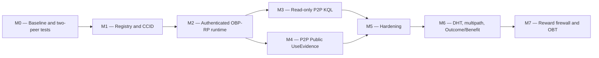

# WIP — Distributed KQL, PoMV, OBP-RP, and Concept Registry Plan v1

> Status: working implementation plan; keep until the milestones are completed and promoted into the authoritative specifications.
>
> Created: 2026-07-23
>
> Scope: Concept Registry/CCID, authenticated OBP-RP runtime, distributed KQL, PoMV evidence, hardening, and the eventual OBT reward boundary.

## 1. Objective

Make distributed operation a property demonstrated by two real OneBrain peers, not only by isolated library tests or in-memory/file carrier simulations.

The dependency order is deliberate:

## 2. Non-negotiable invariants

1. A numeric `ConceptId` is local to one KU. Network boundaries use full CCID/CID identities.
2. Raw KQL, private Needs, Receptor identifiers, and private goal context never leave the originating peer.
3. Network results never claim global completeness. Coverage is always bound to an explicit selector and frontier.
4. A valid signature proves who signed; it does not by itself grant authority.
5. Query hits, retrieval, exposure, and presentation are not `UseEvidence`.
6. Reconciliation receipts do not establish truth, benefit, authority, adoption, or reward.
7. The knowledge plane remains usable when PoMV export, reward, or OBT is disabled or unavailable.
8. New distributed features default to off, have independent kill switches, and support rollback.
9. Legacy data is preserved. Migration and index rebuilds must be non-destructive and restart-safe.

## 3. M0 — Baseline and real two-peer harness

### Work

- Record the current KQL, PoMV, OBP-RP, and Concept Registry baseline.
- Add a reusable `TwoPeerHarness` with:
  - independent temporary data directories;
  - independent identities/feeds;
  - loopback listeners on ephemeral ports;
  - restartable peers;
  - captured wire bytes;
  - delivery injection for drop, duplicate, reorder, delay, and partition;
  - deterministic clocks/identities where possible so tests do not perform unrelated proof-of-work.
- Normalize test outcomes: `LOCAL_ONLY`, `REACHABLE_PARTIAL`, `DEFERRED`, `QUARANTINED`, and `ACCEPTED`.
- Preserve the existing anti-gravity reunion and carrier conformance suites as lower-level evidence.

### Exit gate

- Two actual loopback listeners exchange one canonical carrier record.
- A restart preserves the durable journal.
- Tests can partition and reunite the peers deterministically.
- Captured bytes can be asserted not to contain private identifiers.
- Existing targeted suites remain green.

## 4. M1 — Concept Registry and global CCID correctness

### M1A — Explicit configuration and status

- Add `concept_registry_path`.
- Add `registry_mode = required | optional | disabled`.
- Distinguish missing, corrupt, truncated, unsupported, and resource failures.
- Production-required mode fails before side effects instead of silently falling back.
- Expose encoder v1/v2, registry path, version, counts, and checksum through CLI/API/Web status.
- Remove dependence on the current working directory for CLI and desktop startup.

### M1B — Manifest and provenance

Create a versioned manifest containing:

- BLAKE3 checksum;
- schema/build version;
- Wikidata, WordNet, GeoNames, NCBI, and ChEBI snapshot identifiers;
- entry and label counts;
- build timestamp;
- dedup-policy version;
- license/provenance metadata.

The node validates the manifest before accepting the registry.

### M1C — Scalable lookup

- Keep OBR v1 read compatibility.
- Add a sidecar normalized-label-to-offset index and CCID-to-offset index.
- Benchmark memory-mapped FST/index versus a persistent `redb` index.
- Load records on demand and use a bounded LRU cache.
- Do not read the full 1.3 GB OBR into resident memory at startup.

Initial performance budgets:

- startup under five seconds on the current development machine;
- p95 lookup under ten milliseconds;
- bounded configurable cache;
- no unbounded multi-map duplication of the entire registry.

### M1D — CCID-only distributed boundaries

- Add `KuRuntime::concept_ccids()` and `primary_concept_ccid()`.
- Migrate concept indexes, query hints, DHT keys, discovery engines, and distributed watches to `ConceptCcid`.
- Keep legacy numeric concepts local-only.
- Reject or quarantine network requests that require interpreting a local numeric concept as a global identity.

### Exit gate

- Two nodes resolve the same label to the same CCID.
- Same local IDs with different CCIDs never merge or route together.
- Missing/corrupt registry state is explicit.
- Production-required mode never silently falls back.
- A v2 KU round-trips on a receiving peer without requiring its source registry.

## 5. M2 — Authenticated OBP-RP runtime over a real transport

### Runtime components

Create a `VNextNetworkRuntime` responsible for:

- authenticated QUIC sessions;
- validated object/event storage;
- feed and key-state storage;
- selector inventory forest;
- reconciliation journal;
- outbound scheduler/outbox;
- validate-then-accept inbound sink;
- restart recovery;
- per-peer work, memory, and byte budgets.

The production path must not extend the demo TCP/JSON protocol into a security-sensitive transport.

### Missing control plane

Add a canonical control-plane lane/profile for:

- `SignedFeedInception`;
- feed key rotation/delegation state;
- revocations;
- a frozen, fail-closed policy-reference contract for authority versus
  capability execution.

Implementation audit update (2026-07-23): the root-bootstrap part of this gap
is closed. `ActorId` now has a canonical self-certifying Ed25519 root-key
derivation, and schema `ActorRootDelegation/1` binds that Actor to one exact
FeedId and attenuated device/namespace/generation scope. A dedicated
`AuthorityEvent` OBP-RP lane validates, stores, inventories and rebuilds this
proof across restart. `KeyStateReducer`, `ScopedDelegation`, and
`ScopedRevocation` remain projection types rather than wire records. Their
canonical inputs are now frozen as `ActorDelegation/1` and
`ActorRevocation/1`: each binds an exact authorizing FeedId, parent/target
references and attenuation scope, and is verified before conversion into a
projection. Internal Rust structs are never serialized ad hoc as a de facto
protocol.

Implementation audit update (2026-07-25): authority v1 is intentionally
self-contained and policy-free. Schemas `9`, `10`, and `11` sign every field
needed to derive feed authority and resolve only exact immutable
parent/target/FeedInception dependencies. `KnowledgeEvent.authorization_ref`
is a capability `PermitCid`; accepting immutable event bytes does not resolve
that permit, grant feed authority, or permit execution. Adding an external
authority policy requires a new schema major and fails closed on v1 nodes.

An event whose feed, payload-object, or causal dependency is missing becomes
`DeferredMissingDependency`. An AuthorityEvent whose exact parent, target, or
authorizing FeedInception is missing follows the same non-terminal path. A
missing capability permit blocks permit-gated execution, not immutable event
custody. None of these missing dependencies is trusted or charged against the
terminal retry budget.

### Session binding

Bind every reconciliation context to:

- authenticated transcript;
- peer identity;
- selector CID;
- namespace/disclosure class;
- budget and capability profile;
- resume token.

Feature flags must instantiate or stop real subsystems, not only change displayed status.

### Exit gate

Two actual listeners pass object-before-event, event-before-object, delayed FeedInception, duplicate/reorder, invalid CID, invalid signature, unknown/revoked feed, restart, partition, and reunion tests without claiming global completion.

## 6. M3 — Read-only distributed KQL

The first supported network scope is a one-hop direct-peer subset of `FIND ... SCOPE NEIGHBORS`.

### Flow

1. Peer A parses full KQL locally into a private `KnowledgeNeedIR`.
2. A persists a durable local `StandingNeed`.
3. Raw KQL, NeedID, ReceptorID, and private context remain on A.
4. Peer B publishes a public `KnowledgeAffordance`.
5. OBP-RP reconciles the public affordance to A.
6. A validates the object and triggers `ReunionFrontier` locally.
7. Exact matching creates a quarantined `BindingProposal`.
8. API/CLI/Web returns result references with provenance, responder scope, selector/frontier, limitations, partial coverage, and continuation state.
9. No remote result automatically materializes or adopts a proposal.

CREATE, UPDATE, DEPRECATE, DHT, and global flooding are outside this milestone.

### Exit gate

- Two real peers produce exactly one remote match.
- Replay and restart do not duplicate proposals.
- Captured bytes contain no raw KQL or private stable identifier.
- Timeout and zero results report partial coverage.
- A remote peer cannot cause automatic adoption.
- Local KQL remains usable offline.

## 7. M4 — Public PoMV UseEvidence between two peers

This milestone implements only explicit, user-confirmed Public `UseEvidence`. Outcome, Benefit, reward export, and OBT remain disabled.

### Sender

One durable transaction records:

- feed sequence allocation;
- payload object;
- signed event;
- idempotency key;
- outbound outbox entry.

Query hit, retrieval, and presentation code paths cannot call this creator.

### Receiver

1. Validate object kind, schema, disclosure, and CID.
2. Resolve FeedInception and key state.
3. Verify event signature.
4. Check sequence gaps and equivocation branches.
5. Bind the exact event to the exact payload.
6. Resolve delegation and revocation.
7. Evaluate the exact policy.
8. Derive authority; callers cannot directly assert `Authorized`.
9. Deduplicate durably by EventCID and `(feed, event_type, idempotency_key)`.
10. Project a read-only `MetabolicEvidenceView` with frontier, policy, and limitations.

### Exit gate

- One event over one, two, or five paths is counted once.
- Different EventCIDs with the same idempotency key do not double count.
- Unknown/revoked feeds are never Authorized.
- Equivocation has no arrival-order winner.
- Sender/receiver restart preserves the same view.
- Wallet and OBT state do not change.

## 8. M5 — Hardening and operations

- Crash injection at every transaction boundary.
- Drop, reorder, duplicate, delay, flood, and parser-bomb tests.
- Frame, allocation, expansion, and decompression limits.
- Per-peer resource budgets and backpressure.
- Safe journal compaction.
- Metrics for accepted, deferred, quarantined, replayed, missing dependency, reconciliation lag, selector coverage, and registry status.
- Fuzz canonical decoders and reconciliation frames.
- Mixed legacy/vNext compatibility tests.
- Kill-switch and rollback tests.

The exit gate requires all invariants to hold under restart, partition, and adversarial input.

## 9. M6 — Controlled expansion

### M6A — Active KQL discovery

In order:

1. ProviderLease publishing/resolution.
2. Route-minimal NeedSketch.
3. Progressive disclosure capsule.
4. Encrypted multipath reply.
5. CCID-based DHT routing.
6. Semantic/pheromone routing.
7. Distributed WATCH.

Global flooding remains unsupported.

### M6B — Outcome and Benefit evidence

- Resolve the exact Use EventCID.
- Verify task/context continuity across Use, Outcome, and Benefit.
- Add causal/counterfactual evidence evaluation.
- Derive independent Outcome/Benefit authority.
- Preserve conflicting branches.
- Never infer truth or reward from a single Benefit event.

## 10. M7 — Reward firewall and OBT

This milestone starts only after M0–M6 exit gates and a separate threat-model review.

- Durable reward-evidence queue.
- Idempotent isolated consumer.
- Explicit versioned reward policy.
- No direct mint from one peer observation.
- OBT failure/disablement cannot block publish, query, synchronization, or adoption.
- Replace the live wallet placeholder only after ledger-level conformance tests.

## 11. Delivery strategy

Each milestone is delivered independently:

1. contract and failing acceptance test;
2. minimum implementation;
3. unit and integration tests;
4. two-peer acceptance test;
5. feature remains default-off;
6. privacy/security review;
7. canary enablement only after the exit gate;
8. documentation updated to reflect demonstrated capability, not planned capability.

Initial execution order:

1. M0 test harness and baseline.
2. M1A registry path/mode/status.
3. M1D CCID-only network boundary.
4. M1C scalable registry index/loader.
5. M2 authenticated OBP-RP runtime.
6. M3 KQL and M4 PoMV only after M2 passes.

## 12. Baseline recorded on 2026-07-23

### Demonstrated

- Local KQL parser/executor works on a node-local snapshot.
- Legacy `ku-net::query` unit suite passes after migrating its integration fixture to `KuRuntime`.
- Result merging deduplicates by canonical KU CID, including a regression test for equal local IDs with different CCIDs.
- vNext query contracts, StandingNeed, reunion, reconciliation, journal, carrier adapters, and PoMV evidence reducers have passing focused tests.
- Anti-gravity reunion passes across one, two, and five simulated bridges and preserves private/query/evidence boundaries.
- The feature-gated M3 runtime now reconciles one Public KnowledgeAffordance
  between two real authenticated peers and performs the exact private
  StandingNeed join locally. Durable peer/selector provenance and match
  indexing survive receiver restart; replay rebuilds one quarantined proposal
  without duplicating the durable match.
- The feature-gated M4 runtime now publishes explicitly confirmed Public
  UseEvidence through a durable transactional sender and reconciles it over
  authenticated QUIC/OBP-RP. One EventCID delivered through one, two and five
  independently authenticated paths enters one authority-derived metabolic
  view item; sender/receiver restart preserves the same linked view.
- `onebrain_data/concepts.obr` is OBR1 version 1 with 15,929,874 entries and 22,346,492 labels. It now has an artifact-bound manifest, label/CCID sidecars, and a verification stamp; indexed startup does not materialize the 1.3 GB OBR.

### Not yet demonstrated

- No live node sends a KQL query or private-safe route sketch to another peer.
- The feature-gated vNext runtime now includes authenticated bidirectional QUIC reconciliation, a durable outbound scheduler, inventory forest, dependency-aware validated storage, signed authority control plane, peer-bound restart resume, and an external-signer custody boundary. It remains default-off pending deployment policy.
- The legacy TCP/JSON listener remains active only for legacy traffic. When built and configured with `vnext-network-runtime`, `OneBrainNode` additionally owns the real QUIC listener and may inject an OS/HSM/remote NodeID signer before network start.
- M1 registry/CCID, M2 authenticated runtime and the bounded M3 read-only
  one-hop KQL slice and bounded M4 Public UseEvidence slice are implemented.
  Active remote query/route-sketch discovery and distributed
  Derivation/Outcome/Benefit evidence remain M6; M5 hardening is next.
- Reward/OBT remains outside the validated evidence path and must stay disabled.

### M0 progress

- Added a test-only two-peer loopback oracle with independent temporary data directories and identities.
- The oracle crosses actual ephemeral listeners using canonical carrier framing, captures exact bytes, supports a deterministic partition gate, and can restart a listener without replacing its data directory.
- This oracle is intentionally not production transport and grants no authority.

### M1 progress — 2026-07-23

- M1A implemented: explicit registry path, `required | optional | disabled` policy, bounded cache configuration, early required-mode failure, and registry/encoder status through node, CLI, API, Web, and desktop configuration.
- M1B implemented: versioned manifest, BLAKE3 binding, counts, build/dedup versions, timestamp, and source snapshot/license metadata for Wikidata, WordNet, GeoNames, NCBI, and ChEBI. Missing, corrupt, truncated, unsupported, manifest, I/O, and resource failures are surfaced explicitly.
- M1C implemented for the current artifact: fixed 24-byte label-to-offset and CCID-to-offset sidecars, external bounded-memory sort, on-demand OBR record reads, and a configurable bounded LRU. The original OBR was not rewritten.
- Current artifact measurements: 1,306,104,050-byte OBR; 519,133,960-byte label index with 21,630,579 records; 382,317,040-byte CCID index with 15,929,874 records. The sidecars are read-only memory maps and OBR entries are read on demand. A pre-optimization 200-label run measured 1 ms startup and p95 8.887 ms. After canonical fast-path optimization, three fresh process/empty-LRU runs with warm OS page cache measured p95 0.450, 0.431, and 0.367 ms. The initial p95 budget is met with substantial margin.
- Deterministic ambiguity ordering now follows source priority and builder order. The current artifact resolves the preferred candidates `water → Wikidata Q283`, `human → Q5`, and `Mars → Q111`.
- M1D implemented across KU runtime helpers, concept index/DHT keys, query hints, pheromone learning, distributed WATCH, query commitments, result merge, gap/bridge/serendipity discovery, and generated distributed-query suggestions. These boundaries carry `ConceptCcid`; legacy numeric IDs without a Concept Table mapping are omitted rather than interpreted globally.
- The v2 encoder uses checked registry lookup: an operational registry failure stops encoding and cannot silently become a fallback CCID. A genuine `NotFound` label may still use the deterministic `ob:` fallback namespace.
- Verification stamps now bind the OBR and both sidecars to their manifest checksums, sizes, and modification times. If the stamp is absent/stale, runtime performs full BLAKE3 verification and rewrites it; a sidecar tamper test is included.
- Focused tests prove that equal local numeric IDs with different CCIDs do not alias, two independent indexed backends resolve the same label to the same CCID, and a registry-derived Wikidata CCID survives KU wire decoding on a receiver with no registry.
- The planned redb alternative was closed by an implementation decision: the fixed-record memory map meets startup/lookup budgets without a second database, migration, or duplicated key/value pages. Redb remains a fallback candidate only if production workload measurements invalidate these budgets.
- M1 exit gate is complete. The next active milestone is M2; M1 remains default-safe through explicit policy and does not imply that KQL or PoMV already travels over the production network.

### M2 progress — 2026-07-23

- Added a real QUIC/TLS 1.3 authenticated session protocol with signed `HELLO/WELCOME/FINISH`, transcript verification, replay protection, and a TLS-exporter transport binding. Each carrier/reconciliation context is checked against the authenticated session, peer, selector, capability profile, and disclosure namespace before a payload can reach the sink.
- Added a feature-gated, node-owned `VNextNetworkRuntime` with bounded concurrent sessions, handshake/record/in-flight byte budgets, persistent Ed25519 node identity, persistent validated redb storage, persistent reconciliation journals, restart recovery, and explicit shutdown. The runtime is default-off; requesting active OBP-RP in a build without the feature fails before data-directory side effects.
- Runtime status now distinguishes `DISABLED`, `BUILD_UNAVAILABLE`, `CONFIGURED`, and observed `LISTENING`. Requested flags are separate from actually active flags, and all status surfaces explicitly refuse to claim network completion. CLI/API/Web contracts include listener and accepted/deferred/rejected session counters.
- Added a canonical `FeedInception` control lane and durable FeedId index. Multiple valid branches are preserved deterministically; arrival order cannot select an authority winner. A signed event with a missing FeedInception returns `DeferredMissingDependency`, consumes no terminal retry budget, and can be accepted after the dependency arrives.
- Added a validate-then-accept sink. It checks canonical schema/CID/signature boundaries before atomic persistence, rejects invalid control signatures, and never lets invalid FeedInception data unblock an event. A signature-valid event is accepted only after every referenced payload object and causal parent is durably present; missing dependencies are non-terminal and a false declared EventCID is rejected before it can exploit deferral. `MappingKernel` remains fail-closed until a canonical decoder/validator is implemented.
- Added a redb-backed selector inventory forest. Each validated or already-present record is inserted under the authenticated reconciliation selector through a serialized ACID read-modify-write transaction. Forest roots and selector isolation survive process restart; derived semantic shard hints remain outside the authoritative snapshot/root.
- Added the first authenticated return path: after each payload attempt, the receiver sends a canonical cumulative reconciliation receipt on the same QUIC connection. The initiator validates the receipt against the authenticated transcript/context before exposing it. Receipt status is explicitly local validation state and grants no truth, authority, adoption, benefit, reward, or completion.
- Added a durable redb outbox plus a serialized bounded delivery engine. Transfer identity is bound to target NodeID, selector, namespace, disclosure, kind, and content CID but not an unstable address or ephemeral session. The scheduler verifies the authenticated responder NodeID before sending, binds the intent to the fresh session, applies only a matching authenticated receipt, persists terminal state across sender restart, and does not charge protocol-level deferral against the terminal retry budget. Route updates retain identity and reset retry count without reviving terminal records. Compatible intents are grouped by peer, route, selector, namespace, and disclosure into one authenticated manifest plus multiple payloads; cumulative receipts are applied independently by kind/CID under one absolute response deadline. A node-owned continuous worker now replays durable pending work at startup, wakes on enqueue, serializes with explicit delivery passes, and applies bounded exponential backoff from 250 ms to 30 s after transport failure or protocol deferral. Shutdown cancellation leaves every non-terminal intent replayable.
- Added restart-rebuildable feed sequence/equivocation projection over the durable accepted-event namespace. It preserves every valid EventCID at the same `(FeedId, sequence)`, derives gaps/successor proofs deterministically, and exposes unresolved consistency without selecting an arrival-order winner or turning missing history into an accusation.
- Added structural feed-rotation admission. A generation-zero inception cannot claim a predecessor; a successor must wait for its predecessor and then pass exact predecessor, generation, owner-device, and pre-rotation-commitment checks. Missing predecessor history is deferred without retry charge, while malformed rotation is quarantined and never enters the FeedId index. This is structural validity only and deliberately does not yet claim actor/delegation authority.
- Closed a feed-authority replay flaw before defining the wire lane: `DelegationGrant` now commits the exact initially authorized FeedID in addition to actor/device/namespace/generation scope, and the key-state checkpoint root includes that binding. A different feed key copying the public delegation reference and all public scope fields remains `STALE_OR_UNRESOLVED`; the attack is covered both by core authority tests and the QA-005 security suite.
- Added the canonical authority root bootstrap. `ActorRootDelegation/1` derives a self-certifying ActorId from an Ed25519 root key and signs an exact FeedId/device/optional namespace/generation grant without a FeedId/CID cycle. `AuthorityEvent` is now a distinct content domain, protocol kind, inventory lane and validated durable namespace. Invalid schemas/signatures/CIDs are quarantined and unrelated local roots are excluded from named-frontier projection.
- Added canonical `ActorDelegation/1` and `ActorRevocation/1`. A child is accepted only after its exact parent and parent-authorized FeedInception are durable, its feed signature is valid, and actor/namespace/generation scope does not expand. A revocation binds the exact target, device, generation floor, ancestor authorizer and authorizing feed. The reducer rebuilds only the dependency closure of a named root/child/revocation frontier, so unrelated local branches cannot leak into authority and older frontiers remain reproducible historical views.
- Authority dependencies now exercise the durable non-terminal path over real QUIC: a child sent before root/feed receives `DeferredMissingDependency`, remains pending in the sender outbox, and is accepted after those dependencies arrive. A later revocation changes the child decision to `QUARANTINED_REVOKED_RELATIVE` only at the revocation frontier; both the revoked view and older authorized view rebuild identically after receiver restart.
- Added a three-runtime authority partition/reunion test. Two receivers first converge on the same delegated feed, then only one observes the immutable revocation during a partition. Each receiver preserves its own frontier-relative decision without claiming global completion; after reunion, the second receiver accepts the same revocation proof and converges without a trusted seed, leader, quorum, or arrival-order winner.
- Added `PeerBoundTokenV2` cross-session reconciliation. Every message and payload remains bound to the fresh QUIC transcript, while a receiver-issued token names the durable origin journal and is MAC-bound to the same initiator/responder NodeIDs plus an exact selector/namespace/disclosure/method/budget scope. Resume atomically consumes the checkpoint with compare-and-swap, rejects wrong peer/key/scope and replay, rebinds stored manifests to the new context, survives receiver restart, and never claims semantic or network completion. Minor-0 journals migrate only through an exact original-context open.
- Froze the v1 policy-reference boundary. Feed authority is derived only from self-contained signed AuthorityEvent closures; no mutable external policy reference is accepted. `KnowledgeEvent.authorization_ref` remains a capability-permit reference and cannot affect the feed-authority reducer. A regression test stores a signature-valid event carrying an arbitrary `PermitCid` and proves the unrelated feed remains `STALE_OR_UNRESOLVED`.
- Added production NodeID key-custody injection through `SessionIdentitySigner`, `VNextNetworkRuntime::start_with_signer`, and `OneBrainNode::set_vnext_identity_signer`. Only public-key and sign operations cross the boundary. Startup verifies proof of possession before external-signer data-directory or listener side effects; signer failure never falls back. The compatibility file signer remains explicitly non-production. A real QUIC/restart/resume test uses the external signer without creating `vnext_identity.key`, and a mismatched signer fails before its requested directory exists. Actor root private keys never enter the network runtime.
- Real two-runtime tests now cover mutual authentication, malformed object rejection with a round-trip `RejectedInvalid` receipt, event-before-FeedInception deferral, event-before-payload-object deferral, dependency delivery, redelivery, receiver restart, durable FeedId/object/root-authority lookup, durable selector inventory root, durable sender outbox/receipt restart, continuous restart/enqueue delivery, multi-record/one-session batch delivery, wrong-target NodeID suppression, two-branch feed equivocation across receiver restart, delayed structurally valid feed rotation across restart, exact root authority, copied-delegation FeedID replay rejection, external signer custody, cross-session journal resume, and idempotent replay. Existing carrier, reconciliation, journal, partition/reunion, anti-gravity, feature-gate, and web build suites remain green.
- M2 is **complete** against the bounded exit gate. This demonstrates pairwise authenticated, restart-safe and partition-tolerant exchange; it does not make OBP-RP the default path, ship a vendor-specific HSM adapter, or claim global network completion. M3 read-only distributed KQL is now unblocked.

### M3 progress — 2026-07-25

- Added complete typed decoders for canonical `SemanticFrameSet` and
  `KnowledgeAffordance/1`. The decoder rejects missing/unknown fields,
  non-canonical set order, non-alpha-normalized statement variables and
  alternate semantic encodings through an exact canonical round trip.
- The validate-then-accept boundary now quarantines an affordance that is valid
  as a generic object envelope but invalid as the declared typed object.
  Legacy malformed branches are ignored independently and cannot poison other
  local matches.
- Added durable, idempotent source observations bound to the exact record kind,
  full CID, SelectorCID and authenticated delivering NodeID. This is transport
  provenance only and grants no authorship, truth, authority or completion.
- Added `DistributedKqlRuntime`: durable LOCAL_ONLY StandingNeeds, explicit
  Private Vault reattachment after restart, bounded one-hop affordance delta
  processing, local `ReunionFrontier` matching, non-executable proposal
  quarantine and a durable match index keyed by StandingNeedID plus ProposalID.
- A real two-peer QUIC/OBP-RP test produces exactly one private remote match,
  records a durable receipt and peer provenance, verifies the exact application
  payload contains no raw KQL/QueryDefinitionCID/StandingNeedID, reports
  partial path-limited coverage for zero results after the source peer is
  offline, advances across multiple CIDs under a one-object pagination budget,
  and proves restart/replay does not create a second durable match.
- M3 remains deliberately read-only and one-hop. It sends Public affordances,
  not KQL or route sketches; it exposes no automatic materialize/adopt path and
  never claims network completion. Active discovery remains M6.
- The bounded M3 exit gate is complete.

### M4 progress — 2026-07-25

- Added `PublicUseEvidencePublisher`. A non-zero explicit-confirmation
  commitment is mandatory; one redb transaction stores Feed sequence/head,
  canonical Public payload, signed event, idempotency key and logical outbound
  publication. Exact retries return the same EventCID, conflicting retries
  fail closed and restart preserves pending work.
- `flush_pending` idempotently hands FeedInception, object and event records to
  the existing durable OBP-RP outbox. The sender does not retain the
  caller-supplied Feed private key. A production Feed HSM/remote-signer adapter
  remains a deployment follow-up distinct from NodeID session-key custody.
- Completed typed UseEvidence decoding at the receiver admission boundary. A
  canonical generic object with an invalid typed payload is quarantined rather
  than entering accepted storage or a metabolic projection.
- Added `DistributedPomvRuntime`: it binds exact accepted events and objects,
  requires authenticated selector-bound source provenance, derives authority
  from the exact signed authority frontier and persists a bounded identity
  index for `(FeedId, event type, idempotency key)`.
- Exact EventCID replay is counted once regardless of path count. If different
  EventCIDs reuse the same identity, every variant is excluded; overflow also
  fails closed, so arrival order cannot select a winner.
- Persisted metabolic-view heads bind target and policy to the current root,
  revision and previous root. Identical durable state reproduces the same
  lineage after restart; changed evidence/frontier/limitations create a linked
  revision.
- A real QUIC/OBP-RP acceptance test sends the same UseEvidence through one,
  two and five independently authenticated NodeIDs, restarts both publisher
  and receiver, verifies an unresolved Feed is not promoted, applies a signed
  self-revocation, injects an idempotency conflict and confirms wallet/OBT
  isolation throughout.
- The bounded M4 exit gate is complete. Public UseEvidence is demonstrated;
  Derivation/Outcome/Benefit, reward export and OBT remain disabled. M5
  adversarial hardening is the next milestone.

Non-blocking follow-up:

- update authoritative KQL/storage specifications that still document KU-local numeric concept indexes; this documentation work does not permit numeric identities at a distributed boundary.
