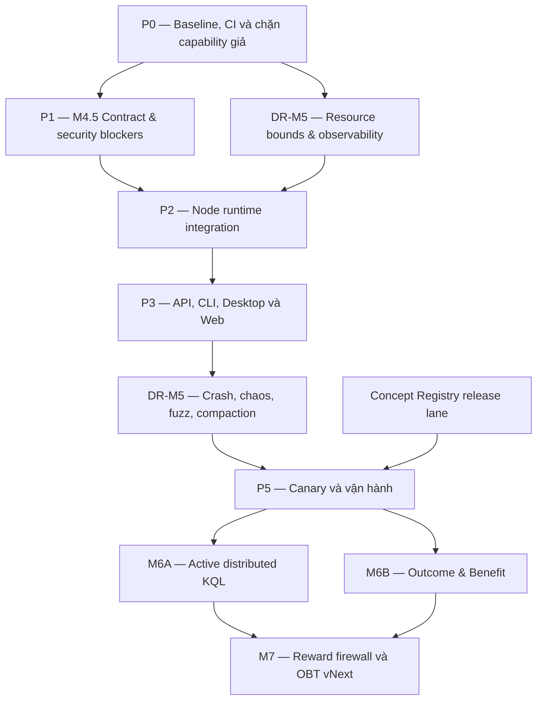

# WIP — OneBrain Distributed Runtime Implementation Plan v2

> Status: kế hoạch handoff để tiếp tục triển khai trong conversation mới.
>
> Audit snapshot: 2026-07-25.
>
> Scope: product integration cho M3/M4, distributed-runtime hardening, canary,
> M6 active KQL, M6 Outcome/Benefit, Concept Registry operations và ranh giới
> an toàn trước M7/OBT.
>
> Kế thừa, không xóa:
> `docs/research/WIP_DISTRIBUTED_RUNTIME_IMPLEMENTATION_PLAN_V1.md`.

## 0. Hướng dẫn tiếp tục trong conversation mới

Conversation mới phải đọc toàn bộ file này trước khi sửa code, sau đó:

1. Kiểm tra `git status --short` và bảo toàn mọi thay đổi không thuộc task.
2. Đối chiếu lại baseline test/CI vì trạng thái code có thể đã thay đổi sau
   audit snapshot.
3. Bắt đầu từ **P0**, không nhảy thẳng sang M6 hoặc OBT.
4. Mỗi work package phải đi theo thứ tự:
   contract/failing test → implementation → focused tests → real-peer/E2E
   acceptance → documentation.
5. Giữ feature mặc định tắt cho tới khi qua canary exit gate.
6. Không coi một module hoặc unit test hiện hữu là bằng chứng subsystem đã
   được nối vào product runtime.

Prompt handoff đề xuất:

```text
Hãy đọc toàn bộ
docs/research/WIP_DISTRIBUTED_RUNTIME_IMPLEMENTATION_PLAN_V2.md
và đối chiếu code hiện tại. Bắt đầu thực hiện P0 theo đúng dependency, invariant
và exit gate trong tài liệu. Trước khi sửa, xác nhận baseline/git status; sau
mỗi work package hãy chạy focused tests và cập nhật lại tài liệu bằng bằng
chứng đã chứng minh, không bằng capability dự kiến.
```

## 1. Kết luận của audit

Không nên chuyển thẳng sang M6.

M1–M4 đã vượt qua các exit gate kỹ thuật có giới hạn:

- M1: Concept Registry và CCID.
- M2: authenticated OBP-RP runtime trên QUIC thật.
- M3: bounded read-only one-hop distributed KQL.
- M4: bounded explicitly confirmed Public UseEvidence và read-only metabolic
  evidence view.

Tuy nhiên M3/M4 chưa được nối thành chức năng hoàn chỉnh của `OneBrainNode`,
REST API, CLI, Desktop và Web. Vì vậy cần thêm milestone:

**M4.5 — Product Integration**

sau đó mới hoàn tất:

**DR-M5 — Distributed Runtime Hardening**

trên chính các entrypoint product thật.

Tên `DR-M5` được dùng để tránh nhầm với các milestone M5 khác trong tài liệu
Foundation.

## 2. Trạng thái thực tế tại audit snapshot

| Trụ cột | Đã chứng minh | Khoảng trống tiếp theo |
|---|---|---|
| Concept Registry/CCID | Manifest, verification stamp, label/CCID sidecars, checked lookup, CCID-only distributed boundary | Atomic release, signed provenance, update/rollback, resource/corruption drills |
| M2 OBP-RP/QUIC | Hai peer thật, authenticated session, durable outbox/journal/store/inventory/authority, restart/reunion | Adversarial resource bounds, process-kill, fuzz, operational compaction và telemetry |
| M3 KQL phân tán | One-hop Public Affordance reconciliation và local private matching | Chưa có node lifecycle, API/CLI/Web, private target auto-rehydrate và incremental worker |
| M4 PoMV | Transactional Public UseEvidence, real-QUIC delivery, authority-derived view, path dedup, restart | Chưa có Feed signer production, strong consent, node worker và product surfaces |
| DR-M5 | Có nhiều primitive/security/property tests | Chưa harden chuỗi product runtime thật |
| M6 | Có Provider, RouteSketch, Capsule, Multipath, Outcome/Benefit primitives | Phần lớn library-only hoặc in-memory |
| M7/OBT | Reward firewall prototype và OBT legacy | Chưa có Benefit-based reward policy, ledger/finality vNext hoặc wallet production |

### 2.1. Bằng chứng product integration còn thiếu

- `OneBrainNode` hiện sở hữu `VNextNetworkRuntime`, chưa sở hữu
  `DistributedKqlRuntime`, `DistributedPomvRuntime` hoặc
  `PublicUseEvidencePublisher`:
  `src/onebrain-node/src/node.rs`.
- `/api/kql` vẫn gọi local KQL legacy:
  `src/onebrain-api/src/handlers.rs`.
- CLI và Desktop vẫn tạo `vnext: Default::default()`:
  `src/onebrain-cli/src/main.rs` và
  `src/onebrain-desktop/src/config.rs`.
- CI foundation chưa build/test `onebrain-node` với
  `--features vnext-network-runtime`:
  `.github/workflows/vnext-foundation.yml`.
- Wallet hiện vẫn có đường code sinh balance/history placeholder từ số KU:
  `src/onebrain-node/src/node.rs`.

### 2.2. Concept Registry và KU

KU v2 có sử dụng Concept Registry:

- encoder dùng checked registry lookup;
- lỗi vận hành registry làm encoding dừng, không âm thầm fallback;
- chỉ label thực sự `NotFound` mới dùng deterministic namespace `ob:`;
- KU truyền qua network bằng CCID;
- numeric `ConceptId` chỉ là local implementation detail;
- peer nhận KU v2 không cần registry nguồn để giải mã CCID đã được ghi vào KU.

Artifact hiện tại:

| Artifact | Kích thước/số lượng |
|---|---:|
| `onebrain_data/concepts.obr` | 1,306,104,050 byte |
| Registry entries | 15,929,874 |
| Labels | 22,346,492 |
| Label index | 519,133,960 byte |
| CCID index | 382,317,040 byte |

Nguồn trong manifest:

- Wikidata;
- WordNet;
- GeoNames;
- NCBI Taxonomy;
- ChEBI.

Manifest:
`onebrain_data/concepts.obr.manifest.json`.

## 3. Invariant không được phá vỡ

1. Numeric `ConceptId` không bao giờ được dùng như global/network identity.
2. Raw KQL, StandingNeed, LocalNeedTarget, Receptor/Assembly/User identifiers
   và private goal context không rời origin node.
3. Network result không tuyên bố global completeness hoặc global absence.
4. Signature chỉ chứng minh authorship/integrity, không tự cấp authority.
5. Query hit, retrieval, presentation hoặc path count không phải UseEvidence.
6. UseEvidence hoặc PoMV đơn lẻ không phải Outcome, Benefit hay reward.
7. Conflict phải được giữ thành branch; không arrival-order winner hoặc LWW.
8. Missing dependency là `deferred/unknown`, không phải negative evidence.
9. Knowledge plane vẫn hoạt động khi PoMV export, reward hoặc OBT bị tắt/lỗi.
10. Feature mới mặc định tắt, có kill switch độc lập và rollback.
11. Không global flooding.
12. OBT/wallet không được thay đổi trước M7 exit gate.

## 4. Dependency roadmap



## 5. P0 — Baseline, CI và tính trung thực của sản phẩm

Ước lượng: **3–5 engineer-days**.

### Công việc

1. Chạy lại full workspace baseline.
2. Xử lý năm legacy failures được ghi nhận tại audit gần nhất:
   - UTF-8/mojibake trong system-prompt test;
   - bốn OBT anti-gaming tests xung đột với DEV constants.
3. Tách `AntiGamingPolicy` production/dev; DEV override không được thay đổi
   consensus/reward behavior.
4. Thêm CI matrix:
   - default features;
   - `vnext-network-runtime`;
   - M2/M3/M4 real-QUIC acceptance;
   - Linux và tối thiểu một Windows smoke job;
   - timeout rõ ràng.
5. Đưa tất cả module vNext live vào rustfmt/clippy gate.
6. Thêm Concept Registry small-fixture build/verify test.
7. Vô hiệu hóa hoặc ghi rõ `simulated/non-economic` cho wallet, balance và
   PoMV scalar legacy.
8. Freeze ADR phân biệt legacy KQL/DHT/PoMV/OBT với vNext.
9. Freeze inventory của mọi transaction boundary để dùng cho crash harness.

### Exit gate

- Full workspace baseline xanh.
- Runtime feature được compile và test trong CI.
- Mọi thay đổi runtime kích hoạt real-network gate.
- Không surface nào trình bày balance placeholder như OBT thật.
- Không còn hidden DEV override trong logic kinh tế.

## 6. P1 — M4.5 Contract và security blockers

Ước lượng: **8–12 engineer-days**.

### P1.1. Product integration profile

Tạo `VNEXT_PRODUCT_INTEGRATION_PROFILE_V1` và freeze:

- endpoint/DTO additive dưới `/api/vnext/...`;
- CID encoding;
- pagination/continuation;
- coverage/limitation;
- lifecycle/error semantics;
- legacy/vNext naming;
- proposal luôn quarantined và non-executable;
- PoMV view không tuyên bố truth, Benefit, reward hoặc global completion.

Không đổi nghĩa âm thầm của:

- `/api/kql`;
- `/api/watch`;
- scalar `pomv`;
- `pomv_breakdown`.

### P1.2. Feed signer custody

1. Thiết kế `FeedEventSigner` độc lập với NodeID session signer.
2. Boundary chỉ expose public-key và sign operation.
3. Proof-of-possession trước side effect.
4. Không export private key.
5. Không fallback sang file key nếu HSM/remote signer lỗi.
6. Core event API phải verify feed/public-key binding trước canonical encode.

NodeID, ActorID và FeedID là ba identity domain khác nhau; không dùng chung key
hoặc signer.

### P1.3. Strong Public Use consent

Thay confirmation “32 byte khác zero” bằng hai bước:

1. `prepare`:
   - canonical payload preview;
   - exact target/peer;
   - selector/namespace/disclosure;
   - idempotency key;
   - expiry;
   - challenge/intent CID.
2. `confirm`:
   - single-use receipt;
   - bind exact prepared intent;
   - chống replay;
   - hết hạn fail-closed.

### P1.4. Private KQL persistence

1. Encrypted codec/store cho `LocalNeedTarget`.
2. Deterministic adapter từ local KQL/user intent sang
   `QueryDefinition + LocalNeedTarget`.
3. Startup tự rehydrate StandingNeed từ Private Vault.
4. Tombstone/cancel/pause/retire semantics.
5. Raw KQL và private target không vào public store hoặc telemetry.

### P1.5. Route và authority boundary

1. Authenticated route directory `NodeID ↔ SocketAddr`, chỉ update sau
   handshake hợp lệ.
2. Local policy registry với allow-listed policy versions.
3. Authority-frontier resolver từ validated local state.
4. API caller không được tự truyền `Authorized`, arbitrary frontier hoặc
   arbitrary policy implementation.

### Exit gate

- Arbitrary non-zero confirmation bị từ chối.
- Exact prepared intent mới có thể được confirm.
- Restart khôi phục exact local target.
- Wrong signer/public-key mismatch thất bại trước side effect.
- API không thể tự cung cấp authority/frontier có lợi.
- Wire capture không chứa raw KQL, StandingNeedID hoặc private context.
- Contract validator xanh.

## 7. P2 — Tích hợp runtime vào OneBrainNode

Ước lượng: **10–15 engineer-days**.

### P2.1. Runtime ownership

Tạo aggregate như `VNextProductRuntime` sở hữu:

- `VNextNetworkRuntime`;
- `DistributedKqlRuntime`;
- `PublicUseEvidencePublisher`;
- `DistributedPomvRuntime`;
- route directory;
- signer/vault/policy handles;
- cancellation token;
- bounded background workers.

API chỉ dùng typed service façade, không nhận raw runtime reference.

### P2.2. Feature flags và budgets

Thêm kill switch độc lập:

- `distributed_kql_one_hop`;
- `public_use_evidence_publish`;
- `distributed_pomv_view`.

Dependencies tối thiểu:

- `ObjectEventV1`;
- `ObpRp`.

Thêm bounded policies:

- KQL scan/object/pair/proposal budgets;
- PoMV record/view limits;
- publication flush batch;
- worker poll interval;
- per-peer work/byte rate;
- storage/disk watermarks.

### P2.3. Startup và shutdown

Startup order:

1. Validate config/dependencies.
2. Validate signer/vault.
3. Mở durable stores.
4. Khởi động authenticated QUIC.
5. Rehydrate private needs.
6. Drain logical publication outbox.
7. Khởi động bounded workers.

Shutdown:

1. Fence operation mới.
2. Cancel workers.
3. Flush safe pending metadata.
4. Shutdown network.
5. Close stores.

Partial startup phải rollback sạch.

### P2.4. Incremental processing

- Không dùng full scan `accepted_object_bytes()`/`accepted_event_bytes()` cho
  mỗi KQL/PoMV request.
- Thêm typed kind/selector indexes và durable cursors.
- Affordance delta tạo đúng một durable match/notification.
- PoMV projection rebuild theo changed records/frontier.
- Continuation token phải có product semantics bền vững, không chỉ in-memory
  cursor.

### P2.5. Concurrency

Không giữ global `Arc<Mutex<OneBrainNode>>` trong:

- network wait;
- Redb scan;
- signer call;
- background worker;
- view materialization.

Ưu tiên cloneable service handles hoặc actor/message façade.

### Exit gate

- Bật flag thực sự tạo subsystem; kill switch thực sự dừng lane.
- Default config không mở DB/listener/worker ngoài yêu cầu.
- Partial startup rollback sạch.
- Restart không duplicate need, publication, event, match hoặc view revision.
- Crash sau publication commit nhưng trước network handoff tự hồi phục.
- Local KQL vẫn hoạt động khi toàn bộ vNext network lane bị tắt.

## 8. P3 — API, CLI, Desktop và Web

Ước lượng: **10–20 engineer-days**.

### P3.1. REST API

Endpoint additive đề xuất:

- `POST /api/vnext/kql/needs/prepare`
- `POST /api/vnext/kql/needs`
- `GET /api/vnext/kql/needs`
- `GET /api/vnext/kql/needs/{id}`
- `GET /api/vnext/kql/needs/{id}/matches`
- `POST /api/vnext/kql/needs/{id}/scan`
- `DELETE /api/vnext/kql/needs/{id}`
- `POST /api/vnext/pomv/public-use/prepare`
- `POST /api/vnext/pomv/public-use/confirm`
- `GET /api/vnext/pomv/publications/{id}`
- `GET /api/vnext/pomv/views/{target}`
- `GET /api/vnext/runtime/status`

Status/DTO phải biểu diễn:

- disabled/requested/active/degraded;
- partial/path-limited coverage;
- continuation;
- pending/deferred/quarantined/conflict;
- policy/frontier/revision;
- signer readiness;
- limitations;
- không lộ secret/private identifier.

### P3.2. WebSocket

1. Bắt buộc authentication.
2. Scope subscription theo authenticated client.
3. Không broadcast StandingNeed/private proposal/private target.
4. Event tối thiểu:
   - new bounded match;
   - publication queued/delivered/deferred;
   - view revision/conflict;
   - lane disabled/degraded.

### P3.3. CLI

- `need prepare|activate|list|scan|matches|retire`
- `pomv use prepare|confirm|status`
- `pomv view`
- `vnext status`

Yêu cầu:

- Feed signer provider được chọn rõ.
- Development file signer phải opt-in và có warning.
- Không có `--yes` mặc định cho Public Use.

### P3.4. Desktop/Web UX

- Tách “Local KQL” và “One-hop discovery”.
- Mọi match hiển thị responder scope, selector/frontier, limitation,
  continuation và nhãn `quarantined proposal`.
- Tách PoMV scalar legacy khỏi vNext Metabolic Evidence View.
- Public Use wizard hiển thị exact payload, recipient và tính
  Public/permanent.
- Hiển thị outbox/pending/deferred/conflict.
- Settings hiển thị compiled/requested/active/kill-switch/signer readiness.
- Desktop quit/restart gọi graceful node shutdown.

### Exit gate

- Load/retrieve/present không thể tự tạo UseEvidence.
- User phải xác nhận exact prepared intent.
- Zero result không được hiển thị như “không tồn tại trên mạng”.
- Conflict/unresolved không hiển thị thành `Authorized`.
- API/CLI exact replay trả cùng identity.
- Private WebSocket event không tới client khác.
- Legacy endpoints vẫn vượt compatibility tests.
- Web build/lint và Desktop feature build xanh.

## 9. DR-M5 — Distributed Runtime Hardening

Ước lượng tổng: **65–100 engineer-days**. Với hai lane song song hợp lý:
**6–9 tuần lịch**, cộng soak bắt buộc.

### M5-00 — Baseline và CI feature matrix

Cỡ: **M, 3–5 engineer-days**.

- Phần lớn được thực hiện trong P0.
- Freeze invariant oracle và transaction-boundary inventory.
- Real-QUIC acceptance có timeout.

Exit:

- Mọi runtime file thay đổi đều kích hoạt feature-enabled real-network gate.

### M5-01 — Unified resource admission và fairness

Cỡ: **XL, 11–15 engineer-days**.

1. Một admission policy từ stream-read → frame → protocol → journal →
   application.
2. Đọc length-prefix và kiểm lane-specific cap trước allocation.
3. Hợp nhất transport/carrier/protocol payload limits.
4. Global + per-NodeID/IP quota:
   - handshake;
   - sessions;
   - contexts;
   - records;
   - bytes;
   - work;
   - rate window.
5. Bound:
   - replay guard;
   - journal/context count;
   - quarantine;
   - provenance;
   - accepted store;
   - disk watermarks.
6. Paginated/prefix-indexed KQL/PoMV scans.
7. Outbox:
   - `DeadLetter/RetryExhausted`;
   - fair cursor;
   - tách transport-attempt khỏi terminal-validation retry;
   - terminal retention/compaction.

Exit:

- Flood peer không vượt cap + bounded overhead.
- Healthy peer tiến triển trong số scheduling quanta hữu hạn.
- Không starvation do retry-exhausted first page.

### M5-02 — Structured observability

Cỡ: **L, 6–10 engineer-days**.

- Typed low-cardinality reason codes.
- Counter/gauge/histogram cho:
  - accepted/new/already-present/replayed;
  - deferred/missing dependency;
  - quarantine/rejection reason;
  - bytes/work/rate-limit;
  - journal/outbox depth và age;
  - retry exhausted;
  - reconciliation lag;
  - selector/frontier coverage;
  - PoMV conflict/view revision;
  - registry state.
- Không dùng NodeID, selector hoặc private Need làm metric label.
- Structured logging thay cho `Err(_)` bị nuốt.
- Operator/API snapshot.

Exit:

- Mỗi adversarial outcome tạo metric/log xác định.
- Exact counter transitions có test.
- Status không tuyên bố completeness.

### M5-03 — Real Redb/process crash harness

Cỡ: **XL, 11–15 engineer-days**.

Failpoint và child-process kill tại:

1. Public UseEvidence publisher transaction.
2. Logical publication outbox → network outbox.
3. Outbox attempt → send → receipt.
4. Journal reservation → validated store.
5. Validated store → inventory.
6. Inventory → provenance.
7. PoMV identity index → view lineage.
8. KQL durable match/frontier replay.

Phải test:

- trước commit;
- sau commit;
- trước side effect kế tiếp;
- disk-full/read-only;
- corrupted/truncated store.

Oracle so sánh:

- accepted CID set;
- inventory roots;
- pending outbox;
- authority decisions;
- KQL match set;
- PoMV view root/revision.

Exit:

- Restart không mất accepted/pending state.
- Không double-count.
- Không authority amplification.
- Corrupt store fail explicit, không tự tạo DB mới.

### M5-04 — Chaos, parser adversarial và fuzz

Cỡ: **XL, 11–15 engineer-days**.

- Real-QUIC chaos:
  - drop;
  - duplicate;
  - delay;
  - reorder;
  - disconnect;
  - partition/reunion;
  - slow reader/writer.
- Flood:
  - pre-auth;
  - authenticated sessions;
  - contexts/manifests;
  - unique invalid CIDs;
  - slowloris.
- Cargo-fuzz targets:
  - canonical codec;
  - session/reconciliation codec;
  - carrier frame;
  - journal token/snapshot;
  - Object/Event/Feed/Authority/UseEvidence;
  - legacy adapter.
- Property generator cho delivery traces dài.

Exit:

- Zero panic, OOM, hang, privacy leak hoặc invariant violation.
- PR corpus smoke cho mọi target.
- Nightly fuzz budget được version hóa.
- Fair redelivery hội tụ về cùng oracle root.

### M5-05 — Operational compaction

Cỡ: **XL, 11–15 engineer-days**.

- Journal: chỉ compact completed/superseded state.
- Outbox: audit tombstone trước khi xóa terminal record.
- Không xóa Pending hoặc missing-dependency state.
- Bounded quarantine/provenance với overflow evidence.
- KQL/PoMV derived index snapshot + exact restore.
- Compaction kill switch.
- Crash-safe audit-before-delete.

Exit:

- Crash ở mọi bước vẫn restore exact root.
- Pending work tiếp tục.
- Semantic result không đổi.
- Disk usage thực sự giảm.

### M5-06 — Mixed version, runtime kill switch và rollback

Cỡ: **XL, 11–15 engineer-days**.

- Legacy TCP và vNext QUIC chạy đồng thời.
- Frozen N-1 wire corpus hoặc N-1 binary fixture.
- Upgrade → run → kill → rollback → restart → re-enable.
- Runtime generation fence:
  - sau khi kill switch áp dụng, không nhận session/publish/side effect mới;
  - in-flight behavior phải xác định.
- Flag riêng cho distributed KQL, Public UseEvidence publish và PoMV view.

Exit:

- Stale config không tự re-enable.
- Rollback không xóa raw/journal/quarantine.
- Legacy/local/offline vẫn hoạt động.
- Wallet/OBT không đổi.

### M5-07 — Soak, performance và release gate

Cỡ: **L, 6–10 engineer-days**, cộng thời gian chạy.

- Release-build real-QUIC p50/p95/p99.
- Fsync latency, RSS, disk growth và task count.
- KQL/PoMV incremental scan budgets.
- Slow-peer/flood/partition cycles.
- 24 giờ nightly soak.
- 72 giờ pre-release soak.

Exit:

- Không memory/disk/task slope không giới hạn sau configured caps.
- Không task leak.
- M3/M4 invariants giữ nguyên.
- Operator có đủ signal để phát hiện và rollback.

### DR-M5 exit gate tổng

DR-M5 chỉ hoàn tất khi:

- feature-enabled full CI xanh;
- mọi transaction boundary qua process-kill test;
- mọi resource state có hard cap hoặc retention policy;
- fuzz/chaos không panic, hang, OOM hoặc phá invariant;
- compaction/rollback khôi phục exact roots;
- runtime kill switch có fence semantics;
- mixed legacy/vNext chạy qua transport thật;
- 72 giờ soak không có unbounded growth;
- không global completion, auto-adopt, truth/Benefit inference hoặc wallet/OBT
  mutation.

## 10. P5 — Canary và operations

Ước lượng: **5–10 engineer-days**, cộng soak.

### Công việc

1. Canary 3 node qua QUIC thật.
2. Partition, restart, route change và reunion.
3. Signer outage, disk pressure và slow peer.
4. Backup/restore drill.
5. Rollback/re-enable rehearsal.
6. Default-off rollout theo từng lane.
7. Operator dashboard/runbook:
   - startup/degraded state;
   - outbox/journal/quarantine;
   - incident response;
   - signer failure;
   - registry corruption;
   - rollback.
8. 72 giờ pre-release soak.

### Exit gate

- Rollback không mất raw records, journal, pending outbox hoặc quarantine.
- Local KQL hoạt động khi toàn bộ vNext network lane tắt.
- Không unbounded memory/disk/task growth.
- Feature vẫn mặc định tắt sau release nếu chưa có explicit operator opt-in.

## 11. Concept Registry operations lane

Lane này có thể chạy song song từ P0 và phải hoàn tất trước P5 production
canary.

### Công việc

1. Đóng gói:
   - OBR;
   - label index;
   - CCID index;
   - manifest;
   - verification stamp;
   thành một atomic release.
2. Lưu:
   - reproducible source snapshot hash;
   - download hash;
   - license;
   - SBOM;
   - signed build provenance.
3. Hỗ trợ old/new registry coexist.
4. Sinh CCID stability/diff report.
5. Atomic swap và rollback.
6. Test:
   - cold cache;
   - low RAM;
   - SSD/HDD;
   - corrupt/missing stamp;
   - truncated index;
   - thiếu disk.
7. Quarterly build/update/rollback dry-run.
8. Không gossip artifact 1.3 GB qua OBP. Nếu cần phân phối:
   - content-addressed chunks;
   - mirrors;
   - offline media.

### Exit gate

- Update bị gián đoạn không phá registry đang active.
- Old/new version cho cùng stable source identity ra cùng CCID.
- Corruption fail explicit.
- Production-required mode không fallback.

## 12. M6A — Active distributed KQL

Ước lượng sơ bộ: **6–10 tuần**.

Chỉ bắt đầu sau P5/DR-M5.

### M6A.1. Provider runtime

1. Freeze versioned ProviderLease/Retire wire lane.
2. Thêm protocol kind/inventory/canonical codec.
3. Durable accepted/quarantine store.
4. Transactional publisher:
   - generation/head;
   - idempotency;
   - signed outbox;
   - retire.
5. Rebuildable LeaseMap/index.
6. Direct/PEX discovery.
7. Authenticated capability probe.

Exit:

- Ba node thật publish → reconcile → discover → probe.
- Replay không gia hạn lease.
- Retire-before-lease và restart cho deterministic result.

### M6A.2. Private active route

1. Freeze route packet, capsule, permit, receipt/reply và status codec.
2. Durable QueryRun/StandingNeed private state.
3. Persist replay tombstone và capacity fail-closed.
4. Receiver chỉ coarse-match fixed-size RouteNeedSketch.
5. Capsule chỉ mở sau bilateral CAP-004 Permit.
6. Durable sender/inbox, cancel/expiry/restart/key zeroization.
7. Multipath coordinator dùng 1–3 authenticated routes.
8. Canonical CID union và encrypted mailbox.

Exit:

- Packet capture không có raw KQL, NeedIR, QueryDefinitionCID hoặc stable user
  identity.
- Wrong peer/scope/key/permit, replay, expiry và cancellation đều fail.
- Restart không tạo duplicate reply.

### M6A.3. CCID Provider DHT và WATCH

1. DHT key domain-separated từ CCID/selector.
2. Value là immutable LeaseCID.
3. Bounded iterative lookup với `α`, `k`, pagination và hot-key budgets.
4. DHT chỉ là availability hint.
5. Poisoning/eclipsing/Sybil simulations.
6. Semantic/pheromone chỉ là heuristic, có exploration floor.
7. Distributed WATCH là bounded lease/subscription.
8. StandingNeed vẫn private.

Exit:

- Direct, PEX và DHT chạy qua QUIC thật.
- Partition giữ local result; reunion chỉ mở rộng partial result.
- Không global-complete/global-absence.
- Path count không làm tăng rank/truth/authority/reward.
- Không global flooding.

## 13. M6B — Distributed Derivation, Outcome và Benefit

Ước lượng sơ bộ: **4–6 tuần**. Có thể chạy song song M6A sau lớp typed
admission chung và DR-M5.

### Công việc

1. Typed decoders/admission cho:
   - Derivation;
   - Outcome;
   - Benefit.
2. Transactional publishers:
   - signer;
   - idempotency;
   - feed sequence;
   - causal parent.
3. Exact continuity:
   - Derivation input/output/rule/policy;
   - Outcome task commitment;
   - Benefit exact Outcome ObjectCID và Use EventCID;
   - `task_context_commitment` xuyên suốt.
4. Dedup bằng EventCID.
5. Authority/frontier riêng cho từng evidence author.
6. Giữ mọi conflict branch; không arrival-winner.
7. Missing dependency là `deferred/unknown`.
8. Versioned causal/counterfactual policy.
9. Materialized views có lineage và deterministic rebuild.

### Exit gate

- Mạng thật hoàn thành Use → Outcome → Benefit khi:
  - dữ liệu đến sai thứ tự;
  - conflict;
  - revocation;
  - partition/reunion;
  - restart.
- Use đơn lẻ không trở thành Benefit.
- Một event qua 1/2/5 path vẫn tính một.
- Wallet/OBT không đổi.

## 14. M7 — Reward firewall và OBT vNext

Đây là chương trình riêng, ước lượng sơ bộ **2–4 tháng trở lên**, kèm external
security/economic review.

Không nối trực tiếp OBT legacy vào vNext.

### M7.1. Durable reward firewall và shadow mode

1. Thay queue in-memory bằng transactional durable outbox.
2. Hook chỉ chạy sau evidence commit.
3. Notice chỉ mang CID/kind/policy frontier, không mang private payload.
4. Isolated consumer có retry/quarantine/dead-letter/metrics.
5. Shadow evaluator tạo `RewardClaimCandidate`.
6. Shadow mode tuyệt đối không mint hoặc mutate balance.

Exit:

- Consumer crash/corrupt/unavailable không block KU/KQL/OBP.
- Shadow soak tạo đúng 0 balance mutation.

### M7.2. Reward policy

1. Versioned `RewardPolicy/BenefitBudget`.
2. Immutable authority/policy frontier.
3. Proof closure:
   - Outcome;
   - Benefit;
   - causal evaluation;
   - contribution.
4. Scoped nullifier chống replay/split claim.
5. Attribution tổng không vượt 1.
6. Fixed-point integer; cấm float trong consensus-critical arithmetic.
7. `PendingMint → challenge → audit → final`.
8. Không direct mint từ một peer observation.

### M7.3. Ledger và wallet production

1. Chọn settlement/finality model rõ ràng dưới partition.
2. Atomic `validate + apply`.
3. Validate:
   - block hash/signature;
   - previous block;
   - sequence;
   - balance/source;
   - nullifier;
   - policy version;
   - proof closure.
4. OBT chạy protocol lane/profile riêng.
5. Fork/replay/reunion conformance.
6. External implementation/security/economic audit.
7. Chỉ thay placeholder wallet sau toàn bộ exit gate.

### M7 exit gate

- Một triệu query/citation nhưng không Outcome/Benefit tạo đúng 0 OBT.
- Không duplicate mint khi partition/reunion.
- Deterministic cross-implementation.
- OBT lỗi hoặc bị tắt không ảnh hưởng knowledge plane.
- Cùng proof và policy tạo cùng kết quả bất kể địa lý hoặc hành tinh.

## 15. Ma trận adversarial bắt buộc

| Nhóm | Biến thể | Oracle |
|---|---|---|
| Crash | Trước/sau mọi commit, send và receipt | Same accepted set/root; không mất pending |
| Network | Drop, duplicate, delay, reorder, partition, 1/2/5 path | Eventual fair convergence; một EventCID tính một |
| Flood | Pre-auth, session, context, manifest, byte, invalid CID | Bounded memory/disk/work; healthy-peer fairness |
| Parser | Truncated, oversized, depth/map/array bomb, expansion ratio | Reject trước unbounded allocation |
| Authority | Unknown, revoked, equivocation, stale frontier | Không arrival-order winner; không authority amplification |
| Retry | Timeout, crash-before-send, exhausted page, route change | Không starvation; dead-letter observable |
| Storage | Disk full, read-only, corrupt journal/outbox | Fail closed; không tự thay canonical data |
| Compaction | Crash trước audit/delete/sau delete, restore | Audit-first; exact root parity |
| Kill/rollback | Switch giữa handshake/manifest/payload/flush | Không side effect mới sau fence |
| Mixed version | Legacy-only, vNext-only, concurrent, N-1 | Không downgrade amplification |
| Privacy/economy | Private Need/payload và wallet probes | Không outbound private bytes; OBT bất biến |

## 16. Những việc không được làm ở giai đoạn hiện tại

1. Không nối thẳng `ku-net::query`, DHT hoặc OBT legacy vào vNext.
2. Không âm thầm biến `/api/kql` thành truy vấn mạng.
3. Không để client tự gửi `Authorized`, arbitrary authority frontier hoặc
   arbitrary policy.
4. Không coi commitment khác zero là consent hợp lệ.
5. Không expose PoMV scalar legacy như vNext evidence view.
6. Không default-enable network feature trước canary.
7. Không mint OBT từ:
   - encode;
   - store;
   - query;
   - retrieval;
   - citation;
   - UseEvidence;
   - một Benefit event đơn lẻ;
   - một peer observation.
8. Không dùng path count/provider count như truth, rank, authority hoặc reward.
9. Không gossip Concept Registry 1.3 GB như OBP dependency.
10. Không bắt knowledge plane phụ thuộc reward/OBT availability.

## 17. Thứ tự thực hiện ngay

Thứ tự đề xuất cho conversation triển khai kế tiếp:

1. **P0** — Baseline, CI feature matrix, wallet/capability safety.
2. **P1.1** — Freeze Product Integration Profile và ADR.
3. Song song:
   - **P1.2–P1.5** — signer, consent, private target, route/policy;
   - **M5-01/M5-02** — resource bounds và observability.
4. **P2** — Node runtime ownership/lifecycle/incremental workers.
5. **P3** — API/CLI/Desktop/Web.
6. **M5-03 đến M5-07** — crash/chaos/fuzz/compaction/rollback/soak trên
   entrypoint thật.
7. **P5** — Canary.
8. **M6A và M6B** — có thể chạy song song sau P5.
9. **M7** — chỉ sau khi cả M6A/M6B và threat-model review hoàn tất.

## 18. Definition of Done chung cho mỗi work package

Một work package chỉ được đánh dấu hoàn tất khi:

1. Contract/spec đã freeze hoặc version rõ ràng.
2. Negative/failing acceptance test tồn tại trước hoặc cùng implementation.
3. Unit/property tests xanh.
4. Durable restart test xanh nếu có state.
5. Real-QUIC/two-peer test xanh nếu có network semantics.
6. Resource/error/privacy paths có test.
7. Feature mặc định tắt.
8. Status/telemetry phản ánh requested/active/degraded thực tế.
9. Không thay đổi wallet/OBT ngoài M7.
10. Tài liệu chỉ mô tả capability đã chứng minh.

## 19. Implementation evidence

### 2026-07-25 — P0 implementation batch 1

Đã chứng minh cục bộ:

1. Baseline mặc định toàn Rust workspace xanh với
   `cargo test --workspace --locked --no-fail-fast -- --test-threads=2`.
2. Năm lỗi legacy được nêu trong plan đã được sửa:
   - system prompt giữ UTF-8 và test khớp nội dung hiện hành;
   - bốn test OBT anti-gaming dùng lại production limits chuẩn.
3. `AntiGamingPolicy` tách rõ `Production` và `Development`; DEV chỉ nới
   local admission, không thay cooldown, mint schedule, quality floor,
   consensus hoặc reward semantics.
4. Wallet legacy là `simulated_non_economic`, stake/unstake fail closed.
   PoMV scalar legacy có profile riêng và `pomv_is_economic = false` trên
   DTO/API/CLI/Web.
5. Concept Registry gate mặc định build/verify fixture nhỏ. Test nạp toàn bộ
   file `concepts.obr` 1,3 GB được chuyển thành explicit ignored drill vì
   legacy materialization có thể cần hơn 8 GiB RAM và phụ thuộc dữ liệu máy.
6. Feature-enabled real-network gates xanh cục bộ:
   - M2 authenticated OBP-RP/QUIC: 16 test;
   - M3 distributed KQL: 1 test;
   - M4 distributed PoMV/Public UseEvidence: 4 test;
   - node-owned QUIC lifecycle: 1 integration test.
7. `cargo clippy` cho toàn bộ target `onebrain-node` có
   `vnext-network-runtime` thoát thành công với warning debt hiện hữu.
8. Desktop compile xanh ở default và `vnext-network-runtime`; Web build và
   lint thoát thành công.
9. ADR ranh giới legacy/vNext và inventory transaction boundary đã được
   freeze trong `docs/specs/vnext/`.
10. Contract validator và Concept Registry unit fixture xanh.

Remote CI evidence:

- GitHub Actions run `30166348320` trên commit `6ecce29` hoàn tất thành công
  ngày 2026-07-26: foundation contract, Linux default workspace, Linux
  feature-enabled real QUIC và Windows default/vNext/Desktop smoke đều xanh.
- P0 đã hoàn tất ở cấp repository. Work package hiện hành là P1.1.

### 2026-07-26 — P1.1 Product integration profile

Đã freeze cục bộ trên nhánh `codex/p1-product-integration-profile`:

1. `VNEXT_PRODUCT_INTEGRATION_PROFILE_V1` và ADR quyết định sản phẩm.
2. Machine contract gồm 14 endpoint additive dưới `/api/vnext/...` và 18 DTO.
3. CID product encoding là lowercase hex 64 ký tự có typed field name;
   continuation là `obc1.` + base64url không padding, opaque và context-bound.
4. Lifecycle, coverage, work state, limitation và error retryability tách biệt.
5. Need/Public Use preparation là `authenticated_local_private`; private ID
   không được đi vào WebSocket, telemetry, public inventory hoặc peer payload.
6. Client không thể tự cấp authority/frontier/policy implementation/signer key.
7. Proposal luôn quarantined, non-executable; Metabolic Evidence View không
   tuyên bố truth, Benefit, reward hoặc global completion.
8. Bảy mutation test chứng minh validator từ chối namespace escape, visibility
   downgrade, client authority injection, executable proposal, reward-authorizing
   PoMV và legacy meaning drift.

Local contract gate xanh: 14 endpoint, 18 DTO, 122 normative lines và 340 local
links.

Remote CI run `30167261845` trên commit `197374c` hoàn tất thành công:
foundation contract, Linux default workspace, Linux feature-enabled real QUIC
và Windows default/vNext/Desktop smoke đều xanh, với 0 annotation và 0 warning.
P1.1 đã hoàn tất ở cấp repository; work package kế tiếp là P1.2–P1.5 security
blockers, bắt đầu bằng P1.2 Feed signer custody.

### 2026-07-26 — P1.2 Feed signer custody

Đã triển khai cục bộ trên nhánh `codex/p1-feed-signer-custody`:

1. `FeedEventSigner` là boundary độc lập với `SessionIdentitySigner`, chỉ expose
   public key và sign operation; private key không có đường export.
2. `ProvenFeedEventSigner` bind exact `FeedInception.feed_public_key`, kiểm tra
   Ed25519 proof-of-possession có domain separation và verify lại mỗi event
   signature.
3. `KnowledgeEventEnvelope` kiểm tra FeedID/public-key binding trước unsigned
   canonical encode; wrong signer không được gọi sign operation.
4. Remote/HSM signer unavailable, wrong proof hoặc wrong returned signature đều
   fail closed bằng stable error; không có alternate/file-key fallback.
5. Private observation intake chứng minh signer trước adapter và mọi Vault
   write. Wrong signer để Vault trống; retry đúng signer nhận `Stored`.
6. Public UseEvidence publisher chứng minh signer trước write transaction,
   sequence allocation và publication insert. Wrong signer giữ publication
   count bằng 0; retry đúng signer bắt đầu ở sequence 0.
7. NodeID, ActorID và FeedID tiếp tục là ba identity domain/signing boundary
   riêng; chữ ký feed không cấp transport, Actor, capability, truth hoặc reward
   authority.

Focused gate xanh: 3 feed-signer test, 7 event test, 5 observation-intake test
và 5 distributed-PoMV test có feature thật. Contract validator, product-profile
mutation test, `cargo fmt`, default workspace all-target compile, feature-enabled
product compile và Clippy đều xanh.

Remote CI run `30168302948` trên commit `a170cd2` hoàn tất thành công ngày
2026-07-26: foundation contract, Linux default workspace, Linux feature-enabled
real QUIC và Windows default/vNext/Desktop smoke đều xanh, với 0 annotation và
0 warning.

P1.2 đã hoàn tất ở cấp repository; work package kế tiếp là P1.3 Strong Public
Use consent.

### 2026-07-26 — P1.3 Strong Public Use consent

Đã triển khai cục bộ trên nhánh `codex/p1-strong-public-use-consent`:

1. Xóa boundary `ExplicitUseConfirmation` chấp nhận tùy ý 32 byte khác zero;
   thay bằng typed `PreparePublicUseEvidenceRequest → PreparedPublicUseIntent
   → ConfirmPublicUseEvidenceRequest`.
2. Prepare tạo canonical Public `UseEvidence` preview và intent CID bind exact
   FeedID, target, recipient NodeID, selector, namespace, disclosure,
   idempotency key và expiry.
3. Receipt dùng OS CSPRNG, không có public constructor/getter/serialization,
   bị redacted khỏi `Debug`; Redb chỉ lưu domain-separated commitment.
4. Expiry dùng trusted clock, bắt buộc còn hiệu lực và tối đa 900 giây;
   confirm sau restart vẫn kiểm tra lại và fail closed khi hết hạn.
5. Exact re-prepare rotate receipt, receipt cũ bị từ chối; idempotency key bind
   nội dung khác bị conflict và intent đã consume không thể prepare lại.
6. Confirm kiểm tra intent/author/receipt/canonical object/target/signer trước
   side effect; một transaction atomically commit publication, Feed head và
   `consumed = true`.
7. Exact confirm retry trả lại cùng publication, không tăng sequence hoặc tạo
   EventCID mới. Route address chỉ là availability hint; exact recipient NodeID
   vẫn nằm trong consent và outbound authentication.
8. Contract P1.3, transaction inventory, M4 CI label và normative evidence đã
   được nối vào foundation validator.

Focused gate hiện xanh: 9 test `vnext_distributed_pomv`, gồm forged non-zero,
intent swap, expiry/restart, receipt rotation, exact retry, signer mismatch và
real-QUIC peer delivery.

Remote CI run `30179622056` trên implementation commit `03ae4e4` hoàn tất thành
công ngày 2026-07-26: foundation contract, Linux default workspace, Linux
feature-enabled real QUIC và Windows default/vNext/Desktop smoke đều xanh, với
0 annotation và 0 warning.

P1.3 đã hoàn tất ở cấp implementation; work package kế tiếp sau khi merge là
P1.4 Private KQL persistence.

### 2026-07-26 — P1.4 Private KQL persistence

Đã triển khai trên nhánh `codex/p1-private-kql-persistence`:

1. `PrivateNeedBundle` bind canonical private `QueryDefinition` với exact
   `LocalNeedTarget`; runtime không còn dùng plaintext
   `vnext_standing_needs.redb` làm source of truth.
2. `RedbPrivateNeedVault` dùng caller-supplied key, XChaCha20-Poly1305,
   domain-separated nonce/index subkeys và keyed commitment thay vì
   plaintext `StandingNeedID` làm table key.
3. `adapt_local_intent` validate raw KQL hoặc non-empty user intent, chỉ giữ
   one-way commitment trong local semantic context và deterministically tạo
   `QueryDefinition + LocalNeedTarget`.
4. Startup authenticate, canonical-validate và tự rehydrate exact active
   target; caller không cần đăng ký lại sau restart.
5. Pause/resume tăng generation và giữ bundle mã hóa; cancel/retire atomically
   thay bundle bằng terminal tombstone không chứa target.
6. Wrong key, tamper, identity mismatch, stale generation, invalid transition
   và legacy plaintext state đều fail closed trước activation.
7. Focused privacy tests chứng minh raw KQL, canonical target bundle và
   plaintext `StandingNeedID` không xuất hiện trên file Vault.
8. Real-QUIC M3 test chứng minh restart tự rehydrate, durable match không nhân
   đôi và exact outbound payload không chứa raw KQL, private
   `QueryDefinitionCID`, `StandingNeedID` hoặc private semantic context.
9. Contract `PRIVATE_KQL_PERSISTENCE_PROFILE_V1`, `TX-KQL-000`, M3 profile và
   CI focused step đã được nối vào normative documentation.

Remote CI run `30181305411` trên implementation commit `b297cb1` hoàn tất thành
công ngày 2026-07-26: foundation contract, Linux default workspace, Linux
feature-enabled real QUIC và Windows default/vNext/Desktop smoke đều xanh, với
0 annotation.

P1.4 đã hoàn tất ở cấp implementation; work package kế tiếp sau khi merge là
P1.5 Route và authority boundary.

### 2026-07-26 — P1.5 Route và authority boundary

Đã triển khai cục bộ trên nhánh `codex/p1-route-authority-boundary`:

1. `AuthenticatedRouteDirectory` giữ index hai chiều có giới hạn và chỉ nhận
   update sau signed handshake cùng replay guard hợp lệ; NodeID luôn lấy từ
   exact authenticated session role.
2. Outbound responder route được ưu tiên hơn inbound source port; Public Use
   confirmation không còn nhận `SocketAddr`, còn publication export tự resolve
   exact recipient từ authenticated route directory và thiếu route thì giữ
   publication pending.
3. `LocalPolicyRegistry` bất biến sau startup, chỉ chứa tối đa 64 policy version
   khác zero đã qua canonical validation; PoMV request chỉ chọn version đã
   allow-list, không truyền arbitrary policy object/implementation.
4. Authority-frontier resolver dựng terminal tips từ authority events đã qua
   validated local store. Missing hoặc nhiều relevant incomparable tips đều
   fail closed; API/runtime public surface không còn cho caller truyền frontier
   lịch sử thuận lợi.
5. Metabolic view frontier là domain-separated commitment của sorted per-feed
   local resolution; restart và revocation vẫn tái tạo đúng view lineage.
6. Publication schema v3 không ghi route do caller cung cấp. Record schema v2
   được đọc với legacy route bị loại bỏ và được requeue để resolve sau fresh
   authenticated handshake.

Focused local evidence:

- `cargo test --locked -p onebrain-node --features vnext-network-runtime --lib
  vnext_route_authority -- --test-threads=1`: 3/3 xanh;
- `cargo test --locked -p onebrain-node --features vnext-network-runtime --lib
  vnext_distributed_pomv -- --test-threads=1`: 9/9 xanh, gồm real QUIC,
  missing-route, unknown-policy, restart, multipath và revocation;
- `python scripts/ci/validate_vnext_contracts.py`: 99 tasks, 18 ADRs, 37
  negative assertions, 55 vectors/21 domains, 9 identity/object vectors, 4
  feed/event vectors, 170 normative lines, 14 endpoints/18 DTOs và 356 local
  links.

Remote CI run `30182736780` trên implementation commit `ff1cacc` hoàn tất
thành công ngày 2026-07-26: foundation contract, Linux default workspace,
Linux feature-enabled real QUIC và Windows default/vNext/Desktop smoke đều
xanh, với 0 annotation.

P1.5 đã hoàn tất ở cấp implementation; work package kế tiếp sau khi merge là
P2.1 Runtime ownership.

### 2026-07-26 — P2.1 Runtime ownership

Đã triển khai cục bộ trên nhánh `codex/p2-runtime-ownership`:

1. `VNextProductRuntime` là aggregate duy nhất sở hữu
   `VNextNetworkRuntime`, `DistributedKqlRuntime`,
   `PublicUseEvidencePublisher`, `DistributedPomvRuntime`, route directory
   thông qua network owner, policy versions và bounded product worker owner.
2. `OneBrainNode` không còn giữ raw network runtime riêng. Mọi status, listener
   và peer connection đều đi qua `VNextProductServices`; façade không có
   getter trả raw subsystem runtime.
3. Startup khi `obp_rp` active bắt buộc caller inject
   `VNextProductRuntimeDependencies` gồm Vault key và immutable local policy
   registry. Thiếu dependency thất bại trước identity file, validated store
   hoặc listener side effect.
4. Existing caller-owned `SessionIdentitySigner` được forward qua aggregate;
   test real QUIC chứng minh không tạo compatibility `vnext_identity.key`.
5. Aggregate giữ cancellation source và registry tối đa 8 product worker;
   worker thứ chín fail closed, shutdown/drop fence và abort toàn bộ owned
   task. P2.1 chưa tự khởi động polling lane trước P2.2/P2.3.
6. Typed status tách signer mode, route, private need, durable match,
   publication, policy và worker state; các claim wallet, OBT và global
   completion luôn false.
7. Default-disabled node không cần dependency và không tạo bất kỳ vNext DB,
   identity, listener hoặc product worker nào.

Focused local evidence:

- `cargo test --locked -p onebrain-node --features vnext-network-runtime --lib
  vnext_product_runtime -- --test-threads=1`: 2/2 xanh;
- `cargo test --locked -p onebrain-node --features vnext-network-runtime
  --test vnext_node_runtime -- --test-threads=1`: 3/3 xanh;
- `cargo test --workspace --locked --no-fail-fast -- --test-threads=2`: xanh;
- default-feature clippy cho các foundation crates và feature-enabled clippy
  cho toàn bộ `onebrain-node` targets: xanh;
- default workspace check, feature-enabled product check và
  `cargo fmt --all -- --check`: xanh;
- `python scripts/ci/validate_vnext_contracts.py`: 99 tasks, 18 ADRs, 37
  negative assertions, 55 vectors/21 domains, 9 identity/object vectors, 4
  feed/event vectors, 189 normative lines, 14 endpoints/18 DTOs và 360 local
  links.

Remote CI run
[`30183959855`](https://github.com/shpy2001gemi/OneBrain/actions/runs/30183959855)
trên implementation commit `ef71871` hoàn tất thành công ngày 2026-07-26:
foundation contract, Linux default workspace, Linux feature-enabled real QUIC
và Windows default/vNext/Desktop smoke đều xanh, với 0 annotation.

P2.1 đã hoàn tất ở cấp implementation; work package kế tiếp sau khi merge là
P2.2 Feature flags và budgets.

### 2026-07-26 — P2.2 Feature flags và budgets

Đã triển khai cục bộ trên nhánh `codex/p2-feature-flags-budgets`:

1. Thêm ba flag và kill switch độc lập:
   `distributed_kql_one_hop`, `public_use_evidence_publish` và
   `distributed_pomv_view`; mỗi lane yêu cầu đồng thời `object_event_v1` và
   `obp_rp`.
2. Aggregate chỉ mở owner/DB của lane active. Lane bị kill không tạo private
   KQL Vault/match DB, publication DB hoặc PoMV DB; typed operation trả
   lane-specific disabled error.
3. `VNextRuntimeBudgets` hard-bound KQL scan/object/pair/proposal, PoMV
   reducer/view records, publication flush batch, worker poll interval,
   per-peer work/bytes và vNext storage soft/hard watermarks.
4. Caller chỉ có thể thu hẹp KQL/flush budget. Request vượt config,
   PoMV limit sai, hoặc write khi chạm hard watermark đều fail closed.
5. Typed status tách requested/active lane, toàn bộ configured budget,
   accounted `vnext_` bytes và soft-watermark pressure; wallet, OBT và global
   completion claim vẫn false.

Local evidence:

- focused config tests: 7/7 xanh;
- focused aggregate tests: 4/4 xanh;
- node-owned runtime integration: 3/3 xanh;
- feature-enabled `onebrain-node` lib: 121/121 xanh;
- default workspace tests, workspace check, feature product check,
  `onebrain-node --no-deps` clippy và rustfmt: xanh;
- `python scripts/ci/validate_vnext_contracts.py`: 99 tasks, 18 ADRs, 37
  negative assertions, 55 vectors/21 domains, 9 identity/object vectors, 4
  feed/event vectors, 215 normative lines, 14 endpoints/18 DTOs và 363 local
  links;
- product-profile validator tests: 8/8 xanh.

Remote CI run
[`30185394388`](https://github.com/shpy2001gemi/OneBrain/actions/runs/30185394388)
trên implementation commit `483e86f` hoàn tất thành công ngày 2026-07-26:
foundation contract, Linux default workspace, Linux feature-enabled real QUIC
và Windows default/vNext/Desktop smoke đều xanh, với 0 annotation.

P2.2 đã hoàn tất ở cấp implementation; work package kế tiếp sau khi merge là
P2.3 Startup/shutdown lifecycle.

### 2026-07-26 — P2.3 Startup/shutdown lifecycle

Đã triển khai cục bộ trên nhánh `codex/p2-runtime-lifecycle`:

1. Aggregate thực thi và expose trace startup tám pha:
   validate config/dependencies, validate signer/Vault capability, mở enabled
   stores, mở authenticated QUIC, rehydrate private needs, drain/recover
   logical publication outbox, start bounded lane workers, rồi mới `Running`.
2. Identity signer proof-of-possession được tách thành prepared dependency và
   fail trước durable subsystem stores. KQL có explicit unhydrated open rồi
   rehydrate sau khi listener hoạt động.
3. Mỗi lane active có đúng một scheduler worker dùng poll interval đã cấu
   hình; publication worker retry bounded durable outbox. Thiếu authenticated
   route giữ publication pending, không đánh dấu export giả.
4. Shutdown thực thi trace năm pha: fence operation mới, cooperative cancel
   workers, snapshot safe metadata, stop network, rồi drop/close lane stores.
   `OneBrainNode` nay sở hữu handle của legacy TCP accept loop và có explicit
   `shutdown_network`.
5. Startup artifact guard chỉ theo dõi danh sách vNext artifact explicit,
   rollback chỉ xóa file mới tạo. Signer failure, QUIC bind failure sau store
   open và legacy TCP bind failure sau aggregate startup đều rollback sạch;
   pre-existing artifact được giữ nguyên.
6. Typed status expose startup/shutdown trace, số private need rehydrated,
   publication pending lúc startup, worker count và worker poll ticks; mọi
   wallet/OBT/global-completion claim vẫn false.

Local evidence:

- focused aggregate lifecycle/rollback tests: 6/6 xanh;
- node-owned startup/shutdown/TCP-bind rollback integration: 4/4 xanh;
- feature-enabled `onebrain-node` lib: 124/124 xanh;
- default workspace tests, workspace check, feature-enabled API/CLI/node
  check, `onebrain-node --no-deps` clippy và rustfmt: xanh;
- `python scripts/ci/validate_vnext_contracts.py`: 99 tasks, 18 ADRs, 37
  negative assertions, 55 vectors/21 domains, 9 identity/object vectors, 4
  feed/event vectors, 246 normative lines, 14 endpoints/18 DTOs và 367 local
  links;
- product-profile validator tests: 8/8 xanh.

Remote CI run
[`30186486655`](https://github.com/shpy2001gemi/OneBrain/actions/runs/30186486655)
trên implementation commit `f43d9da` hoàn tất thành công ngày 2026-07-26:
foundation contract, Linux default workspace, Linux feature-enabled real QUIC
và Windows default/vNext/Desktop smoke đều xanh, với 0 annotation.

P2.3 đã hoàn tất ở cấp implementation; work package kế tiếp sau khi merge là
P2.4 Incremental processing.

### 2026-07-26 — P2.4 Incremental processing

Đã triển khai cục bộ trên nhánh `codex/p2-incremental-processing`:

1. Authenticated validate-then-accept admission nay ghi secondary index theo
   exact selector, manifest record kind và typed kind. Mỗi typed stream có
   durable sequence tăng đơn điệu, reverse CID index chống ghi lặp và
   source-peer set riêng; cursor không dựa vào thứ tự CID ngẫu nhiên.
2. Exact replay giữ nguyên sequence/canonical bytes và chỉ bổ sung peer
   provenance. Conflict cùng typed key/CID nhưng khác bytes fail closed.
   Prefix-range page bị chặn bởi hard limit và expose durable next cursor.
3. Network runtime đã bỏ façade `accepted_object_bytes()` và
   `accepted_event_bytes()`. Distributed KQL chỉ đọc typed Affordance delta,
   persist cursor theo selector sau durable match commit, và chỉ trả notification
   khi match identity được ghi lần đầu. Crash/restart không phát notification
   trùng.
4. Khi private need mới được lưu hoặc được update/resume, chỉ cursor của exact
   selector liên quan được reset để historical Affordance có thể join với need
   set mới; exact registration replay không tạo lại công việc.
5. Distributed PoMV có cursor độc lập cho UseEvidence Object/Event và durable
   selector-scoped input cache. View request chỉ discover changed typed records;
   input cache cùng hai cursor được commit atomically sau identity dedup và
   materialization thành công.
6. Request PoMV không có record mới báo zero changed input và không re-observe
   EventCID thành event mới. Authority/feed frontier vẫn có thể rebuild view từ
   bounded local typed cache và chỉ tăng revision khi view root thay đổi.
7. Đã freeze
   [`RUNTIME_INCREMENTAL_PROCESSING_PROFILE_V1.md`](../specs/vnext/RUNTIME_INCREMENTAL_PROCESSING_PROFILE_V1.md),
   thêm normative coverage và CI gate riêng cho index, KQL và PoMV.

Local evidence:

- selector/type sequence, replay, scope và restart index: 2/2 xanh;
- distributed KQL exactly-once/cursor/lifecycle: 3/3 xanh;
- distributed PoMV changed-input/multi-path/authority/restart: 10/10 xanh;
- feature-enabled `onebrain-node` lib: 125/125 xanh;
- node-owned lifecycle integration: 4/4 xanh;
- default workspace tests, workspace check, feature-enabled API/CLI/node check,
  `onebrain-node` clippy và rustfmt: xanh;
- `python scripts/ci/validate_vnext_contracts.py`: 99 tasks, 18 ADRs, 37
  negative assertions, 55 vectors/21 domains, 9 identity/object vectors, 4
  feed/event vectors, 271 normative lines, 14 endpoints/18 DTOs và 371 local
  links;
- product-profile validator tests: 8/8 xanh.

Remote CI run
[`30187596908`](https://github.com/shpy2001gemi/OneBrain/actions/runs/30187596908)
trên implementation commit `9993efc` hoàn tất thành công ngày 2026-07-26:
foundation contract, Linux default workspace, Linux feature-enabled real QUIC
và Windows default/vNext/Desktop smoke đều xanh, với 0 annotation.

P2.4 đã hoàn tất ở cấp implementation; work package kế tiếp sau khi merge là
P2.5 Concurrency.

### 2026-07-26 — P2.5 Concurrency

Đã triển khai cục bộ trên nhánh `codex/p2-concurrency`:

1. `VNextProductServices` nay là weak, cloneable, `Send + Sync + 'static`
   service handle thay vì façade borrow theo lifetime của aggregate runtime.
   API có snapshot helper chỉ giữ `Arc<Mutex<OneBrainNode>>` đủ lâu để clone
   handle.
2. Mỗi operation nhận một admitted service lease qua lifecycle gate rất ngắn.
   Gate không được giữ trong QUIC wait, Redb work, caller-owned signer call,
   background worker hoặc PoMV materialization.
3. Product workers tiếp tục chỉ giữ lane-specific publisher/network handles,
   cancellation receiver và bounded poll state; không giữ node aggregate.
4. Shutdown fence admission trước, từ chối request mới bằng typed `Stopped`,
   drain operation đã admit, rồi cancel/join workers, flush safe metadata,
   dừng listener và đóng KQL/publication/PoMV stores theo thứ tự.
5. Cloneable service handles chỉ giữ `Weak` core, nên handle còn sống không kéo
   dài lifetime listener/store sau shutdown; stopped network snapshot vẫn đọc
   được để status surface fail-closed.
6. Test concurrency giữ đồng thời hai aggregate owner mutex nhưng vẫn hoàn
   thành authenticated QUIC connect, Redb status scan, caller-owned signer call
   và PoMV view materialization bằng service handles độc lập.
7. Đã freeze
   [`RUNTIME_CONCURRENCY_PROFILE_V1.md`](../specs/vnext/RUNTIME_CONCURRENCY_PROFILE_V1.md),
   thêm normative coverage và CI gate riêng cho P2.5.

Local evidence:

- feature-enabled `onebrain-node` lib: 128/128 xanh;
- node-owned lifecycle integration: 4/4 xanh;
- compile-time service-handle contract: `Clone + Send + Sync + 'static`;
- aggregate-lock exclusion và shutdown fence/drain tests: xanh;
- default workspace tests, workspace check, feature-enabled API/CLI/Desktop/node
  check, `onebrain-node` clippy và rustfmt: xanh;
- `python scripts/ci/validate_vnext_contracts.py`: 99 tasks, 18 ADRs, 37
  negative assertions, 55 vectors/21 domains, 9 identity/object vectors, 4
  feed/event vectors, 294 normative lines, 14 endpoints/18 DTOs và 374 local
  links;
- product-profile validator tests: 8/8 xanh.

P2.5 đã hoàn tất ở cấp implementation; cần remote CI trước khi merge về
`main`.

Remote CI run
[`30188838227`](https://github.com/shpy2001gemi/OneBrain/actions/runs/30188838227)
trên implementation commit `c31b90f` hoàn tất thành công ngày 2026-07-26:
foundation contract, Linux default workspace, Linux feature-enabled real QUIC
và Windows default/vNext/Desktop smoke đều xanh, với 0 annotation.

P2.5 đã hoàn tất ở cấp implementation. Toàn bộ P2 exit gate hiện có executable
evidence cho independent flags/kill switches, safe-default resource ownership,
partial-start rollback, restart idempotency, crash-safe publication recovery,
offline local KQL và aggregate-lock-free vNext product operations. Sau khi
merge về `main`, work package kế tiếp là P3.1 REST API.

### 2026-07-26 — P3.1 REST API

Đã triển khai cục bộ trên nhánh `codex/p3-rest-api`:

1. Đã nối đủ 12 route freeze của P3.1 vào Axum dưới auth boundary hiện hữu:
   prepare/activate/list/get/matches/scan/delete cho private Need, prepare/confirm/
   publication cho Public UseEvidence, read-only Metabolic Evidence View và
   runtime status.
2. Đã freeze success/error envelope, typed identifier, lifecycle/coverage,
   bounded page size và continuation token opaque, endpoint/context-bound.
   `local_only` và `partial` là coverage có scope, không phải global absence.
3. Raw private query chỉ tồn tại trong prepared request ngắn hạn; runtime/vault
   chỉ nhận commitment và encrypted standing bundle. Match trả về luôn
   `quarantined`, `executable=false`; REST không có materialize/adopt path.
4. Public-use prepare chỉ trả preview và interaction receipt không bí mật.
   Exact core consent capability được giữ typed trong process, consume một lần
   bởi confirm và không serialize. Publisher bắt buộc caller-owned Feed signer
   chứng minh key possession; private key bytes không đi qua API.
5. Publication state chỉ là `deferred` trước outbox hoặc `pending` sau durable
   enqueue; không dựng delivery acknowledgement. Metabolic Evidence View chỉ
   đọc typed local records và giữ toàn bộ truth/benefit/reward/global flags
   bằng `false`.
6. Runtime status tách riêng compiled, requested, active, kill switch và signer
   readiness. Mọi runtime operation snapshot cloneable
   `VNextProductServices` ngoài global node mutex.
7. Đã freeze
   [`VNEXT_REST_API_PROFILE_V1.md`](../specs/vnext/VNEXT_REST_API_PROFILE_V1.md),
   thêm normative coverage và feature-enabled CI gate riêng cho P3.1.

Local evidence:

- default `onebrain-api` REST contract tests: 5/5 xanh;
- feature-enabled real-runtime REST acceptance tests: 7/7 xanh, gồm exact
  Need replay/lifecycle/scan/retire và Public UseEvidence
  prepare/confirm/replay/publication/view;
- feature-enabled `onebrain-node` lib: 128/128 xanh;
- node-owned lifecycle integration: 4/4 xanh;
- default workspace tests, workspace check, feature-enabled
  API/CLI/Desktop/node checks, API/node clippy, web production build/lint và
  rustfmt: xanh;
- contract validator và product-profile validator tests: xanh.

P3.1 đã hoàn tất ở cấp implementation; cần remote CI trước khi merge về
`main`. P3.2 private WebSocket vẫn là work package độc lập kế tiếp và không
được suy diễn là đã hoàn tất từ REST surface này.

Remote CI run
[`30190977790`](https://github.com/shpy2001gemi/OneBrain/actions/runs/30190977790)
trên implementation commit `065930f` hoàn tất thành công ngày 2026-07-26:
foundation contract, Linux default workspace, Linux feature-enabled real QUIC
và Windows default/vNext/Desktop smoke đều xanh, với 0 annotation.

P3.1 đã hoàn tất ở cấp implementation và remote evidence. Sau khi merge về
`main`, work package kế tiếp là P3.2 private WebSocket.

### 2026-07-26 — P3.2 Private WebSocket

Đã triển khai cục bộ trên nhánh `codex/p3-private-websocket`:

1. Thêm Bearer-authenticated `POST /api/vnext/ws/tickets` để mint ticket
   `obw1` random 32 byte, single-use, TTL 30 giây cùng client-session
   capability TTL 15 phút. `GET /api/vnext/ws` chỉ upgrade sau khi consume
   đúng ticket; missing/invalid/expired/replay cùng fail closed.
2. Ticket bind immutable 1–4 topic `matches`, `publications`, `views`,
   `runtime`. REST vẫn bắt buộc Bearer; optional
   `X-OneBrain-VNext-Client-Session` chỉ route wake-up event tới đúng session,
   không cấp authority.
3. vNext dùng per-client `mpsc` queue, không dùng legacy global broadcast:
   tối đa 128 pending ticket, 64 active session, 32 event/session và 4 KiB
   client frame. Full/closed queue loại riêng slow session bằng non-blocking
   `try_send`, không chặn runtime/client khác.
4. Match event chỉ chứa bounded new count, `quarantined` và
   `executable=false`; StandingNeed ID, QueryDefinition CID, raw query,
   private target và proposal CID không đi vào WebSocket.
5. Publication queued/deferred chỉ phát cho new confirmation; exact replay
   không duplicate. `delivered` bị chặn nếu không có durable authenticated
   acknowledgement thật.
6. View revision/conflict deduplicate theo session và chỉ mang revision,
   conflict count cùng bốn truth/benefit/reward/global flag literal `false`;
   target, policy, frontier, evidence root và event IDs vẫn chỉ ở REST.
7. Runtime subscription nhận bounded local lane snapshot, tách
   compiled/requested/active/kill-switch/signer readiness. Legacy
   `/ws/events?token=...` được giữ nguyên compatibility.
8. Đã freeze
   [`VNEXT_PRIVATE_WEBSOCKET_PROFILE_V1.md`](../specs/vnext/VNEXT_PRIVATE_WEBSOCKET_PROFILE_V1.md)
   và machine profile cho 10 event type, 4 topic, hard limits,
   non-exportable fields và semantic firewalls; CI có gate P3.2 riêng.

Local evidence:

- default `onebrain-api` lib: 13/13 xanh;
- feature-enabled `onebrain-api` lib: 15/15 xanh;
- P3.2 focused tests: 8/8 xanh, gồm two real WebSocket clients, exact-client
  isolation, topic scope, single-use ticket, Bearer mint, backpressure,
  publication/view firewall, lane snapshot và legacy handshake;
- feature-enabled `onebrain-node` lib: 128/128 xanh;
- node-owned lifecycle integration: 4/4 xanh;
- default workspace tests, workspace check, feature-enabled
  API/CLI/Desktop/node checks, API clippy, web production build/lint và
  rustfmt: xanh;
- `python scripts/ci/validate_vnext_contracts.py`: 99 tasks, 18 ADRs, 37
  negative assertions, 55 vectors/21 domains, 9 identity/object vectors, 4
  feed/event vectors, 334 normative lines, 14 REST endpoints/18 DTOs, 10
  private-WS events/4 topics và 384 local links;
- product-profile validator: 8/8 xanh; private-WebSocket validator: 6/6 xanh.

P3.2 đã hoàn tất ở cấp implementation; cần remote CI trước khi merge về
`main`. Work package kế tiếp là P3.3 CLI.

Remote CI run
[`30196124596`](https://github.com/shpy2001gemi/OneBrain/actions/runs/30196124596)
trên implementation commit `fb85c60` hoàn tất thành công ngày 2026-07-26:
foundation contract, Linux default workspace, Linux feature-enabled real QUIC
và Windows default/vNext/Desktop smoke đều xanh, với 0 annotation.

P3.2 đã hoàn tất ở cấp implementation và remote evidence. Sau khi merge về
`main`, work package kế tiếp là P3.3 CLI.

### 2026-07-26 — P3.3 CLI

Đã triển khai cục bộ trên nhánh `codex/p3-vnext-cli`:

1. Thêm 11 command path additive dùng đúng authenticated P3.1 REST contract:
   `need prepare|activate|list|scan|matches|retire`,
   `pomv use prepare|confirm|status`, `pomv view` và `vnext status`.
   Legacy REPL `kql`, PoMV scalar và `status` không bị đổi nghĩa.
2. CLI nhận Bearer token qua `--api-token` hoặc `ONEBRAIN_API_TOKEN`, kiểm tra
   typed CID lowercase 32 byte, opaque continuation, page/budget và
   idempotency input trước request.
3. Need output giữ scope local/partial: zero result không tuyên bố network-wide
   absence; match bắt buộc `quarantined proposal`, `executable=false` và bị
   client từ chối nếu server projection làm yếu firewall.
4. Public Use prepare bắt buộc `--public-permanent`, hiển thị exact canonical
   preview/target/recipient/selector/namespace/disclosure/intent/expiry nhưng
   không tạo evidence và không lộ receipt.
5. Public Use confirm in cảnh báo Public/permanent và yêu cầu người vận hành
   nhập lại đúng `intent_cid`. Không có `--yes`; receipt chỉ được dẫn xuất sau
   exact typed confirmation rồi gửi thẳng tới authenticated endpoint.
6. `pomv view` fail closed nếu bất kỳ truth/benefit/reward/global flag nào khác
   `false`; publication status không suy diễn delivery acknowledgement.
7. CLI startup có các flag lane riêng. Public Use fail closed khi chưa chọn
   Feed signer provider. `development-file` cần cả provider selection và
   `--allow-development-file-signer`, đồng thời luôn in warning exportable,
   non-production custody; không fallback provider.
8. Đã freeze
   [`VNEXT_CLI_PROFILE_V1.md`](../specs/vnext/VNEXT_CLI_PROFILE_V1.md) và
   machine profile cho command inventory, exact consent, signer selection,
   scope-honest output, legacy isolation và semantic firewalls; CI có gate
   P3.3 riêng.

Local evidence:

- default CLI: 37/37 test xanh;
- feature-enabled CLI: 38/38 test xanh;
- feature-enabled real runtime/API/CLI test chứng minh Need prepare/activate
  exact replay giữ cùng identity, Public Use prepare không xuất receipt và
  confirmation replay giữ cùng publication identity;
- workspace tests, workspace check, feature-enabled Node/API/CLI/Desktop
  checks, CLI clippy và rustfmt: xanh; clippy chỉ còn warning baseline cũ;
- Web production build/lint: xanh, giữ nguyên 4 warning baseline;
- `python scripts/ci/validate_vnext_contracts.py`: 99 tasks, 18 ADRs, 37
  negative assertions, 55 vectors/21 domains, 9 identity/object vectors, 4
  feed/event vectors, 366 normative lines, 14 REST endpoints/18 DTOs, 10
  private-WS events/4 topics, 11 vNext CLI commands và 386 local links;
- product/WebSocket validators: 14/14 xanh; CLI validator: 6/6 xanh.

P3.3 đã hoàn tất ở cấp implementation; cần remote CI trước khi merge về
`main`. Work package kế tiếp là P3.4 Desktop/Web UX.

Remote CI run
[`30197999020`](https://github.com/shpy2001gemi/OneBrain/actions/runs/30197999020)
trên implementation commit `10c7b7d` hoàn tất thành công ngày 2026-07-26:
foundation contract, Linux default workspace, Linux feature-enabled real QUIC
và Windows default/vNext/Desktop smoke đều xanh, với 0 annotation.

P3.3 đã hoàn tất ở cấp implementation và remote evidence. Sau khi merge về
`main`, work package kế tiếp là P3.4 Desktop/Web UX.

### 2026-07-26 — P3.4 Desktop/Web UX

Đã triển khai cục bộ trên nhánh `codex/p3-desktop-web-ux`:

1. Discovery tách rõ `Local KQL` và `One-hop discovery`. Local KQL chỉ gọi
   legacy local endpoint; one-hop dùng toàn bộ authenticated P3.1 Need flow
   prepare/activate/list/scan/matches/retire.
2. Mọi one-hop match được hiển thị là `quarantined proposal`,
   `executable=false`, kèm responder scope, selector, assessed frontier,
   constraints, limitations và opaque continuation. Zero-result chỉ nói về
   local/bounded frontier, không tuyên bố network-wide absence.
3. PoMV page tách `Legacy local scalar` khỏi
   `vNext Evidence View / Public Use`. Evidence view hiển thị
   policy/frontier/revision/coverage/limitations/conflict và giữ bốn semantic
   flag fail-closed; conflict được ghi rõ unresolved, không phải Authorized.
4. Public Use wizard bắt buộc acknowledgement Public/permanent trước prepare,
   hiển thị exact canonical payload/target/recipient/selector/namespace/
   disclosure/idempotency/expiry, rồi yêu cầu nhập lại exact `intent_cid`
   trước khi dẫn xuất interaction receipt BLAKE3. Receipt không xuất hiện
   trong UI.
5. Publication lookup hiển thị outbox `pending`/`deferred`, attempts, revision
   và limitations mà không suy diễn delivery acknowledgement. View/status
   retrieval đều được ghi rõ read-only, không thể tự tạo UseEvidence.
6. Settings hiển thị độc lập compiled/requested/active/kill-switch/
   signer-readiness cùng lifecycle, coverage và limitations.
7. Desktop IPC quit, tray quit và restart đều chờ
   `OneBrainNode::shutdown_network()`. Restart dựng lại toàn bộ process để
   caller-owned vNext dependencies được tái tạo an toàn.
8. Đã freeze
   [`VNEXT_DESKTOP_WEB_UX_PROFILE_V1.md`](../specs/vnext/VNEXT_DESKTOP_WEB_UX_PROFILE_V1.md),
   machine profile, source-contract validator và hai cross-language receipt
   vectors. CI foundation chạy thêm Node 24, `npm ci`, lint, production build
   và receipt tests.

Local evidence:

- Web TypeScript build và Vite production build: xanh;
- oxlint: xanh với 4 warning baseline có sẵn, không có warning mới từ P3.4;
- Web BLAKE3 interaction receipt vectors: 2/2 xanh;
- browser QA với node/API local: Local/one-hop tabs, legacy/vNext PoMV tabs,
  Public/permanent guard, zero-result wording và Settings status đều đúng;
  không có browser console error; QA phát hiện và đã sửa default KQL từ cú
  pháp `MATCH` không hợp lệ sang `FIND (k:KU) SCOPE LOCAL LIMIT 20`;
- Desktop default và feature-enabled build: xanh;
- REST P3.1: 7/7, private WebSocket P3.2: 8/8, CLI P3.3: 7/7,
  default/legacy API: 13/13 test xanh;
- machine-profile validators: 26/26 test xanh;
- `validate_vnext_contracts.py`: 99 tasks, 18 ADRs, 37 negative assertions,
  55 vectors/21 domains, 14 REST endpoints/18 DTOs, 10 private-WS events/
  4 topics, 11 CLI commands, 2 Desktop/Web receipt vectors, 384 normative
  lines và 387 local links.

P3.4 đã hoàn tất ở cấp implementation; cần remote CI trước khi merge về
`main`. Work package kế tiếp sau P3.4 là DR-M5.

Remote CI run
[`30202193937`](https://github.com/shpy2001gemi/OneBrain/actions/runs/30202193937)
trên implementation commit `720c21c` hoàn tất thành công ngày 2026-07-26:
foundation contract, Linux default workspace, Linux feature-enabled real QUIC
và Windows default/vNext/Desktop smoke đều xanh. Run có 4 annotation warning
lint React baseline đã biết, không có error hoặc warning protocol/receipt/
shutdown mới từ P3.4.

P3.4 đã hoàn tất ở cấp implementation và remote evidence. Sau khi merge về
`main`, work package kế tiếp là DR-M5.

### 2026-07-26 — DR-M5 / M5-00 Baseline và CI feature matrix

Đã triển khai cục bộ trên nhánh `codex/dr-m5-baseline`:

1. Freeze
   [`DISTRIBUTED_RUNTIME_HARDENING_BASELINE_V1.md`](../specs/vnext/DISTRIBUTED_RUNTIME_HARDENING_BASELINE_V1.md)
   cùng machine profile `onebrain/dr-m5-baseline/1`.
2. Khóa chính xác 13 transaction-boundary ID, năm failpoint phase và 11
   invariant-oracle field. Mỗi boundary có durable owner và ánh xạ tới ít nhất
   một oracle component; toàn bộ oracle field đều có boundary bao phủ.
3. Freeze empty-oracle specimen theo JSON UTF-8 sort-key/no-whitespace và
   SHA-256 `e1ca1110a77a8147e18576929544a91fd3d68692fbb43a4344ff391e96cc735c`.
4. CI path filter cho cả pull request và push có `src/**`, nên mọi thay đổi
   runtime đều kích hoạt feature-enabled real-QUIC acceptance.
5. Validator kiểm tra trực tiếp job `vnext-network-runtime`, timeout hữu hạn
   45 phút và 14 acceptance step từ M2–M4, P1–P3 tới node lifecycle; default
   hoặc Windows smoke không thể thay thế gate này.
6. Thêm bảy mutation tests để chặn path escape, timeout mất giới hạn,
   boundary/oracle/phase bị xóa và digest drift.

Local evidence:

- DR-M5 baseline mutation tests: 7/7 xanh;
- toàn bộ machine-profile validators: 33/33 xanh;
- `validate_vnext_contracts.py`: 99 tasks, 18 ADRs, 37 negative assertions,
  55 foundation vectors/21 domains, 14 REST endpoints/18 DTOs, 10 private-WS
  events/4 topics, 11 CLI commands, 2 Desktop/Web receipt vectors, 13 DR-M5
  boundaries/11 oracle fields, 398 normative lines và 390 local links;
- `git diff --check`: xanh, chỉ có thông báo chuyển LF/CRLF của Git trên
  Windows.

M5-00 đã hoàn tất ở cấp implementation; cần remote CI trước khi merge về
`main`. Work package kế tiếp là M5-01 Unified resource admission và fairness.

Remote CI run
[`30203846856`](https://github.com/shpy2001gemi/OneBrain/actions/runs/30203846856)
trên implementation commit `ff76c46` hoàn tất thành công ngày 2026-07-26:
foundation contract, Linux default workspace, Linux feature-enabled real-QUIC
acceptance và Windows default/vNext/Desktop smoke đều xanh. Real-QUIC, Windows
và Linux default jobs có 0 annotation; foundation job giữ bốn warning lint
React baseline đã biết.

M5-00 đã hoàn tất ở cấp implementation và remote evidence. Sau khi merge về
`main`, work package kế tiếp là M5-01 Unified resource admission và fairness.

### 2026-07-26 — M5-01 Unified resource admission và fairness

Đã triển khai cục bộ trên nhánh `codex/dr-m5-resource-admission`:

1. Freeze
   [`UNIFIED_RESOURCE_ADMISSION_AND_FAIRNESS_V1.md`](../specs/vnext/UNIFIED_RESOURCE_ADMISSION_AND_FAIRNESS_V1.md)
   cùng machine profile `onebrain/dr-m5-resource-admission/1`.
2. Bổ sung admission controller dùng chung cho inbound/outbound với quota hữu
   hạn theo global, IP, peer và session. Handshake được giữ quota trước xác
   thực, rồi promote nguyên tử sang session gắn NodeId đã xác thực.
3. Mọi record đi qua đúng thứ tự `stream-read -> carrier-frame ->
   protocol-payload -> reconciliation-journal -> application-sink`, với cap
   riêng cho ba lane và kiểm tra length-prefix trước khi cấp phát payload.
4. Giới hạn cứng replay guard, context/session, proposal quarantine, provenance,
   typed stores, peer fanout, incremental scan page và storage watermark.
5. Nâng durable outbox lên schema v2: tách transport attempt khỏi validation
   retry, thêm trạng thái `retry_exhausted`, terminal sequence, round-robin
   cursor bền vững và compact terminal có tombstone hữu hạn. Schema v1 vẫn đọc
   được và terminal state không thể quay lại pending.
6. CI real-QUIC chạy thêm acceptance M5-01; source-contract validator và tám
   mutation tests khóa admission layer, quota, durable bounds, incremental
   scan, terminal outbox và scoped status.

Local evidence:

- `cargo test --workspace --locked --no-fail-fast -- --test-threads=2`: xanh;
- `ku-net` feature-enabled real-QUIC: 291/291 xanh; resource admission:
  8/8 xanh;
- `onebrain-node` feature-enabled library: 134/134 xanh; network runtime:
  17/17 xanh; outbox: 7/7 xanh;
- M5-01 mutation tests: 8/8 xanh;
- `cargo clippy` feature-enabled all-targets: exit code 0, chỉ còn warning
  baseline đã biết;
- `cargo fmt --all --manifest-path src/Cargo.toml -- --check`: xanh;
- `validate_vnext_contracts.py`: 99 tasks, 18 ADRs, 37 negative assertions,
  55 foundation vectors/21 domains, 14 REST endpoints/18 DTOs, 10 private-WS
  events/4 topics, 11 CLI commands, 2 Desktop/Web receipt vectors, 13 DR-M5
  boundaries/11 oracle fields, 3 M5-01 lanes/13 state bounds/3 exit oracles,
  424 normative lines và 392 local links;
- `git diff --check`: xanh, chỉ có thông báo chuyển LF/CRLF của Git trên
  Windows.

M5-01 đã hoàn tất ở cấp implementation; cần remote CI trước khi merge về
`main`. Work package kế tiếp là M5-02 Structured observability.

Remote CI run
[`30207146374`](https://github.com/shpy2001gemi/OneBrain/actions/runs/30207146374)
trên implementation commit `6cb52e7` hoàn tất thành công ngày 2026-07-26:
foundation contract, Linux default workspace, Linux feature-enabled real-QUIC
acceptance và Windows default/vNext/Desktop smoke đều xanh. Real-QUIC, Windows
và Linux default jobs có 0 annotation; foundation job giữ bốn warning lint
React baseline đã biết, không có error hoặc warning M5-01 mới.

M5-01 đã hoàn tất ở cấp implementation và remote evidence. Sau khi merge về
`main`, work package kế tiếp là M5-02 Structured observability.

### 2026-07-26 — M5-02 Structured observability

Đã triển khai cục bộ trên nhánh `codex/dr-m5-structured-observability`:

1. Freeze
   [`STRUCTURED_OBSERVABILITY_PROFILE_V1.md`](../specs/vnext/STRUCTURED_OBSERVABILITY_PROFILE_V1.md)
   cùng machine profile `onebrain/dr-m5-observability/1`: 22 reason code hữu
   hạn, sáu outcome counter, histogram bucket hữu hạn, bốn runtime gauge và bốn
   exit oracle.
2. Bổ sung telemetry dùng atomic, fixed-cardinality cho accepted/new,
   already-present, replay, deferred, quarantine/rejection, admission
   bytes/work/rate-limit, journal/outbox depth-age, retry exhausted,
   reconciliation lag, selector/frontier coverage, PoMV conflict/view revision
   và Concept Registry state.
3. Mọi event telemetry chỉ dùng reason code đã freeze và số hữu hạn; API
   `GET /api/vnext/runtime/status` trả operator snapshot xác thực cục bộ, không
   chứa NodeID, peer, selector, CID hoặc private Need làm metric label và luôn
   giữ `claims_network_completion=false`.
4. Thay các nhánh `Err(_)` bị nuốt trong real-QUIC runtime bằng typed transition
   và structured log có `reason_code`, `count`, `bytes`, `work_units`; test
   adversarial real-QUIC xác nhận payload không hợp lệ tạo đúng một quarantine
   transition.
5. Nâng outbox lên schema v3 với timestamp enqueue/update để đo pending age.
   Bản ghi v1/v2 vẫn đọc được; tuổi enqueue legacy tiếp tục là `unknown`, không
   bị suy đoán sau update.
6. CI thêm acceptance M5-02 cho telemetry, mapping admission/payload và
   authenticated operator snapshot; validator cùng 10 mutation tests khóa
   reason inventory, histogram, privacy firewall, logging, registry fallback
   và completeness claim.

Local evidence:

- `cargo test --workspace --locked --no-fail-fast -- --test-threads=2`: xanh;
- `onebrain-node` feature-enabled library: 140/140 xanh; observability: 4/4
  xanh; outbox: 8/8 xanh;
- `onebrain-api` feature-enabled library: 15/15 xanh;
- M5-02 mutation tests: 10/10 xanh;
- `cargo clippy` feature-enabled all-targets: exit code 0, chỉ còn warning
  baseline đã biết;
- `cargo fmt --all --manifest-path src/Cargo.toml -- --check`: xanh;
- `validate_vnext_contracts.py`: 99 tasks, 18 ADRs, 37 negative assertions,
  55 foundation vectors/21 domains, 14 REST endpoints/18 DTOs, 10 private-WS
  events/4 topics, 11 CLI commands, 2 Desktop/Web receipt vectors, 13 DR-M5
  boundaries/11 oracle fields, 3 M5-01 lanes/13 state bounds/3 exit oracles,
  22 M5-02 reasons/4 gauges/4 exit oracles, 448 normative lines và 394 local
  links;
- `git diff --check`: xanh, chỉ có thông báo chuyển LF/CRLF của Git trên
  Windows.

M5-02 đã hoàn tất ở cấp implementation; cần remote CI trước khi merge về
`main`. Work package kế tiếp là M5-03 Real Redb/process crash harness
(crash-consistency và idempotency).

Remote CI run
[`30209199550`](https://github.com/shpy2001gemi/OneBrain/actions/runs/30209199550)
trên implementation commit `c0db2f4` hoàn tất thành công ngày 2026-07-26:
foundation contract, Linux default workspace, Linux feature-enabled real-QUIC
acceptance và Windows default/vNext/Desktop smoke đều xanh. Real-QUIC, Windows
và Linux default jobs có 0 annotation; foundation job giữ bốn warning lint
React baseline đã biết, không có error hoặc warning M5-02 mới.

M5-02 đã hoàn tất ở cấp implementation và remote evidence. Sau khi merge về
`main`, work package kế tiếp là M5-03 Real Redb/process crash harness
(crash-consistency và idempotency).

### 2026-07-26 — M5-03 Real Redb/process crash harness

Đã triển khai cục bộ trên nhánh `codex/dr-m5-crash-harness`:

1. Freeze
   [`REAL_REDB_PROCESS_CRASH_HARNESS_V1.md`](../specs/vnext/REAL_REDB_PROCESS_CRASH_HARNESS_V1.md)
   cùng machine profile `onebrain/dr-m5-crash-harness/1`.
2. Bổ sung feature `vnext-crash-harness` mặc định tắt và failpoint xác thực bằng
   kill switch, exact boundary/phase, marker path mới và token riêng từng ca.
   Marker được fsync trước khi child chờ parent kill.
3. Gắn đủ năm failpoint phase vào source path của 13 durable boundary:
   Public Use prepare/publish/outbox handoff, outbox enqueue/receipt, journal,
   validated storage, inventory, authority input, private KQL vault, durable
   match và PoMV identity/view lineage.
4. Bổ sung real Redb child-process harness chạy ma trận 13×5 = 65 lần kill thật.
   Parent chỉ kill sau khi xác minh marker đã fsync, rồi dùng `Database::open`
   để recovery và replay hai lần; không dùng create trong restart path.
5. Freeze oracle 11 trường, canonical JSON/SHA-256 và crash report 65 ca.
   Complete oracle có SHA-256
   `9c312d251b2347c65149f16fd6a55327cd962ee8d5806bb5bcb642648d9c4aeb`;
   crash report có SHA-256
   `9457130a211e12924c5e6322631a0b6c8ac811de90f67c435a2fd0ed11ed4dcd`.
6. Disk-full/read-only injection fail explicit trước mutation. Corrupt/truncated
   Redb được preflight fail explicit; input file không bị rewrite, xóa hoặc tạo
   lại. Authority oracle luôn giữ `DENY_UNRESOLVED`.
7. CI real-QUIC có thêm gate M5.3 chạy toàn bộ crash harness một luồng; validator
   và 11 mutation tests khóa feature firewall, boundary/phase matrix, open-not-
   create, oracle/report digest, storage-fault inventory và owner-hook mapping.

Local evidence:

- M5-03 child-process harness: 5/5 test xanh, gồm đủ 65/65 ca kill;
- `onebrain-node --features vnext-crash-harness --lib`: 145/145 test xanh;
- durable owner tests: validated storage 11/11, inventory 6/6, journal 7/7,
  private KQL vault 4/4 test xanh;
- M5-03 mutation tests: 11/11; toàn bộ machine-profile mutation tests: 62/62
  xanh;
- `cargo test --workspace --locked --no-fail-fast -- --test-threads=2`: xanh;
- `cargo clippy --locked -p onebrain-node --features vnext-crash-harness
  --all-targets -- --cap-lints warn`: exit code 0, chỉ còn warning baseline;
- `cargo fmt --all -- --check`: xanh;
- `validate_vnext_contracts.py`: 99 tasks, 18 ADRs, 37 negative assertions,
  55 foundation vectors/21 domains, 13 DR-M5 boundaries/11 oracle fields,
  3 M5-01 lanes/13 state bounds/3 exit oracles, 22 M5-02 reasons/4 gauges/
  4 exit oracles, 13 M5-03 boundaries/5 phases/65 process kills/4 storage
  faults, 475 normative lines và 398 local links.

M5-03 đã hoàn tất ở cấp implementation; cần remote CI trước khi merge về
`main`. Work package kế tiếp là M5-04 Chaos, parser adversarial và fuzz.

Remote CI run
[`30211632805`](https://github.com/shpy2001gemi/OneBrain/actions/runs/30211632805)
trên implementation commit `60b30ce` hoàn tất thành công ngày 2026-07-26:
foundation contract, Linux default workspace, Linux feature-enabled real-QUIC
acceptance (gồm M5.3 đủ 65 process-kill cases) và Windows
default/vNext/Desktop smoke đều xanh. Real-QUIC, Windows và Linux default jobs
có 0 annotation; foundation job giữ bốn warning lint React baseline đã biết,
không có error hoặc warning M5-03 mới.

M5-03 đã hoàn tất ở cấp implementation và remote evidence. Sau khi merge về
`main`, work package kế tiếp là M5-04 Chaos, parser adversarial và fuzz.

### 2026-07-27 — M5-04 Chaos, parser adversarial và fuzz

Đã triển khai cục bộ trên nhánh `codex/dr-m5-chaos-fuzz`:

1. Freeze
   [`CHAOS_AND_FUZZ_PROFILE_V1.md`](../specs/vnext/CHAOS_AND_FUZZ_PROFILE_V1.md)
   cùng machine profile `onebrain/dr-m5-chaos-fuzz/1`, feature
   `vnext-chaos-harness` mặc định tắt và example corpus có
   `required-features` để không làm rộng default build.
2. Bổ sung generator deterministic chạy 64 seed × 4.096 bước × 64 record,
   bắt buộc đi qua drop, duplicate, delay, reorder, disconnect,
   partition/reunion và slow reader/writer. Fair redelivery hội tụ về cùng
   BLAKE3 oracle root
   `a93a054ece2eabd5afacaaa21a233137a1987c82d646a6e1138598dc225c5a53`
   mà không cấp authority hoặc claim network completion.
3. Bổ sung acceptance trên QUIC thật và session đã xác thực: manifest trước
   payload, drop/duplicate/delay/reorder, đóng endpoint, partition, bind endpoint
   mới, xác thực lại, slow writer theo chunk và slow reader có deadline. Private
   StandingNeed canary không xuất hiện trong wire frame.
4. Bổ sung flood gate gồm 20.000 pre-auth attempt, 1.024 authenticated-session
   promotion vượt cap, 1.024 context/manifest attempt với cap 8, 4.096 unique
   invalid CID và slowloris prefix/partial body với deadline 75 ms. Rejection
   không làm lớn identity/context map và không authority amplification.
5. Tạo sáu shared parser target cho canonical codec, session/reconciliation
   codec, carrier frame, journal snapshot, domain Object/Event/Feed/Authority/
   UseEvidence/DerivationEvidence và legacy adapter. Decoder chấp nhận canonical
   bytes phải re-encode byte-for-byte; legacy không được phát `GLOBAL` hoặc cấp
   vNext authority.
6. Tạo cargo-fuzz workspace riêng, pin `libfuzzer-sys = 0.4.13`, sáu wrapper
   target và corpus PR đúng 3 seed/target. 18 case có frozen SHA-256
   `465d554e235738511b69e37c33c0b5e6fcccbc09f8b30e010d7d3eac916c66fd`.
7. Thêm nightly workflow pin Rust `nightly-2026-07-20`,
   `cargo-fuzz 0.13.2`, matrix sáu target, mỗi target 60 giây, timeout từng
   input 10 giây, max input 4.096 byte và giữ crash artifact 14 ngày.
8. CI foundation thêm real-QUIC chaos/flood, shared-target adversarial test,
   deterministic corpus smoke; validator và 13 mutation tests khóa scenario,
   resource cap, trace/oracle, target/corpus, digest, nightly budget và feature
   firewall.

Local evidence:

- M5-04 real-QUIC chaos/flood/trace: 3/3 test xanh;
- `ku-net --features dr-m5-chaos-harness --lib`: 294/294 test xanh;
- `onebrain-node --features vnext-chaos-harness --lib`: 141/141 test xanh;
- PR corpus smoke: 18/18 case, corpus SHA-256 và chaos oracle đúng frozen value;
- M5-04 mutation tests: 13/13; toàn bộ machine-profile mutation tests: 75/75
  xanh;
- `cargo test --workspace --locked --no-fail-fast -- --test-threads=2`: xanh;
- feature-enabled clippy: exit code 0, chỉ còn warning baseline, không có warning
  M5-04 mới;
- `cargo fmt --all -- --check`: xanh;
- `validate_vnext_contracts.py`: 99 tasks, 18 ADRs, 37 negative assertions,
  55 foundation vectors/21 domains, 13 DR-M5 boundaries/11 oracle fields,
  3 M5-01 lanes/13 state bounds/3 exit oracles, 22 M5-02 reasons/4 gauges/
  4 exit oracles, 13 M5-03 boundaries/5 phases/65 process kills/4 storage
  faults, 7 M5-04 chaos/5 floods/6 fuzz targets/18 corpus cases/5 exit oracles,
  504 normative lines và 400 local links.

Remote foundation CI run
[`30213637077`](https://github.com/shpy2001gemi/OneBrain/actions/runs/30213637077)
trên implementation commit `20ff1ca` hoàn tất thành công ngày 2026-07-27:
foundation contract, Linux default workspace, Linux feature-enabled real-QUIC
acceptance (gồm M5-04 chaos/flood/trace) và Windows default/vNext/Desktop smoke
đều xanh. Bốn annotation là warning lint React baseline đã biết; không có error
hoặc warning M5-04 mới.

Sau khi fast-forward vào `main`, nightly attempt
[`30214178598`](https://github.com/shpy2001gemi/OneBrain/actions/runs/30214178598)
phát hiện compiler drift: Rust nightly mới nhất ICE khi codegen `tokio` dưới
AddressSanitizer, trước khi fuzz target bắt đầu chạy. Không có parser crash hoặc
crash artifact. Toolchain đã được freeze thành `nightly-2026-07-20` trong
workflow, machine profile và validator ở commit `e89b2e1`.

Remote final evidence trên commit `e89b2e1`:

- foundation run
  [`30214349838`](https://github.com/shpy2001gemi/OneBrain/actions/runs/30214349838):
  foundation contract, Linux default workspace, Linux feature-enabled real-QUIC
  acceptance và Windows default/vNext/Desktop smoke đều xanh, 4/4 job;
- nightly fuzz run
  [`30214359847`](https://github.com/shpy2001gemi/OneBrain/actions/runs/30214359847):
  canonical codec, session/reconciliation codec, carrier frame, journal
  token/snapshot, domain records và legacy adapter đều chạy hết frozen budget và
  xanh, 6/6 target.

M5-04 đã hoàn tất implementation, local gates, remote foundation CI và nightly
fuzz evidence trên `main`. Work package kế tiếp là M5-05 Operational compaction.

### 2026-07-27 — M5-05 Operational compaction

Đã triển khai cục bộ trên nhánh `codex/dr-m5-operational-compaction`:

1. Freeze
   [`OPERATIONAL_COMPACTION_PROFILE_V1.md`](../specs/vnext/OPERATIONAL_COMPACTION_PROFILE_V1.md)
   cùng machine profile `onebrain/dr-m5-operational-compaction/1` và feature
   `vnext-compaction-harness` mặc định tắt.
2. Bổ sung `OperationalCompactionSwitch` mặc định disable, permit gắn exact
   generation và read/write commit gate. `disable()`/`enable()` chờ durable
   commit hiện tại kết thúc rồi fence toàn bộ permit cũ; stale permit không thể
   đi qua commit gate.
3. Nâng reconciliation journal lên minor 2, giữ exact canonical length cho
   accepted record. Chỉ manifest có toàn bộ entry đã accepted đúng length mới
   được thay payload bằng full manifest digest; Pending, retry, inflight và
   missing-dependency vẫn còn. Semantic root, receipt và accepted set không đổi,
   kể cả reopen hoặc re-ingest manifest đã compact.
4. Outbox chỉ xóa `Acknowledged`, `DeadLetter` và `RetryExhausted`. Cùng một
   Redb transaction ghi audit tombstone gồm intent/state/sequence/attempts/
   retries/CID/payload BLAKE3 trước khi xóa terminal payload; Pending không bao
   giờ là candidate. Audit được cap 65.536 record.
5. Bổ sung quarantine và provenance store có cap riêng, hard cap 4.096 record/
   lane và 1 MiB/record. Khi đầy, raw payload không được giữ; overflow evidence
   giữ dropped count/bytes, deterministic chain root và last dropped ID. Retry
   sau crash của cùng overflow ID không tăng đôi counter.
6. Bổ sung canonical KQL/PoMV derived-index snapshot: lane, reducer version,
   sorted/deduplicated rows, source/projection BLAKE3 roots, cap 65.536 row và
   16 MiB. Decode từ chối corruption/trailing bytes; restore phải đúng byte và
   đúng frozen roots.
7. Gắn năm phase failpoint vào năm boundary mới `TX-CMP-JRN-001`,
   `TX-CMP-OUT-001`, `TX-CMP-QAR-001`, `TX-CMP-PRV-001` và
   `TX-CMP-IDX-001`. Ba parent/child harness thực hiện đủ 25 lần process kill
   trên Redb thật, reopen rồi retry idempotent và so exact durable oracle.
8. Logical compaction chứng minh snapshot/payload bytes giảm; Redb page
   compaction trên 4 MiB terminal payload chứng minh file vật lý giảm thật.
   Transaction inventory, normative coverage và foundation CI đã có gate M5.5;
   validator cùng 14 mutation tests khóa firewall, eligibility/protection,
   bounds, roots, matrix và exit oracles.

Local evidence:

- commit-gate concurrency và stale-generation tests: 2/2 xanh;
- journal M5-05: 11/11; outbox M5-05: 12/12; operational store: 7/7 xanh;
- process-kill matrix: 25/25 ca kill/reopen/retry xanh;
- `onebrain-node --features vnext-compaction-harness --lib`: 151/151 xanh;
- `cargo test --workspace --locked --no-fail-fast -- --test-threads=2`: xanh;
- M5-05 mutation tests: 14/14; toàn bộ machine-profile mutation tests: 89/89
  xanh;
- default và feature-enabled `cargo check`: xanh;
- feature-enabled `cargo clippy` cho `ku-net` và `onebrain-node`: exit code 0,
  chỉ còn warning baseline đã biết;
- `cargo fmt --all -- --check` và `git diff --check`: xanh;
- `validate_vnext_contracts.py`: 99 tasks, 18 ADRs, 37 negative assertions,
  55 foundation vectors/21 domains, 13 DR-M5 boundaries/11 oracle fields,
  3 M5-01 lanes/13 state bounds/3 exit oracles, 22 M5-02 reasons/4 gauges/
  4 exit oracles, 13 M5-03 boundaries/5 phases/65 process kills/4 storage
  faults, 7 M5-04 chaos/5 floods/6 fuzz targets/18 corpus cases/5 exit oracles,
  5 M5-05 boundaries/5 phases/25 process kills/2 derived lanes/5 exit oracles,
  545 normative lines và 402 local links.

M5-05 đã hoàn tất ở cấp implementation; cần remote foundation CI trước khi
merge về `main`. Work package kế tiếp là M5-06 Mixed version, runtime kill
switch và rollback.

Remote foundation CI run
[`30225262555`](https://github.com/shpy2001gemi/OneBrain/actions/runs/30225262555)
trên implementation commit `96a1ab6` hoàn tất thành công ngày 2026-07-27:
foundation contract, Linux default workspace, Linux feature-enabled real-QUIC
acceptance (gồm gate M5.5 đủ 25 process-kill cases và physical Redb reclaim)
cùng Windows default/vNext/Desktop smoke đều xanh, 4/4 job. Real-QUIC, Windows
và Linux default có 0 annotation; foundation chỉ giữ bốn warning lint React
baseline đã biết, không có error hoặc warning M5-05 mới.

M5-05 đã hoàn tất ở cấp implementation và remote evidence. Sau khi
fast-forward vào `main`, work package kế tiếp là M5-06 Mixed version, runtime
kill switch và rollback.

### 2026-07-27 — M5-06 Mixed version, runtime kill switch và rollback

Đã triển khai cục bộ trên nhánh `codex/dr-m5-mixed-version-rollback`:

1. Freeze
   [`MIXED_VERSION_RUNTIME_ROLLBACK_PROFILE_V1.md`](../specs/vnext/MIXED_VERSION_RUNTIME_ROLLBACK_PROFILE_V1.md)
   và machine profile `onebrain/dr-m5-mixed-rollback/1`. Corpus N-1 giữ exact
   TCP frame prefix và JSON payload cho `PeerHello`, `PeerList` và
   `VerifyResponse`; parser hiện tại phải decode rồi reserialize byte-for-byte.
2. Bổ sung `VNextRuntimeRollout` dùng Redb thật, giữ enabled bit và generation
   bền vững riêng cho network, distributed KQL, Public UseEvidence publish và
   distributed PoMV view. Config startup chỉ được disable; config cũ không thể
   tự re-enable state đã kill/rollback. Re-enable là operator action tường minh
   và luôn tăng generation.
3. Typed product service lấy generation lease trước side effect. Kill
   idempotent chặn acquisition mới; operation đã qua generation check được
   phép drain. Publication worker và outbound scheduler đều lấy lane lease
   trước khi đụng durable work.
4. Outbound và inbound QUIC đều gắn network generation. Session cũ recheck
   trước mỗi record; sau network kill, record mới trên session cũ và handshake
   inbound/outbound mới đều fail closed.
5. `rollback_runtime()` disable atomically cả bốn lane tại `TX-ROL-001`, không
   xóa raw, journal, outbox, quarantine, provenance, KQL/PoMV store, wallet hay
   OBT. Node status phản ánh effective durable lane truth; legacy TCP và
   local/offline owner không bị dừng.
6. Provisioned store được giữ phía sau fence để explicit re-enable không cần
   tái tạo dữ liệu. Never-requested lane vẫn không tạo owner. Partial startup
   rollback xóa artifact mới nhưng giữ durable rollout decision.
7. Parent/child harness kill process ở đủ năm phase của `TX-ROL-001`, reopen
   Redb rồi retry idempotent; mọi đường crash hội tụ về cả bốn lane disabled ở
   exact generation 2.
8. Foundation CI đã có gate M5.6 cho machine validator, N-1 corpus, process
   kill, product rollback/restart/re-enable và concurrent real TCP/QUIC.

Local evidence:

- N-1 mixed conformance: 2/2 test xanh, gồm 3 frozen fixture byte-exact;
- runtime rollout: 5/5 test xanh dưới `vnext-crash-harness`, gồm đủ 5
  process-kill/reopen/retry case;
- product runtime: 10/10 test xanh, gồm outbound/inbound kill, old-session
  per-record fence, rollback, stale-config restart và explicit re-enable;
- node real transport: 5/5 test xanh; legacy TCP và authenticated QUIC trao
  đổi đồng thời, legacy tiếp tục hoạt động trong khi vNext đã rollback;
- toàn bộ `onebrain-node --features vnext-network-runtime --lib`: 152/152 test
  xanh; default `onebrain-node` lib/integration/doc tests đều xanh;
- 100/100 machine-profile mutation tests xanh;
- default workspace `cargo check --workspace --all-targets` và feature-enabled
  node/API/CLI checks xanh;
- feature-enabled Clippy exit code 0, không có warning M5-06 mới;
- `cargo fmt --all -- --check` và `git diff --check` xanh;
- `validate_vnext_contracts.py`: 99 tasks, 18 ADRs, 37 negative assertions,
  4 M5-06 lanes/3 N-1 fixtures/5 process-kill phases/7 exit oracles,
  561 normative lines và 408 local links.

M5-06 đã hoàn tất ở cấp implementation và local gates; cần remote foundation
CI trước khi fast-forward về `main`.

Remote foundation CI run
[`30231721837`](https://github.com/shpy2001gemi/OneBrain/actions/runs/30231721837)
trên implementation commit `adf239b` hoàn tất thành công ngày 2026-07-27:
foundation contract, Linux default workspace, Linux feature-enabled real-QUIC
acceptance và Windows default/vNext/Desktop smoke đều xanh, 4/4 job. Gate
M5.6 trên Linux chạy byte-exact N-1 corpus, năm process-kill/reopen case,
product kill/rollback/restart/re-enable và concurrent real TCP/QUIC. Không có
error hoặc warning M5-06 mới.

M5-06 đã hoàn tất implementation, local gates và remote evidence. Work package
kế tiếp là M5-07 Soak, performance và release gate.

### 2026-07-27 — M5-07 Soak, performance và release gate

Đã triển khai cục bộ trên nhánh `codex/dr-m5-soak-release-gate`:

1. Freeze
   [`SOAK_PERFORMANCE_RELEASE_GATE_PROFILE_V1.md`](../specs/vnext/SOAK_PERFORMANCE_RELEASE_GATE_PROFILE_V1.md)
   và machine profile `onebrain/dr-m5-soak-release/1`. Ba evidence class
   `smoke`, `nightly-24h` và `pre-release-72h` dùng cùng release binary; smoke
   không thể tự nhận long-soak qualification.
2. Bổ sung release harness đo authenticated real-QUIC connect p50/p95/p99,
   4 KiB write+fsync p50/p95/p99, RSS, recursive disk bytes và OS task count.
   Growth được lấy sau full warm-up và giữ hard cap, endpoint growth cap cùng
   positive per-cycle slope.
3. KQL và PoMV benchmark đúng durable selector/type sequence index mà hai
   runtime incremental sử dụng. Scan đầu phải thấy typed fixture trong budget;
   scan tiếp từ durable cursor phải trả zero record.
4. Mỗi ba fault cycle chạy đủ authenticated slow peer, per-peer session flood
   bị chặn tại cap, endpoint partition/restart/reunion qua QUIC thật. Mỗi cycle
   đồng thời chạy deterministic drop/duplicate/delay/reorder trace và so exact
   fair-redelivery oracle root.
5. Report JSON giữ bounded runtime counters và finite rollback reason codes cho
   latency, fsync, memory/disk/task slope, leak, KQL/PoMV scan, M3 reunion,
   semantic amplification và thiếu duration evidence. Wallet/OBT, truth,
   Benefit, authority và network-completion đều fail closed.
6. Foundation CI có optimized release smoke. Workflow riêng chạy nightly 24
   giờ theo lịch và pre-release 72 giờ thủ công trên Linux self-hosted runner
   có nhãn `onebrain-soak`; đây là bắt buộc vì GitHub-hosted job bị giới hạn
   sáu giờ. JSON evidence được upload thành artifact.
7. Validator cùng 12 mutation tests khóa release build, real transport, 24/72
   giờ thực, percentile, growth slope, durable cursor, fault families,
   operator signals và bảy exit oracle.

Local evidence ban đầu:

- M5-07 machine-profile mutation tests: 12/12 xanh;
- full machine-profile mutation suite: 112/112 xanh;
- feature-enabled `onebrain-node` lib: 155/155 xanh; default lib: 87/87 xanh;
- default workspace all-target compile, feature-enabled all-target compile và
  `onebrain-api`/`onebrain-cli` consumer compile: xanh;
- Clippy feature-enabled all-target hoàn tất; chỉ còn warning baseline ngoài
  M5-07;
- M5-07 release smoke unit gate: 3/3 xanh trên Windows, gồm real QUIC, fsync,
  KQL/PoMV incremental scan và đủ ba fault cycle;
- optimized executable smoke: QUIC p50 `15.989 µs`, p95/p99 `18.990 µs`;
  fsync p50 `620 µs`, p95/p99 `1.334 µs`; RSS steady-state slope âm, disk
  positive slope `1.316.864 byte/cycle` dưới cap `2.097.152`, task slope zero;
  KQL first/drained `2.013/979 µs`, PoMV `1.418/1.441 µs`, mỗi lane thấy
  đúng một typed record rồi scan tiếp trả zero;
- report smoke không claim `pre_release_qualified`.

Implementation và release-smoke gate đã có; work package chỉ được chốt DR-M5
sau khi remote foundation CI xanh và có artifact `pre-release-72h` đủ 259.200
giây trên runner đã pin. Bước sau M5-07 là P5 canary, nhưng chưa được mở release
gate chỉ từ smoke evidence.

Remote acceptance:

- Run
  [`30235464683`](https://github.com/shpy2001gemi/OneBrain/actions/runs/30235464683)
  trên implementation commit `09a1e2f` hoàn tất thành công ngày 2026-07-27:
  foundation contract, Linux default workspace, Linux feature-enabled
  real-QUIC acceptance và Windows default/vNext/Desktop smoke đều xanh, 4/4
  job.
- Gate M5.7 trên Linux chạy release unit smoke và optimized executable smoke
  thành công. Run đầu trên `fe47edc` đã bắt được transient-zero race của
  inbound active-session counter sau shutdown; harness hiện yêu cầu quiescence
  liên tục 250 ms trên cả hai endpoint trong timeout hữu hạn rồi mới kết luận
  không leak.
- Remote smoke evidence xác nhận implementation gate, không thay thế artifact
  `nightly-24h` hoặc `pre-release-72h`.

### 2026-07-27 — M5-07 portable Linux soak runner kit

Đã bổ sung runner operations kit trên nhánh
`codex/m5-07-portable-soak-runner`:

1. Script
   [`onebrain-soak-runner.sh`](../../scripts/runner/onebrain-soak-runner.sh)
   tự lấy bản `actions/runner` Linux x64 mới nhất, xác minh SHA-256 từ GitHub
   release metadata, đăng ký nhãn `onebrain-soak` và mặc định dùng
   `--ephemeral`: nhận một job, tự deregister rồi thoát.
2. Script không cài systemd, không cho chạy dưới root và cung cấp
   `doctor/deps/setup-run/run/start/stop/status/logs/remove/purge/uninstall`.
   Stop và purge cần xác nhận; purge kiểm tra resolved target trước khi xóa.
3. Hướng dẫn
   [`ONEBRAIN_SOAK_RUNNER_GUIDE_V1.md`](../operations/ONEBRAIN_SOAK_RUNNER_GUIDE_V1.md)
   bao phủ cấu hình máy, registration/removal token, foreground/background,
   firewall, artifact và troubleshooting. Runner không cần inbound port;
   chỉ cần outbound HTTPS TCP 443 tới GitHub. Real QUIC của M5-07 chỉ bind
   loopback.
4. Long-soak workflow chỉ chạy khi `github.ref == refs/heads/main`; pull
   request không thể route job tới self-hosted runner. Permission vẫn chỉ
   `contents: read`.
5. Foundation CI khóa Bash syntax và tám mutation case cho ephemeral default,
   non-root, SHA-256, safe purge, main-only, no-PR và no-inbound contract.

Local evidence:

- runner-kit + M5-07 mutation tests: 20/20 xanh;
- `bash -n`, YAML parse và `git diff --check`: xanh;
- full vNext contract validator: xanh, 413 local links;
- negative preflight trên môi trường Linux thiếu compiler/outbound chứng minh
  `doctor` fail closed và in đúng dependency/network lỗi.

Đăng ký và chạy thật trên server chưa được claim: bước đó cần Linux x64 server
và registration token ngắn hạn lấy trực tiếp từ repository Settings. Token
không được ghi vào source, log hoặc tài liệu.

Remote acceptance:

- Run
  [`30239075298`](https://github.com/shpy2001gemi/OneBrain/actions/runs/30239075298)
  trên implementation commit `5878b04` hoàn tất thành công ngày 2026-07-27,
  4/4 job xanh.
- Foundation contract trên Linux đã chạy full validator, 120 mutation tests và
  `bash -n` cho portable runner; Linux default workspace, Linux feature-enabled
  real-QUIC acceptance và Windows default/vNext/Desktop smoke đều xanh.

### 2026-07-27 — M5-07 portable Mac mini M2 soak runner kit

Đã mở rộng runner operations kit trên nhánh
`codex/m5-07-macos-arm64-runner`:

1. Cùng script
   [`onebrain-soak-runner.sh`](../../scripts/runner/onebrain-soak-runner.sh)
   tự nhận diện native `Darwin/arm64`, tải đúng asset
   `actions-runner-osx-arm64`, xác minh SHA-256 bằng `shasum`, đăng ký nhãn
   `onebrain-soak-macos-arm64` và mặc định vẫn là ephemeral một job.
2. Lệnh `deps` kiểm tra Xcode Command Line Tools và cài `python@3.13`, `cmake`,
   `pkgconf` bằng Homebrew. Runner không cài LaunchAgent/LaunchDaemon; foreground
   và background đều dùng `caffeinate` để ngăn Mac sleep trong lúc chạy.
3. Hướng dẫn
   [`ONEBRAIN_SOAK_RUNNER_MAC_M2_GUIDE_V1.md`](../operations/ONEBRAIN_SOAK_RUNNER_MAC_M2_GUIDE_V1.md)
   bao phủ native ARM64/Rosetta check, dependency, token, bấm chạy, firewall,
   workflow, artifact, bật/tắt, gỡ đăng ký, purge và troubleshooting. Không cần
   inbound port; chỉ cần outbound HTTPS TCP 443 tới GitHub.
4. Workflow
   [`vnext-soak-macos-arm64.yml`](../../.github/workflows/vnext-soak-macos-arm64.yml)
   chỉ cho phép chạy thủ công từ `main`, chỉ có `contents: read`, và chỉ route
   tới self-hosted runner có đủ nhãn `self-hosted`, `macOS`, `ARM64`,
   `onebrain-soak-macos-arm64`.
5. Soak report ghi `host_os` và `host_arch`. Trên macOS, harness lấy RSS và
   thread count từ Apple `proc_pidinfo` thay vì bỏ trống metric.
6. Foundation CI thêm lane GitHub-hosted `macos-15` ARM64 để compile/chạy native
   resource collector và real-QUIC M5-07 smoke trước khi thay đổi được merge.
7. Validator cùng 11 mutation tests mới khóa native asset, checksum, label,
   `caffeinate`, main-only, manual-only, read-only permission, no-inbound guide
   và hosted Apple Silicon acceptance lane.

Local evidence:

- toàn bộ `scripts/ci` mutation/contract suite: 134/134 xanh;
- full vNext contract validator: xanh, 414 local links;
- `bash -n`, YAML parse và `git diff --check`: xanh;
- Windows M5-07 authenticated real-QUIC/fsync/fault-cycle smoke: 1/1 xanh,
  154 test khác được filter đúng mục tiêu.

Chưa claim runner thực tế hoặc long-soak qualification trên Mac mini M2. Sau
remote foundation CI xanh, operator vẫn phải đăng ký runner bằng token ngắn hạn
và giữ artifact `nightly-24h`/`pre-release-72h` từ chính máy đó. Smoke trên
GitHub-hosted Apple Silicon chỉ xác nhận portability, không thay thế evidence
24/72 giờ.

### 2026-07-29 — M5-07 Mac mini M2 nightly-24h remote evidence

Run
[`30287048429`](https://github.com/shpy2001gemi/OneBrain/actions/runs/30287048429)
trên commit `c3f7b0023e361d4adf296f0802a9ac0d6258aa06` đã hoàn tất thành công bằng
runner ephemeral `onebrain-soak-Hungs-Mac-mini` native `macOS/aarch64`. Job chạy
từ `2026-07-27T16:57:13Z` đến `2026-07-28T17:02:31Z`, upload artifact
`vnext-soak-macos-arm64-nightly-24h-c3f7b0023e361d4adf296f0802a9ac0d6258aa06-30287048429`
rồi tự gỡ registration và thoát mã `0`.

Artifact JSON gốc được giữ tại
[`M5_07_MACOS_ARM64_NIGHTLY_24H_C3F7B002_RUN_30287048429.json`](evidence/M5_07_MACOS_ARM64_NIGHTLY_24H_C3F7B002_RUN_30287048429.json),
3.028 byte, SHA-256
`07d0fcd92773811455edcca828654144be751e9db734fab7bc539cd9e75177b7`.
Evidence xác nhận:

- monotonic elapsed `86.453` giây, vượt nightly floor `86.400` giây;
- 1.436 fault cycle, gồm 479 slow-peer, 479 bounded-flood và 478
  partition/restart/reunion; fair-redelivery oracle khớp;
- real-QUIC connect p50/p95/p99 `952/1.203/2.312 µs`, đều dưới budget;
- write+fsync p50/p95/p99 `3.356/4.496/10.799 µs`, đều dưới budget;
- RSS tăng `1.802.240` byte, peak `68.042.752` byte; disk tăng `5.308.416`
  byte, peak `41.963.600` byte; task count giữ nguyên `9`; mọi hard cap,
  endpoint-growth cap và positive slope đều đạt;
- KQL first/drained `1/0` record trong `6.004/3.003 µs`; PoMV `1/0` record
  trong `5.986/5.999 µs`, đều dưới scan budget;
- shutdown còn `0` active session, không task leak, không pending/retry-exhausted
  outbox, không wallet/OBT/authority/truth/Benefit/network-completion mutation;
- `qualification_met=true`, `rollback_recommended=false`, rollback reason rỗng.

Runner control channel có một HTTP timeout 100 giây trong lúc Internet gián
đoạn, sau đó tự reconnect và hoàn tất job cùng artifact thành công. Đây là
nightly evidence hợp lệ nhưng đúng theo frozen profile vẫn giữ
`pre_release_qualified=false`; M5-07 và DR-M5 chưa được chốt cho tới khi một
artifact `pre-release-72h` trên `main` đạt đủ `259.200` monotonic giây và mọi
oracle/budget trong cùng report.

### 2026-07-29 — P5-01 single-host three-node canary preflight

Trong lúc Mac mini M2 tiếp tục chạy `pre-release-72h` trên commit đã pin
`1055db85e359d520d3ae30df97f52529b3d299e7`, nhánh độc lập
`codex/p5-canary-preflight` bắt đầu phần việc P5 không làm thay đổi evidence của
job dài:

1. Đóng băng
   [`P5_CANARY_PREFLIGHT_PROFILE_V1.md`](../specs/vnext/P5_CANARY_PREFLIGHT_PROFILE_V1.md)
   và machine contract
   [`p5-canary-preflight-v1.json`](../../src/test-vectors/vnext/p5-canary-preflight-v1.json).
2. Thêm `vnext-canary-harness` và executable `p5_canary_preflight`, tạo ba
   logical node có durable directory/principal độc lập trên một host.
3. Qua authenticated real QUIC, harness gửi ba FeedInception theo vòng A→B→C→A,
   giữ sáu authenticated route observations, chặn route UDP cũ khi B dừng, rồi
   restart B từ cùng durable directory trên địa chỉ mới.
4. Reunion replay giữ đúng một durable feed branch; route generation tăng,
   principal B không đổi và toàn bộ session quiesce về `0`.
5. Preflight fail closed nếu operator directory không rỗng, không xóa hoặc ghi
   đè byte hiện hữu.

Local optimized report:

- `profile=onebrain/p5-canary-preflight/1`;
- `node_count=3`, `distinct_principals=3`, `initial_ring_deliveries=3`;
- `authenticated_route_observations=6`;
- partition/restart/address-change/route-generation/replay oracle đều `true`;
- durable branch trước restart và sau replay đều bằng `1`;
- `active_sessions_after_quiescence=0`;
- không wallet/OBT/authority/network-completion side effect;
- `preflight_passed=true`, nhưng
  `production_canary_qualified=false`.

Local gates:

- P5-01 Rust tests: 2/2 xanh;
- P5-01 machine-profile mutation tests: 9/9 xanh;
- full vNext contract validator: xanh, 577 normative lines và 419 local links;
- optimized executable/report: xanh.

Đây chỉ là preflight một host và chưa hoàn tất P5 production. Nhánh này không
thay thế hoặc được tính vào run `pre-release-72h` đang chạy. Multi-host canary,
signer/disk/slow-peer, backup/restore, rollback/re-enable và operator rollout
gate vẫn còn mở; production release vẫn bắt buộc artifact 72 giờ hợp lệ trên
commit được chọn.

### 2026-07-29 — P5-02 đến P5-06 operational preflight

Trong khi `pre-release-72h` tiếp tục chạy trên `main` tại commit đã pin
`1055db85e359d520d3ae30df97f52529b3d299e7`, các phần P5 không phụ thuộc kết
quả 72 giờ được thực hiện trên nhánh riêng `codex/p5-canary-preflight`:

1. P5-02 dùng đúng runtime boundary để chứng minh signer outage fail-closed
   trước durable side effect, hard disk watermark trả `REJECTED_STORAGE`, và
   một slow authenticated peer không chặn healthy peer tiến triển qua real
   QUIC.
2. P5-03 tạo backup offline gồm bảy durable file với manifest path đã sort,
   exact length/BLAKE3, aggregate root domain-separated và fsync. Restore xác
   minh toàn archive trước khi tạo target; archive bị sửa một byte bị từ chối
   fail-closed.
3. P5-04 rollback nguyên tử bốn runtime lane, giữ principal/raw feed/journal/
   pending outbox/quarantine/operational root. Restart với stale enabled config
   không tự bật lane; từng lane chỉ trở lại sau explicit generation-advancing
   re-enable, rồi authenticated real QUIC mới kết nối lại.
4. P5-05 xác nhận cả 12 public feature flag mặc định tắt, bốn effective runtime
   lane bằng `0` khi mở lại bằng default config, và local private KQL vẫn
   canonical round-trip khi network off.
5. P5-06 xuất dashboard machine-readable với signer/registry/lane/session/
   journal/outbox/quarantine/storage signals, 10 incident code và finite
   response action; snapshot không chứa NodeID, selector, private Need hoặc
   free-form peer label.
6. Đóng băng
   [`P5_OPERATIONS_PREFLIGHT_PROFILE_V1.md`](../specs/vnext/P5_OPERATIONS_PREFLIGHT_PROFILE_V1.md),
   machine contract
   [`p5-operations-preflight-v1.json`](../../src/test-vectors/vnext/p5-operations-preflight-v1.json),
   mutation validator, CI gate và operator runbook.

Local evidence:

- P5 Rust tests gồm P5-01 và P5-02..P5-06: 5/5 xanh;
- P5 machine-profile mutation tests: 22/22 xanh;
- full vNext contract validator: xanh, 595 normative lines và 424 local links;
- release executable report: `preflight_passed=true`, ba fault drill đạt,
  bảy durable file restore đúng, corrupt archive bị chặn, bốn lane rollback/
  re-enable đúng, 12 flag default-off và dashboard privacy gate đạt;
- report giữ `consumes_pre_release_72h_evidence=false`,
  `multi_host_canary_qualified=false` và
  `production_canary_qualified=false`.

Các gate còn mở không bị che bởi preflight này: artifact 72 giờ đã pin,
multi-host production canary và operator-approved production rollout.

### 2026-08-01 — Concept Registry signed release và atomic activation foundation

Sau khi run `pre-release-72h` bị abandon do mất kết nối ở mốc 51 giờ 30 phút,
không chạy lại ngay. Nhánh `codex/p5-canary-preflight` tiếp tục phần Concept
Registry operations không phụ thuộc bằng chứng soak:

1. Đóng gói đúng năm payload OBR/label index/CCID index/manifest/SPDX SBOM
   trong release directory duy nhất; `release.stamp.json` ký Ed25519 toàn bộ
   artifact root, source root, builder/dedup identity và chính sách phân phối.
2. Source provenance giữ snapshot ID/URI/license cùng BLAKE3 snapshot và
   download cho đúng năm nguồn; verify dùng đường uncached và exact file set.
3. Publish qua unique staging rồi atomic rename, không ghi đè release đã tồn
   tại. Activation/rollback append generation mới, giữ old/new cùng tồn tại và
   bỏ qua state mới nhất bị truncated/corrupt.
4. Node có thể chọn active signed release bằng root + pinned public key; status
   nêu `release_id`/`release_generation`. `required` mode fail closed trước
   subsystem side effect và không fallback v1.
5. Thêm offline operator CLI cho keygen/package/verify/activate/status/rollback,
   machine contract, mutation validator và GitHub Actions acceptance gate.
6. Chính sách ký ghi rõ OBR không đi qua OBP gossip; chỉ mirror, offline media
   hoặc một transport content-addressed chunks được đặc tả riêng.

Local evidence cho foundation batch: 5 release tests, 10 registry runtime tests
và 8 machine-profile mutation tests đều xanh; full vNext contract validator
xanh với 426 local links.

Lane Section 11 chưa được tuyên bố hoàn tất. Tám gate tiếp theo vẫn mở: CCID
stability/diff, cold cache, low RAM, SSD, HDD, truncated index, disk shortage và
quarterly build/update/rollback dry-run. Production canary vẫn bị chặn bởi các
gate này và bằng chứng soak/canary bên ngoài hợp lệ.
