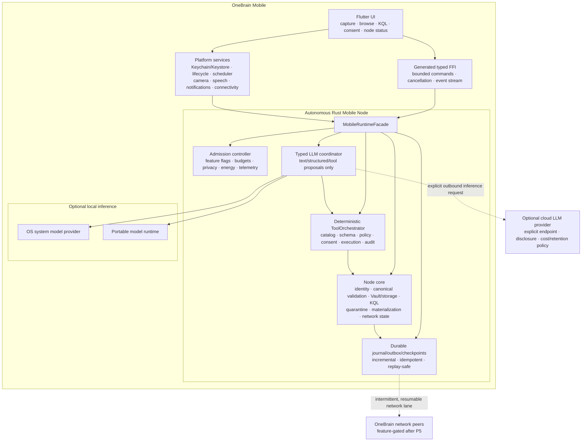
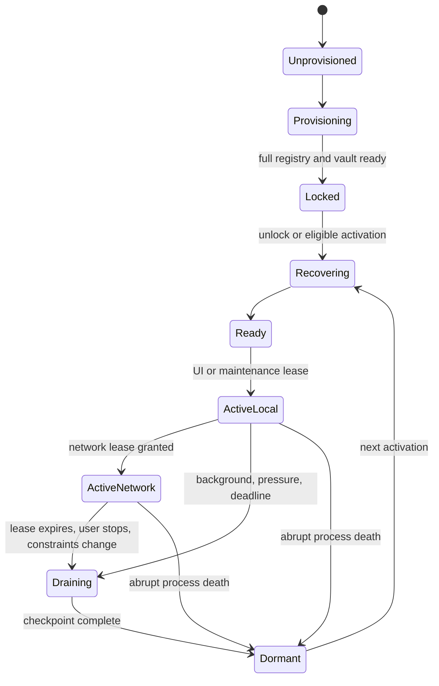

# WIP Mobile App Analysis and Implementation Plan V1.1

> Status: **DRAFT / decision proposal**
>
> Snapshot: **2026-07-29 (Asia/Saigon)**
>
> Scope: iOS, Android, an autonomous OneBrain mobile node, local or cloud LLM
> providers, deterministic tool execution, 2 GB+ initial concept data, and
> mobile process/network lifecycle.
>
> Runtime authority: when this document conflicts with
> [`WIP_DISTRIBUTED_RUNTIME_IMPLEMENTATION_PLAN_V2.md`](./WIP_DISTRIBUTED_RUNTIME_IMPLEMENTATION_PLAN_V2.md),
> the distributed-runtime plan wins. This document does not authorize M6, M7,
> OBT/wallet mutation, or a P5 production rollout.

---

## 0. Executive decision

Mobile work can start while the 72-hour runner is executing, but only as an
independent mobile architecture, toolchain, private/offline product, and LLM
workstream. It must not be used to bypass the remaining distributed-runtime
gates.

The product architecture is:

> **Autonomous Mobile Node**

- Mobile creates and owns its own node identity, vault, knowledge state,
  runtime journal, Concept Registry, network state, and operational lifecycle.
- It is not a desktop replica, desktop extension, thin client, or paired
  companion. Reusing Rust crates does not imply sharing a desktop process or
  desktop state.
- The phone remains useful with no network and no generative model.
- Rust owns identity, signing, canonical validation, local storage, KQL,
  proposal quarantine, materialization, consent, tool policy/execution, and
  network state.
- Flutter owns the mobile UI and invokes a narrow typed Rust facade through FFI.
- LLM inference is provider-neutral: it may run locally on the phone or through
  an explicitly configured cloud service. It is not tied to Ollama.
- The LLM can produce text, structured output, or tool-call proposals. OneBrain
  code validates, authorizes, executes, and audits tools; the LLM never executes
  a tool directly.
- The complete initial concept dataset may consume 2 GB or more. The design
  optimizes integrity, delivery, atomic activation, update, and bounded RAM
  access rather than reducing semantic coverage.
- Android foreground services and iOS continued/background tasks may extend
  execution, but neither makes the process immortal. Every operation is
  resumable, checkpointed, idempotent, and safe after abrupt process death.
- No LLM provider can sign, publish, materialize, assert truth, grant authority,
  execute tools, or infer Outcome/Benefit/OBT.

### Recommended UI stack

Use **Flutter + Rust FFI** as the baseline, subject to a compile/lifecycle spike.

Reasons:

1. Three existing design sources already converge on Flutter +
   `flutter_rust_bridge`, despite one scaffold README still listing alternatives.
2. Mobile needs first-class camera, share sheet, voice, biometric, background
   scheduling, push/local notifications, and native LLM adapters.
3. The current React/Tauri desktop shell is desktop-shaped and is not a mobile
   application entry point.
4. Flutter can call a C-compatible Rust boundary directly. The official Flutter
   workflow now supports native-code packages and generated bindings.

React Native is not recommended: there is no React Native code, no Rust bridge,
and it would add another native-module architecture without a repository
advantage. Tauri Mobile remains a contingency only if the Flutter/Rust spike
fails for a concrete reason.

### What “mobile node” means

It is a complete logical node with a mobile-specific implementation profile:

- its own NodeID/signing domains and protected key custody;
- its own canonical data store, user knowledge, journal, outbox, cursors and
  conflict branches;
- a complete versioned initial Concept Registry, even when it is packaged into
  multiple transport files;
- its own local KQL, mediator, tool registry and runtime policy;
- its own P2P/network participation when the operating system grants runtime;
- local and cloud LLM providers as replaceable inference dependencies;
- durable restoration after suspension, low-memory termination, reboot,
  update, rollback, and partial downloads.

“Autonomous” describes ownership and correctness. It does not promise that the
mobile process or inbound listener is continuously alive. A node can be
temporarily unreachable and remain the same node when its process restarts.

---

## 1. Current project status

The attached screenshot is consistent with the repository and public CI state at
the time of this snapshot.

| Area | Current state | Mobile consequence |
|---|---|---|
| P0, P1.1-P1.5 | Implementation and remote CI complete | Foundation invariants can be reused |
| P2.1-P2.5 | Runtime ownership/lifecycle/concurrency complete | Reuse patterns, not desktop budgets |
| P3.1-P3.4 | REST, private WS, CLI, Desktop/Web UX complete | Useful DTO/UX evidence; mobile uses its own in-process node facade |
| M5-00-M5-06 | Implementation/evidence complete | Reuse admission, telemetry, recovery, compaction patterns |
| M5-07 | Code, release smoke, and 24-hour evidence complete | Final 72-hour evidence still open |
| P5-01 | Three logical nodes on one host passed preflight | Not a production mobile/network canary |
| P5-02-P5-06 | Fault, restore, rollback, default-off, dashboard preflight passed | Good operational contract for future mobile lanes |
| P5 production | **Open** | 72-hour run, multi-host canary, and operator-approved rollout remain |
| Concept Registry operations | **No closed exit evidence found** | Blocks assuming a safe production registry update path |
| M6A/M6B | Not authorized yet | No active distributed KQL in mobile MVP |
| M7/OBT | Not started | No production wallet, rewards, or economic balance in mobile |

Evidence snapshot:

- Working tree was clean on `codex/p5-canary-preflight`.
- Branch head: `2bb53a4`; `main`: `1055db8`.
- [P5 CI run 30388449924](https://github.com/shpy2001gemi/OneBrain/actions/runs/30388449924)
  passed 5/5 jobs.
- [Pre-release 72-hour run 30382763222](https://github.com/shpy2001gemi/OneBrain/actions/runs/30382763222)
  was still in progress on `main@1055db8`.
- [Nightly 24-hour run 30287048429](https://github.com/shpy2001gemi/OneBrain/actions/runs/30287048429)
  passed.

### Evidence issue to resolve after the runner

The 72-hour run is executing on `main@1055db8`, while P5 operational preflight
is on `2bb53a4`. Before calling P5 complete, an ADR must answer one of:

1. prove that the soak-relevant binary/configuration is identical and formally
   carry evidence forward; or
2. merge the P5 changes and rerun the required soak profile.

The plan must also state whether this runner closes only DR-M5, or can be used
for any P5 exit criterion after a separate multi-host production canary.

---

## 2. Repository reality

### 2.1 Mobile is a scaffold, not an application

[`src/onebrain-mobile/README.md`](../../src/onebrain-mobile/README.md) is the
only mobile artifact. There is currently no:

- `pubspec.yaml`;
- Android or iOS project;
- Dart source;
- Swift/Kotlin platform plugin;
- `flutter_rust_bridge`, C ABI, UniFFI, or JNI boundary;
- mobile Rust target in CI;
- emulator, simulator, or physical-device test;
- mobile model runtime.

The mobile README also links to a missing `docs/ARCHITECTURE.md`.

### 2.2 Existing documents conflict

| Source | Current claim | Resolution in this plan |
|---|---|---|
| `src/onebrain-mobile/README.md` | Flutter or React Native through `onebrain-api`; Phase 9 | Replace after ADR acceptance |
| `src/Cargo.toml` | Flutter + `flutter_rust_bridge`; Phase 3 | Directionally accepted |
| `P10_UI_PLAN.md` | Flutter + FFI; embedded node | Accepted with mobile runtime restrictions |
| `P10_TECHNICAL_GUIDE.md` | Full/light node, direct P2P, optional AI | Replace the full/light distinction with an autonomous node using a mobile OS operating profile |
| `UI_FEATURE_TREE_DETAIL.md` | Very broad mobile parity | Treat as backlog ideas, not implemented capability |

The older P10 documents also contain statements that cannot be carried forward:

- “Rust is in the app process, therefore the OS does not kill it” is false.
- Ollama is not an on-device iOS/Android runtime.
- multi-device linking, revocation, migration, and selective sync are mostly
  design or unwired code, not production capability;
- BIP39 recovery is still placeholder logic;
- several UI collections/preferences are in-memory facades;
- wallet balances are simulated/non-economic and cannot be presented as real;
- “all KUs public”, automatic broadcast, global completeness, arrival-winner,
  or LWW behavior conflicts with the current runtime invariants.

### 2.3 Reusable Rust foundations

| Component | Reuse level | Mobile use |
|---|---|---|
| `onebrain-protocol` canonical types/codecs/limits | High | Canonical FFI/network DTO validation |
| `ku-core` identity and typed signers | High after platform signer adapter | Keep Node/Actor/Feed domains separate |
| `ku-core` storage and vault | Medium, requires device testing | Encrypted local state and integrity |
| `ku-kql` | High with mobile budgets | Offline local queries |
| `onebrain-node::vnext_companion` | High | Reuse its private offline planning logic; the historical module name does not define a desktop relationship |
| `onebrain-node::vnext_local_runtime` | High | Quarantined proposal and explicit materialization |
| `vnext_product_runtime` / network runtime | Medium | Reuse lifecycle, outbox, reconciliation patterns |
| `ku-ai::vnext_executor` | High | Typed budgets, deadlines, cancellation, provenance |
| `ku-ai::vnext_model_recall` | High | Symbolic validity firewall |
| `ku-ai::vnext_manifest` | High | Backend/model conformance and provenance |
| legacy `ModelBackend` + Ollama | Prototype interface / desktop adapter | Keep Ollama as one desktop provider; define a provider-neutral mobile LLM boundary |
| `onebrain-api` loopback server | Local web/desktop only | It is neither the in-process mobile FFI boundary nor a cloud-LLM gateway |
| React Web UI | Selective | Reuse use cases, vocabulary, tokens, and generated DTOs; not the desktop DOM shell |

Do not link the current `onebrain-node` monolith into the first mobile binary.
Even its local modules currently pull a broad mandatory dependency graph
including network, AI, encoder/mediator, storage, and a multi-thread Tokio
runtime. Create a thin `onebrain-mobile-core` crate, or first split real
`local-companion`, `legacy-runtime`, `ollama`, `storage-redb`, and `quic`
features. Reuse the local modules through this narrower graph.

### 2.4 Current blockers in code

1. `OneBrainNode` still constructs/uses Ollama-shaped AI paths rather than
   receiving all runtime services by dependency injection.
2. `AiConfig` defaults to Ollama and the only real backend is Ollama.
3. The model registry contains useful metadata but artifact SHA-256 fields are
   empty and no complete signed download/activation pipeline exists.
4. The current device-tier heuristic is desktop-oriented and does not model
   thermal state, memory pressure, battery, low-power mode, model residency, or
   mobile lifecycle.
5. Current vNext default budgets include server-shaped values such as
   512 MiB/1 GiB soft/hard storage pressure and large scan/session limits.
6. The local API binds loopback with a bearer token and localhost CORS. An
   autonomous mobile node must not route its own UI through that server, and the
   server must not be repurposed as a cloud-LLM gateway.
7. Some legacy API handlers hold a broad node lock across inference.
8. There is no canonical generated Dart/FFI schema; TypeScript DTOs are mirrored
   manually.
9. The complete Concept Registry artifact is approximately 2.2 GB before extra
   runtime overhead. That footprint is accepted, but no mobile delivery,
   free-space gate, signed verification, atomic activation, or rollback pipeline
   currently exists.
10. Legacy `create_backup`/`restore_backup` ignores its password boundary, uses
    plaintext JSON, and does not contain a complete canonical KU archive. The P5
    vNext backup drill is a different boundary and does not make this API safe.
11. The API and Tauri event bridges can both drain a receiver. Mobile needs one
    event owner and a sequence-aware fan-out/refetch contract so consumers do
    not divide or lose events.

---

## 3. Non-negotiable mobile invariants

Every mobile design, FFI command, LLM provider, sync protocol, and screen must
preserve the following:

1. A numeric `ConceptId` is not a global identity.
2. Raw KQL, `StandingNeed`, `LocalNeedTarget`, private goals, receptor/assembly
   identifiers, and user identifiers remain on their origin node.
3. A bounded result cannot assert global completeness or global absence.
4. A signature proves origin/integrity, not truth or authority.
5. Querying, retrieving, rendering, clicking, or path count is not
   `UseEvidence`.
6. `UseEvidence` or PoMV is not Outcome, Benefit, reward, or OBT.
7. Conflicts keep branches; arrival order is not a winner rule.
8. A missing dependency is `deferred/unknown`, not false or absent.
9. Local knowledge still works with network, PoMV, reward, and OBT lanes off.
10. Every new lane is independently default-off, kill-switchable, and
    rollbackable.
11. No global flooding is introduced.
12. Wallet/OBT semantics remain unchanged before M7.
13. Network matches enter as non-executable quarantined proposals.
14. Public Use requires prepare, exact intent display, and explicit confirmation.
15. LLM output is untrusted candidate data, never authority.

These invariants belong in Rust tests and FFI contract tests, not only UI copy.

---

## 4. Target architecture



### 4.1 Trust boundary

Rust is the deterministic trust boundary.

An LLM provider may return:

```text
LlmTurnOutput
  = Text
  | StructuredCandidate(schema_id, value)
  | ToolCallProposal(call_id, tool_name, arguments)

ProviderEnvelope
  + provider/model/runtime fingerprint
  + task and schema/catalog versions
  + input/output commitments
  + timing/resource/cost metadata
```

For a structured candidate, Rust:

1. validates bounds and schema;
2. applies canonical and symbolic invariants;
3. records provenance without treating it as truth;
4. shows a preview;
5. requires explicit user authority for materialization;
6. separately prepares and confirms any Public Use.

For a tool proposal, the deterministic `ToolOrchestrator`:

1. resolves the exact versioned tool definition;
2. rejects unknown tools, fields, types, sizes and stale call/catalog IDs;
3. applies node state, authority, data-class, network, budget and rate policy;
4. obtains preview/confirmation when the tool's risk class requires it;
5. calls the registered Rust/platform handler, never code supplied by the model;
6. bounds and redacts the result, records the audit/replay outcome, and only then
   returns a `ToolResult` to the next LLM turn.

The provider does not receive a private signing key, capability token usable
outside the orchestrator, raw database handle, shell, or generic
`materialize/sign/publish` function. Native provider tool-calling and
schema-constrained JSON are merely two ways to encode a proposal; neither changes
who executes it.

### 4.2 Runtime modes

Node execution state and LLM provider state are independent. The product must
represent both instead of defining the node by which model is active.

| Mode | Durable node state | LLM | Network | Expected behavior |
|---|---|---|---|---|
| Locked/stopped | Present, keys gated | Off | Off | No active runtime; safe cold restoration |
| Interactive offline | Open | Rules or none | Off | Capture, browse, KQL, export and deterministic tools |
| Interactive local LLM | Open | On-device provider | Optional | Candidate/chat/tool-proposal loop in the app process |
| Interactive cloud LLM | Open | Explicit cloud provider | Outbound HTTPS | Only the disclosed bounded inference payload leaves the node |
| User-visible node session | Open and checkpointing | Optional | Bounded P2P/outbound session | Android FGS or iOS continued-processing lease when eligible |
| Scheduled maintenance | Checkpointed | Normally off | OS-constrained | Verify/update/reconcile small resumable units |
| Degraded/recovery | Read-first | Off | Off | Recover storage/model/data update without loss |

The UI must show these states honestly. “Offline”, “LLM unavailable”, “node
paused”, “peer unreachable”, and “sync complete in the selected scope” are
different claims.

### 4.3 FFI boundary

Do not expose the complete `OneBrainNode` across FFI. Introduce a narrow
`MobileRuntimeFacade` in a thin `onebrain-mobile-core` with:

- versioned generated request/response DTOs;
- opaque handles instead of raw Rust pointers;
- bounded lists, strings, blobs, and pagination;
- asynchronous calls with deadline and cancellation token;
- an event stream with sequence/cursor and refetch semantics;
- no long-held global node mutex;
- explicit error codes suitable for localization;
- no secrets in logs or Dart exceptions;
- ABI/schema compatibility tests.

Follow the `VNextProductServices` pattern: clone a bounded service handle under
the aggregate lock, then execute the operation outside that lock. Use one event
owner to fan out sequence-numbered projections; an event is a hint to refetch,
not the only copy of durable state.

Representative command groups:

```text
runtime.start / runtime.stop / runtime.status
identity.create / identity.unlock / identity.sign_typed
knowledge.capture_draft / knowledge.validate / knowledge.materialize
knowledge.list / knowledge.get / knowledge.search_local / kql.execute_local
llm.providers / llm.run_typed / llm.cancel
tool.catalog / tool.preview / tool.confirm / tool.cancel
model.list / model.download / model.activate / model.rollback / model.delete
registry.status / registry.provision / registry.verify / registry.activate
public_use.prepare / public_use.confirm / public_use.cancel
network.status / network.session_start / network.pause
sync.status / sync.reconcile / sync.pause
backup.create / backup.inspect / backup.restore
```

Network, cloud-LLM, recovery, and Public Use commands only appear after their own
protocol, disclosure, and release gates pass.

---

## 5. Mobile product scope

### 5.1 Define two MVPs

To avoid coupling mobile progress to P5, define:

- **Private Offline MVP**: useful personal knowledge capture and retrieval with
  every network/public lane disabled.
- **Networked Mobile Beta**: enables this node's bounded P2P/outbound network
  lane only after upstream and mobile-specific gates. It is not a desktop
  companion mode.

### 5.2 Feature matrix

| Capability | Private Offline MVP | Networked Beta | Later / blocked |
|---|---:|---:|---|
| vi/en onboarding and honest capability check | Yes | Yes | |
| App lock and protected key use | Yes | Yes | |
| Real recovery or encrypted migration | Required before external beta | Yes | Placeholder BIP39 is not acceptable |
| Text quick capture and local draft | Yes | Yes | |
| Share sheet / Android share intent | Yes | Yes | |
| Camera OCR | After permission/quality spike | Yes | |
| Voice capture / local transcription | After capability spike | Yes | |
| Local browse, detail, filters | Yes | Yes | |
| Keyword search and local KQL | Yes | Yes | |
| Small 2D neighborhood view | Optional | Yes | No 3D graph in MVP |
| Rule-based encode/candidate preview | Yes | Yes | |
| Optional local structured LLM | Capability-gated | Yes | Never required |
| Optional cloud LLM | Explicit opt-in | Yes | Exact data/cost/retention disclosure; no silent fallback |
| Local semantic search | Capability/model-gated | Yes | |
| Full open-ended “second brain” chat | Limited | Limited | Broader only after evaluation |
| Model status/download/delete/rollback | If portable model lane enabled | Yes | |
| Full Concept Registry provision/status/update | Required | Required | Multiple transport artifacts are one atomic logical release |
| Encrypted export/backup/restore | Required | Required | New vault-encrypted/versioned archive; never the legacy plaintext path |
| Runtime, storage, LLM and sync status | Yes | Yes | |
| Authenticated peer enrollment | No | After node protocol | Peer is another node, not a required desktop host |
| Incremental reconciliation | No | Yes after protocol | Store-carry-forward, durable and conflict-preserving |
| User-visible P2P node session | No | Feature-gated | OS lease, P5 and mobile canary required |
| One-hop discovery | No | Feature-gated | Quarantined results only |
| Active distributed KQL | No | No | Blocked by M6 |
| Auto-publish/background Public Use | Never | Never | Explicit prepare/confirm only |
| Social feed/trending/global completeness | No | No | Requires separate semantics |
| Production wallet/reward/OBT | No | No | Blocked until M7; hide simulated values |

### 5.3 Primary mobile journeys

#### Journey A: private capture

```text
Share/text/photo/voice
  -> local normalized draft
  -> rule/model candidate
  -> Rust validation
  -> editable preview
  -> explicit Save locally
  -> encrypted storage
```

No network is needed, and saving locally does not imply publication.

#### Journey B: local recall

```text
Need/search text
  -> local keyword/KQL
  -> optional local embedding rerank
  -> bounded result with provenance
  -> detail/neighborhood
```

A zero result is worded as “No matching item in the searched local scope”.

#### Journey C: explicit Public Use

```text
User selects a local item
  -> prepare exact Public Use intent
  -> display target, payload class, scope, expiry and consequences
  -> biometric/app re-authorization if policy requires
  -> explicit Confirm
  -> signed durable outbox item
  -> bounded foreground/scheduled attempt
```

The app never converts a local save, share-sheet import, notification action, or
LLM suggestion into Public Use automatically.

#### Journey D: LLM proposes, OneBrain executes

```text
User asks in Assistant
  -> select an allowed local or explicitly configured cloud LLM
  -> minimize/disclose the inference context
  -> receive text, structured data, or ToolCallProposal
  -> validate proposal against the versioned ToolCatalog
  -> apply authority, data, network, energy and risk policy
  -> preview/confirm if required
  -> deterministic Rust/platform handler executes
  -> bounded/redacted ToolResult is audited and returned to the LLM loop
```

The same policy is applied whether a provider supports native function calling
or only grammar/schema-constrained JSON. Provider convenience APIs never become
OneBrain authority.

---

## 6. Mobile LLM and deterministic tool architecture

### 6.1 Current state

Mobile LLM inference does not exist in the codebase.

- `ku-ai` has Ollama and mock backends.
- Ollama is a desktop/self-hosted adapter, not the mobile runtime contract.
- the legacy `ModelBackend` lacks the full mobile contract for streaming,
  cancellation, deadline, sensitivity, retention, provenance, memory pressure,
  lifecycle, and artifact management;
- the existing model registry contains empty artifact hashes;
- current tier detection is based mostly on aggregate RAM/VRAM.

The stronger starting point is `TypedCognitiveExecutor` /
`TypedCapabilityBackend`, including task typing, budgets, deadlines,
cancellation, replay guard, commitments, and provenance.

Do not reuse the legacy AI tool lane for mobile:

- `AiEncoder::encode` creates a `KuToolExecutor`, can inject `new_ku`, executes
  model-selected calls, injects `finalize`, and then finalizes again;
- `KuToolExecutor` uses string dispatch, has non-transactional batches,
  `lookup_or_create`, direct numeric Concept IDs, and unconditional concept
  logging;
- the graph agent can assemble KQL with string interpolation or accept raw
  model-generated KQL.

`encode_v2` is closer to the required design: the LLM extracts candidate SPO
data, then deterministic code analyzes, resolves, builds, and validates it. It
still needs constrained output, cancellation, disclosure and provenance.
Model-produced query text must become a typed `QueryIntent`; a deterministic
builder/parser applies escaping, policy, `LIMIT`, and scan budgets.

### 6.2 Provider contract

Create a capability-based `MobileLlmProvider`; do not expose vendor names to
domain logic and do not put tool implementations on this interface.

Required capabilities:

```text
availability()
descriptor() -> provider/model/runtime/OS/local-or-cloud fingerprint
capabilities() -> streaming/structured/tool-proposal/context limits
start_turn(LlmRequest, budget, disclosure, cancellation)
stream(task_id) -> TextDelta | ToolArgumentsDelta | Usage | Completed | Failed
cancel(task_id)
unload(reason)
resource_snapshot()
```

`LlmRequest` contains only minimized messages, a task/schema version, bounded
tool schemas as data, catalog commitment, input commitment, budgets, and the
approved disclosure class. It never contains an executor handle.

Execute no proposal until the complete argument object is available, the turn
has finished successfully, the schema/catalog commitments still match, and
policy has been revalidated. A streaming `done` event from a cancelled,
interrupted, or incomplete response is not authority.

Provider selection must consider:

- task and schema conformance;
- offline availability;
- model/version fingerprint;
- current free memory and memory-pressure callbacks;
- thermal state and low-power mode;
- battery/charging state;
- storage and model integrity;
- foreground/background state;
- measured Vietnamese and English quality;
- user policy and data-disclosure scope.

Parameter count or nominal total RAM is not enough.

The provider implementation does not have to live inside Rust. Apple
Foundation Models or Android AICore/ML Kit adapters may live in a Swift/Kotlin
or Flutter plugin and exchange versioned `LlmJob`, `ProviderCapabilities`,
`ProviderFingerprint`, and `LlmCandidate` messages with Rust. Rust still
minimizes context and validates every returned candidate.

Embeddings, OCR, speech recognition, deterministic encoder stages, KQL and
indexing are node services with their own contracts and budgets. They are not
LLM tool executors and must not inherit LLM authority.

### 6.3 Deterministic tool orchestrator

Every LLM-visible tool has a versioned descriptor:

```text
ToolDescriptor
  + stable tool ID, version and schema hash
  + input/output JSON schemas and byte/item/work bounds
  + effect class and required capability/permit
  + foreground/network/key requirements
  + confirmation policy
  + idempotency/retry/reconcile semantics
  + result visibility: LocalOnly | UserOnly | MayReturnToProvider
```

The durable tool state is:

```text
Proposed -> SchemaValidated -> PolicyChecked -> AwaitingConsent
         -> Authorized -> Prepared -> Executing
         -> Committed | Aborted | Unknown
```

After process death, an idempotent call may reconcile by its stable key. A
non-idempotent call in `Unknown` is never replayed blindly. LLM generation may be
discarded and regenerated; side effects use their own durable journal.

| Effect class | Examples | Default policy |
|---|---|---|
| `READ_LOCAL_BOUNDED` | local KQL/search/status | Session allowlist; strict result bounds |
| `DERIVE_LOCAL` | construct draft/query plan/sort | May run automatically; output remains candidate data |
| `MUTATE_LOCAL_REVERSIBLE` | save draft, change a reversible preference | Preview or explicit user policy; audit and idempotency required |
| `DISCLOSE_OR_NETWORK` | cloud context, send peer envelope, fetch remote URL | Exact destination/data-class disclosure and scoped consent |
| `PUBLIC_OR_SIGNED` | Public Use or typed signature | Dedicated non-LLM prepare/confirm flow with re-authorization |
| `FORBIDDEN_TO_LLM` | private-key export, raw DB/SQL, shell/code execution, arbitrary publish, authority grants, destructive erase | Never placed in the LLM catalog |

A local tool result can still be private. Returning `local_search` results to a
cloud provider is a second disclosure decision governed by
`result_visibility`; successful tool execution does not authorize that return.
Vendor built-in web, code, shell, remote MCP, or auto-executed functions remain
off in the authoritative loop. Needed capabilities are exposed as ordinary
OneBrain tools with schema, permit, limits, consent, and audit.

### 6.4 Provider lanes

| Lane | Role | Advantages | Constraints | Recommendation |
|---|---|---|---|---|
| No-LLM baseline | Deterministic capture, KQL and tools | Small, fast, always available | No generative semantics | Mandatory |
| Apple Foundation Models | iOS system-model fast path | On-device, structured generation, no bundled weights | Eligible device/OS/region/user setting; model changes with OS | Optional provider |
| Android ML Kit GenAI / Gemini Nano | Android system-model fast path | On-device, no app-managed weight | Device allowlist, foreground-only inference, quota, preview status, and current age/usage terms | Legal-gated experiment, never sole fallback |
| LiteRT-LM | Portable app-managed LLM candidate | Android/iOS, hardware acceleration, stable C++ boundary | Swift/wrapper maturity and model-format supply chain to prove | Benchmark candidate |
| llama.cpp / GGUF | Portable app-managed control/fallback | Broad model ecosystem, C/C++ boundary, constrained output options | Native build, device-specific acceleration and memory tuning | Benchmark candidate |
| ExecuTorch | Alternative edge runtime | iOS/Android/C++, multiple hardware backends | Another export/runtime toolchain | Reserve based on benchmark/model needs |
| Cloud/custom endpoint | Larger or specialized LLM | No local model residency; broad capability | Network, privacy, retention, region, cost and availability | Explicit opt-in provider; never silent fallback |

No provider is selected for production by documentation alone.

At this snapshot, ML Kit GenAI inference is documented as foreground-only and
subject to per-app/battery quota. Its additional terms require users to be at
least 18 and prohibit using it in an app directed toward or likely accessed by
people under 18. Unless the intended audience and legal review satisfy those
terms, OneBrain must not ship that provider.

For the first vertical slice, benchmark LiteRT-LM and llama.cpp/GGUF through the
same OneBrain C/Rust contract. LiteRT-LM is a leading mobile candidate;
llama.cpp remains the portable control with broad GGUF and grammar support. This
orders engineering work; it is not a production-runtime decision.

Do not build a new direct NNAPI integration. Android documents NNAPI as
deprecated since Android 15; use a maintained higher-level runtime and prove its
actual backend on the device matrix.

Cloud support must allow BYOK or an explicitly approved broker/custom endpoint.
No master provider key is embedded in the application. Secrets remain in
Keychain/Keystore-backed storage and are used only by the outbound adapter.
Before every request, a `ContextDisclosureGate` records destination, data
classes, retention/training/region capabilities, estimated cost and user policy.
Switching local to cloud never carries conversation/tool context implicitly.

### 6.5 M0 LLM bake-off

Use the same task corpus, schema, quantization target, and devices to compare at
least LiteRT-LM and llama.cpp. System providers are measured as optional lanes,
not as the control.

Required test corpus:

- vi/en intent classification;
- concept/entity extraction;
- structured `CandidateKuDraft`;
- local query rewrite;
- bounded summarization;
- refusal and malformed/adversarial input;
- long Vietnamese diacritics and mixed-language text;
- schema-conformance and hallucinated-field cases;
- malformed, unknown, stale-catalog and over-budget tool proposals;
- incomplete/cancelled streamed tool arguments;
- prompt-injection attempts to acquire forbidden tools or disclose local data.

Required metrics:

- task quality and structured-output validity;
- time to first token and tokens/second;
- cold/warm start;
- peak and steady RSS;
- binary and model size;
- energy per task and thermal escalation;
- cancellation and unload latency;
- crash/process-death recovery;
- partial/corrupt model behavior;
- provider/version reproducibility.

Initial device matrix should include:

- one supported Apple Intelligence iPhone;
- one older supported iPhone without the system model lane;
- one 8 GB mainstream Android;
- one flagship Android with a hardware accelerator;
- one low-resource Android used to prove the no-generative-LLM path.

### 6.6 LLM capability modes

| Mode | Promise |
|---|---|
| `LLM-0` | No generative model; deterministic capture/search/tools still work |
| `LLM-SYSTEM` | OS-provided model available for conformant bounded tasks |
| `LLM-LOCAL-SMALL` | App-managed small quantized model, opt-in download |
| `LLM-LOCAL-LARGE` | Larger app-managed model on benchmark-approved devices |
| `LLM-CLOUD` | Explicitly selected remote inference with disclosure controls |

The UI reports the active mode and why another mode is unavailable. Cloud is not
a higher tier and is never selected silently.

### 6.7 Model supply chain

Replace the current incomplete model registry with a signed, versioned mobile model
manifest containing:

- artifact CID and cryptographic hash;
- source repository and immutable revision;
- model, tokenizer, template, quantization and runtime format;
- license and redistribution decision;
- supported providers/platforms/architectures;
- minimum OS and measured device classes;
- disk, peak RSS, context and cache budgets;
- task/schema conformance vector;
- vi/en evaluation version and results;
- safety/policy notes;
- download source and expected bytes;
- activation compatibility and rollback target.

Download behavior:

1. no generative weights in the base app by default;
2. explicit opt-in and exact disk disclosure;
3. resumable staging with bounded temporary storage;
4. verify signature/hash/license metadata before load;
5. atomic activation;
6. keep the last known-good compatible version;
7. auto-rollback on failed health/conformance check;
8. allow complete deletion;
9. never publish restricted model weights through the public DHT.

### 6.8 LLM safety boundary

An LLM may propose or rank. It may not:

- declare a concept mapping canonical;
- resolve a conflict branch;
- turn `unknown/deferred` into false;
- decide that the network has no result;
- create `UseEvidence` from a view/click/query;
- infer Outcome/Benefit/reward;
- sign as Node, Actor, or Feed;
- materialize or publish;
- expand data-disclosure, tool, or network scope;
- execute a tool or choose its confirmation policy;
- access private keys.

---

## 7. Full Concept Registry on mobile

### 7.1 Accepted data profile

The mobile node carries the complete logical Concept Registry. The current
workspace release is:

| Artifact | Bytes |
|---|---:|
| `concepts.obr` | 1,306,104,050 |
| `concepts.obr.labels.idx` | 519,133,960 |
| `concepts.obr.ccids.idx` | 382,317,040 |
| Three data artifacts | **2,207,555,050 (2.056 GiB)** |
| Manifest + local verification metadata | 2,623 |

Splitting these artifacts into store packs or resumable chunks is a transport
decision only. It does not create a compact semantic profile. The node is not
`READY` until the OBR, label index, CCID index and signed release envelope for
one exact release have all verified. It never mixes file generations.

### 7.2 Runtime access

Use `IndexedConceptRegistry`: memory-map the immutable label/CCID sidecars and
read OBR records on demand. Do not use legacy `ConceptRegistry::load_obr`, which
materializes the registry and is incompatible with mobile RAM.

- each activated release lives in an immutable version directory;
- readers hold `Arc<RegistryGeneration>` so in-flight queries finish on the old
  generation after an atomic swap;
- indexes are built off-device, never rebuilt on a phone;
- query/result/page caches are explicitly bounded;
- active mapped files are never truncated, overwritten, or deleted;
- the old version is garbage-collected only after the health window and the last
  reader release.

Accepting 2 GB+ on disk does not authorize eager heap loading or desktop
concurrency defaults.

### 7.3 Authenticity and release envelope

The current manifest has BLAKE3, sizes and license information but no publisher
signature. `verification.json` is a host-local cache involving size/mtime; it is
not publisher authenticity.

Define two separate records:

1. a canonical signed publisher release envelope containing release sequence,
   key ID/signature, artifact hashes/CIDs/sizes, schema/index versions,
   min/max runtime compatibility, source revision, license/SBOM/provenance,
   rollback compatibility and Concept/CCID change summary;
2. a device-local activation receipt created only after artifact verification
   and open/index smoke checks.

Pin a release root, support key rotation/revocation, and reject replay or
downgrade. App Store, Play and CDN TLS are transport controls, not OneBrain
release authority.

### 7.4 Provision and A/B activation

```text
ABSENT -> DISCOVERED -> SPACE_RESERVED -> DOWNLOADING -> COMPLETE
       -> VERIFYING -> READY -> ACTIVE
                         \-> FAILED/CLEANABLE
```

For both first provision and update:

1. reserve and report exact peak space before transfer;
2. write immutable resumable chunks with a durable ledger;
3. verify each chunk, then the complete signed release;
4. open and probe all three artifacts and index headers;
5. atomically commit `{previous, current, generation}` in one small durable
   transaction;
6. swap the in-process `Arc<RegistryGeneration>`;
7. retain N-1 through a health window and roll back the pointer on failure.

A kill at any chunk, verification step, pointer commit, runtime swap, or cleanup
must leave either the old or new complete release active. An unclean restart
reconciles receipts and pointers before admitting queries.

### 7.5 Storage admission

Let `A` be the active release, `N` the next release, `C` any retained
compressed/container copy, `W` verification workspace, `D` private node data
plus model files, and `R` the OS safety reserve:

```text
required_free_before_update >= N + C + W + R
peak_total_storage          = A + N + C + W + D
```

For the current registry, streaming immutable files directly to the next version
gives `A + N = 4,415,110,100` bytes (about 4.11 GiB) before workspace, models,
private data and reserve. Keeping another full archive while unpacking raises
registry-only peak to about 6.17 GiB. Avoid that copy. The setup/update UI must
show the exact calculation; a practical device gate may be 5.5-6 GiB free for
streaming A/B and 7-8 GiB for archive/unpack, subject to measured release
metadata.

### 7.6 Platform delivery

| Platform | Bootstrap/update strategy |
|---|---|
| Android Play | Three Play Asset Delivery packs fit the current 1.5 GB-per-pack and 4 GB cumulative install-time limits. Activate only when all packs match the signed release. Store paths are re-resolved on every launch. |
| Android independent update | Signed range/resumable CDN transfer through an appropriate user-initiated/OS-managed job when registry cadence must be independent of the AAB. Persist the chunk ledger because jobs/FGS can stop. |
| iOS 26+ | Prefer managed/Apple-hosted Background Assets for an essential full release, with explicit A/B import or versioned pack strategy. Assets may update independently of the executable. |
| iOS 16.4-25 | Use unmanaged/self-hosted Background Assets or background `URLSession` with range/resume and signed verification. |

The active app-controlled release belongs in durable application-support/internal
storage, not cache or backup. Public registry bytes need authenticity/integrity,
not per-file application encryption that defeats mmap; private node data and keys
remain separately encrypted. Large transfers default to unmetered network,
charging/battery-not-low and adequate thermal state, with exact user-visible
override.

Before networked beta, evidence must cover signed provenance, capacity pressure,
interrupted first provision/update, corrupt/reordered chunks, cold/open query
latency and page faults, A/B rollback, reboot/force-stop, and activation while
readers are live.

---

## 8. Mobile lifecycle and background execution

### 8.1 Three separate lifetimes

The architecture separates:

1. **Logical node** — durable NodeID, keys, authoritative local store, full
   registry, journals, outbox and policy. This remains the same node when no
   process exists.
2. **Runtime activation** — a temporary process epoch opened by the UI, an iOS
   background task, Android Worker/user-initiated job, or Android foreground
   service.
3. **Network presence lease** — a shorter, expiring statement that this node is
   currently reachable on a specific connectivity epoch.

Every activation receives a bounded OS-derived lease:

```text
ExecutionLease {
  cause, deadline, process_generation,
  foreground_visibility,
  network_constraints, energy_constraints,
  cancellation
}
```

One activation arbiter owns the database writer/runtime. A stale callback from
an earlier process generation cannot commit into the current generation.

### 8.2 Durable state and abrupt death



`OS_KILLED` is not a callback. The next launch detects a durable `STARTED` epoch
without a matching `QUIESCED` record and performs recovery. Correctness must not
depend on `onDestroy`, an expiration callback, or graceful shutdown.

Startup recovery, in order:

1. acquire the single runtime/writer generation;
2. recover vault/database/WAL and active registry receipt;
3. reconcile tool calls in `Prepared/Executing/Unknown`;
4. reconcile outbox, inbound receipts, cursors and scheduled work;
5. invalidate stale sockets/timers/callbacks;
6. admit local work, then activate network only if a fresh lease permits it.

Outgoing intent is durable before send; inbound data is durable before receipt.
Timers and push notifications are wake hints, never the only record of work.

### 8.3 Platform execution reality

| Work | iOS | Android |
|---|---|---|
| Interactive local/node session | Full while foreground | Full while foreground |
| Short completion/checkpoint | UIKit background execution grace | Lifecycle callback plus bounded worker/FGS drain |
| Deferrable maintenance | `BGAppRefreshTask` / `BGProcessingTask`, scheduled and interruptible | WorkManager with charging/network/battery constraints |
| User-started long operation | iOS 26+ `BGContinuedProcessingTask`, visible progress/Live Activity, cancellable and still terminable | User-initiated data transfer or correctly typed FGS with visible notification |
| Large registry/model HTTP transfer | Background Assets/background `URLSession` | Play Asset Delivery, user-initiated transfer, DownloadManager/OS-managed transfer |
| Generic always-on P2P listener | **Not available** | No guarantee; only an opt-in, user-visible, policy-compliant bounded session |

On iOS, `BGProcessingTask` is system-scheduled and can be interrupted.
`BGContinuedProcessingTask` is for a user-started job with a completion goal, not
an infinite peer daemon. Background `URLSession` can continue HTTP(S) artifact
transfer outside the app process; it does not carry custom QUIC/OBP traffic.
Background push can be throttled/coalesced and is only a wake hint.

On Android:

- Android 12+ normally blocks starting an FGS from the background;
- Android 14+ requires the correct service type and permission;
- Android 15+ limits background `dataSync`/`mediaProcessing` FGS time; the
  `dataSync` allowance is an aggregate six hours per 24 hours for the app;
- the user can stop an FGS/app from Task Manager without a cleanup callback;
- WorkManager/JobScheduler and long-running workers remain quota- and
  constraint-governed;
- `dataSync` is valid only during real transfer/reconciliation;
  `connectedDevice` and `remoteMessaging` must not be misdeclared, while
  `specialUse` requires a defensible use case and Play review.

Therefore an Android “Online session” is user-visible, stoppable, time-boxed,
and offers Wi-Fi-only/charging/end-time controls. It is not named “Always on”.
iOS has no equivalent generic mode. The release must pass App Store background
mode and Google Play FGS-policy review before these lanes are enabled.

### 8.4 Network behavior for an intermittently reachable node

The node is autonomous but connectivity is intermittent:

- use outbound-first reconciliation and store-carry-forward semantics;
- keep durable peer cursors, resume tokens, idempotency keys and conflict
  branches; absence of a reachable peer never proves absence of data;
- treat `{NodeID, endpoint, connectivity_epoch, expires_at, source}` as a route;
  an IP address/socket is never identity;
- publish presence only for a live network lease with a short TTL;
- on Wi-Fi/cellular/VPN/path change, increment the connectivity epoch, fence old
  sockets, reconnect and resume from the durable journal;
- use direct connectivity first and a bounded opaque relay only if the approved
  protocol provides one; a relay gains no node authority;
- perform LAN discovery only in an explicit foreground window with platform
  local-network permissions;
- push is optional rendezvous advice, not a replication or completion
  guarantee.

Do not run the desktop defaults as a mobile daemon. In particular, no dormant
15-second QUIC keepalive, one-second lane polling, in-memory retry deadline, or
unbounded shutdown drain. Persist `not_before`; wake by event/OS scheduler; batch
work; checkpoint and close.

### 8.5 LLM lifecycle

Node data and tool journals are durable; a model session and KV cache are
ephemeral.

- foreground-to-background stops admitting new tool proposals;
- generation receives a deadline, drains/cancels, and records no side effect
  outside the tool journal;
- app-managed model memory unloads on memory/thermal/low-power policy;
- cloud streams are cancellable and safe to retry only as inference, not as a
  replay of completed tool effects;
- Android ML Kit GenAI remains a top-foreground-only provider even if an FGS is
  running;
- a background local-model lane is enabled only after the exact runtime,
  entitlement/service type, device and energy evidence passes.

### 8.6 Energy and network policy

- batch reconciliation and transfers, then close the radio/session;
- prefer unmetered network plus charging/battery-not-low for 2 GB registry or
  large model downloads, with exact cost and a user override;
- on constrained/expensive network, Data Saver, Low Power Mode, low battery, or
  serious thermal pressure, disable discovery and background LLM, reduce cache,
  and retain only explicit urgent bounded work;
- use Android partial wakelocks only around a bounded active batch with a hard
  timeout; do not add one around idle presence;
- drive connectivity from platform callbacks, not polling;
- measure with physical-device energy tools and Android vitals; do not publish a
  battery-per-day claim before evidence.

### 8.7 Resource admission

Create mobile-specific budgets for:

- active/next registry, model, private data, WAL/staging and OS free-space
  reserve;
- Rust heap, mmap/page faults and model RSS;
- FFI request/response bytes;
- KQL scans and result count;
- model context/KV cache;
- concurrent LLM and tool tasks;
- peers, handshakes and per-peer window;
- outbox bytes/items and relay TTL;
- execution/network lease duration;
- camera/audio input duration;
- telemetry cardinality and log retention.

Numeric release budgets must be established from physical-device evidence. Do
not reuse desktop/server defaults or equate 2 GB of accepted disk data with
unbounded RAM, radio, or concurrency.

---

## 9. Identity, keys, privacy and external boundaries

### 9.1 Key custody

Maintain protocol-compatible Ed25519 signing domains through typed signer
interfaces.

Do not claim that every Secure Enclave/StrongBox directly stores an Ed25519 key:
hardware key stores support a platform/device-dependent algorithm set. A safe
portable design is:

1. generate the protocol Ed25519 secret locally;
2. encrypt it with a random wrapping key;
3. protect the wrapping key or protected item through Keychain/Android Keystore;
4. require device credential/biometric policy for sensitive use;
5. expose only typed signing operations to Rust/domain callers;
6. zeroize plaintext key material as soon as practical;
7. never use a compatibility file seed in a release build.

Biometrics gate local key use; they are not OneBrain identity, global authority,
or traditional server login.

NodeID, ActorID and FeedID remain separate. A desktop node has no parent,
hosting, recovery, inference, or authority privilege over a mobile node merely
because both belong to the same user.

### 9.2 Recovery

The current BIP39-shaped recovery path is not cryptographically complete.
Before external beta choose and implement one audited design:

- real mnemonic derivation with versioned parameters; or
- encrypted recovery package with a separately verified recovery key; or
- an approved combination.

Tests must cover wrong words/password, downgrade, duplicate restore, revoked
device, partially restored data, old app version, and no-network recovery.

Never tell users that knowledge can be recovered “from the network” unless an
explicit replication guarantee and evidence actually exists.

### 9.3 Cloud LLM boundary

Cloud inference is optional and never changes node ownership.

- support BYOK, an explicitly approved short-lived-token broker, or a custom
  endpoint; never embed a provider master key in the app;
- keep provider credentials in Keychain/Keystore-backed storage and outside
  prompts, logs, tool results and node backups by default;
- show provider, endpoint/region, data classes, retention/training posture,
  estimated cost and network state before enabling the lane;
- run a `ContextDisclosureGate` before every outbound turn and before returning
  any local tool result to the provider;
- switching local to cloud starts with reclassified/minimized context; it does
  not silently forward existing history;
- no silent local-to-cloud fallback, including when the local model is
  unavailable or interrupted;
- vendor server-side browsing, code execution, file search or remote MCP is off
  unless represented as a separately authorized OneBrain tool;
- cancellation, timeout, partial streaming output, provider error and billing
  metadata cannot commit a node side effect.

Provider retention or “no training” behavior is a versioned capability backed by
current provider configuration/evidence, not a hard-coded assumption.

### 9.4 Node peer boundary

The current loopback Bearer API is not a mobile peer protocol. A normal
mobile-to-node relationship requires:

- mutually authenticated node identities and ephemeral transport sessions;
- per-capability scopes, expiry, replay protection and revocation;
- encrypted, bounded, rate-limited requests;
- durable peer cursor/resume and branch-preserving reconciliation;
- audit history and safe key rotation;
- no token in URL/query logs;
- no desktop-specific accelerator, storage-owner or authority role.

QR may be one out-of-band enrollment UX, but the resulting party is an ordinary
peer. “Same LAN” and “same user” do not themselves authorize data disclosure.

---

## 10. UI information architecture

### Private Offline MVP navigation

1. **Home**: quick capture, recent local items, runtime state.
2. **Library**: local browse, search, filters, saved drafts.
3. **Capture**: text/share/photo/voice sources, candidate preview.
4. **Assistant**: optional local/cloud LLM; clearly labels provider, disclosure
   state, tool approvals and limitations.
5. **Settings**: privacy, registry/storage, model/provider, backup, identity,
   network sessions and diagnostics.

Do not include a Wallet tab, global feed, “network-wide” result count, or
production reward display.

### Status language

Prefer precise independent indicators:

- `Node data: Provisioning / Ready / Locked / Recovering / Read-only`
- `Runtime: Dormant / Interactive / Background lease / Draining`
- `LLM: None / System / Local / Cloud <provider> / Unavailable`
- `Network presence: Unreachable / Interactive / Online session / Paused`
- `Sync: Up to date in selected scope / N pending / Unknown`

Avoid a single green “Online” badge that hides LLM, privacy, or synchronization
state.

### Reuse from Web/Desktop

Reuse:

- feature vocabulary and user journeys;
- color/type tokens after accessibility review;
- API/domain types through code generation;
- empty/loading/error/degraded semantics;
- exact Public Use confirmation concepts.

Redesign for mobile:

- navigation and information density;
- detail drawer/table/chart layouts;
- graph interaction;
- capture and permission flows;
- model/storage management;
- background/sync expectations;
- touch targets, screen readers, dynamic type, and reduced motion.

---

## 11. Work packages

### MOB-00 — Authority and ADRs

Deliver:

- this plan reviewed;
- ADR: Autonomous Mobile Node + OS-governed Activation Runtime;
- ADR: Flutter + generated Rust FFI;
- ADR: logical node, process activation and presence lease are distinct;
- ADR: provider-neutral local/cloud LLM + deterministic ToolOrchestrator;
- ADR: recovery scheme;
- ADR: complete signed Concept Registry + A/B mobile delivery;
- source-of-truth precedence over stale P10/UI feature documents.

Exit:

- no unresolved contradiction about API client, desktop companion, or autonomous
  in-process node;
- “node”, “activation”, “reachable”, “offline”, “local LLM”, “cloud LLM”, and
  “tool execution” are defined.

### MOB-01 — Toolchain and feasibility spike

Deliver:

- minimal Flutter iOS/Android application;
- generated Dart-to-Rust call;
- Rust compile for Android arm64, iOS device and simulator;
- async call, event stream, cancellation, and bounded error;
- cold start and app-size baseline;
- CI compile jobs.

Exit:

- physical-device launch on both platforms;
- no undefined ABI/thread ownership;
- documented fallback if the selected bridge fails.

### MOB-02 — Mobile runtime profile

Deliver:

- thin `onebrain-mobile-core` dependency graph and `MobileRuntimeFacade`;
- `RuntimeServices` injection for signer, storage, clock, LLM, connectivity,
  scheduler, telemetry and paths;
- mobile feature flags and resource budgets;
- remove mandatory Ollama construction from the mobile dependency graph;
- local KQL and private-planning/runtime smoke flow.

Exit:

- app works with no network and no generative model;
- repeated start/stop and process-death recovery are clean.

### MOB-03 — Secure identity and durable private storage

Deliver:

- platform-protected wrapping/signing adapter;
- app lock and re-authorization policy;
- encrypted storage/vault integration;
- real recovery or encrypted migration;
- backup/restore with manifest, integrity and versioning;
- a new vault-encrypted/versioned archive path; the legacy plaintext backup API
  is not exposed;
- redacted logs and privacy diagnostics.

Exit:

- security review;
- kill/restart/update/rollback/corrupt-backup test;
- no plaintext release seed or private key in Dart/logs.

### MOB-04 — Private Offline MVP

Deliver:

- vi/en onboarding;
- text capture and share sheet;
- local draft, validation, preview and save;
- library/browse/detail/search/local KQL;
- export/backup;
- runtime/storage status;
- accessibility baseline.

Exit:

- complete journey in airplane mode with LLM disabled;
- no network socket is required;
- no simulated wallet/reward surface.

### MOB-05 — Complete registry provision and update

Deliver:

- signed publisher envelope and device activation receipt;
- Android PAD and iOS Background Assets feasibility spikes;
- resumable app-controlled/CDN fallback;
- full-release space admission and exact storage UI;
- immutable A/B activation, live-reader generation swap, rollback and GC;
- mmap/index query benchmark and bounded page/cache policy.

Exit:

- one complete 2.2 GB-class release provisions and opens on both platforms;
- mixed/corrupt/incompatible releases fail closed;
- kill/disk-full/reboot/update/rollback matrix passes;
- no eager full-registry heap load or deletion of a live mapped generation.

### MOB-06 — LLM providers, tools and model supply chain

Deliver:

- `MobileLlmProvider` and normalized streaming events;
- deterministic versioned `ToolOrchestrator`, permits, risk classes,
  confirmation, result-visibility gate and durable execution journal;
- no-LLM baseline and typed candidate/query-plan validation;
- LiteRT-LM versus llama.cpp physical-device bake-off;
- optional Apple/Android system-provider adapters;
- explicit cloud/BYOK/custom-provider disclosure adapter;
- signed model manifest, download, verify, activate, rollback and delete.

Exit:

- vi/en quality, latency, RAM, energy and structured/tool conformance report;
- cancellation/memory-pressure/process-death/incomplete-stream evidence;
- corrupt/incompatible model and malicious/stale tool proposal fail closed;
- no provider can execute, materialize, sign, publish, or silently disclose a
  local tool result.

### MOB-07 — Activation, media, energy and background work

Deliver:

- activation arbiter with process generation, deadline and cancellation;
- unclean-epoch recovery and unknown-tool reconciliation;
- camera OCR and voice capture behind permissions/capability checks;
- iOS Background Tasks/continued-processing/background-transfer adapters;
- Android WorkManager/user-initiated-transfer/FGS adapters with correct types;
- bounded outbox maintenance, local notifications and connectivity callbacks;
- thermal, low-power, memory-, disk- and metered-network policy;
- zero-idle-polling/keepalive mobile profile.

Exit:

- abrupt kill without callback at each commit boundary passes;
- iOS suspend/expiration/force-quit and Android Stop/Doze/quota/timeout matrices
  pass on physical devices;
- dormant mode has no node polling, socket keepalive or wakelock;
- measured resource/energy report and store-policy review.

### MOB-08 — Normal node networking and reconciliation

Entry gates:

- P5 production gates closed;
- Concept Registry operations exit evidence closed;
- node peer authorization/revocation protocol approved;
- mobile private MVP stable.

Deliver:

- authenticated peer enrollment as ordinary OneBrain nodes;
- outbound-first durable incremental reconciliation;
- branch-preserving conflicts;
- expiring presence/connectivity epochs and path-change recovery;
- Android user-visible Online session and opportunistic iOS/Android work;
- status/history/revocation UI and independent network kill switch.

Exit:

- two-device and multi-host canary;
- privacy wire capture;
- replay/revoke/partial-sync/process-death/path-change/relay-loss drills;
- local KQL remains usable with all network flags off.

### MOB-09 — Release engineering

Deliver:

- signed builds and store metadata;
- SBOM and third-party/model/registry license inventory;
- database/registry/model/app migration matrix;
- crash symbolication with privacy-safe telemetry;
- staged rollout and rollback;
- operator dashboard and incident runbook;
- mobile-specific canary and soak profile.

Exit:

- external beta checklist passed on physical devices;
- recovery and rollback proven;
- no open P0 security/privacy/data-loss issue.

---

## 12. Test and evidence matrix

| Layer | Required evidence |
|---|---|
| Rust unit/property | Canonical bounds, invariants, conflict branches, unknown/deferred |
| FFI contract | Generated schema, ABI compatibility, cancellation, bounded payloads |
| Golden vectors | Same canonical IDs/signatures/codecs across desktop, iOS, Android |
| Storage | kill during write, low disk, corrupt page/archive, migration, rollback |
| Identity | platform key gate, wrong credential, revoked device, recovery |
| Registry | full provision, A/B space pressure, signed verification, live mmap swap, rollback |
| LLM | schema/tool conformance, incomplete stream, provenance, model tamper, cancellation |
| Tools | catalog/schema/permit/consent, idempotency, unknown outcome, result visibility |
| Privacy | cloud disclosure gate; no raw private KQL/need/user identifiers on wire; redacted logs |
| Lifecycle | no-callback kill, background expiry, suspension, Stop/force-quit, reboot/update |
| Resource | peak RSS, storage, cold start, thermal, energy per task/session |
| Network | presence TTL, bounded admission, replay, path change, partition, duplicate, revocation |
| UX | airplane mode, no-LLM mode, permission denial, vi/en, accessibility |
| Release | signed artifact, SBOM/license, staged rollout, rollback |

CI minimum:

- Rust compile/check for Android arm64 and iOS device/simulator;
- Dart analyze/unit/widget tests;
- generated FFI drift check;
- canonical vector tests;
- Android emulator and iOS simulator smoke where supported;
- scheduled physical-device lab runs for lifecycle, energy, thermal, camera,
  biometric/key storage and real model inference.

A simulator passing is not evidence for mobile resource, secure hardware,
background, radio, thermal, or model performance.

---

## 13. Risk register

| Risk | Severity | Mitigation / gate |
|---|---:|---|
| Treating node identity as an always-live process/socket | Critical | Logical node + activation/presence leases; sudden-death tests |
| Copying desktop Ollama/node profile | Critical | Mobile service injection, no Ollama dependency, explicit budgets |
| Key exposure across FFI/Dart/logs | Critical | Typed signer, OS-protected wrapping, redaction, security review |
| Placeholder recovery loses identity/data | Critical | Block external beta until real recovery/migration passes |
| LLM output or vendor SDK executes effects | Critical | Proposal-only provider + deterministic ToolOrchestrator |
| Cloud context/tool result leaks private content | Critical | Per-turn/result disclosure gate; no silent fallback |
| Tool outcome duplicates after kill | Critical | Durable state/idempotency/reconciliation; no blind replay of `Unknown` |
| Legacy plaintext/incomplete backup reaches mobile | Critical | Hide it; implement and drill a new encrypted versioned archive |
| Model artifact tamper/license violation | High | Signed manifest, hashes, license gate, atomic activation |
| OOM/thermal/battery regression | High | Capability router, unload/cancel, device budgets, measured gates |
| Registry update peak exceeds free storage | High | Exact A/B capacity gate, direct chunk writes, N-1 GC/rollback |
| Full registry is eager-loaded or active mmap overwritten | Critical | Indexed on-demand access, immutable generations, live-reader fencing |
| FGS/background mode rejected or killed | High | Correct types/use cases, store review, resumable work, kill switches |
| Multi-device facade mistaken for production peer sync | High | MOB-08 entry gate and end-to-end canary |
| Stale P10 feature matrix becomes scope commitment | High | Authority ADR and explicit feature matrix in this plan |
| Wallet placeholder shown as economic truth | High | Exclude from mobile until M7 |
| 72-hour evidence applied to a different artifact | High | Evidence carry-forward ADR or rerun |
| Two UI stacks duplicate product behavior | Medium | Flutter mobile only; share Rust contracts and design tokens |
| Vendor system model unavailable/changes | Medium | Rule baseline, provider fingerprint, portable provider, conformance |
| Android system-model terms exclude intended users | High | Legal gate; keep provider absent unless current terms and audience permit |

---

## 14. Resolved direction and remaining decisions

Owner direction resolved in this revision:

1. mobile is an autonomous node, not a desktop replica/extension/companion;
2. the complete initial Concept Registry may consume 2 GB or more;
3. LLM inference may be local or explicitly configured cloud;
4. OneBrain deterministic logic, not the LLM/provider SDK, executes tools;
5. node correctness must survive OS suspension and kill.

Remaining decisions:

1. Accept Flutter + Rust FFI as the mobile baseline after MOB-01.
2. Define minimum iOS/Android versions and supported device classes after the
   toolchain, registry and LLM spikes.
3. Select the recovery design; do not inherit the current placeholder.
4. Select portable local LLM runtime(s) only after the bake-off.
5. Select registry/model artifact hosting and independent release cadence.
6. Select supported cloud trust modes: BYOK, broker and/or custom endpoint.
7. Decide whether Android exposes a user-visible Online session and complete
   store-policy review; do not promise an iOS equivalent.
8. Define peer-enrollment/revocation vocabulary and whether network features
   appear in the first public beta.
9. Decide whether the 72-hour evidence can carry from `1055db8` to the P5
   artifact.

None of these decisions requires waiting idly for the current runner. MOB-00 and
MOB-01 can begin immediately without enabling a distributed production lane.

---

## 15. Immediate next slice

Recommended next implementation slice:

1. approve MOB-00 architecture decisions;
2. update the mobile README and mark conflicting P10 sections as historical;
3. scaffold the Flutter application and generated Rust FFI boundary;
4. cross-compile the smallest reusable local runtime;
5. prove storage open/write/restart and a typed local KQL call on both platforms;
6. open the complete current registry through `IndexedConceptRegistry`, measure
   RSS/page faults, and prove immutable A/B pointer recovery;
7. implement a no-op `MobileLlmProvider` plus proposal-only
   `ToolOrchestrator` contract and kill-safe journal;
8. prove activation generation, cancellation and no-callback process-death
   recovery;
9. run the local LLM bake-off and cloud disclosure spike separately from the
   product MVP;
10. keep network/Public Use flags absent or forced off in the first spike.

This slice produces evidence about the hardest unknowns without coupling mobile
progress to completion of the 72-hour distributed-runtime run.

---

## 16. External primary references

Snapshot references used for mobile platform assumptions:

- [Flutter native FFI](https://docs.flutter.dev/platform-integration/bind-native-code)
- [Rust iOS targets](https://doc.rust-lang.org/stable/rustc/platform-support/apple-ios.html)
- [Rust Android targets](https://doc.rust-lang.org/rustc/platform-support/android.html)
- [Apple Background Tasks](https://developer.apple.com/documentation/BackgroundTasks/refreshing-and-maintaining-your-app-using-background-tasks)
- [Apple background execution grace](https://developer.apple.com/documentation/uikit/extending-your-app-s-background-execution-time)
- [Apple BGProcessingTask](https://developer.apple.com/documentation/backgroundtasks/bgprocessingtask)
- [Apple BGContinuedProcessingTask](https://developer.apple.com/documentation/backgroundtasks/bgcontinuedprocessingtask)
- [Apple long-running background tasks](https://developer.apple.com/documentation/BackgroundTasks/performing-long-running-tasks-on-ios-and-ipados)
- [Apple background downloads](https://developer.apple.com/documentation/foundation/downloading-files-in-the-background)
- [Android WorkManager](https://developer.android.com/develop/background-work/background-tasks/persistent)
- [Android long-running workers](https://developer.android.com/develop/background-work/background-tasks/persistent/how-to/long-running)
- [Android user-initiated data transfer](https://developer.android.com/develop/background-work/background-tasks/uidt)
- [Android foreground-service restrictions](https://developer.android.com/develop/background-work/services/fgs/restrictions-bg-start)
- [Android foreground-service types](https://developer.android.com/develop/background-work/services/fgs/service-types)
- [Android foreground-service timeouts](https://developer.android.com/develop/background-work/services/fgs/timeout)
- [Android user stopping a foreground service](https://developer.android.com/develop/background-work/services/fgs/handle-user-stopping)
- [Google Play foreground-service policy](https://support.google.com/googleplay/android-developer/answer/16559646)
- [Android network energy optimization](https://developer.android.com/develop/connectivity/network-ops/network-access-optimization)
- [Apple hosted asset packs](https://developer.apple.com/help/app-store-connect/manage-asset-packs/overview-of-apple-hosted-asset-packs/)
- [Apple unmanaged Background Assets](https://developer.apple.com/documentation/backgroundassets/configuring-an-unmanaged-background-assets-project)
- [Apple build file-size limits](https://developer.apple.com/help/app-store-connect/reference/app-uploads/maximum-build-file-sizes)
- [Android Play Asset Delivery](https://developer.android.com/guide/playcore/asset-delivery)
- [Google Play app and asset-pack size limits](https://support.google.com/googleplay/android-developer/answer/9859372)
- [Apple Foundation Models](https://developer.apple.com/documentation/FoundationModels)
- [Apple Foundation Models updates](https://developer.apple.com/documentation/Updates/FoundationModels)
- [Google LiteRT-LM](https://github.com/google-ai-edge/LiteRT-LM)
- [llama.cpp](https://github.com/ggml-org/llama.cpp)
- [ML Kit GenAI availability and foreground limits](https://developers.google.com/ml-kit/genai)
- [ML Kit GenAI additional terms](https://developers.google.com/ml-kit/genai-terms)
- [Android NNAPI deprecation](https://developer.android.com/ndk/guides/neuralnetworks/)
- [ExecuTorch Android](https://docs.pytorch.org/executorch/stable/using-executorch-android.html)
- [ExecuTorch iOS](https://docs.pytorch.org/executorch/stable/using-executorch-ios.html)
- [Gemini function-calling responsibility](https://ai.google.dev/gemini-api/docs/function-calling)
- [ONNX Runtime Mobile](https://onnxruntime.ai/docs/tutorials/mobile/)
- [Apple Keychain Services](https://developer.apple.com/documentation/security/keychain-services/)
- [Apple Secure Enclave key constraints](https://developer.apple.com/documentation/Security/protecting-keys-with-the-secure-enclave)
- [Android Keystore](https://developer.android.com/privacy-and-security/keystore)
