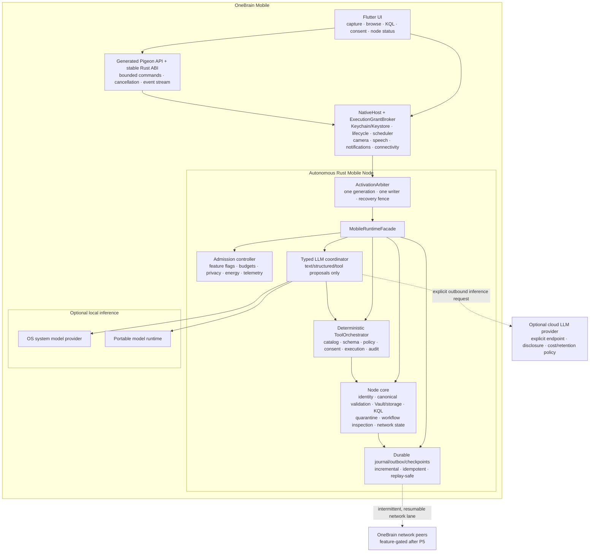
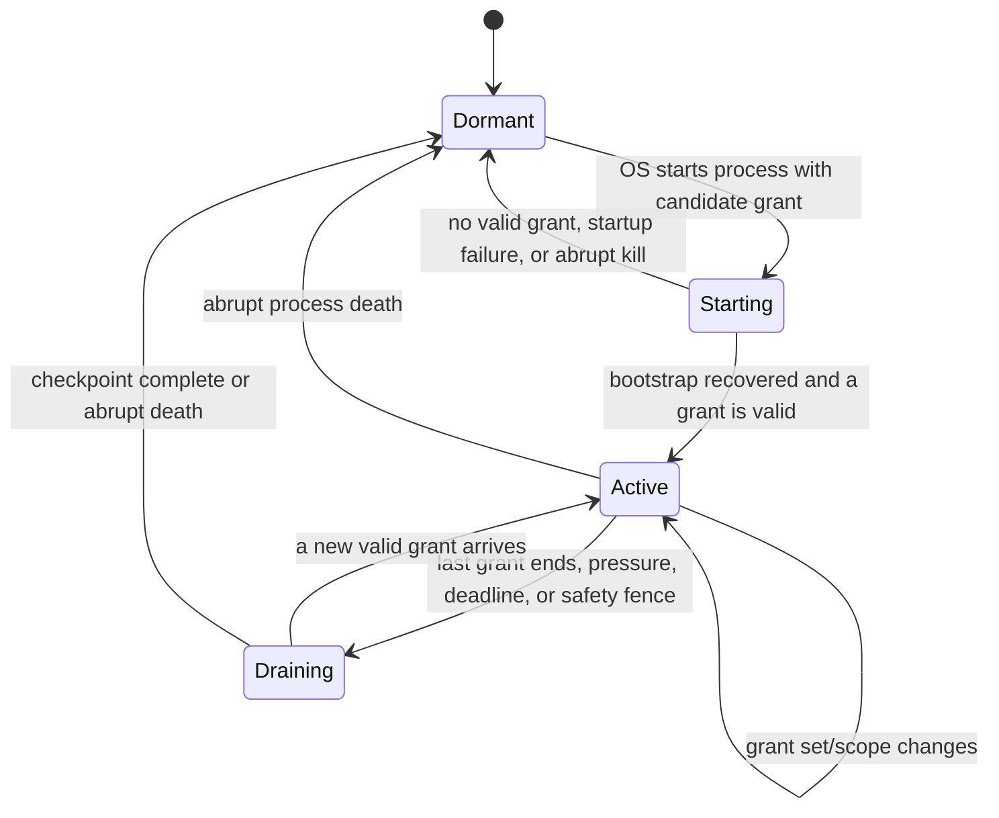

# WIP Mobile App Analysis and Implementation Plan V1.3

> Status: **ACTIVE IMPLEMENTATION / MOB-05A ADMISSION + MOB-05B ABI-11 NATIVE STREAM FOUNDATION IMPLEMENTED / PRODUCTION HTTPS NEXT**
>
> Snapshot: **2026-08-02 (Asia/Saigon)**
>
> Scope: iOS, Android, an autonomous OneBrain mobile node, local or cloud LLM
> providers, deterministic tool execution, 2 GB+ post-launch Init data, and
> mobile process/network lifecycle.
>
> Runtime authority: when this document conflicts with
> [`WIP_DISTRIBUTED_RUNTIME_IMPLEMENTATION_PLAN_V2.md`](./WIP_DISTRIBUTED_RUNTIME_IMPLEMENTATION_PLAN_V2.md),
> the distributed-runtime plan wins. This document does not authorize M6, M7,
> OBT/wallet mutation, or a P5 production rollout.
>
> Detailed component, database, AI, localization, notification, media, P2P,
> security, and lifecycle design:
> [`WIP_MOBILE_APP_TECHNICAL_ARCHITECTURE_V1.md`](./WIP_MOBILE_APP_TECHNICAL_ARCHITECTURE_V1.md).
>
> Mobile product decomposition:
> [`MOBILE_APP_FEATURE_TREE_V1.md`](../features/mobile/MOBILE_APP_FEATURE_TREE_V1.md),
> [`MOBILE_APP_FEATURE_DETAILS_V1.md`](../features/mobile/MOBILE_APP_FEATURE_DETAILS_V1.md),
> and [`MOBILE_APP_SITEMAP_V1.md`](../features/mobile/MOBILE_APP_SITEMAP_V1.md).
>
> Mobile visual system, components and screen patterns:
> [`MOBILE_DESIGN_SYSTEM_V1.md`](../design/mobile/MOBILE_DESIGN_SYSTEM_V1.md).
>
> Mandatory implementation compliance gate:
> [`MOBILE_BUILD_HARNESS_V1.md`](../design/mobile/MOBILE_BUILD_HARNESS_V1.md).

---

## 0. Executive decision

Mobile work can start while the 72-hour runner is executing, but only as an
independent mobile architecture, toolchain, private/offline product, and LLM
workstream. It must not be used to bypass the remaining distributed-runtime
gates.

The product architecture is:

> **Autonomous Mobile Node**

- Mobile creates and owns its own node identity, vault, knowledge state,
  runtime journal, Concept Registry, network state, and operational lifecycle.
- It is not a desktop replica, desktop extension, thin client, or paired
  companion. Reusing Rust crates does not imply sharing a desktop process or
  desktop state.
- The phone remains useful with no network and no generative model.
- Rust owns identity, signing, canonical validation, local storage, KQL,
  proposal quarantine, read-only workflow projections, consent, tool
  policy/execution, and network state. Mapping materialization/adoption is not
  exposed until future feature IDs and gates exist.
- Flutter owns the mobile UI and invokes a narrow native host; that host and
  OS background entry points activate the same typed Rust facade.
- LLM inference is provider-neutral: it may run locally on the phone or through
  an explicitly configured cloud service. It is not tied to Ollama.
- The LLM can produce text, structured output, or tool-call proposals. OneBrain
  code validates, authorizes, executes, and audits tools; the LLM never executes
  a tool directly.
- The production APK/AAB/IPA is a bootstrap shell. The complete initial Concept
  Registry is downloaded only through the user-visible Init feature after
  first launch and may consume 2 GB or more. The design optimizes integrity,
  resumable delivery, atomic activation, update, and bounded RAM access rather
  than reducing semantic coverage.
- Android foreground services and iOS continued/background tasks may extend
  execution, but neither makes the process immortal. Every operation is
  resumable, checkpointed, idempotent, and safe after abrupt process death.
- No LLM provider can sign, publish, materialize, assert truth, grant authority,
  execute tools, or infer Outcome/Benefit/OBT.

### Recommended UI stack

Use **Flutter + Swift/Kotlin NativeHost + Rust core** as the baseline, subject
to a compile/lifecycle spike.

Reasons:

1. Three existing design sources already converge on Flutter +
   `flutter_rust_bridge`, despite one scaffold README still listing alternatives.
2. Mobile needs first-class camera, share sheet, voice, biometric, background
   scheduling, push/local notifications, and native LLM adapters.
3. The current React/Tauri desktop shell is desktop-shaped and is not a mobile
   application entry point.
4. Flutter can use a generated Pigeon API to the native host, while Swift/Kotlin
   calls a stable C ABI/JNI Rust boundary. This also works when an OS background
   callback runs without a Flutter engine.

React Native is not recommended: there is no React Native code, no Rust bridge,
and it would add another native-module architecture without a repository
advantage. Tauri Mobile remains a contingency only if the Flutter/Rust spike
fails for a concrete reason.

### What “mobile node” means

It is a complete logical node with a mobile-specific implementation profile:

- its own NodeID/signing domains and protected key custody;
- its own canonical data store, user knowledge, journal, outbox, cursors and
  conflict branches;
- a complete versioned initial Concept Registry after post-launch Init; none of
  its `.obr`/index bytes, compressed copies or chunks is bundled in the
  executable or an automatic install-time/fast-follow/prefetch asset mode;
- its own local KQL, mediator, tool registry and runtime policy;
- its own P2P/network participation when the operating system grants runtime;
- local and cloud LLM providers as replaceable inference dependencies;
- durable restoration after suspension, low-memory termination, reboot,
  update, rollback, and partial downloads.

“Autonomous” describes ownership and correctness. It does not promise that the
mobile process or inbound listener is continuously alive. A node can be
temporarily unreachable and remain the same node when its process restarts.

---

## 1. Current project status

This snapshot separates implemented code, automated evidence, physical-device
exit evidence, and future gated behavior. A compiled screen, fixture test, or
target document does not close a work-package exit by itself.

| Area | Current state | Mobile consequence |
|---|---|---|
| P0, P1.1-P1.5 | Implementation and remote CI complete | Foundation invariants can be reused |
| P2.1-P2.5 | Runtime ownership/lifecycle/concurrency complete | Reuse patterns, not desktop budgets |
| P3.1-P3.4 | REST, private WS, CLI, Desktop/Web UX complete | Useful DTO/UX evidence; mobile uses its own in-process node facade |
| M5-00-M5-06 | Implementation/evidence complete | Reuse admission, telemetry, recovery, compaction patterns |
| M5-07 | Code, release smoke, and 24-hour evidence complete | Final 72-hour evidence still open |
| P5-01 | Three logical nodes on one host passed preflight | Not a production mobile/network canary |
| P5-02-P5-06 | Fault, restore, rollback, default-off, dashboard preflight passed | Good operational contract for future mobile lanes |
| P5 production | **Open** | 72-hour run, multi-host canary, and operator-approved rollout remain |
| Concept Registry operations | Signed-release, atomic-activation, CCID-stability, bounded resource and truncated-index/disk-shortage qualification foundations implemented | Reuse the contracts, but full-size storage/resource, target-filesystem and quarterly operational exits remain open |
| M6A/M6B | Not authorized yet | No active distributed KQL in mobile MVP |
| M7/OBT | Not started | No production wallet, rewards, or economic balance in mobile |

### 1.1 Mobile implementation snapshot

| Area | Implemented/evidenced now | Still open |
|---|---|---|
| Authority and design contract | Hash-pinned architecture, implementation plan, 123 features, 112 screens, 62 shared components, 13 patterns, generated tokens, validator and subtree agent rules | Continuous authority maintenance and owner review when semantics change |
| Flutter/native/Rust foundation | Flutter shell, generated Pigeon Dart/Kotlin/Swift API, Android JNI and iOS C ABI build, thin Rust mobile core/bridge, Android release package scans, iOS simulator compile and Windows goldens | Physical launch on both platforms and store-grade signed packages |
| Runtime profile | One-writer process generation, bounded grants, callback fence, bootstrap ledger, signed local KQL fixture, private planner, kill/restart recovery and no-network/no-model default | Full platform/background adapter matrix and physical-device lifecycle evidence |
| Security/private storage | Android Keystore, iOS Keychain adapter, installation binding, encrypted vault/archive, backup exclusions, fail-closed unexpected-restore tests | Physical backup/restore inspection, biometric/protected-data matrices and complete user recovery UX |
| Limited private shell | vi/en onboarding, adaptive shared shell, encrypted text capture, Android share spool, Limited status, media import and My Media OwnedOriginal shelf | Canonical KU encode/preview/private Save, complete Library/search/KQL/backup journeys and all remaining screens |
| Registry Init | Signed admission, durable transfer ledger, ABI-11 native recovery/streaming and Android 14+ UIDT schedule plus native checkpoint/kill/resume/`BytesComplete` emulator proof; release still excludes Registry bytes, `INTERNET`, trust profile and descriptor | Owner-issued trust/descriptor, HTTPS landing/range/chunk transfer, iOS background `URLSession`, 2.2 GB qualification, A/B activation, health, rollback and `ReadyOffline` |
| AI/tools | No-LLM baseline, signed local KQL fixture and proposal-only private-planner feasibility | Provider contract implementation, deterministic ToolOrchestrator journal, local runtime bake-off, system providers, cloud disclosure and model supply chain |
| Media | Android picker streams to bounded encrypted Rust staging; verified bytes activate as deduplicated `OwnedOriginal` with an owned hold and force-stop recovery | Final piece/pack and manifest layout, viewer, derived share representation, received media, range verification, ENOSPC/large-file matrix and GC |
| Networking/seeding | No network authority is present in the BootstrapOnly app | P5 and Registry entry gates, peer authorization, reconciliation, provider leases, opportunistic seed policy and multi-device canary |

Current branch evidence:

- branch `codex/mobile-autonomous-node` includes mobile authority commit
  `24c25a1`, the prior P5/Concept Registry integration `d860999`, and Registry
  failure qualification through `cbe5495` via clean merge `d9270f7`;
- `Mobile foundation` run `30690349111` passed Android, iOS simulator and
  Windows golden jobs;
- `Mobile build contracts` run `30690349095` passed;
- `vNext foundation contract` run `30690349100` passed;
- the integration review is `MOB-00` authority maintenance; the implemented
  mobile feature baseline remains `MOB-07` partial and `MOB-05` is the next
  critical path;
- validation is emulator/simulator-first and does not claim physical-device
  completion.

Evidence snapshot:

- Remote `codex/p5-canary-preflight` is at `cbe5495`; remote `main` remains at
  `1055db8` in this snapshot.
- [P5 CI run 30701845332](https://github.com/shpy2001gemi/OneBrain/actions/runs/30701845332)
  passed 5/5 jobs.
- [Pre-release 72-hour run 30382763222](https://github.com/shpy2001gemi/OneBrain/actions/runs/30382763222)
  was abandoned after about 51 hours 30 minutes when the self-hosted runner
  lost GitHub connectivity for an extended interval; it is useful diagnostic
  evidence but does not satisfy the 72-hour gate.
- [Nightly 24-hour run 30287048429](https://github.com/shpy2001gemi/OneBrain/actions/runs/30287048429)
  passed.

### Distributed-runtime evidence still to resolve

P5 and Concept Registry preflight code through `cbe5495`, including bounded
truncated-index and disk-shortage failure qualification, is now integrated into
the mobile branch at `d9270f7`. This does not close P5 production. The abandoned
`main@1055db8` run cannot be carried as a completed 72-hour artifact. Before a
production rollout, run a fresh pinned 72-hour profile on the selected release
artifact, complete the multi-host canary, close the remaining full-size Concept
Registry qualification gates, and obtain explicit operator approval.

This separation allows `MOB-05` and other private/offline mobile work to proceed
without waiting for the rerun. `MOB-08`, peer networking, seeding and any
production rollout remain fail-closed.

---

## 2. Repository reality

### 2.1 Mobile is now an implemented BootstrapOnly application

[`src/onebrain-mobile`](../../src/onebrain-mobile) now contains the Flutter
application, Android and iOS hosts, generated Pigeon APIs, JNI/C ABI Rust
bridge, shared token-driven UI, localization, integration tests, package
scanners and compliance evidence. The workspace also contains the thin
`onebrain-mobile-core` and `onebrain-mobile-bridge` crates.

This is not yet a complete product or a `ReadyOffline` node. The current binary
is deliberately BootstrapOnly: it has no Registry/model payload and no network
authority. Android emulator, iOS simulator compile and automated packaging
evidence exist; physical-device exits remain open.

### 2.2 Existing documents conflict

| Source | Current claim | Resolution in this plan |
|---|---|---|
| `src/onebrain-mobile/README.md` | Flutter or React Native through `onebrain-api`; Phase 9 | Replace after ADR acceptance |
| `src/Cargo.toml` | Flutter + `flutter_rust_bridge`; Phase 3 | Directionally accepted |
| `P10_UI_PLAN.md` | Flutter + FFI; embedded node | Accepted with mobile runtime restrictions |
| `P10_TECHNICAL_GUIDE.md` | Full/light node, direct P2P, optional AI | Replace the full/light distinction with an autonomous node using a mobile OS operating profile |
| `UI_FEATURE_TREE_DETAIL.md` | Very broad mobile parity | Treat as backlog ideas, not implemented capability |

The older P10 documents also contain statements that cannot be carried forward:

- “Rust is in the app process, therefore the OS does not kill it” is false.
- Ollama is not an on-device iOS/Android runtime.
- multi-device linking, revocation, migration, and selective sync are mostly
  design or unwired code, not production capability;
- BIP39 recovery is still placeholder logic;
- several UI collections/preferences are in-memory facades;
- wallet balances are simulated/non-economic and cannot be presented as real;
- “all KUs public”, automatic broadcast, global completeness, arrival-winner,
  or LWW behavior conflicts with the current runtime invariants.

### 2.3 Reusable Rust foundations

| Component | Reuse level | Mobile use |
|---|---|---|
| `onebrain-protocol` canonical types/codecs/limits | High | Canonical FFI/network DTO validation |
| `ku-core` identity and typed signers | High after platform signer adapter | Keep Node/Actor/Feed domains separate |
| `ku-core` storage and vault | Medium, requires device testing | Encrypted local state and integrity |
| `ku-kql` | High with mobile budgets | Offline local queries |
| `onebrain-node::vnext_companion` | High | Reuse its private offline planning logic; the historical module name does not define a desktop relationship |
| `onebrain-node::vnext_local_runtime` | High for read/quarantine paths | Reuse quarantined proposals and workflow evidence; do not expose its materialization command until a future mobile feature/gate |
| `vnext_product_runtime` / network runtime | Medium | Reuse lifecycle, outbox, reconciliation patterns |
| `ku-ai::vnext_executor` | High | Typed budgets, deadlines, cancellation, provenance |
| `ku-ai::vnext_model_recall` | High | Symbolic validity firewall |
| `ku-ai::vnext_manifest` | High | Backend/model conformance and provenance |
| legacy `ModelBackend` + Ollama | Prototype interface / desktop adapter | Keep Ollama as one desktop provider; define a provider-neutral mobile LLM boundary |
| `onebrain-api` loopback server | Local web/desktop only | It is neither the in-process mobile FFI boundary nor a cloud-LLM gateway |
| React Web UI | Selective | Reuse use cases, vocabulary, tokens, and generated DTOs; not the desktop DOM shell |

Do not link the current `onebrain-node` monolith into the first mobile binary.
Even its local modules currently pull a broad mandatory dependency graph
including network, AI, encoder/mediator, storage, and a multi-thread Tokio
runtime. Create a thin `onebrain-mobile-core` crate, or first split real
`local-companion`, `legacy-runtime`, `ollama`, `storage-redb`, and `quic`
features. Reuse the local modules through this narrower graph.

### 2.4 Current blockers remaining

1. Shared runtime now supplies signed Registry release verification, atomic
   activation/rollback, CCID stability and bounded resource-qualification
   foundations. `MOB-05` still has not implemented the mobile signed channel
   head/acceptance transaction, explicit capacity/network confirmation,
   platform transfer, mobile A/B health/GC or 2.2 GB-class device evidence.
2. The canonical KU encoding/preview/private Save path is not connected to the
   Limited capture shell. Generic publication remains separately gated.
3. My KU, Received KU, Received Media, verified viewing/download and range
   verification are not implemented; My Media currently covers local
   `OwnedOriginal` summaries only.
4. Media still lacks the final logical-piece/physical-pack manifest contract,
   large-file/ENOSPC matrix, derived share representations, grants and GC.
5. Mobile AI has no selected local runtime, production provider adapter,
   ToolOrchestrator execution journal, signed model supply chain or disclosure-
   safe cloud route. Ollama is not a mobile requirement or fallback.
6. Thermal, low-power, metered-network, background scheduling, notifications,
   outbox and zero-idle resource policies are not fully implemented or measured.
7. Physical-device lifecycle, backup/restore, protected-data, energy and store-
   policy evidence remains open across `MOB-01`, `MOB-03`, `MOB-05`, `MOB-07`
   and `MOB-09`.
8. Normal peer networking, seeding, verifier exchange and OBP match remain
   absent behind their explicit upstream/mobile gates.

---

## 3. Non-negotiable mobile invariants

Every mobile design, FFI command, LLM provider, sync protocol, and screen must
preserve the following:

1. A numeric `ConceptId` is not a global identity.
2. Raw KQL, `StandingNeed`, `LocalNeedTarget`, private goals, receptor/assembly
   identifiers, and user identifiers remain on their origin node.
3. A bounded result cannot assert global completeness or global absence.
4. A signature proves origin/integrity, not truth or authority.
5. Querying, retrieving, rendering, clicking, or path count is not
   `UseEvidence`.
6. `UseEvidence` or PoMV is not Outcome, Benefit, reward, or OBT.
7. Conflicts keep branches; arrival order is not a winner rule.
8. A missing dependency is `deferred/unknown`, not false or absent.
9. Local knowledge still works with network, PoMV, reward, and OBT lanes off.
10. Every new lane is independently default-off, kill-switchable, and
    rollbackable.
11. No global flooding is introduced.
12. Wallet/OBT semantics remain unchanged before M7.
13. Network matches enter as non-executable quarantined proposals.
14. Public UseEvidence requires prepare, exact intent display, and explicit
    confirmation.
15. LLM output is untrusted candidate data, never authority.

These invariants belong in Rust tests and FFI contract tests, not only UI copy.

---

## 4. Target architecture



### 4.1 Trust boundary

Rust is the deterministic trust boundary.

An LLM provider may return:

```text
LlmTurnOutput
  = Text
  | StructuredCandidate(schema_id, value)
  | ToolCallProposal(call_id, tool_name, arguments)

ProviderEnvelope
  + provider/model/runtime fingerprint
  + task and schema/catalog versions
  + input/output commitments
  + timing/resource/cost metadata
```

For a structured candidate, Rust:

1. validates bounds and schema;
2. applies canonical and symbolic invariants;
3. records provenance without treating it as truth;
4. shows a preview;
5. requires explicit user authority for private KU Save;
6. exposes no Mapping materialization/adoption command in this feature
   baseline; and
7. separately prepares and confirms any Public UseEvidence.

For a tool proposal, the deterministic `ToolOrchestrator`:

1. resolves the exact versioned tool definition;
2. rejects unknown tools, fields, types, sizes and stale call/catalog IDs;
3. applies node state, authority, data-class, network, budget and rate policy;
4. obtains preview/confirmation when the tool's risk class requires it;
5. calls the registered Rust/platform handler, never code supplied by the model;
6. bounds and redacts the result, records the audit/replay outcome, and only then
   returns a `ToolResult` to the next LLM turn.

The provider does not receive a private signing key, capability token usable
outside the orchestrator, raw database handle, shell, or generic
`materialize/sign/publish` function. Native provider tool-calling and
schema-constrained JSON are merely two ways to encode a proposal; neither changes
who executes it.

### 4.2 Runtime modes

Node execution state and LLM provider state are independent. The product must
represent both instead of defining the node by which model is active.

| Mode | Durable node state | LLM | Network | Expected behavior |
|---|---|---|---|---|
| Locked/stopped | Present, keys gated | Off | Off | No active runtime; safe cold restoration |
| Interactive offline | Open | Rules or none | Off | Capture, browse, KQL, export and deterministic tools |
| Interactive local LLM | Open | On-device provider | Optional | Candidate/chat/tool-proposal loop in the app process |
| Interactive cloud LLM | Open | Explicit cloud provider | Outbound HTTPS | Only the disclosed bounded inference payload leaves the node |
| User-visible node session | Open and checkpointing | Optional | Bounded P2P/outbound session | Android FGS or iOS continued-processing lease when eligible |
| Scheduled maintenance | Checkpointed | Normally off | OS-constrained | Verify/update/reconcile small resumable units |
| Degraded/recovery | Read-first | Off | Off | Recover storage/model/data update without loss |

The UI must show these states honestly. “Offline”, “LLM unavailable”, “node
paused”, “peer unreachable”, and “sync complete in the selected scope” are
different claims.

### 4.3 FFI boundary

Do not expose the complete `OneBrainNode` across FFI. Introduce a narrow
`MobileRuntimeFacade` in a thin `onebrain-mobile-core` with:

- a production topology of Flutter -> generated Pigeon API -> Swift/Kotlin
  `NativeHost` -> stable C ABI/JNI -> Rust;
- the same native-to-Rust activation path for BGTask, background transfer,
  Worker/Service, share inbox, and notification callbacks when Dart is absent;
- one generation-fenced `ActivationArbiter` and one database writer;
- versioned generated request/response DTOs;
- opaque handles instead of raw Rust pointers;
- bounded lists, strings, blobs, and pagination;
- asynchronous calls with deadline and cancellation token;
- an event stream with sequence/cursor and refetch semantics;
- no long-held global node mutex;
- explicit error codes suitable for localization;
- no secrets in logs or Dart exceptions;
- ABI/schema compatibility tests.

Follow the `VNextProductServices` pattern: clone a bounded service handle under
the aggregate lock, then execute the operation outside that lock. Use one event
owner to fan out sequence-numbered projections; an event is a hint to refetch,
not the only copy of durable state.

Representative command groups:

```text
runtime.start / runtime.stop / runtime.status
identity.create / identity.unlock / identity.sign_typed
knowledge.capture_draft / knowledge.validate / knowledge.save_private
knowledge.workflow_get
knowledge.list / knowledge.get / knowledge.search_local / kql.execute_local
llm.providers / llm.run_typed / llm.cancel
tool.catalog / tool.preview / tool.confirm / tool.cancel
model.list / model.download / model.activate / model.rollback / model.delete
registry.status / registry.provision / registry.verify / registry.activate
public_use.prepare / public_use.confirm / public_use.cancel
network.status / network.session_start / network.pause
sync.status / sync.reconcile / sync.pause
backup.create / backup.inspect / backup.restore
```

Network, cloud-LLM, recovery, and Public UseEvidence commands only appear after their own
protocol, disclosure, and release gates pass.

---

## 5. Mobile product scope

### 5.1 Define two MVPs

To avoid coupling mobile progress to P5, define:

- **Private Offline MVP**: after one exact post-launch Init release is active,
  useful personal knowledge capture and retrieval with every node-network/public
  lane disabled. A clean offline install remains Limited/
  `InitWaitingForNetwork`, not `ReadyOffline`.
- **Networked Mobile Beta**: enables this node's bounded P2P/outbound network
  lane only after upstream and mobile-specific gates. It is not a desktop
  companion mode.

### 5.2 Feature matrix

This table is the release-level summary. Stable feature IDs and per-feature
contracts live in
[`MOBILE_APP_FEATURE_TREE_V1.md`](../features/mobile/MOBILE_APP_FEATURE_TREE_V1.md)
and
[`MOBILE_APP_FEATURE_DETAILS_V1.md`](../features/mobile/MOBILE_APP_FEATURE_DETAILS_V1.md).

| Capability | Private Offline MVP | Networked Beta | Later / blocked |
|---|---:|---:|---|
| vi/en onboarding and honest capability check | Yes | Yes | |
| App lock and protected key use | Yes | Yes | |
| Real recovery or encrypted migration | Required before external beta | Yes | Placeholder BIP39 is not acceptable |
| Text quick capture and local draft | Yes | Yes | |
| Share sheet / Android share intent | Yes | Yes | |
| Camera OCR | After permission/quality spike | Yes | |
| Voice capture / local transcription | After capability spike | Yes | |
| Local browse, detail, filters | Yes | Yes | |
| Keyword search and local KQL | Yes | Yes | |
| Small 2D neighborhood view | Optional | Yes | No 3D graph in MVP |
| Exact-source deterministic KU encode/candidate preview | Yes | Yes | Optional qualified LLM may propose fields; deterministic validation remains authoritative |
| Explicit immutable private KU Save, revisions and alternates | Yes | Yes | Save never means publish, seed, adopt or Public UseEvidence |
| Local publisher attempt and fidelity portfolio | Yes | Yes | Frontier-relative evidence, not truth or consensus |
| Generic Public KU prepare/confirm | No | After `MOB-GATE-KU-PUBLISH` | BLOCKED pending a separate publication profile; Public UseEvidence is not a substitute |
| External-blind raw-source verifier exchange | No | No | BLOCKED → T3 by `MOB-GATE-VERIFIER-EXCHANGE`; requires completed `RUN-003` or a narrower equivalent verifier-task substrate, exact permit, encrypted source transfer and commit-before-reveal |
| Optional local structured LLM | Capability-gated | Yes | Never required |
| Optional cloud LLM | Explicit opt-in | Yes | Exact data/cost/retention disclosure; no silent fallback |
| Local semantic search | Capability/model-gated | Yes | |
| Full open-ended “second brain” chat | Limited | Limited | Broader only after evaluation |
| Model status/download/delete/rollback | If portable model lane enabled | Yes | |
| Post-launch Init/full Concept Registry provision/status/update | Required before `ReadyOffline` | Required | Large bytes are absent from app/install-time packages; multiple transport artifacts are one atomic logical release |
| Encrypted export/backup/restore | Required | Required | New vault-encrypted/versioned archive; never the legacy plaintext path |
| Runtime, storage, LLM and sync status | Yes | Yes | |
| My/local-created KU and media shelves | Yes | Yes | Local origin is separate; author requires a future frozen exact `AuthorshipEvidence` predicate, while generic Feed references/source observations never infer author or mutable `owned` truth |
| Received KU shelf and canonical detail | Cached only | Yes | Accepted validated bytes; author is unresolved without future qualifying `AuthorshipEvidence` and never inferred from sender peer |
| Received-KU media availability/download/stream/view | Cached verified bytes only | After `NETWORKED-BETA/MEDIA` | `ReferenceOnly` is valid; verify before decode |
| Authenticated peer enrollment | No | After node protocol | Peer is another node, not a required desktop host |
| Incremental reconciliation | No | Yes after protocol | Store-carry-forward, durable and conflict-preserving |
| User-visible P2P node session | No | Feature-gated | OS lease, P5 and mobile canary required |
| Passive one-hop OBP reunion match | No | After `MOB-GATE-OBP-MATCH` | Local private join over received validated public deltas; quarantined non-executable proposals only |
| Active one-hop fetch/discovery | No | No | `MOB-NET-006`; blocked by M6 |
| Active distributed KQL | No | No | Blocked by M6 |
| Auto-publish/background Public UseEvidence | Never | Never | Explicit prepare/confirm only |
| Social feed/trending/global completeness | No | No | Requires separate semantics |
| Production wallet/reward/OBT | No | No | Blocked until M7; hide simulated values |

### 5.3 Primary mobile journeys

#### Journey A: private capture

```text
Share/text/photo/voice
  -> local normalized draft
  -> rule/model candidate
  -> Rust validation
  -> editable preview
  -> explicit encrypted source/draft Save
     OR continue to Journey E self-encode
```

No network is needed. This capture journey does not commit a KU, and saving a
source/draft never implies publication.

#### Journey B: local recall

```text
Need/search text
  -> local keyword/KQL
  -> optional local embedding rerank
  -> bounded result with provenance
  -> detail/neighborhood
```

A zero result is worded as “No matching item in the searched local scope”.

#### Journey C: explicit Public UseEvidence

```text
User selects a local item
  -> prepare exact Public UseEvidence intent
  -> display target, payload class, scope, expiry and consequences
  -> biometric/app re-authorization if policy requires
  -> explicit Confirm
  -> signed durable outbox item
  -> bounded foreground/scheduled attempt
```

The app never converts a local save, share-sheet import, notification action, or
LLM suggestion into Public UseEvidence automatically.

#### Journey D: LLM proposes, OneBrain executes

```text
User asks in Assistant
  -> select an allowed local or explicitly configured cloud LLM
  -> minimize/disclose the inference context
  -> receive text, structured data, or ToolCallProposal
  -> validate proposal against the versioned ToolCatalog
  -> apply authority, data, network, energy and risk policy
  -> preview/confirm if required
  -> deterministic Rust/platform handler executes
  -> bounded/redacted ToolResult is audited and returned to the LLM loop
```

The same policy is applied whether a provider supports native function calling
or only grammar/schema-constrained JSON. Provider convenience APIs never become
OneBrain authority.

#### Journey E: self-encode, save, and gated generic publication

```text
Exact LOCAL_ONLY source
  -> deterministic/rule or optional qualified-LLM candidate
  -> resolve and validate KU/Receptor profile
  -> explicit immutable private Save
  -> My KU + local fidelity portfolio
  -> [only after KU-PUBLISH] prepare exact public representation
  -> foreground confirm/sign
  -> durable outbox status
  -> [separate VERIFIER-EXCHANGE gate + source consent]
     optional external verification campaign
```

An incomplete candidate receives no fabricated CID. Private Save and generic
publication are separate durable commands; Public `UseEvidence` cannot stand in
for the latter. Publication alone never grants raw-source access or dispatches
verifier work.

#### Journey F: external-blind encoding-fidelity verification

```text
Publisher prepares exact source permit and bounded task
  -> verifier explicitly accepts
  -> encrypted raw source download + commitment verification
  -> external-blind encode with target omitted from the workflow transcript
  -> durable output commit
  -> target reveal and named checks
  -> categorical signed attestation
  -> frontier-relative publisher assessment
  -> expiry/revoke and bounded cleanup
```

This journey is design-only until `MOB-GATE-VERIFIER-EXCHANGE`. It never
turns verifier count into truth, a publication veto, winner selection or OBT.
Mobile jobs checkpoint and resume after kill; they require no idle socket or
always-on foreground service. If the KU was already published, transcript
ordering does not prove that the verifier could not have learned the target
through another route, and the assessment must retain that limitation.

#### Journey G: My/Received KU and media

```text
Library -> My KU OR Received KU
  -> one canonical KU detail
  -> evidenced/unresolved author + observed sender + acquisition + fidelity
  -> media manifest availability
  -> explicit verified download/stream/view
  -> optional PinnedRemote retention
```

Received KU can be available while media is `ReferenceOnly`. Viewing or
retaining does not create authorship, adoption or publication.

#### Journey H: passive OBP reunion match

```text
Private local KU/Receptor target or StandingNeed
  + validated public delta received through OBP reconciliation
  -> local bounded reunion join
  -> private quarantined BindingProposal(executable=false)
  -> explanation and scoped coverage
  -> local retain/dismiss/re-evaluate
```

No NeedIR/raw KQL/private target identifier leaves the vault. This passive T2
flow does not authorize `MOB-NET-006` active discovery or M6.

---

## 6. Mobile LLM and deterministic tool architecture

### 6.1 Current state

Mobile LLM inference does not exist in the codebase.

- `ku-ai` has Ollama and mock backends.
- Ollama is a desktop/self-hosted adapter, not the mobile runtime contract.
- the legacy `ModelBackend` lacks the full mobile contract for streaming,
  cancellation, deadline, sensitivity, retention, provenance, memory pressure,
  lifecycle, and artifact management;
- the existing model registry contains empty artifact hashes;
- current tier detection is based mostly on aggregate RAM/VRAM.

The stronger starting point is `TypedCognitiveExecutor` /
`TypedCapabilityBackend`, including task typing, budgets, deadlines,
cancellation, replay guard, commitments, and provenance.

Do not reuse the legacy AI tool lane for mobile:

- `AiEncoder::encode` creates a `KuToolExecutor`, can inject `new_ku`, executes
  model-selected calls, injects `finalize`, and then finalizes again;
- `KuToolExecutor` uses string dispatch, has non-transactional batches,
  `lookup_or_create`, direct numeric Concept IDs, and unconditional concept
  logging;
- the graph agent can assemble KQL with string interpolation or accept raw
  model-generated KQL.

`encode_v2` is closer to the required design: the LLM extracts candidate SPO
data, then deterministic code analyzes, resolves, builds, and validates it. It
still needs constrained output, cancellation, disclosure and provenance.
Model-produced query text must become a typed `QueryIntent`; a deterministic
builder/parser applies escaping, policy, `LIMIT`, and scan budgets.

### 6.2 Provider contract

Create a capability-based `MobileLlmProvider`; do not expose vendor names to
domain logic and do not put tool implementations on this interface.

Required capabilities:

```text
availability()
descriptor() -> provider/model/runtime/OS/local-or-cloud fingerprint
capabilities() -> streaming/structured/tool-proposal/context limits
start_turn(LlmRequest, budget, disclosure, cancellation)
stream(task_id) -> TextDelta | ToolArgumentsDelta | Usage | Completed | Failed
cancel(task_id)
unload(reason)
resource_snapshot()
```

`LlmRequest` contains only minimized messages, a task/schema version, bounded
tool schemas as data, catalog commitment, input commitment, budgets, and the
approved disclosure class. It never contains an executor handle.

Execute no proposal until the complete argument object is available, the turn
has finished successfully, the schema/catalog commitments still match, and
policy has been revalidated. A streaming `done` event from a cancelled,
interrupted, or incomplete response is not authority.

Provider selection must consider:

- task and schema conformance;
- offline availability;
- model/version fingerprint;
- current free memory and memory-pressure callbacks;
- thermal state and low-power mode;
- battery/charging state;
- storage and model integrity;
- foreground/background state;
- measured Vietnamese and English quality;
- user policy and data-disclosure scope.

Parameter count or nominal total RAM is not enough.

The provider implementation does not have to live inside Rust. Apple
Foundation Models or Android AICore/ML Kit adapters may live in a Swift/Kotlin
or Flutter plugin and exchange versioned `LlmJob`, `ProviderCapabilities`,
`ProviderFingerprint`, and `LlmCandidate` messages with Rust. Rust still
minimizes context and validates every returned candidate.

Embeddings, OCR, speech recognition, deterministic encoder stages, KQL and
indexing are node services with their own contracts and budgets. They are not
LLM tool executors and must not inherit LLM authority.

### 6.3 Deterministic tool orchestrator

Every LLM-visible tool has a versioned descriptor:

```text
ToolDescriptor
  + stable tool ID, version and schema hash
  + input/output JSON schemas and byte/item/work bounds
  + effect class and required capability/permit
  + foreground/network/key requirements
  + confirmation policy
  + idempotency/retry/reconcile semantics
  + result visibility: LocalOnly | UserOnly | MayReturnToProvider
```

The durable tool state is:

```text
Proposed -> SchemaValidated -> PolicyChecked -> AwaitingConsent
         -> Authorized -> Prepared -> Executing
         -> Committed | Aborted | Unknown
```

After process death, an idempotent call may reconcile by its stable key. A
non-idempotent call in `Unknown` is never replayed blindly. LLM generation may be
discarded and regenerated; side effects use their own durable journal.

| Effect class | Examples | Default policy |
|---|---|---|
| `READ_LOCAL_BOUNDED` | local KQL/search/status | Session allowlist; strict result bounds |
| `DERIVE_LOCAL` | construct draft/query plan/sort | May run automatically; output remains candidate data |
| `MUTATE_LOCAL_REVERSIBLE` | save draft, change a reversible preference | Preview or explicit user policy; audit and idempotency required |
| `DISCLOSE_OR_NETWORK` | cloud context, send peer envelope, fetch remote URL | Exact destination/data-class disclosure and scoped consent |
| `PUBLIC_OR_SIGNED` | Public UseEvidence or typed signature | Dedicated non-LLM prepare/confirm flow with re-authorization |
| `FORBIDDEN_TO_LLM` | private-key export, raw DB/SQL, shell/code execution, arbitrary publish, authority grants, destructive erase | Never placed in the LLM catalog |

A local tool result can still be private. Returning `local_search` results to a
cloud provider is a second disclosure decision governed by
`result_visibility`; successful tool execution does not authorize that return.
Vendor built-in web, code, shell, remote MCP, or auto-executed functions remain
off in the authoritative loop. Needed capabilities are exposed as ordinary
OneBrain tools with schema, permit, limits, consent, and audit.

### 6.4 Provider lanes

| Lane | Role | Advantages | Constraints | Recommendation |
|---|---|---|---|---|
| No-LLM baseline | Deterministic capture, KQL and tools | Small, fast, always available | No generative semantics | Mandatory |
| Apple Foundation Models | iOS system-model fast path | On-device, structured generation, no bundled weights | Eligible device/OS/region/user setting; model changes with OS | Optional provider |
| Android ML Kit GenAI / Gemini Nano | Android system-model fast path | On-device, no app-managed weight | Device allowlist, foreground-only inference, quota, preview status, and current age/usage terms | Legal-gated experiment, never sole fallback |
| LiteRT-LM | Portable app-managed LLM candidate | Android/iOS, hardware acceleration, stable C++ boundary | Swift/wrapper maturity and model-format supply chain to prove | Benchmark candidate |
| llama.cpp / GGUF | Portable app-managed control/fallback | Broad model ecosystem, C/C++ boundary, constrained output options | Native build, device-specific acceleration and memory tuning | Benchmark candidate |
| ExecuTorch | Alternative edge runtime | iOS/Android/C++, multiple hardware backends | Another export/runtime toolchain | Reserve based on benchmark/model needs |
| Cloud/custom endpoint | Larger or specialized LLM | No local model residency; broad capability | Network, privacy, retention, region, cost and availability | Explicit opt-in provider; never silent fallback |

No provider is selected for production by documentation alone.

At this snapshot, ML Kit GenAI inference is documented as foreground-only and
subject to per-app/battery quota. Its additional terms require users to be at
least 18 and prohibit using it in an app directed toward or likely accessed by
people under 18. Unless the intended audience and legal review satisfy those
terms, OneBrain must not ship that provider.

For the first vertical slice, benchmark LiteRT-LM and llama.cpp/GGUF through the
same OneBrain C/Rust contract. LiteRT-LM is a leading mobile candidate;
llama.cpp remains the portable control with broad GGUF and grammar support. This
orders engineering work; it is not a production-runtime decision.

Do not build a new direct NNAPI integration. Android documents NNAPI as
deprecated since Android 15; use a maintained higher-level runtime and prove its
actual backend on the device matrix.

Cloud support must allow BYOK or an explicitly approved broker/custom endpoint.
No master provider key is embedded in the application. Secrets remain in
Keychain/Keystore-backed storage and are used only by the outbound adapter.
Before every request, a `ContextDisclosureGate` records destination, data
classes, retention/training/region capabilities, estimated cost and user policy.
Switching local to cloud never carries conversation/tool context implicitly.

### 6.5 M0 LLM bake-off

Use the same task corpus, schema, quantization target, and devices to compare at
least LiteRT-LM and llama.cpp. System providers are measured as optional lanes,
not as the control.

Required test corpus:

- vi/en intent classification;
- concept/entity extraction;
- structured `CandidateKuDraft`;
- local query rewrite;
- bounded summarization;
- refusal and malformed/adversarial input;
- long Vietnamese diacritics and mixed-language text;
- schema-conformance and hallucinated-field cases;
- malformed, unknown, stale-catalog and over-budget tool proposals;
- incomplete/cancelled streamed tool arguments;
- prompt-injection attempts to acquire forbidden tools or disclose local data.

Required metrics:

- task quality and structured-output validity;
- time to first token and tokens/second;
- cold/warm start;
- peak and steady RSS;
- binary and model size;
- energy per task and thermal escalation;
- cancellation and unload latency;
- crash/process-death recovery;
- partial/corrupt model behavior;
- provider/version reproducibility.

Initial device matrix should include:

- one supported Apple Intelligence iPhone;
- one older supported iPhone without the system model lane;
- one 8 GB mainstream Android;
- one flagship Android with a hardware accelerator;
- one low-resource Android used to prove the no-generative-LLM path.

### 6.6 LLM capability modes

| Mode | Promise |
|---|---|
| `LLM-0` | No generative model; deterministic capture/search/tools still work |
| `LLM-SYSTEM` | OS-provided model available for conformant bounded tasks |
| `LLM-LOCAL-SMALL` | App-managed small quantized model, opt-in download |
| `LLM-LOCAL-LARGE` | Larger app-managed model on benchmark-approved devices |
| `LLM-CLOUD` | Explicitly selected remote inference with disclosure controls |

The UI reports the active mode and why another mode is unavailable. Cloud is not
a higher tier and is never selected silently.

### 6.7 Model supply chain

Replace the current incomplete model registry with a signed, versioned mobile model
manifest containing:

- artifact CID and cryptographic hash;
- source repository and immutable revision;
- model, tokenizer, template, quantization and runtime format;
- license and redistribution decision;
- supported providers/platforms/architectures;
- minimum OS and measured device classes;
- disk, peak RSS, context and cache budgets;
- task/schema conformance vector;
- vi/en evaluation version and results;
- safety/policy notes;
- download source and expected bytes;
- activation compatibility and rollback target.

Download behavior:

1. no generative weights in the base app by default;
2. explicit opt-in and exact disk disclosure;
3. resumable staging with bounded temporary storage;
4. verify signature/hash/license metadata before load;
5. atomic activation;
6. keep the last known-good compatible version;
7. auto-rollback on failed health/conformance check;
8. allow complete deletion;
9. never publish restricted model weights through the public DHT.

### 6.8 LLM safety boundary

An LLM may propose or rank. It may not:

- declare a concept mapping canonical;
- resolve a conflict branch;
- turn `unknown/deferred` into false;
- decide that the network has no result;
- create `UseEvidence` from a view/click/query;
- infer Outcome/Benefit/reward;
- sign as Node, Actor, or Feed;
- materialize or publish;
- expand data-disclosure, tool, or network scope;
- execute a tool or choose its confirmation policy;
- access private keys.

---

## 7. Full Concept Registry on mobile

### 7.1 Accepted data profile

The mobile node carries the complete logical Concept Registry. The current
workspace release is:

| Artifact | Bytes |
|---|---:|
| `concepts.obr` | 1,306,104,050 |
| `concepts.obr.labels.idx` | 519,133,960 |
| `concepts.obr.ccids.idx` | 382,317,040 |
| Three data artifacts | **2,207,555,050 (2.056 GiB)** |
| Manifest + local verification metadata | 2,623 |

The production app and its automatic install modes carry **zero bytes** from
the three data artifacts, any compressed copy, or transport chunks. CI inspects
the APK/AAB/IPA and install-time/fast-follow/prefetch/essential asset
inventories. A clean-install filesystem contains no
`registry/releases/<release_id>` directory. Only code, locales, schema readers,
the immutable V1 Registry trust profile/channel floors and bounded bootstrap
metadata ship with the app.

Splitting these artifacts into store packs or resumable chunks is a transport
decision only. It does not create a compact semantic profile. The node is not
`ReadyOffline` on first provision until the OBR, label index, CCID index and
signed release envelope for one exact release have all verified, the activation
health gate has completed, and readiness has been independently re-derived. It
never mixes file generations.

### 7.2 Runtime access

Use `IndexedConceptRegistry`: memory-map the immutable label/CCID sidecars and
read OBR records on demand. Do not use legacy `ConceptRegistry::load_obr`, which
materializes the registry and is incompatible with mobile RAM.

- each activated release lives in an immutable version directory;
- readers hold `Arc<RegistryGeneration>` so in-flight queries finish on the old
  generation after an atomic swap;
- indexes are built off-device, never rebuilt on a phone;
- query/result/page caches are explicitly bounded;
- active mapped files are never truncated, overwritten, or deleted;
- the old version is garbage-collected only after the separate post-completion
  rollback-retention window and the last reader release.

Accepting 2 GB+ on disk does not authorize eager heap loading or desktop
concurrency defaults.

### 7.3 Authenticity and release envelope

The current manifest has BLAKE3, sizes and license information but no publisher
signature. `verification.json` is a host-local cache involving size/mtime; it is
not publisher authenticity.

Freeze the exact V1 objects in architecture §5.0/§5.1 and their golden vectors:

1. the embedded deterministic-CBOR `RegistryTrustProfile/1`, with role-separated
   channel/release keys, exact keyset generation and per-channel
   head/release/digest floors;
2. the bounded RFC 8949 deterministic-CBOR manifest body with architecture
   §5.1's exact integer keys, types, cardinalities, bounds, explicit nulls and
   no defaults/unknown V1 keys; it has no `release_id` or signature and contains
   exactly one OBR, label-index and CCID-index role with whole-file hashes and
   ordered 8 MiB chunk-leaf tables;
3. `manifest_digest = BLAKE3(domain_manifest || body_bytes)` and
   `release_id = BLAKE3(domain_release || manifest_digest)`;
4. chunk leaves hash `domain_chunk || role || index || exact_length || bytes`
   and therefore do not depend on `release_id`; the signed body commits their
   order without a circular identity;
5. a detached Ed25519 publisher envelope over the exact domain-separated
   release/digest/keyset/key-ID input;
6. a bounded signed channel-head body/envelope with exact integer wire schema,
   binding its channel/head/keyset generations, release sequence, exact
   release/digest and runtime range;
7. exact cross-field equality between channel head, release envelope and
   recomputed manifest body, plus rejection golden vectors;
8. a device-local immutable artifact-verification receipt written before
   directory commit, plus a separate activation receipt written atomically with
   the bootstrap pointer transaction after verification/open/index smoke.

Mirror URLs, redirects, ETags and OS transfer receipts are transport hints, not
release identity.

V1 accepts only role-correct keys and `keyset_generation=1` from the embedded
trust profile. It has no remote keyset rotation/revocation or emergency fetched
rollback; changing keys requires an app update and future profile version.
`release_sequence` is publisher-global across channels. Durably store the
highest exact `(release_sequence, release_id, manifest_digest)` binding and,
per channel, `(highest_head_generation, accepted_head_digest)`. Equality is
idempotent only for the identical binding; a lower generation or
equal-generation equivocation fails closed. The signed head's release ID,
manifest digest, release sequence, runtime range and keyset generation must
exactly agree with the recomputed release envelope/body before those bindings
advance atomically.

Within V1, an app update may increase only the embedded
`profile_generation`/channel floors while key arrays remain identical. Record
the profile atomically, but apply a channel floor only when that channel is
actually begun; an unselected channel does not advance publisher-global release
high-water. Reject a lower profile generation or equal generation with
different bytes. `trust_profile_digest` is the exact domain-separated BLAKE3 of
the canonical profile bytes defined in architecture §5.0. A changed profile
digest invalidates every unactivated exact confirmation and returns it to plan.

The app-shipped channel floor supplies the same exact equality binding on a
fresh install. It bounds rollback to the app build snapshot but cannot prove a
mirror disclosed the newest later valid head. Reinstall without an
authenticated OneBrain archive returns to that floor. Archive restore selects
one complete `(head_generation, head_digest)` tuple independently per channel
and one complete publisher-global
`(release_sequence, release_id, manifest_digest)` tuple by the higher numeric
generation/sequence; equal numbers require byte-identical bindings or fail as
equivocation. It never maximizes IDs/digests independently. A newer archived
`profile_generation` requires an app upgrade; equal profile generations require
the same profile digest.

Acceptance of a newly verified manifest is one bootstrap transaction containing
the exact manifest record, operation transition to `ManifestVerified`, exact
head/release high-water bindings, authoritative revocation-set additions and
matching local release-catalog `Revoked` marks. Thus a kill observes none or all
of the revocations. A revoked local release stops being
query/rollback/fallback eligible, and a revoked current release projects
`RegistryDegraded` until replacement. Local rollback never lowers high-water
and may select only an already verified, compatible, non-revoked release. App
Store, Play and CDN TLS are transport controls, not OneBrain release authority.
The repository's unsigned JSON manifest may remain build provenance and its
host-local `verification.json` remains a cache only; neither is mobile
publisher or activation authority.

### 7.4 Provision and A/B activation

```text
IntentRecorded
  -> ResolvingHead
  -> HeadVerified
  -> ResolvingManifest
  -> ManifestVerified
  -> AwaitingExactConfirm
  -> AdmissionPending
  -> CapacityAdmitted
  -> SchedulePrepared
  -> TransferSubmitted
  -> TransferAdopted
  -> TransferQueued
  -> Downloading
  -> BytesComplete
  -> WholeArtifactsVerified
  -> QuerySmokePassed
  -> DirectoryCommitted
  -> PointerCommitted
  -> HealthPending
  -> Completed

AwaitingExactConfirm -> DeferredByUser -> ResolvingHead
Any nonterminal work state -> Waiting(reason, resume_state) -> resume_state
Any pre-pointer state -> Failed(stable_class) or Cancelled
HealthPending -> RollbackRequired -> FailedAfterCompensation
```

For both first provision and update:

1. from visible Init, record idempotent `registry.init_begin(channel)` before
   any Registry request; fetch only the bounded signed channel head/manifest,
   using durable `Waiting(reason, resume_state)` if even this small resolution
   is offline or OS-blocked. The Begin disclosure says accepted signed security
   metadata may advance high-water/fence an explicitly revoked local release,
   but cannot schedule large bytes;
2. show the exact manifest digest, initial/remaining capacity terms, transport
   and current network/energy facts. From `AwaitingExactConfirm`,
   `registry.init_defer(op_id, manifest_digest)` durably writes the Limited-mode
   receipt and schedules no large bytes; Resume re-resolves the head/manifest
   and requires a new exact confirmation;
3. only `registry.init_confirm(op_id, manifest_digest, policy, override)` enters
   `AdmissionPending` and permits large transfer. Wait-by-policy/capacity is a
   durable pre-download `Waiting` state;
4. before the OS API call, persist `SchedulePrepared` with transfer nonce,
   complete request fingerprint and Android's prechosen job ID; submit with that
   nonce in iOS task description/Android namespace, then enumerate and
   `TransferAdopted`. Kill-before-submit retries; kill-after-submit/before-bind
   discovers and adopts the exact task rather than orphaning it;
5. reserve/report remaining incremental space and write resumable ranges/chunks
   into same-volume staging with a durable ledger;
6. verify each chunk, stream-verify the complete signed release, then open and
   probe all three artifact/index bindings;
7. immediately before directory work, and again in the pointer transaction,
   revalidate exact confirmed digest, current embedded trust profile,
   head/release high-water, effective revocation, schema/runtime compatibility
   and remaining capacity;
8. journal `DirectoryPrepare`, write the artifact-verification receipt, fsync
   every artifact/metadata file and staging directory, same-volume atomically
   rename the immutable release directory and fsync both its source and
   destination parent directories, or use the strongest platform equivalent;
9. commit `DirectoryCommitted`; recovery re-verifies and reattaches, or later
   reclaims, a non-active orphan left by kill after rename;
10. atomically commit `{previous, current, activation_generation,
    activation_receipt.health=Pending(REGISTRY_HEALTH_V1), PointerCommitted}` in
    one `bootstrap.redb` transaction, then swap the in-process generation;
11. run architecture §5.2's deterministic fresh-open/cross-index health suite.
    A kill restarts the pure bounded suite. Success atomically records release
    `Healthy`, receipt `Passed` and operation `Completed`; failure atomically
    compensates to a still-eligible non-revoked fallback/none and records
    `FailedAfterCompensation`;
12. retain N-1 through a separate post-completion rollback/readers window.

A kill at any chunk, verification step, pointer commit, runtime swap, or cleanup
must leave none/old or one new complete release active, never partial or mixed.
An unclean restart
reconciles receipts and pointers before admitting queries.

This is an operation machine only. Derived readiness is the ordered total
function defined by architecture §3.3/§5.2; `healthy` means health-complete,
compatible, non-revoked and bound to valid bootstrap authority:

1. invalid/mixed authority, a revoked current release, or a failed current
   candidate before compensation is `RegistryDegraded(reason)`;
2. a health-complete current release is `ReadyOffline`;
3. a `HealthPending` current candidate is
   `ReadyOffline(UpdateHealthPending)` only when an eligible healthy,
   compatible, non-revoked previous release remains the rollback guarantee;
   otherwise first provision remains `Provisioning(HealthPending)`;
4. no current plus a nonterminal/paused first Init is
   `Provisioning(reason)`, including `InitWaitingForNetwork`;
5. no current and no historically completed activation is
   `BootstrapOnly/AwaitingUserInit`, with any last failure shown separately;
6. every other no-current/no-queryable state after prior success is
   `RegistryDegraded(reason)`.

First-activation health failure compensates the pointer to none and returns to
the fifth case; update health failure compensates only to an eligible healthy,
compatible, non-revoked previous release, or to none.
Progress callbacks and notifications are hints; the bootstrap operation ledger
is truth. First Init `Completed` triggers an independent readiness requery and
never directly sets a product state. A later update retains the previous
readiness guarantee throughout candidate evaluation only while that release
remains eligible, healthy, compatible and non-revoked; otherwise readiness
immediately re-derives `Provisioning` or `RegistryDegraded`.
Cancellation is valid only before `PointerCommitted`; afterward the user must
request a separate rollback pointer operation.

### 7.5 Storage admission

Let `P` be the manifest's signed initial
`publisher_min_additional_free_bytes`; `N/T/W/G` represent target allocation,
transfer landing/unpack/copy peak, verification workspace and catalog growth;
and `R` is the non-consumable OS safety reserve:

```text
initial_required_free =
  max(P, N_total_alloc + T_initial + W_initial + G_total + R)

P_remaining = max(0, P - C_progress)

remaining_required_free =
  max(P_remaining, N_remaining_alloc + T_remaining + W_remaining + G_remaining + R)
```

`C_progress` credits only still-present, exact operation/release-bound allocation
that has passed its length/hash ledger and reduces remaining work; invalid,
deleted, quarantined or wrong-generation bytes get no credit. Initial
confirmation uses the first equation. Every resume, write and activation
recomputes the remaining terms and uses the second equation against then-current
free space; it never reapplies the full target after partial staging.
A completed unverified OS landing may receive only `T`-component credit after
exact nonce/length binding, never target `N` credit; disappearance or quarantine
removes that credit.

The active release and private/model data are already reflected in current free
space; do not count them again as additional capacity. Direct range/chunk writes
to same-volume staging keep `T` near bounded transfer concurrency and avoid a
second full archive. The current 2.056 GiB target plus the provisional
`R = max(1.5 GiB, 10% of total usable destination-volume capacity)` is only a
roughly 3.6 GiB illustrative initial floor before the signed publisher floor,
measured allocation, `T`, `W`, and `G`; it is never the admission value. The
percentage never uses current free bytes, which would make admission
self-referential.
If a store/background-asset path requires a second expanded copy, add its exact
pack/unpack peak and display that as a different plan. Recheck capacity before
each write and activation. Insufficient A/B capacity pauses for cleanup/defer;
V1 never mutates an active release in place.

### 7.6 Platform delivery

| Platform | Bootstrap/update strategy |
|---|---|
| Android normative | After visible Init confirmation, signed range/resumable HTTPS through the appropriate user-initiated/OS-managed transfer. Persist continuously because Task Manager/user Stop may kill without a callback; a user-stopped job requires explicit foreground Resume. |
| Android Play boundary | Do not use Play Asset Delivery for Registry artifacts: even on-demand packs are part of the publishing AAB. Direct post-launch HTTPS keeps the strict clean-AAB invariant. |
| iOS normative | Signed HTTPS through background `URLSession` after exact Init confirmation. Reassociate by pre-submit nonce/session task description independently of receiving process generation. Copy/clone the ephemeral daemon temp file into a destination-local partial, fsync and rename there; `T` budgets the full source/copy peak unless exact same-volume behavior is proved. User force-quit requires later foreground Resume. |
| iOS Background Assets boundary | Do not use Managed Background Assets for Registry V1: system-managed pack updating must not transfer a new multi-gigabyte release before fresh exact confirmation. A future ADR may admit only immutable per-release pack IDs after proving rejection of unsolicited/outdated delivery and budgeting the full landing/copy peak. |

The active app-controlled release belongs in durable application-support/internal
storage, not cache or backup. Public registry bytes need authenticity/integrity,
not per-file application encryption that defeats mmap; private node data and keys
remain separately encrypted. Large transfers default to unmetered network,
charging/battery-not-low and adequate thermal state, with exact user-visible
one-operation override. This distribution lane works before Networked Beta and
does not enable peers, P2P, reconciliation, seeding or LAN permission.

Native packaging rules exclude the entire mutable OneBrain authority root from
generic OS backup/restore: `bootstrap.redb`, private/dataset databases,
Registry/model/media bytes and staging, operation/chunk/transfer receipts, key
envelopes/wrapping metadata and spools. Use recursive
`NSURLIsExcludedFromBackupKey` plus this-device-only key accessibility on iOS,
and explicit `fullBackupContent`/`dataExtractionRules` exclusions for Android
cloud/device transfer plus no-backup storage where applicable. The reviewed
OneBrain vault-encrypted archive is the only portable restore path.

A random `installation_epoch` plus `installation_instance_nonce`, sealed by a
new nonportable platform key and paired with an excluded/no-backup install
marker, binds every bootstrap pointer/receipt and dataset generation.
`ThisDeviceOnly` is not assumed to erase an iOS Keychain item on uninstall.
When both marker and authority root are absent, clean-install genesis retires
any orphaned OneBrain Keychain item and always creates a new marker, key and
epoch; a valid sealed `Creating` marker may resume only its matching
crash-interrupted genesis. Authority bytes with a missing/mismatched marker or
seal fail closed, invalidate pointer/chunk/transfer claims, quarantine unbound
bytes and enter explicit recovery/fresh Init.

Authenticated archive restore creates a new local epoch. For every channel and
for the publisher-global release binding, it selects the complete archived or
app-floor tuple having the higher generation/sequence; equality requires the
same digest/ID binding. A newer archived trust-profile generation yields
`UpgradeRequiredForRegistryTrustProfile`, while an equal generation requires
the identical profile digest. No ID or digest participates in a bytewise
“maximum.”

Before networked beta, evidence must cover signed provenance, capacity pressure,
interrupted first provision/update, corrupt/reordered chunks, cold/open query
latency and page faults, A/B rollback, reboot/force-stop, and activation while
readers are live.

---

## 8. Mobile lifecycle and background execution

### 8.1 Three separate lifetimes

The architecture separates:

1. **Logical node** — durable NodeID, keys, authoritative local store, full
   registry, journals, outbox and policy. This remains the same node when no
   process exists.
2. **Runtime activation** — a temporary process epoch opened by the UI, an iOS
   background task, Android Worker/user-initiated job, or Android foreground
   service.
3. **Network presence lease** — a shorter, expiring statement that this node is
   currently reachable on a specific connectivity epoch.

Every activation receives a bounded OS-derived execution grant, distinct from
the network presence lease:

```text
ExecutionGrant {
  grant_id,
  cause, deadline, process_generation,
  foreground_visibility,
  network_constraints, energy_constraints,
  cancellation
}
```

One activation arbiter owns the database writer/runtime. A stale callback from
an earlier process generation cannot commit into the current generation.
It owns a set of grants keyed by ID: backgrounding removes the foreground grant
but does not cancel a still-valid narrower OS transfer/processing grant.
Draining starts only when the last applicable grant ends or a safety fence
revokes all work; a new valid grant before teardown may resume through the same
generation fence.

### 8.2 Durable state and abrupt death



`OS_KILLED` is not a callback. The next launch detects a durable `STARTED` epoch
without a matching `QUIESCED` record and performs recovery. Correctness must not
depend on `onDestroy`, an expiration callback, or graceful shutdown.

Lock/protected-data, safe mode, Registry readiness and Registry operation are
separate `NodeSnapshot` projections that restrict the scope of `Active`.
`Provisioning` can be waiting for network, unmetered access, charging, battery,
thermal, storage, OS budget, protected callback availability, or explicit user
resume while the process is `Dormant`. An active update does not remove
`ReadyOffline` only while the old release remains eligible, healthy,
compatible and non-revoked: before pointer commit it is current; during
`HealthPending` it is the verified rollback guarantee. Accepted revocation or
another eligibility loss re-derives the ordered degraded/provisioning state
immediately.

Startup recovery, in order:

1. acquire the single runtime/writer generation;
2. recover vault/database/WAL and active registry receipt;
3. reconcile tool calls in `Prepared/Executing/Unknown`;
4. reconcile outbox, inbound receipts, cursors and scheduled work;
5. invalidate stale sockets/timers/callbacks;
6. admit local work, then activate network only if a fresh lease permits it.

Outgoing intent is durable before send; inbound data is durable before receipt.
Timers and push notifications are wake hints, never the only record of work.

### 8.3 Platform execution reality

| Work | iOS | Android |
|---|---|---|
| Interactive local/node session | Full while foreground | Full while foreground |
| Short completion/checkpoint | UIKit background execution grace | Lifecycle callback plus bounded worker/FGS drain |
| Deferrable maintenance | `BGAppRefreshTask` / `BGProcessingTask`, scheduled and interruptible | WorkManager with charging/network/battery constraints |
| User-started long operation | iOS 26+ `BGContinuedProcessingTask`, visible progress/Live Activity, cancellable and still terminable | User-initiated data transfer or correctly typed FGS with visible notification |
| Required Registry Init transfer | background `URLSession`; no Managed Background Assets in V1 | UIDT, DownloadManager/OS-managed or constrained direct HTTPS; no PAD |
| Optional model transfer | Background Assets/background `URLSession` where qualified | Play for On-device AI/PAD where eligible, user-initiated or OS-managed transfer |
| Generic always-on P2P listener | **Not available** | No guarantee; only an opt-in, user-visible, policy-compliant bounded session |

On iOS, `BGProcessingTask` is system-scheduled and can be interrupted.
`BGContinuedProcessingTask` is for a user-started job with a completion goal, not
an infinite peer daemon. Background `URLSession` can continue HTTP(S) artifact
transfer outside the app process; its delegate must durably move the ephemeral
download file into a ciphertext/signed-artifact landing inbox before returning,
then defer protected import until unlock. It does not carry custom QUIC/OBP
traffic.
Background push can be throttled/coalesced and is only a wake hint.

On Android:

- Android 12+ normally blocks starting an FGS from the background;
- Android 14+ requires the correct service type and permission;
- Android 15+ limits background `dataSync`/`mediaProcessing` FGS time; the
  `dataSync` allowance is an aggregate six hours per 24 hours for the app;
- the user can stop an FGS/app from Task Manager without a cleanup callback;
  this does not by itself cancel already scheduled jobs/alarms;
- a UIDT Stop may kill the process without `onStopJob`. Reconcile the
  `SchedulePrepared` app-chosen job ID against JobScheduler inventory and the
  landing receipt: adopt an exact extant job; otherwise an incomplete missing
  job becomes `ResumeRequiredAfterUnobservedStop`, refined to
  `UserStoppedOSJob` only with positive platform evidence. Neither state is
  resubmitted before a new foreground user action;
- WorkManager/JobScheduler and long-running workers remain quota- and
  constraint-governed;
- `dataSync` is valid only during real transfer/reconciliation;
  `connectedDevice` and `remoteMessaging` must not be misdeclared, while
  `specialUse` requires a defensible use case and Play review.

Therefore an Android “Online session” is user-visible, stoppable, time-boxed,
and offers Wi-Fi-only/charging/end-time controls. It is not named “Always on”.
iOS has no equivalent generic mode. The release must pass App Store background
mode and Google Play FGS-policy review before these lanes are enabled.

### 8.4 Network behavior for an intermittently reachable node

The node is autonomous but connectivity is intermittent:

- use outbound-first reconciliation and store-carry-forward semantics;
- keep durable peer cursors, resume tokens, idempotency keys and conflict
  branches; absence of a reachable peer never proves absence of data;
- treat `{NodeID, endpoint, connectivity_epoch, expires_at, source}` as a route;
  an IP address/socket is never identity;
- publish presence only for a live network lease with a short TTL;
- replay of an exact `LeaseCID` never renews observer-local age; renewal
  reserves/persists a strictly higher generation and valid key-state frontier,
  while retirement persists an exact non-regressing floor before publish;
- on Wi-Fi/cellular/VPN/path change, increment the connectivity epoch, fence old
  sockets, reconnect and resume from the durable journal;
- use direct connectivity first and a bounded opaque relay only if the approved
  protocol provides one; a relay gains no node authority;
- perform LAN discovery only in an explicit foreground window with platform
  local-network permissions;
- push is optional rendezvous advice, not a replication or completion
  guarantee.

Do not run the desktop defaults as a mobile daemon. In particular, no dormant
15-second QUIC keepalive, one-second lane polling, in-memory retry deadline, or
unbounded shutdown drain. Persist `not_before`; wake by event/OS scheduler; batch
work; checkpoint and close.

### 8.5 LLM lifecycle

Node data and tool journals are durable; a model session and KV cache are
ephemeral.

- foreground-to-background stops admitting new tool proposals;
- generation receives a deadline, drains/cancels, and records no side effect
  outside the tool journal;
- app-managed model memory unloads on memory/thermal/low-power policy;
- cloud streams are cancellable and safe to retry only as inference, not as a
  replay of completed tool effects;
- Android ML Kit GenAI remains a top-foreground-only provider even if an FGS is
  running;
- a background local-model lane is enabled only after the exact runtime,
  entitlement/service type, device and energy evidence passes.

### 8.6 Energy and network policy

- batch reconciliation and transfers, then close the radio/session;
- prefer unmetered network plus charging/battery-not-low for 2 GB registry or
  large model downloads, with exact cost and a user override;
- on constrained/expensive network, Data Saver, Low Power Mode, low battery, or
  serious thermal pressure, disable discovery and background LLM, reduce cache,
  and retain only explicit urgent bounded work;
- use Android partial wakelocks only around a bounded active batch with a hard
  timeout; do not add one around idle presence;
- drive connectivity from platform callbacks, not polling;
- measure with physical-device energy tools and Android vitals; do not publish a
  battery-per-day claim before evidence.

### 8.7 Resource admission

Create mobile-specific budgets for:

- active/next registry, model, private data, WAL/staging and OS free-space
  reserve;
- Rust heap, mmap/page faults and model RSS;
- FFI request/response bytes;
- KQL scans and result count;
- model context/KV cache;
- concurrent LLM and tool tasks;
- peers, handshakes and per-peer window;
- outbox bytes/items and relay TTL;
- execution/network lease duration;
- camera/audio input duration;
- telemetry cardinality and log retention.

Numeric release budgets must be established from physical-device evidence. Do
not reuse desktop/server defaults or equate 2 GB of accepted disk data with
unbounded RAM, radio, or concurrency.

---

## 9. Identity, keys, privacy and external boundaries

### 9.1 Key custody

Maintain protocol-compatible Ed25519 signing domains through typed signer
interfaces:

- transport NodeID uses `SessionIdentitySigner` for session authentication
  only;
- each namespace FeedID/generation uses a separate `FeedEventSigner` for event
  authorship and eligible provider records;
- Actor-root custody is a separate delegation/recovery authority and is never
  loaded merely to run network transport.

The NodeID, feed, and Actor-root signer are never the same key. Transport
authentication grants no feed/Actor/publish/tool authority.

Do not claim that every Secure Enclave/StrongBox directly stores an Ed25519 key:
hardware key stores support a platform/device-dependent algorithm set. A safe
portable design for **each software-backed domain independently** is:

1. generate that domain's protocol Ed25519 signing seed locally and derive only
   its matching public identity;
2. encrypt it with a domain-specific random wrapping key;
3. protect the wrapping key or protected item through Keychain/Android Keystore;
4. require device credential/biometric policy for sensitive use;
5. expose only typed signing operations to Rust/domain callers;
6. zeroize plaintext key material as soon as practical;
7. never use a compatibility file seed in a release build.

Biometrics gate local key use; they are not OneBrain identity, global authority,
or traditional server login.

If the transport signer is unavailable, the first release does not authenticate
background P2P. If the exact feed signer/key-state is unavailable, it does not
sign a provider claim. An OS daemon may finish a ciphertext transfer, but
import/acknowledgement waits for unlock. Any future background credential must
be separately generated, expiring, revocable and valid under an explicit
delegation protocol; it remains limited to transport/availability—never Public
Use, tools, adoption or authority grants. Share/notification extensions never
receive any Node/feed/Actor signing seed or vault master key.

NodeID, ActorID and FeedID remain separate. A desktop node has no parent,
hosting, recovery, inference, or authority privilege over a mobile node merely
because both belong to the same user.

### 9.2 Recovery

The current BIP39-shaped recovery path is not cryptographically complete.
Before external beta choose and implement one audited design:

- real mnemonic derivation with versioned parameters; or
- encrypted recovery package with a separately verified recovery key; or
- an approved combination.

Tests must cover wrong words/password, downgrade, duplicate restore, revoked
device, partially restored data, old app version, and no-network recovery.

Never tell users that knowledge can be recovered “from the network” unless an
explicit replication guarantee and evidence actually exists.

### 9.3 Cloud LLM boundary

Cloud inference is optional and never changes node ownership.

- support BYOK, an explicitly approved short-lived-token broker, or a custom
  endpoint; never embed a provider master key in the app;
- keep provider credentials in Keychain/Keystore-backed storage and outside
  prompts, logs, tool results and node backups by default;
- show provider, endpoint/region, data classes, retention/training posture,
  estimated cost and network state before enabling the lane;
- run a `ContextDisclosureGate` before every outbound turn and before returning
  any local tool result to the provider;
- switching local to cloud starts with reclassified/minimized context; it does
  not silently forward existing history;
- no silent local-to-cloud fallback, including when the local model is
  unavailable or interrupted;
- vendor server-side browsing, code execution, file search or remote MCP is off
  unless represented as a separately authorized OneBrain tool;
- cancellation, timeout, partial streaming output, provider error and billing
  metadata cannot commit a node side effect.

Provider retention or “no training” behavior is a versioned capability backed by
current provider configuration/evidence, not a hard-coded assumption.

### 9.4 Node peer boundary

The current loopback Bearer API is not a mobile peer protocol. A normal
mobile-to-node relationship requires:

- mutually authenticated node identities and ephemeral transport sessions;
- per-capability scopes, expiry, replay protection and revocation;
- encrypted, bounded, rate-limited requests;
- durable peer cursor/resume and branch-preserving reconciliation;
- audit history and safe key rotation;
- no token in URL/query logs;
- no desktop-specific accelerator, storage-owner or authority role.

QR may be one out-of-band enrollment UX, but the resulting party is an ordinary
peer. “Same LAN” and “same user” do not themselves authorize data disclosure.

---

## 10. UI information architecture

The stable screen IDs, route safety rules, locked/degraded states and adaptive
phone/tablet hierarchy are defined in
[`MOBILE_APP_SITEMAP_V1.md`](../features/mobile/MOBILE_APP_SITEMAP_V1.md).

### Private Offline MVP navigation

1. **Home**: quick capture, recent local items, runtime state.
2. **Library**: local browse, search, filters, saved drafts.
3. **Capture**: text/share/photo/voice sources, candidate preview.
4. **Assistant**: optional local/cloud LLM; clearly labels provider, disclosure
   state, tool approvals and limitations.
5. **Settings**: privacy, registry/storage, model/provider, backup, identity,
   network sessions and diagnostics.

Do not include a Wallet tab, global feed, “network-wide” result count, or
production reward display.

### Status language

Prefer precise independent indicators:

- `Node data: Provisioning / Ready / Locked / Recovering / Read-only`
- `Required Init data: BootstrapOnly / Waiting <reason> / Downloading /
  Verifying / Active / Degraded`
- `Runtime: Dormant / Interactive / Background lease / Draining`
- `LLM: None / System / Local / Cloud <provider> / Unavailable`
- `Network presence: Unreachable / Interactive / Online session / Paused`
- `Sync: Up to date in selected scope / N pending / Unknown`

Avoid a single green “Online” badge that hides LLM, privacy, or synchronization
state.

### Reuse from Web/Desktop

Reuse:

- feature vocabulary and user journeys;
- color/type tokens after accessibility review;
- API/domain types through code generation;
- empty/loading/error/degraded semantics;
- exact Public UseEvidence confirmation concepts.

Redesign for mobile:

- navigation and information density;
- detail drawer/table/chart layouts;
- graph interaction;
- capture and permission flows;
- model/storage management;
- background/sync expectations;
- touch targets, screen readers, dynamic type, and reduced motion.

---

## 11. Work packages

### 11.0 Dependency and claim matrix

| Package | Depends on | May claim / unlock |
|---|---|---|
| `MOB-00` | current authority documents | frozen architecture/ADR decisions only |
| `MOB-01` | `MOB-00` ownership/packaging decisions | compile/physical-launch/bootstrap-shell evidence; no product readiness |
| `MOB-02` | `MOB-01` | minimum `CORE` activation arbiter plus runtime/storage/kill-recovery smoke, including root Registry ledger; no `ReadyOffline` |
| `MOB-03` | `MOB-02` | protected autonomous node/vault/archive foundation |
| `MOB-04` | `MOB-03` | Limited raw-draft UX and feature foundations; Concept-dependent routes remain disabled behind `REGISTRY` |
| `MOB-05` | `MOB-00/01/02` plus required storage/key work from `MOB-03` | `MOB-GATE-REGISTRY`; then runs the full `MOB-04` airplane journey to close `MOB-GATE-OFFLINE-MVP` |
| `MOB-06` | evaluated `MOB-04/05` baseline by selected route | optional AI/model/tool gates only |
| `MOB-07` | `MOB-02/03`, integrated with each owning feature | extends the MOB-02 arbiter across lifecycle/media/energy adapters; no network authority |
| `MOB-08` | its explicit entry gates plus stable Offline MVP | Networked Mobile Beta evidence |
| `MOB-09` | continuous; final exit depends on every selected release package | signed/store/canary release evidence |

`MOB-04` may compile and test validation, browse, search and KQL against signed
fixtures while `MOB-05` is in progress. It may not expose or report those
routes as functional on a clean device until one exact Registry release is
active.

### 11.1 Implementation progress tracker

Status vocabulary:

- **Baseline established**: authority/design outcome exists and is maintained;
- **Partial**: executable implementation evidence exists but package exit is
  not closed;
- **Not started**: no package-defining runtime path exists;
- **Blocked**: implementation must not begin beyond isolated fixtures until the
  named entry gates close;
- **Continuous**: release work accumulates but its final exit remains open.

| Package | Current implementation status | Evidence already present | Remaining package exit |
|---|---|---|---|
| `MOB-00` | **Baseline established / continuous** | Owner-approved architecture, feature tree/details, sitemap, design system, component/pattern catalogs, authority manifest/validator, and reviewed P5/Concept Registry integration | Maintain authority hashes and resolve any future semantic conflict through owner review |
| `MOB-01` | **Partial** | Flutter/native/Rust scaffold, generated bridge/tokens/localization, Android builds/package scans, iOS simulator compile, golden matrix and CI | Physical-device launch on both platforms, final ABI/thread audit and signed package baselines |
| `MOB-02` | **Partial** | Thin mobile crates, process generation, bounded grants, callback fence, bootstrap ledger, signed local KQL/private planner, Android kill recovery | Broader platform lifecycle qualification and any remaining runtime-service adapters; no `ReadyOffline` claim |
| `MOB-03` | **Partial** | Platform custody adapters, installation binding, encrypted vault/archive, exclusions, corruption and unexpected-restore tests | Physical backup/restore, iOS orphan-Keychain, protected-data/biometric and full recovery UX evidence |
| `MOB-04` | **Partial** | vi/en Limited shell, onboarding, encrypted raw drafts, Android share spool, status surfaces, system-picker import and My Media shelf | Canonical KU encode/preview/private Save, complete Library/My KU/Received shelves, local search/KQL and export/backup journeys |
| `MOB-05` | **Partial — MOB-05A admission plus MOB-05B Android UIDT and ABI-11 verified native streaming implemented** | Deterministic signed admission/capacity, ABI-11 native-only schedule lookup and bounded chunk-stream receipts, Android 14+ UIDT scheduling/adoption, process-kill and user-stop receipts, plus a Rust manifest-derived exact chunk ledger with 256 KiB native blocks, 4 MiB/explicit checkpoints, resume rehash, hash/length verification and `BytesComplete` crash recovery; no production transport authority is embedded | Embed owner-issued production trust and approved transport descriptors; connect signed HTTPS range bodies and live policy to the verified landing API, finish iOS background `URLSession`, then MOB-05C whole-artifact verification/activation/health/rollback/GC and real 2.2 GB qualification |
| `MOB-06` | **Partial contract/fixture only** | No-LLM behavior, signed KQL fixture and private proposal feasibility | Provider adapters, deterministic tool execution journal, local-runtime bake-off, cloud disclosure and signed model lifecycle |
| `MOB-07` | **Partial — current evidence package** | Activation recovery foundations plus Android encrypted media staging/OwnedOriginal activation, catalog query and force-stop recovery | Piece/pack media contract, viewers/received media, camera/OCR/voice, background adapters, notifications/outbox, energy policy and physical matrices |
| `MOB-08` | **Blocked** | No production network authority in the app | P5, Registry, peer protocol and stable Offline MVP entry gates; then enrollment, reconciliation, seeding/presence and multi-host canary |
| `MOB-09` | **Continuous / partial** | CI, package isolation, Android release permission/inventory scans, iOS simulator compile and design goldens | Signed store builds, SBOM/licenses/migrations, physical beta, telemetry/symbolication, staged rollout, rollback and mobile soak |

### 11.2 Gate and user-priority feature tracker

| Gate/feature | Current status | Required next evidence |
|---|---|---|
| `MOB-GATE-REGISTRY` | **Open** | Clean-device explicit Init of one signed 2.2 GB-class release on Android and iOS with resume, A/B activation, health and rollback |
| `MOB-GATE-OFFLINE-MVP` | **Open** | After Registry activation: airplane-mode capture -> canonical encode -> preview -> immutable private Save -> Library/search/KQL -> backup/restore |
| Self-encode and private KU Save (`MOB-GATE-KU-ENCODE`) | **Open** | Connect raw drafts/media to deterministic canonical encoding, validation, exact preview, private Save, revision/alternate handling and My KU |
| Generic KU publish (`MOB-GATE-KU-PUBLISH`) | **Blocked/design-only** | Freeze publication profile, exact intent/authority transition, disclosure, transport and confirmation evidence; Save must remain separate |
| External-blind encode verification (`MOB-GATE-VERIFIER-EXCHANGE`) | **Blocked by upstream substrate** | Completed `RUN-003` or narrower verifier-task substrate, permits, encrypted raw-source transfer, independent re-encode comparison and commit-before-reveal |
| My/Received KU and media | **Partial** | My Media OwnedOriginal base exists; add My KU, received validated KU/media, download/view, provenance, verification state and bounded local retention |
| Media (`MOB-GATE-MEDIA`) | **Open** | Final piece/pack/manifest layout, multi-GB and ENOSPC faults, verified viewers, share representations, grants, received media, range verification and GC |
| Passive OBP match (`MOB-GATE-OBP-MATCH`) | **Blocked/design-only** | Active Registry plus received validated public deltas, local private join, quarantined proposals and explicit non-executable review flow |
| AI/tools (`MOB-GATE-AI`) | **Open/optional** | No-LLM remains valid; close only for selected providers after quality, RAM, energy, cancellation, tool-conformance and disclosure evidence |
| Network/seeding (`MOB-GATE-NETWORKED-BETA`) | **Blocked** | P5/peer/Registry/Offline MVP gates, provider-lease semantics, intermittent mobile scheduling, privacy wire capture and two-device/multi-host canary |
| Store release (`MOB-GATE-STORE`) | **Open** | Physical-device beta, signed packages, policy/privacy/license inventory, recovery/rollback and no open P0 data-loss/security issue |

### MOB-00 — Authority and ADRs

Deliver:

- this plan reviewed;
- ADR: Autonomous Mobile Node + OS-governed Activation Runtime;
- ADR: Flutter + generated Rust FFI;
- ADR: logical node, process activation and presence lease are distinct;
- ADR: provider-neutral local/cloud LLM + deterministic ToolOrchestrator;
- ADR: recovery scheme;
- ADR: unbundled post-launch Init, Registry trust/channel envelope,
  `bootstrap.redb` ownership and immutable A/B mobile delivery;
- owner-reviewed mobile visual direction, semantic design tokens, component
  catalog and 112-screen pattern mapping;
- hash-pinned mobile authority manifest, scoped agent instructions,
  implementation-evidence state and CI compliance validator;
- source-of-truth precedence over stale P10/UI feature documents.

Exit:

- no unresolved contradiction about API client, desktop companion, or autonomous
  in-process node;
- “node”, “activation”, “reachable”, “offline”, “local LLM”, “cloud LLM”, and
  “tool execution” are defined.

### MOB-01 — Toolchain and feasibility spike

Deliver:

- minimal Flutter iOS/Android application;
- generated Dart-to-Rust call;
- Rust compile for Android arm64, iOS device and simulator;
- async call, event stream, cancellation, and bounded error;
- cold start and app-size baseline;
- package/install-mode inventory proving zero Registry artifacts/chunks;
- BootstrapOnly/Init shell plus wire capture proving no Registry request before
  explicit `init_begin`;
- deterministic generation of Flutter theme constants from
  `mobile_design_tokens_v1.json`, Material 3 `ThemeData`/OneBrain
  `ThemeExtension` projection and a catalog-component gallery;
- CI compile jobs.

Exit:

- physical-device launch on both platforms;
- no undefined ABI/thread ownership;
- token generation is reproducible and the component gallery passes light,
  dark, vi/en, 200% text and reduced-motion goldens;
- documented fallback if the selected bridge fails;
- the mobile compliance harness remains green and the evidence phase advances
  from `pre_scaffold` to `foundation` before `pubspec.yaml` lands.

### MOB-02 — Mobile runtime profile

Deliver:

- thin `onebrain-mobile-core` dependency graph and `MobileRuntimeFacade`;
- `RuntimeServices` injection for signer, storage, clock, LLM, connectivity,
  scheduler, telemetry and paths;
- mobile feature flags and resource budgets;
- minimum `CORE` activation arbiter: one-writer process generation, bounded
  `ExecutionGrant` set, deadline/cancellation, and receiving-generation callback
  commit fence;
- bootstrap Registry operation/chunk/transfer ledger, stable OS-transfer
  reassociation and native callback recovery without Flutter;
- remove mandatory Ollama construction from the mobile dependency graph;
- local KQL and private-planning/runtime smoke against a signed test fixture.

Exit:

- runtime/storage smoke works with no network and no generative model; this is
  not a product `ReadyOffline` claim;
- repeated start/stop and process-death recovery are clean; stale callbacks
  cannot commit into the current generation.

### MOB-03 — Secure identity and durable private storage

Deliver:

- platform-protected wrapping/signing adapter;
- app lock and re-authorization policy;
- encrypted storage/vault integration;
- real recovery or encrypted migration;
- backup/restore with manifest, integrity and versioning;
- a new vault-encrypted/versioned archive path; the legacy plaintext backup API
  is not exposed;
- explicit native OS-backup exclusions for device-bound wrapping metadata,
  signer seeds/key envelopes and recovery secrets; portability exists only
  through the reviewed vault-encrypted archive;
- nonportable sealed `installation_epoch`/`installation_instance_nonce`, paired
  excluded install marker and clean-install key-rotation protocol for bootstrap
  pointers, receipts and dataset generations, with fail-closed unexpected-
  restore reconciliation;
- redacted logs and privacy diagnostics.

Exit:

- security review;
- kill/restart/update/rollback/corrupt-backup test;
- no plaintext release seed or private key in Dart/logs;
- physical backup/restore inspection proves the entire mutable authority root,
  key material and wrapping metadata do not enter iOS backup or Android
  cloud/device-transfer data; injected restore residue cannot activate a
  pointer or verified-chunk claim;
- same-device iOS uninstall/reinstall cannot reuse a surviving orphaned
  Keychain item or old epoch; every marker/seal/authority mismatch fails closed.

### MOB-04 — Private shell and Offline MVP feature foundations

Deliver:

- implement the V1 catalog components and primary shell/screen patterns without
  raw per-feature color/spacing/radius/motion literals;
- vi/en onboarding, required-data handoff and Limited Init shell;
- text capture/share sheet and encrypted raw draft available in Limited mode;
- validation, preview and save foundations behind the active-Registry
  precondition;
- library/browse/detail/search/local KQL foundations and disabled-route states
  behind the active-Registry precondition;
- export/backup;
- runtime/storage status;
- accessibility baseline.

Exit:

- Limited shell correctly captures encrypted raw drafts and exposes
  Init/Operations/storage/diagnostics when the Registry is absent;
- Home/Library/Capture/Assistant/Settings and Limited/Degraded/Safe shells use
  the same token/component/pattern contract on iOS and Android;
- Registry-independent behavior works with LLM and node-network lanes disabled;
- this package does **not** close `MOB-GATE-OFFLINE-MVP`; the complete
  airplane-mode capture/save/search/KQL/backup exit runs after MOB-05 first
  activation;
- no simulated wallet/reward surface.

### MOB-05 — Complete registry provision and update

Implementation checkpoint (2026-08-01): MOB-05A trust/admission is executable
through ABI 8 and `MOB-SCR-INI-001/002` on Android emulator. The signed fixture
is confined to the debug source set and transport is hard-disabled; production
builds contain no fixture or owner-issued trust profile and therefore report
Init unavailable. This checkpoint does not satisfy any MOB-05 exit below.

Implementation checkpoint (2026-08-02): the first MOB-05B root-ledger slice is
executable through ABI 9. Rust now atomically records the cryptographically
random transfer nonce, complete request/approved-descriptor fingerprints,
exact operation/release/manifest/byte bindings, prechosen Android JobScheduler
ID and process generations across `SchedulePrepared`, `TransferSubmitted` and
`TransferAdopted`. Recovery adopts exactly one enumerated match, leaves a
prepared-but-never-submitted request retryable, and converts a missing
submitted/adopted task into `ResumeRequiredAfterUnobservedStop` or
`UserStoppedOSJob` only with positive platform evidence; either requires an
explicit foreground Resume and a new nonce/job ID. Kotlin and the generated
Swift C header can call this barrier without Flutter. This checkpoint adds no
URL, network permission, OS scheduler submission, byte transfer or production
transport authority, so transport remains hard-disabled and no MOB-05 exit is
satisfied.

Implementation checkpoint (2026-08-02): ABI 10 and the Android UIDT
scheduler/adoption slice are executable on an Android 16 emulator. Kotlin uses
the platform `JobScheduler` API directly because Android exposes no Jetpack
UIDT wrapper: a dedicated namespace persists only bounded primitive
operation/release/manifest/trust/request/descriptor-digest bindings, the
prechosen Rust job ID, exact signed-manifest byte estimate and evaluated
network/charging/battery/storage constraints. Native startup and JobService
callbacks enumerate that namespace and resolve the channel's active schedule
from Rust without Flutter. The emulator gate schedules while Rust remains
`SchedulePrepared`, kills the app process, proves the OS job remains, adopts
exactly one match after restart, and records positive user Stop separately.
The release manifest contains the non-exported JobService/control receiver and
required scheduler/state permissions, excludes the debug probe and still has
no `INTERNET`; source scanning finds no HTTP/socket implementation. The probe
uses a 6 KiB signed debug manifest and transfers no bytes, so approved HTTPS
landing/range, Task Manager Stop, reboot/Doze/thermal, iOS, physical device and
the real 2.2 GB-class qualification remain open. No MOB-05 exit is satisfied.

Implementation checkpoint (2026-08-02): the Rust verified byte-landing
foundation is executable without adding a transport or network permission.
Only an adopted active schedule may create a chunk ledger, and Rust derives
every `(release_id, artifact_role, chunk_index, expected_hash,
expected_length)` binding from the already accepted deterministic-CBOR signed
manifest; caller-authored production landing rows are rejected. Each chunk is
bounded by the signed fixed 8 MiB profile, written under the bootstrap volume,
rehashes any durable partial prefix before resume, fsyncs bytes before rename,
and commits `Verified` only after the domain-separated leaf and exact length
match. Recovery covers partial-download continuation and the rename-before-DB
commit window; the operation reaches `BytesComplete` only when every exact
OBR/label-index/CCID-index chunk is verified. The debug fixture test also
rejects wrong hashes and mixed transfer identities. This is a transport-neutral
Rust foundation exposed through `MobileRuntimeFacade`; no URL, credential,
`INTERNET` permission, owner-issued production descriptor, Android response
body, iOS background task, whole-artifact receipt or activation claim is added.

Implementation checkpoint (2026-08-02): ABI 11 now exposes that landing
foundation directly to native OS callbacks without routing bytes, paths, URLs,
database handles or transport authority through Flutter. Kotlin and the
generated Swift C header can prepare/recover the manifest-derived ledger, begin
exactly one process-wide chunk session at the durable source offset, append
bounded 1..=256 KiB blocks, checkpoint, suspend and finish while receiving typed
written-versus-durable progress. Rust rehashes a recovered prefix once when a
session begins, automatically syncs every 4 MiB or at exact chunk completion,
checkpoints before a controlled runtime stop, rejects overrun/stale/out-of-band
mutation and deletes a wrong-hash partial before returning the signed row to
`Planned`. Android 16 debug evidence checkpoints 300 bytes, starts a new process
through a native callback, resumes the same transfer and verifies all three
public 6 KiB fixture chunks through `BytesComplete`. That isolated callback
gate deliberately cancels the debug OS job before process death and therefore
complements rather than replaces the separate UIDT inventory/adoption gate.
The fixture generator now signs hashes for its deterministic A/B/C payloads;
the debug source set remains excluded from release. The emulator also exposed
and closed a process-local Android installation-material creation race with a
single process-wide custody lock, and moved startup custody-open failure inside
the redacted catch/zeroize boundary. No production URL/descriptor, `INTERNET`,
HTTP executor, iOS background transfer, full-size qualification or physical-
device claim is added.

Deliver:

- reproducible clean-install proof with no Registry bytes in the app or
  automatic install modes;
- the architecture Slice-C package/install-mode CI scanner, rejecting every
  Registry artifact, compressed copy, chunk and prohibited PAD/Background
  Assets declaration before `MOB-GATE-REGISTRY` can close;
- signed channel head, canonical publisher envelope, immutable V1 trust
  profile/fresh-install floors, release revocation/high-water and approved
  transport descriptors;
- one atomic manifest-acceptance transaction for the validated manifest,
  `ManifestVerified`, exact head/release bindings and every authoritative
  revocation mutation;
- explicit `init_begin` and exact-manifest/capacity/network `init_confirm`;
- signed publisher envelope plus separate artifact-verification and device
  activation receipts;
- production Registry transfer adapters: Android UIDT/eligible OS-managed
  signed HTTPS and iOS background `URLSession`, including foreground fallback,
  stable-transfer/process-generation reassociation and user-stop/force-quit
  semantics;
- durable `SchedulePrepared -> TransferSubmitted -> TransferAdopted` barrier
  with prechosen Android job ID/iOS task-description nonce and enumeration after
  every submit crash window;
- negative packaging/runtime proof that Android PAD and iOS Managed Background
  Assets cannot deliver Registry V1 bytes;
- resumable app-controlled/CDN fallback;
- initial-versus-remaining full-release space admission and exact storage UI;
- immutable A/B activation, live-reader generation swap, rollback and GC;
- post-pointer deterministic health suite, compensation receipt and ordered
  total readiness requery;
- mmap/index query benchmark and bounded page/cache policy.

Exit:

- one complete 2.2 GB-class release provisions post-launch from a clean install
  and opens on both platforms;
- mixed/corrupt/incompatible releases fail closed;
- kill/disk-full/reboot/update/rollback matrix passes;
- no eager full-registry heap load or deletion of a live mapped generation;
- native backup/restore inspection proves Registry/staging bytes plus bootstrap
  Registry pointer/chunk/transfer authority are excluded from iOS and Android
  backup/device transfer, and injected residue fails the installation-epoch
  seal;
- first provision stays Limited through `HealthPending` and reaches
  `ReadyOffline` only after `Completed` plus independent requery; update keeps
  only an eligible healthy, compatible, non-revoked rollback guarantee and
  otherwise projects the derived degraded/provisioning state.
- the MOB-04 complete private journey then passes in airplane mode with LLM and
  every node-network lane disabled, closing the offline gate.

### MOB-06 — LLM providers, tools and model supply chain

Deliver:

- `MobileLlmProvider` and normalized streaming events;
- deterministic versioned `ToolOrchestrator`, permits, risk classes,
  confirmation, result-visibility gate and durable execution journal;
- no-LLM baseline and typed candidate/query-plan validation;
- LiteRT-LM versus llama.cpp physical-device bake-off;
- optional Apple/Android system-provider adapters;
- explicit cloud/BYOK/custom-provider disclosure adapter;
- signed model manifest, download, verify, activate, rollback and delete.

Exit:

- vi/en quality, latency, RAM, energy and structured/tool conformance report;
- cancellation/memory-pressure/process-death/incomplete-stream evidence;
- corrupt/incompatible model and malicious/stale tool proposal fail closed;
- no provider can execute, materialize, sign, publish, or silently disclose a
  local tool result.

### MOB-07 — Activation integration, media, energy and background work

Deliver:

- extend and qualify MOB-02's minimum activation arbiter across media, model,
  outbox and platform background adapters without creating a second arbiter;
- unclean-epoch recovery and unknown-tool reconciliation;
- camera OCR and voice capture behind permissions/capability checks;
- non-Registry iOS Background Tasks/continued-processing adapters, reusing the
  MOB-05 background-transfer binding where applicable;
- non-Registry Android WorkManager/FGS adapters with correct types, reusing the
  MOB-05 user-initiated-transfer binding where applicable;
- bounded outbox maintenance, local notifications and connectivity callbacks;
- thermal, low-power, memory-, disk- and metered-network policy;
- zero-idle-polling/keepalive mobile profile.

Exit:

- abrupt kill without callback at each commit boundary passes;
- iOS suspend/expiration/force-quit and Android Stop/Doze/quota/timeout matrices
  pass on physical devices;
- dormant mode has no node polling, socket keepalive or wakelock;
- measured resource/energy report and store-policy review.

### MOB-08 — Normal node networking and reconciliation

Entry gates:

- P5 production gates closed;
- Concept Registry operations exit evidence closed;
- node peer authorization/revocation protocol approved;
- mobile private MVP stable.

Deliver:

- authenticated peer enrollment as ordinary OneBrain nodes;
- outbound-first durable incremental reconciliation;
- branch-preserving conflicts;
- expiring presence/connectivity epochs and path-change recovery;
- Android user-visible Online session and opportunistic iOS/Android work;
- status/history/revocation UI and independent network kill switch.

Exit:

- two-device and multi-host canary;
- privacy wire capture;
- replay/revoke/partial-sync/process-death/path-change/relay-loss drills;
- local KQL remains usable with all network flags off.

### MOB-09 — Release engineering

Deliver:

- signed builds and store metadata;
- SBOM and third-party/model/registry license inventory;
- database/registry/model/app migration matrix;
- release package/install-mode scanner that rejects Registry artifacts,
  compressed copies and chunks on every release build (reusing the scanner
  already required by MOB-05);
- native configuration scanner that rejects Registry delivery through PAD/iOS
  Managed Background Assets and verifies OS-backup exclusions;
- design-token/profile drift check plus required light/dark/high-contrast,
  vi/en/pseudo-locale, 200%-text and compact/tablet golden inventory;
- Registry origin/trust-profile app-update/key-compromise/CDN-or-store outage
  runbook and privacy-safe transfer telemetry;
- crash symbolication with privacy-safe telemetry;
- staged rollout and rollback;
- operator dashboard and incident runbook;
- mobile-specific canary and soak profile.

Exit:

- external beta checklist passed on physical devices;
- recovery and rollback proven;
- no open P0 security/privacy/data-loss issue.

---

## 12. Test and evidence matrix

| Layer | Required evidence |
|---|---|
| Rust unit/property | Canonical bounds, invariants, conflict branches, unknown/deferred |
| FFI contract | Generated schema, ABI compatibility, cancellation, bounded payloads |
| Golden vectors | Same canonical IDs/signatures/codecs across desktop, iOS, Android |
| Storage | kill during write, low disk, corrupt page/archive, migration, rollback |
| Identity | platform key gate, wrong credential, revoked device, recovery |
| Registry Init | clean package; embedded trust/fresh floors; exact trust/channel/release/chunk vectors; per-channel and publisher-global lower/equal-equivocation replay; archive whole-tuple merge/profile-upgrade rules; atomic manifest/high-water/revocation acceptance under kill; no pre-Begin/pre-Confirm transfer; durable Defer and pre-download waits; full 2.056 GiB provision; initial/remaining capacity without progress double-count; iOS temp-copy peak; schedule prepare/submit/adopt kill windows; source/range/chunk faults; stable-transfer/process-generation reassociation; UIDT absent-job Resume inference; stop/kill/reboot; final app-update/high-water/revocation/compatibility fence; deterministic health success/compensation/readiness requery; A/B live mmap swap; eligible rollback/GC; whole-authority OS-restore exclusion, install-epoch mismatch and same-device iOS uninstall/reinstall key rotation |
| LLM | schema/tool conformance, incomplete stream, provenance, model tamper, cancellation |
| Tools | catalog/schema/permit/consent, idempotency, unknown outcome, result visibility |
| Privacy | cloud disclosure gate; no raw private KQL/need/user identifiers on wire; redacted logs |
| Lifecycle | no-callback kill, background expiry, suspension, Stop/force-quit, reboot/update |
| Resource | peak RSS, storage, cold start, thermal, energy per task/session |
| Network | presence TTL, bounded admission, replay, path change, partition, duplicate, revocation |
| UX | design-token literal/drift check; catalog component semantics; 112-screen pattern mapping; light/dark/high-contrast; compact/tablet; airplane/no-LLM; permission denial; vi/en/pseudo-locale/RTL smoke; 200% text; TalkBack/VoiceOver; reduced motion |
| Release | signed artifact, SBOM/license, staged rollout, rollback |

CI minimum:

- Rust compile/check for Android arm64 and iOS device/simulator;
- Dart analyze/unit/widget tests;
- generated FFI drift check;
- canonical vector tests;
- package/install-mode and native backup-rule scanners for Registry bytes,
  prohibited asset-delivery declarations and whole-authority-root/key
  exclusions;
- Android emulator and iOS simulator smoke where supported;
- scheduled physical-device lab runs for lifecycle, energy, thermal, camera,
  biometric/key storage and real model inference.

A simulator passing is not evidence for mobile resource, secure hardware,
background, radio, thermal, or model performance.

---

## 13. Risk register

| Risk | Severity | Mitigation / gate |
|---|---:|---|
| Treating node identity as an always-live process/socket | Critical | Logical node + activation/presence leases; sudden-death tests |
| Copying desktop Ollama/node profile | Critical | Mobile service injection, no Ollama dependency, explicit budgets |
| Key exposure across FFI/Dart/logs | Critical | Typed signer, OS-protected wrapping, redaction, security review |
| Placeholder recovery loses identity/data | Critical | Block external beta until real recovery/migration passes |
| LLM output or vendor SDK executes effects | Critical | Proposal-only provider + deterministic ToolOrchestrator |
| Cloud context/tool result leaks private content | Critical | Per-turn/result disclosure gate; no silent fallback |
| Tool outcome duplicates after kill | Critical | Durable state/idempotency/reconciliation; no blind replay of `Unknown` |
| Legacy plaintext/incomplete backup reaches mobile | Critical | Hide it; implement and drill a new encrypted versioned archive |
| Model artifact tamper/license violation | High | Signed manifest, hashes, license gate, atomic activation |
| OOM/thermal/battery regression | High | Capability router, unload/cancel, device budgets, measured gates |
| Registry bytes silently bundled or auto-downloaded before Init | Critical | Package/install-mode scanner, clean-install filesystem/wire capture and explicit two-step consent |
| Registry update peak exceeds free storage | High | Exact A/B capacity gate, direct chunk writes, N-1 GC/rollback |
| Full registry is eager-loaded or active mmap overwritten | Critical | Indexed on-demand access, immutable generations, live-reader fencing |
| FGS/background mode rejected or killed | High | Correct types/use cases, store review, resumable work, kill switches |
| Multi-device facade mistaken for production peer sync | High | MOB-08 entry gate and end-to-end canary |
| Stale P10 feature matrix becomes scope commitment | High | Authority ADR and explicit feature matrix in this plan |
| Wallet placeholder shown as economic truth | High | Exclude from mobile until M7 |
| 72-hour evidence applied to a different artifact | High | Evidence carry-forward ADR or rerun |
| Two UI stacks duplicate product behavior | Medium | Flutter mobile only; share Rust contracts and design tokens |
| Vendor system model unavailable/changes | Medium | Rule baseline, provider fingerprint, portable provider, conformance |
| Android system-model terms exclude intended users | High | Legal gate; keep provider absent unless current terms and audience permit |

---

## 14. Resolved direction and remaining decisions

Owner direction resolved in this revision:

1. mobile is an autonomous node, not a desktop replica/extension/companion;
2. the executable is a bootstrap shell; the complete initial Concept Registry
   is downloaded after first launch through Init and may consume 2 GB or more;
3. LLM inference may be local or explicitly configured cloud;
4. OneBrain deterministic logic, not the LLM/provider SDK, executes tools;
5. node correctness must survive OS suspension and kill.

Remaining decisions:

1. Define minimum iOS/Android versions and supported device classes after the
   toolchain, registry and LLM spikes.
2. Complete owner review of the portable recovery/export user policy around the
   implemented encrypted archive and platform-bound installation authority.
3. Select portable local LLM runtime(s) only after the physical-device bake-off.
4. Select Registry/model artifact hosting, signing operators and independent
   release cadence.
5. Select supported cloud trust modes: BYOK, broker and/or custom endpoint.
6. Decide whether Android exposes a user-visible Online session and complete
   store-policy review; do not promise an iOS equivalent.
7. Define peer-enrollment/revocation vocabulary and whether network features
   appear in the first public beta.
8. Freeze the generic KU publication profile and verifier-exchange substrate;
   neither private Save nor Public UseEvidence substitutes for these decisions.
9. Schedule a fresh pinned 72-hour qualification for the selected P5 release
   artifact before production; the abandoned `1055db8` run cannot close it.

Flutter + generated native host + Rust core is now the implemented baseline;
reopening that stack decision requires a new owner-approved ADR and evidence
plan. None of the remaining decisions authorizes a distributed production lane.

---

## 15. Updated execution sequence

Recommended implementation order after P5/Concept Registry failure-
qualification integration at `d9270f7`:

1. **MOB-05A — Registry trust and admission (implemented, package exit still
   open):** maintain the signed channel head/publisher envelope, manifest
   acceptance transaction, revocation/high-water policy, exact
   capacity/network disclosure and explicit `init_begin`/`init_confirm` now
   exercised against the isolated signed development fixture; replace the
   unavailable production trust source only with owner-issued authority and
   physical/full-size qualification evidence.
2. **MOB-05B — durable platform transfer (Android scheduler/adoption and
   Rust ABI-11 verified native stream implemented; production transport and
   iOS open):** keep the ABI-11
   prepare/submit/adopt/stop, active-schedule lookup and bounded native
   begin/append/checkpoint/suspend/finish contract plus the
   Android UIDT namespace/recovery adapter. Feed owner-approved signed HTTPS
   range responses through the manifest-derived Rust chunk ledger and its
   resume/crash recovery, add live policy, then bind iOS background `URLSession`
   with force-quit/native callback recovery without Flutter. Production remains
   unavailable until owner-issued trust and approved transport descriptors
   exist.
3. **MOB-05C — full activation:** provision the real 2.2 GB-class Registry,
   verify immutable chunks/indexes, perform A/B pointer activation, independent
   post-pointer health, compensation/rollback and safe GC; then measure mmap,
   RSS, page faults and query budgets.
4. **MOB-04 completion — private knowledge journey:** connect capture to
   deterministic canonical KU encode, exact preview and immutable private Save;
   complete My KU/Library/search/local KQL/export/backup and close the airplane-
   mode Offline MVP only after the Registry gate passes.
5. **MOB-07 media/lifecycle continuation:** finalize piece/pack/manifest media
   storage, large-file/ENOSPC recovery, viewers, received media and GC; add
   bounded background/energy/notification adapters through the single existing
   activation arbiter.
6. **MOB-06 optional AI/tools:** implement the no-provider-safe contract and
   deterministic ToolOrchestrator journal first, then run llama.cpp/LiteRT-LM
   and device-system-provider bake-offs; add cloud routes only with explicit
   disclosure and result-visibility gates.
7. **Physical-device closure:** execute the deferred `MOB-01`, `MOB-03`,
   `MOB-05` and `MOB-07` launch, backup/restore, protected-data, process-death,
   background, thermal, memory and energy matrices on supported real devices.
8. **Gated public/distributed features:** only after their individual gates,
   implement generic KU publish, external-blind verifier exchange, passive OBP
   match, peer reconciliation and mobile seeding. These are not implied by
   private Save, OwnedOriginal storage or Public UseEvidence.
9. **MOB-09 release:** signed store builds, SBOM/license/migration inventory,
   external beta, staged rollout/rollback, operational runbooks and mobile soak.

Until `MOB-08` entry gates close, keep peer networking, seeding, generic KU
publication, verifier exchange, OBP match and Public UseEvidence absent or
forced off. The no-LLM offline path remains a release requirement, not a
temporary fallback.

---

## 16. External primary references

Snapshot references used for mobile platform assumptions:

- [Flutter native FFI](https://docs.flutter.dev/platform-integration/bind-native-code)
- [Rust iOS targets](https://doc.rust-lang.org/stable/rustc/platform-support/apple-ios.html)
- [Rust Android targets](https://doc.rust-lang.org/rustc/platform-support/android.html)
- [Apple Background Tasks](https://developer.apple.com/documentation/BackgroundTasks/refreshing-and-maintaining-your-app-using-background-tasks)
- [Apple background execution grace](https://developer.apple.com/documentation/uikit/extending-your-app-s-background-execution-time)
- [Apple BGProcessingTask](https://developer.apple.com/documentation/backgroundtasks/bgprocessingtask)
- [Apple BGContinuedProcessingTask](https://developer.apple.com/documentation/backgroundtasks/bgcontinuedprocessingtask)
- [Apple long-running background tasks](https://developer.apple.com/documentation/BackgroundTasks/performing-long-running-tasks-on-ios-and-ipados)
- [Apple background downloads](https://developer.apple.com/documentation/foundation/downloading-files-in-the-background)
- [Apple managed asset-pack automatic-update behavior](https://developer.apple.com/documentation/backgroundassets/downloading-apple-hosted-asset-packs)
- [Apple iCloud backup data policy](https://developer.apple.com/documentation/foundation/optimizing-your-app-s-data-for-icloud-backup)
- [Android WorkManager](https://developer.android.com/develop/background-work/background-tasks/persistent)
- [Android long-running workers](https://developer.android.com/develop/background-work/background-tasks/persistent/how-to/long-running)
- [Android user-initiated data transfer](https://developer.android.com/develop/background-work/background-tasks/uidt)
- [Android Auto Backup and data-extraction exclusions](https://developer.android.com/identity/data/autobackup)
- [Android foreground-service restrictions](https://developer.android.com/develop/background-work/services/fgs/restrictions-bg-start)
- [Android foreground-service types](https://developer.android.com/develop/background-work/services/fgs/service-types)
- [Android foreground-service timeouts](https://developer.android.com/develop/background-work/services/fgs/timeout)
- [Android user stopping a foreground service](https://developer.android.com/develop/background-work/services/fgs/handle-user-stopping)
- [Google Play foreground-service policy](https://support.google.com/googleplay/android-developer/answer/16559646)
- [Android network energy optimization](https://developer.android.com/develop/connectivity/network-ops/network-access-optimization)
- [Apple hosted asset packs](https://developer.apple.com/help/app-store-connect/manage-asset-packs/overview-of-apple-hosted-asset-packs/)
- [Apple unmanaged Background Assets](https://developer.apple.com/documentation/backgroundassets/configuring-an-unmanaged-background-assets-project)
- [Apple build file-size limits](https://developer.apple.com/help/app-store-connect/reference/app-uploads/maximum-build-file-sizes)
- [Android Play Asset Delivery](https://developer.android.com/guide/playcore/asset-delivery)
- [Google Play app and asset-pack size limits](https://support.google.com/googleplay/android-developer/answer/9859372)
- [Apple Foundation Models](https://developer.apple.com/documentation/FoundationModels)
- [Apple Foundation Models updates](https://developer.apple.com/documentation/Updates/FoundationModels)
- [Google LiteRT-LM](https://github.com/google-ai-edge/LiteRT-LM)
- [llama.cpp](https://github.com/ggml-org/llama.cpp)
- [ML Kit GenAI availability and foreground limits](https://developers.google.com/ml-kit/genai)
- [ML Kit GenAI additional terms](https://developers.google.com/ml-kit/genai-terms)
- [Android NNAPI deprecation](https://developer.android.com/ndk/guides/neuralnetworks/)
- [ExecuTorch Android](https://docs.pytorch.org/executorch/stable/using-executorch-android.html)
- [ExecuTorch iOS](https://docs.pytorch.org/executorch/stable/using-executorch-ios.html)
- [Gemini function-calling responsibility](https://ai.google.dev/gemini-api/docs/function-calling)
- [ONNX Runtime Mobile](https://onnxruntime.ai/docs/tutorials/mobile/)
- [Apple Keychain Services](https://developer.apple.com/documentation/security/keychain-services/)
- [Apple DTS: keychain items and uninstall/reinstall behavior](https://developer.apple.com/forums/thread/36442)
- [Apple Secure Enclave key constraints](https://developer.apple.com/documentation/Security/protecting-keys-with-the-secure-enclave)
- [Android Keystore](https://developer.android.com/privacy-and-security/keystore)
