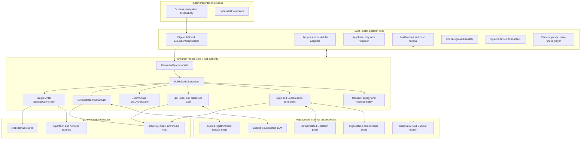

# WIP Mobile App Technical Architecture V1.0

> Status: **DRAFT / implementation architecture proposal**
>
> Snapshot: **2026-07-29 (Asia/Saigon)**
>
> Scope: iOS and Android autonomous OneBrain nodes, persistent data,
> local/device/cloud LLM providers, deterministic tools, multilingual UX,
> notifications, media storage, P2P retrieval and opportunistic mobile seeding.
>
> Product and sequencing plan:
> [`WIP_MOBILE_APP_IMPLEMENTATION_PLAN_V1.md`](./WIP_MOBILE_APP_IMPLEMENTATION_PLAN_V1.md)
>
> Runtime authority: when this document conflicts with
> [`WIP_DISTRIBUTED_RUNTIME_IMPLEMENTATION_PLAN_V2.md`](./WIP_DISTRIBUTED_RUNTIME_IMPLEMENTATION_PLAN_V2.md),
> the distributed-runtime plan wins. This document does not authorize M6, M7,
> OBT/wallet mutation, or a P5 production rollout.
>
> This is a target architecture. A component listed here must not be described
> as implemented until its code, tests, migration, and release evidence exist.

---

## 0. Architecture decisions

The mobile product is an **autonomous OneBrain node with an intermittent
process**, not a desktop replica, extension, remote control, or companion.

| Area | Decision |
|---|---|
| Node ownership | The mobile installation creates and owns a NodeID, key material, vault, canonical records, projections, network journals, media, and lifecycle |
| UI/runtime | Flutter presentation shell, narrow typed bridge, Rust mobile core, small Swift/Kotlin platform adapters |
| Database | Keep `redb` for Rust-owned structured persistence; do not add SQLite as a second product source of truth |
| Writes | One Rust storage actor owns all database writes; blocking `redb` work never runs on a Flutter/UI or async reactor thread |
| Cross-store work | Durable operation journal plus idempotent state machines; never claim atomicity across multiple database files and filesystem pieces |
| Concept data | Ship the complete query-ready Concept Registry; optimize delivery, verification, mmap access, and A/B activation rather than semantic reduction |
| AI | Provider-neutral LLM boundary. Prefer device system AI when it is actually available and evaluated; otherwise use an app-managed model or an explicitly selected remote provider |
| Android local AI | Portable runtime is the baseline. Gemini Nano is an optional fast path, not the Vietnamese baseline |
| iOS local AI | Apple `SystemLanguageModel` is the preferred fast path on eligible devices/locales; a portable runtime remains necessary |
| Tools | LLMs only generate text, structured candidates, or tool proposals. Rust validates, authorizes, executes, and audits every tool |
| Cloud | No silent local-to-cloud fallback. Data disclosure and provider selection are explicit and auditable |
| Languages | UI locale, content language, query language, and LLM output locale are independent values |
| Notifications | Local notifications and optional opaque push wake hints; notifications are never canonical state or a guaranteed scheduler |
| Media | Signed manifest plus independently verified pieces; large bytes live outside `redb`; private media is encrypted before leaving the node |
| Seeding | Mobile seeds in bounded sessions when runtime and policy permit. Sleeping phones cannot be treated as continuously available replicas |
| Background | Every operation is checkpointed, resumable, idempotent, budgeted, and safe after abrupt process death |

### 0.1 Accepted data footprint

The repository snapshot contains:

| Artifact | Bytes | GiB |
|---|---:|---:|
| `concepts.obr` | 1,306,104,050 | 1.216 |
| `concepts.obr.ccids.idx` | 382,317,040 | 0.356 |
| `concepts.obr.labels.idx` | 519,133,960 | 0.484 |
| Query-ready registry total | 2,207,555,050 | 2.056 |

The architecture therefore assumes:

- a normal first install can exceed 2 GB before private content or a local LLM;
- an app-managed model can add roughly 0.5-4.5 GB;
- a safe registry/model update needs staging space and may temporarily retain
  both active and rollback releases;
- large storage is acceptable, but unexplained or unrecoverable storage is not.

### 0.2 Core correctness statement

The logical node survives even when no process or socket exists:

```text
Node identity + durable state + resumable journals
    !=
an immortal mobile process
```

Android foreground services, WorkManager, iOS background tasks, background
`URLSession`, and push notifications are execution opportunities. None is part
of the correctness model.

---

## 1. Product capability architecture

### 1.1 Primary capabilities

The mobile node should expose these product modules without requiring a desktop:

1. **Capture**
   - text, clipboard, share-sheet input, photos, documents, audio, and video;
   - private by default;
   - deterministic metadata extraction remains available with no LLM.
2. **Recall and explore**
   - local KQL, concept lookup, graph traversal, full-text/label search;
   - offline access to the complete initial Concept Registry;
   - provenance and disclosure state visible in results.
3. **Organize and materialize**
   - draft, review, quarantine, adopt, relate, tag, and correct;
   - canonical validation and signing in Rust;
   - no model assertion is automatically promoted to truth.
4. **AI assistance**
   - summarize, extract, classify, propose links, converse, and propose tools;
   - local device model, app-managed local model, or explicit remote service;
   - useful non-AI fallback for every core flow.
5. **Network participation**
   - reconcile canonical records;
   - fetch and serve media pieces;
   - advertise truthful, expiring availability;
   - queue outbound work while unreachable.
6. **Operations**
   - identity/recovery, encrypted export/import, storage management;
   - model and registry management;
   - node, network, sync, seed, privacy, and energy status.

### 1.2 Explicit non-goals for the first implementation

- keeping an inbound listener alive 24/7;
- making desktop availability a prerequisite;
- embedding a desktop HTTP server in the app;
- letting Dart write canonical storage;
- loading a 2 GB registry or a complete media file into RAM;
- downloading arbitrary model conversions from untrusted community URLs;
- treating push delivery, a relay, or a cloud LLM as authority;
- rewarding replicas or integrating OBT before the distributed-runtime plan
  authorizes those systems.

---

## 2. System context and ownership



### 2.1 Authority rules

| Component | May own | Must not own |
|---|---|---|
| Flutter | UX state, navigation, localized presentation | keys, canonical validation, database transactions, tool execution |
| Swift/Kotlin host | OS capability facts and handles | semantic policy, canonical state, tool authority |
| Rust mobile core | node state, validation, policy, persistence, deterministic execution | OS UI presentation |
| LLM provider | inference session and generated candidate | filesystem/database/network access, signing, consent, tool execution |
| Push broker | opaque installation route and short wake hint | KU/media content, canonical state, authority |
| Carrier/cache peer | encrypted pieces, bounded mailbox data, signed receipts | plaintext private media, adoption, truth, reward |
| Desktop peer | the same rights as another authenticated peer | special control of the mobile node |

### 2.2 Activation and bridge topology

Flutter must not be required for a background entry point:

```text
Flutter
  -> generated Pigeon MobileHost API
  -> Swift/Kotlin NativeHost
  -> stable C ABI (Swift) / JNI wrapper (Android)
  -> Rust ActivationArbiter
  -> OneBrainMobileCore

BGTask / background URLSession / WorkManager / Service / notification callback
  -> Swift/Kotlin NativeHost
  -> the same ActivationArbiter
  -> the same OneBrainMobileCore
```

`flutter_rust_bridge` is acceptable for the feasibility spike, but it must not
be the only production entry path: an OS callback may run with no Flutter
engine or Dart isolate. Pigeon owns Flutter-to-native DTO generation; the
native-to-Rust ABI stays small and stable. UniFFI/generated wrappers may assist
implementation, but the ownership model does not depend on them.

The native `ExecutionGrantBroker` describes the OS opportunity. The Rust-owned
`ActivationArbiter` is the only component that grants an active core generation
and the single storage writer:

```text
ExecutionGrant {
  grant_id
  process_generation
  kind
  user_visible
  deadline_monotonic?
  network_scope
}
```

Every native callback carries the generation. Stale callbacks are rejected.
The arbiter owns a set of active grants keyed by `grant_id`, not one global
foreground boolean. Foreground loss revokes only the foreground grant; a valid
background transfer/processing grant may keep a narrower core scope active.
The effective scope is recomputed after every add/revoke/expiry. Draining begins
only when the last applicable grant ends or a safety/resource fence revokes all
work. A new valid grant arriving before teardown cancels draining and resumes
through the same generation fence.

Start Android in the main app process; do not add an `android:process=":node"`
service until measurements justify the Binder/JNI/single-writer complexity.

iOS share/notification extensions and any truly separate process never open
the redb files. A share extension may stream a bounded input into an
App-Group encrypted spool using temp-file, fsync, manifest, and atomic rename.
The main core imports that spool idempotently when it next receives an
execution grant.

A background `URLSession` transfer itself runs in an OS daemon. Its download
delegate's temporary URL is ephemeral: before returning, `NativeHost` moves the
file into a ciphertext/public-artifact landing inbox, fsyncs and atomically
renames it, and records a minimal bootstrap receipt. Only then can a later
unlocked core activation verify and import it. The Rust core is not kept alive
for the transfer.

### 2.3 Reuse boundary

Reuse protocol and correctness crates, not desktop-shaped process assumptions.

Good candidates:

- canonical encoding, CID, validation, identity, feed, capability, vault
  envelopes, provider leases, and conformance vectors from `ku-core`;
- KQL parsing/execution and redb storage primitives from `ku-kql`;
- authenticated session, reconciliation, journals, and transport primitives
  from `onebrain-protocol`, `ku-net`, and selected `onebrain-node` modules;
- typed model/provider abstractions and deterministic executor work from
  `ku-ai`.

Do not make the mobile dependency graph pull in:

- desktop HTTP/WS server ownership;
- Tauri or browser shell state;
- desktop filesystem paths and budgets;
- an Ollama-specific provider;
- a permanently listening desktop node runtime.

---

## 3. Runtime and process architecture

### 3.1 Rust modules

The proposed `onebrain-mobile-core` boundary contains:

```text
mobile_core/
  supervisor/          logical node state and startup recovery
  facade/              typed commands, queries, streams, cancellation
  storage/             domain stores, operation journal, backup, migration
  registry/            signed release install, mmap readers, A/B activation
  identity/            NodeID, key epochs, lock/unlock, recovery
  capture/             deterministic capture/import pipeline
  query/               local KQL and bounded result projections
  llm/                 provider routing, prompts, disclosure, model releases
  tools/               catalog, validation, permits, runner, receipts
  notifications/       notification intents and delivery reconciliation
  media/               manifests, pieces, encryption, playback and GC
  network/             sessions, reconciliation, provider view, carrier lanes
  scheduler/           durable work state and OS scheduling hints
  policy/              privacy, battery, network, thermal, quota and consent
  observability/       bounded metrics, diagnostics and privacy-safe logs
```

This may initially be a crate plus adapters around existing crates. It must not
fork canonical protocol behavior into mobile-only implementations.

### 3.2 Native host modules

Swift and Kotlin code should remain small and capability-oriented:

```text
NativeHost
  SecureKeyHost
  LifecycleHost
  BackgroundSchedulerHost
  BackgroundTransferHost
  NotificationHost
  ConnectivityHost
  ThermalAndPowerHost
  DeviceLlmHost
  MediaPickerAndPlayerHost
```

Native calls return typed facts or opaque handles. They do not decide whether
data may be disclosed, whether a tool is allowed, or whether a record is valid.

### 3.3 Logical node lifecycle

```mermaid
stateDiagram-v2
    state "Process absent / no execution grant" as Dormant
    state "Locked / protected data unavailable" as Locked
    [*] --> Dormant
    Dormant --> Cold: OS starts a process
    Cold --> Locked: initialize core; protected keys unavailable
    Locked --> Recovering: keys become available
    Recovering --> ReadyOffline: journals and stores valid
    ReadyOffline --> Active: first applicable execution grant
    Active --> Active: grant set/scope changes; at least one remains
    Active --> Draining: last grant ends or safety fence revokes all
    Draining --> Active: new valid grant before teardown
    Draining --> Dormant: best-effort quiesce completes
    ReadyOffline --> Degraded: registry/model/store unavailable
    Degraded --> Recovering: repair or release activation
    Recovering --> SafeMode: invariant or migration failure
    SafeMode --> Recovering: explicit repair/rollback
    Locked --> Dormant: abrupt termination
    Recovering --> Dormant: abrupt termination
    ReadyOffline --> Dormant: abrupt termination
    Active --> Dormant: abrupt termination
    Degraded --> Dormant: abrupt termination
    SafeMode --> Dormant: abrupt termination
```



`Draining` is an optimization, not a correctness requirement. The OS may move
from any live state to `Dormant` without a callback. Dormancy is inferred from
the absence/expiry of an execution grant; it is not a promise that a final
lifecycle callback persisted state.

### 3.4 Startup order

1. Open the root-level bootstrap ledger and reconcile any interrupted
   `ACTIVE_DATASET` switch.
2. Resolve the active dataset generation and verify its manifest/receipt before
   opening a generation-scoped database.
3. Obtain the platform key-wrapper capability.
4. Open that generation's `ops.redb` and recover unfinished operation states.
5. Open and verify the remaining authoritative stores.
6. Load the active Concept Registry receipt and verify its release pointer.
7. Reconcile media staging/trash and root-level physical-media holds with every
   active/retained/staged dataset generation.
8. Rebuild or resume projections whose cursor trails canonical state.
9. Restore due work into the scheduler; do not execute it until current
   lifecycle/resource policy permits.
10. Publish `NodeSnapshot` to Flutter.
11. Only then admit queries, LLM calls, network sessions, or tools.

If a step fails, expose a typed degraded/safe-mode status. Never delete or
reinitialize user data automatically.

---

## 4. Persistent data architecture

### 4.1 Database engine decision

Keep `redb` as the default:

- the repository already has substantial `redb` code, schemas, tests, and
  recovery research;
- canonical logic remains Rust-owned on both platforms;
- the workload is read-heavy with bounded writes and benefits from ACID
  transactions inside one database;
- adding SQLite/Drift for product data would create two migration systems and
  ambiguous ownership.

Constraints:

- `redb` APIs are synchronous;
- one actor owns writes;
- database operations execute on a dedicated bounded blocking pool;
- UI pagination and query limits prevent long readers from retaining snapshots;
- the architecture does not assume atomic commit across database files.

Flutter may persist cosmetic preferences through a platform preferences API.
Those values are never canonical and may be reset without data loss.

### 4.2 Filesystem layout

Names are normative concepts; exact platform roots are adapter-owned.

```text
OneBrain/
  bootstrap.redb        dataset switch journal + physical-media hold ledger
  ACTIVE_DATASET

  datasets/
    <dataset_generation>/
      db/
        canonical_public.redb
        private_vault.redb
        network_work.redb
        projections.redb
        media_catalog.redb
        ops.redb
      dataset.manifest
      verification.receipt

  registry/
    releases/<release_id>/
      concepts.obr
      concepts.obr.ccids.idx
      concepts.obr.labels.idx
      release.manifest
      verification.receipt
    ACTIVE

  models/
    releases/<provider>/<model_release_id>/
      model artifact(s)
      tokenizer
      prompt package
      release.manifest
      verification.receipt
    ACTIVE.<profile>

  media/
    objects/<root_shard>/<full_distribution_root>/
      <pack_index>.pack
    thumbnails/<full_distribution_root>/<variant>.piece
    staging/<operation_id>/
    trash/<gc_operation_id>/

  staging/
    registry/<release_id>/
    models/<release_id>/

  transfer_inbox/
    <transfer_id>.landing

  diagnostics/
    bounded/
```

Rules:

- `bootstrap.redb` contains no private content or product records. It stores
  dataset manifests/states, switch receipts, process generations, and opaque
  physical-object holds needed to recover before a dataset is opened;
- use a full CID or a collision-resistant sharded full CID for directory names;
- never use the current eight-hex-character display prefix as a storage key;
- update `ACTIVE_DATASET` through temp-write, file fsync, atomic rename, and
  parent-directory fsync (or the strongest documented platform equivalent);
- protected databases are not placed in an OS-purgeable cache directory;
- registry/model releases are immutable after verification;
- completed media pack files are immutable after atomic activation;
- paths never cross the typed Rust boundary; Flutter receives opaque IDs.

Quota counters update in the same catalog transaction as state changes. A
bounded periodic audit reconciles counters with allocated files and reports
drift; request-time admission does not rescan the complete media tree.

The generation-scoped `media_catalog.redb` owns logical manifests, references,
and retention policies. Root-level `bootstrap.redb` owns only physical-pack
state and holds keyed by distribution root/object ID for:

- active and retained rollback datasets;
- staged restore/migration generations;
- live import/GC operations;
- backup epochs;
- owned originals and unexpired custody obligations.

Physical GC requires the union of those holds to be empty. Before
`ACTIVE_DATASET` changes, the target generation's media bytes are verified and
its holds are durably promoted; old-generation holds remain through the
rollback window.

Bootstrap table families are deliberately small:

| Table family | Purpose |
|---|---|
| `dataset_registry` | generation path, manifest digest, state, compatibility mode |
| `dataset_switch_journal` | prepared/activated/retired pointer transitions and frontiers |
| `process_generations` | activation fencing and last unclean-start evidence |
| `physical_media` | opaque object/root to immutable pack state |
| `media_holds` | holder kind/ID, generation/epoch, reason, retention state |
| `transfer_landing` | OS transfer ID, expected class/hash/length, landed state; no private plaintext |
| `bootstrap_op_ids` | idempotency for pointer, hold, promotion, and GC transitions |

### 4.3 Storage domains

#### `canonical_public.redb`

Authoritative, validated, non-secret protocol state:

| Table family | Purpose |
|---|---|
| `_schema_meta` | schema version, generation, migration receipt |
| `accepted_records` | immutable validated object/event/feed/authority bytes |
| `quarantine` | invalid/colliding bytes and stable reason codes |
| `feed_inceptions` | branch-preserving FeedID index |
| `key_state` | deterministic key-state reduction inputs/receipts |
| `materialization_state` | adoption/materialization references, never LLM claims |
| `canonical_change_log` | commit sequence to mutation descriptor, committed with the canonical write |
| `canonical_op_ids` | idempotency evidence for cross-store operations |

Immutable wire bytes are never rewritten by a schema migration because their
CID depends on those bytes.

#### `private_vault.redb`

Authoritative private data, encrypted values, and blinded lookup keys:

| Table family | Purpose |
|---|---|
| `_schema_meta` | independent vault schema/version |
| `vault_ciphertexts` | AEAD envelopes for private records |
| `vault_metadata` | minimal encrypted metadata |
| `key_envelopes` | wrapped content keys and key epochs |
| `private_idempotency` | replay-safe private mutations |
| `private_change_log` | encrypted incremental projection/backup frontier |
| `private_projections` | encrypted private KU/read-model values |
| `private_search_index` | blinded/keyed private lookup index |
| `private_media_map` | `(blinded local CID, representation/policy/recipient-set digest)` to encrypted distribution reference |
| `recovery_state` | encrypted recovery metadata, never plaintext seed |

No plaintext private title, label, filename, prompt, or content appears in a
table key. Use a keyed digest/blinded index where private lookup is required.

#### `network_work.redb`

Durable network protocol work:

| Table family | Purpose |
|---|---|
| `outbound_intents` | exact peer/scope plus ciphertext/content reference; no private plaintext payload |
| `reconciliation_journals` | resume state and peer-bound tokens |
| `sync_cursors` | per-peer and per-selector progress |
| `provider_observations` | sampled discovery sources and liveness probes |
| `provider_leases` | accepted signed availability claims |
| `seed_assignments` | bounded media work offered to this node |
| `seed_sessions` | byte/piece/time budgets and checkpoints |
| `piece_receipts` | protocol/storage receipt, not authority or reward |
| `carrier_mailbox` | encrypted mailbox cursors and dedupe IDs |

Payload-heavy media pieces do not live in this database.

Private route/payload metadata is an AEAD envelope or a vault reference.
Quarantine, mailbox, observations, and pending work have global and per-peer
record/byte/TTL quotas so an untrusted peer cannot fill durable storage.

#### `projections.redb`

Rebuildable **public-only** or explicitly migration-transitional views:

| Table family | Purpose |
|---|---|
| `ku_projection` | decoded/queryable public KU projection |
| `epigenetics` | mutable public projection where source coverage is proven |
| `index_concept` / `index_ccid` / `index_trust` | KQL indexes |
| `edges_out` / `edges_in` / related graph indexes | graph traversal |
| `search_index` | public labels/text search projection |
| `projection_cursor` | vector frontier: canonical sequence, registry generation, schema/normalizer generation |
| `projection_failures` | stable failure evidence for repair |

The current `kus` table contains bytes that may still be authoritative. It must
not be relabeled rebuildable until a coverage test proves every required KU can
be reconstructed from accepted canonical records. During migration, keep those
bytes protected and treat only secondary indexes/graph state as rebuildable.
Private projections/search never enter this file; they use encrypted values and
blinded indexes in `private_vault.redb`.

#### `media_catalog.redb`

Metadata only:

| Table family | Purpose |
|---|---|
| `signed_manifests` | validated manifest/encrypted manifest envelope |
| `piece_state` | present/verified/pinned/partial state per piece |
| `piece_refcount` | references from KUs/manifests/playlists |
| `storage_policy` | owned/pinned/seed-cache/custody class and retention |
| `quota_reservations` | exact bytes reserved for import/download/update |
| `download_sessions` | missing-piece bitmap and priority |
| `availability_leases` | local published lease state |
| `media_gc_queue` | recoverable two-phase deletion |
| `media_op_ids` | import/fetch/delete idempotency |

#### `ops.redb`

Mobile process and product operations:

| Table family | Purpose |
|---|---|
| `operation_journal` | cross-store state machine |
| `durable_jobs` | scheduler-independent work definition |
| `native_schedule_receipts` | OS task identifier and last scheduling result |
| `tool_proposals` | redacted metadata plus encrypted/vault reference to private arguments |
| `tool_receipts` | redacted result/audit digest plus encrypted/vault reference |
| `notification_intents` | generic message key/args or encrypted/vault reference |
| `notification_receipts` | observable platform submit/active/interaction/cancel state |
| `llm_audit` | redacted local release, system qualification, or remote-route release plus prompt/disclosure/usage metadata |
| `resource_samples` | bounded battery/network/thermal/storage metrics |
| `ffi_idempotency` | command replay protection |

`ops.redb` contains no prompt, private tool argument/result, private KU/media
identifier, or sensitive deep-link payload in plaintext. It stores an opaque
operation ID, redacted metadata, and an AEAD/vault reference.

### 4.4 Single-writer coordination

```text
Flutter/native command
    -> MobileCommandBus
    -> authorization and validation
    -> StorageCoordinator queue
    -> dedicated redb/filesystem worker
    -> commit/receipt
    -> event stream and projection work
```

Requirements:

- bounded queue with backpressure;
- priority classes: user-visible, security/recovery, network, maintenance;
- cancellation before commit is allowed;
- after a commit begins, return an indeterminate receipt if the caller
  disappears and reconcile by `operation_id` on the next connection;
- reads use bounded snapshots and page tokens;
- no database handle crosses FFI.

### 4.5 Cross-store transaction pattern

Use a saga-style durable operation, not a simulated distributed transaction:

```text
CanonicalMutation:
  Prepared
    -> AuthoritativeWriteCommitted
    -> ProjectionQueued
    -> SideEffectsScheduled
    -> Complete

LocalMediaImport:
  Prepared
    -> StagedVerified
    -> FilesActivated
    -> ReferenceCommitted
    -> SideEffectsScheduled
    -> Complete

Any operation state
  -> Compensating
  -> Compensated | NeedsOperator
```

Every operation declares its transition graph; `FilesActivated` is not blindly
ordered after an authoritative reference. Every transition is idempotent. A
state includes:

- stable `operation_id`;
- operation kind and schema version;
- hashes of immutable inputs;
- target domain generations;
- last completed transition;
- retry class and count;
- cancellation/expiry policy;
- non-secret failure code.

The authoritative store commits before a projection. A projection failure
cannot roll back accepted canonical bytes; it leaves a durable repair task.

For private capture that also produces a public envelope:

1. commit the encrypted private payload;
2. record its private receipt in the operation journal;
3. construct and validate the public reference/envelope;
4. commit the public record;
5. queue projections.

A crash after step 1 creates a recoverable private orphan, not a public
reference to missing private data.

### 4.6 Schema and migrations

Each database has:

- `_schema_meta`;
- semantic schema version;
- physical generation;
- minimum readable/writable version;
- migration ID and digest;
- last successful integrity-check receipt.

Migration rules:

1. sequential forward migrations only;
2. one database migration's transforms and version marker commit in the same
   `redb` write transaction;
3. additive in-place changes are allowed only when the declared N-1 app can
   still read and, where required, write that exact storage schema;
4. a non-additive or cross-domain migration builds a shadow dataset generation,
   verifies it, catches up through bounded change logs/a compatibility bridge,
   and atomically switches `ACTIVE_DATASET`;
5. immutable canonical wire bytes are copied/indexed, not rewritten;
6. projections may be dropped and rebuilt only after source coverage is proven;
7. cross-file migration uses `operation_journal` generations and can resume;
8. every switch receipt in `bootstrap.redb` declares one tested rollback mode:
   - `NMinusOneReadWrite`: N-1 opens and writes the new generation;
   - `ReverseBridge`: each post-switch authoritative mutation has a durable
     bridge event and old-generation apply frontier; rollback is allowed only
     when that frontier has caught up;
   - `PreWriteOnly`: pointer rollback is allowed only before the first
     incompatible post-switch mutation, after which binary rollback is
     disabled and recovery is forward-only;
9. bridge application is itself a root-journaled idempotent saga; retaining an
   old directory without a caught-up frontier is not a rollback guarantee;
10. a failed migration enters safe mode and preserves source files and the
   previously active dataset.

### 4.7 Encryption and key custody

`redb` does not provide transparent whole-database encryption. The design uses:

- OS app-container/data protection for every file;
- application-layer XChaCha20-Poly1305 envelopes for private values and media;
- hardware-backed or OS-protected key-encryption keys where available;
- blinded private indexes;
- explicit zeroization and session key lifetime bounds.

OneBrain has independent signing domains even when each currently uses
Ed25519:

| Domain | Boundary | Derived identity/authority |
|---|---|---|
| Transport node | `SessionIdentitySigner` | NodeID; authenticated session and peer-bound resume derivation only |
| Namespace feed | `FeedEventSigner` | FeedID/generation; event authorship and eligible provider records only |
| Actor root | Actor-root proof/custody flow | high-authority delegation/recovery only; never loaded into the network runtime |
| Media representation | scoped representation signer/capability | one manifest/share representation only |

A NodeID signer never signs a feed event or Actor delegation. A feed signer is
never the NodeID or Actor-root signer. Transport authentication grants no feed,
Actor, truth, publish, reward, or tool authority. Provider leases use the exact
feed/delegated-principal and key-state rules in the distributed profile, not a
generic “node root” key.

Hardware support for Ed25519 is not uniform across Apple and Android secure
hardware, so the architecture must not claim every private key is
non-exportable. For each software-backed signing domain independently:

1. generate its Ed25519 signing seed in Rust using a CSPRNG and derive only that
   domain's public identity;
2. create a domain-specific platform-protected wrapping key/alias;
3. store only the typed wrapped seed envelope;
4. unwrap into locked memory for a bounded authorized session;
5. require foreground/user authentication for sensitive signing classes;
6. zeroize on lock, memory warning, background deadline, and process exit.

When a platform can provide the exact required algorithm and semantics through
an external signer, prefer the matching typed signer so private key bytes never
enter the application process. The wrapped-seed path is the portable fallback,
not a license to write a plaintext compatibility key file or reuse one seed
across domains.

Android uses Keystore and iOS uses Keychain/Data Protection for wrapping keys
and small secrets. Biometric authentication controls use; biometrics are not
the recovery secret.

The first mobile release does **not** keep any high-authority signer available
only to make background P2P appear online. If the transport signer is
unavailable, a new authenticated P2P session fails. If the appropriate feed
signer/key-state frontier is unavailable, no provider lease/event is signed.
Actor-root authority is never loaded for those operations. If protected data or
the private vault is unavailable, the node enters
`ProtectedDataUnavailable`; publish, adopt, private query, private tool, and
decryption fail closed. An OS transfer daemon may finish downloading
ciphertext; import, acknowledgement, decryption, and signing wait for the
required protected grant.

A future optimization may introduce a separately generated, scoped,
revocable, expiring background credential. A transport credential requires an
explicit delegated-session protocol because changing the current
`SessionIdentitySigner` changes NodeID; a provider credential requires an exact
authorized feed/key-state path. Neither can publish/adopt KU state, perform
Public Use, grant authority, execute tools, access Actor-root authority, or
unwrap another signer. This is a protocol ADR and key-rotation feature, not an
implicit reuse of the NodeID/feed key.

Share and notification extensions never receive any NodeID/feed/Actor signing
seed or vault master key. A share extension encrypts its bounded spool to an
ingestion public key or a narrow one-time key; the main app adopts and
re-encrypts it only after normal unlock and policy checks.

### 4.8 Backup and restore

Backup classes:

| Class | Included | Notes |
|---|---|---|
| Identity/recovery | Yes | separately typed Node/feed/Actor material, encrypted and authenticated without key-domain reuse |
| Private vault | Yes | encrypted export stream with manifest and chunk hashes |
| Canonical public state | Yes | incremental and deduplicated |
| Network/ops journals | Only pending correctness work | discard stale delivery caches |
| Owned original media | Yes by default | irreplaceable; warn explicitly until backup/independent replica is verified |
| Pinned remote media | Configurable | encrypted, resumable, may be refetched or use provider replicas |
| Seed cache/custody replica | Only by explicit policy/obligation | custody export must preserve its signed obligation metadata |
| Remote media cache | No | refetchable |
| Concept Registry | No | signed re-downloadable release |
| Local LLM models | No | signed re-downloadable release |
| Projections | No | rebuildable after coverage proof |

Restore is staged and verified before activation. Identity handling is an
explicit mode:

1. `ReplaceEmptyInstallation` restores an explicitly selected typed
   Node/feed/Actor recovery package only into a verified empty installation;
2. `ImportDataKeepCurrentIdentity` imports data while preserving the current
   NodeID and records provenance/conflict branches;
3. `CloneIdentity` is rejected in the normal product flow because two live
   devices using one NodeID or feed signing key are not independent principals.
   A recovery-only exceptional flow requires an explicit old-device
   retirement/key-rotation protocol per affected identity domain.

The archive has a versioned canonical manifest, per-entry/chunk hashes and a
final root. Passphrase recovery uses versioned Argon2id parameters; a
recovery-key mode records its own KDF/envelope profile.

Because the six generation-scoped `redb` files and `bootstrap.redb` have no
shared transaction, backup takes a logical cut under the single-writer barrier:

1. allocate a `backup_epoch`;
2. drive each pending saga to a terminal/compensated state, or include every
   transitive ciphertext/media/staging input needed to resume it;
3. acquire root-level media/restore holds for every included physical object;
4. capture a read snapshot/frontier for every database and the bootstrap
   switch/hold frontier while writes are quiesced;
5. record each database UUID, schema/generation, source frontier, pending-saga
   state, and change-log retention bound in the archive manifest;
6. release the writer and stream those held snapshots/inputs, retaining the
   required generations, change logs, and media GC holds until the archive root
   is verified;
7. fsync and atomically publish the completed archive, then release only holds
   whose bytes are now covered or no longer needed.

Restore writes all domains into a new dataset generation, validates every
chunk, database, schema, frontier, reference, and media obligation, promotes
physical-media holds for the new generation, then switches `ACTIVE_DATASET`
atomically. The old generation and its holds remain available for the rollback
window and selected rollback mode. It never replaces individual active
database files one by one.

Large re-downloadable assets and device-bound key material should be excluded
from generic OS cloud backup. OneBrain's own encrypted export is the portable
recovery path.

### 4.9 Storage quota and pressure

Storage classes, from least to most reclaimable:

1. identity and recovery;
2. private vault and canonical records;
3. active Concept Registry;
4. owned original media;
5. pinned remote media and explicit custody replicas;
6. pending network/tool operations;
7. selected local model;
8. rollback registry/model releases;
9. seed cache, remote media cache, and thumbnails;
10. diagnostics and staging.

`StorageBudgetManager` must:

- measure exact release and staging bytes from signed manifests;
- reserve a free-space floor before import/update;
- include filesystem allocation overhead;
- avoid starting A/B activation without room for both release and rollback;
- evict only from eligible classes;
- never automatically evict an `OwnedOriginal`, even when it has no KU
  reference, and never evict an unexpired custody obligation;
- never evict data merely because the process was killed;
- expose a human-readable plan before a multi-GB download.

Admission computes:

```text
required =
    incoming bytes
  + verification/unpack peak
  + expected database growth
  + retained rollback generation
  + OS safety reserve
```

Provisional spike values are a normal safety reserve of
`max(1.5 GiB, 10% of the volume)` and an emergency floor of
`max(512 MiB, 5%)`. Physical-device evidence must tune these before release;
they never replace exact per-release sizing.

Recommended initial policy:

- complete Concept Registry is required product data;
- local models are selected and downloaded after a device capability scan;
- media cache has a user-visible cap;
- keep the greater of a configured absolute reserve and a percentage of free
  storage;
- charging/Wi-Fi is a scheduling preference, not a substitute for capacity.

### 4.10 Current repository gaps to close

| Gap | Evidence | Required change |
|---|---|---|
| Blob directory collision risk | `BlobStorage::blob_chunk_dir` uses `short_hex()` | Full distribution-root path, optional safe sharding |
| Whole-file memory import | `BlobStorage::store_file` calls `std::fs::read` | Streaming hash/encrypt/piece writer |
| Non-atomic large blob write | piece files are written before catalog metadata | staging, fsync, atomic rename, recoverable journal |
| Weak piece verification | metadata has only full-file BLAKE3 | signed manifest with per-piece hashes or Merkle proofs |
| 100 MB ceiling | `BLOB_MAX_SIZE` | versioned `u64` media policy suitable for video; no unbounded allocation |
| Graph inconsistency | graph indexing is best-effort in a separate DB | projection journal/cursor and deterministic rebuild |
| Incomplete KU delete | indexes/graph can outlive primary deletion | reference/tombstone-driven transactional cleanup |
| Migration split commit | transform and version marker can commit separately | one transaction per database migration |
| Backup incompleteness | current backup path omits key product bytes/media | typed encrypted backup manifest and restore tests |
| Unsafe legacy identity path | compatibility runtime can persist a raw Ed25519 seed | mobile release uses external signer/wrapped-key path only |
| Lifetime record ceilings | several stores cap total records at 65,536 | bound untrusted peer/batch/byte/quarantine work, not the lifetime of a node |
| Desktop storage guard too small | current soft/hard defaults are below the 2.056 GiB registry alone | mobile accounting covers every domain with multi-GB evidence |
| No media protocol lane | vNext inventory lanes omit blobs | separate manifest/piece protocol and capability negotiation |
| Provider kind lacks media | provider offer kinds do not identify media | versioned `MediaBlob`/`MediaManifest` offer kind |
| Mobile is only a scaffold | `src/onebrain-mobile/README.md` | compile/lifecycle/storage spike before feature implementation |

---

## 5. Complete Concept Registry

### 5.1 Release envelope

`ConceptRegistryReleaseManifest` should include:

```text
release_id
schema_major / schema_minor
source_snapshot
artifact list:
  logical role
  byte length
  BLAKE3
  transport chunk size
  transport chunk hashes or Merkle root
required app/runtime range
minimum free-space requirement
previous compatible release
signing key id
signature
revocation/supersession metadata
```

The verification receipt records:

- manifest digest and signer;
- every artifact length/hash;
- format-open and bounded query smoke results;
- app/runtime version;
- verification time as advisory metadata;
- activation generation.

### 5.2 Install/update state machine

```text
Absent
  -> ManifestVerified
  -> CapacityAdmitted
  -> Downloading
  -> ArtifactVerified
  -> QuerySmokePassed
  -> Staged
  -> Active
  -> RollbackEligible
```

Rules:

- range/resume downloads;
- verify chunks while downloading and whole artifacts before activation;
- never update an active `.obr` or index in place;
- replace the small `ACTIVE` pointer/receipt through temp-write, file fsync,
  atomic rename, and parent-directory fsync;
- retain the last known-good release until the new release has survived a
  bounded runtime gate;
- mmap/read pages on demand; do not deserialize the entire registry;
- fence mmap readers by release and process generation: a retired release is
  removed only after every old reader handle is closed and the health/rollback
  window has passed;
- on corruption, deactivate the release and keep private/canonical node data
  available in degraded mode.

### 5.3 Delivery

Use a provider-neutral signed release manifest. Delivery transports may be:

- Apple Managed Background Assets or self-hosted Background Assets;
- Google Play asset/AI-pack mechanisms where store policy and pack limits fit;
- OneBrain CDN/object storage through OS background transfer;
- enterprise/self-hosted release origin.

The transport host is not release authority. Signature and artifact hashes are
authoritative. A store asset update must still pass OneBrain verification.

During a registry update, the node remains queryable from the active release.
If capacity cannot support A/B, offer an explicit low-space update mode with
clear downtime and backup requirements; never silently mutate in place.

---

## 6. AI architecture

### 6.1 Boundary

```text
Feature request
  -> AiUseCaseCoordinator
  -> deterministic context selection
  -> ContextDisclosureGate
  -> ProviderRouter
  -> LlmHost inference
  -> untrusted candidate
  -> schema and policy validation
  -> optional ToolOrchestrator
  -> deterministic result/materialization path
```

The LLM never receives:

- a database handle;
- a filesystem path;
- a signing key;
- a network socket;
- unrestricted tool callbacks;
- authority to publish, adopt, delete, grant, reward, or mutate.

### 6.2 Provider contract

```text
LlmRequest
  request_id
  task_kind
  ui_locale
  input_languages[]
  requested_output_locale
  privacy_class
  provider_policy
  prompt_package_hash
  messages[]
  response_schema?
  filtered_tool_descriptors[]
  max_input_tokens
  max_output_tokens
  deadline
  cancellation_id

LlmEvent
  TextDelta
  StructuredCandidate
  ToolCallProposal
  Usage
  Finish
  Error
```

Capability discovery returns:

```text
provider_id
provider_class
availability_reason
model_id / model_revision?
os_build / provider_visible_model_id?
qualification_or_route_release_id
runtime_version
supported/evaluated task × input-language/script × output-locale classes
context and output limits
structured-output support
image/audio support
foreground-only flag
network requirement
estimated memory/energy class
policy and license revision
```

Provider-native tool APIs are adapters only. An Apple `Tool` closure is
technically able to execute Swift, but OneBrain's adapter **must not** perform a
side effect: it only forwards an untrusted proposal to Rust. No
provider-native/built-in web, code, shell, retrieval, or function tool may read
OneBrain data or cause an effect outside `ToolOrchestrator`. If an SDK cannot
intercept the complete proposal through the Rust permit path before execution,
OneBrain does not register or enable that tool.

### 6.3 Provider matrix

| Provider | Role | Decision |
|---|---|---|
| Apple `SystemLanguageModel` | OS-managed on-device inference | Preferred iOS fast path when `availability`, `supportsLocale`, task evaluation, and policy pass |
| Apple Private Cloud Compute provider | Apple-managed remote inference | Beta/entitlement/eligibility/quota-gated research provider; optional and not an MVP dependency |
| Apple `LanguageModel`/CoreAI/MLX path | Apple local/provider abstraction | iOS 27-era beta research path; evaluate without coupling the MVP |
| Android ML Kit GenAI / Gemini Nano | AICore shared system model | Opportunistic Android fast path only; not the default Vietnamese provider |
| LiteRT-LM | App-managed portable edge runtime | Primary Android runtime candidate; C++ path may be evaluated on iOS while Swift support matures |
| `llama.cpp` | GGUF C/C++ portable runtime | Required reference/fallback runtime and likely first portable iOS path |
| ExecuTorch | PyTorch edge runtime and hardware delegates | Reserve/research path for models/backends where it wins measured gates |
| OneBrain LLM Gateway | Optional managed remote service | Preferred remote architecture because vendor secrets remain server-side |
| Custom HTTPS/mTLS endpoint | Enterprise/LAN/self-hosted provider | Advanced provider with capability probe and explicit trust setup |
| Direct vendor BYOK | User-configured remote provider | Advanced mode; short-lived/tokenized credentials preferred |

Important current constraints:

- ML Kit GenAI is device-limited, quota-limited, and documented to reject
  inference when the app is not the top foreground app, including from a
  foreground service; the current Prompt API material does not establish a
  Vietnamese quality guarantee, so OneBrain must evaluate it rather than infer
  support from the documentation locale;
- Apple system model availability, language set, context, and behavior vary by
  device/region/OS model version and must be queried at runtime; Apple
  Intelligence currently lists Vietnamese, but that does not replace
  `supportsLocale` or model-version testing;
- a system provider may not expose a stable model revision; audit its OS build,
  API/runtime version, provider-visible model ID, and last qualification suite
  instead, and quarantine a newly observed combination until its canary passes;
- LiteRT-LM currently has a stable Kotlin/C++ surface while its Swift surface
  requires a maturity spike;
- model file size is not peak memory; include tokenizer, graph, KV cache,
  accelerator buffers, and allocator behavior.

### 6.4 Local model profiles

Do not hardcode one permanent model. Ship signed replaceable profiles.

| Profile | First benchmark candidates | Purpose |
|---|---|---|
| `OB_LOCAL_VI_SMALL` | Qwen3 1.7B INT4/GGUF; known LiteRT baseline Qwen2.5 1.5B | Vietnamese/English extraction, intent, short summary, tool proposal |
| `OB_LOCAL_MULTI_SMALL` | Gemma 3 1B INT4 | low-footprint candidate; no Vietnamese/tool promise before evaluation |
| `OB_LOCAL_MULTI_HIGH` | Gemma 3n E2B INT4 | higher-capability devices, optional multimodal work |
| `OB_LOCAL_IOS_SYSTEM` | Apple system model | OS-managed iOS default where supported |
| `OB_LOCAL_ANDROID_SYSTEM` | Gemini Nano | only for device/locale/task combinations that pass evaluation |

Known official LiteRT-LM artifacts in the current snapshot provide useful
starting points:

- Gemma 3 1B 4-bit, with size varying by exact artifact/backend (one current
  LiteRT-LM table entry is approximately 557 MB);
- Qwen2.5 1.5B 8-bit, approximately 1.5 GB and explicitly multilingual,
  including Vietnamese;
- Gemma 3n E2B 4-bit, roughly 3-3.7 GB across current listed/artifact forms;
- larger models only after device-specific memory and thermal evidence.

Qwen3 1.7B is an Apache-2.0 upstream model with 100+ language support and
tool-oriented behavior, but its OneBrain mobile conversions must still pass
runtime compatibility and Vietnamese evaluation. Gemma terms and gated
downloads require a separate redistribution/license decision.

Initial inference policy:

- INT4 or GGUF `Q4_K_M` default candidate;
- evaluate `Q5_K_M` only on high-memory devices;
- do not use Q2/Q3 for authority-sensitive structured/tool proposals;
- cap context at 4K-8K initially regardless of the advertised maximum;
- unload KV/session/model on memory warning, serious thermal state, or
  background transition;
- no local model is required for capture, KQL, media, sync, or seeding.

### 6.5 Model release and hosting

Production must not download an arbitrary Hugging Face/community URL.

```text
Official upstream revision
  -> pin source commit and upstream hashes
  -> license/redistribution review
  -> deterministic conversion and quantization
  -> format/fuzz/security scan
  -> Vietnamese + multilingual + tool evaluation
  -> signed ModelReleaseManifest
  -> approved store pack or OneBrain release host
  -> download/stage/verify/smoke
  -> atomic profile activation
```

`ModelReleaseManifest` includes:

```text
release_id
upstream repository and exact revision
upstream artifact hashes
license id, text hash, redistribution decision
converter source/version/container digest
runtime and compatible runtime range
format and quantization
exact artifact filenames/content roles
model/tokenizer/chat-template hashes
prompt-package compatibility
supported and evaluated locales
minimum OS/RAM/accelerator class
evaluation digest and acceptance thresholds
artifact lengths and BLAKE3 hashes
signing key id and signature
revocation/supersession
```

Cloud aliases are also versioned supply-chain inputs. An alias such as
`balanced` resolves only to a signed/attested immutable `RemoteRouteRelease`:

```text
remote_route_release_id
gateway and alias revision
effective provider/model/deployment revision or provider-visible opaque version
generation/safety/configuration digest
qualified task × input-language/script × output-locale matrix
evaluation and policy/retention/region digest
compatible prompt-package range
activation/expiry/revocation metadata
```

The gateway returns that release ID on every response. An alias may move only
by activating a newly qualified release; a missing, revoked, or incompatible
ID fails closed. This gives audit/rollback identity even when a vendor does not
expose an underlying weight revision.

Disable `trust_remote_code`. Treat the model, tokenizer, template, and metadata
as untrusted inputs until validation succeeds.

Delivery choices:

- Android Play for On-device AI supports install-time, fast-follow, on-demand,
  RAM/device targeting, 1.5 GB compressed per AI pack, and a 4 GB generated app
  limit; AI packs update with the app binary, and their path/availability must
  be queried again after every launch/update; use signed OneBrain hosting for
  artifacts that do not fit;
- Apple Managed Background Assets supports essential, prefetch, and on-demand
  Apple-hosted or self-hosted packs;
- self-hosted delivery uses HTTPS range/resume, exact manifest sizes, staging,
  signature verification, and rollback.

Play-pack rollback needs an ADR: either copy a verified artifact into a
OneBrain-owned immutable generation (paying the extra disk cost) so model
rollback is independent, or explicitly accept that a Play-pack model rolls
with the app and has no independent N-1 artifact.

Model weights are not placed in the KU/media swarm in the first release.
Future P2P model distribution requires an explicit license-redistribution check
and a distinct signed model protocol.

### 6.6 Provider routing

Hard gates run before scoring:

```text
available and model ready
AND task capability supported
AND task_kind × input language/script set × requested output locale evaluated
    (including explicit mixed/unknown input classes)
AND input fits bounded context
AND privacy policy permits route
AND memory / thermal / battery permits local work
AND network / cost / quota permits remote work
AND prompt package is compatible with exactly one immutable route identity:
    local ModelRelease ID/artifact revision
    or observed SystemQualification ID
    or RemoteRouteRelease ID
```

Then score:

- measured task-locale quality;
- user privacy preference;
- latency/cold-start status;
- energy estimate;
- monetary quota;
- current foreground/background deadline.

User modes:

1. `Local only`
2. `Smart; ask before cloud` — recommended default
3. `Selected remote provider`

A local OOM may retry a smaller signed local profile. It may not switch to
cloud without the request's disclosure policy and visible user consent.

### 6.7 Remote providers

Preferred production flow:

```text
Mobile
  -> OAuth/PKCE or device-bound short-lived token
  -> OneBrain LLM Gateway
  -> selected vendor/model alias
```

The gateway:

- keeps vendor secrets off the mobile binary;
- enforces per-user budgets, retention mode, provider policy, and audit;
- exposes stable aliases such as quality/balanced/economy rather than forcing
  an app update for a model rename, but resolves each alias only through a
  qualified immutable `RemoteRouteRelease` and returns its ID;
- cannot execute OneBrain tools;
- receives only the context approved by `ContextDisclosureGate`.

Enterprise/custom endpoints may use HTTPS/mTLS and capability discovery.
“OpenAI-compatible” describes an HTTP shape, not identical streaming, tools,
usage, retention, or error semantics; adapters normalize explicitly.

Static vendor keys in Keychain/Keystore are advanced/debug mode, not the
recommended consumer production path.

### 6.8 Tool orchestration

Two-phase loop:

```text
LLM -> FinalCandidate
or
LLM -> ToolCallProposal[]
        -> canonical tool ID/version lookup
        -> JSON/schema validation
        -> authority/capability/consent check
        -> privacy and result-disclosure budget
        -> deadline/replay/idempotency check
        -> deterministic ToolRunner
        -> signed/audited ToolReceipt
        -> redacted result for an optional second LLM turn
```

The model-produced `ToolCallProposal` is deliberately small and untrusted:

- provider call/proposal ID;
- proposed canonical tool ID;
- proposed argument bytes.

Rust resolves the tool version and wraps that candidate in a trusted
`ToolProposalEnvelope` containing:

- OneBrain request/proposal IDs;
- canonical tool ID and version;
- validated argument bytes and schema digest;
- catalog digest actually shown to the model;
- provider/model-or-system-qualification/prompt-package identity;
- requested disclosure class;
- Rust-generated expiry, one-time nonce, and replay/idempotency state.

The model cannot choose its own expiry, nonce, schema digest, catalog digest, or
authority metadata.

Notification actions and deep links use the same command/permit path; they do
not bypass it.

### 6.9 Evaluation gates

Create at least 300-500 Vietnamese cases covering:

- intent and exact tool selection;
- argument/schema exactness;
- missing and hallucinated arguments;
- KU extraction and relationship proposals;
- Vietnamese/English code switching;
- prompt injection in content/tool results;
- unsupported/forbidden tool requests;
- long-context truncation;
- locale fallback;
- cancellation and retry.

Measure per device/provider/model revision:

- exact structured-output rate;
- tool name/argument accuracy;
- task success and hallucination rate;
- TTFT and tokens/second;
- peak RSS and accelerator memory;
- cold/warm load;
- battery and thermal change;
- crash/OOM;
- interruption/background recovery.

Claims of multilingual or tool support do not replace OneBrain's Vietnamese
evaluation.

---

## 7. Multilingual architecture

### 7.1 Separate language domains

```text
ui_locale
content_language(s)
query_locale and fallback locales
requested_llm_output_locale
concept_label_locale
notification_locale
```

Changing UI language must not rewrite content, concept identity, prompt audit,
or canonical records.

Shared locale/Unicode contract:

- canonicalize locale tags with one pinned BCP-47 implementation and retain the
  original user-facing tag when useful;
- fields whose bytes participate in a CID remain byte-preserving and follow
  their protocol schema; UI/search normalization never rewrites them;
- derived search keys declare a normalization/case-fold profile version
  (including pinned Unicode/ICU/CLDR data);
- nodes do not use whichever locale collation happens to ship with the OS for
  canonical ordering or distributed matching;
- a normalization profile upgrade builds a new projection generation and
  swaps it only after equivalence/query tests.

### 7.2 Flutter localization

Use Flutter `gen_l10n` with ARB:

```text
lib/l10n/
  app_en.arb       source template
  app_vi.arb       first complete translation
  app_<locale>.arb
```

Requirements:

- initial full locales: English and Vietnamese;
- ICU plural/select rules;
- parameters, not string concatenation;
- RTL-safe layouts even before the first RTL translation ships;
- semantic labels and accessibility text localized;
- screenshot/golden tests at long-string and text-scale extremes;
- pseudo-locale in CI;
- missing-key CI gate;
- translation provenance and reviewer metadata outside the runtime bundle.

Rust returns stable codes and typed parameters:

```text
error_code = "MEDIA.PIECE_HASH_MISMATCH"
params = { piece_index: 42 }
```

It does not return an English sentence as the product contract.

One catalog generates every surface:

```text
ARB source + typed metadata
  -> Flutter gen_l10n output
  -> iOS String Catalog / localized notification action resources
  -> Android values-*/strings.xml
  -> Rust message-key and placeholder schema
```

Each notification-capable key declares `native_safe`, privacy level, surface,
and typed placeholders. Complex ICU content that cannot be rendered
consistently while Flutter is absent falls back to a generic native-safe
message.

### 7.3 Concept labels and search

Concept identity remains CCID/canonical ID. Labels are language-tagged views.

Fallback order:

1. exact BCP-47 locale;
2. language/script-compatible locale;
3. user-configured fallback list;
4. English;
5. canonical concept ID.

Store/display original Unicode. A secondary normalized/folded search index may
improve accent-insensitive lookup, but the folded value is never canonical and
never replaces Vietnamese diacritics in output.

Machine translation is a derived candidate with:

- source label and language;
- target locale;
- provider/model/revision;
- prompt/evaluation provenance;
- review state and, only when available, a calibrated evaluator score.

It cannot silently become a canonical concept label.

### 7.4 LLM locale handling

Before inference:

- detect mixed input languages as advisory metadata;
- preserve the user's explicitly requested output locale;
- call system-provider locale capability APIs where available;
- require qualification for the complete
  `task_kind × input-language/script-set × output-locale` tuple, including
  mixed and unknown input classes;
- require safety/guardrail evaluation for every routed locale and
  mixed-language test class; unsupported spans cannot bypass the gate;
- include exact locale instructions in the signed prompt package;
- keep tool IDs and JSON property names canonical and locale-independent.

Unsupported local locale behavior is:

1. offer deterministic non-LLM feature;
2. offer another evaluated local model if installed;
3. ask before an allowed remote route;
4. never silently answer in another language.

### 7.5 Native surfaces

Native notification categories/actions, permission rationale, share extensions,
widgets, OS settings descriptions, and **local** notification intents use the
same locale key catalog and resolve `message_key + typed arguments` on the
device. Optional APNs/FCM wake-hint payloads never carry those keys/arguments or
other product content; they contain only the opaque route/generation fields in
§8.5. A future remote user-visible notification is a separate privacy-reviewed
protocol, not an extension of the wake hint.

The `NativeHost` owns the effective UI locale: OS per-app language where
available, otherwise a platform preference updated by the in-app selector.
Flutter renders that value; Rust receives it as context but is not a competing
locale source of truth. A locale change:

- regenerates/reschedules pending notification presentation where possible;
- re-registers localized iOS categories/actions;
- updates Android channel names/descriptions without changing user-owned
  importance;
- invalidates locale-dependent search/query presentation caches.

---

## 8. Notification architecture

### 8.1 Notification classes

| Class | Example | Transport |
|---|---|---|
| Security/consent | key lock, explicit approval needed | local, generic lock-screen text |
| User job | import complete, model/registry download result | local |
| Sync/media | manual sync complete, seed session paused | local |
| Reminder | user-created reminder | OS local schedule |
| Wake hint | encrypted mailbox/network work may exist | optional APNs/FCM data/background hint |
| Foreground work | visible Android transfer/seeding progress | Android FGS notification |
| Digest | optional node/storage/network summary | local scheduled evaluation |

Notifications do not contain a KU, private title, peer message, filename, media
key, prompt, or sensitive content by default.

### 8.2 Durable notification intent

```text
NotificationIntent
  notification_id
  dedupe_key
  category
  message_key
  typed_args
  privacy_level
  deep_link_command
  allowed_actions
  earliest_at / expires_at
  schedule_precision
  action_nonce / action_expiry
  replace_policy
  source_operation_id
```

Rust writes the intent. The native host reports only observable states:
`scheduled`, `submitted`, `active_observed`, `interacted`, `cancelled`,
`permission_denied`, `platform_error`, or `delivery_unknown`. A successful
platform API call does not prove that a person/device received a notification.

On restart, Rust reconciles desired intents with a native scheduling ledger and
best-effort platform queries. The ledger is necessary because platform APIs do
not enumerate every AlarmManager/WorkManager/notification state completely.

The notification ID is deterministic for replaceable progress, preventing a
new notification on every checkpoint.

Android reminders are inexact by default. Exact timing requires a genuine
user-facing need, current policy eligibility, and the relevant exact-alarm
access; exact reminders are rescheduled/re-evaluated after boot, restore,
timezone change, and permission revocation.

### 8.3 Permission and privacy

- ask in context, after the user enables a feature that benefits from alerts;
- the app remains fully usable when notification permission is denied;
- generic previews are default;
- detailed previews require an explicit app setting and remain subject to OS
  lock-screen settings;
- quiet hours and digest preferences live in Rust policy;
- no notification action performs publish, delete, signing, authority grant,
  key export, or cloud disclosure without opening/unlocking the app.

Allowed background actions are reversible/idempotent examples such as pause,
cancel queued transfer, or retry. All actions enter `MobileCommandBus`.
The command treats notification/deep-link input as untrusted: it validates the
notification/category/action against a still-current intent and consumes the
Rust-generated one-time nonce before the action expiry.

Security/consent notifications are never the only discovery path. A durable
in-app approvals inbox and badge expose every pending decision when alerts are
denied, delayed, coalesced, or not delivered.

On Android 13+, request `POST_NOTIFICATIONS` in context. If denied, an eligible
FGS may still run but its notice may appear only in Task Manager rather than
the notification drawer; the app must provide an in-app transfer/seed status
and stop control.

### 8.4 Channels/categories

Android channels:

- `security_and_consent`;
- `user_jobs`;
- `sync_and_media`;
- `reminders`;
- `node_digest`;
- `foreground_transfer` for required FGS visibility.

iOS categories mirror supported actions, but category/action identifiers remain
stable and locale-independent. Titles are localized at registration.

Android notifications use private visibility and a generic public version by
default. iOS categories use a generic hidden-preview placeholder. A platform
locale can differ from an in-app Flutter locale, so OS-rendered content remains
short and generic unless the native host can render the selected app locale.
Channel importance is user-owned and cannot be repurposed after creation. If
semantics/importance change, introduce a versioned channel ID and an explicit
migration; locale changes may update only names/descriptions.

### 8.5 Optional push hint broker

Push is an optional reachability optimization:

```text
Peer/carrier observes pending encrypted work
  -> hint broker receives opaque installation route + collapse key
  -> APNs/FCM best-effort hint
  -> OS may wake or notify app
  -> mobile authenticates to peer/carrier
  -> mobile fetches actual signed/encrypted state
```

The payload contains:

- random installation route;
- coarse hint type;
- opaque mailbox generation/collapse ID;
- expiry;
- no canonical or private content.

APNs background pushes are low priority, throttleable, and not guaranteed.
FCM/APNs delivery therefore cannot advance a correctness state by itself.

Opaque Android sync hints use normal FCM priority and accept delay. High
priority is reserved for genuinely time-sensitive, user-visible events that
meet platform policy; the design never assumes a hint wakes Android
immediately.

Token registration/removal is authenticated, encrypted at rest, revocable, and
separate per installation. Uninstall cannot reliably deregister a token, so
the broker applies last-seen/TTL retention, deletes routes on APNs/FCM
invalid-or-unregistered responses, and handles token rotation. Logging redacts
tokens. Even opaque hints leak installation linkage and timing/provider
metadata, so the broker has an opt-out, minimal retention, and privacy review.

---

## 9. Media storage and P2P

### 9.1 Media identity

The current `BlobCid` hashes a whole plaintext blob and is referenced by a KU.
Mobile distribution needs three non-circular identities:

```text
LocalContentCid
  = H(local-content domain || plaintext bytes)
  = private-vault-only identity for dedupe and integrity

PieceLeaf[i]
  = H(piece-leaf domain || piece_index || exact_length || distributed_piece_hash)

DistributionRoot
  = H(distribution domain || piece_profile || canonical piece Merkle root)

MediaManifestBodyCid
  = H(manifest-body domain || canonical MediaManifestBody bytes)
```

“Distributed piece” means published bytes for public media and ciphertext for
private media. Piece index, exact length, order, and tree shape are committed;
a proof cannot be replayed at another index or against a truncated final
piece. The versioned `piece_profile` fixes piece size, hash algorithms, binary
Merkle construction, odd-node rule, and empty-object rule. A canonical Merkle
root is always produced; an optional full hash list is only proof acceleration
and must reproduce that same root.

`MediaManifestBody` contains `DistributionRoot`, but never contains its own
CID or signature. Re-signing the same body therefore does not change either
identity. A KU references the versioned `MediaManifestBodyCid`, not a signed
envelope hash, implementation directory, or short display hash.

For public media, the body may disclose `LocalContentCid` and descriptive
metadata. For private media, plaintext equality and metadata stay inside the
encrypted vault/inner manifest; peers address only the ciphertext
`DistributionRoot`.

### 9.2 Signed manifest

```text
MediaManifestBody
  schema version
  hash/canonicalization and piece-profile versions
  disclosure class
  DistributionRoot
  total distributed-byte length as u64
  piece size and final-piece exact length
  piece count
  canonical piece Merkle root
  optional ordered piece hash list that reproduces the root
  public metadata OR private outer-routing fields

SignedMediaManifest
  canonical MediaManifestBody bytes
  MediaManifestBodyCid
  signer/key-state or representation-capability reference
  signature over a domain-separated body-CID envelope
```

Initial protocol piece size remains 256 KiB for compatibility with existing
constants and storage research. It must be a manifest field for versioned
evolution. A large manifest may use a Merkle root plus bounded proofs rather
than forcing every piece hash into each request.

Public metadata may contain media class, MIME, plaintext length/content digest,
creator provenance, streaming index, preview references, and advisory
created-at time. A `PrivateShared` body instead exposes only the minimum outer
routing header:

```text
protocol/version
ciphertext length and piece geometry/root
cipher suite
encrypted inner-manifest CID and ciphertext length
authorization-record profile
```

The encrypted inner manifest contains plaintext CID/length, MIME, filename,
creator/provenance signatures, streaming/preview metadata, and a stable
recipient-policy identifier. Recipient key envelopes are separate signed
`MediaAccessGrant`/revocation records referencing `MediaManifestBodyCid`.
Adding a recipient does not rewrite the distributed bytes, root, or manifest
body.

An outer private-manifest signer is still metadata visible to a carrier.
Private sharing therefore uses a representation-scoped unlinkable signing key
or capability by default; exposing the transport NodeID signer requires an explicit
policy decision. Creator identity and provenance remain inside the encrypted
inner manifest.

Canonical encoding and hash/signature domains require golden vectors shared by
Rust, Kotlin, and Swift, including empty/final-piece and malformed-proof cases.

The existing 100 MB application constant is not suitable for general mobile
video. Replace it with:

- `u64` lengths;
- a product/import policy based on exact free space and user quota;
- bounded piece count/manifest size;
- no whole-file allocation;
- a protocol version gate before changing existing wire assumptions.

### 9.3 Private media encryption

Recommended envelope:

- random 256-bit content key;
- XChaCha20-Poly1305 independently authenticated pieces;
- fresh random manifest/media salt for every `ShareRepresentation`;
- nonce derived safely from domain-separated salt and piece index;
- manifest fields bound as associated data;
- key wrapped in separate authorized capability/recipient grants;
- plaintext local content CID stored only in the encrypted private vault.

Encrypt before writing distribution pieces. Carrier/cache/seed peers store
ciphertext and cannot infer plaintext from keys.

Every new share representation uses a new content key and salt. Reusing a
`(key, nonce)` pair across pieces or representations is a protocol failure.
The private vault map is one-to-many:

```text
(blinded LocalContentCid, representation/policy/recipient-set digest)
  -> encrypted MediaManifestBodyCid/DistributionRoot reference
```

### 9.4 Local source and disclosure boundary

Raw camera, microphone, picker, and share-sheet input always enters an
encrypted `PrivateLocal` source first:

```text
Raw private source
  -> encrypted local source manifest
  -> user reviews disclosure preview
  -> optional derived transformation:
       strip EXIF/location
       transcode/compress
       clip/redact
  -> new ShareRepresentation with fresh key and salt
  -> encrypted/public manifest body + separate recipient access grants
  -> provider lease and seeding
```

Never strip metadata or transcode the original in place. Provenance links the
derived share representation to the private source without exposing that link
to unauthorized peers. No local capture is seed-eligible merely because its
pieces exist.

### 9.5 Import pipeline

```mermaid
sequenceDiagram
    participant UI as Flutter
    participant Core as Rust MediaManager
    participant Stage as Staging files
    participant Cat as Media catalog
    participant Canon as Canonical/vault stores

    UI->>Core: import(handle, policy, operation_id)
    Core->>Stage: stream read; sniff type; hash/encrypt pieces
    loop each bounded pack batch
        Core->>Stage: write verified bytes into partial pack
        Core->>Stage: fdatasync/fsync pack durability barrier
        Core->>Cat: advance durable piece bitmap after barrier
    end
    Core->>Core: verify final lengths/root; build and sign manifest
    Core->>Cat: reconcile existing root or reserve a new immutable target
    alt verified active root already exists
        Core->>Stage: discard duplicate staging after comparison
        Core->>Cat: attach import guard to existing FilesActivated root
    else new root reserved
        Core->>Cat: commit StagedVerified manifest and import guard
        Core->>Stage: rename to DistributionRoot active path; fsync parent
        Core->>Cat: commit FilesActivated
    end
    Core->>Canon: commit private/public ReferenceCommitted
    Core->>Cat: mark Complete; queue projection/thumbnail
    Core-->>UI: durable receipt
```

The picker grants an opaque native file handle/URI. Rust consumes a bounded
stream; it does not trust the filename extension or read the entire file.

The local import invariant is:

```text
StagedVerified -> FilesActivated -> ReferenceCommitted -> Complete
```

A crash before `ReferenceCommitted` leaves a guarded orphan that recovery may
finish or GC; it never leaves an authoritative reference to unavailable local
bytes. A remote KU may intentionally contain a `ReferenceOnly` media reference
whose pieces are not local, but that is a different operation/state from
`LocalImportComplete`. `StorageCoordinator` serializes reference creation and
GC for the same root.

If an active `DistributionRoot` already exists, import never overwrites its
packs. It verifies the existing immutable pack set and physical-ledger receipt,
then attaches the new manifest/reference and increments holds idempotently.
An existing path with a missing, partial, tombstoned, or contradictory catalog
state enters bounded reconcile/quarantine; it is never replaced by rename.

### 9.6 Logical pieces and physical packs

The network and manifest use independently verifiable logical pieces. The
filesystem should not create one file for every 256 KiB piece:

```text
logical piece: 256 KiB, independently hashed
physical pack: initially 32-64 MiB, seekable immutable file
catalog: piece -> pack index, offset, length, durable state
```

The pack size is a local storage parameter and does not change network
identity. A partial pack has a durable bitmap and staging ledger. Mark a piece
durable only after the bytes have crossed the configured flush/fsync barrier.
An active completed pack is immutable.

This avoids 8,192 files for a 2 GiB object while retaining random piece
verification and range serving.

### 9.7 Piece protocol

Separate media transfer from the current 1 MiB canonical reconciliation
payload lane:

```text
GetManifest(MediaManifestBodyCid)
ManifestResponse
HavePieces(DistributionRoot, bounded bitmap/ranges)
WantPieces(DistributionRoot, priorities, byte budget)
Piece(DistributionRoot, index, exact_length, bytes, proof)
PieceReceipt(index, status)
SessionCheckpoint
SessionComplete
```

Properties:

- authenticated OneBrain session and negotiated media capability;
- every piece verified before activation;
- duplicate/replayed pieces are idempotent;
- bounded bitmap/range and response sizes;
- priorities support thumbnails and playback ranges;
- resumption does not trust a previous transport session;
- receipts represent storage/transport handling only, never truth, adoption,
  benefit, reputation, or reward.

### 9.8 Retrieval and playback

1. resolve and validate manifest;
2. discover diverse providers;
3. request a small bounded provider sample;
4. prioritize header/index/thumbnail/playback-range pieces;
5. verify and atomically store each piece;
6. feed verified ranges to the native player through an opaque data source;
7. continue missing-piece fetch according to policy;
8. pin only when the user or retention policy requests it.

No unverified piece is decoded by a media parser.

### 9.9 Provider and replica semantics

Keep these states distinct:

```text
StoredReplica
  bytes are verified on the device

AvailabilityLease
  signed availability claim retained by each observer for a bounded local TTL

SeedSession
  bounded active transfer with byte/time/piece budget

ObservedAvailabilityCandidate
  sampled local operational score from recent reachability/probes

CustodyReplica
  separately acknowledged storage obligation, not inferred from a probe
```

A sleeping mobile device may be a `StoredReplica` but has no active
serving session. Explicit stop may publish retirement best-effort; abrupt
termination merely stops renewal. Each observer persists `first_seen_local`,
bounds retention by its own policy TTL, uses monotonic elapsed time within a
boot, and expires conservatively after reboot, wall-clock rollback, or missing
renewal. There is no exact globally synchronized “lease ended” fact in the
current provider profile.

`ObservedAvailabilityCandidate` is a routing hint, not proof of custody,
durability, future reachability, or protocol truth. A probe cannot create a
`CustodyReplica` obligation.

Renewal is a new canonical record, not replay. Re-observing the same exact
`LeaseCID` never changes `first_seen_local`. Before signing/publishing a
provider lease, the node durably reserves a strictly higher positive generation
and exact feed key-state frontier in its operation journal; only the resulting
new CID can refresh that tuple. Same-generation conflicting CIDs remain
explicit conflicts. A provider retirement similarly persists its exact
`retire_through_generation` floor and key-state frontier before sign/send.
Restart may neither publish a generation at/below the durable floor nor fall
back to an expired older generation.

For hot media, use the repository's replication policy as a starting target,
but require high-uptime peers with independently observed availability and/or
explicit custody obligations for the operational availability floor.
Opportunistic mobile copies add diversity and recovery capacity; they do not
by themselves promise immediate retrieval.

If a network contains only sleeping phones, immediate availability is
physically impossible. OneBrain can promise eventual availability when a
holder wakes, not 24/7 service.

### 9.10 Mobile seeding modes

| Mode | Behavior |
|---|---|
| Off | never serve background work; explicit foreground fetch still works |
| Smart seed | recommended: foreground serving, plus bounded background uploads when policy permits |
| Manual session | user starts a visible session with time/byte limit |
| Aggressive | Android-only opt-in, finite user-visible session where FGS policy permits; never an indefinite background node |

Smart seed defaults:

- unmetered network;
- charging for scheduled bulk work;
- not Low Power/Data Saver;
- battery and thermal thresholds;
- exact daily/monthly upload cap;
- one or two streams;
- finite piece batch, then checkpoint and disconnect;
- no idle QUIC keepalive or polling loop;
- private media only with valid disclosure capability and ciphertext.

### 9.11 Dormant-node reachability

Use three paths:

1. **Foreground direct P2P** — authenticated QUIC, LAN discovery when
   permission and foreground state permit.
2. **Scheduled outbound session** — mobile wakes, reads durable work, contacts
   known peers/carriers, transfers a bounded batch, and disconnects.
3. **Carrier peer / SeedInbox** — a high-uptime peer stores encrypted mailbox
   hints or ciphertext pieces until the mobile performs an outbound fetch.

On iOS, generic background QUIC serving is not a viable baseline. A carrier
peer may expose an HTTPS application-layer transport compatible with
background `URLSession`; it remains an ordinary authenticated peer/cache and
returns signed application receipts. It is not a central authority.
The carrier batches many logical pieces into file-backed containers or HTTP
range requests; it does not create thousands of 256 KiB background tasks.
Rust verifies the original piece boundaries and proofs after the OS transfer
completes.

On Android, WorkManager/JobScheduler constraints handle deferrable work.
User-initiated transfer or a visible foreground service handles a bounded
large transfer where current platform policy permits.

### 9.12 Garbage collection

GC eligibility requires:

- no canonical/private reference;
- not `OwnedOriginal`, even when unattached to a KU;
- not `PinnedRemote`;
- no active download/seed session;
- no unexpired local retention promise;
- no unexpired custody obligation or guarded import/reference operation;
- not required for a pending outbox/receipt;
- policy-selected reclaimable `SeedCache`/remote-cache class.

Deletion is recoverable:

```text
GC candidate
  -> under writer fence re-check active/rollback/staged/backup/custody holds
  -> root physical-ledger GC intent + catalog tombstone committed
  -> full-DistributionRoot directory atomically moved to trash
  -> fsync source and destination parent directories
  -> physical-ledger/catalog Trashed state committed
  -> trash removed and trash parent fsynced later
```

A crash at any point is reconciled from the bootstrap physical ledger, every
retained catalog, and directory names. A dataset switch, backup, or restore
cannot race past the same writer fence.

---

## 10. Background, energy, and network architecture

### 10.1 Work is durable; schedules are hints

```text
DurableJob in ops.redb
  -> current policy evaluation
  -> request platform schedule
  -> native schedule receipt
  -> OS may grant execution
  -> Rust reopens job by ID
  -> re-evaluate all constraints
  -> bounded checkpointed batch
  -> complete, defer, paused_by_user, or reschedule
```

The OS task identifier is not the job identity. If the OS drops a schedule,
the job normally remains pending and visible. A documented user-stop signal is
different: a user-initiated transfer becomes `paused_by_user` and is not
silently resubmitted.

### 10.2 Work classes

| Work | Foreground | Android background | iOS background |
|---|---|---|---|
| Short DB recovery | startup | bounded worker | launch/BG task opportunity |
| Registry/model download | visible progress | Play/OS transfer or constrained work | Background Assets/URLSession |
| P2P direct serving | yes | manual/visible FGS only | foreground only |
| Outbound seed upload | yes | constrained worker/user transfer/FGS | background URLSession through HTTPS carrier |
| Reconciliation | yes | bounded outbound batch | bounded task/carrier batch |
| KQL/query | yes | not scheduled by default | not scheduled by default |
| Local LLM | yes | portable runtime only for user-visible work; Gemini Nano top-foreground only | cancel/unload on background by default |
| Projection rebuild | progress UI | charging/idle constrained | BGProcessing opportunity |
| Notification evaluation | yes | short worker | short app-refresh opportunity |

### 10.3 Android policy

- WorkManager is the baseline for persistent deferrable jobs;
- specify unmetered, charging, battery-not-low, and storage-not-low constraints
  as appropriate;
- Android 16 long-running workers can consume job quota;
- Android 12+ generally restricts starting an FGS while the app is in the
  background; every start must pass the current exemption/eligibility check;
- on Android 15+ when targeting the applicable API level, `dataSync` and
  `mediaProcessing` FGS types each have a six-hour total budget per rolling
  24-hour period, shared by all services of that type in the app; implement
  `onTimeout`, persist before each batch, and stop within the platform grace
  interval;
- an app targeting API 35+ cannot launch a `dataSync` FGS from
  `BOOT_COMPLETED`;
- Android 14+ camera/microphone FGS paths that depend on while-in-use
  permissions start or bind while a visible Activity has access, except only
  for documented narrow exemptions;
- foreground services require a correct type, visible notification, user
  benefit, start eligibility, stop/cancel path, and timeout handling;
- use user-initiated data transfer for a user-started large transfer where
  available;
- Android Task Manager Stop for an app running an FGS may kill the process
  without a cleanup callback, but does not by itself cancel its already
  scheduled jobs/alarms; the next activation reconciles them normally;
- stopping a user-initiated data-transfer job may also kill the process without
  `onStopJob`, but that user-visible job must not be rescheduled automatically:
  persist/reconcile `paused_by_user`, and require a new foreground user action
  to submit it again;
- a foreground service improves survival probability but is still killable;
- `Aggressive` seeding is therefore a finite, user-visible session with a
  deadline/byte budget, not a long-lived background mode;
- do not use an FGS solely to pretend the node is online.

### 10.4 iOS policy

- `BGAppRefreshTask` is a short, system-scheduled refresh opportunity;
- `BGProcessingTask` is deferrable and interruptible;
- `BGContinuedProcessingTask` is an iOS/iPadOS 26+ path for eligible work
  submitted from the foreground as a direct user action; it exposes progress
  and cancellation and remains interruptible/killable;
- older systems fall back to foreground completion, a short
  `beginBackgroundTask` grace period, or a finite HTTP(S) background transfer;
- background `URLSession` is the primary finite upload/download mechanism;
- download delegates move the temporary file into the durable landing inbox
  before returning. That inbox accepts only signed public artifacts,
  ciphertext media, or encrypted backup containers and uses the least
  permissive Data Protection class compatible with background completion
  (normally `NSFileProtectionCompleteUntilFirstUserAuthentication`); it never
  contains raw private capture;
- the minimal bootstrap ledger records landed bytes without claiming import or
  acknowledgement. If the landing directory/ledger is unavailable, the
  callback does not claim durability and the artifact must be retried/refetched;
- background pushes are low-priority hints and may be throttled or omitted;
- no generic continuous inbound listener;
- if an expiration callback is delivered, stop admission and checkpoint
  immediately; correctness still handles termination before that callback;
- after the user swipe-force-quits the app, do not expect background relaunch
  until the user opens it again; background URL sessions may be cancelled with
  a user-force-quit reason.

### 10.5 Resource snapshot

Every admission decision reads:

```text
foreground state
execution deadline
battery percentage and charging state
low-power/data-saver state
thermal state
network type, metered/roaming status
available storage and configured quota
memory pressure / usable allocation result
user policy and quiet hours
```

The snapshot is advisory and can change during work. Long operations recheck
between piece/batch boundaries.

### 10.6 No idle mobile network

Mobile transport profile:

- no default 15-second keepalive while idle;
- connect for explicit work;
- authenticate, exchange bounded batch, checkpoint, disconnect;
- exponential backoff with jitter and a retry ceiling;
- network change cancels/rebinds from durable state;
- peer address is a hint; authenticated NodeID is identity;
- mDNS/LAN discovery occurs only in a permitted foreground window.

### 10.7 Capture, share, and permissions

- ask for a capability just in time after a user action;
- use iOS/Android system photo and document pickers instead of broad library or
  storage access where possible;
- camera and microphone are foreground user-visible features;
- a user-started recording may use only the platform mode intended for
  recording; audio background mode is not a node keepalive mechanism;
- copy/stream transient share URIs into encrypted staging promptly and do not
  trust paths, MIME labels, display names, archive expansion, or grant lifetime;
- Internet peer sessions do not need local-network permission. Request it only
  when the user enables direct LAN addressing, Bonjour/mDNS, multicast, or
  broadcast discovery;
- iOS declares `NSLocalNetworkUsageDescription`, the exact Bonjour service
  types, and a multicast entitlement only if multicast is actually used;
- Android 17+ apps targeting SDK 37+ request `ACCESS_LOCAL_NETWORK` at runtime
  before raw inbound/outbound LAN TCP/UDP, while preserving an Internet-only
  path when denied;
- notification denial, local-network denial, or picker cancellation degrades
  only the related feature;
- re-check authorization on every activation because the user can revoke it
  while the process is absent.

---

## 11. Security and privacy architecture

### 11.1 Threats and controls

| Threat | Control |
|---|---|
| Stolen unlocked/locked device | platform data protection, wrapped keys, session lock, optional biometric gate |
| Malicious model output | untrusted candidate, schema validation, deterministic tool boundary |
| Malicious model artifact | signed release, pinned hashes, no remote code, format fuzzing |
| Cloud disclosure surprise | explicit provider mode and disclosure gate; no silent fallback |
| Push metadata leakage | opaque hint, generic notification, no content payload |
| Malicious peer/piece | authenticated session, signed manifest, per-piece verification |
| Relay/cache compromise | ciphertext-only private media, no authority |
| Filesystem collision/path traversal | full-root safe paths, no untrusted path joins, opaque FFI handles |
| Crash during write/delete | staging, journal, atomic rename, recovery reconciliation |
| Replay | operation IDs, nonces, expiry, peer/scope binding, idempotent receipts |
| Rollback/downgrade | signed release generation, compatibility range, revocation/supersession |
| Log leakage | stable codes, redaction, bounded retention, diagnostics export review |

### 11.2 Privacy classes

At minimum:

```text
PrivateLocal
PrivateShared(capability/recipients)
PublicCandidate
PublicAccepted
```

An LLM route, tool proposal, notification, sync selector, media manifest, and
backup each carry a privacy class. Conversion between classes is an explicit
policy transition with consent and audit.

### 11.3 Public Use

Public Use requires:

- foreground unlocked session;
- exact candidate preview;
- deterministic validation;
- explicit user confirmation;
- correct signing key/capability;
- durable local commit before network announcement.

Neither an LLM response, notification action, peer request, nor background job
can perform this transition alone.

---

## 12. FFI and event contracts

### 12.1 Command shape

```text
MobileCommand
  request_id
  command_version
  operation_id?
  expected_node_generation?
  deadline?
  payload

CommandReceipt
  request_id
  operation_id?
  state
  result?
  stable_error?
  node_generation
```

Commands are replay-safe. If Flutter reconnects after process/lifecycle churn,
it asks for the receipt by `request_id`/`operation_id` rather than issuing a
blind duplicate.

### 12.2 Queries

- cursor-based pages with explicit bounds;
- immutable DTOs;
- cancellation;
- query generation in every response;
- no Rust reference or database guard retained by Dart;
- result text carries language/provenance metadata.

### 12.3 Streams

```text
MobileEvent
  stream_generation
  sequence
  kind
  entity_id?
  snapshot_or_delta
```

Sequence gaps trigger a snapshot refresh. Streams are presentation hints; the
query API returns current state.

### 12.4 Native calls

Rust requests a native capability with:

- operation ID;
- typed inputs;
- deadline;
- cancellation token;
- declared privacy class.

Native returns a typed receipt. No callback directly mutates a Rust store from
an arbitrary platform thread.

---

## 13. Observability

### 13.1 Local operational metrics

- startup/recovery/migration duration and result;
- database size, write latency, projection lag;
- registry/model release and verification state;
- LLM provider/model route, TTFT, decode speed, RSS, termination;
- tool proposal/validation/execution counts by stable outcome;
- notification scheduled/submitted/active-observed/interacted/unknown/dedupe
  counts; never infer or publish a delivery rate;
- network sessions, bytes, retry/backoff, peer diversity;
- media piece hit/miss/hash failure, seed bytes, lease expiry;
- battery/thermal/network class at admission and completion;
- crash recovery and orphan reconciliation.

### 13.2 Privacy

Do not log:

- content, prompts, model output, tool arguments/results by default;
- private labels, filenames, peer messages;
- API keys, tokens, wrapped keys, push tokens;
- full private CIDs when a local correlation ID is enough.

Diagnostics export is local, bounded, reviewable, and explicitly initiated.
Telemetry upload is opt-in and uses aggregation/redaction.

### 13.3 User-facing node status

Expose facts rather than vague “online” labels:

```text
Node data: ready / locked / recovering / degraded
Registry: release ID and verified state
AI: provider, local/remote, model ready/unavailable reason
Network: dormant / scheduled / session active
Seeding: off / eligible / active / paused reason
Pending: job counts and oldest age
Storage: protected, models, registry, media, reclaimable
```

---

## 14. Failure and recovery matrix

| Failure | Required behavior |
|---|---|
| Kill during DB command | transaction commits or rolls back; receipt reconciled by operation ID |
| Kill after media piece write | staging scan verifies/continues or quarantines the piece |
| Kill during media delete | trash/catalog state machine resumes without losing referenced media |
| Kill during registry/model activation | `ACTIVE` points to old or fully verified new release, never a partial release |
| Notification permission denied | job proceeds; in-app status remains available |
| Push omitted/throttled | next foreground/scheduled outbound poll discovers work |
| Android Task Manager FGS Stop | the OS may kill the entire process with no callback; prior checkpoints remain, renewal stops, observer-local TTL expires the claim, scheduled jobs/alarms remain eligible, and next launch may inspect `ApplicationExitInfo`; only an app-owned Stop action can gracefully checkpoint |
| Android UIDT user Stop | process may die without `onStopJob`; mark/reconcile the transfer `paused_by_user`, do not reschedule its user-visible job, and require a new foreground action to submit it |
| iOS expiration/kill | if the expiration callback arrives, stop admission, checkpoint, and close the key/model session; recovery remains correct if kill happens first |
| Local model OOM | terminate inference host/session, record error, optionally offer smaller local profile |
| System model unavailable | explain reason and offer evaluated local/explicit remote alternatives |
| Cloud/network loss | no tool execution from partial output; resumable/retry within policy |
| Invalid LLM structure | bounded repair attempt or deterministic error; never execute |
| Piece hash mismatch | reject/quarantine provider evidence, never decode/store as verified |
| Database corruption | read-only/safe mode, restore/repair workflow, no automatic reset |
| Projection corrupt | rebuild after source coverage proof; canonical stores remain untouched |
| Storage pressure | pause admission, propose eligible cleanup, never delete protected data |
| Key unavailable | locked mode; no signing/private query; public status may remain available |

---

## 15. Implementation slices

These refine the work packages in the product plan; they do not create a
separate rollout authority.

### Slice A — architecture contracts and compile spike

- ADRs for Flutter/Rust/native ownership, redb domains, key wrapping, AI
  provider boundary, notification hints, media identity, and seeding;
- compile Flutter + Rust on physical iOS/Android devices;
- lifecycle kill/relaunch and FFI cancellation spike;
- verify `redb` open/write/read/recovery on both platforms;
- no production feature claim.

### Slice B — storage and autonomous private node

- create NodeID and wrapped-key lifecycle;
- implement `ProtectedDataUnavailable` and keep extensions/root credentials
  separated;
- implement `StorageCoordinator` and domain schema metadata;
- operation journal and idempotent command receipts;
- encrypted private capture and local deterministic recall;
- backup epoch, generation-based restore, identity-mode UX, and crash matrix;
- keep current KU authoritative bytes protected until projection coverage proof.

### Slice C — complete Concept Registry

- signed release format and build pipeline;
- range/resume download;
- exact capacity preflight;
- mmap query adapter;
- A/B activation, rollback, corrupt-release recovery;
- physical device cold-start and random-query evidence.

### Slice D — multilingual and notifications

- English/Vietnamese ARB catalog and stable Rust message codes;
- locale-separated content/query/LLM DTOs;
- local notification intent/receipt store;
- Android channels and iOS categories;
- permission-denied and locked-preview tests;
- optional opaque push broker behind a feature flag.

### Slice E — local/system/remote AI

- provider-neutral `LlmHost`;
- Apple system provider availability/locale adapter;
- LiteRT-LM Android and `llama.cpp` iOS/reference spikes;
- signed model release install/activation;
- OneBrain Gateway/custom provider adapters;
- Vietnamese evaluation harness and physical device matrix;
- no silent cloud fallback.

### Slice F — deterministic tools

- canonical catalog/version/schema digest;
- proposal quarantine;
- permits, consent, budgets, cancellation, replay protection;
- deterministic runner and tool receipts;
- provider-native tool adapters forward to Rust only;
- prompt-injection and malformed-structure tests.

### Slice G — media local correctness

- versioned signed media manifest;
- streaming import and independent piece verification;
- full-DistributionRoot paths, staging, atomic activation, recoverable GC;
- private ciphertext distribution identity;
- range playback and thumbnail prioritization;
- remove 100 MB implementation ceiling through a protocol-reviewed migration.

### Slice H — P2P retrieval and opportunistic seeding

- negotiated media manifest/piece lane;
- provider offer-kind extension and signed expiring leases;
- provider diversity/liveness view wired into runtime;
- `SeedSession` and durable work journal;
- Android bounded background/FGS adapter;
- iOS foreground direct path and HTTPS carrier/background-transfer path;
- kill, network-switch, battery, thermal, and quota evidence.

### Slice I — release engineering

- reproducible iOS/Android native builds and SBOM;
- signed registry/model release infrastructure;
- store privacy manifests and background capability declarations;
- staged rollout, crash-free and resource gates;
- independent registry/model rollback, plus app rollback only through a proven
  `NMinusOneReadWrite`/`ReverseBridge` storage mode or the pre-write fence.

---

## 16. Acceptance gates

### 16.1 Node correctness

- same NodeID and canonical state after kill/relaunch/reboot;
- no command duplication after FFI retry;
- no partial public mutation after private/canonical cross-store crash;
- crash, ENOSPC, short write, and fsync failure at every DB/file/pointer saga
  boundary recover to the previous state or one fully valid next state;
- restoring one signing identity onto two active devices is rejected or enters
  an explicit rotation/retirement protocol;
- mobile works with desktop absent.

### 16.2 Data

- registry exact-byte verification and random-query correctness;
- no full registry or large media file load into RAM;
- migration failpoints preserve old data and N-1 either opens the declared
  compatible schema or rolls back the whole dataset generation;
- a reverse-bridge rollback after post-switch writes proves the old generation
  frontier caught up with no lost mutation; `PreWriteOnly` refuses rollback
  after its first incompatible write;
- backup during a pending saga reconstructs the declared logical cut;
- backup/restore and retained rollback generations hold every transitive media
  object against concurrent GC until their coverage/retention ends;
- wrong key/passphrase, corrupt/truncated chunk, downgrade, and incomplete
  backup never activate a restore;
- a locked-vault plaintext scan covers public projections, ops/network stores,
  media catalog/staging/trash, notification/share spools, backup, and
  diagnostics;
- registry activation/rollback remains correct while an mmap reader of the old
  process/release generation is still alive;
- projection rebuild matches canonical coverage.

### 16.3 AI/tools

- local-only mode passes with network blocked;
- no provider has a direct tool/data mutation path;
- every inference audit contains a local model release ID, observed system
  qualification ID, or immutable remote route release ID;
- no silent local-to-cloud route;
- Vietnamese structured/tool gates pass on supported profiles;
- system-model update/unsupported locale produces a typed fallback.

### 16.4 Languages/notifications

- English/Vietnamese UI completeness;
- plural, long-string, text scaling, locale switching, and pseudo-locale tests;
- notification denial does not block jobs;
- push payload contains no product content;
- destructive notification actions are impossible.

### 16.5 Media/network

- every received piece is verified before decode/activation;
- Merkle tests reject wrong index/order, duplicate/truncated pieces, invalid
  final-piece length/tree shape, and a proof from another root;
- encryption tests detect/reject content-key and nonce reuse across pieces or
  share representations;
- private peers/carriers see ciphertext only;
- kill/fault at every import/delete/transfer checkpoint recovers without a
  dangling local reference; concurrent reference creation, GC, lease expiry,
  and quota/refcount repair are serialized or reconciled;
- re-import of an existing active root attaches idempotently without overwrite;
  partial/tombstoned/catalog-missing roots quarantine and reconcile;
- `OwnedOriginal` is never automatically reclaimed, including while
  unattached, and an unexpired custody obligation blocks GC;
- after kill, wall-clock jump, or reboot, every observer expires a non-renewed
  mobile availability claim conservatively by its bounded local TTL;
- exact `LeaseCID` replay never renews age; only a persisted higher generation
  can renew, and restart preserves the exact retirement floor;
- Android Task Manager FGS Stop and UIDT user Stop pass separate recovery
  tests; UIDT remains `paused_by_user` until a foreground resubmit;
- smart seed respects network, charging, thermal, battery, and byte caps;
- no idle keepalive in dormant mode;
- system reports eventual-vs-immediate availability honestly.

---

## 17. Decisions still requiring ADR/evidence

1. Final portable iOS runtime after `llama.cpp`, LiteRT-LM C++, and ExecuTorch
   measurement.
2. Final Vietnamese local model profile after evaluation; model marketing is
   insufficient.
3. Media manifest wire schema, Merkle strategy, and compatibility with the
   current `BlobCid`/`MediaRef`.
4. Maximum supported media piece count and import size policy.
5. Exact carrier peer discovery/trust/deployment model.
6. Whether Apple/Google store-hosted assets or signed OneBrain hosting is the
   primary registry delivery path.
7. Recovery UX and whether a second trusted device can assist without making
   the mobile node a replica.
8. Which current KU bytes can be proven reconstructible before moving them to
   a rebuildable projection domain.
9. Retention and cost policy for the optional LLM Gateway and push hint broker.
10. High-uptime operational routing thresholds and the distinct custody
    protocol; neither can be inferred from “file stored” or one successful
    probe.
11. Whether a future scoped background transport/availability credential is
    worth its attack surface; the first release requires each exact typed
    signer/protected-data grant and never substitutes a generic root key.

---

## 18. Primary references

### Repository research and implementation

- [Mobile analysis and implementation plan](./WIP_MOBILE_APP_IMPLEMENTATION_PLAN_V1.md)
- [Storage architecture benchmark](./storage/02_storage_architecture_benchmark.md)
- [Schema migration research](./storage/04_schema_migration_research.md)
- [Media/blob storage research](./storage/05_media_blob_storage_research.md)
- [IPFS integration research](./storage/06_ipfs_integration_research.md)
- [`ku-core` blob types](../../src/ku-core/src/blob_store.rs)
- [`ku-kql` blob storage](../../src/ku-kql/src/blob_storage.rs)
- [Validated foundation storage](../../src/ku-core/src/foundation/storage.rs)
- [Provider leases](../../src/ku-core/src/foundation/provider.rs)
- [Provider discovery view](../../src/ku-net/src/vnext_provider_view.rs)
- [Node transport identity custody](../specs/vnext/NODE_IDENTITY_KEY_CUSTODY_PROFILE_V1.md)
- [Feed signer custody and key-domain separation](../specs/vnext/FEED_SIGNER_CUSTODY_PROFILE_V1.md)
- [Provider lease/replay/retirement profile](../specs/vnext/PROVIDER_LEASE_RETIRE_PROFILE_V1.md)
- [Actor-root authority profile](../specs/vnext/ACTOR_ROOT_AUTHORITY_PROFILE_V1.md)
- [vNext protocol types](../../src/onebrain-protocol/src/types.rs)
- [Durable outbound intents](../../src/onebrain-node/src/vnext_outbox.rs)

### AI and model delivery

- [Apple Foundation Models](https://developer.apple.com/documentation/foundationmodels/)
- [Apple system model availability and capability](https://developer.apple.com/documentation/foundationmodels/systemlanguagemodel)
- [Apple multilingual runtime checks](https://developer.apple.com/documentation/foundationmodels/supporting-languages-and-locales-with-foundation-models)
- [Apple Intelligence supported languages, including Vietnamese](https://support.apple.com/vi-vn/121115)
- [Apple Foundation Models updates](https://developer.apple.com/documentation/Updates/FoundationModels)
- [Android ML Kit GenAI availability, quota, and foreground limits](https://developers.google.com/ml-kit/genai)
- [ML Kit Prompt API](https://developers.google.com/ml-kit/genai/prompt/android/get-started)
- [LiteRT-LM](https://github.com/google-ai-edge/LiteRT-LM)
- [`llama.cpp` Android](https://github.com/ggml-org/llama.cpp/blob/master/docs/android.md)
- [ExecuTorch mobile usage](https://docs.pytorch.org/executorch/stable/usage.html)
- [Qwen3 1.7B upstream model card](https://huggingface.co/Qwen/Qwen3-1.7B)
- [Qwen2.5 1.5B multilingual model card](https://huggingface.co/Qwen/Qwen2.5-1.5B-Instruct)
- [Gemma 3 model card](https://ai.google.dev/gemma/docs/core/model_card_3)
- [Gemma 3n mobile model overview](https://ai.google.dev/gemma/docs/gemma-3n)
- [Google Play for On-device AI](https://developer.android.com/google/play/on-device-ai)
- [Apple Background Assets](https://developer.apple.com/documentation/BackgroundAssets)

### Lifecycle, notifications, security, and localization

- [Apple background strategy selection](https://developer.apple.com/documentation/BackgroundTasks/choosing-background-strategies-for-your-app)
- [Apple background file downloads](https://developer.apple.com/documentation/foundation/downloading-files-in-the-background)
- [Apple continued processing tasks, WWDC25](https://developer.apple.com/videos/play/wwdc2025/227/)
- [Apple background execution limits and force-quit behavior](https://developer.apple.com/forums/thread/685525)
- [Apple background URL-session cancellation reasons](https://developer.apple.com/documentation/foundation/url_loading_system/url_loading_system_error_info_keys/url_session_background_task_cancellation_reasons)
- [Apple protected-data availability](https://developer.apple.com/documentation/uikit/uiapplication/isprotecteddataavailable)
- [Apple after-first-unlock, this-device-only key accessibility](https://developer.apple.com/documentation/security/ksecattraccessibleafterfirstunlockthisdeviceonly)
- [Apple local-network privacy](https://developer.apple.com/documentation/technotes/tn3179-understanding-local-network-privacy)
- [Apple background push behavior](https://developer.apple.com/documentation/usernotifications/pushing-background-updates-to-your-app)
- [Apple actionable notification categories](https://developer.apple.com/documentation/usernotifications/declaring-your-actionable-notification-types)
- [Android persistent background work](https://developer.android.com/develop/background-work/background-tasks/persistent)
- [Android long-running workers](https://developer.android.com/develop/background-work/background-tasks/persistent/how-to/long-running)
- [Android FGS time limits](https://developer.android.com/develop/background-work/services/fgs/timeout)
- [Android FGS background-start restrictions](https://developer.android.com/develop/background-work/services/fgs/restrictions-bg-start)
- [Android user-stopped FGS behavior](https://developer.android.com/develop/background-work/services/fgs/handle-user-stopping)
- [Android user-initiated data-transfer jobs](https://developer.android.com/develop/background-work/background-tasks/uidt)
- [Android local-network permission](https://developer.android.com/privacy-and-security/local-network-permission)
- [Android exact alarms](https://developer.android.com/develop/background-work/services/alarms/schedule)
- [Android notification permission](https://developer.android.com/develop/ui/compose/notifications/notification-permission)
- [Android Keystore](https://developer.android.com/privacy-and-security/keystore)
- [Apple Keychain Services](https://developer.apple.com/documentation/security/keychain-services)
- [Flutter internationalization](https://docs.flutter.dev/ui/internationalization)
- [Flutter Pigeon typed platform API generator](https://pub.dev/packages/pigeon)
- [Apple system photo/video picker](https://developer.apple.com/documentation/PhotoKit/selecting-photos-and-videos-in-ios)
- [Apple App Group shared containers](https://developer.apple.com/documentation/xcode/configuring-app-groups)
- [Android system photo picker](https://developer.android.com/training/data-storage/shared/photo-picker)
- [Android receiving shared data](https://developer.android.com/training/sharing/receive)
