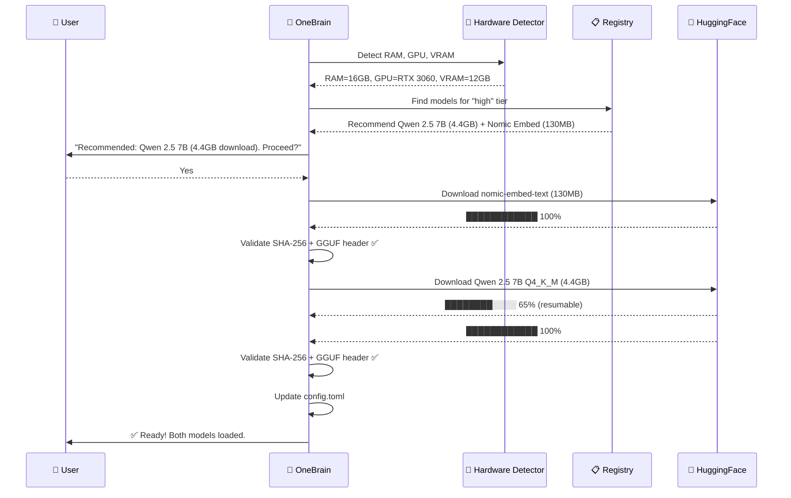

# Model Management Architecture — OneBrain Pillar 6

> **Research Date:** July 2026  
> **Author:** OneBrain Research Team  
> **Status:** Research Complete  
> **Scope:** Self-contained model download, caching, validation, and lifecycle management

---

## Executive Summary

OneBrain requires a **self-contained model management system** that downloads, validates, caches, and manages AI model files (GGUF format) without depending on external tools like Ollama. This document defines the architecture for:

1. **Curated Model Registry** — JSON catalog of pre-tested models with SHA-256 hashes
2. **Download Pipeline** — Resumable HTTP downloads from HuggingFace with integrity verification
3. **Storage Layout** — Named directory structure with cross-platform support
4. **GGUF Validation** — Magic byte checking + header parsing + SHA-256 verification
5. **Lifecycle Management** — First-run UX, model switching, updates, cleanup
6. **Dual Model Strategy** — Primary LLM + lightweight embedding model

### Key Architecture Decisions

| Decision | Choice | Rationale |
|:---|:---|:---|
| **Storage layout** | Named directories (not content-addressed) | Simpler for 1-2 models, human-readable |
| **Registry format** | JSON with SHA-256 + hardware tiers | Machine-readable, versioned, verifiable |
| **Download method** | Sequential streaming with Range resume | Simple, reliable, HuggingFace CDN handles throughput |
| **Validation** | SHA-256 whole-file + GGUF header parse | Dual-layer integrity checking |
| **Embedding model** | Auto-download alongside LLM | Negligible size (~130MB vs ~4.5GB LLM) |
| **Config format** | TOML | Rust-native, human-readable |
| **Cross-platform paths** | `directories` crate | Follows OS conventions |
| **GGUF parsing** | `gguf-rs` crate | Mature, supports v2/v3, mmap |

---

## 1. HuggingFace Hub API for Model Downloads

### 1.1 REST Endpoints

**List files in a repository:**
```bash
curl "https://huggingface.co/api/models/bartowski/Qwen2.5-7B-Instruct-GGUF"
```
Response includes a `siblings` array with file objects containing `rfilename` and `size`.

**Download URL Pattern:**
```
https://huggingface.co/{repo_id}/resolve/{revision}/{filename}
```

**Download with resume:**
```bash
curl -L -O -C - \
  "https://huggingface.co/bartowski/Qwen2.5-7B-Instruct-GGUF/resolve/main/Qwen2.5-7B-Instruct-Q4_K_M.gguf"

# With authentication (for gated models):
curl -L -O -C - \
  -H "Authorization: Bearer YOUR_HF_TOKEN" \
  "https://huggingface.co/bartowski/Qwen2.5-7B-Instruct-GGUF/resolve/main/Qwen2.5-7B-Instruct-Q4_K_M.gguf"
```

### 1.2 Rate Limits and Authentication

- **Dynamic rate limits** enforced over **5-minute windows**
- **Anonymous access**: Public files downloadable without token, more restrictive limits
- **Authenticated**: Free token from huggingface.co/settings/tokens (Read-only scope sufficient)
- **Rate limit error**: HTTP 429 — implement exponential backoff
- **No published hard numbers** — limits are dynamic and tiered

### 1.3 Resume Support

- HuggingFace CDN supports HTTP Range requests
- Use `Range: bytes=<offset>-` header for resumable downloads
- Server returns **206 Partial Content** when supporting resume
- Use `ETag` / `Last-Modified` with `If-Range` header to detect if remote file changed
- **Caveat**: HuggingFace uses temporary signed URLs that can expire — re-request if 403

---

## 2. GGUF File Validation

### 2.1 Header Structure

```
Offset 0:   4 bytes   Magic number = "GGUF" (0x47, 0x47, 0x55, 0x46)
Offset 4:   4 bytes   Version (uint32 LE, currently 3)
Offset 8:   8 bytes   tensor_count (uint64 LE)
Offset 16:  8 bytes   metadata_kv_count (uint64 LE)
```

### 2.2 GGUF File Sections (sequential):

1. **Header**: Magic, version, tensor count, metadata KV count
2. **Metadata**: Key-value pairs (typed: UINT8, FLOAT32, STRING, ARRAY, etc.)
3. **Tensor Data**: Tensor info (names, dims, types, offsets) + raw tensor weights

### 2.3 Key Metadata Extractable from GGUF

| Key | Description | Example |
|:---|:---|:---|
| `general.architecture` | Model architecture | `llama`, `qwen2`, `phi` |
| `general.name` | Human-readable name | `Qwen2.5-7B-Instruct` |
| `general.file_type` | Quantization type (enum) | `15` = Q4_K_M |
| `[arch].context_length` | Max sequence length | `32768` |
| `[arch].attention.head_count` | Number of attention heads | `32` |
| `[arch].block_count` | Number of layers | `32` |
| `tokenizer.ggml.model` | Tokenizer type | `gpt2`, `llama` |

### 2.4 `general.file_type` Enum

| Value | Quantization |
|:---|:---|
| 0 | ALL_F32 |
| 1 | MOSTLY_F16 |
| 2 | MOSTLY_Q4_0 |
| 7 | MOSTLY_Q8_0 |
| 15 | **Q4_K_M** (our default) |
| 17 | Q5_K_M |

### 2.5 Validation Rules

1. Check magic bytes == `GGUF`
2. Verify version (2 or 3 expected)
3. Parse metadata KV pairs — keys must be valid UTF-8
4. Verify file size matches expected (from registry)
5. Compute SHA-256 of complete file and compare to expected hash

### 2.6 Rust Crates for GGUF Parsing

| Crate | Notes |
|:---|:---|
| **`gguf-rs`** | Popular, supports v1/v2/v3, mmap, async I/O |
| **`gguf-llms`** | Type-safe, converts metadata to structured configs |
| **`gguf-rs-lib`** | Zero-copy parsing, optional async |

### 2.7 Basic Parsing Pattern (Rust)

```rust
use std::fs::File;
use std::io::Read;

fn validate_gguf(path: &Path) -> Result<GgufInfo> {
    let mut file = File::open(path)?;
    
    // 1. Check magic bytes
    let mut magic = [0u8; 4];
    file.read_exact(&mut magic)?;
    if &magic != b"GGUF" {
        return Err("Invalid magic bytes: not a GGUF file");
    }

    // 2. Check version
    let mut version_bytes = [0u8; 4];
    file.read_exact(&mut version_bytes)?;
    let version = u32::from_le_bytes(version_bytes);
    if version < 2 || version > 3 {
        return Err("Unsupported GGUF version");
    }

    // 3. Read counts
    let mut buf8 = [0u8; 8];
    file.read_exact(&mut buf8)?;
    let tensor_count = u64::from_le_bytes(buf8);
    file.read_exact(&mut buf8)?;
    let metadata_kv_count = u64::from_le_bytes(buf8);

    // 4. Parse metadata KV pairs for architecture, quantization, etc.
    // ... (use gguf-rs crate for full parsing)
    
    Ok(GgufInfo { version, tensor_count, metadata_kv_count })
}
```

---

## 3. Model Registry Design

### 3.1 Comparison: Existing Model Managers

| Feature | Ollama | LM Studio | GPT4All | **OneBrain** |
|:---|:---|:---|:---|:---|
| **Registry Format** | OCI JSON manifests | model.yaml | models3.json | **JSON registry** |
| **Storage** | Content-addressed blobs | Named files | Named files | **Named directories** |
| **Deduplication** | Yes (SHA-256 blobs) | No | No | **No (1-2 models)** |
| **Integrity Check** | SHA-256 digest | Schema validation | MD5 | **SHA-256 + GGUF header** |
| **Hardware Info** | Implicit | Auto-selects | `ramrequired` | **`min_ram_gb` + tier** |
| **Custom Models** | Modelfile | Direct load | No | **GGUF path/HF ID** |

### 3.2 OneBrain Model Registry Schema (`registry.json`)

```json
{
  "schema_version": 1,
  "last_updated": "2026-07-01T00:00:00Z",
  "models": [
    {
      "id": "qwen2.5-7b-instruct-q4km",
      "display_name": "Qwen 2.5 7B Instruct",
      "role": "llm",
      "architecture": "qwen2",
      "parameters": "7B",
      "quantization": "Q4_K_M",
      "file_type": 15,
      "context_length": 32768,
      "source": {
        "type": "huggingface",
        "repo_id": "bartowski/Qwen2.5-7B-Instruct-GGUF",
        "filename": "Qwen2.5-7B-Instruct-Q4_K_M.gguf",
        "revision": "main"
      },
      "file_size_bytes": 4683243264,
      "sha256": "abcdef1234567890...",
      "min_ram_gb": 8,
      "min_vram_gb": 6,
      "hardware_tier": "standard",
      "features": ["tool_calling", "structured_output", "multilingual"],
      "chat_template": "chatml",
      "recommended": true,
      "notes": "Best balance of quality and performance for 8GB+ RAM systems"
    },
    {
      "id": "qwen2.5-3b-instruct-q4km",
      "display_name": "Qwen 2.5 3B Instruct",
      "role": "llm",
      "architecture": "qwen2",
      "parameters": "3B",
      "quantization": "Q4_K_M",
      "file_type": 15,
      "context_length": 32768,
      "source": {
        "type": "huggingface",
        "repo_id": "bartowski/Qwen2.5-3B-Instruct-GGUF",
        "filename": "Qwen2.5-3B-Instruct-Q4_K_M.gguf",
        "revision": "main"
      },
      "file_size_bytes": 2134567890,
      "sha256": "fedcba0987654321...",
      "min_ram_gb": 4,
      "hardware_tier": "low",
      "features": ["tool_calling", "structured_output"],
      "chat_template": "chatml",
      "recommended": false,
      "notes": "For resource-constrained devices"
    },
    {
      "id": "nomic-embed-text-v1.5-q8",
      "display_name": "Nomic Embed Text v1.5",
      "role": "embedding",
      "architecture": "nomic-bert",
      "parameters": "137M",
      "quantization": "Q8_0",
      "file_type": 7,
      "context_length": 8192,
      "embedding_dimensions": 768,
      "source": {
        "type": "huggingface",
        "repo_id": "nomic-ai/nomic-embed-text-v1.5-GGUF",
        "filename": "nomic-embed-text-v1.5.Q8_0.gguf",
        "revision": "main"
      },
      "file_size_bytes": 134217728,
      "sha256": "9876543210abcdef...",
      "min_ram_gb": 1,
      "hardware_tier": "any",
      "task_prefixes": {
        "search_query": "search_query: ",
        "search_document": "search_document: "
      },
      "recommended": true,
      "notes": "Default embedding model. Requires task prefixes."
    }
  ],
  "hardware_tiers": {
    "low":      { "min_ram_gb": 4,  "description": "Mobile/tablets, low-end laptops" },
    "standard": { "min_ram_gb": 8,  "description": "Most laptops, desktop PCs" },
    "high":     { "min_ram_gb": 16, "description": "Gaming PCs, workstations" },
    "server":   { "min_ram_gb": 32, "description": "Servers, GPU clusters" }
  }
}
```

---

## 4. Download Pipeline Design

### 4.1 Pre-download Checks

1. Check available disk space (model size + 10% buffer)
2. Check if model already exists (by SHA-256)
3. HEAD request to verify server supports Range requests

### 4.2 Resumable Download (Rust Pseudocode)

```rust
async fn download_model(
    url: &str, 
    dest: &Path, 
    expected_sha256: &str,
    progress: impl Fn(u64, u64),
) -> Result<()> {
    let partial_path = dest.with_extension("gguf.partial");
    let existing_size = if partial_path.exists() {
        fs::metadata(&partial_path)?.len()
    } else {
        0
    };

    // HEAD request to check file size and resume support
    let head = client.head(url).send().await?;
    let total_size = head.content_length().unwrap_or(0);
    let accepts_range = head.headers().get("Accept-Ranges")
        .map(|v| v == "bytes").unwrap_or(false);
    let etag = head.headers().get("ETag").cloned();

    // Check disk space
    let available = fs2::available_space(dest.parent().unwrap())?;
    if available < (total_size - existing_size) + BUFFER {
        return Err(AiError::InsufficientDiskSpace);
    }

    // Build request with Range header if resuming
    let mut request = client.get(url);
    if existing_size > 0 && accepts_range {
        request = request.header("Range", format!("bytes={}-", existing_size));
        if let Some(etag) = &etag {
            request = request.header("If-Range", etag);
        }
    }

    let response = request.send().await?;

    // If 206 → resume; if 200 → restart from beginning
    let should_append = response.status() == StatusCode::PARTIAL_CONTENT;
    let mut file = if should_append {
        OpenOptions::new().append(true).open(&partial_path)?
    } else {
        File::create(&partial_path)?
    };

    // Stream with progress reporting
    let mut downloaded = if should_append { existing_size } else { 0 };
    let mut stream = response.bytes_stream();

    while let Some(chunk) = stream.next().await {
        let chunk = chunk?;
        file.write_all(&chunk)?;
        downloaded += chunk.len() as u64;
        progress(downloaded, total_size);
    }

    file.sync_all()?; // Flush to disk

    // SHA-256 verification (re-read full file)
    let computed_hash = sha256_file(&partial_path)?;
    if computed_hash != expected_sha256 {
        fs::remove_file(&partial_path)?;
        return Err(AiError::Sha256Mismatch);
    }

    // Atomic rename: .partial → .gguf
    fs::rename(&partial_path, dest)?;
    Ok(())
}
```

### 4.3 Key Implementation Details

- **`reqwest`** for HTTP with streaming
- **`sha2`** crate for SHA-256 verification
- **`.partial` extension** for in-progress files
- **`file.sync_all()`** before rename to ensure data on disk
- **`std::fs::rename`** is atomic on POSIX; same-volume on Windows
- **`sysinfo`** crate for disk space checking
- **Sequential streaming** (not parallel chunks) — simpler, sufficient

---

## 5. Storage Layout

### 5.1 Directory Structure

```
~/.local/share/onebrain/          # Linux (XDG_DATA_HOME)
%LOCALAPPDATA%\OneBrain\          # Windows
~/Library/Application Support/OneBrain/  # macOS

├── config.toml                    # User preferences
├── models/
│   ├── registry.json              # Local copy of curated model catalog
│   ├── llm/
│   │   ├── qwen2.5-7b-instruct-q4km/
│   │   │   ├── model.gguf         # The actual model file
│   │   │   ├── metadata.json      # Cached metadata (source, sha256, date)
│   │   │   └── model.gguf.partial # Only during download
│   │   └── custom-user-model/
│   │       ├── model.gguf         # User's custom GGUF file
│   │       └── metadata.json
│   ├── embedding/
│   │   └── nomic-embed-text-v1.5-q8/
│   │       ├── model.gguf
│   │       └── metadata.json
│   └── custom/                    # User-imported models
│       └── my-model/
│           ├── model.gguf
│           └── metadata.json
├── cache/
│   └── downloads/                 # Temporary download staging
└── logs/
    └── model_manager.log
```

### 5.2 Cross-Platform Paths

```rust
use directories::ProjectDirs;

fn get_model_dir() -> PathBuf {
    let proj = ProjectDirs::from("", "OneBrain", "OneBrain")
        .expect("Cannot determine data directory");
    let path = proj.data_dir().join("models");
    std::fs::create_dir_all(&path).ok();
    path
}
```

### 5.3 Named Files vs Content-Addressed

| Approach | Pros | Cons |
|:---|:---|:---|
| **Content-addressed (Ollama)** | Deduplication, integrity built-in | User-unfriendly, hard to inspect |
| **Named directories (chosen)** | Human-readable, easy to debug | No auto-dedup |

**Decision: Named directories** — OneBrain users manage 1-2 models, not dozens. Simplicity > deduplication.

---

## 6. Model Lifecycle Management

### 6.1 First-Run Experience



### 6.2 Model Switching

- Update `config.toml` to point to different model
- Signal runtime to unload current → load new
- For Ollama backend: just change API model parameter
- For in-process (Candle): model reload takes 1-5 seconds for GGUF

### 6.3 Model Updates

- Periodically fetch latest `registry.json` from OneBrain update server
- Compare SHA-256 hashes — if different, notify user
- **Opt-in updates only** — user must confirm
- Keep old model until new one fully downloaded and verified

### 6.4 Model Deletion

- Remove model directory + update metadata
- Show size: "Deleting Qwen 2.5 7B will free 4.4 GB"
- Protect active model from deletion

---

## 7. Config File Format (TOML)

```toml
[node]
node_id = "abc123"

[models]
# Active models
active_llm = "qwen2.5-7b-instruct-q4km"
active_embedding = "nomic-embed-text-v1.5-q8"

[models.preferences]
# Auto-download recommended model on first run
auto_download = true
# Check for model updates on startup
check_updates = true
# Update policy: "notify" | "auto" | "never"
update_policy = "notify"

[download]
# Resume interrupted downloads
resume_enabled = true
# HuggingFace token (optional, for gated models)
# hf_token = "hf_..."

[storage]
# Custom model storage path (overrides default)
# model_dir = "/path/to/custom/models"
# Maximum total storage for models (0 = unlimited)
max_storage_gb = 0

[hardware]
# Detected automatically, can be overridden
detected_ram_gb = 16
detected_gpu = "NVIDIA RTX 3060"
detected_vram_gb = 12
hardware_tier = "high"
# force_cpu_only = false
```

---

## 8. Embedding Model Management

### 8.1 nomic-embed-text-v1.5 Specifics

- **HuggingFace repo**: `nomic-ai/nomic-embed-text-v1.5-GGUF`
- **Recommended quantization**: Q8_0 — ~130 MiB
- **Context window**: 8192 tokens
- **Embedding dimensions**: 768
- **Requires task prefixes**:
  - `search_query: ` for queries
  - `search_document: ` for documents being indexed

### 8.2 Dual-Model Management Strategy

1. **Auto-download embedding alongside LLM** — small enough to include silently
2. **Independent lifecycle** — embedding model rarely needs updating
3. **Always loaded** — available even when LLM is being swapped
4. **Fallback**: If unavailable, degrade gracefully (no vector search, node still works)

### 8.3 Size Comparison

| Model | Role | Size (Q4_K_M) | Size (Q8_0) |
|:---|:---|:---|:---|
| Qwen 2.5 7B | LLM | ~4.4 GB | ~7.7 GB |
| Qwen 2.5 3B | LLM | ~2.0 GB | ~3.4 GB |
| nomic-embed-text-v1.5 | Embedding | ~70 MB | ~130 MB |

Embedding model = ~2-3% of LLM size — negligible storage and download impact.

---

## 9. Security Considerations

### 9.1 GGUF Safety

GGUF is inherently safe — binary format with no code execution capability (unlike pickle/PyTorch .pt files).

### 9.2 SHA-256 Verification Workflow

```
Registry contains: { sha256: "expected_hash" }
            ↓
Download file to .partial
            ↓
Compute SHA-256 of .partial file
            ↓
Compare computed vs expected
            ↓
Match? → Atomic rename .partial → .gguf
No match? → Delete .partial, report error
```

### 9.3 Security Model

| Layer | Protection |
|:---|:---|
| **Curated models** | SHA-256 in registry, verified by OneBrain team |
| **Custom models** | GGUF header validation + user warning |
| **Downloads** | HTTPS + SHA-256 verification |
| **Storage** | File permissions, atomic operations |
| **Future (v2)** | OpenSSF Sigstore model signing |

### 9.4 Custom Model Warning

When user imports a model not in the curated registry:
> ⚠️ "This model is not in the OneBrain curated registry — it has not been verified by the OneBrain team. Use at your own discretion."

Still validate GGUF header for structural integrity.

---

## 10. Risk Assessment

| Risk | Likelihood | Impact | Mitigation |
|:---|:---|:---|:---|
| Download interrupted/corrupted | High | Medium | Resumable downloads, SHA-256, atomic rename |
| HuggingFace rate limiting | Medium | Low | Auth token, exponential backoff, cached downloads |
| Malicious model file | Low | High | Curated registry, SHA-256, GGUF header validation |
| Disk space exhaustion | Medium | Medium | Pre-download space check, max_storage_gb config |
| HuggingFace API changes | Low | Medium | Abstract behind download trait |
| Model incompatible with runtime | Medium | Medium | Architecture validation from GGUF header |
| Registry update fails | Low | Low | Fallback to local registry, offline operation |
| Signed URL expiration during resume | Medium | Low | Re-request URL before resume |

---

## Appendix A: Cargo.toml Dependencies for Model Manager

```toml
[dependencies]
# HTTP client for downloads
reqwest = { version = "0.12", features = ["json", "rustls-tls", "stream"] }
# SHA-256 verification
sha2 = "0.10"
# GGUF file parsing
gguf-rs = "0.2"
# Cross-platform directories
directories = "5"
# System info (disk space, RAM)
sysinfo = "0.32"
# Config file parsing
toml = "0.8"
# JSON for registry
serde = { version = "1", features = ["derive"] }
serde_json = "1"
# Async runtime
tokio = { version = "1", features = ["fs", "io-util"] }
# Async streaming
futures-util = "0.3"
# Progress reporting
indicatif = { version = "0.17", optional = true }
```

---

*Document version: 1.0 | Next review: After model manager implementation*
