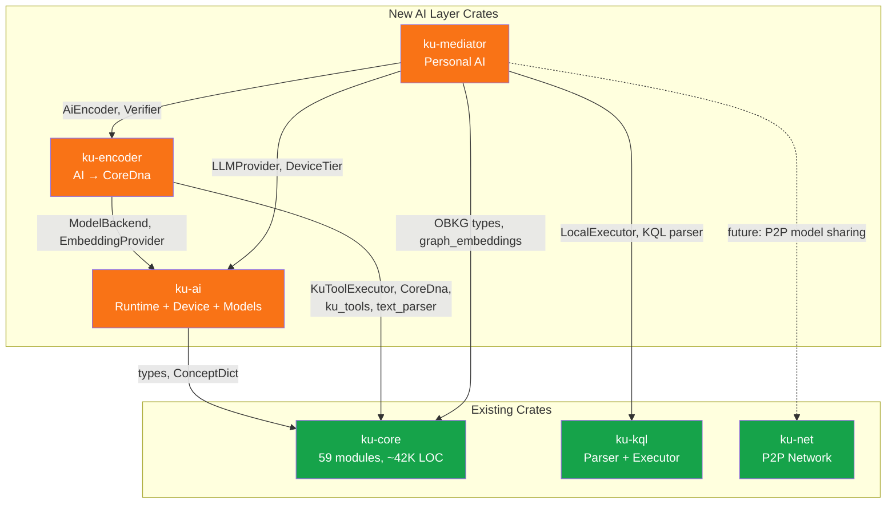
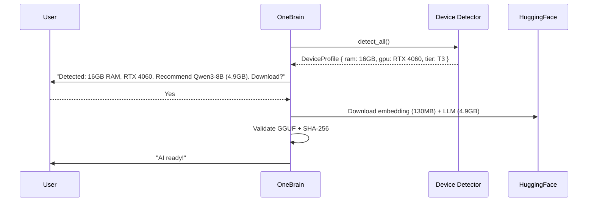

# OneBrain Pillar 6 — AI Layer Final Architecture Synthesis

> **Date:** July 2026 | **Status:** Final Architecture — Ready for Implementation  
> **Scope:** 3 new Rust crates consolidating 5 research documents into a cohesive AI Layer  
> **Existing Foundation:** ku-core (59 modules, ~42K LOC, 353 tests) | ku-kql (6 modules) | ku-net (24 modules)

---

## Executive Summary

The AI Layer decomposes into **3 new crates** following the existing workspace pattern:

| Crate | Purpose | Est. LOC |
|:---|:---|:---|
| **`ku-ai`** | Core AI: traits, backends, device detection, model management | ~3,300 |
| **`ku-encoder`** | AI-assisted KU encoding: prompts, GBNF grammars, verification | ~1,700 |
| **`ku-mediator`** | Personal AI: intent routing, RAG, context, profiling | ~3,500 |

**Total: ~8,500 LOC** (Phase 1-2), **~11,500 LOC** full implementation across 18 weeks.

---

## 1. Crate Dependency Graph



### Dependency Layers (No Circular Dependencies)

```
Layer 0:  ku-core (foundation)
Layer 1:  ku-kql → ku-core  |  ku-net → ku-core  |  ku-ai → ku-core
Layer 2:  ku-encoder → ku-ai, ku-core
Layer 3:  ku-mediator → ku-encoder, ku-ai, ku-kql, ku-core
```

---

## 2. Trait Definitions

### 2.1 `ModelBackend` — Low-Level Inference

```rust
#[async_trait]
pub trait ModelBackend: Send + Sync + 'static {
    async fn chat(
        &self, messages: &[ChatMessage], options: &InferenceOptions,
    ) -> Result<ChatResponse, AiError>;

    async fn chat_structured(
        &self, messages: &[ChatMessage], schema: &serde_json::Value,
        options: &InferenceOptions,
    ) -> Result<serde_json::Value, AiError>;

    async fn chat_with_tools(
        &self, messages: &[ChatMessage], tools: &[ToolDefinition],
        options: &InferenceOptions,
    ) -> Result<ChatOrToolResponse, AiError>;

    async fn health_check(&self) -> Result<BackendStatus, AiError>;
    async fn model_info(&self) -> Result<ModelInfo, AiError>;
    fn backend_name(&self) -> &str;
}

#[derive(Debug, Clone)]
pub struct InferenceOptions {
    pub temperature: f32,        // 0.1 for encoding
    pub max_tokens: Option<u32>,
    pub top_p: Option<f32>,
    pub seed: Option<u64>,
    pub stop: Vec<String>,
}
```

### 2.2 `EmbeddingProvider` — Embedding Generation

```rust
#[async_trait]
pub trait EmbeddingProvider: Send + Sync + 'static {
    async fn embed(&self, text: &str) -> Result<Vec<f32>, AiError>;
    async fn embed_batch(&self, texts: &[&str]) -> Result<Vec<Vec<f32>>, AiError>;
    fn dimensions(&self) -> usize;
    fn model_name(&self) -> &str;
}
```

### 2.3 `LLMProvider` — High-Level Chat + Tools

```rust
#[async_trait]
pub trait LLMProvider: Send + Sync + 'static {
    async fn chat(&self, messages: &[ChatMessage]) -> Result<String, AiError>;
    async fn generate_structured(
        &self, messages: &[ChatMessage], schema: &serde_json::Value,
    ) -> Result<serde_json::Value, AiError>;
    async fn call_tools(
        &self, messages: &[ChatMessage], tools: &[ToolDefinition], max_retries: u32,
    ) -> Result<Vec<ToolCall>, AiError>;
    fn embedding_provider(&self) -> &dyn EmbeddingProvider;
    fn device_tier(&self) -> DeviceTier;
}
```

---

## 3. Crate Details

### 3.1 `ku-ai` — Core AI Runtime (~3,300 LOC)

```
ku-ai/
├── Cargo.toml
├── registry.json                   # Curated model catalog
├── src/
│   ├── lib.rs                      # Re-exports
│   ├── error.rs                    # AiError enum
│   ├── traits.rs                   # ModelBackend + EmbeddingProvider + LLMProvider
│   ├── types.rs                    # ChatMessage, ToolCall, ModelInfo
│   ├── config.rs                   # AiConfig TOML parsing
│   ├── device/
│   │   ├── mod.rs                  # DeviceProfile, detect_all()
│   │   ├── system.rs              # RAM/CPU via sysinfo
│   │   ├── gpu.rs                 # GPU: NVML → Vulkan → fallback
│   │   ├── tier.rs               # 7-tier classification (T0-T6)
│   │   └── monitor.rs            # Runtime memory pressure
│   ├── registry/
│   │   ├── mod.rs                 # ModelRegistry
│   │   ├── schema.rs             # ModelEntry structs
│   │   └── selector.rs           # Auto model selection algorithm
│   ├── model_manager/
│   │   ├── mod.rs                 # ModelManager orchestrator
│   │   ├── download.rs           # Resumable HF download pipeline
│   │   ├── validator.rs          # GGUF header + SHA-256
│   │   └── storage.rs            # Named directory layout
│   └── backend/
│       ├── mod.rs                 # Backend factory
│       ├── ollama.rs             # OllamaBackend (HTTP REST)
│       └── mock.rs               # MockBackend for testing
└── tests/
```

**Key dependencies:** `sysinfo`, `reqwest`, `sha2`, `directories`, `toml`, `nvml-wrapper` (optional)

### 3.2 `ku-encoder` — AI KU Encoding (~1,700 LOC)

```
ku-encoder/
├── Cargo.toml
├── grammars/
│   └── ku_tool_calls.gbnf         # GBNF grammar for constrained output
├── src/
│   ├── lib.rs
│   ├── error.rs                    # EncoderError
│   ├── encoder.rs                 # AiEncoder: text → CoreDna
│   ├── verifier.rs               # Encode-Decode-Compare pipeline
│   ├── prompt.rs                  # Prompt builder (wraps ku_system_prompt)
│   ├── grammar.rs                # GBNF grammar strings
│   ├── fallback.rs               # Retry → Tier 1 fallback
│   ├── batch.rs                   # Batch encoding coordinator
│   └── log.rs                     # EncodingLog persistence
└── tests/
```

**Key integration:** Uses `KuToolExecutor` (ku-core) to execute AI tool calls → CoreDna binary.

### 3.3 `ku-mediator` — Personal AI (~3,500 LOC)

```
ku-mediator/
├── Cargo.toml
├── src/
│   ├── lib.rs
│   ├── error.rs
│   ├── mediator.rs                # Main Mediator struct + process()
│   ├── intent.rs                  # 3-tier intent classification
│   ├── context.rs                 # 4-tier memory management
│   ├── session.rs                 # Session state + lifecycle
│   ├── retriever.rs              # Hybrid RAG pipeline
│   ├── deduplicator.rs           # Embedding-based dedup
│   ├── detector.rs               # Knowledge signal detection
│   ├── graph_agent.rs            # NL → KQL → answer
│   ├── synthesizer.rs            # Knowledge synthesis
│   ├── profile.rs                 # Local user profile
│   ├── input/
│   │   ├── mod.rs                 # InputHandler trait
│   │   └── text.rs
│   └── output/
│       ├── mod.rs                 # OutputFormatter trait
│       └── text.rs
└── tests/
```

---

## 4. Configuration System

### 4.1 TOML Config (`config.toml`)

```toml
[ai]
enabled = true
backend = "ollama"   # "ollama" | "candle" (Phase 2) | "mock"

[ai.ollama]
base_url = "http://localhost:11434"
timeout_secs = 120

[ai.models]
active_llm = "qwen3-8b-instruct-q4km"
active_embedding = "nomic-embed-text-v1.5-q8"
auto_download = true

[ai.encoding]
temperature = 0.1
max_retries = 2
min_confidence = 0.60
review_threshold = 0.85
default_mode = "interactive"

[ai.mediator]
knowledge_detection = "reactive"  # "reactive" | "proactive" | "auto"
max_history = 20
graph_agent_enabled = true
```

### 4.2 Auto-Configuration by Tier

| Tier | LLM | Embedding | Encoding Mode |
|:---|:---|:---|:---|
| T0 (≤4GB) | Phi-4-mini Q2_K | all-MiniLM-L6-v2 | Batch |
| T1 (6-8GB) | Phi-4-mini Q3_K_M | all-MiniLM-L6-v2 | Batch |
| T2 (8-12GB) | Qwen3-4B Q4_K_M | all-MiniLM-L6-v2 | Interactive |
| T3 (16GB) | Qwen3-8B Q4_K_M | nomic-embed-text | Interactive |
| T4 (32GB) | Qwen3-8B Q8_0 | nomic-embed-text | Interactive |
| T5 (64GB) | Qwen3-14B Q4_K_M | nomic-embed-text | Interactive |
| T6 (128GB+) | Qwen3-32B Q4_K_M | nomic-embed-text | Interactive |

### 4.3 First-Run Flow



---

## 5. Integration Points

### 5.1 ku-encoder → ku-core (Tightest Coupling)

```rust
use ku_core::ku_tool_executor::KuToolExecutor;     // Execute AI tool calls → CoreDna
use ku_core::ku_tools::tool_definitions;             // 15 tool schemas
use ku_core::ku_system_prompt::generate_system_prompt;
use ku_core::core_dna::{encode_core_dna, decode_core_dna};
use ku_core::text_parser::parse_text_to_core_dna;   // Tier 1 fallback
use ku_core::concept_dict::ConceptDict;
```

### 5.2 ku-mediator → ku-kql (Graph Query)

```rust
use ku_kql::parser::parse_query;       // Validate LLM-generated KQL
use ku_kql::executor::LocalExecutor;   // Execute KQL locally
```

### 5.3 ku-mediator → ku-core OBKG (RAG)

```rust
use ku_core::graph_embeddings::{EntityEmbedding, RelationTable};
use ku_core::graph_bio::spreading_activation;
```

---

## 6. Implementation Phases

### Phase 1 — MVP (Weeks 1-6, ~4,500 LOC)

**Goal:** Working AI encoding pipeline with Ollama backend.

| Week | Deliverable | Crate |
|:---|:---|:---|
| 1 | traits + types + error + config | ku-ai |
| 2 | Device detection + tier + OllamaBackend | ku-ai |
| 3 | Model registry + selector + MockBackend | ku-ai |
| 4 | AiEncoder + prompt builder + GBNF | ku-encoder |
| 5 | Verifier + fallback logic | ku-encoder |
| 6 | End-to-end integration tests | all |

**Exit Criteria:**
- ✅ `AiEncoder::encode("Water boils at 100°C")` → valid CoreDna
- ✅ Encode-Decode-Compare passes (similarity ≥ 0.75)
- ✅ Device detection works on Windows/macOS/Linux
- ✅ Fallback to Tier 1 when AI fails

### Phase 2 — Model Management + Mediator (Weeks 7-12, ~4,500 LOC)

**Goal:** Self-contained model downloads + basic personal AI.

| Week | Deliverable | Crate |
|:---|:---|:---|
| 7-8 | Download pipeline + GGUF validator + ModelManager | ku-ai |
| 9 | Intent classification + session/context | ku-mediator |
| 10 | Hybrid RAG retriever + deduplicator | ku-mediator |
| 11 | Graph agent (NL→KQL) + user profile | ku-mediator |
| 12 | Mediator struct + integration tests | ku-mediator |

**Exit Criteria:**
- ✅ First-run auto-downloads correct model
- ✅ Resume interrupted downloads
- ✅ Mediator handles Encode, Retrieve, GraphQuery intents
- ✅ NL→KQL works for basic patterns

### Phase 3 — Advanced (Weeks 13-18, ~3,000 LOC)

| Deliverable | Crate |
|:---|:---|
| Batch encoding + encoding logs | ku-encoder |
| Knowledge signal detection | ku-mediator |
| Candle/mistral.rs backend (in-process) | ku-ai |
| Voice input (whisper.cpp) | ku-mediator |
| Resource monitor + graceful degradation | ku-ai |

---

## 7. Testing Strategy

### 7.1 Test Types

| Type | Backend | When |
|:---|:---|:---|
| **Unit tests** | `MockBackend` (deterministic) | Always (CI) |
| **Golden tests** | Real Ollama + Qwen3-8B | Weekly |
| **Benchmark** | Real model, measure t/s + accuracy | Pre-release |
| **Stress** | 100+ KUs, check OOM/memory | Pre-release |

### 7.2 Golden Test Corpus

```rust
const GOLDEN_TESTS: &[(&str, &str)] = &[
    ("Water boils at 100°C", "fact"),
    ("Photosynthesis converts light to energy", "fact"),
    ("Step 1: Preheat oven. Step 2: Mix flour.", "procedure"),
    ("The coffee tasted bitter and warming", "experience"),
    ("Nước sôi ở 100 độ C", "fact"),  // Vietnamese
];

// Target: ≥ 80% accuracy on golden corpus
```

### 7.3 MockBackend for CI

```rust
pub struct MockBackend {
    responses: HashMap<String, ChatResponse>,
    embedding_dim: usize,
}

impl MockBackend {
    pub fn with_golden_responses() -> Self {
        // Pre-loaded deterministic responses for each golden test
    }
}
```

---

## 8. Critical Path Files (Build Order)

1. **`ku-ai/src/traits.rs`** — All crates depend on these traits
2. **`ku-ai/src/types.rs`** — Shared type definitions
3. **`ku-ai/src/error.rs`** — Error types
4. **`ku-ai/src/backend/ollama.rs`** — First working backend
5. **`ku-ai/src/device/tier.rs`** — Device classification
6. **`ku-encoder/src/encoder.rs`** — Core encoding pipeline
7. **`ku-encoder/src/fallback.rs`** — Graceful degradation
8. **`ku-mediator/src/mediator.rs`** — Main orchestrator

---

## Summary

| Metric | Value |
|:---|:---|
| **New crates** | 3 (ku-ai, ku-encoder, ku-mediator) |
| **Total new LOC** | ~8,500 (Phase 1-2), ~11,500 total |
| **New modules** | ~35 |
| **External new deps** | 8 (sysinfo, reqwest, sha2, directories, toml, futures-util, async-trait, nvml-wrapper) |
| **Circular dependency risk** | None (strictly layered) |
| **Phase 1 timeline** | ~6 weeks |
| **Full implementation** | ~18 weeks |

---

*Document version: 1.0 | Status: Ready for implementation review*
