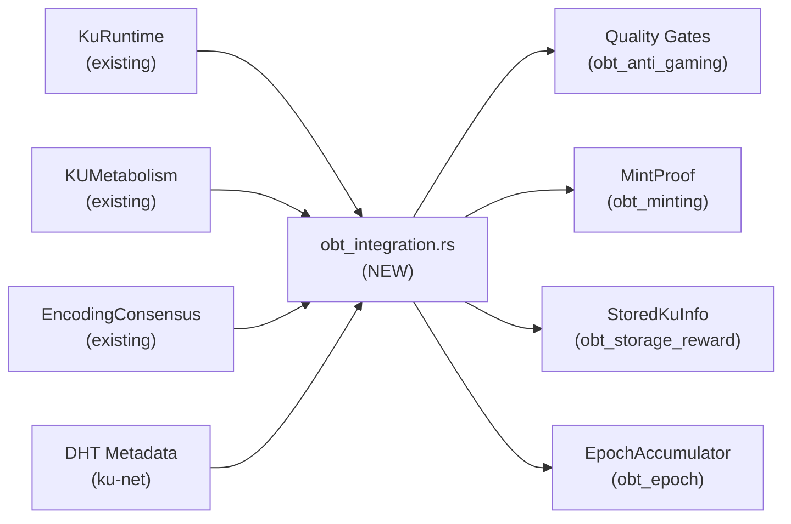

# KU ↔ OBT Impact Analysis — KU có cần thay đổi gì?

## Kết Luận Ngắn

> **KU KHÔNG cần thay đổi kiến trúc**, nhưng cần **bổ sung 3 fields mới** + **1 tầng kết nối** (orchestration layer) để OBT rewards thực sự hoạt động.

---

## 1. ✅ Đã Tương Thích (Không Cần Thay Đổi)

Tin tốt: type system giữa OBT và KU **rất tương thích**:

| OBT Cần | KU Đã Có | File |
|---------|----------|------|
| `ku_cid: [u8; 32]` (BLAKE3) | `KuRuntime.cid` / `cid_bytes()` | ku_runtime.rs |
| `wire_bytes_len: u32` | `KuRuntime.wire_size() -> usize` | ku_runtime.rs |
| `pomv_score: f32` | `Epigenetics.pomv_score() -> f64` | epigenetics.rs |
| `metabolic_rate` | `KUMetabolism.metabolic_rate()` | metabolism.rs |
| `bond_count` | `KuRuntime.epi.bonds.len()` | epigenetics.rs |
| `encoding_status` | `KuRuntime.encoding_status: EncodingStatus` | ku_runtime.rs |
| `VectorClock` | Shared `crdt::VectorClock` | crdt.rs |
| CID format `[u8; 32]` BLAKE3 | Cả hai dùng cùng format | ✅ |
| Encoding reward formula | `encoding_reward.rs` đã có `calculate_reward()` | encoding_reward.rs |
| PoMV 6 signals | `TrustSection` có đủ 6 signals | types.rs |
| `MintActivity` ↔ `MintEventSource` | 4 variants map 1:1 | ✅ |

> **11/17 integration points đã sẵn sàng** — chỉ cần cast type (ví dụ `usize → u32`, `f64 → f32`).

---

## 2. ⚠️ Cần Bổ Sung (3 Fields Mới)

| # | OBT Gate Cần | KU Thiếu | Giải Pháp | Priority |
|---|-------------|----------|-----------|----------|
| 1 | `encoding_time_ms: u64` (Gate 4) | Không track thời gian encoding | Thêm field `encoding_time_ms` vào `EncodingSubmission` | 🔴 HIGH |
| 2 | `verifier_count: u32` (Gate 2) | Có `EncodingConsensus.submissions` nhưng không có accessor | Thêm `fn verifier_count(&self) -> u32` vào `EncodingConsensus` | 🟡 MEDIUM |
| 3 | `is_duplicate: bool` (Gate 2) | `EpigeneticSection.simhash` tồn tại nhưng chưa có logic so sánh | Thêm `is_duplicate` field hoặc hàm check simhash/LSH | 🟡 MEDIUM |

### Chi tiết:

**Field 1: `encoding_time_ms`** — Gate 4 yêu cầu `encoding_time_ms >= 100ms` để chống auto-generated spam. Hiện tại `EncodingSubmission` có `timestamp` nhưng không có duration.

```rust
// Cần thêm vào EncodingSubmission:
pub struct EncodingSubmission {
    // ... existing fields ...
    pub encoding_time_ms: u64,  // ← NEW: thời gian xử lý encoding
}
```

**Field 2: `verifier_count`** — Gate 2 yêu cầu `≥ 3 independent AI verifiers`. `EncodingConsensus.submissions.len()` đã chứa dữ liệu này, chỉ cần accessor:

```rust
// Cần thêm vào EncodingConsensus:
impl EncodingConsensus {
    pub fn verifier_count(&self) -> u32 {
        self.submissions.len() as u32  // ← Simple accessor
    }
}
```

**Field 3: `is_duplicate`** — Gate 2 kiểm tra trùng lặp. BLAKE3 CID đã là content-addressed (same content = same CID), nên:

```rust
// Option A: Check CID tồn tại trong network (DHT lookup)
pub fn is_duplicate(ku_cid: &[u8; 32], known_cids: &HashSet<[u8; 32]>) -> bool {
    known_cids.contains(ku_cid)
}
// Option B: SimHash threshold check cho near-duplicates
```

---

## 3. 🔧 Cần Kết Nối (Integration Glue)

Các module OBT hoạt động **độc lập** — cần 1 tầng kết nối để "nối dây":

### 3.1 Orchestration Layer (mới)

Cần tạo `obt_integration.rs` hoặc mở rộng `ku_lifecycle.rs`:



### 3.2 Cần kết nối 7 điểm

| # | Từ | Đến | Tác dụng |
|---|-----|-----|----------|
| 1 | `KuLifecycle.tick()` | `EpochAccumulator.record_pomv()` | PoMV scores → R1 rewards |
| 2 | `EncodingConsensus` đạt FULL | `MintProof(Encoding/Verification)` | R2/R3 rewards |
| 3 | `KuRuntime` fields | `gate_1..gate_4()` | Quality check trước khi reward |
| 4 | DHT replica count | `StoredKuInfo.actual_replicas` | R4 storage rewards |
| 5 | `KUMetabolism.metabolic_rate()` | `StoredKuInfo.metabolism_rate` | R4 demand weight |
| 6 | Rate limiter | `KuLifecycle.ingest()` | Chặn spam trước khi tạo KU |
| 7 | `MintSource` variants | `TransferBlock` creation | Reward → ledger entry |

### 3.3 Builder Functions Cần Tạo

```rust
// Tạo StoredKuInfo từ KU data:
pub fn build_stored_ku_info(
    ku: &KuRuntime,
    replicas: u32,        // từ DHT
    metabolism: f64,      // từ KUMetabolism
    epochs: u64,          // từ DHT tracking
) -> StoredKuInfo {
    StoredKuInfo {
        ku_cid: ku.cid,
        wire_bytes_len: ku.wire_size() as u32,
        actual_replicas: replicas,
        metabolism_rate: metabolism,
        epochs_stored: epochs,
    }
}

// Tạo FormulaInputs từ KU data:
pub fn build_formula_inputs(
    ku: &KuRuntime,
    role_mult: f64,
    storage: Option<StorageFactors>,
) -> FormulaInputs {
    FormulaInputs {
        raw_size_kb: ku.wire_size() as f64 / 1024.0,
        role_multiplier: role_mult,
        pomv_score: ku.epi.pomv_score() as f32,
        storage_factors: storage,
    }
}
```

---

## 4. `gene_count` Semantic Clarification

> [!IMPORTANT]
> OBT Gate 1 yêu cầu `gene_count >= 2`. Tuy nhiên:
> - KU v6: mỗi `KuRuntime` = 1 Gene (đơn vị kiến thức đơn)
> - `gene_count` trong context OBT có thể nghĩa là `instruction_count()` (số instructions/codons trong Gene)
> 
> **Đề xuất**: Map `gene_count` → `ku.instruction_count()` (≥ 2 instructions đảm bảo KU có nội dung thực sự, không phải empty shell).

---

## 5. DHT Layer Gaps (ku-net)

Hai giá trị OBT cần mà chỉ DHT layer biết:

| Giá trị | Hiện tại | Cần |
|---------|----------|-----|
| `actual_replicas` | DHT replicates nhưng không track count | Thêm replica counter per KU CID |
| `epochs_stored` | Không track | Thêm per-node storage duration tracking |

Đây là thay đổi ở **ku-net** (network layer), không phải ku-core.

---

## 6. Tóm Tắt Effort

| Hạng mục | Files ảnh hưởng | Effort |
|----------|----------------|--------|
| 3 fields mới | `encoding_consensus.rs` | 🟢 Nhỏ (< 30 lines) |
| Builder functions | `obt_integration.rs` (NEW) | 🟡 Trung bình (~200 lines) |
| DHT tracking | `ku-net/dht.rs` | 🟠 Lớn (cần thiết kế) |
| gene_count clarification | `obt_anti_gaming.rs` | 🟢 Nhỏ (rename/doc) |
| Quality gate wiring | `ku_lifecycle.rs` | 🟡 Trung bình |

> [!NOTE]
> **KU kiến trúc KHÔNG cần redesign.** Tất cả core types (CID, PoMV, bonds, encoding status) đã tương thích.
> Chỉ cần "nối dây" — tạo integration layer và bổ sung 3 fields nhỏ.
