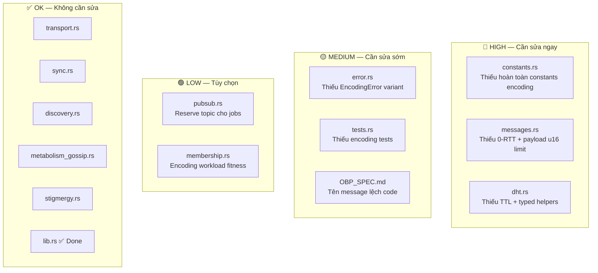

# Phân tích Impact Encoding Consensus → Pillar 2 (OBP)

## Tổng quan

Encoding Consensus đã thêm 3 module mới vào `ku-net` (`encoding_job.rs`, `encoding_gossip.rs`, `encoding_stigmergy.rs`) nhưng chưa **tích hợp** vào các module OBP hiện tại. Phân tích dưới đây xác định mọi gap cần xử lý.

---

## Phân loại Impact



---

## 🔴 HIGH Priority

### 1. `constants.rs` — GAP: Thiếu encoding constants hoàn toàn

**Vấn đề**: Tất cả encoding constants đang nằm rải rác trong các module riêng (`encoding_stigmergy.rs` define local `ALPHA_WAIT`, `BETA_SLOTS`...). Không có section encoding nào trong [constants.rs](file:///c:/Users/shpy2/Documents/OneBrain/src/ku-net/src/constants.rs).

**Cần thêm**:

| Constant | Giá trị | Mục đích |
|----------|---------|----------|
| `MAX_ENCODING_VERIFIERS` | `3` | Cap verifiers per job |
| `ENCODING_JOB_TTL_S` | `604_800` (7 days) | DHT job expiry |
| `MAX_CONCURRENT_ENCODING_JOBS` | `3` | Per verifier load limit |
| `ENCODING_CONSENSUS_THRESHOLD` | `0.70` | Score threshold cho FULL |
| `ENCODING_CLAIM_COOLDOWN_S` | `60` | Anti-stampede rate limit |
| `ENCODING_REWARD_BASE_OBT` | `5` | Base reward per verify |
| `ENCODING_GOSSIP_INTERVAL_S` | `30` | Job update broadcast interval |

**Hành động**: Tạo section `// ── Encoding Consensus ──` + di chuyển constants từ `encoding_stigmergy.rs` về đây.

---

### 2. `messages.rs` — INTEGRATION: 2 vấn đề kỹ thuật

**Vấn đề A: `is_zero_rtt_safe()` chưa bao gồm encoding types**

Hiện tại chỉ 8 message types được đánh dấu 0-RTT safe ([line 296-301](file:///c:/Users/shpy2/Documents/OneBrain/src/ku-net/src/messages.rs#L296-L301)). `EncodingJobAnnounce` và `EncodingJobUpdate` là **idempotent** (đọc DHT, không thay đổi state) → nên cho vào 0-RTT safe.

**Vấn đề B: `payload_length: u16` (max 65KB)**

[Header struct](file:///c:/Users/shpy2/Documents/OneBrain/src/ku-net/src/messages.rs#L31) dùng `u16` → max payload 65,535 bytes. `EncodingSubmission` chứa `compressed_raw_text + CoreDna bytes` — raw text lớn (papers, articles) compressed vẫn có thể > 64KB.

> [!WARNING]
> Đây là **structural decision** ảnh hưởng toàn bộ protocol. Nếu upgrade lên `u32`, header size tăng từ 4 → 6 bytes → breaking change. Giải pháp thay thế: giới hạn raw text < 64KB hoặc chunking.

**Hành động**: 
1. Thêm `EncodingJobAnnounce | EncodingJobUpdate` vào `is_zero_rtt_safe()`
2. Quyết định u16 strategy (limit vs chunk vs upgrade)

---

### 3. `dht.rs` — INTEGRATION: Thiếu TTL và typed helpers

**Vấn đề**: DHT storage là `HashMap<[u8; 32], Vec<u8>>` — flat bytes, không có TTL. Encoding jobs sẽ **tồn tại mãi mãi** trên DHT cho đến khi bị evict bởi storage cap (10,000).

**Cần thêm**:

```rust
// Typed helpers
pub fn store_encoding_job(&mut self, job: &EncodingJob) -> Result<(), DhtError>;
pub fn find_encoding_job(&self, raw_hash: &[u8; 32]) -> Option<EncodingJob>;

// TTL support  
pub fn store_with_ttl(&mut self, key: [u8; 32], value: Vec<u8>, ttl_s: u64);
pub fn expire_stale(&mut self, now: u64) -> usize;
```

**Hành động**: 
1. Thêm TTL field vào DHT entries: `HashMap<[u8; 32], (Vec<u8>, Option<u64>)>` (value + expiry timestamp)
2. Thêm `expire_stale()` sweep method
3. Thêm typed convenience methods cho `EncodingJob`

---

## 🟡 MEDIUM Priority

### 4. `error.rs` — GAP: Thiếu `EncodingError`

[NetError](file:///c:/Users/shpy2/Documents/OneBrain/src/ku-net/src/error.rs#L9-L15) chỉ có 5 variants (Identity, Message, Membership, Bootstrap, Transport). Encoding modules dùng `ClaimRejectReason` nhưng không có top-level error type.

**Cần thêm**:
```rust
pub enum EncodingError {
    JobNotFound,
    ClaimFailed(ClaimRejectReason),
    ConsensusTimeout,
    InvalidClaimToken,
    VerificationFailed(String),
    JobExpired,
}
```

---

### 5. `tests.rs` — GAP: Thiếu encoding test coverage

- `test_message_header_all_types` (line 171) KHÔNG bao gồm 6 encoding types mới
- Không có cross-module integration test (post job → claim → submit → finalize)
- Test summary sai số lượng message types

**Cần thêm**: 
1. Encoding types vào roundtrip test
2. Encoding integration test scenario

---

### 6. `OBP_SPEC.md` — Spec/Code tên message lệch

| Spec (§5) | Code (`messages.rs`) | Semantic |
|-----------|---------------------|----------|
| `EncodingJobPublish` (0x90) | `EncodingJobAnnounce` | ✅ Code đúng hơn |
| `EncodingJobClaim` (0x91) | `EncodingClaimReq` | Code rõ ràng hơn |
| `EncodingVerifyRequest` (0x92) | `EncodingClaimResp` | ❌ **Semantic khác nhau!** |
| `EncodingVerifyResponse` (0x93) | `EncodingSubmission` | Code đúng hơn |
| `EncodingReward` (0x95) | `EncodingJobUpdate` | ❌ **Semantic khác nhau!** |

> [!IMPORTANT]  
> **0x92 và 0x95** có **semantic mismatch** giữa spec và code — cần thống nhất tên. Đề xuất: lấy code làm chuẩn, cập nhật spec.

---

## 🟢 LOW Priority

### 7. `pubsub.rs` — Reserve encoding job topic

Encoding jobs hiện chỉ dùng DHT (pull-based). Nếu thêm pub/sub broadcast (push-based), verifiers sẽ nhận job nhanh hơn thay vì phải poll DHT.

**Đề xuất**: Reserve `DomainCode 0xFFFF` cho `ENCODING_JOBS_TOPIC`.

### 8. `membership.rs` — Encoding workload trong fitness

Fitness scoring có 7 components nhưng không reflect encoding load. Một node đang verify 3 jobs song song sẽ có CPU/bandwidth cao → fitness nên giảm.

**Đề xuất**: Thêm `encoding_workload: f32` vào `FitnessComponents` (optional).

---

## ✅ Không cần sửa (6 files)

| File | Lý do |
|------|-------|
| [transport.rs](file:///c:/Users/shpy2/Documents/OneBrain/src/ku-net/src/transport.rs) | Message-agnostic, QUIC streams hoạt động cho mọi message type |
| [sync.rs](file:///c:/Users/shpy2/Documents/OneBrain/src/ku-net/src/sync.rs) | CRDT sync là orthogonal với encoding status |
| [discovery.rs](file:///c:/Users/shpy2/Documents/OneBrain/src/ku-net/src/discovery.rs) | Peer discovery chung, không cần biết encoding |
| [metabolism_gossip.rs](file:///c:/Users/shpy2/Documents/OneBrain/src/ku-net/src/metabolism_gossip.rs) | Pattern đã được replicate, module intact |
| [stigmergy.rs](file:///c:/Users/shpy2/Documents/OneBrain/src/ku-net/src/stigmergy.rs) | Query routing vs job selection — modules independent |
| [lib.rs](file:///c:/Users/shpy2/Documents/OneBrain/src/ku-net/src/lib.rs) | ✅ Đã update (3 modules registered) |

---

## Đề xuất Implementation Plan

### Wave 1: Foundation (HIGH) — 3 files
1. **`constants.rs`**: Thêm encoding section (7 constants) + di chuyển stigmergy constants
2. **`messages.rs`**: Update `is_zero_rtt_safe()` + quyết định payload strategy
3. **`dht.rs`**: Thêm TTL + typed encoding job helpers

### Wave 2: Polish (MEDIUM) — 3 files
4. **`error.rs`**: Thêm `EncodingError` + `From` impl
5. **`tests.rs`**: Encoding message roundtrip + integration test  
6. **`OBP_SPEC.md`**: Đồng bộ tên message types (code làm chuẩn)

### Wave 3: Optional (LOW) — 2 files  
7. **`pubsub.rs`**: Reserve encoding topic
8. **`membership.rs`**: Encoding workload fitness

## Open Questions

> [!IMPORTANT]
> **Q1**: `payload_length: u16` — upgrade lên `u32` (breaking) hay giới hạn raw text < 64KB?
> 
> **Q2**: Có muốn thêm pub/sub broadcast cho encoding jobs (real-time push) hay DHT polling đủ?
> 
> **Q3**: Encoding workload có nên ảnh hưởng SWIM fitness? Nếu có → node bận verify sẽ bị giảm tier.
