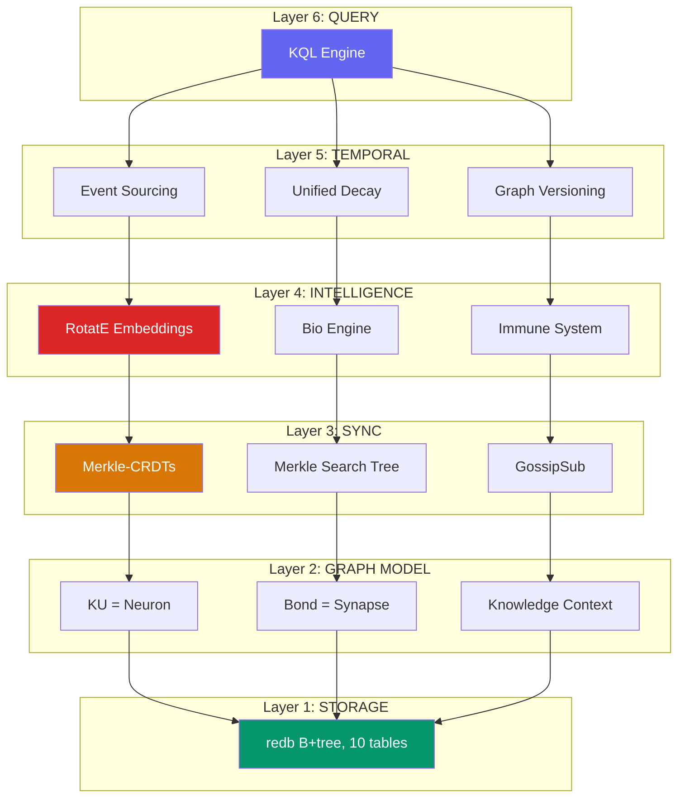
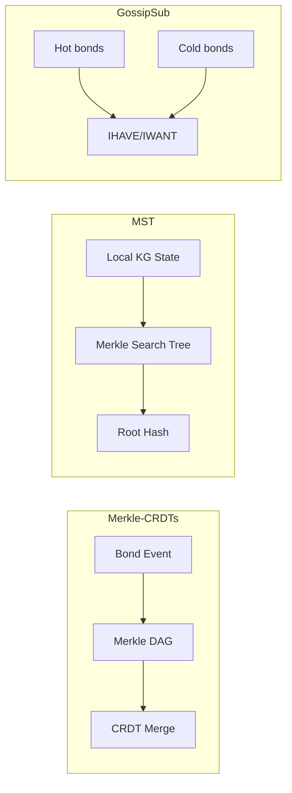
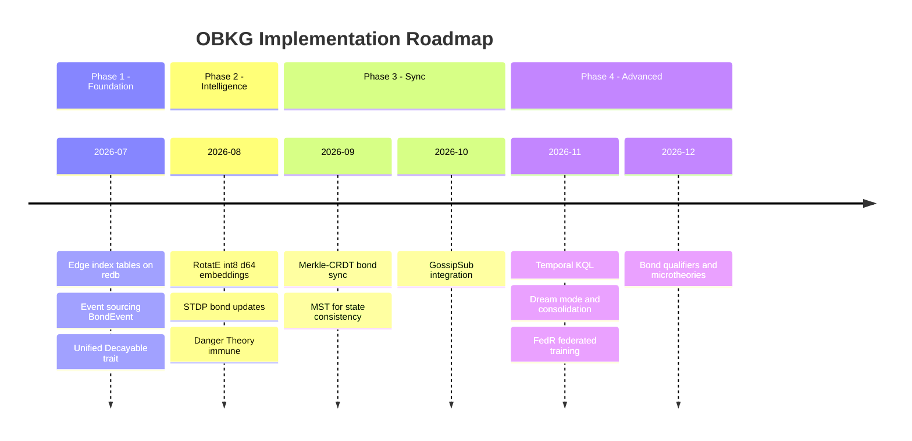

# OBKG — Bản Thiết Kế Tổng Hợp

> **OneBrain Knowledge Graph (OBKG) — "Bộ Não Sống của Tri Thức"**
> Tổng hợp từ 52 hệ thống nghiên cứu qua 6 tài liệu

---

## Mục Lục

1. [Tầm Nhìn: OBKG Là Gì?](#1-tầm-nhìn-OBKG-là-gì)
2. [Vị Trí Của OBKG Trong Bản Đồ Tri Thức Thế Giới](#2-vị-trí-của-OBKG)
3. [Kiến Trúc 6 Tầng](#3-kiến-trúc-6-tầng)
4. [Tầng 1 — Storage: "Bộ Nhớ Sinh Học"](#4-tầng-1--storage)
5. [Tầng 2 — Graph Model: "Nơ-ron & Synapse"](#5-tầng-2--graph-model)
6. [Tầng 3 — Sync: "Hệ Thần Kinh Phân Tán"](#6-tầng-3--sync)
7. [Tầng 4 — Intelligence: "Trí Tuệ Nhân Tạo Sinh Học"](#7-tầng-4--intelligence)
8. [Tầng 5 — Temporal: "Ký Ức & Tiến Hóa"](#8-tầng-5--temporal)
9. [Tầng 6 — Query: "Ngôn Ngữ Tư Duy"](#9-tầng-6--query)
10. [3 Đổi Mới Cốt Lõi](#10-ba-đổi-mới-cốt-lõi)
11. [So Sánh Tổng Thể](#11-so-sánh-tổng-thể)
12. [Lộ Trình Triển Khai](#12-lộ-trình)

---

## 1. Tầm Nhìn: OBKG Là Gì?

### Một câu: 
> **OBKG là một đồ thị tri thức phi tập trung, mã hóa nhị phân, hoạt động như một sinh vật sống — nơi tri thức được sinh ra, tiến hóa, cạnh tranh, và tự chết đi khi không còn giá trị.**

### Ba từ khóa:

| Từ khóa | Ý nghĩa | Không giống ai |
|---------|---------|----------------|
| **Decentralized** | Không có server trung tâm. Mỗi node giữ một phần KG | Google KG/Wikidata đều centralized |
| **Binary-encoded** | Mọi thứ mã hóa nhị phân (u8, varint) thay vì RDF/JSON | Compact hơn RDF 10-100x |
| **Bio-inspired** | Tri thức hoạt động theo quy luật sinh học (tiến hóa, miễn dịch, synapse) | Không KG nào khác có |

### Tại sao cần OBKG?

```
Vấn đề của KG hiện tại:
┌─────────────────────────────────────────────────────┐
│ Google KG      → Khổng lồ nhưng đóng, không minh bạch │
│ Wikidata       → Mở nhưng tập trung, SPARQL chậm     │
│ ConceptNet     → Nhẹ nhưng tĩnh, trọng số không đổi  │
│ Freebase       → Chết vì phụ thuộc Google             │
│ Cyc            → 40 năm vẫn không phổ biến            │
└─────────────────────────────────────────────────────┘

OBKG giải quyết bằng:
┌─────────────────────────────────────────────────────┐
│ ✅ Phi tập trung → Không ai kiểm soát                │
│ ✅ Tự tiến hóa   → Bond mạnh lên/yếu đi theo sử dụng│
│ ✅ Nhẹ           → Binary encoding, chạy trên edge    │
│ ✅ Miễn dịch     → Tự phát hiện và cách ly spam      │
│ ✅ Có giá trị    → OBT token reward cho đóng góp     │
└─────────────────────────────────────────────────────┘
```

---

## 2. Vị Trí Của OBKG

```
                          Living / Adaptive
                               ▲
                               │
                    Cyc ·      │           · OBKG ★★★
                               │
                               │      · Holochain
                               │
           Google KG ·         │
          ConceptNet ·         │
             Wikidata ·        │         · OrbitDB
               YAGO ·          │
            DBpedia ·          │
                               │
  ◄────────────────────────────┼──────────────────────►
  Centralized                  │            Decentralized
                               │
                            Static
```

> OBKG chiếm vị trí **duy nhất**: Decentralized + Living. Không hệ thống nào khác ở góc này.

**Không có hệ thống nào nằm ở góc phần tư "Decentralized + Living"** — đó chính là vị trí duy nhất của OBKG.

---

## 3. Kiến Trúc 6 Tầng



> [!IMPORTANT]
> Mỗi tầng được **học từ các hệ thống tốt nhất** — nhưng kết hợp lại theo cách chưa từng có.

---

## 4. Tầng 1 — Storage: "Bộ Nhớ Sinh Học"

### Học từ ai?

| Nguồn | Bài học | Áp dụng |
|-------|---------|---------|
| **CozoDB** | Datalog trên redb (fork thực tế tồn tại!) | Chứng minh graph queries CHẠY ĐƯỢC trên redb |
| **TerminusDB** | Git-for-data, delta layers, immutable | Delta sync = CRDT compaction |
| **JanusGraph** | Adjacency-list-per-vertex trên KV store | Gần nhất với cách OBKG lưu Vec<Bond> |
| **Oxigraph** | Binary encoding (type byte + hash) | Mã hóa nhị phân key cho redb |
| **SurrealDB** | Rust-native, embedded → distributed | Validate mô hình local-first → P2P |

### Thiết kế: 4 bảng cũ + 6 bảng mới

```
HIỆN TẠI (4 bảng):
┌──────────────────────────────────────────────────────────────┐
│ TABLE_KUS:           CID(32B) → CoreDNA (binary wire bytes) │
│ TABLE_EPI:           CID(32B) → Epigenetics JSON            │
│ TABLE_INDEX_TRUST:   trust_score+CID → ∅                    │
│ TABLE_INDEX_CONCEPT: concept_id+CID → ∅                     │
└──────────────────────────────────────────────────────────────┘

VẤN ĐỀ: Bonds nằm TRONG JSON → Tìm "ai trỏ đến KU-X?" phải scan HẾT!

MỚI (+6 bảng graph index):
┌──────────────────────────────────────────────────────────────┐
│ 5. EDGES_OUT:   src(32B)+rel(1B)+tgt(32B) → BondMeta(9B)   │
│    → "KU-X chỉ đến những KU nào?"  (scan prefix = src)     │
│                                                              │
│ 6. EDGES_IN:    tgt(32B)+rel(1B)+src(32B) → ∅              │
│    → "Ai chỉ đến KU-X?" (scan prefix = tgt)                │
│                                                              │
│ 7. EDGES_TYPE:  rel(1B)+src(32B)+tgt(32B) → ∅              │
│    → "Tất cả bond Causes trong hệ thống"                   │
│                                                              │
│ 8. INDEX_STATE: state(1B)+cid(32B) → ∅                     │
│    → Tìm tất cả bond Active/Weakened/Deprecated             │
│                                                              │
│ 9. BOND_WEIGHT: weight(2B)+src(32B)+tgt(32B) → ∅           │
│    → "Bond mạnh nhất?" (scan from high to low)              │
│                                                              │
│ 10. EDGE_TIME:  timestamp(4B)+src(32B)+tgt(32B) → ∅        │
│    → "Bond tạo trong tuần qua?"                             │
└──────────────────────────────────────────────────────────────┘
```

### BondMeta — 9 bytes siêu nén

```
┌─────────┬─────────┬───────┬───────┬───────────┐
│ weight  │ creator │ state │ decay │ timestamp │
│  2B     │  1B     │  1B   │  1B   │   4B      │
└─────────┴─────────┴───────┴───────┴───────────┘
= 9 bytes vs JSON hiện tại ~200-500 bytes
```

### Nguyên tắc thiết kế

> **"Ghi 1 bond = ghi vào 3 bảng"** — EDGES_OUT + EDGES_IN + (EDGES_TYPE hoặc khác). Đổi lấy write overhead nhỏ để đạt O(1) read.

---

## 5. Tầng 2 — Graph Model: "Nơ-ron & Synapse"

### KU = Nơ-ron (Neuron)

Mỗi KU (Knowledge Unit) là một tế bào thần kinh trong bộ não tri thức:

```
┌─────────── KU (Knowledge Unit) ──────────────────────┐
│                                                       │
│  CoreDNA (bất biến, content-addressed)                │
│  ├── gene_type: 1 trong 11 loại                      │
│  ├── epistemic_status: 1 trong 11 mức                │
│  ├── evidence_type: 1 trong 9 loại                   │
│  ├── codons: payload (text, image, data...)           │
│  └── CID = BLAKE3(CoreDNA)  ← định danh duy nhất     │
│                                                       │
│  Epigenetics (biến đổi, tiến hóa)                    │
│  ├── bonds: Vec<Bond>  ← synapse đến KU khác         │
│  ├── trust_score: f64  ← độ tin cậy                  │
│  ├── embedding: [i8; 512]  ← vị trí ngữ nghĩa       │
│  ├── relational_emb: [i8; 64]  ← RotatE (MỚI)       │
│  └── ...decay, version, timestamps                    │
│                                                       │
└───────────────────────────────────────────────────────┘
```

### Gene Types — 11 "loài" tri thức

| Loài | Ý nghĩa | Ví dụ |
|------|---------|-------|
| 🔬 **Fact** | Sự thật khách quan | "Nước sôi ở 100°C" |
| 📋 **Procedure** | Quy trình, cách làm | "Cách nấu phở" |
| 💭 **Experience** | Trải nghiệm cá nhân | "Tôi đã đi Đà Lạt" |
| 🎨 **Creative** | Sáng tạo nghệ thuật | Bài thơ, bản nhạc |
| 🎬 **MediaExperience** | Media | Review phim, podcast |
| 👁️ **Testimony** | Chứng kiến trực tiếp | "Tôi thấy tai nạn lúc 3h" |
| 📐 **Formal** | Toán học, logic | Định lý Pythagoras |
| 💡 **Hypothesis** | Giả thuyết | "Dark matter tồn tại" |
| 📖 **Narrative** | Câu chuyện | Truyện ngắn |
| 👃 **Sensory** | Dữ liệu cảm giác | Nhiệt độ, âm thanh |
| 🧩 **Composite** | Tổ hợp nhiều KU | Bài báo = abstract + body + refs |

### EpistemicStatus — 11 mức "độ chín" của tri thức

Đây là **đặc điểm DUY NHẤT** của OBKG — không KG nào khác có:

```
     Axiomatic (0x0A) ──── "1 + 1 = 2"           ████████████ 100%
  FormallyProven (0x09) ── "Định lý Fermat"       ███████████  95%
     Consensus (0x08) ──── "Trái đất tròn"        ██████████   90%
  PeerReviewed (0x07) ──── "Paper trên Nature"     █████████    80%
  Corroborated (0x06) ──── "3 nguồn xác nhận"     ████████     70%
     Evidence (0x05) ───── "Có dữ liệu chứng minh" ███████      60%
   Hypothesis (0x04) ──── "Giả thuyết có logic"   ██████       50%
  Observation (0x03) ──── "Tôi quan sát thấy"     █████        40%
   Testimony (0x02) ───── "Người A kể lại"        ████         30%
     Hearsay (0x01) ───── "Nghe nói rằng..."      ███          20%
      Rumor (0x00) ────── "Tin đồn"               ██           10%
```

> [!NOTE]
> **So sánh**: Wikidata có 3 mức (Preferred/Normal/Deprecated). ConceptNet có weight số thực. Cyc có boolean (đúng/sai trong microtheory). OBKG có **11 mức liên tục** — từ tin đồn đến tiên đề.

### Bond = Synapse — 33 kiểu quan hệ

Bond là **mối liên kết giữa 2 KU**, giống synapse nối 2 nơ-ron:

```
  KU_A ──[Causes, weight=850, decay=Slow]──► KU_B
  
  Mỗi bond chứa:
  ├── target_cid: [u8; 32]   ← KU đích
  ├── relation: RelationType  ← 1 trong 33 kiểu (u8)
  ├── weight: u16             ← sức mạnh (0-65535)
  ├── initial_weight: u16     ← sức mạnh ban đầu
  ├── decay: DecayRate        ← None/Slow/Med/Fast
  ├── last_reinforced: u32    ← lần cuối được dùng
  └── state: EdgeState        ← Active/Weakened/Deprecated
```

### 33 RelationTypes — 8 danh mục

```
┌──────────────────────────────────────────────────────────────────┐
│  A: EPISTEMIC (6)  — Quan hệ nhận thức                         │
│     Extends · Supplements · Refutes · Corroborates              │
│     Supersedes · Qualifies                                       │
│     → "KU này mở rộng / bác bỏ / xác nhận KU kia"             │
│                                                                  │
│  B: STRUCTURAL (4) — Cấu trúc phân cấp                         │
│     PartOf · InstanceOf · Specializes · Generalizes             │
│     → "Là một phần / trường hợp / chuyên biệt hóa"            │
│                                                                  │
│  C: CAUSAL (4) — Nhân quả                                       │
│     Causes · Enables · Prevents · DependsOn                     │
│     → "Gây ra / cho phép / ngăn chặn / phụ thuộc"              │
│                                                                  │
│  D: DERIVATION (4) — Phái sinh                                  │
│     ExampleOf · AnalogyOf · AppliesTo · DerivedFrom             │
│     → "Ví dụ / tương tự / ứng dụng / xuất phát từ"            │
│                                                                  │
│  E: SIMILARITY (4) — Tương đồng                                 │
│     Duplicates · Translates · Paraphrases · Inspires            │
│     → "Trùng lặp / dịch / diễn giải lại / truyền cảm hứng"   │
│                                                                  │
│  F: TEMPORAL (2) — Thời gian                                    │
│     Precedes · Cooccurs                                          │
│     → "Xảy ra trước / đồng thời"                               │
│                                                                  │
│  G: PROVENANCE (3) — Nguồn gốc                                  │
│     Cites · AuthoredBy · ReviewedBy                              │
│     → "Trích dẫn / viết bởi / đánh giá bởi"                   │
│                                                                  │
│  H: EXPERIENTIAL (7) — Trải nghiệm                              │
│     ReactionTo · TestimonyAbout · FormallyProves                 │
│     EvolvesInto · VariantOf · SensoryEvidenceFor                 │
│     CulturallyContextualizes                                     │
│     → "Phản ứng / chứng kiến / chứng minh / biến thể"          │
└──────────────────────────────────────────────────────────────────┘
```

> [!IMPORTANT]
> **Phát hiện quan trọng từ nghiên cứu**: Category A (Epistemic) và H (Experiential) là **DUY NHẤT** — không hệ thống nào trong 8 hệ thống lớn (Google KG, Wikidata, DBpedia, YAGO, ConceptNet, Freebase, Cyc, WordNet) có quan hệ nhận thức hay trải nghiệm ở mức protocol.

### 3 Đổi mới từ nghiên cứu cho Graph Model

#### Đổi mới 1: Bond Qualifiers (từ Wikidata + Freebase)

**Vấn đề**: Bond hiện tại chỉ nối 2 KU. Nhưng nhiều tri thức cần ngữ cảnh phức tạp hơn.

**Ví dụ**: "Einstein giữ chức Giáo sư tại Princeton từ 1933 đến 1955"
- Cần nối: Einstein → Princeton → Professor → 1933 → 1955

**Giải pháp**: Thêm `qualifiers` (bộ phận bổ nghĩa) vào Bond:

```rust
pub struct Bond {
    pub target_cid: Vec<u8>,
    pub relation: RelationType,
    pub weight: u16,
    // ...existing fields...
    pub qualifiers: Vec<BondQualifier>,  // MỚI
}

pub struct BondQualifier {
    pub key: QualifierKey,    // valid_from, valid_until, location, confidence...
    pub value: QualifierValue, // u64 timestamp, string, CID reference...
}
```

**Nguồn gốc**: Wikidata dùng qualifier trên mỗi Statement. Freebase dùng CVT (Compound Value Type) — node trung gian cho quan hệ n-ary. OBKG kết hợp cả hai: qualifier cho bổ nghĩa đơn giản, Composite KU (GeneType=10) cho quan hệ phức tạp.

#### Đổi mới 2: Knowledge Context / Microtheory (từ Cyc)

**Vấn đề**: Tri thức có thể mâu thuẫn nhau tùy ngữ cảnh.
- Trong vật lý Newton: "Thời gian tuyệt đối"
- Trong vật lý Einstein: "Thời gian tương đối"
- Cả hai đều đúng — trong ngữ cảnh riêng!

**Giải pháp**: Mỗi KU có thể thuộc một `context_id`:

```rust
pub struct KuMetadata {
    // ...existing...
    pub context_id: Option<ConceptId>,  // MỚI — microtheory
}
```

**Quy tắc**: Mâu thuẫn **giữa** các context → OK (PoMV quyết định). Mâu thuẫn **trong** cùng context → cảnh báo.

#### Đổi mới 3: KU Deprecation Model (từ Wikidata)

**Vấn đề**: Khi tri thức bị thay thế, nó vẫn cần tồn tại (lịch sử) nhưng query nên ưu tiên cái mới.

```rust
pub enum KUStatus {
    Active,                              // Đang hoạt động
    Deprecated { reason: ConceptId },    // Bị thay thế (vẫn tồn tại)
    Superseded { successor: Vec<u8> },   // Đã có phiên bản mới
}
```

---

## 6. Tầng 3 — Sync: "Hệ Thần Kinh Phân Tán"

### Vấn đề cốt lõi

```
Node A (Hà Nội) có KU₁ ──[Causes]──► KU₂
Node B (Tokyo)  có KU₂ ──[Extends]──► KU₃
Node C (London) có KU₃ ──[Refutes]──► KU₁

→ Làm sao đồng bộ graph mà KHÔNG CẦN server trung tâm?
→ Làm sao biết 2 node có cùng dữ liệu không?
→ Làm sao xử lý khi 2 node offline rồi reconnect?
```

### Giải pháp: 3 cơ chế kết hợp



#### Cơ chế 1: Merkle-CRDTs (từ OrbitDB)

**Ý tưởng**: Mỗi thao tác trên bond (tạo, reinforced, weaken, deprecate) là một **event** được lưu trong Merkle DAG — giống Git commit.

```
Event₁ (Create bond A→B)
  ↓
Event₂ (Reinforce A→B)
  ↓         ↘
Event₃ (A)   Event₃' (B tạo đồng thời)
  ↓         ↙
Event₄ (Merged — CRDT tự động merge)
```

- **Content-addressed**: Mỗi event có CID = BLAKE3(event) → tamper-evident
- **CRDT merge**: Khi 2 node có event khác nhau → merge tự động, không conflict
- **Efficient sync**: So sánh root hash → chỉ trao đổi event khác nhau

> **Học từ**: OrbitDB (Merkle-CRDTs trên IPFS), IPLD (content-addressed linking)

#### Cơ chế 2: Merkle Search Tree (từ AT Protocol/Bluesky)

**Ý tưởng**: Toàn bộ KG cục bộ của mỗi node được tổ chức thành MST — cây cân bằng, deterministic, có một root hash duy nhất.

```
                    Root Hash: 7a3f...
                   /                    \
            Hash: b2c1...          Hash: e4d5...
           /          \           /          \
      [KU_001→KU_050]  [KU_051→KU_100]  [KU_101→...]
```

- **O(1) consistency check**: Hai node so sánh root hash → biết ngay có giống nhau không
- **Efficient delta sync**: Đi xuống cây, chỉ trao đổi nhánh khác nhau
- **Cryptographic proof**: Chứng minh một KU thuộc graph mà không cần gửi toàn bộ

> **Học từ**: AT Protocol (Personal Data Server dùng MST), TerminusDB (delta layers)

#### Cơ chế 3: GossipSub (từ libp2p)

**Ý tưởng**: Hybrid giữa mesh (nhanh, tin cậy) và gossip (nhẹ, phủ rộng).

```
HOT TOPIC (mesh):           COLD TOPIC (gossip):
A ←→ B ←→ C ←→ D           A ···· B ···· C
↑    ↕    ↕    ↓                   ↓
E ←→ F ←→ G ←→ H           D ···· E ···· F
Full mesh, eager-push       Lazy IHAVE/IWANT
Latency: ~50ms              Latency: ~500ms
```

- **Pheromone-informed**: Bond "nóng" (nhiều pheromone) → mesh propagation
- **Bond "lạnh"** → lazy gossip (IHAVE: "tôi có bond X", IWANT: "gửi cho tôi")
- **Peer scoring**: Node chậm/spam bị hạ điểm → loại khỏi mesh

> **Học từ**: GossipSub (Ethereum, Filecoin), Holochain (agent-centric validation)

---

## 7. Tầng 4 — Intelligence: "Trí Tuệ Nhân Tạo Sinh Học"

### 3 hệ thống thông minh

```
┌─────────────────────────────────────────────────────────┐
│              INTELLIGENCE LAYER                          │
│                                                          │
│  ┌──────────────┐ ┌──────────────┐ ┌──────────────────┐ │
│  │  EMBEDDING   │ │  BIO ENGINE  │ │  IMMUNE SYSTEM   │ │
│  │              │ │              │ │                  │ │
│  │ RotatE int8  │ │ STDP bonds   │ │ 8 antibody types │ │
│  │ d=64         │ │ Dream mode   │ │ Danger Theory    │ │
│  │ FedR sync    │ │ Consolidation│ │ Clonal Selection │ │
│  │              │ │ Spreading    │ │                  │ │
│  │ 64 bytes/KU  │ │ activation   │ │ Quarantine       │ │
│  └──────────────┘ └──────────────┘ └──────────────────┘ │
│       Link           Knowledge          Anti-spam        │
│    Prediction       Evolution           Defense          │
└─────────────────────────────────────────────────────────┘
```

#### A. RotatE Embeddings — "Bản Đồ Ngữ Nghĩa Của Bond"

**Vấn đề**: Làm sao máy hiểu được quan hệ "Causes" khác "Extends" khác "PartOf"?

**Giải pháp**: Mỗi KU có một vector 64 chiều trong không gian phức. Mỗi relation là một phép quay (rotation):

$$f(h, r, t) = -\|h \circ r - t\|$$

Trong đó:
- $h$ = embedding entity nguồn (64 int8 values)
- $r$ = rotation vector cho relation (32 complex dims, $|r_i| = 1$)
- $t$ = embedding entity đích
- $\circ$ = Hadamard product (phép nhân element-wise)

**Tại sao RotatE?** Vì nó xử lý được TẤT CẢ 4 pattern trong 33 RelationType:

| Pattern | Ví dụ OBKG | RotatE giải quyết |
|---------|-----------|-------------------|
| **Symmetric** | Duplicates, Cooccurs | $r = e^{i\pi}$ (quay 180°) |
| **Antisymmetric** | Causes, PartOf, Precedes | $r \neq \pm 1$ |
| **Inverse** | Extends ↔ DerivedFrom | $r_2 = \bar{r}_1$ (conjugate) |
| **Composition** | Causes ∘ Enables | $r_3 = r_1 \circ r_2$ (cộng góc) |

**Memory**: 33 relations × 32 bytes = **1,056 bytes** cho TOÀN BỘ relation embeddings. Mỗi KU thêm **64 bytes**. Cực nhẹ!

**Federated Training (FedR)**:
```
1. INIT:   Seed 33 relation embeddings (1,056 bytes)
2. LOCAL:  Mỗi node train trên local triples (SGD, 10-20 steps)
3. GOSSIP: Gửi Δr (thay đổi relation embedding) cho K peers (~1 KB/round)
4. CONVERGE: ~50-100 rounds → relation embeddings hội tụ
5. PRIVACY: KHÔNG BAO GIỜ chia sẻ entity embeddings
```

> **Học từ**: TransE (Bordes 2013), RotatE (Sun 2019), FedR (2024), ConceptNet Numberbatch

#### B. Bio Engine — "Hệ Thần Kinh Thích Ứng"

5 cơ chế mới (ngoài Hebbian + Stigmergy hiện có):

**1. STDP (Spike-Timing-Dependent Plasticity)**

Hiện tại: Bond được reinforced khi 2 KU "co-retrieved" (cùng xuất hiện). Đối xứng.

Đề xuất: Thêm **chiều thời gian**. Nếu KU-A được truy vấn TRƯỚC KU-B → bond A→B mạnh lên. Ngược lại → yếu đi.

```
A truy vấn trước B (causal direction):
  Bond A→B: weight += A_PLUS × e^(-Δt/τ)  (tăng)
  
B truy vấn trước A (anti-causal):
  Bond A→B: weight += A_MINUS × e^(-Δt/τ) (giảm, vì A_MINUS < 0)
```

**2. Memory Consolidation (2-tier)**

Giống não người: hippocampus (bộ nhớ ngắn hạn) → neocortex (bộ nhớ dài hạn).

```
Working Memory (24-48h):
  KU mới vào → đánh giá → nếu đủ điểm → consolidate

Long-term Memory (vĩnh viễn):
  KU đã consolidate → bond weight × 1.5x bonus
  
Điểm consolidation = retrieval_count × 0.3 
                    + pomv_score × 0.3
                    + bond_count × 0.2
                    + emotional_salience × 0.2
```

**3. Dream Mode (Offline Restructuring)**

Giống REM sleep — tái tổ chức tri thức khi hệ thống "nghỉ":

```
Dream Mode (chạy mỗi 24h, off-peak):
├── REPLAY: Re-activate popular query patterns
├── RANDOM ASSOCIATION: Thử kết nối cross-domain
│   → "Vật lý quantum + Ý thức" → speculative bond nếu embedding similar
├── ABSTRACTION: Phát hiện subgraph patterns → tạo meta-KU
└── PRUNING: Xóa speculative bonds không ai dùng sau 7 ngày
```

**4. Spreading Activation (Query Propagation)**

Query không chỉ tìm KU match — mà lan tỏa qua bonds:

```
Query "quantum" → KU₁(quantum_mechanics) 
  → [Causes] → KU₂(wave_particle_duality)  activation: 0.8
    → [Enables] → KU₃(double_slit_experiment)  activation: 0.64
      → [FormallyProves] → KU₄(quantum_theory)  activation: 0.51
```

**5. Self-Healing (Mycelium-inspired)**

Khi node chết → bypass routes tự động:

```
Normal:  A ──bond──► B ──bond──► C
B dies:  A ──────bypass──────────► C (tạo bond mới qua node thay thế)
```

> **Học từ**: Brain connectome (Watts-Strogatz 1998), STDP (Markram 1997), Memory consolidation (Rasch & Born 2013), Mycelium networks, Ant Colony Optimization (Dorigo 2004)

#### C. Immune System — "Hệ Miễn Dịch Nâng Cấp"

Hiện tại: 4 antibody types (behavioral). Đề xuất: thêm 4 loại (structural từ KGE):

```
HIỆN TẠI (Behavioral):           MỚI (Structural — từ KGE):
├── TemporalBurst                ├── LowTripleScore
│   (quá nhiều KU trong 1 phút)  │   (bond có RotatE score thấp)
├── SourceConcentration          ├── ClusterOutlier
│   (1 nguồn tạo quá nhiều)     │   (KU ở vùng trống embedding space)
├── LowEngagement               ├── TemporalDrift
│   (không ai dùng)              │   (entity embedding thay đổi đột ngột)
└── DiversityDeficit             └── InverseViolation
    (toàn cùng 1 loại)              (bond vi phạm inverse rule)
```

**Danger Theory (từ Matzinger 2002)**: Thay vì "self vs non-self" (dễ false-positive), dùng **danger signals** — chỉ phản ứng khi có DẤU HIỆU NGUY HIỂM thật sự.

```rust
fn danger_assessment(ku: &KU, signals: &[DangerSignal]) -> ThreatLevel {
    let danger = signals.iter().map(|s| s.weight() * s.intensity()).sum();
    let safe = ku.positive_interactions();   // retrieval, citations, etc.
    if danger > safe * THRESHOLD { Quarantine } else { Safe }
}
```

---

## 8. Tầng 5 — Temporal: "Ký Ức & Tiến Hóa"

### Event Sourcing — "Lịch Sử Bất Biến"

**Nguyên tắc**: Không ghi đè trạng thái → chỉ append events. Trạng thái hiện tại = replay tất cả events.

```rust
enum BondEvent {
    BondCreated { source, target, relation, weight, timestamp, vector_clock },
    BondReinforced { source, target, new_weight, timestamp },
    BondWeakened { source, target, new_weight, reason, timestamp },
    BondDeprecated { source, target, superseded_by, timestamp },
    EpistemicStatusChanged { ku_cid, old_status, new_status, evidence, timestamp },
}
```

**Lợi ích**: Time-travel miễn phí — replay events đến bất kỳ thời điểm nào.

### Unified Decay — "Cái Chết Có Kiểm Soát"

$$w_{eff}(t) = w_0 \times e^{-\lambda \cdot \Delta t}$$

**Quy tắc vàng**: Không phải mọi bond đều nên decay!

| Loại bond | λ (per day) | Half-life | Lý do |
|-----------|-------------|-----------|-------|
| **Structural** (PartOf, InstanceOf) | **0** | **∞** | "Hà Nội là thủ đô VN" không bao giờ hết hạn |
| **Provenance** (Cites, AuthoredBy) | **0** | **∞** | "Einstein viết E=mc²" là sự thật vĩnh viễn |
| **Temporal** (Precedes, Cooccurs) | **0** | **∞** | Trình tự thời gian không thay đổi |
| **Causal** (Causes, Enables) | 0.0019 | 365 ngày | Nhân quả ổn định nhưng có thể bị bác bỏ |
| **Epistemic** (Supplements, Qualifies) | 0.0077 | 90 ngày | Bổ sung có thể lỗi thời |
| **Experiential** (ReactionTo) | 0.099 | 7 ngày | Phản ứng cảm xúc phai nhanh |

```rust
trait Decayable {
    fn decay_lambda(&self) -> f64;
    fn last_reinforced(&self) -> u64;
    fn floor(&self) -> f64 { 0.0 }
    
    fn effective_value(&self, current: f64, now: u64) -> f64 {
        let hours = (now - self.last_reinforced()) as f64 / 3600.0;
        let decayed = current * (-self.decay_lambda() * hours).exp();
        decayed.max(self.floor())
    }
}

// Áp dụng cho TẤT CẢ: Bond, TrustScore, Pheromone
impl Decayable for Bond { /* per-RelationType λ */ }
impl Decayable for TrustScore { /* λ=0.01 */ }
impl Decayable for PheromoneHop { /* λ=0.0513 */ }
```

### Knowledge Evolution — Mô hình Kuhn

```
Pre-paradigm     Normal Science     Anomaly          Crisis           Revolution
    │                 │                │                │                │
Many Hypothesis  Evidence →      Refutes bonds    Cluster of       Supersedes bond
    KUs          Corroborated →   appear          Refutes →        → new Consensus
                 PeerReviewed                     trust decays     Old = DEPRECATED
```

---

## 9. Tầng 6 — Query: "Ngôn Ngữ Tư Duy"

### KQL — Knowledge Query Language

Hiện tại KQL hỗ trợ: FIND, STORE, LINK, SCOPE, WATCH, MERGE, COUNT/SUM/AVG.

Từ nghiên cứu, thêm 3 khả năng mới:

#### Recursive Path Traversal (từ Cypher + CozoDB)

```sql
-- Hiện tại: chỉ 1 hop
FIND (ku:KU)-[r:Causes]->(m:KU)

-- MỚI: multi-hop (1 đến 5 bước)
FIND (ku:KU)-[*1..5:Causes]->(m:KU)

-- MỚI: bất kỳ quan hệ nào
FIND (ku:KU)-[*..3]->(m:KU) WHERE m.epistemic_status >= PeerReviewed
```

#### Temporal Queries (từ YAGO SPOTL + TerminusDB)

```sql
-- Time-travel: xem graph tại thời điểm cụ thể
FIND (ku:KU) AT TIME "2026-01-01"

-- Interval: bond tồn tại trong khoảng thời gian
FIND (ku:KU)-[r]->(m:KU) DURING ["2025-06", "2026-06"]

-- History: lịch sử thay đổi
FIND HISTORY (ku:KU).epistemic_status WHERE ku.concept_id = 42

-- Decay-aware: weight THỰC TẾ tại thời điểm hiện tại
FIND (ku:KU)-[r]->(m:KU) WHERE r.effective_weight(NOW()) > 0.5
```

#### Graph Algorithms as Built-ins (từ CozoDB)

```sql
-- PageRank = Trust propagation
FIND PAGERANK(ku:KU, damping=0.85, iterations=20)

-- Community detection = Knowledge cluster discovery
FIND COMMUNITIES(ku:KU, algorithm="label_propagation")

-- Shortest path = Knowledge connection
FIND SHORTEST_PATH(ku₁, ku₂)
```

---

## 10. Ba Đổi Mới Cốt Lõi

### Đổi mới 1: "Tri Thức Sống" — Knowledge as Living Organism

```
         Truyền thống                    OBKG
         
  KG = cơ sở dữ liệu          KG = sinh vật sống
  Truy vấn = SELECT            Truy vấn = kích thích neuron
  Update = INSERT/DELETE        Update = tiến hóa / suy yếu
  Conflict = error              Conflict = cạnh tranh tự nhiên
  Delete = xóa vĩnh viễn       Delete = apoptosis (chết tự nhiên)
  Quality = manual curation     Quality = hệ miễn dịch tự động
  Static weight                 Hebbian plasticity (dùng = mạnh lên)
```

> Không KG nào trong 52 hệ thống khảo sát có cách tiếp cận này.

### Đổi mới 2: "Epistemic-First" — Nhận Thức Là Trung Tâm

| Đặc điểm | OBKG | Nearest competitor |
|-----------|------|-------------------|
| 11 mức EpistemicStatus | ✅ | Wikidata: 3 ranks |
| 9 loại EvidenceType (Cochrane pyramid) | ✅ | Không ai có |
| 6 quan hệ Epistemic (Refutes, Corroborates...) | ✅ | Không ai có |
| 7 quan hệ Experiential | ✅ | Không ai có |
| Bond decay theo RelationType | ✅ | ConceptNet: static weight |

### Đổi mới 3: "Decentralized Biological Protocol"

```
                    OBKG
                     │
        ┌────────────┼────────────┐
        │            │            │
   Decentralized   Binary     Bio-inspired
   (P2P/DHT)      (compact)   (living)
        │            │            │
  ┌─────┴─────┐  ┌──┴───┐  ┌────┴────┐
  Holochain   │  OBP    │  Hebbian  │
  OrbitDB     │  wire   │  Immune   │
  AT Protocol │  format │  Stigmergy│
  GossipSub   │  redb   │  Decay    │
  └───────────┘  └──────┘  └─────────┘
  
  Ba trụ cột này kết hợp = chưa từng có
```

---

## 11. So Sánh Tổng Thể

| Tiêu chí | Google KG | Wikidata | ConceptNet | Holochain | OrbitDB | **OBKG** |
|----------|-----------|----------|------------|-----------|---------|----------|
| Quy mô | 51B entities | 122M items | 8M nodes | — | — | New |
| Phi tập trung | ❌ | ❌ | ❌ | ✅ | ✅ | **✅** |
| Binary protocol | ❌ | ❌ | ❌ | ❌ | ❌ | **✅** |
| Epistemic grading | ❌ | 3 ranks | Weights | ❌ | ❌ | **✅ 11 levels** |
| Bond decay | ❌ | ❌ | Static | ❌ | ❌ | **✅ Hebbian** |
| Immune system | ❌ | Community | ❌ | ✅ Warrants | ❌ | **✅ 8 antibodies** |
| KGE embeddings | Internal | ❌ | Numberbatch | ❌ | ❌ | **✅ RotatE int8** |
| Temporal model | Data river | Qualifiers | ❌ | ❌ | ❌ | **✅ Event-sourced** |
| Token economics | ❌ | ❌ | ❌ | HOT | ❌ | **✅ OBT** |

---

## 12. Lộ Trình



---

> [!IMPORTANT]
> **Tóm tắt 1 câu**: OBKG là sự kết hợp chưa từng có giữa **Merkle-CRDTs của OrbitDB** (sync), **MST của AT Protocol** (consistency), **Immune system của Holochain** (defense), **RotatE embeddings** (intelligence), **Hebbian plasticity** (adaptation), và **Event sourcing** (temporal) — tất cả trên nền tảng **redb** siêu nhẹ, mã hóa nhị phân — tạo thành một **đồ thị tri thức sống, phi tập trung, tự tiến hóa**.

---

> **Author**: OneBrain Research Team  
> **Date**: 2026-07-02  
> **Sources**: 6 research documents, 52 systems surveyed  
> **Status**: Design Synthesis — Ready for Implementation Planning
